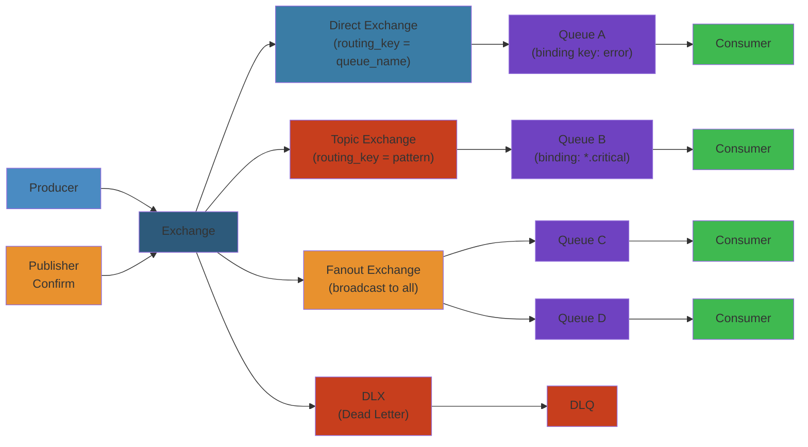

# 🐇 RabbitMQ — Complete Deep Dive

**Related**: [RabbitMQ Patterns](/10-messaging/rabbitmq/02-rabbitmq-patterns.md) · [RabbitMQ Docs](https://www.rabbitmq.com/documentation.html) · [AMQP 0-9-1](https://www.rabbitmq.com/amqp-0-9-1-reference.html)

---




## Table of Contents


- [Architecture Overview](#-architecture-overview)
- [Exchanges](#-exchanges)
- [Queues](#-queues)
- [Bindings & Routing Keys](#-bindings--routing-keys)
- [Producers & Consumers](#-producers--consumers)
- [Message Acknowledgments](#-message-acknowledgments)
- [Publisher Confirms](#-publisher-confirms)
- [Delivery Mode](#-delivery-mode)
- [Dead Letter Exchanges (DLX)](#-dead-letter-exchanges-dlx)
- [TTL (Message & Queue)](#-ttl-message--queue)
- [Queue Features](#-queue-features)
- [Advanced Queue Types](#-advanced-queue-types)
- [Clustering & High Availability](#-clustering--high-availability)
- [Federation & Shovel](#-federation--shovel)
- [Vhosts, Users, Permissions](#-vhosts-users-permissions)
- [Management & REST API](#-management--rest-api)
- [AMQP Protocol Details](#-amqp-protocol-details)
- [RabbitMQ vs Kafka](#-rabbitmq-vs-kafka)
- [Simplest Mental Model](#-simplest-mental-model)

---

## 🧭 Architecture Overview


```text
┌──────────────────────────────────────────────────────────────────┐
│                     RabbitMQ Architecture                         │
│                                                                   │
│  Producer                                                         │
│     │                                                             │
│     ▼                                                             │
│  ┌─────────────────────────────────────────────────────────┐     │
│  │              Exchange (Router)                          │     │
│  │  ┌──────┐  ┌────────┐  ┌────────┐  ┌──────────┐       │     │
│  │  │direct│  │ topic  │  │ fanout │  │ headers  │       │     │
│  │  └──────┘  └────────┘  └────────┘  └──────────┘       │     │
│  └──────────────────────┬──────────────────────────────────┘     │
│                         │  Bindings (routing key rules)           │
│                         ▼                                        │
│  ┌─────────────────────────────────────────────────────────┐     │
│  │      Queue ─── Queue ─── Queue (message buffers)        │     │
│  └──────────────────────┬──────────────────────────────────┘     │
│                         │                                        │
│                         ▼                                        │
│  ┌─────────────────────────────────────────────────────────┐     │
│  │                    Consumer(s)                          │     │
│  └─────────────────────────────────────────────────────────┘     │
│                                                                   │
│  Management: Port 15672 (UI) / 15671 (TLS)                       │
│  AMQP:       Port 5672  (plain)  / 5671 (TLS)                    │
└──────────────────────────────────────────────────────────────────┘
```

### Step-by-Step


1. **Producer connects** via AMQP and declares exchange (idempotent, survives reconnect)
2. **Producer publishes** message with routing_key to exchange (fire-and-forget by default)
3. **Exchange evaluates** bindings and decides which queues receive the message
4. **Queue stores** message in memory/disk based on queue durability and persistence settings
5. **Consumer subscribes** and pull/push receives messages from queue
6. **Acknowledgment** consumer sends back, queue removes message from memory

### Code Example


```python
# Python RabbitMQ producer-consumer
import pika
import json

# Producer setup
credentials = pika.PlainCredentials('guest', 'guest')
parameters = pika.ConnectionParameters('localhost', 5672, '/', credentials)
connection = pika.BlockingConnection(parameters)
channel = connection.channel()

# Declare exchange and queue
channel.exchange_declare(exchange='orders', exchange_type='topic', durable=True)
channel.queue_declare(queue='order_processing', durable=True)
channel.queue_bind(exchange='orders', queue='order_processing', routing_key='order.*')

# Publish message
message = json.dumps({'order_id': '123', 'amount': 99.99, 'timestamp': 1234567890})
channel.basic_publish(
    exchange='orders',
    routing_key='order.created',
    body=message,
    properties=pika.BasicProperties(
        delivery_mode=2,  # persistent
        content_type='application/json'
    )
)
print(f"Published: {message}")
connection.close()

# Consumer setup
connection = pika.BlockingConnection(parameters)
channel = connection.channel()
channel.basic_qos(prefetch_count=1)  # Process one message at a time

def callback(ch, method, properties, body):
    order = json.loads(body)
    print(f"Processing order {order['order_id']}")
    # Simulate processing
    try:
        # Business logic here
        print(f"Order processed successfully")
        ch.basic_ack(delivery_tag=method.delivery_tag)  # Acknowledge
    except Exception as e:
        print(f"Error: {e}")
        ch.basic_nack(delivery_tag=method.delivery_tag, requeue=True)  # Retry

channel.basic_consume(queue='order_processing', on_message_callback=callback)
print("Waiting for messages...")
channel.start_consuming()
```

### Real-World Scenario


Getty Images uses RabbitMQ for image processing workflows: uploads trigger messages to "image.uploaded" topic, routed to resize, watermark, and thumbnail queues via topic exchange. If thumbnail processing fails 3 times, the message moves to dead-letter exchange for manual review. During peak upload times (10K images/min), RabbitMQ queues buffer to ~500K messages while processing catches up—no data loss.

---

## 🧭 Exchanges


Exchanges are routing agents — they receive messages from producers and push them to queues based on rules (bindings).

```text
┌──────────────────────────────────────────────────────────────────┐
│  Exchange Type  │ Routing Logic              │ Use Case          │
├─────────────────┼───────────────────────────┼───────────────────┤
│  Direct         │ routing_key == binding_key │ Point-to-point    │
│  Topic          │ routing_key ~= pattern     │ Pub/sub with      │
│                 │ (# = multi *, * = one)     │ topic filtering   │
│  Fanout         │ Sends to ALL bound queues  │ Broadcast         │
│  Headers        │ Match on headers           │ Complex routing   │
│                 │ (x-match = all/any)        │                   │
└──────────────────────────────────────────────────────────────────┘
```

```python
# Direct exchange — exact match
channel.exchange_declare(exchange="direct_logs", exchange_type="direct")
channel.queue_bind(queue="errors", exchange="direct_logs", routing_key="error")

# Topic exchange — pattern matching
channel.exchange_declare(exchange="topics", exchange_type="topic")
# Routing patterns: "log.error", "log.*", "#.error", "log.#"
channel.queue_bind(queue="all_logs", exchange="topics", routing_key="#")
channel.queue_bind(queue="errors", exchange="topics", routing_key="*.error")

# Fanout exchange — broadcast to all queues
channel.exchange_declare(exchange="broadcast", exchange_type="fanout")
channel.queue_bind(queue="queue_a", exchange="broadcast")
channel.queue_bind(queue="queue_b", exchange="broadcast")

# Headers exchange — match on header values
channel.exchange_declare(exchange="headers_ex", exchange_type="headers")
args = {"x-match": "all", "format": "json", "type": "report"}
channel.queue_bind(queue="json_reports", exchange="headers_ex", arguments=args)
```

---

## 🧭 Queues


```python
# Declare queue (idempotent)
channel.queue_declare(queue="task_queue", durable=True)

# Exclusive queue — deleted when connection closes
channel.queue_declare(queue="temp", exclusive=True)

# Auto-delete queue — deleted when last consumer cancels
channel.queue_declare(queue="auto", auto_delete=True)

# Named vs unnamed (server-named)
result = channel.queue_declare(queue="", exclusive=True)
queue_name = result.method.queue  # "amq.gen-XXXXX"
```

---

## 🧭 Bindings & Routing Keys


```python
# Binding = rule connecting exchange → queue
channel.queue_bind(
    queue="my_queue",
    exchange="my_exchange",
    routing_key="my.key",
)

# Unbind
channel.queue_unbind(
    queue="my_queue",
    exchange="my_exchange",
    routing_key="my.key",
)

# Default exchange (nameless, direct)
# Every queue is automatically bound with its name as routing key
channel.basic_publish(exchange="", routing_key="my_queue", body=msg)
```

---

## 🧭 Producers & Consumers


```python
import pika

# Connection
connection = pika.BlockingConnection(
    pika.ConnectionParameters(host="localhost")
)
channel = connection.channel()

# Producer
channel.basic_publish(
    exchange="logs",
    routing_key="",
    body=b"Hello World!",
    properties=pika.BasicProperties(
        delivery_mode=pika.DeliveryMode.Persistent,
        content_type="application/json",
        headers={"source": "api"},
    ),
)

# Consumer
def callback(ch, method, properties, body):
    print(f"Received: {body}")
    ch.basic_ack(delivery_tag=method.delivery_tag)

channel.basic_consume(
    queue="task_queue",
    on_message_callback=callback,
    auto_ack=False,  # manual ack
)
channel.start_consuming()
```

---

## 🧭 Message Acknowledgments


```text
┌──────────────────────────────────────────────────────────────────┐
│  Ack Models                                                      │
│                                                                   │
│  Auto Ack:                                                        │
│  ┌──────────┐    msg    ┌──────────┐                              │
│  │  Broker   │─────────►│ Consumer │  ← immediately removed       │
│  └──────────┘          └──────────┘                               │
│                                                                   │
│  Manual Ack:                                                      │
│  ┌──────────┐    msg    ┌──────────┐                              │
│  │  Broker   │─────────►│ Consumer │                              │
│  │          │◄─────────│  ack()   │  ← removed on ack            │
│  └──────────┘          └──────────┘                               │
│                                                                   │
│  If consumer dies without ack → message re-queued                │
│  If nack(with requeue=true) → message re-queued                   │
│  If nack(with requeue=false) → message discarded or DLX'd        │
└──────────────────────────────────────────────────────────────────┘
```

```python
# Auto ack — fire and forget
channel.basic_consume(queue="q", on_message_callback=callback, auto_ack=True)

# Manual ack — safe processing
def callback(ch, method, properties, body):
    try:
        process(body)
        ch.basic_ack(delivery_tag=method.delivery_tag)
    except Exception:
        ch.basic_nack(delivery_tag=method.delivery_tag, requeue=False)

# Multiple ack — acknowledge up to delivery_tag
ch.basic_ack(delivery_tag=tag, multiple=True)  # ack all up to tag

# Reject (single message, cannot ack multiple)
ch.basic_reject(delivery_tag=method.delivery_tag, requeue=True)
```

---

## 🧭 Publisher Confirms


```text
┌──────────────────────────────────────────────────────────────────┐
│  Publisher Confirms = reliable producer (RabbitMQ's tx lite)     │
│                                                                   │
│  Producer         Broker                                          │
│     │               │                                             │
│     │─── publish ──►│                                             │
│     │               │── persist to disk                           │
│     │◄── ack(n) ───│  (or mirror to all replicas)                │
│     │               │                                             │
│     │─── publish ──►│                                             │
│     │◄── ack(n+1) ─│                                             │
│     │               │                                             │
│  Enables at-least-once delivery from producer side               │
└──────────────────────────────────────────────────────────────────┘
```

```python
# Enable publisher confirms
channel.confirm_delivery()

# Synchronous (blocks until confirmed)
try:
    channel.basic_publish(
        exchange="",
        routing_key="queue",
        body=msg,
        mandatory=True,
    )
except pika.exceptions.UnroutableError:
    print("Message not routed")

# Async — handle confirmations via callback
channel.add_on_confirm_callback(ack_callback)
channel.add_on_nack_callback(nack_callback)

# Batch confirms for throughput
channel._confirmations = {}
for i in range(100):
    channel.basic_publish(exchange="", routing_key="q", body=f"msg{i}")
channel.wait_for_confirms()  # blocks until all confirmed
```

---

## 🧭 Delivery Mode


```python
# Persistent — survive broker restart (written to disk)
properties=pika.BasicProperties(delivery_mode=2)

# Transient — not persisted
properties=pika.BasicProperties(delivery_mode=1)
```

```text
┌──────────────────────────────────────────────────────────────────┐
│  Persistent messages go through:                                 │
│  RAM → Disk cache → Disk (fsync)                                 │
│                                                                   │
│  Performance trade-off:                                           │
│  - Transient: ~2x faster, lost on crash                          │
│  - Persistent: slower, survives crash                            │
│  - Lazy queues: always on disk (even transient)                  │
└──────────────────────────────────────────────────────────────────┘
```

---

## 🧭 Dead Letter Exchanges (DLX)


```python
# Configure DLX on a queue
args = {
    "x-dead-letter-exchange": "dlx_exchange",
    "x-dead-letter-routing-key": "dlx_routing",
}
channel.queue_declare(queue="main_queue", arguments=args)

# DLQ — consume dead letters
channel.queue_declare(queue="dead_letter_queue")
channel.queue_bind(
    queue="dead_letter_queue",
    exchange="dlx_exchange",
    routing_key="dlx_routing",
)
```

### Causes of dead-lettering


```text
1. Message rejected with requeue=false (basic.reject / basic.nack)
2. Message TTL expires (per-message TTL)
3. Queue length limit exceeded (head drop)
4. Message expired from queue (per-queue TTL)
5. Message returned from a queue (via policy)

Original routing key preserved in header:
  x-death[0].routing-keys
  x-first-death-exchange
  x-first-death-reason
```

---

## 🧭 TTL (Message & Queue)


```python
# Per-queue TTL (messages expire after 60s)
args = {"x-message-ttl": 60000}
channel.queue_declare(queue="ttl_queue", arguments=args)

# Per-message TTL (overrides queue TTL if shorter)
properties = pika.BasicProperties(expiration="30000")
channel.basic_publish(
    exchange="", routing_key="ttl_queue",
    body=msg, properties=properties,
)

# Queue TTL (auto-delete queue after 10min of inactivity)
args = {"x-expires": 600000}
channel.queue_declare(queue="temp_queue", arguments=args)
```

---

## 🧭 Queue Features


```python
# Queue length limit (max 1000 messages)
args = {"x-max-length": 1000}
# Or max bytes
args = {"x-max-length-bytes": 10_000_000}

# Priority queues (0-255, higher = more priority)
args = {"x-max-priority": 10}
channel.queue_declare(queue="priority_q", arguments=args)

# Lazy queue — always on disk (RAM-friendly)
args = {"x-queue-mode": "lazy"}
channel.queue_declare(queue="lazy_q", arguments=args)

# Quorum queue — replicated consensus queue
# (declared via policy or with x-queue-type)
args = {"x-queue-type": "quorum"}
channel.queue_declare(queue="quorum_q", arguments=args)
```

---

## 🧭 Advanced Queue Types


```text
┌──────────────────────────────────────────────────────────────────┐
│  Queue Type  │  Replication  │  Ordering  │  Use Case            │
├──────────────┼───────────────┼────────────┼──────────────────────┤
│ Classic      │ Mirrored      │ Best-effort│ General purpose      │
│ Quorum       │ Raft (self)   │ Strict     │ Data safety          │
│ Stream       │ Replicated    │ Append     │ Large backlogs,      │
│              │ (Raft)        │ only       │ replay, tiered store │
│ Lazy         │ None          │ Best-effort│ Memory-constrained   │
└──────────────┴───────────────┴────────────┴──────────────────────┘
```

```python
# Streams (RabbitMQ 3.9+)
# Create via policy or arguments
args = {
    "x-queue-type": "stream",
    "x-max-length-bytes": 20_000_000_000,  # 20GB
    "x-stream-max-segment-size-bytes": 500_000_000,
}
channel.queue_declare(queue="stream_q", arguments=args)

# Stream consumption
channel.basic_consume(
    queue="stream_q",
    on_message_callback=callback,
    arguments={"x-stream-offset": "first"},  # or "last", "next", timestamp
)
```

---

## 🧭 Clustering & High Availability


```text
┌──────────────────────────────────────────────────────────────────┐
│  RabbitMQ Cluster                                                 │
│                                                                   │
│  ┌────────┐    ┌────────┐    ┌────────┐                          │
│  │ node 1 │◄──►│ node 2 │◄──►│ node 3 │                          │
│  │ (RAM)  │    │ (Disk) │    │ (Disk) │                          │
│  └───┬────┘    └───┬────┘    └───┬────┘                          │
│      │             │             │                                │
│      └─────────────┴─────────────┘                                │
│              Shared cookie auth                                    │
│                                                                   │
│  - At least one disk node required                                │
│  - Queues live on a single node unless mirrored/quorum            │
│  - Nodes can be added/removed dynamically                         │
│  - Cluster not LAN-aware without shovel/federation                │
└──────────────────────────────────────────────────────────────────┘
```

### Quorum Queues (Raft-based replication)


```text
┌──────────────────────────────────────────────────────────────────┐
│  Quorum Queue — Raft consensus                                    │
│                                                                   │
│  Write path:                                                      │
│  Leader ──► Majority replicas ──► Reply                          │
│                                                                   │
│  Minimum cluster: 3 nodes (tolerates 1 failure)                   │
│  Recommended: 3-5 nodes                                           │
│                                                                   │
│  Properties:                                                      │
│  - Strong consistency                                             │
│  - Safety under network partitions                                │
│  - FIFO within a leader term                                      │
│  - No mirrored queues needed (self-replicated)                    │
└──────────────────────────────────────────────────────────────────┘
```

### Mirrored Queues (classic, deprecated in 3.12)


```text
Declare with policy:
ha-mode: exactly
ha-params: 2
ha-sync-mode: automatic

⚠ Migrate to quorum queues for new deployments
```

---

## 🧭 Federation & Shovel


```text
┌──────────────────────────────────────────────────────────────────┐
│  Federation: pull-based forwarding between clusters (WAN)         │
│                                                                   │
│  ┌───────┐   pull   ┌───────┐                                    │
│  │ DC1   │◄─────────│ DC2   │  ← DC2 pulls from DC1              │
│  │(upstream)│       │(downstream)│                                │
│  └───────┘          └───────┘                                    │
│                                                                   │
│  Shovel: push-based, configured per queue/exchange                │
│                                                                   │
│  ┌───────┐   push   ┌───────┐                                    │
│  │ DC1   │─────────►│ DC2   │                                    │
│  │(source)│         │(dest) │                                    │
│  └───────┘          └───────┘                                    │
│                                                                   │
│  Federation use: selective exchange/queue forwarding              │
│  Shovel use:    reliable cross-cluster message transfer           │
└──────────────────────────────────────────────────────────────────┘
```

```bash
# Dynamic shovel (via plugin)
rabbitmqctl set_parameter shovel my_shovel \
  '{"src-protocol": "amqp091", "src-uri": "amqp://src", "src-queue": "q1",
    "dest-protocol": "amqp091", "dest-uri": "amqp://dest", "dest-queue": "q2"}'
```

---

## 🧭 Vhosts, Users, Permissions


```text
┌──────────────────────────────────────────────────────────────────┐
│  Virtual Hosts = logical namespace                                │
│  ┌─────────────────────────────────────────────────────────────┐  │
│  │  vhost: "/"         vhost: "production"  vhost: "staging"  │  │
│  │  ┌─────┐┌─────┐    ┌─────┐┌─────┐       ┌─────┐           │  │
│  │  │exch ││queue│    │exch ││queue│       │exch │           │  │
│  │  └─────┘└─────┘    └─────┘└─────┘       └─────┘           │  │
│  └─────────────────────────────────────────────────────────────┘  │
│                                                                   │
│  Permissions per vhost:                                           │
│  configure   (regex on resources)                                 │
│  write       (regex on resources)                                 │
│  read        (regex on resources)                                 │
└──────────────────────────────────────────────────────────────────┘
```

```bash
# User management
rabbitmqctl add_user admin securepass
rabbitmqctl set_user_tags admin administrator
rabbitmqctl delete_user guest

# Virtual hosts
rabbitmqctl add_vhost production
rabbitmqctl add_vhost staging

# Permissions: configure | write | read
rabbitmqctl set_permissions -p production admin ".*" ".*" ".*"

# Policies (applied to queues/exchanges matching pattern)
rabbitmqctl set_policy -p production ha-policy \
  ".*" '{"ha-mode":"exactly","ha-params":2}' --priority 1

rabbitmqctl set_policy -p production dlx-policy \
  ".*" '{"dead-letter-exchange":"dlx"}' --apply-to queues
```

---

## 🧭 Management & REST API


```bash
# Enable management plugin
rabbitmq-plugins enable rabbitmq_management

# Access UI at http://localhost:15672
# Default: guest/guest (local connections only)

# REST API (port 15672)
curl -u guest:guest http://localhost:15672/api/overview
curl -u guest:guest http://localhost:15672/api/queues
curl -u guest:guest http://localhost:15672/api/exchanges

# Create queue via REST
curl -u admin:pass -X PUT \
  http://localhost:15672/api/queues/%2F/my_queue \
  -H "Content-Type: application/json" \
  -d '{"durable":true,"arguments":{"x-message-ttl":60000}}'

# Monitoring endpoints
curl http://localhost:15672/api/connections
curl http://localhost:15672/api/channels
curl http://localhost:15672/api/nodes

# Health check
curl http://localhost:15672/api/health/checks/alarms
# Returns 200 if healthy
```

---

## 🧭 AMQP Protocol Details


```text
┌──────────────────────────────────────────────────────────────────┐
│  AMQP 0-9-1 Protocol Stack                                       │
│                                                                   │
│  ┌─────────────────────────────────────────────┐                  │
│  │  Connection (TCP, one per app)               │                 │
│  │  ├─ Channel 1 (lightweight, multiplexed)    │                  │
│  │  ├─ Channel 2                               │                  │
│  │  └─ Channel N                               │                  │
│  └─────────────────────────────────────────────┘                  │
│                                                                   │
│  Connection lifecycle:                                             │
│  connect → open channel → publish/consume → close channel         │
│  → close connection                                                │
│                                                                   │
│  Heartbeat: keep-alive (default 60s, configurable)                │
│  - Missing 2 heartbeats → connection closed                      │
│  - Prevents proxies from closing idle connections                 │
└──────────────────────────────────────────────────────────────────┘
```

### QoS — Prefetch Count


```python
# Prefetch — how many unacknowledged messages a consumer can have
# Fair dispatch: limit prefetch to 1 for round-robin
channel.basic_qos(prefetch_count=1)

# Global prefetch (all consumers on channel)
channel.basic_qos(prefetch_count=10, global_qos=True)
```

```text
┌──────────────────────────────────────────────────────────────────┐
│  Prefetch Count Effect                                           │
│                                                                   │
│  prefetch=0: unlimited (default, may cause unfair dispatch)       │
│  prefetch=1: one at a time (fair round-robin)                    │
│  prefetch=N: process N concurrently                              │
│                                                                   │
│  For long-running tasks: prefetch=1                              │
│  For fast tasks with batch: prefetch=10-100                      │
└──────────────────────────────────────────────────────────────────┘
```

---

## 🧭 RabbitMQ vs Kafka


```text
┌──────────────────────────────────────────────────────────────────────────┐
│  Feature          │ RabbitMQ                 │ Kafka                    │
├───────────────────┼──────────────────────────┼──────────────────────────┤
│ Model             │ Smart broker,            │ Dumb broker,             │
│                   │ dumb consumer            │ smart consumer           │
│ Protocol          │ AMQP, MQTT, STOMP        │ Custom binary (TCP)      │
│ Message routing   │ Complex (direct, topic,  │ Topic-based (partition   │
│                   │ fanout, headers)         │ key → partition)         │
│ Ordering          │ Per queue (FIFO)         │ Per partition (FIFO)     │
│ Throughput        │ ~10K-50K msg/s           │ ~100K-1M+ msg/s         │
│ Retention         │ Remove on ack            │ Configurable retention   │
│                   │                          │ (time/size)              │
│ Replay            │ No (except streams)      │ Yes (offset seek)       │
│ Consumer groups   │ No native                │ Yes (native)            │
│ Latency           │ Sub-millisecond          │ Few ms                  │
│ Message size      │ ~128MB max               │ ~1MB default,           │
│                   │                          │   configurable           │
│ Operations        │ Push-based               │ Pull-based              │
│ Use case          │ Task queues, RPC,        │ Event sourcing, log     │
│                   │ request/reply            │ aggregation, streaming  │
└───────────────────┴──────────────────────────┴──────────────────────────┘
```

---

## 🧭 Simplest Mental Model


```text
RabbitMQ = POST OFFICE with smart sorting:

┌──────────────────────────────────────────────────────────────────┐
│  Producer = You writing a letter                                 │
│  Exchange = Sorting room (decides where mail goes)               │
│  Binding  = Sorting rule ("fragile → special box")               │
│  Queue    = Mailbox (holds letters until pickup)                 │
│  Consumer = Person checking their mailbox                        │
│  Ack      = "Got it, you can delete it now"                     │
│  DLX      = Return to sender / dead letter office               │
│  TTL      = "Discard if not picked up by Friday"                │
│                                                                    │
│  RabbitMQ = exchange + queue + binding => flexible routing        │
│  Kafka    = partitioned log => high-throughput replay             │
│                                                                    │
│  Use RabbitMQ when you need:                                     │
│    ✓ Complex routing                                              │
│    ✓ Task distribution                                            │
│    ✓ Request/reply                                                │
│    ✓ Low latency                                                  │
│  Use Kafka when you need:                                        │
│    ✓ High throughput                                              │
│    ✓ Event replay                                                 │
│    ✓ Long-term retention                                          │
└──────────────────────────────────────────────────────────────────┘
```


## Practical Example


See code examples above for practical usage patterns.