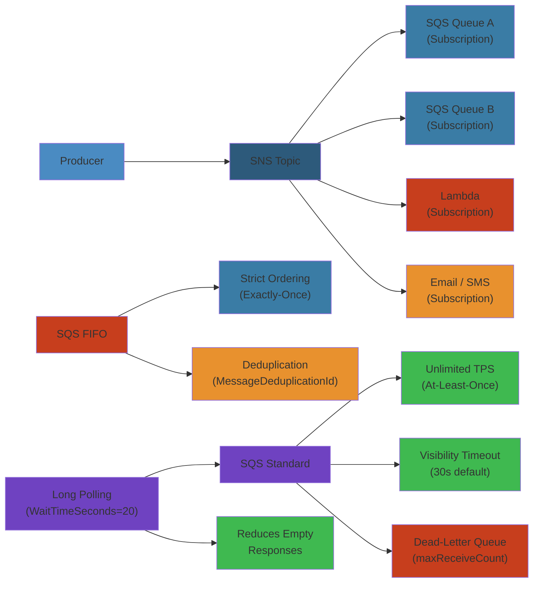
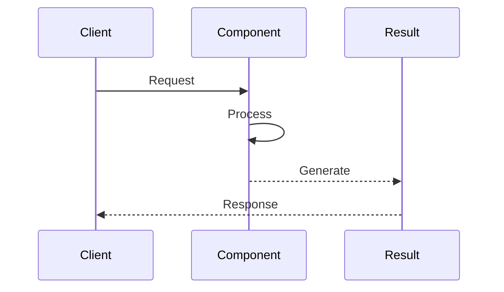

# ☁️ SNS & SQS — Complete Deep Dive

> Comprehensive reference for Amazon SQS and SNS — every major concept, feature, and integration pattern.




## 📑 Table of Contents

- [1. Core Concepts](#1-core-concepts)
- [2. SQS — Standard vs FIFO](#2-sqs--standard-vs-fifo)
- [3. Visibility Timeout](#3-visibility-timeout)
- [4. Dead-Letter Queues](#4-dead-letter-queues)
- [5. Delay Queues & Message Timers](#5-delay-queues--message-timers)
- [6. Large Messages via S3](#6-large-messages-via-s3)
- [7. Short Polling vs Long Polling](#7-short-polling-vs-long-polling)
- [8. Batch Operations & Throughput](#8-batch-operations--throughput)
- [9. FIFO Deduplication & Exactly-Once](#9-fifo-deduplication--exactly-once)
- [10. Consumer Patterns](#10-consumer-patterns)
- [11. SQS Extended Client Library](#11-sqs-extended-client-library)
- [12. SNS — Topics & Subscriptions](#12-sns--topics--subscriptions)
- [13. SNS — Message Filtering](#13-sns--message-filtering)
- [14. SNS — Fan-Out & Durability](#14-sns--fan-out--durability)
- [15. SNS — Delivery Policies & DLQ](#15-sns--delivery-policies--dlq)
- [16. SNS — FIFO Topics](#16-sns--fifo-topics)
- [17. Combined — Fan-Out to SQS](#17-combined--fan-out-to-sqs)
- [18. Combined — SNS+SQS Pub/Sub](#18-combined--snssqs-pubsub)
- [19. Combined — S3 → SNS → SQS](#19-combined--s3--sns--sqs)
- [20. Simplest Mental Model](#20-simplest-mental-model)

---

## 1. Core Concepts



| Aspect | SQS | SNS |
|--------|-----|-----|
| Model | Queue (pull) | Topic (push) |
| Retention | 1 min – 14 days | None |
| Persistence | Durable | Transient |
| Ordering | FIFO only | FIFO only |
| Throughput | Standard: unlimited | Regional limits |

---

## 2. SQS — Standard vs FIFO

```text
┌─────────────────────────┐  ┌────────────────────────┐
│      Standard           │  │        FIFO            │
│  • Best-effort order    │  │  • Strict order        │
│  • At-least-once        │  │  • Exactly-once        │
│  • Unlimited TPS        │  │  • 300 TPS (3000 batch)│
│  • May duplicate        │  │  • No duplicates       │
└─────────────────────────┘  └────────────────────────┘
```

**Standard**: Unlimited throughput, best-effort ordering, at-least-once, occasional duplicates. Use for decoupling, buffering spikes, background jobs.

**FIFO**: 300 TPS (3000 batch), strict ordering, exactly-once. Name must end `.fifo`. Use for banking, orders.

```python
sqs.create_queue(QueueName='my-queue')
sqs.create_queue(QueueName='my-queue.fifo', Attributes={'FifoQueue': 'true', 'ContentBasedDeduplication': 'true'})
```

---

## 3. Visibility Timeout

```text
Poll → msg received → timeout starts → process → delete
                                    fail → msg reappears for other consumers
```

**Default**: 30s. **Range**: 0s–12h. **Heartbeat**: `change_message_visibility` extends timeout.

```python
response = sqs.receive_message(QueueUrl=url, VisibilityTimeout=60, MaxNumberOfMessages=10)
for msg in response.get('Messages', []):
    sqs.change_message_visibility(QueueUrl=url, ReceiptHandle=msg['ReceiptHandle'], VisibilityTimeout=60)
    process(msg['Body'])
    sqs.delete_message(QueueUrl=url, ReceiptHandle=msg['ReceiptHandle'])
```

**Rule**: Set to 6× expected processing time. Too short → duplicates. Too long → slow recovery.

---

## 4. Dead-Letter Queues

```text
Source → consumer fails → retry × N → DLQ → investigate → redrive
```

**maxReceiveCount**: Messages move to DLQ after N receives. Type must match source.

```python
dlq = sqs.create_queue(QueueName='my-dlq')
dlq_arn = sqs.get_queue_attributes(QueueUrl=dlq['QueueUrl'], AttributeNames=['QueueArn'])['Attributes']['QueueArn']
sqs.create_queue(QueueName='source', Attributes={
    'RedrivePolicy': json.dumps({'deadLetterTargetArn': dlq_arn, 'maxReceiveCount': 5})
})
```

**Redrive**: `sqs.start_message_move_task(SourceArn=dlq_arn)` returns messages after fix.

---

## 5. Delay Queues & Message Timers

- **Queue-level DelaySeconds**: 0–900s (all messages delayed)
- **Per-message delay**: 0–900s (Standard only)
- **FIFO**: Queue-level only

```python
sqs.create_queue(QueueName='delayed', Attributes={'DelaySeconds': '60'})
sqs.send_message(QueueUrl=url, MessageBody='slow-task', DelaySeconds=120)
```

---

## 6. Large Messages via S3

**256 KB limit**. Larger messages use S3: upload payload → send S3 pointer in SQS → consumer fetches.

```python
if len(json.dumps(body)) > 256 * 1024:
    key = f"sqs-msg/{uuid4()}.json"
    s3.put_object(Bucket='bucket', Key=key, Body=json.dumps(body))
    sqs.send_message(QueueUrl=url, MessageBody=json.dumps({'s3Bucket': 'bucket', 's3Key': key}))
else:
    sqs.send_message(QueueUrl=url, MessageBody=json.dumps(body))
```

---

## 7. Short Polling vs Long Polling

| Feature | Short Polling | Long Polling |
|---------|--------------|--------------|
| WaitTimeSeconds | 0 | 1–20 |
| Empty responses | Common | Rare |
| Cost | Higher | ~70% less |

**Always use long polling**.

```python
sqs.receive_message(QueueUrl=url, WaitTimeSeconds=20, MaxNumberOfMessages=10)
sqs.set_queue_attributes(QueueUrl=url, Attributes={'ReceiveMessageWaitTimeSeconds': '20'})
```

---

## 8. Batch Operations & Throughput

- **SendMessageBatch**: 10 msgs max, 256 KB total
- **DeleteMessageBatch**: 10 max

| Queue Type | Base TPS | With Batching (10) |
|------------|----------|-------------------|
| Standard | Unlimited | Unlimited |
| FIFO send | 300 msg/s | 3,000 msg/s |

```python
sqs.send_message_batch(QueueUrl=url, Entries=[
    {'Id': '1', 'MessageBody': '{"a":1}', 'MessageGroupId': 'g1', 'MessageDeduplicationId': str(uuid4())},
    {'Id': '2', 'MessageBody': '{"a":2}', 'MessageGroupId': 'g1', 'MessageDeduplicationId': str(uuid4())},
])
```

---

## 9. FIFO Deduplication & Exactly-Once

```text
Content-Based: SHA-256(body) → Dedup ID
Explicit:      User provides MessageDeduplicationId
Window: 5 minutes within same MessageGroupId
```

```python
sqs.create_queue(QueueName='orders.fifo', Attributes={'FifoQueue': 'true', 'ContentBasedDeduplication': 'true'})
sqs.send_message(QueueUrl=url, MessageBody=json.dumps({'id': '123'}), MessageGroupId='orders', MessageDeduplicationId='order-123-v1')
```

---

## 10. Consumer Patterns

```text
SQS ◄── poll ── Worker (EC2/ECS) ──► process + delete
SQS ────────── Lambda event source mapping
```

**Lambda trigger**:
```python
def lambda_handler(event, context):
    failures = []
    for record in event['Records']:
        try:
            process_message(record['body'])
        except Exception:
            failures.append({'itemIdentifier': record['messageId']})
    return {'batchItemFailures': failures}
```

**Best Practices**: Heartbeat via `change_message_visibility`, graceful shutdown.

---

## 11. SQS Extended Client Library

Java/.NET SDK extension. Transparently offloads > 256 KB to S3.

```java
ExtendedSqsClient extendedClient = new ExtendedSqsClient.Builder()
    .sqsClient(sqsClient).s3Client(s3Client).payloadBucket("my-large-msgs").build();
extendedClient.sendMessage(SendMessageRequest.builder().queueUrl(url).messageBody(largePayload).build());
```

Python: manual S3 pointer pattern.

---

## 12. SNS — Topics & Subscriptions

```text
              ┌─────────┐
              │  Topic  │
              └────┬────┘
     ┌─────────────┼─────────────┐
     │       │         │         │
   SQS    Lambda    HTTP     Email/Firehose
```

**Protocols**: SQS (durable), Lambda (serverless), HTTP/HTTPS (webhooks), Email, SMS, Platform, Firehose.

```python
topic = sns.create_topic(Name='order-events')
sns.subscribe(TopicArn=topic['TopicArn'], Protocol='sqs', Endpoint='arn:aws:sqs:...:queue')
sns.subscribe(TopicArn=topic['TopicArn'], Protocol='lambda', Endpoint='arn:aws:lambda:...:func')
```

**HTTP**: Must confirm subscription within 3 days via `SubscribeURL`.

---

## 13. SNS — Message Filtering

**Attribute-based**: SNS evaluates `MessageAttributes` against `FilterPolicy` on each subscription.

```python
sns.set_subscription_attributes(SubscriptionArn=sub_arn, AttributeName='FilterPolicy',
    AttributeValue=json.dumps({'event': ['order_placed'], 'priority': ['high']}))
sns.set_subscription_attributes(SubscriptionArn=sub_arn, AttributeName='FilterPolicy',
    AttributeValue=json.dumps({'event_type': [{'numeric': ['>', 100]}]}))
```

Publisher sends attributes:
```python
sns.publish(TopicArn=topic_arn, Message=json.dumps({'id': '123'}),
    MessageAttributes={'event': {'DataType': 'String', 'StringValue': 'order_placed'}})
```

---

## 14. SNS — Fan-Out & Durability

```text
Producer → SNS Topic ─┬─→ SQS A (audit)
                       ├─→ SQS B (process)
                       ├─→ Lambda (cache)
                       └─→ HTTP (notify)
```

**Durability**: SNS replicates across AZs. SQS: 14-day retention. HTTP: 23 retries. Lambda: 3 retries.

---

## 15. SNS — Delivery Policies & DLQ

```python
# Delivery policy (HTTP retry behavior)
sns.set_subscription_attributes(SubscriptionArn=sub_arn, AttributeName='DeliveryPolicy',
    AttributeValue=json.dumps({'minDelayTarget': 1, 'maxDelayTarget': 300, 'numRetries': 10}))

# DLQ for failed deliveries
sns.set_subscription_attributes(SubscriptionArn=sub_arn, AttributeName='RedrivePolicy',
    AttributeValue=json.dumps({'deadLetterTargetArn': 'arn:aws:sqs:...:sns-dlq'}))

# Raw message delivery (strip SNS envelope for SQS)
sns.set_subscription_attributes(SubscriptionArn=sub_arn, AttributeName='RawMessageDelivery', AttributeValue='true')
```

---

## 16. SNS — FIFO Topics

Topic name `.fifo`. Subscribers: SQS FIFO only. Ordering per `MessageGroupId`.

```python
fifo_topic = sns.create_topic(Name='orders.fifo', Attributes={'FifoTopic': 'true', 'ContentBasedDeduplication': 'true'})
sns.publish(TopicArn=fifo_topic['TopicArn'], Message=json.dumps({'order_id': '123'}),
    MessageGroupId='123', MessageDeduplicationId='dedup-1712345678')
```

**Limits**: 300 TPS (3000 batch) • SQS FIFO only • 5-min dedup window

---

## 17. Combined — Fan-Out to SQS

```python
sqs.set_queue_attributes(QueueUrl=queue_url, Attributes={'Policy': json.dumps({
    'Version': '2012-10-17',
    'Statement': [{'Effect': 'Allow', 'Principal': {'Service': 'sns.amazonaws.com'},
        'Action': 'sqs:SendMessage', 'Resource': queue_arn,
        'Condition': {'ArnEquals': {'aws:SourceArn': topic_arn}}}]
})})
sub = sns.subscribe(TopicArn=topic_arn, Protocol='sqs', Endpoint=queue_arn)
sns.set_subscription_attributes(SubscriptionArn=sub['SubscriptionArn'], AttributeName='FilterPolicy',
    AttributeValue=json.dumps({'event': ['order_placed']}))
```

---

## 18. Combined — SNS+SQS Pub/Sub

```text
┌──────────┐   ┌──────────┐   ┌──────────┐
│Publisher │   │Publisher │   │Publisher │
│Service A │   │Service B │   │Service C │
└─────┬────┘   └─────┬────┘   └────┬─────┘
      │              │              │
      └──────────────┼──────────────┘
                     ▼
              ┌──────────────┐
              │   SNS Topic  │
              └──────┬───────┘
          ┌──────────┴──────────┐
          ▼                     ▼
   ┌────────────┐         ┌────────────┐
   │ SQS Alpha  │         │ SQS Beta   │
   └──────┬─────┘         └──────┬─────┘
          ▼                      ▼
   Consumer A1/A2          Consumer B1/B2
```

**Benefits**: Decoupled publishers. Each team owns their queue.

---

## 19. Combined — S3 → SNS → SQS

```text
S3 Upload → S3 Event → SNS Topic → SQS Queue → Consumer
```

```python
s3.put_bucket_notification_configuration(Bucket='source', NotificationConfiguration={
    'TopicConfigurations': [{'TopicArn': topic_arn, 'Events': ['s3:ObjectCreated:*'],
        'Filter': {'Key': {'FilterRules': [{'Name': 'prefix', 'Value': 'uploads/'}]}}}]
})
```

---

## 20. Simplest Mental Model

```text
┌───────────────────────────────────────────────────────────┐
│                   SIMPLEST MENTAL MODEL                    │
│                                                           │
│   ┌──────────────────┐    ┌──────────────────┐           │
│   │        📬        │    │        📦        │           │
│   │  SNS = Mailroom  │    │  SQS = PO Box    │           │
│   │  Push to all     │    │  Pull when ready │           │
│   └──────────────────┘    └──────────────────┘           │
│                                                           │
│   SNS + SQS = Mailroom delivers to each PO Box           │
│                                                           │
│   Standard = Best-effort order, may duplicate            │
│   FIFO     = Strict order, no duplicates, slower          │
│   DLQ      = Return to sender after N failed tries        │
│   Long poll = Wait at mailbox for mail to arrive          │
└───────────────────────────────────────────────────────────┘
```

**Key Numbers**: Max msg 256KB • Retention 14d • VisTimeout 12h • FIFO 300 TPS (3000 batch) • Poll 20s • Delay 900s • Batch 10


## Practical Example

See code examples above for practical usage patterns.