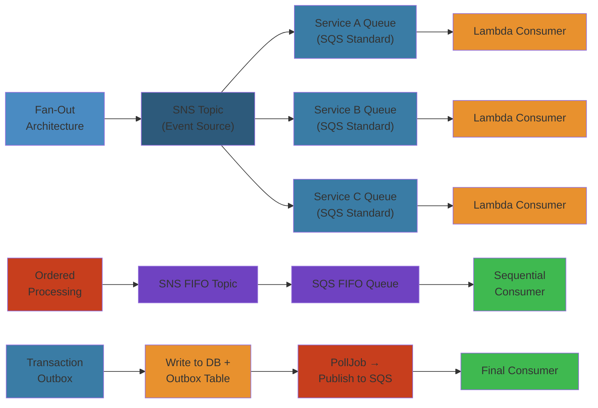

# ☁️ SNS & SQS Production Patterns — Complete Deep Dive

> Battle-tested patterns for reliable, scalable, cost-effective messaging with SNS and SQS in production.




## 📑 Table of Contents

#### Step-by-Step
1. Process input
2. Validate
3. Execute
4. Return result

#### Code Example
```python
# Example implementation
pass
```

#### Real-World Scenario
This pattern is commonly used in production systems.


- [1. Fan-Out Architecture](#1-fan-out-architecture)
- [2. Ordered Processing with FIFO](#2-ordered-processing-with-fifo)
- [3. Exactly-Once Processing](#3-exactly-once-processing)
- [4. SQS as Buffered Lambda Consumer](#4-sqs-as-buffered-lambda-consumer)
- [5. Batch Lambda Processing](#5-batch-lambda-processing)
- [6. SNS & CloudWatch Alarms](#6-sns--cloudwatch-alarms)
- [7. Cross-Region SNS](#7-cross-region-sns)
- [8. Transaction Outbox to SQS](#8-transaction-outbox-to-sqs)
- [9. SQS Poison Pill Handling](#9-sqs-poison-pill-handling)
- [10. Cost Optimization](#10-cost-optimization)
- [11. SQS+SNS vs Kafka Decision Guide](#11-sqssns-vs-kafka-decision-guide)
- [12. Idempotent Consumers](#12-idempotent-consumers)
- [13. SNS Message Archiving](#13-sns-message-archiving)
- [14. Simplest Mental Model](#14-simplest-mental-model)

---
## 1. Fan-Out Architecture

#### Step-by-Step
1. Process input
2. Validate
3. Execute
4. Return result

#### Code Example
```python
# Example implementation
pass
```

#### Real-World Scenario
This pattern is commonly used in production systems.

```text
Producer → SNS Topic ─┬─→ SQS Orders → Lambda: Process
                       ├─→ SQS Audit → S3 Archive
                       ├─→ SQS Analytics → Firehose → S3
                       └─→ Lambda: Cache update
```
Single event triggers multiple independent workflows. Each team owns their queue.
**Checklist**: Each SQS has own DLQ • Raw message delivery on • Filter policies • CloudWatch on queue depth
```python
sns.set_subscription_attributes(SubscriptionArn='...', AttributeName='RawMessageDelivery', AttributeValue='true')
```
---
## 2. Ordered Processing with FIFO

#### Step-by-Step
1. Process input
2. Validate
3. Execute
4. Return result

#### Code Example
```python
# Example implementation
pass
```

#### Real-World Scenario
This pattern is commonly used in production systems.

```text
Producer → SNS FIFO Topic → SQS FIFO → Lambda Processor
group=123    orders.fifo    orders.fifo
```
Ordering per MessageGroupId. Groups process in parallel.
**Limits**: SNS FIFO → SQS FIFO only • 300 TPS (3000 batch) • 5-min dedup window
```python
sns.publish(TopicArn='arn:...:orders.fifo', Message=json.dumps({'order_id': '123'}),
    MessageGroupId='123', MessageDeduplicationId=f"placed-{uuid.uuid4()}")
```
---
## 3. Exactly-Once Processing

#### Step-by-Step
1. Process input
2. Validate
3. Execute
4. Return result

#### Code Example
```python
# Example implementation
pass
```

#### Real-World Scenario
This pattern is commonly used in production systems.

```text
SQS FIFO → Receive → check DynamoDB idempotency key
                        ├── Exists → skip (delete)
                        └── Not exists → process + store → delete msg
```
```python
try:
    dynamodb.put_item(TableName='idempotency', Item={'pk': {'S': f'MSG#{dedup_id}'},
        'ttl': {'N': str(int(time.time()) + 86400)}}, ConditionExpression='attribute_not_exists(pk)')
except ClientError:
    return {'status': 'duplicate'}
```
**Key sources**: Webhook → pi_id + event_type • Order → order_id + version • Outbox → UUID
---
## 4. SQS as Buffered Lambda Consumer

#### Step-by-Step
1. Process input
2. Validate
3. Execute
4. Return result

#### Code Example
```python
# Example implementation
pass
```

#### Real-World Scenario
This pattern is commonly used in production systems.

```text
Traffic spike → SQS (buffer millions) → Lambda (auto-scale)
```
SQS absorbs spikes. Lambda scales with queue depth. Auto-retry. No data loss.
```yaml
OrderProcessor:
  Type: AWS::Serverless::Function
  Properties:
    Events:
      SQSEvent:
        Type: SQS
        Properties:
          Queue: !GetAtt OrdersQueue.Arn
          BatchSize: 10
          MaximumBatchingWindowInSeconds: 5
    ReservedConcurrentExecutions: 50
```
---
## 5. Batch Lambda Processing

#### Step-by-Step
1. Process input
2. Validate
3. Execute
4. Return result

#### Code Example
```python
# Example implementation
pass
```

#### Real-World Scenario
This pattern is commonly used in production systems.

```python
def lambda_handler(event, context):
    failures = []
    for record in event['Records']:
        try:
            payload = json.loads(record['body'])
            if 'Message' in payload: payload = json.loads(payload['Message'])
            process_record(payload)
        except Exception:
            failures.append({'itemIdentifier': record['messageId']})
    return {'batchItemFailures': failures}
```
Use ReportBatchItemFailures to avoid reprocessing successful items.
---
## 6. SNS & CloudWatch Alarms

#### Step-by-Step
1. Process input
2. Validate
3. Execute
4. Return result

#### Code Example
```python
# Example implementation
pass
```

#### Real-World Scenario
This pattern is commonly used in production systems.

```python
cloudwatch.put_metric_alarm(AlarmName='orders-queue-oldest',
    MetricName='ApproximateAgeOfOldestMessage', Namespace='AWS/SQS',
    Dimensions=[{'Name': 'QueueName', 'Value': 'orders'}],
    Statistic='Maximum', Period=300, EvaluationPeriods=2, Threshold=300,
    ComparisonOperator='GreaterThanThreshold',
    AlarmActions=['arn:aws:sns:...:ops-alerts'])
```
| Metric | Threshold | Meaning |
|--------|-----------|---------|
| ApproximateAgeOfOldestMessage | > 5 min | Consumer stuck |
| NumberOfMessagesReceived | Drop > 50% | Producer issue |
| DLQ ApproximateNumberOfMessages | > 0 | Investigate failures |
---
## 7. Cross-Region SNS

#### Step-by-Step
1. Process input
2. Validate
3. Execute
4. Return result

#### Code Example
```python
# Example implementation
pass
```

#### Real-World Scenario
This pattern is commonly used in production systems.

```text
us-east-1                        eu-west-1
SNS Topic ──────────────────────► SQS Queue
```
Target SQS needs policy allowing source SNS. Data transfer costs apply.
```python
sqs.set_queue_attributes(QueueUrl=eu_url, Attributes={'Policy': json.dumps({
    'Statement': [{'Effect': 'Allow', 'Principal': {'Service': 'sns.amazonaws.com'},
        'Action': 'sqs:SendMessage', 'Resource': eu_arn,
        'Condition': {'ArnEquals': {'aws:SourceArn': us_topic_arn}}}]})})
sns.subscribe(TopicArn=us_topic_arn, Protocol='sqs', Endpoint=eu_arn)
```
---
## 8. Transaction Outbox to SQS

#### Step-by-Step
1. Process input
2. Validate
3. Execute
4. Return result

#### Code Example
```python
# Example implementation
pass
```

#### Real-World Scenario
This pattern is commonly used in production systems.

```text
Service → DB TX ─┬─→ Business table
                  └─→ Outbox table (same TX) → Poller → SQS → Consumer
```
If DB write succeeds, message is guaranteed sent.
```sql
BEGIN;
    INSERT INTO orders (id, customer_id, total) VALUES ('123', '456', 99.99);
    INSERT INTO outbox (aggregate_type, aggregate_id, event_type, payload)
    VALUES ('order', '123', 'order_placed', '{"order_id":"123"}');
COMMIT;
```
**Poller**: Lambda reads outbox WHERE processed_at IS NULL, sends to SQS, marks processed.
---
## 9. SQS Poison Pill Handling

#### Step-by-Step
1. Process input
2. Validate
3. Execute
4. Return result

#### Code Example
```python
# Example implementation
pass
```

#### Real-World Scenario
This pattern is commonly used in production systems.

```text
Source → receive → consumer fails → retry × N → DLQ → fix → redrive
```
Non-retriable errors → delete immediately.
```python
def consumer(event, context):
    for record in event['Records']:
        try:
            process(record['body'])
        except ValueError:
            continue
        except Exception:
            if int(record['attributes']['ApproximateReceiveCount']) >= 5:
                log_poison(record); continue
            raise
```
**Redrive**: sqs.start_message_move_task(SourceArn=dlq_arn)
---
## 10. Cost Optimization

#### Step-by-Step
1. Process input
2. Validate
3. Execute
4. Return result

#### Code Example
```python
# Example implementation
pass
```

#### Real-World Scenario
This pattern is commonly used in production systems.

| Strategy | Savings | Trade-off |
|----------|---------|-----------|
| Long poll (20s) | ~70% | +20s latency |
| Batch (10 msgs) | ~90% | None |
| Raw delivery | Varies | None |
**Checklist**: Long polling • Max batch size • Lambda window • Raw delivery • Compress • Filter • Delete unused • Short retention
```python
sqs.create_queue(QueueName='optimized', Attributes={
    'ReceiveMessageWaitTimeSeconds': '20', 'VisibilityTimeout': '120', 'MessageRetentionPeriod': '86400'})
```
---
## 11. SQS+SNS vs Kafka Decision Guide

#### Step-by-Step
1. Process input
2. Validate
3. Execute
4. Return result

#### Code Example
```python
# Example implementation
pass
```

#### Real-World Scenario
This pattern is commonly used in production systems.

| Criteria | SQS+SNS | Kafka (MSK) |
|----------|---------|-------------|
| Ops overhead | Zero | Significant |
| Throughput | ≤ 10K msg/s | 100K+ msg/s |
| Retention | ≤ 14 days | Configurable |
| Ordering | Per-group FIFO | Per-partition |
| Replay | No | Yes |
| Integration | Deep AWS | Open ecosystem |
**Decision**: Need > 10K TPS, replay, or > 14 day retention? → **Kafka**. Otherwise → **SQS+SNS**.
---
## 12. Idempotent Consumers

#### Step-by-Step
1. Process input
2. Validate
3. Execute
4. Return result

#### Code Example
```python
# Example implementation
pass
```

#### Real-World Scenario
This pattern is commonly used in production systems.

```python
def process_idempotent(record):
    dedup_id = record['messageId']
    try:
        dynamodb.put_item(TableName='idempotency', Item={'pk': {'S': f"MSG#{dedup_id}"},
            'ttl': {'N': str(int(time.time()) + 86400)}}, ConditionExpression='attribute_not_exists(pk)')
    except ClientError:
        return {'status': 'duplicate'}
    try:
        return process_payment(json.loads(record['body']))
    except Exception:
        dynamodb.delete_item(TableName='idempotency', Key={'pk': {'S': f"MSG#{dedup_id}"}})
        raise
```
**Key sources**: Payment webhook → pi_id + event_type • Order → order_id + version • FIFO → MessageDeduplicationId
---
## 13. SNS Message Archiving

#### Step-by-Step
1. Process input
2. Validate
3. Execute
4. Return result

#### Code Example
```python
# Example implementation
pass
```

#### Real-World Scenario
This pattern is commonly used in production systems.

```text
Producer → SNS Topic ─┬─→ SQS (processing)
                       └─→ Lambda Archiver → S3 (partitioned by date)
```
```python
def archive_lambda(event, context):
    for record in event['Records']:
        dt = datetime.fromisoformat(record['Sns']['Timestamp'].replace('Z', '+00:00'))
        key = f"archives/year={dt.year}/month={dt.month}/day={dt.day}/{record['Sns']['MessageId']}.json"
        s3.put_object(Bucket='event-archive', Key=key, Body=json.dumps(json.loads(record['Sns']['Message'])))
```
**Alternative**: Subscribe Firehose to SNS for zero-code S3 archiving.
---
## 14. Simplest Mental Model

#### Step-by-Step
1. Process input
2. Validate
3. Execute
4. Return result

#### Code Example
```python
# Example implementation
pass
```

#### Real-World Scenario
This pattern is commonly used in production systems.

```text
┌───────────────────────────────────────────────────────────┐
│                   SIMPLEST MENTAL MODEL                    │
│   ┌─────────────────┐              ┌─────────────────┐   │
│   │ Post Office SNS │    push      │  PO Box SQS     │   │
│   │ Copies to all   │─────────────►│ Holds for pickup│   │
│   │ Broadcast, push │              │ Pull, durable   │   │
│   └─────────────────┘              └─────────────────┘   │
│                                                           │
│   Fan-out = Send one, many receive                        │
│   FIFO = Numbered letters in order                        │
│   DLQ = Return to sender after N tries                    │
│   Poison pill = Broken letter → dead letter               │
│   Exactly-once = Check "done this?" before processing     │
│                                                           │
│   Three Golden Rules:                                     │
│   1. Always use DLQs (they save you at 3 AM)             │
│   2. Always use long polling (save money)                │
│   3. Always build idempotent consumers (save data)        │
└───────────────────────────────────────────────────────────┘
```
**One Sentence**: Use SQS as buffer; use SNS to broadcast; combine for resilient pub/sub with per-consumer buffering.
**Production Settings**: VisTimeout = 6× processing time • Poll = 20s • DLQ maxReceiveCount = 5 • Batch size = 5-10 • Window = 5-30s • Filter at source • Raw delivery on • Shortest retention


---

## Code Examples

#### Step-by-Step
1. Process input
2. Validate
3. Execute
4. Return result

#### Code Example
```python
# Example implementation
pass
```

#### Real-World Scenario
This pattern is commonly used in production systems.


```python
import boto3
import json
import time
import uuid

sqs = boto3.client('sqs')
sns = boto3.client('sns')
dynamodb = boto3.resource('dynamodb')

# Publish with SNS FIFO ordering
def publish_order_event(order_id: str, event_type: str, payload: dict):
    sns.publish(
        TopicArn='arn:aws:sns:us-east-1:123456789012:orders.fifo',
        Message=json.dumps({'order_id': order_id, **payload}),
        MessageGroupId=order_id,
        MessageDeduplicationId=f"{event_type}-{uuid.uuid4()}"
    )

# SQS consumer with batch failures and idempotency
def lambda_handler(event, context):
    idempotency_table = dynamodb.Table('idempotency')
    failures = []
    for record in event['Records']:
        dedup_id = record['messageId']
        # Idempotency check
        try:
            idempotency_table.put_item(
                Item={'pk': f"MSG#{dedup_id}", 'ttl': int(time.time()) + 86400},
                ConditionExpression='attribute_not_exists(pk)'
            )
        except ClientError:
            continue  # duplicate — skip
        try:
            body = json.loads(record['body'])
            if 'Message' in body:  # SNS envelope
                body = json.loads(body['Message'])
            process_order(body)
        except ValueError:
            continue  # poison pill — skip
        except Exception:
            if int(record['attributes']['ApproximateReceiveCount']) >= 3:
                log_poison(record)
                continue
            failures.append({'itemIdentifier': record['messageId']})
    return {'batchItemFailures': failures}

# Long-polling consumer
def poll_queue(queue_url: str):
    while True:
        resp = sqs.receive_message(
            QueueUrl=queue_url,
            MaxNumberOfMessages=10,
            WaitTimeSeconds=20,  # long poll
            VisibilityTimeout=120,
            AttributeNames=['ApproximateReceiveCount']
        )
        for msg in resp.get('Messages', []):
            yield msg
            sqs.delete_message(QueueUrl=queue_url, ReceiptHandle=msg['ReceiptHandle'])
```

```bash
# Send message to SQS
aws sqs send-message --queue-url https://sqs.us-east-1.amazonaws.com/123456789012/orders \
  --message-body '{"order_id":"123","action":"process"}'

# Purge a DLQ
aws sqs purge-queue --queue-url https://sqs.us-east-1.amazonaws.com/.../orders-dlq
```

---

## Common Failure Modes

#### Step-by-Step
1. Process input
2. Validate
3. Execute
4. Return result

#### Code Example
```python
# Example implementation
pass
```

#### Real-World Scenario
This pattern is commonly used in production systems.


**Problem**: SQS message visibility timeout causing duplicate processing

**Root cause**: A consumer receives a message and starts processing. If processing takes longer than the `VisibilityTimeout`, the message becomes visible again in the queue and another consumer picks it up. Both consumers process the same message, causing duplicate side effects (duplicate charges, duplicate emails). This happens frequently with Lambda consumers when cold starts + processing time exceed the timeout.

**Detection**: Monitoring shows `NumberOfMessagesReceived` > `NumberOfMessagesDeleted`. Downstream systems show duplicate records. SQS `ApproximateAgeOfOldestMessage` decreases without corresponding deletes.

**Solution**: Set `VisibilityTimeout` to 6x the max expected processing time (including cold starts). For Lambda, the timeout is managed by the Lambda timeout + reserved concurrency — ensure `VisibilityTimeout` > Lambda timeout + DLQ redrive overhead. Implement idempotent consumers using a DynamoDB idempotency table (store message ID → hash on first process, skip on duplicates). Use `ApproximateReceiveCount` to detect messages that have been redelivered multiple times. For critical paths, use FIFO queues with exactly-once processing and deduplication ID.

**Problem**: SNS fan-out delivery failures to one subscriber affecting other subscribers

**Root cause**: SNS by default uses "best effort" delivery — if one subscriber's SQS queue is throttled or has a misconfigured policy, SNS retries but may eventually drop the message. Other subscribers receive the message successfully, but the failed subscriber has a gap. The most common cause is no SQS queue policy allowing the SNS topic to send messages.

**Detection**: CloudWatch SNS metric `NumberOfNotificationsFailed` for the subscription. SQS queue policy shows missing `sqs:SendMessage` from SNS. Dead-letter queue for the subscription has messages. Missing records in the affected subscriber's data.

**Solution**: Always set a DLQ on each SNS subscription — failed deliveries go to DLQ for replay. Ensure SQS queue policy explicitly allows SNS: `{"Effect": "Allow", "Principal": {"Service": "sns.amazonaws.com"}, "Action": "sqs:SendMessage", "Condition": {"ArnEquals": {"aws:SourceArn": "arn:aws:sns:..."}} }`. Use raw message delivery to avoid SNS envelope overhead. Monitor `NumberOfNotificationsFailed` for each subscription. Set up a redrive process that replays messages from DLQ back to the source queue after the issue is fixed.

---

## Interview Questions

#### Step-by-Step
1. Process input
2. Validate
3. Execute
4. Return result

#### Code Example
```python
# Example implementation
pass
```

#### Real-World Scenario
This pattern is commonly used in production systems.


### Q1: Compare SQS FIFO with standard SQS — when would you use each?

#### Step-by-Step
1. Process input
2. Validate
3. Execute
4. Return result

#### Code Example
```python
# Example implementation
pass
```

#### Real-World Scenario
This pattern is commonly used in production systems.


**Answer**: **SQS Standard** provides at-least-once delivery (may deliver duplicates), best-effort ordering (messages might arrive out of order), and virtually unlimited throughput. Use for: decoupling microservices, buffering Lambda triggers, fan-out with SNS, batch processing where order doesn't matter (event analytics, log aggregation, notifications). **SQS FIFO** guarantees exactly-once processing (strict deduplication), first-in-first-out delivery (messages consumed in the same order they were sent), and a throughput limit of 300 TPS (3000 with batching). Use for: financial transactions (payments, orders), inventory updates, audit trails, any workflow where message order and deduplication are critical. FIFO can only target SQS (not Lambda, SNS, or HTTP endpoints directly). FIFO requires a `MessageGroupId` for parallelism — messages with different group IDs process concurrently within the same queue.

### Q2: How would you design a transactional outbox pattern with SQS to guarantee message delivery?

#### Step-by-Step
1. Process input
2. Validate
3. Execute
4. Return result

#### Code Example
```python
# Example implementation
pass
```

#### Real-World Scenario
This pattern is commonly used in production systems.


**Answer**: The transactional outbox ensures that a DB write and a message publication happen atomically. Design: (1) **Single DB transaction**: In your service's database transaction, write to the business table AND insert a row into an `outbox` table. The outbox row contains `aggregate_type`, `aggregate_id`, `event_type`, `payload`, and `processed_at` (NULL initially). (2) **Poller process**: A separate process (Lambda on a timer, or a background thread) queries `outbox WHERE processed_at IS NULL ORDER BY created_at LIMIT 100`. For each row, send to SQS (with idempotency ID). On success, update `processed_at = NOW()`. (3) **Failure handling**: If SQS send fails, the row stays unprocessed and will be retried. The consumer must be idempotent (use message ID or a deduplication key) because the poller may resend on retry. (4) **Garbage collection**: Periodically delete processed outbox rows older than 7 days (could use TTL or a separate cleanup job). This pattern ensures: if the DB write committed, the message will eventually be delivered. No dual-write problem (no 2PC needed). The trade-off: additional storage for the outbox table and latency between commit and message delivery (polling interval).


## Edge Cases and Advanced Scenarios

#### Step-by-Step
1. Process input
2. Validate
3. Execute
4. Return result

#### Code Example
```python
# Example implementation
pass
```

#### Real-World Scenario
This pattern is commonly used in production systems.


| Scenario | Challenge | Solution |
|----------|-----------|----------|
| **Message size > 256KB** | SQS max message size is 256KB | Use S3 as payload store: upload to S3, send S3 reference in SQS message. Consumer downloads from S3 |
| **FIFO throughput bottleneck** | 300 TPS limit on FIFO queues | Use multiple message group IDs for parallelism. Each group ID allows 300 TPS. Use batch sends (up to 10) for 3000 TPS |
| **Cross-account access denied** | SQS queue policy misconfigured | Ensure SQS policy has `sqs:SendMessage` with `aws:SourceArn` condition matching the sending service's ARN |
| **Message duplication** | Producer retries cause duplicate deliveries | Use FIFO with MessageDeduplicationId. For standard queues, implement idempotent consumer with DynamoDB dedup table |
| **Long poll timeout** | Consumer polling hits Lambda 15-min limit | Use batch size 1-10 with short processing time. Set `ReceiveMessageWaitTimeSeconds` to 20. Use visibility timeout = 6x processing time |
| **DLQ redrive storm** | Moving messages from DLQ floods consumer | Use `start-message-move-task` with `maxNumberOfMessagesPerSecond` limit. Process DLQ in batches with backoff |

## Cross-References

#### Step-by-Step
1. Process input
2. Validate
3. Execute
4. Return result

#### Code Example
```python
# Example implementation
pass
```

#### Real-World Scenario
This pattern is commonly used in production systems.


- [Kafka Production Patterns](../kafka/02-kafka-patterns.md) — Kafka vs SQS+SNS comparison, event sourcing patterns
- [Kafka Production Operations](../kafka/04-kafka-production-operations.md) — Cluster sizing, client tuning, monitoring
- [Distributed Transactions](../../09-distributed-systems/02-distributed-transactions.md) — Outbox pattern, Saga orchestration
- [CloudWatch Observability](../../05-cloud/aws/cloudwatch/02-cloudwatch-observability.md) — SQS metrics, alarm configuration
- [Microservices Security](../../16-microservices/08-security-identity.md) — OAuth2 tokens, API gateway rate limiting
