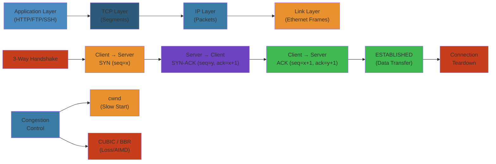

# 🌐 TCP/IP Protocol Stack — Complete Deep Dive

> **Scope**: Ethernet framing, IP packet structure and fragmentation, TCP segment format, TCP state machine, 3-way handshake, TIME-WAIT, flow control, congestion control (CUBIC, BBR, Reno, Vegas), Nagle/keepalive/retransmission, NIC offloading (TSO/GRO/RSS), socket buffers, Linux network stack tuning — the complete TCP/IP stack from wire to application.

> **Related**: [02-tls-http-grpc.md](02-tls-http-grpc.md), [03-memory-management.md](03-memory-management.md), [04-io-models.md](../os/04-io-models.md)

---




## Table of Contents

1. [Ethernet Frame](#1-ethernet-frame)
2. [IP Packet](#2-ip-packet)
3. [TCP Segment](#3-tcp-segment)
4. [TCP State Machine](#4-tcp-state-machine)
5. [Connection Establishment & Teardown](#5-connection-establishment--teardown)
6. [TCP Flow Control](#6-tcp-flow-control)
7. [TCP Congestion Control](#7-tcp-congestion-control)
8. [Nagle & Delayed ACK](#8-nagle--delayed-ack)
9. [Keepalive](#9-keepalive)
10. [Retransmission & RTO](#10-retransmission--rto)
11. [NIC Offloading](#11-nic-offloading)
12. [Socket Buffers (sk_buff)](#12-socket-buffers-sk_buff)
13. [Linux TCP Tuning](#13-linux-tcp-tuning)
14. [TCP in High BDP Networks](#14-tcp-in-high-bdp-networks)
15. [Internals](#15-internals)
16. [Failure Analysis](#16-failure-analysis)
17. [Edge Cases](#17-edge-cases)
18. [Performance](#18-performance)
19. [Simplest Mental Model](#19-simplest-mental-model)

---

## 1. Ethernet Frame

```
 7 bytes     1 byte     6 bytes     6 bytes     2 bytes     46-1500 bytes   4 bytes
┌──────────┬────────┬──────────┬──────────┬────────┬────────────────────┬──────────┐
│ Preamble │  SFD   │  Dst MAC │  Src MAC │  Type  │    Payload        │   FCS    │
│101010... │10101011│          │          │0x0800  │    (IP packet)    │ (CRC-32) │
└──────────┴────────┴──────────┴──────────┴────────┴────────────────────┴──────────┘
                                                              │
                                                      ┌───────┴───────┐
                                                      │   MTU = 1500  │
                                                      │  (without FCS)│
                                                      └───────────────┘
```

### Fields

- **Preamble** (7 bytes): Alternating 1/0 bits for clock synchronization
- **SFD** (1 byte): Start Frame Delimiter — marks end of preamble
- **Destination MAC** (6 bytes): Physical address of receiver
- **Source MAC** (6 bytes): Physical address of sender
- **EtherType** (2 bytes): Protocol of payload (0x0800 = IPv4, 0x86DD = IPv6, 0x0806 = ARP)
- **Payload** (46-1500 bytes): Minimum 46 bytes (padding added), maximum 1500 (MTU)
- **FCS** (4 bytes): CRC-32 checksum covering dest MAC through payload

### Step-by-Step

1. **Physical layer transmission** NIC generates preamble and SFD for clock synchronization
2. **MAC address lookup** sender queries ARP to resolve IP to destination MAC
3. **Frame construction** payload (IP packet) is wrapped with layer-2 headers
4. **Padding** if payload < 46 bytes, padding is added to meet minimum frame size
5. **CRC calculation** FCS checksum computed over entire frame excluding preamble/SFD
6. **Physical transmission** frame sent as electrical/optical signal over wire

### Code Example

```python
# Python: Parse Ethernet frame with scapy
from scapy.all import Ether, IP, TCP, Raw
import struct

# Capture raw bytes from wire (16 bytes Ethernet header + payload)
raw_frame = bytes.fromhex(
    "ffffffffffff"  # Broadcast dst MAC
    "0800045e0054"  # Source MAC 08:00:04:5e:00:54
    "0800"          # EtherType IPv4
    "4500003c1c4640004006b0c7c0a80001c0a80002"  # IP header
    "0050d31c123456781234567880101820e28e0000"  # TCP header + data
)

frame = Ether(raw_frame)
print(f"Dst MAC: {frame.dst}")
print(f"Src MAC: {frame.src}")
print(f"EtherType: {hex(frame.type)}")
print(f"Payload: {frame.payload}")

# Calculate MTU for ethernet
MTU = 1500
IP_HEADER = 20
TCP_HEADER = 20
ETHERNET_HEADER = 14
MAX_PAYLOAD = MTU - IP_HEADER - TCP_HEADER
print(f"Max TCP payload per frame: {MAX_PAYLOAD} bytes")
```

### Real-World Scenario

Facebook's internal data center fabric uses jumbo frames (9000 bytes MTU) for storage replication. When a single 1GB block is transferred, standard MTU would require 1M+ frames, generating millions of interrupts. With jumbo frames, it's only 111K frames—85% reduction in CPU overhead. Engineers discovered a misconfigured switch forcing standard MTU; replication bandwidth dropped from 40Gbps to 2Gbps until the jumbo frame config was restored.

### Jumbo Frames

```
Standard MTU:    1500 bytes
Jumbo frame:     9000 bytes (up to 9216 on some NICs)

Benefits:
  - Higher throughput (fewer frames → less overhead)
  - Lower CPU utilization (fewer interrupts)
  - Better for large data transfers (NFS, iSCSI, backup)

Requirements:
  - All devices on the path must support jumbo frames
  - Switches: enable jumbo frame support (often per-port)
  - NIC: driver configuration, may need MTU 9000
  - Usually only beneficial within a data center (not over internet)
```

---

## 2. IP Packet

```
Bit:  0-3    4-7     8-15         16-18   19-31
    ┌──────┬──────┬──────────┬────────┬──────────────────────┐
    │Version│ IHL │   DSCP   │  ECN   │   Total Length      │
    ├──────┴──────┴──────────┴────────┴──────────────────────┤
    │        Identification                │ Flags │Fragment │
    │                                      │       │ Offset  │
    ├──────────────────────────────────────┴───┬───┴─────────┤
    │    Time To Live   │    Protocol         │ Header CS   │
    ├──────────────────────────────────────────┴─────────────┤
    │                  Source IP Address                     │
    ├────────────────────────────────────────────────────────┤
    │                Destination IP Address                  │
    ├────────────────────────────────────────────────────────┤
    │                  Options (if IHL > 5)                  │
    ├────────────────────────────────────────────────────────┤
    │                     Payload (TCP segment)              │
    └────────────────────────────────────────────────────────┘
```

### Key Fields

- **Version** (4 bits): 4 = IPv4, 6 = IPv6
- **IHL** (4 bits): Header length in 32-bit words (minimum 5 = 20 bytes)
- **DSCP** (6 bits): Differentiated Services Code Point (QoS marking)
- **ECN** (2 bits): Explicit Congestion Notification (0=non-ECT, 1=ECT(1), 2=ECT(0), 3=CE)
- **Total Length** (16 bits): Entire packet size including header (max 65535)
- **Identification** (16 bits): Unique per datagram, used for fragment reassembly
- **Flags** (3 bits): Reserved, DF (Don't Fragment), MF (More Fragments)
- **Fragment Offset** (13 bits): Position of fragment in original datagram (8-byte units)
- **TTL** (8 bits): Hop count (decremented per router, packet dropped at 0)
- **Protocol** (8 bits): 6 = TCP, 17 = UDP, 1 = ICMP
- **Header Checksum** (16 bits): Covering header only (recalculated at each hop)

### Fragmentation

```
Original packet:  4000 bytes payload, ID=123, DF=0
  ┌──────────────────────────────────────────────────────┐
  │              Original IP packet (4020 bytes)          │
  └──────────────────────────────────────────────────────┘

After fragmentation (MTU 1500):
  Fragment 1: Offset=0, MF=1, ID=123, payload bytes 0-1479
    ┌─────────────────────────────┐
    │ IP hdr | data[0:1479]       │
    └─────────────────────────────┘
  Fragment 2: Offset=185 (1480/8), MF=1, ID=123, payload bytes 1480-2959
    ┌─────────────────────────────┐
    │ IP hdr | data[1480:2959]    │
    └─────────────────────────────┘
  Fragment 3: Offset=370 (2960/8), MF=0, ID=123, payload bytes 2960-3999
    ┌─────────────────────────────┐
    │ IP hdr | data[2960:3999]    │
    └─────────────────────────────┘
```

**Path MTU Discovery (PMTUD)**:
- Sender sets DF=1
- Router that can't forward without fragmenting returns ICMP "Fragmentation Needed" (Type 3, Code 4) with next-hop MTU
- Sender caches reduced MTU, retransmits
- Problem: ICMP often blocked by firewalls → connection hangs (PMTUD black hole)
- **Solution**: TCP MSS clamping, PLPMTUD (Packetization Layer Path MTU Discovery)

---

## 3. TCP Segment

```
Bit:  0-15           16-31
    ┌──────────────────────────┐
    │    Source Port          │ 2 bytes
    ├──────────────────────────┤
    │   Destination Port     │ 2 bytes
    ├──────────────────────────┤
    │   Sequence Number       │ 4 bytes
    ├──────────────────────────┤
    │  Acknowledgment Number │ 4 bytes
    ├────┬────┬──┬─┬─┬─┬─┬─┬─┤
    │Off │Res │N │C│E│U│A│P│R│
    │set │rv  │S │W│C│R│C│S│S│← flags
    ├────┴────┴──┴─┴─┴─┴─┴─┴─┤
    │   Window Size          │ 2 bytes
    ├──────────────────────────┤
    │   Checksum             │ 2 bytes
    ├──────────────────────────┤
    │   Urgent Pointer       │ 2 bytes
    ├──────────────────────────┤
    │   Options (variable)    │
    └──────────────────────────┘
```

### Flags

```
SYN:  Synchronize sequence numbers (connection establishment)
ACK:  Acknowledgment number is valid
FIN:  Sender is finished sending
RST:  Reset connection (error/immediate close)
PSH:  Push data to application immediately (no buffering)
URG:  Urgent pointer is valid (obsolete)
ECE:  ECN-Echo (congestion experienced)
CWR:  Congestion Window Reduced
NS:   Nonce Sum (ECN nonce, experimental)
```

### Options

```
MSS (Maximum Segment Size):
  - Advertised by both sides during SYN
  - MSS = MTU - 40 (IP + TCP headers) = 1460 for standard MTU 1500
  - Default if not sent: 536 bytes
  - Can be clamped by middleboxes

Window Scaling:
  - Allows window > 65535 bytes
  - Scale factor N → actual window = window * 2^N
  - N = 0-14, signaled during SYN (both sides)
  - Max window: 65535 * 2^14 = 1,073,725,440 bytes ≈ 1GB

SACK-Perm / SACK:
  - Selective Acknowledgment permitted (SYN) and data blocks (data)
  - Allows receiver to report non-contiguous received data
  - Sender retransmits only lost segments, not entire window
  - Up to 4 SACK blocks per ACK (44 bytes)

Timestamps (TSopt):
  - TSval (sender's timestamp) + TSecr (echoed timestamp from peer)
  - Used for: RTT measurement, PAWS (Protect Against Wrapped Sequences)
  - PAWS: 32-bit seq wraps at 4GB; at 10Gbps, wraps in ~3.4s

TCP Fast Open (TFO):
  - Send data in SYN (1-RTT saved on repeat connections)
  - Uses TFO cookie (obtained from first connection)
  - Server validates cookie → accepts data immediately
```

---

## 4. TCP State Machine

```
                    ┌────────────────────────────────────┐
                    │            CLOSED                   │
                    └────────────────┬───────────────────┘
                         passive open │ active open
                                      │
                    ┌─────────────────▼─────────────┐
                    │          LISTEN                │
                    └─────────────────┬─────────────┘
                         receive SYN  │
                                      │
                    ┌─────────────────▼─────────────┐
                    │         SYN-RCVD               │
                    └──┬──────────────┬─────────────┘
                       │              │
        receive ACK    │              │  receive SYN (simultaneous open)
         of SYN+ACK    │              │
                       │              ▼
                       │    ┌────────────────────┐
                       │    │     SYN-SENT        │
                       │    └────────────────────┘
                       │              │
                       │    receive SYN+ACK
                       │              │
                    ┌──▼──────────────▼────────────┐
                    │         ESTABLISHED            │
                    └──┬────────────────────────┬──┘
                       │                        │
          active close│                        │ passive close
          send FIN     │                        │ receive FIN
                       │                        │
                    ┌──▼──────────┐  ┌──────────▼──────────┐
                    │ FIN-WAIT-1  │  │   CLOSE-WAIT         │
                    └──┬──────────┘  └──────────┬───────────┘
                       │                        │
           receive ACK │               send FIN  │
           of our FIN  │                        │
                       ▼                        ▼
                    ┌──────────┐  ┌──────────┐  │
                    │FIN-WAIT-2│  │  LAST-ACK│◄─┘
                    └────┬─────┘  └─────┬────┘
                         │              │
            receive FIN │       receive ACK
                         │       of our FIN
                         ▼              │
                    ┌──────────┐         │
                    │ CLOSING  │         │
                    └────┬─────┘         │
                         │               │
                  receive ACK            │
                    ┌────┴────┐          │
                    │        │           │
                    ▼        ▼           ▼
              ┌──────────────────────────────┐
              │         TIME-WAIT (2MSL)      │
              │          (60 seconds)         │
              └──────────────┬───────────────┘
                             │
                      timer expires
                             │
                    ┌────────▼────────┐
                    │     CLOSED      │
                    └─────────────────┘
```

### TIME-WAIT (2MSL)

```
TIME-WAIT duration: 2 * MSL (Maximum Segment Lifetime)
  - MSL: 30 seconds (RFC 1122) → TIME-WAIT = 60 seconds
  - In practice: 60s on Linux (net.ipv4.tcp_fin_timeout = 60)

Purpose:
  1. Ensure the remote side received the final ACK
     - If FIN's ACK lost, remote retransmits FIN
     - TIME-WAIT allows retransmission of final ACK
  2. Allow old duplicate segments to expire (2MSL guarantees no segments remain in network)

Consequences:
  - Each connection ~60 seconds in TIME-WAIT
  - High connection rate → many TIME-WAIT sockets → port exhaustion
  - net.ipv4.tcp_tw_reuse: Reuse TIME-WAIT sockets for outgoing connections (SAFE)
  - net.ipv4.tcp_tw_recycle: Faster TIME-WAIT recycle (REMOVED in 4.12, broken with NAT)
```

### TIME-WAIT Assassination

```
If a host in TIME-WAIT receives a RST segment:
  → TIME-WAIT terminated early → connection closes immediately
  This can cause data corruption if duplicate segments still in flight!

Linux behavior: tcp_timewait_state_process():
  - RST with sequence number matching the final ACK → assassinate TW
  - Mitigation: PAWS timestamps protect against old duplicates
```

---

## 5. Connection Establishment & Teardown

### 3-Way Handshake

```
Client (active open)                 Server (passive open)
       │                                    │
       │  ──── SYN, seq=100 ────────►      │  (1) Client sends SYN
       │                                    │
       │  ◄─── SYN+ACK, seq=200, ───────── │  (2) Server sends SYN+ACK
       │         ack=101                    │
       │                                    │
       │  ──── ACK, seq=101, ack=201 ──►  │  (3) Client sends ACK
       │                                    │
       │         Connection ESTABLISHED     │
       ▼                                    ▼

Latency:
  1 RTT for connection establishment
  + TLS 1.3 1-RTT = 2 RTT total for HTTPS (new connection)
  + TLS 1.3 0-RTT with TFO = 0 RTT extra (repeat connection)
```

### TCP Fast Open (TFO)

```
First connection:
  Client                          Server
    │                                │
    │  ── SYN + TFO Cookie Req ──►  │
    │  ◄── SYN+ACK + TFO Cookie ── │  Server provides cookie
    │  ── ACK (cached by client)    │
    │        ... normal data ...    │

Repeat connection:
    │                                │
    │  ── SYN + TFO Cookie + DATA─► │  1-RTT saved!
    │  ◄── SYN+ACK + ACK data ──── │  Server accepts data immediately
    │  (client can send data        │
    │   without waiting for SYN+ACK)│
    │                                │
```

### 4-Way Teardown

```
Active closer                     Passive closer
      │                                    │
      │  ── FIN, seq=1000 ─────────────►  │  (1) Active sends FIN
      │                                    │
      │  ◄── ACK, ack=1001 ─────────────  │  (2) Passive ACKs FIN
      │   (half-close: passive can still   │
      │    send data)                      │
      │                                    │
      │  ◄── FIN, seq=2000 ─────────────  │  (3) Passive sends FIN
      │        (when done sending)         │
      │                                    │
      │  ── ACK, ack=2001 ────────────►  │  (4) Active ACKs FIN
      │                                    │
      │         TIME-WAIT (60s)            │
      │              │                     │
      │         (timer expires)            │
      │              │                     │
      │            CLOSED                  │
      ▼                                    ▼
```

### Simultaneous Open

```
Both sides send SYN simultaneously:
  Host A                       Host B
    │                              │
    │  ── SYN, seq=100 ─────►     │
    │  ◄── SYN, seq=200 ────      │
    │                              │
    │  ── SYN+ACK, seq=100 ──►   │
    │  ◄── SYN+ACK, seq=200 ──   │
    │                              │
    │         ESTABLISHED          │
```

### Half-Close

```
After FIN/ACK exchange, one direction is closed:
  - Passive closer (still receiving from active closed) → can still send
  - Active closer (can no longer send) → can still receive
  - "shutdown(SHUT_WR)" — graceful half-close
```

---

## 6. TCP Flow Control

### Receive Window & Sliding Window

```
Sender's view of receiver's buffer:

       Sent and         Sent, not      Can send        Can't send
       ACK'd            yet ACK'd      (window)        (window full)
    ┌─────────┬──────────┬─────────────┬───────────────┐
    │  ◄═════ │ ═══════► │  ◄══════════►   ◄═══════   │
    │ 1-100   │ 101-150  │ 151-200      │ 201+          │
    └─────────┴──────────┴─────────────┴───────────────┘
              ▲                        ▲
              │                        │
         Last unacked            Last window edge
         (next ACK expected)    (rwnd + last unacked)

rwnd (receiver window) = receiver's available buffer space
wnd = min(rwnd, cwnd)  ← sender's effective window
```

### Window Scaling

```
Without window scaling:  max window = 65535 bytes
With window scaling:     max window = 65535 * 2^14 = 1GB

Window scale factor:
  - Negotiated during SYN
  - Both sides send their shift count (0-14)
  - Actual window = Window field << shift count
  - Typical factor: 7 (128x) → max window = 65535 * 128 = 8,388,480 bytes

TCP window auto-tuning (Linux):
  - net.ipv4.tcp_rmem: min/default/max receive buffer
  - net.ipv4.tcp_wmem: min/default/max send buffer
  - Kernel dynamically adjusts window based on BDP measurement
  - /proc/sys/net/ipv4/tcp_moderate_rcvbuf = 1 (auto-tuning)
```

### Zero Window

```
When receiver's buffer is full (rwnd = 0):
  → Sender cannot send data
  → Sender probes periodically: Zero Window Probe
  → Sends 1-byte segments to trigger window update
  → persist timer (exponential backoff: 5/10/20/30/40/50/60s)
  → If no response after probes: connection reset (ETIMEDOUT)
```

---

## 7. TCP Congestion Control

```
                   TCP Congestion Control
                    │
         ┌──────────┴──────────┐
         ▼                      ▼
    Loss-based              Model-based
    CUBIC, Reno, NewReno   BBR (v1/v2/v3)
    Vegas (delay-based)    Copa, PCC
```

### CUBIC (Default on Linux)

```
CUBIC replaces BIC-TCP with a cubic function for window growth.

Window growth function:
  W(t) = C * (t - K)^3 + W_max

  W_max: window size at last congestion event
  t:     time since last congestion event
  K:     time to reach W_max again
  C:     scaling factor (default 0.4)

Phases:
  ┌──────┐   ┌───────────┐   ┌────────────┐
  │Slow  │   │Congestion │   │CUBIC       │
  │Start │──►│Avoidance  │──►│(concave    │
  │      │   │(AIMD)     │   │ then convex)│
  └──────┘   └───────────┘   └────────────┘

Slow start:
  - cwnd doubles per RTT (exponential)
  - Initial cwnd: 10 MSS (RFC 6928, was 4, original 1)
  - ssthresh: slow start threshold
  - Exit on: packet loss (ssthresh = cwnd/2) or ssthresh reached

Congestion avoidance (CUBIC):
  - After congestion, cwnd reduced to 0.8 * W_cubic (not 0.5!)
  - CUBIC probes bandwidth aggressively when far from W_max
  - CUBIC grows slowly near W_max (concave region)
  - After W_max, probes for more bandwidth (convex region)

Fast retransmit:
  - Duplicate ACK threshold: 3 (net.ipv4.tcp_reordering = 3)
  - On 3rd dupack: retransmit lost segment immediately
  - No need to wait for RTO

Fast recovery:
  - cwnd = ssthresh + 3 (for the 3 dupacks received)
  - Each additional dupack → cwnd + 1 (allows new data injection)
  - When ACK for retransmitted segment arrives → cwnd = ssthresh
```

### BBR (Bottleneck Bandwidth and Round-trip)

```
BBR uses bandwidth and RTT measurements (not packet loss!) to control sending rate.

Model:
  BtlBW (bottleneck bandwidth): max delivery rate observed
  RTprop (round-trip propagation): min RTT observed
  BDP = BtlBW × RTprop   (bytes in flight at optimal point)

BBR state machine:
  ┌──────────┐    ┌─────────┐    ┌──────────┐    ┌──────────┐
  │  STARTUP │───►│  DRAIN  │───►│ PROBE_BW │───►│ PROBE_RTT│
  │ (8x gain)│    │ (target)│    │ (pacing) │    │(min RTT) │
  └──────────┘    └─────────┘    └──────────┘    └──────────┘
       │                              ▲                 │
       └──────────────────────────────┴─────────────────┘

BBR v1:
  - STARTUP: pacing gain = 2.89 (doubles rate each RTT)
  - Exits STARTUP when bandwidth growth < 25% for 3 RTTs
  - DRAIN: gain = 1/2.89 to drain queue built in STARTUP
  - PROBE_BW: cycling gains (1.25, 0.75, 1.0, 1.0, 1.0, 1.0, 1.0, 1.0)
    → 8-phase cycle to probe bandwidth without building excessive queue
  - PROBE_RTT: every 10s, reduce in-flight to 4 packets for one RTT
    → get accurate RTprop measurement

BBR v2:
  - ECN-aware: reduces on ECN signals (not just loss)
  - Better fairness with CUBIC
  - Improved RTT fairness
  - BBR.inflight_hi: cap on max inflight (probe with pacing, not bursting)

BBR v3 (2023+):
  - Google production (used on youtube.com, google.com)
  - Better coexistence with loss-based CC
  - Faster convergence
  - Improved STARTUP exit criteria
```

### Reno & NewReno

```
Reno (RFC 2581):
  - Slow start: cwnd doubles per RTT
  - Congestion avoidance: cwnd += 1 MSS per RTT (AIMD)
  - On loss: cwnd = cwnd/2, ssthresh = cwnd/2
  - On RTO: cwnd = 1 MSS (slow start)

NewReno (RFC 6582):
  - Improved fast recovery: stays in recovery until all segments ACK'd
  - Handles multiple losses in one window (Reno only handles one)
```

### Vegas

```
Delay-based congestion control:
  - Measures RTT to detect incipient congestion (before packet loss)
  - Expected rate = cwnd / minRTT
  - Actual rate = cwnd / currentRTT
  - Diff = (expected - actual) * minRTT
  - If diff < alpha → increase cwnd (underutilized)
  - If diff > beta → decrease cwnd (congestion building)
  - TCP Vegas never causes packet loss from congestion!

Not widely deployed (Linux, but not default):
  - Doesn't play fair with loss-based CC (CUBIC takes bandwidth)
  - Routers with large buffers hide incipient congestion
```

---

## 8. Nagle & Delayed ACK

### Nagle's Algorithm

```
Purpose: Reduce small packet overhead (tinygrams)

Algorithm:
  If there is unACK'd data in flight:
    Don't send new data until either:
      a) Previous data is ACK'd, OR
      b) Enough data accumulated to fill a full MSS segment

  Effect: Convert many small sends into fewer large sends
  Problem: Not good for interactive apps (SSH, games)

Interaction with Delayed ACK:
  - Nagle waits for ACK before sending new data
  - Delayed ACK waits up to 200ms for data to piggyback on
  - Together: can cause 200ms delay! Known as "Nagle + Delayed ACK deadlock"

Solution: TCP_NODELAY

setsockopt(fd, IPPROTO_TCP, TCP_NODELAY, &one, sizeof(one));
// Disables Nagle — sends data immediately
// Essential for: HTTP APIs, WebSocket, interactive, streaming
```

### Delayed ACK

```
RFC 1122: ACK delay ≤ 500ms (Linux default: 40ms or every 2nd segment)

Algorithm (Linux tcp_input.c):
  - If we have data to send: piggyback ACK on data → immediate
  - If receiving bulk data: ACK every 2nd segment (quick ACK mode)
  - If no data: delay by HZ/25 (40ms on 100Hz timer)
  - ACK now flag: set when urgent, push, or out-of-order

Quick ACK mode:
  - Activated on: connection startup, after idle, during loss recovery
  - Disabled when: bulk transfer detected, receiving data quickly
  - tunable: /proc/sys/net/ipv4/tcp_comp_sack_delay_ns
```

---

## 9. Keepalive

```
TCP keepalive — detects dead peers

Configuration:
  net.ipv4.tcp_keepalive_time = 7200  (2 hours — default)
  net.ipv4.tcp_keepalive_intvl = 75   (75 seconds between probes)
  net.ipv4.tcp_keepalive_probes = 9   (9 probes before declaring dead)

  Total time before disconnect: 7200 + 9 * 75 = 7875s ≈ 2h 11m

Application-level keepalive (recommended):
  - Implement heartbeat on top of TCP
  - Detect dead peers faster (30s-60s)
  - Application-specific action (reconnect, failover)
  - E.g., HTTP keepalive timeout, WebSocket ping/pong
```

---

## 10. Retransmission & RTO

### RTO Calculation (RFC 6298)

```
RTO = SRTT + max(G, 4 * RTTVAR)

G = clock granularity (typically 1ms or 10ms depending on HZ)

SRTT = SRTT + alpha * (R - SRTT)     (smoothed RTT, alpha = 1/8)
RTTVAR = RTTVAR + beta * (|R - SRTT| - RTTVAR)  (RTT variance, beta = 1/4)

After RTT measurement:
  alpha = 1/8 (0.125)
  beta  = 1/4 (0.25)

Initial RTO:
  - Linux uses initial RTO of 1 second (RFC suggests 3s)
  - On first SYN: TCP_SYN_RTO_LENGTH

RTO bounds:
  RTOmin = 200ms (HZ < 100) or 1 clock tick
  RTOmax = 120s

RTO backoff:
  On timeout: RTO = min(RTO * 2, RTOmax)
  At most 2 times before resetting (tcp_retries2)
  Revert to base RTO on ACK of retransmitted segment
```

### Retransmission Strategies

```
1. Fast Retransmit (3 dupacks → retransmit)
   - No RTO wait — immediate retransmission
   - ssthresh = in_flight / 2, cwnd = ssthresh + 3 (for dupacks)

2. RTO-based Retransmission
   - Timer expires → retransmit oldest unACK'd segment
   - cwnd = 1 MSS, ssthresh = in_flight / 2
   - Exponential backoff (1, 2, 4, 8... seconds)

3. F-RTO (Forward RTO-Recovery, RFC 5682)
   - Detects spurious RTOs (false timeout)
   - If new ACK(s) arrive after RTO retransmission → original wasn't lost
   - Restores cwnd/ssthresh to pre-RTO values

4. TLP (Tail Loss Probe, Linux 3.10+)
   - When only last segment is lost (no dupacks)
   - Send one probe segment 2x RTT after last transmission
   - If ACK'd → fast recovery; If timeout → RTO (less severe)
   - net.ipv4.tcp_early_retrans = 1

5. DSACK (Duplicate SACK)
   - Receiver sends SACK with duplicate range
   - Sender knows: spurious retransmission → adjust duplicate threshold
```

---

## 11. NIC Offloading

### Checksum Offload

```
NIC computes/verifies TCP/UDP/IP checksums in hardware
  - Transmit: NIC calculates checksum for outgoing packets
  - Receive: NIC verifies checksum, marks skb->ip_summed = CHECKSUM_UNNECESSARY

ethtool -K eth0 tx on rx on       # Enable checksum offload
ethtool -K eth0 tx off rx off     # Disable (pure software checksum)

Benefit: ~15-30% CPU savings for large transfers
```

### TSO (TCP Segmentation Offload)

```
Application sends large buffer (64KB) to kernel
  → Kernel creates single large skb with GSO flag (TSO/GSO)
  → Driver trains NIC to segment into MSS-sized segments
  → NIC writes individual TCP segments to wire

  App:  |--------64KB buffer--------|
  Kernel:   |----------TSO skb----------|
  NIC:  |seg1|seg2|seg3|...|segN|   ← hardware segments

Benefit: Fewer CPU interrupts, fewer kernel traversals, higher throughput
ethtool -K eth0 tso on             # Enable TSO
ethtool -K eth0 gso on             # Generic Segmentation Offload (software fallback)
```

### GRO (Generic Receive Offload)

```
NIC receives individual segments → hardware coalesces into larger buffer
  → Driver passes large skb to kernel
  → Kernel processes one large skb instead of many small ones

  Wire: |seg1|seg2|seg3|...|segN|
  NIC:  |----------GRO skb----------|
  Kernel: processes as one → higher efficiency

Benefit: ~2-3x throughput improvement for bulk TCP

ethtool -K eth0 gro on             # Enable GRO
ethtool -K eth0 lro on             # LRO (legacy, GRO replacement)
```

### RSS (Receive Side Scaling)

```
NIC distributes incoming packets across multiple RX queues:
  - Hash packet (4-tuple: src_ip, dst_ip, src_port, dst_port)
  - Hash → queue index (N queues)
  - Each queue handled by different CPU core

  ┌─────────────────────────────────────────────┐
  │                  NIC                         │
  │                                              │
  │   RSS Hash: 5-tuple → redirect table         │
  │                                              │
  │  ┌──────┐  ┌──────┐  ┌──────┐  ┌──────┐   │
  │  │Rx Q0 │  │Rx Q1 │  │Rx Q2 │  │Rx Q3 │   │
  │  └──┬───┘  └──┬───┘  └──┬───┘  └──┬───┘   │
  └─────┼─────────┼─────────┼─────────┼────────┘
        │         │         │         │
        ▼         ▼         ▼         ▼
     ┌──────┐ ┌──────┐ ┌──────┐ ┌──────┐
     │CPU 0 │ │CPU 1 │ │CPU 2 │ │CPU 3 │
     └──────┘ └──────┘ └──────┘ └──────┘

  Config: ethtool -X eth0 equal 4        # 4 queues
  ethtool -x eth0                       # Show RSS hash indirection
```

### RPS/RFS (Receive Packet Steering / Flow Steering)

```
RPS: Software RSS (when NIC doesn't support RSS)
  - Kernel applies hash to decide which CPU processes packet
  - Packets sent via IPI to target CPU's backlog queue

RFS: Direct packets to CPU where application is running
  - Tracks which CPU last processed the socket
  - Routes incoming packet to that CPU (cache locality)
  - aRFS: Hardware + RFS — NIC uses application hints for queue selection

XPS (Transmit Packet Steering):
  - Choose TX queue based on CPU
  - Prevents lock contention on TX queue
  - Ensures same CPU for TX/RX of same flow
```

---

## 12. Socket Buffers (sk_buff)

```
struct sk_buff — the fundamental data structure in Linux networking

┌───────────────────────────────────────────────────────────────┐
│ struct sk_buff (private, per-packet metadata)                  │
│                                                               │
│  ┌─────────────────────────────────────────────────────────┐  │
│  │ struct sock *sk;            // Associated socket         │  │
│  │ struct net_device *dev;     // Input/output device       │  │
│  │ union { ... } headers;      // L2/L3/L4 header pointers  │  │
│  │   struct tcphdr *th;                                      │  │
│  │   struct udphdr *uh;                                      │  │
│  │   struct iphdr *iph;                                      │  │
│  │   unsigned char *mac_header;                              │  │
│  │                                                           │  │
│  │ unsigned int len;              // Total length           │  │
│  │ unsigned int data_len;         // Length of data in frags │  │
│  │ u16 mac_len, nh_len;                                     │  │
│  │ sk_buff_data_t tail;          // Current tail pointer    │  │
│  │ sk_buff_data_t end;           // End of data area        │  │
│  │                                                           │  │
│  │ unsigned char *head, *data;   // Headroom/data boundary  │  │
│  │                                                           │  │
│  │ atomic_t users;               // Reference count         │  │
│  │                                                           │  │
│  │ __u32 priority;               // QoS (skb->priority)     │  │
│  │ __u16 queue_mapping;          // TX queue                │  │
│  │                                                           │  │
│  │ struct skb_shared_info *end;  // Fragments list           │  │
│  │   ┌───────────────────────────────────────────────────┐  │  │
│  │   │ nr_frags, frags[] (page-based, for DMA)           │  │  │
│  │   │ tso_size, tso_segs                                │  │  │
│  │   │ gso_size, gso_type                                │  │  │
│  │   └───────────────────────────────────────────────────┘  │  │
│  └─────────────────────────────────────────────────────────┘  │
└───────────────────────────────────────────────────────────────┘
```

### Buffer Layout

```
Headroom (reserved for headers):
  ┌────────────────────────────────────────────────┐
  │ head                                            │
  │ ┌────────────────┬────────────────────────────┐ │
  │ │ headroom       │ data                       │ │
  │ │ (L2/L3/L4      │ (actual packet payload)    │ │
  │ │  header space) │                            │ │
  │ └────────────────┴────────────────────────────┘ │
  │ ▲                ▲                    ▲         │
  │ head             data                 tail      │
  │                                               end│
  └────────────────────────────────────────────────┘

skb_reserve(skb, headroom_size);    // Reserve headroom (e.g., 128 for L2+L3+L4)
skb_push(skb, header_len);         // Add header (decrease data pointer)
skb_put(skb, data_len);            // Add data (increase tail)
skb_pull(skb, header_len);         // Remove header (increase data pointer)
skb_trim(skb, new_len);            // Remove trailing data
```

---

## 13. Linux TCP Tuning

### Core Parameters

```bash
# Buffer sizes (min, default, max)
net.core.rmem_default = 212992       # 208KB default receive buffer
net.core.rmem_max = 212992           # Max receive buffer (can increase)
net.core.wmem_default = 212992       # 208KB default send buffer
net.core.wmem_max = 212992           # Max send buffer

# TCP auto-tuning
net.ipv4.tcp_rmem = 4096 131072 6291456   # min/def/max (4KB / 128KB / 6MB)
net.ipv4.tcp_wmem = 4096 65536 6291456    # min/def/max (4KB / 64KB / 6MB)

# Backlog
net.core.netdev_max_backlog = 1000        # Max packets queued from NIC
net.ipv4.tcp_max_syn_backlog = 1024       # Max SYN backlog (1024 or 128 for < 128MB RAM)
net.core.somaxconn = 4096                 # Max listen backlog (increase from 128)

# SYN cookies (protect against SYN flood)
net.ipv4.tcp_syncookies = 1              # Enabled by default

# Fast open
net.ipv4.tcp_fastopen = 3                # 0=off, 1=client only, 2=server only, 3=both
net.ipv4.tcp_fastopen_key = ...          # TFO key

# Selective ACK
net.ipv4.tcp_sack = 1                    # Enable SACK
net.ipv4.tcp_dsack = 1                   # Enable DSACK

# Slow start after idle
net.ipv4.tcp_slow_start_after_idle = 0   # Don't reset cwnd after idle (for keep-alive connections)

# Congestion control
net.ipv4.tcp_congestion_control = cubic  # Or bbr (if module loaded)

# Autocorking
net.ipv4.tcp_autocorking = 1             # Auto-enable corking for small writes

# Not sent low watermark
net.ipv4.tcp_notsent_lowat = -1          # Wake application when notsent < threshold
```

### High-Performance Settings

```bash
# For 10Gbps+ connections with many connections:
net.core.rmem_max = 134217728           # 128MB max receive
net.core.wmem_max = 134217728           # 128MB max send
net.ipv4.tcp_rmem = 4096 262144 134217728
net.ipv4.tcp_wmem = 4096 262144 134217728

net.core.netdev_max_backlog = 5000
net.ipv4.tcp_max_syn_backlog = 8192
net.core.somaxconn = 65536

net.ipv4.tcp_slow_start_after_idle = 0
net.ipv4.tcp_mtu_probing = 1            # Enable PLPMTUD
```

---

## 14. TCP in High BDP Networks

### Bandwidth-Delay Product

```
BDP = Bandwidth × RTT

Example:
  - 10Gbps link, 50ms RTT → BDP = 10Gbps × 0.05s = 125MB
  - To fully utilize link: window must be ≥ 125MB

BDP for common links:
  Link                  Bandwidth   RTT      BDP
  1Gbps, local           1Gbps      0.5ms    62.5KB
  1Gbps, cross-US        1Gbps      70ms     8.75MB
  10Gbps, cross-Atlantic 10Gbps     100ms    125MB
  100Gbps, inter-DC      100Gbps    1ms      12.5MB
  100Gbps, cross-US      100Gbps    70ms     875MB
```

### Window Scaling for High BDP

```
Needed: window ≥ BDP

  Without scaling (max 64KB): usable up to 64KB / RTT
    10Gbps: 64KB / 0.05s = 10Mbps — wastes 99.9% of bandwidth!

  With scaling: 64KB * 2^14 = 1GB — works for any BDP
    10Gbps × 100ms → BDP = 125MB → window = 1GB > 125MB ✓
```

### BBR vs CUBIC on High BDP

```
CUBIC on high BDP (100ms RTT, 10Gbps):
  - Slow start: doubles per RTT → reaches high cwnd quickly
  - But: loss recovery takes many RTTs (big window to repair)
  - Buffer bloat: CUBIC fills buffers → high latency (bufferbloat)

BBR on high BDP:
  - Proactively paces at BtlBW (no buffer bloat)
  - Startup: quickly finds BtlBW without overshooting
  - Stable near optimal point (BDP = BtlBW × RTprop)
  - Better RTT fairness at high BDP
```

---

## 15. Internals

### TCP Receive Path (Linux net/ipv4/tcp_input.c)

```
tcp_v4_rcv(skb)
  │
  ├── tcp_v4_do_rcv(sk, skb)
  │     │
  │     ├── tcp_rcv_established(sk, skb)
  │     │     │
  │     │     ├── Process header flags (SYN, FIN, RST, ACK)
  │     │     ├── Check sequence number (in window?)
  │     │     ├── tcp_ack() → update snd_una, cwnd
  │     │     ├── tcp_data_queue() → add to receive buffer
  │     │     │     ├── Check for out-of-order → tcp_ofo_queue()
  │     │     │     ├── Add to backlog if receive buffer full
  │     │     │     └── Wake up socket (sk_data_ready)
  │     │     ├── tcp_cong_control() → update cwnd
  │     │     └── tcp_xmit_retransmit_queue() → if needed
  │     │
  │     └── tcp_rcv_state_process()  (SYN, FIN, etc.)
  │
  └── kfree_skb(skb)  // or skb freed after data copied
```

### TCP Timer Wheel

```
Linux maintains per-socket TCP timers via a timer wheel:

  tcp_write_timer():    Retransmission RTO timer
  tcp_delack_timer():   Delayed ACK timer
  tcp_keepalive_timer(): Keepalive probe timer
  tcp_syn_ack_timeout(): SYN/ACK timeout

All managed in struct inet_connection_sock (icsk_*):
  icsk_retransmit_timer
  icsk_delack_timer
  icsk_keepalive_timer
```

---

## 16. Failure Analysis

### SYN Flood

```
Attacker sends many SYN packets with spoofed source IPs
  → Server allocates TCB (Transmission Control Block) for each
  → Fills SYN backlog → legitimate connections can't establish

Mitigations:
  1. SYN cookies (tcp_syncookies = 1, default):
     - Encode SYN info in ISN (Initial Sequence Number)
     - Don't allocate TCB until ACK received
     - No memory cost per SYN

  2. tcp_max_syn_backlog: Increase capacity
  3. SYN flood protection at network level (firewall, rate limiter)
```

### TIME-WAIT Exhaustion

```
High connection rate (thousands/sec):
  → 60s TIME-WAIT per connection
  → Ports exhausted after ~65536/minute
  → Clients can't connect (EADDRNOTAVAIL)

Solutions:
  - net.ipv4.tcp_tw_reuse = 1 (for client-side, outgoing only)
  - Increase ephemeral port range: net.ipv4.ip_local_port_range = 1024 65535
  - Use connection pooling (avoid short-lived connections)
  - net.ipv4.tcp_fin_timeout = 30 (reduce TIME-WAIT to 30s)
```

### Bufferbloat

```
Excessive buffering in network → high latency

Symptoms:
  - High RTT under load (e.g., 300ms vs 5ms base)
  - Throughput OK but latency terrible
  - Applications time out (interactive, real-time)

Detection:
  - Ping with different loads: low → 5ms; under load → 500ms
  - netstat -s: TCP reordering, fast retransmits

Mitigation:
  - fq_codel / cake / BBR at endpoint
  - ECN + AQM (Active Queue Management) on router
  - BBR avoids building queues (model-based)
```

### Path MTU Discovery Black Hole

```
Firewall blocks ICMP "Fragmentation Needed" messages
→ Sender with DF=1 gets no response → connection stalls (PMTUD black hole)

Symptoms:
  - Connection established, data transfer starts, then stalls
  - "Connection timed out" or hangs on large transfers
  - Small transfers work, large transfers fail (MSS > path MTU somewhere)

Solutions:
  - net.ipv4.tcp_mtu_probing = 1 (PLPMTUD — probe with no ICMP)
  - Clamp MSS at firewall: iptables -A FORWARD -p tcp --tcp-flags SYN SYN -j TCPMSS --clamp-mss-to-pmtu
  - Set mss clamping on server: ip route add ... advmss 1400
```

### Connection Storms & Listen Overload

```
Many concurrent connections arriving:
  → SYN backlog fills quickly
  → New SYN drops → client retries → more SYNs → thundering herd

Mitigation:
  - tcp_max_syn_backlog + somaxconn increased
  - TCP_DEFER_ACCEPT: don't wake application until data arrives on accepted socket
  - SO_REUSEPORT: Multiple server processes/threads share same port
    → Kernel distributes incoming connections across listeners
    → Each listener has its own accept queue
    → Reduces lock contention on single socket
    → Better cache locality per worker
```

---

## 17. Edge Cases

- **Simultaneous open**: Both sides send SYN → transition to SYN_SENT then SYN_ACK_RCVD → rare but valid
- **Half-close + data**: Passive closer can still send data after receiving FIN
- **Urgent pointer (URG)**: Almost obsolete, data is not urgent in modern TCP; deprecated in some stacks
- **Persist timer vs RTO**: Zero window probe uses persist timer (different from RTO) — exponential backoff separately
- **TCP_REPAIR**: Inject TCP state for connection migration (used by CRIU container checkpoint)
- **SO_TIMESTAMPING**: Hardware timestamps for PTP (Precision Time Protocol) — nanosecond accuracy
- **SO_ZEROCOPY**: Avoid copy from userspace to kernel for sendmsg via pinned pages
- **TCP_USER_TIMEOUT**: Timeout for all TCP data (not just retransmit) — kill connection if no progress
- **TCP_NOTSENT_LOWAT**: Wake app when unsent data is below threshold — for streaming with small send buffers
- **TCP_CORK**: Don't send until buffer full or TCP_CORK turned off — like Nagle but manual control
- **TCP_DEFER_ACCEPT**: Only wake server when data arrives on accepted connection — saves accept/process context switch
- **TCP_FASTOPEN_CONNECT**: Client-side TFO without connect syscall — send data in SYN automatically
- **TCP_SAVE_SYN / TCP_SAVED_SYN**: Save SYN information (client's TSval) for more accurate RTT in passive connections
- **TCP_MD5SIG**: MD5 signatures on TCP segments (used by BGP)
- **TCP_AO**: TCP Authentication Option (replaces MD5, RFC 5925)

---

## 18. Performance

### Throughput Bottlenecks

```
Bottleneck           Limit for 10Gbps          Solution
─────────────────────────────────────────────────────────────
CPU (interrupt)      ~2-4 Gbps per core      RSS, GRO, TSO
CPU (copy)           ~4-6 Gbps per core      zero-copy, sendfile
Memory bandwidth     ~20-30 Gbps             NUMA-aware, huge pages
PCIe bus             ~30-60 Gbps per gen     Use gen4/gen5
Network MTU          ~8-12 Gbps at 1500      Jumbo frames (9000)
TCP stack            ~15-20 Gbps per core    io_uring, kernel bypass
Kernel context sw    ~5-10 Gbps per core     batch processing
```

### Optimal Block Sizes

```
send()/write() size:
  - Small writes (< 1KB): high syscall overhead per byte
  - Large writes (> 64KB): TSO can offload segmentation
  - Optimal: 16KB-64KB per write for bulk TCP transfers

MSS tuning:
  - Ethernet (MTU 1500): MSS 1460 — default
  - Jumbo frames (MTU 9000): MSS 8960 — 6.1x fewer packets
  - TCP overhead: ~40 bytes per segment (IP + TCP headers)
  - Efficiency: 1460/1500 = 97.3% (standard), 8960/9000 = 99.6% (jumbo)
```

### Single Connection Performance

```
Linux tuned for single TCP connection:
  - CPU core 100% → throughput limit ~4-8 Gbps (3GHz CPU)
  - RSS splits across cores only for multiple connections
  - Single connection: one CPU handles all processing

To exceed single-core throughput:
  - Use multiple connections (HTTP/2 multiplexing doesn't help — single TCP)
  - Kernel bypass (DPKD/AF_XDP) — userspace stack
  - Hardware offload (RDMA, iWARP, RoCE)
```

---

## Interview Questions

### Beginner Level

**Q1: Walk through what happens when you type google.com into a browser.**

**Why interviewers ask this**: Classic interview question that tests networking knowledge top to bottom.

**Ideal answer structure**:
1. **DNS resolution**: Browser checks local cache → OS cache → `/etc/hosts` → recursive DNS resolver → root/TLD/authoritative nameservers → returns IP.
2. **TCP handshake**: SYN → SYN-ACK → ACK (3-way handshake to google.com:443).
3. **TLS handshake**: Client Hello (supported ciphers) → Server Hello + Certificate → Key Exchange → Finished. (HTTP/1.1 or H2).
4. **HTTP request**: GET / → server processes → HTML response.
5. **Rendering**: Browser parses HTML, requests additional resources (CSS, JS, images) over additional connections (HTTP/1.1) or multiplexed stream (HTTP/2).

**Common wrong answer**: "The browser just sends a GET request" — misses DNS and TCP/TLS setup which dominate latency.

**Q2**: What is the difference between TCP and UDP? When would you use each?

**Answer**: **TCP**: Connection-oriented, reliable (ACKs + retransmission), in-order delivery, congestion control, flow control. Used for: HTTP, SSH, email, file transfer. **UDP**: Connectionless, unreliable (no ACKs), no ordering guarantee, no congestion control. Used for: DNS, VoIP, video streaming, gaming, QUIC (HTTP/3). TCP adds ~15-20% overhead vs UDP. TCP is better when data integrity matters; UDP when speed/latency matter and some loss is acceptable.

### Intermediate Level

**Q3: How does TCP congestion control work? Explain slow start, congestion avoidance, and fast recovery.**

**Answer**: 1) **Slow start**: cwnd starts at 10 MSS (~14KB). Each ACK doubles cwnd (exponential growth). Until ssthresh (slow start threshold, ~64KB default). 2) **Congestion avoidance**: After ssthresh, additive increase (cwnd += 1 MSS per RTT). On packet loss (triple duplicate ACK or timeout): Reno sets ssthresh = cwnd/2, cwnd = ssthresh, then additive increase. CUBIC (default Linux) uses cubic function for better throughput over high-BDP networks. 3) **Fast recovery**: On triple duplicate ACK, Reno retransmits lost segment, sets cwnd = ssthresh + 3 MSS, ACKs increase cwnd temporarily. TCP includes also: **FACK** (forward ACK for retransmission), **SACK** (selective ACK — only retransmit lost segments, not entire window). Modern Linux uses **TCP BBR** (model-based, not loss-based) which paces based on measured bandwidth and RTT.

**Q4**: Explain the TCP three-way handshake in detail. What happens to the sequence numbers?

**Answer**: 1) **Client → Server (SYN)**: Sequence number = X (random, e.g., 28475839). SYN flag set. 2) **Server → Client (SYN-ACK)**: Acknowledgment = X+1. Sequence number = Y (server's random ISN). SYN + ACK flags set. 3) **Client → Server (ACK)**: Acknowledgment = Y+1. Sequence = X+1. ACK flag set. Connection established. What happens: Both sides synchronize initial sequence numbers (ISNs) for tracking bytes sent/received. The random ISN prevents TCP sequence prediction attacks (blind in-window attacks). SYN flood mitigation: SYN cookies (send SYN-ACK with encoded sequence number, if ACK comes with correct seq-1, allocate resources). Modern Linux: SYN cookies on by default under SYN flood.

### Senior Level

**Q5: A user reports that their application is experiencing "Connection timed out" but only for certain hosts. How do you diagnose this?**

**Why interviewers ask this**: Tests practical network troubleshooting methodology.

**Answer**: 1) **Check connectivity**: `ping <host>` (ICMP reachable?). 2) **Check TCP**: `telnet <host> <port>` or `nc -vz <host> <port>` (is port open?). 3) **DNS**: `nslookup <host>` (resolving correctly?). 4) **Traceroute**: `traceroute -n <host>` — where does the path stop? 5) **Firewall**: Could be client firewall (outbound) or server firewall (inbound). Check `iptables -L`, security groups (AWS). 6) **SYN flood / connection limits**: `netstat -s | grep -i listen` — check for listen queue overflow (`listen_overflows`). 7) **MTU issues**: packet too large with DF bit set → ICMP "fragmentation needed" is blocked. 8) **Bonding issues**: if multi-homed, routing table wrong. 9) **TCP timestamps**: if client/server have incompatible timestamp settings. Use `tcpdump -i eth0 host <host> and port <port>` to see if SYN reaches server. No SYN → client routing or firewall. SYN sent but no SYN-ACK → server not listening or server-side firewall.

**Q6**: Design a low-latency networking strategy for a global real-time multiplayer game with <50ms RTT requirement.

**Answer**: 1) **Edge network**: deploy game servers in multiple regions (us-east, eu-west, ap-southeast). Use Route53 latency-based routing to direct players to closest region. 2) **Protocol**: **UDP** for game state (position, actions) with custom reliability layer (only retransmit dropped packets — not all). 3) **QUIC/HTTP3** for matchmaking (built on UDP, 0-RTT connection for returning players). 4) **Game transport**: WebSocket over TCP for lobby/chat, custom binary protocol over UDP for gameplay (KCP or enet). 5) **Global coordination**: centralized matchmaking service via TCP (tolerates 100ms latency). Game state synchronization via **replicated compute** (callbacks or deterministic lockstep). 6) **Optimizations**: TCP BBR congestion control, kernel bypass (DPDK for server-side packet processing), `SO_BUSYPOLL` for low-latency accept, `SO_REUSEPORT` for multi-process listening. 7) **Infrastructure**: AWS Global Accelerator (anycast IP → edge → fastest path to origin).

### Staff/Principal Level

**Q7: Your company's TCP-based service in us-east-1 has high tail latency for users in Europe. You see packet loss is <0.1%. The bottleneck is NOT bandwidth. What is it?**

**Why**: Tests understanding of TCP performance physics — latency not bandwidth.

**Answer**: **Latency, not loss**. RTT between Europe and us-east-1 is ~80-120ms. With TCP's additive increase, cwnd grows slowly. For a 100ms RTT connection with 10MB of data: slow start doubles cwnd per RTT, so 10MB takes ~20 RTTs = 2 seconds just to fill the pipe. **Bufferbloat**: intermediate buffers fill up, increasing RTT to 200-300ms. **TCP initial window**: with 10 MSS startup (~14KB), it takes many RTTs to reach full speed. Fix: 1) **Deploy servers in Europe**. 2) **BBR congestion control** — model-based (uses pacing, not loss detection) → better for long-fat pipes. 3) **TCP Fast Open (TFO)** — send data in SYN for returning users. 4) **HTTP/3 (QUIC)** — 0-RTT connection establishment + built-on UDP with better loss handling. 5) **Optimize window**: increase `tcp_rmem` / `tcp_wmem` max. 6) **Avoid bufferbloat**: use fq_codel qdisc (`tc qdisc add dev eth0 root fq_codel`). 7) **Edge caching (CDN)** for static content.

**Q8**: Design a multi-region active-active architecture with TCP connections that must survive a region failover without application-level reconnection.

**Answer**: 1) **Global Anycast IP**: use AWS Global Accelerator or Cloudflare. BGP anycast routes to the nearest healthy origin. On failover, BGP advertisement withdrawn for unhealthy region → traffic routes to healthy region. 2) **TCP anycast challenge**: TCP state is per-server. If the new region doesn't have the TCP state, connection resets. Solution: **TCP connection migration** — QUIC (connection ID, not IP-based) migrates natively. For TCP: 3) **L4 load balancer with state replication**: use NGINX Plus or HAProxy with connection table sync across regions (expensive). 4) **Alternative proxy**: Envoy with active health checking + connection draining + client retry (application handles reconnect). 5) **Safe approach**: use **HTTP/3 (QUIC)** end-to-end — 0-RTT reconnect to new server. DNS failover with low TTL (60s) → clients reconnect to new IP. 6) **DNS-based**: Route53 health checks → failover record set. Clients detect connection loss → retry DNS → connect to new region. Best for modern apps that handle reconnect gracefully.

### Tricky Edge Cases

**Q9**: Your server sends a TCP segment with FIN flag but the client never closes the connection. The server's `ss` shows CLOSE_WAIT state. Why is the connection stuck?

**Answer**: **Application bug — client hasn't called close()**. TCP state: Server sends FIN → Client receives FIN → Client is in CLOSE_WAIT (waiting for application to close()). If the client application never calls `close()` or `shutdown()`, CLOSE_WAIT persists indefinitely. The server is in FIN_WAIT_2. These connections consume resources. Fix: 1) Add timeout for CLOSE_WAIT sockets: `net.ipv4.tcp_keepalive_time`. 2) Set `SO_LINGER` with timeout in server. 3) Fix the client application to properly close connections. 4) Use `ss -tan state close-wait` to monitor. CLOSE_WAIT = application bug on the side that receives FIN.

**Q10**: You have two servers with identical TCP tuning, same kernel, same application. One shows 10x higher retransmission rate. What could cause this?

**Answer**: **Link layer differences**: 1) **Duplex mismatch**: if one side is full-duplex and other is half-duplex (auto-negotiation failure) → collisions + retransmits. 2) **Faulty NIC or cable**: CRC errors on the switch port. Check `ethtool -S eth0` for `rx_crc_errors`, `rx_frame_errors`. 3) **Switch buffer exhaustion**: one port is oversubscribed (too many flows through that switch). 4) **Interrupt coalescence**: `ethtool -c eth0` — if adaptive RX/TX is off, one server may have more interrupts and drop frames. 5) **LRO/GRO (Large Receive Offload)**: if one server has it off and the other on, the offload-capable one has better coalescing → fewer TCP segments → fewer retransmissions. 6) **TCP offload**: TSO/GSO checksum offloading — if one NIC has broken offload, corrupt packets → TCP checksum failures → retransmissions. Fix: compare `ethtool -k eth0` features; compare `/sys/class/net/eth0/statistics/` errors; use `tcpdump` on both to see if retransmits are server's fault or client's.


> **TCP/IP is a postal service for the internet. Ethernet is the local mail truck that delivers between houses on your street. IP is the envelope with addresses — it tells the postal system which city and house. TCP is the registered mail service that confirms every package arrived, re-sends lost ones, and makes sure they're in order. The 3-way handshake is "I'll send a letter, you confirm, I confirm back" before any real communication. The congestion window is how many packages you're willing to have on trucks at once — slow start means you start with one, double until you see a traffic jam (loss), then ease back. BBR is a GPS that measures how fast the road system actually is and paces your packages to avoid traffic jams entirely. All the offloading (TSO/GRO/RSS) is like having automated sorting machines at the post office — the mail carrier (NIC) handles the heavy lifting so the clerks (CPU) can focus on the actual mail (applications).**
