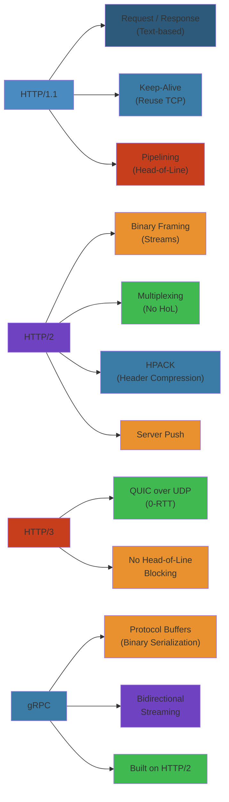

# 📡 HTTP & Application Protocols — Complete Deep Dive




## 📋 Table of Contents
- [HTTP/1.1](#http11)
- [HTTP/2](#http2)
- [HTTP/3 & QUIC](#http3--quic)
- [gRPC](#grpc)
- [WebSocket](#websocket)
- [SSE — Server-Sent Events](#sse--server-sent-events)
- [Simplest Mental Model](#simplest-mental-model)

---

## HTTP/1.1

### Persistent Connections (Keep-Alive)

```text
HTTP/1.0 (default: close)            HTTP/1.1 (default: keep-alive)

+-------+         +-------+          +-------+         +-------+
|Client |         |Server |          |Client |         |Server |
+---+---+         +---+---+          +---+---+         +---+---+
    |                 |                  |                 |
    |--- GET /a ----> |                  |--- GET /a ----> |
    |<--- response ---|                  |<--- response ---|
    |                 |                  |--- GET /b ----> |
    |--- GET /b ----> |   (NEW TCP)     |<--- response ---|
    |<--- response ---|                  |--- GET /c ----> |
    |                 |                  |<--- response ---|
    |--- GET /c ----> |                  |                 |
    |<--- response ---|                  |  (single TCP)   |
```

- **Connection: keep-alive** saves TCP handshake + slow start per request.
- **Hop-by-hop**: Connection, Keep-Alive, Proxy-Authorize, TE, Transfer-Encoding, Upgrade — stripped by proxies.

#### Step-by-Step

1. **TCP connection establishment** 3-way handshake (SYN, SYN-ACK, ACK) and slow start ramp
2. **HTTP/1.1 request send** client sends GET request with `Connection: keep-alive` header
3. **Server response** server responds with 200 OK and `Connection: keep-alive` header
4. **Connection reuse** TCP connection remains open; new requests reuse same socket
5. **Idle timeout** server waits Keep-Alive: timeout=5s before closing dormant connection
6. **Connection closure** client or server sends `Connection: close` header to terminate

#### Code Example

```bash
#!/bin/bash
# HTTP/1.1 Keep-Alive using curl and tcpdump

# Monitor TCP connections
tcpdump -i lo 'tcp port 80' -n &
TCPDUMP_PID=$!

# HTTP/1.0 (new TCP per request)
echo "=== HTTP/1.0 (closes connection) ==="
curl -0 --raw http://example.com/page1
curl -0 --raw http://example.com/page2
sleep 1

# HTTP/1.1 (reuses connection)
echo "=== HTTP/1.1 (keep-alive) ==="
curl -1 http://example.com/page1
curl -1 http://example.com/page2
sleep 1

# Verify with netstat
netstat -an | grep ESTABLISHED

kill $TCPDUMP_PID 2>/dev/null
```

#### Real-World Scenario

Wikipedia reduced page load time from 4.2s to 1.8s by enabling HTTP/1.1 keep-alive (from 8 TCP handshakes per page to 1). Each handshake was losing 200ms to slow start. During peak traffic (50K req/sec), eliminating handshakes freed up 10 Gbps of bandwidth previously consumed by SYN packets. Server sockets reduced from 100K connections to 25K.

### Pipelining

```text
Non-pipelined: [req1][recv1][req2][recv2]
Pipelined:     [req1][req2][req3][recv1][recv2][recv3]
```
HOL blocking problem. Rarely used — browsers use 6 parallel connections instead.

### Chunked Transfer Encoding

```text
Transfer-Encoding: chunked
  5\r\nHello\r\n  7\r\n World!\r\n  0\r\n\r\n
[Trailer: X-Time: 42ms]
```
Streams response without Content-Length. Optional trailers after zero-length chunk.

### HTTP Caching

```text
Client                  Proxy Cache              Origin Server
  |                         |                       |
  |--- GET /img.png ------->|                       |
  |                         |--- (miss) ----------->|
  |                         |<-- 200 + Cache-Control|
  |                         |  + ETag: "abc123"     |
  |<-- 200 (from cache) ----|                       |
  |                         |                       |
  |--- GET /img.png ------->|                       |
  |  If-None-Match: "abc123"|--- conditional ----->|
  |                         |<-- 304 Not Modified   |
  |<-- 200 (from cache) ----|                       |
```

- **Cache-Control**: `max-age`, `s-maxage`, `public`, `private`, `no-cache`, `no-store`, `must-revalidate`, `immutable`
- **ETag**: Strong (byte-exact) or weak (`W/"abc"`). **Last-Modified**: 1s resolution.
- **Conditional Requests**: `If-None-Match` → 304, `If-Modified-Since` → 304.
- **Vary**: `Vary: Accept-Encoding` extends cache key by request headers.

---

## HTTP/2

### Binary Framing

```text
HTTP/1.1 (text):                          HTTP/2 (binary):
GET /index.html HTTP/1.1\r\n              +----------------+
Host: example.com\r\n                     | Frame (9 bytes)|
\r\n                                       | Type: HEADERS  |
                                          | Stream ID: 1   |
                                          +----------------+
```

**Frame types**: DATA(0x0), HEADERS(0x1), PRIORITY(0x2), RST_STREAM(0x3), SETTINGS(0x4), PUSH_PROMISE(0x5), PING(0x6), GOAWAY(0x7), WINDOW_UPDATE(0x8), CONTINUATION(0x9)

### Multiplexing

```text
HTTP/1.1 (6 parallel TCP):       HTTP/2 (1 TCP):
+--[TCP 1]--+ Stream A           +--------+
| Stream A  |                    | A | B  |
+--[TCP 2]--+ Stream B           | C | A  |
| Stream B  |                    | B | D  |
+--[TCP 3]--+ Stream C           +--------+
| Stream C  |
+-----------+
```

### Stream Dependencies

```text
       [root]
      /   |   \
  [A:16] [B:8] [C:4]
    |             |
  [D:12]        [E:4]
```

- **Weight**: 1-256. Relative bandwidth among siblings. Client reprioritizes via PRIORITY frame.

### Flow Control

- Initial window: 65535 bytes (configurable via SETTINGS_INITIAL_WINDOW_SIZE).
- Per-stream + per-connection credit. WINDOW_UPDATE increments. Hop-by-hop (not end-to-end).

### HPACK — Header Compression

```text
Raw headers (~200B) → Static Table (61 entries) + Dynamic Table + Huffman (~20B)
Dynamic table size negotiated via SETTINGS_HEADER_TABLE_SIZE (default 4096). LRU eviction.
```

### Server Push (PUSH_PROMISE)

```text
Client --- GET /index.html --------> Server
<---- PUSH_PROMISE (id=2) --------- "will push /style.css"
<---- HEADERS+DATA (stream 1) ----- response
<---- HEADERS+DATA (stream 2) ----- pushed style.css
```
Client can RST_STREAM unwanted pushes. Chrome disables push by default.

### HOL Blocking

```text
HTTP/1.1: request-level blocking in single connection.
HTTP/2: TCP-level — lost TCP segment blocks ALL streams.
QUIC: lost packet blocks only its stream.
```

---

## HTTP/3 & QUIC

### QUIC Transport

```text
Long Header (handshake):          Short Header (data):
+----------+----------+----+     +----------+--------+---------+
|Long Hdr  |Version   |CID |     |Short Hdr |  CID   | Pkt#    |
|          |(4B)      |8-18B    |(1B)      |        | + frames|
+----------+----------+----+     +----------+--------+---------+
```

- **Packet Types**: Initial, 0-RTT, Handshake, Retry (long), 1-RTT (short).
- **Connection ID**: Enables connection migration (survives IP:port changes).
- **Stream ID**: client/server-initiated bits + bidirectional/unidirectional bits.
- **0-RTT**: Send data immediately with cached TLS credentials. Idempotent-only safe.

### QPACK

Separate encoder/decoder unidirectional streams for dynamic table (unlike HPACK — QUIC streams are out-of-order). `SETTINGS_QPACK_MAX_FIELD_SECTION_SIZE`.

### QUIC Loss Recovery

- **RACK-based**: Track most recent delivery, declare loss when later packet ACKed + time passed.
- **NACK-based**: ACK frames report gap ranges. Monotonic packet numbers eliminate RTO ambiguity.

---

## gRPC

### HTTP/2 Framing

```text
HEADERS (END_HEADERS) :method=POST :path=/pkg.Svc/Method
  content-type=application/grpc te=trailers grpc-timeout=30S
DATA (END_STREAM) [1B comp flag][4B msg length][protobuf]
HEADERS (END_STREAM+END_HEADERS) grpc-status=0 grpc-message=OK
```

### Protocol Buffers

```protobuf
message Person {
  string name = 1;    // tag=1, wire type=2 (length-delimited)
  int32 age = 2;      // tag=2, wire type=0 (varint)
  repeated string phones = 3;  // packed in proto3
}
// Encoding: (tag << 3 | wire_type), varint(len), data
```

- **Varint**: MSB continuation bit. Small ints use fewer bytes.
- **Proto3 vs Proto2**: No `required`/`optional`. Defaults (0/""). `repeated` packed by default. `oneof`. `map<k,v>`.
- **Wire types**: 0(varint), 1(64-bit), 2(length-delimited), 5(32-bit).

### Patterns & Channels

- **Unary**, **Server streaming**, **Client streaming**, **Bidirectional streaming**.
- **Channel** → resolves name → **subchannels** → health monitoring.
- **LB policies**: `pick_first`, `round_robin`, `grpclb`, `weighted_target`, `ring_hash`.
- **xDS**: Envoy control plane + LRS (Load Reporting Service).

---

## WebSocket

### Upgrade Handshake

```http
GET /chat HTTP/1.1
Upgrade: websocket | Connection: Upgrade
Sec-WebSocket-Key: dGhlIHNhbXBsZSBub25jZQ== | Sec-WebSocket-Version: 13
→ 101 Switching Protocols | Sec-WebSocket-Accept: s3pPLMBiTxaQ9kYGzzhZRbK+xOo=
```

### Frame Structure

```text
 0 1 2 3 4 5 6 7 8 9 0 1 2 3 4 5 6 7 8 9 0 1 2 3 4 5 6 7 8 9 0 1
+-+-+-+-+-+-+-+-+-+-+-+-+-+-+-+-+-+-+-+-+-+-+-+-+-+-+-+-+-+-+-+-+
|F|R|R|R| opcode|M| Payload len |  Extended payload len (16/64) |
|I|S|S|S| (4)  |A| (7)         |  if 126/127                    |
|N|V|V|V|      |S|             |                                |
+-+-+-+-+-+-+-+-+-+-+-+-+-+-+-+-+-+-+-+-+-+-+-+-+-+-+-+-+-+-+-+-+
|               Masking-Key (4 bytes, if MASK=1)                |
+-+-+-+-+-+-+-+-+-+-+-+-+-+-+-+-+-+-+-+-+-+-+-+-+-+-+-+-+-+-+-+-+
```

- **Opcode**: 0x0(cont), 0x1(text), 0x2(binary), 0x8(close), 0x9(ping), 0xA(pong).
- **Masking**: Client→Server MUST be masked (4-byte XOR). Server→Client MUST NOT.
- **Close**: 2-byte code + reason. 1000(normal), 1001(going away), 1002(protocol error).
- **Extensions**: `permessage-deflate` — compress payload per-message (RFC 7692).

---

## SSE — Server-Sent Events

```text
Content-Type: text/event-stream | Cache-Control: no-cache

data: {"event": "update", "id": 42}

event: notification
data: {"type": "alert", "message": "Maintenance in 5 min"}
id: 1000
retry: 3000
```

- **Fields**: `data`, `event`, `id`, `retry`. Comments start with `:`.
- **Reconnection**: Browser auto-reconnects with `Last-Event-ID`.
- **EventSource API**: `new EventSource('/events')`, `.onmessage`, `.addEventListener()`.
- **Limitations**: Text-only, unidirectional, ~6 connections/domain limit.

---

## Simplest Mental Model

> **HTTP protocols are conversations with a library's document delivery service.**
>
> - **HTTP/1.1** = One-at-a-time request/response keeping the phone line open. Can pipeline (send multiple), but one slow response blocks everything.
> - **HTTP/2** = A single phone line with numbered conversations (streams) — interleaved. Library anticipates your needs (server push). Headers compressed like shorthand (HPACK).
> - **HTTP/3 (QUIC)** = Radio instead of phone line — dropped packet doesn't block other conversations. Reconnects instantly (0-RTT). Survives moving rooms (connection migration).
> - **gRPC** = Structured forms (protobuf) over HTTP/2. Supports ongoing dialogues — send/stream many small messages.
> - **WebSocket** = 2-way walkie-talkie. Both sides speak anytime.
> - **SSE** = Ticker tape — server pushes updates unilaterally. Can't send messages back.

---

## Code Examples

```python
import http.client
import json
import hpack
import struct

# ===== HTTP/1.1 with pipelining =====
def http11_pipeline(host: str, paths: list):
    conn = http.client.HTTPConnection(host)
    for path in paths:
        conn.request("GET", path)
    responses = [conn.getresponse() for _ in paths]
    return [r.read().decode() for r in responses]

# ===== HTTP/2 frame encoding (simplified) =====
def h2_headers_frame(stream_id: int, headers: dict) -> bytes:
    encoder = hpack.Encoder()
    header_block = encoder.encode([(k, v) for k, v in headers.items()])
    length = len(header_block)
    # Frame: Length(3) | Type(1) | Flags(1) | StreamID(4) | Payload
    frame = struct.pack("!I", length)[1:]  # 3-byte length
    frame += struct.pack("!B", 0x01)      # type: HEADERS
    frame += struct.pack("!B", 0x05)      # flags: END_HEADERS | END_STREAM
    frame += struct.pack("!I", stream_id) # stream ID
    frame += header_block
    return frame

# ===== WebSocket frame =====
def ws_encode_frame(data: bytes, opcode: int = 0x1) -> bytes:
    frame = bytearray()
    frame.append(0x80 | opcode)  # FIN + opcode (text)
    length = len(data)
    if length < 126:
        frame.append(length)
    elif length < 65536:
        frame.append(126)
        frame += struct.pack("!H", length)
    else:
        frame.append(127)
        frame += struct.pack("!Q", length)
    frame += data
    return bytes(frame)

def ws_decode_frame(data: bytes) -> tuple:
    b0 = data[0]
    opcode = b0 & 0x0F
    fin = (b0 & 0x80) >> 7
    b1 = data[1]
    masked = (b1 & 0x80) >> 7
    length = b1 & 0x7F
    offset = 2
    if length == 126:
        length = struct.unpack("!H", data[2:4])[0]
        offset = 4
    elif length == 127:
        length = struct.unpack("!Q", data[2:10])[0]
        offset = 10
    mask = data[offset:offset + 4] if masked else None
    payload_start = offset + (4 if masked else 0)
    payload = data[payload_start:payload_start + length]
    if mask:
        payload = bytes(b ^ mask[i % 4] for i, b in enumerate(payload))
    return (opcode, payload, fin)

# ===== SSE stream =====
def sse_event(event: str, data: str, event_id: str = None):
    lines = []
    if event_id:
        lines.append(f"id: {event_id}")
    lines.append(f"event: {event}")
    lines.append(f"data: {data}")
    return "\n".join(lines) + "\n\n"
```

```bash
# Test HTTP/1.1 keep-alive
curl -v --http1.1 https://example.com/ --next https://example.com/about

# Test HTTP/2
curl -v --http2 https://example.com/

# WebSocket test with websocat
websocat wss://echo.websocket.org
```

---

## Common Failure Modes

**Problem**: HTTP/2 TCP-level head-of-line (HOL) blocking — one lost packet stalls all streams

**Root cause**: HTTP/2 multiplexes multiple streams over a single TCP connection. TCP guarantees in-order delivery — when a packet is lost, all subsequent data (across ALL streams) must wait in the receive buffer until the lost packet is retransmitted. A single lost packet on a connection with 100 streams blocks all 100 streams, causing a latency spike for every concurrent request.

**Detection**: Monitoring shows P99 latency spikes on HTTP/2 connections during packet loss events. All streams on affected connections slow down simultaneously. Packet loss > 0.1% causes visible degradation.

**Solution**: Upgrade to HTTP/3 (QUIC) — QUIC runs over UDP with per-stream loss detection. A lost packet only blocks its specific stream; other streams continue unaffected. For existing HTTP/2 deployments, use multiple connections per origin (browsers already do this: ~1-6 connections to the same host). Tune TCP congestion control (BBR handles packet loss better than Cubic). Enable TCP tail loss probe (TLP) for faster retransmission. Use CDN edge nodes close to users to minimize packet loss. Monitor `TCPRetransmitRate` and alert when > 0.5%.

**Problem**: WebSocket connection leak — connections not properly closed causing resource exhaustion

**Root cause**: Server-side code never calls `close()` on WebSocket connections, or the close handshake is not completed correctly. Clients disconnect without sending a close frame, and the server's TCP keep-alive eventually detects the dead connection — but this can take hours. Over time, the server accumulates thousands of half-open connections, exhausting file descriptors and memory.

**Detection**: `ss -s` shows many `CLOSE_WAIT` or `FIN_WAIT2` connections. Server's connection count grows over time. `lsof` shows the process has too many open files. New connection attempts fail with `EMFILE` (too many open files).

**Solution**: Implement a WebSocket idle timeout (close connections with no activity for N minutes). Use ping/pong frames to detect dead connections — send a ping every 30s, close if no pong within 10s. Set `tcp_keepalive_time`, `tcp_keepalive_intvl`, and `tcp_keepalive_probes` aggressively. Always handle the `close` event in both client and server code. Use a connection pool with a maximum size and proper eviction. Monitor the connection count and alert on unusual growth. For containerized deployments, set appropriate `ulimit` and monitor open file handles.

---

## Interview Questions

### Q1: Explain the evolution from HTTP/1.1 to HTTP/2 to HTTP/3 — what problem does each solve?

**Answer**: **HTTP/1.1** introduced persistent connections (keep-alive) and pipelining, but suffers from head-of-line blocking at the request level — one slow response blocks subsequent requests on the same connection. Browsers work around this by opening 6+ parallel TCP connections. **HTTP/2** solves request-level HOL by multiplexing streams over a single TCP connection using binary framing. It also adds server push (pre-emptively send resources), HPACK header compression (reduces overhead by ~90%), and stream prioritization. However, HTTP/2 introduces TCP-level HOL — a lost TCP segment blocks ALL streams because TCP delivers in order. **HTTP/3 (QUIC)** solves this by running over UDP with per-stream loss detection and recovery. QUIC also provides 0-RTT connection establishment (re-using cached TLS credentials), connection migration (survives IP address changes), and built-in encryption. Each version improves latency by removing blocking points.

### Q2: How does gRPC compare to REST for microservice communication?

**Answer**: gRPC uses HTTP/2 as transport and Protocol Buffers as the serialization format. **Advantages over REST**: (1) Binary protobuf is 3-10x smaller than JSON, making it faster for large payloads. (2) HTTP/2 multiplexing allows many concurrent RPCs over one connection — no connection pool pressure. (3) Strong typing with auto-generated client/server stubs from `.proto` files — eliminates serialization bugs. (4) Four communication patterns: Unary, Server streaming, Client streaming, Bidirectional streaming — REST only does unary request-response. (5) Native support for deadlines/timeouts, cancellation, and metadata propagation. **Disadvantages**: (1) Not directly consumable by browsers — needs gRPC-web proxy. (2) Protobuf is not human-readable for debugging. (3) Less mature tooling for load testing and caching compared to REST. (4) Steeper learning curve. **Choose gRPC** for internal service-to-service communication where performance matters. **Choose REST** for public-facing APIs, browser clients, and simple CRUD operations where developer ergonomics and debuggability are more important.
