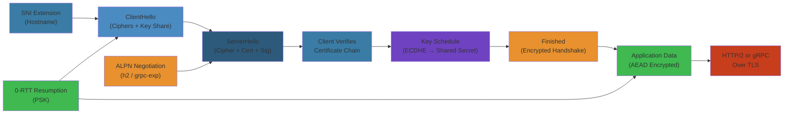
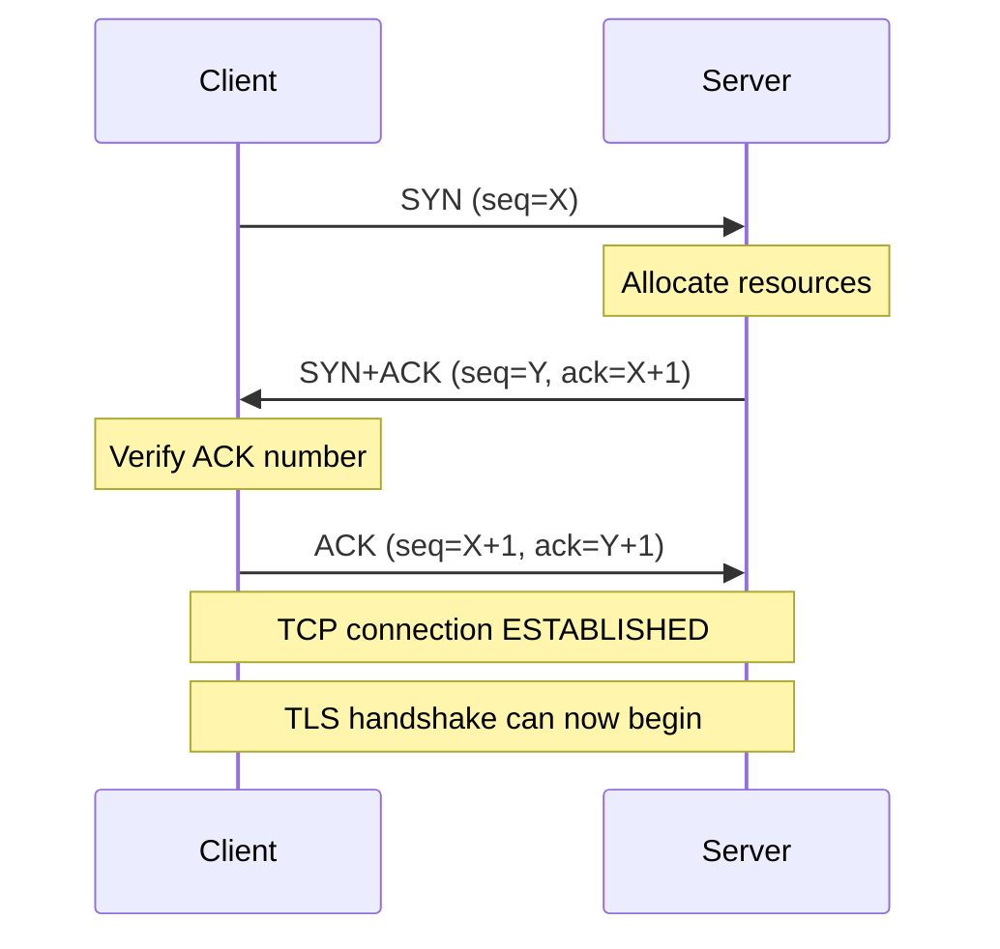
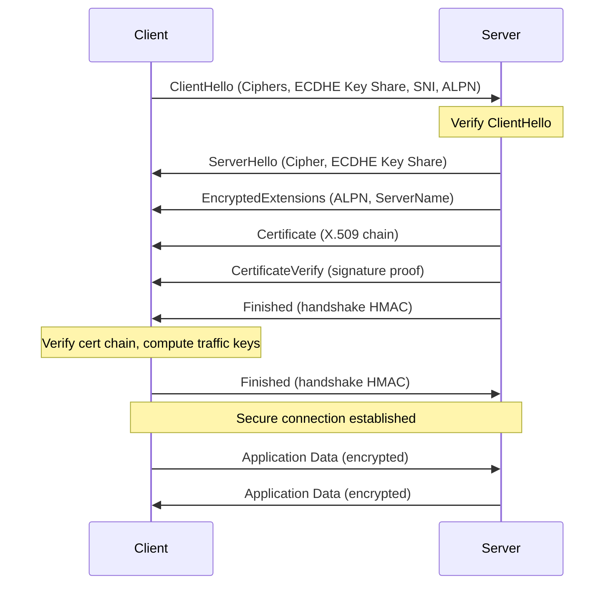

# 🔒 TLS, HTTP & gRPC — Complete Deep Dive

> **Scope**: TLS 1.3 handshake (1-RTT, 0-RTT, PSK, HRR), key schedule, cipher suites, certificate chain, ALPN/SNI, session resumption, HTTP/1.1 keep-alive/pipelining, HTTP/2 binary framing/multiplexing/HPACK/flow control/HOL blocking, HTTP/3 QUIC, gRPC protobuf/streaming/flow control/retry/hedging — complete coverage of the modern application security and transport layer.

> **Related**: [01-tcp-ip-deep-dive.md](/11-networking/01-tcp-ip-deep-dive.md), [04-io-models.md](/12-operating-systems/04-io-models.md)

---

## Layer 1: Beginner Mental Model


**Analogy**: Like a secure phone call. You (client) call someone (server). Before talking, you verify they are who they claim (certificate check = checking caller ID). You agree on a secret code (key exchange), then everything you say is encrypted (TLS). HTTP/2 is like conference calling (multiple conversations on one call). gRPC is like using a shorthand language (protobuf).

**Why it matters**:
- **Stripe, PayPal, Square**: 100% of transactions encrypted. A TLS break = $1B+ fraud, regulatory fines, shut down.
- **Netflix**: 1ms TLS overhead per request × millions = noticeable slowdown. 0-RTT resumption = saved 100M hours of user time.
- **Google**: Switched HTTP/1.1 → HTTP/2, saw 40% faster page loads (multiplexing eliminates head-of-line blocking).
- **Uber**: gRPC internal APIs reduced latency 10x (binary format, multiplexing, connection reuse).

**Core insight**: Security (TLS) and performance (HTTP/2, gRPC) are not separate — they evolved together. Modern web is fast AND secure.

---

## Layer 4: Production Reality


### TLS/HTTP/gRPC Failure Modes


| Failure | Symptoms | Root Cause | Fix |
|---------|----------|-----------|-----|
| **Handshake Latency** | TTFB (Time To First Byte) 200ms | Full 1-RTT handshake + TCP 3-way + TLS | Use session resumption (PSK), 0-RTT, TLS 1.3 (not 1.2) |
| **Certificate Validation** | "Certificate name mismatch" | SAN (Subject Alternative Name) doesn't match hostname | Use wildcard certs (*.example.com) or include both names |
| **HTTP/2 Multiplexing Blocked** | One slow request blocks all others | Flow control window exhausted (receiver can't keep up) | Tune window size (default 64KB), implement buffering |
| **Head-of-Line (HOL) Blocking** | HTTP/1.1 request 1 hangs, request 2 queued | TCP loses packet, TCP waits for retransmit (HOL) | Use HTTP/2 (separate streams, not HOL) or QUIC (packet-level independence) |
| **gRPC Deadlocks** | Bidirectional stream hangs | Both client and server waiting to send (flow control) | Use separate send/receive buffers, respect backpressure |
| **SNI Not Set** | Server sees TLS ClientHello without hostname | Client doesn't send SNI extension (old client) | Ensure TLS client sends SNI (Go 1.0+, Java 7+) |
| **Certificate Chain Incomplete** | Browser shows "untrusted certificate" | Intermediate cert not sent with leaf cert | Include full chain (leaf + intermediate) in cert file |
| **ALPN Negotiation Failure** | Falls back to HTTP/1.1 instead of HTTP/2 | Server doesn't support h2 protocol | Verify ALPN list includes h2 for HTTP/2 |

### Production Incident: Google Search QUIC Rollout (2017)


**Context**: Google deployed QUIC (HTTP/3 precursor) to 1% of Chrome users. QUIC uses UDP instead of TCP.

**What happened**:
- QUIC sent many small UDP packets (IP fragmentation kicked in)
- Middlebox firewalls on ISP networks dropped fragmented packets (thought it was attack)
- 1% of users saw 100% packet loss on certain pages
- Fallback to TCP worked, but QUIC looked broken
- Issue: path MTU discovery broken by middleboxes, QUIC retransmitted, retransmitted, timeout

**The bug**:
```
Client sends 1200-byte QUIC packet
Intermediate firewall sees it (UDP not TCP) → refuses
Client retransmits 3x, gives up
Falls back to TCP (works)

But developers thought QUIC was broken, rolled back
```

**The fix**:
1. Reduce QUIC initial packet size (1200B → 1024B, avoids fragmentation)
2. Add exponential backoff + TCP fallback
3. Detect middlebox interference via QUIC version negotiation
4. Rollout slower: 0.1% → 1% → 10% with monitoring

**Result**: QUIC now used by Google for 30%+ of traffic globally.

---

## Layer 5: Staff Engineer Perspective


### Protocol Tradeoffs


| Protocol | Latency | Throughput | Complexity | Security | Use Case |
|----------|---------|-----------|-----------|----------|----------|
| **HTTP/1.1** | High (6+ RTT) | Low (1 connection) | Low | Good | Legacy systems, simple APIs |
| **HTTP/2** | Medium (2-3 RTT) | High (multiplexed) | Medium | Good | Web browsers, public APIs |
| **HTTP/3 QUIC** | Low (0-1 RTT) | Very high | High | Excellent | Mobile, high-latency networks |
| **gRPC HTTP/2** | Very low (<1ms) | Excellent (binary) | High | Excellent | Internal services, performance critical |
| **gRPC HTTP/3** | Lowest | Excellent | Very high | Excellent | Future internal services |

### Scaling Pattern: Startup → Global


**Stage 1 (Startup)**: HTTP/1.1, self-signed cert
- Works for <1M requests/day
- Cost: free (self-signed), low server overhead
- Caveat: browsers warn "untrusted"

**Stage 2 (Growth)**: HTTP/2, Let's Encrypt cert, CDN
- 10M requests/day, needs multiplexing (HTTP/1.1 creates 6 connections per domain)
- Cost: $0-100/month (CDN), certificate automation free
- Improvement: 3-10x faster TTFB

**Stage 3 (Scale)**: gRPC HTTP/2 for internal APIs, HTTP/2 for external, QUIC pilot
- 1B requests/day, split: public-facing (HTTP/2 with CDN), internal (gRPC)
- Cost: $10K-50K/month (CDN + load balancers + QUIC infrastructure)
- Improvement: <50ms latency p99, better connection reuse

**Stage 4 (Enterprise)**: HTTP/3 QUIC everywhere, custom protocol optimization
- 100B requests/day, global infrastructure, mobile-first
- Cost: $1M+/year (dedicated networking team)
- Benefit: 200ms latency on 4G (QUIC = fast reconnect), multi-path support

**Real example: YouTube**:
- v1 (2005): HTTP/1.1, 6 parallel connections per domain
- v2 (2012): HTTP/2, multiplexing eliminated connection overhead
- v3 (2017): QUIC pilot on 1%, saw 18% improvement in video startup time
- v4 (2020): QUIC at scale, 60%+ of Chrome traffic uses HTTP/3
- Result: global median video start latency dropped 30% (QUIC + CDN optimization)

---

## Layer 5: Interview Questions


### Level 1 (Junior Engineer)


**Q1: What's a TLS handshake? Why does it take extra round trips?**
A: Before sending data, client and server verify each other (certificate check) and agree on encryption keys (key exchange via ECDHE). Takes 1 full RTT (round trip) for 1-RTT handshake, plus TCP 3-way, so ~2 RTT total. Modern TLS 1.3 optimized to 1 RTT.
- Why asked: Security fundamentals
- Expected: Mention certificate, key exchange, RTT cost

**Q2: What's HTTP/2 multiplexing? Why is it better than HTTP/1.1?**
A: HTTP/1.1 = one request per connection (or pipelining = requests queue). HTTP/2 = multiple streams on one connection, server can interleave responses. Result: no head-of-line blocking, one TCP connection instead of 6.
- Why asked: Protocol evolution, performance
- Expected: Understand connection reuse, no HOL

### Level 2 (Mid-Level Engineer)


**Q3: Why use gRPC instead of REST?**
A:
- Binary format (protobuf) vs text (JSON) = smaller payload (10x)
- Multiplexing = one connection, many streams
- Streaming = bidirectional (client→server→client simultaneously)
- Type safety = proto compiler generates code
- Use REST for: public APIs, browser clients. Use gRPC for: internal services, high-performance needs.
- Why asked: API design choice
- Expected: Understand tradeoff (REST simplicity vs gRPC performance)

**Q4: Explain 0-RTT TLS resumption. Why is it risky?**
A: Client sends encrypted data (Early Data) in first message using cached PSK (pre-shared key) from previous session. Server processes immediately, no extra round trips. Risk: replay attack (attacker resubmits Early Data). Mitigation: only use 0-RTT for idempotent requests (GET), server tracks request IDs to reject duplicates.
- Why asked: Performance optimization with security tradeoff
- Expected: Understand PSK, Early Data, replay risk

### Level 3 (Senior Engineer)


**Q5: Design API for 10M global users (North America, Europe, Asia). Which protocol? How do you optimize latency?**
A:
- North America (low latency): HTTP/2 with CDN edge caching (50ms)
- Europe (medium latency): HTTP/2 + QUIC pilot (100ms)
- Asia (high latency): QUIC with connection migration (200ms on 4G due to QUIC fast reconnect)
- Strategy: HTTP/2 primary, QUIC fallback for mobile
- CDN: edge servers in each region, cache responses
- Cost: $100K-500K/month (CloudFlare / Akamai)
- Monitoring: measure TTFB per region, alert if >500ms
- Why asked: Global scale, protocol choice
- Expected: Regional strategy, monitoring, tradeoff thinking

**Q6: A gRPC service is slow. Where would you investigate?**
A:
1. Connection reuse: are connections being pooled? (should be, not creating new per RPC)
2. Backpressure: is receiver slow? (check flow control window, buffer sizes)
3. Serialization: is protobuf fast? (should be, but large messages can be slow)
4. Network: latency to service? (use `grpcurl -plaintext -v` to measure)
5. Server logic: is handler slow? (profile with pprof)
6. Load: is server overloaded? (check CPU/memory, may need horizontal scaling)
- Why asked: Debugging workflow
- Expected: Multiple layers to check

### Level 4 (Staff Engineer)


**Q7: Migrate internal APIs from REST JSON to gRPC. Plan the rollout and estimated impact.**
A:
- Phase 1 (2 weeks): Proto schema design + code generation, gRPC service wrapper (both REST + gRPC available)
- Phase 2 (2 weeks): Client library + documentation, canary (1% traffic) testing
- Phase 3 (4 weeks): Rollout: 10% → 50% → 100%, monitor error rates + latency
- Expected improvements:
  - Payload size: JSON 1KB → protobuf 100B (90% reduction)
  - Latency: REST 50ms → gRPC 10ms (5x, from binary format + multiplexing)
  - Throughput: 10K RPS → 50K RPS per server (binary faster to parse)
- Risks: old clients break if no backwards compatibility (use proto versioning)
- Rollback: keep REST endpoints for 3 months, revert traffic if issues
- Cost: 400 engineering hours + testing, ROI = $5M/year (fewer servers needed)
- Why asked: Large-scale migration, cost/benefit
- Expected: Phased approach, risk mitigation, quantified impact

**Q8: A provider (AWS, Google Cloud) launches HTTP/3 support. Do you adopt? Why/why not?**
A:
- Benefits: faster on high-latency networks (mobile), connection migration (user switches WiFi → 4G seamlessly)
- Costs: debugging harder (UDP loss != TCP), some firewalls block it, limited tooling
- Adoption timeline:
  - Month 1: pilot on 0.1% CDN edge (measure error rates, latency improvement)
  - Month 2: if good, expand to 5%
  - Month 3: full rollout to 50%
  - Month 6: 100% if no regressions
- Decision: adopt if target is mobile-heavy (YouTube, TikTok = yes). Skip if B2B API (AWS/Stripe = maybe later).
- Monitoring: measure p99 latency, error rate, connection drop rate
- Why asked: Technology adoption decision, cost/benefit, rollout strategy
- Expected: Pilot approach, risk assessment, target-dependent decision

---




## Table of Contents


1. [TLS 1.3 Handshake](#1-tls-13-handshake)
2. [TLS 1.3 Key Schedule](#2-tls-13-key-schedule)
3. [Cipher Suites & AEAD](#3-cipher-suites--aead)
4. [Certificate Chain & Validation](#4-certificate-chain--validation)
5. [ALPN & SNI](#5-alpn--sni)
6. [Session Resumption & 0-RTT](#6-session-resumption--0-rtt)
7. [TCP + TLS Overhead](#7-tcp--tls-overhead)
8. [HTTP/1.1](#8-http11)
9. [HTTP/2](#9-http2)
10. [HTTP/3 & QUIC](#10-http3--quic)
11. [gRPC & Protobuf](#11-grpc--protobuf)
12. [Internals](#12-internals)
13. [Failure Analysis](#13-failure-analysis)
14. [Edge Cases](#14-edge-cases)
15. [Performance](#15-performance)
16. [Simplest Mental Model](#16-simplest-mental-model)

---

## 0. TCP 3-Way Handshake (Foundation)

Before TLS can begin, a TCP connection must be established. This is the foundation layer:



**Latency cost**: 1 RTT (round trip time) for TCP connection establishment.

**Sequence number handling**:
- Client sends SYN with initial sequence number X
- Server sends SYN+ACK with its own sequence Y and acknowledges X+1
- Client sends final ACK acknowledging Y+1
- Both sides now synchronized on byte counts

---

## 1. TLS 1.3 Handshake


### Full 1-RTT Handshake



```
Client                                      Server
  │                                             │
  │  ClientHello                                 │
  │  ├─ Protocol Version: TLS 1.3               │
  │  ├─ Random (32 bytes)                       │
  │  ├─ Cipher Suites (e.g., TLS_AES_128_GCM)   │
  │  ├─ Key Share: (EC)DHE public key           │  ← "key_share" extension
  │  ├─ Signature Algorithms                     │
  │  ├─ Supported Versions                      │
  │  ├─ PSK Key Exchange Modes                  │
  │  └─ Extensions (SNI, ALPN, etc.)            │
  │                    │                         │
  │───────────────────►│                         │
  │                    │                         │
  │                    │  ServerHello            │
  │                    │  ├─ Cipher Suite        │
  │                    │  ├─ Key Share: server   │
  │                    │  │   (EC)DHE public key │
  │                    │  └─ (Now both have      │
  │                    │      shared secret via  │
  │                    │      ECDHE)             │
  │                    │                         │
  │                    │  EncryptedExtensions    │  ← encrypted with handshake key
  │                    │  ├─ ALPN, SNI response  │
  │                    │  └─ Server cert info    │
  │                    │                         │
  │                    │  Certificate            │  ← encrypted
  │                    │  └─ Server's X.509 cert │
  │                    │                         │
  │                    │  CertificateVerify      │  ← proves server owns private key
  │                    │                         │
  │                    │  Finished               │  ← HMAC of all handshake messages
  │                    │                         │
  │  ◄─────────────────│                         │
  │                    │                         │
  │  Client: compute traffic keys                │
  │  Send: Finished (also HMAC verify)          │
  │                    │                         │
  │───────────────────►│                         │
  │                    │                         │
  │  Application Data  │  Application Data       │
  │  (encrypted ✓)     │  (encrypted ✓)          │
  │                    │                         │
  │═══════════════════►│════════════════════════►│
  │───────────────────►│◄════════════════════════│
  │                    │                         │

  Total: 1-RTT for handshake + 1-RTT for data = 1 round trip
  → Client sends Application Data in Flight 3 (after receiving ServerHello)
```

### 0-RTT Handshake (Early Data)


```
Client with cached PSK (from previous session):
  │                                             │
  │  ClientHello                                 │
  │  ├─ PSK key exchange mode                   │
  │  ├─ PSK identity (session ticket)           │
  │  ├─ (EC)DHE key share (optional)            │
  │  └─ pre_shared_key extension                │
  │                                             │
  │  Early Data (0-RTT) — already encrypted!    │
  │  ├─ HTTP GET /...                           │  ← encrypted with 0-RTT keys
  │  └─ Idempotent requests only!               │
  │                    │                         │
  │───────────────────►│                         │
  │                    │                         │
  │                    │  ServerHello            │
  │                    │  Server decrypts early  │
  │                    │  data using PSK         │
  │                    │  Process immediately!   │
  │                    │                         │
  │                    │  EncryptedExtensions    │
  │                    │  CertificateVerify      │
  │                    │  Finished               │
  │                    │                         │
  │                    │  Application Data       │
  │  ◄─────────────────│                         │
  │                                             │
  │  Client: switch to 1-RTT traffic keys       │
  │                                             │

  Total: 0-RTT for early data!
  → Client sends data immediately after ClientHello
  → Server processes before receiving all handshake messages!
  → Only for idempotent operations (GET, not POST)
  → Anti-replay protection via server
```

### HelloRetryRequest (HRR)


```
When server doesn't support client's key share group:
  Client                                    Server
    │                                           │
    │  ClientHello (key_share: x25519)          │
    │──────────────────►                        │
    │                                           │
    │  ◄── HelloRetryRequest                    │
    │      ├─ Key share group: secp384r1        │
    │      └─ Cookie (for server state)         │
    │                                           │
    │  ClientHello (new key_share: secp384r1)   │
    │  + cookie                                  │
    │──────────────────►                        │
    │                                           │
    │  Continued as normal 1-RTT handshake      │
    │                                           │

  Cost: HRR adds one extra round trip
  Mitigation: Client should include multiple key shares
```

---

## 2. TLS 1.3 Key Schedule


```
PSK (from session ticket or external)    (EC)DHE (from key_share)
        │                                       │
        └──────────────┬───────────────────────┘
                       │
                       ▼
              HKDF-Extract = Early Secret
                       │
          ┌────────────┼────────────┐
          ▼            ▼            ▼
    bint_early_secret  │   [derived_secret]
    (0-RTT keys)       │            │
                       │   HKDF-Extract (PSK + (EC)DHE shared secret)
                       │            │
                       ▼            ▼
              HKDF-Extract = Handshake Secret
                       │
          ┌────────────┼────────────┐
          ▼            ▼            ▼
    client_hs_traffic  │   server_hs_traffic
    secret (encrypt    │   secret (encrypt
    ClientHello-       │   ServerHello-
    Finished)          │   Finished)
                       │
               HKDF-Extract (Handshake Secret + 0)
                       │
                       ▼
              HKDF-Extract = Master Secret
                       │
          ┌────────────┼────────────┐
          ▼            ▼            ▼
    client_app_traffic │   server_app_traffic
    secret (encrypt    │   secret (encrypt
    all client data)   │   all server data)
                       │
          ┌────────────┘
          ▼
    Exporter Secret (for key material export)
          │
          ▼
    Resumption Secret (for PSK on next connection)
```

### Key Derivation Steps


```
Derive-Secret(Secret, Label, Messages) = HKDF-Expand-Label(Secret, Label,
    Hash(Messages), Hash.length)

The "traffic secrets" are different for each direction:
  - client_application_traffic_secret_0
  - server_application_traffic_secret_0

Each is 256 bits (SHA-256) or 384 bits (SHA-384)
```

### 0-RTT Key Derivation


```
Early Secret → client_early_traffic_secret

BUT this key is derived only from PSK — NOT from (EC)DHE
  → 0-RTT data is PFS only if PSK is combined with fresh (EC)DHE
  → But 0-RTT is sent before (EC)DHE is used
  → 0-RTT does NOT have forward secrecy!
```

---

## 3. Cipher Suites & AEAD


### TLS 1.3 Cipher Suites


```
TLS_AES_128_GCM_SHA256         (0x1301) — default, most common
TLS_AES_256_GCM_SHA384         (0x1302) — stronger AES, slower
TLS_CHACHA20_POLY1305_SHA256   (0x1303) — fast without AES-NI (mobile)
```

### AEAD (Authenticated Encryption with Associated Data)


```
AEAD combines encryption + authentication in one operation.

Encryption:
  ciphertext = AES-128-GCM-Encrypt(key, nonce, plaintext, aad)
  output: ciphertext + authentication tag (16 bytes)

Decryption:
  plaintext = AES-128-GCM-Decrypt(key, nonce, ciphertext, tag, aad)
  → fails if tag doesn't match → data integrity violation

Nonce construction (TLS 1.3):
  - 4 bytes fixed (derived from key)
  - 8 bytes sequence number (per record)
  - Or: 12 bytes from write_iv XOR sequence number

AEAD provides:
  - Confidentiality (no one can read plaintext)
  - Integrity (no one can modify ciphertext)
  - Authentication (sender is who we think — via key)
```

### Perfect Forward Secrecy (PFS)


```
If private key is compromised:
  - Old sessions ARE still secure (PFS ✓)
  - Because session key = PSK + (EC)DHE shared secret
  - Ephemeral DHE keys are discarded after handshake

Only exception: 0-RTT data (no (EC)DHE involved)

In TLS 1.3: PFS is mandatory (no static RSA key exchange)
In TLS 1.2: optional (DHE cipher suites)
```

---

## 4. Certificate Chain & Validation


```
Certificate Chain:
  ┌──────────────────────────────────────┐
  │  Root CA Certificate                 │
  │  (self-signed, in trust store)       │
  │  Subject: /CN=Root CA               │
  │  Issuer: /CN=Root CA                │
  │  Signature: signed by Root CA       │
  └──────────────┬───────────────────────┘
                 │ signed
                 ▼
  ┌──────────────────────────────────────┐
  │  Intermediate CA Certificate         │
  │  Subject: /CN=Intermediate CA        │
  │  Issuer: /CN=Root CA                 │
  │  Signature: signed by Root CA        │
  └──────────────┬───────────────────────┘
                 │ signed
                 ▼
  ┌──────────────────────────────────────┐
  │  Leaf (Server) Certificate           │
  │  Subject: /CN=*.example.com          │
  │  SAN: DNS:example.com, *.example.com │
  │  Issuer: /CN=Intermediate CA         │
  │  Signature: signed by Intermediate   │
  │                                      │
  │  X.509v3:                            │
  │  ├─ Validity: not before / after     │
  │  ├─ Key Usage: Digital Signature     │
  │  ├─ Extended Key Usage: TLS Server   │
  │  ├─ Subject Alternative Name (SAN)   │
  │  ├─ Basic Constraints: CA=FALSE      │
  │  └─ CRL Distribution Points          │
  └──────────────────────────────────────┘
```

### Certificate Validation


```
1. Chain building:
   - Build chain from leaf to trusted root
   - Each issuer matches next certificate's subject

2. Signature verification:
   - Each certificate validates the next one's signature
   - Leaf: use CA's public key
   - Root: self-signed (trust anchor)

3. Validity period:
   - Current time within notBefore/notAfter

4. Hostname verification:
   - Server hostname matches SAN or CN
   - Wildcard: *.example.com matches www.example.com

5. Revocation check:
   - CRL (Certificate Revocation List) — infrequently updated
   - OCSP (Online Certificate Status Protocol) — real-time check
   - OCSP Stapling: server provides signed OCSP response during handshake
     (avoids client connecting to CA for OCSP)
```

### OCSP Stapling


```
Without stapling:
  Client → CA's OCSP responder → "Is this cert revoked?"
  → Adds latency, privacy concern (CA knows what sites you visit)

With stapling:
  Server periodically fetches OCSP response from CA
  Server includes signed OCSP response in Certificate message
  Client validates OCSP response (signed by CA)
  → No extra round trip, no privacy leak
```

### Certificate Pinning vs CAA


```
Certificate Pinning (HPKP — deprecated, dangerous):
  - Client remembers which CA issued the cert
  - If cert from different CA on next connection → reject
  - Too dangerous: key rotation broke sites, HPKP removed from Chrome

CAA (DNS Certification Authority Authorization):
  - DNS record: example.com  CAA  0 issue "letsencrypt.org"
  - Only Let's Encrypt can issue certificates for example.com
  - CA checks CAA record before issuing
  - Not a client-side check — it's a CA policy check
```

---

## 5. ALPN & SNI


### SNI (Server Name Indication)


```
Client sends hostname in ClientHello:
  Extension: server_name = "api.example.com"

Server uses this to:
  - Select correct certificate (for multi-tenant servers)
  - Without SNI: server would use default cert

Encrypted SNI (ESNI) / ECH (Encrypted Client Hello, TLS 1.3):
  - Encrypts the SNI field using server's public key
  - Fixes the privacy leak: observer can see what site you're visiting
  - ECH = Encrypted Client Hello (encrypts more than just SNI)
  - DNS HTTPS record provides the encryption key
```

### ALPN (Application-Layer Protocol Negotiation)


```
Client sends in ClientHello:
  Extension: alpn = ["h2", "http/1.1", "grpc-exp"]

Server picks the most preferred protocol it supports:
  "h2" → HTTP/2
  "http/1.1" → HTTP/1.1
  "grpc-exp" → gRPC (often uses h2)

Avoids: HTTP/1.1 Upgrade: h2c (cleartext HTTP/2 upgrade)
  → TLS-only HTTP/2 in browsers (no cleartext HTTP/2)
```

---

## 6. Session Resumption & 0-RTT


### Session Ticket (PSK)


```
Full handshake:
  Client                                    Server
    │                                           │
    │  Full 1-RTT handshake                     │
    │─────────────────►◄───────────────────────│
    │                                           │
    │  New Session Ticket ◄─────────────────    │
    │  ├─ ticket (encrypted by server)          │  ← PSK identity
    │  ├─ ticket_age_add                       │
    │  ├─ lifetime_hint (e.g., 7200 seconds)    │
    │  └─ obfuscated_ticket_age                 │
    │                                           │
  Client caches ticket with session keys.

Resumption handshake:
    │                                           │
    │  ClientHello (includes PSK extension)     │
    │  ├─ pre_shared_key = ticket               │
    │  ├─ psk_key_exchange_modes               │
    │  └─ (EC)DHE optional (for PFS)           │
    │─────────────────►                         │
    │                          [1-RTT total!]  │
    │  Application data at Flight 3             │
    │  (1-RTT delay saved)                     │

0-RTT (with early data):
  Client sends data immediately after ClientHello:
    → 0 additional round trips!
    → Data protected with PSK-derived key
    → Forward secrecy NOT guaranteed (no (EC)DHE)
    → Anti-replay: server must reject replayed 0-RTT data
```

### Anti-Replay for 0-RTT


```
Since 0-RTT data can be intercepted and replayed:
  1. Server remembers received 0-RTT (client_random cache)
  2. Single-use tickets (client can't replay same ticket)
  3. Fresh (EC)DHE in resumption provides PFS
  4. Only idempotent HTTP verbs (GET, HEAD, OPTIONS)
  5. max_early_data_size limits replay impact
```

---

## 7. TCP + TLS Overhead


```
Connection type                       Round trips to first data
───────────────────────────────────────────────────────────────
HTTP (no TLS):                       1.5 RTT (SYN + SYN/ACK + ACK+data)
HTTPS new connection:                3 RTT (TCP SYN + TLS 1.3 1-RTT)
HTTPS resumed (session ticket):      2 RTT (TCP SYN + TLS 1.3 1-RTT)
HTTPS 0-RTT (early data):           1 RTT (TCP SYN + 0-RTT data)
HTTPS + TFO + 0-RTT:                0 RTT (TFO SYN + 0-RTT data!)

Transmitted bytes (handshake only):
  TCP handshake:       ~120 bytes
  TLS 1.3 full:        ~4-6 KB (certificates dominate)
  TLS 1.3 resume:      ~500 bytes (no certificate)
  TLS 1.3 0-RTT:       ~500 bytes + early data
```

---

## 8. HTTP/1.1


### Persistent Connections (Keep-Alive)


```
HTTP/1.0: new TCP connection per request
HTTP/1.1: reuse connection (Connection: keep-alive by default)

Benefits:
  - No TCP handshake per request (save 1 RTT)
  - No slow start per request
  - TCP connection "warm" (cwnd already grown)

Drawbacks:
  - Head-of-line blocking: one request at a time per connection
```

### Pipelining


```
Request 1 ────► Request 2 ────► Request 3 ────►
                     Response 1 ◄──── Response 2 ◄───

Benefits: Send multiple requests without waiting for responses
Problem: Responses must be in order — if one response is slow,
         all subsequent responses are blocked
Known as: HTTP/1.1 Head-of-Line blocking

Pipelining support:
  - Most browsers disabled due to proxy compatibility issues
  - HTTP/2 replaces pipelining with true multiplexing
```

### Chunked Transfer Encoding


```
Used when Content-Length is unknown at start of response

Response:
  HTTP/1.1 200 OK
  Transfer-Encoding: chunked

  5\r\n          ← chunk size (hex)
  Hello\r\n      ← chunk data
  7\r\n
  , World\r\n
  0\r\n          ← final chunk (size=0)
  \r\n           ← trailer

Each chunk:
  <size in hex>\r\n
  <data>\r\n

Final chunk: size 0, optionally followed by trailers
Allows: streaming responses (SSE, real-time data)
```

### 100 Continue


```
Client sends:    Expect: 100-continue
Server responds: 100 Continue (client should send body) OR
                 417 Expectation Failed (reject body)

Purpose: Client checks if server accepts the request
         before sending a large body
```

---

## 9. HTTP/2


### Binary Framing


```
HTTP/1.1: text-based (headers and body, delimited by \r\n)
HTTP/2:   binary-based (frames)

Frame format:
  ┌─────────────────────────────────────────────┐
  │ Length (24 bits)   │ Type (8) │ Flags (8)  │
  ├────────────────────┴──────────┴────────────┤
  │ R │ Stream Identifier (31 bits)             │
  ├────────────────────────────────────────────┤
  │ Frame Payload                           ... │
  └────────────────────────────────────────────┘

Frame types:
  DATA:      Body data
  HEADERS:   HTTP headers (opening a new stream)
  PRIORITY:  Stream priority
  RST_STREAM: Terminate a stream (error or cancel)
  SETTINGS:  Connection-level settings
  PUSH_PROMISE: Server push (deprecated in RFC 9113)
  PING:      Heartbeat/RTT measurement
  GOAWAY:    Graceful shutdown
  WINDOW_UPDATE: Flow control
  CONTINUATION: Continued HEADERS block
```

### Multiplexing


```
HTTP/1.1 (one request at a time):
  Connection:   [REQ1......RESP1][REQ2......RESP2][REQ3......RESP3]

HTTP/2 (multiple concurrent streams):
  Connection:   [REQ1][REQ2][REQ3][RESP1][RESP2][RESP3]
                  ║      ║      ║      ║      ║      ║
                Stream Stream Stream Stream Stream Stream
                  1      3      5      1      3      5
                (interleaved on one TCP connection)

Each stream is independent:
  - Stream 1 is a GET /index.html
  - Stream 3 is a GET /style.css
  - Stream 5 is a GET /app.js
  - Responses arrive in any order (no HOL at HTTP level!)
```

### Stream Priority (RFC 9218 — Extensible Priorities)


```
Old system (RFC 7540, deprecated):
  - Exclusive flag, weight (1-256), parent stream ID
  - Complex dependency tree

New system (RFC 9218):
  - Urgency: 0-7 (0=highest, 7=lowest)
  - Incremental: boolean (can other streams interleave)
  - Priority field in HEADERS frame
  - Much simpler, better HTTP/3 compatibility
```

### HPACK (Header Compression)


```
HPACK compresses HTTP headers using:
  1. Static table (pre-defined common headers — 61 entries)
  2. Dynamic table (entries learned during connection)
  3. Huffman encoding
  4. Indexed / Literal representation

Static table entries (examples):
  Index 1:  :authority
  Index 2:  :method GET
  Index 3:  :method POST
  Index 4:  :path /
  Index 5:  :path /index.html
  Index 6:  :scheme http
  Index 7:  :scheme https
  ...

Header encoding:
  Indexed:      just send the index (1 byte)
  Literal + index: new header value, add to table
  Literal (no index): header doesn't go in table

Compression example:
  Uncompressed:  "GET /index.html HTTP/1.1; Host: example.com" = ~45 bytes
  HPACK:        :method=GET (idx 2), :path=/index.html (idx 5), :authority=example.com (literal) = ~20 bytes

HPACK Security:
  - CRIME attack: HPACK compression leaks content
  - BREACH attack: same for response body compression
  - Mitigation: disable compression, use random CSRF tokens
```

### QPACK (HTTP/3 Header Compression)


```
HTTP/3/QUIC doesn't have ordering guarantees → HPACK broken on multiple streams

QPACK solves:
  - Encoder stream: transmits table updates (ordered)
  - Decoder stream: transmits acknowledgments (ordered)
  - Request streams: use table snapshots (can reference encoder stream)
  - Indexed references: may require blocking until table is confirmed

QPACK is HPACK adapted for unordered delivery
```

### Server Push (Deprecated in RFC 9113)


```
Server proactively sends resources before client requests them:
  PUSH_PROMISE frame on stream 1 (the request stream)
    :path = /style.css
    :method = GET
  Server then sends HEADERS + DATA for style.css on new stream

Problems:
  - Browser knows its own cache — server doesn't
  - Wasted bandwidth for cached resources
  - Complex push-cache semantics
  - Deprecated in RFC 9113, removed in HTTP/3

Replaced by: 103 Early Hints (HTTP status code 103)
```

### Flow Control


```
HTTP/2 flow control: per-stream and per-connection

Initial window: 65535 bytes (64KB) — SETTINGS_INITIAL_WINDOW_SIZE
  Can be increased to 16MB+ via SETTINGS frame

WINDOW_UPDATE frame:
  - Increases window for stream or connection
  - Window = current_window + increment (from WINDOW_UPDATE)
  - Negative window: sender must buffer/pause until WINDOW_UPDATE

Flow control is credit-based:
  Sender can only send while it has window credit remaining
  Receiver grants credit via WINDOW_UPDATE as it consumes data

Important: Flow control only applies to DATA frames
  HEADERS frames are not flow controlled
```

### HTTP/2 Head-of-Line Block (TCP Level)


```
HTTP/2 solves HTTP-level HOL (multiplexed streams)
But TCP-level HOL persists:
  - One TCP connection carries all streams
  - If a single TCP segment is lost → ALL streams are blocked
  - Lost segment stalls TCP reassembly → no data from any stream
  - Recovery requires RTT (RTO or fast retransmit)

TCP HOL blocking is the main motivation for QUIC/HTTP/3
```

---

## 10. HTTP/3 & QUIC


```
QUIC: Quick UDP Internet Connections

┌──────────────────────────────────────────────┐
│  Application                                 │
├──────────────────────────────────────────────┤
│  HTTP/3 (HTTP over QUIC)                     │
├──────────────────────────────────────────────┤
│  QUIC Transport                              │
│  ├─ Packet protection (TLS 1.3 integrated)  │
│  ├─ Stream multiplexing                      │
│  ├─ Connection migration                     │
│  └─ Loss recovery (custom, not TCP)          │
├──────────────────────────────────────────────┤
│  UDP (for interoperability with NATs)         │
└──────────────────────────────────────────────┘
```

### QUIC Key Features


```
1. UDP-based: Works through NATs and firewalls (no kernel TCP stack needed)
2. Stream multiplexing: Multiple independent streams in one connection
   - Packet loss on Stream 3 → only Stream 3 affected!
   - No TCP HOL blocking ✓
3. TLS 1.3 integrated: Handshake is part of QUIC crypto
4. Connection migration: Change IP address without reconnection
   - Connection identified by Connection ID (not IP:port)
   - Works across WiFi → Cellular handoff
5. 0-RTT: Send data immediately (like TLS 1.3 0-RTT)
6. Stream types: uni-directional + bi-directional
```

### QUIC Handshake


```
1-RTT handshake:
  Client                          Server
    │                                 │
    │  ClientHello (+ QUIC params)    │
    │─────────────────►               │
    │                                 │
    │  ◄── ServerHello (+ QUIC params)│
    │  ◄── Certificate               │
    │  ◄── CertificateVerify         │
    │  ◄── Finished                   │
    │  (All encrypted)               │
    │                                 │
    │  Client: send data on Stream 1  │
    │─────────────────►               │
    │  Server: send data on Stream 1  │
    │  ◄────────────────              │

0-RTT handshake (repeat visitor):
  Client                          Server
    │                                 │
    │  ClientHello (PSK)              │
    │  0-RTT data (Stream 1)           │
    │─────────────────►               │
    │  (Server processes immediately!) │
    │  ◄── ServerHello                │
    │  ◄── Finished                   │
    │  ◄── 0-RTT accepted             │
    │  ◄── Data                       │
```

### QUIC vs TCP + TLS + HTTP/2


```
Feature                TCP + TLS + HTTP/2        QUIC + HTTP/3
─────────────────────────────────────────────────────────────
Transport layer        TCP (kernel)              QUIC (userspace/UDP)
Handshake              TCP 1-RTT + TLS 1-RTT    QUIC 1-RTT (integrated)
0-RTT support          TLS 0-RTT (but TCP 1RTT) QUIC 0-RTT (true 0RTT)
Stream  HOL blocking   Yes (TCP)                No (per-stream loss)
Connection migration   No (new connection)      Yes (Connection ID)
Header compression     HPACK                    QPACK
Protocol               3 layers (TCP+TLS+HTTP2) 1 integrated layer
Userspace impl.        Needs kernel for TCP     Full userspace (quiche, lsquic)
```

---

## 11. gRPC & Protobuf


### Protobuf Wire Format


```
Protocol Buffers — binary serialization format

Message definition:
  message Person {
    string name = 1;        // field number 1
    int32 age = 2;          // field number 2
    repeated string tags = 3; // field number 3, repeated
  }

Wire format:
  Field encoding: (field_number << 3) | wire_type

  Wire types:
    0: Varint (int32, int64, uint32, bool, enum)
    1: 64-bit (fixed64, sfixed64, double)
    2: Length-delimited (string, bytes, embedded messages, packed repeated)
    5: 32-bit (fixed32, sfixed32, float)

  Person{name="Alice", age=30}:
  0A 05 41 6C 69 63 65      // tag=1/type=2, length=5, "Alice"
  10 1E                     // tag=2/type=0, varint 30

Varint encoding:
  - Small numbers use fewer bytes
  - 0-127: 1 byte
  - 128-16383: 2 bytes
  - Each byte: bit 7 = continue flag, bits 0-6 = data
  - Example: 300 → 0xAC 0x02 = 1010 1100 0000 0010

Zigzag encoding (signed int32/int64):
  uint32 = (n << 1) ^ (n >> 31)  // signed → unsigned
  -1 → 1, 1 → 2, -2 → 3, etc.
```

### gRPC over HTTP/2


```
gRPC uses HTTP/2 as transport:

Unary call:
  Client sends:    HEADERS (path: /package.Service/Method, content-type: application/grpc)
                   DATA (length-prefixed protobuf message)
  Server responds: HEADERS (status: 200)
                   DATA (response protobuf)
                   HEADERS (grpc-status: 0, trailing)

Streaming:
  Server streaming:
    Client: HEADERS + DATA (request)
    Server: DATA (resp 1), DATA (resp 2), ..., HEADERS (trailers)

  Client streaming:
    Client: HEADERS, DATA (req 1), DATA (req 2), ..., half-close
    Server: DATA + HEADERS (done)

  Bidirectional:
    Client: HEADERS
    Both: interleaved DATA frames on same stream
    Independent: client sends messages 1,2,3 while receiving A,B,C

gRPC-Web: gRPC over HTTP/1.1 (via proxy)
  - Envoy proxy converts HTTP/1.1 ↔ gRPC HTTP/2
  - gRPC-Web client (JS) sends HTTP/1.1 requests
  - Proxy performs the HTTP/2 -> gRPC conversion
```

### gRPC Flow Control


```
gRPC uses HTTP/2 flow control (WINDOW_UPDATE)

Default HTTP/2 window: 64KB per stream
gRPC connection window: larger (often 4MB+)
gRPC stream window: 64KB (can increase via SETTINGS)

Flow control in streaming:
  - Server cannot send more than window bytes before WINDOW_UPDATE
  - Client sends WINDOW_UPDATE as it processes messages
  - Backpressure: slow client → window fills → server pauses → natural throttling
```

### gRPC Deadlines & Timeouts


```go
// Client sets deadline
ctx, cancel := context.WithTimeout(context.Background(), 5*time.Second)
defer cancel()

resp, err := client.SayHello(ctx, &pb.HelloRequest{Name: "Alice"})
// Server receives deadline via grpc-timeout header
// If exceeded: DEADLINE_EXCEEDED status
```

### gRPC Metadata


```go
// Client metadata (like HTTP headers)
md := metadata.Pairs("authorization", "Bearer token123")
ctx := metadata.NewOutgoingContext(context.Background(), md)

// Server reads metadata
md, ok := metadata.FromIncomingContext(ctx)
token := md["authorization"][0]
```

### gRPC Cancellation


```go
// Client cancels
ctx, cancel := context.WithCancel(context.Background())
// ... start streaming ...
cancel() // → RST_STREAM with CANCEL error

// Server detects cancellation
<-ctx.Done()
// ctx.Err() = context.Canceled
```

### gRPC Retry & Hedging


```yaml
# gRPC service config for retry
retryPolicy:
  maxAttempts: 4
  initialBackoff: 0.1s
  maxBackoff: 5s
  backoffMultiplier: 2
  retryableStatusCodes: [UNAVAILABLE, DEADLINE_EXCEEDED]
```

```
Retry:
  1. Send request
  2. On retryable status code (e.g., UNAVAILABLE)
  3. Wait backoff (exponential: 100ms, 200ms, 400ms, ...)
  4. Retry with new attempt
  5. Success → return result
  6. All attempts fail → return last error

Hedging:
  1. Send request
  2. After hedgingDelay (e.g., 1s) without response
  3. Send second speculative request
  4. Both in-flight — first to respond wins
  5. Cancels remaining requests
  6. Reduces tail latency at cost of extra server load!
```

### gRPC Performance (vs REST JSON)


```
                gRPC+Protobuf         REST+JSON
──────────────────────────────────────────────────
Serialization:  ~100ns, ~30 bytes     ~1μs, ~200 bytes
Message size:   ~30 bytes for Person  ~200 bytes for {"name":"Alice","age":30}
Deserialize:    ~200ns                ~2μs
Throughput:     ~20k+ req/s/core      ~5k req/s/core

Benchmark (HelloWorld, 1KB message):
  gRPC:   ~120μs per call (local)
  REST:   ~400μs per call (local, including JSON parse)

Zero-copy: Protobuf can avoid string copies in some languages
```

---

## 12. Internals


### TLS 1.3 Record Layer


```
Plaintext record:
  ┌─────────────────────────────────────┐
  │ Content Type (1 byte)               │  23 = application data
  │ Legacy Record Version (2 bytes)     │  0x0303 (TLS 1.2 legacy)
  │ Length (2 bytes)                    │
  │ Protocol Message (variable)         │
  └─────────────────────────────────────┘

Encrypted record (TLS 1.3):
  ┌─────────────────────────────────────┐
  │ Content Type (1 byte)               │  23 = application data
  │ Legacy Record Version (2 bytes)     │  0x0303
  │ Length (2 bytes)                    │
  │                                      │
  │ Encrypted payload:                   │
  │   TLSInnerPlaintext + content_type  │ ← plaintext encrypted
  │   AEAD tag (16 bytes)              │
  └─────────────────────────────────────┘

TLS 1.3 encrypts the content type too — no more "I can see this is a TLS record"
```

### HTTP/2 Frame Processing


```c
// Simplified HTTP/2 frame handler
void process_frame(struct h2_session *sess, uint8_t *data, size_t len) {
    // Read frame header
    uint32_t length = (data[0] << 16) | (data[1] << 8) | data[2];
    uint8_t type = data[3];
    uint8_t flags = data[4];
    uint32_t stream_id = be32toh(*(uint32_t *)&data[5]) & 0x7FFFFFFF;

    switch (type) {
    case H2_FRAME_DATA:
        // Apply flow control: reduce window for stream and connection
        // If window would go negative, buffer until WINDOW_UPDATE
        // Check END_STREAM flag → half-close stream
        break;
    case H2_FRAME_HEADERS:
        // Decode HPACK header block
        // Open new stream (if stream_id == 0 → connection error)
        // Check END_HEADERS flag → continue with CONTINUATION frames
        break;
    case H2_FRAME_SETTINGS:
        // Update connection parameters
        // SETTINGS_HEADER_TABLE_SIZE, SETTINGS_INITIAL_WINDOW_SIZE, etc.
        break;
    case H2_FRAME_WINDOW_UPDATE:
        // Increase flow control window
        // Check for overflow (window would exceed 2^31-1)
        break;
    case H2_FRAME_PRIORITY:
        // Update stream priority tree (RFC 7540) or urgency (RFC 9218)
        break;
    case H2_FRAME_RST_STREAM:
        // Terminate stream with error code
        break;
    }
}
```

### Protobuf Encoding (C++ optimized)


```cpp
// Protobuf zero-copy string deserialization
bool Person::ParseFromArray(const void* data, int size) {
    // Read varint tag at current position
    while (ptr < end) {
        uint64_t tag;
        ptr = io::CodedInputStream::ReadVarint64(ptr, &tag);
        int field_number = tag >> 3;
        WireType wire_type = (WireType)(tag & 0x07);

        switch (field_number) {
        case 1: // name (string, wire type 2)
            uint64_t length;
            ptr = ReadVarint64(ptr, &length);
            name_.assign(reinterpret_cast<const char*>(ptr), length);
            ptr += length;
            break;
        case 2: // age (int32, wire type 0)
            uint64_t varint;
            ptr = ReadVarint64(ptr, &varint);
            age_ = varint;  // For int32, just assign
            break;
        }
    }
}
```

---

## 13. Failure Analysis


### TLS Handshake Failures


```
1. Certificate expired:
   → "certificate has expired" or "SSL_ERROR_EXPIRED"
   → Check notBefore/notAfter

2. Certificate hostname mismatch:
   → "Hostname mismatch" or "SSL_ERROR_BAD_CERT_DOMAIN"
   → SAN doesn't cover the hostname

3. Untrusted root:
   → "Certificate signed by unknown authority"
   → Root CA not in trust store, or missing intermediates

4. Revoked certificate (CRL/OCSP):
   → "The certificate was revoked"
   → Check CRL distribution point

5. Protocol version mismatch:
   → "TLS version not supported"
   → Client wants TLS 1.3, server only supports 1.2

6. Cipher suite mismatch:
   → "No shared cipher"
   → No overlap between client and server cipher lists

7. ALPN mismatch:
   → "h2" requested, server doesn't support HTTP/2
   → Fall back to http/1.1
```

### HTTP/2 GOAWAY & Graceful Shutdown


```
Server sends GOAWAY:
  ┌─────────────────────────────────────────────┐
  │ GOAWAY frame                                 │
  │ Last Stream ID: current processing boundary │
  │ Error Code: NO_ERROR (0)                    │
  │ Debug data: optional                        │
  └─────────────────────────────────────────────┘

Client behavior:
  - Accepts streams up to Last-Stream-ID
  - New streams sent to different connection
  - After processing remaining streams, close connection

Graceful shutdown:
  1. Server sends GOAWAY with Last-Stream-ID = max processed
  2. Continues processing existing streams
  3. Sends GOAWAY again with Last-Stream-ID = last processed
  4. Connection closes
```

### gRPC Status Codes


```
OK                  = 0   — success
CANCELLED           = 1   — operation cancelled (usually by caller)
UNKNOWN             = 2   — unknown error
INVALID_ARGUMENT    = 3   — client specified invalid argument
DEADLINE_EXCEEDED   = 4   — deadline expired before operation completed
NOT_FOUND           = 5   — requested entity not found
ALREADY_EXISTS      = 6   — entity already exists
PERMISSION_DENIED   = 7   — caller doesn't have permission
UNAUTHENTICATED     = 16  — request not authenticated
RESOURCE_EXHAUSTED  = 8   — resource quota exhausted
FAILED_PRECONDITION = 9   — system not in required state
ABORTED             = 10  — operation aborted (conflict, retry)
OUT_OF_RANGE        = 11  — operation beyond valid range
UNIMPLEMENTED       = 12  — operation not implemented
INTERNAL            = 13  — internal error (bug)
UNAVAILABLE         = 14  — service temporarily unavailable (retry!)
DATA_LOSS           = 15  — unrecoverable data loss
```

---

## 14. Edge Cases


- **TLS 1.3 + middleboxes**: Middleboxes don't understand encrypted handshake → may drop connections → use anti-rollback mechanism
- **0-RTT replay**: Network middleware may replay 0-RTT data → server must detect and reject duplicates
- **Certificate chain too large**: >16KB → TCP fragmentation → some servers reject
- **HPACK dynamic table OOM**: Many unique headers fill dynamic table → SETTINGS_HEADER_TABLE_SIZE limit
- **HTTP/2 SETTINGS frame ACK race**: Must wait for SETTINGS ACK before using new settings
- **QUIC + NAT rebinding**: Client IP changes mid-connection → QUIC handles via Connection-ID
- **QUIC + large packets > MTU**: QUIC uses PLPMTUD to find path MTU
- **gRPC + message > 4MB**: Default max receive message size 4MB → must increase via WithMaxCallRecvMsgSize
- **gRPC-web + trailers**: gRPC trailers must be sent as HTTP/1.1 trailing headers (after body)
- **Protobuf field numbering**: Fields 1-15 use 1 byte tag; 16-2047 use 2 bytes; plan field numbers carefully
- **Protobuf unknown fields**: Old clients ignore new fields; new clients see old data as unknown → preserve in binary
- **gRPC header compression**: HTTP/2 HPACK + gRPC metadata → large metadata frames → decompression bomb risk

---

## 15. Performance


### TLS Performance


```
Operation                          Time (with AES-NI/Chacha20)
─────────────────────────────────────────────────────────
TLS 1.3 full handshake              ~3-5ms (inc. crypto + cert verify)
TLS 1.3 resumption (PSK)            ~1-2ms
TLS 1.3 0-RTT (early data)          ~0ms (no handshake cost)
AES-128-GCM encrypt (1KB)           ~50ns
AES-256-GCM encrypt (1KB)           ~70ns
ChaCha20-Poly1305 encrypt (1KB)     ~100ns (no AES-NI)
TLS record overhead per 1KB         ~50 bytes (header + tag + padding)
```

### HTTP/2 vs HTTP/1.1 Performance


```
100 resources, 1 connection:
                            HTTP/1.1          HTTP/2
──────────────────────────────────────────────────────
Round trips (with pipelining): 100             ~5-10
Round trips (no pipelining):   100             5-10
Connection count:               6 (browsers)   1
Head-of-line blocking:          Yes             No (stream level)
Header overhead:                ~7KB total      ~2KB total (HPACK)
Resource priority:              No              Yes
```

### gRPC vs REST Benchmark


```
gRPC vs REST (1KB message, localhost):
              gRPC (protobuf)    REST (JSON)    REST (msgpack)
───────────────────────────────────────────────────────────────
Throughput:    ~25,000 req/s     ~8,000 req/s    ~12,000 req/s
Latency P50:   ~450μs            ~1.5ms          ~1ms
Latency P99:   ~800μs            ~3ms            ~2ms
CPU usage:     ~60%              ~100%           ~85%
Payload size:  ~150 bytes        ~450 bytes      ~300 bytes
```

### Optimizing HTTPS Performance


```
1. Use TLS 1.3 (always — saves 1 RTT over TLS 1.2)
2. Enable session resumption (session tickets)
3. Use 0-RTT for repeat requests (idempotent only)
4. Use HTTP/2 or HTTP/3 (multiplexing → fewer connections)
5. Connection pooling (reuse HTTP/2 connections)
6. Enable OCSP stapling (saves client from fetching OCSP)
7. Minimize certificate chain length
8. Use ECDSA certificates (vs RSA — faster verify)
9. Enable TCP Fast Open (send data in SYN)
10. Use HSTS (HTTP Strict Transport Security — avoids HTTP → HTTPS redirect)

OpenSSL speed comparison:
  RSA 2048 sign:       ~5,000 ops/s
  RSA 2048 verify:    ~200,000 ops/s
  ECDSA P-256 sign:   ~50,000 ops/s
  ECDSA P-256 verify: ~15,000 ops/s
  Ed25519 sign:       ~100,000 ops/s
  Ed25519 verify:     ~30,000 ops/s
```

---

## 16. Simplest Mental Model


> **TLS is a secure box that two parties build in plain sight. The handshake is: "Here's my lockbox half (public key), here's yours — now together we have a shared key that only we know." Everyone can see the boxes being built, but can't open them. HTTP/1.1 is a fax machine — you send one page, wait for the response, send the next. HTTP/2 is a single wire with multiple conversations (streams) — like a group chat where each person has their own color text — but if the wire breaks, everyone waits. HTTP/3/QUIC is multiple wires (UDP packets) each with their own conversation color — if one breaks, only that conversation is affected. gRPC + Protobuf is like FedEx with pre-labeled packages — you define exactly what goes in each package (protobuf schema), and FedEx (gRPC) handles packaging, addressing, tracking, retries, and delivery confirmations automatically. The whole stack is a series of layers: each layer trusts the layer below and simplifies complexity for the layer above.**

## Related

- [Linux Kernel Architecture](/12-operating-systems/01-linux-kernel-architecture.md)
- [Cpu Scheduling](/12-operating-systems/02-cpu-scheduling.md)
- [Linux Process Memory](/12-operating-systems/02-linux-process-memory.md)
- [Linux Io Storage](/12-operating-systems/03-linux-io-storage.md)
- [Memory Management](/12-operating-systems/03-memory-management.md)
- [Io Models](/12-operating-systems/04-io-models.md)
