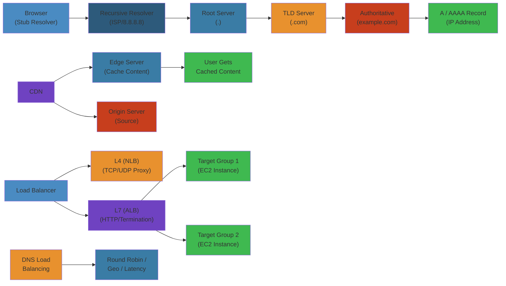

# ⚖️ DNS, CDN & Load Balancing — Complete Deep Dive




## 📋 Table of Contents


- [DNS Resolution](#dns-resolution)
- [DNS Record Types](#dns-record-types)
- [DNSSEC](#dnssec)
- [DNS Performance & Security](#dns-performance--security)
- [CDN Architecture](#cdn-architecture)
- [Content Routing](#content-routing)
- [Load Balancing Algorithms](#load-balancing-algorithms)
- [Proxy vs Reverse Proxy](#proxy-vs-reverse-proxy)
- [L4 vs L7 Load Balancing](#l4-vs-l7-load-balancing)
- [Session Persistence](#session-persistence)
- [Simplest Mental Model](#simplest-mental-model)

---

## DNS Resolution


### Resolution Flow


```text
+--------+    1. Query     +-----------+    2. Recursive     +------+
| Client | ------------> |  Resolver  | -----------------> | Root |
| (stub  |                | (recursor) |<----------------- |      |
| res.)  |                |            |  root NS referral  +------+
+--------+                +-----------+                       |
                            |    |                             | 3.
                            |    |                             v
                            |    | 4.                    +----------+
                            |    +-------------------> |  TLD NS  |
                            |                          | (.com)   |
                            |                          +----------+
                            |                            |
                            |                         5. |
                            |                            v
                            |                      +-------------+
                            +--------------------> | Authoritative|
                                                    | NS (example)|
                                                    +-------------+
                                                    |
                                                    | 6. A/AAAA record
                                                    v
                                              (IP address)
```

- **Stub Resolver**: Minimal resolver in OS (libc). Delegates to recursor (usually ISP or 8.8.8.8).
- **Recursive Resolver**: Does the full walk. Caches results.
- **Root Hints**: List of 13 root server identities (a.root-servers.net to m.root-servers.net). Anycast addresses behind each.
- **TLD**: Top-Level Domain servers (.com, .org, .net, .io, .co.uk, etc.). Managed by registries (Verisign, PIR).
- **Authoritative DNS**: Source of truth for a domain. Hosted by DNS provider (Route53, CloudDNS, NS1).
- **Glue Records**: A/AAAA records for nameservers within the same domain (prevents circular dependency). Included in parent zone NS delegation.
- **Delegation**: Parent zone delegates subdomain to child nameservers via NS records + glue.
- **Caching**: Browser Cache (DNS prefetch) → OS Cache (systemd-resolved, dnsmasq) → Resolver Cache (Unbound, named) → Server Cache. TTL dictates expiry. Negative caching (NXDOMAIN) also cached (default 300s).

### Iterative vs Recursive


```text
Iterative (client does the walking):
  Client → Root (ask for example.com) → Root says "ask .com TLD"
  Client → .com TLD → TLD says "ask ns1.example.com"
  Client → ns1.example.com → gets IP

Recursive (resolver does the walking):
  Client → Resolver → Resolver walks entire chain → returns IP
```

---

## DNS Record Types


| Record | Purpose | Example |
|--------|---------|---------|
| A | IPv4 address | `example.com. A 93.184.216.34` |
| AAAA | IPv6 address | `example.com. AAAA 2606:2800:220:1:248:1893:25c8:1946` |
| CNAME | Canonical alias | `www.example.com. CNAME example.com.` |
| MX | Mail exchange | `example.com. MX 10 mail.example.com.` (priority 10) |
| TXT | Arbitrary text | `example.com. TXT "v=spf1 include:_spf.google.com ~all"` |
| NS | Nameserver | `example.com. NS ns1.example.com.` |
| SOA | Start of authority | `example.com. SOA ns1.example.com. admin.example.com. 2025052701 3600 900 604800 300` |
| PTR | Reverse DNS | `34.216.184.93.in-addr.arpa. PTR example.com.` |
| SRV | Service location | `_sip._tcp.example.com. SRV 10 60 5060 sip.example.com.` |
| CAA | Certificate authority authorization | `example.com. CAA 0 issue "letsencrypt.org"` |
| DS | DNSSEC delegation signer | Hash of child zone's DNSKEY |
| DNSKEY | DNSSEC public key | Zone signing key (ZSK) or key-signing key (KSK) |
| NSEC/NSEC3 | DNSSEC next secure record | Proves non-existence of names |
| RRSIG | DNSSEC signature | `example.com. RRSIG A ... <signature>` |

### SOA Fields


```
Serial:  YYYYMMDDNN (incrementing)
Refresh: Slave retry interval (3600s)
Retry:   Slave retry on failure (900s)
Expire:  Slave gives up if no refresh (604800s = 7 days)
Minimum: Negative cache TTL (300s)
```

---

## DNSSEC


### Chain of Trust


```text
Root Zone (trust anchor)
  DNSKEY (KSK) ── self-signed
  DS ──┐
       │
       v
.com TLD
  DNSKEY ── signed by root KSK
  DS ──┐
       │
       v
example.com
  DNSKEY ── signed by .com KSK
  A record signed by example.com ZSK
  RRSIG A ... (signature on the A record)

Validation: Recursor walks up the chain
  A record signature ─verify_with_ZSK─> DNSKEY (ZSK)
  ZSK signature ─verify_with_KSK─> DNSKEY (KSK)
  KSK hash = DS record ─verify_with_parent─> parent DNSKEY
  ... up to root trust anchor
```

- **RRSIG**: Contains signature + inception/expiry + signer name + algorithm + tag.
- **DNSKEY**: KSK (Key Signing Key) — signs DNSKEY set, long-lived, often offline/HMS. ZSK (Zone Signing Key) — signs all other records, rotated more frequently.
- **DS**: Delegation Signer — hash of child's DNSKEY (KSK). Published in parent zone.
- **Chain of Trust**: Each zone's DS + DNSKEY + RRSIG creates a verifiable chain from root to target.
- **Validation**: Recursor (Unbound, BIND with DNSSEC) performs verification. Sets AD (Authenticated Data) flag in DNS response if valid. Sets SERVFAIL if bogus.
- **Zone Signing**: Sign all records with ZSK. Resign periodically (before RRSIG expiry). Automated tools: dnssec-keygen, dnssec-signzone, OpenDNSSEC.
- **NSEC/NSEC3**: Enumerates next existing record name. NSEC3 uses hashed names to prevent zone walking.

---

## DNS Performance & Security


### DNS over HTTPS (DoH)


- **RFC 8484**: DNS query encoded as HTTP GET or POST. `Content-Type: application/dns-message`. Response in body.
- **GET format**: `GET /dns-query?dns=<base64url_of_query>`. Server returns `application/dns-message`.
- **Benefits**: Privacy (encrypted in HTTPS), bypasses DNS manipulation, blends with regular web traffic.
- **Providers**: Cloudflare (1.1.1.1), Google (8.8.8.8), Quad9 (9.9.9.9), NextDNS.

### DNS over TLS (DoT)


- **RFC 7858**: DNS over TLS on port 853. Raw DNS payload encrypted in TLS.
- **Simpler than DoH**: No HTTP overhead. Direct connection.
- **Primary use**: Stub → Recursor link encryption.

### Zone Transfer


- **AXFR** (Authoritative Transfer): Full zone dump. Used by secondary DNS servers to replicate zone. Typically restricted by IP (allow-transfer).
- **IXFR** (Incremental Transfer): Only changes since SOA serial. Uses SOA serial comparison.
- **NOTIFY**: Primary notifies secondary of zone changes. Secondary then initiates IXFR.

### Anycast DNS


- Multiple DNS servers share the same IP. BGP routes clients to nearest instance.
- **Benefits**: Lower latency, DDoS resilience (traffic distributed), high availability.
- **Used by**: Root servers, Cloudflare (1.1.1.1), Google (8.8.8.8).

---

## CDN Architecture


### Edge Node (POP) Structure


```text
                        Origin Server
                             |
                   +---------+---------+
                   |     Origin Shield  |
                   +-------------------+
                             |
          +------------------+------------------+
          |                  |                  |
     [POP: US-East]    [POP: EU-West]    [POP: AP-Southeast]
    +---------------+   +---------------+   +---------------+
    | Edge Cache    |   | Edge Cache    |   | Edge Cache    |
    | + SSD tier    |   | + SSD tier    |   | + SSD tier    |
    | + RAM tier    |   | + RAM tier    |   | + RAM tier    |
    | + Compute     |   | + Compute     |   | + Compute     |
    +---------------+   +---------------+   +---------------+
          |                    |                    |
    [Users US]           [Users EU]           [Users AP]
```

- **Cache Hit/Miss**: Hit = served from edge. Miss = fetch from origin, cache, serve.
- **Cache-Control**: Edge respects `max-age`, `s-maxage`, `public`, `private`, `stale-while-revalidate`.
- **Surge Protection**: Rate limiting at edge to protect origin. Queue/drop excessive requests.
- **Shielding**: Intermediate cache layer between edge and origin. Multiple edges hitting origin for the same missed object → shield merges them into one origin request.
- **Purging**: Invalidate cached content by URL, tag, hostname, or wildcard. Instant (API call) or queued.
- **Pre-warming**: Proactively pull content into cache before expected traffic (e.g., product launch).
- **CDN Providers**: CloudFront (AWS), Cloudflare, Fastly (Varnish-based, real-time purge), Akamai (largest, 100K+ servers), KeyCDN (budget alternative).
- **din (Data In)**: Data written to CDN edge (PUT/POST). **dins**: Data into origin. **Data Out**: Bandwidth from CDN to end users.

---

## Content Routing


### Anycast Routing


- **Anycast**: Multiple servers announce same IP via BGP. Network routes to the closest.
- **DNS-based routing**: Client receives different IP based on resolver's location.
- **Geo-routing**: Route53 geo-proximity, Cloudflare geo-key. Route based on client IP → country/continent.
- **Latency-based routing**: Route53 latency records. Probe and direct to lowest latency endpoint.
- **Weighted routing**: Distribute % of traffic across multiple endpoints. Canary deployments, A/B testing.
- **Failover routing**: Primary → secondary → tertiary. Health check triggers failover.

### DNS Zone Apex Problem


```text
CNAME at apex: NOT allowed per RFC (CNAME conflicts with SOA/NS).
Solutions:
  ALIAS record: Route53, DNSimple — CNAME-like at apex (resolved at authoritative).
  ANAME record: Cloudflare — similar, synthetic A/AAAA.
  SRV record: Some use cases for few protocols.
```

---

## Load Balancing Algorithms


| Algorithm | How It Works | Use Case |
|-----------|-------------|----------|
| Round Robin | Rotate through servers sequentially | Equal capacity, stateless workloads |
| Least Connections | Send to server with fewest active conns | Variable request duration |
| Least Response Time | Lowest latency + active connections | Performance-sensitive |
| IP Hash | Hash(client IP) → server | Session persistence without cookie |
| URL Hash | Hash(request URL) → server | Cache affinity |
| Consistent Hash | Hash ring, minimal remapping on node add/remove | Distributed caching (Redis, Memcached) |
| Weighted RR | Servers with weights | Heterogeneous capacity |
| Random | Pick random server | Simple, load averages over time |
| Resource-based | CPU/memory utilization | Complex but precise |

---

## Proxy vs Reverse Proxy


### Forward Proxy


```text
  Client A ----+                          +-----> Server A
               |                          |
  Client B ----+---> [Forward Proxy] -----+-----> Server B
               |     (e.g., Squid,       |
  Client C ----+      Corporate Proxy)   +-----> Server C

Features: Client anonymity, content filtering, cache,
          bypass geo-restrictions, authentication
```

### Reverse Proxy


```text
               +-----> Web Server 1
Client -----> [Reverse Proxy] ------> Web Server 2
               | (NGINX, HAProxy,    +-----> Web Server 3
               |  Envoy, AWS ALB)
               |
               +-----> App Server 1
               +-----> App Server 2

Features: Load balancing, SSL termination, caching,
          compression (gzip/brotli), URL rewriting,
          WAF (Web Application Firewall), rate limiting
```

### Forwarded Headers


- **X-Forwarded-For**: `X-Forwarded-For: client_ip, proxy1_ip, proxy2_ip` — original client IP chain.
- **X-Real-IP**: Single header with original client IP (NGINX convention).
- **X-Forwarded-Proto**: `http` or `https` — original protocol used by client.
- **Forwarded** (RFC 7239): Standardized version — `Forwarded: for=192.0.2.60;proto=https;by=203.0.113.43`.

---

## L4 vs L7 Load Balancing


### Layer 4 (Transport Layer)


```text
Client                     L4 LB (NAT)                    Server
  |                           |                             |
  |-- SYN src:5000 dst:80 -->|                             |
  |                           |-- SYN src:6000 dst:8080 -->|  (SNAT: change src port)
  |<-- SYN/ACK -------------|<-- SYN/ACK -----------------|
  |-- ACK ----------------->|-- ACK --------------------->|
  |                                                       |
  |-- HTTP GET /path -------|-- HTTP GET /path ---------->|
  |<-- HTTP 200 -----------|<-- HTTP 200 ----------------|
```

- **L4 operates on TCP/UDP**: IP + port. No payload inspection.
- **NAT mode**: Destination NAT (DNAT). Client sees LB IP, backend sees LB src IP.
- **DSR (Direct Server Return)**: Request goes through LB, response goes directly to client (bypasses LB). Backend must be configured with VIP on loopback and not respond to ARP for VIP.
- **Pros**: Fast, simple, handles any TCP/UDP protocol. No TLS termination overhead.
- **Cons**: No content-aware routing, no cookie persistence, can't inspect HTTP.

### Layer 7 (Application Layer)


```text
Client                     L7 LB (TLS termination)         Server
  |                           |                             |
  |-- TLS ClientHello ------>|                             |
  |<-- TLS ServerHello ------|  (LB terminates TLS)        |
  |-- HTTP GET /api/users -->|                             |
  |                           |-- HTTP GET /api/users ---->|  (plain HTTP)
  |<-- HTTP 200 -------------|<-- HTTP 200 ----------------|

  Content-based routing:
  /api/* → app servers
  /static/* → CDN or static server
  Header X-Region: EU → EU servers
```

- **L7 understands HTTP**: URL path, headers, cookies, methods, body (with buffering).
- **SSL Offload/Termination**: LB decrypts TLS, sends plain HTTP to backend. Reduces backend CPU.
- **Content Switching**: Route by URL, Host header, cookie, query parameter, or even body content.
- **Session Persistence**: Cookie insertion, sticky sessions.
- **Pros**: Rich routing, health checks aware of app, compression, caching, WAF.
- **Cons**: Higher latency, more CPU-intensive, protocol-specific.
- **Popular L7 LBs**: NGINX (open source + Plus), HAProxy, Envoy (proxy), Traefik, Caddy, AWS ALB.

---

## Session Persistence (Sticky Sessions)


### Methods


- **Cookie-based**: LB sets a cookie (`AWSALB`, `SERVERID`). Client sends it back. LB routes to same backend.
  - *Application cookies*: App sets its own cookie, LB reads it.
  - *Insertion cookies*: LB injects cookie into response.
- **IP-based**: Hash of client IP → backend. Simple but fails with NAT (many users behind one IP → imbalance). Also broken on client IP change (mobile).
- **Session Stores**: Store session in shared backend (Redis, Memcached, DB). Server reads session from store on every request. Stateless servers + persistent sessions.
- **Stateless JWT**: Encode session data in JWT. No server-side storage. Client sends token. Any backend can decode and serve. Most scalable.
- **Cookie vs Store**: Cookie is simpler but limited to 4KB, visible to client. Store is more secure, supports larger sessions, but adds latency.

---

## Simplest Mental Model


> **DNS, CDN & Load Balancing are a city's wayfinding and delivery system.**
>
> - **DNS** = The phone book + directory assistance. You ask "where is example.com?" and get the address. Recursive resolver makes calls on your behalf. Root servers = national operator. TLD servers = country code directory. Authoritative = the business's own phone number. DNSSEC = verifying the directory listing hasn't been tampered with.
> - **CDN** = Warehouse franchises in every neighborhood. Instead of every customer going to the central factory (origin server), they pick up from a local warehouse. Origin shield = regional distribution center that feeds local warehouses.
> - **Anycast DNS** = The same phone number rings at the nearest call center. You dial, and the network connects you to the closest location automatically.
> - **Load Balancer** = The receptionist in a building with multiple offices. L4 = just forwards mail to the right floor (IP+port). L7 = reads the envelope and directs you to the right department (URL-based routing). Sticky sessions = the receptionist remembers to send you to the same person each time.
> - **Reverse Proxy** = A security gate that also handles package wrapping (SSL), compresses boxes (gzip), and decides which warehouse gets your order.
> - **Consistent Hashing** = A VIP list where each attendee is assigned to a specific table. If the table count changes, only some people move — not everyone gets reshuffled.

## Production Failure Modes


### Failure 1: DNS Propagation Delay Causes Partial Outage


| Aspect | Detail |
|--------|--------|
| **Symptoms** | Some users can access service, others get old IP (404/connection refused). DNS change made 2 hours ago, some ISPs still resolve old records |
| **Root Cause** | TTL set too high (24 hours or more). ISP DNS servers don't honor TTL (some Comcast, Telstra resolvers cache for 48h regardless). Users connecting via old records hit decommissioned servers |
| **Detection** | `dig example.com` shows different IPs from different resolvers. `whatsmydns.net` shows partial propagation. CDN provider shows `OriginError` from stale edge nodes |
| **Recovery** | Keep old servers running for 2x TTL of the old DNS record. Use low TTL (60s) for planned changes. Use AWS Route53 weight-based routing to gradually shift traffic |
| **Prevention** | Lower TTL to 60-300 seconds before planned changes. Use Route53 health checks to automatically failover. Set TTL to 60s during migration, restore to 300s after. Use alias records (Route53) which are free and update instantly |

### Failure 2: CDN Cache Poisoning


| Aspect | Detail |
|--------|--------|
| **Symptoms** | Users see outdated or incorrect content. CSS/JS files cached with wrong version. CDN serves stale API responses |
| **Root Cause** | Cache-control headers misconfigured. Origin returns `Cache-Control: max-age=31536000` for dynamic content. CDN caches responses that should not be cached. Query string parameters ignored causing cache collisions |
| **Detection** | Browser dev tools show `cf-cache-status: HIT` for API responses. Cache-Control header shows `max-age=86400` for user-specific data. Multi-region deployment, one region has stale content |
| **Recovery** | Purge CDN cache: `curl -X POST "https://api.cloudflare.com/client/v4/zones/ZONEID/purge_cache" -H "Authorization: Bearer TOKEN" -d '{"purge_everything":true}'` |
| **Prevention** | Set correct Cache-Control headers per content type: `max-age=31536000, immutable` for static assets; `no-cache, no-store` for dynamic API. Use cache-busting with content hashes in filenames. Test with `curl -I` to verify headers |

### Failure 3: Load Balancer Connection Draining Failure


| Aspect | Detail |
|--------|--------|
| **Symptoms** | Requests fail during deployment. Download interrupted. WebSocket connections drop. 502 errors during rolling update |
| **Root Cause** | Connection draining timeout too short. Active connections terminated before completing. Health check target group not configured properly — LB sends traffic to draining instances |
| **Detection** | LB access logs show 502 responses during deployment. Target group shows "draining" state but connections still flow. Application logs show `connection reset` during shutdown |
| **Recovery** | Increase `deregistration_delay.timeout_seconds` to 300s. Verify lifecycle hooks on EC2/ECS coordinate with LB. Use `aws elbv2 deregister-targets` before stopping application |
| **Prevention** | Set connection draining timeout = 2x max request processing time. Use ALB with slow-start mode for new instances. Configure preStop lifecycle hook to gracefully shut down |

### Failure 4: GeoDNS Routing Inaccuracy


| Aspect | Detail |
|--------|--------|
| **Symptoms** | Users routed to wrong region (EU users sent to US). Increased latency. Cross-region data transfer costs |
| **Root Cause** | GeoDNS relies on resolver IP, not client IP. Corporate DNS resolvers may be in different region (EU user using US-based 8.8.8.8). EDNS0 client subnet not supported by all ISPs |
| **Detection** | `dig +short example.com` returns US IP for EU user. `traceroute` shows path goes through US. Latency is 200ms+ for what should be 30ms |
| **Recovery** | Add latency-based routing as fallback. Allow users to manually select region in UI. Use anycast IP (Cloudflare, AWS Global Accelerator) for true geo-aware routing |
| **Prevention** | Use latency-based routing (Route53 Latency Routing) instead of Geo Routing for most cases. For geo-specific needs, combine Geo + Latency routing. Use Global Accelerator for anycast IP |

### Failure 5: TLS Termination at LB Causes Security Headers to Strip


| Aspect | Detail |
|--------|--------|
| **Symptoms** | Backend receives plain HTTP. Application can't detect HTTPS. CSP headers use `https://` but LB proxies with `http://`. Redirect loops |
| **Root Cause** | LB terminates TLS, forwards to backend as HTTP. Backend uses `X-Forwarded-Proto` header to detect HTTPS, but header is missing or not parsed. Application generates `http://` URLs in responses |
| **Detection** | Browser shows "mixed content" warnings. Server logs show `REQUEST_SCHEME=http` for all requests. Application redirects `http://example.com` to `https://www.example.com` causing redirect chain |
| **Recovery** | Configure LB to add `X-Forwarded-Proto: https` header. Update application to trust LB (set `Secure` flag on cookies only if X-Forwarded-Proto is https). Use `Strict-Transport-Security` header |
| **Prevention** | Always terminate TLS at LB, set `X-Forwarded-Proto`, `X-Forwarded-For`, `X-Forwarded-Port` headers. Application parses these headers. Set HSTS header with `max-age=31536000; includeSubDomains`. Use ALB with HTTPS listener only (redirect HTTP to HTTPS) |

## Edge Cases


| Scenario | Challenge | Solution |
|----------|-----------|----------|
| **CNAME flattening** | Root domain can't use CNAME (DNS spec) | Use ALIAS record (Route53, Cloudflare, DNSimple). Or use `A` record pointing to LB IP |
| **DNS resolver hijacking** | ISP redirects NXDOMAIN to ad pages | Use DNS-over-HTTPS (DoH) or DNS-over-TLS (DoT). Validate DNSSEC. Monitor with `dig +dnssec` |
| **CDN SSL certificate expiration** | 526 Invalid SSL certificate error | Automate renewal with ACME (Let's Encrypt). CDN provider auto-renews if DNS validated. Set monitoring alert 30 days before expiry |
| **WebSocket through LB** | WS connections dropped by LB idle timeout | Increase LB idle timeout to match WebSocket keepalive. Use TCP listener (NLB) for true WebSocket passthrough |
| **Sticky sessions (session affinity)** | Uneven load distribution, cache coherency issues | Use external session store (Redis). Avoid sticky sessions for better scaling. Only use for legacy apps that can't externalize session |

## Interview Questions


### Q1 (Beginner): What happens when you type google.com into a browser?


**Answer**: (1) Browser checks local DNS cache. (2) Cache miss → OS resolver queries recursive resolver (ISP or 8.8.8.8). (3) Recursive resolver queries root server → returns TLD server (.com). (4) TLD server returns authoritative DNS server for google.com. (5) Authoritative returns A/AAAA records. (6) Browser opens TCP connection to IP, TLS handshake, sends HTTP GET. (7) If behind CDN, response may come from edge server instead of origin. (8) Browser renders HTML, fetches CSS/JS/images (possibly from CDN). Key optimization points: DNS caching reduces lookup time, CDN reduces latency, HTTP/2 multiplexing reduces connection overhead.

### Q2 (Mid-Level): Compare round-robin, least-connections, and latency-based load balancing algorithms.


**Answer**: Round-robin: distributes requests sequentially across all targets. Simple, works for homogeneous workloads. Fails when request processing time varies — a slow request holds one connection while the others sit idle. Least-connections: sends request to target with fewest active connections. Better for variable request durations. Still doesn't account for processing power differences (16-core vs 4-core). Latency-based: routes to target with lowest response time. Most adaptive but requires constant health check traffic. Use case: round-robin for simple TCP load (NLB), least-connections for HTTP applications (ALB), latency-based for cross-region routing (Route53). In practice, ALB uses a weighted random distribution algorithm that's closer to least-connections.

### Q3 (Senior): Design a global load balancing strategy for a multi-region active-active architecture.


**Answer**: Three layers of load balancing: (1) DNS level (Route53 Latency Routing): user's DNS resolver routes to nearest region based on latency measurements. TTL 60s for quick failover. (2) Anycast IP (Cloudflare/AWS Global Accelerator): traffic enters nearest edge location, routed over AWS global network to closest healthy region. Provides ~15-60% latency improvement over DNS-only. (3) Regional LB (ALB/NLB): within each region, distribute across AZs and instances. Health checks at each layer: DNS health check pings regional LB health endpoint; Global Accelerator health check pings regional endpoint health; Regional LB health check pings instance health. Failover: if us-east-1 is unhealthy, DNS stops returning us-east-1 IPs, all traffic routes to eu-west-2 and ap-southeast-1. Active-active requires each region to handle 100% of traffic (N+1 redundancy). Data replication: multi-region active-active requires cross-region DB replication (or CRDTs). Session affinity: use sticky cookies or stateless sessions (JWT). DR: load shed 50% in surviving region before traffic doubles.

### Q4 (Staff): How does CDN work internally? Design a CDN from scratch.


**Answer**: Core components: (1) Origin Shield: single layer of cache between edge and origin to prevent cache stampede. (2) Edge Nodes: thousands of PoPs worldwide. Each PoP has local cache (SSD + RAM) + parent cache. (3) Routing: anycast IP routes user to nearest PoP. (4) Caching: on cache miss, PoP fetches from origin shield (or origin if shield miss). Cache key = (scheme, host, path, query params). (5) Cache eviction: LRU is standard. Popular CDNs use adaptive replacement cache (ARC): balances recency and frequency. (6) Purging: instant via API (purge by URL, tag, or regex). (7) Prefetch: for known high-traffic events (product launch), warm cache by pre-fetching content. Deep dive — cache behavior for dynamic content: support Edge Workers (Cloudflare Workers, CloudFront Functions) to process requests at edge, assemble HTML from microservices, or A/B test. For video CDN (Netflix): Open Connect Appliances at ISP data centers store entire catalog (100TB+). Adaptive bitrate (HLS/DASH) requires multiple renditions of each video. CDN uses predictive prefetching based on viewing patterns.

### Q5 (Principal): Design a DNS-based service discovery system for a 100,000-node microservice mesh.


**Answer**: Requirements: 100K services, each with 10 instances, 1M DNS queries/sec. SRV record lookup latency < 10ms. Challenges: DNS TTL-based caching leads to stale data. High query rate overwhelms authoritative DNS. Solution: tiered approach. (1) Internal DNS (CoreDNS): deployed as a sidecar per host, caches SRV/A records locally. TTL = 5s for rapidly changing services, 60s for stable services. (2) Service Registry (etcd/Consul): stores all service instances, watches for changes. CoreDNS uses etcd plugin or Consul plugin to resolve queries from registry. (3) DNS-based load balancing: CoreDNS returns healthy instances only, weighted randomly. (4) Client-side caching: each service caches resolved addresses for min 1s, uses circuit breaker on failure. For 100K scale, use hierarchical namespaces: `svc.namespace.cluster.local`. CoreDNS uses zone transfer to sync across nodes. For cross-cluster discovery, use federation via DNS: `svc.namespace.cluster1.region1.consul`. For latency-critical apps, bypass DNS entirely: use sidecar proxy (Envoy) with xDS API from control plane (Istio/Linkerd). DNS becomes fallback only.

## Cross-References


- [HTTP Protocols](../02-http-protocols.md) — TLS handshake details, HTTP/2 multiplexing, HTTP/3 QUIC
- [Kubernetes Networking](../../07-kubernetes/03-kubernetes-networking.md) — Ingress controllers, service types, DNS in K8s
- [Distributed Systems](../../09-distributed-systems/01-distributed-systems.md) — Consistent hashing, gossip protocol, failure detection
- [Backend Roadmap](../../21-roadmaps/01-backend-engineer.md) — Phase 2 networking fundamentals, Phase 3 CDN design
- [CloudFront Distribution](../../05-cloud/aws/cdn/01-cloudfront.md) — AWS-specific CDN configuration, Lambda@Edge

## Related

- [Linux Kernel Architecture](12-operating-systems/01-linux-kernel-architecture.md)
- [Cpu Scheduling](12-operating-systems/02-cpu-scheduling.md)
- [Linux Process Memory](12-operating-systems/02-linux-process-memory.md)
- [Linux Io Storage](12-operating-systems/03-linux-io-storage.md)
- [Memory Management](12-operating-systems/03-memory-management.md)
- [Io Models](12-operating-systems/04-io-models.md)
