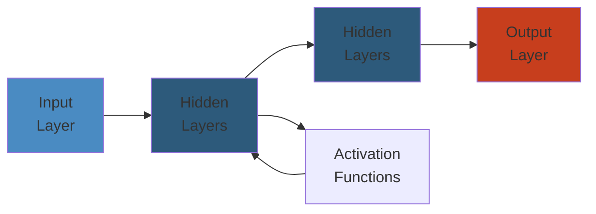

# ⚖️ DNS, CDN & Load Balancing — Complete Deep Dive




## 📋 Table of Contents
- [DNS Resolution](#dns-resolution)
- [DNS Record Types](#dns-record-types)
- [DNSSEC](#dnssec)
- [DNS Performance & Security](#dns-performance--security)
- [CDN Architecture](#cdn-architecture)
- [Content Routing](#content-routing)
- [Load Balancing Algorithms](#load-balancing-algorithms)
- [Proxy vs Reverse Proxy](#proxy-vs-reverse-proxy)
- [L4 vs L7 Load Balancing](#l4-vs-l7-load-balancing)
- [Session Persistence](#session-persistence)
- [Simplest Mental Model](#simplest-mental-model)

---

## DNS Resolution

### Resolution Flow

```text
+--------+    1. Query     +-----------+    2. Recursive     +------+
| Client | ------------> |  Resolver  | -----------------> | Root |
| (stub  |                | (recursor) |<----------------- |      |
| res.)  |                |            |  root NS referral  +------+
+--------+                +-----------+                       |
                            |    |                             | 3.
                            |    |                             v
                            |    | 4.                    +----------+
                            |    +-------------------> |  TLD NS  |
                            |                          | (.com)   |
                            |                          +----------+
                            |                            |
                            |                         5. |
                            |                            v
                            |                      +-------------+
                            +--------------------> | Authoritative|
                                                    | NS (example)|
                                                    +-------------+
                                                    |
                                                    | 6. A/AAAA record
                                                    v
                                              (IP address)
```

- **Stub Resolver**: Minimal resolver in OS (libc). Delegates to recursor (usually ISP or 8.8.8.8).
- **Recursive Resolver**: Does the full walk. Caches results.
- **Root Hints**: List of 13 root server identities (a.root-servers.net to m.root-servers.net). Anycast addresses behind each.
- **TLD**: Top-Level Domain servers (.com, .org, .net, .io, .co.uk, etc.). Managed by registries (Verisign, PIR).
- **Authoritative DNS**: Source of truth for a domain. Hosted by DNS provider (Route53, CloudDNS, NS1).
- **Glue Records**: A/AAAA records for nameservers within the same domain (prevents circular dependency). Included in parent zone NS delegation.
- **Delegation**: Parent zone delegates subdomain to child nameservers via NS records + glue.
- **Caching**: Browser Cache (DNS prefetch) → OS Cache (systemd-resolved, dnsmasq) → Resolver Cache (Unbound, named) → Server Cache. TTL dictates expiry. Negative caching (NXDOMAIN) also cached (default 300s).

### Iterative vs Recursive

```text
Iterative (client does the walking):
  Client → Root (ask for example.com) → Root says "ask .com TLD"
  Client → .com TLD → TLD says "ask ns1.example.com"
  Client → ns1.example.com → gets IP

Recursive (resolver does the walking):
  Client → Resolver → Resolver walks entire chain → returns IP
```

---

## DNS Record Types

| Record | Purpose | Example |
|--------|---------|---------|
| A | IPv4 address | `example.com. A 93.184.216.34` |
| AAAA | IPv6 address | `example.com. AAAA 2606:2800:220:1:248:1893:25c8:1946` |
| CNAME | Canonical alias | `www.example.com. CNAME example.com.` |
| MX | Mail exchange | `example.com. MX 10 mail.example.com.` (priority 10) |
| TXT | Arbitrary text | `example.com. TXT "v=spf1 include:_spf.google.com ~all"` |
| NS | Nameserver | `example.com. NS ns1.example.com.` |
| SOA | Start of authority | `example.com. SOA ns1.example.com. admin.example.com. 2025052701 3600 900 604800 300` |
| PTR | Reverse DNS | `34.216.184.93.in-addr.arpa. PTR example.com.` |
| SRV | Service location | `_sip._tcp.example.com. SRV 10 60 5060 sip.example.com.` |
| CAA | Certificate authority authorization | `example.com. CAA 0 issue "letsencrypt.org"` |
| DS | DNSSEC delegation signer | Hash of child zone's DNSKEY |
| DNSKEY | DNSSEC public key | Zone signing key (ZSK) or key-signing key (KSK) |
| NSEC/NSEC3 | DNSSEC next secure record | Proves non-existence of names |
| RRSIG | DNSSEC signature | `example.com. RRSIG A ... <signature>` |

### SOA Fields

```
Serial:  YYYYMMDDNN (incrementing)
Refresh: Slave retry interval (3600s)
Retry:   Slave retry on failure (900s)
Expire:  Slave gives up if no refresh (604800s = 7 days)
Minimum: Negative cache TTL (300s)
```

---

## DNSSEC

### Chain of Trust

```text
Root Zone (trust anchor)
  DNSKEY (KSK) ── self-signed
  DS ──┐
       │
       v
.com TLD
  DNSKEY ── signed by root KSK
  DS ──┐
       │
       v
example.com
  DNSKEY ── signed by .com KSK
  A record signed by example.com ZSK
  RRSIG A ... (signature on the A record)

Validation: Recursor walks up the chain
  A record signature ─verify_with_ZSK─> DNSKEY (ZSK)
  ZSK signature ─verify_with_KSK─> DNSKEY (KSK)
  KSK hash = DS record ─verify_with_parent─> parent DNSKEY
  ... up to root trust anchor
```

- **RRSIG**: Contains signature + inception/expiry + signer name + algorithm + tag.
- **DNSKEY**: KSK (Key Signing Key) — signs DNSKEY set, long-lived, often offline/HMS. ZSK (Zone Signing Key) — signs all other records, rotated more frequently.
- **DS**: Delegation Signer — hash of child's DNSKEY (KSK). Published in parent zone.
- **Chain of Trust**: Each zone's DS + DNSKEY + RRSIG creates a verifiable chain from root to target.
- **Validation**: Recursor (Unbound, BIND with DNSSEC) performs verification. Sets AD (Authenticated Data) flag in DNS response if valid. Sets SERVFAIL if bogus.
- **Zone Signing**: Sign all records with ZSK. Resign periodically (before RRSIG expiry). Automated tools: dnssec-keygen, dnssec-signzone, OpenDNSSEC.
- **NSEC/NSEC3**: Enumerates next existing record name. NSEC3 uses hashed names to prevent zone walking.

---

## DNS Performance & Security

### DNS over HTTPS (DoH)

- **RFC 8484**: DNS query encoded as HTTP GET or POST. `Content-Type: application/dns-message`. Response in body.
- **GET format**: `GET /dns-query?dns=<base64url_of_query>`. Server returns `application/dns-message`.
- **Benefits**: Privacy (encrypted in HTTPS), bypasses DNS manipulation, blends with regular web traffic.
- **Providers**: Cloudflare (1.1.1.1), Google (8.8.8.8), Quad9 (9.9.9.9), NextDNS.

### DNS over TLS (DoT)

- **RFC 7858**: DNS over TLS on port 853. Raw DNS payload encrypted in TLS.
- **Simpler than DoH**: No HTTP overhead. Direct connection.
- **Primary use**: Stub → Recursor link encryption.

### Zone Transfer

- **AXFR** (Authoritative Transfer): Full zone dump. Used by secondary DNS servers to replicate zone. Typically restricted by IP (allow-transfer).
- **IXFR** (Incremental Transfer): Only changes since SOA serial. Uses SOA serial comparison.
- **NOTIFY**: Primary notifies secondary of zone changes. Secondary then initiates IXFR.

### Anycast DNS

- Multiple DNS servers share the same IP. BGP routes clients to nearest instance.
- **Benefits**: Lower latency, DDoS resilience (traffic distributed), high availability.
- **Used by**: Root servers, Cloudflare (1.1.1.1), Google (8.8.8.8).

---

## CDN Architecture

### Edge Node (POP) Structure

```text
                        Origin Server
                             |
                   +---------+---------+
                   |     Origin Shield  |
                   +-------------------+
                             |
          +------------------+------------------+
          |                  |                  |
     [POP: US-East]    [POP: EU-West]    [POP: AP-Southeast]
    +---------------+   +---------------+   +---------------+
    | Edge Cache    |   | Edge Cache    |   | Edge Cache    |
    | + SSD tier    |   | + SSD tier    |   | + SSD tier    |
    | + RAM tier    |   | + RAM tier    |   | + RAM tier    |
    | + Compute     |   | + Compute     |   | + Compute     |
    +---------------+   +---------------+   +---------------+
          |                    |                    |
    [Users US]           [Users EU]           [Users AP]
```

- **Cache Hit/Miss**: Hit = served from edge. Miss = fetch from origin, cache, serve.
- **Cache-Control**: Edge respects `max-age`, `s-maxage`, `public`, `private`, `stale-while-revalidate`.
- **Surge Protection**: Rate limiting at edge to protect origin. Queue/drop excessive requests.
- **Shielding**: Intermediate cache layer between edge and origin. Multiple edges hitting origin for the same missed object → shield merges them into one origin request.
- **Purging**: Invalidate cached content by URL, tag, hostname, or wildcard. Instant (API call) or queued.
- **Pre-warming**: Proactively pull content into cache before expected traffic (e.g., product launch).
- **CDN Providers**: CloudFront (AWS), Cloudflare, Fastly (Varnish-based, real-time purge), Akamai (largest, 100K+ servers), KeyCDN (budget alternative).
- **din (Data In)**: Data written to CDN edge (PUT/POST). **dins**: Data into origin. **Data Out**: Bandwidth from CDN to end users.

---

## Content Routing

### Anycast Routing

- **Anycast**: Multiple servers announce same IP via BGP. Network routes to the closest.
- **DNS-based routing**: Client receives different IP based on resolver's location.
- **Geo-routing**: Route53 geo-proximity, Cloudflare geo-key. Route based on client IP → country/continent.
- **Latency-based routing**: Route53 latency records. Probe and direct to lowest latency endpoint.
- **Weighted routing**: Distribute % of traffic across multiple endpoints. Canary deployments, A/B testing.
- **Failover routing**: Primary → secondary → tertiary. Health check triggers failover.

### DNS Zone Apex Problem

```text
CNAME at apex: NOT allowed per RFC (CNAME conflicts with SOA/NS).
Solutions:
  ALIAS record: Route53, DNSimple — CNAME-like at apex (resolved at authoritative).
  ANAME record: Cloudflare — similar, synthetic A/AAAA.
  SRV record: Some use cases for few protocols.
```

---

## Load Balancing Algorithms

| Algorithm | How It Works | Use Case |
|-----------|-------------|----------|
| Round Robin | Rotate through servers sequentially | Equal capacity, stateless workloads |
| Least Connections | Send to server with fewest active conns | Variable request duration |
| Least Response Time | Lowest latency + active connections | Performance-sensitive |
| IP Hash | Hash(client IP) → server | Session persistence without cookie |
| URL Hash | Hash(request URL) → server | Cache affinity |
| Consistent Hash | Hash ring, minimal remapping on node add/remove | Distributed caching (Redis, Memcached) |
| Weighted RR | Servers with weights | Heterogeneous capacity |
| Random | Pick random server | Simple, load averages over time |
| Resource-based | CPU/memory utilization | Complex but precise |

---

## Proxy vs Reverse Proxy

### Forward Proxy

```text
  Client A ----+                          +-----> Server A
               |                          |
  Client B ----+---> [Forward Proxy] -----+-----> Server B
               |     (e.g., Squid,       |
  Client C ----+      Corporate Proxy)   +-----> Server C

Features: Client anonymity, content filtering, cache,
          bypass geo-restrictions, authentication
```

### Reverse Proxy

```text
               +-----> Web Server 1
Client -----> [Reverse Proxy] ------> Web Server 2
               | (NGINX, HAProxy,    +-----> Web Server 3
               |  Envoy, AWS ALB)
               |
               +-----> App Server 1
               +-----> App Server 2

Features: Load balancing, SSL termination, caching,
          compression (gzip/brotli), URL rewriting,
          WAF (Web Application Firewall), rate limiting
```

### Forwarded Headers

- **X-Forwarded-For**: `X-Forwarded-For: client_ip, proxy1_ip, proxy2_ip` — original client IP chain.
- **X-Real-IP**: Single header with original client IP (NGINX convention).
- **X-Forwarded-Proto**: `http` or `https` — original protocol used by client.
- **Forwarded** (RFC 7239): Standardized version — `Forwarded: for=192.0.2.60;proto=https;by=203.0.113.43`.

---

## L4 vs L7 Load Balancing

### Layer 4 (Transport Layer)

```text
Client                     L4 LB (NAT)                    Server
  |                           |                             |
  |-- SYN src:5000 dst:80 -->|                             |
  |                           |-- SYN src:6000 dst:8080 -->|  (SNAT: change src port)
  |<-- SYN/ACK -------------|<-- SYN/ACK -----------------|
  |-- ACK ----------------->|-- ACK --------------------->|
  |                                                       |
  |-- HTTP GET /path -------|-- HTTP GET /path ---------->|
  |<-- HTTP 200 -----------|<-- HTTP 200 ----------------|
```

- **L4 operates on TCP/UDP**: IP + port. No payload inspection.
- **NAT mode**: Destination NAT (DNAT). Client sees LB IP, backend sees LB src IP.
- **DSR (Direct Server Return)**: Request goes through LB, response goes directly to client (bypasses LB). Backend must be configured with VIP on loopback and not respond to ARP for VIP.
- **Pros**: Fast, simple, handles any TCP/UDP protocol. No TLS termination overhead.
- **Cons**: No content-aware routing, no cookie persistence, can't inspect HTTP.

### Layer 7 (Application Layer)

```text
Client                     L7 LB (TLS termination)         Server
  |                           |                             |
  |-- TLS ClientHello ------>|                             |
  |<-- TLS ServerHello ------|  (LB terminates TLS)        |
  |-- HTTP GET /api/users -->|                             |
  |                           |-- HTTP GET /api/users ---->|  (plain HTTP)
  |<-- HTTP 200 -------------|<-- HTTP 200 ----------------|

  Content-based routing:
  /api/* → app servers
  /static/* → CDN or static server
  Header X-Region: EU → EU servers
```

- **L7 understands HTTP**: URL path, headers, cookies, methods, body (with buffering).
- **SSL Offload/Termination**: LB decrypts TLS, sends plain HTTP to backend. Reduces backend CPU.
- **Content Switching**: Route by URL, Host header, cookie, query parameter, or even body content.
- **Session Persistence**: Cookie insertion, sticky sessions.
- **Pros**: Rich routing, health checks aware of app, compression, caching, WAF.
- **Cons**: Higher latency, more CPU-intensive, protocol-specific.
- **Popular L7 LBs**: NGINX (open source + Plus), HAProxy, Envoy (proxy), Traefik, Caddy, AWS ALB.

---

## Session Persistence (Sticky Sessions)

### Methods

- **Cookie-based**: LB sets a cookie (`AWSALB`, `SERVERID`). Client sends it back. LB routes to same backend.
  - *Application cookies*: App sets its own cookie, LB reads it.
  - *Insertion cookies*: LB injects cookie into response.
- **IP-based**: Hash of client IP → backend. Simple but fails with NAT (many users behind one IP → imbalance). Also broken on client IP change (mobile).
- **Session Stores**: Store session in shared backend (Redis, Memcached, DB). Server reads session from store on every request. Stateless servers + persistent sessions.
- **Stateless JWT**: Encode session data in JWT. No server-side storage. Client sends token. Any backend can decode and serve. Most scalable.
- **Cookie vs Store**: Cookie is simpler but limited to 4KB, visible to client. Store is more secure, supports larger sessions, but adds latency.

---

## Simplest Mental Model

> **DNS, CDN & Load Balancing are a city's wayfinding and delivery system.**
>
> - **DNS** = The phone book + directory assistance. You ask "where is example.com?" and get the address. Recursive resolver makes calls on your behalf. Root servers = national operator. TLD servers = country code directory. Authoritative = the business's own phone number. DNSSEC = verifying the directory listing hasn't been tampered with.
> - **CDN** = Warehouse franchises in every neighborhood. Instead of every customer going to the central factory (origin server), they pick up from a local warehouse. Origin shield = regional distribution center that feeds local warehouses.
> - **Anycast DNS** = The same phone number rings at the nearest call center. You dial, and the network connects you to the closest location automatically.
> - **Load Balancer** = The receptionist in a building with multiple offices. L4 = just forwards mail to the right floor (IP+port). L7 = reads the envelope and directs you to the right department (URL-based routing). Sticky sessions = the receptionist remembers to send you to the same person each time.
> - **Reverse Proxy** = A security gate that also handles package wrapping (SSL), compresses boxes (gzip), and decides which warehouse gets your order.
> - **Consistent Hashing** = A VIP list where each attendee is assigned to a specific table. If the table count changes, only some people move — not everyone gets reshuffled.