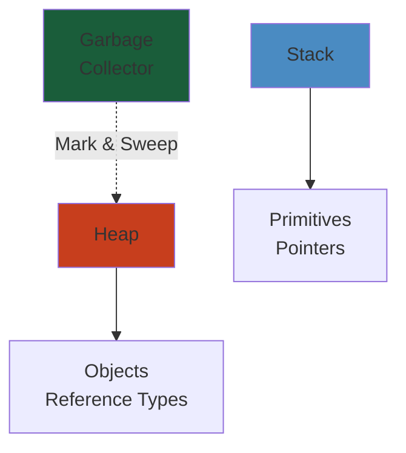
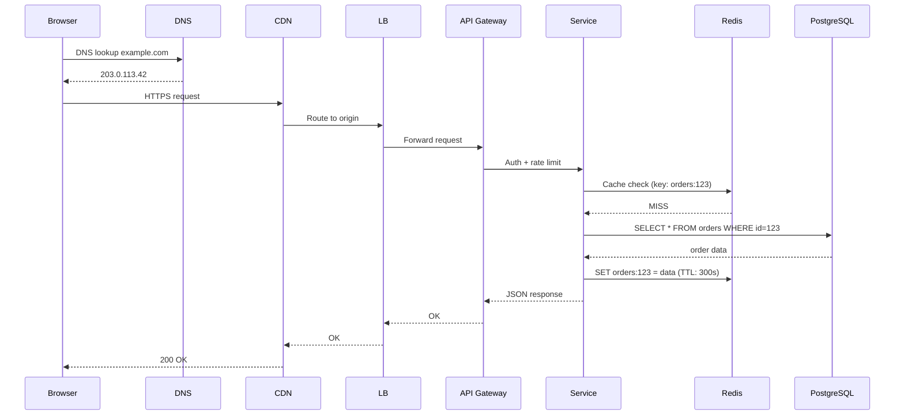

# 11 — Networking


> **Run the live simulator**: [tcp-state-machine.html](/11-networking/tcp-state-machine.html) — step through the TCP 3-way handshake, SYN flood, and FIN teardown interactively.

The foundation of all distributed communication. Covers the TCP/IP stack, HTTP protocol evolution (1.1, 2, 3), QUIC, gRPC, DNS, CDN, load balancing algorithms, TLS, packet flow, and the full breadth of how data moves across networks.



## Table of Contents

- [TCP/IP Stack](#tcpip-stack)
  - [Physical & Data Link Layers](#physical--data-link-layers)
  - [IP Layer (Internet Layer)](#ip-layer-internet-layer)
  - [Transport Layer](#transport-layer)
  - [Application Layer](#application-layer)
- [HTTP](#http)
  - [HTTP/1.1](#http11)
  - [HTTP/2](#http2)
  - [HTTP/3](#http3)
  - [HTTP Semantics & Best Practices](#http-semantics--best-practices)
- [QUIC](#quic)
  - [Architecture](#architecture)
  - [Performance Benefits](#performance-benefits)
  - [QUIC vs TCP vs HTTP/3](#quic-vs-tcp-vs-http3)
- [gRPC](#grpc)
  - [Protocol Basics](#protocol-basics)
  - [Streaming](#streaming)
  - [Performance](#performance)
  - [Interceptors & Middleware](#interceptors--middleware)
- [DNS](#dns)
  - [DNS Hierarchy](#dns-hierarchy)
  - [Record Types](#record-types)
  - [Resolution Process](#resolution-process)
  - [DNS Performance](#dns-performance)
  - [Anycast DNS](#anycast-dns)
- [CDN](#cdn)
  - [Architecture](#architecture-1)
  - [Caching Strategies](#caching-strategies)
  - [Edge Compute](#edge-compute)
  - [CDN Providers](#cdn-providers)
- [Load Balancing](#load-balancing)
  - [Layer 4 vs Layer 7](#layer-4-vs-layer-7)
  - [Algorithms](#algorithms)
  - [Consistent Hashing](#consistent-hashing)
  - [Health Checking](#health-checking)
  - [Session Persistence](#session-persistence)
  - [Global Server Load Balancing (GSLB)](#global-server-load-balancing-gslb)
- [TLS](#tls)
  - [TLS Handshake](#tls-handshake)
  - [Cipher Suites](#cipher-suites)
  - [Certificate Chain](#certificate-chain)
  - [Mutual TLS (mTLS)](#mutual-tls-mtls)
  - [Performance Considerations](#performance-considerations)
- [Packet Flow](#packet-flow)
  - [End-to-End Packet Journey](#end-to-end-packet-journey)
  - [Packet Capture & Analysis](#packet-capture--analysis)
  - [Network Address Translation](#network-address-translation)
  - [Virtual Private Networks (VPN)](#virtual-private-networks-vpn)
- [Learning Path](#learning-path)
- [Cross-References](#cross-references)

---

## TCP/IP Stack

### Physical & Data Link Layers

- **Physical Layer** — bits on wire; Ethernet (copper, fiber), Wi-Fi (802.11 variants), cellular (LTE, 5G), optics; signaling, modulation, line coding
- **Data Link Layer** — frames between directly connected nodes; MAC addresses, Ethernet frames, VLAN (802.1Q), ARP (address resolution: IP to MAC), bridges, switches
- **Ethernet Frame** — MAC destination (6 bytes), MAC source (6 bytes), EtherType (2 bytes, IPv4: 0x0800, IPv6: 0x86DD), payload (46-1500 bytes), FCS (4 bytes CRC)
- **MTU (Maximum Transmission Unit)** — layer 2 payload size (1500 bytes for standard Ethernet); MSS (TCP: MTU - 40 = 1460)
- **Switching** — MAC learning, forwarding table; VLAN trunking (802.1Q); STP/RSTP (loop prevention), MLAG (multi-chassis link aggregation)

### IP Layer (Internet Layer)

- **IPv4** — 32-bit address; Network + Host parts; subnet mask / CIDR; private ranges (10.0.0.0/8, 172.16.0.0/12, 192.168.0.0/16); NAT for external connectivity
- **IPv6** — 128-bit address; hex groups, prefix (network), interface ID; no NAT needed; SLAAC; dual-stack transition
- **IP Packet** — version + IHL, DSCP (QoS), total length, identification (fragmentation), TTL, protocol (TCP=6, UDP=17), header checksum, source+dest IP
- **Routing** — longest prefix match; static routes, dynamic routing (BGP, OSPF, IS-IS, EIGRP); RIB vs FIB
- **ARP (IPv4)** — broadcast "who has IP X?" to machine with IP X replies with MAC; ARP cache
- **ICMP** — error reporting (destination unreachable, TTL exceeded, echo request/reply) — ping, traceroute, path MTU discovery
- **BGP** — path vector protocol; AS routing, CIDR aggregation, route attributes (AS_PATH, LOCAL_PREF, MED), IBGP vs EBGP, route reflectors

### Transport Layer

- **TCP** — reliable, ordered, connection-oriented; flow control (sliding window), congestion control (AIMD, slow start, congestion avoidance, fast retransmit), error detection (checksum), retransmission (RTO, dup ACK)
  - **TCP Header** — Source/Dest Port, Sequence Number, Acknowledgment Number, Flags (SYN, ACK, FIN, RST, PSH, URG), Window Size, Options (MSS, window scale, SACK, timestamp)
  - **Three-Way Handshake** — SYN to SYN-ACK to ACK; 1.5 RTT before data
  - **Congestion Control** — Reno, CUBIC (standard), BBR (model-based), Vegas (delay-based)
  - **TCP Tuning** — buffer sizes (tcp_rmem, tcp_wmem), initcwnd, TCP_NODELAY, keepalive
- **UDP** — unreliable, unordered, connectionless; 8-byte header; no flow/congestion control; use cases: DNS, media streaming, VoIP, QUIC

### Application Layer

- HTTP, DNS, TLS (separate sections below)
- SMTP (email), FTP (file transfer), SSH (secure shell), DHCP (dynamic IP), NTP (time sync), WebSocket

---

## HTTP

### HTTP/1.1

- **Persistent Connections** — keep-alive (reuse TCP connection); default since HTTP/1.1
- **Pipelining** — send multiple requests without waiting; head-of-line blocking (responses must be in order); rare in practice
- **Chunked Transfer Encoding** — body sent in chunks; last chunk is zero-length
- **Range Requests** — partial content; Accept-Ranges, Range, Content-Range headers; resume downloads
- **Caching** — Cache-Control (max-age, no-cache, no-store, must-revalidate), Expires, ETag, Last-Modified
- **Content Negotiation** — Accept, Accept-Encoding (gzip, brotli), Accept-Language
- **Issues** — HOL blocking at HTTP level, textual headers (large), no multiplexing; workarounds: domain sharding, resource bundling

### HTTP/2

Binary protocol, multiplexed, compressed headers.

- **Framing** — binary frames: HEADERS, DATA, SETTINGS, PRIORITY, RST_STREAM, GOAWAY, PUSH_PROMISE
- **Multiplexing** — multiple streams over single TCP; no application-level HOL blocking
- **Header Compression** — HPACK; static + dynamic table; Huffman encoding
- **Server Push** — server sends resources before client requests (PUSH_PROMISE); rarely used
- **Flow Control** — per-stream and per-connection; WINDOW_UPDATE frames
- **Prioritization** — stream priority (dependency + weight)
- **Performance** — single TCP connection; but still TCP-level HOL blocking (lost packet blocks all streams)

### HTTP/3

HTTP over QUIC (UDP-based). Eliminates TCP HOL blocking.

- **QUIC Transport** — 0-RTT connection establishment; built-in encryption (TLS 1.3 mandatory)
- **No HOL Blocking** — lost packet only affects its stream; other streams proceed
- **Connection Migration** — connection ID (not IP+port); survives network changes (WiFi to cellular)
- **QPACK** — header compression adapted for QUIC; encoder/decoder stream separation
- **Adoption** — major browsers support; Cloudflare, Fastly, Google, Meta deploy

### HTTP Semantics & Best Practices

- **Methods** — GET (safe, idempotent), HEAD, POST (create), PUT (replace, idempotent), PATCH (partial), DELETE, OPTIONS (CORS preflight)
- **Status Codes** — 1xx (informational), 2xx (200 OK, 201 Created, 204 No Content), 3xx (301/302/304 Not Modified), 4xx (400, 401, 403, 404, 409, 422, 429), 5xx (500, 502, 503, 504)
- **Conditional Requests** — If-None-Match (ETag), If-Modified-Since (Last-Modified); 304 Not Modified
- **CORS** — Origin, Access-Control-Allow-Origin, preflight (OPTIONS)
- **Security Headers** — CSP, X-Content-Type-Options, X-Frame-Options, HSTS, X-XSS-Protection

---

## QUIC

### Architecture

- **Transport on UDP** — reinvents TCP reliability + TLS 1.3 in userspace; no kernel changes needed
- **Connection ID** — random identifier (not IP:port); enables connection migration
- **Streams** — multiple lightweight, ordered byte streams within one connection; independent
- **Frames** — STREAM, ACK, CRYPTO (TLS), NEW_CONNECTION_ID, MAX_DATA, PATH_CHALLENGE/RESPONSE

### Performance Benefits

- **0-RTT** — send data immediately on repeat connections (with replay protection caveats)
- **1-RTT Handshake** — initial connection (vs TCP + TLS 1.3 = 2, TCP + TLS 1.2 = 3)
- **No HOL Blocking** — each stream recovers independently
- **Connection Migration** — change IPs without reconnection
- **Improved Loss Recovery** — monotonic packet numbers, more detailed ACKs

### QUIC vs TCP vs HTTP/3

- **QUIC** — transport protocol (UDP); HTTP/3 is HTTP over QUIC
- **TCP+TLS** — kernel TCP + kernel/userspace TLS; 2+ RTTs
- **HTTP/3** — application protocol using QUIC; same HTTP semantics

---

## gRPC

### Protocol Basics

- **Protobuf** — language-agnostic IDL; .proto files define services and messages; code generation
- **HTTP/2** — gRPC uses HTTP/2; trailers for status; content-type: application/grpc
- **gRPC Web** — for browser clients; proxy (Envoy) required
- **Metadata** — key-value pairs (like HTTP headers); auth, tracing, routing

### Streaming

- **Unary** — single request, single response
- **Server Streaming** — single request, stream of responses
- **Client Streaming** — stream of requests, single response
- **Bidirectional Streaming** — independent send/receive streams; full-duplex

### Performance

- **Protobuf** — compact binary, fast serialization; schema-defined
- **HTTP/2 Multiplexing** — many RPCs per connection
- **Benchmarks** — 5-10x faster than REST/JSON for high-throughput microservices

### Interceptors & Middleware

- **Client Interceptors** — logging, auth, retry, timeout, metrics
- **Server Interceptors** — auth, rate limiting, tracing, validation

---

## DNS

### DNS Hierarchy

- **Root Servers** — 13 logical root servers (A-M); anycast clusters
- **TLD** — .com, .org, .net, .io, country codes, new gTLDs (.app, .cloud)
- **Authoritative Name Servers** — answer for specific domain; zone file contains records
- **Recursive Resolver** — follows chain (root to TLD to authoritative); caches results; 8.8.8.8, 1.1.1.1

### Record Types

| Type | Description | Example |
|------|-------------|---------|
| A | IPv4 address | example.com to 93.184.216.34 |
| AAAA | IPv6 address | example.com to 2606:2800:220:1:248:1893:25c8:1946 |
| CNAME | Canonical name (alias) | www.example.com to example.com |
| MX | Mail exchange | @ to mail.example.com (priority 10) |
| TXT | Text record | SPF, DKIM, DMARC, domain verification |
| NS | Name server | example.com to ns1.example.com |
| PTR | Reverse DNS | 34.216.184.93 to example.com |
| SRV | Service location | _sip._tcp.example.com to server:5060 |
| SOA | Start of authority | domain metadata (refresh, retry, expire, TTL) |
| CAA | CA authorization | which CAs can issue certs |

### Resolution Process

1. Client checks local DNS cache
2. Queries recursive resolver
3. Resolver checks its cache
4. Resolver queries root server (redirects to .com TLD)
5. Resolver queries TLD server (redirects to authoritative)
6. Resolver queries authoritative nameserver (gets A/AAAA record)
7. Resolver caches and returns result to client
8. Client caches result

### DNS Performance

- **TTL** — controls caching duration; short TTL (60s-300s) for fast failover; long TTL (86400s) for stable records
- **Anycast** — same IP announced from multiple locations; routes to nearest resolver
- **EDNS Client Subnet** — resolver passes client subnet for geo-aware DNS responses
- **DNS-over-HTTPS (DoH)** / **DNS-over-TLS (DoT)** — encrypted DNS; prevents eavesdropping
- **CNAME Flattening** — resolve CNAME at authoritative level (return A directly); avoids extra lookup

### Anycast DNS

- Same IP prefix announced from multiple data centers
- BGP routing sends client to nearest location
- Benefits: DDoS resilience, lower latency, high availability
- Used by Cloudflare (1.1.1.1), Google (8.8.8.8), AWS Route 53

---

## CDN

### Architecture

- **Edge Nodes (PoPs)** — geographically distributed servers; cache content close to users
- **Origin Server** — source of truth; CDN pulls content from origin on cache miss
- **Routing** — DNS-based (CNAME to CDN hostname) or Anycast (single IP, routed to nearest PoP)
- **Pull vs Push** — pull: CDN fetches on first request (cache miss); push: origin uploads content proactively
- **Reverse Proxy** — CDN operates as reverse proxy; terminates client TLS, forwards to origin

### Caching Strategies

- **Cache-Control Directives** — max-age (long for static, short for dynamic), s-maxage (shared cache), stale-while-revalidate, stale-if-error
- **Cache Keys** — URL + query parameters + headers (Accept-Encoding, Origin); custom keys for user/country
- **Cache Hit Ratio** — percentage of requests served from cache; goal: 80-95%+ for static content
- **Purge/Invalidation** — purge by URL, tag, hostname, or regex; instant vs batch (purge queue)
- **Tiered Cache** — edge to regional to origin; reduces origin load, improves hit ratio

### Edge Compute

- **CloudFront Functions** — lightweight, millisecond latency; URL redirects, header manipulation, cache key normalization
- **Lambda@Edge** — full Node.js/Python; more CPU/memory; origin request/response, viewer request/response
- **Cloudflare Workers** — V8 isolates; any URL rewrite, A/B testing, API gateway, authentication
- **Fastly Compute@Edge** — WebAssembly-based; high performance, predictable

### CDN Providers

- **CloudFront** (AWS) — deep AWS integration, origin shield, real-time logs, WAF, Lambda@Edge
- **Cloudflare** — global Anycast, DDoS protection, Workers, Argo Smart Routing, WAF, Bot Management
- **Fastly** — instant purge, VCL configuration, Compute@Edge, image optimization
- **Akamai** — massive scale, enterprise-focused, fine-grained edge delivery rules
- **Azure CDN** — Microsoft + Akamai/Verizon; integrated with Azure; Front Door for global LB + CDN
- **Google Cloud CDN** — integrates with Cloud Load Balancing; Cloud Storage origins

---

## Load Balancing

### Layer 4 vs Layer 7

- **Layer 4 (Transport)** — load balance based on IP + port (TCP/UDP); no payload inspection; fast, low overhead; AWS NLB, GCP TCP/UDP LB, HAProxy (TCP mode)
- **Layer 7 (Application)** — load balance based on HTTP headers, cookies, URL path, host; content-aware routing; AWS ALB, GCP HTTP(S) LB, Nginx, HAProxy (HTTP mode), Envoy
- **Layer 3 (Network)** — rarely used; BGP-based anycast routing

### Algorithms

- **Round Robin** — distribute requests sequentially; simple, works for equal-capacity servers
- **Least Connections** — send to server with fewest active connections; better for varying request durations
- **Weighted Round Robin** — assign weights (capacity) to servers; proportional distribution
- **Least Response Time** — send to server with lowest response time + active connections
- **IP Hash** — hash client IP to select server; session persistence without sticky cookies
- **Random** — pick random server; simple, okay for large pools
- **Power of Two Choices** — pick two servers at random, choose the one with fewer connections; excellent load distribution (used in gRPC, consistent hashing variants)

### Consistent Hashing

- Map servers to hash ring; key (request URL, client IP) maps to nearest server clockwise
- Minimal remapping on server add/remove (only k/n keys)
- Use cases: cache affinity (same server caches same keys), session persistence
- Implementations: Ketama (Memcached), jump consistent hash (Google), rendezvous hashing

### Health Checking

- **Active** — LB periodically sends health probes (TCP, HTTP/HTTPS, gRPC); marks server up/down
- **Passive** — LB monitors real traffic; consecutive failures = server removed; circuit breaker pattern
- **Graceful Degradation** — server returns 503 during shutdown; LB drains connections
- **Health Check Tuning** — interval, timeout, unhealthy threshold, healthy threshold

### Session Persistence (Sticky Sessions)

- **Cookie-Based** — LB sets cookie (JSESSIONID, AWSALB); client sends cookie on subsequent requests
- **IP-Based** — hash client IP; breaks with NAT, VPN, mobile (IP changes)
- **Application-Controlled** — client includes server ID in request; most flexible
- **Considerations** — sticky sessions reduce availability (server goes down = session loss); prefer stateless designs or store session externally (Redis)

### Global Server Load Balancing (GSLB)

- **DNS-Based** — Route 53 latency/geolocation; return different IPs based on client location
- **Anycast** — same IP from multiple locations; BGP routes to nearest
- **HTTP Redirect** — load balancer returns 302 with nearest region URL
- **Use Cases** — multi-region active-passive, disaster recovery, latency-based routing

---

## TLS

### TLS Handshake

- **TLS 1.2 Handshake** — ClientHello (cipher suites, TLS version) to ServerHello (certificate, chosen cipher) to ClientKeyExchange (pre-master secret encrypted with server public key) to ChangeCipherSpec to Finished; 2 RTT
- **TLS 1.3 Handshake** — ClientHello (guesses key share) to ServerHello (certificate + key share) to Finished; 1 RTT (0-RTT for repeat connections)
- **Key Exchange** — ECDHE (Elliptic Curve Diffie-Hellman Ephemeral) provides forward secrecy; RSA key exchange deprecated (no forward secrecy)
- **Session Resumption** — session ID, session tickets (stateless); resume without full handshake

### Cipher Suites

- **Format** — TLS_KeyExchange_AUTH_WITH_ENCRYPTION_HASH (TLS 1.2) or TLS_AEAD_KEYEXCHANGE (TLS 1.3)
- **TLS 1.3 Suites** — TLS_AES_128_GCM_SHA256, TLS_AES_256_GCM_SHA384, TLS_CHACHA20_POLY1305_SHA256
- **Key Exchange** — ECDHE (recommended), DHE; use curves: X25519 (best), P-256, P-384
- **Authentication** — RSA (certificate signature), ECDSA (smaller keys, faster)
- **AEAD Ciphers** — AES-GCM (fast with hardware acceleration), ChaCha20-Poly1305 (mobile, no AES hardware)

### Certificate Chain

- **Leaf Certificate** — server-specific; signed by intermediate CA
- **Intermediate CA** — signed by root CA; issuers: Let's Encrypt, DigiCert, Sectigo, Cloudflare
- **Root CA** — self-signed; trusted by browsers/OS; stored in trust store
- **Validation** — client builds chain leaf to root; checks signatures, expiration, revocation, name match
- **Revocation** — CRL (Certificate Revocation List, slow), OCSP (online check, privacy concerns), OCSP Stapling (server provides signed OCSP response with cert)

### Mutual TLS (mTLS)

- Both client and server present certificates; bidirectional authentication
- **Service Mesh** — Istio/Linkerd use mTLS for service-to-service authentication
- **Use Cases** — API-to-API security, IoT device auth, zero-trust networking
- **Implementation** — each service has client cert signed by mesh CA; sidecar proxy handles TLS

### Performance Considerations

- **TLS Overhead** — handshake latency (1-2 RTT), CPU for asymmetric crypto, memory for connections
- **Optimization** — session resumption, OCSP stapling, TLS False Start, optimized cipher choices
- **Hardware Acceleration** — AES-NI (x86), ARMv8 Crypto Extensions; QAT accelerators for high-throughput
- **Connection Pooling** — reuse TLS sessions across requests; minimize handshake overhead
- **TLS Termination** — at LB (Nginx, HAProxy, ALB, CloudFront); internal traffic in plaintext or re-encrypted

---

## Packet Flow

### End-to-End Packet Journey

1. **Application** — process generates data (HTTP request); DNS resolution (if needed)
2. **TCP** — segment data, assign sequence numbers, send to IP
3. **IP** — packetize, add source/dest IP, determine next hop (routing table)
4. **ARP** — resolve next-hop IP to MAC address
5. **Network Interface** — frame with MAC addresses, send on wire
6. **Switch** — forward based on MAC table (or flood)
7. **Router** — decrement TTL, lookup destination IP in FIB, rewrite MAC, forward to next hop
8. **Across Internet** — multiple router hops (BGP routing, IXP peering)
9. **Destination** — reverse path: NIC to IP to TCP to application (socket)

### Packet Capture & Analysis

- **tcpdump** — capture packets (tcpdump -i eth0 -w capture.pcap); filter expressions (host, port, tcp, udp)
- **Wireshark** — GUI analysis: follow TCP streams, expert analysis, filter by conversation
- **tshark** — command-line Wireshark; statistics, protocol hierarchy, endpoint analysis
- **eBPF** — kernel-level packet observation (bpftrace, Cilium); no packet copy; programmable
- **Key Analyses** — retransmissions, TCP window scaling, congestion, RTT, TLS handshake timing

### Network Address Translation

- **Source NAT (SNAT)** — private IP to public IP; used by NAT gateway, routers; many-to-one via port multiplexing (PAT: Port Address Translation)
- **Destination NAT (DNAT)** — public IP to private IP; port forwarding; used by load balancers
- **Full Cone NAT** — external host can send to internal host through established mapping
- **Symmetric NAT** — one mapping per (source IP, source port, dest IP, dest port); most restrictive; breaks peer-to-peer
- **NAT Traversal** — STUN (discover public IP), TURN (relay), ICE (interactive connectivity establishment); for WebRTC, VoIP

### Virtual Private Networks (VPN)

- **Site-to-Site VPN** — connect two networks over internet; IPsec (IKEv2, ESP) or WireGuard
- **Remote Access VPN** — individual clients connect to corporate network; OpenVPN, WireGuard, IPsec/IKEv2
- **WireGuard** — modern, simpler, faster; kernel-level; uses Curve25519, ChaCha20, Poly1305; minimal attack surface
- **IPsec** — suite of protocols; ESP (encapsulating security payload) + IKE (key exchange); complex configuration

---

## Learning Path

1. **Stage 1** — TCP/IP stack fundamentals: layers, Ethernet frame, IP packet, TCP/UDP, ports; practice with ping, traceroute, tcpdump
2. **Stage 2** — HTTP: 1.1 to 2 to 3; understand caching, CORS, status codes; TLS handshake, certificate chain
3. **Stage 3** — DNS: resolution, record types, caching, Anycast; CDN: architecture, caching strategies, edge compute
4. **Stage 4** — Load balancing: L4 vs L7, algorithms, health checks, consistent hashing; in-depth TCP tuning
5. **Stage 5** — Advanced: BGP, QUIC, gRPC internals, mTLS, packet flow analysis with eBPF/Wireshark

---

## Cross-References

| Domain | Connection |
|--------|-----------|
| [00 — Foundations](../00-foundations/) | Graph algorithms for routing, information theory for compression, queueing theory for network buffers |
| [01 — AI/ML](../01-ai-ml/) | Network traffic analysis, distributed training networking, model serving latency optimization |
| [02 — Data Engineering](../02-data-engineering/) | Data transfer optimization, network for shuffle (Spark/Flink), bandwidth in large-scale processing |
| [03 — Backend](../03-backend/) | HTTP/gRPC API design, TLS termination, connection pooling, TCP tuning for backend services |
| [04 — Frontend](../04-frontend/) | HTTP/2 multiplexing, CDN content delivery, DNS resolution impact, TLS handshake latency |
| [05 — Cloud](../05-cloud/) | VPC design, Route 53, CloudFront, load balancers (ALB/NLB), Direct Connect, Cloud CDN |
| [06 — DevOps](../06-devops/) | Network infrastructure as code, firewall rules, TLS automation, DNS automation |
| [07 — Kubernetes](../07-kubernetes/) | CNI plugins, network policies, service mesh (Envoy/Istio), Service types, Ingress/Gateway API |
| [08 — Databases](../08-databases/) | Database connection networking, replication network traffic, query latency from network |
| [09 — Distributed Systems](../09-distributed-systems/) | Network partitions, latency and timeouts, consensus protocol messaging, failure detection |
| [10 — Messaging](../10-messaging/) | Broker networking, replication traffic, Kafka's request pipeline, message serialization |

## Related

- [Linux Kernel Architecture](12-operating-systems/01-linux-kernel-architecture.md)
- [Cpu Scheduling](12-operating-systems/02-cpu-scheduling.md)
- [Linux Process Memory](12-operating-systems/02-linux-process-memory.md)
- [Linux Io Storage](12-operating-systems/03-linux-io-storage.md)
- [Memory Management](12-operating-systems/03-memory-management.md)
- [Io Models](12-operating-systems/04-io-models.md)

## Runtime Flow: Full-Stack Request Lifecycle

A step-by-step walkthrough of what happens when a user hits `https://example.com/api/orders`:

```
Step  Browser/Client                        Component          Time
────  ──────────────────────────────────    ──────────────     ─────
  1   User types URL or clicks link         Browser            0ms
  2   Check browser cache for DNS           Browser DNS Cache  1ms
  3   DNS resolution: example.com → IP      DNS Resolver       5-50ms
  4   TCP 3-way handshake (SYN → SYN-ACK → ACK)   Kernel TCP  1-5ms
  5   TLS 1.3 handshake (ClientHello → ServerHello → Cert → Done)  TLS Stack  10-50ms
  6   HTTP/2 multiplexed request            Browser HTTP/2      0ms
  7   CDN edge routing                      CloudFront/CloudFlare  1-5ms
  8   Load balancer picks backend           AWS ALB / nginx     0.1ms
  9   API Gateway auth + rate limit         Kong / Envoy        1-5ms
 10   Service routing to pod                K8s Service (iptables/IPVS)  0.1ms
 11   Sidecar proxy (Envoy) intercepts      Istio/Envoy         0.5ms
 12   Application handler processes request Spring/Express      5-50ms
 13   Cache lookup (Redis)                  Redis Client        0.5-2ms
 14   Cache MISS → PostgreSQL query         pg client + pool    1-10ms
 15   PostgreSQL: Parse → Bind → Execute → Fetch   PG Backend  2-20ms
 16   Response serialized (JSON/Protobuf)   App Serializer      0.5ms
 17   Response travels back through stack   Reverse path        5-10ms
 18   Browser renders response              Browser Render     5-100ms
```


