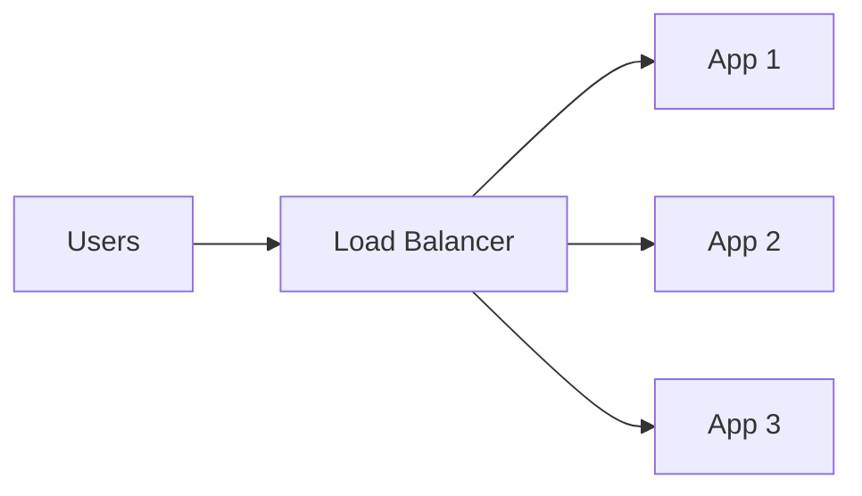
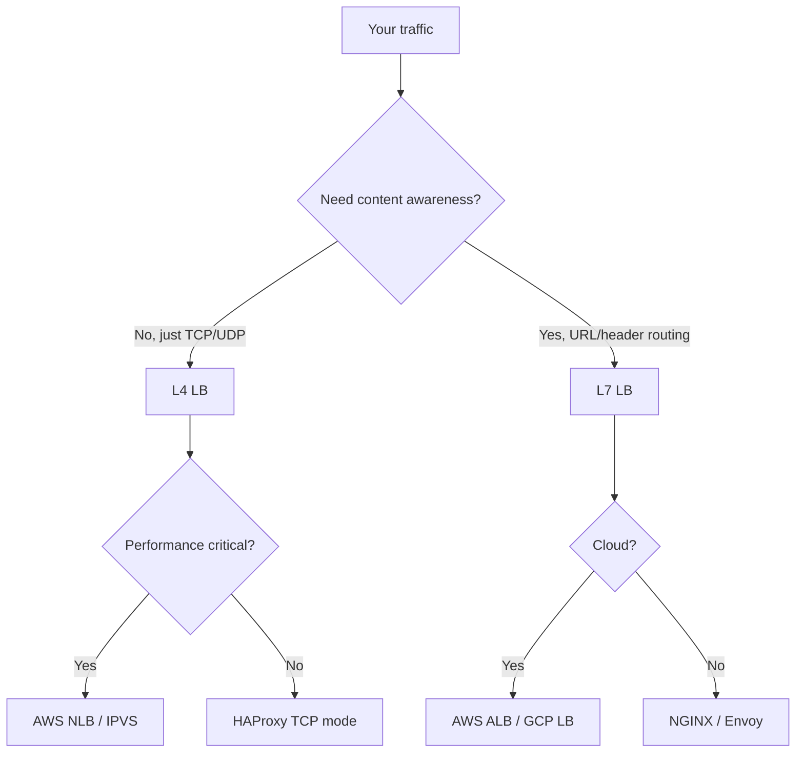
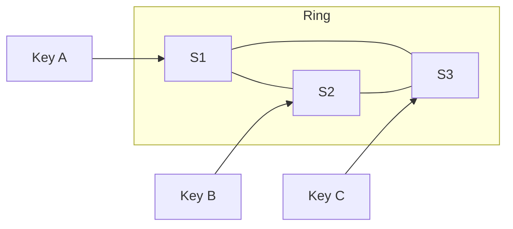
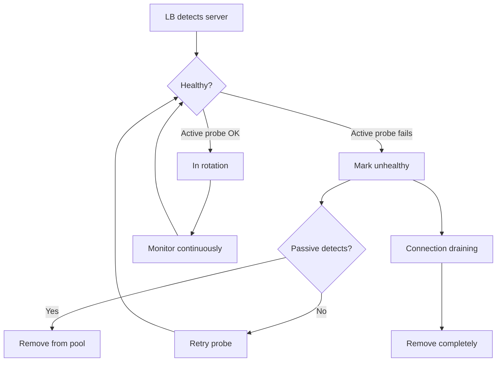
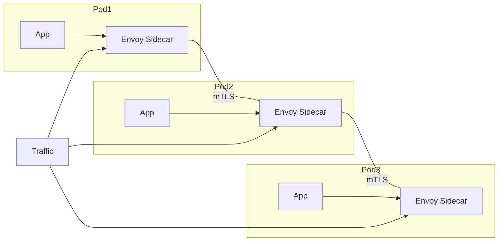
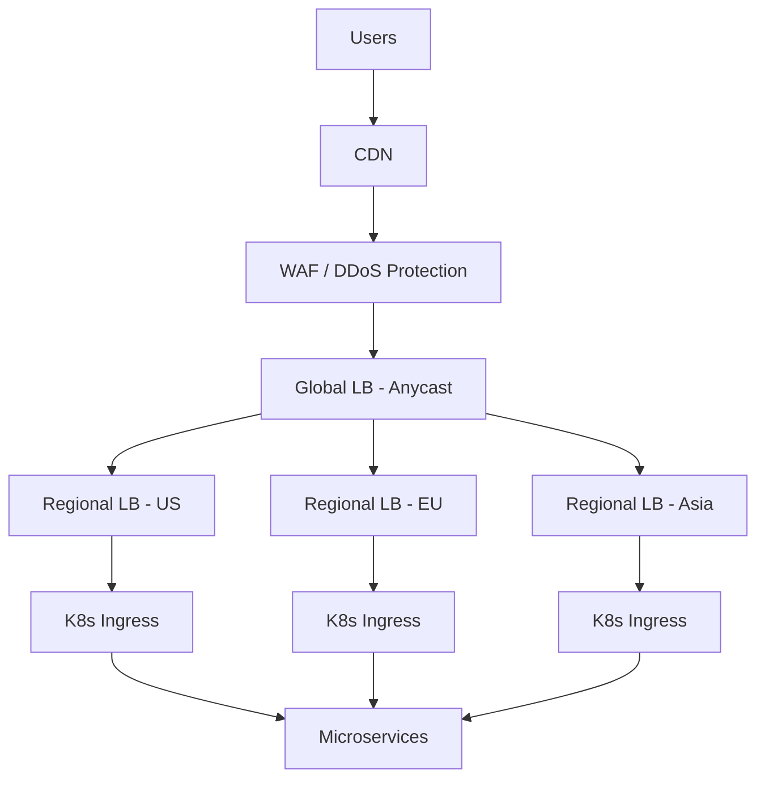

# Load Balancers — Complete Deep Dive 🚀

A load balancer is basically:

```text
Traffic Controller
```

It decides:

```text
Which server should handle this request?
```

Without load balancers:

```text
1 server
↓
dies
↓
entire app dead 😵
```

With load balancers:

```text
many servers
↓
traffic distributed
↓
high availability ✅
```

**Related**: [Microservices & System Design](MICROSERVICES_SYSTEM_DESIGN.md#5-load-balancing) · [Kubernetes](k8s.md) · [Protocols](protocols.md)

---

## Table of Contents

- [Why Load Balancers Exist](#1-why-load-balancers-exist-)
- [Basic Flow](#2-basic-flow-)
- [Main Goals](#3-main-goals-)
- [Types of Load Balancers](#4-types-of-load-balancers-)
- [OSI Model View](#5-osi-model-view-)
- [L4 Load Balancer](#6-l4-load-balancer-)
- [L7 Load Balancer](#7-l7-load-balancer-)
- [L4 vs L7 Strict Difference](#8-l4-vs-l7-strict-difference-)
- [Load Balancing Algorithms](#9-load-balancing-algorithms-)
- [Sticky Sessions](#10-sticky-sessions-)
- [Active vs Passive Health Checks](#11-active-vs-passive-health-checks-)
- [SSL Termination](#12-ssl-termination-)
- [Reverse Proxy vs Load Balancer](#13-reverse-proxy-vs-load-balancer-)
- [Global Load Balancing](#14-global-load-balancing-)
- [DNS Load Balancing](#15-dns-load-balancing-)
- [Anycast](#16-anycast-)
- [Software vs Hardware](#17-software-vs-hardware-load-balancers)
- [Modern Cloud Load Balancers](#18-modern-cloud-load-balancers-)
- [Kubernetes Load Balancing](#19-kubernetes-load-balancing-)
- [Service Mesh Load Balancing](#20-service-mesh-load-balancing-)
- [Connection Problems](#21-connection-problems-)
- [Load Balancer Bottleneck](#22-load-balancer-bottleneck-)
- [Production Architecture](#23-production-architecture-)
- [Metrics to Monitor](#24-metrics-to-monitor-)
- [Interview Trick Questions](#25-interview-trick-questions-)
- [Real System Examples](#26-real-system-examples-)
- [Google Maglev](#27-google-maglev-)
- [Simple Mental Model](#28-simple-mental-model-)
- [Final Comparison Table](#final-comparison-table-)
- [Ultimate Production Flow](#ultimate-production-flow-)

---

# 1. WHY LOAD BALANCERS EXIST 🔥

Imagine:

```text
100 million users
```

All hitting one server.

Impossible.

Problems:

* CPU overload
* Memory exhaustion
* Too many TCP connections
* Single point of failure
* Slow response times

So we place:

```text
Users
   ↓
Load Balancer
   ↓
Multiple Servers
```

### 📈 Scale Reality Check

A single server handles ~10K-50K concurrent connections. For 100M users: you need 2,000-10,000 servers. No single point can handle that — distribution is non-negotiable.

---

# 2. BASIC FLOW 🌊

```text
                +-------------+
Users  -------> | LoadBalancer|
                +-------------+
                 /    |     \
                /     |      \
             App1   App2    App3
```

LB distributes traffic.



---

# 3. MAIN GOALS 🎯

| Goal              | Meaning             |
| ----------------- | ------------------- |
| Scalability       | Add more servers    |
| High Availability | Survive failures    |
| Better Latency    | Route efficiently   |
| Reliability       | Prevent overload    |
| Elasticity        | Auto-scale          |
| Zero Downtime     | Rolling deployments |

---

# 4. TYPES OF LOAD BALANCERS 🔥

Two BIG categories:

| Type             | Layer             |
| ---------------- | ----------------- |
| L4 Load Balancer | Transport Layer   |
| L7 Load Balancer | Application Layer |

### 🧭 LB Selection Flow



---

# 5. OSI MODEL VIEW 🧠

```text
L7  Application   ← HTTP, gRPC
L6  Presentation
L5  Session
L4  Transport     ← TCP/UDP
L3  Network
L2  Data Link
L1  Physical
```

---

# 6. L4 LOAD BALANCER ⚡

Works on:

* TCP
* UDP
* IP + Port

Does NOT understand:

* URLs
* headers
* cookies
* HTTP methods

---

# Flow

```text
Client
  |
TCP Packet
  |
L4 LB
  |
Forward packet
  |
Backend
```

---

# Example

```text
TCP 443
↓
send to server 3
```

No HTTP inspection.

---

# Characteristics

| Feature           | L4              |
| ----------------- | --------------- |
| Speed             | Extremely fast  |
| CPU usage         | Low             |
| Packet inspection | Minimal         |
| HTTP aware        | ❌               |
| SSL termination   | Sometimes       |
| Best for          | Raw performance |

---

# L4 Examples

| Product    | Type |
| ---------- | ---- |
| AWS NLB    | L4   |
| Linux IPVS | L4   |
| MetalLB    | L4   |
| F5 FastL4  | L4   |

### 💡 When L4 Wins

L4 LBs handle **millions of packets/sec** with minimal CPU. AWS NLB can do 10M+ new flows/min. Use L4 when you need raw throughput (game servers, video streaming, high-frequency trading). The trade-off: zero application intelligence.

---

# 7. L7 LOAD BALANCER 🌐

Application aware.

Can inspect:

* URLs
* cookies
* headers
* JWTs
* hostnames
* methods

---

# Flow

```text
Client
  |
HTTP Request
  |
L7 LB analyzes request
  |
Chooses backend
```

---

# Example

```http
/api/users -> User Service
/api/payments -> Payment Service
```

---

# Characteristics

| Feature           | L7        |
| ----------------- | --------- |
| Smart routing     | ✅         |
| URL-based routing | ✅         |
| Header routing    | ✅         |
| SSL termination   | Excellent |
| Caching           | Possible  |
| WAF integration   | Easy      |
| Slower than L4    | Yes       |

---

# L7 Examples

| Product | Type |
| ------- | ---- |
| NGINX   | L7   |
| HAProxy | L7   |
| Envoy   | L7   |
| AWS ALB | L7   |
| Traefik | L7   |

---

# 8. L4 vs L7 STRICT DIFFERENCE ⚔️

| Feature           | L4              | L7              |
| ----------------- | --------------- | --------------- |
| Operates on       | TCP/UDP         | HTTP/HTTPS/gRPC |
| Speed             | Faster          | Slower          |
| Intelligence      | Low             | High            |
| URL routing       | ❌               | ✅               |
| Cookie routing    | ❌               | ✅               |
| Header inspection | ❌               | ✅               |
| CPU usage         | Lower           | Higher          |
| Best for          | Massive traffic | Smart routing   |

---

# 9. LOAD BALANCING ALGORITHMS 🔥

This is VERY important.

---

# A) Round Robin 🔄

Simplest.

```text
Req1 -> S1
Req2 -> S2
Req3 -> S3
Req4 -> S1
```

---

# Pros

✅ Easy
✅ Fair distribution

---

# Cons

❌ Ignores server load
❌ Bad for uneven workloads

---

# B) Weighted Round Robin ⚖️

More powerful servers get more traffic.

Example:

```text
S1 weight=3
S2 weight=1
```

Traffic:

```text
S1 S1 S1 S2
```

---

# C) Least Connections 🧠

Send traffic to server with fewest active connections.

---

# Example

| Server | Connections |
| ------ | ----------- |
| S1     | 100         |
| S2     | 10          |

New request → S2

---

# Best for

* long-lived connections
* WebSockets
* streaming

---

# D) Least Response Time ⚡

Chooses fastest server.

Metrics:

* latency
* active connections

---

# E) IP Hash 🧩

Hash client IP.

```text
same IP -> same server
```

Useful for sticky sessions.

---

# F) Consistent Hashing 🔥

Very important distributed systems concept.

Used in:

* CDNs
* caches
* sharding
* sticky routing

---

# Why not normal hashing?

Adding/removing server reshuffles EVERYTHING.

Consistent hashing minimizes movement.

---

# Visualization

```text
Hash Ring

[S1]----[S2]----[S3]
```



---

# Used In

* Redis Cluster
* Cassandra
* Kafka partitioning
* CDN routing

---

# 10. STICKY SESSIONS 🍪

User always routed to same backend.

---

# Why needed?

Suppose session stored in memory:

```text
User login on Server1
Next request hits Server2
Session missing 😵
```

---

# Solution

Sticky routing.

Methods:

* cookie-based
* IP hash
* session affinity

---

# Problem with Sticky Sessions

❌ Uneven load
❌ Hard scaling
❌ Session coupling

---

# Better Modern Approach

Store sessions in:

* Redis
* database
* distributed cache

Then servers become stateless.

---

# 11. ACTIVE vs PASSIVE HEALTH CHECKS ❤️

---

# Active Checks

LB periodically checks:

```http
GET /health
```

---

# Passive Checks

LB notices:

* failures
* timeouts
* connection resets

---

# Health Check Example

```text
If server fails 3 checks
↓
remove from rotation
```

### 🔄 Health Check Flow



---

# 12. SSL TERMINATION 🔐

Instead of backend decrypting HTTPS:

LB handles TLS.

---

# Flow

```text
Client HTTPS
    ↓
Load Balancer decrypts
    ↓
HTTP to backend
```

---

# Benefits

✅ Backend simpler
✅ Lower CPU usage
✅ Centralized certificates

---

# Downsides

❌ Internal traffic unencrypted unless re-encrypted

---

# 13. REVERSE PROXY vs LOAD BALANCER 🔥

Huge confusion area.

---

# Reverse Proxy

Acts on behalf of servers.

Features:

* caching
* compression
* auth
* SSL termination

---

# Load Balancer

Distributes traffic.

---

# Reality

Modern tools do BOTH.

Example:

* NGINX
* Envoy
* HAProxy

---

# 14. GLOBAL LOAD BALANCING 🌍

Now traffic distributed across REGIONS.

---

# Example

```text
India users -> Mumbai region
US users -> Virginia region
Europe users -> Frankfurt
```

---

# Techniques

| Technique   | Description       |
| ----------- | ----------------- |
| GeoDNS      | DNS-based routing |
| Anycast     | Same IP globally  |
| CDN routing | Edge routing      |

---

# 15. DNS LOAD BALANCING 🌐

DNS returns different IPs.

---

# Example

```text
google.com
↓
returns nearest region IP
```

---

# Problem

DNS caching.

Cannot react instantly.

---

# 16. ANYCAST 🔥

Same IP advertised globally.

Internet routing sends user to nearest node.

---

# Used By

* Cloudflare
* Google
* AWS Route53

---

# Flow

```text
Same IP
↓
BGP routes to nearest datacenter
```

---

# 17. SOFTWARE vs HARDWARE LOAD BALANCERS

---

# Hardware LB

Dedicated appliance.

Examples:

* F5 BIG-IP
* Citrix ADC

Advantages:

✅ Extremely fast
✅ ASIC acceleration

Disadvantages:

❌ Expensive
❌ Less flexible

---

# Software LB

Runs on commodity servers.

Examples:

* NGINX
* HAProxy
* Envoy

Advantages:

✅ Flexible
✅ Cheap
✅ Cloud-native

### ⚖️ Decision Guide

Hardware LB wins when you need 100Gbps+ per box with predictable performance (telcos, financial exchanges). Software LB wins everywhere else — cloud, containers, edge. The industry is shifting to software due to economics and flexibility.

---

# 18. MODERN CLOUD LOAD BALANCERS ☁️

| Cloud      | LB           |
| ---------- | ------------ |
| AWS        | ALB/NLB/GWLB |
| GCP        | Cloud LB     |
| Azure      | Azure LB     |
| Kubernetes | Ingress      |

---

# AWS COMPARISON 🔥

| LB   | Layer               | Use               |
| ---- | ------------------- | ----------------- |
| ALB  | L7                  | HTTP/gRPC         |
| NLB  | L4                  | Ultra performance |
| CLB  | Old mixed LB        | Legacy            |
| GWLB | Security appliances | Network functions |

---

# 19. KUBERNETES LOAD BALANCING ☸️

Multiple layers exist.

---

# Kubernetes Flow

```text
Internet
   ↓
Ingress Controller
   ↓
K8s Service
   ↓
Pods
```

---

# Components

| Component   | Purpose         |
| ----------- | --------------- |
| Ingress     | L7 routing      |
| Service     | Internal LB     |
| kube-proxy  | Packet routing  |
| Envoy/Istio | Service mesh LB |

---

# 20. SERVICE MESH LOAD BALANCING 🕸️

Modern systems use sidecars.

Example:

```text
App Pod + Envoy Sidecar
```

Load balancing becomes:

* per request
* intelligent
* retry aware
* latency aware



---

# 21. CONNECTION PROBLEMS 🚨

---

# A) Thundering Herd

All traffic hits same recovered server.

---

# B) Retry Storm

Failures trigger retries.

Traffic explodes.

---

# C) Queue Collapse

Slow backend creates huge queues.

---

# D) SYN Flood

Attack overwhelms TCP connections.

LB often protects against this.

---

# 22. LOAD BALANCER BOTTLENECK 😵

LB itself can fail.

Solution:

```text
Load Balancer in front of Load Balancers
```

Or:

* Anycast
* HA pairs
* distributed LBs

---

# 23. PRODUCTION ARCHITECTURE 🌍

```text
Users
  ↓
CDN
  ↓
WAF
  ↓
Global LB
  ↓
Regional LB
  ↓
Ingress
  ↓
Services
```



---

# 24. METRICS TO MONITOR 📊

| Metric             | Why          |
| ------------------ | ------------ |
| RPS                | Throughput   |
| P99 latency        | Tail latency |
| Active connections | Capacity     |
| Error rate         | Stability    |
| Queue size         | Saturation   |
| TLS handshake rate | CPU pressure |

---

# 25. INTERVIEW TRICK QUESTIONS 🔥

---

# Why use NLB over ALB?

Because:

* TCP performance
* ultra low latency
* millions connections

---

# Why avoid sticky sessions?

Because stateless scaling is better.

---

# Why consistent hashing?

Minimize redistribution during scaling.

---

# Why L7 slower?

Parses HTTP deeply.

---

# Why health checks matter?

Prevent sending traffic to dead nodes.

---

# 26. REAL SYSTEM EXAMPLES 🌎

| System     | LB Style             |
| ---------- | -------------------- |
| Netflix    | Zuul + Envoy         |
| Google     | Maglev               |
| Cloudflare | Anycast              |
| Kubernetes | Ingress + kube-proxy |
| AWS        | ALB/NLB              |

---

# 27. GOOGLE MAGLEV 🔥

Google's famous load balancer.

Handles:

```text
millions of requests/sec
```

Features:

* consistent hashing
* connection tracking
* distributed architecture

---

# 28. SIMPLE MENTAL MODEL 🧠

---

# L4

```text
"I route packets."
```

---

# L7

```text
"I understand applications."
```

---

# Reverse Proxy

```text
"I stand in front of servers."
```

---

# CDN

```text
"I move content near users."
```

---

# Final Comparison Table ⚔️

| Feature           | L4 LB         | L7 LB                       |
| ----------------- | ------------- | --------------------------- |
| Speed             | Very High     | Medium                      |
| Intelligence      | Low           | High                        |
| TCP aware         | ✅             | ✅                           |
| HTTP aware        | ❌             | ✅                           |
| SSL termination   | Basic         | Advanced                    |
| WebSocket support | Good          | Excellent                   |
| URL routing       | ❌             | ✅                           |
| Best Use          | Massive scale | Smart microservices routing |

---

# Ultimate Production Flow 🌊

```text
User
 ↓
DNS
 ↓
Anycast
 ↓
CDN
 ↓
WAF
 ↓
Global LB
 ↓
Regional LB
 ↓
Ingress Controller
 ↓
Service Mesh
 ↓
Microservices
```
