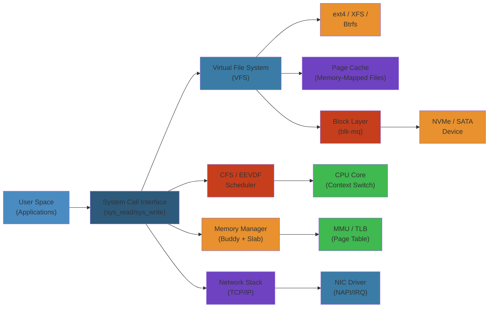

# 🐧 Linux Kernel Architecture — Complete Deep Dive

> **Scope**: Monolithic kernel design, key subsystems, kernel/user space boundary, source tree layout, device driver model, kernel module system, and virtual filesystem — the full anatomy of the Linux kernel.

> **Related**: [02-cpu-scheduling.md](02-cpu-scheduling.md), [03-memory-management.md](03-memory-management.md), [04-io-models.md](04-io-models.md), [05-process-threads-fibers.md](05-process-threads-fibers.md), [06-system-calls-ipc.md](06-system-calls-ipc.md)

---




## Table of Contents

#### Step-by-Step
1. Process input
2. Validate
3. Execute
4. Return result

#### Code Example
```python
# Example implementation
pass
```

#### Real-World Scenario
This pattern is commonly used in production systems.


1. [Kernel vs User Space](#1-kernel-vs-user-space)
2. [Source Tree Layout](#2-source-tree-layout)
3. [Syscall Interface](#3-syscall-interface)
4. [Process Scheduler](#4-process-scheduler)
5. [Memory Manager](#5-memory-manager)
6. [IPC Mechanisms](#6-ipc-mechanisms)
7. [Device Drivers](#7-device-drivers)
8. [Kernel Modules](#8-kernel-modules)
9. [Virtual Filesystem (VFS)](#9-virtual-filesystem-vfs)
10. [/proc, /sys, sysfs, debugfs](#10-proc-sys-sysfs-debugfs)
11. [Architecture Diagram](#11-architecture-diagram)
12. [Internals](#12-internals)
13. [Failure Analysis](#13-failure-analysis)
14. [Edge Cases](#14-edge-cases)
15. [Performance](#15-performance)
16. [Simplest Mental Model](#16-simplest-mental-model)

---

## 1. Kernel vs User Space

#### Step-by-Step
1. Process input
2. Validate
3. Execute
4. Return result

#### Code Example
```python
# Example implementation
pass
```

#### Real-World Scenario
This pattern is commonly used in production systems.


```
┌──────────────────────────────────────────┐
│             User Space                    │
│  ┌──────┐ ┌──────┐ ┌──────┐ ┌──────┐    │
│  │app A │ │app B │ │app C │ │ libc │    │
│  └──┬───┘ └──┬───┘ └──┬───┘ └──────┘    │
│     │        │        │                  │
├─────┴────────┴────────┴──────────────────┤ ← syscall / vDSO
│             Kernel Space                  │
│  ┌────────────────────────────────────┐  │
│  │ System Call Interface              │  │
│  │ ┌──────┐┌──────┐┌───────────────┐│  │
│  │ │VFS   ││Sched ││Memory Manager ││  │
│  │ │ext4  ││CFS   ││Page alloc     ││  │
│  │ │btrfs ││RT    ││Slab alloc     ││  │
│  │ │NFS   ││DL    ││VMA / mmap     ││  │
│  │ └──────┘└──────┘└───────────────┘│  │
│  │ ┌──────┐┌──────┐┌───────────────┐│  │
│  │ │IPC   ││Net   ││Device Drivers ││  │
│  │ │pipe  ││TCP/IP││char/block/net ││  │
│  │ │shm   ││socket││PCI/USB/PCIe   ││  │
│  │ │futex ││      ││interrupts     ││  │
│  │ └──────┘└──────┘└───────────────┘│  │
│  └────────────────────────────────────┘  │
├──────────────────────────────────────────┤
│             Hardware                      │
│  CPU | MMU | RAM | Disk | NIC | PCIe     │
└──────────────────────────────────────────┘
```

- **User space**: Ring 3, isolated virtual address spaces, no direct hardware access
- **Kernel space**: Ring 0, shared address space, privileged instructions, hardware access
- **Transition**: `syscall` instruction (x86-64) or `int 0x80` (legacy) — ~50-200 cycles
- **vDSO**: Virtual Dynamic Shared Object — kernel maps a userspace-readable page with fast implementations of `clock_gettime`, `gettimeofday`, `getcpu` — no syscall needed

### Step-by-Step

#### Step-by-Step
1. Process input
2. Validate
3. Execute
4. Return result

#### Code Example
```python
# Example implementation
pass
```

#### Real-World Scenario
This pattern is commonly used in production systems.


1. **Application execution** runs in user space (Ring 3) with isolated virtual memory
2. **System call invocation** app executes `syscall` instruction with syscall number in rax register
3. **Context switch** CPU transitions to kernel space (Ring 0), saves user registers, loads kernel stack
4. **Syscall dispatch** kernel finds handler in syscall table (arch/x86/entry/syscalls/syscall_64.tbl)
5. **Syscall execution** handler accesses protected resources (disk, network, memory management)
6. **Return to user space** kernel restores user registers, copies data to user buffer, returns control

### Code Example

#### Step-by-Step
1. Process input
2. Validate
3. Execute
4. Return result

#### Code Example
```python
# Example implementation
pass
```

#### Real-World Scenario
This pattern is commonly used in production systems.


```c
// C example: Custom syscall and kernel space boundary crossing
#include <unistd.h>
#include <syscall.h>
#include <stdio.h>
#include <string.h>

// User space function calling syscall
long custom_write(int fd, const char *buf, size_t count) {
    // Directly invoke syscall number 1 (write on x86-64)
    return syscall(SYS_write, fd, buf, count);
}

// Kernel space handler (in kernel/fs/read_write.c)
// SYSCALL_DEFINE3(write, unsigned int, fd, const char __user *, buf, size_t, count)
// {
//     return ksys_write(fd, buf, count);  // Calls VFS layer
// }

int main() {
    const char *msg = "Hello from user space!\n";
    
    // This syscall transitions to kernel space
    long bytes_written = custom_write(1, msg, strlen(msg));
    
    printf("Syscall returned: %ld bytes written\n", bytes_written);
    return 0;
}
```

### Real-World Scenario

#### Step-by-Step
1. Process input
2. Validate
3. Execute
4. Return result

#### Code Example
```python
# Example implementation
pass
```

#### Real-World Scenario
This pattern is commonly used in production systems.


Google discovered that high-frequency trading firms were experiencing Spectre/Meltdown mitigations (KPTI: Kernel Page Table Isolation) adding 5-10% latency to syscalls due to TLB flushes on kernel entry/exit. They deployed vDSO clock_gettime to avoid syscalls for timestamps. Trading firms rewrote hot loops to use vDSO getcpu instead of sched_getcpu(), reducing syscall overhead from 10K/sec to <100/sec—latency P99 dropped by 2.3μs.

---

## 2. Source Tree Layout

#### Step-by-Step
1. Process input
2. Validate
3. Execute
4. Return result

#### Code Example
```python
# Example implementation
pass
```

#### Real-World Scenario
This pattern is commonly used in production systems.


```
linux/
├── arch/          # Architecture-specific (x86, arm64, powerpc, riscv)
│   └── x86/
│       ├── kernel/  # Entry points, syscall table, traps, signal
│       ├── mm/      # Page tables, TLB, cache flushing
│       └── boot/    # Boot protocol, setup
├── block/          # Block layer, multi-queue, I/O schedulers
├── crypto/         # Crypto API, cipher implementations
├── Documentation/  # Kernel documentation (RST format)
├── drivers/        # Device drivers (char, block, net, GPU, USB, PCI)
│   ├── char/       # Character devices (tty, random, mem)
│   ├── block/      # Block devices (NVMe, virtio_blk)
│   ├── net/        # Network drivers (e1000, i40e, mlx5)
│   └── gpu/        # GPU drivers (i915, amdgpu, nouveau)
├── fs/             # Filesystem implementations
│   ├── ext4/       # Extended filesystem v4
│   ├── btrfs/      # B-tree filesystem
│   ├── xfs/        # XFS
│   ├── nfs/        # Network filesystem
│   └── procfs/     # /proc filesystem
├── include/        # Kernel headers (uapi/ for userspace API)
├── init/           # Boot and initialization (start_kernel)
├── ipc/            # IPC implementations (pipe, shm, msg, sem, mqueue)
├── kernel/         # Core kernel (sched, fork, signal, time, irq)
│   ├── sched/      # Scheduler (CFS, deadline, RT, fair, idle)
│   ├── irq/        # Interrupt handling (hardirq, softirq, tasklet)
│   ├── locking/    # Locking primitives (spinlock, mutex, rwsem)
│   └── power/      # Power management (suspend, cpuidle, cpufreq)
├── lib/            # Library routines (sort, crc, string, locking)
├── mm/             # Memory management
│   ├── page_alloc.c    # Buddy allocator, watermarks
│   ├── slab.c          # SLAB allocator
│   ├── slub.c          # SLUB allocator (default)
│   ├── vmalloc.c       # vmalloc implementation
│   ├── swap.c          # Swap subsystem
│   ├── memory.c        # Page fault handler
│   ├── mlock.c         # Memory locking
│   └── hugetlb.c       # Huge pages
├── net/            # Networking stack
│   ├── ipv4/       # TCP/IPv4
│   ├── ipv6/       # IPv6
│   ├── core/       # Socket layer, sk_buff
│   ├── sched/      # Qdisc, packet scheduling
│   └── xdp/        # eXpress Data Path
├── scripts/        # Build scripts, checkpatch, recordmcount
├── security/       # LSM, SELinux, AppArmor, seccomp
├── sound/          # ALSA, audio drivers
├── tools/          # perf, objtool, selftests, bpftool
├── usr/            # initramfs generation
└── virt/           # KVM (kernel virtual machine)
```

---

## 3. Syscall Interface

#### Step-by-Step
1. Process input
2. Validate
3. Execute
4. Return result

#### Code Example
```python
# Example implementation
pass
```

#### Real-World Scenario
This pattern is commonly used in production systems.


```
User app
   │
   │  syscall(SYS_read, fd, buf, count)
   ▼
libc wrapper (glibc/musl)
   │
   │  mov $0, %rax    # SYS_read = 0
   │  mov fd, %rdi
   │  mov buf, %rsi
   │  mov count, %rdx
   │  syscall         # ← transition to kernel
   ▼
entry_SYSCALL_64 (arch/x86/entry/entry_64.S)
   │
   │  swapgs
   │  mov rsp, PER_CPU_VAR(cpu_tss_rw + TSS_sp2)
   │  push registers (pt_regs on kernel stack)
   │  call do_syscall_64
   ▼
do_syscall_64 (arch/x86/entry/common.c)
   │
   │  nr = regs->orig_ax
   │  if (nr < NR_syscalls)
   │    regs->ax = sys_call_table[nr](args...)
   ▼
sys_call_table (arch/x86/entry/syscall_64.c)
   │
   │  [0]  = __x64_sys_read
   │  [1]  = __x64_sys_write
   │  [2]  = __x64_sys_open
   │  ...
   ▼
__x64_sys_read (fs/read_write.c)
   │
   │  ksys_read(fd, buf, count)
   │    → fdget(fd) → file->f_op->read_iter
   │    → vfs_read → file->f_op->read(file, buf, count, &pos)
   ▼
Return path
   │  prepare_exit_to_usermode()
   │  – check pending signals, work, TIF flags
   │  – restore registers
   │  – sysretq
   ▼
User code resumes
```

- **Syscall table**: Indexed by syscall number, ~450 entries on x86-64
- **Argument passing**: `rdi, rsi, rdx, r10, r8, r9` (in that order, note `r10` replaces `rcx` because `syscall` clobbers `rcx` with RIP)
- **Return**: `rax` holds return value (negative = errno, positive = success)
- **Performance**: ~50-200 cycles for simple syscalls (getpid), ~500-2000 for I/O

---

## 4. Process Scheduler

#### Step-by-Step
1. Process input
2. Validate
3. Execute
4. Return result

#### Code Example
```python
# Example implementation
pass
```

#### Real-World Scenario
This pattern is commonly used in production systems.


### Scheduling Classes

#### Step-by-Step
1. Process input
2. Validate
3. Execute
4. Return result

#### Code Example
```python
# Example implementation
pass
```

#### Real-World Scenario
This pattern is commonly used in production systems.


```
stop_sched_class    → Highest priority, special per-CPU for hotplug/migration
dl_sched_class      → SCHED_DEADLINE (EDF)
rt_sched_class      → SCHED_FIFO, SCHED_RR
fair_sched_class    → SCHED_NORMAL, SCHED_BATCH (CFS → EEVDF in 6.6+)
idle_sched_class    → SCHED_IDLE, lowest priority
```

### CFS (Completely Fair Scheduler)

#### Step-by-Step
1. Process input
2. Validate
3. Execute
4. Return result

#### Code Example
```python
# Example implementation
pass
```

#### Real-World Scenario
This pattern is commonly used in production systems.


- **vruntime**: Virtual runtime measured in nanoseconds, accumulated per-task
- **Red-black tree**: Tasks ordered by vruntime; leftmost = smallest vruntime = most deserving
- **Time slice**: Not fixed — calculated as `sched_period = max(sched_latency_ns, nr_running * min_granularity)`; each task gets `time_slice = sched_period / nr_running`
- **Load weight**: `nice 0 → weight 1024`; each nice level changes weight by ~10%; higher nice = lower weight = slower vruntime accumulation
- **Sleeper fairness**: Waking tasks get vruntime set to `min_vruntime - (sched_latency / 2)` to prevent unfairness after sleep

### EEVDF (Earliest Eligible Virtual Deadline First) — Linux 6.6+

#### Step-by-Step
1. Process input
2. Validate
3. Execute
4. Return result

#### Code Example
```python
# Example implementation
pass
```

#### Real-World Scenario
This pattern is commonly used in production systems.


```
Replaces CFS vruntime with eligibility + deadline
- Eligible: task has waited at least its virtual lag
- Deadline: when it must run to meet its fair share
- Pick leftmost eligible task from RB-tree
- Better latency isolation for interactive vs batch workloads
```

### Sysfs tuning

#### Step-by-Step
1. Process input
2. Validate
3. Execute
4. Return result

#### Code Example
```python
# Example implementation
pass
```

#### Real-World Scenario
This pattern is commonly used in production systems.


```
/proc/sys/kernel/sched_latency_ns       # = 6ms * (1 + nr_cpus - 1)
/proc/sys/kernel/sched_migration_cost_ns # = 500us
/proc/sys/kernel/sched_min_granularity_ns # = 0.75ms
/proc/sys/kernel/sched_wakeup_granularity_ns # = 1ms
```

---

## 5. Memory Manager

#### Step-by-Step
1. Process input
2. Validate
3. Execute
4. Return result

#### Code Example
```python
# Example implementation
pass
```

#### Real-World Scenario
This pattern is commonly used in production systems.


### Subsystems

#### Step-by-Step
1. Process input
2. Validate
3. Execute
4. Return result

#### Code Example
```python
# Example implementation
pass
```

#### Real-World Scenario
This pattern is commonly used in production systems.


```
┌──────────────────────────────────────────────┐
│            Memory Manager (mm/)               │
│                                                │
│  ┌────────────┐  ┌──────────┐  ┌───────────┐ │
│  │Page Alloc  │  │Slab/SLUB │  │vmalloc    │ │
│  │Buddy system│  │kmem_cache│  │vmap area  │ │
│  │Watermarks  │  │per-CPU   │  │ioremap    │ │
│  │OOM killer  │  │kmalloc   │  │           │ │
│  └────────────┘  └──────────┘  └───────────┘ │
│  ┌────────────┐  ┌──────────┐  ┌───────────┐ │
│  │Swap        │  │NUMA      │  │Huge pages │ │
│  │zswap/zram  │  │policy    │  │THP/hugetlb│ │
│  │swap cache  │  │migration │  │TLB control│ │
│  └────────────┘  └──────────┘  └───────────┘ │
└──────────────────────────────────────────────┘
```

### Page Allocator (Buddy System)

#### Step-by-Step
1. Process input
2. Validate
3. Execute
4. Return result

#### Code Example
```python
# Example implementation
pass
```

#### Real-World Scenario
This pattern is commonly used in production systems.


- **Page orders**: 0 (4KB) through 10 (4MB), buddy pair merging
- **Migrate types**: UNMOVABLE, MOVABLE, RECLAIMABLE, CMA, HIGHATOMIC — prevents fragmentation
- **Watermarks**: min, low, high — kswapd reclaims at low, direct reclaim at min, OOM below min
- **Zones**: DMA (`<16MB`), DMA32 (`<4GB`), Normal (`>4GB`), Movable

### Slab/SLUB Allocator

#### Step-by-Step
1. Process input
2. Validate
3. Execute
4. Return result

#### Code Example
```python
# Example implementation
pass
```

#### Real-World Scenario
This pattern is commonly used in production systems.


- **SLUB** is default since 2.6: simpler, better for large NUMA, per-CPU partial slabs
- **kmem_cache**: Pre-allocated object pools (e.g., `task_struct` cache, `inode_cache`)
- **kmalloc**: Frontend to slab — returns physically contiguous memory up to 8MB (order-10 max)
- **Slab coloring**: Offset objects within a slab to reduce cache-line conflicts

### OOM Killer

#### Step-by-Step
1. Process input
2. Validate
3. Execute
4. Return result

#### Code Example
```python
# Example implementation
pass
```

#### Real-World Scenario
This pattern is commonly used in production systems.


```
Trigger: alloc_pages fails watermarks, no reclaim possible
→ select_bad_process() using oom_score (rss + swap + page table / sqrt(cpu_time))
→ oom_score_adj: -1000 (OOM_DISABLE) to +1000 (always kill)
→ If panic_on_oom=1: panic instead of kill
→ Memory cgroup OOM: kills cgroup member, can invoke oom_group
```

---

## 6. IPC Mechanisms

#### Step-by-Step
1. Process input
2. Validate
3. Execute
4. Return result

#### Code Example
```python
# Example implementation
pass
```

#### Real-World Scenario
This pattern is commonly used in production systems.


| Mechanism | Type | Scope | Notes |
|-----------|------|-------|-------|
| Signal | Async notification | Process | Limited data (si_value), signalfd |
| Pipe | Byte stream | Related processes | Page buffer 64KB, splice |
| Socket | Datagram/stream | Any (incl. network) | Unix domain for local |
| Shared memory | Memory | Any (via shm/mmap) | Fastest IPC, needs sync |
| Message queue | Message | Any | POSIX mq vs SysV msg |
| Futex | Fast sync | Thread (shared mem) | Userspace wait/wake, PI |
| eventfd | Event counter | Thread/process | epoll integration |
| seccomp | Filter | Process | Restrict syscalls via BPF |
| landlock | LSM | Process | Filesystem access without root |

---

## 7. Device Drivers

#### Step-by-Step
1. Process input
2. Validate
3. Execute
4. Return result

#### Code Example
```python
# Example implementation
pass
```

#### Real-World Scenario
This pattern is commonly used in production systems.


### Driver Types

#### Step-by-Step
1. Process input
2. Validate
3. Execute
4. Return result

#### Code Example
```python
# Example implementation
pass
```

#### Real-World Scenario
This pattern is commonly used in production systems.


```
Character devices (drivers/char/)
  └─ open(), read(), write(), ioctl() — examples: tty, random, /dev/mem
  └─ struct file_operations: .owner, .read, .write, .unlocked_ioctl, .mmap

Block devices (drivers/block/)
  └─ read/write in block-sized units, I/O schedulers
  └─ struct block_device_operations: .open, .submit_bio, .ioctl
  └─ blk-mq: multi-queue, per-CPU submission queues

Network devices (drivers/net/)
  └─ struct net_device_ops: .ndo_open, .ndo_stop, .ndo_start_xmit
  └─ NAPI polling, sk_buff, GRO/LRO, XDP
  └─ ethtool for configuration
```

### Driver Framework

#### Step-by-Step
1. Process input
2. Validate
3. Execute
4. Return result

#### Code Example
```python
# Example implementation
pass
```

#### Real-World Scenario
This pattern is commonly used in production systems.


```
Device ←→ Bus (PCI, USB, platform) ←→ Driver
  │                                        │
  └── struct device                        └── struct device_driver
                                                │
                                          .probe() → init hardware
                                          .remove() → cleanup
```

### Interrupt Handling

#### Step-by-Step
1. Process input
2. Validate
3. Execute
4. Return result

#### Code Example
```python
# Example implementation
pass
```

#### Real-World Scenario
This pattern is commonly used in production systems.


```
Hard IRQ (top half):
  - Minimal work, runs with IRQ disabled
  - Returns IRQ_WAKE_THREAD for threaded IRQs or schedules softirq

SoftIRQ (bottom half):
  - NET_TX_SOFTIRQ, NET_RX_SOFTIRQ, TASKLET_SOFTIRQ
  - ksoftirqd for overload, budgets processing

Threaded IRQ:
  - request_threaded_irq(handler, thread_fn, ...)
  - handler wakes thread_fn which runs in process context
```

---

## 8. Kernel Modules

#### Step-by-Step
1. Process input
2. Validate
3. Execute
4. Return result

#### Code Example
```python
# Example implementation
pass
```

#### Real-World Scenario
This pattern is commonly used in production systems.


```c
// Minimal kernel module
#include <linux/module.h>
#include <linux/kernel.h>
#include <linux/init.h>

static int __init my_init(void)
{
    pr_info("Module loaded\n");
    return 0;
}

static void __exit my_exit(void)
{
    pr_info("Module unloaded\n");
}

module_init(my_init);
module_exit(my_exit);
MODULE_LICENSE("GPL");
MODULE_AUTHOR("Author");
MODULE_DESCRIPTION("Minimal module");
```

- **.ko**: ELF object with additional sections (`.modinfo`, `.gnu.linkonce.this_module`)
- **modprobe**: Resolves dependencies via `modules.dep`
- **Symbol export**: `EXPORT_SYMBOL()` — accessible to other modules, `EXPORT_SYMBOL_GPL()` for GPL-only
- **Module parameters**: `module_param(name, type, perm)` — set via `insmod param=val`
- **kmod**: Kernel module loader — `request_module()` from kernel triggers userspace `modprobe`

---

## 9. Virtual Filesystem (VFS)

#### Step-by-Step
1. Process input
2. Validate
3. Execute
4. Return result

#### Code Example
```python
# Example implementation
pass
```

#### Real-World Scenario
This pattern is commonly used in production systems.


```
                  ┌─────────────────────────────┐
                  │     System Calls            │
                  │  open, read, write, stat    │
                  └─────────────┬───────────────┘
                                │
                  ┌─────────────▼───────────────┐
                  │      VFS Layer              │
                  │  struct file_operations     │
                  │  struct inode_operations    │
                  │  struct super_operations    │
                  │  struct address_space_ops   │
                  └──────┬──────────┬──────────┘
                         │          │
             ┌───────────▼──┐  ┌───▼───────────┐
             │   ext4       │  │    btrfs       │
             │ .read_iter   │  │ .read_iter     │
             │ .write_iter  │  │ .write_iter    │
             │ .iterate     │  │ .iterate       │
             └──────────────┘  └───────────────┘
```

### Key VFS Structures

#### Step-by-Step
1. Process input
2. Validate
3. Execute
4. Return result

#### Code Example
```python
# Example implementation
pass
```

#### Real-World Scenario
This pattern is commonly used in production systems.


- **super_block**: Represents a mounted filesystem — `s_type` (filesystem type), `s_root` (dentry of root), `s_op`
- **inode**: Represents a file (metadata — permissions, size, timestamps, block pointers), unique per filesystem
- **dentry**: Directory entry — maps filename to inode, forms path hierarchy, has dentry cache (dcache)
- **file**: Open file descriptor — current position, flags, pointer to dentry, `f_op`

### Page Cache & Writeback

#### Step-by-Step
1. Process input
2. Validate
3. Execute
4. Return result

#### Code Example
```python
# Example implementation
pass
```

#### Real-World Scenario
This pattern is commonly used in production systems.


```
Read path:
  vfs_read() → file->f_op->read_iter()
    → generic_file_read_iter()
      → filemap_read() → find_get_page(page cache)
        → miss? → address_space_ops->readpage()
          → submit_bio() → disk → DMA to page cache
        → copy_to_user(page data, user buffer)

Writeback:
  dirty pages → balance_dirty_pages (per-BDI threshold)
    → flusher thread (per-BDI, "flush-<major>:<minor>")
      → writeback_single_inode → address_space_ops->writepages()
        → submit_bio() → disk
    → vm.dirty_ratio (default 20%): max dirty pages as % of RAM
    → vm.dirty_background_ratio (default 10%): background flusher start
```

---

## 10. /proc, /sys, sysfs, debugfs

#### Step-by-Step
1. Process input
2. Validate
3. Execute
4. Return result

#### Code Example
```python
# Example implementation
pass
```

#### Real-World Scenario
This pattern is commonly used in production systems.


| Filesystem | Mount point | Purpose |
|------------|------------|---------|
| procfs | /proc | Process info, kernel parameters, hardware info |
| sysfs | /sys | Kernel objects hierarchy, device/driver topology, kobjects |
| debugfs | /sys/kernel/debug | Developer debugging (mount -t debugfs none /sys/kernel/debug) |

### /proc key files

#### Step-by-Step
1. Process input
2. Validate
3. Execute
4. Return result

#### Code Example
```python
# Example implementation
pass
```

#### Real-World Scenario
This pattern is commonly used in production systems.


```
/proc/cpuinfo         — CPU details, flags, cores
/proc/meminfo         — Memory stats (MemTotal, MemFree, Buffers, Cached)
/proc/self/           — Current process info
/proc/self/maps       — Memory mappings
/proc/self/fd/        — Open file descriptors
/proc/1/              — Init process
/proc/sys/            — Sysctl tunables (net/ipv4/*, vm/*, kernel/*)
/proc/loadavg         — System load averages
/proc/stat            — Kernel statistics (CPU, interrupts, context switches)
/proc/interrupts      — IRQ stats per CPU
/proc/zoneinfo        — Memory zone information
/proc/slabinfo        — Slab allocator statistics
```

### sysfs structure

#### Step-by-Step
1. Process input
2. Validate
3. Execute
4. Return result

#### Code Example
```python
# Example implementation
pass
```

#### Real-World Scenario
This pattern is commonly used in production systems.


```
/sys/
├── block/            # Block devices
├── bus/              # Bus types (pci, usb, platform, i2c)
├── class/            # Device classes (net, input, misc, tty)
├── dev/              # Device numbers (block/, char/)
├── devices/          # Device topology (by bus address)
├── firmware/         # Firmware information
├── fs/               # Filesystem info (ext4, btrfs, xfs)
├── kernel/           # Kernel features (mm, rcu, notes, sla)
├── module/           # Loaded modules and parameters
└── power/            # Power management
```

---

## 11. Architecture Diagram

#### Step-by-Step
1. Process input
2. Validate
3. Execute
4. Return result

#### Code Example
```python
# Example implementation
pass
```

#### Real-World Scenario
This pattern is commonly used in production systems.


```
┌─────────────────────────────────────────────────────────────────────────┐
│                           USER SPACE (Ring 3)                           │
│  ┌──────────┐  ┌──────────┐  ┌──────────┐  ┌──────────┐  ┌──────────┐ │
│  │   bash   │  │  nginx   │  │ postgres │  │  python  │  │  docker  │ │
│  └────┬─────┘  └────┬─────┘  └────┬─────┘  └────┬─────┘  └────┬─────┘ │
│       │              │              │              │              │       │
│  ┌────┴──────────────┴──────────────┴──────────────┴──────────────┴───┐ │
│  │                         GNU C Library (glibc)                       │ │
│  │    libc.so   libpthread.so   librt.so   libdl.so   libm.so        │ │
│  └─────────────────────────────────────────────────────────────────────┘ │
├─────────────────────────────────────────────────────────────────────────┤
│                        SYSTEM CALL INTERFACE                            │
│    sys_call_table[]   do_syscall_64()   entry_SYSCALL_64()   vDSO     │
├─────────────────────────────────────────────────────────────────────────┤
│                         KERNEL (Ring 0)                                 │
│                                                                          │
│  ┌──────────────┐  ┌──────────────┐  ┌──────────────┐  ┌──────────────┐│
│  │  PROCESS MGMT │  │  MEMORY MGMT│  │  VIRTUAL FS  │  │    NETWORK   ││
│  │  ┌──────────┐ │  │  ┌────────┐ │  │  ┌──────────┐ │  │  ┌────────┐ ││
│  │  │ CFS/EEVDF│ │  │  │Buddy   │ │  │  │VFS layer │ │  │  │TCP/IP  │ ││
│  │  │ Deadline │ │  │  │Slab    │ │  │  │Ext4     │ │  │  │Socket  │ ││
│  │  │ RT/FIFO  │ │  │  │VM/VMA  │ │  │  │Btrfs    │ │  │  │Netfilt │ ││
│  │  │ cgroups  │ │  │  │Swap    │ │  │  │NFS      │ │  │  │XDP/eBPF│ ││
│  │  │ namespce │ │  │  │OOM     │ │  │  │Page cache│ │  │  │Qdisc   │ ││
│  │  └──────────┘ │  │  └────────┘ │  │  └──────────┘ │  │  └────────┘ ││
│  └──────────────┘  └──────────────┘  └──────────────┘  └──────────────┘│
│                                                                          │
│  ┌──────────────┐  ┌──────────────┐  ┌──────────────┐  ┌──────────────┐│
│  │     IPC      │  │DEVICE DRIVERS│  │  SECURITY    │  │    ARCH      ││
│  │  ┌──────────┐│  │  ┌────────┐ │  │  ┌──────────┐│  │  ┌────────┐ ││
│  │  │Pipe/Sock ││  │  │char    │ │  │  │SELinux   ││  │  │x86-64  │ ││
│  │  │Shared mem││  │  │block   │ │  │  │AppArmor  ││  │  │arm64   │ ││
│  │  │Futex     ││  │  │net     │ │  │  │seccomp   ││  │  │riscv   │ ││
│  │  │eventfd   ││  │  │PCI     │ │  │  │Landlock  ││  │  │        │ ││
│  │  └──────────┘│  │  └────────┘ │  │  └──────────┘│  │  └────────┘ ││
│  └──────────────┘  └──────────────┘  └──────────────┘  └──────────────┘│
│                                                                          │
│  ┌──────────────────────────────────────────────────────────────────────┐│
│  │                     KERNEL SERVICES                                  ││
│  │  ┌──────┐ ┌──────┐ ┌──────┐ ┌──────┐ ┌──────┐ ┌──────┐ ┌──────┐   ││
│  │  │IRQ   │ │SoftIRQ│ │Timers│ │RCU   │ │Locking│ │WorkQ │ │Kthread│  ││
│  │  │top   │ │NET/RX │ │hrtimer│ │GP    │ │Spin   │ │ordered│ │watchdog│ │
│  │  └──────┘ └──────┘ └──────┘ └──────┘ └──────┘ └──────┘ └──────┘   ││
│  └──────────────────────────────────────────────────────────────────────┘│
├─────────────────────────────────────────────────────────────────────────┤
│                       HARDWARE (Ring -2, -1)                            │
│   ┌──────┐ ┌──────┐ ┌──────┐ ┌──────────┐ ┌──────┐ ┌──────┐          │
│   │ CPU  │ │ MMU  │ │ RAM  │ │  Disk    │ │ NIC  │ │ PCIe │          │
│   │ cores│ │ TLB  │ │ DRAM │ │ NVMe/SATA│ │10G/25G│ │ lanes│          │
│   └──────┘ └──────┘ └──────┘ └──────────┘ └──────┘ └──────┘          │
└─────────────────────────────────────────────────────────────────────────┘
```

---

## 12. Internals

#### Step-by-Step
1. Process input
2. Validate
3. Execute
4. Return result

#### Code Example
```python
# Example implementation
pass
```

#### Real-World Scenario
This pattern is commonly used in production systems.


### Kernel Thread Creation

#### Step-by-Step
1. Process input
2. Validate
3. Execute
4. Return result

#### Code Example
```python
# Example implementation
pass
```

#### Real-World Scenario
This pattern is commonly used in production systems.


```c
// kernel/kthread.c
struct task_struct *kthread_create(int (*threadfn)(void *data),
                                   void *data, const char namefmt[], ...)
{
    // Allocates task_struct via copy_process
    // Sets PF_KTHREAD flag → skips userspace setup
    // Wakes once kthreadd calls wake_up_process()
}

// Typical kernel threads:
// kworker/*: workqueue workers
// kswapd0: page reclaim
// ksoftirqd/*: softirq processing
// kcompactd0: memory compaction
// kdevtmpfs: device node creation
```

### RCU (Read-Copy Update)

#### Step-by-Step
1. Process input
2. Validate
3. Execute
4. Return result

#### Code Example
```python
# Example implementation
pass
```

#### Real-World Scenario
This pattern is commonly used in production systems.


```
Reader: rcu_read_lock() → lightweight, no memory barrier (on TREE RCU)
         rcu_dereference(ptr) → READ_ONCE + barrier
         → access data
         rcu_read_unlock()

Writer: rcu_assign_pointer(ptr, new) → smp_store_release
        call_rcu(callback) → grace period → free old

- Grace period: all CPUs passed through quiescent state (context switch, idle, user mode)
- No reader-writer contention: readers never block
```

### Spinlock Implementation

#### Step-by-Step
1. Process input
2. Validate
3. Execute
4. Return result

#### Code Example
```python
# Example implementation
pass
```

#### Real-World Scenario
This pattern is commonly used in production systems.


```c
// x86 spinlock: ticket spinlock
struct __raw_tickets {
    u16 current;  // currently serving
    u16 next;     // next to serve
};

static __always_inline void arch_spin_lock(arch_spinlock_t *lock)
{
    // Atomic increment of next → get ticket
    u32 ticket = atomic_fetch_add(1, &lock->val);
    // Wait until current == my_ticket
    while (lock->tickets.current != ticket)
        cpu_relax(); // rep; nop (PAUSE instruction)
}
```

---

## 13. Failure Analysis

#### Step-by-Step
1. Process input
2. Validate
3. Execute
4. Return result

#### Code Example
```python
# Example implementation
pass
```

#### Real-World Scenario
This pattern is commonly used in production systems.


### Kernel Panic / Oops

#### Step-by-Step
1. Process input
2. Validate
3. Execute
4. Return result

#### Code Example
```python
# Example implementation
pass
```

#### Real-World Scenario
This pattern is commonly used in production systems.


```
Common causes:
  NULL pointer dereference → page fault in kernel mode → oops/panic
  Use-after-free → slab corruption → panics or silent data corruption
  Double free → list corruption in slab allocator
  Stack overflow → kernel stack (8KB on x86, 16KB on arm64) exhausted
  Deadlock → lockdep splat, RCU stall, hung task
  Memory corruption → bad pointer passed to kfree, buffer overflow

Recovery:
  panic=1 → reboot on all oops (production)
  panic_timeout → seconds before reboot
  kdump → capture crash dump via kexec
  kasan → kernel address sanitizer for debugging
  lockdep → runtime locking correctness validator
  RCU stall detector → prints backtrace of offending CPU
```

### OOM Scenarios

#### Step-by-Step
1. Process input
2. Validate
3. Execute
4. Return result

#### Code Example
```python
# Example implementation
pass
```

#### Real-World Scenario
This pattern is commonly used in production systems.


```
- Memory overcommit + fork bomb → OOM killer triggered
- zswap thrashing → swap + compress thrashing → OOM even with swap
- cgroup memory limit → cgroup OOM (container OOM-killed)
- Fragmentation: order > 1 allocation fails even though MemFree > 0
- KASLR + large allocations → mmap space exhausted (32-bit)
```

---

## 14. Edge Cases

#### Step-by-Step
1. Process input
2. Validate
3. Execute
4. Return result

#### Code Example
```python
# Example implementation
pass
```

#### Real-World Scenario
This pattern is commonly used in production systems.


- **RCU priority inversion**: CPU-bound real-time task prevents RCU grace period — solved by RCU priority boosting
- **Memory reclaim deadlock**: `__GFP_IO` allocation while holding filesystem lock → use `memalloc_nofs_save()`
- **Atomic context sleep**: Holding spinlock/single-CPU in IRQ handler → calling `kmalloc(GFP_KERNEL)` → BUG: sleeping function called from invalid context
- **Fork bomb**: Unlimited `fork()` → exhausting PID max, task_struct slab, memory → use `RLIMIT_NPROC` / cgroup pids.max
- **Priority inversion on wake**: Low-pri task holds lock needed by high-pri → RT throttling → solved by priority inheritance (PI-futex, RT-mutex)
- **watchdog softlockup**: `!schedule()` for > 20s on one CPU → soft lockup panic (use `nmi_watchdog=1` for NMI-based detection)
- **vmalloc vs kmalloc**: kmalloc requires physically contiguous memory → fails past 8MB; vmalloc uses page tables → OK for large allocations but TLB pressure
- **Module load failures**: symbol version mismatch (vermagic), taint, unknown symbol
- **Interrupt storm**: Device floods IRQ → ksoftirqd 100% CPU → use `irqbalance` / set SMP affinity / hardware tuning

---

## 15. Performance

#### Step-by-Step
1. Process input
2. Validate
3. Execute
4. Return result

#### Code Example
```python
# Example implementation
pass
```

#### Real-World Scenario
This pattern is commonly used in production systems.


### Syscall Cost Breakdown (x86-64, ~3GHz)

#### Step-by-Step
1. Process input
2. Validate
3. Execute
4. Return result

#### Code Example
```python
# Example implementation
pass
```

#### Real-World Scenario
This pattern is commonly used in production systems.


| Operation | Cycles | Time |
|-----------|--------|------|
| `syscall` instruction only | ~50 | 17ns |
| `getpid` (vDSO available) | ~20 | 7ns |
| `getpid` (syscall fallback) | ~200 | 67ns |
| `read` from page cache | ~500 | 167ns |
| `read` from disk | ~1,000,000 | 333μs |
| `write` + fsync | ~10,000,000 | 3.3ms |
| `fork` + `exit` | ~50,000 | 17μs |
| `clone(CLONE_THREAD)` | ~5,000 | 1.7μs |
| Context switch between threads | ~2,000-5,000 | 0.7-1.7μs |
| Context switch between processes | ~5,000-15,000 | 1.7-5μs |

### lock_stat Overhead

#### Step-by-Step
1. Process input
2. Validate
3. Execute
4. Return result

#### Code Example
```python
# Example implementation
pass
```

#### Real-World Scenario
This pattern is commonly used in production systems.


```
spin_lock:          ~25ns (contended) / ~5ns (uncontended)
mutex_lock:         ~100ns (uncontended) / ~1-10μs (contended → sleep)
rwlock:             ~20ns read / ~30ns write (uncontended)
RCU read lock:      ~1ns (atomic, no memory barrier on TREE)
```

### Memory Allocation Latency

#### Step-by-Step
1. Process input
2. Validate
3. Execute
4. Return result

#### Code Example
```python
# Example implementation
pass
```

#### Real-World Scenario
This pattern is commonly used in production systems.


```
kmalloc(64):            ~100ns (hot slab, per-CPU)
kmalloc(4096):          ~500ns (order-0 page alloc)
vmalloc(1MB):           ~5-10μs (page table manipulation)
mmap(MAP_ANONYMOUS):    ~1μs (VMA creation, no physical pages)
Page fault (anon):      ~200ns (zero page COW)
Page fault (file cache): ~500ns (page cache hit) / ~5ms (disk read)
```

---

## 16. Simplest Mental Model

#### Step-by-Step
1. Process input
2. Validate
3. Execute
4. Return result

#### Code Example
```python
# Example implementation
pass
```

#### Real-World Scenario
This pattern is commonly used in production systems.


> **The Linux kernel is a resource multiplexer.** It takes a single set of hardware resources (CPU cores, RAM, disk, network) and gives every process the illusion of owning the whole machine. It does this through three core mechanisms: **isolation** (virtual memory, process separation), **scheduling** (time-sharing CPU via CFS/EEVDF), and **abstraction** (VFS so everything looks like a file, device drivers as interchangeable modules). The entire design is about trading guarantees — the kernel guarantees fairness (CFS), safety (memory protection, seccomp), and performance (RCU, lockless data structures) while delegating most policy decisions to userspace or sysctl knobs.
