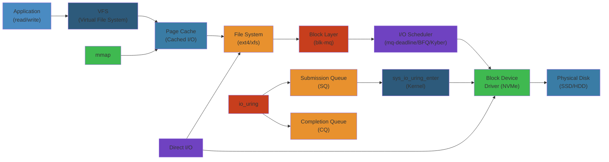

# 💾 Linux I/O & Storage — Complete Deep Dive




## Table of Contents
- [Virtual File System (VFS)](#virtual-file-system-vfs)
- [Filesystems: ext4](#filesystems-ext4)
- [Filesystems: XFS](#filesystems-xfs)
- [Filesystems: Btrfs](#filesystems-btrfs)
- [Filesystems: ZFS](#filesystems-zfs)
- [io_uring](#io_uring)
- [AIO vs io_uring](#aio-vs-io_uring)
- [Direct I/O vs Buffered I/O](#direct-io-vs-buffered-io)
- [Block Layer](#block-layer)
- [Disk Scheduling](#disk-scheduling)
- [mmap vs read/write](#mmap-vs-readwrite)
- [Huge Pages](#huge-pages)
- [Storage Stack](#storage-stack)
- [NVMe](#nvme)
- [Simplest Mental Model](#simplest-mental-model)

---

## Virtual File System (VFS)

```text
          System Calls (open, read, write, stat, mmap...)
                        │
              ┌─────────▼──────────┐
              │       VFS          │
              │  (generic layer)   │
              └────┬──────────┬────┘
                   │          │
        ┌──────────▼──┐  ┌───▼──────────┐
        │  ext4       │  │  XFS/Btrfs/  │
        │  inode_ops  │  │  NFS/tmpfs   │
        │  file_ops   │  │  ...         │
        └─────────────┘  └──────────────┘
```

**Core Objects** (defined in `struct`):

| Object | Purpose | Key Fields |
|--------|---------|------------|
| **super_block** | Represents mounted filesystem | `s_blocksize`, `s_type`, `s_root`, `s_op` |
| **inode** | Represents a file/dir (metadata) | `i_ino`, `i_mode`, `i_nlink`, `i_size`, `i_atime`, `i_blocks` |
| **dentry** | Directory entry (path component) | `d_name`, `d_parent`, `d_inode`, `d_op` |
| **file** | Open file descriptor | `f_pos`, `f_mode`, `f_flags`, `f_op`, `f_dentry` |
| **file_operations** | Method table for file ops | `read`, `write`, `mmap`, `open`, `release`, `llseek`, `iterate` |
| **inode_operations** | Method table for inode ops | `create`, `lookup`, `link`, `unlink`, `mkdir`, `rmdir`, `rename` |

**Dentry Cache** (dcache): Caches dentries in memory. Path lookup walks dentries to avoid expensive `lookup()` calls. LRU eviction. Hard links share inode but have separate dentries.

**Inode Cache**: Caches inodes. Inodes are kept as long as dentries reference them. Evicted on memory pressure.

**Path Resolution** (`path_walk()`): Process `open("/a/b/c")` → lookup root dentry → traverse "a" dentry → cache lookup → if miss, call `inode_operations.lookup()` → repeat for "b", "c". `LAST_NORM`, `LAST_DOT`, `LAST_DOTDOT` special handling.

**VFS Mount**: Each mount adds a mount struct linking superblock to dentry. `mount --bind` creates additional mount point to same dentry. `/proc/mounts` shows active mounts.

**File Descriptor Table**: Per-process (`struct files_struct`). Array of `struct file*`. RLIMIT_NOFILE (`ulimit -n`). `close()` removes entry. `dup2()` duplicates. `O_CLOEXEC` close-on-exec flag.

---

## Filesystems: ext4

**Extent-based**: Replaces indirect block mapping (ext3). Extents are contiguous block ranges.

```text
  Extent tree (HTREE):
        root node
      ┌────┴────┐
   extent 0   extent 1
  (logical 0, (logical 512,
   physical 1000, physical 2000,
   len 512)    len 512)
```

**Journal** (jbd2): Before metadata writes to disk, write to journal first. Three modes:
- **journal**: Data + metadata journaled (slowest, safest)
- **ordered**: Metadata journaled, data written first (default)
- **writeback**: Metadata journaled, data unordered (fastest, risk)

**Delayed Allocation**: Reserve blocks in memory but don't allocate on disk until writeback flush. Better extent merging → less fragmentation. Default `delalloc` mount option.

**Multiblock Allocator (mballoc)**: `ext4_mb_new_blocks()`. Allocates multiple blocks at once. Uses buddy bitmap per block group. Pre-allocation via locality group.

**flex_bg**: Groups multiple block groups into flex group for larger contiguous allocations. Metadata packed in first block group.

**EXT4 Features**: Extents, journal checksum, inline data, encryption, project quota, large (>16TB) volumes, fast_commit (reduced journal commit latency).

**ext4_inode_info**: In-memory inode. `i_data` stores 60 bytes of extent tree root. Larger trees use index blocks.

**`/proc/fs/ext4/<dev>/`**: mb_groups, mb_stats, mb_stream_req, session_write_kbytes, lifetime_write_kbytes.

---

## Filesystems: XFS

**B+tree based**: All metadata structures (inodes, directories, free space) use B+trees. Scalable to large filesystems and many files.

**Allocation Groups (AGs)**: Subdivides filesystem into equal-sized groups. Each AG has own B+trees for free space, inodes. Enables parallel allocation.

```text
  ┌───────┐  ┌───────┐  ┌───────┐  ┌───────┐
  │ AG 0  │  │ AG 1  │  │ AG 2  │  │ AG 3  │
  │ free  │  │ free  │  │ free  │  │ free  │
  │ space │  │ space │  │ space │  │ space │
  │ B+tree│  │ B+tree│  │ B+tree│  │ B+tree│
  │ inode │  │ inode │  │ inode │  │ inode │
  │ B+tree│  │ B+tree│  │ B+tree│  │ B+tree│
  └───────┘  └───────┘  └───────┘  └───────┘
```

**Delayed Logging**: Transaction log written to in-memory buffer (iclog), flushed to disk less frequently. Huge improvement over earlier synchronous log writes.

**Reflink/Dedupe**: `cp --reflink` (or `ioctl(FICLONE)`) creates COW copies. Same physical blocks until one is modified. `ioctl(FIDEDUPERANGE)` finds duplicate extents and merges.

**XFS Features**: Online defragmentation (`xfs_fsr`), online grow (`xfs_growfs`), online fsck (scrub, since 4.15), real-time device (sub-volume for real-time files), quotas, project IDs, DMAPI (data management API, rarely used).

**Speculative Preallocation**: XFS pre-allocates space beyond EOF for buffered writes. Truncated on file close or when file is truncated. /proc/sys/fs/xfs/speculative_prealloc_lifetime.

**`xfs_info`**: Shows AG count, block size, sector size, inode size, attributes.

---

## Filesystems: Btrfs

**Copy-on-Write (COW)**: Every write creates new blocks. Metadata and data are COW by default.

**Subvolumes**: Independent namespace trees within same filesystem. `btrfs subvolume create`. Can be snapshotted. Each subvolume has own generation counter.

**Snapshots**: `btrfs subvolume snapshot <-r> <src> <dst>`. Read-only (-r) or writable. Uses COW — instant and initially space-free.

**B-trees**: All on-disk structures are B-trees (COW B-trees). Extent tree, checksum tree, fs tree, root tree, chunk tree.

**Raid**:
| Profile | Min Devices | Description |
|---------|-------------|-------------|
| single | 1 | No redundancy |
| DUP | 1 | Data stored twice on same device |
| RAID0 | 2 | Striping |
| RAID1 | 2 | Mirroring |
| RAID10 | 4 | Striped mirrors |
| RAID5 | 3 | Striped with parity |
| RAID6 | 4 | Striped with double parity |

**Checksums**: CRC32c (default), xxhash, sha256, blake2b. On every block (metadata and data). Detects silent corruption. `btrfs scrub` verifies checksums.

**Compression**: zlib, lzo, zstd (since 4.14). Per-file or per-mount. `compress=zstd`, `compress-force=zstd`. Transparent — decompressed at read time.

**Btrfs send/receive**: Incremental send of subvolume snapshots. Used by backup tools (btrbk, snapper).

**Balancing**: `btrfs balance` rewrites data across devices. Re-balances when adding/removing devices or changing RAID profile.

---

## Filesystems: ZFS

**Storage Pools (zpools)**: Physical devices grouped into vdevs within a pool. Storage presented as datasets (filesystems, volumes, snapshots, clones).

```text
    Pool (tank)
    ├── vdev: mirror (sda, sdb)
    ├── vdev: mirror (sdc, sdd)
    └── vdev: raidz2 (sde, sdf, sdg, sdh)
        │
        ├── dataset tank/home (filesystem)
        ├── dataset tank/data (filesystem, compression=on)
        ├── volume tank/swap (zvol)
        └── snapshot tank/home@2024-01-01
```

**ARC (Adaptive Replacement Cache)**: In-kernel read cache. Recently used + frequently used pages. ARC MFU/MRU lists. L2ARC for SSD-based second-level cache.

**dRAID (Distributed RAID)**: Distributes spare space across all drives. Hot spare is distributed, reducing rebuild time.

**Checksums**: Fletcher-4, SHA256. Stored in parent block pointer (merkle tree). Self-healing: read detects mismatch, reconstructs from redundancy, fixes disk.

**Snapshots/Clones**: Instant (COW). Writable clones from snapshots. Can roll back to any snapshot.

**ZFS Features**: Deduplication (in-memory DDT), encryption (native, AES-CCM/GCM), quotas/reservations, send/receive, zvols (block devices over ZFS), TRIM, async destroy.

---

## io_uring

**Linux kernel async I/O framework** (since 5.1, by Jens Axboe). Replaces AIO with far lower overhead.

```text
  Userspace                         Kernel
  ┌──────────────────┐    ┌──────────────────────┐
  │  SQ (submission) │───►│  SQ ring (mmap'd)    │
  │  ring buffer     │    │  SQE entries          │
  │  tail increments │    │  consumed by kernel   │
  └──────────────────┘    └──────────┬───────────┘
                                     │
  ┌──────────────────┐    ┌──────────▼───────────┐
  │  CQ (completion) │◄───│  CQ ring (mmap'd)    │
  │  ring buffer     │    │  CQE entries          │
  │  head advances   │    │  written by kernel    │
  └──────────────────┘    └──────────────────────┘
```

**SQ ring**: Submission Queue ring. Stores SQEs (Submission Queue Entries). User writes SQE at `sq_array[tail]`, advances tail. Kernel reads from head to tail.

**CQ ring**: Completion Queue ring. Stores CQEs (Completion Queue Entries). Kernel writes CQE, advances tail. User reads from head to tail.

**System calls**:
- `io_uring_setup(entries, params)` → returns fd, mmaps SQ/CQ rings, SQEs array
- `io_uring_enter(fd, to_submit, min_complete, flags)` → submit batch + optionally wait
- `io_uring_register(fd, opcode, arg, nr_args)` → register files, buffers, ring fd

**Inline vs Async**: Small operations can complete inline (in `io_uring_enter`). Long operations (I/O) offloaded to kernel threads or workqueues.

**Registered files/buffers**: Pre-register fixed file descriptors and memory buffers. Avoids per-I/O fd lookup and page pinning. Gives ~20% throughput boost.

**Poll mode**: Queue sometimes skipped entirely. Kernel polls hardware directly. `IORING_SETUP_IOPOLL`. For NVMe with polling support. Zero-interrupt path.

**Multi-shot**: Single SQE generates multiple CQEs. For `accept`, `recv`, `poll` operations. `IORING_CQE_F_MORE` flags "more completions coming".

**SQPOLL**: Kernel thread polls SQ ring instead of userspace calling `io_uring_enter`. Zero syscall submission. `IORING_SETUP_SQPOLL`. Idle timeout configurable.

**Nop**: `IORING_OP_NOP`. Test op that completes immediately. Measures ring overhead. Also doubles as CQE ordering fence.

**Supported ops** (>90): `readv`, `writev`, `fsync`, `fallocate`, `openat`, `close`, `statx`, `mkdirat`, `linkat`, `symlinkat`, `renameat`, `unlinkat`, `sendmsg`, `recvmsg`, `connect`, `accept`, `epoll_ctl`, `splice`, `tee`, `msg_ring`, `waitid`, `poll_add`, `timeout`, `cancel`, `files_update`, `socket`.

---

## AIO vs io_uring

| Aspect | AIO (aio_read/aio_write) | io_uring |
|--------|--------------------------|----------|
| Syscall per I/O | Yes (setup + submit + wait) | No (ring buffer) |
| Copy cost | Each I/O copies iocb | Zero-copy ring |
| Buffered I/O | Often synchronous | True async |
| O_DIRECT | Required for true async | Not required |
| Max I/Os | Limited by nr_events | Up to ring size (configurable) |
| Completion | signal, callback, or epoll | CQ ring (batch reap) |
| Supported ops | read/write/fsync/poll only | 90+ ops |
| Overhead (ops/sec) | ~500K | ~5M+ (with SQPOLL) |
| Kernel support | Since 2.5 | Since 5.1 |
| Programming | Complex (eventfd, iocbs) | Simpler (SQE/CQE ring) |

---

## Direct I/O vs Buffered I/O

| Aspect | Buffered I/O | Direct I/O (O_DIRECT) |
|--------|-------------|----------------------|
| Page cache | Uses | Bypasses |
| Alignment | No requirement | Sector-aligned (512/4K) |
| Write ordering | Page cache handles | Application responsible |
| fsync | Not needed (delayed) | Needed for durability |
| Performance | Good for repeated reads | Good for streaming/skip cache |
| Database | Not typically used | Often used (DB buffer pool) |

**Page Cache**: Managed globally. Pages are indexed by `(inode, offset)`. LRU lists (active/inactive). `drop_caches` (`/proc/sys/vm/drop_caches`) to evict.

**Writeback**: Dirty pages flushed to disk periodically. Tunables:
- `dirty_ratio` (default 20%): Max dirty pages as % of total memory before blocking writers
- `dirty_background_ratio` (default 10%): % dirty when background flusher starts
- `dirty_expire_centisecs` (default 3000): Age in cs before pages considered expired
- `dirty_writeback_centisecs` (default 500): Wakeup interval of flusher threads

**pdflush/flusher threads**: Per-bdi flusher threads. `sync()` waits for all. `fsync()` flushes specific file only.

**O_DIRECT**: Bypasses page cache. DMA directly to/from userspace buffer. Buffer must be aligned (typically 512 bytes). Applications manage their own caching.

**O_SYNC**: Writes return only after data is on stable storage (slower than O_DIRECT). O_DSYNC (data only), O_RSYNC (reads see written data).

---

## Block Layer

```text
    VFS (filesystem operations)
         │
         ▼
    Block Layer (generic block I/O)
         │
    ┌────┴────┐
    │  I/O    │  elevator/scheduler
    │  merge  │
    │  sort   │
    └────┬────┘
         │
    ┌────┴────┐
    │  blk-mq │  multi-queue block layer
    │  SW/HW  │
    │  queues │
    └────┬────┘
         ▼
    Driver (SCSI, NVMe, ATA)
         │
         ▼
    Hardware (SSD, HDD, NVMe)
```

**bio** (`struct bio`): Basic container for block I/O. Contains page vectors, bi_iter (current position), bi_end_io (completion callback). Single bio can represent multiple physically contiguous segments via bio_vec array.

**request** (`struct request`): Formed by merging bios. Multiple contiguous bios merged into one request. Tagged with command type (READ/WRITE/FLUSH/DISCARD).

**Elevator (I/O Scheduler)**: Merges and sorts requests before dispatch. Traditional single-queue layer. Merging: front, back, bucket hash.

**blk-mq** (Multi-Queue Block Layer):

```text
    ┌──────────────────────────────────────┐
    │  Software Staging Queues (per-CPU)   │
    │    sw0    sw1    sw2    sw3          │
    │  ┌───┐  ┌───┐  ┌───┐  ┌───┐        │
    │  │bio│  │bio│  │bio│  │bio│        │
    │  └───┘  └───┘  └───┘  └───┘        │
    └──────────────┬──────────────────────┘
                   │ (dispatch via IPI)
                   ▼
    ┌──────────────────────────────────────┐
    │  Hardware Dispatch Queues            │
    │    hw0     hw1     hw2     hw3      │
    │  ┌───┐   ┌───┐   ┌───┐   ┌───┐    │
    │  │req│   │req│   │req│   │req│    │
    │  └───┘   └───┘   └───┘   └───┘    │
    └──────────────┬──────────────────────┘
                   │
                   ▼
               NVMe/SCSI
```

Software queues per-CPU, hardware queues per-device queue. Mapping sw → hw via CPU affinity. Reduces lock contention (per-CPU sw queues). Plugging: batch requests per sw queue, flush on unplug.

---

## Disk Scheduling

| Scheduler | Type | Use Case | Notes |
|-----------|------|----------|-------|
| **noop** | Simple FIFO | NVMe/SSD | Minimal overhead, good for fast devices |
| **deadline** | Multi-queue | General | Per-priority FIFO, read deadline, write starvation limit |
| **CFQ** | Time-based | HDD | Fair queuing, groups, idle class (legacy) |
| **BFQ** | Weight-based | Interactive | Budget Fair Queuing, low latency for interactive apps |
| **kyber** | Latency-target | Multi-queue SSD | Token-based, read/write queues with latency targets |
| **mq-deadline** | Deadline + blk-mq | Modern default | Deadline algorithm adapted for blk-mq |

**Selection**: Modern systems use `mq-deadline` or `none` (equivalent to noop) for NVMe. HDDs benefit from BFQ or mq-deadline.

**I/O Priority**: `ionice -c<class> -n<level>`. Classes: RT (0), Best-effort (1), Idle (2). Supported by BFQ/CFQ.

---

## mmap vs read/write

| Aspect | mmap | read/write |
|--------|------|------------|
| System calls | One `mmap()`, page faults on access | `read()` per chunk |
| Copy cost | Zero-copy (page cache direct) | Double copy (kernel→user buffer) |
| Random access | Excellent (just fault) | Sequential only |
| Complexity | Manage mappings, sigbus | Simple loop |
| File size | Limited by VA space | No limit |
| Partial write | Modify pages, writeback handles | `write()` all data |
| Shared mappings | Multiple processes share pages | Per-process copies |
| `MAP_SHARED` | Changes visible to other processes + files | N/A |
| `MAP_PRIVATE` | COW on write (like fork) | N/A |

**Page Cache Interactions**:
- `mmap()` maps page cache pages directly into userspace
- `read()` copies from page cache to user buffer
- `write()` copies from user buffer to page cache (marks dirty)
- Mixing mmap and read/write is safe (same page cache)

**MAP_POPULATE**: Pre-fault pages after mmap. No page faults on first access.

**MAP_HUGETLB**: Map huge pages (2MB/1GB) instead of 4KB pages. Reduces TLB pressure.

**MAP_NORESERVE**: Don't reserve swap space. Commit charge is "overcommit" mode.

**MAP_FIXED**: Map at exact address. Dangerous — can overwrite existing mappings. MAP_FIXED_NOREPLACE (since 4.17) safer variant.

---

## Huge Pages

**2MB (x86-64)**: Reduces TLB entries from 512 (4KB) to 1. Level 2 page table entry maps 2MB directly. Also 1GB pages (level 3).

**Manual (`/proc/sys/vm/`)**: `nr_hugepages`, `nr_overcommit_hugepages`, `hugetlb_shm_group`.

**THP (Transparent Huge Pages)**: Automatically promotes eligible 4KB pages to 2MB. `khugepaged` kernel thread scans memory.

```text
  /sys/kernel/mm/transparent_hugepage/
  ├── enabled        [always] [madvise] [never]
  ├── defrag         [always] [defer+madvise] [madvise] [never]
  └── khugepaged/
      ├── pages_to_scan  (default 4096)
      └── scan_sleep_millisecs (default 10000)
```

**Defragmentation**: THP may need to defragment memory. `defrag` settings:
- `always`: Wait for compaction on every allocation
- `defer`: Wake kcompactd, don't stall
- `defer+madvise`: Only stalling for MADV_HUGEPAGE
- `madvise`: Only MADV_HUGEPAGE hint triggers page promotion
- `never`: Disable

**THP downsides**: Compound pages (2MB) harder to reclaim. Compaction overhead. Contiguous memory pressure. KHUGEPAGED scanning CPU cost.

**HugeTLB**: `mmap(MAP_HUGETLB)` or `mount -t hugetlbfs`. Reserved pages pre-allocated. No compaction needed. Used by databases (Oracle, PostgreSQL), DPDK, VMMs.

---

## Storage Stack

```text
  ┌───────────────────────────────────┐
  │  System Call Interface           │
  │  (open, read, write, mmap)       │
  ├───────────────────────────────────┤
  │  VFS Layer                       │
  │  ┌──────────┬──────────┬────────┐ │
  │  │ ext4     │  XFS     │ Btrfs  │ │
  │  │ super    │  super   │ super  │ │
  │  │ inode    │  inode   │ inode  │ │
  │  │ file_ops │  file_ops│file_ops│ │
  │  └──────────┴──────────┴────────┘ │
  ├───────────────────────────────────┤
  │  Mapping Layer (page cache)       │
  │  ┌───┬───┬───┬───┬───┐           │
  │  │   │   │   │   │   │           │
  │  └───┴───┴───┴───┴───┘           │
  ├───────────────────────────────────┤
  │  Block Layer (bio, request)       │
  │  ┌────────┐  ┌────────┐          │
  │  │ elevator│  │ blk-mq │          │
  │  └────────┘  └────────┘          │
  ├───────────────────────────────────┤
  │  SCSI / ATA / NVMe Mid-layer     │
  ├───────────────────────────────────┤
  │  Device Driver                    │
  │  (ahci, nvme, virtio_blk)        │
  ├───────────────────────────────────┤
  │  Hardware (NVMe SSD, SATA SSD,   │
  │  HDD, virtio block device)       │
  └───────────────────────────────────┘
```

**Block device types**: `/dev/nvme0n1` (NVMe namespace), `/dev/sda` (SCSI/SATA), `/dev/md0` (software RAID), `/dev/dm-0` (device mapper — LUKS, LVM, thin provisioning).

**Device Mapper**: Kernel framework for mapping block devices. Used by LVM, dm-crypt (LUKS), dm-raid, dm-thinp, dm-verity, dm-integrity, dm-writecache.

**MD RAID**: Software RAID. Levels 0, 1, 4, 5, 6, 10. Bitmap for fast resync. External metadata (IMSM, DDF) or internal.

---

## NVMe

**Non-Volatile Memory Express**: Protocol designed for flash SSDs over PCIe.

```text
  CPU
   │
   │ MMIO writes (doorbell register)
   │
   ▼
  Submission Queue (SQ) ──► Controller ──► Completion Queue (CQ)
   │                                               │
   │ SQ Tail Doorbell                              │ CQ Head Doorbell
   │ (write to register)                           │ (write to register)
   ▼                                               ▼
  PCIe BAR (MMIO space)                     Interrupt (MSI-X)
```

**SQ/CQ Pairs**: Each queue pair has one SQ and one CQ. Commands written to SQ slot. Controller processes, writes completion to CQ slot. Doorbell registers notify controller.

**Doorbell**: MMIO register write. High overhead (PCIe transaction). Batch submission to reduce doorbell writes.

**PRP (Physical Region Page)**: Physical memory scatter-gather descriptor. PRP1/PRP2 pairs. Up to 2 PRPs inline; PRP list for more.

**SGL (Scatter Gather List)**: Alternative to PRP. More flexible. Describes physical memory for data transfer. Supports segments, bit bucket (skip), last segment marker.

**Multi-Queue**: Each CPU core can have its own SQ/CQ pair. No lock contention. `blk-mq` maps directly to NVMe queue pairs.

**Namespace**: NVMe device can expose multiple namespaces (like logical units). `nvme0n1` = controller 0, namespace 1. Namespaces are independent block devices.

**Streams**: NVMe 1.3+ streams. Write stream ID with data. Device groups data by stream for better garbage collection. `ioctl(NVME_IOCTL_SUBMIT_IO)` with stream ID.

**Features**: Power management (PS profiles), temperature monitoring, self-test, format, sanitize, firmware update, persistent event log, TP (Telemetry Protocol).

**`nvme-cli`**: `nvme list`, `nvme id-ctrl`, `nvme id-ns`, `nvme smart-log`, `nvme format`, `nvme sanitize`.

---

## Simplest Mental Model

> **Linux I/O is like a library with different reading rooms.**
>
> - **VFS** = the catalog system. Every book (file) has a card (inode), and every shelf position has a tag (dentry). The catalog works the same no matter what the book is made of.
> - **ext4/XFS/Btrfs** = different shelving systems for the warehouse. ext4 stacks in boxes, XFS uses tall B+Trees, Btrfs takes Polaroids of every arrangement.
> - **Page cache** = a reading table. When you look at a book page, they leave it on the table in case you need it again. Dirty pages have sticky notes to be filed back.
> - **Block layer** = the conveyor belt from warehouse to reading tables. Bios are books on the belt, merged into stacks for efficiency.
> - **nvme** = a librarian with telepathy. Write your request on a shared notepad, ring a bell, and the answer appears on another notepad. Zero back and forth.
> - **io_uring** = a bucket brigade. Fill the bucket (SQ ring), push it, results come back in another bucket (CQ ring). Batch it all at once.
> - **mmap** = pin the book page to the wall. Read it whenever without asking. But if you write on it, the librarian must re-file it.
> - **Direct I/O** = grab the book and take it to your own desk. No reading table used. You handle the filing.
> - **Huge pages** = serving entire chapters on a single placard instead of 512 separate index cards (TLB entries).


## Practical Example

See code examples above for practical usage patterns.