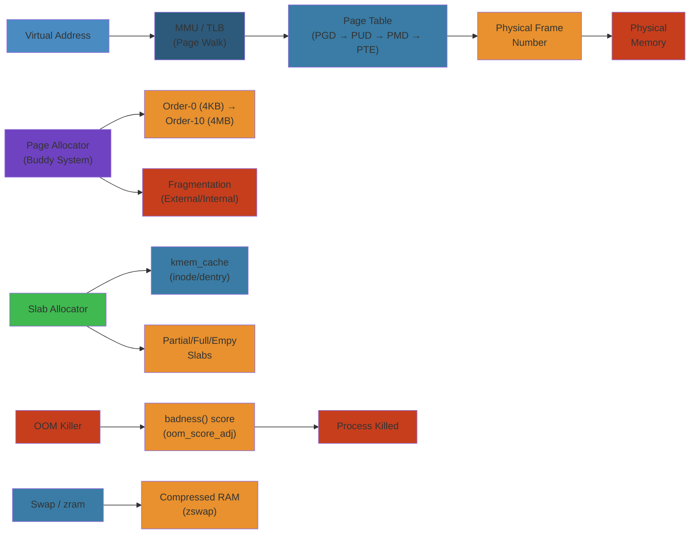

# 🧠 Memory Management — Complete Deep Dive

> **Scope**: Virtual memory architecture, MMU/TLB, page fault handling, buddy allocator, slab/SLUB allocator, OOM killer, NUMA memory policies, swap (zswap/zram), cgroup memory controller, page cache, mmap, ASLR — every aspect of Linux memory management.

> **Related**: [01-linux-kernel-architecture.md](01-linux-kernel-architecture.md), [02-cpu-scheduling.md](02-cpu-scheduling.md), [04-io-models.md](04-io-models.md)

---




## Table of Contents

#### Step-by-Step
1. Process input
2. Validate
3. Execute
4. Return result

#### Code Example
```python
# Example implementation
pass
```

#### Real-World Scenario
This pattern is commonly used in production systems.


1. [Virtual Memory](#1-virtual-memory)
2. [MMU & TLB](#2-mmu--tlb)
3. [Page Fault Handling](#3-page-fault-handling)
4. [Buddy Allocator](#4-buddy-allocator)
5. [Slab/SLUB Allocator](#5-slabslub-allocator)
6. [OOM Killer](#6-oom-killer)
7. [NUMA Memory Management](#7-numa-memory-management)
8. [Swap — zswap & zram](#8-swap--zswap--zram)
9. [Cgroup Memory Controller](#9-cgroup-memory-controller)
10. [Page Cache](#10-page-cache)
11. [mmap](#11-mmap)
12. [ASLR](#12-aslr)
13. [Internals](#13-internals)
14. [Failure Analysis](#14-failure-analysis)
15. [Edge Cases](#15-edge-cases)
16. [Performance](#16-performance)
17. [Simplest Mental Model](#17-simplest-mental-model)

---

## 1. Virtual Memory

#### Step-by-Step
1. Process input
2. Validate
3. Execute
4. Return result

#### Code Example
```python
# Example implementation
pass
```

#### Real-World Scenario
This pattern is commonly used in production systems.


```
Process Virtual Address Space (x86-64, 48-bit)
┌───────────────────────────────────┐ 0xFFFF FFFF FFFF FFFF
│        Kernel Space               │
│    (shared, not accessible        │
│     from userspace)               │
│                                   │
│   vmalloc area                    │
│   vmap area                       │
│   fixmap area                     │
│   directly mapped (phys mem)      │
├───────────────────────────────────┤ 0xFFFF 8000 0000 0000
│       LEAK / PGD hole             │
├───────────────────────────────────┤ 0x0000 7FFF FFFF FFFF
│        User Space                 │
│    (per-process, private)         │
│                                   │
│   Stack (grows down)              │ 0x0000 7FFF FFFF FFFF ←
│   ↓                               │
│   [gap]                           │
│   ↑                               │
│   mmap area (libraries, shm)      │
│   [gap]                           │
│   Heap (brk)                      │
│   ↑                               │
│   BSS (uninit data)               │
│   Data (init data)                │
│   Text (code)                     │
│   Page zero (guard)               │
├───────────────────────────────────┤ 0x0000 0000 0000 0000
```

- **Purpose**: Each process gets its own virtual address space; isolates processes, enables sparse mappings, simplifies memory allocation
- **Page size**: 4KB default, 2MB (huge pages), 1GB (PUD-level)
- **Mapping**: Virtual → Physical via page tables (multi-level translation)

### Step-by-Step

#### Step-by-Step
1. Process input
2. Validate
3. Execute
4. Return result

#### Code Example
```python
# Example implementation
pass
```

#### Real-World Scenario
This pattern is commonly used in production systems.


1. **Application accesses memory** at virtual address 0x7fff1234
2. **TLB lookup** checks translation lookaside buffer (cache) for VA→PA mapping
3. **TLB miss** triggers page walk through page table hierarchy (PGD → PUD → PMD → PTE)
4. **PTE lookup** finds physical frame number and permission bits (read, write, execute)
5. **Permission check** verifies process has access (SEGFAULT if not); if page not present, page fault
6. **TLB update** on successful translation, TLB caches mapping for future lookups (~1ns latency vs 100+ cycles for page walk)

### Code Example

#### Step-by-Step
1. Process input
2. Validate
3. Execute
4. Return result

#### Code Example
```python
# Example implementation
pass
```

#### Real-World Scenario
This pattern is commonly used in production systems.


```python
# Python: Virtual memory exploration
import os
import mmap

def analyze_vm():
    # Read /proc/self/maps to see virtual address layout
    with open('/proc/self/maps', 'r') as f:
        print("Virtual Address Space Map:")
        for line in f:
            print(line.rstrip())
    
    # Allocate different types of memory
    stack_var = 0x12345678  # Stack allocation
    
    heap_mem = bytearray(4096)  # Heap allocation
    heap_addr = id(heap_mem) & ~0xFFF  # Approximate address
    
    # mmap: demand-paged mapping
    with open('/tmp/test.bin', 'wb') as f:
        f.write(b'x' * 8192)
    
    with open('/tmp/test.bin', 'rb') as f:
        # Map file into virtual address space
        mmap_region = mmap.mmap(f.fileno(), 0, access=mmap.ACCESS_READ)
        mmap_addr = id(mmap_region)
        print(f"\nmmap region at: 0x{mmap_addr:x}")
        
        # Accessing causes page fault if not in memory
        first_byte = mmap_region[0]
        print(f"First byte: {first_byte}")
        mmap_region.close()
    
    # Check TLB statistics (requires perf on Linux)
    os.system("perf stat -e dTLB-load-misses,iTLB-load-misses sleep 1")

if __name__ == '__main__':
    analyze_vm()
```

### Real-World Scenario

#### Step-by-Step
1. Process input
2. Validate
3. Execute
4. Return result

#### Code Example
```python
# Example implementation
pass
```

#### Real-World Scenario
This pattern is commonly used in production systems.


Google's Bigtable serving layer was experiencing 40% of CPU cycles in TLB misses (page table walks). Each cell server held 50GB working set with default 4KB pages, creating a 12.8M-entry page table. They switched to 2MB huge pages (52K page table entries), reducing TLB miss rate from 12% to 0.3%—throughput increased 23%, latency P99 dropped 15ms.
- **Overcommit**: Kernel can allow allocating more virtual memory than physical RAM + swap

### Multi-Level Page Tables (x86-64 4-level)

#### Step-by-Step
1. Process input
2. Validate
3. Execute
4. Return result

#### Code Example
```python
# Example implementation
pass
```

#### Real-World Scenario
This pattern is commonly used in production systems.


```
VA bits:  47-39    38-30    29-21    20-12    11-0
         ┌──────┐ ┌──────┐ ┌──────┐ ┌──────┐ ┌────┐
         │ PML4 │ │ PDPT │ │  PD  │ │  PT  │ │offset│
         └──┬───┘ └──┬───┘ └──┬───┘ └──┬───┘ └──┬──┘
            │        │        │        │        │
          ┌─▼┐    ┌──▼──┐  ┌──▼──┐  ┌──▼──┐   4KB
          │PML4 │  │PDPT │  │ PD  │  │ PT  │
          │e 0  │  │e 0  │  │e 0  │  │e 0  │
          │e 1  │  │e 1  │  │e 1  │  │e 1  │
          │...  │  │...  │  │...  │  │...  │
          │e 511│  │e 511│  │e 511│  │e 511│
          └─────┘  └─────┘  └─────┘  └──┬───┘
                                         │
                                    ┌────▼────┐
                                    │ Physical │
                                    │  Page    │
                                    │  4096    │
                                    │  bytes   │
                                    └─────────┘

5-level paging (LA57): adds a 57-48 bit level → 56-bit VA → 128 PiB addressable
```

### Huge Pages

#### Step-by-Step
1. Process input
2. Validate
3. Execute
4. Return result

#### Code Example
```python
# Example implementation
pass
```

#### Real-World Scenario
This pattern is commonly used in production systems.


```
Standard 4KB page → 512 entries per PT → 2MB range per page table

Huge pages:
  - 2MB (PMD-level): only 1 page table level, fewer TLB entries, lower TLB miss rate
  - 1GB (PUD-level): directly mapped, massive pages for HPC/database

Transparent Huge Pages (THP):
  - Kernel automatically promotes 4KB pages to 2MB when possible
  - /sys/kernel/mm/transparent_hugepage/enabled: [always] madvise never
  - /sys/kernel/mm/transparent_hugepage/defrag: how to handle fragmentation
  - Can cause latency spikes due to compaction (khugepaged)
```

---

## 2. MMU & TLB

#### Step-by-Step
1. Process input
2. Validate
3. Execute
4. Return result

#### Code Example
```python
# Example implementation
pass
```

#### Real-World Scenario
This pattern is commonly used in production systems.


```
CPU Core ──► MMU ──► TLB (cache) ──► Page Table Walk ──► Memory Controller
                     │                                      │
                   Hit?  ◄──── No ───────────────┐          │
                     │ Yes                         │          │
                     ▼                             ▼          ▼
              Physical addr                    (Slow path)  DRAM
```

### TLB Reach

#### Step-by-Step
1. Process input
2. Validate
3. Execute
4. Return result

#### Code Example
```python
# Example implementation
pass
```

#### Real-World Scenario
This pattern is commonly used in production systems.


```
TLB Reach = TLB_entries × Page_size

Example: Intel Skylake
  L1 DTLB: 64 entries × 4KB = 256KB reach (small pages)
  L1 DTLB: 32 entries × 2MB = 64MB reach (huge pages)
  L2 STLB (shared): 1536 entries × 4KB = 6MB reach (small)
  L2 STLB (shared): 1536 entries × 2MB = 3GB reach (huge)

→ Huge pages dramatically increase the memory range covered by TLB
→ Working set > TLB reach → frequent TLB misses → performance drop
```

### TLB Miss Handling

#### Step-by-Step
1. Process input
2. Validate
3. Execute
4. Return result

#### Code Example
```python
# Example implementation
pass
```

#### Real-World Scenario
This pattern is commonly used in production systems.


```
Hardware TLB Miss (x86):
  - MMU automatically walks page tables in hardware
  - Fills TLB entry, retries access
  - ~10-30 cycles for walk (L1 hit), ~100-200 cycles if DRAM access needed

Software TLB Miss (some RISC architectures):
  - MMU raises TLB miss exception → OS handler fills TLB
  - More flexible, higher overhead

ASID (Address Space ID):
  - Tags TLB entries with process ID
  - On context switch: change ASID register instead of flushing TLB
  - Avoids TLB flush → ~1μs vs ~100μs for full flush
  - PCID (Process Context ID) on x86: same concept
```

### TLB Shootdown

#### Step-by-Step
1. Process input
2. Validate
3. Execute
4. Return result

#### Code Example
```python
# Example implementation
pass
```

#### Real-World Scenario
This pattern is commonly used in production systems.


```
When kernel modifies page table (e.g., munmap, mprotect):
  → Must invalidate TLB entries on ALL CPUs that may have cached them
  → Sends IPI (Inter-Processor Interrupt) to each affected CPU
  → Each CPU executes TLB invalidation instruction (INVLPG on x86)
  → Cost grows with CPU count: O(n_cpus)

Mitigation:
  - Lazy TLB flush (batched invalidations)
  - Range-based invalidation (flush_tlb_kernel_range)
  - TLB batching in munmap/mremap
```

### hugetlb (HugeTLB)

#### Step-by-Step
1. Process input
2. Validate
3. Execute
4. Return result

#### Code Example
```python
# Example implementation
pass
```

#### Real-World Scenario
This pattern is commonly used in production systems.


```
Reserved huge pages (not transparent):
  /sys/kernel/mm/hugepages/hugepages-2048kB/nr_hugepages = 1024
  → Pre-allocates 1024 × 2MB = 2GB of contiguous physical memory
  → Applications mmap with MAP_HUGETLB or hugetlbfs mount

Advantages:
  - Guaranteed contiguous physical memory
  - No compaction needed at allocation time
  - No THP defragmentation overhead
  - Database WAL, HPC, large caches
```

---

## 3. Page Fault Handling

#### Step-by-Step
1. Process input
2. Validate
3. Execute
4. Return result

#### Code Example
```python
# Example implementation
pass
```

#### Real-World Scenario
This pattern is commonly used in production systems.


```
Program access VA → MMU looks up page table → no valid PTE → page fault

Types of page faults:
┌──────────────────────────────────────────────────────────────┐
│ Minor Fault (soft): Page already in memory, just not mapped  │
│   - Page in page cache (lazy mapping via file read)          │
│   - COW (Copy On Write) → duplicate mapping of zero page     │
│   - Swap cache → page was swapped out but still cached       │
│   - Fix: Create PTE, increment map count                     │
│   Cost: ~0.2-1μs                                             │
├──────────────────────────────────────────────────────────────┤
│ Major Fault (hard): Page must be read from disk              │
│   - Page not in page cache → do I/O                         │
│   - Swap → page was paged out → read from swap               │
│   - Demand paging for executable (text section)               │
│   - Fix: block until I/O completes, update PTE               │
│   Cost: ~1-10ms (disk/SSD dependent)                         │
├──────────────────────────────────────────────────────────────┤
│ Invalid/Segfault: No VMA exists for this address              │
│   → SIGSEGV to process (or kernel oops if in kernel mode)    │
└──────────────────────────────────────────────────────────────┘
```

### Demand Paging

#### Step-by-Step
1. Process input
2. Validate
3. Execute
4. Return result

#### Code Example
```python
# Example implementation
pass
```

#### Real-World Scenario
This pattern is commonly used in production systems.


```
Executable load:
  1. mmap executable → VMA created, PTEs not yet filled
  2. Process starts executing code (tries to access .text page)
  3. Page fault → kernel sees VMA with file backing
  4. Allocate page frame, read page from binary (major fault)
  5. Fill PTE, return to userspace → instruction retries
  6. Next pages fault on demand → only the needed pages are loaded

→ Programs start instantly — only fault in the pages actually used
→ Large binaries (hundreds of MB) see only a few MB of actual page faults
```

### Copy on Write (COW)

#### Step-by-Step
1. Process input
2. Validate
3. Execute
4. Return result

#### Code Example
```python
# Example implementation
pass
```

#### Real-World Scenario
This pattern is commonly used in production systems.


```
fork() behavior:
  1. Parent has pages mapped
  2. fork(): parent PTEs marked read-only (clear writable bit)
  3. Child shares the same physical pages (same PTEs, COW flag in swap entry)
  4. Either process writes → page fault → handler:
     a. Allocate new page
     b. Copy content from shared page
     c. Update PTE to writable (private copy)
     d. Decrement page refcount
  5. Pages never written remain shared (zero-copy)

→ fork is fast regardless of memory footprint
→ Only pages actually written are copied
```

### Page Cache

#### Step-by-Step
1. Process input
2. Validate
3. Execute
4. Return result

#### Code Example
```python
# Example implementation
pass
```

#### Real-World Scenario
This pattern is commonly used in production systems.


```
File-backed pages: stored in page cache (address_space)
  - Shared across processes that mmap the same file
  - Managed by radix tree / XArray (keyed by file offset)
  - Evicted by reclaim (kswapd, direct reclaim) under memory pressure

Readahead:
  - Kernel detects sequential access pattern
  - Async pre-fetches next pages (sync readahead, async readahead)
  - window_size starts at 4 pages, grows up to 32 pages (max_readahead)
  - /sys/block/<dev>/queue/read_ahead_kb
```

---

## 4. Buddy Allocator

#### Step-by-Step
1. Process input
2. Validate
3. Execute
4. Return result

#### Code Example
```python
# Example implementation
pass
```

#### Real-World Scenario
This pattern is commonly used in production systems.


```
The buddy allocator manages physical page frames.
Pages are grouped by order (0 = 4KB, 1 = 8KB, ..., 10 = 4MB).

Free lists per migrate type per zone:
┌──────────────────────────────────────────────────────────────────┐
│ Zone Normal                                                      │
│                                                                  │
│ free_area[0]  ─► [page4k] ─► [page4k] ─► [page4k]              │
│ free_area[1]  ─► [page8k] ─► [page8k]                           │
│ free_area[2]  ─► [page16k]                                      │
│ ...                                                              │
│ free_area[10] ─► [page4M]                                       │
│                                                                  │
│ Each order has a list of free page blocks of that size           │
│ Migrate types: UNMOVABLE, MOVABLE, RECLAIMABLE, CMA, HIGHATOMIC │
└──────────────────────────────────────────────────────────────────┘
```

### Allocation & Free

#### Step-by-Step
1. Process input
2. Validate
3. Execute
4. Return result

#### Code Example
```python
# Example implementation
pass
```

#### Real-World Scenario
This pattern is commonly used in production systems.


```
Allocation:
  if (request order N has free):
    give first from free_area[N]
  else:
    find order M (M > N) with free pages
    split buddy: free_area[M] → two free_area[M-1]
    repeat until order N is available
    give one block, add buddy to order N free list
  → Worst-case: O(log MAX_ORDER)

Free:
  Put block back on free_area[N]
  Check if buddy (adjacent same-order block) is also free:
    If yes: merge → order N+1
    Repeat checking buddy until no merge possible
  → Coalesces fragmented pages back into larger blocks
```

### Migrate Types

#### Step-by-Step
1. Process input
2. Validate
3. Execute
4. Return result

#### Code Example
```python
# Example implementation
pass
```

#### Real-World Scenario
This pattern is commonly used in production systems.


```
Prevents permanent fragmentation:

MIGRATE_UNMOVABLE:  Kernel allocations (kmalloc, page table pages)
                    Cannot be relocated — pins the page frame

MIGRATE_MOVABLE:    Userspace pages (anonymous, page cache)
                    Can be moved (migrated) by compaction

MIGRATE_RECLAIMABLE: Slab caches, filesystem metadata
                    Can be reclaimed (freed and re-allocated)

MIGRATE_CMA:        Contiguous Memory Allocator
                    Reserved for driver contiguous allocations
                    Movable pages can use CMA space temporarily

When a migrate type is exhausted:
  → Fallback to steal from other migrate types (fallback table)
  → Movable can steal from UNMOVABLE but not vice versa
```

### Fragmentation Avoidance

#### Step-by-Step
1. Process input
2. Validate
3. Execute
4. Return result

#### Code Example
```python
# Example implementation
pass
```

#### Real-World Scenario
This pattern is commonly used in production systems.


```
/proc/pagetypeinfo shows free pages per order per migrate type

Compaction (kswapd + direct compaction):
  1. Scan from two ends: MOVABLE pages from low pfn, UNMOVABLE from high pfn
  2. Migrate MOVABLE pages to compact region
  3. Creates larger contiguous blocks
  4. /proc/sys/vm/compact_memory to trigger manually

Anti-fragmentation strategies:
  - Group pages by migrate type in same pageblock (4MB on x86)
  - /proc/sys/vm/min_free_kbytes reserves pages for atomic allocations
  - Watermark boosting for order > 0 allocations
```

---

## 5. Slab/SLUB Allocator

#### Step-by-Step
1. Process input
2. Validate
3. Execute
4. Return result

#### Code Example
```python
# Example implementation
pass
```

#### Real-World Scenario
This pattern is commonly used in production systems.


```
Purpose: Kernel allocator for small objects (32 bytes - 8KB)
  - Avoids fragmentation from many small allocations
  - Object caching (constructor/destructor per cache)
  - Per-CPU caches for fast-path allocation

SLUB (default since Linux 2.6.23) vs SLAB:
  SLUB: simpler, fewer metadata, better NUMA, no per-CPU queues
  SLAB: legacy, per-CPU arrays, slab coloring
```

### SLUB Structure

#### Step-by-Step
1. Process input
2. Validate
3. Execute
4. Return result

#### Code Example
```python
# Example implementation
pass
```

#### Real-World Scenario
This pattern is commonly used in production systems.


```
kmem_cache (e.g., task_struct_cache)
│
├── kmem_cache_cpu (per-CPU, fast path)
│   ├── freelist (first free object in slab)
│   ├── page (current slab being allocated from)
│   └── partial (list of partially full slabs)
│
└── kmem_cache_node (per-NUMA node, slow path)
    ├── partial (list of partially full slabs from this node)
    └── full (list of full slabs)
```

### Allocation Path

#### Step-by-Step
1. Process input
2. Validate
3. Execute
4. Return result

#### Code Example
```python
# Example implementation
pass
```

#### Real-World Scenario
This pattern is commonly used in production systems.


```
kmem_cache_alloc(cache, flags)
  │
  ├── Fast path (per-CPU):
  │     freepointer = this_cpu_ptr(cache->cpu_slab)->freelist
  │     if (freepointer)
  │         obj = freepointer
  │         freepointer = *(void **)obj  // next free
  │         return obj
  │
  ├── Medium path (partial):
  │     pop slab from partial list (node partial)
  │     return first object
  │
  └── Slow path (new slab):
        allocate page(s) via buddy allocator
        format object freelist
        return first object
```

### kmalloc

#### Step-by-Step
1. Process input
2. Validate
3. Execute
4. Return result

#### Code Example
```python
# Example implementation
pass
```

#### Real-World Scenario
This pattern is commonly used in production systems.


```
kmalloc is just a set of pre-defined SLUB caches:
  kmalloc-8, kmalloc-16, kmalloc-32, ..., kmalloc-8M
  (powers of 2, up to MAX_ORDER * PAGE_SIZE)

  kmalloc(100) → kmalloc-128 cache (rounds up to next power of 2)
  kmalloc(4000) → kmalloc-4096 cache

  Maximum: kmalloc(8MB) = order-10 allocation from buddy allocator
  Physically contiguous!
```

### Slab Coloring

#### Step-by-Step
1. Process input
2. Validate
3. Execute
4. Return result

#### Code Example
```python
# Example implementation
pass
```

#### Real-World Scenario
This pattern is commonly used in production systems.


```
Slab = one or more contiguous pages, divided into objects

Slab coloring:
  - Each slab in a cache starts at a different offset within the page
  - Objects in different slabs end up at different cache-line offsets
  - Reduces cache-line contention (false sharing)
  - Used by SLAB allocator, not SLUB (SLUB ignores it for simplicity)
```

---

## 6. OOM Killer

#### Step-by-Step
1. Process input
2. Validate
3. Execute
4. Return result

#### Code Example
```python
# Example implementation
pass
```

#### Real-World Scenario
This pattern is commonly used in production systems.


```
When: alloc_pages() fails watermark check, direct reclaim fails, no more swap

Sequence:
  1. __alloc_pages_slowpath() → direct reclaim → compaction → retry
  2. If still failing → __alloc_pages_may_oom()
  3. out_of_memory() → select_bad_process()
  4. Send SIGKILL to selected process
  5. Process exits → frees memory → allocation can proceed
```

### oom_score Calculation

#### Step-by-Step
1. Process input
2. Validate
3. Execute
4. Return result

#### Code Example
```python
# Example implementation
pass
```

#### Real-World Scenario
This pattern is commonly used in production systems.


```
oom_score = points for:
  - rss (resident set size, in pages) * 1
  - swap_usage (pages) * 1
  - Page table pages * 1
  - / (sqrt(total_cpu_time_sec + 1))  // younger processes preferred
  - / (sqrt(cpu_time_delta))           // recent CPU = potentially useful

→ Large processes that have run briefly get highest score
→ Runaway memory consumers get killed, not init
```

### oom_score_adj

#### Step-by-Step
1. Process input
2. Validate
3. Execute
4. Return result

#### Code Example
```python
# Example implementation
pass
```

#### Real-World Scenario
This pattern is commonly used in production systems.


```
/proc/<pid>/oom_score_adj: -1000 to +1000

  -1000: OOM_DISABLE — this process is never killed (reserved)
  +1000: Always chosen for OOM kill

Use cases:
  - Minimal oom_score_adj for critical daemons (-500)
  - +500 for batch jobs that can be restarted
  - -1000 for init, kthreadd (but kernel already protects them)
```

### panic_on_oom

#### Step-by-Step
1. Process input
2. Validate
3. Execute
4. Return result

#### Code Example
```python
# Example implementation
pass
```

#### Real-World Scenario
This pattern is commonly used in production systems.


```
/proc/sys/vm/panic_on_oom:
  0: OOM killer runs (default)
  1: Kernel panics (complete system halt)
  2: Kernel panics if OOM from cgroup (system-level)

For production: 0 — let OOM killer pick; but use memory cgroups to limit blast radius
```

### Memory Cgroup OOM

#### Step-by-Step
1. Process input
2. Validate
3. Execute
4. Return result

#### Code Example
```python
# Example implementation
pass
```

#### Real-World Scenario
This pattern is commonly used in production systems.


```
When a cgroup hits memory.max limit:
  → Group-level OOM (kills a task within the group)
  → memory.oom_group: if set, kill all tasks in the group (entire container)
  → memory.events: oom counter and oom_kill counter

Useful: Containers with hard limits get their own OOM without affecting other containers
```

---

## 7. NUMA Memory Management

#### Step-by-Step
1. Process input
2. Validate
3. Execute
4. Return result

#### Code Example
```python
# Example implementation
pass
```

#### Real-World Scenario
This pattern is commonly used in production systems.


```
NUMA Node Structure

┌──────────────────────┐      ┌──────────────────────┐
│   Node 0             │      │   Node 1             │
│ ┌──────────────────┐ │      │ ┌──────────────────┐ │
│ │ CPU0  CPU1       │ │      │ │ CPU2  CPU3       │ │
│ │ Memory 0 (16GB)  │◄┼──────┼►│ Memory 1 (16GB)  │ │
│ │ └─ local fast    │ │      │ │ └─ local fast    │ │
│ │   remote slow    │ │      │ │   remote slow    │ │
│ └──────────────────┘ │      │ └──────────────────┘ │
└──────────────────────┘      └──────────────────────┘

NUMA distance:
  local:     10 (fast, ~80ns)
  remote:    20 (slower, ~130ns, 1.5-2x latency)
```

### NUMA Memory Policy

#### Step-by-Step
1. Process input
2. Validate
3. Execute
4. Return result

#### Code Example
```python
# Example implementation
pass
```

#### Real-World Scenario
This pattern is commonly used in production systems.


```
set_mempolicy(mode, nodemask, maxnode)

Modes:
  MPOL_DEFAULT:     Allocate on node of allocating CPU (local, fast path)
  MPOL_BIND:        Only allocate from specified nodes (strict)
  MPOL_PREFERRED:   Prefer one node, fallback to others
  MPOL_INTERLEAVE:  Round-robin across specified nodes
                    ├─ Reduces hot-node contention
                    └─ Increases average latency but balances bandwidth

Per-process, per-VMA, or system default (via sysfs)
```

### Page Migration

#### Step-by-Step
1. Process input
2. Validate
3. Execute
4. Return result

#### Code Example
```python
# Example implementation
pass
```

#### Real-World Scenario
This pattern is commonly used in production systems.


```
Why migrate:
  - Task moved to different NUMA node → its pages are remote
  - Autonuma detects access pattern → migrates pages closer to accessing CPU

migrate_pages(pid, maxnode, old_nodes, new_nodes, flags)

Kernel internally:
  1. Isolate pages from LRU lists
  2. Allocate new pages on target node
  3. Copy page content
  4. Remap PTEs to new pages
  5. Release old pages

AutoNUMA:
  - Scans process address space (pages marked with young bit)
  - Detects which NUMA node each page is accessed from
  - Migrates pages to node of the accessing task(s)
  - Balances across nodes
  - /proc/sys/kernel/numa_balancing: enable/disable
  - /sys/kernel/debug/sched/numa_scan_period: scan interval
```

---

## 8. Swap — zswap & zram

#### Step-by-Step
1. Process input
2. Validate
3. Execute
4. Return result

#### Code Example
```python
# Example implementation
pass
```

#### Real-World Scenario
This pattern is commonly used in production systems.


```
┌─────────────┐     ┌──────────┐     ┌──────────────┐
│   Swap In    │     │  zswap   │     │   zram       │
│  (from disk) │     │(compressed│    │ (compressed  │
│              │     │  in-RAM  │     │   RAM disk)  │
│  Slow: ms    │     │ in-RAM   │     │ in-RAM       │
│  I/O bound   │     │ LZ4/LZO  │     │ LZ4/LZO/ZSTD │
│              │     │ page evict│    │ used as swap │
│              │     │ to disk if│    │ no disk I/O  │
│              │     │ full      │     │              │
└─────────────┘     └──────────┘     └──────────────┘
```

### Swap Partition / File

#### Step-by-Step
1. Process input
2. Validate
3. Execute
4. Return result

#### Code Example
```python
# Example implementation
pass
```

#### Real-World Scenario
This pattern is commonly used in production systems.


```bash
# Swap partition
mkswap /dev/sda2
swapon /dev/sda2

# Swap file
dd if=/dev/zero of=/swapfile bs=1M count=4096
chmod 600 /swapfile
mkswap /swapfile
swapon /swapfile

# Check usage
swapon --show
cat /proc/swaps
```

### zswap

#### Step-by-Step
1. Process input
2. Validate
3. Execute
4. Return result

#### Code Example
```python
# Example implementation
pass
```

#### Real-World Scenario
This pattern is commonly used in production systems.


```
zswap: Compressed RAM cache for swap pages
  - Holds compressed pages in RAM before writing to disk swap
  - Reduces disk I/O dramatically
  - Only enabled when a swap device exists

Config:
  zswap.enabled=1 (kernel parameter)
  zswap.compressor=lz4 (lzo, lz4, lz4hc, zstd, deflate-iaa)
  zswap.zpool=zsmalloc (zbud, z3fold, zsmalloc)
  zswap.max_pool_percent=20 (max % of RAM for zswap)

Behavior:
  - Swapped page → compress (LZ4) → store in zpool
  - Swap read → decompress from zpool → return (fast, ~μs)
  - zpool full → evict oldest pages → write to disk swap (slow)
```

### zram

#### Step-by-Step
1. Process input
2. Validate
3. Execute
4. Return result

#### Code Example
```python
# Example implementation
pass
```

#### Real-World Scenario
This pattern is commonly used in production systems.


```
zram: Compressed RAM block device used as swap
  - No backing disk swap needed
  - All "swapped" pages stay in RAM (compressed)
  - Acts as swap device itself

Setup:
  modprobe zram num_devices=1
  echo lz4 > /sys/block/zram0/comp_algorithm
  echo 4G > /sys/block/zram0/disksize  # max compressed size
  mkswap /dev/zram0
  swapon /dev/zram0

Compression ratios:
  LZ4:       ~2-3x on typical data
  ZSTD:      ~2.5-4x on typical data (slower but denser)
  LZ4HC:     ~2.5-3.5x on typical data

Use case: Systems with limited RAM but no swap disk (embedded, containers)
```

### zswap vs zram

#### Step-by-Step
1. Process input
2. Validate
3. Execute
4. Return result

#### Code Example
```python
# Example implementation
pass
```

#### Real-World Scenario
This pattern is commonly used in production systems.


| Feature | zswap | zram |
|---------|-------|------|
| Requires backing swap | Yes | No |
| Read/write pattern | Write-through to disk on eviction | Always in-RAM |
| Compression ratio | Good | Good |
| Latency on hit | ~μs (decompress from RAM) | ~μs (decompress from RAM) |
| Latency on miss | ~ms (read from disk) | N/A (always in RAM) |
| Best for | Systems with swap disk wanting to reduce I/O | Systems without swap |
| Memory overhead | zpool structures | Block device structures |

### Swap Cache

#### Step-by-Step
1. Process input
2. Validate
3. Execute
4. Return result

#### Code Example
```python
# Example implementation
pass
```

#### Real-World Scenario
This pattern is commonly used in production systems.


```
Swap cache bridges swap and page cache:
  - A page being swapped out is in swap cache
  - If another process accesses it before eviction → return from swap cache
  - Avoids double paging (read from swap then immediately page back in)

swap_info_struct:
  - Per swap area, tracks usage bitmap
  - swap_map[]: reference count per swap slot
  - Cluster allocation for better I/O ordering
```

---

## 9. Cgroup Memory Controller

#### Step-by-Step
1. Process input
2. Validate
3. Execute
4. Return result

#### Code Example
```python
# Example implementation
pass
```

#### Real-World Scenario
This pattern is commonly used in production systems.


### Key Files

#### Step-by-Step
1. Process input
2. Validate
3. Execute
4. Return result

#### Code Example
```python
# Example implementation
pass
```

#### Real-World Scenario
This pattern is commonly used in production systems.


```
/sys/fs/cgroup/memory/<cgroup>/
├── memory.current           # Current memory usage in bytes
├── memory.min               # Hard protection (guaranteed)
├── memory.low               # Soft protection (preferred)
├── memory.high              # Throttling threshold (soft limit)
├── memory.max               # Hard limit (OOM at this level)
├── memory.oom_group         # Kill all tasks in group on OOM
├── memory.reclaim           # Trigger reclaim (writeback)
├── memory.stat              # Detailed breakdown
├── memory.swap.current      # Swap usage
├── memory.swap.max          # Swap limit
└── memory.events            # OOM, reclaim, max violation counts
```

### Protection Model

#### Step-by-Step
1. Process input
2. Validate
3. Execute
4. Return result

#### Code Example
```python
# Example implementation
pass
```

#### Real-World Scenario
This pattern is commonly used in production systems.


```
memory.min (hard protection):
  - Guaranteed: this memory will not be reclaimed under pressure
  - Only charged to sibling cgroups, never to this one
  - Use: critical daemons that must not be OOM-killed

memory.low (soft protection):
  - Preferred: memory reclaimed from this cgroup only as last resort
  - If siblings below low limit → share remaining reclaim
  - Use: important services that can tolerate some reclaim

memory.high (throttling):
  - When usage exceeds high → tasks throttled (stall) before OOM
  - Try to reclaim aggressively
  - Throttled tasks may see increased latency
  - Use: best-effort throttling without OOM risk

memory.max (hard limit):
  - Hard limit: OOM killer triggered if exceeded
  - Cannot exceed this limit even if reclaim fails
  - Use: hard resource isolation for containers
```

### Reclaim Pressure & PSI

#### Step-by-Step
1. Process input
2. Validate
3. Execute
4. Return result

#### Code Example
```python
# Example implementation
pass
```

#### Real-World Scenario
This pattern is commonly used in production systems.


```
PSI (Pressure Stall Information):
  /proc/pressure/{cpu,memory,io}

  some avg10=2.35 avg60=1.80 avg300=1.20 total=12345678
  full avg10=0.50 avg60=0.30 avg300=0.10 total=2345678

  some: at least one task is stalled on this resource
  full: all tasks are stalled (truly out of resource)

  Values: percentage of time stalled (0.00-100.00)

  Thresholds: avg10, avg60, avg300 (10s, 60s, 5min)
  Monitoring: /proc/pressure/memory
  Cgroup: /sys/fs/cgroup/<cgroup>/memory.pressure

  Action on high pressure:
    - Increase swap size
    - Reduce page cache (drop_caches)
    - Adjust vm.dirty_ratio
    - Scale down memory consumers
```

---

## 10. Page Cache

#### Step-by-Step
1. Process input
2. Validate
3. Execute
4. Return result

#### Code Example
```python
# Example implementation
pass
```

#### Real-World Scenario
This pattern is commonly used in production systems.


```
┌──────────────────────────┐
│        User buffer       │
│   (userspace memory)     │
└──────────┬───────────────┘
           │ copy_to/from_user
           ▼
┌──────────────────────────┐
│      Page Cache          │
│  (struct address_space)  │
│  ┌────┐ ┌────┐ ┌────┐   │
│  │pg 0│ │pg 1│ │pg 2│...│
│  └────┘ └────┘ └────┘   │
│   XArray (radix tree)    │
└──────────┬───────────────┘
           │ submit_bio()
           ▼
┌──────────────────────────┐
│     Block Device         │
└──────────────────────────┘
```

### Dirty Page Writeback

#### Step-by-Step
1. Process input
2. Validate
3. Execute
4. Return result

#### Code Example
```python
# Example implementation
pass
```

#### Real-World Scenario
This pattern is commonly used in production systems.


```
dirty pages ← write operations modify page cache pages

Writeback lifecycle:
  1. Page dirtied (marked PG_dirty in page flags)
  2. Added to per-inode dirty list
  3. Background flusher starts when:
     - vm.dirty_background_ratio % RAM dirty (default 10%)
     - Or vm.dirty_background_bytes
  4. Flusher thread (bdi_writeback) writes dirty pages to disk
  5. When vm.dirty_ratio reached (default 20%):
     - Synchronous writeback: writers block until pages written
  6. Page cleaned (PG_dirty cleared), evictable

Tunables in /proc/sys/vm/:
  dirty_ratio:            % of RAM, synchronous writeback
  dirty_background_ratio: % of RAM, background writeback start
  dirty_expire_centisecs: max age of dirty page before writeback
  dirty_writeback_centisecs: flusher wake-up interval
  dirtytime_expire_seconds: inode dirty time expiry
```

### Readahead

#### Step-by-Step
1. Process input
2. Validate
3. Execute
4. Return result

#### Code Example
```python
# Example implementation
pass
```

#### Real-World Scenario
This pattern is commonly used in production systems.


```
Sequential read detection:
  - Kernel tracks per-file access pattern
  - If pattern is sequential → trigger readahead
  - Pre-fetches pages into page cache before application needs them

Parameters:
  /sys/block/<dev>/queue/read_ahead_kb     (default 128KB)
  VM_MAX_READAHEAD = 128KB (can be increased)

Initial readahead window:
  4 pages → exponential growth (4, 8, 16, 32...) until max
  If random access detected → reset to 0, disable readahead for this file
```

---

## 11. mmap

#### Step-by-Step
1. Process input
2. Validate
3. Execute
4. Return result

#### Code Example
```python
# Example implementation
pass
```

#### Real-World Scenario
This pattern is commonly used in production systems.


```
void *mmap(void *addr, size_t length, int prot, int flags, int fd, off_t offset);

Flags:
  MAP_SHARED:     Changes visible to other processes, written back to file
  MAP_PRIVATE:    Copy-on-write, changes not visible to others
  MAP_ANONYMOUS:  No file backing (zero-filled, used for heap/malloc)
  MAP_FIXED:      Use exact address (dangerous, can overwrite existing mappings)
  MAP_POPULATE:   Pre-fault pages (eager allocation, no lazy page faults)
  MAP_HUGETLB:    Use huge pages
  MAP_STACK:      Allocate stack (guard page automatically)
```

### mmap and Overcommit

#### Step-by-Step
1. Process input
2. Validate
3. Execute
4. Return result

#### Code Example
```python
# Example implementation
pass
```

#### Real-World Scenario
This pattern is commonly used in production systems.


```
Overcommit modes (/proc/sys/vm/overcommit_memory):
  0: Heuristic overcommit
     - Allow large allocations, estimate if likely to succeed
     - Default, most forgiving
  1: Always overcommit
     - Never refuse malloc/mmap based on available RAM
     - OOM killer runs if RAM exhausted
  2: No overcommit (strict)
     - Refuse allocation if over overcommit_ratio
     - overcommit_ratio = % of RAM allowed (default 50%)
     - Guarantees: mmap/malloc fail if insufficient resources

Overcommit accounting:
  - Private writable mappings (MAP_PRIVATE + MAP_ANONYMOUS)
  - Huge TLB pages
  - Not counted: shared readonly, file-backed pages (already accounted)
```

### Private vs Shared

#### Step-by-Step
1. Process input
2. Validate
3. Execute
4. Return result

#### Code Example
```python
# Example implementation
pass
```

#### Real-World Scenario
This pattern is commonly used in production systems.


```
MAP_PRIVATE:
  - COW semantics: reads share page cache, writes trigger copy
  - Changes never propagated to file or other mappers
  - Used for: executable loading, copy-on-write allocators

MAP_SHARED:
  - All changes visible to other mappers
  - Written back to file (dirty → writeback)
  - Used for: shared memory between processes, database files
```

### Anonymous vs File-backed

#### Step-by-Step
1. Process input
2. Validate
3. Execute
4. Return result

#### Code Example
```python
# Example implementation
pass
```

#### Real-World Scenario
This pattern is commonly used in production systems.


```
Anonymous (MAP_ANONYMOUS):
  - No file backing, initially zero-filled
  - Used for: heap (malloc), stack, interprocess shared memory
  - Pages are zero-filled on first access (demand-zero fault)
  - Can be swapped out

File-backed:
  - Backed by a regular file
  - Pages are read from file on first access (demand-paging)
  - Dirty pages written back to file
  - Page cache keeps recently accessed pages in memory
```

---

## 12. ASLR

#### Step-by-Step
1. Process input
2. Validate
3. Execute
4. Return result

#### Code Example
```python
# Example implementation
pass
```

#### Real-World Scenario
This pattern is commonly used in production systems.


```
Address Space Layout Randomization

Randomizes base addresses of:
  - Stack:                random gap at top of user space
  - mmap base:            random offset in mmap area
  - Heap:                 random offset after BSS/data
  - Text (if PIE):        random base for executable
  - vDSO:                 random page
  - Shared libraries:     random base inside mmap area

Bits of entropy (x86-64):
  - Stack:       ~22 bits (4TB range)
  - mmap:        ~28 bits (256TB range)
  - Heap:        ~13 bits (64KB range)
  - PIE/text:    ~28 bits (256TB range)
```

### Configuration

#### Step-by-Step
1. Process input
2. Validate
3. Execute
4. Return result

#### Code Example
```python
# Example implementation
pass
```

#### Real-World Scenario
This pattern is commonly used in production systems.


```
/proc/sys/kernel/randomize_va_space:
  0: No ASLR
  1: Randomize stack, mmap, shared libraries, vDSO (partial)
  2: Full randomization — also randomize brk/heap (default)

Per-process disable (if allowed):
  personality(ADDR_NO_RANDOMIZE) — used by debugging tools
  setarch `uname -m` -R ./program  # disable ASLR for program
```

### PIE (Position Independent Executable)

#### Step-by-Step
1. Process input
2. Validate
3. Execute
4. Return result

#### Code Example
```python
# Example implementation
pass
```

#### Real-World Scenario
This pattern is commonly used in production systems.


```
Non-PIE binary: always loads at fixed address (e.g., 0x400000)
PIE binary: loads at random base address via ASLR

  gcc -no-pie → fixed address (default on some old distros)
  gcc -fpie -pie → position independent (default on modern distros)

PIE + ASLR = attacker can't hardcode addresses for ROP/JOP attacks
But: other executable pages at fixed addresses (e.g., vDSO without ASLR in some configs)
```

---

## 13. Internals

#### Step-by-Step
1. Process input
2. Validate
3. Execute
4. Return result

#### Code Example
```python
# Example implementation
pass
```

#### Real-World Scenario
This pattern is commonly used in production systems.


### Page Table Entry (x86-64)

#### Step-by-Step
1. Process input
2. Validate
3. Execute
4. Return result

#### Code Example
```python
# Example implementation
pass
```

#### Real-World Scenario
This pattern is commonly used in production systems.


```c
// arch/x86/include/asm/pgtable_types.h
typedef struct { unsigned long pte; } pte_t;

// PTE format:
// Bit 0:     Present
// Bit 1:     Read/Write
// Bit 2:     User/Supervisor
// Bit 3:     Page Write Through
// Bit 4:     Page Cache Disabled
// Bit 5:     Accessed
// Bit 6:     Dirty
// Bit 7:     Page Size (0=4KB, 1=2MB for PMD)
// Bit 8:     Global (avoids TLB flush on context switch)
// Bits 12+:  Physical page frame number (PFN)
// Bits 9-11: Available for kernel (software bits)
```

### VM Area (VMA) Structure

#### Step-by-Step
1. Process input
2. Validate
3. Execute
4. Return result

#### Code Example
```python
# Example implementation
pass
```

#### Real-World Scenario
This pattern is commonly used in production systems.


```c
struct vm_area_struct {
    unsigned long vm_start;    // Start address
    unsigned long vm_end;      // End address
    struct mm_struct *vm_mm;   // Back-pointer to address space
    
    unsigned long vm_flags;    // VM_READ, VM_WRITE, VM_EXEC, VM_SHARED
    unsigned long vm_page_prot; // Access permissions (for PTE)

    struct rb_node vm_rb;      // Red-black tree node (sorted by vm_start)
    struct list_head list;     // Sorted linked list

    unsigned long rb_subtree_gap; // Largest gap in subtree (for unmapped area find)
    
    struct vm_operations_struct *vm_ops;
    // .open, .close, .fault, .page_mkwrite, .access

    struct file *vm_file;      // Backing file (or NULL for anonymous)
    unsigned long vm_pgoff;    // Offset within file (in pages)
};
```

### Page Fault Handler

#### Step-by-Step
1. Process input
2. Validate
3. Execute
4. Return result

#### Code Example
```python
# Example implementation
pass
```

#### Real-World Scenario
This pattern is commonly used in production systems.


```c
// mm/memory.c
vm_fault_t handle_mm_fault(struct vm_area_struct *vma, unsigned long address,
                            unsigned int flags, struct pt_regs *regs)
{
    // 1. Check that VMA exists for this address (else SIGSEGV)
    // 2. Get PTE pointer via page table walk
    // 3. Check PTE validity:
    
    if (pte_none(pte))
        return do_anonymous_page(vma, address, pte, flags);
        
    if (pte_present(pte))
        return do_wp_page(vma, address, pte, flags);  // COW
    
    if (pte_swp_exclusive(pte))
        return do_swap_page(vma, address, pte, flags, entry);
    
    // For file-backed:
    return do_fault(vma, address, flags, pte);
}
```

---

## 14. Failure Analysis

#### Step-by-Step
1. Process input
2. Validate
3. Execute
4. Return result

#### Code Example
```python
# Example implementation
pass
```

#### Real-World Scenario
This pattern is commonly used in production systems.


### Out of Memory Scenarios

#### Step-by-Step
1. Process input
2. Validate
3. Execute
4. Return result

#### Code Example
```python
# Example implementation
pass
```

#### Real-World Scenario
This pattern is commonly used in production systems.


```
Scenario 1: Process leaks memory → OOM killer kills it
  Detection: dmesg shows "Out of memory: Killed process N (name)"
  Debug: valgrind, address sanitizer, /proc/pid/status (VmLib, VmRSS)
  Mitigation: ulimit -v, memory cgroup limit

Scenario 2: Fragmentation → order > 0 allocations fail
  /proc/buddyinfo shows all free pages at order 0 only
  Application: "Cannot allocate memory" even though MemFree is high
  Mitigation: compaction (/proc/sys/vm/compact_memory), huge page reservations

Scenario 3: Overcommit + fork bomb → OOM kills innocent
  Detection: /proc/meminfo Committed_AS >> (MemTotal + SwapTotal)
  Option: overcommit_memory=2 + overcommit_ratio=50
```

### Memory Corruption

#### Step-by-Step
1. Process input
2. Validate
3. Execute
4. Return result

#### Code Example
```python
# Example implementation
pass
```

#### Real-World Scenario
This pattern is commonly used in production systems.


```
Use-after-free:
  KASAN: "BUG: KASAN: use-after-free in function+offset"
  Symptoms: random panics, slab corruption
  Debug: CONFIG_KASAN, CONFIG_DEBUG_PAGEALLOC

Double free:
  "slab: double free detected in cache 'size-NNN'"
  Kernel panics with list corruption in kmem_cache_free

Buffer overflow:
  Stack: kernel stack overflow → "BUG: stack guard page was hit"
  Heap: overwritten neighbor slab objects → delayed corruption
```

### Swap Thrashing

#### Step-by-Step
1. Process input
2. Validate
3. Execute
4. Return result

#### Code Example
```python
# Example implementation
pass
```

#### Real-World Scenario
This pattern is commonly used in production systems.


```
Symptom: System unresponsive, disk LED solid, high I/O wait
/proc/meminfo: Si (swap in) and So (swap out) very high
vmstat: si/so > 0 continuously
free -h: Swap used nearly full, available memory very low

Resolution:
  - Add more RAM
  - Reduce memory-hungry processes
  - Adjust vm.swappiness (default 60, lower = avoid swap more)
  - Use zswap/zram to compress instead of pure swap
```

---

## 15. Edge Cases

#### Step-by-Step
1. Process input
2. Validate
3. Execute
4. Return result

#### Code Example
```python
# Example implementation
pass
```

#### Real-World Scenario
This pattern is commonly used in production systems.


- **kmalloc vs vmalloc**: kmalloc requires physically contiguous, limited to 8MB; vmalloc uses page tables, can allocate large regions but has TLB overhead
- **Memory compaction latency**: THP compaction can cause latency spikes (10-100ms) — mitigate with `madvise` mode or `defrag=defer+madvise`
- **Page table sharing**: KSM (Kernel Same-page Merging) merges identical anonymous pages across processes → saves memory but increases COW faults
- **Mlock + overcommit**: Mlocked pages are never swapped or evicted → if too many mlocked pages, OOM risk increases
- **Huge page + compaction failure**: THP allocation may fail if no 2MB contiguous blocks → fall back to 4KB → higher TLB pressure
- **NUMA + CPU hotplug**: NUMA nodes can become empty of CPUs → memory allocations on node with no CPUs cause remote access penalty
- **zswap + swapoff**: `swapoff -a` must decompress and write zswap pages to disk → can take a long time with large zswap
- **Shared memory + OOM**: Huge shared memory segments (SHM_HUGETLB) are not counted in oom_score by default
- **KSM + NUMA**: Merged pages may be on wrong NUMA node → remote access penalty for all processes sharing the page
- **VMA merge failure**: Adjacent VMAs with identical flags but one MAP_PRIVATE and one MAP_SHARED cannot merge → more VMAs → slower page table operations
- **vsyscall emulation**: Legacy vsyscall page at fixed address (0xFFFFFFFFFF600000) — seccomp filters may interact unexpectedly
- **mmap with PROT_NONE**: Creates guard pages (used for stack, malloc red zones) — access causes SIGSEGV
- **mremap with large mappings**: TLB flush for huge range → high cost

---

## 16. Performance

#### Step-by-Step
1. Process input
2. Validate
3. Execute
4. Return result

#### Code Example
```python
# Example implementation
pass
```

#### Real-World Scenario
This pattern is commonly used in production systems.


### Key Tuning Parameters

#### Step-by-Step
1. Process input
2. Validate
3. Execute
4. Return result

#### Code Example
```python
# Example implementation
pass
```

#### Real-World Scenario
This pattern is commonly used in production systems.


```
# VM tuning (sysctl)
vm.swappiness = 10          # Prefer RAM over swap (default 60)
vm.vfs_cache_pressure = 200 # Aggressively reclaim dentry/inode cache
vm.min_free_kbytes = 65536  # Reserve 64MB for atomic allocations
vm.dirty_ratio = 5          # Reduce dirty page buffer (for databases)
vm.dirty_background_ratio = 2
vm.overcommit_memory = 0    # Heuristic (0), Always (1), Never (2)
vm.overcommit_ratio = 50    # Used if overcommit=2

# THP
/sys/kernel/mm/transparent_hugepage/enabled = madvise
/sys/kernel/mm/transparent_hugepage/defrag = defer+madvise

# Huge pages
vm.nr_hugepages = 1024      # Pre-allocate 1024 huge pages (2GB)
```

### Latency Numbers

#### Step-by-Step
1. Process input
2. Validate
3. Execute
4. Return result

#### Code Example
```python
# Example implementation
pass
```

#### Real-World Scenario
This pattern is commonly used in production systems.


```
Operation                          Latency
──────────────────────────────────────────
L1 cache hit                         ~1ns
L2 cache hit                         ~4ns
L3 cache hit                         ~10ns
Local DRAM access                   ~80ns
Remote DRAM (NUMA)                  ~130ns
TLB miss (4KB page)                 ~100ns
TLB miss (2MB page)                 ~50ns (fewer levels)
Minor page fault                    ~300ns
Major page fault (SSD)              ~50μs
Major page fault (HDD)              ~5ms
Swapin from zswap                   ~1μs (decompress)
Swapin from zram                    ~1μs (decompress)
Swapin from disk                    ~5ms
User → kernel → user (getpid)       ~200ns
fork + COW (100MB process)          ~1ms
mmap 1GB MAP_ANONYMOUS              ~10μs (lazy, no physical pages)
mmap 1GB MAP_POPULATE               ~100ms (eager, all pages faulted)
```

### Memory Bandwidth

#### Step-by-Step
1. Process input
2. Validate
3. Execute
4. Return result

#### Code Example
```python
# Example implementation
pass
```

#### Real-World Scenario
This pattern is commonly used in production systems.


```
Single channel DDR5-4800:           ~38.4 GB/s
Dual channel:                       ~76.8 GB/s
NUMA remote (2-socket):             ~40-60 GB/s (depends on UPI/QPI link)
TLB walk (hardware):                1-2 references per walk (L1/L2)

Cache bandwidth (per core):
  L1:                                ~1-2 TB/s
  L2:                                ~500-800 GB/s
  L3:                                ~200-400 GB/s
  Local DRAM:                        ~40-80 GB/s
```

---

## Interview Questions

#### Step-by-Step
1. Process input
2. Validate
3. Execute
4. Return result

#### Code Example
```python
# Example implementation
pass
```

#### Real-World Scenario
This pattern is commonly used in production systems.


### Beginner Level

#### Step-by-Step
1. Process input
2. Validate
3. Execute
4. Return result

#### Code Example
```python
# Example implementation
pass
```

#### Real-World Scenario
This pattern is commonly used in production systems.


**Q1: What is virtual memory and why do we need it?**

**Why interviewers ask this**: Core OS concept — tests understanding of abstraction layers.

**Ideal answer structure**:
1. **What**: Each process gets its own virtual address space (0 to 2^48 on x86-64), mapped to physical memory via page tables.
2. **Why**: Isolation (process A can't see process B's memory), simplification (each process thinks it owns all memory), overcommit (can allocate more virtual than physical RAM exists).
3. **Mechanism**: MMU translates virtual → physical addresses using page tables. TLB caches recent translations.
4. **Page sizes**: 4KB standard, 2MB huge pages (for databases), 1GB huge pages (for VMs).

**Common wrong answer**: "Virtual memory is swap space" — no, swap is a separate concept. Virtual memory is about address translation; swap is about backing up physical pages to disk.

**Q2**: Explain the difference between paging and segmentation.

**Answer**: **Paging**: Fixed-size units (4KB pages), no external fragmentation, simple. **Segmentation**: Variable-sized logical segments (code, data, stack), mirrors program structure, leads to external fragmentation. Modern OSes use paging exclusively. x86-64 uses paging with 4-level page tables (9-bit × 4 levels + 12-bit offset = 48-bit VA).

### Intermediate Level

#### Step-by-Step
1. Process input
2. Validate
3. Execute
4. Return result

#### Code Example
```python
# Example implementation
pass
```

#### Real-World Scenario
This pattern is commonly used in production systems.


**Q3: Walk through what happens when a process accesses a page that's been swapped out.**

**Answer**: **Page fault sequence**: 1) MMU can't find PTE → raises page fault. 2) Kernel checks fault address region (vm_area_struct). 3) If address is in swap cache, kernel reads page from swap device (SSD/disk). 4) Allocates physical page frame. 5) Reads data from swap, updates PTE. 6) Returns to user mode, re-executes faulting instruction. 7) Page is now in memory (major fault, ~10ms on SSD). Minor faults (PTE valid but not in TLB) take ~1µs.

**Common wrong answer**: "The process crashes with a segfault" — only if the address isn't mapped at all (segfault). If swapped out, OS handles it transparently (page fault handler).

**Q4**: How does the buddy allocator work and why is it used?

**Answer**: **Buddy allocator** manages physical pages. Memory is divided into powers of 2 (order-0 = 4KB through order-10 = 4MB). Allocation: round up to next power of 2, split recursively until correct size. Free: check if buddy (same-order adjacent block) is also free → coalesce into larger block. Why used: fast allocation (O(log n)), minimal external fragmentation, and automatic coalescing. Limitation: internal fragmentation (e.g., 5KB allocation takes 8KB).

### Senior Level

#### Step-by-Step
1. Process input
2. Validate
3. Execute
4. Return result

#### Code Example
```python
# Example implementation
pass
```

#### Real-World Scenario
This pattern is commonly used in production systems.


**Q5: You have a 64GB Redis server. Periodically, Redis latency spikes to 200ms. What's happening?**

**Why interviewers ask this**: Tests production debugging combining OS memory knowledge with application behavior.

**Answer**: **THP (Transparent Huge Pages) defragmentation + page fault latency**. THP automatically promotes 4KB pages to 2MB huge pages. During defragmentation, the kernel compacts memory — which moves pages and causes long latency spikes. Redis is sensitive because it's single-threaded and any stall directly impacts p99. Fix: `echo never > /sys/kernel/mm/transparent_hugepage/enabled`. Alternative: use `madvise` mode and manually apply THP only for large allocations. Check `/proc/sys/vm/compact_memory` stats.

**Q6**: Your application shows high `sys` CPU but low `user` CPU. What's happening?

**Answer**: **System call overhead or memory management churn**. High sys CPU means the kernel is doing work for the application. Causes: 1) Frequent context switches (many threads). 2) Excessive system calls (read/write in small buffers). 3) **Page allocation churn** — constant allocation/free of pages. 4) TLB shootdowns (TLB flush broadcast on multi-socket NUMA). 5) Soft interrupts (network RX). Fix: use `perf top` to see kernel functions, `strace -c` for syscall counts, `vmstat 1` for context switch rate.

### Staff/Principal Level

#### Step-by-Step
1. Process input
2. Validate
3. Execute
4. Return result

#### Code Example
```python
# Example implementation
pass
```

#### Real-World Scenario
This pattern is commonly used in production systems.


**Q7: Design a memory allocator for a real-time trading system that must never block for more than 10µs. How would you handle allocation without page faults?**

**Why**: Tests deep understanding of kernel memory paths and real-time constraints.

**Answer**: 1) **Pre-fault all memory** at startup using `mlockall(MCL_CURRENT|MCL_FUTURE)` and touch every page (write to force allocation). 2) Use **huge pages** (2MB or 1GB) to reduce TLB misses and page table walks. 3) **Custom allocator**: use `mmap` with `MAP_POPULATE` for large regions, then slab-like pool allocator for small objects. 4) **No on-demand allocation** — pre-allocate all memory pools at startup. 5) Avoid `brk()` (heap) — use `mmap` for all allocations. 6) Use **CPU pinning + per-CPU memory pools** (NUMA-aware) to avoid cross-socket latency. 7) Lock kernel memory in cgroup (`memory.force_empty` + `memory.swappiness=0`). 8) Test with `perf stat -e page-faults,major-faults` to verify zero faults.

**Q8**: Your company runs a Java service that uses 32GB heap on a 64GB machine. The JVM process gets OOM-killed despite the machine having 32GB free. Investigate.

**Answer**: **Overcommit + OOM behavior**. Linux overcommits memory (by default). JVM `-Xmx32g` plus JVM overhead (metaspace, thread stacks, code cache, native memory, GC) can exceed the overcommit limit. Or: **memory cgroup limit** — if the process hits its `memory.max` in cgroup v2, OOM killer triggers. Or: **NUMA node exhaustion** — if a socket's local memory is exhausted and remote memory is slower, but OOM doesn't care. Fix: 1) Set `vm.overcommit_memory = 2` (strict) or calculate actual RSS. 2) Use Native Memory Tracking: `-XX:NativeMemoryTracking=summary`. 3) Check `/proc/<pid>/status | grep VmRSS` vs `VmSize`. 4) Add swap (zram) as safety net. 5) Set `memory.min` in cgroup to protect the JVM.

### Tricky Edge Cases

#### Step-by-Step
1. Process input
2. Validate
3. Execute
4. Return result

#### Code Example
```python
# Example implementation
pass
```

#### Real-World Scenario
This pattern is commonly used in production systems.


**Q9: You mmap a 10GB file and read it sequentially. Why does the first access take 100ms but subsequent ones take 10µs?**

**Answer**: **Major page faults vs cached access**. First access: kernel must find/allocate pages, issue disk I/O (page cache miss = major fault ≈ 10ms per 4KB page). Over 10GB, millions of faults accumulate. After reading, pages are cached in the page cache (dirty pages written back lazily). Second read is a minor fault (just PTE lookup + TLB fill). This is why `mmap` + sequential scan can be slower than `pread` with large buffers — `pread` uses the kernel's read-ahead. Fix: Use `madvise(MADV_SEQUENTIAL)` to enable aggressive read-ahead, or `MADV_WILLNEED` to pre-fault.

**Q10**: A Kubernetes pod has `memory.soft_limit_in_bytes` and `memory.limit_in_bytes` set. The pod gets OOM-killed even though it's below the hard limit. Why?

**Answer**: The **OOM killer has a priority mechanism**. Even below `memory.limit_in_bytes`, the OOM reaper can kill processes that are above `memory.soft_limit_in_bytes` when the machine is under global memory pressure. Also: `memory.kmem.limit_in_bytes` for kernel memory (slab caches for socket buffers, dentries) can trigger OOM even if userspace memory is fine. Root containers often have kernel memory at ~5-10% of RAM. Fix: Set `memory.kmem.limit_in_bytes = memory.limit_in_bytes` or disable kmem accounting if on cgroup v1.


> **Memory management is like a hotel. Virtual memory is the room numbers (addresses) that every guest believes is their own suite. The MMU is the front desk clerk who translates room numbers to actual rooms. The page table is the registration book. The buddy allocator is the housekeeping that groups small rooms into conference halls (big pages). Swap is the storage closet—when the hotel fills up, luggage goes to the closet (disk) and comes back when space opens. The OOM killer is the bouncer who kicks out the loudest guest when the hotel is totally full. Slab/SLUB is the drawer organizer at the front desk — tiny objects (pens, forms) are kept pre-organized. Everything is about giving each process the illusion of owning the whole hotel while actually sharing the real rooms efficiently.**
