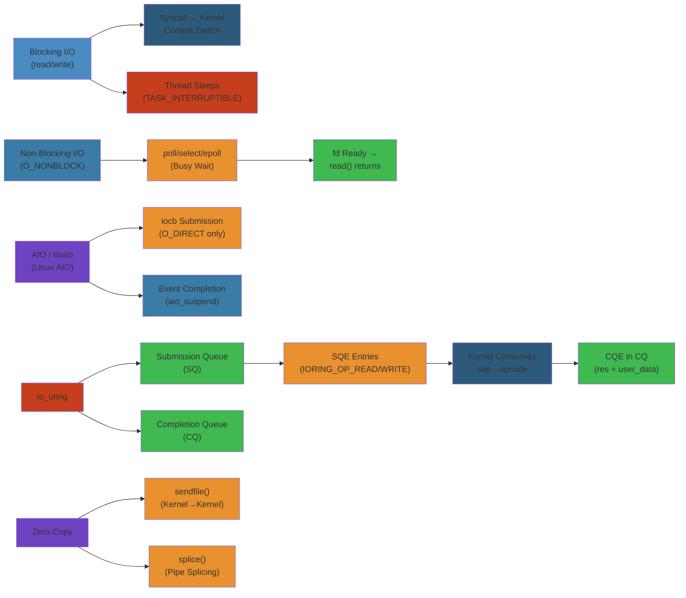

# 📂 I/O Models & Kernel I/O — Complete Deep Dive

> **Scope**: I/O models from blocking through io_uring: blocking/non-blocking I/O, select/poll/epoll multiplexing, AIO/libaio, io_uring (SQ/CQ rings, fixed buffers, registered files, polled I/O), sendfile/splice/zero-copy, kernel bypass (DPDK/XDP/AF_XDP), disk I/O schedulers (mq-deadline/BFQ/Kyber), blk-mq multi-queue block layer, VFS cache hierarchy, and async runtime patterns (reactor vs proactor, libuv, Boost.Asio).

> **Related**: [01-linux-kernel-architecture.md](/12-operating-systems/01-linux-kernel-architecture.md), [03-memory-management.md](/12-operating-systems/03-memory-management.md), [06-system-calls-ipc.md](/12-operating-systems/06-system-calls-ipc.md)

---




## Table of Contents


1. [Blocking I/O](#1-blocking-io)
2. [Non-Blocking I/O](#2-non-blocking-io)
3. [I/O Multiplexing — select/poll/epoll](#3-io-multiplexing--selectpollepoll)
4. [AIO (libaio)](#4-aio-libaio)
5. [io_uring](#5-io_uring)
6. [Memory-Mapped I/O](#6-memory-mapped-io)
7. [Direct I/O (O_DIRECT)](#7-direct-io-o_direct)
8. [Zero-Copy: sendfile, splice, pipe](#8-zero-copy-sendfile-splice-pipe)
9. [Kernel Bypass: DPDK, XDP, AF_XDP](#9-kernel-bypass-dpdk-xdp-af_xdp)
10. [Disk I/O Schedulers](#10-disk-io-schedulers)
11. [blk-mq — Multi-Queue Block Layer](#11-blk-mq--multi-queue-block-layer)
12. [VFS Cache & Writeback Lifecycle](#12-vfs-cache--writeback-lifecycle)
13. [Async I/O Patterns](#13-async-io-patterns)
14. [Internals](#14-internals)
15. [Failure Analysis](#15-failure-analysis)
16. [Edge Cases](#16-edge-cases)
17. [Performance](#17-performance)
18. [Simplest Mental Model](#18-simplest-mental-model)

---

## 1. Blocking I/O


```
read(fd, buf, count)
  │
  ├── syscall → kernel
  │     │
  │     ├── Page cache hit:
  │     │     copy_to_user() → return immediately
  │     │
  │     └── Page cache miss:
  │           inode->i_mapping->a_ops->readpage()
  │             → submit_bio() → block layer
  │             → task added to wait queue (TASK_UNINTERRUPTIBLE)
  │             → schedule()
  │             │
  │             │  [disk completes I/O → IRQ → softirq → bio completion
  │             │   → wake_up() on wait queue]
  │             │
  │             ← rescheduled
  │           copy_to_user() → return
  │
  └── return bytes read
```

- **Process state**: TASK_INTERRUPTIBLE or TASK_UNINTERRUPTIBLE during I/O wait
- **Kernel path**: VFS → filesystem → block layer → driver → device
- **Blocking**: Thread sleeps until I/O completes — simple but wastes thread if I/O takes long
- **Thread-per-connection**: Simple but doesn't scale to thousands of concurrent I/Os

---

## 2. Non-Blocking I/O


```c
// Set non-blocking
int flags = fcntl(fd, F_GETFL, 0);
fcntl(fd, F_SETFL, flags | O_NONBLOCK);

// Non-blocking read
ssize_t n = read(fd, buf, sizeof(buf));
if (n == -1 && (errno == EAGAIN || errno == EWOULDBLOCK)) {
    // No data available — try again later
    // Must use poll/epoll to wait for readiness
}

// Non-blocking connect (common pattern)
int rc = connect(fd, addr, addrlen);
if (rc == -1 && errno == EINPROGRESS) {
    // Connection in progress — wait for writability via poll/epoll
}
```

- **O_NONBLOCK**: Returns immediately with EAGAIN/EWOULDBLOCK if operation would block
- **Polling loop**: User must repeatedly check — wastes CPU
- **Never used alone**: Always combined with I/O multiplexing (epoll)

---

## 3. I/O Multiplexing — select/poll/epoll


```
                    ┌─────────────────────┐
                    │    Application      │
                    └──────────┬──────────┘
                               │
                    ┌──────────▼──────────┐
                    │   I/O Multiplexer   │
                    │  select/poll/epoll  │
                    └────┬─────┬─────┬───┘
                         │     │     │
                    ┌────▼─┐ ┌─▼──┐ ┌▼────┐
                    │ fd 0 │ │fd 1│ │fd 2 │ ...
                    │ sock │ │sock│ │file │
                    └──────┘ └────┘ └─────┘
```

### select


```c
// select — portable, O(n), FD_SETSIZE limit
fd_set readfds, writefds, exceptfds;
FD_ZERO(&readfds);
FD_SET(fd, &readfds);

struct timeval timeout = { .tv_sec = 5, .tv_usec = 0 };
int n = select(fd + 1, &readfds, NULL, NULL, &timeout);

if (FD_ISSET(fd, &readfds)) {
    // fd is ready to read
}
```

**Limitations**:
- **FD_SETSIZE**: Max 1024 file descriptors (hardcoded in glibc)
- **O(n)**: Kernel checks every fd every call — linear scan
- **Modifies sets**: Must re-initialize fd_set before each call
- **Copy overhead**: Copies entire fd_set between user and kernel
- **Not scalable**: Performance degrades badly above ~100 fds

### poll


```c
// poll — no FD_SETSIZE limit, still O(n)
struct pollfd fds[2];
fds[0].fd = sock1;
fds[0].events = POLLIN;
fds[1].fd = sock2;
fds[1].events = POLLOUT;

int n = poll(fds, 2, 5000);  // 5s timeout

if (fds[0].revents & POLLIN) {
    // sock1 readable
}
```

**Limitations**:
- **O(n)**: Still linear scan of all fds
- **Copy overhead**: Array copied between user and kernel each call
- **Re-registration**: Must re-register all fds every call (no stateful registration)
- **Better for medium scale**: Works up to ~1000 fds

### epoll


```c
// epoll — O(1), stateful, scalable

// Create epoll instance
int epfd = epoll_create1(0);

// Add fd to interest list
struct epoll_event ev;
ev.events = EPOLLIN | EPOLLET;  // Edge-triggered
ev.data.fd = sock;
epoll_ctl(epfd, EPOLL_CTL_ADD, sock, &ev);

// Wait for events (can be O(1) per returned event)
struct epoll_event events[128];
int nfds = epoll_wait(epfd, events, 128, -1);
for (int i = 0; i < nfds; i++) {
    handle_event(events[i]);
}
```

**Key features**:
- **Stateful**: epoll_ctl adds fd to kernel-internal interest list — no re-registration
- **O(1) ready list**: Kernel maintains a ready list of fds with pending events — returns only those
- **Edge-triggered (EPOLLET)**: Notified only on state change (data arrives → readable, must read until EAGAIN)
- **Level-triggered (default)**: Notified while condition exists (analogous to poll)
- **EPOLLONESHOT**: After notification, fd is disabled — must re-arm via epoll_ctl EPOLL_CTL_MOD
- **EPOLLEXCLUSIVE**: Only wake one epoll waiter when event arrives (reduces thundering herd, Linux 4.5+)
- **No fd limit**: Can monitor millions of fds (limited by max_user_watches)

### Internals Structure


```
epoll_create1()
  → struct eventpoll {
      struct rb_root_cached rbr;    // Red-black tree of monitored fds
      struct list_head rdllist;     // Ready list (ready fds)
      wait_queue_head_t wq;         // Wait queue for epoll_wait sleepers
    }

epoll_ctl(ADD)
  → struct epitem inserted into rbr (keyed by fd + file pointer)
  → ep_ptable_queue_proc() → attaches callback to fd's wait queue
  → callback called when fd becomes ready → adds to rdllist + wakes wq

epoll_wait()
  → If rdllist not empty: copy events, return
  → If empty: add to wq, sleep → wake from callback → copy events → return
```

**Edge-triggered requirements**:
```
1. Read/write in non-blocking mode
2. Read until EAGAIN on readable event
3. Write until EAGAIN on writable event
4. Missed edge if not fully consumed → next event may not arrive
5. Must use EPOLLONESHOT or re-register for new events
```

---

## 4. AIO (libaio)


```c
// Linux AIO — direct I/O required, complex interface
#include <libaio.h>

io_context_t ctx = 0;
io_setup(128, &ctx);  // Max 128 concurrent requests

struct iocb cb;
struct io_event events[128];
struct iovec iov = { .iov_base = buf, .iov_len = 4096 };

// Prepare read request
io_prep_pread(&cb, fd, buf, 4096, 0);
cb.data = (void *)mycontext;  // user data

// Submit
struct iocb *cbs[] = { &cb };
io_submit(ctx, 1, cbs);

// Reap completions
int n = io_getevents(ctx, 1, 128, events, NULL);
// events[i].data — user context
// events[i].res  — return value (bytes or error code)
```

### AIO Limitations


- **O_DIRECT required**: Page cache bypass mandatory — no buffered AIO (fixed in 5.1+ with RWF_NOWAIT but still limited)
- **Kernel thread completion**: Each I/O completion handler runs in a kernel thread
- **System call per request**: Not zero-copy on submission path
- **No vectored AIO well**: Multiple iovecs supported, but limited
- **File type restrictions**: Works on regular files, block devices — not sockets (use epoll for sockets)
- **Unfinished API**: io_destroy, io_cancel rarely work correctly
- **eventfd**: Used as completion notification channel for integration with epoll

**Mostly superseded by io_uring** for new development.

---

## 5. io_uring


```
┌─────────────────────────────────────────────────────────┐
│                      Application                         │
│                                                          │
│  io_uring_sqe *sqe = io_uring_get_sqe(ring)              │
│  sqe->opcode = IORING_OP_READV                           │
│  sqe->fd = fd; sqe->addr = buf; sqe->len = count         │
│  io_uring_submit(ring)                                    │
│                                                          │
│  // Later:                                                │
│  io_uring_cqe *cqe;                                        │
│  io_uring_wait_cqe(ring, &cqe)                             │
│  // cqe->res = bytes read                                 │
│  io_uring_cqe_seen(ring, cqe)                              │
└──────────────────────┬──────────────────────────────────┘
                       │
                       │ Memory mapped (shared kernel/user)
                       ▼
┌─────────────────────────────────────────────────────────┐
│   SQ Ring (Submission Queue)    │  CQ Ring (Completion Queue)
│                                 │                        │
│  ┌───┬───┬───┬───┬───┬───┐     │  ┌───┬───┬───┬───┐    │
│  │SQE│SQE│SQE│...│   │   │     │  │CQE│CQE│CQE│...│    │
│  └───┴───┴───┴───┴───┴───┘     │  └───┴───┴───┴───┘    │
│   tail → head                    │   head → tail         │
│   (app advances tail)            │   (kernel advances CQ head)
└─────────────────────────────────────────────────────────┘
```

### Key Structures


```
SQE (Submission Queue Entry):
  opcode: IORING_OP_READV, IORING_OP_WRITEV, IORING_OP_ACCEPT, etc.
  fd, addr, len, offset
  flags: IOSQE_FIXED_FILE, IOSQE_IO_LINK, IOSQE_ASYNC, etc.
  user_data: user-defined tag (returned in CQE)

CQE (Completion Queue Entry):
  user_data: matches SQE's user_data
  res: result (bytes transferred or -errno)
  flags: IORING_CQE_F_MORE (more CQEs coming for linked requests)

Ring buffer (shared memory):
  mmap'd between kernel and userspace
  No syscall for submission in most cases
  No syscall for reaping completions in most cases
```

### Submission Paths


```
io_uring_submit(ring):
  ── syscall ──> io_uring_enter(ring, to_submit, ..., flags)
                 │
                 ├─ Normal: Kernel processes SQEs from SQ ring
                 │  └─ Can consume multiple SQEs per syscall
                 │
                 ├─ SQPOLL (IORING_SETUP_SQPOLL):
                 │     Kernel thread polls SQ ring for new SQEs
                 │     → No syscall needed at all for submission!
                 │     → SQ thread wakes every few μs
                 │     → /sys/kernel/io_uring/sq_thread_idle
                 │
                 └─ IORING_ENTER_GETEVENTS: Also reap completions
```

### Key Features


**Fixed buffers** (`IORING_REGISTER_BUFFERS`):
- Pre-register buffer pages with kernel
- Saves page-by-page pinning on every I/O
- Reduces per-I/O overhead by ~200ns
- Use: High-frequency read/write to same buffers

**Registered files** (`IORING_REGISTER_FILES`):
- Pre-register fd table in kernel
- Saves fget/fput per operation
- Reduces per-I/O overhead by ~100ns
- Use: Server sockets, database file handles

**Polled I/O** (`IORING_SETUP_IOPOLL`):
- Kernel polls storage device for completions instead of interrupt-driven
- Use: NVMe with polling support, lowest latency
- Trade: CPU core pinned at 100% polling

**Linked operations** (`IOSQE_IO_LINK`):
- Chain SQEs: second starts after first completes
- Splice chain, read-write-write, etc.
- Cancelling head cancels entire chain

**Async cancellation** (`IORING_OP_ASYNC_CANCEL`):
- Cancel in-flight requests by user_data or fd
- Used for timeout/disconnect handling

### Supported Operations


```
Read/Write:       IORING_OP_READV, READ_FIXED, WRITEV, WRITE_FIXED
Network:          ACCEPT, CONNECT, RECV, SEND, RECVMSG, SENDMSG
Filesystem:       OPENAT, STATX, RENAMEAT, UNLINKAT, MKDIRAT
Sync:             FSYNC, FALLOCATE
Splice:           SPLICE (pipe/file splicing)
Fixed:            FILES_UPDATE, BUFFERS_UPDATE
Async wait:       WAITID, FUTEX_WAIT, FUTEX_WAKE
Other:            NOP (latency test), TIMEOUT, CANCEL, CLOSE
```

### io_uring + epoll Pattern


```c
// io_uring + epoll: completion notification via eventfd
struct io_uring ring;
io_uring_queue_init(256, &ring, 0);

int evfd = eventfd(0, EFD_NONBLOCK);
io_uring_register_eventfd(&ring, evfd);
// Now completions will write to evfd

// Add evfd to epoll
int epfd = epoll_create1(0);
struct epoll_event ev = {
    .events = EPOLLIN,
    .data.fd = evfd
};
epoll_ctl(epfd, EPOLL_CTL_ADD, evfd, &ev);

// Event loop
while (1) {
    epoll_wait(epfd, &events, 1, -1);
    // evfd readable → completions available
    io_uring_for_each_cqe(&ring, head, cqe) {
        handle_completion(cqe);
    }
    io_uring_cq_advance(&ring, completed);
    prepare_and_submit_new_requests(&ring);
}
```

---

## 6. Memory-Mapped I/O


```
mmap (file-backed, MAP_SHARED)

Application memory
  │
  │ VA directly maps to page cache
  │ No read()/write() syscalls needed
  ▼
┌──────────────────────┐
│   Page Cache         │ ← Same page cache as read/write
│   (address_space)    │
└──────┬───────────────┘
       │
       ▼
┌──────────────────────┐
│   Block Device       │
└──────────────────────┘
```

- **Transparency**: Memory access triggers page faults → page cache filled
- **MAP_SHARED**: Writes go to page cache, eventually flushed to disk
- **MAP_PRIVATE**: COW — no changes propagated to file
- **Pros**: No syscall overhead after mapping, kernel manages page cache
- **Cons**: Page fault cost on first access, no control over writeback timing, SIGBUS on file truncation

---

## 7. Direct I/O (O_DIRECT)


```c
// Open file with O_DIRECT
int fd = open("/data/file", O_RDWR | O_DIRECT);

// Requires aligned buffers:
//   - Buffer: aligned to logical_block_size (typically 512)
//   - Offset: aligned to logical_block_size
//   - Length: multiple of logical_block_size
char *buf;
posix_memalign((void **)&buf, 512, 4096);
read(fd, buf, 4096);
```

- **Page cache bypass**: DMA directly from disk to user buffer
- **Alignment**: buffer, offset, and length must be block-aligned
- **Synchronous**: Doesn't return until data is on disk (for writes)
- **Use cases**: Databases (PostgreSQL WAL, MySQL InnoDB), custom caching
- **Trade-off**: No readahead, no page cache sharing between processes

---

## 8. Zero-Copy: sendfile, splice, pipe


```
Traditional file → socket (4 copies):
  Disk ──DMA──► Page Cache ──CPU──► App Buffer ──CPU──► Socket Buffer ──DMA──► NIC

sendfile (2 copies):
  Disk ──DMA──► Page Cache ──────────────────────────► Socket Buffer ──DMA──► NIC
                  │──────── DMA (scatter/gather) ────────────►

splice (zero-copy between two fds):
  Pipe as intermediary:
  FD1 ───► pipe_in (buffer) ───► pipe_out ───► FD2
           No copy between pipe in/out!
```

### sendfile


```c
// Zero-copy file → socket
off_t offset = 0;
ssize_t n = sendfile(socket_fd, file_fd, &offset, count);
// Copy file directly to socket via DMA (if NIC supports scatter-gather)
// Otherwise: one copy through page cache to socket buffer
```

### splice


```c
// Splice between two file descriptors (zero-copy)
int pipefd[2];
pipe(pipefd);

// Move data from input to pipe (no copy)
ssize_t n = splice(input_fd, NULL, pipefd[1], NULL, 4096, SPLICE_F_MOVE);

// Move data from pipe to output (no copy)
n = splice(pipefd[0], NULL, output_fd, NULL, 4096, SPLICE_F_MORE);
```

### vm_splice (internals)


```
splice(file_fd, pipe_fd):
  → vfs_splice_write → do_splice_write
    → pipe_write → page cache page added to pipe buffer (page pointer, no copy)

splice(pipe_fd, socket_fd):
  → vfs_splice_read → do_splice_read
    → pipe_read → send page via tcp_sendpage (DMA directly from page)
```

---

## 9. Kernel Bypass: DPDK, XDP, AF_XDP


```
┌─────────────────────────────────────────────────────────────────┐
│                           Application                            │
│                                                                  │
│  DPDK: direct NIC access via UIO/ VFIO (completely bypass kernel)│
│  XDP:  BPF program runs on NIC driver (early packet processing) │
│  AF_XDP: socket that reads from XDP program's ring buffer       │
└─────────────────────────────────────────────────────────────────┘
```

### DPDK (Data Plane Development Kit)


```
Application ──► DPDK PMD (Poll Mode Driver)
                     │
                     │ UIO / VFIO (userspace I/O)
                     │
                  ┌──▼──┐
                  │ NIC │
                  └─────┘

- Userspace NIC driver — no kernel networking
- Poll mode: 100% CPU for packet processing
- Huge pages for DMA buffers
- ~10-40 Mpps (million packets/sec) per core
- Complex: API-heavy, must manage NIC details
- Use cases: NFV, high-frequency trading, 5G UPF
```

### XDP (eXpress Data Path)


```
NIC ──► XDP BPF program (driver hook, before SKB allocation)
          │
          ├── XDP_PASS → normal networking stack
          ├── XDP_DROP  → drop packet
          ├── XDP_TX    → transmit back out same NIC
          ├── XDP_REDIRECT → redirect to another NIC or AF_XDP socket
          └── XDP_ABORTED → error

- Zero-copy: packet memory stays in NIC ring buffer
- ~10-25 Mpps per core
- Requires: NIC with XDP driver support (mlx5, i40e, ixgbe, bnxt, virtio_net)
- Programmable via BPF (minimal kernel modifications)
- Use cases: DDoS mitigation, load balancing, packet filtering
```

### AF_XDP


```
Application  ──► AF_XDP socket (XSK)
                    │
                    │ Ring buffers (mmap'd, shared with XDP)
                    │
XDP program ──► XDP_REDIRECT → copy to AF_XDP ring

- Zero-copy mode: packet data never copied
- Copy mode: fallback when zero-copy unsupported
- UMEM (UMem): pre-allocated memory region shared between kernel and app
- Fill ring: app fills FR with empty buffers for NIC to fill
- Completion ring: kernel returns used buffers to app
- ~2-10 Mpps per core (zero-copy mode)
- Use cases: High-speed packet processing in userspace

Features:
  - XDP_SHARED_UMEM: Multiple sockets share same buffer pool
  - Busy-poll: No IRQ overhead, lower latency
  - SO_BUSY_POLL: spin on NIC ring instead of sleeping
```

---

## 10. Disk I/O Schedulers


```
┌──────────────┐    ┌──────────────┐    ┌──────────────┐
│  Application  │    │  Application  │    │  Application  │
└──────┬───────┘    └──────┬───────┘    └──────┬───────┘
       │                  │                  │
       ▼                  ▼                  ▼
┌──────────────────────────────────────────────────────┐
│               Block Layer (blk-mq)                    │
│                                                       │
│  I/O Scheduler (mq-deadline / BFQ / Kyber / none)    │
│    │ merge (plug/unplug)                              │
│    │ sorting (by sector, by deadline)                 │
│    │ dispatch to driver                               │
└──────────────────────┬───────────────────────────────┘
                       │
                       ▼
┌──────────────────────────────────────────────────────┐
│               Device Driver (NVMe, SCSI, virtio)      │
└──────────────────────────────────────────────────────┘
```

### mq-deadline


```
Multi-queue Deadline (default for NVMe, SCSI, SATA)

Two queues per priority:
  ┌─────────────┐  ┌─────────────┐
  │ Read FIFO   │  │ Write FIFO  │
  │ sorted by   │  │ sorted by   │
  │ deadline    │  │ deadline    │
  └─────────────┘  └─────────────┘

  ┌─────────────┐  ┌─────────────┐
  │ Read sorted │  │ Write sorted│
  │ by sector   │  │ by sector   │
  └─────────────┘  └─────────────┘

Properties:
  - Deadline: 500ms reads, 5s writes (configurable)
  - Starvation-free: reads prioritized over writes (fifo_batch)
  - Sector merging: merges adjacent requests
  - Writes_starved: 2 (dispatch 2 reads per 1 write)
```

### BFQ (Budget Fair Queuing)


```
Fair queuing I/O scheduler — per-process bandwidth allocation

Properties:
  - Each process gets a weight (ionice class + priority)
  - Slices: time-based budgets for each process's queue
  - Low-latency mode: interactive/task with small I/Os get priority
  - ~10-15% CPU overhead (higher than mq-deadline)
  - Excellent for desktop/multimedia (prevents I/O starvation)
  - Not recommended for high-throughput NVMe (throttles bandwidth)
```

### Kyber


```
Latency-optimized I/O scheduler

Properties:
  - Tracks read/write latency per dispatch domain
  - Adjusts dispatch depth to meet latency targets
  - Read target: ~2ms, Write target: ~10ms
  - Low overhead (~2-3%)
  - Good for: NVMe, high-performance storage
  - No fairness guarantees for processes
```

### none (NOOP)


```
Pass-through scheduler — no reordering, no merging

Properties:
  - Minimal overhead (just blk-mq dispatch)
  - No fairness, no latency targets
  - Best for: NVMe with high IOPS (driver handles scheduling)
  - Or: when using io_uring with IORING_SETUP_IOPOLL (polled I/O bypasses scheduler)
```

---

## 11. blk-mq — Multi-Queue Block Layer


```
┌────────────────────────────────────────────────────────────┐
│                         blk-mq                              │
│                                                             │
│  Per-CPU software staging queues:                           │
│  ┌────────┐ ┌────────┐ ┌────────┐     ┌────────┐          │
│  │CPU 0   │ │CPU 1   │ │CPU 2   │ ... │CPU N   │          │
│  │ SW Q 0 │ │ SW Q 1 │ │ SW Q 2 │     │ SW Q N │          │
│  │(plug   )│ (plug   )│ (plug   )│     │(plug   )│          │
│  └───┬────┘ └───┬────┘ └───┬────┘     └───┬────┘          │
│      │          │          │               │                │
│      └──────────┴──────────┴───────────────┘                │
│                         │ I/O scheduler (optional)          │
│                         │ merge + dispatch                 │
│                         ▼                                   │
│  Hardware dispatch queues:                                  │
│  ┌────────┐ ┌────────┐                                      │
│  │ HW Q 0 │ │ HW Q 1 │ ... (maps to device HW queues)      │
│  └───┬────┘ └───┬────┘                                      │
│      │          │                                            │
└──────┼──────────┼────────────────────────────────────────────┘
       │          │
       ▼          ▼
┌────────────────────────────────────────────────────────────┐
│                    Device (NVMe controller)                  │
│  ┌────────┐ ┌────────┐                                      │
│  │ HW SQ 0│ │ HW SQ 1│ ... Submission queues                │
│  │ HW CQ 0│ │ HW CQ 1│ ... Completion queues                │
│  └────────┘ └────────┘                                      │
└────────────────────────────────────────────────────────────┘
```

### Key Design Points


- **Per-CPU submission**: No locking for software queue — each CPU writes to its own queue
- **Hardware queue mapping**: Maps to device's hardware submission/completion queues
- **Plugging**: Merge requests in per-CPU plug list before batch-dispatching to HW queue
- **Unplugging**: Timer-based (plug timeout) or on context switch, or on blk_finish_plug
- **Scales with CPU count**: Avoids single-queue lock bottleneck at high IOPS

---

## 12. VFS Cache & Writeback Lifecycle


```
Dentry Cache (dcache):
  ┌────────────┐    ┌────────────┐    ┌────────────┐
  │ d_entry    │───►│ d_entry    │───►│ d_entry    │
  │ name: foo  │    │ name: bar  │    │ name: baz  │
  │ inode: 123 │    │ inode: 456 │    │ inode: 789 │
  └─────┬──────┘    └────────────┘    └────────────┘
        │
Inode Cache:
  ┌─────▼──────┐
  │ inode 123  │
  │ i_count=2  │
  │ i_nlink=1  │
  │ i_size=4096│
  │ i_mapping  │──► page cache (XArray)
  └────────────┘
```

### Writeback Lifecycle


```
1. write(fd, data, len)
   → filemap_write_and_wait_range() (if sync)
   → mark_page_dirty(page) → PG_dirty set
   → add to inode's dirty list
   → balance_dirty_pages() → if dirty_ratio exceeded, throttle

2. Background flusher (flush-<major>:<minor>):
   Wakes every dirty_writeback_centisecs (default 500cs = 5s)
   Iterates dirty inodes (bdi->bdi_list)
   → writeback_single_inode()
     → address_space_operations->writepages()
       → ext4_writepages() → submit_bio()

3. Page eviction (kswapd / direct reclaim):
   → shrink_page_list()
     → if PG_dirty → flush first (may block)
     → if PG_clean → free page, remove from page cache
```

---

## 13. Async I/O Patterns


### Reactor vs Proactor


```
Reactor (epoll-based):
  ┌──────────┐                                    ┌──────────┐
  │ Event    │──► readable ──► read()             │ Thread   │
  │ Demux    │──► writable ──► write()            │ Pool     │
  │ (epoll)  │──► accept ──► accept4()            │          │
  └──────────┘                                    └──────────┘
  → I/O is synchronous (read/write still block)
  → Non-blocking I/O + multiplexing

Proactor (io_uring-based):
  ┌──────────┐                                    ┌──────────┐
  │ Submit   │──► IORING_OP_READV                 │ Wait CQE │
  │ Requests │──► IORING_OP_ACCEPT                │          │
  │ (SQE)    │──► IORING_OP_RECVMSG               │          │
  └──────────┘                                    └──────────┘
  → I/O is asynchronous (kernel handles entire operation)
  → Completion-based notification
```

### libuv


```c
// libuv — event loop with epoll on Linux
uv_loop_t *loop = uv_loop_new();

uv_tcp_t server;
uv_tcp_init(loop, &server);

struct sockaddr_in addr;
uv_ip4_addr("0.0.0.0", 8080, &addr);
uv_tcp_bind(&server, (const struct sockaddr *)&addr, 0);

uv_listen((uv_stream_t *)&server, 128, on_new_connection);
uv_run(loop, UV_RUN_DEFAULT);
```

### Boost.Asio


```cpp
// Boost.Asio — proactor pattern via io_uring (or epoll)
boost::asio::io_context io;

// Asynchronous read
async_read(socket, buffer, [](error_code ec, size_t n) {
    if (!ec) {
        // Handle data
    }
});

io.run();  // Event loop
```

### Thread Pool I/O


```c
// Blocking I/O + thread pool (simpler than async)
void *worker(void *arg) {
    while (1) {
        int fd = dequeue_fd();
        read(fd, buf, sizeof(buf));  // Blocking
        process(buf);
    }
}

// Optimal thread count:
// N_threads = N_CPU * (1 + wait_time / service_time)
// If wait_time >> service_time (I/O bound) → many threads
// If service_time >> wait_time (CPU bound) → N_CPU threads
```

---

## 14. Internals


### epoll Implementation


```c
// fs/eventpoll.c

struct eventpoll {
    struct mutex mtx;                    // Lock for epoll_ctl
    wait_queue_head_t wq;               // epoll_wait waiters
    struct rb_root_cached rbr;           // RB-tree of epitems
    struct list_head rdllist;            // Ready list
    struct epitem *ovflist;              // Overflow list (during event delivery)
    int visited;                         // Loop detection
    struct file *file;                   // epoll file descriptor
};

struct epitem {
    struct rb_node rbn;                  // RB-tree node
    struct list_head rdllink;             // Ready list link
    struct epoll_filefd ffd;             // Target fd + file pointer
    struct eventpoll *ep;                // Back-pointer to eventpoll
    struct list_head pwqlist;            // Poll wait queue entries
    struct epoll_event event;            // User's event mask
    wait_queue_entry_t wait;             // Callback entry
};

// Callback (f_ops->poll triggers this):
// ep_poll_callback() → add to rdllist → if epoll_wait sleeping, wake
```

### io_uring Implementation


```c
// io_uring/io_uring.c

struct io_ring_ctx {
    struct mm_struct *sqo_mm;            // SQPOLL mm
    struct io_sq_ring *sq_ring;          // SQ ring (mmap'd)
    struct io_cq_ring *cq_ring;          // CQ ring (mmap'd)
    struct io_rings *rings;              // Shared ring state
    unsigned int flags;                  // IORING_SETUP_*

    struct io_submit_state submit_state; // Cached submit state

    struct list_head tctx_list;          // Task contexts

    struct mutex uring_lock;              // Serialize submissions
    struct list_head defer_list;          // Deferred work

    spinlock_t completion_lock;
    struct list_head cq_overflow_list;    // Overflow completions
};

struct io_kiocb {
    u64 user_data;                       // User data (returned in CQE)
    struct file *file;                   // Target file (or NULL)
    struct io_ring_ctx *ctx;

    struct list_head link_list;          // Linked SQEs
    unsigned short opcode;               // IORING_OP_*

    union {
        struct io_rw rw;                 // Read/write state
        struct io_poll poll;             // Poll state
        struct io_accept accept;         // Accept state
    };
};
```

---

## 15. Failure Analysis


### epoll Edge-Triggered Miss


```
Scenario: ET miss → application misses event → data never read

Root cause:
  1. Not reading until EAGAIN → some data left in socket buffer
  2. No new data arrives → no new edge → epoll_wait never returns
  3. Connection hangs

Prevention:
  - Always read/write until EAGAIN
  - Use level-triggered if unsure
  - Periodic timeout to check all connections
```

### io_uring CQ Overflow


```
Scenario: Completion queue fills before application processes it

  → New completions go to overflow list (kmalloc'd list)
  → If overflow list also full → drop completion → lost events
  → Application may wait indefinitely for completion

Prevention:
  - Size sufficiently large CQ ring (io_uring_queue_init_params)
  - Frequent completion reaping
  - IORING_FEAT_NODROP (kernel 5.19+): drops CQ, never overflow list
```

### O_DIRECT Alignment Errors


```c
// Common mistakes
int fd = open("/data/file", O_RDWR | O_DIRECT);
read(fd, malloc(100), 100);
// → EINVAL: buffer not aligned (must be block-aligned)
// → EINVAL: length not multiple of block size
// → EINVAL: offset not aligned

char *buf;
posix_memalign(&buf, 512, 4096);  // 512-byte aligned, 4KB
pread(fd, buf, 4096, 0);          // OK
```

### I/O Scheduler Stalls


```
Scenario: BFQ with many processes → I/O scheduler CPU overhead → latency spikes
Scenario: mq-deadline write starvation → writes delayed over 5s deadline
Scenario: Kyber misdetects latency → throttles unnecessarily

Debug:
  /sys/block/<dev>/mq/<N>/cpu<N>/rq_list — active requests
  /sys/kernel/debug/block/<dev>/ — scheduler debug info
  iostat -x 1: average request size, queue depth, service time
```

---

## 16. Edge Cases


- **select with >1024 fds**: Silent truncation — kernel reads only first 1024 bits → connections silently ignored
- **epoll ET + EPOLLONESHOT**: Must re-arm after each event — easy to forget → fd stuck
- **io_uring + linked operations + error**: If head fails → remaining links cancelled → check CQE flags for IORING_CQE_F_MORE
- **AIO + eventfd**: Must drain eventfd counter or it becomes level-triggered indefinitely
- **sendfile with small files**: Overhead of sendfile > copy_to_user for tiny (< 1KB) files
- **splice with pipes**: Pipe capacity limit (default 16 × 4KB = 64KB) — may need to loop
- **O_DIRECT + O_SYNC**: Every write must reach device before return — extremely slow
- **DPDK + kernel conflict**: DPDK takes over NIC → kernel sees link down → routing issues
- **XDP + hardware offload**: NIC must support XDP offload (rare) — fallback to generic XDP (slower)
- **io_uring SQPOLL + cgroup**: SQPOLL thread not in same cgroup → memory accounting wrong
- **mmap + SIGBUS**: Another process truncates the file → subsequent access to mmap'd region causes SIGBUS
- **O_NONBLOCK + regular files**: Non-blocking flag ignored for regular files (always blocking)
- **poll + NFS**: NFS may mark fd POLLIN even when not ready (bug/legacy)
- **io_uring + multi-shot poll (5.13+)**: Single SQE polls repeatedly until cancelled — can cause event storms

---

## 17. Performance


### I/O Model Throughput Comparison


```
Model                    Syscalls/I/O    Threads     Max conns (single box)
─────────────────────────────────────────────────────────────────────────
Blocking (1:1 thread)    2 (read+ret)    1 per conn  ~1,000-4,000
select                   2 (sel+read)    1 thread    ~1,000
poll                     2 (poll+read)   1 thread    ~2,000-5,000
epoll (LT/ET)            1 (epoll_wait)  1 thread    ~100,000-1,000,000
AIO + eventfd            2 (sub+get)     1 thread    ~10,000-50,000
io_uring                 0 (SQPOLL)      1 thread    ~1,000,000+
io_uring + fixed         0 (SQPOLL)      1 thread    ~5,000,000+ ops/sec
```

### Latency Comparison


```
Operation (SSD, 4KB read)                  Latency
─────────────────────────────────────────────────────
read (page cache hit)                      ~500ns
pread (O_DIRECT, no cache)                 ~50μs
pread (O_DIRECT, io_uring)                 ~30μs
io_uring + fixed buffers (NVMe)            ~10μs
io_uring + polling (NVMe IOPOLL)           ~5μs
DPDK packet receive                        ~1μs
XDP packet drop                            ~50ns
```

### io_uring Overhead Savings vs Traditional epoll


```
Operation              Traditional         io_uring
─────────────────────────────────────────────────────
Submit 1 read          syscall x1          syscall x1 (or 0 with SQPOLL)
Submit 1000 reads      syscall x1000       syscall x1 (batch submit)
Complete 1000 reads    syscall x1000       syscall x1 (batch reap)
Memory pinning         per-read page pin    one-time registration
fd refcount            per-read fget/fput   one-time registration
```

### Maximizing I/O Throughput


```
1. Use io_uring for new development (not epoll + read/write)
2. Register buffers + files for hot paths
3. Use SQPOLL for latency-sensitive workloads
4. Batch submissions (io_uring_submit(&ring, batch_size))
5. Use appropriate I/O scheduler:
   - NVMe → none (or kyber)
   - SATA SSD → mq-deadline
   - HDD → mq-deadline or BFQ
   - Desktop → BFQ (fairness)
6. Wrong tunings:
   - vm.dirty_ratio too high → writeback storms
   - net.core.rmem_max too small → socket drops
   - netdev_budget too small → NAPI starvation
7. Consider XDP for packet processing (PPS > 1M)
8. Use huge pages + large blocks for database workloads
```

---

## Interview Questions


### Beginner Level


**Q1: What's the difference between blocking and non-blocking I/O?**

**Why interviewers ask this**: Tests fundamental understanding of the most common I/O models.

**Ideal answer structure**:
1. **Blocking**: Thread makes syscall (`read()`) and enters `TASK_INTERRUPTIBLE` sleep until data arrives. Simple but wastes threads (1 thread per connection).
2. **Non-blocking**: `O_NONBLOCK` — `read()` returns immediately with `EAGAIN` if no data. Requires polling (busy-wait or `select`/`epoll`).
3. **Cost**: Blocking ties up kernel stack (8KB per thread) and scheduler overhead. Non-blocking trades thread count for complexity.

**Common wrong answer**: "Non-blocking is always better" — for low-concurrency or CPU-bound work, blocking is simpler and equally fast. Non-blocking shines with many concurrent I/O-bound connections.

**Q2**: What is `epoll` and why is it better than `select`?

**Answer**: `epoll` is Linux's I/O event notification facility. It beats `select`/`poll` in three ways: 1) **O(1)** vs **O(n)** — doesn't scan all FDs on each call. 2) **No FD limit** (select maxes at 1024). 3) **Edge-triggered** mode — only notified when state changes, reducing syscalls. Use `epoll_create1` → `epoll_ctl` to register → `epoll_wait` to get events. Internally uses a callback-based wakeup mechanism via `wait_queue_entry_t`.

### Intermediate Level


**Q3: How does `io_uring` work and what makes it faster than `epoll`?**

**Answer**: `io_uring` uses shared ring buffers (Submission Queue + Completion Queue) in mmap'd memory between user and kernel — **zero syscalls per I/O** after setup. Submit `io_uring_sqe` entries to SQ, kernel processes asynchronously, results appear in CQ. Key features: SQPOLL mode (kernel thread polls SQ, no syscalls at all), fixed buffers (registered once), registered files (bypass fd_table lookup), and support for almost all syscalls (read/write/openat/accept/sendmsg). `epoll` still needs `read()`/`write()` syscalls per event. `io_uring` batches submission + completion into single `io_uring_enter` or eliminates it entirely with SQPOLL.

**Q4**: Compare the reactor pattern (epoll) vs proactor pattern (io_uring/IOCP).

**Answer**: **Reactor** (epoll): tell me when I can read/write → I do the read/write. **Proactor** (io_uring): I initiate the read/write → tell me when it's done. Reactor is simpler but requires application-level state machines for each operation. Proactor reduces context switches (kernel handles the data movement) and enables true zero-copy (registered buffers). Proactor is harder to program but gives higher throughput (especially with buffered I/O and vectored operations). Linux's `io_uring` supports both modes via `IOSQE_ASYNC`.

### Senior Level


**Q5: Your database server shows 80% `iowait` and the application is slow. The storage team says the SSDs are only 30% utilized. What's wrong?**

**Why interviewers ask this**: Tests ability to debug I/O bottlenecks beyond utilization numbers.

**Answer**: **IOPS saturation, not bandwidth**. SSDs have separate limits: bandwidth (GB/s) and IOPS (operations/s). 4KB random reads at queue depth 1 can saturate IOPS at <10% bandwidth utilization. Check `/sys/block/sdX/stat` — look at `io_ticks` (actual I/O time) vs weighted `io_ticks`. Use `iostat -xz 1` to see `%util` = time device had at least one outstanding request. Fix: increase queue depth (scsi queue_depth, NVMe `num_queues`), or the application is doing sync I/O (fsync per transaction → sequentializes all I/O).

**Q6**: Design an I/O strategy for a proxy server handling 100K connections with 1ms latency SLA.

**Answer**: 1) **Per-event loop architecture** (NGINX/HAProxy model): one epoll fd per CPU core, each with its own event loop. 2) Use **`accept()` with `EPOLLEXCLUSIVE`** to avoid thundering herd. 3) Use **`splice()`** for zero-copy between sockets (proxy forwards bytes without user-space buffer). 4) **`io_uring`** with fixed buffers and registered files for further optimization. 5) **SO_REUSEPORT** for kernel-level load balancing across processes. 6) Batching: collect 32 events before processing for cache locality.

### Staff/Principal Level


**Q7: Design a storage engine that must handle 1M 4KB random writes/sec with fsync durability on consumer NVMe. How do you avoid the fsync bottleneck?**

**Why**: Tests deep understanding of I/O stack and fsync mechanics at scale.

**Answer**: 1) **Group commit**: batch 1000 writes → one fsync. 2) Use **`io_uring`** with `IORING_SETUP_IOPOLL` to poll completions instead of interrupts. 3) **O_DIRECT** to bypass page cache (avoid double-copy + writeback pressure). 4) **Log-structured**: sequential appends to WAL, fsync the WAL (one sequential fsync), lazily merge to SSTables. 5) **Raw block device** or **SPDK** (user-space NVMe driver via DPDK) for maximum control — no kernel involvement at all. 6) **NVMe write pointers**: use `BLKZEROOUT` + `fallocate` to pre-allocate. Real-world: WAL-based engines like PostgreSQL achieve ~200K txn/s with group commit; SPDK can push beyond 5M IOPS.

**Q8**: Your company's microservices use a mix of epoll (Go), io_uring (Rust), and blocking I/O (Python). The overall fleet shows high latency variance under load. Design a unified observability strategy to diagnose cross-service I/O bottlenecks.

**Answer**: 1) **eBPF-based tracing**: use `bcc` tools — `biolatency` for I/O latency, `fileslower` for slow file ops, `tcpconnlat` for connection latency. 2) **Per-event-loop metrics**: expose epoll_wait duration, io_uring CQ drain rate, average batch size. 3) **Distributed tracing**: OpenTelemetry with `SchedCLFS` context propagation to correlate I/O waits with spans. 4) **Linux `perf` for kernel I/O stack**: `perf top -e block:*`, `perf record -e iommu:*`. 5) **Pressure Stall Information (PSI)**: `/proc/pressure/io` shows `some` (any task stalled) and `full` (all tasks stalled). PSI > 10% full indicates the I/O subsystem is bottleneck.

### Tricky Edge Cases


**Q9**: You call `read(fd, buf, 65536)` and it returns 4096. The file isn't a pipe or socket. What happened?

**Answer**: **Short read despite regular file**. Regular files can return short reads at EOF or with signal interruption. More likely: **O_NONBLOCK** on a regular file (rare but possible) or **kernel read-ahead limit** reached. Also: **fuse filesystem** returning partial data, **network filesystem** (NFS/CIFS) partial read, or **encrypted filesystem** boundary. Fix: wrap `read()` in a loop that accumulates until requested bytes or EOF.

**Q10**: Your application uses O_DIRECT for database files. Performance is terrible despite fast NVMe. Why?

**Answer**: **O_DIRECT has strict alignment requirements**: buffer must be page-aligned (4KB), offset must be sector-aligned (512B), and I/O size must be a multiple of sector size. If these aren't met, the kernel silently falls back to buffered I/O or returns `EINVAL`. Also, O_DIRECT bypasses the page cache entirely — sequential reads that hit the same data benefit from caching. Without it, every read is a disk read. Fix: 1) Use `posix_memalign(&buf, 4096, size)`. 2) Consider `RWF_UNCACHED` (io_uring) instead. 3) Use `fadvise` for sequential access patterns.


> **I/O models are like ordering food at a restaurant. Blocking I/O is waiting at the counter for your burger — simple but you can't do anything else. Non-blocking is checking every second: "Is my burger ready?" (wasteful). select/poll is watching the counter for any order to be ready but checking every board (wastes time looking at empty spaces). epoll is a buzzer that goes off only for your order — efficient. io_uring is handing the waiter a written list and picking up all dishes at once from the pickup window — zero back-and-forth. sendfile/splice is cutting out plates entirely — the kitchen hands your burger directly to you. DPDK/XDP is bringing your own stove and cooking yourself — maximum speed, maximum complexity. Every model is about the same fundamental trade: control vs. convenience, throughput vs. latency, thread count vs. complexity.**


## Practical Example


See code examples above for practical usage patterns.

## Related

- [Tcp Ip Deep Dive](/11-networking/01-tcp-ip-deep-dive.md)
- [Tcpip Protocol Stack](/11-networking/01-tcpip-protocol-stack.md)
- [Http Protocols](/11-networking/02-http-protocols.md)
- [Tls Http Grpc](/11-networking/02-tls-http-grpc.md)
- [Dns Cdn Loadbalancing](/11-networking/03-dns-cdn-loadbalancing.md)
- [Readme](/11-networking/README.md)
