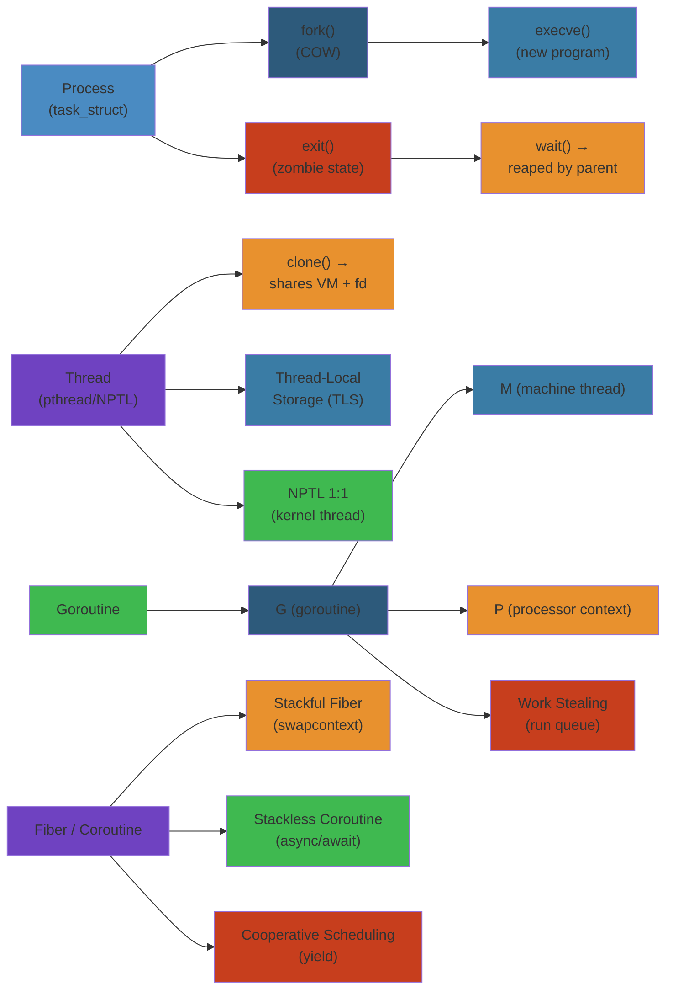

# 🧵 Processes, Threads & Fibers — Complete Deep Dive

> **Scope**: Process lifecycle (fork/exec/exit/zombie/orphan/init reaping/wait), COW fork internals, clone syscall flags, pthreads/NPTL 1:1 threading, thread-local storage (TLS), goroutine G/M/P scheduler model, fiber/coroutine comparison (stackful vs stackless), NPTL 1:1 vs M:N threading, thread pool patterns, context switch cost comparison across all concurrency primitives.

> **Related**: [01-linux-kernel-architecture.md](/12-operating-systems/01-linux-kernel-architecture.md), [02-cpu-scheduling.md](/12-operating-systems/02-cpu-scheduling.md), [06-system-calls-ipc.md](/12-operating-systems/06-system-calls-ipc.md)

---




## Table of Contents


1. [Process Lifecycle](#1-process-lifecycle)
2. [fork Internals & COW](#2-fork-internals--cow)
3. [clone Syscall](#3-clone-syscall)
4. [Thread — pthreads & NPTL](#4-thread--pthreads--nptl)
5. [Thread-Local Storage (TLS)](#5-thread-local-storage-tls)
6. [Thread vs Process Comparison](#6-thread-vs-process-comparison)
7. [Goroutines — G/M/P Model](#7-goroutines--gmp-model)
8. [Fibers & Coroutines](#8-fibers--coroutines)
9. [NPTL (1:1) vs M:N Threading](#9-nptl-11-vs-mn-threading)
10. [Thread Pool Patterns](#10-thread-pool-patterns)
11. [Process vs Thread vs Goroutine vs Fiber Comparison](#11-process-vs-thread-vs-goroutine-vs-fiber-comparison)
12. [Thread Affinity & CPU Pinning](#12-thread-affinity--cpu-pinning)
13. [LWP — Lightweight Process](#13-lwp--lightweight-process)
14. [Internals](#14-internals)
15. [Failure Analysis](#15-failure-analysis)
16. [Edge Cases](#16-edge-cases)
17. [Performance](#17-performance)
18. [Simplest Mental Model](#18-simplest-mental-model)

---

## 1. Process Lifecycle


```
         ┌─────┐
         │FORK │
         └──┬──┘
            │
     ┌──────▼──────┐
     │    READY    │────► schedule() ──► RUNNING
     └──────┬──────┘                          │
            │                            ┌────┴────┐
            │ exit / kill                 │  I/O /  │
            │                             │ sleep   │
            ▼                             │ signal  │
     ┌──────────┐                         └────┬────┘
     │  ZOMBIE  │                              │
     │ (wait()  │                              ▼
     │  needed) │                         ┌────────┐
     └────┬─────┘                         │BLOCKED │
          │                               └────────┘
     parent wait()
          │
          ▼
     ┌────────┐
     │  DEAD  │
     └────────┘
```

### fork()


```c
pid_t pid = fork();
if (pid == 0) {
    // Child process
    // Returns 0 in child
    execve("/bin/ls", args, envp);
} else if (pid > 0) {
    // Parent process, pid = child PID
    waitpid(pid, &status, 0);
} else {
    // fork failed (errno = EAGAIN, ENOMEM)
}
```

### exec()


```
execve(path, argv, envp):
  1. Flush existing brk (heap)
  2. Destroy existing mmap regions
  3. Map new executable segments (.text, .data, .bss)
  4. Load shared libraries (ld.so from PT_INTERP)
  5. Set up argv, envp on stack
  6. Reset signal handlers to SIG_DFL (except SIG_IGN)
  7. Close files with FD_CLOEXEC
  8. Jump to entry point (_start)
```

### Zombie & Orphan


```
Zombie (defunct):
  - Process exited but parent hasn't called wait()/waitpid()
  - Kernel keeps exit status, resource usage in task_struct
  - Minimal resource consumption (just task_struct + kernel stack)
  - Cannot be killed — must be waited on
  - /proc shows "Z" state

Orphan:
  - Parent exits before child
  - Child adopted by init (pid 1)
  - init calls wait() to reap → no zombies from orphans
  - In containers: subreaper process can adopt (prctl(PR_SET_CHILD_SUBREAPER))
```

---

## 2. fork Internals & COW


```
fork() → kernel entry
  │
  ├─ sys_clone (architecture entry)
  │
  └─ kernel_clone()
       │
       ├─ copy_process() → main work
       │    │
       │    ├─ dup_task_struct():
       │    │     alloc task_struct + kernel stack (2 pages)
       │    │     copy thread_union
       │    │
       │    ├─ copy_semundo(), copy_files(), copy_fs(),
       │    │   copy_sighand(), copy_signal(), copy_mm(), copy_namespaces()
       │    │
       │    ├─ copy_mm():
       │    │     struct mm_struct *mm = dup_mm(tsk, current->mm)
       │    │       │
       │    │       ├─ allocate new mm_struct, pgd
       │    │       ├─ copy page tables — BUT mark all PTEs read-only
       │    │       ├─ increment page refcounts (shared pages)
       │    │       └─ mm->mmap_sem initialized
       │    │
       │    ├─ copy_thread():
       │    │     child->sp = child_stack (or parent's stack for fork)
       │    │     child->ip = ret_from_fork
       │    │     child->thread.regs.ax = 0 (child returns 0)
       │    │
       │    └─ sched_fork():
       │          child->state = TASK_NEW
       │          child->prio = current->prio
       │
       ├─ wake_up_new_task():
       │     child state → TASK_RUNNING
       │     enqueue into runqueue
       │
       └─ return child PID to parent, 0 to child
```

### COW (Copy on Write) Details


```
Before fork:
  Parent: .text → R-X (shared read-exec), .data → RW-
  Page tables: all writable pages mapped R/W

After fork:
  Both parent and child page tables:
    .text → R-X (unchanged)
    .data → R-- (writable bit CLEARED ← key COW mechanism)
  Physical pages: still shared (refcount incremented)

On write (either parent or child, first to write):
  1. Page fault → do_wp_page()
  2. Allocate new physical page
  3. Copy content from shared page
  4. Update PTE to RW in the faulting process's table
  5. Decrement refcount on original page

vfork():
  - No page table copy at all
  - Parent blocked until child exec/exit
  - Child borrows parent's address space (dangerous!)
  - Very fast, used only for exec immediately after fork
```

---

## 3. clone Syscall


```c
// clone() — unified syscall for fork, vfork, pthread_create
// Flags determine how much is shared between parent and child

pid_t clone(int (*fn)(void *), void *child_stack,
            int flags, void *arg, ...);

Key flags:
  CLONE_VM:          Share memory (new thread)
  CLONE_FILES:       Share file descriptor table
  CLONE_SIGHAND:     Share signal handlers
  CLONE_THREAD:      Same thread group (parent in same thread group)
  CLONE_VFORK:       Parent blocked until child exec/exit
  CLONE_NEWNS:       New mount namespace
  CLONE_NEWPID:      New PID namespace
  CLONE_NEWNET:      New network namespace
  CLONE_IO:          Clone I/O context (block I/O scheduling)
  CLONE_CHILD_CLEARTID: Clear child tid on exit (used by NPTL)
  CLONE_SETTLS:      Set TLS descriptor for child
  CLONE_PARENT_SETTID: Store child's PID in parent memory
```

### fork() = clone(CLONE_CHILD_CLEARTID | CLONE_CHILD_SETTID | SIGCHLD)


### vfork() = clone(CLONE_VFORK | CLONE_VM | SIGCHLD)  // shares memory, blocks parent


### pthread_create() = clone(CLONE_VM | CLONE_FILES | CLONE_SIGHAND | CLONE_THREAD | CLONE_SETTLS | CLONE_PARENT_SETTID | CLONE_CHILD_CLEARTID)


---

## 4. Thread — pthreads & NPTL


### NPTL (Native POSIX Threads Library)


```
NPTL: 1:1 threading model
     ┌──────┐
     │ app  │
     └──┬───┘
        │ pthread_create() → clone(CLONE_VM | ...)
        ▼
  ┌─────────┐
  │ kernel  │
  │ thread  │ ← struct task_struct, kernel stack, pid
  └─────────┘
        │
        ▼
  ┌─────────┐
  │  CPU    │
  └─────────┘

- Each pthread maps to exactly one kernel thread (clone)
- Threads visible in /proc as separate entries (with TGID)
- Kernel handles scheduling, balancing
- Blocking syscall blocks only the calling thread
```

### pthread_create Flow


```
pthread_create(&tid, attr, start_routine, arg)
  │
  ├─ allocate thread stack (mmap, default 8MB, MAP_ANONYMOUS | MAP_STACK)
  │  guard page at bottom (PROT_NONE, 1 page)
  │
  ├─ allocate pthread internal struct (struct pthread in TLS area)
  │
  ├─ clone(CLONE_VM | CLONE_FILES | CLONE_SIGHAND |
  │        CLONE_THREAD | CLONE_SETTLS | CLONE_PARENT_SETTID |
  │        CLONE_CHILD_CLEARTID,
  │        child_stack=stack_top, ...)
  │
  ├─ child starts at entry point
  │     → set TLS via CLONE_SETTLS
  │     → call start_routine(arg)
  │     → return value stored, thread exits via __exit_thread
  │
  └─ parent returns tid
```

### Stack Size & Guard Pages


```bash
ulimit -s          # Default thread stack size (typically 8MB)
ulimit -s 1024     # Set to 1MB (reduces per-thread memory overhead)

/proc/<pid>/smaps shows stack VMA with guard:
  7fffc0000000-7fffc0001000 ---p 00000000 00:00 0   ← guard page (PROT_NONE)
  7fffc0001000-7fffc0200000 rw-p 00000000 00:00 0   ← actual stack

# Thread stack max 2MB on many libcs:
# sysconf(_SC_THREAD_STACK_MIN) = 16384 (16KB)
# sysconf(_SC_THREAD_STACK_DEFAULT) — varies
```

---

## 5. Thread-Local Storage (TLS)


```
x86-64: TLS via FS segment register

FS base = address of thread's TLS area
  ┌─────────────────────────┐
  │ FS:0  thread_self       │ ← struct pthread (tcbhead_t)
  │ FS:... stack_guard       │
  │ FS:... errno              │
  │ FS:... __thread vars     │
  └─────────────────────────┘

TLS Layout:
  ┌──────┐
  │ DTV  │ ← Dynamic Thread Vector (for shared library TLS)
  ├──────┤
  │ tcb  │ ← Thread Control Block (glibc internal)
  ├──────┤
  │      │
  │ ___  │ ← static TLS blocks (__thread globals)
  │thread│
  │ vars │
  │      │
  └──────┘
```

### __thread (GCC)


```c
// Thread-local storage — each thread gets its own copy
static __thread int counter = 0;
__thread char buffer[1024];

void *worker(void *arg) {
    counter++;  // Only increments THIS thread's counter
    // → compiled to: mov %fs:offset, %rax; inc %rax; mov %rax, %fs:offset
    return NULL;
}
```

### pthread_key_create


```c
// Dynamic TLS — keys allocate destructors
pthread_key_t key;
pthread_key_create(&key, destructor_fn);  // destructor called on thread exit

void set_value(void *val) {
    pthread_setspecific(key, val);
}

void *get_value(void) {
    return pthread_getspecific(key);
}

// Implementation: DTV array indexed by key
// NPTL allows PTHREAD_KEYS_MAX = 1024 keys per process
```

### errno — TLS Magic


```c
// errno is NOT a global variable — it's a macro
#define errno (*__errno_location())

// __errno_location() returns address of per-thread errno:
// → mov %fs:ERRNO_OFFSET, %rax
// → return pointer to thread's errno int

// Each thread has its own errno storage
// Thread-safe without any locking!
```

---

## 6. Thread vs Process Comparison


| Aspect | Process | Thread |
|--------|---------|--------|
| Creation | `fork()` — copy page tables (~1-10μs) | `clone(CLONE_VM)` — share page table (~0.3-1μs) |
| Context switch | CR3 change (page table base) | No CR3 change (same mm) |
| | TLB flush (ASID mitigates) | No TLB flush |
| Memory | Isolated — one crash doesn't affect others | Shared — one buffer overflow corrupts all |
| IPC | Must use explicit IPC (pipe, socket, shm) | Shared memory (just volatile variables + mutex) |
| Synchronization | Shared files, signals, eventfd | Mutex, spinlock, rwlock, atomic |
| Overhead per unit | task_struct + kernel stack + page tables + mm_struct | task_struct + kernel stack (~8KB) |
| | ~VMA overhead for pagetables (~4KB per process) | Always ~8KB extra per thread |
| File descriptor | Separate fd table | Shared fd table (CLONE_FILES) |
| Signal handling | Separate | Shared (any thread can handle) |

---

## 7. Goroutines — G/M/P Model


```
Go Runtime Scheduler (G/M/P model)

┌─────────────────────────────────────────────────────┐
│                      Go Process                       │
│                                                       │
│  ┌─────────────────────────────────────────────────┐ │
│  │                   G (Goroutine)                   │ │
│  │  ~2KB stack (grows/shrinks dynamically)          │ │
│  │  state: idle, runnable, running, syscall, waiting│ │
│  └─────────────────────────────────────────────────┘ │
│                           │                           │
│  ┌───────────────────────┴────────────────────────┐  │
│  │                   P (Processor)                  │  │
│  │  Local run queue (LRQ) — per-P, lockless       │  │
│  │  Number of P = GOMAXPROCS (default = NCPU)     │  │
│  │  Each P runs one M at a time                    │  │
│  └───────────────────────┬────────────────────────┘  │
│                           │                           │
│  ┌───────────────────────┴────────────────────────┐  │
│  │                   M (Machine)                    │  │
│  │  OS thread (kernel thread, managed by runtime)   │  │
│  │  Runs goroutines via P                          │  │
│  │  Blocked → creates/drops M                      │  │
│  └─────────────────────────────────────────────────┘  │
└─────────────────────────────────────────────────────┘
```

### Scheduler Workflow


```
go func(...) → creates G, enqueues to P's local runqueue

Scheduling events:
  1. Preemption: G runs for ~10ms → G stack checked → preempted if over limit
  2. Syscall: G makes blocking syscall → M blocks → P picks another M
  3. Channel/select: G blocks on channel → dequeued from LRQ → parked
  4. GC: all Gs stopped at safe points → GC runs → restarted

Work stealing:
  When P's LRQ is empty:
    - Steal half the Gs from another P's LRQ (random)
    - Steal from global runqueue
    - If nothing → P enters spinning state (wastes a bit, prepares for fast wake)
```

### sysmon (System Monitor)


```
sysmon thread (started at runtime init):
  - Runs every 10μs (periodic, independent of P)
  - Checks for:
    - Long-running goroutines (> 10μs) → preempt (cooperatively)
    - Network I/O readiness via epoll
    - Timer resolution
    - GC trigger checks
  - Enables preemption without hardware timer interrupt
```

### Network Poller (netpoller)


```
go netpoll — integration with epoll/kqueue/IOCP

G blocks on I/O:
  → fd added to runtime's epoll set (via non-blocking syscall)
  → G parked (Gwaiting state)
  → M continues with other Gs

I/O ready:
  → sysmon / scheduler loop checks netpoll
  → epoll_wait() returns ready fds
  → Corresponding Gs moved back to runqueue (Grunnable)

Completely transparent to goroutine code:
  "go net.Conn.Read(buf)" → internally non-blocking I/O + netpoller
  No callback or async/await needed — goroutine just blocks
```

### GOMAXPROCS


```go
runtime.GOMAXPROCS(0)   // Get current (default = number of CPUs)
runtime.GOMAXPROCS(16)  // Set to 16

// GOMAXPROCS = number of P (processors) = max concurrent OS threads
// Not necessarily = CPU count
// Higher GOMAXPROCS does not guarantee more parallelism
// Trade-off: more P = more contention on shared data

// Best practice:
// - CPU-bound: GOMAXPROCS = NCPU
// - I/O-bound: GOMAXPROCS = NCPU * 1.5-3 (more P to handle I/O wait)
```

---

## 8. Fibers & Coroutines


### Stackful vs Stackless


```
Stackful fibers:
  ┌─────────────────┐
  │     Main stack   │           ← Each fiber has its own stack
  ├─────────────────┤             (4KB-64KB pre-allocated)
  │    Fiber A       │
  │    stack         │           Can yield from deep call chain:
  │    func1()       │             func1() → func2() → yield()
  │    func2()       │             Returns to main, can resume
  │    func3()       │
  └─────────────────┘

Stackless coroutines:
  ┌─────────────────┐
  │     Main stack   │           ← No separate stack
  │  ╔═════════════╗ │             State saved in heap object
  │  ║ coro state  ║ │             (small, fixed-size struct)
  │  ╚═════════════╝ │           Cannot yield from deep call:
  ║  func1()           │             func1() → yield() -- OK
  ║  yield()          │             func1() → func2() → yield() -- NOT OK
  │  func1() resumes │             (func2 called yield, but coro frame is func1)
  └─────────────────┘
```

### Fiber Implementations


```cpp
// C++ Boost.Fiber (stackful)
#include <boost/fiber/all.hpp>

boost::fibers::fiber f([] {
    // This runs in a separate fiber
    boost::this_fiber::yield();  // Cooperative yield
    // ... continues later
});
f.join();
```

```c
// libco (Tencent, stackful)
#include <libco.h>

void *co_func(void *arg) {
    // Runs in a 128KB stack
    co_yield_ct();  // Yield to main
    return NULL;
}

stCoRoutine_t *co;
co_create(&co, NULL, co_func, arg);
co_resume(co);     // Start fiber
co_resume(co);     // Resume after yield
```

### Goroutine Cost vs Fiber Cost


```
Goroutine:
  - Initial stack: ~2KB (dynamically grows → 1GB max)
  - Context switch: ~0.1-1μs (within same M, no syscall)
  - Channels for communication
  - Integrated scheduler (M:N threading)

C++ Fiber:
  - Fixed stack: 64KB-512KB (pre-allocated, non-growing)
  - Context switch: ~0.01-0.1μs (asm swapcontext, ~10-50 instructions)
  - No built-in scheduler — must use library (Boost.Fiber, libco)
  - 1:1 scheduling (fiber runs on an OS thread)

Python Coroutine:
  - Stackless: ~few hundred bytes state object
  - Cannot yield from deep call chain
  - event loop driven (asyncio)
```

---

## 9. NPTL (1:1) vs M:N Threading


### 1:1 (NPTL — Linux)


```
Each user thread = one kernel thread

  pthread_t          kernel thread (struct task_struct)
  ┌──────┐           ┌──────────┐
  │thread│══════════►│ task_str │
  │    1 │           │  pid:1001│
  └──────┘           └──────────┘
  ┌──────┐           ┌──────────┐
  │thread│══════════►│ task_str │
  │    2 │           │  pid:1002│
  └──────┘           └──────────┘

Pros: Blocking syscall blocks only that thread
      Kernel schedules all threads fairly
      Simple implementation

Cons: Thread creation = syscall = ~1-10μs
      Memory per thread: ~8KB stack (pthread default 8MB!)
      Thread limits: thousands, not millions
```

### M:N (Go, Erlang, Haskell)


```
M user threads mapped to N kernel threads (usually M > N)

  G        G        G        G        G (goroutines)
   \        \      /        /
    \        ┌────┐        /
     GGG --- | P1 | --- GGG   (P = processor)
              ─┬──
               │
          ┌────▼────┐
          │    M1   │ ← kernel thread
          └─────────┘

Pros: Millions of goroutines (2KB each)
      Context switch is userspace (~10ns)
      Blocking calls transparently parked

Cons: Blocking syscall blocks M → runtime must compensate
      Complex scheduler
      C interop complexity (CGo overhead)
```

---

## 10. Thread Pool Patterns


### Work-Stealing Thread Pool


```
┌─────────────────────────────────────────────────────┐
│                    Work-Stealing Pool                │
│                                                       │
│  ┌──────────┐   ┌──────────┐   ┌──────────┐         │
│  │ Thread 1 │   │ Thread 2 │   │ Thread 3 │         │
│  │          │   │          │   │          │         │
│  │ LIFO     │   │ LIFO     │   │ LIFO     │         │
│  │ queue    │   │ queue    │   │ queue    │         │
│  │ ┌──┐     │   │ ┌──┐     │   │ ┌──┐     │         │
│  │ │T4│     │   │ │T2│     │   │ │  │     │         │
│  │ │T3│     │   │ │T1│     │   │ │  │     │         │
│  │ │T2│     │   │ └──┘     │   │ └──┘     │         │
│  │ │T1│     │   │ empty    │   │ empty    │         │
│  │ └──┘     │   │          │   │          │         │
│  └──────────┘   └──────────┘   └──────────┘         │
│                          │  steal top (FIFO)         │
│                          └───────────────────────────│
│                                                       │
│  ┌──────────────────────────────────────────────┐    │
│  │          Global Queue (overflow)              │    │
│  └──────────────────────────────────────────────┘    │
└─────────────────────────────────────────────────────┘

LIFO per-thread:    Hot tasks stay in cache (pop recently added)
FIFO steal from top: Steal oldest (largest remaining work, cold cache)
```

### Thread Pool Sizing


```
CPU-bound tasks:
  N_threads = N_CPU
  More threads → context switch overhead, no throughput gain

I/O-bound tasks:
  N_threads = N_CPU * (1 + wait_time / service_time)
  If wait_time >> service_time (e.g., 10ms I/O, 1μs CPU)
    → N_threads = N_CPU * (10000/1) → 40000 threads for 4 CPUs
    → Not practical → use async I/O + small thread pool

Mixed:
  N_threads = N_CPU * 2-4 (practical heuristic)
  Or use adaptive pool with work-stealing
```

---

## 11. Process vs Thread vs Goroutine vs Fiber Comparison


| Metric | Process | Thread (pthread) | Goroutine | Fiber (Boost) |
|--------|---------|-----------------|-----------|---------------|
| **Creation time** | ~10-50μs | ~1-10μs | ~0.1-0.5μs | ~0.05-0.3μs |
| **Context switch** | ~3-10μs | ~1-3μs | ~0.1-1μs | ~0.01-0.1μs |
| **Memory overhead** | ~4KB page tables + VMA | 8KB-8MB stack | ~2KB growable stack | 64KB-512KB fixed |
| **Max count (typical)** | Hundreds | Thousands | Millions | Hundreds of thousands |
| **Communication** | Pipe, socket, shm | Shared memory + mutex | Channel (lockless) | Channel / shared |
| **Synchronization** | Separate IPCs | Mutex, rwlock, atomic | Channel, WaitGroup | Mutex, atomic |
| **Blocking I/O impact** | Only that process | Only that thread | Parks G, not M (netpoller) | Blocks M (wrap in thread) |
| **Scheduling** | Kernel CFS | Kernel CFS | Go runtime (M:N) | Library / user |
| **Preemption** | Preemptive | Preemptive | Cooperative (w/ sysmon) | Cooperative |
| **Typical cost/unit** | ~2KB task struct + pagetables | ~2KB task struct + stack | ~128 bytes G struct + 2KB stack | ~128 bytes + stack |

---

## 12. Thread Affinity & CPU Pinning


### pthread_setaffinity_np


```c
#include <pthread.h>
#include <sched.h>

cpu_set_t cpuset;
CPU_ZERO(&cpuset);
CPU_SET(0, &cpuset);  // Run on CPU 0
CPU_SET(2, &cpuset);  // Also on CPU 2

pthread_t thread = pthread_self();
int rc = pthread_setaffinity_np(thread, sizeof(cpu_set_t), &cpuset);

// Check affinity
rc = pthread_getaffinity_np(thread, sizeof(cpu_set_t), &cpuset);
```

### sched_setaffinity (process)


```c
// For the current process (all threads)
cpu_set_t mask;
CPU_ZERO(&mask);
CPU_SET(0, &mask);  // Pin to CPU 0
sched_setaffinity(0, sizeof(mask), &mask);
```

### NUMA + Cache Locality


```
NUMA Node 0           NUMA Node 1
┌──────────────────┐  ┌──────────────────┐
│ CPU 0  CPU 1     │  │ CPU 2  CPU 3     │
│ L1 L2            │  │ L1 L2            │
│ L3 cache (shared)│  │ L3 cache (shared)│
│ Memory: 32GB    │  │ Memory: 32GB    │
└──────────────────┘  └──────────────────┘

Pinning strategy:
  - Core pairs: CPU0 + CPU1 share L3 (if SMT siblings)
  - Process threads: same NUMA node to share L3
  - NIC IRQ affinity: same CPU that processes packets
  - Database workers: one thread per core, same node as data
```

### libnuma


```c
#include <numa.h>

if (numa_available() >= 0) {
    struct bitmask *mask = numa_allocate_cpumask();
    numa_node_to_cpus(0, mask);  // CPUs on node 0
    
    // Bind current thread to these CPUs
    numa_sched_setaffinity(0, mask);
    
    // Allocate memory on node 0
    void *mem = numa_alloc_local(4096);
    
    numa_free_cpumask(mask);
}
```

---

## 13. LWP — Lightweight Process


```
LWP: A kernel thread that appears as a process to userspace.

In Linux:
  - LWPs are just kernel threads with full process state
  - pid = thread ID (unique per thread)
  - tgid = thread group ID (same as main process pid)
  - /proc/PID/task/TID/ — each LWP has its own directory

Thread vs LWP on Linux:
  ┌─────────────────────────────┐
  │ Process: gets:              │
  │   getpid() = 1234 (tgid)   │
  │ Thread: gets:                │
  │   gettid() = 1235 (pid)    │
  │   getpid() = 1234 (tgid)   │
  └─────────────────────────────┘

ps -eLf: shows threads with LWP column
top -H: shows threads
```

---

## 14. Internals


### task_struct


```c
// include/linux/sched.h
struct task_struct {
    /* Thread group and process identifiers */
    pid_t pid;                          // Unique thread/process ID
    pid_t tgid;                         // Thread group ID (main process pid)
    struct task_struct *group_leader;   // Main thread of thread group

    /* Memory */
    struct mm_struct *mm;               // Address space (NULL for kernel threads)
    struct mm_struct *active_mm;        // Active address space

    /* Scheduling */
    int prio, static_prio, normal_prio;
    unsigned int rt_priority;
    const struct sched_class *sched_class;
    struct sched_entity se;             // CFS entity
    struct sched_rt_entity rt;          // RT entity
    struct sched_dl_entity dl;          // Deadline entity

    /* Filesystem */
    struct fs_struct *fs;               // Root/cwd/pwd
    struct files_struct *files;         // File descriptor table

    /* Signals */
    struct signal_struct *signal;       // Shared signal state
    struct sighand_struct *sighand;     // Signal handlers (shared with CLONE_SIGHAND)

    /* Namespaces */
    struct nsproxy *nsproxy;

    /* Stack */
    unsigned long stack_canary;
    void *stack;                        // Kernel stack (thread_union)

    /* State */
    volatile long state;                // TASK_RUNNING, TASK_INTERRUPTIBLE, etc.
    int exit_state, exit_code, exit_signal;

    /* CPU affinity */
    cpumask_t cpus_mask;               // sched_setaffinity mask

    /* RCU */
    struct rcu_head rcu;
};
```

### Goroutine Stack (Go)


```go
// Initial goroutine stack: ~2KB

// Stack growth:
// 1. Go checks stack on function entry (stack bounds in g struct)
// 2. If SP is near stack limit → grow
// 3. Copy entire stack to new location (2x size)
// 4. Adjust pointers in stack frames (stack copying)
//    - All Go pointers are tracked by GC → relocatable
//    - C pointers in CGo frames cannot be relocated → limit

// Stack limits:
//   Max stack size: 1GB (on 64-bit)
//   Prevent infinite recursion from exhausting RAM
```

### Context Switch (Assembly)


```asm
;; x86-64 switch_to (kernel context switch)
;; Save old CPU context, restore new

switch_to(prev, next, last):
    ;; Save callee-saved registers of prev
    push rbp
    push rbx
    push r12
    push r13
    push r14
    push r15

    ;; Save current stack pointer to prev->thread.sp
    mov [prev->thread.sp], rsp

    ;; Restore next's stack pointer
    mov rsp, [next->thread.sp]

    ;; Restore next's callee-saved registers
    pop r15
    pop r14
    pop r13
    pop r12
    pop rbx
    pop rbp

    ;; Return (jumps to where next was when it was switched out)
    ret
```

---

## 15. Failure Analysis


### Stack Overflow


```
Process (main thread):
  SIGSEGV from guard page access
  Process terminates

Thread:
  Guard page at bottom of thread stack
  Overflow → SIGSEGV → entire process crashes (shared signal handlers!)
  pthread stack overflow: often silent—guard page crossed by stack pointer + large frame?
  Mitigation: MALLOC_CHECK_, valgrind, ASAN

Goroutine:
  Go runtime detects stack near limit → grows it (copy on heap)
  No SIGSEGV from goroutine stack overflow
  But: infinite recursion still hits max stack limit (1GB) → runtime panic
```

### Thread Explosion


```
Cause:
  - Accepting connections and creating 1 thread/connection
  - Or with thread-per-task when tasks block on I/O
  - Unlimited thread creation

Symptoms:
  - Out of memory (each thread 8MB stack → 8GB for 1000 threads)
  - "Cannot allocate memory" from pthread_create
  - EAGAIN from fork/clone (RLIMIT_NPROC or pid_max exhausted)
  - Scheduler overhead dominates (100k+ threads → context switch storm)
```

### Priority Inversion (with threads)


```
High-pri thread waiting on low-pri thread because medium-pri preempts low-pri:
  - High priority: T_H (needs lock L)
  - Low priority: T_L (holds lock L)
  - Medium priority: T_M (runnable, preempts T_L)

Solution:
  - Priority inheritance (PI mutex): T_L inherits T_H's priority while holding L
  - Use pthread_mutexattr_setprotocol(attr, PTHREAD_PRIO_INHERIT)
```

### Goroutine Leak


```go
// Classic goroutine leak
func leak() {
    ch := make(chan int)
    go func() {
        val := <-ch  // Blocks forever — ch never sent to
        fmt.Println(val)
    }()
    // Function returns, goroutine still running
}

// Detection:
//   runtime.NumGoroutine() — monitors growth
//   pprof goroutine profile — see what goroutines are waiting on
//   /debug/pprof/goroutine?debug=2 — stack traces of all goroutines
```

---

## 16. Edge Cases


- **vfork + exec**: vfork's borrowed address space: if child doesn't exec immediately → corrupts parent state → crashes
- **fork + thread**: Forking a multi-threaded process: only forking thread exists in child; other threads vanish → locks may stay held
- **pthread_atfork**: Register handlers to reinitialize locks after fork
- **CLONE_VM + no exec**: clone(CLONE_VM) without exec creates two processes sharing memory → any change visible to both (like shared memory threads)
- **COW + large pages**: fork with THP → COW must split huge pages → massive latency spikes
- **GOMAXPROCS 1**: Go can still run many goroutines (cooperative scheduling) — all on one OS thread
- **Go + CGo + thread limit**: CGo calls spawn new OS threads; can exceed resource limits
- **Goroutine + channel deadlock**: All goroutines blocked on channels → runtime detects and panics ("all goroutines are asleep — deadlock!")
- **Fiber + blocking syscall**: Stackful fiber makes blocking syscall → entire OS thread blocks → all fibers on that thread blocked → use async I/O or fiber-aware syscall wrappers
- **Thread stack guard + large local allocations**: Variable-length arrays (VLA) or alloca can skip past guard page → silent corruption
- **RLIMIT_NPROC**: Limits threads+processes for a user → pthread_create fails with EAGAIN
- **pthread_cancel**: Deferred cancellation (default) only at cancellation points; async cancellation dangerous (can cancel in malloc)
- **TLS destruction**: pthread_key destructors — if destructor sets new TLS value, re-called up to PTHREAD_DESTRUCTOR_ITERATIONS times

---

## 17. Performance


### Context Switch Cost Breakdown


```
Thread context switch (same process):
  ├─ Save registers:          ~50ns
  ├─ Switch kernel stack:     ~10ns
  ├─ Load new thread state:   ~50ns
  ├─ L1 cache miss:           ~100-300ns (50% chance)
  ├─ L2 cache miss:           ~300-500ns (30% chance)
  └─ L3 cache miss:           ~500-1000ns (10% chance)
  ─────────────────────────────────────
  Total: ~1-3μs (2-10k cycles)

Goroutine context switch (within same M):
  ├─ Save Go registers:       ~5ns
  ├─ Switch stack pointer:    ~2ns
  ├─ Restore registers:       ~5ns
  ├─ L1/L2 mostly hot:        ~20ns
  └─ No syscall:              ~0ns
  ─────────────────────────────────────
  Total: ~0.02-0.2μs (60-600 cycles)

Fiber context switch:
  ├─ Save registers:          ~3ns
  ├─ Switch stack:            ~2ns
  └─ Restore registers:       ~3ns
  ─────────────────────────────────────
  Total: ~0.008-0.02μs (24-60 cycles)
```

### Creation Cost


```
Operation                    Time
─────────────────────────────────────
allocate task_struct         ~1μs
dup_mm (fork, empty)         ~5μs
dup_mm (fork, 100MB)        ~50μs
pthread_create (glibc)       ~5-15μs
go func()                    ~0.1-0.5μs
allocate pthread stack 8MB   ~800μs (mmap fault on use)
allocate goroutine stack 2KB ~0.1μs
```

### Thread Pool Benchmark


```
Fetch 1000 URLs (10ms latency each):

Strategy                     Time          Threads
─────────────────────────────────────────────────────
Sequential              10 seconds       1 thread
One thread per URL      1 second         1000 threads
Thread pool (16)          ~0.7s          16 threads (async I/O)
Epoll + async            ~0.15s          1 thread (event-driven)
io_uring                 ~0.12s          1 thread
```

### Go Scheduler Performance


```
goroutine create:          ~0.3μs
goroutine channel send:    ~50ns (uncontended)
goroutine channel recv:    ~50ns (uncontended)
goroutine mutex lock:      ~30ns (uncontended)
GOMAXPROCS scaling:
  Perfectly parallel: linear speedup (16 cores, 15x throughput)
  Contended: sub-linear (Amdahl's law)
```

---

## Interview Questions


### Beginner Level


**Q1: What is the difference between a process and a thread?**

**Why interviewers ask this**: This is the most fundamental OS concurrency question. It tests your understanding of OS primitives and memory isolation.

**Ideal answer structure**:
1. **Process**: Has its own address space, file descriptors, signal handlers — isolated via virtual memory. Created via `fork()`. Context switch involves TLB flush.
2. **Thread**: Shares address space with parent process, has own stack and thread-local storage. Created via `clone()` with `CLONE_VM`. Lighter context switch (no TLB flush).
3. **Key analogy**: Process = house with own address; Thread = room in that house sharing kitchen/bathroom.
4. **Cost**: Process creation ~10-20µs; Thread creation ~1-2µs.

**Common wrong answer**: "Threads are just lightweight processes" — oversimplified. Threads share address space which introduces synchronization complexity that processes don't have.

**Q2: What happens during a context switch between threads vs processes?**

**Why interviewers ask this**: Tests depth of understanding beyond definitions.

**Ideal answer**: Process context switch saves/restores: registers, program counter, stack pointer, page table (CR3 register), TLB flush. Thread context switch (same process): saves registers, PC, SP — page table stays the same, no TLB flush. This is why thread switches are ~2-5x faster.

### Intermediate Level


**Q3: How does the goroutine G/M/P scheduler work, and how is it different from OS threads?**

**Why interviewers ask this**: Tests understanding of M:N scheduling vs 1:1 threading.

**Ideal answer structure**:
1. **G (goroutine)**: Lightweight user-space thread with 2KB start stack
2. **M (machine)**: OS thread that executes goroutines
3. **P (processor)**: Context that holds the run queue (GOMAXPROCS sets P count)
4. **Scheduling**: Goroutines run cooperatively — a goroutine blocks at syscalls/channel ops. The scheduler uses work-stealing: if a P's queue is empty, it steals from others.
5. **vs OS threads**: Goroutines are cheaper (sub-microsecond creation vs 1-2µs), growable stack (2KB initial vs 1MB fixed), and multiplexed onto fewer OS threads.

**Common wrong answer**: "Goroutines are threads" — they're not. They're user-space coroutines scheduled cooperatively.

**Q4**: What is the NPTL 1:1 threading model and what problem does it solve?

**Why**: Tests knowledge of Linux threading evolution.

**Answer**: NPTL (Native POSIX Thread Library) uses 1:1 mapping — each pthread maps to a kernel thread via `clone()`. Replaced the older LinuxThreads which used a separate "manager" thread and had signal/pid issues. NPTL gives true parallelism (SMP-capable), proper signal handling, and POSIX compliance. Each thread appears as a separate PID in `/proc`. The 1:1 model trades lightweightness for simplicity — as opposed to M:N (many user threads on fewer kernel threads) which needs complex user-space scheduling.

### Senior Level


**Q5: Design a thread pool for a high-throughput web server handling 50K concurrent connections. What pool size, queuing strategy, and rejection policy do you use?**

**Why interviewers ask this**: Tests production system design with concurrency.

**Ideal answer structure**:
1. **Pool size**: Formula: `optimal threads = CPU cores × (1 + wait/service ratio)`. For I/O-bound (wait > service), can have many threads. For CPU-bound, use `core count + 1`.
2. **Queuing**: Use bounded queue (e.g., 10K) with `SynchronousQueue` for direct handoff, or `LinkedBlockingQueue` for burst absorption.
3. **Rejection**: Caller-runs policy (back-pressure) or fail-fast with 503.
4. **Monitoring**: Queue depth, active threads, rejection rate as metrics.
5. **Tuning**: Start with `core × 2`, use overflow for I/O, monitor p99 latency.

**Q6: A production process is leaking memory. How do you debug it?**

**Answer**: 1) `top` / `htop` to see RES grows. 2) `ps -eo pid,rss,cmd | sort -k2 -rn`. 3) `pmap -x <pid>` to see heap/anonymous segments. 4) Enable `/proc/sys/kernel/numa_balancing` and check NUMA stats. 5) Use `valgrind --tool=memcheck` (dev) or `jemalloc` with profiling (prod). 6) Check for thread-local storage leaks (each new thread = per-thread allocations). 7) For JVM/Go runtimes: use heap profilers (jmap, pprof). Root cause is usually: cached objects never evicted, thread-local accumulators, or reference cycles in GC'd languages.

### Staff/Principal Level


**Q7: Your company is migrating from a monolith using OS threads to a microservice architecture. The new system uses goroutines/async but you see mysterious "connection reset" errors under load. What's happening?**

**Why**: Tests cross-domain debugging — concurrency model + network + OS.

**Answer**: Most likely cause is **file descriptor exhaustion** due to goroutine leaks. Goroutines are cheap (2KB) so developers create millions, but each goroutine needs a socket FD. `ulimit -n` caps FDs at ~1M even with tuning. Symptoms: `too many open files` in syslog, `epoll_wait` returning EMFILE. Fix: 1) Add goroutine lifecycle tracking (tracing with `GODEBUG`). 2) Use connection pools with bounded size. 3) Set `net/http.Transport.MaxConnsPerHost`. 4) Implement `RunawayGoroutine` detector: log if goroutine count > threshold × baseline. 5) Use structured concurrency (Tally/errgroup with context cancellation).

**Q8**: Your finance system uses fork() for transaction isolation but fork() is 10x slower than expected on your 256GB server. Explain why and fix.

**Answer**: **COW page table overhead**. `fork()` marks all pages Copy-on-Write. With 256GB RAM, the page table is enormous (~512MB for 4KB pages on x86) and walking it takes milliseconds. Also, 256GB × 64 bytes metadata = 16GB of kernel memory for struct pages. Fix: 1) Use `vfork()` if exec follows immediately. 2) Use `clone()` with `CLONE_VM` (threads). 3) Pre-warm with `MADV_WILLNEED`. 4) Consider using `posix_spawn()` instead. 5) Long-term: rewrite as microservice with gRPC calls instead of fork-per-request.

### Tricky Edge Cases


**Q9: Two threads increment a shared counter 1M times each. Expected value is 2M but you get 1,999,847. Explain the exact CPU-level sequence that causes this.**

**Answer**: The classic **read-modify-write race**:
```
Thread A: LOAD counter (value=42) → register
Thread B: LOAD counter (value=42) → register  (BEFORE A writes)
Thread A: ADD 1 → register = 43 → STORE counter (=43)
Thread B: ADD 1 → register = 43 → STORE counter (=43)
```
Count = 43 instead of 44. One increment "lost." The window is tiny — between LOAD and STORE on x86, ~1-2ns. With 2M increments, even 153 lost updates (0.0076%) is plausible.

Fix: Use `__sync_fetch_and_add` (x86 LOCK prefix) or compare-and-swap loop. With C++ `std::atomic`, use `memory_order_relaxed` for this case (no ordering needed, just atomicity).

**Q10: A process calls fork() in a multi-threaded program. The child crashes immediately. Why?**

**Answer**: **fork() in a multi-threaded program is dangerous** — only the calling thread is replicated in the child. If another thread held a lock (e.g., `malloc` arena lock), the child will deadlock on first memory allocation. This is the classic `fork()` vs threads problem. Solution: Use `pthread_atfork()` handlers to acquire all locks before fork and release in child. Better: avoid fork() with threads entirely (use `posix_spawn()` or separate processes).


> **Processes are houses: each has its own address, foundation, and walls. They're completely isolated — you can't see into your neighbor's house without explicitly asking (IPC). Threads are rooms in the same house: they share the kitchen (memory), must coordinate who uses what (locking), and if the kitchen catches fire (crash), the whole house burns. Goroutines are people having conversations in a coffee shop: there are only so many seats (kernel threads = M), but everyone can talk to anyone, wait for their turn, and you can have thousands of conversations happening. Fibers are a group of people passing a single talking stick — only one speaks at a time, extremely efficient, no coordination needed, but if someone takes too long (blocking), everyone waits. The hierarchy of cost (process > thread > goroutine > fiber) directly corresponds to the degree of isolation. Less isolation = less overhead = more concurrency.**

## Process vs Thread vs Fiber vs Coroutine

| Feature | Process | Thread | Fiber (green thread) | Coroutine |
|---|---|---|---|---|
| **Address Space** | Isolated (separate page tables) | Shared (same process) | Shared | Shared |
| **Scheduling** | OS kernel | OS kernel | User-space (runtime) | User-space (cooperative) |
| **Creation Cost** | High (fork + address space copy) | Medium (TCB + stack) | Low (stack ~4KB) | Very low (~100 bytes) |
| **Context Switch** | ~1-10μs (TLB flush) | ~0.1-1μs | ~0.01μs | ~0.001μs |
| **Memory Per Instance** | ~2-8MB (address space overhead) | ~1MB (default stack) | ~4-16KB | ~100-500 bytes |
| **Concurrency Model** | Preemptive | Preemptive | Preemptive (M:N) | Cooperative |
| **Parallelism** | ✅ True parallel on multi-core | ✅ True parallel | ⚠️ If runtime maps to threads | ❌ One at a time per thread |
| **Isolation** | Strong (crash one = others fine) | Weak (crash = whole process) | Weak | Weak |
| **Examples** | `fork()`, Docker container | Java Thread, pthread | Go goroutine, Erlang process | Python async, Kotlin coroutine |

## Scheduling Algorithm Comparison

| Algorithm | Policy | Starvation | Overhead | Use Case |
|---|---|---|---|---|
| **CFS** (Linux) | Fair, vruntime tracking | Very low | Medium | General-purpose Linux |
| **Round Robin** | Time-sliced cyclic | None | Very low | Simple embedded systems |
| **Priority** | Higher priority first | High (low priority) | Low | Real-time critical tasks |
| **MLFQ** | Multi-level with promotion/demotion | Low | High | BSD, Windows |
| **O(1)** | Expired/active arrays | Low | O(1) constant | Legacy Linux (pre-2.6.23) |

## Related

- [Tcp Ip Deep Dive](/11-networking/01-tcp-ip-deep-dive.md)
- [Tcpip Protocol Stack](/11-networking/01-tcpip-protocol-stack.md)
- [Http Protocols](/11-networking/02-http-protocols.md)
- [Tls Http Grpc](/11-networking/02-tls-http-grpc.md)
- [Dns Cdn Loadbalancing](/11-networking/03-dns-cdn-loadbalancing.md)
- [Readme](/11-networking/README.md)
