# 🔧 System Calls & IPC — Complete Deep Dive

> **Scope**: Syscall mechanism (syscall instruction, table, arguments, vDSO), all IPC mechanisms (pipe, socket, shared memory, message queues, signals, eventfd, futex, seccomp, landlock), error handling patterns, strace vs bpftrace tracing, complete coverage of Linux inter-process communication.

> **Related**: [01-linux-kernel-architecture.md](01-linux-kernel-architecture.md), [04-io-models.md](04-io-models.md), [05-process-threads-fibers.md](05-process-threads-fibers.md)

---




```mermaid
graph LR
    USR["Userspace"] --> SYSCALL_INS["syscall instruction<br/>(x86: SYSCALL)"]
    SYSCALL_INS --> SYSCALL_TBL["sys_call_table<br/>(NR index)"]
    SYSCALL_TBL --> CPU_CTX["→ kernel stack<br/>→ pt_regs"]
    CPU_CTX --> SERVICE["Syscall Service<br/>Routine"]
    SERVICE --> RET_USER["→ return to userspace<br/>(SYSRET)"]
    IPC["IPC Mechanisms"] --> PIPE["pipe()<br/>(ring buffer)"]
    IPC --> SHM["shmget()<br/>(shared pages)"]
    IPC --> SEM["semop()<br/>(semaphore)"]
    IPC --> MSG["msgget()<br/>(message queue)"]
    IPC --> SOCK_IPC["socketpair()<br/>(UDS)"]
    IPC --> EVENTFD_IPC["eventfd()<br/>(counter fd)"]
    IPC --> FUTEX_IPC["futex()<br/>(fast userspace)"]
    VDSO["vDSO"] --> GETTIMEOFDAY["gettimeofday()<br/>(no syscall)"]
    VDSO --> CLOCK_GET["clock_gettime()<br/>(no syscall)"]
    style USR fill:#4a8bc2
    style SYSCALL_INS fill:#2d5a7b
    style SYSCALL_TBL fill:#3a7ca5
    style CPU_CTX fill:#e8912e
    style SERVICE fill:#c73e1d
    style RET_USER fill:#3fb950
    style IPC fill:#6f42c1
    style PIPE fill:#3fb950
    style SHM fill:#e8912e
    style SEM fill:#c73e1d
    style MSG fill:#3a7ca5
    style SOCK_IPC fill:#e8912e
    style EVENTFD_IPC fill:#3fb950
    style FUTEX_IPC fill:#2d5a7b
    style VDSO fill:#3fb950
    style GETTIMEOFDAY fill:#e8912e
    style CLOCK_GET fill:#3a7ca5
```

## Table of Contents

1. [Syscall Mechanism](#1-syscall-mechanism)
2. [Syscall Categories](#2-syscall-categories)
3. [Syscall Overhead & Mitigation](#3-syscall-overhead--mitigation)
4. [vDSO](#4-vdso)
5. [IPC: Pipe & FIFO](#5-ipc-pipe--fifo)
6. [IPC: Unix Domain Socket](#6-ipc-unix-domain-socket)
7. [IPC: Shared Memory](#7-ipc-shared-memory)
8. [IPC: Message Queues](#8-ipc-message-queues)
9. [IPC: Signals](#9-ipc-signals)
10. [IPC: eventfd](#10-ipc-eventfd)
11. [IPC: futex](#11-ipc-futex)
12. [seccomp & landlock](#12-seccomp--landlock)
13. [Error Handling Patterns](#13-error-handling-patterns)
14. [Syscall Tracing: strace, perf, bpftrace](#14-syscall-tracing-strace-perf-bpftrace)
15. [Internals](#15-internals)
16. [Failure Analysis](#16-failure-analysis)
17. [Edge Cases](#17-edge-cases)
18. [Performance](#18-performance)
19. [Simplest Mental Model](#19-simplest-mental-model)

---

## 1. Syscall Mechanism

```
                   ┌────────────────────┐
                   │   Userspace App    │
                   │   libc (glibc)     │
                   │                    │
                   │   mov rax, SYS_read │
                   │   mov rdi, fd      │
                   │   mov rsi, buf     │
                   │   mov rdx, count   │
                   │   syscall          │
                   └────────┬───────────┘
                            │  (ring 3 → ring 0)
                            ▼
                   ┌────────────────────┐
                   │ entry_SYSCALL_64  │
                   │                    │
                   │ swapgs             │
                   │ mov rsp, cpu_tss   │
                   │ push pt_regs      │
                   │ call do_syscall_64 │
                   └────────┬───────────┘
                            │
                            ▼
                   ┌────────────────────┐
                   │ do_syscall_64()   │
                   │                    │
                   │ nr = regs->orig_ax │
                   │ if (nr < NR_syscalls)│
                   │   regs->ax =       │
                   │     sys_call_table │
                   │      [nr](args)    │
                   └────────┬───────────┘
                            │
                            ▼
                   ┌────────────────────┐
                   │  real syscall     │
                   │  (e.g., ksys_read) │
                   └────────┬───────────┘
                            │
                            ▼
                   ┌────────────────────┐
                   │     Return        │
                   │                    │
                   │ restore registers │
                   │ sysretq           │
                   └────────────────────┘
```

### Syscall Entry (x86-64)

```asm
;; entry_SYSCALL_64 — arch/x86/entry/entry_64.S
SYM_CODE_START(entry_SYSCALL_64)
    swapgs
    mov %rsp, PER_CPU_VAR(cpu_tss_rw + TSS_sp2)
    /* Construct pt_regs on stack */
    push  $__USER_DS              /* ss */
    push  PER_CPU_VAR(cpu_tss_rw + TSS_sp2)  /* rsp */
    push  %r11                    /* flags (saved by syscall) */
    push  $__USER_CS              /* cs */
    push  %rcx                    /* rip (saved by syscall) */
    push  %rax                    /* orig_ax = syscall number */
    push  %rdi
    push  %rsi
    push  %rdx
    push  %r10                    /* orig rcx (clobbered by syscall) */
    push  %r8
    push  %r9
    /* Now pt_regs on kernel stack */
    mov   %rsp, %rdi             /* pt_regs * as first arg */
    call  do_syscall_64
    /* ... return path */
    sysretq
SYM_CODE_END(entry_SYSCALL_64)
```

### Syscall Table

```c
// arch/x86/entry/syscall_64.c
#define __SYSCALL_COMMON(nr, sym) [nr] = __x64_##sym

asmlinkage const sys_call_ptr_t sys_call_table[] = {
    [0] = __x64_sys_read,
    [1] = __x64_sys_write,
    [2] = __x64_sys_open,
    [3] = __x64_sys_close,
    [4] = __x64_sys_stat,
    [5] = __x64_sys_fstat,
    [9] = __x64_sys_mmap,
    [10] = __x64_sys_mprotect,
    [12] = __x64_sys_brk,
    [56] = __x64_sys_clone,
    [57] = __x64_sys_fork,
    [59] = __x64_sys_execve,
    [60] = __x64_sys_exit,
    [61] = __x64_sys_wait4,
    [425] = __x64_sys_io_uring_setup,
    [426] = __x64_sys_io_uring_enter,
    [427] = __x64_sys_io_uring_register,
};
```

### Argument Passing Convention

```
syscall number: rax
arg1:           rdi
arg2:           rsi
arg3:           rdx
arg4:           r10  (NOT rcx — rcx clobbered by syscall with RIP)
arg5:           r8
arg6:           r9
return value:   rax (negative = -errno, 0 or positive = success)
```

---

## 2. Syscall Categories

### Process Control

```
fork()      → clone(SIGCHLD)                     – create child process
vfork()     → clone(CLONE_VFORK|CLONE_VM|SIGCHLD) – fast fork
clone()     → kernel_clone()                      – general multipurpose
execve()    – replace process image
exit()      – terminate (actually exit_group)
exit_group()– terminate all threads
wait4()     – wait for child to change state
waitid()    – wait for child (more flexible)
getpid()    – returns tgid (thread group ID)
gettid()    – returns pid (thread ID)
getppid()   – parent process ID
setpgid()   – set process group
setsid()    – create session
prctl()     – process control (name, seccomp, subreaper)
```

### File I/O

```
open()        – open/create file (returns fd)
openat()      – open relative to dirfd (modern, avoids TOCTOU)
creat()       – create file (old)
read()        – read from fd
pread64()     – read at offset
readv()       – scatter read (iovec array)
write()       – write to fd
pwrite64()    – write at offset
writev()      – gather write
close()       – close fd
lseek()       – reposition file offset
fallocate()   – pre-allocate space
ftruncate()   – truncate file
fsync()       – sync file to disk
fdatasync()   – sync data only (not metadata)
sendfile()    – zero-copy file→socket
copy_file_range() – zero-copy copy between files
readahead()   – pre-fault pages into page cache
mmap()        – memory map
munmap()      – unmap memory
mprotect()    – change memory protection
msync()       – sync mmap'd region to disk
fcntl()       – file control (O_NONBLOCK, leases, locks)
flock()       – file locking
ioctl()       – device control
```

### Network

```
socket()      – create endpoint (domain, type, protocol)
bind()        – bind address to socket
listen()      – listen for connections
accept()      – accept connection (old)
accept4()     – accept with flags (SOCK_CLOEXEC, SOCK_NONBLOCK)
connect()     – initiate connection
send()/sendto()/sendmsg() – send data
recv()/recvfrom()/recvmsg() – receive data
getsockname() – get local address
getpeername() – get peer address
setsockopt()  – set socket options
getsockopt()  – get socket options
shutdown()    – shutdown part of connection
splice()      – splice data between fds
epoll_create*()   – create epoll instance
epoll_ctl()       – control epoll fd
epoll_wait()      – wait for epoll events
io_uring_setup()  – setup io_uring (425)
io_uring_enter()  – submit/reap io_uring (426)
io_uring_register() – register buffers/files (427)
```

### IPC

```
pipe()        – create pipe
pipe2()       – create pipe with flags
socketpair()  – create pair of connected sockets
shmget()      – allocate shared memory segment
shmat()       – attach shared memory
shmdt()       – detach shared memory
shmctl()      – shared memory control
semget()      – get semaphore set
semop()       – semaphore operations
semctl()      – semaphore control
msgget()      – get message queue
msgsnd()      – send message
msgrcv()      – receive message
msgctl()      – message queue control
mq_open()     – POSIX message queue open
mq_send()     – POSIX message queue send
mq_receive()  – POSIX message queue receive
memfd_create() – create anonymous file for sharing
eventfd()     – event notification fd
eventfd2()    – eventfd with flags
signalfd()    – signal as fd
futex()       – fast userspace mutex
```

### Signal

```
kill()        – send signal to process
tkill()       – send signal to thread
tgkill()      – send signal to thread group
signal()      – set signal handler (legacy)
sigaction()   – set signal handler (modern)
sigprocmask() – block/unblock signals
sigtimedwait()– wait for signal
sigsuspend()  – wait for any signal
signalfd()    – receive signals via fd
```

---

## 3. Syscall Overhead & Mitigation

### Cycle Cost

```
Operation                     Cycles        Time (3GHz)
────────────────────────────────────────────────────────
syscall instruction only      ~50           ~17ns
getpid (no syscall, vDSO)     ~20            ~7ns
getpid (syscall fallback)     ~200           ~67ns
read() (page cache hit)       ~500           ~167ns
write() (page cache)          ~400           ~133ns
open() + close()              ~2000          ~670ns
socket() + bind() + listen()  ~5000          ~1.7μs
fork()                        ~50,000        ~17μs
mmap 4KB                      ~2000          ~670ns
io_uring_submit (1 SQE)       ~150           ~50ns
io_uring_submit (32 SQE)      ~300           ~100ns
io_uring SQPOLL (0 syscalls)  ~0             ~0ns
```

### Mitigation Strategies

```
1. vDSO: Avoid syscall for time/time/clock_gettime/getcpu/gettimeofday
          → Userspace reads mapped page (kernel updates it atomically)

2. io_uring: Batch submission/completion
          → 1000 operations = 1 io_uring_enter, not 1000 read/write
          → SQPOLL mode: 0 syscalls for submission

3. Batch syscalls:
          → readv/writev (vectored) instead of multiple read/write
          → sendmmsg/recvmmsg for multiple network messages
          → io_uring SQE chain for linked operations

4. Avoid syscalls:
          → mmap + memory access (no read/write)
          → userspace spinlock vs futex (contention-dependent)
          → RCU-style read-side critical sections

5. Reduce syscall count:
          → Splice instead of read+write
          → sendfile instead of read+socket write
          → copy_file_range instead of read+write file-to-file
```

---

## 4. vDSO

```
vDSO (Virtual Dynamic Shared Object):
  - Small shared library mapped into every process's address space
  - Contains kernel-provided implementations of frequent syscalls
  - No context switch needed — just a function call to vDSO code
  - Kernel updates underlying data structures atomically

Memory layout:
  ┌─────────────────────┐
  │ __vdso_gettimeofday │ ← function in vDSO code
  │ __vdso_clock_gettime│
  │ __vdso_time         │
  │ __vdso_getcpu       │
  │                     │
  │  vsyscall page      │  (legacy, fixed address 0xFFFFFFFFFF600000)
  └─────────────────────┘

How it works:
  __vdso_gettimeofday():
    1. Read kernel's time data via mapped page (no syscall)
    2. Time data stored in struct vdso_data
    3. Kernel updates this data on each timer interrupt
    4. Monotonic clock: checked for consistency (seqcount)

  seqcount ensures data consistency:
    do {
        seq = READ_ONCE(vd->seq);
        if (seq & 1) continue;  // writer active → retry
        // read time data here
    } while (seq != READ_ONCE(vd->seq));  // check for race
```

### vsyscall (Legacy)

```
Before vDSO, Linux used vsyscall page:
  - Fixed address: 0xFFFFFFFFFF600000
  - Implemented: gettimeofday, time, getcpu
  - Fixed instructions (no ASLR)
  - Exploitable: used by ROP gadgets
  - Modern kernels: emulate vsyscall (seccomp), disable entirely (vsyscall=none)
```

---

## 5. IPC: Pipe & FIFO

### Pipe (Anonymous)

```
pipe(fds) → [read_fd, write_fd]

Parent writes:        ─────────────────────►    Child reads
write(fds[1], ...)                          read(fds[0], ...)
                              │
                      ┌──────▼──────┐
                      │  Pipe Buffer │
                      │  (16 × 4KB  │
                      │   = 64KB)  │
                      └─────────────┘
```

```c
int fds[2];
pipe2(fds, O_NONBLOCK | O_CLOEXEC);

// Write end
write(fds[1], data, len);

// Read end
ssize_t n = read(fds[0], buf, sizeof(buf));

// Close unused ends
close(fds[0]);  // in writer
close(fds[1]);  // in reader
```

**Properties**:
- Unidirectional (half-duplex)
- Buffer: `struct pipe_inode_info`, 16 pages (64KB default), writable via `fcntl(fd, F_SETPIPE_SZ)`
- Atomic writes: `PIPE_BUF` = 4096 bytes (POSIX: writes ≤ 4096 are atomic)
- `O_NONBLOCK`: read returns EAGAIN if empty, write returns EAGAIN if buffer full
- `SIGPIPE`: If read end closed, write returns EPIPE (and SIGPIPE if not blocked)
- `splice() + pipe`: Zero-copy data movement through pipe

### FIFO (Named Pipe)

```bash
# Create FIFO
mkfifo /tmp/myfifo
# or: mknode /tmp/myfifo p

# Writer process
echo "hello" > /tmp/myfifo

# Reader process
cat /tmp/myfifo
```

```c
// FIFO — same as pipe but with a path in filesystem
mkfifo("/tmp/myfifo", 0666);

// Writer: open for writing (blocks until reader opens)
int wfd = open("/tmp/myfifo", O_WRONLY);

// Reader: open for reading (blocks until writer opens)
int rfd = open("/tmp/myfifo", O_RDONLY);
```

---

## 6. IPC: Unix Domain Socket

```
Process A (Server)          Process B (Client)
┌──────────────────┐      ┌──────────────────┐
│  socket(AF_UNIX, │      │  socket(AF_UNIX, │
│   SOCK_STREAM,0) │      │   SOCK_STREAM,0) │
│       │         │      │       │         │
│    bind("sock") │      │   connect("sock")│
│       │         │      │       │         │
│     listen()    │      │       │         │
│       │         │      │       │         │
│  ◄──accept()────┼──────┤  ─────►         │
│       │         │      │       │         │
│   send/recv     │◄────►│   send/recv     │
└──────────────────┘      └──────────────────┘
```

### Socket Types

```
SOCK_STREAM:   Reliable, ordered, connection-oriented (pipe semantics)
SOCK_DGRAM:    Datagram, connectionless, preserves message boundaries
SOCK_SEQPACKET: Reliable, ordered, connection-oriented with message boundaries
```

### SCM_RIGHTS (fd passing)

```c
// Pass file descriptor between processes via Unix socket

// Sender
struct msghdr msg = {0};
struct cmsghdr *cmsg;
char buf[CMSG_SPACE(sizeof(int))];

msg.msg_control = buf;
msg.msg_controllen = sizeof(buf);

cmsg = CMSG_FIRSTHDR(&msg);
cmsg->cmsg_level = SOL_SOCKET;
cmsg->cmsg_type = SCM_RIGHTS;
cmsg->cmsg_len = CMSG_LEN(sizeof(int));
*(int *)CMSG_DATA(cmsg) = fd_to_pass;

sendmsg(sock_fd, &msg, 0);

// Receiver
struct msghdr msg = {0};
char buf[CMSG_SPACE(sizeof(int))];
msg.msg_control = buf;
msg.msg_controllen = sizeof(buf);

recvmsg(sock_fd, &msg, 0);
cmsg = CMSG_FIRSTHDR(&msg);
int received_fd = *(int *)CMSG_DATA(cmsg);
// received_fd is now an open fd in receiver's process
```

**Use cases**: Passing socket connections to worker processes, passing memfd for shared memory

### Peer Credentials

```c
// Server gets client's PID, UID, GID via SO_PEERCRED
struct ucred cred;
socklen_t len = sizeof(cred);
getsockopt(client_fd, SOL_SOCKET, SO_PEERCRED, &cred, &len);
// cred.pid, cred.uid, cred.gid — authenticated client identity
```

---

## 7. IPC: Shared Memory

```
Process A                      Process B
┌──────────────┐              ┌──────────────┐
│              │              │              │
│  ptr = shmat │──────────────┤  ptr = shmat │
│  ──────────► │  Shared mem  │ ◄─────────── │
│              │  segment     │              │
│  write(ptr)  │              │  read(ptr)   │
│              │  (Synchronization via       │
│              │   mutex/semaphore/futex)    │
└──────────────┘              └──────────────┘
```

### SysV Shared Memory

```c
key_t key = ftok("/tmp", 'M');  // Generate IPC key
int shmid = shmget(key, 4096, IPC_CREAT | 0666);

// Attach to process address space
void *ptr = shmat(shmid, NULL, 0);  // NULL = let kernel choose addr
// Use ptr as shared memory

// Later
shmdt(ptr);                         // Detach
shmctl(shmid, IPC_RMID, NULL);      // Destroy
```

**Properties**:
- Global key-based namespace (ftok, IPC_PRIVATE)
- Can be huge (up to SHMMAX, default 18446744073709551615 on 64-bit)
- SHM_NORESERVE: no overcommit for memory backing
- No built-in synchronization — must use semaphore or futex

### POSIX Shared Memory

```c
int fd = shm_open("/myshm", O_CREAT | O_RDWR, 0666);
ftruncate(fd, 4096);  // Set size
void *ptr = mmap(NULL, 4096, PROT_READ | PROT_WRITE, MAP_SHARED, fd, 0);
close(fd);  // No longer needed after mmap

// Use ptr (shared with other processes mapping same name)

munmap(ptr, 4096);
shm_unlink("/myshm");  // Remove when done
```

**Properties**:
- File descriptor-based (mmap via /dev/shm)
- Lives in tmpfs (memory-backed, at /dev/shm)
- Easier to use than SysV (fd-oriented)
- After mmap, fd can be closed — persists until munmap + unlink

### memfd_create

```c
// Anonymous memory fd — no filesystem path needed
int fd = memfd_create("region", MFD_ALLOW_SEALING);
ftruncate(fd, 4096);
void *ptr = mmap(NULL, 4096, PROT_READ | PROT_WRITE, MAP_SHARED, fd, 0);

// Pass fd to child via fork() inherits fd
// Or via SCM_RIGHTS over Unix socket to any process
```

---

## 8. IPC: Message Queues

### SysV Message Queues

```c
// Create message queue
key_t key = ftok("/tmp", 'Q');
int msqid = msgget(key, IPC_CREAT | 0666);

// Send message (type > 0)
struct msgbuf {
    long mtype;     // message type (>0)
    char mtext[256]; // message data
};
struct msgbuf msg = { .mtype = 1 };
strcpy(msg.mtext, "hello");
msgsnd(msqid, &msg, strlen(msg.mtext) + 1, 0);

// Receive message (type = 0: first; type > 0: first matching type)
msgrcv(msqid, &msg, sizeof(msg.mtext), 0, 0);

// Remove
msgctl(msqid, IPC_RMID, NULL);
```

### POSIX Message Queues

```c
#include <mqueue.h>

// Open/create
mqd_t mqd = mq_open("/myqueue", O_CREAT | O_RDWR, 0666, NULL);

// Send
mq_send(mqd, "hello", 5, 0);    // priority 0

// Receive
char buf[8192];
unsigned int prio;
ssize_t n = mq_receive(mqd, buf, sizeof(buf), &prio);

// Close
mq_close(mqd);
mq_unlink("/myqueue");  // Remove
```

**POSIX vs SysV**:
- POSIX uses `/name` path (collides less)
- POSIX supports notification (mq_notify → signal or thread)
- SysV more widely available (legacy)
- Both limited: asynchronous messages, not zero-copy
- Use Unix sockets or shared memory instead for new code

---

## 9. IPC: Signals

```
Sender:          Kernel delivery:              Receiver:
kill(pid, SIG) ──► Signal pending ──► Handler ──► sigaction handler
                    in task_struct    (if set)      or default action
                    pending bitmask                  (terminate/stop/ignore)
                    siginfo_t data
```

### signal vs sigaction

```c
// Legacy — unreliable, different semantics across Unix
signal(SIGINT, handler);

// Modern — reliable, portable, POSIX
struct sigaction sa = {
    .sa_handler = handler,
    .sa_flags = SA_RESTART | SA_SIGINFO
};
sigemptyset(&sa.sa_mask);
sigaction(SIGINT, &sa, NULL);
```

### sa_flags

```
SA_RESTART:    Auto-restart interrupted syscalls (EINTR becomes transparent)
SA_SIGINFO:    Use sa_sigaction (with siginfo_t) instead of sa_handler
SA_NODEFER:    Don't block the signal while handler runs
SA_RESETHAND:  Reset handler to SIG_DFL after first invocation
SA_ONSTACK:    Use alternate signal stack (sigaltstack) for handler
```

### Signal Mask

```c
sigset_t set;
sigemptyset(&set);
sigaddset(&set, SIGINT);
sigaddset(&set, SIGTERM);

// Block signals (mask them from delivery)
sigprocmask(SIG_BLOCK, &set, NULL);

// Critical section — signals delayed

// Unblock
sigprocmaps(SIG_UNBLOCK, &set, NULL);
```

### Real-Time Signals

```
SIGRTMIN (34) through SIGRTMAX (64)
  - Queued: multiple pending signals are queued (not coalesced)
  - Data: siginfo_t.si_value.sival_int or sival_ptr available
  - Ordered by priority: lower number = higher priority

Use cases:
  - Custom events between processes
  - Asynchronous I/O completion notification
  - Timer expiration (timer_create with SIGEV_SIGNAL)
```

### signalfd

```c
// Treat signals as file descriptors (for epoll integration)
sigset_t set;
sigemptyset(&set);
sigaddset(&set, SIGINT);
sigaddset(&set, SIGTERM);
sigprocmask(SIG_BLOCK, &set, NULL);  // Must block signals first!

int sfd = signalfd(-1, &set, SFD_NONBLOCK | SFD_CLOEXEC);

struct signalfd_siginfo info;
read(sfd, &info, sizeof(info));
// info.ssi_signo = signal number
// info.ssi_pid = sender PID
```

---

## 10. IPC: eventfd

```c
#include <sys/eventfd.h>

// Create eventfd with initial value 0
int efd = eventfd(0, EFD_NONBLOCK | EFD_SEMAPHORE | EFD_CLOEXEC);

// Write (add to counter) — 8-byte value
uint64_t val = 1;
write(efd, &val, sizeof(val));

// Read (decrement or read counter)
uint64_t result;
ssize_t n = read(efd, &result, sizeof(result));
// Without EFD_SEMAPHORE: returns counter, resets to 0
// With EFD_SEMAPHORE: returns 1, decrements counter by 1
```

**Properties**:
- Kernel maintains a 64-bit counter
- `eventfd_t` = `uint64_t`
- **Non-semaphore**: read returns counter and resets to 0 (level-triggered)
- **Semaphore** (`EFD_SEMAPHORE`): each read decrements by 1, returns 1 (edge-triggered)
- **EFD_NONBLOCK**: read returns EAGAIN if counter is 0
- Write adds to counter — only lowest 0xFFFFFFFFFFFFFFFE bits used
- Perfect for epoll integration: write wakes epoll_wait

---

## 11. IPC: futex

```
futex — Fast Userspace MUTEX

The key insight: futex avoids syscalls in the uncontended case.

Userspace:    atomic compare-and-swap on a 32-bit integer (futex word)
              If word == 0 (unlocked) → CAS to 1 (locked) → done, no syscall
              If word == 1 (locked) → CAS to 2 (contended) → call futex(FUTEX_WAIT)

Kernel:       futex_wait(q, uaddr, val): if *uaddr == val → sleep on queue
              futex_wake(q, nr): wake up to nr waiters on queue

Waiters hash table:
  ┌────┐ ┌────┐ ┌────┐ ┌────┐
  │ B0 │ │ B1 │ │ B2 │ │ B3 │ ... ← hash buckets (futex_hash_bucket)
  └─┬──┘ └─┬──┘ └─┬──┘ └─┬──┘
    │      │      │      │
  futex_q  futex_q futex_q futex_q
```

### Futex Operations

```c
// Wait: if *uaddr == val, block until futex_wake
int futex(int *uaddr, FUTEX_WAIT, int val, const struct timespec *timeout);

// Wake: wake up to nr_wake waiters
int futex(int *uaddr, FUTEX_WAKE, int nr_wake);

// Requeue: move waiters from one futex to another
int futex(int *uaddr, FUTEX_CMP_REQUEUE, int nr_wake, int nr_requeue,
          int *uaddr2, int cmpval);
```

### PI Futex (Priority Inheritance)

```
FUTEX_LOCK_PI:  Lock with priority inheritance
FUTEX_UNLOCK_PI: Unlock PI-futex
FUTEX_TRYLOCK_PI: Trylock PI-futex

Extended for RT:
  - Lower-priority task holding a PI-futex inherits waiter's priority
  - Kernel tracks owner via PI chain (pi_state)
  - Prevents priority inversion
```

### Mutex Implementation with futex

```c
// Simplified mutex using futex:
// 0 = unlocked, 1 = locked (no waiters), 2 = locked (with waiters)

void mutex_lock(atomic_int *m) {
    // Fast path: 0→1 CAS
    int expected = 0;
    if (atomic_compare_exchange_strong(m, &expected, 1))
        return;  // Lock acquired with no syscall!

    // Slow path: 1→2 CAS, then wait
    if (atomic_exchange(m, 2) != 2)  // Mark as contended
        ;  // Already 2
    do {
        futex(m, FUTEX_WAIT, 2, NULL);  // Sleep until woken
    } while (atomic_exchange(m, 2) != 0);
}

void mutex_unlock(atomic_int *m) {
    // Fast path: 1→0 CAS
    int expected = 1;
    if (atomic_compare_exchange_strong(m, &expected, 0))
        return;

    // Waiters exist: set to 0, wake them
    atomic_store(m, 0);
    futex(m, FUTEX_WAKE, 1);
}
```

---

## 12. seccomp & landlock

### seccomp (SECure COMPuting)

```
seccomp — sandbox system calls via BPF filter

Modes:
  1. SECCOMP_SET_MODE_STRICT: Only read, write, exit, sigreturn allowed
  2. SECCOMP_SET_MODE_FILTER: BPF program runs on every syscall

┌──────────────┐
│ Application   │
│               │
│  syscall ─────► seccomp BPF filter
│                  │
│                  ├── SECCOMP_RET_ALLOW → proceed
│                  ├── SECCOMP_RET_KILL  → kill process
│                  ├── SECCOMP_RET_ERRNO → return -errno
│                  └── SECCOMP_RET_TRACE → ptrace tracer decides
└──────────────┘
```

```c
// Allowlist syscalls with seccomp BPF (simplified)
#include <linux/seccomp.h>
#include <linux/filter.h>
#include <linux/audit.h>

struct sock_filter filter[] = {
    BPF_STMT(BPF_LD | BPF_W | BPF_ABS, offsetof(struct seccomp_data, nr)),
    BPF_JUMP(BPF_JMP | BPF_JEQ, SYS_read, 0, 1),
    BPF_STMT(BPF_RET, SECCOMP_RET_ALLOW),
    BPF_JUMP(BPF_JMP | BPF_JEQ, SYS_write, 0, 1),
    BPF_STMT(BPF_RET, SECCOMP_RET_ALLOW),
    BPF_STMT(BPF_RET, SECCOMP_RET_KILL),  // All others kill
};

struct sock_fprog prog = {
    .len = sizeof(filter) / sizeof(filter[0]),
    .filter = filter,
};

prctl(PR_SET_NO_NEW_PRIVS, 1, 0, 0, 0);  // Required before seccomp
prctl(PR_SET_SECCOMP, SECCOMP_MODE_FILTER, &prog);
```

### landlock (Linux 5.13+)

```
landlock — unprivileged filesystem access control (no root needed)

┌──────────────┐
│ Application   │
│               │
│ landlock_create_ruleset()  → restrict file access
│ landlock_add_rule()        → add allowed paths + actions
│ landlock_restrict_self()   → activate restrictions
│               │
│ read /etc/shadow  → EACCES (even as root!)
└──────────────┘
```

```c
#include <linux/landlock.h>

int ruleset_fd = landlock_create_ruleset(NULL, 0, LANDLOCK_CREATE_RULESET_VERSION);
// ... initialize rules

struct landlock_path_beneath_attr path_attr = {
    .allowed_access = LANDLOCK_ACCESS_FS_READ_FILE |
                      LANDLOCK_ACCESS_FS_READ_DIR,
    .parent_fd = open("/allowed_dir", O_PATH),
};
landlock_add_rule(ruleset_fd, LANDLOCK_RULE_PATH_BENEATH, &path_attr, 0);

landlock_restrict_self(ruleset_fd, 0);

// Now process can only read /allowed_dir
// No other file access possible
```

**Use cases**: Container sandboxing without root, browser subprocess isolation, plugin sandboxing

---

## 13. Error Handling Patterns

### errno Patterns

```c
// Common syscall error handling

// EINTR: Syscall interrupted by signal — should restart
while ((n = read(fd, buf, len)) == -1 && errno == EINTR)
    ;  // Retry
// OR use SA_RESTART in sigaction for automatic restart

// EAGAIN/EWOULDBLOCK: Non-blocking operation can't proceed
if (n == -1 && (errno == EAGAIN || errno == EWOULDBLOCK)) {
    // Wait for fd readiness via poll/epoll
}

// EINPROGRESS: Non-blocking connect in progress
if (connect(fd, ...) == -1 && errno == EINPROGRESS) {
    // Wait for fd writability (will complete connection)
}

// EINVAL: Invalid argument/alignment
if (errno == EINVAL && (flags & O_DIRECT)) {
    // Check buffer/offset alignment to block size
}

// EPIPE: Write to pipe/socket with no reader
// Also generates SIGPIPE — block it if handling in code

// ENOMEM: Out of memory
if (errno == ENOMEM) {
    // Retry after freeing memory, or OOM is imminent
}

// EMFILE: Process fd table full (RLIMIT_NOFILE)
// ENFILE: System-wide fd table full
if (errno == EMFILE || errno == ENFILE) {
    // Close unused fds, increase ulimit -n
}
```

### Signal-Safe Functions

```
Only these functions are safe to call from signal handlers (async-signal-safe):

write, read, open, close, dup2, fcntl, lseek
  — only a limited set of syscalls

NOT safe: malloc, free, printf, fprintf, sprintf, any libc function
          that might hold a lock (including mutex_lock)

Best practice:
  - In signal handler: write to a self-pipe or eventfd
  - In main loop: read from pipe/eventfd → process signal
  - Or: set sig_atomic_t flag, check in main loop
```

### Restarting Syscalls

```c
// Some syscalls are automatically restarted if:
// 1. SA_RESTART flag set in sigaction
// 2. And errno would have been EINTR

// Syscalls that can be restarted:
// read, write, open, ioctl, wait, waitpid, accept, connect, sendto, recvfrom

// Syscalls that are NOT restarted even with SA_RESTART:
// poll, epoll_wait, select, sleep, nanosleep
// (these return EINTR regardless)
```

---

## 14. Syscall Tracing: strace, perf, bpftrace

### strace

```bash
# Trace all syscalls of a command
strace ls -la

# Trace specific syscalls
strace -e trace=open,read,write ./program

# Trace by PID
strace -p 12345

# Trace with timing
strace -T ./server          # Syscall time
strace -r ./server          # Relative timestamps
strace -tt ./server         # Absolute timestamps (μs)

# Count syscalls (profiling)
strace -c ./program

# Follow forks
strace -f ./multi-process-program

# Show only failing syscalls
strace -e trace=network -z ./server
```

**Performance cost**: strace uses ptrace — each syscall hits ptrace trap → ~100-1000x slowdown.

### perf trace

```bash
# Trace syscalls with perf (lower overhead than strace)
perf trace ls -la

# By PID
perf trace -p 12345

# With call graphs
perf trace -s ./program   # Summary by syscall
perf trace --syscalls ./program

# Trace network + sched events
perf trace -e net:netif_receive_skb,sched:sched_switch
```

### bpftrace

```bash
# Zero-overhead syscall tracing (when not tracing!)
bpftrace -e 'tracepoint:syscalls:sys_enter_open { printf("%s %s\n", comm, str(args->filename)); }'

# Count syscalls
bpftrace -e 'tracepoint:syscalls:sys_enter_* { @[probe] = count(); }'

# Trace specific PID
bpftrace -e 'tracepoint:syscalls:sys_enter_read /pid == 12345/ { printf("read(%d)\n", args->fd); }'

# Trace io_uring operations
bpftrace -e 'tracepoint:io_uring:io_uring_create { printf("ring created: %d\n", args->fd); }'
```

### /proc syscall Interface

```bash
# Total syscalls per second
cat /proc/stat | grep processes

# Context switches (voluntary + involuntary)
cat /proc/12345/status | grep voluntary_ctxt_switches

# Syscall audit log (if CONFIG_AUDITSYSCALL=y)
# /var/log/audit/audit.log — requires auditd
```

---

## 15. Internals

### pipe_inode_info

```c
// fs/pipe.c
struct pipe_inode_info {
    struct mutex mutex;          // Lock for pipe operations
    wait_queue_head_t rd_wait;   // Readers waiting for data
    wait_queue_head_t wr_wait;   // Writers waiting for space
    unsigned int head;           // Head of ring buffer
    unsigned int tail;           // Tail of ring buffer
    unsigned int max_usage;      // Max pages used
    unsigned int ring_size;      // Number of pages in ring
    bool note_loss;              // SIGPIPE flag
    struct pipe_buffer *bufs;    // Ring buffer array
};

struct pipe_buffer {
    struct page *page;           // Page of pipe buffer
    unsigned int offset;         // Offset within page
    unsigned int len;            // Length of data
    struct pipe_buf_operations *ops;
};
```

### futex_q

```c
// kernel/futex/core.c
struct futex_q {
    struct plist_node list;         // Position in wake-up list
    struct task_struct *task;       // Waiting task (NULL if not waiting)
    spinlock_t *lock_ptr;          // Hash bucket lock
    union futex_key key;           // Key identifying the futex
    struct futex_pi_state *pi_state; // PI state (for PI-futex)
    struct rt_mutex_waiter *rt_waiter; // RT waiter (for PI-futex)
};
```

### signalfd Implementation

```c
// fs/signalfd.c
struct signalfd_ctx {
    sigset_t sigmask;               // Signals to deliver via fd
};

// On read:
// 1. Dequeue pending signals matching sigmask from current->pending
// 2. Copy signalfd_siginfo structure to user buffer
// 3. Signal is consumed (not delivered to handler)
```

---

## 16. Failure Analysis

### Pipe Buffer Deadlock

```
Scenario: Process A writes to pipe then reads from same pipe → deadlock
  - Pipe capacity: 64KB
  - If A writes > 64KB → blocked on write (pipe full)
  - But A must read to drain the pipe → A waiting on itself → deadlock

Solution: Use separate pipe, or socketpair, or async I/O
```

### Shared Memory Synchronization Failure

```
Scenario: No synchronization → data race on shared memory

Process A:                        Process B:
  ptr->value = 42;                 if (ptr->flag) printf("%d", ptr->value);
  wmb(); // memory barrier          rmb(); // memory barrier
  ptr->flag = 1;                   int val = ptr->value;

Without barriers:
  - B may see flag=1 before value=42 → reads stale value
  - Even with barriers, need atomic operations or mutex

Solution: Use C11 atomics, pthread mutex in shared memory, or futex
```

### Signal Loss

```
Scenario: Same signal sent multiple times → only delivered once

Real-time signals (SIGRTMIN-SIGRTMAX): queued — each delivery has separate data
Standard signals (SIGINT, SIGTERM, etc.): merged — only one pending per signal type

Signal to a specific thread (tgkill):
  - If thread has signal blocked → pending for that thread only
  - If thread exits → signal lost (not delivered to thread group)
```

### seccomp Too Restrictive

```
Scenario: seccomp filter too restrictive → program crashes or fails

Common issues:
  - Filter blocks mmap with PROT_EXEC → JIT engines fail
  - Filter blocks clone with CLONE_THREAD → pthread_create fails
  - Filter blocks futex → all mutex operations fail
  - Filter blocks mprotect → JIT code page protection fails

Debug:
  strace shows "bad system call" or "operation not permitted"
  dmesg shows SECCOMP audit messages
```

### Futex Contention Collapse

```
Scenario: Thousands of threads contending on same futex

  - All threads call FUTEX_WAIT → kernel hash chain grows
  - FUTEX_WAKE must walk entire hash bucket → O(n) wake
  - Wake storm: woken threads all try to acquire, fail, go back to sleep

Solution:
  - Use multiple futexes (striped locking)
  - Adaptive mutex (spin before sleep on multiprocessor)
  - Avoid global hot locks
```

---

## 17. Edge Cases

- **ftok collisions**: Different paths can generate same IPC key → unintended shared memory access
- **shmget + IPC_PRIVATE**: Private segment but can be shared with any process that knows ID
- **fork + fd inheritance**: Child inherits all parent's fds (including epoll, eventfd) → double registration
- **eventfd overflow**: write(efd, 0xFFFFFFFFFFFFFFFF) → counter saturates at 0xFFFFFFFFFFFFFFFE, no overflow
- **signalfd + SIGKILL/SIGSTOP**: Cannot be caught → not delivered via signalfd
- **futex + threaded fork**: Fork from multi-threaded process → only calling thread exists → locks held by other threads never released
- **seccomp + clone flags**: Modern seccomp must handle clone3 with struct clone_args (newer API)
- **landlock + overlayfs**: Landlock on overlay filesystem — path resolution may differ from underlying filesystem
- **pipe + O_DIRECT**: No effect — pipe always uses page cache internally
- **writev on pipes**: Atomic only if total length ≤ PIPE_BUF (4096)
- **splice + socket + TLS**: splice bypasses TLS encryption layer → either encrypt before or don't use splice
- **memfd_create + sealing**: `F_SEAL_SEAL` prevents further sealing, `F_SEAL_WRITE` makes fd read-only, `F_SEAL_GROW`/`SHRINK` — use for immutable regions
- **SO_PEERCRED + abstract sockets**: Unix domain socket in abstract namespace (sun_path starts with \0) — credentials still work
- **FUTEX_REQUEUE + priority inversion**: If requeued waiter has different priority than original futex → PI chain incorrectly managed

---

## 18. Performance

### IPC Throughput (4KB message, local)

```
Method                    Throughput       Latency per msg
──────────────────────────────────────────────────────────
Pipe                      2-5 GB/s        ~1-2μs
Unix socket (STREAM)      3-8 GB/s        ~0.5-1.5μs
Unix socket (DGRAM)       1-3 GB/s        ~1-3μs
Shared memory + futex     10-50 GB/s      ~0.1-0.5μs
eventfd (notification)    10-30 M/s       ~0.3μs
FIFO (named pipe)         1-2 GB/s        ~2-5μs
SysV message queue        100-500 MB/s    ~5-20μs
POSIX message queue       200-800 MB/s    ~3-10μs
Signal                    500k-2M/s       ~10-50μs
```

### Syscall Latency Breakdown

```
getpid (vDSO):             ~7ns
getpid (syscall):          ~67ns
read (page cache hit):     ~170ns
pipe write + read:         ~1μs
write to socket (TCP):     ~700ns (local, no data)
write to socket (Unix):    ~500ns
fork + wait:               ~50μs
mmap 4KB:                  ~670ns
io_uring read (1 SQE):     ~300ns
futex(FUTEX_WAKE):         ~200ns (uncontended)
futex(FUTEX_WAIT):         ~200ns (uncontended, returns immediately)
```

### Reducing Syscall Overhead

```
1. Batch operations:
   readv() vs N× read()         → 1 syscall vs N
   writev() vs N× write()       → 1 syscall vs N
   io_uring_submit(N) vs N×     → 1 syscall vs N

2. Avoid syscalls:
   vDSO for time functions      → 0 syscalls
   mmap + access vs read/write  → 0 syscalls after setup
   Userspace mutex (futex)      → 0 syscalls in fast path

3. Use efficient IPC:
   Shared memory + atomic/futex vs pipe
   eventfd vs signal for notification
   Unix socket vs TCP socket for local IPC
```

---

## 19. Simplest Mental Model

> **System calls are the embassy between userspace and the kernel. Your program is a foreign citizen; to do anything official (read a file, send a packet, create a process), you must go through the embassy window (syscall instruction). The embassy has a catalog of forms (syscall numbers), a counter window (registers), and a wait area for slow processes. vDSO is the automated kiosk outside the embassy — for simple tasks (what time is it?), you can get the answer without entering the building. IPC is the postal service between citizens: pipes are two-way tin cans with string, shared memory is a shared office you both rent, signals are telegrams with limited words, futex is knocking on the shared office door to see if someone is there first. seccomp is a gatekeeper inside your own embassy — it stamps "ALLOWED" or "DENIED" on every form before processing. The entire system exists because only the kernel can touch hardware safely, and every mechanism is a trade-off between isolation, speed, and convenience.**
