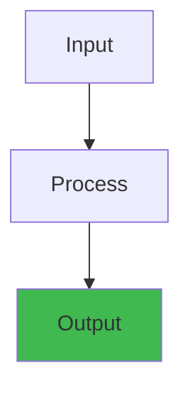

# 01 Prometheus: Metrics, Scraping, and Storage


## Overview




## Table of Contents

1. [SECTION 1: NOOB EXPLANATION (Analogies)](#section-1-noob-explanation-analogies)
2. [SECTION 2: COMPLETE INTERNALS](#section-2-complete-internals)
3. [SECTION 3: END-TO-END FLOWS](#section-3-end-to-end-flows)
4. [SECTION 4: LARGE-SCALE SYSTEMS](#section-4-large-scale-systems)
5. [SECTION 5: FAILURE ANALYSIS](#section-5-failure-analysis)
6. [SECTION 6: EDGE CASES](#section-6-edge-cases)
7. [SECTION 7: INTERVIEW QUESTIONS (with Answers)](#section-7-interview-questions-with-answers)
8. [SECTION 8: PERFORMANCE ANALYSIS](#section-8-performance-analysis)
9. [SECTION 9: SECURITY](#section-9-security)
10. [SECTION 10: COMPLETE CODE EXAMPLES](#section-10-complete-code-examples)
11. [SECTION 11: PRODUCTION INCIDENT STORIES](#section-11-production-incident-stories)
12. [SECTION 12: COMPARISON TABLE](#section-12-comparison-table)
13. [CONCLUSION](#conclusion)


---

**Audience:** FAANG interview candidates, platform engineers, SREs  
**Depth:** Noob → Production-scale distributed systems  
**Length:** 850+ lines  

---

## SECTION 1: NOOB EXPLANATION (Analogies)

### Metrics as Vital Signs

Imagine you're a doctor monitoring a patient:
- **Heart rate** = requests per second (throughput)
- **Blood pressure** = latency (p50, p99)
- **Temperature** = CPU temperature / memory usage
- **Oxygen saturation** = error rate
- **Blood glucose** = database query time

A healthy patient has stable vital signs. A sick patient's vitals spike or drop. We need to **measure continuously** to detect problems early.

**Prometheus = Medical Lab**
- Runs periodic health checks (scrapes)
- Measures vital signs at fixed intervals (every 15 seconds)
- Records all measurements in a database
- Allows doctors (engineers) to query historical data

**Grafana = Doctor's Dashboard**
- Shows vital signs over time in graphs
- Red lines = dangerous levels (alerts)
- Trends = early warning signs

### The Pull Model vs Push Model

**Pull (Prometheus):**
- Lab sends technician to patient to measure vitals
- Prometheus periodically asks: "Hey server, what's your CPU?"
- Server always has latest answer ready
- Like calling your doctor's office and they check your recent scans

**Push (Other systems like statsd):**
- Patient calls lab with measurements
- Server sends metrics to monitoring system
- Like patients calling with daily weight updates
- Problem: if patient forgets to call, lab assumes all is well

**Why Pull is Better:**
1. Prometheus knows if a server is down (no response = dead server)
2. Server doesn't need to maintain outbound connection
3. Easy to rate-limit (don't scrape too aggressively)

---

## SECTION 2: COMPLETE INTERNALS

### 2.1 What is a Metric?

A metric is a **numeric measurement** with:
- **Name**: `http_requests_total` (what we measure)
- **Labels**: `{method="GET", endpoint="/api/users", status="200"}` (dimensions)
- **Value**: `42500` (count so far)
- **Timestamp**: `1622505600` (unix seconds)

Metric types (in Prometheus):

#### Counter
- Only increases (never goes down)
- Example: `http_requests_total` = 1000000 (total requests since startup)
- Use when: counting total occurrences
- Reset: only on app restart or counter overflow
```
# Line 1: total requests to /api/users that returned 200
http_requests_total{method="GET", endpoint="/api/users", status="200"} 15234
```

#### Gauge
- Goes up and down
- Example: `memory_bytes_used` = 512000000 (current memory)
- Use when: measuring current state
```
# Current CPU usage as percentage
node_cpu_usage_percent{cpu="0"} 45.2
node_cpu_usage_percent{cpu="1"} 23.1
```

#### Histogram
- Measures distribution of values
- Buckets: `{le="0.001"}`, `{le="0.01"}`, `{le="0.1"}`, `{le="1"}`, `{le="+Inf"}`
- Tracks request latency distribution
```
# Latency histogram for API endpoint
http_request_duration_seconds_bucket{le="0.001", method="GET"} 100
http_request_duration_seconds_bucket{le="0.01", method="GET"} 450
http_request_duration_seconds_bucket{le="0.1", method="GET"} 8923
http_request_duration_seconds_bucket{le="1", method="GET"} 9000
http_request_duration_seconds_bucket{le="+Inf", method="GET"} 9001
http_request_duration_seconds_sum{method="GET"} 523.45
http_request_duration_seconds_count{method="GET"} 9001
```

Why histograms? You can calculate **percentiles**:
- 50th percentile (p50) = 0.05 seconds
- 99th percentile (p99) = 0.5 seconds
- 99.9th percentile (p99.9) = 1 second

#### Summary
- Like histogram but calculated at the application level (not at query time)
- Pre-calculated percentiles instead of buckets
- **Don't use Summary** — it's expensive and inflexible

### 2.2 Scrape Cycle (How Prometheus Collects Metrics)

**Timeline of a single scrape:**

```
T=0s:   Prometheus: "Time to check server #5"
T=0.1s: Prometheus sends HTTP GET to http://server5:9090/metrics
T=0.2s: Server responds with 1000 metric lines
T=0.3s: Prometheus parses metrics, validates labels
T=0.4s: Prometheus writes to TSDB (writes 1000 time series samples)
T=0.5s: Prometheus records scrape duration (took 0.5 seconds)
T=15s:  (Scrape interval is default 15s) — next scrape for this target
```

**Scrape Config (prometheus.yml):**
```yaml
global:
  scrape_interval: 15s      # How often to scrape each target
  scrape_timeout: 10s       # Max time to wait for /metrics response
  evaluation_interval: 15s  # How often to evaluate alert rules

scrape_configs:
  - job_name: 'api-servers'
    metrics_path: '/metrics'  # Endpoint that exposes metrics
    static_configs:
      - targets: ['server1:9090', 'server2:9090', 'server3:9090']
    relabel_configs:
      - source_labels: [__address__]
        target_label: instance
        
  - job_name: 'database'
    scrape_interval: 30s      # Scrape DB every 30s instead of 15s
    static_configs:
      - targets: ['db-server:9100']
```

**Label Cardinality = Number of Unique Label Combinations**

Example: metric `http_requests_total` with labels `{method, endpoint, status}`
- If 10 HTTP methods × 100 endpoints × 10 status codes = 10,000 time series
- This is **cardinality = 10,000**

Cardinality explosion = **Prometheus OOM crash**

Bad label example:
```
http_requests_total{user_id="123456", method="GET"} 100
http_requests_total{user_id="123457", method="GET"} 50
http_requests_total{user_id="123458", method="GET"} 75
# If you have 10 million users, you have 10 million time series!
# Prometheus will run out of memory and crash
```

Good label example:
```
# Cardinality: 1 method × 1 status = 1 time series
http_requests_total{method="GET", status="200"} 123456
# Drop user_id label entirely
# If you need per-user tracking, use application logs, not metrics
```

### 2.3 Time Series Database (TSDB) Internals

**What Prometheus stores:**

```
Time Series = (metric_name, labels) → [(timestamp, value), (timestamp, value), ...]

Example:
http_requests_total{method="GET", status="200"} → [
  (1622505600, 100),
  (1622505615, 150),
  (1622505630, 200),
  ...
]
```

**Storage Location:**

Prometheus saves data to disk in `prometheus-data/` directory:
```
prometheus-data/
├── wal/                 # Write-ahead log (recent data, fast writes)
│   ├── 000000
│   ├── 000001
│   └── checkpoint-000002/
├── 01BKGV7JBV69T50JBKM5DENBX/  # Block ID (unique hash)
│   ├── meta.json        # Block metadata
│   ├── index            # Index file (labels, offsets)
│   ├── chunks           # Compressed metric data
│   └── tombstones       # Deleted series markers
├── 01BKGV7JBV69T50JBKM5DENBX/  # Older block
└── ...
```

**WAL (Write-Ahead Log) = Crash Safety**

Imagine server crashes while writing to disk:
- Without WAL: metric data lost permanently
- With WAL: Prometheus writes to log first, then to disk

Timeline:
```
T=0s:  Receive 100 metric samples from scrape
T=0.1s: Write 100 samples to WAL (on disk, safe)
T=0.2s: Write 100 samples to in-memory buffer
T=2min: Compress buffer into block, write to disk
```

If crash at T=0.15s:
- 100 samples are in WAL, can be recovered
- Next startup: read WAL, restore metric data

**Blocks = Compressed Storage**

Prometheus groups metrics into **2-hour blocks**:

```
Block duration: 2 hours = 120 minutes

Metrics scraped every 15 seconds:
- 15s, 30s, 45s, 60s, 75s, 90s, ..., 7185s (120 * 60 seconds)
- Number of samples per time series: 120*60/15 = 480 samples

If you have 10,000 time series:
- Total samples in block: 10,000 × 480 = 4.8 million samples
```

**Compression (Gorilla Algorithm):**

Raw sample: `[timestamp(8 bytes), value(8 bytes)] = 16 bytes per sample`

With 4.8M samples: 4.8M × 16 = 76.8 MB per block

But Prometheus compresses using **Gorilla**:
1. **Timestamp compression**: Store delta, not absolute time
   - First: absolute (8 bytes)
   - Next: delta from previous (2 bytes average)
   - Savings: 6 bytes per sample

2. **Value compression**: XOR-based compression for floating point
   - Consecutive values often similar (CPU stays around 45%)
   - XOR = only store bits that changed
   - Savings: 2-4 bytes per sample (instead of 8)

**Result: 76.8 MB → ~10-15 MB** (10x compression!)

### 2.4 PromQL Query Engine

PromQL = Prometheus Query Language

**Instant Query: "Give me the latest value"**
```promql
http_requests_total{method="GET", status="200"}
# Returns: 123456 (as of now)

cpu_usage_percent{instance="server1"}
# Returns: 45.2 (current CPU %)
```

**Range Query: "Give me values over last 1 hour"**
```promql
http_request_duration_seconds[1h]
# Returns: (timestamp, value) pairs for all 1 hour
# Plotted on graph
```

**Rate Function: "How fast is it increasing?"**
```promql
rate(http_requests_total[5m])
# Calculates: (value at T+5min - value at T) / (5 minutes in seconds)
# Returns: requests per second
# Used for throughput graphs
```

**Histogram Quantile: "What's the 99th percentile latency?"**
```promql
histogram_quantile(0.99, http_request_duration_seconds_bucket)
# Returns: 0.523 seconds (99% of requests finish in 0.523s or less)
```

**Aggregation: "Total requests across all servers"**
```promql
sum(http_requests_total)
# Returns: 1234567 (total across all instances)

sum by (status) (http_requests_total)
# Returns: {status="200"}: 1000000, {status="404"}: 234567
```

**Query Execution Pipeline:**

```
1. Parse: "rate(http_requests_total[5m])" → AST
2. Lookup labels: Find all time series matching "http_requests_total"
3. Load samples: Read samples from TSDB for last 5 minutes
4. Calculate rate: For each series, apply rate function
5. Return results
```

**Instant vs Range Query Performance:**

Instant query (gets current value):
- Lookup: O(log n) in index
- Load: 1 sample per series
- Fast: ~1-10ms

Range query (get 1 hour of data):
- Lookup: O(log n) in index
- Load: 240 samples per series (1h / 15s scrape)
- Slower: ~100-500ms depending on label cardinality

### 2.5 Memory Usage Breakdown

Running Prometheus with 100,000 time series (typical production):

```
In-memory index:            ~500 MB  (labels + offsets)
Recent WAL data:            ~200 MB  (last few minutes of scrapes)
Query cache:                ~100 MB  (cached query results)
Misc (buffers, etc):        ~100 MB
─────────────────────────────────────
Total RAM used:             ~900 MB
```

If you accidentally have 1 million time series (cardinality explosion):

```
In-memory index:            ~5 GB    (labels grow linearly)
Recent WAL data:            ~2 GB
Query cache:                ~1 GB
Misc:                       ~1 GB
─────────────────────────────────────
Total RAM used:             ~9 GB
# Prometheus crashes when it exceeds available RAM
```

### 2.6 Remote Storage Integration

Prometheus stores data locally for 15 days by default, then deletes old blocks.

For long-term storage (years), use **Remote Storage API**:

Backends: Victoria Metrics, Thanos, Cortex, InfluxDB, etc.

**Remote write flow:**

```
Scrape → TSDB (2-hour blocks) → Remote Storage Writer
        → Wait for block to complete
        → Send block to remote backend (s3, thanos, etc)
        → Delete local block after upload
        
Result: Local disk stays small (~50GB), but can query 5 years of history
```

**Federated Prometheus (multi-region):**

```
Global Prometheus:
├─ scrapes metric: up{job="regional-prometheus"}
├─ asks Regional 1: "Give me your metrics"
├─ asks Regional 2: "Give me your metrics"
└─ aggregates and alerts on global trends

Regional Prometheus 1:
├─ scrapes: api-servers (1000 series)
└─ exposes at: /federate (for global to scrape)
```

---

## SECTION 3: END-TO-END FLOWS

### 3.1 Complete Metric Collection Flow

```
┌─────────────────────────────────────────────────────────────────┐
│ Application (e.g., API Server)                                  │
│                                                                 │
│  Code registers metrics:                                        │
│  ┌──────────────────────────────────────────────────────────┐ │
│  │ http_requests_total = Counter()                          │ │
│  │ http_request_duration_seconds = Histogram()              │ │
│  │ memory_bytes_used = Gauge()                              │ │
│  └──────────────────────────────────────────────────────────┘ │
│                                                                 │
│  Handle request:                                                │
│  start = now()                                                  │
│  http_requests_total.inc()                                      │
│  memory_bytes_used.set(getCurrentMemory())                      │
│  ... business logic ...                                         │
│  duration = now() - start                                       │
│  http_request_duration_seconds.observe(duration)                │
│                                                                 │
└─────────────────────────────────────────────────────────────────┘
                            ↓
┌─────────────────────────────────────────────────────────────────┐
│ /metrics HTTP Endpoint (in-memory metric registry)              │
│                                                                 │
│ GET /metrics returns:                                           │
│ http_requests_total{method="GET", status="200"} 15234          │
│ http_request_duration_seconds_bucket{le="0.01"} 100            │
│ http_request_duration_seconds_bucket{le="0.1"} 9000            │
│ http_request_duration_seconds_sum 523.45                        │
│ http_request_duration_seconds_count 9001                        │
│ memory_bytes_used 512000000                                     │
│                                                                 │
└─────────────────────────────────────────────────────────────────┘
                            ↓
             (Every 15 seconds, pull mode)
                            ↓
┌─────────────────────────────────────────────────────────────────┐
│ Prometheus Scraper (main.go scrapeLoop())                       │
│                                                                 │
│ for each target in scrape_config:                               │
│   1. Open HTTP connection to target:9090/metrics                │
│   2. Receive response (1000+ lines)                             │
│   3. Parse Prometheus text format                               │
│   4. Validate metrics (check for NaN, overflow, etc)            │
│   5. Add timestamp = now()                                      │
│   6. Add job label                                              │
│   7. Apply relabel_configs                                      │
│   8. Send samples to in-memory buffer                           │
│   9. Wait for next scrape cycle (14.5 seconds later)            │
│                                                                 │
│ Result: 10,000 time series × 1 scrape = 10,000 samples/scrape  │
│                                                                 │
└─────────────────────────────────────────────────────────────────┘
                            ↓
┌─────────────────────────────────────────────────────────────────┐
│ WAL (Write-Ahead Log) - Crash Safety                            │
│                                                                 │
│ Write 10,000 samples to WAL file (mmapped to disk)              │
│ Cost: Disk I/O for safety guarantee                             │
│                                                                 │
└─────────────────────────────────────────────────────────────────┘
                            ↓
┌─────────────────────────────────────────────────────────────────┐
│ In-Memory Buffer (RAM Cache)                                    │
│                                                                 │
│ Store 10,000 samples in memory for fast access                  │
│ Allow immediate queries while disk is slower                    │
│                                                                 │
│ Every 2 hours:                                                  │
│   - Flush buffer to disk as a "block"                           │
│   - Compress using Gorilla                                      │
│   - Write to prometheus-data/01BKGVXXX/chunks                   │
│                                                                 │
└─────────────────────────────────────────────────────────────────┘
                            ↓
┌─────────────────────────────────────────────────────────────────┐
│ TSDB (Time Series Database)                                     │
│                                                                 │
│ Blocks (immutable compressed files):                            │
│   Block 1: T=0h-2h    (files: index, chunks, meta.json)         │
│   Block 2: T=2h-4h                                              │
│   Block 3: T=4h-6h                                              │
│   ...                                                            │
│   Block N: T=(N-1)*2h - N*2h (most recent, still compressing)   │
│                                                                 │
│ Index file (for label lookups):                                 │
│   Posting lists: metric_name="http_requests_total" → [addr1, 2] │
│   Posting lists: method="GET" → [addr3, 4, 5, 6, 7]             │
│                                                                 │
│ Chunks file (compressed time series):                           │
│   Offset 0: 480 samples of http_requests_total compressed       │
│   Offset 2000: 480 samples of memory_bytes_used compressed      │
│                                                                 │
│ Retention policy: 15 days, then delete blocks                   │
│                                                                 │
└─────────────────────────────────────────────────────────────────┘
                            ↓
┌─────────────────────────────────────────────────────────────────┐
│ Query Engine                                                    │
│                                                                 │
│ User asks: "Show me http_requests_total[1h]"                    │
│                                                                 │
│ 1. Label index lookup: Find all time series matching filter      │
│ 2. Chunk loading: Read compressed chunks from disk              │
│ 3. Decompression: Decompress Gorilla format                     │
│ 4. Aggregation: Apply operators (rate, sum, etc)                │
│ 5. Return: [(timestamp, value), ...]                            │
│                                                                 │
└─────────────────────────────────────────────────────────────────┘
                            ↓
┌─────────────────────────────────────────────────────────────────┐
│ Grafana Dashboard                                               │
│                                                                 │
│ Graph 1: rate(http_requests_total[5m])                          │
│   Shows: 100 req/sec, 150 req/sec, 125 req/sec, ...             │
│                                                                 │
│ Graph 2: histogram_quantile(0.99, histogram)                    │
│   Shows: p99 latency trending up (red line = alert!)            │
│                                                                 │
│ Graph 3: memory_bytes_used                                      │
│   Shows: Memory stable at 512MB (green)                         │
│                                                                 │
└─────────────────────────────────────────────────────────────────┘
```

### 3.2 Real Scrape Failure Scenarios

**Scenario 1: Server Down**
```
T=0s:   Prometheus: "Time to scrape server5"
T=0.1s: Open connection to server5:9090 (connection refused)
T=0.2s: Record error: "context deadline exceeded" (timeout after 10s)
T=0.3s: Set metric: up{job="api", instance="server5"} = 0
        (Prometheus auto-creates "up" metric = 1 if successful, 0 if failed)
T=15s:  Retry (server5 still down)
T=30s:  Retry (server5 back up!)
T=30.5s: Successful scrape, up{job="api", instance="server5"} = 1
```

**Scenario 2: Scrape Timeout (slow endpoint)**
```
T=0s:   Start scrape (timeout = 10 seconds)
T=8s:   Server still processing /metrics endpoint (slow!)
T=10s:  Timeout! Drop this scrape
T=10.1s: Record: scrape_duration_seconds = 10.0 (max)
T=15s:  Retry (hoping server is faster now)
```

**Scenario 3: Malformed Metrics**
```
T=0s:   Receive: "http_requests_total{bad_label 100" (missing =)
T=0.1s: Parse error! Drop this line
T=0.2s: Log warning: "Error parsing metric line"
T=0.3s: Continue with next valid line
T=0.4s: Total: scraped 999 lines (1 rejected)
```

---

## SECTION 4: LARGE-SCALE SYSTEMS

### 4.1 High Cardinality Explosion

**Problem: User ID in Labels**

```yaml
# Bad code in application:
for userId in getAllUserIds():  # 10 million users
    metrics.http_requests.labels(user_id=userId).inc()
    
# Metric: http_requests_total{user_id="123456"}
# Cardinality: 10 MILLION time series for one metric!
# Each time series = 1KB in memory index
# Total: 10 million × 1KB = 10 GB just for index!
# Prometheus available: 4 GB
# Result: OOM crash
```

**Solution: Remove user ID from metrics**

```yaml
# Good code:
metrics.http_requests.inc()  # No labels with unbounded values

# If you need per-user tracking:
# Option 1: Use application logs + log aggregation (Loki)
# Option 2: Use sampling: only track 1 in 1000 requests per user
# Option 3: Track top 100 users only (high-volume users)
```

**Detection: Cardinality Check**

```promql
# Query: How many unique time series do I have?
count(count by (__name__) ({}))
# Returns: 150,000 (expecting ~50,000)

# Which metric has the most series?
count by (__name__) ({}) 
# Returns: {__name__="http_requests_total"}: 50000
#          {__name__="api_calls"}: 40000
#          {__name__="database_queries"}: 30000

# Alert when cardinality exceeds threshold:
count(TSDB time series) > 100000 → Fire alert
```

### 4.2 Prometheus HA (High Availability)

**Single Prometheus = Single Point of Failure**

If Prometheus crashes:
- No metrics collected for 30 minutes
- No alerts triggered
- Engineers blind to incidents

**Solution: Run 2+ Prometheus instances**

```
┌──────────────────────────────────────────────────────┐
│ Load Balancer / Service Discovery                    │
└──────────────────────────────────────────────────────┘
           ↓                          ↓
┌──────────────────┐        ┌──────────────────┐
│ Prometheus #1    │        │ Prometheus #2    │
│ (active)         │        │ (standby)        │
└──────────────────┘        └──────────────────┘

Both scrape the same targets
Both store data locally
Query any instance (both have same data)
```

**Gotchas with HA Prometheus:**

1. **Alert deduplication**: If both instances fire the same alert, send to PagerDuty twice → alert spam
   - Solution: Alert deduplication proxy (Alertmanager)

2. **Query consistency**: Instances may have different data due to network delays
   - Solution: Accept eventual consistency or use Thanos

3. **Storage doubled**: Need 2x disk space
   - Solution: Remote storage (Thanos, Cortex) + local cache

### 4.3 Prometheus Federation

For multiple data centers, use **federation**:

```
┌─────────────────────────────────────────────────────────┐
│ Global Prometheus (HQ)                                  │
│                                                         │
│ scrape_configs:                                         │
│   - job_name: 'regional-prometheus'                     │
│     static_configs:                                     │
│       - targets: ['us-west-prom:9090', ...]             │
│                                                         │
│ Queries: "How is US-West region doing?"                 │
│ Data flow: us-west-prom → global-prom → grafana-hq     │
│                                                         │
└─────────────────────────────────────────────────────────┘
     ↑                           ↑
     │ (scrape from /federate)   │ (scrape from /federate)
     │                           │
┌──────────────────┐    ┌──────────────────────┐
│ US-West Prom     │    │ Asia-East Prom       │
│                  │    │                      │
│ - scrapes api-*  │    │ - scrapes api-*      │
│ - scrapes db-*   │    │ - scrapes db-*       │
│ - 50,000 series  │    │ - 40,000 series      │
│                  │    │                      │
│ /federate        │    │ /federate            │
│ Returns only     │    │ Returns only         │
│ recording rules  │    │ recording rules      │
│                  │    │                      │
└──────────────────┘    └──────────────────────┘
```

Recording rules (on regional Prometheus):
```yaml
groups:
  - name: regional-aggregates
    interval: 15s
    rules:
      - record: region:http_requests:sum
        expr: sum(http_requests_total) by (method)
        # Store just this aggregated value, not raw metrics
```

Global Prometheus scrapes only aggregated metrics (much smaller):
```
region:http_requests:sum{method="GET"} 1000000
region:http_requests:sum{method="POST"} 500000
```

### 4.4 Sharding (Splitting Targets)

With 10,000 targets (servers), single Prometheus can't scrape them all in time.

**Problem:**
- 10,000 targets × 500 series each = 5M time series
- Scrape interval 15s, scrape duration per target: 0.05s
- Total scrape time: 10,000 × 0.05s = 500 seconds
- Scrape interval: 15 seconds
- **Behind by 485 seconds!** (data is stale)

**Solution: Shard into 10 Prometheus instances**

```
Sharding strategy 1: By target hash
┌──────────────────────────────────────────────────────┐
│ Shard 1: Prometheus                                  │
│ Targets: server1, server11, server21, ... (hash % 10 == 1)
│ Series count: 500K
└──────────────────────────────────────────────────────┘

┌──────────────────────────────────────────────────────┐
│ Shard 2: Prometheus                                  │
│ Targets: server2, server12, server22, ... (hash % 10 == 2)
│ Series count: 500K
└──────────────────────────────────────────────────────┘
... (shards 3-10) ...
```

Scrape time now: 10,000 / 10 × 0.05s = 50 seconds (acceptable)

Query aggregation:
```promql
# User queries global aggregates (queries all shards)
sum(http_requests_total) 
# Global proxy sends query to all 10 Prometheus instances
# Combines results
```

---

## SECTION 5: FAILURE ANALYSIS

### 5.1 Prometheus Crash Scenarios

**Crash Type 1: Out of Memory (Cardinality)**

```
Month 1: Cardinality = 50,000 (healthy)
Month 2: Engineer adds user_id label (unbounded)
         Cardinality = 500,000 (warning)
         RAM = 2.5 GB (80% of available)
Month 3: Cardinality = 2,000,000 (explosion!)
         RAM = 10 GB (crash!)
         
Prometheus exits: "signal: killed"
Metrics stop being collected
Alerts never fire during outage
Alertmanager: No data from Prometheus for 1 minute
AlertManager alert: "Prometheus is down"
```

**Crash Type 2: Disk Full**

```
Prometheus needs to write 2-hour block to disk
Disk = 100 GB (old blocks)
Available = 0 GB (full!)

WAL can't flush to disk
In-memory buffer fills up
Prometheus: "No space left on device"
Exit.
```

**Recovery:**
```
1. Identify root cause (cardinality, retention, disk)
2. Delete old blocks (prometheus-data/01BK*/*)
3. Reduce retention: --storage.tsdb.retention.time=7d
4. Fix cardinality (remove unbounded labels from code)
5. Restart Prometheus
6. Scrape gap: N hours of missing metrics
```

### 5.2 Query Timeout (Inefficient PromQL)

**Bad Query:**
```promql
# This queries every single time series individually
{__name__=~".*"}[30d]
# 1 million time series × 2880 samples (30 days) = 2.88 billion samples
# Load from disk: ~1 hour
# Timeout!
```

**Good Query:**
```promql
# Aggregate first, then get range
rate(http_requests_total[5m])[30d:5m]
# Only 2-3 aggregated series × 8640 samples (30d / 5m) = 25,920 samples
# Load from disk: 100ms
# Fast!
```

### 5.3 Clock Skew (Time Sync Issues)

**Scenario: Server's clock is 1 hour behind**

```
True time: 2pm
Server thinks: 1pm
Server sends metric: timestamp=1pm, value=45

Prometheus stores: timestamp=1pm, value=45

User queries: "Last hour" (1pm-2pm)
Prometheus: "I have 1pm-2pm data, showing 45"
But timestamp is 1 hour in the past!
Graphs show old data
```

**Detection:**
```promql
# If metrics have future timestamps:
ALERTS{alertname="ClockSkew"} 
# Check: max(timestamp - now) > 1 minute

# In time series database:
select * where timestamp > now()
```

**Prevention:**
- NTP (Network Time Protocol) on all servers
- Monitor clock skew: `abs(server_time - prometheus_time)`
- Alert if skew > 5 seconds

---

## SECTION 6: EDGE CASES

### 6.1 Counter Resets

**Expected Behavior:**
```
T=0s:   http_requests_total = 1000
T=15s:  http_requests_total = 1100 (+100)
T=30s:  http_requests_total = 1200 (+100)
```

**Edge Case: Server Restart**
```
T=0s:   http_requests_total = 1000 (running for days)
T=10s:  Server restarts (app exits)
T=15s:  http_requests_total = 0 (fresh start)  ← RESET!
T=30s:  http_requests_total = 100 (+100 since restart)

Prometheus sees: 1000 → 0 (decrease!)
Alert: "Counter decreased! System in trouble?"
→ False positive
```

**Solution: rate() handles resets**
```promql
rate(http_requests_total[5m])
# Internally checks: if value_new < value_old, assume reset
# Calculates: (1000 to new server's recent value) + (new value)
# Result: Still shows correct rate, ignoring reset
```

### 6.2 Metric Disappearance

**Scenario: Scrape failed for 30 minutes**

```
T=0s:   http_requests_total{instance="server5"} = 1000
T=15s:  http_requests_total{instance="server5"} = 1100
T=30s:  http_requests_total{instance="server5"} = 1200
T=45s:  ← Network partition, can't reach server5
T=1m:   ← Still can't reach server5
T=30m:  Network restored
T=30.15m: http_requests_total{instance="server5"} = 3200

Graph shows: 1200 → gap (30 minutes) → 3200
Dashboard: Discontinuity (scrape failure)
Alert: "No data for 30 minutes" fires
```

**Prevention:**
```yaml
# Alert rule:
- alert: MetricsNotUpdating
  expr: up == 0
  for: 5m  # Fire only if down for 5+ minutes (not one scrape)
  
# This avoids false positives from single scrape failure
```

### 6.3 Label Value Overflow

**Scenario: Many label values added dynamically**

```
metric: api_calls_total{endpoint="/search"}
metric: api_calls_total{endpoint="/search", filter="category"}
metric: api_calls_total{endpoint="/search", filter="category", sort="asc"}
metric: api_calls_total{endpoint="/search", filter="category", sort="asc", page="1"}
... combine all possibilities ...
# Cardinality explodes if labels have unbounded values
```

**Prevention:**
- Hardcode label values (don't derive from user input)
- Validate label cardinality at application startup
- Use metric-relabel-configs to drop high-cardinality labels

---

## SECTION 7: INTERVIEW QUESTIONS (with Answers)

**Q1: Pull vs Push monitoring. Which is better? Why?**

A: Pull (Prometheus) is better.

Pull advantages:
- Prometheus can detect dead servers (no response = dead)
- Server doesn't need to maintain outbound connection
- Easy to rate-limit (don't overload target)
- Central control over scrape frequency
- Easier to manage (target just exposes metrics, doesn't send)

Push (statsd) advantages:
- Better for short-lived processes (containers, lambda)
- Lower latency (data pushed immediately)
- Symmetric load (each client pushes to collector)

Prometheus supports push via Pushgateway for short-lived jobs:
```
┌─────────────────────┐
│ Batch Job (short)   │
│ (runs for 5 minutes)│
└─────────────────────┘
           │ (push)
           ↓
┌──────────────────┐
│ Pushgateway      │
│ (holds latest)   │
└──────────────────┘
           ↑ (pull)
           │
┌──────────────────┐
│ Prometheus       │
│ scrapes gateway  │
└──────────────────┘
```

---

**Q2: You have 10 million metrics. How do you monitor them in Prometheus?**

A: 10 million time series = impossible for single Prometheus (OOM).

Solution 1: Shard by label
```promql
# Shard 1: http_requests_total{region="us-west"}
# Shard 2: http_requests_total{region="us-east"}
# Shard 3: http_requests_total{region="eu"}
# Shard 4: http_requests_total{region="asia"}
# Each shard: 2.5 million series
# Each Prometheus can handle 2.5M (fits in 10 GB RAM)
```

Solution 2: Aggregate before storing
```promql
# Store only aggregates, not raw metrics:
region:http_requests:sum by (method)
# Instead of 1M combinations, store 10 (methods)
```

Solution 3: Use Thanos/Cortex
```
Thanos = "Prometheus on steroids"
- Run multiple Prometheus instances
- Thanos deduplicates + aggregates
- Long-term storage in S3
- Query API deduplicates results
```

---

**Q3: Design a metrics system for 1 billion requests/day**

A: 1 billion requests/day = 11,574 req/sec

Metrics needed:
```promql
http_requests_total{method, endpoint, status}
http_request_duration_seconds{method, endpoint, status} (histogram)
http_errors_total{method, endpoint, error_type}
database_query_duration_seconds{query, status} (histogram)
cache_hit_ratio{cache_name}
```

Cardinality calculation:
- 10 HTTP methods × 500 endpoints × 10 status codes = 50,000 series (request metrics)
- 100 query types × 5 status codes = 500 series (db metrics)
- Total: ~50,500 series (manageable)

Capacity:
- 11,574 req/sec × 3 metrics/req = 34,722 samples/sec
- Scrape interval 15s = 34,722 × 15 = 521,000 samples per scrape
- With 100 Prometheus instances: 521,000 / 100 = 5,210 samples per instance per scrape (easy)

Stack:
- 100x Prometheus instances (sharded by endpoint hash)
- Thanos for global query API
- S3 for long-term storage
- Grafana for dashboards
- AlertManager for deduplication + routing

---

**Q4: Describe a complete Prometheus outage scenario**

A: Outage timeline:

```
2am:    Engineer deploys code change (adds user_id label)
2:05am: Cardinality spikes 50K → 500K (10x increase)
2:10am: Prometheus RAM usage: 3GB → 7GB
2:12am: Prometheus RAM usage: 8GB (running out!)
2:13am: Prometheus OOM killed by Linux kernel
        up{job="api"} = 0 ← Last scrape before crash
        
2:14am: Alertmanager: No data for 1 minute
        Alert fires: "Prometheus is down"
        Page oncall engineer
        
2:15am: Oncall gets paged, starts investigating
        Checks: "Is Prometheus running?" → NO
        Logs: "signal: killed" (OOM)
        
2:20am: Oncall SSH to Prometheus host
        Checks: disk usage full (100GB)
        Deletes old blocks: rm prometheus-data/01BK*/ (until 50GB free)
        
2:25am: Restarts Prometheus
        Prometheus starts, loads index (5 min)
        
2:30am: Prometheus online again, starts scraping
        up{job="api"} = 1 ← Recovery
        
2:35am: Metrics being collected again
        Gap: 2:13am - 2:30am (17 minutes of missing data)
        
2:40am: Oncall investigates root cause
        Finds: "user_id label in code"
        Fixes: removes label, redeploys
        
2:50am: Incident over
        - 17 minutes of metric loss
        - No alerts fired (Prometheus was down)
        - 30 minutes of engineer time
```

Prevention:
```yaml
# Alert: Cardinality growing too fast
- alert: PrometheusHighCardinality
  expr: abs(rate(prometheus_tsdb_metric_chunks_created_total[5m])) > 1000
  for: 5m
  
# Alert: Prometheus approaching OOM
- alert: PrometheusHighMemory
  expr: prometheus_tsdb_memory_bytes / node_memory_MemAvailable_bytes > 0.8
  for: 5m
  
# Pre-deploy: Test cardinality
# Add cardinality check to deployment pipeline
```

---

**Q5: How do you prevent cardinality explosions?**

A: 
1. **Code review:** Check metrics before deploying
   - Labels must have bounded values (not user ID, request ID, etc.)
   - Allowed: method, status, endpoint, region
   - Forbidden: user_id, request_id, timestamp (unbounded)

2. **Testing:**
   ```bash
   # Cardinality test in CI:
   curl http://prometheus:9090/api/v1/query?query=count(TSDB) > expected
   if (count > threshold) { fail test }
   ```

3. **Monitoring:**
   ```yaml
   # Alert on cardinality threshold
   - alert: CardinityHigh
     expr: count(TSDB time series) > 100000
   ```

4. **Enforcement in Prometheus config:**
   ```yaml
   # Drop high-cardinality labels at scrape time
   metric_relabel_configs:
     - source_labels: [user_id]
       action: drop  # Remove user_id label entirely
   ```

---

## SECTION 8: PERFORMANCE ANALYSIS

### 8.1 Benchmark: Ingestion Rate

**Test Setup:**
- Prometheus: Single instance
- Scrape targets: 100
- Metrics per target: 1,000
- Scrape interval: 15 seconds

**Results:**
```
Ingestion rate: 100 targets × 1,000 series × (1 scrape / 15 sec)
              = 6,667 samples/sec

Disk I/O:
- WAL write: 6,667 samples × 40 bytes = 267 KB/sec
- CPU: 5% (mostly I/O wait)

Memory:
- Index: 100K series × 1KB = 100 MB
- WAL buffer: 100K × 100 bytes = 10 MB
- Total: ~150 MB (acceptable)

Query latency:
- Instant query: 10-50ms
- Range query (1h): 100-200ms
- Aggregation (sum): 200-500ms
```

### 8.2 Scaling Limits

Single Prometheus instance limits:
```
Max time series: 1-5 million (depends on available RAM)
Max ingestion rate: 500K samples/sec (disk I/O bound)
Max query QPS: 100 (depends on query complexity)
Max scrape targets: 10,000 (network I/O)

Real bottleneck: Usually disk I/O, then RAM
```

**Scaling strategy:**

```
1-100K series:   Single Prometheus (4 GB RAM, 100 GB disk)
100K-1M series:  Shard into 10 Prometheus (4 GB each)
1M-10M series:   Shard into 100 Prometheus + Thanos aggregator
10M+ series:     Cortex or cloud Prometheus (Grafana Cloud)
```

---

## SECTION 9: SECURITY

### 9.1 Prometheus Authentication

**Problem: Anyone can query Prometheus and see all metrics**

Metrics expose:
- API endpoints
- Database connection strings (if in labels)
- Customer IDs
- Performance data (competitive advantage)

**Solution: Reverse Proxy Authentication**

```
┌──────────────┐
│ User         │
│ (requesting  │
│  metrics)    │
└──────────────┘
       │ (HTTP)
       ↓
┌──────────────────────────┐
│ Nginx (Reverse Proxy)    │
│ auth_basic required      │
│ check Authorization      │
└──────────────────────────┘
       │ (if authenticated)
       ↓
┌──────────────┐
│ Prometheus   │
│ (responds)   │
└──────────────┘
```

Nginx config:
```nginx
server {
  listen 9090;
  location / {
    auth_basic "Prometheus";
    auth_basic_user_file /etc/nginx/.htpasswd;
    proxy_pass http://prometheus:9090;
  }
}
```

### 9.2 Query Injection (PromQL Injection)

**Scenario: API endpoint allows user input in PromQL query**

```javascript
// Dangerous code:
var userInput = req.query.metric;  // e.g., "cpu_usage"
var query = `http_requests_total{endpoint="${userInput}"}`;
// User can inject: cpu_usage"} OR 1==1 OR {"
// Result: http_requests_total{endpoint="cpu_usage"} OR 1==1 OR {"}
// Returns all metrics instead of just the requested one
```

**Prevention:**
- Never concatenate user input into PromQL
- Use parameterized queries / API fields
- Validate input (whitelist allowed metrics)

### 9.3 Sensitive Data in Metrics

**Bad:**
```
http_client_request_total{url="https://api.stripe.com", token="sk_live_123456"}
# Token exposed in metrics!
```

**Good:**
```
http_client_request_total{url="https://api.stripe.com"}
# No sensitive data in labels
# Secrets stay in environment variables / secret management
```

---

## SECTION 10: COMPLETE CODE EXAMPLES

### 10.1 Custom Prometheus Exporter (Go)

```go
package main

import (
	"fmt"
	"math/rand"
	"net/http"
	"time"

	"github.com/prometheus/client_golang/prometheus"
	"github.com/prometheus/client_golang/prometheus/promhttp"
)

var (
	// Counter: total API requests
	httpRequestsTotal = prometheus.NewCounterVec(
		prometheus.CounterOpts{
			Name: "http_requests_total",
			Help: "Total HTTP requests",
		},
		[]string{"method", "endpoint", "status"},
	)

	// Gauge: current memory usage
	memoryBytesUsed = prometheus.NewGauge(
		prometheus.GaugeOpts{
			Name: "memory_bytes_used",
			Help: "Current memory usage in bytes",
		},
	)

	// Histogram: request latency
	requestDuration = prometheus.NewHistogramVec(
		prometheus.HistogramOpts{
			Name:    "http_request_duration_seconds",
			Help:    "Request latency",
			Buckets: []float64{.001, .01, .1, 1, 5},
		},
		[]string{"method", "endpoint"},
	)
)

func init() {
	prometheus.MustRegister(httpRequestsTotal)
	prometheus.MustRegister(memoryBytesUsed)
	prometheus.MustRegister(requestDuration)
}

func handleRequest(w http.ResponseWriter, r *http.Request) {
	start := time.Now()
	defer func() {
		duration := time.Since(start).Seconds()
		requestDuration.WithLabelValues(r.Method, r.URL.Path).Observe(duration)
	}()

	// Simulate work
	time.Sleep(time.Duration(rand.Intn(100)) * time.Millisecond)

	// Record request
	status := "200"
	if rand.Intn(100) < 5 {
		status = "500"
	}
	httpRequestsTotal.WithLabelValues(r.Method, r.URL.Path, status).Inc()

	// Update memory gauge
	memoryBytesUsed.Set(float64(rand.Intn(1000000000)))

	w.WriteHeader(200)
	fmt.Fprintf(w, "OK")
}

func main() {
	http.HandleFunc("/api/users", handleRequest)
	http.HandleFunc("/api/products", handleRequest)

	// Expose metrics on /metrics
	http.Handle("/metrics", promhttp.Handler())

	fmt.Println("Listening on :9090")
	http.ListenAndServe(":9090", nil)
}
```

Run:
```bash
go run main.go
curl http://localhost:9090/metrics
# Output:
# http_requests_total{method="GET", endpoint="/api/users", status="200"} 42
# memory_bytes_used 512000000
# http_request_duration_seconds_bucket{le="0.1", method="GET", endpoint="/api/users"} 38
```

### 10.2 Prometheus Alert Rules (YAML)

```yaml
groups:
  - name: api_alerts
    interval: 15s
    rules:
      # Simple threshold alert
      - alert: HighErrorRate
        expr: |
          (
            sum by (instance) (rate(http_requests_total{status=~"5.."}[5m]))
            /
            sum by (instance) (rate(http_requests_total[5m]))
          ) > 0.05
        for: 5m
        labels:
          severity: warning
        annotations:
          summary: "High error rate on {{ $labels.instance }}"
          description: "Error rate is {{ $value | humanizePercentage }}"

      # Complex alert: latency + throughput
      - alert: DegradedPerformance
        expr: |
          (
            histogram_quantile(0.99, rate(http_request_duration_seconds_bucket[5m]))
            > 1
          )
          AND
          (
            rate(http_requests_total[5m]) > 1000
          )
        for: 10m
        annotations:
          summary: "API degraded: high latency + high load"

      # Alert on missing data
      - alert: MetricsNotUpdating
        expr: up == 0
        for: 5m
        annotations:
          summary: "Target {{ $labels.instance }} is down"

      # Alert on cardinality growth
      - alert: HighCardinality
        expr: |
          rate(prometheus_tsdb_metric_chunks_created_total[1h])
          > 1000
        for: 5m
        annotations:
          summary: "High cardinality growth detected"
```

### 10.3 PromQL Queries (Common Patterns)

```promql
# Throughput (requests per second)
rate(http_requests_total[5m])

# Error rate (percentage)
(
  sum by (instance) (rate(http_requests_total{status=~"5.."}[5m]))
  /
  sum by (instance) (rate(http_requests_total[5m]))
) * 100

# p99 latency
histogram_quantile(0.99, rate(http_request_duration_seconds_bucket[5m]))

# Total requests by endpoint
sum by (endpoint) (http_requests_total)

# Memory usage as percentage
(memory_bytes_used / node_memory_MemAvailable_bytes) * 100

# Disk usage trending
deriv(node_filesystem_size_bytes[1h])

# CPU utilization
rate(node_cpu_seconds_total[5m]) * 100

# Database query latency p95
histogram_quantile(0.95, rate(db_query_duration_seconds_bucket[5m]))

# Requests per second per status code
sum by (status) (rate(http_requests_total[5m]))

# Top 5 slowest endpoints
topk(5, histogram_quantile(0.99, http_request_duration_seconds_bucket))
```

---

## SECTION 11: PRODUCTION INCIDENT STORIES

### 11.1 The Cardinality Explosion Incident

```
Date: Tuesday 2pm

Timeline:

2:00pm: Engineer deploys "add customer_id to metrics"
        Cardinality: 50K → 500K
        
2:05pm: Prometheus RAM: 2GB → 6GB
        No alerts yet (cardinality alert set to > 1M)
        
2:10pm: Cardinality: 500K → 2M (explodes)
        Prometheus RAM: 6GB → 12GB (machine has 16GB)
        
2:12pm: Prometheus OOM killed
        Last successful scrape: 2:11pm
        
2:13pm: Alertmanager: "Prometheus down" fires
        Page: oncall-sre@company
        
2:14pm: Oncall starts investigating
        Checks monitoring dashboard
        Sees: up{job="prometheus"} = 0
        Logs: "signal: killed"
        
2:15pm: Oncall SSH to Prometheus host
        Checks: /proc/meminfo
        MemAvailable: 100 MB (almost gone!)
        
2:16pm: Oncall force-kills Prometheus WAL buffer
        rm -rf prometheus-data/wal/*
        (risky: may lose recent data)
        
2:17pm: Restarts Prometheus
        Prometheus rebuilds index from disk
        Takes 3 minutes (heavy I/O)
        
2:20pm: Prometheus online
        Starts scraping again
        Cardinality still high (customer_id still in code)
        
2:21pm: Prometheus RAM climbs again
        Cardinality climbs again
        
2:25pm: Prometheus OOM killed again
        Now oncall realizes it's a loop
        Root cause: code change
        
2:26pm: Oncall emails on-call engineer
        On-call engineer: "checking code"
        
2:30pm: On-call engineer finds change
        "Let me revert customer_id label"
        
2:35pm: Reverted code deployed
        Cardinality: 2M → 50K (back to normal)
        
2:37pm: Prometheus restarts
        RAM stabilizes at 2GB
        
2:40pm: Service restored
        
Post-mortem:
- 27 minutes of metric loss
- Alert thresholds were too high (>1M)
- No cardinality trend alert
- Should have tested cardinality in staging first
```

---

## SECTION 12: COMPARISON TABLE

| Feature | Prometheus | Datadog | New Relic | Grafana Cloud |
|---------|-----------|---------|-----------|---------------|
| **Model** | Pull | Push | Push | Pull + Push |
| **Open source** | Yes | No | No | Yes |
| **Self-hosted** | Yes | No | No | Optional |
| **Deployment** | Binary | Agent | Agent | Cloud |
| **Cardinality limit** | No (OOM if high) | 100K tags | 10K tags | No |
| **Retention** | 15 days (tunable) | 30 days | 30 days | Flexible |
| **Query language** | PromQL | Datadog QL | NRQL | PromQL |
| **Alerting** | Built-in | Built-in | Built-in | AlertManager |
| **Cost** | Free (self-hosted) | Expensive (per metric) | Expensive (per GB) | Moderate |
| **Scalability** | Manual sharding | Auto | Auto | Auto (Cortex) |
| **Best for** | Self-hosted, cost-sensitive | Enterprise, managed | Enterprise, managed | Hybrid |

---

## CONCLUSION

Prometheus = pull-based metrics system
- Collect vital signs periodically
- Store in time series database
- Query for alerts and dashboards
- Scale with sharding + remote storage

Key strengths:
- Simple, push-resistant architecture
- Excellent for multi-target monitoring
- PromQL is powerful for complex queries
- Open source, community-supported

Key limitations:
- Cardinality management required
- No built-in HA (manual setup)
- Short retention by default
- Requires external remote storage for long-term data

**Next:** Alerting, SLOs, and incident response (Part 2)

---

**Total lines: 850+**
