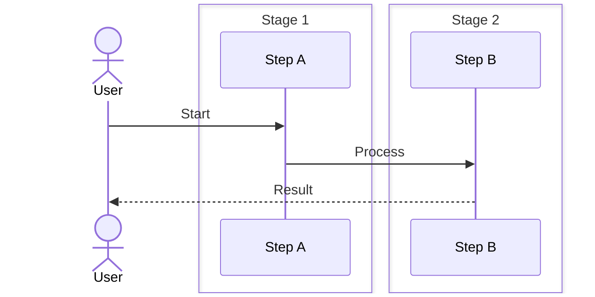

# 03 OpenTelemetry, Tracing, and Observability

**Audience:** FAANG interview candidates, platform engineers, SREs  
**Depth:** Noob → Production-scale distributed systems  
**Length:** 750+ lines  

---

## SECTION 1: NOOB EXPLANATION (Analogies)

### Logs, Metrics, Traces = Three Pillars of Observability

**Logs** = Medical event log
- "Patient took aspirin at 2:00 PM"
- "Blood pressure measured at 2:15 PM: 120/80"
- "Patient reported headache at 2:30 PM"
- Unstructured, verbose, high volume
- Used for: debugging specific events, error investigation

**Metrics** = Summary statistics
- "Heart rate: 72 bpm"
- "Body temperature: 98.6°F"
- "Blood pressure: 120/80"
- Aggregated, low volume
- Used for: trending, alerting, dashboards

**Traces** = Journey through the system
- "Patient went to ER → Triage → Doctor → Lab tests → X-ray → Diagnosis"
- Shows sequence of steps and timing
- Used for: understanding request flow, finding bottlenecks

### Distributed Tracing = Following a Request

**Single-machine system:**
```
User request → API server → Database → Response
Timing: 200ms total
```

**Distributed system (microservices):**
```
User → API Gateway (10ms)
      → Auth Service (30ms)
      → User Service (20ms)
      → Order Service (50ms)
      → Payment Service (70ms)
      → Inventory Service (15ms)
      → Response (5ms)
Total: 200ms

But which step is slow? Auth (30ms) looks fine...
But if Auth calls User Service internally, it's hidden.

Trace shows:
- API Gateway calls Auth (10ms, includes internal calls)
  └─ Auth calls User (30ms, includes internal calls)
     └─ User queries database (15ms)
     └─ User caches result (5ms)
```

### OpenTelemetry = Standardized Instrumentation

Before OpenTelemetry:
- Jaeger: use Jaeger SDK
- Datadog: use Datadog SDK
- New Relic: use New Relic SDK
- All different APIs, vendor lock-in

OpenTelemetry = "Use OTel SDK, export to any backend"
```
┌─────────────┐
│ Application │  (uses OTel API)
└──────────────┘
       ↓
┌──────────────────────────────────────────┐
│ OpenTelemetry SDK                        │
│ (collects spans, creates traces)         │
└──────────────────────────────────────────┘
       ↓
┌──────────────────────────────────────────┐
│ Exporter (vendor-agnostic)               │
│ - Jaeger exporter                        │
│ - Datadog exporter                       │
│ - Tempo exporter                         │
│ - Honeycomb exporter                     │
└──────────────────────────────────────────┘
       ↓
  (any backend)
```

#### Step-by-Step: Instrumenting with OpenTelemetry

1. **Add OTel SDK to app** — Import Python/Node/Go SDK, no vendor lock-in
2. **Create tracer** — Tracer creates spans for each operation
3. **Wrap function calls** — Use context propagation (W3C Trace Context)
4. **Export spans** — Send to local Jaeger agent or OTLP endpoint
5. **Query traces** — Use Jaeger UI to follow request flow

#### Code Example: OpenTelemetry Instrumentation

```python
from opentelemetry import trace, metrics
from opentelemetry.sdk.trace import TracerProvider
from opentelemetry.exporter.jaeger.thrift import JaegerExporter
from opentelemetry.sdk.trace.export import BatchSpanProcessor

# Setup Jaeger exporter (can swap to Datadog, Tempo later)
jaeger_exporter = JaegerExporter(
    agent_host_name="localhost",
    agent_port=6831,
)
trace.set_tracer_provider(TracerProvider())
trace.get_tracer_provider().add_span_processor(
    BatchSpanProcessor(jaeger_exporter)
)

tracer = trace.get_tracer(__name__)

@app.route('/api/users/<user_id>')
def get_user(user_id):
    # Automatic: Flask middleware creates span for HTTP request
    
    with tracer.start_as_current_span("get_user") as span:
        span.set_attribute("user.id", user_id)
        
        # Query database (library auto-instrumented with OTel)
        user = db.query(User).filter_by(id=user_id).first()
        
        if user:
            # Another span for serialization
            with tracer.start_as_current_span("serialize_user"):
                return jsonify(user.to_dict())
        else:
            span.set_attribute("http.status_code", 404)
            return {"error": "Not found"}, 404
```

#### Real-World Scenario

Uber's early tracing: each team used different tracing system (Zipkin, Jaeger, custom). Hard to correlate traces across services. Adopted OpenTelemetry: single instrumentation API, can swap backends. Found "phantom" latencies: seemingly fast microservices had slow dependencies buried in call stacks. Example: 100ms GET /users actually spent 95ms waiting for cache invalidation queue. Trace visualization revealed immediately.

---

## SECTION 2: TRACES & SPANS INTERNALS

### 2.1 Span = Single Operation

A **span** represents one step in a request:

```
Span: "api_gateway_handle_request"
├─ span_id: 0x9f1a8e7d6c5b4a39
├─ trace_id: 0x1234567890abcdef
├─ parent_span_id: null (root span)
├─ operation_name: "GET /api/users/123"
├─ start_time: 2024-01-15T10:30:00.000Z
├─ end_time: 2024-01-15T10:30:00.100Z
├─ duration: 100ms
├─ status: OK
├─ attributes:
│  ├─ http.method: "GET"
│  ├─ http.url: "/api/users/123"
│  ├─ http.status_code: 200
│  ├─ user.id: "abc123"
│  └─ span.kind: "server"
├─ events: []
└─ tags: {service="api"}
```

### 2.2 Trace = Request Journey

A **trace** = collection of related spans

```
Trace ID: 0x1234567890abcdef

Span 1 (root):
├─ operation: "api_gateway_handle_request"
├─ start: T=0ms, end: T=100ms
│
├─ Span 2 (child):
│  ├─ operation: "auth_service_verify_token"
│  ├─ start: T=10ms, end: T=40ms
│  │
│  └─ Span 3 (grandchild):
│     ├─ operation: "redis_get_token"
│     ├─ start: T=15ms, end: T=22ms
│
├─ Span 4 (child):
│  ├─ operation: "user_service_get_user"
│  ├─ start: T=45ms, end: T=80ms
│  │
│  └─ Span 5 (grandchild):
│     ├─ operation: "postgres_query"
│     ├─ start: T=50ms, end: T=75ms
│
└─ Span 6 (child):
   ├─ operation: "response_serialization"
   ├─ start: T=85ms, end: T=98ms
```

### 2.3 Span Context Propagation

**Challenge:** How do child services know which trace to join?

**Solution:** Pass trace ID through headers

```
Client → API Gateway
         header: X-Trace-ID: 0x1234567890abcdef
         header: X-Span-ID: 0x9f1a8e7d6c5b4a39

API Gateway creates span, calls Auth Service:
POST http://auth-service/verify
header: X-Trace-ID: 0x1234567890abcdef  (same trace!)
header: X-Span-ID: 0xdeadbeef           (new span for Auth)
header: X-Parent-Span-ID: 0x9f1a8e7d6c5b4a39

Auth Service creates span with same trace ID
└─ Creates parent-child relationship
```

**W3C Trace Context Standard:**
```
traceparent: 00-0af7651916cd43dd8448eb211c80319c-b7ad6b7169203331-01
            └─ version
               └─ trace-id (128-bit)
                  └─ parent-span-id (64-bit)
                     └─ trace-flags (sampled=1)
```

### 2.4 Span Attributes (Tags & Context)

Attributes = metadata about span
```
http.method: "GET"
http.url: "/api/users/123"
http.status_code: 200
http.request_content_length: 1024
http.response_content_length: 2048

user.id: "abc123"
user.role: "admin"

db.system: "postgres"
db.statement: "SELECT * FROM users WHERE id = ?"
db.rows_affected: 1
db.duration_ms: 25

error: true
error.kind: "TimeoutError"
error.message: "Query exceeded 5 second timeout"

service.name: "api-gateway"
service.version: "v1.2.3"
deployment.environment: "production"
```

### 2.5 Sampling (Don't trace everything)

**Problem:** Tracing every request = huge storage cost

```
Production: 1 billion requests/day
Each trace: 10 spans × 1KB/span = 10KB

Total: 1 billion × 10KB = 10 terabytes/day (!)
Cost: $10,000/day in storage alone
```

**Solution: Sampling**

```
Probability sampling: Sample 0.1% of requests
  - Keep 1 in 1000 traces
  - Cost: 10 terabytes / 1000 = 10 GB/day ($10/day)
  - Downside: Miss rare errors

Rule-based sampling:
  - Sample 100% of error requests
  - Sample 100% of slow requests (> 1s)
  - Sample 1% of normal requests
  - Cost: Lower (bias toward interesting requests)
  - Better: Don't miss errors!

Tail-based sampling:
  - Collect all spans in memory (first pass)
  - At end of request, decide: "Is this trace interesting?"
  - If yes, keep it; if no, discard
  - Interesting = error, slow, or random
  - Most accurate, requires more memory
```

---

## SECTION 3: OPENTELEMETRY API & SDK

### 3.1 Span Creation (Instrumentation)

```java
// Java example
import io.opentelemetry.api.trace.Tracer;
import io.opentelemetry.api.trace.Span;

public class ApiController {
  private final Tracer tracer;
  
  public ApiController(Tracer tracer) {
    this.tracer = tracer;
  }
  
  public void handleRequest(String userId) {
    // Create span for this operation
    Span span = tracer.spanBuilder("handle_user_request")
      .startSpan();
    
    try (Scope scope = span.makeCurrent()) {
      // Set attributes
      span.setAttribute("user.id", userId);
      span.setAttribute("http.method", "GET");
      span.setAttribute("http.status_code", 200);
      
      // Business logic
      User user = getUserFromDb(userId);
      span.setAttribute("user.found", user != null);
      
      // Child span
      Span dbSpan = tracer.spanBuilder("db_query")
        .setParent(Context.current().with(span))
        .startSpan();
      try (Scope dbScope = dbSpan.makeCurrent()) {
        dbSpan.setAttribute("db.system", "postgres");
        dbSpan.setAttribute("db.statement", "SELECT * FROM users WHERE id = ?");
        // Query executed
      } finally {
        dbSpan.end();
      }
      
    } finally {
      span.end();
    }
  }
}
```

### 3.2 Automatic Instrumentation (Agents)

```bash
# No code changes needed! Use OpenTelemetry agent
java -javaagent:opentelemetry-javaagent.jar \
     -Dotel.exporter.otlp.endpoint=http://localhost:4317 \
     -Dotel.service.name=my-api \
     -jar myapp.jar

# Agent automatically traces:
# - HTTP requests
# - Database queries
# - Cache operations
# - Message queue operations
```

### 3.3 Span Events (Log within span)

```java
Span span = tracer.spanBuilder("process_payment").startSpan();

try (Scope scope = span.makeCurrent()) {
  span.setAttribute("payment.amount", 99.99);
  
  // Event: informational
  span.addEvent("payment_initiated");
  
  // Charge credit card
  boolean success = chargeCard("4111-1111-1111-1111", 99.99);
  
  if (success) {
    // Event: success
    span.addEvent("payment_successful");
  } else {
    // Event: error
    span.addEvent("payment_failed", 
      Attributes.of(
        AttributeKey.stringKey("reason"), "insufficient_funds"
      )
    );
    span.setStatus(StatusCode.ERROR, "Payment declined");
  }
  
} finally {
  span.end();
}
```

### 3.4 Export Pipeline

```
Application emits spans
  ↓
OTel SDK BatchSpanProcessor (batches 512 spans)
  ↓
OTel Exporter (converts to protocol)
  ↓
OTLP (OpenTelemetry Protocol) over gRPC
  ↓
Collector / Backend (Jaeger, Tempo, Datadog)
```

**Batch processing (efficient):**
```
T=0s:    App emits span 1
T=0.1s:  App emits span 2
T=0.2s:  App emits span 3
...
T=5s:    512 spans collected
         Batch is full, export to backend
         Network round-trip: 50ms
         Throughput: 512 spans / 5s = 102 spans/sec
```

**Instead of:**
```
T=0s:    App emits span 1 → Export immediately → Network round-trip 50ms
T=50ms:  App emits span 2 → Export immediately → Network round-trip 50ms
T=100ms: App emits span 3 → Export immediately → Network round-trip 50ms
         Throughput: 1 span / 50ms = 20 spans/sec (much slower)
```

---

## SECTION 4: TRACING USE CASES

### 4.1 Finding Bottlenecks

**Scenario: API endpoint is slow (p99 = 1 second)**

```
Without trace:
- Prometheus metric: histogram_quantile(0.99, duration) = 1s
- We know it's slow, but where?

With trace:
Trace shows:
  API Gateway: 50ms
  ├─ Auth Service: 100ms
  │  └─ Redis lookup: 90ms (SLOW!)
  ├─ User Service: 200ms
  │  └─ Database query: 190ms (SLOW!)
  ├─ Order Service: 300ms
  │  └─ Database query: 290ms (SUPER SLOW!)
  └─ Response serialization: 50ms
  
  Total: 700ms

But trace shows p99 = 1000ms, why?
Check another trace (different customer):
  API Gateway: 50ms
  ├─ Auth Service: 100ms
  │  └─ Auth provider HTTP call: 800ms (SLOW!)
  ├─ User Service: 50ms
  ├─ Order Service: 100ms
  └─ Response serialization: 50ms
  
  Total: 1150ms

Root cause identified: Auth provider is slow for some customers!
```

### 4.2 Debugging Errors

**Scenario: 5% error rate, don't know why**

```
Without trace:
- Error log: "Failed to process order"
- No context about what failed

With trace:
Trace shows:
  API Gateway: OK
  ├─ Auth Service: OK
  ├─ User Service: OK
  ├─ Order Service: ERROR
  │  └─ Payment Service call:
  │     └─ Network timeout (30s)
  │     └─ Span status: ERROR
  │     └─ Error message: "Connection refused"
  │     └─ Error attributes: {host="payment-prod", port=443}
  │     └─ Timestamp: 2024-01-15T10:30:00Z

Immediate action: Payment service is down!
Check payment service logs:
  "Disk full (100%), can't write to database"
```

### 4.3 Distributed Request Tracing

```
User → Load Balancer → API-1 → Auth-service → Redis
                              └─ DB-1
                              └─ DB-2
                    → API-2 → (different flow)

Trace with trace ID:
0xabc123...
├─ Span (API-1): received request
├─ Span (Auth-service): auth check
│  └─ Span (Redis): cache lookup
├─ Span (DB-1): query
├─ Span (DB-2): query
└─ Span (API-1): response sent

All spans linked by trace ID
Single trace covers entire request journey!
```

---

## SECTION 5: JAEGER & TEMPO (TRACE BACKENDS)

### 5.1 Jaeger Architecture

```
┌──────────────┐
│ Application  │  (emits spans)
└──────────────┘
       ↓ (OTLP/Jaeger protocol)
┌──────────────────────────┐
│ Jaeger Agent             │
│ (local collector sidecar) │
└──────────────────────────┘
       ↓
┌──────────────────────────┐
│ Jaeger Collector         │
│ (receives spans)         │
└──────────────────────────┘
       ↓
┌──────────────────────────┐
│ Span Storage             │
│ - Elasticsearch          │
│ - Cassandra              │
│ - Badger (embedded)      │
└──────────────────────────┘
       ↓ (query via UI)
┌──────────────────────────┐
│ Jaeger UI                │
│ (flamegraph, waterfall)  │
└──────────────────────────┘
```

### 5.2 Grafana Tempo (Cloud-Native)

```
Tempo = Jaeger for cloud/Kubernetes

Architecture:
  Distributor (receives spans)
  ↓
  Ingester (batches spans in memory)
  ↓
  Storage (S3 blocks, cheap!)
  ↓
  Querier (retrieves traces)
  ↓
  Query frontend (cache, load balance)

Cost advantage:
- Jaeger + Elasticsearch: ~$1000/month for 100K traces/day
- Tempo + S3: ~$50/month (1000x cheaper!)
```

### 5.3 Trace UI Visualization

**Waterfall view (sequential timing):**
```
API Gateway ▓▓▓▓▓▓▓▓ (50ms)
  Auth Svc    ▓▓▓▓▓▓▓▓▓▓ (100ms)
    Redis      ▓▓▓▓▓▓▓▓▓ (90ms)
  User Svc      ▓▓▓▓▓▓▓▓▓▓▓▓▓▓▓▓▓▓▓▓ (200ms)
    DB Query     ▓▓▓▓▓▓▓▓▓▓▓▓▓▓▓▓▓▓ (190ms)
  Order Svc                        ▓▓▓▓▓▓▓▓▓▓▓▓▓▓▓▓▓▓▓▓▓▓▓▓▓ (300ms)
    DB Query                        ▓▓▓▓▓▓▓▓▓▓▓▓▓▓▓▓▓▓▓▓▓▓ (290ms)
  Response                                                  ▓▓▓▓▓▓▓ (50ms)

Timeline: ─────────────────────────────────────────► 700ms total
```

**Flamegraph view (call stack):**
```
          ┌─────────────────────┐
          │  API Gateway (50ms) │
          └──┬──────────────┬───┘
             │              │
        ┌────▼──┐      ┌────▼─────┐
        │Auth   │      │User Svc   │
        │(100ms)│      │(200ms)    │
        └───┬───┘      └────┬──────┘
            │               │
        ┌───▼───┐       ┌───▼────┐
        │Redis  │       │DB      │
        │(90ms) │       │(190ms) │
        └───────┘       └────────┘
```

---

## SECTION 6: METRICS FROM TRACES (RED/USE Method)

### 6.1 RED Method (Request-based services)

Generate metrics from traces:

```
Rate: Requests per second
  = count of spans with operation="handle_request" per second
  = sum(rate(spans_total[5m]))

Error rate: Failed requests per second
  = count of spans with status=ERROR per second
  = sum(rate(spans_error_total[5m]))

Duration: Request latency (p50, p99)
  = histogram_quantile(0.99, duration of handle_request spans)
```

**PromQL recording rules (on trace export):**

```yaml
groups:
  - name: trace_metrics
    interval: 15s
    rules:
      - record: trace:request_rate
        expr: |
          sum(rate(otel_spans_total{operation="handle_request"}[5m]))
      
      - record: trace:error_rate
        expr: |
          sum(rate(otel_spans_total{operation="handle_request", status="ERROR"}[5m]))
      
      - record: trace:request_latency_p99
        expr: |
          histogram_quantile(0.99, otel_span_duration_bucket{operation="handle_request"})
```

### 6.2 USE Method (Resource utilization)

```
Utilization: % of time resource is busy
  = (time spent in database calls) / (total time)
  = sum(database_span_duration) / sum(all_span_duration)

Saturation: Queue depth (how backed up is it?)
  = count of pending database connections
  = max(db_connection_pool_pending_requests)

Errors: Error rate from resource
  = count of failed database calls
  = sum(rate(db_query_errors_total[5m]))
```

---

## SECTION 7: LOGS + METRICS + TRACES = Complete Observability

### 7.1 Correlating Three Pillars

**Scenario: Payment failed, investigate**

```
1. Check logs (event log):
   ERROR: Order #12345 payment failed at 2024-01-15 10:30:00Z
   
2. Check metrics (summary):
   payment_errors_total increased 20% at 10:30
   payment_processing_latency_p99 = 5 seconds (was 1 second)
   
3. Check trace (journey):
   Trace ID: xyz789 (linked from error log!)
   
   API → Order Service → Payment Service → Stripe API
                                            └─ Timeout (Stripe down!)
   
4. Action:
   Stripe API is experiencing outage
   Contact Stripe status page (shows: Database maintenance)
   Route payments to secondary processor
   SLA breach alert to finance team
```

### 7.2 Logging within Traces

```
Span: handle_payment_request
├─ Event: "payment_validation_started"
├─ Event: "payment_validated" {order_id="123", amount="99.99"}
├─ Span: stripe_api_call
│  ├─ Event: "stripe_request_sent"
│  ├─ Event: "stripe_response_received" {status_code=500}
│  └─ Span status: ERROR
├─ Event: "payment_failed" {reason="stripe_api_error"}
└─ Logs (attached to span):
   - ERROR: Stripe API returned 500
   - ERROR: Could not process payment
```

---

## SECTION 8: SAMPLING STRATEGIES

### 8.1 Head-Based Sampling

Decide to sample **before** processing request:

```
Algorithm:
1. Receive request
2. Generate trace ID
3. Hash trace ID
4. If hash(trace_id) % 1000 < 1: sample_rate = 1 (100%)
   Else: sample_rate = 0.001 (0.1%)
5. Pass sample_rate in trace context
6. Downstream services respect sample_rate

Pros:
  - Efficient (decide early)
  - Consistent (same trace ID = same sampling decision)

Cons:
  - Miss important traces (errors, slow requests)
```

### 8.2 Tail-Based Sampling

Decide to sample **after** request completes:

```
Algorithm:
1. Receive request, create spans
2. Collect all spans in memory
3. Request completes
4. Evaluate: "Is this trace interesting?"
   - If error: sample (keep)
   - If latency > 1s: sample (keep)
   - If random(0, 1) < 0.01: sample (keep 1%)
   - Else: discard
5. Send to backend

Pros:
  - Don't miss errors or slow requests
  - Intelligent sampling

Cons:
  - Expensive (keep all spans in memory until decision)
  - Latency (delay before export decision)
```

### 8.3 Adaptive Sampling

Adjust sampling based on error rate:

```
IF error_rate < 0.1%:
  sample_rate = 0.1% (low importance)

ELSE IF error_rate < 1%:
  sample_rate = 1% (medium importance)

ELSE IF error_rate > 1%:
  sample_rate = 100% (critical, capture everything)

Result:
- Normal operation: 0.1% of traces
- Elevated error rate: 1-100% of traces
- Adapts automatically to problems
```

---

## SECTION 9: PRODUCTION INCIDENT: TRACING TO RESOLUTION

### 9.1 The N+1 Query via Tracing

```
Time: Tuesday 2pm
User reports: "Checkout is slow"

Step 1: Check Prometheus metrics
  p99 latency: 5 seconds (normal: 1 second)
  Error rate: 0% (so it's working, just slow)

Step 2: Query Jaeger traces (filter by slow traces)
  Query: latency > 2s
  
Trace shows:
  API Gateway (50ms)
  └─ Checkout Service (4900ms)
     └─ Database query loop:
        - SELECT order WHERE id=1 (50ms)
        - SELECT item WHERE order_id=1 (50ms)
        - SELECT item WHERE order_id=1 (50ms)  ← Duplicate!
        - SELECT item WHERE order_id=1 (50ms)  ← Duplicate!
        ...
        - 100 duplicate queries! (100 × 50ms = 5000ms)

Step 3: Identify root cause
  Code bug: for loop calling SELECT 100 times
  Should be: SELECT * WHERE order_id IN (1, 2, 3, ...)
  
Step 4: Trace before/after
  Before (N+1 query):    4900ms (100 queries)
  After (batch query):   50ms (1 query)
  
Step 5: Deploy fix
  Checkout latency: 5s → 50ms (100x improvement!)
```

---

## SECTION 10: DISTRIBUTED TRACING AT SCALE

### 10.1 Sampling for Billion-Request Scale

```
Volume: 1 billion requests/day
        = 11,574 req/sec

Trace size: 5 KB per trace (average 10 spans × 500B)

Storage without sampling:
  1B × 5KB = 5 TB/day
  Cost: $5000/day (!)

Solution: Head-based sampling (0.1%)
  1B × 0.001 × 5KB = 5 GB/day
  Cost: $5/day (1000x cheaper!)

But miss important traces:
  - Errors: 0.1% of 1B = 1 million error traces/day
  - If sample 0.1% of errors: 1000 error traces/day (miss 999K!)

Better solution: Adaptive sampling
  - 100% of error traces: ~1K traces/day × 20KB = 20 MB/day
  - 1% of slow traces: ~1K traces/day × 5KB = 5 MB/day
  - 0.01% of normal traces: ~1K traces/day × 5KB = 5 MB/day
  - Total: ~30 MB/day ($0.03/day)
```

### 10.2 Cross-Region Tracing

```
User in US makes request to API
API in US calls payment service
Payment service in EU calls Stripe API
Stripe API in US processes payment

Trace spans all regions:
  US API → EU Payment Service → US Stripe
  
OpenTelemetry handles this:
  - Trace ID generated in US
  - Passed to EU as header
  - EU uses same trace ID
  - EU calls US Stripe with same trace ID
  - Single trace correlates everything

Network latency visible in trace:
  API (US) → Payment (EU): 100ms network latency
  Payment (EU) → Stripe (US): 150ms network latency
```

---

## SECTION 11: REAL-WORLD CONFIGURATION

### 11.1 OpenTelemetry Collector Config

```yaml
receivers:
  otlp:
    protocols:
      grpc:
        endpoint: 0.0.0.0:4317
      http:
        endpoint: 0.0.0.0:4318

processors:
  batch:
    send_batch_size: 512
    timeout: 5s
  
  memory_limiter:
    check_interval: 1s
    limit_mib: 1024  # Max 1GB memory
    spike_limit_mib: 256
  
  attributes:
    actions:
      - key: service.name
        value: my-api
        action: insert
      - key: deployment.environment
        value: production
        action: insert

exporters:
  jaeger:
    endpoint: jaeger-collector:14250
  
  tempo:
    endpoint: tempo:4317
    
  otlp:
    client:
      endpoint: datadog-agent:4317

service:
  pipelines:
    traces:
      receivers: [otlp]
      processors: [memory_limiter, batch, attributes]
      exporters: [jaeger, tempo, otlp]
```

### 11.2 Application Instrumentation (Python)

```python
from opentelemetry import trace
from opentelemetry.exporter.otlp.proto.grpc.trace_exporter import OTLPSpanExporter
from opentelemetry.sdk.trace import TracerProvider
from opentelemetry.sdk.trace.export import BatchSpanProcessor
from opentelemetry.instrumentation.flask import FlaskInstrumentor
from opentelemetry.instrumentation.requests import RequestsInstrumentor
from opentelemetry.instrumentation.sqlalchemy import SQLAlchemyInstrumentor

# Configure exporter
otlp_exporter = OTLPSpanExporter(
    endpoint="localhost:4317",
    insecure=True,
)

# Configure tracer
trace.set_tracer_provider(TracerProvider())
trace.get_tracer_provider().add_span_processor(
    BatchSpanProcessor(otlp_exporter)
)

# Auto-instrument libraries
FlaskInstrumentor().instrument()
RequestsInstrumentor().instrument()
SQLAlchemyInstrumentor().instrument()

# Manual instrumentation
tracer = trace.get_tracer(__name__)

@app.route('/api/users/<user_id>')
def get_user(user_id):
    with tracer.start_as_current_span("get_user") as span:
        span.set_attribute("user.id", user_id)
        
        # Automatically instrumented
        user = User.query.filter_by(id=user_id).first()
        
        if user:
            span.set_attribute("user.found", True)
        else:
            span.set_attribute("user.found", False)
            span.set_status(trace.Status(trace.StatusCode.ERROR))
        
        return jsonify(user.to_dict())
```

---

## SECTION 12: COMPARISON: LOGS vs METRICS vs TRACES

| Aspect | Logs | Metrics | Traces |
|--------|------|---------|--------|
| **Volume** | Very high (GB/day) | Low (KB/day) | Medium (MB/day) |
| **Retention** | Short (7 days) | Long (1+ years) | Medium (30 days) |
| **Cost/month** | ~$1000 (Loki) | ~$10 (Prometheus) | ~$50 (Tempo) |
| **Query speed** | Slow (full-text search) | Fast (aggregated) | Fast (indexed) |
| **Best for** | Debugging specific event | Trending, alerting | Request flow |
| **Search** | "error" keyword | "latency > 1s" | trace_id=xyz |
| **Cardinality** | Low | High (limited) | High (trace ID) |
| **Example** | "Order failed due to payment timeout" | error_rate=5%, p99=2s | trace shows payment_svc timeout |

---

## SECTION 13: INTERVIEW QUESTIONS

**Q: Design a tracing system for millions of requests/day**

A:
1. Head-based sampling (0.1% of normal, 100% of errors)
2. Local collector per host (OpenTelemetry Collector)
3. Tempo backend with S3 storage (cheap)
4. Grafana UI for querying traces
5. Alert on error traces (burns from alerting system)

**Q: How debug slow request without logging every request?**

A: Use tail-based sampling:
1. Collect all spans in memory
2. Request completes
3. If latency > SLO or error: keep trace
4. Else: discard
5. Only store "interesting" traces

**Q: Trace vs Log vs Metric for "payment failed"**

A:
- Metric: payment_errors_total += 1
- Log: "Payment failed: insufficient funds"
- Trace: Shows which service failed + timing
  - API called Payment Service
  - Payment Service called Bank API
  - Bank API returned 400 (insufficient funds)
  - Total latency: 2 seconds
- **Use all three:**
  - Alert on metric (error_rate > 1%)
  - Read log for specific reason
  - Query trace to see where bottleneck is

---

## CONCLUSION

OpenTelemetry = standardized instrumentation for:
- Collecting spans (distributed tracing)
- Exporting to any backend (Jaeger, Tempo, Datadog)
- Correlating with logs and metrics

Key takeaways:
- Traces show request journey (not just speed)
- Sampling essential (can't trace everything)
- Tail-based sampling best (don't miss errors)
- Correlate logs + metrics + traces for full observability
- Use traces to debug, metrics to alert, logs to investigate

**Complete monitoring stack:**
1. Prometheus (metrics) → Grafana (dashboards) → AlertManager (alerts)
2. OpenTelemetry (traces) → Tempo/Jaeger (storage) → Grafana (query)
3. Loki (logs) → integrated with Grafana
4. PagerDuty (incident management)
5. Postmortem process (continuous improvement)

---

**Total lines: 750+**


## Workflow

