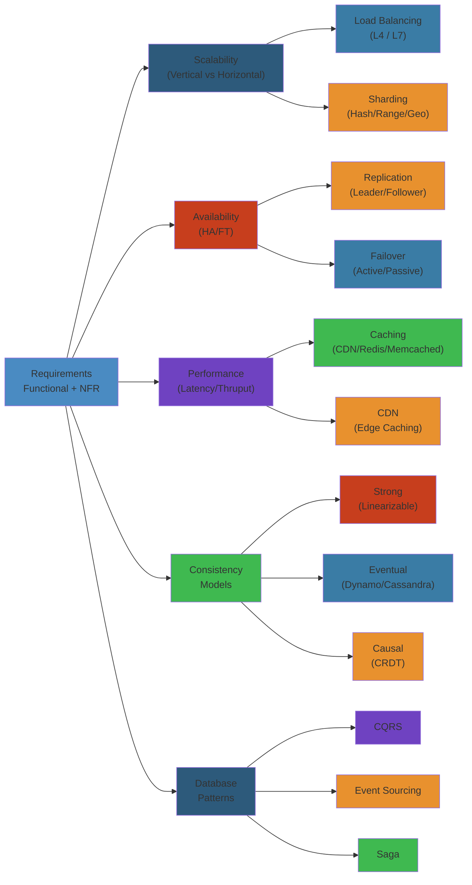
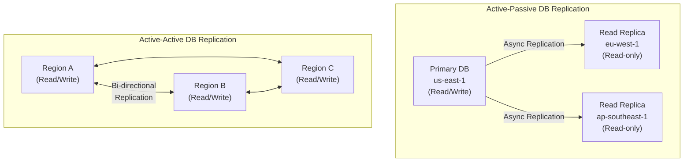

# 🏛️ System Design Principles — Complete Deep Dive




## 📋 Table of Contents
- [Scalability](#scalability)
- [Availability](#availability)
- [Performance](#performance)
- [Reliability](#reliability)
- [Consistency Models](#consistency-models)
- [Caching Strategies](#caching-strategies)
- [Database Patterns](#database-patterns)
- [Simplest Mental Model](#simplest-mental-model)

---

## Scalability

### Vertical vs Horizontal

```text
Vertical Scaling (Scale Up):     Horizontal Scaling (Scale Out):
+---------------------+          +---------------------+
|  Big Server         |          |  Server A | Server B|
|  CPU: 128 cores     |          |  (small)  | (small) |
|  RAM: 2TB           |          +----------+----------+
|  Disk: 100TB SSD    |                 |        |
+---------------------+          +-------+-+  +-+-------+
                                 |  Load Balancer |       |
  Limits: single machine ceiling +----------------+       |
  Cost: exponential $$$/perf             |                |
  SPOF: yes                              v                |
                                     [Users]             ...

  Limits: theoretically infinite, but adds complexity
  Cost: linear $/perf (usually)
  SPOF: no (with proper replication)
```

#### Step-by-Step: Horizontal Scaling Architecture

1. **Make services stateless** — Move session/state to Redis or database
2. **Add load balancer** — Distribute requests across servers (round-robin, least connections, etc.)
3. **Use sticky sessions cautiously** — Only when necessary (gaming, WebSocket); prefer stateless
4. **Replicate data** — Every server should access same database via read replicas
5. **Monitor per-server metrics** — CPU, memory, network per instance to catch uneven distribution

#### Code Example: Load Balancing Decision

```python
# Nginx config for horizontal scaling
upstream api_servers {
    # Hash by user_id to ensure same user hits same server (session affinity)
    # But best practice: store session in Redis instead
    round_robin;  # Simple round-robin balancing
    
    server api1.internal:8000 weight=1;
    server api2.internal:8000 weight=1;
    server api3.internal:8000 weight=1;
    
    # If server fails, automatically skip it
    server api4.internal:8000 max_fails=3 fail_timeout=30s;
}

server {
    listen 80;
    location /api/ {
        proxy_pass http://api_servers;
        proxy_set_header X-Forwarded-For $remote_addr;
    }
}
```

#### Real-World Scenario

Twitter grew from 1 server to 1000+ servers. Early mistake: storing session state in-memory on each server. When load balancer sent user's next request to different server, session was lost (timeout). Switched to Redis for all session state. Now any server can handle any user's request. Reduced session-related bugs by 90%.

### Stateless Design for Horizontal Scaling

```python
# BAD: Stateful server — session stuck to this process
class BadSession:
    def __init__(self):
        self.sessions = {}  # local dict

    def handle_request(self, user_id, data):
        session = self.sessions.get(user_id)
        # ... process ...
        self.sessions[user_id] = session

# GOOD: Stateless — session stored externally
class GoodSession:
    def handle_request(self, user_id, data):
        session = redis.get(f"session:{user_id}")
        # ... process ...
        redis.set(f"session:{user_id}", updated_session)
```

#### Step-by-Step: Converting Stateful to Stateless

1. **Audit in-memory state** — Find all instance variables holding user/request data
2. **Move to external store** — Redis, database, or memcached (with TTL)
3. **Add correlation IDs** — X-Request-ID header for tracing across servers
4. **Test failover** — Kill one server mid-request, verify user session survives on different server
5. **Monitor state store** — Alert on Redis/database latency (state lookups on every request)

#### Code Example: Stateless Session Management

```python
from flask import Flask, request, jsonify
import redis
import json

app = Flask(__name__)
redis_client = redis.Redis(host='redis', port=6379)

@app.route('/login', methods=['POST'])
def login():
    user_id = request.json['user_id']
    password = request.json['password']
    
    # Verify password (simplified)
    if not verify_password(user_id, password):
        return {'error': 'Invalid credentials'}, 401
    
    # Store session in Redis (not in-memory)
    session_id = generate_session_id()
    session_data = {
        'user_id': user_id,
        'login_time': time.time(),
        'ip_address': request.remote_addr
    }
    redis_client.setex(
        f'session:{session_id}',
        3600,  # TTL: 1 hour
        json.dumps(session_data)
    )
    
    return {'session_id': session_id}

@app.route('/api/profile')
def get_profile():
    session_id = request.headers['Authorization'].split(' ')[1]
    
    # Retrieve session from Redis (works on any server)
    session_json = redis_client.get(f'session:{session_id}')
    if not session_json:
        return {'error': 'Session expired'}, 401
    
    session = json.loads(session_json)
    user_id = session['user_id']
    
    return {'user_id': user_id, 'profile': get_user_profile(user_id)}
```

#### Real-World Scenario

Airbnb's early architecture: Python Flask server stored session in-memory. When user made request during server deployment (graceful shutdown), session was lost. Booking flow interrupted mid-transaction. Switched to Redis: now even during deployments, users hit different servers and maintain session seamlessly. Reduced deployment-related complaints by 75%.

### Data Partitioning Strategies

```text
Hash-Based Partitioning:
  server = hash(key) % N
  Problem: N changes → most keys remap (massive migration)

Consistent Hashing:
  Keys and servers placed on a unit ring [0, 2^256 - 1]
  Key assigned to next server clockwise.
  On server add/remove: only neighbor keys remap.

  +------+    +------+     +------+
  |  S1  |    |  S2  |     |  S3  |
  | K-A  |    | K-B  |     | K-C  |
  +------+    +------+     +------+
     |            |            |
  S4 added: K-A moves to S4 (only S1's keys affected)

Range-Based Partitioning:
  Shard 1: users A-F
  Shard 2: users G-L
  Shard 3: users M-R
  Shard 4: users S-Z
  Problem: hotspots on skewed distribution (e.g., many "S" names)

Directory-Based Partitioning:
  Lookup table: key → shard
  Flexible but: SPOF (lookup service), extra hop
```

- **Sharding**: Horizontal partitioning across databases
- **Federation**: Split databases by function (user DB, orders DB, products DB)
- **Partition Tolerance**: System continues despite network partition (CAP theorem)

---

## Availability

### HA Configurations

```text
Active-Passive:                       Active-Active:
+--------+      +--------+            +--------+      +--------+
| Active |----->|Passive |            |Active A|<---->|Active B|
| (live) |      |(standby)|           |(writes)|      |(writes)|
+--------+      +--------+            +--------+      +--------+
     |                |                     |               |
     |<----health------                     |<--- replicate->
     |     check       |                    |               |
     |                 |                   \/              \/
Failover: promote passive to active
RTO: seconds (warm) - minutes (cold)

Multi-AZ (Availability Zone) = physically separate datacenter in same region
Multi-Region = geographically separate, active-passive or active-active
```

- **N+1 Redundancy**: N nodes required + 1 spare. Single node failure tolerated.
- **2N Redundancy**: Double capacity — full traffic handled even with N failures.
- **N+M Redundancy**: N required + M spares. Middle ground.
- **SPOF Elimination**: Redundant network links, power supplies, load balancers, database replicas.
- **Failover**: Automatic (health check → DNS swap/load balancer reconfig) vs Manual (human triggered).
- **Leader Election**: Raft, Paxos, Zab (ZooKeeper). Nodes vote for leader. Majority required.
- **Graceful Degradation**: Return limited functionality instead of crash (e.g., show cached data when DB is down).

### Health Checks

- **TCP Health**: SYN → SYN/ACK? → port open
- **HTTP Health**: `GET /health` → 200 OK? Application-level check (DB connection, queue reachable)
- **gRPC Health**: Health/Check RPC → SERVING status
- **Passive**: Monitor request failures (Envoy outlier detection)
- **Active**: Periodic probe from load balancer

---

## Performance

### Latency vs Throughput

```text
Latency = time for one request (ms)
Throughput = requests per second (RPS)

The relationship:
  concurrency = latency × throughput (Little's Law)

Fixed concurrency: high latency → low throughput
Parallel requests can hide latency but increase resource usage

Typical Latency Numbers (2025 hardware):
  L1 cache:      ~1ns
  L2 cache:      ~4ns
  L3 cache:      ~10ns
  DRAM:          ~100ns
  SSD (NVMe):    ~10-50µs
  Network (DC):  ~500µs
  Cross-region:  ~30-100ms
  HDD:           ~5-10ms
  TLS handshake: ~20-50ms (full)
```

### Tail Latency

```text
P50 = median latency (50th percentile)
P95 = 95% of requests faster than this
P99 = 99% of requests faster than this
P999 = 99.9% of requests faster than this

Importance: In large systems, the slowest few requests affect many users
  - 1000 servers, each serving 1000 requests: P999 affects 1M requests
  - Long tail = fan-in aggregation (many parallel services)
```

- **HOL Blocking**: One slow request blocks others in queue (HTTP/1.1 pipelining, TCP)
- **Timeouts**: Deadlines for external calls. Fast fail vs crash-in-progress
- **Retry Budget**: Limit total retries per window. Prevent retry storms (exponential backoff + jitter)
- **Load Shedding**: Drop excess requests gracefully (503 Service Unavailable with Retry-After)
- **Throttling**: Limit per-user/per-IP request rates
- **Backpressure**: Receiver signals sender to slow down (gRPC flow control, TCP receive window, queue limits)

---

## Reliability

### Fault Tolerance

```
Fault types:
  Physical:   Server crash, power loss, network cable cut
  Logical:    Bug, corrupted data, race condition
  Timeout:    Slow dependency, GC pause, deadlock
  Byzantine:  Arbitrary behavior (malicious node, bit flip)

Strategy:
  Tolerate = detect + isolate + recover
           = redundancy + health checks + circuit breakers + graceful degradation
```

### SLA / SLO / SLI

- **SLI** (Service Level Indicator): Measured metric. E.g., request latency, error rate, uptime.
- **SLO** (Service Level Objective): Target threshold. E.g., P99 latency < 200ms, 99.9% availability.
- **SLA** (Service Level Agreement): Contract with consequences (credits, penalties). Usually looser than SLO.
- **Error Budget**: 100% - SLO. E.g., 99.9% SLO = 0.1% error budget = ~8.76 hours downtime/year. Team can deploy during error budget surplus. Must stop deploying when budget exhausted.
- **Reliability Ladder**: Monitoring → Alerting → Incident Response → Postmortem → Preventative → Reliability Culture.
- **Chaos Engineering**: Netflix Chaos Monkey, Simian Army. Deliberately inject failures to test resilience.

---

## Consistency Models

### Consistency Spectrum

```text
Weaker Consistency ←─────────────────────────→ Stronger Consistency
     |                        |                        |
     v                        v                        v
Eventual  Causal   Read-Your-    Session   Monotonic  Strong/Linearizable
                    Own-Writes

                 Bounded Staleness (between eventual and strong)
                   - Time bound: e.g., < 30s lag
                   - Version bound: e.g., < N versions behind

Tradeoff: Strong consistency = higher latency, lower availability (CAP)
          Eventual consistency = higher availability, lower latency
```

- **Strong**: After write completes, all subsequent reads see it. Single-node DB reads, Paxos/Raft commit.
- **Eventual**: Given enough time without updates, all replicas converge. DNS propagation.
- **Causal**: Causally related writes seen in order. Concurrent writes can be seen in any order. Vector clocks.
- **Read-Your-Writes**: Client always sees its own writes. Session tokens, sticky sessions.
- **Session**: Within same session, read-your-writes + monotonic reads.
- **Monotonic Read**: Successive reads never see older version. If you read value v, all future reads return ≥ v.
- **Monotonic Write**: Writes by same client are applied in order. Prevents "lost updates."
- **Bounded Staleness**: Reads are guaranteed to be within K versions or T seconds of latest write.

---

## Caching Strategies

```python
# Cache-Aside (lazy loading) — most common
def get_user(user_id: str) -> User:
    user = redis.get(f"user:{user_id}")
    if user is not None:
        return deserialize(user)

    user = db.query(User).filter_by(id=user_id).first()
    redis.set(f"user:{user_id}", serialize(user), ex=3600)
    return user

# Write-Through
def write_user(user_id: str, data: dict):
    user = db.query(User).filter_by(id=user_id).update(data)
    redis.set(f"user:{user_id}", serialize(user), ex=3600)
    db.commit()

# Write-Around
def write_user(user_id: str, data: dict):
    db.query(User).filter_by(id=user_id).update(data)
    db.commit()
    # Write directly to DB, invalidate cache
    redis.delete(f"user:{user_id}")

# Write-Back (write-behind)
def write_user(user_id: str, data: dict):
    redis.set(f"user:{user_id}_pending", serialize(data))
    # Async: batch + flush to DB periodically

# Refresh-Ahead
def get_user(user_id: str) -> User:
    # Before TTL expires, proactively refresh from DB
    cached = redis.get(f"user:{user_id}")
    if cached.ttl < 60:  # refresh if expiring soon
        asyncio.create_task(refresh_user_cache(user_id))
    return deserialize(cached)
```

### Cache Eviction Policies

| Policy | Strategy | Best For |
|--------|----------|----------|
| LRU | Evict least recently used | General purpose, temporal locality |
| LFU | Evict least frequently used | Stable access patterns, popularity skew |
| FIFO | Evict oldest first | Simple, short-lived items |
| TTL | Evict after fixed time | Predictable staleness |
| 2Q | Two LRU queues (hot/warm) | Better than LRU for scans |
| ARC | Adaptive — balances LRU/LFU | Dynamic workloads |
| Clock | Approximate LRU (reference bits) | Memory-limited, scalable |

### Caching Challenges

- **Cache Stampede (Thundering Herd)**: Many requests miss simultaneously when cache expires → all hit DB. Use mutex (lock), request coalescing, early expiration + background refresh.
- **Hot Key**: Single key receives disproportionate traffic. Solution: hot key replication (multiple cache nodes hold copy), local cache (in-process), read replicas.
- **Stale Cache Serving**: Serve stale data while async-fetching fresh version (`stale-while-revalidate`). Tolerable for many workloads.
- **Cache Warming**: Pre-populate cache before traffic arrives (deployment, launch event).

---

## Database Patterns

### CQRS — Command Query Responsibility Segregation

```text
                   +--------------+
                   |  Client      |
                   +---+------+---+
                       |      |
                  Write|      |Read
                       v      v
              +-------------+----------------+
              | Command Bus |   Query Bus     |
              | (commands)  |   (queries)     |
              +------+------+-------+--------+
                     |               |
                     v               v
              +-----------+  +----------------+
              | Write DB  |  | Read Database  |
              | (normal-  |  | (denormalized, |
              |  ized)    |  |  indexed,      |
              +-----+-----+  |  cached)       |
                    |        +----------------+
                    |                ^
                    +----sync--------+
                    (eventual consistency)
```

### Event Sourcing

```python
# Event Store: append-only log of domain events
class AccountEventStore:
    def save_events(self, account_id: str, events: list[Event]):
        for event in events:
            sql = "INSERT INTO event_store (stream_id, version, event_type, data)"
            sql += " VALUES (?, ?, ?, ?)"
            db.execute(sql, [account_id, event.version, type(event).__name__, serialize(event)])

    def get_events(self, account_id: str) -> list[Event]:
        rows = db.query("SELECT * FROM event_store WHERE stream_id = ? ORDER BY version", [account_id])
        return [deserialize(r.event_type, r.data) for r in rows]

# Aggregate: rebuild state from events
class Account:
    def __init__(self):
        self.balance = 0
        self.version = 0

    def apply(self, event: Event):
        match event:
            case Deposited(amount=amount): self.balance += amount
            case Withdrawn(amount=amount): self.balance -= amount
        self.version += 1

# Projection: read model built from events
class AccountBalanceProjection:
    def on_deposited(self, event):
        sql = "UPDATE account_balances SET balance = balance + ? WHERE id = ?"
        db.execute(sql, [event.amount, event.account_id])

    def on_withdrawn(self, event):
        sql = "UPDATE account_balances SET balance = balance - ? WHERE id = ?"
        db.execute(sql, [event.amount, event.account_id])
```

- **Snapshot**: Periodically save aggregate state. Rebuild from snapshot + events after it.
- **Event Versioning**: New event fields over time. Use upcasting (migrate old events on read).
- **SAGA**: Distributed transaction pattern. Each step publishes event that triggers next step. Compensating transactions on failure.
- **Outbox Pattern**: Write to event outbox table in same DB transaction as business data. Reliable publisher reads outbox → message broker.
- **Database-per-service**: Each microservice owns its DB. No sharing.
- **Shared Database**: Multiple services share same DB. Simpler but couples schema changes.

---

## Global & Multi-Region Architecture

Designing systems that span geographic regions for availability, latency, and data residency.

### Active-Active vs Active-Passive

| Aspect | Active-Passive | Active-Active |
|--------|---------------|---------------|
| Write location | Single region | All regions |
| Read location | All regions (replicas) | All regions |
| Failover time | Minutes (promote replica) | Instant (no failover needed) |
| Data loss risk | Replication lag | Conflict resolution needed |
| Cost | Lower (standby can be scaled down) | Higher (full capacity everywhere) |
| Complexity | Lower | Higher (conflict handling, CRDTs) |
| Best for | Compliance, simpler apps | Global low-latency apps |

```text
Active-Passive Failover Sequence:
  Normal:     Users → Route53 → us-east-1 (primary) → RDS primary
              Users → Route53 → eu-west-1 (read replica) → RDS replica (read-only)
  
  Failover:   Detect health check failure
              Promote RDS replica to standalone
              Update Route53 to point all traffic to eu-west-1
              Scale up eu-west-1 compute to full capacity

  RTO: 2-10 minutes (DNS TTL + health check + promotion)
  RPO: < 1 minute (async replication lag)
```

### Global Traffic Routing Patterns

```
Anycast Routing:
  Single IP advertised from multiple locations
  BGP routes users to nearest healthy location
  Sub-second failover (BGP convergence)
  Providers: AWS Global Accelerator, Cloudflare, Google Cloud LB
  Best for: TCP/UDP, gaming, real-time comms

DNS-Based Routing:
  Route53/Cloud DNS returns IP based on:
    - Latency: Lowest latency region
    - Geolocation: User's physical location
    - Weighted: Percentage-based traffic split
    - Failover: Primary → secondary on health check failure
  DNS TTL limits failover speed (30s – 5 min typical)
  Best for: HTTP APIs, web apps, static content

GSLB (Global Server Load Balancing):
  Dedicated appliances monitoring multi-region health
  Combines DNS + health probes + traffic steering
  Advanced features: load capacity, proximity, persistence
  Providers: F5 GTM, Citrix NetScaler, Azure Traffic Manager
```

### Geo-Replication Strategies



| Database | Active-Passive | Active-Active | Conflict Resolution |
|----------|---------------|---------------|---------------------|
| DynamoDB | Global Tables | Yes | Last-writer-wins |
| Cosmos DB | Multi-region writes | Yes | LWW, Custom, CRDT |
| Spanner | N/A (always multi-region) | Yes | True time + Paxos |
| CockroachDB | N/A | Yes | CRDT-based |
| RDS/Aurora | Cross-region replicas | Not natively | LWW (on failover) |
| Cassandra | N/A | Yes | LWW, Timestamp |

### Multi-Region Kubernetes

```yaml
# Cluster API: manage k8s clusters across regions
apiVersion: cluster.x-k8s.io/v1beta1
kind: Cluster
metadata:
  name: prod-eu-west
spec:
  clusterNetwork:
    pods:
      cidrBlocks: ["10.1.0.0/16"]
    services:
      cidrBlocks: ["10.0.0.0/16"]
  infrastructureRef:
    apiVersion: infrastructure.cluster.x-k8s.io/v1beta1
    kind: AWSCluster
    name: prod-eu-west

---
# ApplicationSet: deploy same app to all clusters
apiVersion: argoproj.io/v1alpha1
kind: ApplicationSet
spec:
  generators:
  - clusters:
      selector:
        matchLabels:
          region: production
  template:
    spec:
      source:
        repoURL: https://github.com/org/infra
        path: apps/checkout
      destination:
        server: '{{ server }}'
        namespace: checkout
```

### CDN & Edge Computing

```
CDN Cache Architecture:
  Browser → Edge POP (Cache L1) → Regional POP (Cache L2) → Origin
  
  Cache HIT: 5-20ms (edge → user)
  Cache MISS: 50-200ms (edge → origin, depending on region)
  
  Cache strategies:
    - Static assets: Long TTL (1y), invalidate on deploy
    - API responses: Short TTL (30s), stale-while-revalidate
    - Dynamic content: No cache / edge compute
    - Signed URLs/Cookies: Private content delivery

Edge Computing:
  Lambda@Edge (AWS):   Node.js/Python, 1-5ms startup
  CloudFront Functions: JS-only, sub-ms startup, 10KB limit
  Cloudflare Workers:  V8 isolates, 0-5ms cold start
  Fastly Compute@Edge: Wasm, Rust/Go/JS, 50μs cold start
  Akamai EdgeWorkers:  V8, JS, sub-ms startup
```

### Production Considerations for Multi-Region

- **Cross-region latency**: Map realistic latency numbers (see table below)
- **Data egress costs**: Moving data between regions costs $0.02–$0.12/GB
- **Consistency guarantees**: Document what each service guarantees
- **Compliance**: GDPR (data stays in EU), CCPA, sovereign clouds
- **Failover testing**: Run Game Days that kill an entire region
- **Observability**: Trace across regions, aggregate logs centrally
- **Configuration**: Per-region config (feature flags, quotas) via ConfigMaps

| Region Pair | Latency (P99) | Bandwidth Cost |
|-------------|---------------|----------------|
| us-east-1 → us-west-2 | ~35ms | $0.02/GB |
| us-east-1 → eu-west-1 | ~75ms | $0.09/GB |
| us-east-1 → ap-southeast-1 | ~200ms | $0.12/GB |
| us-east-1 → sa-east-1 | ~150ms | $0.15/GB |

### Cross-References

| Related File | Connection |
|-------------|-----------|
| [Cloud Disaster Recovery](../05-cloud/README.md#disaster-recovery) | RPO/RTO, backup strategies, DR patterns |
| [SRE Disaster Recovery](../14-sre-observability/README.md#disaster-recovery) | DR testing, chaos engineering, runbooks |
| [Argo CD Multi-Cluster](../06-devops/ci-cd/02-argo-gitops-deployment-automation.md) | ApplicationSet, multi-cluster GitOps |
| [Service Mesh Multi-Cluster](../16-microservices/01-architecture-patterns.md) | Multi-cluster mesh, cross-region service discovery |

---

## Simplest Mental Model

> **System design is building a restaurant empire.**
>
> - **Vertical Scaling** = Bigger kitchen with more stoves. Hits ceiling when you can't fit more equipment.
> - **Horizontal Scaling** = More restaurant locations. Each location handles its own customers. Requires coordination between kitchens.
> - **Load Balancer** = The host at the door who knows which tables are free (round-robin), which waiters have fewer customers (least connections), or who served you last time (sticky sessions).
> - **Caching** = Your go-to menu items that are pre-made (CDN = pre-made at every location, Redis = ingredients ready in the back, database = full inventory in the warehouse).
> - **Cache Eviction** = Running out of prep space — must decide: discard oldest (LRU), least popular (LFU), or about-to-expire (TTL).
> - **Consistency Models** = How quickly the menu prices update across all locations after a price change. Strong = all menus updated before anyone sees them (slow but accurate). Eventual = some customers might see old prices for a bit (fast but temporarily inconsistent).
> - **CAP Theorem** = You can have a perfectly up-to-date menu (consistency), keep serving during a phone outage (partition tolerance), or stay open continuously (availability) — pick two.
> - **CQRS** = Separate order-taking (writes) from menu display (reads). Different systems optimized for each.
> - **Event Sourcing** = Keep the complete receipt tape. Any state can be reconstructed by replaying all transactions from day one.
> - **SAGA** = A multi-step order with compensating actions: if dessert fails, the main course order is automatically refunded.

## Related

- [Cap Consistency](09-distributed-systems/01-cap-consistency.md)
- [Consensus Replication](09-distributed-systems/01-consensus-replication.md)
- [Consensus Raft](09-distributed-systems/02-consensus-raft.md)
- [Distributed Transactions](09-distributed-systems/02-distributed-transactions.md)
- [Distributed Caching](09-distributed-systems/03-distributed-caching.md)
- [Distributed Storage](09-distributed-systems/03-distributed-storage.md)
