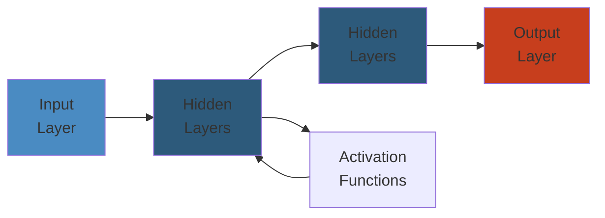

# 📱 Design WhatsApp — Complete System Design Deep Dive

> **Scope**: Requirements (2B users, 100B messages/day, multi-device, E2EE), architecture (connection management, message flow, group chat, multi-device sync, E2EE with Signal Protocol, media sharing, presence, push notifications, database, scaling strategy), failure analysis (connection storms, hot databases, group explosion).
>
> **Related**: [02-netflix.md](./02-netflix.md)




## Table of Contents

1. Requirements & Scale
2. High-Level Architecture
3. Connection Management
4. Message Flow
5. Group Chat Architecture
6. Multi-Device Support
7. End-to-End Encryption
8. Media Sharing
9. Presence Service
10. Push Notifications
11. Database Design
12. Scaling Strategy
13. Failure Analysis
14. Performance Considerations

---

## 1. Requirements & Scale

```text
WhatsApp Scale (2024):
  - 2B+ monthly active users
  - 100B+ messages per day (~1.2M/sec peak)
  - 10M+ concurrent connections per region
  - Multi-device: up to 4 devices per account
  - Media: 4.5B+ photos/day, 1B+ videos/day
  - 65B+ messages/day in groups only

Key Requirements:
  - Reliable delivery (at least once)
  - End-to-end encrypted
  - Multi-device with independent encryption
  - Low latency (< 1s for delivery)
  - High availability (99.99%)
  - Battery-efficient (mobile-first)
```

---

## 2. High-Level Architecture

```text
+-------------+     +----------------+     +-------------+
|   Client    |<--->| Connection     |<--->| Message     |
| (WebSocket/ |     | Manager        |     | Router      |
|  TCP )      |     | (100K/box)     |     |             |
+-------------+     +-------+--------+     +------+------+
                             |                      |
                             v                      v
                    +--------+--------+     +-------+-------+
                    | Presence Service|     | Message Store |
                    | (Redis pub/sub) |     | (Cassandra)   |
                    +-----------------+     +-------+-------+
                                                      |
                    +-----------------+               |
                    | Media Server    |               |
                    | (S3 + CDN)      |               |
                    +-----------------+               |
                                                      |
                    +-----------------+               |
                    | Group Server    |               |
                    | (fan-out ctl)   |               |
                    +-----------------+               |
                                                      |
                    +-----------------+               |
                    | Push Notif.     |               |
                    | (FCM/APNs)      |               |
                    +-----------------+               |
```

**Components:**
- **Connection Manager:** Frontend servers managing persistent connections (WebSocket/TCP). Connection affinity for session state.
- **Message Router:** Routes messages to correct connection manager (if online) or to push notification service (if offline).
- **Message Store (Cassandra):** Wide-row per conversation. Messages stored in chronological order per thread.
- **Group Server:** Manages group state, membership, fan-out logic.
- **Media Server:** Handles upload/download, transcoding, CDN distribution.
- **Presence Service:** Pub-sub per user for online/last-seen/typing indicators.
- **Push Notification:** Handles FCM (Android), APNs (iOS) delivery.

---

## 3. Connection Management

```text
Client                   Connection Manager (CM)
  |                             |
  |--- TCP Connect / WebSocket->|
  |<--- Session Created --------|
  |--- Auth Request ----------->|
  |<--- Auth Token + Session ---|
  |                             |
  |--- Heartbeat (per min) ---->|
  |<--- Heartbeat ACK ----------|
  |                             |
  |--- Message Send ----------->|
  |                             |--- Route to recipient's CM
  |<--- Delivery ACK -----------|
```

**Long-Lived TCP:** Persistent TCP connection for mobile (battery-aware). Adaptive heartbeat based on mobile OS state (background/foreground).

**WebSocket:** For desktop/web clients. Simpler, HTTP-upgrade based.

**Connection Multiplexing:** Multiple clients (phone, desktop, web) share same user account. Each device has its own connection.

**Session Affinity:** Connection hashed to specific Connection Manager via consistent hashing over user ID. Reconnection restores same session.

**Adaptive Heartbeat Strategy:**
- Foreground: 60s heartbeat
- Background: 120-300s heartbeat
- Adaptive: detect network state, adjust frequency

**Reconnection with Exponential Backoff:**
```
retry_delay = min(base * 2^attempt + jitter, MAX_BACKOFF)
base = 1s, MAX_BACKOFF = 60s
jitter = random(0, base)
```

**Ephemeral vs Persistent Sessions:**
- Sessions are ephemeral (lost on disconnect) for mobile.
- Desktop sessions are persistent (survive reconnect).

---

## 4. Message Flow

```text
Sender                    Connection Manager (Sender's)
  |                             |
  |--- Send message to Bob ---->|
  |                             |--- Check: Is Bob online?
  |                             |       v
  |                             |  +------------+
  |                             |  | Presence   |
  |                             |  | Service    |
  |                             |  +------------+
  |                             |
  |              /--- Online: Route to Bob's CM -----\
  |             /                                     \
  |            v                                       v
  |    Bob's Connection Manager                 Push Notification
  |             |                                     |
  |    [if Bob connected]                     [if Bob offline]
  |             |                                     |
  |             v                                     v
  |      WebSocket/TCP send                   FCM/APNs notify
  |             |                                     |
  |     Delivery ACK to sender                Bob reconnects:
  |     (sender sees ✓)                    CM fetches from store
  |
  |--- Sender's CM stores message to conversation ---> Cassandra
```

**Delivery States:**
```
Sent (✓)        = message delivered to recipient's device
Delivered (✓✓)  = message displayed on recipient's device
Read (blue ✓✓)  = message opened by recipient
```

**Message ID:** Unique 64-bit ID (timestamp + device ID + sequence). Monotonically increasing per device.

**Message Store Write:**
```text
Cassandra schema:
  conversation_id (partition key)
  message_id (clustering key, sorted)
  sender_id, content, type, timestamp
  delivery_acks: map<device_id, status>
```

TTL based on message retention policy (default: messages stored until all devices synced).

---

## 5. Group Chat Architecture

```text
Group Types:
  Small groups (< 256): fan-out on write
  Large groups (256+): fan-out on read

Small Group Fan-Out (Write):
  Sender -> Group Server -> Insert message once in group conversation
                          -> Identify online members
                          -> Forward to each member's CM concurrently
                          -> Push notify offline members
                          -> ACK: when all online members acknowledged

Large Group Fan-Out (Read):
  Sender -> Group Server -> Insert message in group log
  Members -> Poll group log on reconnect / periodic fetch
  No per-member fan-out at send time
```

**Group State in Memory:**
- Membership list (cached in Redis / Group Server memory)
- Group metadata (name, icon, description, admin list)
- Group settings (who can send, who can edit info)

**Group Partition (>256 members):**
- Groups over 256 members use broadcast lists approach
- Messages stored once per partition
- Members assigned to partition based on user ID hash

**Group Nesting:** No real nesting, but parent group can have linked groups (sub-groups) for topic-based channels.

**Group Fan-Out Optimization:**
```text
Group of 500 members, 200 online, 300 offline.

Fan-out on write for 200 online:
  - 200 concurrent pushes to CMs
  - Batch into groups of 50 per batch
  - Async continuation (don't block on slow CM)

Offline: 1 push notification (notify group, not per-sender).
```

---

## 6. Multi-Device Support

```text
Account: +1-555-1234
  |
  |-- Phone (primary identity)
  |-- WhatsApp Desktop (linked)
  |-- WhatsApp Web (linked)
  |-- WhatsApp iPad (linked)

Each device has:
  - Device-specific identity key pair
  - Device-specific signed pre-key
  - Independent session with every contact
```

**Multi-Device Architecture (since 2021):**

```text
Phone                    Server                    Desktop
  |                        |                        |
  |--- Link device ------->|                        |
  |                        |--- Auth challenge ---->|
  |<-- Challenge answer ---|                        |
  |                        |<-- Device registered --|
  |                        |                        |
  |                        |                        |
  |--- Message to Alice -->|                        |
  |                        |--- Encrypt per device -> Alice's phone
  |                        |--- Encrypt per device -> Alice's desktop
  |                        |                        |
```

**Key Features:**
- Phone does NOT need to be online for other devices to work
- Each device maintains independent encryption sessions
- Message history sync on new device (from existing devices, not server)

**Sender Keys:** Each device generates a sender key per conversation. Sender key shared with other user's devices via pairwise encrypted channel.

**Message History Sync:** When new device links, existing devices send encrypted message history to new device via server-relayed encrypted messages.

---

## 7. End-to-End Encryption

**Signal Protocol Components:**

```text
+---------------------+     +---------------------+
|     X3DH           |     | Double Ratchet      |
| (Key Agreement)    |-->  | (Continuous Key     |
|                    |     |  Derivation)        |
| Establishes initial|     | Handles messaging   |
| session key        |     | keys evolve per msg |
+---------------------+     +---------------------+
```

**X3DH (Extended Triple Diffie-Helmann):**

```text
Alice                                      Server
  |                                          |
  |--- Request Bob's pre-key bundle -------->|
  |<-- Bob's identity key + signed pre-key --|
  |    + one-time pre-keys                   |
  |                                          |
  Alice computes shared secret = DH(IK_A, SPK_B)
                               + DH(EK_A, IK_B)
                               + DH(EK_A, SPK_B)
                               + DH(EK_A, OPK_B)  [if available]
  |
  Alice sends initial message with:
    - Alice's identity key
    - Alice's ephemeral key
    - Which one-time pre-key used
```

**Double Ratchet:**

```text
Initial Key -> root key chain
                    |
   +----------------+----------------+
   |                                 |
   v                                 v
 Root key ratchet              Root key ratchet
   |          (DH ratchet)          |
   v                                v
 Sending chain key            Receiving chain key
   |          (KDF chain)           |
   v                                v
 Per-message key              Per-message key
   |          (derived by           |
   |           chain key + counter) |
   v                                v
 Ciphertext (AES-256-GCM)     Decrypted message
```

**Session Initialization:**
1. Alice fetches Bob's pre-key bundle from server
2. X3DH computes initial shared secret
3. Double Ratchet initialized with shared secret
4. Session state stored locally (not on server)
5. Server cannot read messages (authe none)

**Server's Role in E2EE:**
- Pre-key store (deliver pre-key bundles on request)
- Queued message store (deliver messages when recipient offline)
- No encryption/decryption capability

---

## 8. Media Sharing

```text
Sender                   Media Server              Recipient
  |                          |                        |
  |--- Upload encrypted ---->|                        |
  |    media + thumbnail     |                        |
  |<-- Media ID + URL -------|                        |
  |                          |                        |
  |--- Send message with --->|                        |
  |    media ID + metadata  |                        |
  |                          |                        |
  |                          |--- Notify recipient -->|
  |                          |                        |
  |                          |<--- Download request --|
  |                          |--- Encrypted stream -->|
```

**Media Flow:**
1. Sender encrypts media (AES-256-CBC) with random key
2. Upload encrypted blob to blob store (S3)
3. Generate thumbnail (also encrypted)
4. Send message with: media ID, encryption key (encrypted with Double Ratchet), hash, size
5. Recipient decrypts message -> fetches encrypted blob -> decrypts with key

**CDN Distribution:** Media served via CDN. Edge caching for popular media. Pre-fetching on message receipt.

**Progressive Loading:** Video/images load progressively (chunked download). Low-res thumbnail first, full-res on tap.

**Transcoding:** Server-side (optional, for compatibility). Original encrypted, can't transcode without key -> client-side transcoding or pre-transcoded on sender device.

**Media Retention:** Encrypted media stored in S3 with TTL (30 days default if not downloaded). On download, extend retention.

---

## 9. Presence Service

```text
Client                    Presence Service (Redis)
  |                             |
  |--- Set status: online ----->|
  |--- Subscribe to Alice's --->|  (pub/sub)
  |    presence                 |
  |                             |
  |              Alice connects:
  |<--- Alice now online -------|
  |                             |
  |--- Set typing: Bob -------->|
  |<--- Bob is typing ----------|
```

**Pub-Sub per User:** Each user has a presence channel. Subscribers notified on state change.

**Online/Last Seen/Status:**
- Online: currently connected to CM
- Last seen: timestamp of last connection (updated on disconnect)
- Status: set by user (text or emoji)

**Throttling:**
- Typing indicators: max 1 per 5 seconds per user
- Status updates: max 1 per 30 seconds per user
- Presence flood prevention: rate limit per connection

**Privacy Controls:**
```text
Last Seen:  Nobody | My Contacts | Everybody
Profile Photo: Nobody | My Contacts | Everybody
About:        Nobody | My Contacts | Everybody
Read Receipts: On | Off (mutual)
```

---

## 10. Push Notifications

```text
WhatsApp Server              FCM/APNs                    Mobile Client
     |                          |                             |
     |--- Push payload --------->|                             |
     |   (encrypted)             |--- Deliver to device ------>|
     |                           |                             |
     |                           |             [App processes]
     |                           |                             |
     |                           |<--- Delivery ACK -----------|
     |<-- Notification delivered-|                             |
```

**Payload:**
```text
Android (FCM):   { "data": { "msg_id": "...", "key": "...", "encrypted_content": "..." } }
iOS (APNs):      { "aps": { "alert": "New message", "content-available": 1 }, "msg_id": "..." }
```

**Encrypted Notifications:** iOS requires user notification content to be displayed. On older versions, WhatsApp couldn't display encrypted content. Newer iOS: notifications can show sender name only, not message content.

**Notification Grouping:** Multiple messages in a conversation grouped into one notification.

**Waking from Push:** When push received, app connects via TCP/WebSocket, fetches pending messages.

**Fallback Push:** If device doesn't respond to push, retry with exponential backoff. After N retries, mark as "delivery failed" (notify sender as not delivered).

---

## 11. Database Design

**Cassandra for Messages:**
```text
Table: messages
  conversation_id (text)       -- partition key
  message_id (timeuuid)        -- clustering key (sorted)
  sender_id (text)
  content_type (int)
  content (blob)               -- encrypted
  metadata (map<text, text>)
  created_at (timestamp)
  device_info (map<text, text>)

PRIMARY KEY (conversation_id, message_id)
WITH CLUSTERING ORDER BY (message_id DESC)
```

**Conversation Types:**
```text
1-to-1 conversation: conversation_id = hash(user_a_id + user_b_id) [sorted]
Group conversation: conversation_id = group_id
Broadcast: conversation_id = broadcast_list_id
```

**Redis for:**
- Session state (per-connection metadata)
- Presence data (online/last seen/typing)
- Pre-key bundles (one-time and signed pre-keys)
- Rate limit counters
- Push notification tokens

**Bloom Filter for User Existence:**
- Check if phone number is registered before sending
- Fast existence check without hitting Cassandra
- False positives acceptable (check Cassandra on miss)

---

## 12. Scaling Strategy

```text
Global Deployment: Regional Clusters

Region: US-East
  [Connection Manager Pool]    [Message Store (Cassandra ring)]
  [Presence Service (Redis)]   [Media Store (S3 US-East)]

Region: EU-West
  [Connection Manager Pool]    [Message Store (Cassandra ring)]
  [Presence Service (Redis)]   [Media Store (S3 EU-West)]

Cross-Region:
  TCR (Tier 1: Within region)
  TCR (Tier 2: Cross-region relay for inter-region messages)
```

**Connection Manager Scaling:**
- Horizontal: Add more CM boxes (consistent hashing for user affinity)
- Each CM: 100K concurrent connections
- Session affinity: user maps to CM via hash(user_id) % CM_count
- On CM failure: rehash to other CMs (users reconnect)

**Database Sharding:**
- Shard key: conversation_id
- N shards (e.g., 1024 logical shards on N physical nodes)
- Hot conversation (popular group): split into sub-conversations (prefix key)
- Rebalance: partial migration (not full rebalance)

**CDN for Media:**
- Media uploaded to nearest region
- CDN edge caches popular media
- Cross-region media: replicate to destination region's CDN

**Bloom Filters for Scaling:**
```text
When sender sends to a recipient:
  1. Check Bloom Filter: "Is user registered?"
  2. If yes -> look up recipient's current CM assignment
  3. If no  -> return "phone not on WhatsApp"

Bloom Filter (1% false positive) -> 1MB for 10M users (vs 100MB hash set)
```

---

## 13. Failure Analysis

**Connection Storm on Reconnection After Downtime:**
```text
Problem: After 5-minute outage, 100M clients reconnect simultaneously.
  - Connection Managers overwhelmed (SYN flood, handshake)
  - Message Router overloaded by offline-queue drain
  - Cassandra write path saturated by stored messages

Mitigations:
  - Exponential backoff: 1s, 2s, 4s, ... (jittered)
  - Random delay: client waits random(0, 30s) before reconnect
  - Thundering herd protection: connection priority by last active
  - Connection Manager auto-scale (pre-provisioned headroom)
  - Rate limit incoming connections: accept 100K/sec, queue rest
```

**Database Hotspot (Celebrity User):**
```text
Problem: Famous person receives millions of messages within minutes.
  - Single conversation ID becomes hotspot
  - Cassandra partition overloaded (all messages to same partition)
  - Other conversations on same node impacted

Mitigations:
  - Split hot conversation: pre-create sub-conversations
    conversation_id = hash(user_a + user_b) + ":" + sub_partition
  - Client-side routing: distribute writes to sub-partitions
  - Dynamic: detect hotspot, split at runtime
```

**Message Loss Scenarios:**
```text
Problem: Message sent but never delivered.

Mitigations:
  - Sender-side queue: message queued locally until delivery ACK
  - Delivery receipt: recipient must ACK (otherwise resend)
  - Message resend: sender retries if no ACK within N seconds
  - Idempotency: message ID prevents duplicates on receiver
  - Server-side store: message persisted before returning to sender
  - At-least-once delivery guaranteed (few duplicates, no loss)
```

**Group Fan-Out Explosion:**
```text
Problem: Group of 10,000 members. One message triggers 10,000 pushes.

Mitigations:
  - Limit group size (WhatsApp: 1024 max)
  - Fan-out on write only for online members (offline get push notification)
  - Fan-out on read for large groups
  - Group server throttling: max N concurrent fan-outs per group
```

**E2EE Key Exchange Failure:**
```text
Problem: Pre-key store exhausted (no one-time pre-keys left).

Mitigations:
  - Server generates new signed pre-keys periodically
  - Pre-key replenishment: client uploads batch of one-time keys when < threshold
  - Fallback: use signed pre-key alone (no one-time pre-key)
```

---

## 14. Performance Considerations

```text
Messages:
  - Median delivery latency: < 200ms (same region)
  - P99 delivery latency: < 2s
  - Group delivery (256 members): < 1s for online members

Throughput:
  - Connection Manager: 100K concurrent connections per box
  - Message Router: 50K messages/sec per box
  - Cassandra: 10K writes/sec per node (with RF=3)

Storage:
  - Message storage: 200 bytes average per message
  - 100B messages/day = 20TB/day (compressed: ~5TB)
  - 30-day retention: ~150TB
  - Media: 4.5B photos/day (average 50KB) = 225TB/day raw

Network:
  - Upload: 10Gbps per CM cluster
  - Download: 100Gbps per media CDN edge
```

---

## Simplest Mental Model

**WhatsApp is like a post office that never reads your letters.** The post office (server) knows who is home (online/offline), carries the letter to the right address, and knocks (push notification) if nobody answers. But the letters are in sealed armored envelopes (end-to-end encryption) — even the post office can't read them. Large groups are like mailing lists: either each letter is copied for every member (small group fan-out) or members check a bulletin board (large group fan-out).
