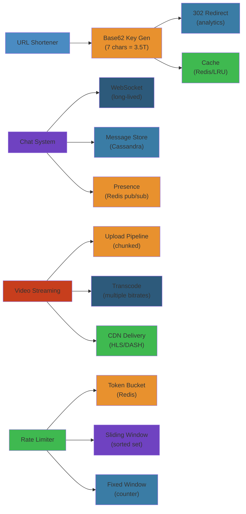

# 🏗️ System Design Blueprints — Complete Deep Dive




## 📋 Table of Contents


- [URL Shortener](#url-shortener)
- [Chat System](#chat-system)
- [Video Streaming Service](#video-streaming-service)
- [Rate Limiter](#rate-limiter)
- [Simplest Mental Model](#simplest-mental-model)

---

## URL Shortener


### Requirements


```
Functional:
  - Shorten long URL to 6-7 char key
  - Redirect to original (302 for analytics, 301 for perf)
  - Optional: custom alias, TTL, analytics

Non-Functional:
  - Read:write ≈ 100:1. 100M URLs/month → ~38 writes/s, ~3800 reads/s
  - Redirect < 10ms p99. 100% availability. URLs last forever.
```

### Key Generation


```python
BASE62 = "0123456789ABCDEFGHIJKLMNOPQRSTUVWXYZabcdefghijklmnopqrstuvwxyz"

def encode_base62(num: int) -> str:
    if num == 0: return BASE62[0]
    result = []
    while num > 0:
        result.append(BASE62[num % 62])
        num //= 62
    return ''.join(reversed(result))

# Snowflake ID (64-bit): 41b timestamp | 5b dc | 5b machine | 12b sequence
def snowflake_id(ts: int, dc: int, machine: int, seq: int) -> int:
    return (ts << 22) | (dc << 17) | (machine << 12) | seq
```

### Redirect Flow


```text
Browser                          URL Shortener
  |-- GET /abc123 ----------------------> | Cache lookup
  |                                       |   hit → return URL
  |                                       |   miss → DB → populate cache
  |<-- 301 Location: https://example.com  |

301 = permanent, browser caches, no analytics on repeat
302 = temporary, always hits shortener, enables click counting
```

### Data Model


```sql
CREATE TABLE urls (
    id BIGINT PRIMARY KEY, short_key VARCHAR(7) UNIQUE,
    original_url TEXT NOT NULL, user_id BIGINT,
    created_at TIMESTAMP DEFAULT NOW(), expires_at TIMESTAMP NULL
);
-- Sharding: hash(short_key) → consistent hashing
-- Bloom filter at cache layer rejects invalid keys fast
```

**bit.ly Architecture**: Snowflake IDs. Redis cache (50M entries). 301 for repeat visitors, 302 for first hit (track once). Data warehouse for analytics.

---

## Chat System


### Requirements


```
1:1: Real-time <100ms, persistent history, typing/read receipts, delivery status
Group: Up to 5000 members. Write fanout (small groups), read fanout (large).
Scale: 500M DAU, 100B msg/day → ~1.2M msg/s peak
```

### Architecture


```text
+--------+     WS     +----------+       +----------+
| Client |<---------->| Gateway  |<----->| Presence |
+--------+            +----------+       | Service  |
                            |            +----------+
                            |            +----------+
                            +----------->| Chat     |
                                         | Service  |
                                         +----------+

Connection Manager: WS + session(user_id, device_id). Heartbeat 30s, timeout 90s.
Reconnection: client sends last_message_id. Backpressure: drop if client lags.
```

### Message Flow


```python
def send_message(sender_id: str, receiver_id: str, content: str) -> Message:
    msg = Message(id=generate_sequential_id(), sender_id=sender_id,
                  receiver_id=receiver_id, content=content, status="sent")
    msg_db.store(msg, partition=hash_conversation(sender_id, receiver_id))

    conn = presence_service.get_connection(receiver_id)
    if conn:
        gateway.send(conn, msg); msg.status = "delivered"
    else:
        push_notification(receiver_id, msg)
    return msg
```

### Group Chat Fanout


```text
Small Group (≤500) — Write Fanout:
  Write 1 copy to group store. Read member list. Write 1 copy per online inbox.

Large Group (500-5000) — Read Fanout (Pull):
  Write 1 copy to group store. Members pull on reconnect (track last_read_id).

WhatsApp: ≤256 = write fanout, >256 = read fanout. Inbox per user (time-ordered).
```

### Presence Service


```text
Redis model:
  SET user:{id}:online → {conn_id_1, conn_id_2}
  STRING user:{id}:status → {"last_seen": ts, "status": "online|away|offline"}
  PUB/SUB presence:{id} → notify friends

Heartbeat 30s. No beat 90s→away, 300s→offline. Wait before marking offline (spotty).
```

### Message Ordering


- **Sequential ID per conversation**: Monotonic counter. Clients sort by ID.
- **HLC**: Physical time + logical counter. Causal ordering without full vector clocks.

---

## Video Streaming Service


### Encoding Pipeline


```text
Ingest → Transcode → Segment → Package → Deliver

                            Audio (AAC)
Raw Video ──┬─> 1080p ────┤
             ├─> 720p ─────┤── CMAF ──► HLS (.m3u8 + .ts)
             ├─> 480p ─────┤          └► DASH (.mpd + .m4s)
             ├─> 360p ─────┤
             └─> 240p ─────┤
```

### HLS


```text
# master.m3u8
#EXTM3U
#EXT-X-STREAM-INF:BANDWIDTH=5000000,RESOLUTION=1920x1080
high.m3u8
#EXT-X-STREAM-INF:BANDWIDTH=2500000,RESOLUTION=1280x720
medium.m3u8

# medium.m3u8
#EXTM3U #EXT-X-TARGETDURATION:6 #EXT-X-MEDIA-SEQUENCE:160
#EXTINF:6.000, segment_160.ts
#EXTINF:6.000, segment_161.ts
```

### DASH


```xml
<MPD type="dynamic" availabilityStartTime="2025-05-27T00:00:00Z">
  <Period id="1">
    <AdaptationSet mimeType="video/mp4">
      <Representation bandwidth="2500000" width="1280" height="720">
        <SegmentTemplate media="seg_$Number$.m4s" startNumber="160" duration="2"/>
      </Representation>
    </AdaptationSet>
  </Period>
</MPD>
```

### Adaptive Bitrate (ABR)


```python
def select_bitrate(throughputs: list[float], bitrates: list[int],
                   safety: float = 0.8) -> int:
    safe = sum(throughputs)/len(throughputs) * safety
    return max([b for b in bitrates if b <= safe] + [bitrates[0]])
```
- **Throughput-based**: Select highest bitrate ≤ 80% measured throughput.
- **Buffer-based (BOLA)**: Maintain 10-30s buffer. Growing → upgrade. Shrinking → downgrade.
- **Netflix Open Connect**: OCAs at ISPs. Custom NGINX + FreeBSD. Own CDN.
- **DRM**: Widevine, FairPlay, PlayReady. Signed URLs / cookies for CDN auth.

---

## Rate Limiter


### Algorithms


```python
# Token Bucket — most common
class TokenBucket:
    def __init__(self, capacity: int, refill_rate: float):
        self.capacity = capacity
        self.refill_rate = refill_rate  # tokens/sec
        self.tokens = capacity
        self.last_refill = time.time()

    def allow_request(self) -> bool:
        now = time.time()
        self.tokens = min(self.capacity,
                          self.tokens + (now - self.last_refill) * self.refill_rate)
        self.last_refill = now
        if self.tokens >= 1:
            self.tokens -= 1
            return True
        return False

# Sliding Window Counter — approximate, memory efficient, ~0.3% error
class SlidingWindowCounter:
    def __init__(self, limit: int, window_ms: int, sub_windows: int = 10):
        self.limit = limit
        self.subwindow_ms = window_ms // sub_windows
        self.counts = {}

    def allow_request(self, key: str) -> bool:
        now = time.time() * 1000
        curr_win = int(now / self.subwindow_ms)
        prev_win = curr_win - 1
        elapsed = now - curr_win * self.subwindow_ms
        weight = 1.0 - elapsed / self.subwindow_ms
        # Approximate = prev_count * weight + curr_count
        # ... increment if under limit
```

Other algorithms: **Fixed Window** (burst at boundary), **Sliding Window Log** (accurate but memory-heavy), **GCRA** (Cloudflare/Kong, O(1) per key).

### Distributed Rate Limiting


```text
Single-node Redis + Lua: atomic INCR + PEXPIRE. SPOF but accurate.
Local counters + periodic sync: faster, allows small bursts (drift = limit × sync_interval/window).
Consistent hashing → user mapped to fixed limiter node. Exact per-node, rebalancing cost.
```

### Headers & Layering


```http
200 OK:  X-RateLimit-Limit: 100  X-RateLimit-Remaining: 87  X-RateLimit-Reset: 1716825600
429 Too Many Requests:  Retry-After: 30  X-RateLimit-Remaining: 0
```

```text
Edge (IP/DDoS) → App (user/endpoint) → DB (connection pool)

Burst handling: short bursts to limit (token bucket), queue (limited), fail fast (429),
degraded response (stale data).
```

---

## Simplest Mental Model


> **These blueprints are specialized buildings to solve specific problems.**
>
> - **URL Shortener** = Coat check counter. Hand in long coat (URL), get ticket stub (short code). Return ticket → get coat. Stub lookup is fast (cache). Invalid tickets checked against a guest list (bloom filter). The counter never closes.
> - **Chat System** = Walkie-talkie network across a city. Each user has a base station (WebSocket). Gateways route messages. Small groups get messages forwarded to everyone (write fanout). Large groups check a bulletin board (read fanout). Presence service = live on/offline directory.
> - **Video Streaming** = Multi-format printing press. Upload photo, press produces wallet(240p), 4×6(480p), 8×10(720p), poster(1080p) all at once. Each format cut into strips (segments) and packed in envelopes (HLS/DASH). Local print shops stock popular sizes (CDN). Your phone picks the right size based on connection speed (ABR).
> - **Rate Limiter** = Club bouncer counting people per time window. Token bucket = bowl of tokens replenishing at fixed rate, need one to enter. Sliding window = exactly how many entered in last 60s. Distributed = multiple bouncers coordinating across doors. 429 = "Club is full, come back later."

---

## Code Examples


```python
import hashlib
import time
import redis
from collections import defaultdict

# ===== URL Shortener =====
BASE62 = "0123456789ABCDEFGHIJKLMNOPQRSTUVWXYZabcdefghijklmnopqrstuvwxyz"

class URLShortener:
    def __init__(self, redis_client):
        self.r = redis_client
        self.bloom = None  # Bloom filter for fast negative checks

    def shorten(self, url: str, custom: str = None) -> str:
        if custom:
            key = custom
        else:
            # Use a distributed ID (Snowflake) then encode
            key = self._encode(self._snowflake_id())
        self.r.set(f"url:{key}", url)
        self.r.setex(f"key:{url}", 86400, key)
        return key

    def resolve(self, key: str) -> str | None:
        # Bloom filter first — fast reject for invalid keys
        if self.bloom and not self.bloom.might_contain(key):
            return None
        url = self.r.get(f"url:{key}")
        if url:
            self.r.incr(f"stats:{key}")  # click count
        return url

    def _encode(self, num: int) -> str:
        if num == 0: return BASE62[0]
        result = []
        while num > 0:
            result.append(BASE62[num % 62])
            num //= 62
        return ''.join(reversed(result))

# ===== Rate Limiter: Token Bucket =====
class TokenBucket:
    def __init__(self, capacity: int, refill_rate: float):
        self.capacity = capacity
        self.refill_rate = refill_rate
        self.tokens = {}
        self.last_check = {}

    def allow(self, key: str, cost: int = 1) -> bool:
        now = time.time()
        last = self.last_check.get(key, now)
        elapsed = now - last
        self.tokens[key] = min(self.capacity,
                               self.tokens.get(key, self.capacity) + elapsed * self.refill_rate)
        self.last_check[key] = now
        if self.tokens[key] >= cost:
            self.tokens[key] -= cost
            return True
        return False

# ===== Chat: Message ordering =====
class Message:
    def __init__(self, sender: str, conversation: str, content: str):
        self.id = f"{int(time.time() * 1000)}-{hashlib.md5(content.encode()).hexdigest()[:6]}"
        self.sender = sender
        self.conversation = conversation
        self.content = content
        self.status = "sent"

def send_message(msg: Message, presence: dict, gateway) -> Message:
    store_conversation(msg.conversation, msg)
    conn = presence.get(msg.sender)
    if conn:
        gateway.send(conn, msg)
        msg.status = "delivered"
    return msg
```

```bash
# Test URL shortener
curl -X POST -d '{"url":"https://example.com/very/long/path"}' \
  -H "Content-Type: application/json" https://short.link/shorten

# Rate limiter test
for i in $(seq 1 120); do curl -s -o /dev/null -w "%{http_code}\n" https://api.example.com/endpoint; done
```

---

## Common Failure Modes


**Problem**: Cache inconsistency in URL shortener — user gets 404 for valid short URLs

**Root cause**: Write-through cache updates the DB before the cache is populated, and a concurrent read misses the cache and reads an empty DB (just before the write commits). Or cache eviction happens before the DB write is replicated to followers. This is known as the "thundering herd on miss" combined with "cache vs DB timing window."

**Detection**: Monitoring shows cache hit rate drops while DB read rate increases. P99 latency spikes from 5ms to 100+ms. Support tickets about "broken links" that work on retry.

**Solution**: Use write-around (write to DB, then invalidate cache) instead of write-through. Use lazy population: on cache miss, acquire a distributed lock before reading DB and populating cache — prevents thundering herd. Implement a bloom filter at the edge (CDN/API gateway) that tracks all valid keys — reject invalid keys immediately without touching cache or DB. For the timing window, use read-repair: when the DB read returns empty, double-check the primary DB (or wait for replication lag). Use consistent hashing to avoid hot caches.

**Problem**: Rate limiter drift in distributed mode leading to uneven throttling

**Root cause**: Distributed rate limiters using local counters drift apart. Each node tracks its own count and periodically syncs. Between syncs, a node allows requests based on local counts, but the global rate may exceed the limit by `limit × (sync_interval / window_size)`. During traffic bursts, this drift can allow 2x the intended rate.

**Detection**: Monitoring shows the actual request rate exceeding the configured limit by 20-50%. Tests hitting the API concurrently from different regions see inconsistent throttling — some requests get 200 while others get 429 for the same user.

**Solution**: Use Redis with Lua scripting for atomic rate limit checks — single source of truth. The Lua script increments and checks the count atomically: `local c = redis.call('INCR', key); if c == 1 then redis.call('PEXPIRE', key, window_ms) end; return c <= limit`. For lower latency, use a two-tier approach: local counters (fast path, allows small drift) with periodic reconciliation against Redis. Use consistent hashing so all requests for a given user hit the same node. Or use a sliding window log in Redis (accurate but more memory) instead of fixed window.

---

## Interview Questions


### Q1: Walk through the design of a URL shortener at scale (100M URLs/month).


**Answer**: **Requirements**: Generate a 6-7 character key per URL, redirect to original URL, support custom aliases, and track analytics. Read:write ratio is 100:1. **Key generation**: Use Snowflake IDs (41-bit timestamp, 10-bit node, 12-bit sequence = 4096 IDs/sec per node). Encode with Base62 → 7 chars covers 3.5T URLs. **Storage**: Write to a SQL DB (sharded by key hash) and populate Redis cache. **Read path**: User hits `/abc123`. API gateway routes to a cache instance (consistent hashing). Cache hit → return 301. Cache miss → bloom filter check (fast reject if key doesn't exist). If bloom says possible, query DB → populate cache → return. **Write path**: POST /shorten → validate URL → generate unique ID → check for collision in cache bloom filter → write to DB → populate cache → return short URL. **Scale**: Redis cluster (20 nodes), DB sharded by key hash (10 MySQL instances), bloom filter rebuilt nightly from DB dump. CDN (CloudFront) at edge caches frequently accessed redirects. Analytics pipeline streams click events to a message queue → batch write to a data warehouse.

### Q2: How would you design a real-time chat system supporting 500M users?


**Answer**: **1-to-1 chat**: WebSocket connections from clients to a Gateway layer (Elastic Load Balancer routing by user hash). Gateway maintains a connection map (user_id → connection_id). Messages go through a Chat Service that writes to a message DB (Cassandra, keyed by conversation_id + message_id) and checks the Presence Service to see if receiver is online. If online, push via Gateway. If offline, send push notification. **Group chat**: For groups < 256 members, use write fanout — write one message to the group's timeline, then copy to each online member's inbox. For groups > 256, use read fanout — write once to group timeline, members pull (track last_read_id). **Presence**: Redis with heartbeat — each user sets a key with TTL, PUB/SUB notifies friends of status changes. **Ordering**: Use HLC (Hybrid Logical Clock) for causal ordering without vector clocks. **Scaling**: Each component horizontally scales. Gateway is stateless. Chat Service partitions by conversation hash. Message DB uses Cassandra (time-series model). Inbox is Redis sorted sets per user. **Delivery guarantees**: At-least-once with idempotency keys (message UUID). Gap detection: receiver tracks last_message_id and requests missing ones.
