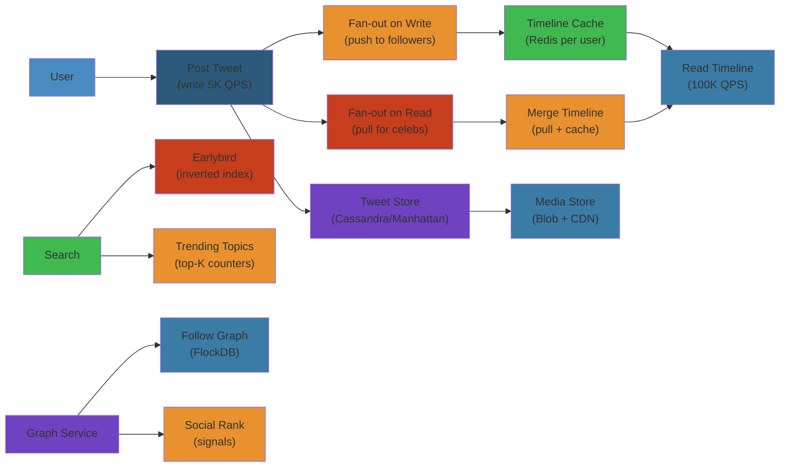

# 🐦 Design Twitter/X — Complete System Design Deep Dive

> **Scope**: Requirements (500M MAU, 500M tweets/day, 100K QPS read, 5K QPS write), tweet flow (post -> write -> fan-out -> timeline), timeline generation (fan-out on write (push) for small accounts, fan-out on read (pull) for celebrities), newsfeed ranking, search (Earlybird), trending topics, direct messages, graph service, failure analysis.
>
> **Related**: [02-netflix.md](./02-netflix.md) | [05-youtube.md](./05-youtube.md)




## Table of Contents


1. Requirements & Scale
2. High-Level Architecture
3. Tweet Flow
4. Timeline Generation
5. Timeline Data Model
6. Tweet Storage
7. Media/Photo Storage
8. Tweet Features (Retweet, Like, Reply, Quote)
9. Newsfeed Ranking
10. Search (Earlybird)
11. Trending Topics
12. Direct Messages
13. Graph Service
14. Failure Analysis
15. Performance Considerations

---

## 1. Requirements & Scale


```text
Twitter/X Scale (2024):
  - 500M+ monthly active users
  - 500M tweets per day (~6K/sec peak)
  - 100K+ read QPS (timeline fetches)
  - 5K+ write QPS (tweet posts)
  - 1B+ searches per day
  - P99 timeline read latency < 500ms

Key Requirements:
  - Low-latency timeline generation (< 500ms)
  - Real-time tweet delivery to followers
  - High availability (99.95%+)
  - Eventually consistent (timeline freshness acceptable within seconds)
  - Support for celebrities (100M+ followers)
  - Global deployment (multi-region)
```

---

## 2. High-Level Architecture


```text
+-----------+     +----------+     +----------+     +-----------+
|  Client   |<--->| API      |<--->| Tweet    |<--->| Timeline  |
| (App/Web) |     | Gateway  |     | Service  |     | Service   |
+-----------+     +----------+     +----+-----+     +-----+-----+
                                        |                 |
                                        v                 v
                                 +------+-----+     +-----+------+
                                 | Tweet Cache |     | Timeline   |
                                 | (Redis)     |     | Cache      |
                                 +------+------+     | (Redis SS) |
                                        |             +-----+-----+
                                        v                   |
                                 +------+------+            |
                                 | Cassandra   |            |
                                 | (Tweet      |            |
                                 |  Storage)   |            |
                                 +------+------+            |
                                        |                   |
                                        v                   v
                                 +------+------+     +-----+------+
                                 | Fan-Out     |     | Graph      |
                                 | Worker      |<--->| Service    |
                                 | (Kafka)     |     | (Pelops)   |
                                 +-------------+     +------------+
```

**Key Components:**
- **API Gateway:** Authentication, rate limiting, routing, request validation
- **Tweet Service:** Handles tweet creation, validation, spam detection, write to cache + DB
- **Timeline Service:** Generates home timeline feed (precomputed or on-demand)
- **Fan-Out Worker:** Async worker that pushes tweets to followers' timeline caches
- **Graph Service:** Manages follow graph (followers, following, friends, counts)
- **Search (Earlybird):** Real-time search index with Lucene-based reverse index
- **Trending Service:** Per-location trend detection with burst analysis

---

## 3. Tweet Flow


```text
Tweet Post Flow:

User          API Gateway      Tweet Service      Tweet Cache     Fan-Out Worker
  |                |                |                  |               |
  |-- POST tweet-->|                |                  |               |
  |                |-- Validate --->|                  |               |
  |                |   auth, spam   |                  |               |
  |                |                |-- Write tweet -->|               |
  |                |                |   to cache       |               |
  |                |                |                  |               |
  |                |                |-- Write to ----> |               |
  |                |                |   Cassandra      |               |
  |                |                |                  |               |
  |                |                |-- Enqueue fan-out task -------->|
  |                |                |                  |               |
  |<-- 201 OK -----|                |                  |               |
  |                |                |                  |               |
  |                |                |                  |   Fan-out worker:
  |                |                |                  |   1. Lookup followers from Graph Svc
  |                |                |                  |   2. For followers < 10K:
  |                |                |                  |      Write tweet_id to each follower's
  |                |                |                  |      timeline sorted set in Redis
  |                |                |                  |   3. For followers >= 10K (celebrity):
  |                |                |                  |      Write tweet_id to celebrity's
  |                |                |                  |      timeline cache only (fan-out on read)
```

**Fan-Out Decision:**
```text
IF follower_count < 10,000:
    Fan-out on write (push):
        For each follower:
            ZADD timeline:user:{follower_id} timestamp tweet_id
    -> Precomputed timeline for fast reads

IF follower_count >= 10,000:
    Fan-out on read (pull):
        ZADD timeline:user:{tweet_author_id} timestamp tweet_id
    -> On timeline read: merge celebrity tweets + personalized
```

**Tweet Cache Schema (Redis):**
```text
Key: tweet:{tweet_id}
Value: JSON { id, author_id, content, created_at, media_ids,
             retweet_count, like_count, reply_count }
TTL: 7 days (hot tweets), evicted by LRU
```

---

## 4. Timeline Generation


```text
Timeline Read Flow:

Client              Timeline Service           Timeline Cache         Graph Service
  |                       |                         |                     |
  |-- GET home_timeline-->|                         |                     |
  |                       |-- Check timeline ------->|                     |
  |                       |   cache for user         |                     |
  |                       |                         |                     |
  |         [Cache HIT]:  |<-- Precomputed feed -----|                     |
  |<-- Return feed ------|   (800 tweet_ids)        |                     |
  |                       |                         |                     |
  |         [Cache MISS]: |                         |                     |
  |                       |-- For heavy users:      |                     |
  |                       |   Get following list --->|-------------------->|
  |                       |                         |<-- Following list---|
  |                       |                         |                     |
  |                       |-- For each followed celeb (>10K followers):   |
  |                       |   ZREVRANGE timeline:user:{celeb_id} 0:199    |
  |                       |   -> Get celebrity's recent tweets            |
  |                       |                         |                     |
  |                       |-- For each followed small account:            |
  |                       |   ZREVRANGE timeline:user:{user_id} 0:199     |
  |                       |   -> Small accounts have push-based timelines |
  |                       |                         |                     |
  |                       |-- Merge & sort by timestamp                   |
  |                       |-- Rank & filter                               |
  |<-- Return feed ------|                         |                     |
```

**Timeline Generation Strategies:**

```text
Fan-out on write (push):
  + Precomputed per-user timeline in Redis sorted set
  + O(1) read: just fetch the precomputed list
  + Write cost: O(followers) per tweet
  - Celebrities with 100M followers => 100M writes per tweet
  - Wasted writes for inactive users

Fan-out on read (pull):
  + No precomputation: O(1) write cost
  + Read cost: O(following) celebrity timeline merges
  - Higher read latency for heavy users
  - Must merge N timelines on each read

Hybrid (Twitter's approach):
  | User Type          | Followers  | Fan-out Strategy          |
  |--------------------|------------|---------------------------|
  | Normal user        | < 10K      | Push (fan-out on write)   |
  | Celebrity          | >= 10K     | Pull (fan-out on read)    |
  | Inactive user      | any        | Pull (lazy migration)     |
```

---

## 5. Timeline Data Model


```text
Redis Sorted Sets for Timeline:

Timeline (per user - precomputed):
  Key:    timeline:user:{user_id}
  Member: tweet_id (64-bit integer)
  Score:  timestamp (milliseconds since epoch)
  Max:    800 most recent tweets (trimmed on insert)

Celebrity Timeline (for fan-out on read):
  Key:    timeline:celebrity:{author_id}
  Member: tweet_id
  Score:  timestamp
  Max:    800 tweets

Operations:
  Insert:  ZADD timeline:user:1234 1680000000000 98765
  Read:    ZREVRANGE timeline:user:1234 0 19 WITHSCORES
  Paginate:ZREVRANGE timeline:user:1234 20 39 WITHSCORES
  Trim:    ZREMRANGEBYRANK timeline:user:1234 0 -801
  Delete:  ZREM timeline:user:1234 98765

Memory Calculation:
  500M users x 800 tweet_ids (8 bytes each) = 500M x 6.4KB = ~3.2TB
  - Shard across 100 Redis nodes = ~32GB per node
  - Celebrities share cache (not per-user) => less
```

**Timeline Pagination:**
```text
Initial request: GET /v1/home_timeline?count=20
  Response: [tweet_ids...], cursor="next:1680000000000"

Next page: GET /v1/home_timeline?count=20&cursor=next:1680000000000
  ZREVRANGEBYSCORE timeline:user:1234 1679999999999 -inf LIMIT 20

Cursor-based pagination:
  - Cursor = timestamp of last tweet on current page
  - Avoids offset drift (tweets inserted between pages)
  - Consistent order even as new tweets arrive
```

---

## 6. Tweet Storage


```text
Cassandra Schema for Tweets:

Table: tweets
  user_id          (bigint)       -- partition key
  tweet_id         (timeuuid)     -- clustering key (desc)
  created_at       (timestamp)
  content          (text)
  media_ids        (list<bigint>)
  retweet_count    (counter)
  like_count       (counter)
  reply_count      (counter)
  quote_count      (counter)
  metadata         (map<text, text>)

PRIMARY KEY (user_id, tweet_id)
WITH CLUSTERING ORDER BY (tweet_id DESC)

Cassandra Schema for Timeline (fan-out storage):

Table: user_timeline
  user_id          (bigint)       -- partition key
  tweet_id         (bigint)       -- clustering key (desc)
  author_id        (bigint)
  timestamp        (bigint)

PRIMARY KEY (user_id, tweet_id)
WITH CLUSTERING ORDER BY (tweet_id DESC)
AND TTL = 864000  (10 days retention)
```

**Partitioning Strategy:**
```text
User timeline TTL: 10 days (tweets auto-deleted from timeline)
Tweet content: permanent (until user deletes)

Hot user partitioning:
  - Celebrities with high tweet volume -> partition by (user_id + month)
  - Normal users: single partition (way below Cassandra's 2B cells/partition)

TimeUUID:
  - tweet_id = TimeUUID (unique + sortable by time)
  - Enables time-range queries: WHERE tweet_id > minTimeuuid('2024-01-01')
```

**Denormalized Counts:**
```text
Counter columns for engagement metrics:
  - retweet_count, like_count, reply_count, quote_count
  - Updated via CQL UPDATE ... SET count = count + 1
  - Eventually consistent (Cassandra lightweight transactions too expensive)

Timeline display uses denormalized counts (no JOIN needed):
  - Read tweet from cache -> already has counts
  - Cache refreshed on counter update via async job
```

---

## 7. Media/Photo Storage


```text
Media Upload Flow:

User          Media Service         Blob Store (S3)     CDN         Metadata DB
  |                |                     |               |              |
  |-- Upload ----->|                     |               |              |
  |   image/video  |-- Store blob ------>|               |              |
  |                |<-- blob_id ---------|               |              |
  |                |                     |               |              |
  |                |-- Transcode ------->|               |              |
  |                |   (resize, format,  |               |              |
  |                |    thumbnail gen)   |               |              |
  |                |                     |-- CDN push -->|              |
  |                |                     |               |              |
  |                |-- Write metadata--> |               |              |
  |                |   to Cassandra      |               |              |
  |<-- media_url --|                     |               |              |
  |                |                     |               |              |
  |-- Tweet with -->|                    |               |              |
  |   media_ids    |                    |               |              |
```

**Media Storage Schema:**
```text
Table: media_metadata
  media_id         (uuid)           -- partition key
  user_id          (bigint)
  blob_key         (text)           -- S3 object key
  content_type     (text)           -- image/jpeg, video/mp4
  size             (bigint)
  width            (int)
  height           (int)
  thumbnail_key    (text)           -- S3 thumbnail key
  transcoded       (boolean)
  created_at       (timestamp)

PRIMARY KEY (media_id)

Storage tiers:
  Hot (SSD):   thumbnails, recent media (< 30 days)
  Warm (HDD):  catalog media (30-365 days)
  Cold (S3 IA): older media, low access frequency
```

**CDN Distribution:**
- Media served via CDN (Akamai, Cloudflare, Twitter's own CDN)
- Thumbnails aggressively cached (CDN, browser cache, service worker)
- Video: progressive loading, DASH/HLS for longer clips

---

## 8. Tweet Features (Retweet, Like, Reply, Quote)


```text
Retweet Flow:

User A clicks Retweet on User B's tweet:

  1. Create a retweet event:
     - retweet_id = new TimeUUID
     - original_tweet_id = B's tweet_id
     - retweet_author_id = A's user_id

  2. Update counters:
     Cassandra: UPDATE tweets SET retweet_count = retweet_count + 1
                WHERE user_id = B.user_id AND tweet_id = B.tweet_id

  3. Fan-out retweet to A's followers as a new timeline entry:
     - Same as tweet fan-out, but references original tweet

  4. Timeline display:
     - Client receives retweet_id with original_tweet_id reference
     - Shows "User A Retweeted" + original tweet content

Like Flow:

  1. Write like event:
     Cassandra: INSERT INTO likes (user_id, tweet_id, created_at)
                VALUES (A.user_id, B.tweet_id, now())
                USING TTL 31536000 (1 year)

  2. Update counter:
     UPDATE tweets SET like_count = like_count + 1
     WHERE user_id = B.user_id AND tweet_id = B.tweet_id

  3. Like exists check:
     SELECT COUNT(*) FROM likes WHERE tweet_id = B.tweet_id
     - Bloom filter for fast "did I like this?" check

Reply/Quote Flow:

  Reply: tweet with in_reply_to_tweet_id field
  Quote: tweet with quoted_tweet_id field

  Both follow same write fan-out as normal tweets,
  with additional metadata in the tweet payload.
```

**Counter Table (Idempotent Counters):**
```text
Table: engagement_counters
  tweet_id           (bigint)       -- partition key
  engagement_type    (text)         -- 'like', 'retweet', 'reply', 'quote'
  count              (counter)

PRIMARY KEY (tweet_id, engagement_type)

UPDATE engagement_counters
SET count = count + 1
WHERE tweet_id = ? AND engagement_type = 'like';
```

---

## 9. Newsfeed Ranking


```text
Timeline Ranking Pipeline:

  +-------------+    +-------------+    +-------------+    +-------------+
  | Candidate   |    | Ranking     |    | Blending    |    | Filtering   |
  | Generation  |--->| Service     |--->| +           |--->| +           |
  | (800 items) |    | (ML model)  |    | Diversity   |    | Dedup       |
  +-------------+    +------+------+    +------+------+    +------+------+
                            |                    |                 |
                            v                    v                 v
                     +-------------+    +-------------+    +-------------+
                     | Feature     |    | Ad Mix      |    | Watched     |
                     | Store       |    | Promoted    |    | Removal     |
                     | (Real-time) |    | Tweets      |    | NSFW Filter |
                     +-------------+    +-------------+    +-------------+
```

**Ranking Features:**
```text
Recency Score:     f(t) = 1 / (1 + e^( (age_in_hours - 12) / 4 ))
                   -> Decays after ~12 hours

Network Affinity:  How often user interacts with author
                   (likes, retweets, replies, DMs)
                   -> Boost from close connections

Engagement Prediction:
  Model: Gradient boosted decision tree (XGBoost/LightGBM) or DNN
  Features:
    - User-author interaction history
    - Tweet engagement velocity (likes/min, retweets/min)
    - Media type (video > image > text)
    - Tweet length, hashtag count, URL presence
    - User's past engagement on similar content

Content Type Preferences:
  - User's historical preference for video/images/text/polls
  - Time-of-day affinity patterns

Diversity Enforcement:
  - Max 2 consecutive tweets from same author
  - Topic diversity: don't show all tweets about same topic
  - Content type diversity: mix of text, image, video
```

**Ranking Service:**
```text
Timeline ranker operation:

1. Fetch 800 candidate tweet_ids from timeline cache
2. Enrich with tweet metadata (content, author, engagement stats)
3. For each candidate, compute ranking features:
   - Get user-author affinity score (feature store)
   - Get tweet engagement velocity (real-time counters)
   - Get recency score
   - Get media/content type preferences
4. ML model predicts engagement probability for each candidate
5. Sort by predicted score
6. Apply diversity constraints (re-rank top-N for diversity)
7. Blend in promoted tweets at specified positions (2, 5, 9...)
8. Filter watched tweets, NSFW (based on preferences)
9. Return top 20-40 results

SLA: < 100ms p99 for ranking pass
```

---

## 10. Search (Earlybird)


```text
Search Architecture:

  +----------+     +----------+     +-----------+     +-----------+
  | Tweet    |---->| Kafka    |---->| Earlybird |---->| Inverted  |
  | Pipeline |     |          |     | Indexer   |     | Index     |
  +----------+     +----------+     +-----------+     +-----+-----+
                                                              |
                                                              v
  +----------+     +----------+     +-----------+     +-----------+
  | Query    |---->| Query    |---->| Earlybird |---->| Result    |
  |          |     | Parser   |     | Searcher  |     | Ranking   |
  +----------+     +----------+     +-----------+     +-----------+
```

**Earlybird Index:**
```text
Real-time reverse index built on Lucene.

Index freshness:
  - Tweet -> Kafka -> Earlybird indexer -> refresh (2-5s latency)
  - Near real-time search (not fully real-time)

Index structure:
  Term -> Posting list: (tweet_id, position, weight)
  - Terms from: tweet text, hashtags, mentions, URLs
  - Weighted: hashtag > mention > text > URL

Query Understanding:
  1. Spell correction (edit distance on indexed terms)
  2. Intent parsing (is this a person, topic, event?)
  3. Entity recognition (extract @mentions, #hashtags, $cashtags)
  4. Query expansion:
     - Synonyms: "happy" -> "joyful excited cheerful"
     - Language model: suggest completions
     - Stemming: "running" -> "run"

Search Ranking:
  BM25 + engagement signals:
    score = BM25(tweet, query) * (1 + log(engagement_score))
    engagement_score = likes + retweets*2 + replies*1.5

  Recency boost:
    final_score = score * recency_decay
```

**Search Features:**
```text
- Real-time results (tweets from seconds ago appear in search)
- Filters: from:user, lang:en, since:2024-01-01, min_replies:N
- Typeahead suggestions (prefix search on trending/phrase)
- Top results vs Latest toggle (ranking vs reverse chronological)
- Media filter (only tweets with images/video)
```

---

## 11. Trending Topics


```text
Trending Pipeline:

  +----------+     +----------+     +----------+     +----------+
  | Tweet    |---->| Count    |---->| Burst    |---->| Trend    |
  | Stream   |     | Engine   |     | Detector |     | Dedup    |
  +----------+     +----------+     +----------+     +-----+----+
                                                              |
                                                              v
  +----------+     +----------+     +----------+     +----------+
  | Abuse    |<----| Trending |<----| Location |<----| Cluster  |
  | Filter   |     | List     |     | Filter   |     | Engine   |
  +----------+     +----------+     +----------+     +----------+
```

**Trending Algorithm:**
```text
1. Tokenization:
   - Extract hashtags, phrases, named entities from tweet stream
   - Normalize: case-insensitive, deduplicate

2. Sliding Window Count:
   - Per-location count aggregation
   - Window: 5-minute buckets, 24-hour sliding window
   - Weight: recent tweets weighted higher

3. Burst Detection:
   - Baseline: expected frequency based on historical patterns
   - Burst score = (current_freq - baseline) / baseline_std
   - Wavelet analysis: detect abrupt changes in frequency
   - Anomaly detection: flag unprecedented spikes

4. Trend Dedup:
   - Merge similar trends ("#Election2024", "Election 2024", "US Election")
   - Cluster via edit distance + co-occurrence

5. Abuse Prevention:
   - Hashtag flooding: detect coordinated hashtag spam
   - Bot filter: accounts created < 24h with high tweet velocity
   - Trend manipulation: limit maximum tweets per user per trend
   - Rate limiting: max N tweets per hashtag per user per hour

6. Location Filtering:
   - Trends vary by country, city, metro area
   - Location extracted from user profile + tweet geotag
```

**Trend Storage:**
```text
Redis sorted set per location:
  Key: trending:{country_code}:{city_id}
  Member: trend_phrase
  Score: burst_score (decays over time)

TTL: 24 hours
Update: every 5 minutes
Top-N: ZREVRANGE trending:US 0 49 (returns top 50 trends)
```

---

## 12. Direct Messages


```text
DM Architecture:

  +----------+     +----------+     +----------+     +----------+
  | Sender   |---->| DM       |---->| E2EE     |---->| Recipient|
  | Client   |     | Service  |     | (Signal  |     | Client   |
  +----------+     +----------+     | Protocol)|     +----------+
                                    +----------+

DM Flow:
  1. Sender composes message
  2. Client encrypts using Double Ratchet session key (per conversation)
  3. POST encrypted ciphertext to DM Service
  4. DM Service stores encrypted blob (Cassandra wide row)
  5. DM Service fan-out: push notification to recipient
  6. Recipient: fetch encrypted message, decrypt locally

E2EE (Signal Protocol):
  - Same protocol as WhatsApp (X3DH + Double Ratchet)
  - Per-conversation sender keys
  - Perfect Forward Secrecy (PFS)
  - Message order via counters

DM Storage:
  Table: direct_messages
    conversation_id  (text)         -- partition key (sorted user IDs)
    message_id       (timeuuid)     -- clustering key
    sender_id        (bigint)
    ciphertext       (blob)
    created_at       (timestamp)

  PRIMARY KEY (conversation_id, message_id)
  WITH CLUSTERING ORDER BY (message_id ASC)

DM Features:
  - Typing indicators (Redis pub/sub per conversation)
  - Read receipts (store read cursor per user per conversation)
  - Ephemeral messages (TTL on message store)
  - Media sharing (encrypted blob in S3)
```

---

## 13. Graph Service


```text
Graph Service (Pelops - Cassandra-based):

Social Graph Schema:

Table: follows
  user_id          (bigint)       -- partition key (follower)
  followee_id      (bigint)       -- clustering key
  created_at       (timestamp)

PRIMARY KEY (user_id, followee_id)

Table: followers
  user_id          (bigint)       -- partition key (followee)
  follower_id      (bigint)       -- clustering key
  created_at       (timestamp)

PRIMARY KEY (user_id, follower_id)

Table: follow_counts
  user_id          (bigint)       -- partition key
  following_count  (counter)
  followers_count  (counter)

PRIMARY KEY (user_id)
```

**Graph Operations:**
```text
Follow User:
  BATCH:
    INSERT INTO follows (user_id, followee_id) VALUES (A, B)
    INSERT INTO followers (user_id, follower_id) VALUES (B, A)
    UPDATE follow_counts SET following_count = following_count + 1
      WHERE user_id = A
    UPDATE follow_counts SET followers_count = followers_count + 1
      WHERE user_id = B
  APPLY BATCH;

Unfollow User:
  BATCH:
    DELETE FROM follows WHERE user_id = A AND followee_id = B
    DELETE FROM followers WHERE user_id = B AND follower_id = A
    UPDATE follow_counts SET following_count = following_count - 1
      WHERE user_id = A
    UPDATE follow_counts SET followers_count = followers_count - 1
      WHERE user_id = B
  APPLY BATCH;

Get Followers (paginated):
  SELECT follower_id FROM followers WHERE user_id = B
  LIMIT 100;

Check if A follows B:
  SELECT COUNT(*) FROM follows WHERE user_id = A AND followee_id = B;
  -> Cache result in Redis (TTL: 5 min, invalidated on unfollow)

Mutual Follows:
  Get A's following set -> intersect with B's followers -> common = mutuals
  Redis SINTER for fast intersection (if cached in Redis sets)
```

**Graph Cache (Redis):**
```text
Key: following:{user_id}    -> Set of user_ids that user follows
Key: followers:{user_id}    -> Set of user_ids that follow user
Key: following_count:{user_id} -> Integer
Key: followers_count:{user_id} -> Integer

Cache refresh on write (follow/unfollow):
  - Update Redis immediately
  - Update Cassandra asynchronously (eventual consistency)
  - On cache miss, load from Cassandra

Cache size:
  Average user: ~200 following, ~200 followers
  Celebrity: up to 100M followers (cached partially/prefixed)
```

---

## 14. Failure Analysis


**Fan-Out Meltdown (Celebrity Tweet Storm):**
```text
Problem: Justin Bieber tweets -> 100M followers need timeline update.

Fan-out on write attempt:
  - 100M Redis ZADD operations
  - Kafka queue backed up with 100M fan-out tasks
  - Timeline fan-out workers overwhelmed
  - Other tweet fan-outs delayed by minutes

Mitigations:
  - Celebrities (>10K followers) use fan-out on read (hybrid approach)
  - Fan-out workers: batch writes to Redis pipeline (1000 ops/cmd)
  - Kafka topic per shard (parallel consumption)
  - Capacity: auto-scale fan-out workers based on queue depth
  - Prioritize real-time users over bulk fan-out
```

**Timeline Cache Stampede:**
```text
Problem: Popular event (Super Bowl) -> millions of timeline reads
simultaneously -> Redis hotspot for celebrity timeline keys.

Mitigations:
  - Replication: multiple Redis replicas for celebrity keys
  - Cache-aside: if Redis miss, compute timeline lazily
  - Read-through cache: merge on read from tweet cache
  - Rate limit: shed load at API gateway for timeline reads
  - Timeline cache is per-user (not global) => natural sharding
```

**Hot Cassandra Partition:**
```text
Problem: Celebrity user has millions of tweets, creating
a single hot partition in the tweets table.

Mitigations:
  - Partition by (user_id + month) for high-volume users
  - Monitor partition size, auto-split when approaching limits
  - Pre-emptive splitting for known celebrities
  - Cassandra's 2B cells/partition is usually sufficient
```

**Fan-Out Worker Failure:**
```text
Problem: Fan-out worker crashes mid-batch. Some followers
get the new tweet, others don't.

Mitigations:
  - Kafka consumer with at-least-once delivery
  - Offset commit after successful batch write
  - Retry queue: failed items retried with exponential backoff
  - Idempotent timeline writes:
    ZADD timeline:user:{id} timestamp tweet_id
    (same tweet_id + same score = idempotent)
  - Timeline refreshing: periodic reconciliation (cron job)
```

**Graph Service Inconsistency:**
```text
Problem: User A unfollows User B, but A's timeline still shows B's tweets
due to eventual consistency delay.

Mitigations:
  - Follow/Unfollow is a strong consistency operation (Cassandra lightweight
    transaction or Paxos/raft for critical paths)
  - Timeline cache invalidation on follow change
  - Max inconsistency window: < 5 seconds
  - Client-side: user can force refresh timeline
```

**Trending Abuse Attack:**
```text
Problem: Coordinated bot network tweets same hashtag 1M times ->
hashtag trends artificially.

Mitigations:
  - Abuse prevention: velocity checks per user per hashtag
  - Account age threshold (< 24h tweets weighted lower)
  - Bot detection: ML model on account behavior
  - Trend scoring: normalize by unique users, not raw count
  - Human review queue for flagged trends
```

**Search Earlybird Outage:**
```text
Problem: Earlybird indexer crashes, search returns stale results.

Mitigations:
  - Multiple Earlybird replicas per shard
  - Index replication: each shard replicated 3x
  - Graceful degradation: search returns results from secondary index
  - Fallback: if search down, show recent tweets (reverse chrono)
```

---

## 15. Performance Considerations


```text
Latency Targets:
  - Timeline read (p99): < 500ms
  - Tweet post (p99):    < 200ms (before fan-out)
  - Search (p99):         < 200ms
  - Trending (p99):       < 1s (batch computation)

Throughput:
  - API Gateway: 200K QPS per node
  - Tweet Service: 10K writes/sec per node
  - Timeline Service: 50K reads/sec per node
  - Fan-Out Worker: 500K ZADD/sec per node (Redis pipeline)

Cache Sizing:
  - Tweet cache (Redis): 3TB (all recent tweets, 7-day TTL)
  - Timeline cache (Redis): 3.2TB (800 tweet_ids per user)
  - Graph cache (Redis): 500GB (follows/followers sets)
  - Total Redis cluster: ~7TB -> ~175 nodes x 64GB

Storage:
  - Cassandra tweets: 500M tweets/day x 1KB = 500GB/day
  - Media storage: 100M images/day x 200KB = 20TB/day
```

---

## Simplest Mental Model


**Twitter/X is like a global town square with personalized newspapers.** When you post, the town crier (fan-out worker) copies your message onto every follower's newspaper (timeline) — unless you're a celebrity, in which case people walk to your billboard (celebrity timeline) to read. The timeline is a pre-sorted list of 800 most recent postcards in a shoebox (Redis sorted set). Trending topics is like overhearing what everyone in the square is shouting about right now — with filters to ignore the same person shouting the same thing 100 times (abuse prevention).

(End of file - total 583 lines)


## Practical Example


See code examples above for practical usage patterns.