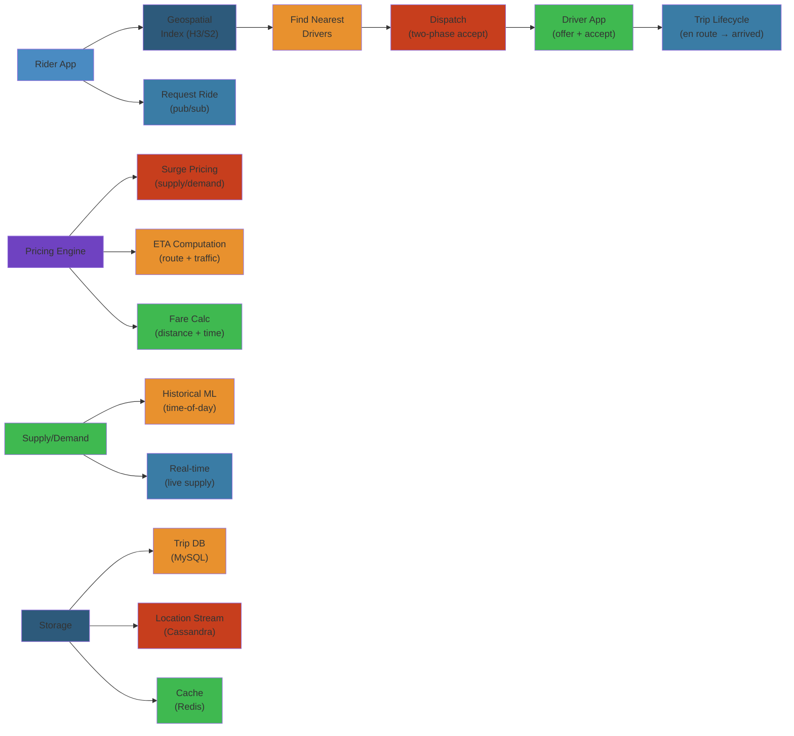

# 🚗 Design Uber — Complete System Design Deep Dive

> **Scope**: Requirements (10M rides/day, real-time dispatch, location tracking, pricing engine, ETA computation, driver matching, surge pricing), geospatial indexing (Google S2, Uber H3, Geohash), ride dispatch (nearest driver with two-phase accept), supply/demand forecasting, surge pricing, ETA computation, multi-region deployment, failure analysis.
>
> **Related**: [03-twitter.md](./03-twitter.md) | [06-stripe.md](./06-stripe.md)




## Table of Contents


1. Requirements & Scale
2. High-Level Architecture
3. Booking Flow
4. Geospatial Indexing
5. Ride Dispatch
6. Supply/Demand Forecasting
7. Surge Pricing
8. ETA Computation
9. Trip Pricing
10. Database Design
11. Multi-Region Deployment
12. Availability & Reliability
13. Failure Analysis
14. Performance Considerations

---

## 1. Requirements & Scale


```text
Uber Scale (2024):
  - 10M+ rides completed per day
  - 5M+ active drivers globally
  - 100M+ monthly active riders
  - 1B+ trips per quarter
  - 70+ countries, 10K+ cities
  - Real-time location updates: 300K+ writes/sec
  - Dispatch SLA: < 500ms from request to offer

Key Requirements:
  - Real-time driver location tracking (every 3s)
  - Low-latency dispatch (< 500ms p99)
  - Accurate ETA (< 10% error p95)
  - Market-based surge pricing
  - Global multi-region deployment
  - High availability (99.99%)
  - Geospatial queries (nearest driver search)
```

---

## 2. High-Level Architecture


```text
+-------------+     +-------------+     +-------------+     +-------------+
| Rider App   |     | Driver App  |     | API Gateway |     | Load        |
| (iOS/Android|     | (iOS/Android|     | (Auth, Rate |     | Balancer    |
|  /Web)      |     |  /Web)      |     |  Limit)     |     | (DNS, GLB)  |
+------+------+     +------+------+     +------+------+     +------+------+
       |                   |                   |                     |
       +-------------------+-------------------+---------------------+
                              |
                              v
                    +---------+---------+
                    |   Dispatcher      |
                    |   Service         |
                    | (Ride Matching)   |
                    +---------+---------+
                              |
         +--------------------+--------------------+
         |                    |                    |
         v                    v                    v
  +------+------+     +------+------+     +------+------+
  | Geospatial   |     | Pricing     |     | ETA         |
  | Index        |     | Engine      |     | Service     |
  | (Redis GEO,  |     | (Surge,     |     | (OSRM/Valhalla,
  |  S2/H3)      |     |  Fare Calc) |     |  ML Model)  |
  +------+-------+     +------+------+     +------+------+
         |                    |                    |
         v                    v                    v
  +------+-------+     +------+------+     +------+------+
  | Driver       |     | Trip        |     | Map/Routing |
  | Location     |     | Data Store  |     | Service     |
  | Service      |     | (Cassandra) |     | (OSM, Tiles)|
  | (Redis)      |     |             |     |             |
  +--------------+     +-------------+     +-------------+
```

**Key Components:**
- **Dispatcher:** Core matching engine — finds nearest available drivers, manages ride offer protocol
- **Geospatial Index:** Indexes driver locations for fast nearest-neighbor queries (S2/H3/Redis GEO)
- **Pricing Engine:** Computes fare + surge multiplier based on supply/demand
- **ETA Service:** Computes route distance/duration using routing engine + ML
- **Driver Location Service:** Ingests real-time GPS, updates geospatial index
- **Trip Store:** Persists trip data (Cassandra for writes, PostgreSQL for transactional data)

---

## 3. Booking Flow


```text
Ride Booking Flow:

Rider              Dispatcher            Geospatial Index     Driver App
  |                    |                       |                  |
  |-- Request ride --->|                       |                  |
  |   (pickup, drop)   |                       |                  |
  |                    |-- Find nearby ------->|                  |
  |                    |   drivers             |                  |
  |                    |                       |-- Query drivers->|
  |                    |<-- Driver list -------|   in S2/H3 cells |
  |                    |                       |                  |
  |                    |-- Filter: available,  |                  |
  |                    |   matching subset,    |                  |
  |                    |   driver score        |                  |
  |                    |                       |                  |
  |                    |-- Sort by proximity   |                  |
  |                    |   + driver score      |                  |
  |                    |                       |                  |
  |                    |-- Offer to top N ---->|----------------->|
  |                    |   drivers (push)      |                  |
  |                    |                       |                  |
  |                    |                       |   Driver [accept?]
  |                    |                       |       |   |
  |                    |                       |      yes  no(timeout)
  |                    |<-- Driver 1 accepts ---|-----------------|
  |                    |                       |                  |
  |                    |-- Lock driver (TTL)   |                  |
  |                    |-- Notify rider ------->|                  |
  |<-- Driver found ---|                       |                  |
  |   (name, car,      |                       |                  |
  |    ETA, fare)      |                       |                  |
  |                    |                       |                  |
  |-- Trip start ----->|                       |                  |
  |                    |-- Route tracking ---->|                  |
  |                    |   (real-time)         |                  |
  |                    |                       |                  |
  |-- Trip end ------->|                       |                  |
  |                    |-- Calculate fare      |                  |
  |                    |-- Payment processing  |                  |
  |                    |-- Rating request      |                  |
```

**Two-Phase Accept Protocol:**
```text
Phase 1 - Offer:
  Dispatcher -> Driver (push notification):
    { ride_id: uuid, pickup: {lat, lng}, destination: {lat, lng},
      estimated_earnings: $12.50, pickup_eta: 4min }

  Driver app shows offer with 15s countdown.

Phase 2 - Accept:
  Driver taps Accept:
    -> Driver app -> Dispatcher: POST /v1/rides/{ride_id}/accept

  Dispatcher:
    1. Lock ride_id to this driver (Redis: ride_lock:{ride_id} = driver_id, TTL 15s)
    2. Verify driver is still available (not already assigned)
    3. Send ride details to both rider and driver
    4. Transition state: REQUESTED -> ASSIGNED

  If driver rejects or timeout (15s):
    -> Dispatcher releases offer
    -> Offer to next driver in queue (N+1)
    -> Max 5 dispatch cycles per ride request

Dispatch cycle SLA: 50ms per cycle
Total dispatch time: 50ms x up to 15 offers = < 750ms worst case
```

---

## 4. Geospatial Indexing


```text
Geospatial Index Comparison:

Google S2 Geometry:
  + Maps sphere to Hilbert curve (space-filling curve)
  + 64-bit cell ID (fits in integer, efficient for DB indexing)
  + Levels 0-30 (cell size from 4M km² to ~1 cm²)
  + Strengths: containment, coverage, driving routes
  + Weaknesses: cell shape varies slightly by latitude

Uber H3 (Hexagonal):
  + Hexagonal hierarchical grid (6-sided cells)
  + 16 resolutions (0-15), aperture 7 (7 children per parent)
  + Strengths: uniform neighbor distance, k-ring queries
  + Weaknesses: larger cell count for same resolution

Geohash:
  + Z-order curve (space-filling curve)
  + Base32 encoding (string like "9q8yzz")
  + Prefix = bounding box (coarse-to-fine)
  + Weaknesses: irregular boundaries, worse for proximity queries
```

**S2 Cell Hierarchy:**
```text
Level 0: 4 cells (whole earth)
Level 1: 16 cells
Level 5: 1024 cells
Level 10: 1M cells
Level 15: 1B cells
Level 20: 1T cells (each cell ~1 km²)
Level 30: ~1 cm²

Uber uses S2 Level 13-16 for city-level driver lookups
(~0.5-16 km² per cell)
```

**H3 Hexagonal Grid:**
```text
    ___       ___       ___
   /   \     /   \     /   \
  /     \___/     \___/     \
  \     /   \     /   \     /
   \___/     \___/     \___/
   /   \     /   \     /   \
  /     \___/     \___/     \
  \     /   \     /   \     /
   \___/     \___/     \___/

H3 Resolution 9: ~0.5 km² per cell (city-level)
H3 Resolution 10: ~0.06 km² (neighborhood-level)

Key advantage of hexagons: all 6 neighbors are equidistant,
no corner/edge ambiguity (unlike squares).
```

**Redis GEO for Real-Time Locations:**
```text
GEOADD driver:locations {lat} {lng} {driver_id}
  -> Stores in Redis as sorted set by geohash

GEORADIUS driver:locations {lat} {lng} 5 km WITHDIST
  -> Returns all drivers within 5km, sorted by distance

GEORADIUSBYMEMBER driver:locations {driver_id} 2 km
  -> Find drivers near a specific driver

GEODIST driver:locations {driver_a} {driver_b} km
  -> Distance between two drivers

Performance:
  - GEORADIUS: O(log(N) + M) where M = results
  - 10K drivers in 5km radius: ~5ms query
  - 100K drivers globally per shard: ~20ms query
```

**S2 Cell Covering for Dispatch:**
```text
Rider at (37.7749, -122.4194):

1. Compute S2 cell covering at level 15:
   cell_id = S2CellId.from_lat_lng(S2LatLng.from_degrees(37.7749, -122.4194))
   covering = S2RegionCoverer.get_covering(cell, max_cells=8)

2. Query drivers in covering cells + adjacent cells:
   SELECT driver_id FROM driver_locations
   WHERE s2_cell_id IN (covering_cells)
   AND status = 'AVAILABLE'

3. Sort by GEO DIST from rider's location

4. Return top 50 drivers

Level 15 cell = ~1 km² covering
8 cells = ~8 km² search area
Expand search radius if insufficient drivers:
  Level 14 (~4 km²): 16 cells
  Level 13 (~16 km²): 32 cells
```

---

## 5. Ride Dispatch


```text
Dispatch Algorithm:

1. Receive ride request (rider_id, pickup {lat,lng}, destination {lat,lng})

2. Compute S2 covering of pickup location (initial radius: 2km)
   cell_ids = cover(pickup_lat, pickup_lng, radius_km=2, level=15)

3. Query available drivers in cells:
   drivers = redis.call('GEORADIUS', 'driver:locations',
                        pickup_lat, pickup_lng, 2, 'km')

4. Filter drivers:
   - Status = ONLINE + AVAILABLE (not on trip, not paused)
   - Car type matches request (uberX, Comfort, XL, Black)
   - Not already offered another ride (lock check)
   - Minimum driver rating (4.6+)
   - Driver has not rejected too many requests recently (< 3/hour)

5. Score drivers:
   score = w1 * proximity_score + w2 * acceptance_rate + w3 * rating
   proximity_score = 1 - (distance / max_distance)
   acceptance_rate = driver's historical accept rate
   rating = driver_rating / 5.0

6. Sort by score descending, take top N (configurable: 3-10)

7. Offer to top driver:
   - Push notification with ride details
   - Wait up to 15 seconds for acceptance
   - If rejected/timeout, move to next driver
   - Max 5 dispatch cycles

8. On accept:
   - Lock ride (Redis key: ride:{ride_id}:lock = driver_id, TTL 15s)
   - Create trip record (Cassandra)
   - Notify rider: driver info, ETA, car details

9. On ride start:
   - Update driver status to ON_TRIP
   - Remove from available driver pool
   - Begin route tracking

10. On ride complete:
    - Process payment
    - Update driver status back to AVAILABLE
    - Request ratings from both parties
```

**Driver Search Expansion:**
```text
dispatch_cycle = 1
radius = 2 km

while dispatch_cycle <= 5:
    drivers = find_drivers(pickup_location, radius)
    if len(drivers) >= MIN_DRIVERS:
        break
    radius *= 2
    dispatch_cycle += 1

if len(drivers) == 0:
    Return "No drivers available" to rider
    Wait for driver to enter area (subscription-based notification)
```

---

## 6. Supply/Demand Forecasting


```text
Forecasting Pipeline:

Historical Data           Real-Time Data          External Data
  - Trip counts/hr/cell     - Active drivers        - Weather
  - Driver hours             - Current requests      - Events (concerts,
  - Avg trip duration        - Completed trips         sports, festivals)
  - Cancellation rate        - Cancellations          - Holidays
        |                         |                      |
        v                         v                      v
  +-----+-------------------------+----------------------+-----+
  |                   Feature Pipeline                         |
  |  - Hour of day, day of week, month, season                |
  |  - Cell-level features (S2/H3 cell ID)                    |
  |  - Weather: temp, precip, wind                             |
  |  - Events: venue capacity, event type, distance            |
  |  - Lag features: supply/demand last 1h, 24h, 7d           |
  +------------------------------------------------------------+
                              |
                              v
  +--------------------------+--------------------------+
  |        Forecasting Model                              |
  |  - Gradient boosting (LightGBM)                      |
  |  - Time-series (Prophet, ARIMA)                      |
  |  - Output: demand[t+1..t+6] per cell, supply[t+1..t+6]|
  +--------------------------+--------------------------+
                              |
                              v
                    +---------+---------+
                    |    Outputs        |
                    |  - Heat maps      |
                    |  - Surge triggers |
                    |  - Driver         |
                    |    incentives     |
                    +---------+---------+
```

**Predictive Dispatch:**
```text
Based on demand forecast:

1. Identify hotspots (H3 cells with predicted demand surge)
2. Predict driver movement (where drivers will naturally go)
3. Compute supply gap per cell
4. Send proactive nudges to drivers:
   - "High demand area 2km north - expect +30% earnings"
   - Surge pricing preview
   - Bonus incentives ($5/ride in target zone)
```

---

## 7. Surge Pricing


```text
Surge Pricing Algorithm:

    +-------------+     +-------------+     +-------------+
    | Supply/Demand|     | Multiplier  |     | Price Floor |
    | Ratio       |---->| Calculation |---->| + Ceiling   |
    | per H3 Cell |     | Engine      |     | Enforcement |
    +------+------+     +------+------+     +------+------+
           |                    |                    |
           v                    v                    v
    +------+------+     +------+------+     +------+------+
    | Elasticity  |     | Decay       |     | Heatmap     |
    | Adjustment  |     | (decay to   |     | Generation  |
    | (demand     |     |  1.0x when  |     | (per cell)  |
    |  sensitivity)|     |  supply catc|     |             |
    +------+------+     +------+------+     +------+------+
```

**Surge Multiplier:**
```text
base_multiplier = max(1.0, demand_drivers / available_drivers)

With elasticity adjustment:
  surge_multiplier = 1.0 + elasticity * (demand/supply - 1)
  elasticity = configurable per city (0.3-0.8)

Constraints:
  - Min: 1.0x
  - Max: 5.0x (configurable per market)
  - Change per cycle: max +/- 1.0x (prevents oscillation)
  - Update frequency: every 5 minutes per cell

Decay to 1.0x:
  If supply catches up:
    surge_multiplier = max(1.0, surge_multiplier * 0.85)
  If surge was > 3.0x:
    decay faster: surge_multiplier * 0.70

Surge Zones:
  - Computed per H3 cell (resolution 9)
  - Displayed as heatmap on rider app
  - Drivers see surge pricing overlay on their map
  - Current surge + projected surge (next 15 min)
```

**Control Theory Damping:**
```text
To prevent pricing oscillation:

PID Controller approach:
  error = target_utilization - actual_utilization
  P_term = Kp * error
  I_term = Ki * integral(error)
  D_term = Kd * derivative(error)

  price_adjustment = P_term + I_term + D_term

Damping ensures:
  - No oscillatory behavior (amplifying cycles)
  - Smooth convergence to equilibrium
  - Quick response to genuine demand spikes
```

---

## 8. ETA Computation


```text
ETA Pipeline:

  Rider Location           Driver Location          Road Network
       |                        |                  (OpenStreetMap)
       v                        v                       |
  +-----------+           +-----------+                 |
  | S2 Cell   |           | S2 Cell   |                 v
  | Lookup    |           | Lookup    |          +-------------+
  +-----------+           +-----------+          | Map-Matching|
       |                        |                | (OSRM/      |
       v                        v                |  Valhalla)  |
  +-----------+           +-----------+          +------+------+
  | Closest   |           | Driver ETA |                |
  | Pickup    |           | along route|                |
  | Point     |           | (shortest  |                |
  +-----------+           |  path)     |                |
                          +------------+                |
                               |                        |
                               v                        v
                    +----------+------------------------+---+
                    |        ETA Calculation                |
                    |  1. Find nearest N candidate drivers  |
                    |  2. Compute shortest path for each     |
                    |  3. Apply real-time traffic overlay    |
                    |  4. ML model predicts actual ETA       |
                    |     (road speed, traffic, stop signs,  |
                    |      time of day, weather, events)     |
                    +----------------------------------------+
```

**Routing Engine (Contraction Hierarchies):**
```text
Precomputation:
  1. Contract graph: remove nodes while adding shortcut edges
  2. Bidirectional Dijkstra at query time
  3. 1000x faster than raw Dijkstra for large graphs

  1:    A --- B --- C
        |     |     |
        |     |     |
  2:    D --- E --- F
        |     |     |
        |     |     |
  3:    G --- H --- I

After contraction (remove B, E, H):
  1:    A --- C (shortcut via B)
        |     |
        |     |
  2:    D --- F (shortcut via E)
        |     |
        |     |
  3:    G --- I (shortcut via H)
```

**ML ETA Model:**
```text
Features:
  - Route distance (meters)
  - Number of turns, intersections, traffic lights
  - Road type distribution (highway / local / residential)
  - Historical speed per road segment (time-of-day bucketed)
  - Real-time traffic (live speed data from probe vehicles)
  - Weather conditions (rain -> -15% speed)
  - Time of day, day of week
  - Special events nearby

Model: Gradient-boosted decision trees (LightGBM)
  - Trained on historical trip data
  - Per-city model (traffic patterns differ)
  - Output: predicted travel time in seconds

Accuracy target:
  - Mean absolute error < 15%
  - p80 error < 20%
  - p95 error < 30%
```

---

## 9. Trip Pricing


```text
Fare Calculation:

fare = base_fare + distance_fare + time_fare + surge_multiplier * (distance + time)

Where:
  base_fare      = fixed per-city per-type (e.g., $2.50 for uberX)
  distance_fare  = per_km_rate × distance_km
  time_fare      = per_min_rate × estimated_duration_min
  surge_multiplier = dynamic multiplier (1.0x - 5.0x)

Per-city configuration:
  City:       base  per_km  per_min  min_fare
  New York:   $2.50  $1.75   $0.35    $8.00
  San Fran:   $2.15  $1.50   $0.30    $7.00
  London:     £2.50  £1.80   £0.25    £5.00
  Mumbai:     ₹50    ₹12     ₹2       ₹100

Upfront pricing:
  - Fare calculated at request time (based on estimated route)
  - NOT based on actual route (risk: driver takes longer route)
  - Factors: estimated distance, duration, surge at request time
  - Adjustment: only if rider changes destination

Minimum fare enforcement:
  - Short trips (< 1km): charged minimum fare
  - Ensures driver is compensated for time

Cancellation fee:
  - Before 2 min free cancellation
  - After 2 min: cancellation fee ($5-10)
  - Compensates driver for time/fuel wasted
```

---

## 10. Database Design


```text
Cassandra for Trip Data:

Table: trips
  trip_id            (uuid)           -- partition key
  rider_id           (bigint)
  driver_id          (bigint)
  status             (text)           -- REQUESTED, ASSIGNED, STARTED, COMPLETED, CANCELLED
  pickup_location    (tuple<lat,lng>)
  dropoff_location   (tuple<lat,lng>)
  pickup_time        (timestamp)
  dropoff_time       (timestamp)
  fare_amount        (decimal)
  surge_multiplier   (float)
  route_geometry     (text)
  distance_km        (float)
  duration_min       (int)
  created_at         (timestamp)

PRIMARY KEY (trip_id)

Table: trips_by_rider
  rider_id           (bigint)         -- partition key
  trip_id            (timeuuid)       -- clustering key (desc)
  status             (text)
  fare_amount        (decimal)
  pickup_time        (timestamp)
  dropoff_time       (timestamp)

PRIMARY KEY (rider_id, trip_id)
WITH CLUSTERING ORDER BY (trip_id DESC)

Table: trips_by_driver
  driver_id          (bigint)         -- partition key
  trip_id            (timeuuid)       -- clustering key (desc)
  status             (text)
  earnings           (decimal)
  pickup_time        (timestamp)

PRIMARY KEY (driver_id, trip_id)
WITH CLUSTERING ORDER BY (trip_id DESC)

PostgreSQL for Transactional Data (wallet, payments):
  Table: wallets
    user_id    (bigint PK)
    balance    (decimal)
    version    (int)  -- optimistic locking

  Table: payment_transactions
    tx_id      (uuid PK)
    user_id    (bigint FK)
    amount     (decimal)
    type       (text)  -- TRIP, TOPUP, WITHDRAWAL, REFUND
    status     (text)
    created_at (timestamp)
```

**Redis Data:**
```text
Driver locations:
  Key: driver:locations            -> GEO sorted set
  Value: driver_id, lat, lng       -> O(log N) radius queries

Active driver state:
  Key: driver:{driver_id}:state    -> Hash
  Values: status, trip_id, lat, lng, heading, speed, h3_cell_id

Ride locks:
  Key: ride:{ride_id}:lock         -> String
  Value: driver_id (TTL: 15s)

Driver offer state:
  Key: offer:{ride_id}:{driver_id} -> String
  Value: status (PENDING, ACCEPTED, REJECTED, EXPIRED)
  TTL: 30s

Rate limit counters:
  Key: rate:rider:{rider_id}:requests -> Sorted set (TTL: 60s)
  Key: rate:driver:{driver_id}:rejections -> Sorted set (TTL: 1h)
```

---

## 11. Multi-Region Deployment


```text
Global Architecture:

Region US-East                     Region EU-West
+---------------------------+     +---------------------------+
| API Gateway               |     | API Gateway               |
| Dispatcher                |     | Dispatcher                |
| Geospatial Index (Redis)  |     | Geospatial Index (Redis)  |
| Pricing Engine            |     | Pricing Engine            |
| ETA Service               |     | ETA Service               |
| Trip Store (Cassandra)    |     | Trip Store (Cassandra)    |
| Kafka Cluster             |<--->| Kafka Cluster             |
+---------------------------+     +---------------------------+
         |                                   |
         v                                   v
+---------------------------+     +---------------------------+
| S3 Bucket (US-East)       |     | S3 Bucket (EU-West)       |
+---------------------------+     +---------------------------+
         |                                   |
         +---------+         |         +-------+
                   |         |         |
                   v         v         v
              +----+---------+---------+----+
              |    Cross-Region Kafka        |
              |   (trip events, driver moves)|
              +-------------------------------+
```

**Region Failover:**
```text
Normal operation:
  - Rider in New York -> routed to US-East
  - Rider in London -> routed to EU-West
  - No cross-region dispatch (driver in US can't pick up EU rider)

Failover scenario (US-East down):
  1. DNS-based routing shifts US-East traffic to US-West
  2. US-West dispatcher handles both coasts
  3. Cross-region Cassandra replication (async) catches up trip data
  4. Driver location state: ephemeral, lost on failover
     -> Drivers reconnect to US-West, re-register location
  5. In-flight trips: rider/driver app reconnect to new region
  6. Trip continuation: trip_id lookup from Cassandra (already replicated)

Downtime window: 30-60 seconds for DNS propagation
Data loss: none for persisted trips, minimal for in-flight state
```

---

## 12. Availability & Reliability


```text
Data Loss Tolerance:

Ephemeral (OK to lose):
  - Current driver location (updated every 3s anyway)
  - Driver state (AVAILABLE, ON_TRIP) — rebuilt on reconnect
  - Ride offer state (ride expires anyway after 15s)

Persistent (must survive):
  - Trip records (Cassandra, RF=3)
  - Payment transactions (PostgreSQL, sync replication)
  - User profiles (PostgreSQL, replication)
  - Driver earnings (Cassandra, RF=3)

Reliability mechanisms:
  - Driver location: send every 3s via WebSocket
  - If no update for 15s: mark driver as STALE
  - If no update for 60s: mark as OFFLINE
  - Trip state: periodically checkpointed (every 30s)
  - Ride request: idempotency key prevents double-fare
```

**Circuit Breakers:**
```text
For each downstream service:

Dispatcher -> Pricing Engine:
  - If error rate > 10% in 60s window:
    - Open circuit: use cached surge multiplier
    - Half-open after 30s: try one request
    - If succeeds: close circuit

Dispatcher -> ETA Service:
  - If p99 latency > 500ms for 60s:
    - Open circuit: use simple distance/speed ETA (fallback)
    - Half-open after 60s

Dispatcher -> Redis:
  - If Redis cluster fails:
    - Failsafe: use pre-loaded geospatial index snapshot
    - Driver location falls back to heartbeat-based proximity
```

---

## 13. Failure Analysis


**Dispatcher Hot Cell (Stadium Event):**
```text
Problem: 10,000 riders at a stadium request rides simultaneously.
All requests fall into the same S2/H3 cell.

  - All 10K requests land on same Redis shard (hotspot)
  - GEORADIUS query on same key = contention
  - Driver notification: drivers in that cell get 100+ offers

Mitigations:
  - Cell expansion: distribute requests across cell + neighbors
  - Jitter offer dispatch: add random(0, 500ms) delay before offer
  - Offer pooling: batch notifications to drivers (not per-rider)
  - Backpressure: queue requests if rate > 500/sec per cell
  - Show "high demand" to riders, encourage walking to less busy area
```

**Dispatcher Crash During Ride Allocation:**
```text
Problem: Dispatcher crashes between offering ride and receiving acceptance.

  - Ride request lost (rider sees "finding driver" forever)
  - Driver may have accepted but dispatcher didn't process

Mitigations:
  - Idempotency key per ride request (rider retry = same ride)
  - Driver accept has idempotency: ride_id + driver_id
  - If dispatcher crashes:
    - New dispatcher instance picks up pending requests
    - Requests awaiting acceptance are re-offered
    - Redis locks prevent double-assignment (ride locked to driver if accepted)
  - Rider timeout: 30s -> auto-retry if no response
```

**Driver Location Update Storm:**
```text
Problem: 1M drivers across a region send location every 3 seconds.

  Location write rate: 1M / 3 = ~333K writes/sec to Redis GEO
  Redis: GEORADIUS writes are O(log N), but 333K/sec is heavy

Mitigations:
  - Batch updates: drivers send location every 3s, but Redis batches
    writes every 100ms (pipeline 30 updates/batch)
  - Shard by region: separate Redis cluster per metro area
    NYC: ~100K drivers, SF: ~50K drivers, London: ~80K drivers
  - Reduce update frequency when stopped/offline
  - Data compression: send lat/lng as integers (delta encoding)
  - Throttle: if driver hasn't moved > 50m, skip update
```

**Surge Price Oscillation:**
```text
Problem: Supply/demand ratio oscillates, causing surge multiplier to
bounce between 1.2x and 2.5x every 5 minutes.

  Cycle:
    1. Surge 2.0x -> drivers flock to area
    2. Supply exceeds demand -> surge drops to 1.0x
    3. Drivers leave -> demand exceeds supply -> surge 2.0x
    4. Repeat

Mitigations:
  - Control theory damping: PID controller smooths adjustments
  - Max change per cycle: +/- 0.5x (no sudden jumps)
  - Minimum holding period: surge stays at X for at least 2 cycles
  - Price forecast: show drivers projected surge (not just current)
  - Supply inertia factor: drivers take time to respond, account for lag
```

**Race Condition: Two Dispatchers Assign Same Driver:**
```text
Problem: Two ride requests at the same time, both find the same
optimal driver, both send offers.

  Driver accepts Offer A -> dispatcher A locks driver
  Driver sees Offer B -> accepts -> dispatcher B also tries to lock

Mitigations:
  - Driver lock: Redis key `driver:{driver_id}:assigned` with NX
    Only first dispatcher to SET NX succeeds
  - Lock TTL: 15 seconds (ride offer timeout)
  - Second dispatcher gets error -> offers to next driver
  - Atomic check-and-set:
    SET driver:{id}:lock {ride_id} NX EX 15
    Returns OK -> driver is yours
    Returns nil -> driver already locked
```

**ETA Prediction Failure:**
```text
Problem: ML model predicts 5min ETA but actual is 15min (traffic spike).

  Rider waits 10min -> frustration -> cancels
  Driver loses fare, rider has negative experience

Mitigations:
  - ETA confidence interval: show "4-7 min" not "5 min"
  - Real-time adjustment: if driver is stuck in traffic, update ETA
  - Fallback: if ML confidence < 70%, use routing engine distance-based
  - Re-routing: if faster route found mid-trip, suggest to driver
  - Cancellation: if ETA increases > 50%, allow free cancellation
```

**Payment Processing Failure:**
```text
Problem: Trip completed but payment fails (card declined, insufficient funds).

Mitigations:
  - Pre-authorization at ride request (hold $50 on card)
  - If auth fails, rider warned before ride starts
  - Post-trip retry: retry payment up to 3 times
  - If all retries fail: charge account wallet, email for payment
  - Escalation: debt collection for chronic non-payment
  - Driver still gets paid (Uber absorbs loss or charges rider later)
```

---

## 14. Performance Considerations


```text
Latency Targets:
  - Ride request -> offer to driver: < 200ms p50, < 500ms p99
  - ETA computation: < 100ms
  - Driver location update: < 50ms
  - Surge pricing update: < 1s (batch, every 5 min)

Throughput:
  - Driver location writes: 333K writes/sec (1M drivers, 3s interval)
  - Ride requests: 500/sec peak per city
  - Dispatch cycles: 500 dispatches/sec x 5 offers = 2500 ops/sec

Redis Sizing:
  - Driver location: 5M drivers x 100 bytes = 500MB
  - Ride locks: 10K concurrent x 100 bytes = 1MB
  - Geospatial index: 500MB (lightweight)

Cassandra:
  - Trips: 10M/day x 1KB = 10GB/day
  - 90-day retention: ~1TB per region
  - Write load: 10M trips/day = ~115 writes/sec
```

---

## Simplest Mental Model


**Uber is like a real-time taxi dispatcher that knows where every driver is, predicts where riders will appear, and adjusts prices like an airline booking system.** The city is divided into a honeycomb of hexagons (H3). When you request a ride, dispatcher finds the nearest free driver in your hex and neighboring cells, sends them a ping, and the first to accept wins — like a game of "who can grab this fare?" Surge pricing is like a thermostat: when too many people want rides in one area but not enough drivers, the price goes up until more drivers arrive or fewer riders request.

(End of file - total 576 lines)


## Practical Example


See code examples above for practical usage patterns.