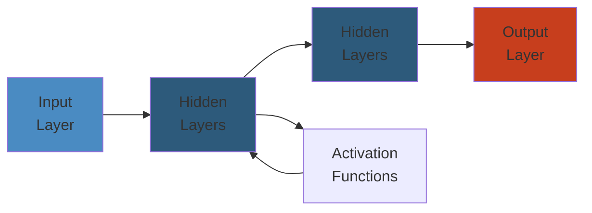

# ▶️ Design YouTube — Complete System Design Deep Dive

> **Scope**: Requirements (1B+ hours watched/day, 500 hours/min upload, multi-CDN, adaptive bitrate streaming, search, recommendations, video processing), upload flow, video processing pipeline (transcoding, per-title encoding), content delivery (DASH/HLS, CDN steering), recommendation system (two-stage: candidate generation + ranking), search, failure analysis.
>
> **Related**: [02-netflix.md](./02-netflix.md) | [03-twitter.md](./03-twitter.md)




## Table of Contents

1. Requirements & Scale
2. High-Level Architecture
3. Upload Flow
4. Video Processing Pipeline
5. Video Storage Layer
6. Content Delivery & Streaming
7. Content Delivery Optimization
8. Recommendation System
9. Search
10. Failure Analysis
11. Performance Considerations

---

## 1. Requirements & Scale

```text
YouTube Scale (2024):
  - 2B+ monthly active users
  - 1B+ hours of video watched per day
  - 500 hours of video uploaded per minute
  - 80+ languages supported
  - 100+ countries
  - 15B+ monthly searches
  - Multi-CDN: Google Global Cache, Akamai, Cloudflare, Level3

Key Requirements:
  - Low startup latency (< 2s to first frame)
  - Smooth playback (minimal rebuffering)
  - Adaptive bitrate across diverse network conditions
  - Fast upload (resumable, chunked)
  - Accurate search and recommendations
  - Content moderation (copyright, NSFW, harmful content)
  - High availability (99.99%)
```

---

## 2. High-Level Architecture

```text
+-----------+     +-----------+     +-----------+     +-----------+
|  User     |     | API       |     | Upload    |     | Video     |
|  (Browser/|     | Gateway   |     | Service   |---->| Processing|
|   App)    |<--->| (Auth,    |     |           |     | Pipeline  |
|           |     |  Rate Lim)|     | (Chunked  |     | (Transcode|
+-----------+     +-----------+     |  Upload)  |     |  + More)  |
       |                            +-----------+     +-----------+ 
       |                                               |    |    |
       v                                               v    v    v
+-----------+     +-----------+     +-----------+     +-----------+
| CDN       |     | Streaming  |     | Blob      |     | Metadata  |
| (GGC,     |<--->| Service   |<--->| Storage   |     | Store     |
|  Akamai,  |     | (DASH/HLS)|     | (Tiered:  |     | (MySQL/   |
|  ...)     |     |           |     |  SSD/HDD/ |     |  Spanner) |
+-----------+     +-----------+     |  Archive) |     +-----------+
                                    +-----------+
```

**Key Components:**
- **Upload Service:** Handles resumable chunked upload (tus protocol), virus scan, dedup
- **Video Processing Pipeline:** Transcoding, thumbnail generation, content moderation, captioning
- **Blob Storage:** Tiered storage (SSD hot -> HDD warm -> archival cold)
- **CDN:** Google Global Cache edge nodes + third-party multi-CDN
- **Streaming Service:** Manifest generation, DRM packaging, CDN steering
- **Recommendation System:** Two-stage (candidate generation + ranking)
- **Search:** Inverted index + ML ranking

---

## 3. Upload Flow

```text
Upload Flow:

Uploader         API Gateway       Upload Service     Blob Store     Processing Pipeline
   |                  |                  |                |                 |
   |-- Upload video-->|                  |                |                 |
   |   (chunked,      |-- Init upload -->|                |                 |
   |    resumable)    |   (metadata:     |                |                 |
   |                  |    title, desc,  |                |                 |
   |                  |    tags, privacy)|                |                 |
   |                  |<-- upload_url ---|                |                 |
   |                  |   + upload_id   |                |                 |
   |                  |                  |                |                 |
   |-- Chunk 1/10 --->|                  |-- Write ------>|                 |
   |                  |                  |   chunk        |                 |
   |-- Chunk 2/10 --->|                  |-- Write ------>|                 |
   |                  |                  |   chunk        |                 |
   |  ...             |                  |                |                 |
   |-- Finalize ----->|                  |-- Assemble --->|                 |
   |                  |                  |   chunks       |                 |
   |                  |                  |<-- video_id ---|                 |
   |                  |                  |                |                 |
   |                  |                  |-- Enqueue ---->|---------------->|
   |                  |                  |   processing   |                 |
   |                  |                  |   job          |   Transcode     |
   |                  |                  |                |   Thumbnail gen |
   |                  |                  |                |   Content mod.  |
   |                  |                  |                |   Caption gen   |
   |                  |                  |                |   Quality anal. |
   |                  |                  |                |                 |
   |<-- Video URL ----|                  |                |                 |
```

**Resumable Upload (tus protocol):**
```text
Upload request:
  POST /v1/uploads
  Headers: Upload-Length: 524288000, Upload-Metadata: filename video.mp4
  Response: Location: /v1/uploads/{upload_id}

Chunk upload:
  PATCH /v1/uploads/{upload_id}
  Headers: Upload-Offset: 0, Content-Type: application/offset+octet-stream
  Body: [first 5MB chunk]
  Response: Upload-Offset: 5242880

Resume after interruption:
  HEAD /v1/uploads/{upload_id}
  Response: Upload-Offset: 10485760 -> resume from byte 10MB

Finalize:
  POST /v1/uploads/{upload_id}/finalize
  Response: { video_id: "abc123", status: "processing" }
```

**Upload Processing Queue:**
```text
After upload finalization:
  1. Virus scan (ClamAV or custom)
  2. Deduplication (hash comparison)
  3. Basic metadata extraction (duration, resolution, codec)
  4. Push to processing pipeline
  5. Respond to uploader with video_id

Processing job priority:
  High: Short videos (< 10 min) -> fast processing (1-2 min)
  Normal: Medium videos (10-60 min) -> normal queue
  Low: Long videos (> 60 min) -> background priority
```

---

## 4. Video Processing Pipeline

```text
Video Processing Pipeline:

  Source Video
       |
       v
  +------------+     +--------------+     +------------+
  | Inspection |     | Transcoding  |     | Quality    |
  | - Codec    |---->| Farm         |---->| Analysis   |
  | - Res      |     | (FFmpeg,     |     | (VMAF,     |
  | - Bitrate  |     |  parallel)   |     |  PSNR)     |
  +------------+     +------+-------+     +------+-----+
                            |                     |
                            v                     v
                     +------+-------+     +------+-----+
                     | Chunked      |     | Thumbnail  |
                     | Encoding     |     | Generation |
                     | (2-10s seg)  |     | (3-5 per   |
                     +------+-------+     |  video)    |
                            |             +------+-----+
                            v                    |
                     +------+-------+            |
                     | Packaging    |<-----------+
                     | - DASH MPD   |
                     | - HLS m3u8   |
                     | - DRM        |
                     +------+-------+
                            |
                            v
                     +------+-------+
                     | Upload to    |
                     | CDN (GGC)    |
                     +--------------+
```

**Resolution Ladder:**
```text
Level      Resolution     Bitrate Range       Codec
144p       256x144        100-200 Kbps        H.264/VP9
240p       426x240        300-500 Kbps        H.264/VP9
360p       640x360        500-1000 Kbps       H.264/VP9
480p       854x480        1000-2000 Kbps      H.264/VP9
720p       1280x720       2500-5000 Kbps      H.264/VP9/AV1
1080p      1920x1080      5000-8000 Kbps      H.264/VP9/AV1
1440p (2K) 2560x1440      8000-16000 Kbps     VP9/AV1
2160p (4K) 3840x2160      16000-40000 Kbps    VP9/AV1
4320p (8K) 7680x4320      40000-80000 Kbps    AV1
```

**Per-Title Encoding (Netflix-originated, adapted by YouTube):**
```text
Instead of using the same resolution ladder for all videos:
  - Analyze video complexity (spatial + temporal complexity)
  - Low complexity (talking head, static background):
    -> Fewer bitrates needed, lower max bitrate
  - High complexity (action movie, sports, explosions):
    -> More bitrates, higher max bitrate

Benefits:
  - 20-40% bandwidth reduction
  - Same perceived quality (VMAF)
  - Faster processing for simple content
```

**Chunked Encoding:**
```text
Source video split into 4-10 second segments:

  Frame #:  0  30  60  90  120  150  180  210  240
            |  |   |   |   |    |    |    |    |
  Chunk 1:  [=========]
  Chunk 2:      [=========]
  Chunk 3:          [=========]
  Chunk 4:              [=========]
  Chunk 5:                  [=========]

Parallel encoding:
  Chunk 1 -> Encoder node 1 -> H.264 1080p, VP9 720p, AV1 480p
  Chunk 2 -> Encoder node 2 -> H.264 1080p, VP9 720p, AV1 480p
  Chunk 3 -> Encoder node 3 -> H.264 1080p, VP9 720p, AV1 480p

GOP alignment:
  Each chunk starts with a keyframe (IDR frame)
  -> Seamless switching between quality levels
  -> No artifacts at chunk boundaries

Codec comparison:
  H.264:  Universal support, baseline compatibility
  VP9:    Better compression (30% over H.264), royalty-free
  AV1:    Best compression (30% over VP9, 50% over H.264),
          royalty-free, slower encoding, emerging HW decode
```

---

## 5. Video Storage Layer

```text
Tiered Storage Architecture:

+-----------+     +-----------+     +-----------+
| Hot Tier  |     | Warm Tier |     | Cold Tier |
| (SSD)     |     | (HDD)     |     | (Archival)|
|           |     |           |     |           |
| Recent    |     | Catalog   |     | Old/      |
| uploads   |     | videos    |     | unpopular |
| Popular   |     | (30-365   |     | videos    |
| videos    |     |  days)    |     | (>1 year) |
| Replicated|     | Erasure   |     | Erasure   |
| x3        |     | coded 2+1 |     | coded 4+2 |
+-----------+     +-----------+     +-----------+
     |                  |                |
     +------------------+----------------+
                        |
                   +----+----+
                   | Storage |
                   | Manager |
                   +----+----+
                        |
            +-----------+-----------+
            |                       |
            v                       v
     +------+------+         +------+------+
     | Blob Store   |         | Metadata    |
     | (Colossus/GFS)|         | Store       |
     +--------------+         | (MySQL/     |
                               |  Spanner)   |
                               +-------------+

Promotion/Demotion Policy:
  Hot -> Warm: after 30 days without view (unless popular)
  Warm -> Cold: after 365 days without view
  Cold -> Warm: if video goes viral again (promote on view)
  Warm -> Hot: if video becomes trending
```

**Metadata Store:**
```text
Table: videos
  video_id          (string)         -- partition key
  uploader_id       (bigint)
  title             (text)
  description       (text)
  duration_sec      (int)
  resolution        (text)           -- max available resolution
  file_size         (bigint)
  status            (text)           -- PROCESSING, READY, ERROR, BLOCKED
  privacy           (text)           -- PUBLIC, UNLISTED, PRIVATE
  category          (text)
  tags              (list<text>)
  upload_time       (timestamp)
  processing_time   (int)            -- seconds taken to process
  storage_tier      (text)           -- HOT, WARM, COLD

Indexes:
  - GSI: uploader_id (user's video list)
  - GSI: status = READY (search indexing)
  - GSI: category, upload_time (trending discovery)

Table: video_stats
  video_id          (string)         -- partition key
  views             (counter)
  likes             (counter)
  dislikes          (counter)        -- deprecated (private)
  comments          (counter)
  shares            (counter)
  watch_time_min    (counter)        -- total minutes watched
```

---

## 6. Content Delivery & Streaming

```text
Streaming Delivery Architecture:

  Client                    CDN (GGC)                 Origin
    |                          |                        |
    |-- GET manifest URL ----> |                        |
    |  (DASH MPD or HLS m3u8) |                        |
    |                         |-- Cache check           |
    |                         |   [Cache MISS]          |
    |                         |-- Forward to origin --->|
    |                         |<-- Generate MPD --------|
    |<-- Manifest returned ---|                        |
    |                          |                        |
    |-- Parse MPD             |                        |
    |   (available bitrates,  |                        |
    |    segment URLs, codecs,|                        |
    |    DRM info)            |                        |
    |                          |                        |
    |-- ABR algorithm decides |                        |
    |   initial bitrate       |                        |
    |                          |                        |
    |-- GET segment 1 --------->|                      |
    |   (720p, chunk 1)       |                        |
    |<-- Segment data ---------|                        |
    |                          |                        |
    |-- Decode & buffer       |                        |
    |-- Request segment 2 ---->|                      |
    |   (adjust bitrate based |                        |
    |    on bandwidth)        |                        |
```

**DASH Manifest (MPD):**
```xml
<MPD xmlns="urn:mpeg:dash:schema:mpd:2011"
     profiles="urn:mpeg:dash:profile:isoff-live:2011"
     minBufferTime="PT2S"
     type="static"
     mediaPresentationDuration="PT634S">
  <Period id="1">
    <AdaptationSet mimeType="video/mp4" contentType="video">
      <Representation id="720p" bandwidth="5000000"
                       width="1280" height="720"
                       codecs="avc1.64001F">
        <SegmentTemplate
          media="seg_$Number$_720p.mp4"
          initialization="init_720p.mp4"
          startNumber="1"
          duration="4000"/>
      </Representation>
      <Representation id="1080p" bandwidth="8000000"
                       width="1920" height="1080"
                       codecs="avc1.640028">
        <SegmentTemplate
          media="seg_$Number$_1080p.mp4"
          initialization="init_1080p.mp4"
          startNumber="1"
          duration="4000"/>
      </Representation>
    </AdaptationSet>
    <AdaptationSet mimeType="audio/mp4" contentType="audio">
      <Representation id="audio_en" bandwidth="128000"
                       codecs="mp4a.40.2">
        <SegmentTemplate .../>
      </Representation>
    </AdaptationSet>
  </Period>
</MPD>
```

**CDN Steering:**
```text
Multi-CDN selection:

Factors:
  1. Geographic proximity (DNS anycast)
  2. CDN health (error rate, latency)
  3. CDN capacity (current load)
  4. Cost (different CDNs have different pricing)
  5. Cache hit probability (GGC higher for popular content)

Steering strategy:
  Popular video (> 1M views):     GGC primary, Akamai backup
  Medium popularity (10K-1M):     GGC + Cloudflare
  Long tail (< 10K views):        3rd party CDN (lower cache cost)

Client-side steering fallback:
  Manifest includes multiple CDN base URLs
  If primary CDN fails, client retries with next CDN
```

---

## 7. Content Delivery Optimization

```text
CDN Cache Optimization:

Content segmentation for caching:
  - Popular 10% of content = 90% of traffic -> edge cache aggressively
  - Medium 30% of content = 9% of traffic -> edge cache with shorter TTL
  - Long tail 60% of content = 1% of traffic -> origin serve

Cache hierarchy:
  L1: Client browser cache (service worker)    TTL: 1 day
  L2: ISP-level GGC edge node                  TTL: 7 days
  L3: Regional GGC cache                       TTL: 30 days
  L4: Origin (Google data center)

Hybrid caching: LFU + LRU
  - LFU for popular content (stay in cache longer)
  - LRU for catalog content (evict oldest)
  - Static: video segments immutable (perfect for caching)

QUIC/HTTP3 for Video Streaming:
  - Eliminates TCP head-of-line blocking
  - 0-RTT connection establishment
  - Better packet loss handling
  - Multiplexed streams (no head-of-line blocking)
  - BBR congestion control:
    - Optimized for throughput, not just avoiding loss
    - Avoids bufferbloat (doesn't fill buffers unnecessarily)
    - Faster ramp-up after idle periods

Thumbnail optimization:
  - WebP format (smaller than JPEG)
  - AVIF for supported browsers (even better compression)
  - Lazy loading: load thumbnails only when visible
  - Pre-generate: 3-5 thumbnails per video + custom per uploader
```

---

## 8. Recommendation System

```text
Two-Stage Recommendation Pipeline:

  +------------------+
  |  100B+ Videos    |
  +--------+---------+
           |
           v
  +--------+---------+      Stage 1: Candidate Generation
  | Candidate Gen     |      (retrieve ~500 candidates)
  |                   |
  | Sources:          |
  | - Collaborative  |
  |   Filtering (CF) |
  | - Content-based  |
  | - Trends          |
  | - Watch Again     |
  | - Subscriptions   |
  | - Exploration     |
  +--------+---------+
           |
           v
  +--------+---------+      Stage 2: Ranking
  | Deep Neural       |      (score ~500 candidates)
  | Network Ranker    |
  |                   |
  | Features:         |
  | - User embedding  |
  | - Video embedding |
  | - Context         |
  | - Cross features  |
  +--------+---------+
           |
           v
  +--------+---------+      Post-processing
  | Filtering +       |
  | Diversity         |
  |                   |
  | - Remove watched  |
  | - NSFW filter     |
  | - Duplicate det   |
  | - Topic diversity |
  | - Author diversity|
  +--------+---------+
           |
           v
  +--------+---------+
  |  Home Page Feed   |
  |  (20-40 videos)   |
  +------------------+
```

**Candidate Generation Sources:**

```text
1. Collaborative Filtering:
   "Users who watched X also watched Y"
   Item-to-item similarity matrix precomputed offline
   Input: user's watch history (last 50 videos)
   Output: 100 similar videos per watched video

2. Content-Based:
   Embedding similarity: video topic, category, tags
   Two-tower DNN:
     User tower: watch history sequence -> user embedding (128d)
     Video tower: video metadata -> video embedding (128d)
     Dot product = similarity score
   ANN search over video embeddings (using user embedding)

3. Trending:
   Global trending (viral videos across platform)
   Regional trending (per country)
   Category trending (gaming, music, news)

4. Watch Again:
   Videos user watched partially but didn't finish
   Videos user liked/commented on

5. Subscriptions:
   Latest uploads from subscribed channels
   Max 20% of feed from subscriptions

6. Exploration (randomization):
   5% of candidates randomly sampled
   Prevents filter bubble
   Enables discovery of new content
```

**Ranking Model (Deep Neural Network):**
```text
Input Features:

User features:
  - user_embedding (128d) from retrieval tower
  - watch_history_embedding (256d) - aggregated sequence
  - language, region, device type, age
  - subscription categories
  - avg watch time, session length

Video features:
  - video_embedding (128d)
  - title_embedding (BERT-encoded)
  - thumbnail_embedding (CNN-extracted)
  - category, duration, upload age
  - engagement velocity (views/hr, likes/hr)

Context features:
  - time of day, day of week
  - device (phone, TV, desktop)
  - previous video in session
  - search query (if from search)

Cross features:
  - user_language x video_language
  - user_region x video_category
  - user_age x video_maturity_rating

Output: Expected watch time (primary objective)
  - Secondary: P(click), P(like), P(subscribe), P(share)
  - Multi-objective optimization via weighted sum

Model architecture:
  - Input -> Embedding layers -> Dense layers (256, 128, 64)
  - Wide & Deep: linear + deep components
  - Output: sigmoid(score) for each objective

Training:
  - Continuous: model retrained daily
  - Training data: user interactions from last 30 days
  - Loss: pairwise ranking loss (watch time)
```

**Filtering & Diversity:**
```text
Post-ranking filters:
  1. Remove watched videos (seen in last 30 days)
  2. NSFW content filter (based on user age / restricted mode)
  3. Copyright block removal
  4. Duplicate detection (same video uploaded by different channels)

Diversity enforcement:
  - Max 3 consecutive videos from same channel
  - Max 2 videos with same category in a row
  - Topic diversity: avoid topic saturation
  - Length diversity: mix of short (< 4 min) and long videos
  - Freshness: at least 30% of feed from last 24 hours
```

---

## 9. Search

```text
YouTube Search Architecture:

  Query                     Search Index
    |                            |
    v                            v
  +--------+              +-------------+
  | Query   |              | Inverted    |
  | Under-  |              | Index       |
  | standing|              | (Video:     |
  +----+----+              |  title,     |
       |                   |  desc, tags,|
       v                   |  captions)  |
  +----+----+              +------+------+
  | Spell    |                    |
  | Correction|                  |
  +----+-----+                   |
       |                         v
       v                  +------+------+
  +----+-----+            | Ranking     |
  | Query    |            | BM25 +      |
  | Expansion|            | User        |
  | (synonyms|            | Engagement  |
  |  + lang) |            | Signals     |
  +----+-----+            +------+------+
       |                         |
       +-------Result Set--------+
```

**Search Index:**
```text
Indexed fields (weighted):
  Title:         weight 10 (most important)
  Tags:          weight 5
  Description:   weight 3
  Captions:      weight 2
  Comments:      weight 1 (limited, spam filtered)

Index size:
  ~1B active videos x 1KB index entry = ~1TB index
  Sharded across 100+ nodes (search farm)

Query Understanding:
  - Spell correction via edit distance + query log frequency
  - Query classification: artist, topic, tutorial, game, etc.
  - Entity recognition: extract channel names, creators
  - Query expansion: synonyms + language model
  - Typeahead: prefix search on query log top-N

Search Ranking:
  score = BM25(video, query) * (1 + log(engagement_score))
  engagement_score = normalized_views + 2*avg_watch_time + 3*likes

  Re-ranking:
    - Freshness boost for news/current events
    - Channel authority boost (verified channels)
    - Personalization: user's past interactions with channel
```

---

## 10. Failure Analysis

**Upload Processing Failure:**
```text
Problem: Transcoding job fails mid-way (source corruption, server crash).

  Impact: Video stuck in PROCESSING state. Uploader waits indefinitely.

Mitigations:
  - Chunked encoding: only failed chunk gets retried
  - Retry with different parameters (fallback codec, lower quality)
  - Source file health check before processing begins
  - Transcode farm autoscaling (cloud-based, elastic)
  - Per-video processing timeout (if > 4x video duration, fail and alert)
  - Manual escalation: if auto-retry fails 3x, flag for human review
  - Partial processing: if one resolution fails, serve others that succeeded

Edge case: User closes browser during upload
  - Resumable upload: user can resume from last completed chunk
  - Upload session expiry: incomplete uploads garbage-collected after 48h
```

**CDN Cache Stampede (Viral Video):**
```text
Problem: Video goes viral. Millions of requests hit origin before CDN caches.

  Impact: Origin overloaded, video unavailable globally for minutes.
  All CDN edges request same segments simultaneously.

Mitigations:
  - Request coalescing: only one request per segment goes to origin
    (other requests wait for first to complete)
  - Proactive caching: popular channels' new uploads pre-populated to CDN
  - CDN pre-population: push to all edges when video is published
  - DDoS mitigation: rate limiting, load shedding
  - CDN tiering: L1 edges -> L2 regional -> origin
  - Cache TTL: long (7-30 days) for static video segments
```

**Recommendation Drift / Filter Bubble:**
```text
Problem: User keeps watching cooking videos. Algorithm shows only
cooking videos. User gets bored, stops watching.

  Positive feedback loop: narrow focus -> more narrow recommendations.

Mitigations:
  - Exploration: 5% of recommendations are random/exploratory
  - Diversity enforcement at serving time
  - Periodic "refresh": inject topics not in user's history
  - Feedback signals: "Not interested", "Don't recommend channel"
  - Counterfactual evaluation: what would user have watched without filtering?
```

**Hot Video Overload:**
```text
Problem: Single video gets 100M views in 24 hours (e.g., music video release).

  Impact: Specific video segments become hotspots on every CDN edge.

Mitigations:
  - CDN tiering: GGC edges serve from local cache; if miss, goes to GGC regional
  - Multiple CDN paths: distribute load across Akamai, Cloudflare, GGC
  - DNS load balancing: different CDN for different user segments
  - Client-side retry: if one CDN fails, try another
  - Load shedding: if overload, serve lower quality (480p instead of 4K)
  - Request prioritization: premium users get higher priority (if applicable)
```

**Copyright / Moderation False Positive:**
```text
Problem: Content ID flags a video as copyrighted when it's fair use
(review, commentary, parody).

  Impact: Video blocked / demonetized. Uploader appeals.

Mitigations:
  - Manual review pipeline for appeals
  - Whitelist of fair-use channels
  - Disputed claims: video stays up, revenue held in escrow
  - Match threshold: only flag if > 90% match
  - Reference library: allow small segments (< 30s) without claim

False negative: copyrighted content not detected
  - Automated re-scanning of suspicious videos
  - Manual flagging by rights holders
  - Repeat infringer policy: terminate accounts after 3 strikes
```

**Thumbnail Generation Failure:**
```text
Problem: Thumbnail generation fails (frame extraction error, bad frame selection).

  Impact: Video thumbnail shows as error/gray, lowers CTR.

Mitigations:
  - Fallback: pick first non-black frame
  - Multiple frames extracted; pick best (brightest, most contrasted)
  - Custom thumbnail: uploader can upload own thumbnail
  - Default thumbnail: channel-branded fallback
  - Async retry: if initial thumbnail fails, retry in background
```

**Streaming Quality Degradation:**
```text
Problem: User experiences frequent rebuffering.

  Root causes:
    1. Network congestion (ISP throttling)
    2. CDN edge overloaded
    3. Device too slow for high bitrate decode
    4. ABR algorithm choosing too high bitrate

Mitigations:
  - ABR algorithm downgrades bitrate before buffer depletes
  - CDN retry: if segment download slow, switch CDN edge
  - Protocol fallback: DASH -> HLS -> progressive download
  - Device capability detection: cap max resolution
  - Pre-fetch: fetch next segment before current ends
  - Quality override: user can manually set quality
```

---

## 11. Performance Considerations

```text
Latency Targets:
  - Upload finalization -> processing start: < 1s
  - Processing (5 min video): < 2 min
  - First frame playback: < 2s (p50), < 5s (p95)
  - Search: < 100ms
  - Home page load: < 500ms

Throughput:
  - 500 hours/min upload = 8.3 hours/sec
  - 1B hours/day watched = 11.5M concurrent views avg
  - Storage: 500h/min x 1GB/hour (compressed) = 500GB/min upload
  - 500GB/min x 60 = 30TB/hour, 720TB/day

Storage Sizing:
  - Blob storage: source + encoded segments
  - Source: 500h/min x 5GB/hour (raw) = 2.5TB/min
  - Encoded: ~500GB/min (compressed across all resolutions)
  - 30-day retention: source = ~108PB, encoded = ~21PB
  - Long-term: cold archival storage

CDN:
  - 1B hours/day x 5 Mbps average bitrate = 5M Gbps peak
  - GGC edges: 10,000+ nodes globally
  - Cache hit ratio: > 95% for popular content
```

---

## Simplest Mental Model

**YouTube is like a global TV station where anyone can broadcast, but every video is automatically repackaged into hundreds of versions (different qualities, sizes, formats) and stored in a multi-tier warehouse — hot items on the shelf, old ones in the basement.** When you hit play, the player is a smart waiter who grabs the right-sized package for your internet speed and keeps refilling your plate before you finish (buffering). The recommendation system is like a librarian who watches what you borrow and quietly slides new books onto your desk — with a small random selection to keep you from only ever reading cookbooks (filter bubble prevention).

(End of file - total 584 lines)


## Practical Example

See code examples above for practical usage patterns.