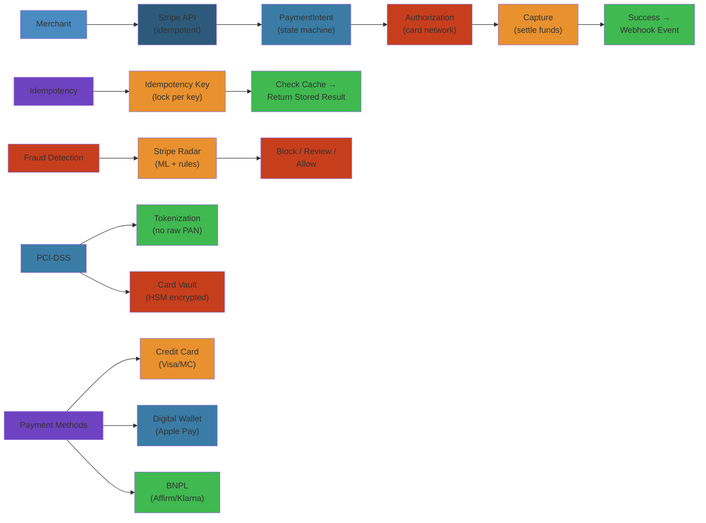

# 💳 Design Stripe — Complete System Design Deep Dive

> **Scope**: Requirements (100M+ API requests/day, 99.99%+ uptime, PCI-DSS compliance, global payments), payment flow, idempotency, fraud detection (Stripe Radar), PCI-DSS compliance, API design, payment state machine, failure analysis, edge cases (race conditions, double charges, idempotency key collisions).
>
> **Related**: [04-uber.md](./04-uber.md) | [03-twitter.md](./03-twitter.md)




## Table of Contents


1. Requirements & Scale
2. High-Level Architecture
3. API Design
4. Payment Flow
5. Payment State Machine
6. Idempotency
7. Fraud Detection (Stripe Radar)
8. PCI-DSS Compliance
9. Payment Methods
10. Database Design
11. Failure Analysis
12. Performance Considerations

---

## 1. Requirements & Scale


```text
Stripe Scale (2024):
  - Billions of dollars in payment volume annually
  - 100M+ API requests per day
  - 99.99%+ uptime target
  - 100+ payment methods supported
  - 45+ countries with local acquiring
  - 135+ processing currencies
  - Millions of active businesses using Stripe

Key Requirements:
  - Idempotent API: retry-safe, no double charges
  - PCI-DSS compliant (SAQ A for most merchants)
  - Global payment method support (cards, wallets, BNPL, ACH, etc.)
  - Real-time fraud detection (< 100ms)
  - High availability (multi-region active-active)
  - Eventually consistent ledger with strong consistency on balance
```

---

## 2. High-Level Architecture


```text
+-------------+     +-------------+     +-------------+     +-------------+
| Client      |     | Stripe.js   |     | API         |     | Load        |
| (Merchant   |---->| (Tokeniz-   |---->| Gateway     |---->| Balancer    |
|  Server)    |     |  ation)     |     | (Auth, Rate |     | (Envoy/GLB) |
+-------------+     +-------------+     |  Lim, TLS)  |     +-------------+
                                        +------+------+
                                               |
          +------------------------------------+----------------------------+
          |                                    |                            |
          v                                    v                            v
  +-------+-------+                   +---------+--------+       +---------+--------+
  | Payment       |                   | Fraud Detection   |       | API Idempotency  |
  | Intent        |                   | (Stripe Radar)    |       | (Redis + PG)     |
  | Service       |                   | - ML scoring      |       |                  |
  +-------+-------+                   | - Custom rules    |       +---------+--------+
          |                           | - Review queue    |                 |
          v                           +---------+---------+                 |
  +-------+-------+                             |                           |
  | Payment        |<----------------------------+                           |
  | Processor      |                                                       |
  | (Route to      |                                                       |
  |  acquirer)     |                                                       |
  +-------+-------+                                                       |
          |                                                                 |
          v                                                                 |
  +-------+-------+                   +---------+--------+                  |
  | Card Network   |                   | Vault Service    |                  |
  | (Visa, MC,     |                   | (PCI data,       |                  |
  |  Amex, Disc)   |                   |  HSM-backed)     |                  |
  +-------+-------+                   +-------++---------+                  |
          |                                     |                            |
          v                                     v                            |
  +-------+-------+                   +---------+--------+                  |
  | Issuing Bank  |                   | Ledger Service    |                  |
  | (Authorization|                   | (PostgreSQL + Spanner)               |
  |  Response)    |                   | (Double-entry)   |                  |
  +---------------+                   +------------------+                  |
```

**Key Components:**
- **API Gateway:** TLS termination, rate limiting, authentication, request routing
- **Payment Intent Service:** Orchestrates the payment lifecycle from creation to settlement
- **Payment Processor:** Routes to the correct acquirer/processor based on routing rules
- **Fraud Detection (Radar):** Real-time ML scoring for each payment attempt
- **Idempotency Store (Redis):** Ensures retries produce exactly one charge
- **Vault Service:** PCI-scoped, stores encrypted card data with HSM-backed keys
- **Ledger Service:** Double-entry accounting for balance tracking

---

## 3. API Design


```text
RESTful API Design:

POST /v1/payment_intents
{
  "amount": 2000,
  "currency": "usd",
  "payment_method_types": ["card"],
  "payment_method": "pm_card_visa",
  "confirm": true,
  "idempotency_key": "unique-key-12345"
}

Headers:
  Authorization: Bearer sk_live_...
  Idempotency-Key: unique-key-12345
  Content-Type: application/x-www-form-urlencoded

Response:
{
  "id": "pi_3MlLkX...",
  "object": "payment_intent",
  "amount": 2000,
  "currency": "usd",
  "status": "succeeded",
  "charges": {
    "data": [
      {
        "id": "ch_3MlLkX...",
        "amount": 2000,
        "status": "succeeded",
        "payment_method_details": {
          "card": {
            "brand": "visa",
            "last4": "4242",
            "exp_month": 12,
            "exp_year": 2026
          }
        }
      }
    ]
  }
}

Resource Naming:
  POST   /v1/payment_intents          -> Create
  GET    /v1/payment_intents/{id}     -> Retrieve
  POST   /v1/payment_intents/{id}/confirm  -> Confirm
  POST   /v1/payment_intents/{id}/capture  -> Capture
  POST   /v1/charges/{id}/refund      -> Refund
  POST   /v1/refunds                  -> Create refund

API Design Principles:
  - Resource-oriented (payment_intent, charge, refund, customer)
  - Versioned path (v1, v2)
  - Idempotency via header (not query param)
  - Idempotency key scoped to API key (+ user)
  - Consistent error format:
    { "error": { "type": "card_declined", "code": "card_declined",
                  "decline_code": "insufficient_funds",
                  "message": "Your card has insufficient funds." } }
```

**Idempotency Key Usage:**
```text
Client flow:
  1. Generate idempotency_key = UUID v4
  2. POST /v1/payment_intents (with Idempotency-Key header)
  3. If network timeout -> retry with same idempotency_key
  4. Server returns original response (no duplicate charge)

Idempotency key scope:
  - Scoped by: (api_key + idempotency_key)
  - Two different users cannot collide on same key
  - Same user retrying same operation gets same result

Key expiry: 24 hours (configurable)
  - After 24h, key is deleted from idempotency store
  - If request retried after 24h, treated as new request
  - Mitigation: payment_idempotency table in PostgreSQL persists
    idempotency key -> payment_intent_id mapping indefinitely
```

---

## 4. Payment Flow


```text
Complete Payment Flow:

Merchant                Stripe API              Fraud Detection         Card Network       Issuer
  |                        |                         |                     |                |
  |-- Create Payment ----->|                         |                     |                |
  |   Intent               |-- Radar score --------->|                     |                |
  |                        |<-- risk_score ----------|                     |                |
  |                        |   (0-100)               |                     |                |
  |                        |                         |                     |                |
  |                        |  [if risk > threshold:  |                     |                |
  |                        |   block or 3DS]         |                     |                |
  |                        |                         |                     |                |
  |                        |-- Route to processor -->|                     |                |
  |                        |   (based on card BIN,   |                     |                |
  |                        |    amount, currency)    |                     |                |
  |                        |                         |                     |                |
  |                        |-- Authorization req --->|-------------------->|                |
  |                        |   (amount, card,        |                     |                |
  |                        |    merchant, currency)  |                     |                |
  |                        |                         |                     |                |
  |                        |                         |                     |-- Auth req --->|
  |                        |                         |                     |                |
  |                        |                         |<-- Auth response ---|                |
  |                        |                         |   (approve/decline) |                |
  |                        |                         |                     |                |
  |<-- Payment Intent -----|                         |                     |                |
  |   (status: requires_   |                         |                     |                |
  |    capture or          |                         |                     |                |
  |    succeeded)          |                         |                     |                |
  |                        |                         |                     |                |
  |-- Capture (if auth --->|                         |                     |                |
  |   only)                |-- Capture request ----->|-------------------->|                |
  |                        |                         |                     |                |
  |                        |<-- Settlement ----------|                     |                |
  |<-- Charge succeeded ---|                         |                     |                |
```

**Payment Routing:**
```text
Routing decision factors:
  1. Card BIN (issuer country, card type, prepaid/corporate)
  2. Amount and currency
  3. Merchant's processor preferences
  4. Historical success rate per processor/issuer
  5. Cost per transaction
  6. Latency
  7. Current processor health (circuit breaker state)

Routing table example:
  BIN range        | Processor  | Priority | Cost | Success Rate
  400000-409999    | ProcessorA | 1        | 1.5% | 98.5%
  400000-409999    | ProcessorB | 2        | 1.4% | 97.2%
  410000-419999    | ProcessorB | 1        | 1.6% | 99.1%
  510000-519999    | ProcessorC | 1        | 1.3% | 96.8%
  (Mastercard US)  |            |          |       |
```

**Authorization vs Capture:**
```text
Two-phase payment:

1. Authorization:
   - Reserve amount on card (hold)
   - Funds not yet transferred
   - Status: requires_capture
   - TTL: 7 days (card network timeout)

2. Capture:
   - Complete the payment
   - Funds transferred from cardholder to merchant
   - Status: succeeded
   - Must happen within 7 days of auth

Use case: 
  - Merchants ship goods later (authorize on order, capture on ship)
  - Pre-auth for hotels/rentals (authorize for deposit, capture amount)
  - Marketplaces: authorize when ride starts, capture when trip ends
```

---

## 5. Payment State Machine


```text
Payment Intent States:

                    +---------------------------+
                    | requires_payment_method    |
                    | (not yet paid)            |
                    +-------------+-------------+
                                  |
                                  | payment_method added
                                  v
                    +---------------------------+
                    | requires_confirmation     |
                    | (payment method set,      |
                    |  not yet confirmed)       |
                    +-------------+-------------+
                                  |
                                  | confirmed
                                  v
                    +---------------------------+
                    | requires_action           |
                    | (3D Secure needed)        |
                    +-------------+-------------+
                                  |
                                  | 3DS complete
                                  v
                    +---------------------------+
                    | processing                |
                    | (authorization in flight) |
                    +-------------+-------------+
                                  |
                    +-------------+-------------+
                    |                           |
                    v                           v
       +------------------------+   +------------------------+
       | requires_capture       |   | succeeded              |
       | (auth-only flow)       |   | (captured)             |
       +-----------+------------+   +-----------+------------+
                   |                            |
                   | captured                   |
                   v                            |
       +------------------------+               |
       | succeeded              |               |
       +------------------------+               |
                                                 |
                                                 v
                                    +------------------------+
                                    | canceled / failed     |
                                    | (never succeeded)     |
                                    +------------------------+

Charge States:
  pending -> succeeded -> refunded -> refund_pending
  pending -> failed
  pending -> succeeded -> disputed -> won / lost / under_review

Dispute States:
  needs_response -> under_review -> won / lost
  needs_response -> warning_closed (merchant accepts)
  warning_needs_response -> warning_closed
```

**State Transition Constraints:**
```text
Valid transitions:
  requires_payment_method   -> requires_confirmation
  requires_confirmation     -> processing
  processing                -> requires_capture (auth only)
  processing                -> succeeded (auth + capture)
  processing                -> failed
  succeeded                 -> partially_refunded
  succeeded                 -> refunded
  requires_capture          -> succeeded
  requires_capture          -> canceled

Invalid transitions:
  succeeded -> requires_payment_method (can't un-pay)
  canceled -> processing (can't resume)
  failed -> succeeded (would need new charge)
```

---

## 6. Idempotency


```text
Idempotency Architecture:

  Client                     API Gateway              Idempotency Store (Redis)
    |                            |                            |
    |-- POST /v1/charges ------->|                            |
    |   Idempotency-Key: abc123  |                            |
    |                            |-- Check key exists? ------>|
    |                            |<-- Key not found ----------|
    |                            |                            |
    |                            |-- Process charge --------->|
    |                            |   (create in PostgreSQL)   |
    |                            |                            |
    |                            |-- Store key -> response -->|
    |                            |   SET abc123 -> response   |
    |                            |   EX 86400 (24h TTL)      |
    |<-- 200 OK -----------------|                            |
    |   {charge_id: "ch_123"}   |                            |
    |                            |                            |
    | [Timeout! Retrying...]     |                            |
    |                            |                            |
    |-- POST /v1/charges ------->|                            |
    |   Idempotency-Key: abc123  |                            |
    |                            |-- Check key exists? ------>|
    |                            |<-- Key found! -------------|
    |                            |   Return cached response   |
    |<-- 200 OK -----------------|                            |
    |   {charge_id: "ch_123"}   |                            |
```

**Idempotency Store Implementation:**
```text
Redis:
  Key:    idempotency:{api_key_hash}:{idempotency_key}
  Value:  JSON { response_headers, response_body, status_code, created_at }
  TTL:    24 hours (configurable per merchant)

Backup persistence (PostgreSQL):
  Table: idempotency_keys
    api_key_hash      (text)       -- part of PK
    idempotency_key   (text)       -- part of PK
    request_hash      (text)       -- SHA256 of request body
    response_code     (int)
    response_body     (jsonb)
    created_at        (timestamptz)

  PRIMARY KEY (api_key_hash, idempotency_key)

Write strategy:
  1. Try Redis SET NX EX 86400
  2. If success: process request, write response to Redis, async write to PG
  3. If key exists: return cached response from Redis
  4. If Redis miss (evicted/expired): check PostgreSQL
  5. If found in PG: return response and re-populate Redis
  6. If not found in PG: process as new request (with grace period check)
```

**Idempotency Failure Scenarios:**

```text
Scenario A: Key collision across users
  Problem: User A uses key "abc", User B uses same key.
  Mitigation: Key scoped to api_key_hash -> no collision.

Scenario B: TTL expired but original succeeded
  Problem: 24h passed, idempotency cleared. Retry creates second charge.
  Mitigation: PostgreSQL persists idempotency indefinitely for
    succeeded/captured charges. Defensive check: if charge with same
    idempotency key exists in PG, return existing.
  Edge case: Same idempotency key used for different requests after 24h.
    -> Stripe rejects: "Idempotency key already used for a different request."

Scenario C: Race condition
  Problem: Two requests arrive simultaneously with same idempotency key.
  - Request 1: Redis SET NX succeeds, starts processing
  - Request 2: Redis SET NX fails (key exists), but response not yet stored
  - Request 2: Waits with polling (retry GET for ~300ms)
  - Request 1: Completes, stores response
  - Request 2: Reads stored response -> returns same result
```

---

## 7. Fraud Detection (Stripe Radar)


```text
Fraud Detection Pipeline:

  Payment Request                    Radar Engine
       |                                 |
       v                                 v
  +----+----+                    +-------+--------+
  | Feature  |                    | ML Model       |
  | Extractor|                    | Ensemble       |
  |          |                    | - GBDT         |
  | Signals: |                    | - Neural Net   |
  | - Device |                    | - Rule Engine  |
  |   Finger |                    +-------+--------+
  | - Card   |                            |
  |   BIN    |                            v
  | - Email  |                    +-------+--------+
  | - IP     |                    | Risk Decision  |
  | - Velocity|                   | - Score 0-100  |
  | - History|                    | - Action:      |
  +----+----+                    |   block/hold   |
       |                         |   /challenge   |
       v                         +-------+--------+
  +----+----+                            |
  | Feature  |                            v
  | Store    |                    +-------+--------+
  | (Real-   |                    | Rules Engine   |
  |  time)   |                    | (Custom:       |
  +---------+                     |  "block if     |
                                  |   velocity >5 per hour") |
                                  +----------------+
```

**Feature Extraction:**
```text
Device Fingerprinting:
  - Canvas fingerprint (WebGL rendering)
  - Browser fonts, timezone, language
  - Installed plugins
  - Screen resolution, color depth
  - Audio context fingerprint
  -> Hashed and sent to Stripe.js as a token

Behavioral Signals:
  - Mouse movement patterns
  - Typing speed and pauses
  - Time spent on payment form
  - Tab focus events (copy-paste from password manager?)

Payment Velocity:
  - Card velocity: attempts per hour on this card
  - Merchant velocity: total attempts per hour
  - IP velocity: attempts from same IP
  - Device velocity: attempts from same device fingerprint

BIN Analysis:
  - Issuing bank country (matches IP country?)
  - Card type (credit vs debit, prepaid, corporate)
  - BIN risk score (known fraudulent BINs)
  - Lost/stolen BIN database check

Email/IP Risk:
  - Email domain reputation (free email provider?)
  - Email age (recently created?)
  - IP geolocation vs card country match
  - IP reputation (known VPN/proxy/datacenter IP)
  - Past chargebacks from this email/IP combination
```

**ML Models:**
```text
Ensemble approach:
  1. Gradient Boosted Decision Trees (XGBoost/LightGBM)
     - Handles categorical + numerical features well
     - Interpretable (feature importance)
     - Primary model for real-time scoring

  2. Deep Neural Network
     - Captures complex feature interactions
     - Input: raw features + embeddings
     - Output: fraud probability

  3. Rules Engine (interpretable)
     - Merchant-defined custom rules
     - "Block if > 3 attempts in 1 hour"
     - "Challenge if shipping country != card country"

Training:
  - Training data: labeled transactions (confirmed fraud, confirmed legit)
  - Features: 500+ features per transaction
  - Model retrained: daily (online learning for fast adaptation)
  - Evaluation: precision/recall at various thresholds

SLA: < 100ms for entire Radar pipeline
```

**Custom Rules DSL:**
```text
Example custom rules:
  block if card_country != ip_country
  block if email_provider in ['tempmail.com', 'throwaway.io', '10minutemail.net']
  challenge if amount > 10000 and velocity > 3 in 1h
  block if has_chargeback(email) in last_30_days
  allow if customer_id in ['cus_known_good']
  review if shipping_address_country != card_country and amount > 500
  block if device_fingerprint in blacklisted_devices
```

---

## 8. PCI-DSS Compliance


```text
PCI-DSS Scope Reduction:

Stripe.js Integration (SAQ A - simplest):
  Merchant's Server              Stripe.js              Stripe
       |                           |                      |
       |-- Load Stripe.js -------->|                      |
       |   (from Stripe CDN)      |                      |
       |                           |                      |
       |   [User fills card form]  |                      |
       |                           |                      |
       |                           |-- Tokenize card ---->|
       |                           |   (card -> tok_xxx)  |
       |<-- Token -----------------|                      |
       |   tok_xxx                |                      |
       |                           |                      |
       |-- POST token to server -->|                      |
       |   NO raw card data EVER   |                      |
       |                           |                      |
       |-- API call with token --->|                      |
       |   (tok_xxx)               |                      |

Merchant NEVER sees, stores, or transmits raw PAN.
  -> PCI SAQ A: self-assessment only (cheapest, easiest)
  -> No annual on-site audit required

Stripe Elements:
  - Iframe-based UI components
  - Card number, expiry, CVC each in separate iframe
  - Tokenization happens inside iframe
  - Merchant's page cannot access iframe contents
  - PCI SAQ A compliance for merchant

Direct Post:
  - Merchant posts entire form to Stripe API
  - Card data goes directly to Stripe (never merchant server)
  - Token returned to merchant via redirect
```

**Card Data Vault:**
```text
Vault Service Architecture:

  +-----------+     +-----------+     +-----------+
  | API       |     | Vault     |     | HSM       |
  | Gateway   |---->| Service   |---->| (Hardware |
  +-----------+     |           |     |  Security |
                    | AES-256   |     |  Module)  |
                    | encrypted |     +-----------+
                    |           |
                    | Access    |     +-----------+
                    | Audit Log |     | Key       |
                    |           |     | Manager   |
                    +-----------+     | (KMS)     |
                                       +-----------+

Storage:
  - PAN: AES-256-GCM encrypted
  - Encrypted with DEK (Data Encryption Key)
  - DEK encrypted with KEK (Key Encryption Key)
  - KEK stored in HSM (last resort: KMS)
  - Hashing: BIN + last4 stored as searchable hash
    (no way to recover full PAN from hash)

Key Hierarchy:
  Master Key (HSM) -> KEK (wrapped by Master Key) -> DEK (wrapped by KEK)
  Key rotation: KEK rotated every year, DEK rotated every 90 days

Access Control:
  - Only Vault Service has access to decryption keys
  - All decryption requests logged (who, when, why)
  - No developer can directly access plaintext PAN
  - Read-only access for specific use cases (refunds, retries)
```

---

## 9. Payment Methods


```text
Cards (Credit/Debit):
  - Visa, Mastercard, Amex, Discover, Diners, JCB
  - Processing: card network authorization -> capture -> settlement
  - 3D Secure (SCA): friction for high-risk transactions

Digital Wallets:
  - Apple Pay: device-based tokenization, no PAN shared
  - Google Pay: similar tokenization
  - PayPal: redirect-based flow, API integration

Bank Transfers:
  - ACH (US): bank account + routing number, 3-5 day settlement
  - SEPA (EU): IBAN, instant SEPA available
  - BACS (UK): slower payment

Local Payment Methods:
  - iDEAL (Netherlands): bank redirect, instant confirmation
  - Sofort (Germany): bank redirect
  - Bancontact (Belgium)
  - Alipay (China): QR code / redirect
  - WeChat Pay (China): QR code
  - PayNow (Singapore)

Buy Now Pay Later:
  - Afterpay/Clearpay: 4 installments
  - Klarna: pay later, pay in 3, pay in 30 days
  - Affirm: installment loans

Payment Method Routing:
  - If card: process via card network
  - If wallet: token decryption -> card network
  - If bank transfer: ACH/SEPA processor
  - If BNPL: partner API integration
```

---

## 10. Database Design


```text
PostgreSQL (Transactional / Strong Consistency):

Table: payment_intents
  id                 (uuid PK)
  merchant_id        (bigint FK)
  amount             (bigint)       -- in smallest currency unit (cents)
  currency           (char(3))
  status             (text)         -- state machine value
  payment_method_id  (uuid FK)
  customer_id        (bigint FK)
  description        (text)
  metadata           (jsonb)
  idempotency_key    (text)
  created_at         (timestamptz)
  updated_at         (timestamptz)

  INDEX: (merchant_id, created_at DESC)
  INDEX: (idempotency_key) UNIQUE

Table: charges
  id                 (uuid PK)
  payment_intent_id  (uuid FK)
  amount             (bigint)
  amount_captured    (bigint)
  amount_refunded    (bigint)
  currency           (char(3))
  status             (text)         -- succeeded, pending, failed, refunded
  failure_code       (text)
  failure_message    (text)
  payment_method_details (jsonb)
  processor_response (jsonb)
  created_at         (timestamptz)

Table: refunds
  id                 (uuid PK)
  charge_id          (uuid FK)
  amount             (bigint)
  status             (text)         -- pending, succeeded, failed
  reason             (text)
  created_at         (timestamptz)

Table: disputes
  id                 (uuid PK)
  charge_id          (uuid FK)
  amount             (bigint)
  reason             (text)
  status             (text)         -- needs_response, under_review, won, lost
  evidence_due_by    (timestamptz)
  created_at         (timestamptz)

Cassandra (Eventual Consistency, High Write Throughput):

Table: charge_events
  charge_id          (uuid)         -- partition key
  event_id           (timeuuid)     -- clustering key (asc)
  event_type         (text)         -- created, succeeded, failed, refunded
  data               (jsonb)
  created_at         (timestamp)

  PRIMARY KEY (charge_id, event_id)
  WITH CLUSTERING ORDER BY (event_id ASC)

Table: merchant_daily_aggregates
  merchant_id        (bigint)       -- partition key
  date               (date)         -- clustering key
  currency           (text)         -- clustering key
  total_volume       (bigint)
  total_charges      (bigint)
  total_refunds      (bigint)
  total_disputes     (bigint)

  PRIMARY KEY ((merchant_id, date), currency)

Redis:
  - Idempotency keys (TTL 24h)
  - Rate limit counters
  - Session state (OAuth tokens)
  - API key cache (hot key verification)
  - Fraud detection velocity counters
```

---

## 11. Failure Analysis


**Idempotency Key Collision Race Condition:**
```text
Problem: Two concurrent requests with same idempotency key.
  Request A and B arrive simultaneously.
  A checks idempotency store: key not found -> starts processing
  B checks idempotency store: key not found -> starts processing
  Both create charges!
  Race window: between "check key" and "create charge"

Mitigation:
  - Distributed lock around idempotency check + charge creation
  - Redis Redlock: lock key, process charge, store result, release lock
  - Lock TTL: 5 seconds (should never take this long)
  - If lock acquisition fails: retry with exponential backoff (max 500ms)
  - PostgreSQL unique constraint on idempotency_key:
    INSERT ... ON CONFLICT DO NOTHING (second insert fails)
  - Last line of defense: dedup verification job
    (scans for duplicate charges with same idempotency key)
```

**Payment Gateway Timeout:**
```text
Problem: Payment processor (Stripe -> acquirer -> network -> issuer)
takes longer than 30s timeout.

  Client already received timeout. What happened?
  1. Auth succeeded -> charge created but client doesn't know
  2. Auth pending -> eventually resolves
  3. Auth failed -> no charge

Mitigations:
  - Idempotent retry: client retries with same idempotency key
  - Server checks existing charge: if found, return it
  - If auth still pending: return 202 Accepted (not 200 or error)
  - Webhook notification: async notify client when charge completes
  - Status polling: client can poll GET /v1/payment_intents/{id}
```

**Double Charge Due to Network Retry:**
```text
Problem: Client POST /v1/charges, server creates charge, network drops
before response. Client retries -> second charge created (without idempotency).

  This is why idempotency keys are MANDATORY for all payment operations.

Without idempotency key:
  Client -> POST /v1/charges (no idempotency key) -> charge created
  Network timeout -> client retries -> second charge created!
  -> Merchant charged twice, customer charged twice

With idempotency key:
  Client -> POST /v1/charges (key: abc) -> charge created
  Network timeout -> client retries (key: abc) -> returns existing charge
  -> Single charge, safe retry

Stripe enforces idempotency for key-mutating operations:
  POST /v1/charges
  POST /v1/refunds
  POST /v1/payment_intents/confirm
  POST /v1/payment_intents/capture
```

**Payment Provider Downtime:**
```text
Problem: Primary card processor (e.g., First Data, Chase) goes down.

Mitigations:
  - Circuit breaker: if failure rate > 50% in 60s window:
    Open circuit -> route all traffic to backup processor
    Half-open after 60s with 1% traffic test
  - Routing table: multiple processor options per BIN
    Failover: Processor A -> Processor B -> Processor C
  - Degraded mode: queue payments for retry when processor recovers
  - Graceful: show error to user "Payment service temporarily unavailable"
  - Monitoring: real-time processor health dashboards
```

**3D Secure (SCA) Timeout:**
```text
Problem: Customer starts 3D Secure challenge but doesn't complete it.

  Impact: Payment stuck in requires_action state for up to 15 minutes.

Mitigations:
  - Timeout: if 3DS not completed within 15 minutes, mark as failed
  - Retry: merchant can attempt payment again (different card or retry)
  - Webhook notification: payment_intent.payment_failed
  - SCA exemption: low-risk transactions (< 30 EUR) can skip SCA
  - Friction reduction: biometric auth (fingerprint/face) instead of SMS
```

**Issuer Timeout on Authorization:**
```text
Problem: Issuing bank doesn't respond to auth request within timeout.

  Impact: Payment hangs, user waits, merchant can't complete sale.

Mitigations:
  - Timeout per issuer: 10-30s (configurable)
  - Retry: up to 3 retries with exponential backoff (5s, 10s, 20s)
  - Circuit breaker per issuer BIN:
    if issuer timeout rate > 20% in 5 min, cool down
     -> Route to backup processor for same BIN
  - Decline after all retries exhausted -> suggest different payment method
```

**Dispute Loss:**
```text
Problem: Customer disputes charge. Merchant loses dispute.

  Impact: Charge reversed + dispute fee ($15-25). Merchant loses product + fees.

Mitigations:
  - Automated evidence submission: Stripe automatically submits
    transaction details, IP, shipping info, customer comms
  - Retrieval requests: before formal dispute, cardholder asks for info
    -> Merchant submits evidence preemptively
  - Representment: if merchant has strong evidence, challenge dispute
  - Prevention: use Radar to identify high-risk transactions before charge
  - Fraud analytics: machine learning to predict dispute probability
```

---

## 12. Performance Considerations


```text
Latency Targets:
  - API request (p50): < 100ms
  - API request (p99): < 500ms
  - Payment authorization: < 2s (including card network)
  - Fraud detection (Radar): < 100ms
  - Idempotency lookup: < 5ms (Redis)

Throughput:
  - API Gateway: 200K QPS per node
  - Payment Intent creation: 10K/sec per cluster
  - Fraud scoring: 20K/sec per model replica

Database:
  - PostgreSQL: 100K writes/sec (with connection pooling)
  - Cassandra: 500K writes/sec (charge events)
  - Redis: 1M ops/sec per cluster

Storage Sizing:
  - Payment Intents: 100M/day x 500 bytes = 50GB/day
  - Charges: 100M/day x 1KB = 100GB/day
  - Events: 500M/day x 200 bytes = 100GB/day
  - Idempotency keys (Redis): 100M/day x 200 bytes = 20GB/day (24h TTL)
  - Total daily storage: ~300GB/day
```

---

## Simplest Mental Model


**Stripe is like a global cashier that speaks every payment language.** You (the merchant) hand a token to Stripe — never the actual credit card number — and Stripe runs to the right bank, checks if the person is a fraudster (Radar), secures the money (authorization), then collects it (capture). If anything goes wrong, the idempotency key acts like a receipt number: you can ask "did that $20 charge go through?" and get the same answer every time, preventing accidental double charges. The card vault is a safety deposit box where PANs are locked in AES-256 cages, with keys stored in a hardware vault that even Stripe engineers can't open casually.

(End of file - total 584 lines)

## Related

- [Cap Consistency](09-distributed-systems/01-cap-consistency.md)
- [Consensus Replication](09-distributed-systems/01-consensus-replication.md)
- [Consensus Raft](09-distributed-systems/02-consensus-raft.md)
- [Distributed Transactions](09-distributed-systems/02-distributed-transactions.md)
- [Distributed Caching](09-distributed-systems/03-distributed-caching.md)
- [Distributed Storage](09-distributed-systems/03-distributed-storage.md)
