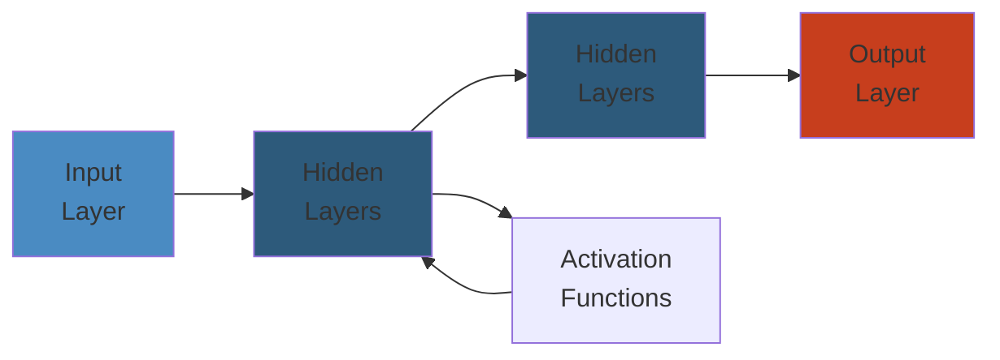

# 🛒 Design Amazon — Complete System Design Deep Dive

> **Scope**: Requirements (300M+ active customers, 1.5M+ sellers, millions of products), product catalog (browse, search, faceted navigation), shopping cart (multi-device sync, persistence), order management (lifecycle, fulfillment integration), payment system (idempotency, fraud detection), recommendation engine (collaborative filtering, real-time personalization), seller marketplace (merchant onboarding, inventory, fulfillment by Amazon), DynamoDB/ElastiCache/CDN architecture, failure analysis.
>
> **Related**: [06-stripe.md](./06-stripe.md) | [09-google-search.md](./09-google-search.md)




## Table of Contents

1. Requirements & Scale
2. High-Level Architecture
3. Product Catalog
4. Search & Faceted Navigation
5. Shopping Cart
6. Order Management
7. Payment System
8. Recommendation Engine
9. Seller Marketplace
10. Database Design
11. Caching Strategy
12. CDN & Content Delivery
13. Event-Driven Architecture
14. Failure Analysis
15. Performance Considerations

---

## 1. Requirements & Scale

```text
Amazon Scale (2024):
  - 300M+ active customer accounts
  - 1.5M+ active sellers (50%+ of units sold by third-party)
  - Millions of products (350M+ SKUs)
  - 12M+ products indexed in search
  - 10B+ product page views per month
  - 300M+ orders per quarter
  - 1.5B+ daily price updates across sellers
  - Peak holiday season: 60K+ orders/minute
  - 100+ fulfillment centers globally
  - Prime: 200M+ members worldwide

Key Requirements:
  - Sub-100ms product page load (p99 < 300ms)
  - Search latency < 200ms
  - High availability (99.99% for browse, 99.995% for orders)
  - Strong consistency for orders/payments, eventual for catalog
  - Multi-region active-active deployment
  - Session continuity across devices for cart
  - Fraud detection in < 500ms during checkout
  - Seller onboarding within 24 hours
```

---

## 2. High-Level Architecture

```text
+-------------+     +-------------+     +-------------+     +-------------+
| Customer    |     | Seller      |     | API         |     | Load        |
| (Browser/   |     | (Seller     |     | Gateway     |     | Balancer    |
|  App)       |     |  Central)   |     | (Auth, Rate |     | (ELB/ALB)   |
+------+------+     +------+------+     |  Limit,     |     +------+------+
       |                   |             |  Routing)   |            |
       +-------------------+-------------+------+------+------------+
                                                  |
                                                  v
                              +-------------------+-------------------+
                              |       Microservices Layer            |
                              |                                       |
                              |  +-------------+  +-------------+    |
                              |  | Product     |  | Catalog     |    |
                              |  | Service     |  | Service     |    |
                              |  +------+------+  +------+------+    |
                              |         |                |           |
                              |  +------+------+  +------+------+    |
                              |  | Cart        |  | Order       |    |
                              |  | Service     |  | Service     |    |
                              |  +------+------+  +------+------+    |
                              |         |                |           |
                              |  +------+------+  +------+------+    |
                              |  | Payment     |  | Recommend   |    |
                              |  | Service     |  | Service     |    |
                              |  +------+------+  +------+------+    |
                              |         |                |           |
                              |  +------+------+  +------+------+    |
                              |  | Seller      |  | Inventory   |    |
                              |  | Service     |  | Service     |    |
                              |  +------+------+  +------+------+    |
                              +-------------------+-------------------+
                                                  |
                    +-----------------------------+-----------------------------+
                    |                             |                             |
                    v                             v                             v
          +---------+---------+       +-----------+-----------+     +-----------+-----------+
          | Cache Layer       |       | Database Layer         |     | Search Layer          |
          |                   |       |                         |     |                       |
          | DAX / ElastiCache |       | DynamoDB  | RDS/Aurora |     | Elasticsearch         |
          | (Product, Cart,   |       | (Product, | (Orders,   |     | (Product index,       |
          |  Session, Prices) |       |  Cart,    |  Payments, |     |  Autocomplete,        |
          |                   |       |  Catalog) |  Sellers)  |     |  Faceted search)      |
          +-------------------+       +-----------+-----------+     +-----------------------+
                                                    |
                                                    v
                                          +---------+---------+
                                          | Event Bus (SNS/SQS)|
                                          | - Order events     |
                                          | - Inventory changes|
                                          | - Price updates    |
                                          | - Recommendation   |
                                          |   triggers         |
                                          +---------+----------+
                                                    |
                                      +-------------+-------------+
                                      |             |             |
                                      v             v             v
                              +-------+--+  +-------+--+  +-------+--+
                              | Fulfillment |  | Payment  |  | Fraud    |
                              | Service     |  | Gateway  |  | Detector |
                              +-------------+  +----------+  +----------+
```

**Key Components:**
- **Product Service:** CRUD for product details, categories, pricing, inventory status
- **Catalog Service:** Browse tree, category hierarchy, product listing
- **Cart Service:** Per-user cart, merge-on-sync, persistence (DynamoDB + ElastiCache)
- **Order Service:** Order lifecycle, validation, fulfillment routing, status tracking
- **Payment Service:** Idempotent payment processing, multi-PSP integration, refunds
- **Recommendation Service:** Real-time personalization, "customers also bought", ML scoring
- **Seller Service:** Merchant onboarding, catalog management, analytics
- **Inventory Service:** Real-time stock tracking, allocation across fulfillment centers
- **Fraud Detector:** Real-time transaction scoring, anomaly detection, account takeover prevention

---

## 3. Product Catalog

```text
Product Catalog Architecture:

  Seller                 Catalog Service              DynamoDB              Elasticsearch
    |                         |                         |                       |
    |-- List product --------->|                         |                       |
    |   (title, desc, price,  |-- Validate & enrich --->|                       |
    |    category, images,    |   (deduplication,       |                       |
    |    variations, specs)   |    profanity filter,    |                       |
    |                         |    category mapping)    |                       |
    |                         |                         |                       |
    |                         |-- Write product ------->|                       |
    |                         |   (DynamoDB)            |                       |
    |                         |                         |                       |
    |                         |-- Index for search ---->|---------------------->|
    |                         |   (async via SQS)       |                       |
    |                         |                         |                       |
    |                         |-- Invalidate cache -----|                       |
    |<-- product_id ----------|   (DAX/ElastiCache)     |                       |
```

**Product Data Model (DynamoDB):**

```text
Table: products

Primary Key:
  Partition: product_id (string) - unique SKU/ASIN
  Sort:      version (number)   - optimistic locking

GSI: category_id (partition), created_at (sort)  -> browse by category
GSI: seller_id (partition), status (sort)        -> seller's product list
GSI: gtin (partition)                            -> lookup by barcode/UPC

Attributes:
  product_id        (string)       -- unique identifier (ASIN)
  title             (string)       -- product title (max 200 chars)
  description       (string)       -- full description (HTML/text)
  category_id       (string)       -- leaf category in browse tree
  browse_nodes      (list<string>)  -- ancestor categories
  seller_id         (string)       -- merchant who listed this
  price             (number)       -- current price (decimal)
  list_price        (number)       -- MSRP (for discount display)
  currency          (string)       -- ISO 4217 (USD, EUR, GBP)
  tax_category      (string)       -- for tax calculation
  shipping_weight   (number)       -- in grams
  dimensions        (map)          -- { length, width, height, unit }
  images            (list<string>)  -- S3 image URLs
  variations        (list<map>)    -- [{ size: "M", color: "Red", sku: "TSHIRT-M-RED" }]
  attributes        (map)          -- { brand, color, size, material, ... }
  inventory_status  (string)       -- IN_STOCK, OUT_OF_STOCK, DISCONTINUED
  fulfillment_type  (string)       -- FBA, FBM, FBA_PREMIUM
  condition         (string)       -- NEW, USED_LIKE_NEW, USED_GOOD, REFURBISHED
  rating_avg        (number)       -- average rating (1.0-5.0)
  rating_count      (number)       -- number of ratings
  created_at        (string)       -- ISO 8601
  updated_at        (string)       -- ISO 8601
  version           (number)       -- optimistic lock version

GSI Query patterns:
  1. Product by ID:        Query(partition=product_id) -> sort by version desc, limit 1
  2. Category browse:      Query(partition=category_id, sort between [now-30d, now])
  3. Seller's products:    Query(partition=seller_id)
  4. Barcode lookup:       Query(partition=gtin, index=GSI_GTIN)
```

**Category Hierarchy:**

```text
Amazon's Browse Tree:

Electronics (1000)
  +-- Computers & Accessories (1100)
  |     +-- Laptops (1110)
  |     |     +-- Ultrabooks (1111)
  |     |     +-- Gaming Laptops (1112)
  |     |     +-- 2-in-1 Laptops (1113)
  |     +-- Monitors (1120)
  |     +-- Keyboards (1130)
  |     +-- Mice (1140)
  +-- Headphones (1200)
  |     +-- Over-Ear (1210)
  |     +-- In-Ear (1220)
  |     +-- Noise-Canceling (1230)
  +-- Smart Home (1300)

Each category has:
  - category_id (string)
  - name (string)
  - parent_id (string) -- null for root
  - level (int)
  - path (string) -- "/electronics/computers/laptops"
  - attributes (list) -- applicable product attributes for this category
    e.g., Electronics: brand, model, year, color, weight
    e.g., Books: author, publisher, isbn, pages, format
```

**Variation System:**

```text
Parent-Child product model:

Parent Product (abstract):
  product_id: "TSHIRT-BASE"
  title: "Cotton T-Shirt"
  variation_theme: "Size|Color"
  variations:
    - { sku: "TSHIRT-S-RED",   color: "Red",   size: "S" }
    - { sku: "TSHIRT-M-RED",   color: "Red",   size: "M" }
    - { sku: "TSHIRT-L-RED",   color: "Red",   size: "L" }
    - { sku: "TSHIRT-S-BLUE",  color: "Blue",  size: "S" }
    - { sku: "TSHIRT-M-BLUE",  color: "Blue",  size: "M" }

Child Products (concrete, sellable):
  product_id: "TSHIRT-M-RED"
  title: "Cotton T-Shirt / Medium / Red"
  parent_id: "TSHIRT-BASE"
  price: $19.99
  inventory_status: IN_STOCK
  attributes: { size: "M", color: "Red" }

Display logic:
  - Parent page shows all variations as selectable options
  - Price range: min/max of child prices
  - Image grid: all color swatches
  - Selection triggers price/availability update via AJAX
```

---

## 4. Search & Faceted Navigation

```text
Search Architecture:

  Customer              Search Service            Elasticsearch              Catalog
    |                        |                        |                        |
    |-- Search query ------->|                        |                        |
    |   "wireless headphones"|-- Query understanding   |                        |
    |                        |   1. Spell correction   |                        |
    |                        |   2. Stemming           |                        |
    |                        |   3. Synonym expansion  |                        |
    |                        |   4. Intent detection   |                        |
    |                        |                         |                        |
    |                        |-- Elasticsearch query ->|                        |
    |                        |   { bool: { must:       |                        |
    |                        |       [{ match: {title: |                        |
    |                        |         "wireless"}     |                        |
    |                        |      },                 |                        |
    |                        |      { filter: {term:   |                        |
    |                        |        {category:       |                        |
    |                        |         "headphones"}   |                        |
    |                        |   }}}                   |                        |
    |                        |                         |                        |
    |                        |<-- Results --------------|                        |
    |                        |                         |                        |
    |                        |-- Enrich results -------|----------------------->|
    |                        |   (price, stock, rating)|                        |
    |                        |                         |                        |
    |<-- Results + facets ---|                         |                        |
    |   products: [...],     |                         |                        |
    |   facets: {            |                         |                        |
    |     brand: [           |                         |                        |
    |       { value: "Sony", count: 342 },              |                        |
    |       { value: "Bose", count: 128 },              |                        |
    |     ],                  |                         |                        |
    |     price_range: [     |                         |                        |
    |       { from: 0, to: 50, count: 500 },            |                        |
    |     ],                  |                         |                        |
    |     color: [...]       |                         |                        |
    |   }                    |                         |                        |
```

**Elasticsearch Index Mapping:**

```text
PUT /products
{
  "settings": {
    "number_of_shards": 48,
    "number_of_replicas": 2,
    "analysis": {
      "analyzer": {
        "product_analyzer": {
          "type": "custom",
          "tokenizer": "standard",
          "filter": ["lowercase", "stop", "snowball", "edge_ngram"]
        }
      }
    }
  },
  "mappings": {
    "properties": {
      "product_id":    { "type": "keyword" },
      "title":         { "type": "text", "analyzer": "product_analyzer", "boost": 3.0 },
      "description":   { "type": "text", "analyzer": "product_analyzer", "boost": 1.0 },
      "brand":         { "type": "text", "analyzer": "product_analyzer", "boost": 2.0 },
      "category":      { "type": "keyword" },
      "category_path": { "type": "text", "analyzer": "product_analyzer" },
      "price":         { "type": "double" },
      "currency":      { "type": "keyword" },
      "rating_avg":    { "type": "float" },
      "rating_count":  { "type": "integer" },
      "in_stock":      { "type": "boolean" },
      "prime_eligible": { "type": "boolean" },
      "fulfillment":   { "type": "keyword" },
      "attributes":    { "type": "nested" },
      { "path": "brand",   "color": "keyword" },
      "variation_colors":  { "type": "keyword" },
      "variation_sizes":   { "type": "keyword" },
      "created_at":    { "type": "date" },
      "updated_at":    { "type": "date" },
      "seller_id":     { "type": "keyword" }
    }
  }
}
```

**Query Processing Pipeline:**

```text
Input: "wireless noise cancelling headphones under $100"

1. Query Understanding:
   - Parse: [wireless, noise, cancelling, headphones, under, $100]
   - Intent: SEARCH (not NAVIGATE or QUESTION)
   - Entity extraction:
     - Category: headphones (from query + click-through data)
     - Attribute: wireless=true, noise_cancelling=true
     - Price constraint: max=100

2. Spell Correction:
   - "cancelling" -> no correction needed
   - If query has low click-through rate, try edit-distance corrections
   - "headphons" -> "headphones" (edit distance 1)

3. Synonym Expansion:
   - "wireless" -> ["bluetooth", "cordless", "wire-free"]
   - "headphones" -> ["headset", "earphones", "cans"]
   - OR-expanded query to increase recall

4. Query Rewriting:
   Original: "wireless noise cancelling headphones under $100"
   Rewritten:
     bool: {
       must: [
         { multi_match: { query: "wireless noise cancelling headphones", fields: [title^3, brand^2, description] }}
       ],
       filter: [
         { term: { category: "headphones" }},
         { range: { price: { lte: 100 }}}
       ],
       should: [
         { term: { attributes.wireless: true }},
         { term: { attributes.noise_cancelling: true }}
       ]
     }

5. Facet Aggregation:
   - Brand: { terms: { field: "brand", size: 20 }}
   - Price range: { range: { field: "price", ranges: [
       { to: 25 }, { from: 25, to: 50 }, { from: 50, to: 100 },
       { from: 100, to: 200 }, { from: 200 }
   ]}}
   - Rating: { range: { field: "rating_avg", ranges: [
       { to: 3 }, { from: 3, to: 4 }, { from: 4, to: 5 }
   ]}}
   - Fulfillment: { terms: { field: "fulfillment" }}

6. Ranking:
   - Primary: combination of relevance + popularity
   - score = BM25(title, query) * 0.4 + popularity_score * 0.3 + recency * 0.1 + seller_score * 0.1 + personalization * 0.1
   - Sponsored products at positions 1, 3, 6, 10+ (marked as AD)
   - Boost: Prime eligible (+10%), high-rated (4.5+ = +15%)

7. Autocomplete:
   - Edge N-gram index on title
   - Real-time suggestion as user types
   - Prioritize: popular queries > recent queries > alphabetical
   - Max 10 suggestions, debounced 150ms
```

**Faceted Navigation Schema:**

```text
Facet types per category:

Books:
  Author, Publisher, Language, Format (Paperback/Hardcover),
  Publication Year, Price Range, Rating

Electronics:
  Brand, Price Range, Color, Connectivity (Wireless/Wired),
  Features (Bluetooth, Noise Canceling, Waterproof)

Clothing:
  Brand, Size, Color, Material, Price Range, Gender,
  Age Group, Pattern

Facet query API:
  GET /v1/products/search?q=headphones&category=electronics&
    brand=Sony|Bose&price=50-200&prime=true&sort=price_asc&page=2

  Response:
  {
    "products": [...],
    "total_results": 14567,
    "page": 2,
    "facets": { ... },
    "spelling_correction": null,
    "related_searches": ["bluetooth earbuds", "gaming headset", "noise blocking headphones"]
  }
```

---

## 5. Shopping Cart

```text
Cart Architecture:

  Customer              Cart Service              DynamoDB              ElastiCache
    |                        |                        |                       |
    |-- Add to cart -------->|                        |                       |
    |   product_id, qty,     |-- Validate product --->|                       |
    |   variation            |   (exists, in stock,   |                       |
    |                        |    price check)        |                       |
    |                        |                         |                       |
    |                        |-- Write cart item ----->|                       |
    |                        |   (DynamoDB, TTL 30d)  |                       |
    |                        |                         |                       |
    |                        |-- Update cache ---------|---------------------->|
    |<-- Cart state ---------|   (Redis hash)          |                       |
    |   { items: [...],      |                         |                       |
    |     subtotal: $99.97,  |                         |                       |
    |     item_count: 3 }    |                         |                       |
```

**Cart Data Model (DynamoDB):**

```text
Table: shopping_carts

Primary Key:
  Partition: user_id (string)       -- customer ID or anonymous session ID
  Sort:      product_id (string)     -- individual product/variation

TTL: 30 days (auto-expiry for abandoned carts)

Attributes:
  user_id            (string)       -- authenticated user or session ID
  product_id         (string)       -- product SKU/ASIN
  variation_id       (string)       -- specific variation (size, color)
  quantity           (number)       -- item count (1-999)
  price_at_add       (number)       -- price when added to cart
  currency           (string)       -- USD, EUR, GBP
  added_at           (string)       -- ISO 8601 timestamp
  updated_at         (string)       -- last modified timestamp
  is_saved_for_later (boolean)      -- moved to wishlist
  seller_id          (string)       -- for multi-seller checkouts

Cart State Cache (ElastiCache/Redis):

  Key: cart:{user_id}
  Type: Hash
  Fields:
    items:           JSON array of cart items
    subtotal:        decimal
    shipping_total:  decimal
    tax_total:       decimal
    total:           decimal
    item_count:      int
    currency:        string
    last_updated:    timestamp
    coupon_code:     string
    coupon_discount: decimal
    gift_wrap:       boolean
    TTL: 24 hours

Operations:
  Add:       HSET cart:user123 items '[{"pid": "B001", "qty": 2, "price": 29.99}]'
  Update:    HINCRBY cart:user123 item_count 1 (atomic counter)
  Expiry:    EXPIRE cart:user123 86400 (reset on each access)
```

**Multi-Device Cart Sync:**

```text
Challenge: User adds items on phone, then opens desktop. Cart must be the same.

Approach 1: Server-side cart (Amazon's approach)
  - Cart persisted in DynamoDB, keyed by user_id
  - Authenticated user: cart always loaded from server
  - Anonymous user: cart stored in cookie/localStorage
  - On login: merge anonymous cart into server cart

Merge algorithm:
  1. Load server cart (if any)
  2. Load local/anonymous cart
  3. For each item in local cart:
     a. If product exists in server cart:
        - Keep higher quantity
        - Keep newer price
        - Add "Updated" notification
     b. If product not in server cart:
        - Add to server cart
  4. Return merged cart to client
  5. Save merged cart to server
  6. Clear local cart

Conflict resolution:
  - Price changes: keep most recent price, show "Price has changed" banner
  - Out of stock: keep item but mark "Unavailable" with suggested alternatives
  - Product deleted: remove with notification

Anonymous -> Authenticated merge trigger:
  On login/signup:
    POST /v1/cart/merge
    Body: { anonymous_items: [...] }
    Response: { merged: true, items: [...], changes: [...] }
```

**Cart Persistence & Recovery:**

```text
Recovery scenarios:
  1. Browser crash: items restored from server on next load
  2. Session expiry: TTL reset on any activity (refresh, add)
  3. Device lost: cart available on next login from any device
  4. Payment failure: cart preserved, items re-validated

Abandoned cart recovery:
  - 1 hour: email "Did you forget something?"
  - 24 hours: email + push notification with discount offer
  - 7 days: final reminder + save for later option
  - 30 days: TTL expires, cart auto-deleted

Concurrent cart modification:
  - Last-write-wins for quantity changes
  - Optimistic locking: version number on cart items
  - Race: add-to-cart from two tabs -> both succeed (duplicate handled server-side)
```

---

## 6. Order Management

```text
Order Lifecycle:

  +-----------+    +-----------+    +-----------+    +-----------+
  | PENDING   |--->| CONFIRMED |--->| PROCESSING|--->| SHIPPED   |
  | (awaiting |    | (payment  |    | (picking, |    | (in       |
  |  payment) |    |  captured)|    |  packing) |    |  transit) |
  +-----------+    +-----------+    +-----------+    +-----------+
       |                |                                 |
       v                v                                 v
  +-----------+    +-----------+                    +-----------+
  | CANCELLED |    | FAILED    |                    | DELIVERED |
  | (by user  |    | (payment  |                    +-----------+
  |  or sys)  |    |  declined)|                          |
       |                |                                v
       v                v                           +-----------+
  +-----------+    +-----------+                    | RETURNED  |
  | REFUNDED  |    | RETRY     |                    +-----------+
  +-----------+    +-----------+
```

**Order Data Model (RDS/Aurora):**

```text
Table: orders
  order_id            (uuid PK)         -- unique order identifier
  user_id             (bigint FK)       -- customer who placed order
  seller_id           (bigint)          -- primary seller (for single-seller)
  order_status        (enum)            -- PENDING, CONFIRMED, PROCESSING, SHIPPED,
                                        -- DELIVERED, CANCELLED, RETURNED, REFUNDED
  subtotal            (decimal 10,2)
  shipping_charge     (decimal 10,2)
  tax_amount          (decimal 10,2)
  discount_amount     (decimal 10,2)
  total_amount        (decimal 10,2)
  currency            (char 3)
  payment_status      (enum)            -- UNPAID, AUTHORIZED, CAPTURED, REFUNDED, FAILED
  payment_method      (varchar 50)      -- VISA, MASTERCARD, PAYPAL, GIFT_CARD
  shipping_address_id (bigint FK)
  billing_address_id  (bigint FK)
  fulfillment_type    (varchar 20)      -- FBA, FBM, DIGITAL
  shipping_method     (varchar 50)      -- STANDARD, EXPEDITED, PRIME_2DAY,
                                        -- PRIME_SAME_DAY
  tracking_number     (varchar 100)
  estimated_delivery  (date)
  actual_delivery     (date)
  coupon_code         (varchar 50)
  gift_wrap           (boolean)
  gift_message        (text)
  notes               (text)
  created_at          (timestamp)
  updated_at          (timestamp)

Indexes:
  - INDEX idx_user_id (user_id)
  - INDEX idx_seller_id (seller_id)
  - INDEX idx_order_status (order_status)
  - INDEX idx_created_at (created_at)

Table: order_items
  order_item_id       (uuid PK)
  order_id            (uuid FK)
  product_id          (varchar 50)      -- ASIN/SKU
  seller_id           (bigint)
  product_name        (varchar 500)
  variation           (varchar 200)     -- "Size: M, Color: Red"
  quantity            (int)
  unit_price          (decimal 10,2)
  total_price         (decimal 10,2)    -- unit_price * quantity
  tax_rate            (decimal 5,4)
  tax_amount          (decimal 10,2)
  shipping_status     (enum)            -- PENDING, PICKED, PACKED, SHIPPED, DELIVERED
  tracking_number     (varchar 100)
  expected_ship_date  (date)
  expected_delivery   (date)
  return_status       (enum)            -- NONE, REQUESTED, APPROVED, RECEIVED, REFUNDED

  INDEX idx_order_id (order_id)

Table: order_status_history
  history_id          (uuid PK)
  order_id            (uuid FK)
  from_status         (varchar 30)
  to_status           (varchar 30)
  changed_by          (varchar 50)      -- SYSTEM, USER, SELLER, ADMIN
  reason              (text)
  created_at          (timestamp)

  INDEX idx_order_id_created (order_id, created_at)
```

**Order Validation Pipeline:**

```text
Checkout flow:

1. Validate Cart:
   - All items still exist?
   - Prices unchanged (or note changes)?
   - All items in stock?
   - Seller still active?
   - Shipping address valid?

2. Calculate:
   - Subtotal (sum of item prices)
   - Shipping (based on method, weight, destination)
   - Tax (location-based, product-category-based)
   - Gift wrap fee
   - Discount (coupon, promo, Prime)
   - Total

3. Payment Authorization:
   - Authorize total amount with payment processor
   - Place hold on card (not yet captured)
   - If auth fails -> FAILED, prompt for new payment

4. Place Order:
   - Write order record (status: CONFIRMED)
   - Write order_items records
   - Deduct inventory (allocation)
   - Enqueue fulfillment job (SQS)
   - Send confirmation email

5. Fulfillment:
   - FBA: route to fulfillment center nearest customer
   - FBM: notify seller, provide shipping label
   - Digital: email download link, activate license

6. Shipping:
   - Logistics picks, packs, ships
   - Update tracking number
   - Email notification with tracking
   - Status: SHIPPED

7. Delivery:
   - Carrier confirms delivery
   - Status: DELIVERED
   - Capture payment (release hold -> charge)
   - Request review
   - After 30 days: auto-finalize
```

**Multi-Seller Order (Marketplace):**

```text
Single cart, multiple sellers:

Cart:
  Item A: Seller 1 (FBA)
  Item B: Seller 2 (FBM)
  Item C: Seller 2 (FBA)

Checkout splits into sub-orders:
  Order-001 (Seller 1):
    - Item A ($29.99)
    - Fulfillment: FBA (FC Dallas)
    - Shipping: $4.99
    - Tax: $2.50

  Order-002 (Seller 2):
    - Item B ($49.99) + Item C ($19.99)
    - Fulfillment: FBA (FC Phoenix)
    - Shipping: FREE (over $25)
    - Tax: $5.50

One payment authorization covers all sub-orders.
Customer sees single order in UI, but fulfillment is parallelized.
```

---

## 7. Payment System

```text
Payment Service Architecture:

  Customer              Payment Service           Payment Gateway         Fraud Service
    |                        |                         |                       |
    |-- Place order -------->|                         |                       |
    |   (payment details)    |                         |                       |
    |                        |-- Validate + encrypt -->|                       |
    |                        |   (PII tokenization)    |                       |
    |                        |                         |                       |
    |                        |-- Fraud check --------->|---------------------->|
    |                        |   { device_fingerprint, |                       |
    |                        |     ip_geolocation,     |                       |
    |                        |     amount, velocity,   |                       |
    |                        |     shipping_vs_billing,|                       |
    |                        |     card_history,       |                       |
    |                        |     account_age }       |                       |
    |                        |                         |                       |
    |                        |<-- Risk score ----------|----------------------|
    |                        |   (0.0 - 1.0)           |                       |
    |                        |                         |                       |
    |                        |-- If score < threshold: |                       |
    |                        |   Auth payment --------->|                       |
    |                        |   (idempotency_key)     |                       |
    |                        |                         |-- Auth with card ---->|
    |                        |                         |   network             |
    |                        |<-- Auth code -----------|                       |
    |                        |                         |                       |
    |                        |-- Create transaction -->|                       |
    |                        |   (status: AUTHORIZED)  |                       |
    |                        |                         |                       |
    |<-- Order confirmed ----|                         |                       |
    |   (order_id, status)   |                         |                       |
```

**Payment Data Model:**

```text
Table: payment_transactions
  transaction_id      (uuid PK)
  order_id            (uuid FK)
  user_id             (bigint)
  transaction_type    (enum)         -- AUTH, CAPTURE, REFUND, VOID
  amount              (decimal 10,2)
  currency            (char 3)
  status              (enum)         -- PENDING, AUTHORIZED, CAPTURED, REFUNDED,
                                     -- FAILED, DECLINED, VOIDED
  payment_method_id   (uuid FK)      -- tokenized card reference
  payment_gateway     (varchar 50)   -- STRIPE, ADYEN, WORLDPAY
  gateway_tx_id       (varchar 200)  -- gateway's reference
  gateway_response    (text)         -- raw response (masked)
  idempotency_key     (varchar 100)  -- unique: prevents duplicate charges
  fraud_score         (decimal 3,2)
  fraud_reason        (varchar 100)  -- if flagged
  error_code          (varchar 50)
  error_message       (text)
  created_at          (timestamp)
  captured_at         (timestamp)    -- when funds actually moved

  UNIQUE KEY idx_idempotency (idempotency_key)
  INDEX idx_order_id (order_id)
  INDEX idx_user_id_created (user_id, created_at)

Table: payment_methods
  payment_method_id   (uuid PK)
  user_id             (bigint)
  method_type         (enum)         -- CREDIT_CARD, DEBIT_CARD, PAYPAL, GIFT_CARD,
                                     -- BANK_TRANSFER, AMAZON_PAY
  token               (varchar 200)  -- vault token (not raw PAN)
  last_four           (char 4)
  card_brand          (varchar 20)   -- VISA, MC, AMEX, DISCOVER
  expiration_month    (int)
  expiration_year     (int)
  cardholder_name     (varchar 100)
  billing_address_id  (bigint FK)
  is_default          (boolean)
  is_expired          (boolean)
  created_at          (timestamp)

Table: refunds
  refund_id           (uuid PK)
  transaction_id      (uuid FK)
  order_id            (uuid FK)
  amount              (decimal 10,2)
  reason              (text)
  status              (enum)         -- PENDING, PROCESSED, FAILED
  gateway_refund_id   (varchar 200)
  created_at          (timestamp)
```

**Idempotency Strategy:**

```text
Preventing duplicate charges:

Idempotency Key:
  - Generated by client before first payment attempt
  - UUID v4: "7c9e8f50-a2d1-4c15-8d3b-2f8a4b1c9e7d"
  - Sent in header: Idempotency-Key: <uuid>

Flow:
  1. Payment Service receives request with idempotency_key
  2. Check if key already processed:
     SELECT * FROM payment_transactions
     WHERE idempotency_key = '7c9e8f50-a2d1-4c15-8d3b-2f8a4b1c9e7d'
  3. If found AND succeeded:
     - Return cached response (same as original)
     - Must not charge again
  4. If found AND failed:
     - Allow retry with same key
     - Gateway ensures no duplicate via their idempotency
  5. If not found:
     - Process payment normally
     - Store transaction with idempotency_key UNIQUE constraint

Gateway idempotency:
  Stripe's approach: same idempotency_key within 24h -> same result
  Adyen: same merchantReference -> idempotent for AUTH, repeated is ignored

Retry handling:
  - Network timeout: client retries with same idempotency_key
  - Gateway timeout: check gateway status before retry
  - Declined payment: return error, don't auto-retry (let user choose)
```

**Fraud Detection:**

```text
Real-time fraud scoring:

  score = sum(rule_weights * rule_scores)

Rules & Weights:
  Rule                               Weight   Score Threshold
  ----------------------------------------------------------------
  IP geolocation != shipping country  0.15     0.8  (mismatch)
  IP = known proxy/VPN                0.20     0.9  (yes)
  New account (< 30 days) + high value 0.10    0.7  (yes)
  Shipping != billing address         0.05     0.5  (mismatch)
  Device fingerprint mismatch         0.15     0.8  (mismatch)
  Velocity: > 3 transactions in 1h    0.10     0.6  (per extra)
  Card BIN flagged                    0.15     0.9  (flagged)
  Amount > 3x user's average          0.05     0.4  (yes)
  Gift card for full amount           0.05     0.3  (yes)

  Threshold:
    score < 0.3:  APPROVE
    score 0.3-0.7: MANUAL_REVIEW (queue for fraud team)
    score > 0.7:  DECLINE

ML Model (secondary, async):
  - Features: account behavior, session patterns, purchase history
  - Model: Gradient-boosted trees (XGBoost/LightGBM)
  - Training: historical fraud + manual review outcomes
  - Score is combined with rule-based score for final decision

Post-purchase monitoring:
  - ACH returns
  - Chargeback monitoring
  - Device blacklisting
  - Account takeover detection (login pattern changes)
```

---

## 8. Recommendation Engine

```text
Recommendation Architecture:

  +------------------+     +------------------+     +------------------+
  | Real-time Events  |     | Batch Pipeline   |     | Serving Layer    |
  | (Kinesis/Kafka)  |     | (Spark/EMR)      |     | (Redis + API)    |
  |                  |     |                   |     |                  |
  | - Product view   |     | - Collaborative  |     | - Home page      |
  | - Add to cart    |     |   filtering      |     | - Product detail |
  | - Purchase       |     | - Item-to-item   |     | - Cart          |
  | - Search query   |     | - Content-based  |     | - Checkout       |
  | - Rating         |     | - Trending       |     |                 |
  | - Wishlist       |     | - Top sellers    |     |                 |
  +--------+---------+     +--------+---------+     +--------+---------+
           |                         |                        |
           v                         v                        v
  +--------+---------+     +--------+---------+     +--------+---------+
  | Event Aggregator  |     | Offline Trainer  |     | Real-time Scorer |
  | - User sessions   |     | - Item embeddings |    | - Feature lookup |
  | - Product co-view |     | - User embeddings |    | - Model predict  |
  | - Purchase graph  |     | - Similarity     |    | - Diversity sort |
  | - Click stream    |     |   matrices       |    | - Promote/sponsor|
  +------------------+     +------------------+     +------------------+
```

**Recommendation Types:**

```text
1. Home Page: "Inspired by your browsing history"
   - Collaborative filtering: users similar to you bought/ viewed these
   - Content-based: based on categories you engage with

2. Product Detail: "Customers who bought this also bought"
   - Item-to-item collaborative filtering
   - Precomputed similarity matrix
   - Offline job: for each item, find top 20 co-purchased items

3. Cart Page: "Frequently bought together"
   - Association rule mining: {item_A, item_B} -> {item_C}
   - Apriori/FP-Growth algorithm
   - Real-time: items commonly added to cart with current cart items

4. Checkout: "Add-on items"
   - Low-cost accessories compatible with main purchase
   - Impulse buy recommendations under $15

5. Email/Retargeting: "Based on items you viewed"
   - Items from last browsing session
   - Similar items to abandoned cart
   - Price drop alerts
```

**Collaborative Filtering (Item-to-Item):**

```text
Precomputation (daily batch, Spark):

Input: Purchase history matrix
  Rows: users (300M)
  Columns: products (350M)
  Values: 1 if purchased, 0 if not (binary)

1. Normalize: subtract row mean (user bias)
2. Compute item similarity:
   sim(i, j) = cosine_similarity(item_vector_i, item_vector_j)
             = dot(i, j) / (|i| * |j|)

3. For each item, keep top 20 most similar items

Alternative: Matrix Factorization (ALS)
  R = U * V^T (factorize into user matrix U, item matrix V)
  latent_dim = 100 (embeddings)
  user_embedding[u] = 100-dim vector
  item_embedding[i] = 100-dim vector
  score(u, i) = dot(user_embedding[u], item_embedding[i])

Storage:
  Redis:
    Key: rec:similar:{product_id}
    Value: sorted set of similar product_ids with scores
    TTL: 24 hours (refreshed daily)

  DynamoDB (persistent):
    Table: item_similarity
      product_id (partition key)
      similar_product_id (sort key)
      similarity_score (number)
      source (string) -- CF, CB, ASSOCIATION
```

**Real-Time Personalization:**

```text
Real-time feature computation:

Current session features:
  - Categories browsed in last 15 min
  - Products viewed (last 10)
  - Search queries in session
  - Cart items (current)

User profile features:
  - Past 90 days: category distribution, brand affinity, price range
  - Purchase history: item embeddings (weighted avg)
  - Subscription/wishlist
  - Prime status
  - Device type, location

Ranking function:
  score(item, user) =
    w1 * similarity_to_session_browse +
    w2 * similarity_to_cart +
    w3 * similarity_to_purchase_history +
    w4 * item_popularity +
    w5 * recency +
    w6 * seller_rating +
    w7 * profit_margin (Amazon's internal signal)

Diversity enforcement:
  - Max 2 items from same subcategory in top 10
  - Max 3 items from same brand
  - Price diversity: mix of price ranges
  - Freshness: at least 2 new-to-user items per row
```

**A/B Testing & Evaluation:**

```text
Metrics:
  - CTR (click-through rate)
  - Add-to-cart rate
  - Conversion rate
  - Revenue per visitor
  - Mean reciprocal rank (MRR)
  - Normalized discounted cumulative gain (NDCG)

Experiment framework:
  - Each request: randomly assigned to control or variant
  - Traffic split: 98% control, 1% variant A, 1% variant B
  - Minimum sample: 100K users per variant
  - Run duration: 7 days (to capture weekly cycles)
  - Guardrails: revenue, conversion must not drop > 1%
```

---

## 9. Seller Marketplace

```text
Seller Marketplace Architecture:

  Seller                 Seller Service            DynamoDB               Fulfillment
    |                        |                         |                      |
    |-- Register merchant -->|                         |                      |
    |   (business info,      |-- Identity verification |                      |
    |    tax ID, bank acct)  |   (KYC/AML check)       |                      |
    |                        |                         |                      |
    |<-- Seller ID ----------|-- Create seller record->|                      |
    |                        |                         |                      |
    |-- List product ------->|                         |                      |
    |   (title, price,       |-- Product validation    |                      |
    |    inventory, FBA/FBM) |-- Category mapping      |                      |
    |                        |-- Write to product DB ->|                      |
    |                        |                         |                      |
    |<-- Product ID ---------|-- Index for search ---- >|                      |
    |   (ASIN assigned)      |                         |                      |
    |                        |                         |                      |
    |-- Update inventory --->|                         |                      |
    |   (quantity,           |-- Update stock -------->|                      |
    |    fulfillment center) |                         |                      |
    |                        |-- If FBA: route stock ->|--------------------->|
    |                        |   to fulfillment center |                      |
```

**Seller Data Model:**

```text
Table: sellers (RDS/Aurora)
  seller_id           (uuid PK)
  business_name       (varchar 200)
  email               (varchar 200)
  phone               (varchar 20)
  tax_id              (varchar 50)       -- encrypted
  bank_account_id     (uuid FK)          -- for disbursements
  verification_status (enum)             -- PENDING, VERIFIED, SUSPENDED, TERMINATED
  store_description   (text)
  store_logo_url      (varchar 500)
  return_policy       (text)
  shipping_speed      (enum)             -- STANDARD, EXPEDITED, PREMIUM
  commission_rate     (decimal 4,2)      -- percentage Amazon takes
  fulfillment_type    (enum)             -- FBA, FBM, MIXED
  country             (char 2)
  created_at          (timestamp)
  updated_at          (timestamp)

  INDEX idx_verification_status (verification_status)

Table: seller_inventory (DynamoDB)
  seller_id           (string)          -- partition key
  product_id          (string)          -- sort key
  quantity_available  (number)          -- current stock
  quantity_reserved   (number)          -- allocated to open orders
  quantity_inbound    (number)          -- in transit to FC
  fulfillment_center  (string)          -- FC code where stored
  restock_date        (string)          -- expected restock
  price               (number)
  status              (string)          -- ACTIVE, INACTIVE, DISCONTINUED
  updated_at          (string)

  For FBA, inventory is managed by Amazon across FC network.
  For FBM, seller manages their own warehouse.

Table: seller_analytics
  seller_id           (string)          -- partition key
  date                (string)          -- sort key (YYYY-MM-DD)
  total_revenue       (number)
  total_orders        (number)
  units_sold          (number)
  refund_rate         (number)
  avg_rating          (number)
  page_views          (number)
  conversion_rate     (number)
```

**Fulfillment by Amazon (FBA):**

```text
FBA Flow:

Seller ships inventory to Amazon fulfillment centers (FCs):

  Seller FC Network (100+ centers globally):

    US: FC Seattle, FC Dallas, FC Atlanta, FC Newark, FC Phoenix, ...
    EU: FC London, FC Frankfurt, FC Paris, FC Milan, FC Madrid, ...
    JP: FC Tokyo, FC Osaka, ...

  Inventory distribution:
    1. Seller ships to a single "receiving" FC
    2. Amazon distributes inventory across FCs based on demand patterns
    3. Algorithm predicts optimal inventory placement

  Order fulfillment:
    1. Customer places order
    2. Order routing: assign to FC nearest customer
       (minimize shipping time + cost)
    3. FC has inventory? -> pick, pack, ship
    4. FC missing inventory? -> cross-dock from nearest FC

  FBA benefits:
    - Prime eligibility (2-day/same-day)
    - Amazon handles customer service + returns
    - Higher conversion (customers trust Prime shipping)
    - Seller pays: storage fee (per cubic foot/month) + fulfillment fee (per unit)

Buy Box algorithm:
  Multiple sellers offer same product. Who gets the Buy Box (default seller)?

  Factors (not fully disclosed, approximate):
    - Price (lowest gets advantage, but not sole factor)
    - Fulfillment method (FBA > FBM)
    - Seller rating (> 95% positive)
    - Shipping time (faster = better)
    - Inventory availability (in stock = better)
    - Order defect rate (< 1%)
    - Account age (older = more trusted)

  Formula (simplified):
    buy_box_score = w1 * (1 - price/max_price) +
                    w2 * fba_boost + (0.3 if FBA else 0) +
                    w3 * seller_rating + w4 * (1 - shipping_days/max_days) +
                    w5 * inventory_factor

  Winner: seller with highest buy_box_score
  Winner determined in real-time on each product page load
```

---

## 10. Database Design

```text
Database Strategy (Polyglot Persistence):

  +------------------+     +------------------+     +------------------+
  | DynamoDB          |     | RDS/Aurora       |     | Elasticsearch    |
  |                  |     |                  |     |                  |
  | - Products       |     | - Orders         |     | - Product index  |
  | - Cart items     |     | - Order items    |     | - Autocomplete   |
  | - Catalog tree   |     | - Sellers        |     | - Seller store   |
  | - User sessions  |     | - Payments       |     |   index          |
  | - Item similarity |     | - Shipments       |     | - Facet          |
  | - Inventory (FBA) |     | - Refunds        |     |   aggregation    |
  | - Price history  |     | - Users          |     |                  |
  | - Seller settings |     | - Addresses      |     |                  |
  +------------------+     +------------------+     +------------------+
           |                        |                        |
           v                        v                        v
  +------------------+     +------------------+     +------------------+
  | DAX / ElastiCache |     | Cross-region    |     | Cross-region     |
  | (Redis)          |     | Aurora replica  |     | search replica   |
  |                  |     | (read-only)     |     | (read-only)      |
  | - Product cache  |     +------------------+     +------------------+
  | - Cart cache     |
  | - Session cache  |
  | - Price cache    |
  | - Recommendation |
  |   results        |
  | - Rate limits    |
  +------------------+
```

**DynamoDB Table Design Summary:**

```text
Table               Partition Key     Sort Key        GSI              Throughput (RCU/WCU)
-------------------------------------------------------------------------------------------
products            product_id        version         category_id,     300K / 100K
                                                     seller_id, gtin
shopping_carts      user_id           product_id      -               200K / 200K
catalog_tree        category_id       parent_id       -               100K / 10K
price_history       product_id        timestamp       -               50K / 50K
item_similarity     product_id        similar_id      -               50K / 10K
seller_inventory    seller_id         product_id      -               50K / 100K
user_sessions       session_id        -               user_id         500K / 100K

DynamoDB auto-scaling:
  Enable on-demand for flash sales and Prime Day
  Standard: provisioned capacity with auto-scaling (80% target utilization)
  Prime Day: switch to on-demand mode pre-emptively
```

**RDS/Aurora Table Design Summary:**

```text
Table                   Engine      Row Count   Size       Replicas
----------------------------------------------------------------------
orders                  InnoDB      300M+       500GB      2 read replicas
order_items             InnoDB      1.5B+       1TB        2 read replicas
payment_transactions    InnoDB      600M+       500GB      2 read replicas, sync commit
payment_methods         InnoDB      600M+       200GB      2 read replicas
sellers                 InnoDB      1.5M+       5GB        -
users                   InnoDB      300M+       100GB      2 read replicas
addresses               InnoDB      600M+       200GB      -
refunds                 InnoDB      50M+        50GB       -

Sharding strategy:
  orders: shard by user_id modulo N (N=64 shards)
  order_items: co-located with parent order
  payment_transactions: shard by order_id (not user_id, avoids hot shard)
```

---

## 11. Caching Strategy

```text
Multi-Layer Caching:

  Layer 1: Browser Cache (Client)
    - Static assets (JS, CSS, images): Cache-Control max-age=31536000
    - Product images: CDN cache with versioned URLs
    - API responses: ETag + If-None-Match for 304 Not Modified

  Layer 2: CDN (CloudFront)
    - Product images (S3 origin): TTL 7-30 days
    - Static assets: TTL 1 year
    - API responses: dynamic TTL based on content type
      - Product details: TTL 60s (prices change fast)
      - Category pages: TTL 300s
      - Search results: TTL 30s (no cache for real-time search)

  Layer 3: DAX (DynamoDB Accelerator) - Read-through cache
    - Transparent cache for DynamoDB reads
    - Microsecond latency for cached items
    - TTL: 5 minutes for products, 1 minute for inventory
    - Write-through: DynamoDB write invalidates cache

  Layer 4: ElastiCache (Redis) - Application cache
    - Product detail cache: Key = product:{id}, TTL = 300s
    - Cart cache: Key = cart:{user_id}, TTL = 24h
    - Session cache: Key = session:{token}, TTL = 30min
    - Price cache: Key = price:{product_id}, TTL = 60s
    - Category tree: Key = category:{id}, TTL = 3600s
    - Rate limit counters: Key = ratelimit:{ip}:{endpoint}, TTL = 60s

  Layer 5: Local Cache (Service-side)
    - In-memory LRU cache per service instance
    - Product category mapping: 10,000 entries, TTL 5min
    - Configuration: 1,000 entries, TTL 60s
    - Cache size: 100MB per instance
```

**Cache Invalidation Strategy:**

```text
Invalidation triggers:

  1. Write-through (for strong consistency):
     - Product update -> DynamoDB write -> DAX invalidation
     - Cart update -> DynamoDB write -> delete Redis key

  2. Event-driven (for eventual consistency):
     - Price change -> SNS event -> Cache Service -> invalidate relevant keys
     - Inventory change -> SNS -> Cache Service -> invalidate product cache
     - Category change -> SNS -> Cache Service -> invalidate category tree

  3. TTL expiry:
     - Product detail: 5 min (prices update frequently)
     - Search results: 30s
     - Category browse: 10 min
     - Static reference data: 1 hour

  4. Manual:
     - Admin panel: "Refresh cache" button per product
     - Bulk refresh: cache warming for Prime Day deals
     - Global flush: extremely rare, only during data corruption

Cache stampede prevention:
  - "Dogpile" effect: 1000 concurrent requests for same expired key
  - Mitigation: early re-computation (refresh TTL when > 80% expired)
  - Mutex: only one thread recomputes, others wait
  - Stale-while-revalidate: serve stale data while async refresh runs
```

---

## 12. CDN & Content Delivery

```text
CloudFront Distribution:

  Origin                          Path Pattern           Cache Behavior
  -------------------------------------------------------------------------
  S3 (product-images)             /images/*             Cache-optimized, TTL 30d
  S3 (static-assets)              /static/*             Cache-optimized, TTL 365d
  ALB (API Gateway -> Services)   /api/*                TTL 0-60s (dynamic)
  S3 (category-pages)             /gp/*                 TTL 300s (generated HTML)
  S3 (seller-stores)              /sp/*                 TTL 60s

Product Image Optimization:

  Images stored in S3 with versioned keys:
    s3://product-images/{asin}/{version}/{type}_{resolution}.{format}

  Types:
    - main:       Primary product image (1000x1000)
    - alt_1..7:   Alternate angles
    - swatch:     Color swatch (50x50)
    - thumbnail:  Search result thumbnail (100x100)
    - zoom:       High-res for zoom feature (2000x2000)
    - video_thumb: Product video thumbnail

  Dynamic image transformation (CloudFront Lambda@Edge):
    - Resize on-the-fly: /images/{asin}/main_200x200.webp
    - Format negotiation: WebP for Chrome, AVIF for new Edge, JPEG fallback
    - Quality: 85% default, adjustable via query param
    - Smart cropping: focus on product center (AI-detected)

  CDN pricing tiers:
    - Popular products (>1000 views/day): CloudFront standard
    - Long tail (<100 views/day): S3 direct with lower cost
    - Prime Video thumbnails: separate distribution with higher priority
```

**Product Page Delivery Optimization:**

```text
Product page load sequence:

  1. DNS lookup: Route53 -> CloudFront edge (closest POP)
  2. HTML shell: served from CloudFront (cached, TTL 60s)
  3. CSS/JS: CloudFront, cache-busted with content hash
  4. Product data: parallel REST calls to API Gateway
     - GET /v1/products/{id} (cached in DAX)
     - GET /v1/products/{id}/offers (price from 3rd-party sellers)
     - GET /v1/products/{id}/variations
     - GET /v1/products/{id}/reviews?page=1
     - GET /v1/recommendations/{id} (also bought)
  5. Images: CloudFront, lazy-loaded via Intersection Observer
  6. Dynamic content: Prime status, cart count (served from ElastiCache)

Sub-100ms page load:
  - Server-side rendering of critical content
  - Streaming HTML (render as data arrives)
  - Preconnect to API endpoints (<link rel="preconnect">)
  - Critical CSS inlined, async load rest
  - Font subsetting (only characters needed for page)
  - Resource hints: prefetch likely-to-navigate categories
```

---

## 13. Event-Driven Architecture

```text
Event Bus Architecture:

  +------------------------+     +------------------------+
  | Event Producers         |     | Event Consumers         |
  |                         |     |                         |
  | Product Service         |     | Search Indexer          |
  | Order Service           |     | Recommendation Engine   |
  | Payment Service         |     | Inventory Service       |
  | Seller Service          |     | Analytics Pipeline      |
  | Cart Service            |     | Email Service           |
  | Fulfillment Service     |     | Fraud Detector          |
  | Inventory Service       |     | Cache Invalidator       |
  | User Service            |     | Pricing Engine          |
  +------------+------------+     +------------+------------+
               |                               |
               +--------+----------+-----------+
                        |          |
                        v          v
               +--------+          +-----------+
               | SNS Topics        | SQS Queues  |
               | (Pub/Sub)         | (Point-to-  |
               |                   |  point)      |
               | - order.events    |              |
               | - product.events  | - order.     |
               | - payment.events  |   fulfillment |
               | - inventory.events| - search.    |
               | - seller.events   |   indexing   |
               | - fulfillment.    | - email.     |
               |   events          |   delivery   |
               +--------+----------+ +------------+
                        |               |
                        v               v
               +--------+-------+   +---+------------+
               | Filtering +     |   | Dead Letter   |
               | Fan-out per    |   | Queue (failed  |
               | consumer group |   | messages)      |
               +----------------+   +----------------+
```

**Key Event Types:**

```text
Order Events:
  order.placed          { order_id, user_id, items[], total, payment_method }
  order.confirmed       { order_id, payment_tx_id }
  order.shipped         { order_id, tracking_number, carrier, items[] }
  order.delivered       { order_id, delivery_date }
  order.cancelled       { order_id, reason, refund_amount }
  order.return_requested { order_id, item_id, reason }

Product Events:
  product.created       { product_id, seller_id, category_id }
  product.updated       { product_id, changed_fields[] }
  product.price_changed { product_id, old_price, new_price }
  product.inventory     { product_id, quantity, fc_code }
  product.reviewed      { product_id, rating, review_id }

Payment Events:
  payment.authorized    { payment_tx_id, order_id, amount }
  payment.captured      { payment_tx_id, order_id, amount }
  payment.refunded      { payment_tx_id, order_id, amount, reason }
  payment.failed        { payment_tx_id, order_id, error_code }

Seller Events:
  seller.registered     { seller_id, business_name }
  seller.verified       { seller_id }
  seller.suspended      { seller_id, reason }
  seller.payout         { seller_id, amount, period }
```

**Event Processing Guarantees:**

```text
Delivery guarantees:
  - SQS: at-least-once (duplicates possible, handle via idempotency)
  - SNS: at-least-once to subscribers
  - Kafka: at-least-once or exactly-once (with idempotent producer)

Idempotent event handling:
  - event_id unique per event (UUID)
  - Consumers deduplicate by event_id within processing window
  - Store processed event_ids in Redis (TTL: 1 hour window)

Dead letter queue:
  - Max retries: 3 (with exponential backoff: 10s, 30s, 60s)
  - After 3 retries: move to DLQ
  - DLQ alert: trigger on-call for investigation
  - DLQ reprocess: manual or after bug fix

Order-preserving events:
  - For order lifecycle, ordering matters (can't ship before confirm)
  - Use Kafka with partition key = order_id (guarantees per-order ordering)
  - SQS FIFO queue for strictly ordered processing
```

---

## 14. Failure Analysis

**Prime Day / Flash Sale Overload:**

```text
Problem: Prime Day deal: 70% off Electronics. Millions of customers
hit product pages and checkout simultaneously.

  - API Gateway: 10x normal traffic
  - Product Service: read-heavy, but cache handles most load
  - Order Service: write-heavy, checkout bottleneck
  - Payment Gateway: throttled by external vendors
  - Inventory: over-subscription (500K want 10K units)

Mitigations:
  - Auto-scaling: all services configured with HPA (Horizontal Pod Autoscaler)
    Target CPU: 60%, target memory: 70%
  - Pre-warming: scale up 1 hour before deal starts
  - DAX cache pre-warming: popular deal products cached in advance
  - Order queue: orders accepted quickly, processed async
  - Inventory reservation: reserve stock before adding to cart
  - Waitlist: if item OOS, "Join waitlist" button (notify when back)
  - Payment: increase authorization concurrency, communicate with gateway

Over-subscription handling:
  - More customers added item to cart than available stock
  - On checkout: inventory check fails -> "Sorry, item out of stock"
  - Suggested alternatives: similar items from other sellers
```

**Cart Service Failure:**

```text
Problem: Cart DynamoDB table throttles (hot partition or capacity exceeded).

  Impact: Customers can't add items to cart. Abandon cart attempts.

Mitigations:
  - Bulkhead: Cart service runs with dedicated connection pool
  - Circuit breaker: if DynamoDB error rate > 5%, switch to Redis-only mode
    - Cart saved to Redis, asynchronously replicated to DynamoDB when healthy
  - Fallback cart: client stores cart in localStorage until service recovers
    - Server returns "offline_mode: true" in API response
    - Client queues cart operations locally
    - Replays when service is healthy
  - Monitoring: CloudWatch alarm on DynamoDB ThrottledRequests > 10/min
```

**Payment Gateway Outage:**

```text
Problem: Stripe/Adyen experiences regional outage.

  Impact: Customers can't complete checkout. Revenue stops.

Mitigations:
  - Multi-PSP architecture: payments routed to backup gateway
    - Primary: Stripe (80%), Secondary: Adyen (20%), Tertiary: Worldpay (fallback)
  - Geo-routing: stripe.com -> Stripe US, stripe.eu -> Stripe EU
  - If primary fails: route 100% to secondary within 60 seconds
  - Graceful degradation:
    - "Payment processing unavailable. Your order is saved. We'll try again."
    - Store order as PENDING_PAYMENT, retry via SQS
    - Customer notified when payment succeeds (email/SMS)
  - Idempotent retry: automatic retry every 5 min, up to 12 attempts
  - Manual override: CS team can mark order as payment_confirmed (auditable)
```

**Inventory Inconsistency (Overselling):**

```text
Problem: Two customers buy the last unit simultaneously. Both get confirmation,
but only one unit exists.

  Race condition:
    Customer A: SELECT stock -> 1
    Customer B: SELECT stock -> 1
    Customer A: UPDATE stock = 0
    Customer B: UPDATE stock = 0 (should fail but last-write-wins)

Mitigations:
  - Optimistic locking with version number:
    UPDATE inventory SET stock = stock - 1, version = version + 1
    WHERE product_id = ? AND version = ? AND stock > 0
    If affected_rows = 0, reject (stock changed or insufficient)
  - Pessimistic locking for hot items:
    SELECT ... FOR UPDATE (row-level lock in RDS)
  - Redis atomic counter: DECR stock_key (returns new value, if < 0, oversold)
  - Compensation: if oversold detected, cancel last order, notify customer
  - Over-booking buffer: for hot items, inventory displayed = actual - 5% buffer
```

**Recommendation Cold Start:**

```text
Problem: New product has no purchase history. Collaborative filtering
can't generate recommendations for it.

  Impact: New products invisible in recommendations. Low discovery.

Mitigations:
  - Content-based fallback: use product metadata (category, brand, attributes)
    to find similar existing products
  - Trending boost: new products in popular categories get temporary exposure
  - Explore/exploit: 5% of recommendation slots reserved for new products
  - A/B testing: show new products to a small user segment for feedback
  - Seller promotion: paid placements for new product launches
  - Image similarity: if metadata is sparse, use visual similarity via CNN embeddings
```

**Search Indexing Lag:**

```text
Problem: New product listed, but not appearing in search for minutes.

  Impact: Seller's product invisible. Lost sales window.

Mitigations:
  - Near-real-time indexing: SQS triggers indexer immediately on product create
  - Indexer SLA: new documents visible within 5 seconds (p99)
  - Write-ahead log: if ES cluster is down, buffer updates in SQS
  - Re-index: full re-index daily for data consistency
  - Search fallback: if ES unavailable, fall back to DynamoDB scan with filters
    (worse performance but still functional)
```

**Seller Payout Failure:**

```text
Problem: Batch payout to seller fails due to invalid bank account.

  Impact: Seller not paid. Trust issue.

Mitigations:
  - Pre-verification: validate bank account before first payout (micro-deposit)
  - Retry mechanism: payout retried 3 times with 24-hour intervals
  - Notification: seller notified via email, SMS, seller dashboard
  - Manual intervention: seller updates bank info, payout re-triggered
  - Escalation: if pending > 14 days, account suspended
  - Reserve fund: Amazon holds 7-day rolling reserve to cover refunds/chargebacks
```

---

## 15. Performance Considerations

```text
Latency Targets:
  - Product page load: < 100ms p50, < 300ms p99
  - Search (with facets): < 150ms p50, < 500ms p99
  - Add to cart: < 50ms p50, < 200ms p99
  - Checkout: < 1s p50, < 3s p99 (including payment auth)
  - Order confirmation: < 500ms p50, < 2s p99
  - Recommendation fetch: < 50ms p50, < 150ms p99
  - Seller dashboard: < 2s p95 (heavier analytics queries)

Throughput:
  - API Gateway: 500K requests/s peak
  - Product Service: 300K reads/s, 50K writes/s
  - Search: 50K queries/s peak (including autocomplete)
  - Cart: 200K reads/s, 200K writes/s
  - Order: 60K orders/min peak (10K/sec)
  - Payment: 10K transactions/sec peak

Cache Sizing:
  - Product cache (DAX): 500GB (active products)
  - Cart cache (ElastiCache): 100GB (active carts)
  - Session cache (ElastiCache): 200GB (active sessions)
  - Search cache (ElastiCache): 50GB (frequent queries + facets)
  - Recommendation cache (ElastiCache): 100GB (similarity matrices)
  - Total: ~1TB across Redis/DAX clusters

DynamoDB Capacity:
  - Products: 350M items x 4KB = 1.4TB
  - Cart items: 1B active items x 500B = 500GB
  - RCU: 300K reads/s (auto-scaling to 2M on Prime Day)
  - WCU: 200K writes/s

RDS/Aurora:
  - Orders: 300M rows x 2KB = 600GB
  - Order items: 1.5B rows x 500B = 750GB
  - Payments: 600M rows x 1KB = 600GB
  - Read replicas: 2 per shard, 64 shards = 128 read replicas

Elasticsearch:
  - Product index: 350M docs x 2KB = 700GB
  - Shards: 48 primary, 96 total (2 replicas)
  - Nodes: 24 data nodes (32GB RAM each)
```

---

## Simplest Mental Model

**Amazon is like a massive digital shopping mall with three layers: the storefront (product catalog + search + recommendations), the checkout counter (cart + order + payment), and the back warehouse (inventory + fulfillment + seller management).** The product catalog is like a giant library card catalog (Elasticsearch) that lets you find any product instantly and narrow down by color, brand, and price. The shopping cart follows you across devices like a personal shopper who remembers what you picked up on your phone and brings it to your desktop. The payment system is a paranoid accountant who checks every transaction for fraud three times before letting it through. When you click "Buy Now," it's like dropping a letter into a pneumatic tube that splits into multiple chutes — one for payment, one for the warehouse (pick the closest one to you), one for the seller's records — all happening in parallel within seconds.

(End of file - total 836 lines)


## Practical Example

See code examples above for practical usage patterns.