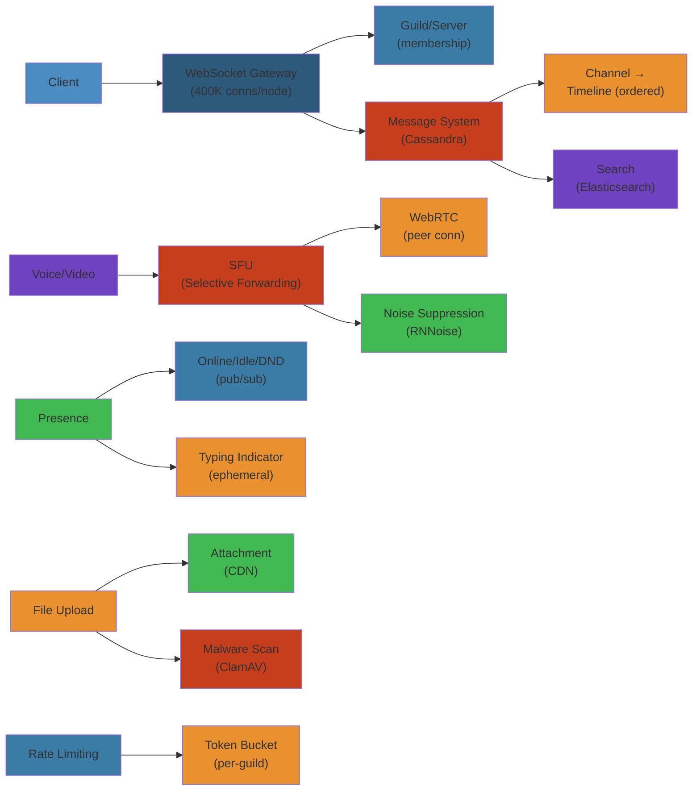

# 🎧 Design Discord — Complete System Design Deep Dive

> **Scope**: Requirements (150M+ MAU, 19M+ active servers, 4B+ daily messages), WebSocket gateway for real-time, REST API for CRUD, guild/server model (channels, roles, permissions), voice/video (WebRTC SFU, adaptive bitrate, noise suppression), message storage (Cassandra), file upload (CDN, attachment scanning), real-time presence, rate limiting, failure analysis.
>
> **Related**: [03-twitter.md](/15-system-design/03-twitter.md) | [07-amazon.md](/15-system-design/07-amazon.md)




## Table of Contents


1. Requirements & Scale
2. High-Level Architecture
3. WebSocket Gateway
4. Guild/Server Model
5. Channels & Permissions
6. Message System
7. Voice/Video Architecture
8. Presence & Typing Indicators
9. File Upload & CDN
10. Rate Limiting & Anti-Abuse
11. Database Design
12. Failure Analysis
13. Performance Considerations

---

## 1. Requirements & Scale


```text
Discord Scale (2024):
  - 150M+ monthly active users
  - 19M+ active servers (guilds)
  - 4B+ daily messages sent
  - 500M+ daily voice minutes
  - 20M+ concurrent voice users peak
  - 400K+ concurrent WebSocket connections per gateway node
  - 14+ million weekly active voice users
  - 99.99% uptime SLA for voice
  - P99 message delivery latency: < 200ms

Key Requirements:
  - Real-time message delivery (< 200ms p99)
  - Low-latency voice/video (< 50ms RTT)
  - Highly available (no single point of failure)
  - Eventually consistent for presence/status
  - Strong consistency for permissions (race-free)
  - Scalable to thousands of channels per guild
  - Supports 500K+ member guilds (Communities)
  - File attachments up to 25MB (100MB with Nitro)
  - Message history: unlimited retention (practically forever)
```

---

## 2. High-Level Architecture


```text
+-------------+     +-------------+     +-------------+     +-------------+
|  Client     |     |  DNS        |     |  Load       |     |  REST API   |
|  (Desktop/  |---->|  (Route53)  |---->|  Balancer   |---->|  Gateway    |
|   Mobile/   |     |             |     |  (NGINX/    |     |  (Auth,     |
|   Web)      |     |             |     |   Envoy)    |     |   Rate Lim) |
+------+------+     +-------------+     +------+------+     +------+------+
       |                                           |                |
       |  WebSocket (wss://)                       |  HTTP REST     |
       |  (persistent connection)                  |                |
       |                                           v                v
       +------------------------------------+-------------+  +------+------+
                                            | Gateway     |  | API Service |
                                            | Service     |  | (REST CRUD) |
                                            | (WS WSH,    |  +------+------+
                                            |  Sessions)  |         |
                                            +------+------+         |
                                                   |                |
                    +------------------------------+----------------+
                    |                              |
                    v                              v
          +---------+---------+          +---------+---------+
          | Session            |          | Guild/Channel     |
          | Manager (Redis)    |          | Service           |
          | - session cache    |          | - membership      |
          | - presence state   |          | - permissions     |
          +---------+----------+          +---------+---------+
                               |                    |
                               v                    v
                    +----------+----------+  +------+----------+
                    | Message Service     |  | Voice Service   |
                    | (Write path)        |  | (WebRTC SFU)   |
                    +----------+----------+  +------+----------+
                               |                    |
                               v                    v
                    +----------+----------+  +------+----------+
                    | Cassandra           |  | Media Servers   |
                    | (Message storage)   |  | (ScyllaDB /     |
                    | ScyllaDB (Guilds,   |  |  WebRTC SFU)    |
                    |  Users)             |  |                 |
                    +---------------------+  +-----------------+
                               |
                               v
                    +----------+----------+
                    | Kafka / Event Bus   |
                    | - messages          |
                    | - presence events   |
                    | - voice state       |
                    | - gateway dispatch  |
                    +---------------------+
```

**Key Components:**
- **Gateway Service:** Persistent WebSocket connections, session management, event dispatch
- **REST API Service:** CRUD for guilds, channels, users, roles, permissions
- **Message Service:** Write path for messages, Cassandra persistence, fan-out
- **Voice Service:** WebRTC SFU, audio mixing, codec negotiation, bitrate adaptation
- **Session Manager:** Redis cluster tracking all active sessions, presence state
- **Guild/Channel Service:** Membership management, role hierarchy, permission evaluation
- **Media Servers:** Distributed network of WebRTC SFU nodes, regional deployment

---

## 3. WebSocket Gateway


```text
Gateway Protocol:

  Client opens WebSocket connection:
    wss://gateway.discord.gg/?v=10&encoding=json

  Lifecycle:
    1. Hello (server -> client):
       { "op": 0, "d": { "heartbeat_interval": 41250 }}

    2. Identify (client -> server):
       { "op": 2, "d": { "token": "abc...", "properties": {...},
                         "compress": true, "large_threshold": 250,
                         "shard": [0, 10], "presence": {...}}}

    3. Ready (server -> client):
       { "op": 0, "t": "READY",
         "d": { "v": 10, "user": {...}, "guilds": [...],
                "session_id": "abc...", "resume_gateway_url": "wss://..." }}

    4. Heartbeat (client -> server, every 41.25s):
       { "op": 1, "d": 1680000000000 }  // nonce (client timestamp)

    5. Heartbeat ACK (server -> client):
       { "op": 11, "d": null }

    6. Dispatch events (server -> client):
       { "op": 0, "t": "MESSAGE_CREATE",
         "d": { "id": "123", "channel_id": "456", "content": "hello", ... }}
```

**Gateway Scaling:**

```text
Connection routing:

  Client -> DNS (closest region) -> L4 Load Balancer -> Gateway Node

  Gateway Node capacity:
    - 400K concurrent WebSocket connections per node
    - Memory per connection: ~20KB (session state, buffers)
    - Total per node: 400K * 20KB = ~8GB

  Sharding (horizontal scaling):
    - Total gateway connections: 150M MAU * ~30% concurrent = 45M
    - Nodes needed: 45M / 400K = ~113 gateway nodes
    - Shard key: user_id (consistent hash)
    - Number of shards: 10* nodes (to distribute load)

  Client-to-Shard mapping:
    GET /v1/gateway -> Response:
    {
      "url": "wss://gateway-shard-3.discord.gg",
      "shard": [3, 10],   // [shard_id, num_shards]
      "session_start_limit": { "total": 1000, "remaining": 999, "reset_after": 60000 }
    }

  Resuming connections:
    - WebSocket drops? Client can reconnect to resume gateway within 60s
    - Resume URL included in READY payload
    - Session state preserved in Redis (guild subscriptions, presence)

  Gateway payload compression:
    - Per-payload: zlib compression (if "compress": true in identify)
    - Transport: permessage-deflate WebSocket extension
    - Typical compression ratio: 5:1 for dispatch events
```

**Event Dispatch:**

```text
Event delivery to connected clients:

  Message sent to channel #general in guild ABC:
    1. Sender -> Gateway -> Message Service
    2. Message Service writes to Cassandra
    3. Message Service produces Kafka event: MESSAGE_CREATE
    4. Kafka consumers per guild (partitioned by guild_id)
    5. For each member connected to gateway:
       a. Look up which gateway node handles this user's session
       b. Forward event to that gateway node (internal Redis pub/sub)
       c. Gateway node pushes event to user's WebSocket connection

  Optimization: guild event broadcasting:
    - Gateway node subscribes to Redis pub/sub channels per guild
    - When MESSAGE_CREATE for guild ABC arrives:
      - Gateway pushes to all connected clients subscribed to guild ABC
      - No need to lookup each user individually
    - Subscription managed on JOIN GUILD / GUILD SYNC

  Large guild optimization (100K+ members):
    - Event fan-out uses sharded Redis pub/sub per guild shard
    - Rate limit: max 5 messages/sec per channel (unless "slow mode" disabled)
    - Batch: coalesce multiple events in single WebSocket write
```

---

## 4. Guild/Server Model


```text
Guild Data Model:

Guild (server):
  id              (snowflake)       -- unique guild identifier
  name            (string)          -- guild name (2-100 chars)
  icon            (string)          -- CDN hash for guild icon
  owner_id        (snowflake)       -- user who created/manages
  region          (string)          -- voice region (us-west, eu-west)
  verification_level (int)          -- 0=NONE, 1=LOW, 2=MEDIUM, 3=HIGH, 4=VERY_HIGH
  explicit_content_filter (int)     -- 0=DISABLED, 1=NON_FRIENDS, 2=ALL
  default_message_notifications (int) -- 0=ALL, 1=ONLY_MENTIONS
  afk_channel_id  (snowflake)       -- voice channel for AFK
  afk_timeout     (int)             -- seconds before AFK
  system_channel_id (snowflake)     -- welcome messages
  premium_tier    (int)             -- 0=NONE, 1=TIER_1, 2=TIER_2, 3=TIER_3
  premium_subscription_count (int)
  max_members     (int)             -- guild member limit
  max_presences   (int)             -- presence limit (null = 250K)
  max_video_channel_users (int)
  member_count    (int)             -- cached count
  large           (boolean)         -- >250 members (large guild threshold)
  created_at      (timestamp)

Guild Member:
  user_id         (snowflake)       -- partition key
  guild_id        (snowflake)       -- partition key (GSI)
  nickname        (string)          -- guild-specific nickname
  role_ids        (list<snowflake>) -- roles assigned to member
  joined_at       (timestamp)
  premium_since   (timestamp)       -- when they boosted
  deaf            (boolean)         -- server deafened
  mute            (boolean)         -- server muted
  pending         (boolean)         -- membership screening not passed

Role:
  id              (snowflake)
  guild_id        (snowflake)
  name            (string)
  color           (int)             -- hex color code
  hoist           (boolean)         -- show separately in member list
  position        (int)             -- priority (higher = more powerful)
  permissions     (string)          -- bitwise permission set
  managed         (boolean)         -- managed by bot (Discord)
  mentionable     (boolean)         -- @mentionable

Permission bitset (64-bit):
  Bit 0:  CREATE_INSTANT_INVITE
  Bit 1:  KICK_MEMBERS
  Bit 2:  BAN_MEMBERS
  Bit 3:  ADMINISTRATOR (overrides all)
  Bit 4:  MANAGE_CHANNELS
  Bit 5:  MANAGE_GUILD
  Bit 6:  ADD_REACTIONS
  Bit 7:  VIEW_AUDIT_LOG
  Bit 8:  PRIORITY_SPEAKER
  Bit 9:  STREAM
  Bit 10: VIEW_CHANNEL
  Bit 11: SEND_MESSAGES
  Bit 12: SEND_TTS_MESSAGES
  Bit 13: MANAGE_MESSAGES
  Bit 14: EMBED_LINKS
  Bit 15: ATTACH_FILES
  ... (total ~50 permissions)
```

**Guild Scaling:**

```text
Large guild challenges (500K+ members):

  Challenge 1: JOIN GUILD event delivery
    - 500K members -> 500K WebSocket pushes
    - Each push: compressed ~200 bytes = 100MB total
    - Time to propagate: 5-10 seconds

    Mitigation:
    - Shard large guilds across gateway nodes
    - Lazy loading: only load member/channel list on first interaction
    - "Guild Sync" event: initial load throttles to 1K members/sec per connection

  Challenge 2: Permission computation
    - Each message -> check SEND_MESSAGES per user
    - 500K messages/min in active channels -> 500K permission checks

    Mitigation:
    - Cached permission bitset: user's effective permissions stored in Redis
    - Invalidation: recalculate on role change, channel update
    - Precomputed: permission overwrites for channel+role+user

  Challenge 3: Member list
    - 500K users in member list -> browser Can't render 500K rows
    - Mitigation: virtualized member list (render only visible 50-100)
    - Search: indexed in Elasticsearch for guild member search
```

---

## 5. Channels & Permissions


```text
Channel Types:
  GUILD_TEXT        (0)  -- standard text channel
  DM                (1)  -- direct message (one-to-one)
  GUILD_VOICE       (2)  -- voice channel
  GROUP_DM          (3)  -- group DM (multi-user)
  GUILD_CATEGORY    (4)  -- channel category (organizational)
  GUILD_ANNOUNCEMENT (5) -- announcement channel
  GUILD_STAGE_VOICE (13) -- stage channel (presenter + audience)
  GUILD_FORUM       (15) -- forum channel (thread-based)

Channel Data Model:

  Table: channels (ScyllaDB)
    id                (snowflake)       -- partition key
    guild_id          (snowflake)       -- GSI: guild's channels
    type              (int)             -- channel type
    name              (string)          -- channel name (lowercase, no spaces)
    topic             (string)          -- channel topic/description
    position          (int)             -- sort order within category
    parent_id         (snowflake)       -- parent category ID
    nsfw              (boolean)         -- not safe for work
    rate_limit_per_user (int)           -- slow mode (seconds between messages)
    bitrate           (int)             -- voice: bitrate (8-384 Kbps)
    user_limit        (int)             -- voice: max users (0 = unlimited)
    permission_overwrites (list<map>)    -- [{id, type, allow, deny}]
    last_message_id   (snowflake)       -- last message sent
    created_at        (timestamp)
```

**Permission Evaluation Algorithm:**

```text
Permission resolution for user X in channel Y of guild Z:

  1. If user owns guild: return ALL permissions (owner override)
  2. If user role has ADMINISTRATOR: return ALL
  3. Start with @everyone role permissions (base role)
  4. For each role user has (sorted by position ascending):
     allowed_perms |= role.permissions
     denied_perms  &= ~role.permissions
  5. Apply channel overwrites:
     a. @everyrole overwrite (channel-level for @everyone):
        allowed_perms |= overwrite.allow
        denied_perms  |= overwrite.deny
     b. For each role overwrite (sorted by position ascending):
        allowed_perms |= overwrite.allow
        denied_perms  |= overwrite.deny
     c. Member-specific overwrite (if exists):
        allowed_perms |= overwrite.allow
        denied_perms  |= overwrite.deny
  6. Denied takes precedence over allowed (deny first, then allow)
  7. Cache result: K = g:{guild_id}:m:{user_id}:perms, TTL = 60s

  Permission check complexity: O(roles + overwrites)
  Typical: 3-5 roles, 2-5 overwrites per user
  P99: < 5ms (cached), < 20ms (cold)

Permission cache (Redis):
  Key: g:{guild_id}:m:{user_id}:perms
  Value: bitset (encoded as integer)
  TTL: 60 seconds (invalidated on role/permission change)
  Invalidated when:
    - Role created/deleted/modified
    - Channel permission overwrite changed
    - User role assigned/removed
    - Guild settings changed
```

---

## 6. Message System


```text
Message Write Path:

  Client               Gateway              Message Service         Cassandra
    |                     |                       |                     |
    |-- CREATE_MESSAGE -->|                       |                     |
    |   { channel_id,     |-- Validate:           |                     |
    |     content,         |   - Permission check  |                     |
    |     nonce }         |   - Rate limit check  |                     |
    |                     |   - Content filter    |                     |
    |                     |   - Channel exists     |                     |
    |                     |                       |                     |
    |                     |-- Write message ------>|                     |
    |                     |   (idempotency by nonce)|                     |
    |                     |                       |                     |
    |                     |                       |-- Write to -------->|
    |                     |                       |   Cassandra         |
    |                     |                       |   (channel_id,      |
    |                     |                       |    message_id)      |
    |                     |                       |                     |
    |                     |                       |-- Index for        |
    |                     |                       |   search (ES)       |
    |                     |                       |                     |
    |                     |<-- MESSAGE_CREATE ----|                     |
    |<-- MESSAGE_CREATE --|   (to channel members)|                     |
    |                     |                       |                     |
    |-- MESSAGE_ACK ----->|                       |                     |
    |   (nonce -> id)     |                       |                     |
```

**Message Data Model (Cassandra):**

```text
Table: messages
  channel_id        (bigint)          -- partition key
  message_id        (timeuuid)        -- clustering key (descending)
  author_id         (bigint)
  content           (text)            -- message text (max 4000 chars)
  timestamp         (timestamp)       -- when message was sent
  edited_timestamp  (timestamp)       -- null if not edited
  tts               (boolean)
  mention_everyone  (boolean)
  mentions          (list<bigint>)    -- user IDs mentioned
  mention_roles     (list<bigint>)
  mention_channels  (list<bigint>)
  attachments       (list<frozen<attachment>>)
  embeds            (list<frozen<embed>>)
  reactions         (map<text, int>)  -- emoji -> count
  nonce             (bigint)          -- client-generated dedup key
  pinned            (boolean)
  type              (int)             -- 0=DEFAULT, 19=REPLY, 21=THREAD_STARTER
  flags             (int)             -- CROSSPOSTED, IS_CROSSPOST, SUPPRESS_EMBEDS
  referenced_message (frozen<message_ref>) -- reply reference

  PRIMARY KEY (channel_id, message_id)
  WITH CLUSTERING ORDER BY (message_id DESC)

  Table: messages_by_author (for search by user)
    author_id         (bigint)          -- partition key
    channel_id        (bigint)          -- clustering key 1
    message_id        (timeuuid)        -- clustering key 2
    content           (text)

    PRIMARY KEY (author_id, channel_id, message_id)

  Table: message_pinned_index
    channel_id          (bigint)         -- partition key
    message_id          (timeuuid)       -- clustering key

    PRIMARY KEY (channel_id, message_id)
    Max: 50 pinned messages per channel
```

**Message ID Generation (Snowflake):**

```text
Discord Snowflake Format:

  64-bit integer:
  | 1 bit | 41 bits      | 5 bits  | 5 bits   | 12 bits     |
  | sign  | timestamp    | worker  | process  | increment   |
  | (0)   | (ms epoch)   | ID      | ID       |             |

  Timestamp: custom epoch (Discord started: Jan 1, 2015)
  Worker ID: configured per service instance (0-31)
  Process ID: PID modulo 32 (0-31)
  Increment: 0-4095, resets on each ms

  Example: 175928847299117063
    Binary: 0 | 10011100001011001110001110011000111011100 | 00010 | 00011 | 000001000111

  Benefits:
    - Time-ordered (sortable)
    - Unique across workers without coordination
    - Contains creation timestamp (extract via bit shift)
    - 4096 IDs per ms per worker = 4M IDs/sec per process
```

**Message Retrieval:**

```text
Message history queries:

  GET /v1/channels/{channel_id}/messages?limit=50

  Cassandra query:
    SELECT * FROM messages
    WHERE channel_id = ? AND message_id < ?
    ORDER BY message_id DESC
    LIMIT 50

  Pagination:
    - before={message_id}: messages older than this ID
    - after={message_id}: messages newer than this ID
    - around={message_id}: center-paginated (25 before, 25 after)

  Channel history cache (Redis):
    Key: ch:{channel_id}:recent
    Type: Sorted set (score = snowflake, member = message_id)
    Size: 100 most recent message IDs per channel
    TTL: 1 hour
    Purpose: avoid Cassandra read for very recent messages

  Large channel optimization:
    - Channels with >1M messages:
      - Partition by (channel_id, month) for time-range queries
      - Application: query only needed time range
      - Delete old messages: TTL of 30 days (unless explicitly saved)
      - Nitro users: indefinite retention
```

**Editing & Deletion:**

```text
Message Edit:
  PATCH /v1/channels/{channel_id}/messages/{message_id}
  Body: { "content": "edited content" }

  1. Permission check: MANAGE_MESSAGES or author of message
  2. Update Cassandra:
     UPDATE messages SET content = ?, edited_timestamp = ? WHERE ...
  3. Dispatch MESSAGE_UPDATE event to channel subscribers
  4. Update Elasticsearch (re-index for search)
  5. Update cache: invalidate cached message

Message Delete:
  DELETE /v1/channels/{channel_id}/messages/{message_id}

  1. Permission check
  2. Delete from Cassandra (or SET deleted = true with tombstone)
  3. Dispatch MESSAGE_DELETE event
  4. Remove from search index
  5. Remove from cache

Bulk Delete:
  POST /v1/channels/{channel_id}/messages/bulk-delete
  Body: { "messages": ["id1", "id2", ..., "id100"] }
  Max: 100 messages at once, 14 days old or newer

  Batch DELETE in Cassandra
  Single MESSAGE_DELETE_BULK event dispatched
```

---

## 7. Voice/Video Architecture


```text
Voice Connection Flow:

  Client A               Discord Voice Service          Client B
    |                           |                           |
    |-- Join Voice Channel ---->|                           |
    |   (via WebSocket:         |                           |
    |    VOICE_STATE_UPDATE)    |                           |
    |                           |                           |
    |<-- Voice Server Connect --|                           |
    |   { endpoint, token,      |                           |
    |     ssrc, ports }         |                           |
    |                           |                           |
    |-- UDP/DTLS Connect ------>|  Media Server (SFU)       |
    |   (ICE + STUN handshake)  |                           |
    |                           |                           |
    |-- Audio stream (Opus) --->|                           |
    |   (every 20ms packet)     |-- Audio stream (Opus) --->|
    |                           |   (forwarded by SFU)      |
    |<-- Audio stream (Opus) ---|<-- Audio stream (Opus) ---|
    |   (mixed from others)     |   (from A)                |
```

**Selective Forwarding Unit (SFU):**

```text
Why SFU not MCU:

  MCU (Multipoint Control Unit):
    - Server receives all streams, mixes (combines) audio/video, sends one stream to each participant
    - + Only one stream per client (CPU efficient for client)
    - - Server processes all media (expensive)
    - - Higher server cost, limited scalability
    - - No individual stream control
    - Used by: traditional video conferencing systems

  SFU (Selective Forwarding Unit) - Discord's choice:
    - Server receives all streams and selectively forwards them to participants
    - - Client receives N-1 streams (more CPU)
    - + Server just forwards, minimal processing
    - + Scales horizontally (add more SFU nodes)
    - + Client can choose which streams to receive
    - + Adaptive bitrate per stream (not per-mix)
    - Used by: Discord, Zoom, Google Meet

  SFU Architecture:

    Participant A (720p)       SFU Node               Participant B (1080p)
    Participant C (480p)       SFU Node               Participant D (360p)
    Participant E (audio only) SFU Node               Participant F (audio only)

    SFU receives from all, forwards based on:
      - Client capability (BW, CPU, resolution)
      - Active speaker detection (prioritize speaker's video)
      - Subscriptions: which participants client wants to see

Simulcast:
  - Client sends multiple resolution streams simultaneously
  - SFU picks appropriate layer for each receiver
  - Layer 0: 360p (low-bitrate)
  - Layer 1: 720p (medium)
  - Layer 2: 1080p (high, if presenter)
```

**Adaptive Bitrate:**

```text
Bitrate adaptation algorithm:

  Client monitors:
    - Inbound bandwidth (receive rate)
    - Outbound bandwidth (send rate)
    - Packet loss ratio
    - Round-trip time (RTT)
    - Jitter buffer depth

  Decision model:
    IF packet_loss > 10% OR RTT > 300ms:
      Send next layer down (e.g., 1080p -> 720p)
    IF packet_loss < 2% AND RTT < 100ms:
      Try next layer up (e.g., 720p -> 1080p)
    IF jitter_buffer > 100ms:
      Reduce bitrate layer

  Codec bitrate map (Opus):
    Mode         Bitrate    Sample Rate   Frame Size
    Narrowband   8 Kbps     8 KHz         20ms
    Wideband     20 Kbps    16 KHz        20ms
    Fullband     64 Kbps    48 KHz        20ms (default)
    High-quality  128 Kbps   48 KHz        10ms (music mode)

  Noise suppression (Krisp integration):
    - Client-side AI-based noise suppression
    - Real-time: removes keyboard clicks, fan noise, background chatter
    - Low latency: < 10ms processing
    - Uses on-device ML (no server processing required for noise removal)
```

**Media Server Infrastructure:**

```text
Global media server deployment:

  Regions (picked by client on proximity):
    US East / US West / US Central
    EU West / EU Central / EU East
    Asia Pacific: Singapore, Tokyo, Sydney
    South America: Sao Paulo
    Africa: South Africa (limited)

  Each region:
    - Multiple SFU nodes (bare metal: high network throughput)
    - Hardware per node: 40Gbps NIC, Xeon CPUs, 64GB RAM
    - Capacity: 5000 concurrent voice connections per node
    - Total: 20M concurrent / 5000 = ~4000 SFU nodes globally

  Cascading SFU (for very large voice channels):
    - Stage channels: 10K+ listeners
    - Single SFU can't handle 10K connections
    - Solution: SFU tree hierarchy

      SFU Leaf A (1K listeners) ----+
      SFU Leaf B (1K listeners) ----+---- SFU Root (Presenter)
      SFU Leaf C (1K listeners) ----+
      SFU Leaf D (1K listeners) ----+

    - Presenter sends one stream to SFU Root
    - SFU Root fans out to SFU Leaves
    - Each SFU Leaf serves 1K listeners
    - Latency penalty: ~+20ms per cascade level

  Regions: endpoints based on closest region
    - Latency: < 30ms RTT to region endpoint
    - Fallback: if nearest region overloaded, route to next closest
```

**Voice State & Signaling:**

```text
Voice state management:

  VOICE_STATE_UPDATE dispatched when:
    - User joins/leaves voice channel
    - User mutes/unmutes (server or self)
    - User deafens/undeafens
    - User starts/stops video
    - User starts/stops streaming

  Voice state stored in Redis:
    Key: guild:{guild_id}:voice_states
    Type: Hash
    Fields: user_id -> { channel_id, mute, deaf, self_mute, self_deaf,
                         suppress, session_id, video, streaming }
    TTL: until user leaves voice channel

  Signaling:
    - SDP (Session Description Protocol) offer/answer exchanged via WebSocket
    - ICE candidates exchanged via WebSocket
    - Once DTLS connection established, media flows over UDP
    - STUN bindings every 5s to keep NAT mapping alive
```

---

## 8. Presence & Typing Indicators


```text
Presence states:
  ONLINE       - user is actively connected
  IDLE         - user inactive for > 5 minutes (auto-detected)
  DO_NOT_DISTURB - user manually set DND
  OFFLINE      - user disconnected (or invisible)

Presence update flow:

  Client               Gateway             Redis (Presence)       Other Clients
    |                     |                       |                    |
    |-- PRESENCE_UPDATE-->|                       |                    |
    |   { since, status,  |-- Update presence --->|                    |
    |     activities,     |   HSET guild:{gid}:   |                    |
    |     afk }           |     presences {uid}   |                    |
    |                     |                       |                    |
    |                     |-- Dispatch to guild   |                    |
    |                     |   members (rate       |                    |
    |                     |   limited per user)   |                    |
    |                     |                       |                    |
    |                     |                       |-- PRESENCE_UPDATE->|
    |                     |                       |   (to subscribed   |
    |                     |                       |    guild members)  |
```

**Presence Data Model:**

```text
Redis Presence Storage:

  Global presence:
    Key: presence:{user_id}
    Type: Hash
    Fields:
      status     (string)   -- online, idle, dnd, offline
      activities (json)     -- [{ name, type, started_at, ... }]
      client_status (map)   -- { desktop: "online", mobile: "idle" }
      last_modified (timestamp)
    TTL: 0 (persistent until user disconnects)

  Guild-level presence:
    Key: guild:{guild_id}:presences
    Type: Hash
    Field: user_id
    Value: serialized presence
    TTL: 0

  Large guild optimization:
    - Presence updates rate limited: 1 update per 3 seconds per user
    - For 500K member guild: one user's presence update = 500K potential dispatches
    - Mitigation: batch presence updates (coalesce within 1s window)
    - Mitigation: only dispatch to users who have "friends" relationship with presences user

Typing Indicators:

  Client                Gateway            Redis               Other Clients
    |                     |                  |                     |
    |-- START_TYPING ---->|                  |                     |
    |   { channel_id }    |-- Update TYPING ->|                     |
    |                     |   HSET typing:    |                     |
    |                     |   {channel_id}    |                     |
    |                     |   {user_id: ts}   |                     |
    |                     |   EXPIRE 10s      |                     |
    |                     |                  |                     |
    |                     |-- TYPING_START -->|-------------------->|
    |                     |   (to channel     |                     |
    |                     |    subscribers)   |                     |
    |                     |                  |                     |
    |-- Typing continues->|                  |                     |
    |   (re-trigger every |   EXPIRE reset    |                     |
    |    9s to keep alive)|                  |                     |

  Rate limit: 1 START_TYPING per 3 seconds per channel per user
  TTL: 10 seconds (auto-expire if user stops typing)
  Display: "User is typing..." shown in channel UI
  Multi-user: "User1 and 3 others are typing..."
```

---

## 9. File Upload & CDN


```text
File Upload Flow:

  Client                    Upload Service              S3/CDN          Attachment Scan
    |                           |                        |                  |
    |-- POST /v1/channels/{ch}  |                        |                  |
    |   /attachments            |                        |                  |
    |   { file, filename,       |-- Validate: size,      |                  |
    |     description }         |   type, virus scan     |                  |
    |                           |                        |                  |
    |                           |-- Generate upload ---->|                  |
    |                           |   URL (presigned S3)   |                  |
    |                           |                        |                  |
    |<-- { upload_url,          |                        |                  |
    |      attachment_id }      |                        |                  |
    |                           |                        |                  |
    |-- PUT {upload_url} -------|----------------------->|                  |
    |   (direct S3 upload)     |                        |                  |
    |                           |                        |                  |
    |                           |-- Mark attachment ---->|                  |
    |                           |   as uploaded          |                  |
    |                           |                        |                  |
    |                           |-- Queue scan --------->|----------------->|
    |                           |   (ClamAV + custom)    |                  |
    |                           |                        |                  |
    |-- CREATE_MESSAGE -------->|                        |                  |
    |   { content,              |                        |                  |
    |     attachments:          |                        |                  |
    |     [{id, filename}] }   |                        |                  |
```

**Attachment Data Model:**

```text
Attachments stored in S3:
  s3://discord-attachments-{region}/{channel_id}/{message_id}/{attachment_id}/{filename}

Storage hierarchy:
  s3://discord-attachments-us-east-1/
    123456789/                     (channel_id)
      987654321/                   (message_id)
        a1b2c3d4/                  (attachment_id)
          image.png                (original filename)
          image.png_128            (thumbnail)
          image.png_256            (medium)
          image.png_scan_result    (scan metadata)

Attachment Types:
  - Images: JPG, PNG, GIF (animated), WebP (5MB default, 10MB Nitro)
  - Video: MP4, MOV, WEBM (10MB default, 50MB Nitro)
  - Audio: MP3, OGG, FLAC, WAV (10MB)
  - Documents: PDF, DOCX, XLSX, TXT, ZIP (25MB default, 100MB Nitro)
  - Stickers: PNG, APNG (max 512KB)

CDN Distribution:

  CDN URL format:
    https://cdn.discordapp.com/attachments/{channel_id}/{message_id}/{filename}

  Cache behavior:
    - CDN (Fastly/Cloudflare): TTL = 7 days for images, 30 days for other files
    - Thumbnails: aggressively cached (small, high request rate)
    - Large files: CDN with cache on first request, origin serve if miss
    - Emoji/icons: TTL = 365 days, versioned URLs

  Image optimization:
    - WebP/AVIF format conversion on-the-fly (Accept header negotiation)
    - Resize to max 2048x2048 for channel display
    - Preserve original for download
    - Auto-orient EXIF rotation

  Attachment scanning:
    - ClamAV signature scan
    - Custom ML model for CSAM detection (PhotoDNA)
    - File type magic bytes validation (reject MIME mismatch)
    - If flagged: attachment blocklisted, message hidden, user notified
    - If malicious: user report generated, account action taken
```

---

## 10. Rate Limiting & Anti-Abuse


```text
Rate Limiting Architecture:

  Rate limit tiers (per bot endpoint):

  Endpoint Tier          Limit                   Window    Scope
  --------------------------------------------------------------------
  Send Message (text)    5 per channel           5s        per channel
  Send Message (DM)      5 per DM                5s        per channel
  Create Guild           1 per 10 min            10 min    per user
  Add Reaction           1 per 300ms             300ms     per message
  Remove Reaction        1 per 250ms             250ms     per message
  Search Messages        5 per second            1s        per guild
  Gateway Identify       1 per 5 seconds         5s        per session
  Gateway Presence       5 per minute            60s       per session
  REST API (user)        50 per second           1s        per token
  REST API (bot)         3 per 5 seconds         5s        per token

  Rate limit response (HTTP 429):
    {
      "message": "You are being rate limited.",
      "retry_after": 2.58,
      "global": false,
      "code": 200016
    }

    Headers:
      X-RateLimit-Limit: 5
      X-RateLimit-Remaining: 0
      X-RateLimit-Reset: 1680000005
      X-RateLimit-Reset-After: 2.58
      X-RateLimit-Bucket: 1234567890abcdef

  Rate limit bucket:
    - Hash of {route, method, major_parameter} -> bucket_id
    - Bucket tracks: { remaining, reset_at, window_size }
    - Stored in Redis: rate:{bucket_id}
    - Token bucket algorithm per bucket
    - Global rate limit shared across all endpoints

  Bot rate limiting:
    - "Large bot" sharding: up to 16 gateway shards
    - Bot identification: X-RateLimit-Precision header
    - Rate limit exemptions for verified bots (higher limits)
    - WebSocket intents: only subscribe to needed events (reduce dispatch load)
```

**Anti-Abuse Mechanisms:**

```text
Spam detection:
  - Message frequency: > 5 messages/sec in same channel -> flag
  - Duplicate content: same text in multiple channels/guilds -> flag
  - @everyone/@here spam: rate limited separately
  - Link spam: URL-containing messages from new accounts rate limited
  - Phishing detection: known phishing domain matching
  - Invite spam: auto-delete invites from non-friends (new users)

Abuse classification (ML model):
  Features:
    - Account age, verification status
    - Message velocity (per channel, per guild, global)
    - Content similarity (duplicate detection)
    - Mention ratio (mentions / total messages)
    - Link ratio
    - Attachment type distribution
    - Interaction graph (who talks to whom)

  Action on detection:
    - Low score: rate limit increase (slow mode for this user)
    - Medium score: silent flag, increase monitoring
    - High score: temporary mute (5 min - 24h)
    - Critical: account disabled, report to Trust & Safety

Trust & Safety infrastructure:
  - Automated: 90% of actions taken by automated systems
  - Manual review queue for edge cases (appeals, false positives)
  - User reports: CHANNEL_ID + REASON + TIMESTAMP
  - Appeal process: submit via support ticket

Content moderation:
  - Text: regex patterns + ML classification for hate speech, harassment
  - Images: hash comparison (known CSAM database) + ML NSFW detection
  - No scanning of DMs (privacy policy: no content scanning for DMs)
    - DMs: hash-only comparison for known illegal content
  - Auto-moderation bots (per-server): configurable word filters, regex, spam detection
```

---

## 11. Database Design


```text
Database Strategy:

  +------------------+     +------------------+     +------------------+
  | Cassandra        |     | ScyllaDB         |     | PostgreSQL       |
  | (Message Store)  |     | (Metadata)       |     | (Relational)     |
  |                  |     |                  |     |                  |
  | - messages       |     | - guilds         |     | - users          |
  | - messages_by_   |     | - channels       |     | - relationships  |
  |   author         |     | - roles          |     |   (friends)      |
  | - message_       |     | - members        |     | - payments       |
  |   pinned_index   |     | - permission_    |     | - subscriptions  |
  |                  |     |   overwrites     |     | - audit log      |
  | Write-heavy:     |     |                  |     |                  |
  |   4B Writes/day  |     | Read-heavy:      |     | Transactional    |
  |   ~46K Writes/sec |    |   500K RPS        |     |   data           |
  |   Burst: 100K/s  |     |                  |     |                  |
  +------------------+     +------------------+     +------------------+

  +------------------+     +------------------+     +------------------+
  | Redis            |     | Elasticsearch    |     | S3               |
  | (Cache/State)    |     | (Search)         |     | (Attachments)    |
  |                  |     |                  |     |                  |
  | - Sessions       |     | - Messages       |     | - Files          |
  | - Presence       |     | - Users          |     | - Avatars        |
  | - Permissions    |     | - Guilds         |     | - Emoji          |
  | - Voice state    |     | - Channels       |     | - Guild icons    |
  | - Rate limits    |     |                  |     | - Stickers       |
  | - Typing         |     | Search sharding: |     | - Server        |
  | - Gateway state  |     |   24 nodes       |     |   templates     |
  | - Guild shards   |     |                  |     |                 |
  | - Pub/sub        |     |                  |     |                 |
  +------------------+     +------------------+     +------------------+
```

**Cassandra Schema Details:**

```text
Key space: discord_messages
Replication: NetworkTopologyStrategy, RF=3

Tables:
  messages (from section 6)
  messages_by_author
  message_pinned_index
  message_reactions
  message_mentions (for @mention queries)

Additional indexes:
  - SASI index on messages(content) for full-text search (legacy)
  - Storage-Attached Index (SASI) on timestamp for time-range queries

Data modeling notes:
  - No joins allowed in Cassandra (denormalize everything)
  - TTL on messages: none (permanent, unless explicitly deleted)
  - Deletes: tombstone with GC grace period (10 days)
  - Compaction: LeveledCompactionStrategy (LCS) for messages table
    (good for time-series data where recent data is frequently read)

ScyllaDB Schema Details:

  Key space: discord_metadata

  Table: guilds
    id              (bigint)          -- partition key
    name            (text)
    icon            (text)
    owner_id        (bigint)
    region          (text)
    verification_level (int)
    explicit_content_filter (int)
    default_message_notifications (int)
    afk_channel_id  (bigint)
    afk_timeout     (int)
    premium_tier    (int)
    premium_subscription_count (int)
    max_members     (int)
    mfa_level       (int)
    system_channel_id (bigint)
    rules_channel_id (bigint)
    public_updates_channel_id (bigint)
    preferred_locale (text)
    nsfw_level      (int)
    premium_progress_bar_enabled (boolean)
    description     (text)
    banner          (text)
    splash          (text)
    discovery_splash (text)
    features        (set<text>)
    created_at      (timestamp)

    PRIMARY KEY (id)

  Table: members
    guild_id        (bigint)          -- partition key
    user_id         (bigint)          -- clustering key
    nickname        (text)
    role_ids        (set<bigint>)
    joined_at       (timestamp)
    premium_since   (timestamp)
    deaf            (boolean)
    mute            (boolean)
    pending         (boolean)

    PRIMARY KEY (guild_id, user_id)

    Table: members_by_user
      user_id         (bigint)          -- partition key
      guild_id        (bigint)          -- clustering key

      PRIMARY KEY (user_id, guild_id)

  Table: channels (from section 5)
  Table: roles (from section 4)
```

**PostgreSQL Schema:**

```text
Table: users
  id                (bigint PK)       -- snowflake
  username          (varchar 32)      -- globally unique
  discriminator     (varchar 4)       -- 4-digit tag (deprecated, migrating to @username)
  global_name       (varchar 32)      -- display name
  avatar            (varchar 100)     -- CDN hash
  banner            (varchar 100)     -- CDN hash
  bio               (varchar 190)
  email             (varchar 200)     -- encrypted
  phone             (varchar 20)      -- encrypted
  mfa_enabled       (boolean)
  locale            (char 2)          -- en, fr, de, etc.
  premium_type      (int)             -- 0=none, 1=classic, 2=nitro, 3=basic
  flags             (int)             -- user flags (badges)
  verified          (boolean)
  disabled          (boolean)
  created_at        (timestamp)
  password_hash     (varchar 200)

  UNIQUE KEY idx_username (username)

Table: relationships
  user_id           (bigint)          -- partition key
  friend_id         (bigint)          -- clustering key
  type              (int)             -- 0=none, 1=friend, 2=blocked, 3=incoming_pending, 4=outgoing_pending
  since             (timestamp)

  PRIMARY KEY (user_id, friend_id)

Table: audit_log_entries
  id                (bigint PK)
  guild_id          (bigint)
  action_type       (int)
  user_id           (bigint)
  target_id         (bigint)
  changes           (jsonb)           -- [{ key, old_value, new_value }]
  reason            (text)
  created_at        (timestamp)

  INDEX idx_guild_id_created (guild_id, created_at)
```

**Redis Data Structures:**

```text
Gateway sessions:
  Key: session:{session_id}
  Type: Hash
  Fields: user_id, guilds[], shard_id, status, last_heartbeat, resume_url
  TTL: 60s (session timeout after disconnect)

Presence (per user):
  Key: presence:{user_id}
  Type: Hash
  Fields: status, activities, client_status, last_modified

Guild presence aggregate:
  Key: guild:{guild_id}:presences
  Type: Hash
  Field: user_id -> status (for member list display)
  TTL: none (updated on presence change)

Permission cache:
  Key: guild:{guild_id}:member:{user_id}:perms
  Type: String (bitset as integer)
  TTL: 60s

Rate limit buckets:
  Key: rate:{bucket_id}:{key}
  Type: String (remaining count)
  TTL: window_seconds (e.g., 5s for message send)

Voice state:
  Key: guild:{guild_id}:voice_states
  Type: Hash
  Field: user_id -> {channel_id, mute, deaf, ...}

Typing indicators:
  Key: typing:{channel_id}
  Type: Hash
  Field: user_id -> timestamp
  TTL: 10s

Guild shard map (for gateway routing):
  Key: guild:{guild_id}:shard
  Type: String (shard_id)
  TTL: none (persistent)
```

---

## 12. Failure Analysis


**WebSocket Connection Storm:**

```text
Problem: 500K clients reconnect simultaneously after network partition.

  - Gateway nodes overwhelmed by IDENTIFY requests
  - Identify rate limit (1 per 5s) bypassed by resuming sessions
  - Redis session writes: 500K writes in 30 seconds

Mitigations:
  - Exponential backoff: clients retry with jitter (rand(0, 5s))
  - Session resumption: if within 60s, skip full IDENTIFY
  - Gateway auto-scaling: new nodes spin up when connection rate > threshold
  - Load shedding: gateway node sends backpressure (HTTP 503 for REST, WS close for WS)
  - Graceful degradation: temporarily serve guild list from cache (stale is OK)
  - Client-side throttle: cap reconnection rate at client level
```

**Cassandra Message Write Backlog:**

```text
Problem: 4B daily messages peak at 100K writes/second. Cassandra compaction
falls behind. Write latency spikes.

  - SSTables accumulate: read amplification increases
  - Write timeouts: coordinator can't write to all replicas within timeout
  - Hinted handoff queue grows: delayed writes to downed nodes

Mitigations:
  - Compaction tuning: LeveledCompactionStrategy (LCS) for time-series data
    - Lower read amplification (1-2x vs SizeTiered's 10x)
    - More predictable write performance
  - Write timeout tuning:
    - Cassandra yaml: write_request_timeout_in_ms = 5000 (from default 2000)
    - Client: retry with exponential backoff (100ms, 500ms, 2s)
  - Batch writes: coalesce multiple messages into single batch (LOG level)
    - Max batch size: 10 messages (to avoid coordinator overload)
  - Monitoring: alert when pending_compactions > 50 or write latency > 100ms p99
  - Scaling: add more Cassandra nodes (linear write scaling)
```

**Permission Cache Inconsistency:**

```text
Problem: Role updated but some members still see old permissions.

  Scenario:
    1. Admin removes SEND_MESSAGES from @role
    2. 100K members had that role
    3. Permission cache needs invalidation for all 100K members
    4. Some cache entries missed, users can still send messages

Mitigations:
  - Cache invalidation: publish event to Redis pub/sub
  - Gateway delivers INVALIDATE_PERMS event to all members
  - Clients clear local permission cache on INVALIDATE_PERMS
  - Async: background job re-computes permissions for affected guild
  - Expiry: TTL of 60s ensures max 60s inconsistency window
  - Stale permissions are safe-fail: deny read if unsure (re-check from DB)
```

**Voice Server Failure:**

```text
Problem: SFU node crashes during active voice call.

  Impact: All 5K users on that node lose voice for 10-30 seconds.

Mitigations:
  - SFU redundancy: each call has primary + backup SFU
    - Primary handles media, backup receives stream with ~200ms delay
    - On failure: clients switch to backup within 5 seconds
  - Regional failover: if entire region fails, clients migrate to next closest region
    - Client: ICE restart with new region endpoint
    - Disruption: ~15s reconnection time
  - Graceful degradation:
    - Video drops to audio only if bandwidth constrained
    - Audio drops to 8 Kbps narrowband if very constrained
    - Works with 50% packet loss (Opus FEC + PLC)
  - SFU health monitoring:
    - Process health: systemd auto-restart
    - Node health: heartbeat to coordinator (etcd/consul)
    - Stale node: remove from DNS pool, drain connections
```

**Message Duplication:**

```text
Problem: Client retries message on timeout. Server processes both.

  Scenario:
    1. Client sends CREATE_MESSAGE
    2. Server processes and persists
    3. HTTP response timeout (client didn't receive ACK within 3s)
    4. Client retries with same nonce
    5. Server sees new request (nonce already processed)
    6. Should: return existing message. Could: create duplicate.

Mitigations:
  - Nonce-based deduplication:
    - Client sends nonce (random 64-bit integer) with each message
    - Server stores nonce in Redis: dedup:{nonce} -> message_id (TTL: 24h)
    - On retry: check Redis for existing message_id
    - If exists: return existing message (HTTP 200, not 201)
  - Message-ID idempotency:
    - Client can't choose message_id (server assigns snowflake)
    - But client can use nonce for its own dedup
  - Application-level: if duplicate slips through:
    - Library automatically deletes duplicate (client-side)
    - Server-side: periodic scan for duplicate nonces (cron, rare)
```

**Abuse / Bot Raid:**

```text
Problem: Coordinated bot attack: 10K bots join a server, spam 1M messages/minute.

  Impact:
    - Channel unusable: message rate far exceeds human moderation
    - Cassandra write load spikes
    - Gateway events overwhelm member clients
    - Legitimate users can't communicate

Mitigations:
  - Join rate limiting:
    - Normal: max 5 joins per 30 seconds per user
    - Guild: max 50 new members per 10 minutes (without verification)
    - Verification gate: CAPTCHA, phone verification, member screening
  - Auto-moderation:
    - Rate limit: 5 messages/sec per user -> slow mode auto-enabled
    - Duplicate detection: same message sent > 3 times -> filter
    - Mention limit: > 20 @mentions in 1 message -> flag
    - Regex patterns: known spam patterns blocked globally
  - Bot detection:
    - ML model on account creation pattern
    - Known bot IP ranges flagged
    - Account age < 24h with high message velocity -> temp mute
  - Guild-level defenses:
    - "Anti-raid" mode: auto-kick new accounts matching pattern
    - Maximum 10 messages per new account in first 5 minutes
    - Community guilds: membership screening (reaction gate)
  - Recovery:
    - Bulk message deletion: purge all messages from flagged users
    - Account sanctions: ban all participating bot accounts
    - Rate limit increase: temporarily apply stricter limits
```

**Database Hot Partition:**

```text
Problem: Discord's #general channel in most popular gaming server
gets 1M messages/day. All writes land on same Cassandra partition.

  - Hot partition: single node handles all writes for that channel
  - Write latency spikes, other queries affected
  - Cassandra coordinator overload on that partition

Mitigations:
  - Application-level sharding: partition by (channel_id, bucket)
    - bucket = message_id % NUM_BUCKETS (default 10)
    - Write: round-robin across buckets
    - Read: query all 10 buckets, merge results
    - Cassandra: channel_bucket as partition key
  - Virtual nodes (vnodes) in Cassandra distribute load better
  - Caching: hot channel's recent messages cached in Redis
    - Read from Redis (hit rate: 95%+ for active channel)
    - Cassandra used for history only
  - Read repair: eventual consistency is acceptable for message history
  - Manual: archive old messages from hot channels (move to colder storage)
```

---

## 13. Performance Considerations


```text
Latency Targets:
  - Message send -> delivery (p50): < 100ms
  - Message send -> delivery (p99): < 200ms
  - Voice RTT (p50): < 30ms
  - Voice RTT (p99): < 80ms
  - Gateway heartbeat timeout: 41.25s intervals
  - REST API (p99): < 200ms
  - File upload (p50): < 5s (10MB file)
  - Search (p99): < 500ms

Throughput:
  - Messages: 4B/day = 46K/sec avg, 100K/sec peak
  - Gateway events: 10B+ events/day
  - REST API: 100M+ requests/day
  - File uploads: 100M+ files/day
  - Voice: 20M concurrent peak users

Network:
  - Bandwidth per voice user: 64 Kbps (Opus) + overhead = ~100 Kbps
  - 20M concurrent: 20M * 100 Kbps = 2 Tbps
  - Gateway per connection: ~1 Kbps (heartbeat + events)
  - 45M WebSocket connections: 45M * 1 Kbps = 45 Gbps

Cache Sizing (Redis):
  - Sessions: 45M x 200 bytes = 9GB
  - Presence: 45M x 100 bytes = 4.5GB
  - Permission cache: 150M members x 50 bytes = 7.5GB (90% coverage)
  - Typing indicators: 500K concurrent x 50 bytes = 25MB
  - Voice state: 20M x 100 bytes = 2GB
  - Rate limit buckets: 100K x 100 bytes = 10MB
  - Total: ~25GB (fits in a few Redis nodes)

Cassandra:
  - Messages: 4B/day x 1KB = 4TB/day
  - 365-day retention: 4TB x 365 = 1.46 PB
  - 30-day hot retention: 4TB x 30 = 120 TB
  - Nodes: ~48 nodes (each 4TB SSD, 32 vCPUs)
  - Replication: RF=3 means 3x storage = 4.3 PB total raw

ScyllaDB:
  - Guilds: 19M x 10KB = 190GB
  - Members: 1.5B (19M guilds x avg 80 members) x 200 bytes = 300GB
  - Channels: 100M x 1KB = 100GB
  - Roles: 100M x 500 bytes = 50GB
  - Total: ~640GB (fits in 6-8 nodes with RF=3)
```

---

## Simplest Mental Model


**Discord is like a massive walkie-talkie network combined with a chatroom system, where every message is written in permanent ink (Cassandra) and delivered to everyone currently listening on that channel through a dedicated pneumatic tube (WebSocket).** The gateway is like a telephone switchboard operator who keeps a line open to every connected user — when someone speaks, the operator copies the message to everyone else in that room. Voice channels work like a high-tech party line: the SFU is a selective postman who only sends you the voices you need to hear (not everyone else's background noise). The permission system is a super-strict bouncer who checks your ID (roles) and a rulebook (permission overwrites) every time you try to do anything — send a message, join a voice channel, or even read a channel. Large guilds with thousands of members are like stadiums where the bouncer has to check every person at every entrance, so Discord precomputes who can go where and caches it (permission bitset in Redis) so the check takes microseconds instead of milliseconds.

(End of file - total 794 lines)

## Related

- [Cap Consistency](/09-distributed-systems/01-cap-consistency.md)
- [Consensus Replication](/09-distributed-systems/01-consensus-replication.md)
- [Consensus Raft](/09-distributed-systems/02-consensus-raft.md)
- [Distributed Transactions](/09-distributed-systems/02-distributed-transactions.md)
- [Distributed Caching](/09-distributed-systems/03-distributed-caching.md)
- [Distributed Storage](/09-distributed-systems/03-distributed-storage.md)
