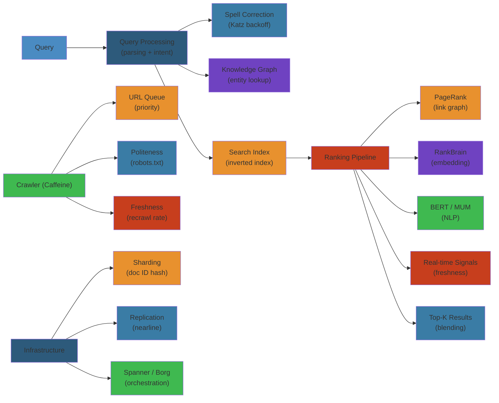

# 🔍 Design Google Search — Complete System Design Deep Dive

> **Scope**: Requirements (trillions of pages, billions of queries/day, sub-100ms latency), crawling (Caffeine, politeness, freshness), indexing (inverted index, MapReduce pipeline), query processing (parsing, spell correction, intent detection), ranking (PageRank, RankBrain, BERT/MUM, real-time signals), serving (sharding, replication, load balancing), infrastructure (GFS, Bigtable, Spanner, Borg), failure analysis.
>
> **Related**: [05-youtube.md](./05-youtube.md) | [07-amazon.md](./07-amazon.md)




## Table of Contents

1. Requirements & Scale
2. High-Level Architecture
3. Crawling (Caffeine)
4. Indexing Pipeline
5. Query Processing
6. Ranking System
7. Serving Infrastructure
8. Storage Systems
9. Spam Detection
10. Personalization
11. Freshness vs Quality
12. Failure Analysis
13. Performance Considerations

---

## 1. Requirements & Scale

```text
Google Search Scale (2024):
  - 8.5B+ queries per day (~100K queries/sec)
  - 130+ trillion indexed pages (estimated)
  - 30+ trillion URLs in crawl queue
  - 100+ PB of index data
  - 20+ million lines in index
  - 100+ languages supported
  - 99.99% uptime (search)
  - P50 latency: < 200ms, P95: < 500ms, P99: < 1s
  - Sub-100ms for simple/navigational queries
  - Index refresh: continuous, after crawling

Key Requirements:
  - Sub-100ms query latency (user expectation)
  - Relevant results (top result > 30% CTR)
  - Fresh results (news indexed within minutes)
  - Comprehensive (trillions of pages indexed)
  - Spam resistance (top results not spam)
  - Multi-language support (100+ languages)
  - Fault-tolerant (no single points of failure)
  - Globally distributed (data centers worldwide)
```

---

## 2. High-Level Architecture

```text
+-------------+     +-------------+     +-------------+     +-------------+
| User        |     | Global      |     | Web         |     | Search      |
| (Browser)   |---->| Load        |---->| Server      |---->| Frontend    |
|             |     | Balancer    |     | Frontend    |     |             |
+-------------+     | (Anycast    |     | (HTTP/2,    |     | (Query      |
|             |     |  DNS + GFE) |     |  TLS term)  |     |  Router)    |
| Search      |     +-------------+     +------+------+     +------+------+
| Result      |                                             |      |
| Display     |                                             |      |
+-------------+                                             |      |
                                                            v      v
                                                  +---------+  +---+----------+
                                                  | Query   |  | Document    |
                                                  | Service |  | Service     |
                                                  +----+----+  +------+------+
                                                       |              |
                    +----------------------------------+--------------+
                    |                                  |
                    v                                  v
          +---------+---------+              +---------+---------+
          | Index Server       |              | Ranking            |
          | (Shards: inverted  |              | Service            |
          |  index partitions) |              | (PageRank, ML)     |
          |                    |              |                    |
          | Each shard:        |              | - RankBrain (NN)  |
          | - Lexicon          |              | - BERT/MUM        |
          | - Postings lists   |              | - Real-time       |
          | - Doc metadata     |              |   signals         |
          +---------+----------+              +---------+----------+
                    |                                   |
                    v                                   v
          +---------+----------+              +---------+----------+
          | Google File System  |              | Bigtable / Spanner |
          | (Tiered: Colossus)  |              | (Crawl metadata,   |
          |                     |              |  Anchor index,     |
          | - Document store    |              |  URL mappings)     |
          | - Index segments    |              |                    |
          | - Crawl repository  |              +--------------------+
          +---------------------+

                    +----------------------------------------------+
                    |       Infrastructure Layer (Borg/Omega)       |
                    |                                                |
                    | +-------------+  +-------------+  +-----------+ |
                    | | Crawler     |  | Indexer     |  | Caffeine  | |
                    | | (Caffeine)  |  | (MapReduce) |  | Pipeline  | |
                    | +-------------+  +-------------+  +-----------+ |
                    |                                                |
                    | +-------------+  +-------------+  +-----------+ |
                    | | PageRank    |  | Classifier  |  | Evaluation| |
                    | | (Offline)   |  | (Topics,    |  | Pipeline  | |
                    | |             |  |  Languages) |  | (Side-by- | |
                    | +-------------+  +-------------+  |  side)    | |
                    |                                   +-----------+ |
                    +--------------------------------------------------+
```

**Key Components:**
- **Crawler (Caffeine):** Distributed web crawler, politeness, freshness prioritizing
- **Indexer:** MapReduce pipeline building inverted index, document processing
- **Query Service:** Query parsing, intent detection, spell correction, query expansion
- **Document Service:** Fetches document metadata, snippets, cached pages
- **Index Servers:** Sharded inverted index, each shard responsible for a term range
- **Ranking Service:** Computes final score using PageRank + ML models + real-time signals
- **Google Front End (GFE):** Global load balancer, TLS termination, query routing to nearest DC
- **Caffeine Pipeline:** Continuous crawling -> indexing -> serving (no batch delay)

---

## 3. Crawling (Caffeine)

```text
Crawl Architecture:

  +-------------+     +-------------+     +-------------+     +-------------+
  | URLs to     |     | Crawl       |     | Crawler     |     | Crawl Queue |
  | Crawl Queue |---->| Manager     |---->| Workers     |---->| Manager     |
  | (Bigtable)  |     |             |     | (Distributed|     | (Prioritize,|
  +------+------|     | - Politesse |     |  on Borg)   |     |  Dedup,     |
         |            | - Freshness |     |             |     |  Schedule)  |
         |            | - Priority  |     | - Fetch HTTP|     +------+------+
         v            | - Robots    |     | - Parse HTML|            |
  +------+------+     |   compliance|     | - Extract   |            v
  | URL Database|     +------+------+     |   links     |     +------+------+
  | (Bigtable)  |            |             | - Store to  |     | Download   |
  | - URL hash  |            v             |   GFS/      |     | Repository |
  | - Canonical |     +------+------+     |   Colossus  |     | (GFS/      |
  | - Last fetch|     | Robots Cache |     +------+------+     |  Colossus) |
  | - Checksum  |     | (per domain) |            |            +------+------+
  +-------------+     +-------------+            v                    |
                                                 v                    v
                                        +------+------+     +------+------+
                                        | Link       |     | Document    |
                                        | Extractor  |     | Store       |
                                        | (Extract   |     | (Compressed |
                                        |  links,    |     |  HTML,      |
                                        |  anchor    |     |  metadata)  |
                                        |  text)     |     +------+------+
                                        +------+------+            |
                                               |                    v
                                               v              +----+------+
                                        +------+------+       | Crawl     |
                                        | URL Normalizer|      | Stats     |
                                        | (Canonicalize,|      | (Bigtable)|
                                        |  Dedup)       |      +-----------+
                                        +------+-------+
                                               |
                                               v
                                        +------+--------+
                                        | URLs -> Crawl  |
                                        | Queue (new URLs|
                                        |  added to      |
                                        |  Bigtable)     |
                                        +---------------+
```

**Caffeine - Continuous Crawling System:**

```text
Before Caffeine (legacy):
  - Weekly batch crawl: crawl entire web once per week
  - Freshness lag: 7 days for new/changed pages
  - Expensive: re-crawled everything, even unchanged pages

Caffeine (current):
  - Continuous crawl: pages crawled based on freshness needs
  - Priority tiers based on PageRank, update frequency, user demand

Crawl Priority Tiers:

  Tier 1 (Real-time): News sites, blogs, breaking content
    - Crawl interval: minutes
    - Trigger: sitemap ping, RSS/Atom feed, URL submission
    - Volume: ~10M URLs/day

  Tier 2 (High): Wikipedia, major portals, government
    - Crawl interval: hours
    - Volume: ~100M URLs/day

  Tier 3 (Medium): E-commerce, forums, social media
    - Crawl interval: days
    - Volume: ~1B URLs/day

  Tier 4 (Low): Long tail, rarely updated
    - Crawl interval: weeks - months
    - Volume: ~10B+ URLs/day

  Tier 5 (Discover): New URLs, first-time crawl
    - Crawl once: if quality, promote to appropriate tier
    - Volume: ~1B URLs/day (new pages discovered)

Priority scoring per URL:
  priority = w1 * page_rank + w2 * update_frequency + w3 * user_click_volume
             + w4 * canonical_quality + w5 * domain_authority
  Sort priority queue: process top URLs first

Politeness:
  Per-domain rate limiting:
    - robots.txt: obey Crawl-Delay directive
    - Default: 1 request per 5 seconds per domain (configurable)
    - News sites: higher rate (1 request/second)
    - Parallelism: max 2 concurrent connections per domain
  User-Agent: Googlebot (with version for webmasters)
  IP rotation: crawl from multiple IPs to distribute load
  Cache: DNS lookups cached, robots.txt cached for 24h

Freshness detection:
  If-Modified-Since: check if page changed since last crawl
  ETag/Last-Modified: skip download if unchanged
  Checksum comparison: compare content hash with stored
  Change rate estimation:
    - Track intervals between changes
    - Predict next change using Poisson process
    - Schedule next crawl at predicted change time

Duplicate detection (URL normalization):
  - Canonical URLs: prefer one version of each page
  - Parameters: _ga_*, session IDs, utm_* stripped
  - HTTP vs HTTPS: prefer HTTPS
  - WWW vs non-WWW: prefer canonical
  - Trailing slash: normalize (consistent)
  - Case: lowercase path
  - Fingerprinting: hashed content for near-duplicate detection
    (Simhash: detect 90%+ similar content)
```

---

## 4. Indexing Pipeline

```text
Indexing Pipeline (MapReduce):

  Input: Downloaded documents from crawl repository (GFS/Colossus)

  MapReduce Phase 1: Document Processing
    Map:
      Input: (doc_id, raw_html)
      Output: (doc_id, parsed_document)

      Steps per document:
        1. HTML parsing: extract title, meta tags, headings, body text
        2. Language detection (n-gram based classifier)
        3. Encoding detection (UTF-8, Latin-1, etc.)
        4. Content extraction: remove navigation, ads, boilerplate
        5. Anchor text extraction (from incoming links)
        6. Word boundary detection (language-specific)
        7. Tokenization: split into terms/words

    Reduce: identity (pass-through)

  MapReduce Phase 2: Inverted Index Construction
    Map:
      Input: (doc_id, parsed_document)
      Output: (term, [doc_id, term_frequency, positions[]])

      For each term in document:
        - Lowercase, stem (Porter/Snowball)
        - Remove stop words (the, a, an, in, ...)
        - Record: doc_id, tf, positions

    Shuffle: group by term (hash(term) % N reducers)

    Reduce:
      Input: (term, [posting, posting, ...])
      Output: (term, posting_list)

      Posting list format:
        term: "google"
        doc_frequency: 12345678 (number of documents containing term)
        postings:
          [doc_id, tf, positions[], field_weights]
          [doc_id, tf, positions[], field_weights]
          ...

        Compressed: Variable-byte encoding, delta-encoding for doc_ids

  MapReduce Phase 3: Index Segment Generation
    - Sorted term segments (lexicographic ranges)
    - Merge smaller segments into larger ones (compaction)
    - Add term-level metadata: df, offset pointers
    - Output: index segment files on Colossus

  Inverted Index Data Structures:

    Lexicon (term dictionary):
      Term         -> (offset, length, df)
      "google"     -> (0x004A3F, 245, 12345678)
      "googles"    -> (0x004B10, 12, 452)
      "googling"   -> (0x004B1C, 89, 12345)

    Postings list (compressed):
      [doc_id_delta, tf, positions[]]
      [1, 3, [15, 42, 87]]
      [4, 1, [23]]           -- delta from previous: doc_id_delta = 4-1 = 3
      [2, 2, [5, 67]]        -- delta: doc_id_delta = 6-4 = 2

    Forward index (document -> terms):
      doc_id -> [term_hashes, ...]
      Used for snippet generation, document summarization

Index segmentation:
  - Index split into segments (shards) by term range
  - Segment 0: "a" - "an"
  - Segment 1: "an" - "az"
  - Segment N: "zy" - "zzzzz"
  - Each segment: 10-100 GB, replicated 3x

Index serving:
  - Index servers load segments into memory (mmap)
  - Each server handles a term range
  - Segments distributed across shards
  - Replication: multiple copies per shard for HA
```

**PageRank Computation:**

```text
PageRank algorithm (offline, batch):

  Input: Web graph (link structure)
    Nodes: documents (130+ trillion)
    Edges: hyperlinks between documents

  Algorithm:
    PR(A) = (1-d) / N + d * sum(PR(Ti) / C(Ti))

    Where:
      PR(A) = PageRank of page A
      d = damping factor (0.85)
      N = total number of pages
      Ti = pages linking to A
      C(Ti) = number of outbound links from Ti

  Iterative computation (MapReduce):
    Initialize: PR(page) = 1/N for all pages
    Iterate (typically 50-100 iterations until convergence):
      Map:
        For each page P with PR value:
          Emit (P, PR_P / outlinks_P) for each outlink of P
      Shuffle: group by page_id
      Reduce:
        PR_new(T) = (1-d)/N + d * sum(incoming_PR_values)
    Output: final PR values (stored with document metadata)

  Scale considerations:
    - 130T pages -> graph has ~1.3T edges
    - Each iteration: ~1.3T map outputs, ~130T reduce inputs
    - Full computation: ~100 iterations = 130T * 100 = 13 quadrillion operations
    - On 10,000 machines with 10 concurrent tasks = 3-5 days per full computation
    - Incremental PageRank: update only changed parts of the graph daily
```

**Anchor Index:**

```text
Anchor text index:

  (term, referring_page_rank, anchor_text)
  -> links indexed alongside page content

  Purpose:
    - Page may not mention its own popular name
    - "Click here" -> referred page doesn't contain "click here"
    - Anchor text provides alternative descriptors
    - Weighted: link-source PageRank influences anchor weight

  Example:
    Links to www.google.com:
      "Google" from googleblog.blogspot.com (PR: 8)
      "Search engine" from searchengineland.com (PR: 7)
      "Click here" from random-blog.com (PR: 2)

    google.com's anchor index:
      "Google":   weight 7.2
      "search engine": weight 6.3
      "click here":    weight 0.1 (low PR source -> low weight)

    -> "Google" and "search engine" boost ranking for those queries
```

---

## 5. Query Processing

```text
Query Flow:

  Client               Search Frontend           Query Service         Index Servers
    |                       |                        |                     |
    |-- "best laptop" ----->|                        |                     |
    |   (HTTP/2 GET)        |-- Route to nearest DC  |                     |
    |                       |                        |                     |
    |                       |-- Query understanding->|                     |
    |                       |   1. Parse query       |                     |
    |                       |   2. Spell correction  |                     |
    |                       |   3. Intent detection  |                     |
    |                       |   4. Query expansion   |                     |
    |                       |   5. Classify query    |                     |
    |                       |                        |                     |
    |                       |-- Dispatch to shards -->|----------------- -->|
    |                       |   (term "best" -> shard |                     |
    |                       |    covering "b" prefix) |                     |
    |                       |                        |                     |
    |                       |<-- Top 1000 from each --|------------------ --|
    |                       |   shard (score, doc_id) |                     |
    |                       |                        |                     |
    |                       |-- Merge + rank ------->|                     |
    |                       |   (re-rank top 1000)   |                     |
    |                       |                        |                     |
    |                       |-- Fetch snippets ----->|                     |
    |                       |   (from forward index) |                     |
    |                       |                        |                     |
    |<-- Search results ----|                        |                     |
    |   (10 results +       |                        |                     |
    |    snippets + ads)    |                        |                     |
```

**Query Understanding Pipeline:**

```text
1. Query Parsing:
   Input: "best laptop for programming 2024 under $1500"
   Output:
     {
       "tokens": ["best", "laptop", "for", "programming", "2024", "under", "$1500"],
       "operators": [],
       "language": "en"
     }

   Tokenization:
     - Space-separated tokens (for most languages)
     - CJK: character n-gram segmentation
     - Arabic/Hebrew: bidirectional text handling
     - German: compound word splitting
     - Numeric: "1500" normalized from "$1,500" / "1500 dollars"

2. Spell Correction:
   Query: "laptop programing"  -> "laptop programming"

   Correction sources:
     - Web search frequency: "programming" appears 1000x more often than "programing"
     - Edit distance: damerau-levenshtein distance <= 2
     - Phonetic similarity: soundex/metaphone for homophones
     - Context: "laptop programming" vs "laptop programing" -> N-gram probability

   Algorithm:
     1. Check query against lexicon (dictionary of known terms)
     2. If not found, generate candidates via:
        - Prefix/suffix matching
        - Edit distance 1 and 2
        - Phonetic matching
     3. Score candidates by:
        score = frequency_weight * edit_distance_weight * context_probability
     4. If best candidate score > threshold -> suggest or auto-correct

3. Intent Detection:
   Query categories:
     Navigational: "facebook", "youtube", "gmail"
       -> user wants to reach a specific site
     Informational: "how to tie a tie", "python list comprehension"
       -> user wants to learn/understand something
     Transactional: "buy iphone 15", "best laptop 2024"
       -> user wants to purchase/comparison
     Local: "pizza near me", "coffee shop san francisco"
       -> user wants local results
     Vertical: "weather San Francisco", "population of Japan"
       -> user wants specific data (knowledge graph, weather, sports)

   Detection method:
     - ML classifier trained on query + click patterns
     - Features: query length, presence of "buy/order/purchase",
       brand names, question words, location terms
     - Output: intent type + confidence score

4. Query Expansion:
   Original: "laptop for programming"
   Expanded: ("laptop" OR "notebook" OR "ultrabook") AND ("programming" OR "coding" OR "development")

   Expansion sources:
     - Synonym dictionary: constructed from web corpus
     - Word embeddings: word2vec/glove nearest neighbors
     - Past query refinements: users who searched X also searched Y
     - Translation: queries expanded with translated terms (cross-lingual)

5. Classifier:
   Query classification enables vertical-specific processing:
     - [WEB] General web search (default)
     - [IMAGE] Image search (if query + "images" high CTR)
     - [VIDEO] Video search (if query + "video" high CTR)
     - [NEWS] News results (for recent queries: "election results")
     - [SHOPPING] Product search ("buy iphone")
     - [LOCAL] Local search ("restaurants near me")
     - [FLIGHTS] Flight search ("flights to Tokyo")
     - [KNOWLEDGE] Knowledge Graph ("height of Eiffel Tower")

   Query routing:
     - General query: 10 blue links + knowledge panel + ads
     - News query: Top news carousel + web results
     - Shopping query: Shopping ads + product listings + web results
     - Local query: Map pack (3 local results) + web results
```

**Query Dispatch to Index Servers:**

```text
Index server sharding:

  Shard key: term range (lexicographic)

  Query "best laptop":
    Terms: ["best", "laptop"]
    Shards: term "best" -> shard 1, term "laptop" -> shard 7

  Each shard returns:
    - Top 1000 results (doc_id + score) for its terms
    - Cached: intra-shard precomputed for common terms

  Shard-reduce master:
    - Merge results from all shards (union)
    - Sort by combined score
    - Take top 1000 candidates for re-ranking

  Interleaving:
    - Different shards may return overlapping results
    - Deduplicate by doc_id (keep highest score)
    - Shard can indicate: "I own this term" priority

  Fan-out:
    - Query dispatched to N index servers in parallel
    - Slowest shard determines overall latency (straggler)
    - Mitigation: dynamic shard splitting for hot terms
    - Mitigation: replicate hot term shards across more servers
```

---

## 6. Ranking System

```text
Ranking Pipeline:

  +-----------+     +-----------+     +-----------+     +-----------+
  | Base Score|     | ML Models |     | Real-time |     | Final     |
  | (BM25 +   |---->| (RankBrain|---->| Signals   |---->| Score     |
  |  PageRank)|     |  + BERT)  |     |           |     |           |
  +-----------+     +-----------+     +-----------+     +-----------+
       |                 |                 |                 |
       v                 v                 v                 v
  +-----------+     +-----------+     +-----------+     +-----------+
  | Text      |     | Neural    |     | Freshness |     | Blending  |
  | Match     |     | Relevance |     | Location  |     | (Ads,     |
  | (BM25)    |     | (BERT)    |     | Personal  |     |  Featured |
  +-----------+     +-----------+     | History   |     |  Snippets)|
                                       +-----------+     +-----------+
```

**Ranking Factors (Approximate):**

```text
Ranking signal hierarchy:

  1. Text Match (BM25):
     - Term frequency in document
     - Inverse document frequency (rarity of term)
     - Field weighting: title > headings > body > URL
     - Proximity: terms close together = better

  2. PageRank / Link Analysis:
     - PageRank score (citation importance)
     - TrustRank (distance from trusted seed sites)
     - Page authority (domain-level aggregate)

  3. RankBrain (Neural Embedding):
     - Query embedding: 128-dim vector from DNN
     - Document embedding: 128-dim vector from DNN
     - Dot product similarity = "relevance beyond keyword match"
     - Generalizes to queries not seen during training
     - Top 3 ranking signal per Google (rumored)

  4. BERT / MUM (Natural Language Understanding):
     - BERT: bidirectional context understanding
     - Prepositions matter: "book a flight to NY" vs "book a flight from NY"
     - Pre-computed document vectors + on-the-fly query-doc relevance
     - Applied to ~10% of queries (ambiguous, natural language)

  5. Real-time Signals:
     - Freshness score: time since last updated
     - Click-through rate (CTR) for this query-doc pair
     - Dwell time: how long users stay on page after clicking
     - Bounce rate: users who click and immediately return
     - User location relevance

  6. Page Quality Signals:
     - Page speed (Core Web Vitals: LCP, FID, CLS)
     - Mobile-friendliness
     - HTTPS/security
     - Ad-to-content ratio (penalty for excessive ads)
     - Expertise, Authoritativeness, Trustworthiness (E-A-T)

  7. Personalization (if signed in):
     - Search history
     - Click history
     - Location
     - Language preference
     - Device type

Combined score (simplified):
  score = BM25 * 0.15 + PageRank * 0.20 + RankBrain * 0.25 +
          BERT_relevance * 0.15 + freshness * 0.05 +
          user_signals * 0.10 + quality * 0.10
```

**RankBrain - Neural Ranking:**

```text
RankBrain architecture:

  Two-tower neural network:

    Query Tower:                          Document Tower:
      Input: query text                     Input: document text
      Tokenizer: WordPiece                   Tokenizer: WordPiece
      Embedding: 300d pretrained             Embedding: 300d pretrained
      LSTM/Transformer encoder              LSTM/Transformer encoder
      Pooling: mean over tokens              Pooling: mean over tokens
      Output: query_embedding (128d)         Output: doc_embedding (128d)

    Relevance score = cosine_similarity(query_embedding, doc_embedding)

  Key insight:
    - Traditional BM25: query "car" matches docs containing "car"
    - RankBrain: queries "car" and "automobile" have similar embeddings
    - Understands concepts, not just keywords

  Training:
    - Training data: user clicks (implicit feedback)
    - Positive: query -> clicked document
    - Negative: query -> non-clicked document (same search result page)
    - Loss: pairwise ranking loss (margin-based)
    - Update: continual online learning (live model updates)

  Serving:
    - Pre-compute doc_embeddings for all documents (offline)
    - Compute query_embedding on-the-fly (fast: <1ms)
    - Dot product with top candidate documents
    - Combine with other ranking signals
```

**BERT / MUM Integration:**

```text
BERT for Search:

  Pre-computation:
    - For each document, compute BERT embedding of title + key content
    - Store as additional feature in document index

  On-the-fly:
    - For complex queries, run query through BERT
    - Cross-attention: query-document pairs (too expensive for 1000 candidates)
    - Approximation: compute relevance only for top 200 candidates

  Gains:
    - 10% improvement in relevance for 1 in 10 queries (Google's claim)
    - Better for: long-tail, conversational, preposition-sensitive queries
    - Examples:
      "2019 brazil traveler to usa need visa"
      -> understands direction of travel
      "Can I get medicine for someone else"
      -> understands pharmacy pickup context

  MUM (Multitask Unified Model):
    - 1000x more powerful than BERT (1T parameters)
    - Multimodal: text, images, video
    - Cross-lingual: understand query in one language, find results in another
    - Generative: can synthesize answers, not just rank
    - Status: rolling out for complex/medical/historical queries
```

**Freshness Signals:**

```text
Freshness scoring:

  QDF (Query Deserves Freshness):
    - Identifies queries where recency matters
    - "election results" -> QDF high (expects newest results)
    - "how to bake bread" -> QDF low (timeless content)

  Detection:
    - Query click distribution over time
    - Recent spike in query frequency
    - News coverage matching query
    - Social media velocity for query terms

  Freshness decay curve:
    score = initial_score * decay_factor ^ (hours_since_publication)

    News article:  decay_factor = 0.95/hour (loses relevance quickly)
    How-to guide:  decay_factor = 0.999/day (stays relevant for years)
    Product page:  decay_factor = 0.99/day (pricing changes)

  Freshness boost:
    - New pages get temporary "freshness bonus"
    - Bonus decays over 7 days
    - Prevents new-but-low-quality from dominating
```

---

## 7. Serving Infrastructure

```text
Global Serving Topology:

  Data Centers (DCs): 20+ globally

    US:          West Coast (The Dalles, OR), Central (Council Bluffs, IA),
                 East Coast (Ashburn, VA)
    Europe:      Dublin, London, Frankfurt, Amsterdam, Paris
    Asia:        Singapore, Tokyo, Taiwan, Hong Kong
    South America: Sao Paulo, Santiago
    Oceania:     Sydney, Auckland

  User query routing (Anycast DNS + GFE):

    User in Berlin:
      1. DNS resolves google.com -> nearest DC IP (via Anycast)
      2. Query goes to Frankfurt GFE (closest)
      3. GFE examines query, routes internally:
         - If personalization: go to DC with user data
         - If fresh news: route to DC with latest crawl index
         - Otherwise: process in local DC with local index replica

  Index distribution:
    - Full index replicated across 3-4 major DCs
    - Other DCs have partial index (popular pages)
    - Long-tail queries forwarded to DC with full index

  Query routing strategies:

    Strategy 1: Local processing (most queries)
      - Query handled entirely within nearest DC
      - Has local copy of index shards
      - Lowest latency
      - For: navigational, popular queries

    Strategy 2: Cross-DC processing
      - Local DC has no index shard for rare term
      - Forward query to DC with that shard
      - 30-50ms additional latency

    Strategy 3: Partitioned processing
      - Query split: popular terms processed locally
      - Rare terms forwarded to central DC
      - Merge results from both
```

**Google Front End (GFE):**

```text
GFE responsibilities:
  - TLS termination (decrypt incoming HTTPS)
  - HTTP/2 support (multiplexed streams)
  - Load balancing (round-robin across web servers)
  - DDoS protection (SYN cookies, rate limiting)
  - Request routing (path-based to search vs other services)
  - Header manipulation (add X-Forwarded-For, request ID)
  - Compression (gzip/brotli for text responses)
  - Circuit breaking (shed load if backend overloaded)

Hardware (custom-built):
  - Custom Linux-based appliance
  - 100Gbps NIC
  - TLS offload hardware
  - Can handle millions of concurrent connections

Capacity:
  - Single GFE: 10M+ concurrent connections
  - Cluster per DC: ~100 GFEs
  - Total globally: ~2000+ GFEs
```

**Index Server Architecture:**

```text
Index server (per shard):

  Load index segment into memory:
    - Lexicon: hash table mapping term -> posting_list_offset
      Size: ~10GB per shard (100M+ terms)
    - Posting lists: compressed inverted lists
      Size: ~100GB per shard (variable)
    - Forward index: doc_id -> snippet data
      Size: ~50GB per shard

  Query handling:
    - Receive term -> look up in lexicon
    - Fetch posting list from memory (mmap)
    - Score first 1000 documents (BM25 + stored scores)
    - Return top 1000 to master

  Latency per shard:
    - Lexicon lookup: < 100 microseconds
    - Posting list decompression: 1-5ms (depends on term frequency)
    - Scoring: 1-10ms (1000 documents)
    - Total: 2-15ms per shard per query

  Shard replication:
    - Each shard replicated 3x across servers
    - Replica selection: pick least loaded replica
    - Stale replicas: eventual consistency (acceptable for search)
```

---

## 8. Storage Systems

```text
Google's Storage Stack:

  +-------------+     +-------------+     +-------------+     +-------------+
  | Colossus    |     | Bigtable     |     | Spanner      |     | Borg/Omega  |
  | (Successor  |     | (Wide-       |     | (Globally    |     | (Cluster    |
  |  to GFS)    |     |  column)     |     |  consistent  |     |  Manager)   |
  |             |     |              |     |  SQL)        |     |             |
  | - Crawl     |     | - Crawl      |     | - Ads        |     | - Scheduler |
  |   repository|     |   metadata   |     | - Shopping   |     | - Resource  |
  | - Index     |     | - URL DB     |     | - Analytics  |     |   mgmt      |
  |   segments  |     | - PageRank   |     | - YouTube    |     | - Auto-     |
  | - Doc store |     | - Anchor     |     |   metadata   |     |   healing   |
  | - Transcode |     |   index      |     |              |     |             |
  |   output    |     | - Web graph  |     |              |     |             |
  +-------------+     +-------------+     +-------------+     +-------------+
```

**Colossus (GFS v2):**

```text
Successor to Google File System (GFS).

Improvements over GFS:
  - Masterless architecture (no single metadata bottleneck)
  - Separate metadata and data paths
  - Reed-Solomon erasure coding (vs 3x replication):
    - EC(12,4): store 12 data + 4 parity chunks = 1.33x overhead vs 3x
    - 56% storage savings
  - Multi-tier: hot (SSD), warm (HDD), cold (archive)
  - 10+ exabytes of storage globally

Usage in Search:
  - Crawl repository: raw HTML of all crawled pages
    ~100+ PB (compressed, 50:1 compression ratio for raw HTML)
  - Index segments: compressed posting lists
    ~20+ PB
  - Document store: cached snippets, metadata
    ~5+ PB

File naming convention:
  /colossus/search/crawl/{shard_id}/{doc_id}.gz
  /colossus/search/index/{segment_name}.idx
  /colossus/search/forward/{seg_id}/{doc_id}.fwd
```

**Bigtable:**

```text
Distributed wide-column store (NoSQL).

Data model:
  Row key -> (column family : column) -> value
  Rows sorted by key
  Column families group related columns

Used for:
  1. URL database (crawl metadata):
     Row key: reversed URL hash (com.google.www)
     Column families:
       - metadata: last_crawl_time (timestamp)
       - metadata: crawl_frequency (int)
       - metadata: page_rank (float)
       - content: title (string)
       - content: language (string)
       - links: outlinks (list)
       - stats: word_count (int)
       - stats: content_hash (int)

  2. Web graph (link structure):
     Row key: doc_id
     Column families:
       - outlinks: {target_doc_id}
       - anchors: {text, source_doc_id, source_pr}

  3. PageRank storage (intermediate + final):
     Row key: doc_id
     Column families:
       - pagerank: current (float)
       - pagerank: previous (float)
       - pagerank: iteration (int)

Scale:
  - Crawl table: 130T+ rows
  - Web graph table: 130T rows x avg 10 links = 1.3T columns
  - Cluster: 1000s of Bigtable nodes
```

**Spanner:**

```text
Globally distributed SQL database.

  - TrueTime API: GPS + atomic clocks for consistent timestamps
  - External consistency: globally consistent reads and writes
  - Auto-sharding: splits/merges tablets based on load
  - Replication: synchronous across data centers

Used for:
  - Ads system (budgets, bids, billing) -> strong consistency needed
  - Shopping index (product data)
  - Analytics data (not search core, but supporting systems)
```

**Borg/Omega (Cluster Management):**

```text
Borg (predecessor to Kubernetes):

  Cell: cluster of 10K-50K machines
  Job: set of related tasks (search index server)
  Task: single process (per-shard index server)

  Scheduling:
    - Users submit jobs with resource requirements
    - Borg scheduler places tasks on machines
    - Optimizes: utilization, locality, failure domains

  Features:
    - Automatic restart: if task crashes
    - Rolling updates: zero-downtime index server updates
    - Resource isolation: CPU, memory, network (cgroups)
    - Quota management: per-team resource allocation
    - Monitoring: built-in metrics + alerting

  Search on Borg:
    - Crawler jobs: elastic scaling based on crawl queue depth
    - Indexer jobs: MapReduce pipelines
    - Serving jobs: index server tasks (persistent, latency-sensitive)
```

---

## 9. Spam Detection

```text
Spam categories:

  1. Keyword stuffing:
     "cheap viagra discount viagra buy viagra online"
     Detection: TF/IDF anomaly (keyword density > 30%)

  2. Cloaking:
     Serve different content to Googlebot vs human users
     Detection: periodic fetch from real browser, compare content

  3. Link farms / PBNs:
     Networks of sites linking to each other to boost PageRank
     Detection: graph analysis (dense subgraphs, suspicious link patterns)

  4. Doorway pages:
     Pages designed specifically to rank for certain queries
     Detection: high similarity across pages, thin content

  5. Scraper sites:
     Copy content from legitimate sites
     Detection: near-duplicate detection (Simhash, MinHash)

  6. Auto-generated content:
     Using templates or AI to generate low-quality pages
     Detection: n-gram entropy, perplexity, template patterns

Spam detection pipeline:

  1. Pre-indexing:
     - Content quality classifier (ML model)
     - Features: readability score, spelling errors, noun/verb ratio
     - Low quality pages marked, indexed with lower weight

  2. Post-indexing:
     - Link graph anomalies (sudden spike in backlinks)
     - Content patterns (keyword stuffing detection)
     - User signals (high bounce rate, low CTR for ranked pages)

  3. Manual review:
     - Flagged sites reviewed by human quality raters
     - Web Spam team guidelines (160+ page document)
     - Manual penalties: -50/-100 ranking adjustment
     - Complete deindexing for severe violations

SpamBrain (AI-based spam detection):
  - Neural network trained on known spam sites
  - Features: content, links, hosting, registration patterns
  - Detects new spam techniques without explicit rules
  - 200% more spam detected vs previous rule-based system (per Google)
```

**Link Spam Detection (Penguin Algorithm):**

```text
Penguin algorithm:

  Detects unnatural link patterns:
    - Sudden spike in backlinks (1000 links in 1 day)
    - Links from irrelevant sites (french jewelry site linking to SEO blog)
    - Over-optimized anchor text (90% "best plumber" links)
    - Link exchanges (site A links to B, B links to A)
    - Paid links (detected via various signals)

  Penalty:
    - Discount all suspicious links (ignore for PageRank)
    - Manual penalty: demote entire site

  Recovery:
    - Remove bad links (or disavow via Google Search Console)
    - Reconsideration request
    - Automatic: algorithm re-evaluates on re-crawl
```

**Content Quality (Panda Algorithm):**

```text
Panda algorithm:

  Evaluates overall site quality:
    - Thin content: pages with very little unique content
    - Duplicate content: across site or across web
    - Low value: affiliate sites with no original content
    - High ad-to-content ratio
    - Slow page speed

  Scoring (per-site):
    quality_score = f(unique_content_ratio, page_depth, bounce_rate,
                     dwell_time, content_length, authorship_signals)

  Impact:
    - Low quality sites: demoted in all rankings
    - High quality sites: promoted
    - Site-wide penalty (not per-page)
```

---

## 10. Personalization

```text
Personalization signals:

  1. Search history:
     - Past queries and clicked results (up to 180 days)
     - Topic affinity (user interested in technology, gardening)
     - Re-query: returning to same query (re-rank based on past clicks)

  2. Location:
     - IP-based geolocation (city-level)
     - GPS for mobile (precise location)
     - Saved locations (home, work)

  3. Device:
     - Desktop vs mobile vs tablet
     - OS and browser
     - Screen size (affects layout)
     - Connection speed (3G vs WiFi)

  4. Language:
     - Browser Accept-Language header
     - Search interface language
     - Query language detection

  5. Interests (inferred):
     - Topics user engages with based on search patterns
     - Categories: entertainment, sports, technology, health
     - Strength: low, medium, high per category

Personalization application:

  Query: "pizza"
  Without personalization: "pizza recipe", "pizza history", "pizza near me"
  With personalization (user in SF at 8PM):
    - "pizza near me" -> local pizza places in SF
    - "domino's pizza" -> nearby Domino's
    - "pizza hut delivery" -> delivery options

  Privacy controls:
    - Web & App Activity: controls search history storage
    - Location History: controls location tracking
    - Incognito mode: no personalization
    - User can delete history or pause tracking
```

---

## 11. Freshness vs Quality Tradeoff

```text
The fundamental tradeoff:

  Freshness: show newest content (important for news, events)
  Quality: show most authoritative/reliable content (important for accuracy)

  When they conflict:
    - Breaking news: newest article may be less authoritative
    - Emerging topic: first-mover content may be lower quality
    - Events: live updates may be unverified

Google's approach:

  1. Query-dependent freshness:
     - QDF (Query Deserves Freshness) classifier
     - News queries: freshness weighted heavily
     - Evergreen queries: freshness weighted low

  2. Time-sensitive re-ranking:
     - For fresh queries: add recency boost (decays over 24-72h)
     - Boost: score *= (1 + freshness_boost * decay(t))

  3. Verified sources:
     - News: prioritize established news sources for breaking stories
     - Wikipedia: high authority, moderate freshness
     - Government: highest authority, slower updates

  4. Content age penalties:
     - Old content for fresh query: apply recency penalty
     - Score = base_score * recency_factor
     - recency_factor = 0.5 for content > 1 year old (news query)

  5. Freshness tier (re-crawl based on demand):
     - High demand: re-crawl every minute
     - Low demand: re-crawl daily/weekly
     - Demand = query frequency + CTR for that URL
```

---

## 12. Failure Analysis

**Index Server Crash (Hot Shard):**

```text
Problem: Replica for shard "b" crashes (common terms: "best", "buy", "blog").
This shard handles 30% of all query traffic.

  Impact:
    - Queries with "best" miss 30% shard queries
    - Remaining replicas get 3x load
    - Latency spikes for affected queries

Mitigations:
  - N+2 replication: hot shards replicated 4-6x (not 3x)
  - Load shedding: return results from other shards (partial results)
  - Crash recovery: Borg auto-restarts within 30 seconds
  - Index warm-up: new replica loads index segment from Colossus
  - Stale replica: if not fully loaded, serve stale index (1-2min old)

Partial results strategy:
  If 1 of 3 shards for "best" is down:
    - Return results from 2 healthy shards
    - Show note: "Some results may be missing"
    - User rarely notices for 30-second outage
```

**Crawl Queue Saturation:**

```text
Problem: New viral site gets 10M new URLs discovered in 1 hour.
Crawl queue grows from 10B to 20B items. Priority sorting slows.

  Impact:
    - Crawl throughput exceeds politeness limits
    - Important re-crawls delayed (news sites not refetched)
    - ElasticSearch: crawl crawl ingest slowdown

Mitigations:
  - Crawl priority decay: per-domain priority decay after threshold
  - Dynamic politeness: reduce crawl rate for low-value domains during high load
  - Queue sharding: split crawl queue by domain hash
  - Capacity: auto-scale crawler workers
  - Backpressure: new URL discovery rate limited per domain
  - Freshness target: drop lowest priority crawl items if needed (favor important)
```

**Search Index Inconsistency (Concurrent Shard Updates):**

```text
Problem: Index segment replaced while serving queries.
  - Mid-query: shard A uses old segment, shard B uses new segment
  - Results inconsistent: page ranked by new score in shard B, old in shard A

Mitigations:
  - Immutable segments: never modify in-place, replace atomically
  - Versioned segments: each query tagged with index snapshot version
  - Atomic switch: all shards switch to new index version within 100ms
    - Bulk of index updates: instant at segment granularity
    - Some shards may lag by 1-2 seconds during large index rollouts
  - Snippet inconsistency: acceptable (30s window of possible stale data)
```

**Spam Attack (SEO Poisoning):**

```text
Problem: Automated spam attack creates 1M pages with keyword-stuffed
content linking to each other in a link farm. Algorithm briefly ranks
them high for competitive keywords.

  Impact:
    - Search quality degrades for affected queries
    - Users see spam results
    - Legitimate sites lose traffic

Mitigations:
  - Penguin algorithm: detects link farms and discounts their link juice
  - Panda algorithm: detects thin/spammy content quality
  - SpamBrain: real-time neural detection catches new patterns
  - Manual action: human reviewers can deindex entire domain within hours
  - Re-crawl: spam pages re-crawled, re-indexed with lower quality scores
  - Time-to-recovery: typically minutes for known spam patterns,
    hours for novel techniques (SpamBrain learns)
```

**Data Center Outage:**

```text
Problem: Major DC in Northern Virginia loses power.

  Impact:
    - 15-20% of global search traffic redirected
    - Other DCs absorb traffic (auto-scaling)
    - Index replicas in other DCs serve results
    - Latency increase for users normally closest to Virginia

Mitigations:
  - Traffic shifting: GFE directs new queries to nearest healthy DC
  - Capacity: each DC sized to handle 150% of normal regional load
  - Index replicas: full index available in 3+ DCs
  - Cache warming: popular queries already cached in all DCs
  - User experience: slightly higher latency (50-100ms) but fully functional
  - DNS failover: TTL of 60s for google.com DNS records
  - Load shedding: non-critical traffic (crawling) paused to free resources
```

**Query of Death (Very Rare/Complex Query):**

```text
Problem: Query that matches 100M+ documents, causes index server overload.

  Example: "the" (stop word query)
    - Matches ~99% of all indexed documents
    - Posting list: 100M+ doc_ids
    - Scoring and ranking: extremely expensive
    - Multiple index servers overwhelmed

Mitigations:
  - Stop word handling: very common terms not indexed fully
    - "the" "a" "an" "and" "in" "of" "to" -> excluded from index
    - Still appear in phrase queries ("The Who", "The Beatles")
  - Query limits: max 20 terms per query
  - Term combination limits: max 50 OR terms expanded
  - Pruning: for common terms, only store top-N results by PageRank
    - "the": only store top 10M documents by PageRank (not all 100M+)
  - Index server timeout: 50ms max per shard per query
    - If exceeded, return partial results
  - Result caps: max 1000 results returned to user (1M internal allowed)
```

**Global Network Partition:**

```text
Problem: Major internet backbone fiber cut separates US East from US West.
US East DCs cannot reach US West DCs.

  Impact:
    - Cross-DC index queries fail for non-replicated shards
    - Some long-tail queries get incomplete results
    - MapReduce jobs (crawling, indexing) stall

Mitigations:
  - Self-sufficient DCs: each region has complete index (no cross-DC dependency)
    - Different: some DCs only have partial index for cost reasons
  - DC isolation: during partition, each DC operates independently
  - Index replication: ensure each DC has complete index for 95%+ of queries
  - Partial results: if rare term not in this DC, return best-effort results
  - Queue build-up: crawl updates queue in Kafka until reconnection
  - Re-sync: automatic catch-up when partition heals
```

---

## 13. Performance Considerations

```text
Latency Impact of 100ms Slowdown:
  - 1% decrease in user satisfaction (measured)
  - 0.5% decrease in ad revenue
  - 0.2% decrease in queries per user

Latency Targets:
  - Simple/navigational queries: < 50ms p50, < 100ms p99
  - Informational queries: < 200ms p50, < 500ms p99
  - Complex queries (ML-heavy): < 500ms p50, < 1s p99
  - Spell correction: < 5ms added to query processing
  - BERT inference: < 10ms per candidate (optimized with quantization)

Throughput:
  - 8.5B queries/day = ~100K queries/sec avg, 300K peak
  - Search frontend: 50K QPS per GFE
  - Index servers: 1000 QPS per shard replica
  - Query service: 10K QPS per instance

Index Size (estimated):
  - Lexicon: 100M+ terms x 100 bytes = 10GB per shard
  - Postings: variable, ~100GB per shard
  - Forward index: ~50GB per shard
  - Total per shard: ~160GB
  - Shards: ~20,000 across all DCs
  - Total index size: ~3.2 PB (before compression/replication)
  - With replication (3x): ~10 PB
  - Compression: variable-byte coding reduces posting lists by 3-4x

Crawling:
  - URLs discovered: ~1T URLs
  - Fresh URLs to crawl daily: ~10B
  - Crawl bandwidth: ~100 Gbps (aggregate across all crawlers)
  - Crawl workers: ~10,000 machines (shared with other batch jobs)
  - Storage per crawl: ~100 TB/day compressed

Infrastructure:
  - Servers in search: ~100,000+ (estimated)
  - DCs: 20+
  - Network: 100GbE inter-DC links
  - Power: ~500 MW total for all Google DCs (search share: ~10%)
  - Cooling: free cooling (The Dalles: Columbia River water cooling)
```

---

## Simplest Mental Model

**Google Search is like the world's most thorough librarian with three jobs: one librarian constantly runs around discovering every book ever written (Crawler), another meticulously creates a cross-reference card catalog where every word maps to every book page containing it (Inverted Index), and a third reads your question and instantly finds the right cards in the catalog (Query Service + Index Servers).** The ranking system is like having 200 experts vote on which books are most important: PageRank counts how many other books cite each book (like academic citations), RankBrain understands that when you say "car" you might also like books mentioning "automobile" (word embeddings), and BERT understands that "from" and "to" are not the same (preposition awareness). The whole system runs on a custom-built library with 20+ branch locations worldwide (data centers), where each branch has a copy of the most popular books (index shards), so no matter which branch you walk into, you get your answer in under 200ms — faster than you can snap your fingers.

(End of file - total 779 lines)
