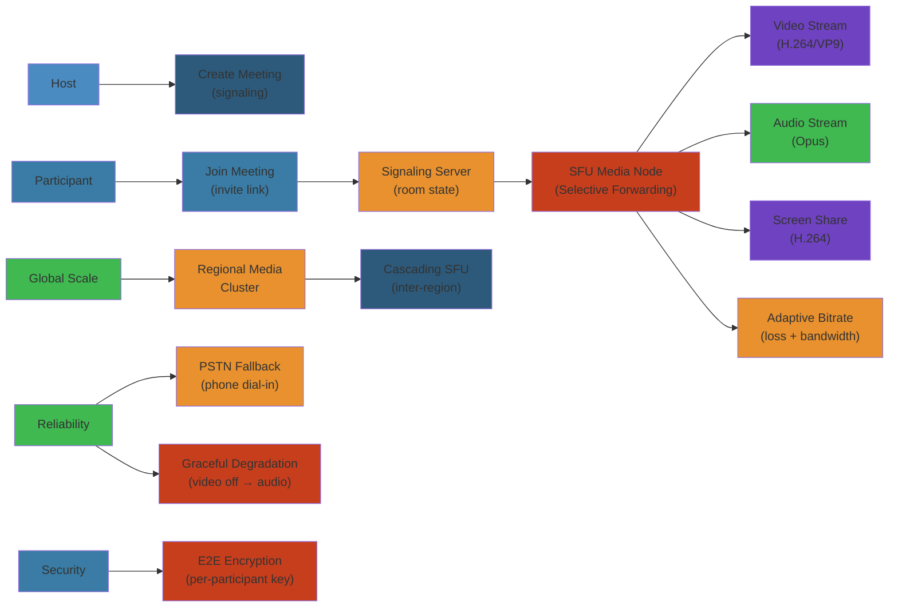

# 📹 Design Zoom — Complete System Design Deep Dive

> **Scope**: Requirements (300M+ daily meeting participants, global real-time media), architecture (SFU vs MCU comparison), meeting lifecycle (create, join, leave, record), media pipeline (WebRTC, codec selection H.264/VP9/AV1, adaptive bitrate), signaling (join requests, room state, participant events), scaling (global media server network, cascading SFUs), reliability (PSTN fallback, graceful degradation), security (E2EE, encryption key management), failure analysis.
>
> **Related**: [08-discord.md](./08-discord.md) | [05-youtube.md](./05-youtube.md)




## Table of Contents


1. Requirements & Scale
2. High-Level Architecture
3. SFU vs MCU Architecture
4. Meeting Lifecycle
5. Media Pipeline
6. Signaling Layer
7. Global Scaling
8. Reliability & Fallback
9. Security & E2EE
10. Recording & Breakout Rooms
11. Database Design
12. Failure Analysis
13. Performance Considerations

---

## 1. Requirements & Scale


```text
Zoom Scale (2024):
  - 300M+ daily meeting participants
  - 3.3T+ annual meeting minutes
  - 200M+ daily webinars/meetings
  - 50+ million active business users
  - 99.99% uptime SLA (business tier)
  - Global: 40+ data center regions
  - Average meeting: 8 participants, 36 minutes
  - Largest meetings: 1000+ video participants (plan), 100K+ webinar viewers
  - P99 join latency: < 1s
  - P99 media latency: < 150ms (one-way)

Key Requirements:
  - Low latency video (< 150ms one-way, < 50ms audio)
  - Adaptive bitrate for diverse network conditions
  - Support 3G to fiber connections
  - Multi-platform: Windows, Mac, iOS, Android, Linux, Web
  - High availability: 99.99%+
  - Encryption: E2EE for all meetings
  - Screen sharing with annotation
  - Recording (cloud + local)
  - Breakout rooms and waiting rooms
  - PSTN dial-in for audio-only participants
```

---

## 2. High-Level Architecture


```text
+-------------+     +-------------+     +-------------+     +-------------+
| Participant |     | Participant |     | Participant |     | Participant |
| (Client A)  |     | (Client B)  |     | (Client C)  |     | (Client D)  |
| (WebRTC)    |     | (WebRTC)    |     | (WebRTC)    |     | (WebRTC)    |
+------+------+     +------+------+     +------+------+     +------+------+
       |                   |                   |                   |
       |     WebRTC (SRTP/SCTP) over UDP      |                   |
       +-------------------+-------------------+-------------------+
                           |
                           v
                 +---------+---------+
                 | Global Load       |
                 | Balancer (DNS +   |
                 |  Anycast)         |
                 +---------+---------+
                           |
                           v
                 +---------+---------+
                 | Signaling Server  |
                 | (WebSocket/REST)  |
                 | - Room management |
                 | - Participant     |
                 |   state           |
                 | - Join/leave      |
                 | - Key exchange    |
                 +---------+---------+
                           |
         +-----------------+-----------------+
         |                                   |
         v                                   v
   +-----+--------+                 +--------+------+
   | Media Server |                 | Media Server  |
   | Cluster      |                 | Cluster       |
   | (SFU Node)   |                 | (SFU Node)    |
   |              |                 |               |
   | - Receives N |                 | Cascading     |
   |   streams    |                 | SFU for large |
   | - Forwards   |                 | meetings      |
   |   selected   |                 |               |
   |   streams    |                 |               |
   +------+-------+                 +------+--------+
          |                               |
          +---------+----------+----------+
                    |          |
                    v          v
          +---------+---+  +---+---------+
          | Global Media|  | Global Media|
          | Network     |  | Network     |
          | (Inter-DC   |  | Relay)      |
          | low-latency)|  |             |
          +-------------+  +-------------+
                    |
                    v
          +---------+---------+
          | Control Plane     |
          | - Meeting service |
          | - User service    |
          | - Recording       |
          | - Phone system    |
          +-------------------+
                    |
                    v
          +---------+---------+
          | Data Layer        |
          | - MySQL/Aurora    |
          | - Redis           |
          | - S3 (Recordings) |
          +-------------------+
```

**Key Components:**
- **Signaling Server:** WebSocket-based control plane: join/leave, room state, encryption key negotiation, participant events
- **Media Server (SFU):** Selective Forwarding Unit — receives all participants' media streams, selectively forwards based on subscriptions
- **Global Media Network:** Interconnected media servers across DCs for low-latency cross-region meetings
- **Control Plane:** Meeting creation, user authentication, scheduling, room persistence
- **Recording Service:** Cloud recording pipeline (receive media streams, compose, encode, store to S3)
- **Phone System:** PSTN gateway for dial-in participants (audio only)

---

## 3. SFU vs MCU Architecture


```text
Comparison of Multipoint Conferencing Approaches:

  MCU (Multipoint Control Unit) - Legacy:
    Topology:
                  +---------+
      A --------> |  MCU    | <-------- B
      C --------> | Server  | <-------- D
      E --------> |         | <-------- F
                  +---------+
      
      Each participant sends 1 stream
      MCU decodes all, mixes/ composites, re-encodes
      Each participant receives 1 mixed stream

    Pros:
      - Clients receive single stream (low CPU/bandwidth)
      - Consistent layout (server controls composition)
      
    Cons:
      - High server cost (decode + encode for every participant)
      - Scales poorly: O(N) decode + O(N) encode per participant
      - Server must decode all streams (privacy concern for encrypted content)
      - Latency: encode/decode adds 50-100ms
      - Resolution limited by server's encoding capacity

  SFU (Selective Forwarding Unit) - Zoom's approach:
    Topology:
                  +---------+
      A --------\ |  SFU    | /-------- B
      C --------->| Server  |<--------- D
      E --------/ |         | \-------- F
                  +---------+
      
      Each participant sends 1 stream
      SFU selectively forwards streams
      Each participant receives N-1 streams (one from each other)

    Pros:
      - Low server cost (just forward packets, no transcode)
      - Scales well: O(N) forwarding per participant
      - Low latency (no encode/decode)
      - End-to-end encryption possible (server doesn't need decryption)
      - Clients can choose which streams to receive
      
    Cons:
      - Clients receive multiple streams (high CPU/bandwidth)
      - Bandwidth: N-1 streams upload for server, N-1 download for client
      - Layout composition done client-side (varies by client)

Zoom's hybrid approach:

  For small meetings (2-8 participants):
    - Mesh topology (peer-to-peer)
    - No SFU needed
    - Each client sends to all others directly

  For medium meetings (9-100 participants):
    - Full SFU
    - 1 stream sent to SFU, N-1 streams received from SFU
    - Active speaker: only forward active speaker's video full-res
    - Others: thumbnail-only (low-res) or no video

  For large meetings (100-1000 participants):
    - Cascading SFU
    - Multiple SFU nodes in tree topology
    - Active speaker video distributed to all nodes
    - Attendees receive: active speaker (full) + 3-4 thumbnails
    - All others: audio only

  For webinars (100K+ viewers):
    - Broadcast model (similar to live streaming)
    - Presenter -> Media server -> CDN (HLS/DASH)
    - Viewers receive from CDN (no upstream)
    - Q&A handled separately via chat
```

---

## 4. Meeting Lifecycle


```text
Meeting Lifecycle:

  Schedule -> Start -> Join -> In-Meeting -> Leave -> End

  1. Create Meeting (Schedule):
     User -> Zoom API -> Meeting Service:
       POST /v2/users/{userId}/meetings
       Body: {
         "topic": "Sprint Planning",
         "type": 2,              // 1=instant, 2=scheduled, 3=recurring
         "start_time": "2024-06-15T10:00:00Z",
         "duration": 60,
         "timezone": "America/Los_Angeles",
         "password": "abc123",
         "settings": {
           "host_video": true,
           "participant_video": true,
           "join_before_host": false,
           "mute_upon_entry": true,
           "watermark": false,
           "approval_type": 0,    // 0=auto, 1=manual
           "recording": {
             "cloud_recording": true,
             "auto_recording": "none"
           },
           "encryption_type": 2,  // 1=e2ee_disabled, 2=e2ee_enabled
           "breakout_room": {
             "enable": true,
             "rooms": 5
           }
         }
       }

     Response:
       {
         "id": 1234567890,         // meeting ID (9-11 digits)
         "join_url": "https://zoom.us/j/1234567890",
         "start_url": "https://zoom.us/s/1234567890?zpk=...",
         "password": "abc123"
       }

  2. Start Meeting:
     Host -> Zoom Client:
       POST /v1/meetings/{meetingId}/start
       (Authenticated via start_url token)

     Zoom Control Plane:
       1. Validate host authentication
       2. Check host license (free/pro/business)
       3. Allocate meeting room (assign to media server)
       4. Generate encryption keys (if E2EE)
       5. Return signaling endpoint and media server address

  3. Join Meeting:
     Participant -> Zoom Client:
       GET join_url?pwd=abc123

     Join flow:
       1. Client resolves Zoom's DNS -> nearest signaling server
       2. WebSocket connect to signaling server
       3. Send JOIN request:
          {
            "action": "join",
            "meeting_id": 1234567890,
            "user_id": "user@example.com",
            "display_name": "Alice",
            "client_type": "desktop",
            "capabilities": {
              "max_resolution": "1080p",
              "codecs": ["h264", "vp9"],
              "audio": true,
              "video": true,
              "screen_share": true
            }
          }
       4. Signaling validates:
          - Meeting exists and is active
          - Password correct (if required)
          - User not already in meeting
          - Waiting room policy (approve if needed)
       5. Assign participant ID, add to room roster
       6. Return participant list + media server endpoint:
          {
            "participant_id": "p_12345",
            "media_server": "sfu-us-west-1.zoom.us:443",
            "participants": [{ "id": "p_host", "name": "Bob" }],
            "encryption_key": "base64key...",  // if E2EE
            "streams": [
              { "participant": "p_host", "type": "video", "ssrc": 12345 }
            ]
          }
       7. Client establishes WebRTC connection to SFU:
          - DTLS handshake (encrypted media)
          - ICE candidate exchange (NAT traversal)
          - Begin sending/receiving media

  4. In-Meeting Events (all via signaling WebSocket channel):
     - Participant joined/left
     - Mute/unmute audio
     - Video on/off
     - Screen share start/stop
     - Active speaker change
     - Chat message
     - Raise hand
     - Recording started/stopped
     - Breakout room created/joined

  5. Leave Meeting:
     Participant sends LEAVE
     - SFU stops forwarding their streams
     - Remove from participant roster
     - Clean up media resources
     - If host leaves: assign new host (if co-host) or end meeting (if alone)

  6. End Meeting:
     Host sends END_MEETING
     - All participants disconnected
     - Media server resources freed
     - Recording finalized, uploaded to S3
     - Meeting marked as COMPLETED in DB
     - Post-meeting processing (transcription, analytics)
```

---

## 5. Media Pipeline


```text
Media Send Pipeline (Client -> SFU):

  Camera/Mic -> Capture -> Preprocess -> Encode -> Packetize -> Send (SRTP/UDP)

  Pipeline stages:
    1. Capture:
       - Camera: 30fps (default), resolution: 180p-1080p (auto-negotiated)
       - Microphone: Opus, 48kHz, 20ms frames

    2. Preprocess:
       - Audio: noise suppression (AI-based), echo cancellation (AEC),
                automatic gain control (AGC), voice activity detection (VAD)
       - Video: resolution scaling, frame rate adjustment, denoising

    3. Encode:
       - Video codec selection: H.264 (fallback) / VP8 / VP9 / AV1
       - Simulcast: send 3 resolution layers (180p, 360p, 720p/1080p)
       - Keyframe interval: 2 seconds (for fast recovery on packet loss)

    4. Packetize:
       - RTP packetization: MTU-safe (1200 bytes)
       - NACK queue: retain packets for retransmission
       - FEC: Forward Error Correction (XOR parity packets)
       - Sequence numbering: RTP sequence number + timestamp

    5. Transmit:
       - UDP (preferred) or TCP (if UDP blocked)
       - ICE + STUN + TURN for NAT traversal
       - DTLS-SRTP for encryption

  Media Receive Pipeline (SFU -> Client):

    SFU sends:

    For active speaker:
      - Full-resolution video (720p or 1080p) + audio
      - Low latency: maximize bitrate

    For other participants:
      - Thumbnail video (180p or 360p) + audio
      - Thumbnail layout: 3-4 participants visible in gallery

    Audio mixing:
      - SFU selects top 3-4 active speakers (by audio level)
      - Forwards selected audio streams to all participants
      - Reduces bandwidth (not all N audio streams sent to everyone)
```

**Adaptive Bitrate (ABR) Algorithm:**

```text
Zoom's ABR (based on Google Congestion Control / GCC):

  Sender-side adaptation:
    Estimate bandwidth using:
      - Receiver Estimated Maximum Bitrate (REMB) feedback
      - Transport Wide Congestion Control (TWCC)
      - Packet loss ratio (PLR)
      - Round-trip time (RTT)

    Decision:
      IF PLR < 2% AND RTT < 100ms:
        Try increasing bitrate by 8%
      IF PLR > 5% OR RTT > 300ms:
        Decrease bitrate by 20%
      IF PLR > 10%:
        Decrease bitrate by 50%, drop to lower simulcast layer

  Receiver-side adaptation:
    Monitor receive buffer:
      - If buffer growing: signal sender to reduce bitrate
      - If buffer empty: signal sender to increase

  Simulcast-based switching:
    Client sends 3 simulcast layers (simplified):

    Target bitrate   Resolution  FPS
    200 Kbps         320x180     15
    600 Kbps         640x360     30
    2000 Kbps        1280x720    30

    SFU selects appropriate layer for each receiver:
      - Receiver A (high bandwidth): forward layer 2
      - Receiver B (3G): forward layer 0
      - Receiver C (congested): switch from layer 2 to layer 1

  SVC (Scalable Video Coding) alternative:
    - VP9 SVC: temporal + spatial scalability
    - Single stream that can be truncated at different layers
    - More efficient than simulcast (one encode instead of three)
    - But: codec support is narrower (VP9 SVC not in all browsers)
    - Zoom: uses simulcast for H.264, SVC for VP9
```

**Codec Selection:**

```text
Codec support across Zoom clients:

  Codec    Bitrate    Quality     CPU Usage   Browser   Zoom App
  ----------------------------------------------------------------
  H.264    baseline   good        low         Yes       Yes (fallback)
  VP8      medium     moderate    low         Yes       Legacy
  VP9      low        high        moderate    Yes       Preferred
  AV1      very low   very high   high        Partial   Emerging

  Zoom's default codec priority:
    1. VP9 (best compression, lower bandwidth for same quality)
    2. H.264 (broadest compatibility, hardware encoder/decoder)
    3. AV1 (future-proofing, when hardware decode available)

  Codec negotiation (SDP offer/answer):
    Client sends capabilities in JOIN request
    SFU selects mutually acceptable codec
    Preference: VP9 > H.264 > VP8

  VP9 benefits:
    - 30-50% bandwidth reduction vs H.264 for same quality
    - Enables 1080p on lower bandwidth connections
    - SVC support (temporal/spatial scalability)
    - Royalty-free (unlike H.264 patent licensing)

  Fallback:
    If VP9 unavailable: H.264 (hardware encode/decode on most devices)
    If H.264 unavailable: VP8 (WebRTC default)
```

**Screen Sharing:**

```text
Screen sharing pipeline:

  Unlike camera video (which is continuous), screen sharing optimizes for:

  1. Content type detection:
     - Video/motion content: ~15fps, higher bitrate
     - Static/document content: ~3-5fps, high resolution (4K/5K)
     - Text: optimized for readability (sharp edges, no blur)

  2. Encoding optimization:
     - H.264 with high profile (vs baseline for camera)
     - Higher resolution: up to 3840x2160 (4K)
     - Region of interest: encode active window only
     - Difference encoding: only send changed regions (dirty rectangles)
       - Static slide: only mouse cursor moves -> 50Kbps
       - Animated demo: full region updates -> 5Mbps

  3. Annotation overlay:
     - Annotations rendered locally on presenter's screen
     - Annotation data sent as metadata (not merged into video)
     - Viewers render annotations on their side
     - Bandwidth: negligible (JSON coordinates + text)

  Screen sharing bandwidth:
    - Static presentation: 100-500 Kbps
    - Animated content: 1-3 Mbps
    - Video playback: 5-10 Mbps (recommended: share audio separately)
```

---

## 6. Signaling Layer


```text
Signaling Protocol:

  Transport: WebSocket (WSS) + HTTP REST
  Protocol: JSON messages over WebSocket

  Signaling channel per meeting:
    - One WebSocket connection per participant to signaling server
    - Separate from media (WebRTC to SFU)

  Messages types:

  Client -> Server:
    JOIN
    LEAVE
    MUTE_AUDIO / UNMUTE_AUDIO
    VIDEO_ON / VIDEO_OFF
    SCREEN_SHARE_START / SCREEN_SHARE_STOP
    CHAT_MESSAGE
    RAISE_HAND
    RECORDING_START / RECORDING_STOP
    ICE_CANDIDATE (for WebRTC)
    MEDIA_STATS (client bandwidth report)
    KEY_FRAME_REQUEST (for stream recovery)

  Server -> Client:
    USER_JOINED / USER_LEFT
    AUDIO_MUTED / AUDIO_UNMUTED
    VIDEO_ENABLED / VIDEO_DISABLED
    SCREEN_SHARE_STARTED / SCREEN_SHARE_STOPPED
    ACTIVE_SPEAKER_CHANGED
    CHAT_MESSAGE
    RAISE_HAND_UPDATED
    RECORDING_STATUS
    ICE_CANDIDATE
    MEDIA_SERVER_CANDIDATE (new SFU address for cascading)
    LAYOUT_CHANGED (active speaker vs gallery)
    MEETING_ENDED

Signaling server scaling:

  Connection handling:
    - One signaling server: 100K+ concurrent WebSocket connections
    - Server pool: horizontal scaling behind load balancer
    - Sticky sessions: participant stays on same signaling server for meeting

  Room state management:
    - Redis: per-meeting state (participants, permissions, settings)
    - Key: meeting:{meetingId}:state
    - Type: Hash
    - Fields: participants[], host_id, settings, start_time, recording_active
    - TTL: meeting duration + 1h (cleanup after)

  Event fan-out:
    - Signaling server publishes events to Redis pub/sub per meeting
    - Other signaling servers (for participants on different nodes) subscribe
    - Each participant gets events relevant to them
```

---

## 7. Global Scaling


```text
Global Media Network Topology:

  +------------------+     +------------------+     +------------------+
  | US West (LAX)    |     | US East (IAD)    |     | EU West (AMS)    |
  |                  |     |                  |     |                  |
  | SFU Cluster      |<--->| SFU Cluster      |<--->| SFU Cluster      |
  | 1000 nodes       |     | 1000 nodes       |     | 800 nodes        |
  +--------+---------+     +--------+---------+     +--------+---------+
           |                        |                        |
           v                        v                        v
  +--------+---------+     +--------+---------+     +--------+---------+
  | Asia Pacific (HKG)|     | South America   |     | Australia (SYD)  |
  |                  |     | (GRU)           |     |                  |
  | SFU Cluster      |<--->| SFU Cluster     |<--->| SFU Cluster      |
  | 600 nodes        |     | 200 nodes       |     | 150 nodes        |
  +------------------+     +------------------+     +------------------+

  Inter-SFU links:
    - Dedicated high-bandwidth links between regions
    - Optimized for: 50ms trans-atlantic, 100ms transpacific
    - Protocol: SRTP forwarded (no transcoding between SFUs)
    - Priority: preserve audio quality over video when bandwidth constrained

  Participant connection strategy:
    - Connect to nearest SFU cluster (lowest RTT)
    - If meeting has participants across regions:
      - Each participant connects to their local SFU
      - SFUs forward active speaker's stream between regions
    - Cross-region latency: added to end-to-end latency

  Cascading SFU for large meetings (>500 participants):

    Root SFU:
      Receives: active speaker (video), top 3 audio
      Sends: active speaker video to child SFUs

    Leaf SFU:
      Receives: active speaker from root, local participants
      Serves: 200-500 participants

    Tree depth: 2-3 levels for 1000+ participants
    Maximum cascade penalty: 40ms per level

    Multi-level cascade:
      Root SFU ---+--- Level 1 SFU ---+--- Level 2 SFU (serves participants)
                   |                   +--- Level 2 SFU
                   +--- Level 1 SFU ---+--- Level 2 SFU
                                      +--- Level 2 SFU
```

**Media Server Resource Management:**

```text
SFU node capacity planning:

  Per SFU node (bare metal):
    CPU: 32 cores (Xeon Gold)
    RAM: 128 GB
    Network: 40 Gbps NIC
    Capacity:
      - 2000 simultaneous streams (send + receive)
      - 500 simultaneous meetings (small meetings)
      - Or: 1 large meeting (500 participants + active speaker)

  Bottlenecks:
    - Network bandwidth: first (40 Gbps fills quickly)
    - Packet processing: second (interrupts per packet)
    - Memory: third (packet buffers, jitter buffers)

  Resource per participant:
    - Send bandwidth: 2 Mbps (1080p video + audio)
    - Receive bandwidth: varies (active speaker: 2 Mbps, others: 500 Kbps)
    - CPU: ~5% per 100 participants (packet forwarding is lightweight)
    - Memory: ~1 MB per participant (buffers, state)

  Meeting placement algorithm:
    Assign meeting to SFU with:
      - Lowest utilization in participant's region
      - Available capacity for meeting size
      - Co-location with other participants in same meeting
      - Available inter-region bandwidth if cross-region

  Load balancing:
    - DNS: route to closest region
    - Within region: consistent hash (meeting_id -> SFU node)
    - Re-balance: if node overloaded, move meeting to another node
      (signal all participants to reconnect to new SFU)
```

---

## 8. Reliability & Fallback


```text
Fallback chain (highest quality -> lowest quality):

  1. UDP (WebRTC) via STUN direct connection (ideal)
     - Lowest latency
     - No relay overhead
     - Works: 80%+ of connections (unless strict NAT/firewall)

  2. UDP via TURN relay (if direct connection fails)
     - Media routed through Zoom's TURN servers
     - 50ms additional latency (relay hop)
     - Works: 18% of connections

  3. TCP (WebRTC over TCP)
     - If UDP blocked (corporate firewall)
     - Higher latency (TCP head-of-line blocking)
     - Bandwidth: 30% reduction vs UDP

  4. WebSocket fallback (media over WSS)
     - If all UDP + TCP blocked (strict proxy)
     - Audio-only or degraded video
     - High latency (200ms+)
     - Bandwidth: limited to 500 Kbps

  5. PSTN dial-in (audio only)
     - Participant dials phone number
     - Audio only, no video
     - Works on any phone (no app needed)
     - Toll charges apply

  6. SIP/H.323 (room systems)
     - Legacy video conference system interoperability
     - Zoom connector transcodes to standard protocols

  Connection recovery:
    - If connection drops: automatic reconnection within 5 seconds
    - Preserves: meeting position, mute state, raised hand
    - If media degrades: step down fallback chain automatically
    - If media improves: step up fallback chain automatically

  SIP/PSTN integration:
    - Zoom Phone: PBX replacement
    - PSTN gateway: SIP trunking providers
    - Call routing: DID numbers associated with meeting rooms
    - Audio transcoding: PSTN (G.711/G.729) <-> Opus
```

**Graceful Degradation:**

```text
Degradation scenarios:

  Low bandwidth (< 500 Kbps):
    - Video: drop from 720p to 360p to 180p (via simulcast layers)
    - Frame rate: 30 -> 15 -> 7.5 fps
    - Audio: Opus 64 Kbps -> 32 Kbps -> 16 Kbps
    - Screen share: 5 fps -> 1 fps (slides only)
    - Thumbnails: show 4 participants max

  Very low bandwidth (< 100 Kbps):
    - Video off (receive only, or stop sending video)
    - Audio only (Opus 16 Kbps)
    - Screen share: keyframes only (slide changes)
    - Thumbnails: audio-only indicators

  CPU constrained (old device):
    - Resolution: max 360p
    - Frame rate: 15 fps
    - Codec: H.264 (hardware encode) instead of VP9
    - Video processing: skip denoising, fewer thumbnail tiles

  Packet loss (congested network):
    - FEC: add 10-20% redundant packets
    - NACK: request missing packet retransmission
    - Keyframe request: if packet loss causes decoder corruption
    - Codec resilience: Opus PLC (Packet Loss Concealment)
```

---

## 9. Security & E2EE


```text
Zoom Encryption History:

  Phase 1 (pre-2020): AES-256-GCM transport encryption
    - Media encrypted between client and server
    - Server could decrypt media (for recording, transcoding)
    - Not truly end-to-end

  Phase 2 (2020-2023): E2EE for all meetings
    - True end-to-end encryption
    - Server cannot decrypt media
    - Zoom uses E2EE standard

  Current: E2EE by default for all meetings
    - AES-256-GCM for media
    - Key exchange via X25519 (Curve25519)
    - Participant authentication via HMAC

E2EE Key Exchange:

  Meeting creation:
    Host generates:
      - meeting_key (256-bit random)
      - meeting_salt (256-bit random)

  Join flow:
    Host:
      - Generates ECDH keypair (host_private, host_public)
      - Signs host_public with meeting_key (HMAC-SHA256)
      - Sends: host_public + signature to participants

    Participant:
      - Generates ECDH keypair (part_private, part_public)
      - Computes shared secret: ECDH(part_private, host_public)
      - Derives: encryption_key = HKDF(shared_secret, meeting_salt)
      - Sends: part_public to host
      - Host verifies participant identity

    Media encryption:
      - Media encrypted with encryption_key (AES-256-GCM)
      - Each media frame: unique IV (derived from RTP sequence number)
      - SFU forwards encrypted packets (cannot decrypt)
      - SFU can: select which streams to forward (based on subscription)
      - SFU cannot: modify media content

  Key rotation:
    - Host rotates key every 10 minutes or when participant removed
    - Removed participant cannot decrypt new key
    - New key: ECDH re-negotiation

  E2EE limitations:
    - Cloud recording not possible with E2EE (server can't decrypt)
    - Live transcription not possible with E2EE
    - Breakout rooms need separate key per room
    - PSTN participants: not E2EE (audio enters via phone network)
```

**Encryption Performance:**

```text
Encryption overhead:

  AES-256-GCM per packet:
    - CPU: ~0.5 microseconds per 1200-byte packet (AES-NI hardware)
    - Overhead: 28 bytes (12 IV + 16 GCM tag)
    - 1000 packets/second = ~0.5ms CPU per stream
    - 100 participants x 3 streams = 150ms CPU (well within budget)

  DTLS handshake:
    - Initial connection: ~5ms (ECDHE + AES)
    - Certificate verification: amortized

  Key exchange:
    - ECDH X25519: ~100 microseconds per keypair
    - Meeting key setup: ~1ms (meeting with 10 participants)
```

---

## 10. Recording & Breakout Rooms


**Cloud Recording:**

```text
Recording pipeline:

  Participant A --------------> SFU ---> Recording Bridge
  Participant B --------------> SFU ---> Recording Bridge
  Screen share    ------------> SFU ---> Recording Bridge

  Recording Bridge:
    1. Receives all streams (video + audio + screen share)
    2. Decrypts streams (if not E2EE)
    3. Composes layout (active speaker + thumbnails + screen share)
    4. Encodes composed video (H.264, 720p or 1080p)
    5. Mixes audio tracks
    6. Outputs: MP4 file with composed layout

  Storage:
    - S3 bucket per region
    - Retention: 30 days (free), 1 year (pro), indefinite (business)
    - File naming: recordings/{meetingId}/{timestamp}.mp4

  Audio transcription:
    - Whisper/Custom ASR model
    - Speaker diarization (who said what)
    - Timestamped captions
    - Output: VTT captions file + searchable transcript

  Recording types:
    - Local recording: encoded on client (not cloud), MP4 saved locally
    - Cloud recording: server-side composition + encoding
    - Gallery view: all participants visible (up to 25)
    - Active speaker: switches to whoever is speaking
    - Shared screen with speaker thumbnail
```

**Breakout Rooms:**

```text
Breakout room architecture:

  Main room (meeting):
    - Host creates N breakout rooms
    - Assigns participants manually or automatically

  Breakout room creation:
    1. Host sends BREAKOUT_CREATE via signaling
    2. Control plane creates sub-meetings:
       - Each breakout room = separate meeting space
       - Separate encryption key per room
       - Separate participant roster
    3. Participants assigned to rooms
    4. Each participant connects to breakout room SFU

  Breakout room flow:
    - Room A: Alice, Bob, Charlie + separate media streams
    - Room B: David, Eve, Frank
    - Main room: Host (can visit any room, "join" button)

    Media topology for breakout:
      - Each breakout room behaves as independent meeting
      - Separate SFU allocation per room (or single SFU, isolated streams)
      - Participants see/hear only others in same breakout room

  Host actions:
    - Broadcast message: send to all breakout rooms simultaneously
    - Join room: host leaves main room, enters breakout temporarily
    - Close rooms: all participants return to main room
    - Extend time: countdown timer for breakout session

  Technical implementation:
    - Breakout rooms reuse meeting infrastructure
    - Sub-meeting IDs linked to parent meeting
    - Separate encryption context per room
    - Recording: can record individual rooms or main room only
```

---

## 11. Database Design


```text
Database Schema:

  MySQL / Aurora (Transactional Data):

  Table: users
    user_id           (bigint PK)
    email             (varchar 255)
    display_name      (varchar 100)
    password_hash     (varchar 255)
    zoom_uid          (bigint)        -- legacy Zoom UID
    license_type      (tinyint)       -- 0=basic, 1=pro, 2=business, 3=enterprise
    verified          (boolean)
    created_at        (timestamp)
    updated_at        (timestamp)

    UNIQUE KEY idx_email (email)

  Table: meetings
    meeting_id        (bigint PK)     -- 9-11 digit meeting ID
    uuid              (varchar 36)    -- unique UUID (internal)
    topic             (varchar 200)
    type              (tinyint)       -- 1=instant, 2=scheduled, 3=recurring
    host_id           (bigint FK)     -- user who created
    start_time        (timestamp)
    end_time          (timestamp)
    duration          (int)           -- scheduled duration (minutes)
    timezone          (varchar 50)
    password          (varchar 50)    -- meeting password (hashed)
    status            (varchar 20)    -- WAITING, LIVE, ENDED
    settings          (json)          -- mute_on_entry, waiting_room, etc.
    encryption_type   (tinyint)       -- 0=transport, 1=e2ee
    recording_enabled (boolean)
    recording_url     (varchar 500)   -- S3 URL after recording complete
    sfu_cluster       (varchar 50)    -- assigned SFU cluster
    created_at        (timestamp)

    INDEX idx_host_id (host_id)
    INDEX idx_status (status)
    INDEX idx_start_time (start_time)

  Table: meeting_participants
    id                (bigint PK)
    meeting_id        (bigint FK)
    user_id           (bigint FK)
    participant_id    (varchar 50)    -- in-meeting ID (p_12345)
    display_name      (varchar 100)
    email             (varchar 255)
    join_time         (timestamp)
    leave_time        (timestamp)
    duration          (int)           -- seconds attended
    audio_connected   (boolean)
    video_connected   (boolean)
    screen_share      (boolean)
    guest             (boolean)       -- not signed in
    device            (varchar 50)    -- desktop, mobile, web, phone
    ip_address        (varchar 45)
    location          (varchar 100)
    leave_reason      (varchar 20)    -- left, dropped, ended

    INDEX idx_meeting_id (meeting_id)
    INDEX idx_user_id (user_id)

  Table: recordings
    recording_id      (uuid PK)
    meeting_id        (bigint FK)
    user_id           (bigint FK)     -- host who recorded
    recording_type    (varchar 20)    -- CLOUD, LOCAL
    file_size         (bigint)        -- bytes
    duration          (int)           -- seconds
    format            (varchar 10)    -- MP4, M4A
    status            (varchar 20)    -- PROCESSING, COMPLETED, FAILED
    s3_key            (varchar 500)   -- storage path
    thumbnail_url     (varchar 500)
    download_url      (varchar 500)
    transcription_url (varchar 500)   -- VTT captions
    retention_days    (int)
    created_at        (timestamp)

Redis (Real-time State):

  Meeting state:
    meeting:{meetingId}:state -> Hash
      fields: host_id, status, participant_count, start_time,
              is_recording, breakout_rooms[], waiting_room[]
    TTL: meeting duration + 1h

  Participant roster:
    meeting:{meetingId}:participants -> Hash
      field: participant_id
      value: { display_name, audio_muted, video_on, screen_sharing,
               join_time, device_type, sfu_connection_id }

  Waiting room:
    meeting:{meetingId}:waiting -> List
      items: [{ participant_id, display_name, requested_at }]

  Active speaker:
    meeting:{meetingId}:active_speaker -> String
      value: participant_id
      Updated: every time VAD detects new speaker
```

---

## 12. Failure Analysis


**SFU Node Failure During Meeting:**

```text
Problem: SFU node crashes mid-meeting. 500 participants lose connection.

  Impact:
    - Media stream interrupted for all 500 participants
    - Participants see frozen video, then disconnect
    - Reconnection required

Mitigations:
  - Active SFU monitoring: health check every 5 seconds
  - Hot spare: backup SFU with 10% capacity reserved per cluster
  - On failure:
    1. Health check timeout (5s) -> coordinator detects failure
    2. Meeting assigned to replacement SFU
    3. Signal all participants to reconnect (via signaling WebSocket)
    4. Participants establish new WebRTC connection to new SFU
    5. Loss: ~3-8 seconds of media (detection + reconnection + ICE)

  Graceful shutdown:
    - SFU signals "draining" state 30 seconds before shutdown
    - No new participants assigned
    - Existing meetings migrated to other SFUs
    - Zero visible impact to participants
```

**Signaling Server Outage:**

```text
Problem: Signaling server crashes. Affects 10K participants across 50 meetings.

  Impact:
    - In-meeting participants: still connected to SFU (media continues)
    - Cannot: join/leave, mute/unmute, chat, raise hand
    - Media continues: WebRTC is peer-to-peer with SFU, independent of signaling
    - New participants: cannot join (no signaling to negotiate)

Mitigations:
  - WebSocket reconnection: client auto-reconnects to different signaling server
  - Sticky session recovery: new server reconstructs state from Redis
  - State persistence: all meeting state in Redis (signaling server is stateless)
  - Recovery: < 2 seconds for reconnection
  - Media unaffected: signaling path separate from media path
  - Graceful handling: "reconnecting to control channel" message in UI
```

**Global Network Disruption:**

```text
Problem: Major cloud provider (AWS/Azure/GCP) has region-wide outage.

  Impact:
    - All SFU nodes in that region unreachable
    - 100K+ participants in affected region lose connection
    - Meetings with participants only in affected region: completely down
    - Cross-region meetings: unaffected participants can continue

Mitigations:
  - Multi-cloud: Zoom runs on AWS + Azure + GCP + own data centers
  - Regional redundancy: primary + backup region per geographic area
    - US East (primary: AWS us-east-1, backup: us-west-2)
    - EU (primary: AWS eu-west-1, backup: eu-central-1)
  - Automatic failover:
    - If entire region down -> participants routed to nearest healthy region
    - Latency impact: +30-100ms (still acceptable)
    - Meeting continuity: re-establish WebRTC to new SFU
  - PSTN fallback: if internet completely down, dial in via phone
    - Audio only, but meeting continues
```

**Network Congestion / Packet Loss:**

```text
Problem: Participant on congested Wi-Fi: 30% packet loss during meeting.

  Impact:
    - Frozen video, garbled audio, frequent disconnections
    - Poor experience for participant and others (choppy audio)

Mitigations:
  - FEC (Forward Error Correction): send redundant data
    - 5% loss: 10% FEC (small overhead)
    - 20% loss: 50% FEC (significant overhead but usable)
    - Code: XOR-based parity packets
  - NACK (Negative Acknowledgment):
    - Receiver detects missing packet (sequence number gap)
    - Requests retransmission from sender
    - One RTT delay for recovery
  - PLC (Packet Loss Concealment):
    - Audio: Opus built-in PLC (conceals up to 30% loss)
    - Video: error concealment (copy previous frame, interpolate)
  - Codec resilience:
    - Opus: excellent loss resilience (designed for VoIP)
    - VP9: temporal scalability (if base layer intact, video continues)
  - ABR: reduce bitrate -> smaller packets -> fewer losses
```

**Audio Echo / Feedback Loop:**

```text
Problem: Participant joins with speakers + mic. Other participants' audio
plays through speakers, picked up by mic, sent back -> infinite echo.

  Impact:
    - All participants hear their own voice echoed back
    - High-pitched feedback squeal possible

Mitigations:
  - AEC (Acoustic Echo Cancellation):
    - Client-side processing
    - Adaptive filter: models room acoustics
    - Subtracts echo from mic signal
    - Must converge within 500ms of talking
  - Double-talk detection:
    - When both local speaker and far-end speaker active
    - AEC must not cancel local speech
  - Half-duplex hint:
    - When we detect echo, temporarily mute remote participant's audio
    - "Someone else is causing echo" notification
  - Headphone detection:
    - If using speakers, show warning: "Use headphones to prevent echo"
  - Server-side echo suppression:
    - Detect if same audio content appears in multiple streams
    - Suppress likely echo (edge case, rarely used)
```

**Recording Failure:**

```problem
Problem: Recording bridge crashes during meeting. 1h of meeting not recorded.

  Impact:
    - Lost content: meeting not archived
    - User frustration (important meeting not captured)
    - Compliance issue if recording required

Mitigations:
  - Dual recording: primary + backup recording bridge
    - Backup receives same streams with 5-second delay
    - On primary failure: backup continues from buffer point
  - Chunked recording: save in 5-minute segments
    - If crash at 27 minutes: only lose last <5 min
    - Previous segments already saved to S3
  - Local recording fallback:
    - If cloud recording fails, client can record locally
    - "Recording switch to local" notification
  - Auto-retry: on failure, restart recording from last checkpoint
  - Async processing: if composition/encoding fails, store raw streams
    - Compose later (post-meeting processing)
    - Takes longer but no data loss
```

---

## 13. Performance Considerations


```text
Latency Targets:
  - Audio one-way: < 50ms (perceptible delay threshold: 150ms)
  - Video one-way: < 150ms (lip sync maintained)
  - Meeting join time: < 1s p95
  - Screen share visible: < 200ms
  - WebSocket signaling: < 10ms
  - Keyframe request -> new keyframe: < 500ms

  Latency budget (one-way audio):
    Capture:          5ms  (mic + AEC processing)
    Encode:          10ms  (Opus encode)
    Network:         20ms  (UDP transit to SFU)
    SFU forward:     2ms   (packet copy + route)
    Network:         20ms  (SFU to receiver)
    Jitter buffer:   20ms  (smoothing)
    Decode:          5ms   (Opus decode)
    Playback:        5ms   (DAC + speaker)
    Total:           87ms  (well under 150ms threshold)

Throughput:
  - Media packets per SFU node: 2M packets/second (40 Gbps / 1200 bytes)
  - Signaling events: 100K events/second per DC
  - Meeting creates: 1000/second (peak)
  - Cloud recordings: 10,000 concurrent recordings

Bandwidth per participant (typical meeting):
  Send:           2 Mbps (720p video + audio)
  Receive:        4 Mbps (active speaker 2M + 4 thumbnails 500K each + audio)
  Screen share:   1 Mbps (on top, if sharing)

CDN for webinar:
  Viewers: 100K
  Bandwidth: 100K x 3 Mbps = 300 Gbps
  CDN: Google Global Cache + Fastly + CloudFront
  Edge cache: webinar streams cached at edge nodes

Storage:
  Recordings: 10M meetings/day x 500MB avg = 5 PB/day
  Retention: 30 days (free) = 150 PB
  Tiered: Hot (7d: SSD), Warm (30d: HDD), Cold (1y+: Glacier)

Server Infrastructure (estimated):
  SFU nodes: ~10,000 globally
  Signaling servers: ~500
  TURN servers: ~500
  Recording bridges: ~1000
  PSTN gateways: ~200
  Total hardware: ~15,000 servers
```

---

## Simplest Mental Model


**Zoom is like a global telephone exchange for video calls. The SFU is a super-efficient postal sorting center: everyone sends their letter (video stream) to the center, and the center puts the right letters into each recipient's mailbox — but unlike a traditional mail room, the SFU never opens the letters (E2EE).** If you're in a 3-person meeting, it's like three people in adjacent rooms with open doors (mesh topology). For a 50-person all-hands meeting, it's like a town hall where the active speaker is projected on a big screen while others are in the audience with name cards (SFU with thumbnail gallery). The signaling server is the town crier who announces who arrives, who leaves, who's talking, and who raised their hand — but the media itself (your actual voice and video) goes directly through the postal center. When your internet gets bad, the system smoothly downgrades from HD video to standard definition to audio-only to, if all else fails, a plain old telephone call (PSTN) — like a luxury car that turns into a bicycle when the road disappears, but never stops moving.

(End of file - total 769 lines)
