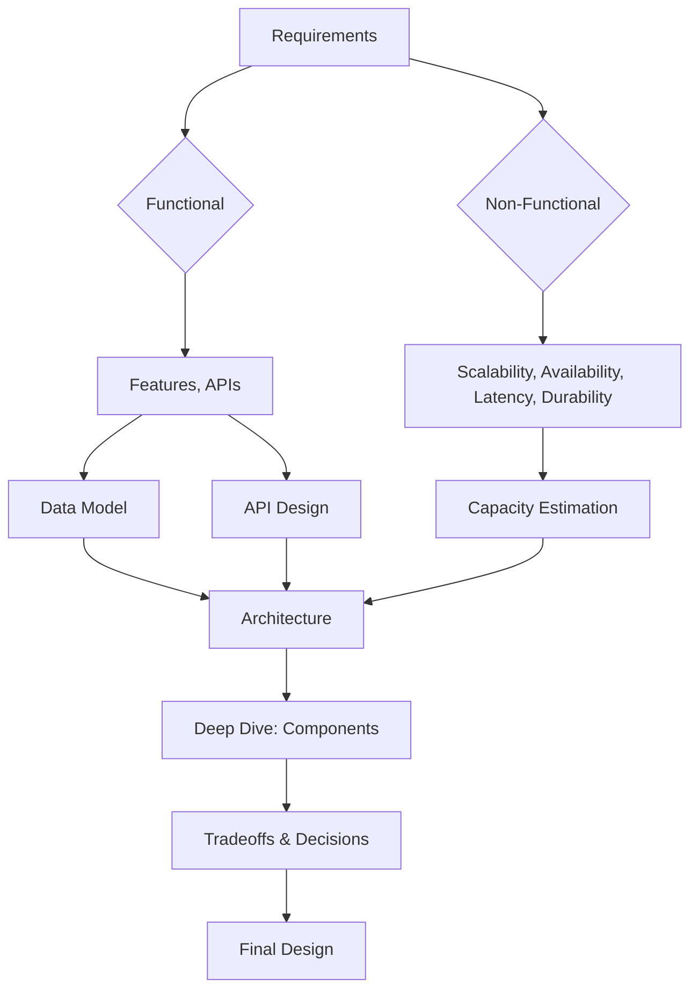

# System Design — Complete Deep Dive 🏗️

System design is the art of **architecting scalable, reliable, and maintainable systems**. It bridges engineering tradeoffs — consistency vs availability, latency vs throughput, cost vs performance — into coherent blueprints.

**Related**: [Distributed Systems](/09-distributed-systems/README.md) · [Microservices](/16-microservices/README.md) · [Software Architecture](/17-software-architecture/README.md) · [Performance Engineering](/18-performance-engineering/README.md)

---

## Table of Contents

- [Design Framework](#-design-framework)
- [Design Process](#1-design-process-)
- [Non-Functional Requirements](#2-non-functional-requirements-)
- [Capacity Estimation](#3-capacity-estimation-)
- [Data Modeling](#4-data-modeling-)
- [API Design](#5-api-design-)
- [Deep Dives by Component](#6-deep-dives-by-component-)
- [Case Studies](#7-case-studies-)
- [System Design Blueprints](#8-system-design-blueprints-)
- [Architectural Patterns](#9-architectural-patterns-)
- [Tradeoff Analysis](#10-tradeoff-analysis-)
- [Interview Framework](#11-interview-framework-)
- [Learning Path](#-learning-path)
- [Related Domains](#-related-domains)
- [Simplest Mental Model](#-simplest-mental-model)

---

## 🧭 Design Framework



---

## 1. Design Process 📋

### Step 1: Requirements Clarification
- **Functional**: What should the system do? (post tweet, watch video, transfer money)
- **Non-functional**: How should the system behave? (latency < 200ms, 99.99% uptime)
- **Scope**: Features for MVP vs v2

### Step 2: Capacity Estimation
- Traffic (DAU, QPS, peak)
- Storage (total, per-user, growth rate)
- Bandwidth (network in/out)
- Cache requirements

### Step 3: Data Model
- Entities, relationships, access patterns
- Database choice (SQL vs NoSQL vs NewSQL)
- Schema design
- Partitioning strategy

### Step 4: High-Level Design
- System architecture diagram
- Component identification
- Data flow (write path, read path)
- API contracts

### Step 5: Deep Dives
- Database internals, caching strategy
- Consistency model, replication
- Rate limiting, load balancing
- Security, observability

### Step 6: Tradeoffs
- Each decision has tradeoffs (CAP theorem, PACELC)
- Compare alternatives (why X over Y)
- Edge cases and failure modes

---

## 2. Non-Functional Requirements 📐

| Requirement | Definition | Metrics |
|-------------|------------|---------|
| **Scalability** | Handle growth | Users, QPS, data volume |
| **Availability** | Uptime percentage | 99.9% → 99.999% |
| **Latency** | Response time | p50, p95, p99 |
| **Throughput** | Requests per second | QPS, TPS, RPS |
| **Consistency** | Data correctness | Strong vs eventual |
| **Durability** | No data loss | fsync, replication, backups |
| **Fault Tolerance** | Survive failures | Replication, redundancy |
| **Security** | Protect data | Encryption, auth, audit |

### The CAP Theorem
```
You can have at most TWO of:
┌────────────────┐
│ Consistency     │  Every read sees latest write
│ Availability    │  Every request gets a response
│ Partition       │  System continues despite network split
│ Tolerance       │
└────────────────┘
```
- **CP**: Bank systems (consistency over availability during partition)
- **AP**: Social media (availability over consistency during partition)
- **CA**: Single-node DBs (no partition tolerance)

### PACELC
Extension of CAP: **If partition (P)**, choose A or C. **Else (E)**, choose L (latency) or C (consistency).
- **PA/EL**: DynamoDB, Cassandra (AP + low latency)
- **PC/EC**: Spanner, TiDB (CP + strong consistency)

---

## 3. Capacity Estimation 🔢

### Traffic Estimation
```
DAU = 100M
Daily active usage = 30 min/user/day = 1800 sec/user/day

Write QPS = (DAU × avg_writes_per_user) / 86400
Read QPS = (DAU × avg_reads_per_user) / 86400
Peak QPS = avg_QPS × 5-10x (peak factor)
```

### Storage Estimation
```
Per-user data: 10KB/day
Total daily:
100M × 10KB = 1TB/day
Annual storage:
1TB × 365 = 365TB/year

With 3x replication:
365TB × 3 = ~1PB/year
```

### Bandwidth Estimation
```
Average response size: 100KB
Read QPS: 100K
Outbound bandwidth:
100K × 100KB × 8 = 80 Gbps

Peak (5x): 400 Gbps
```

### Cache Estimation
```
Cache hit ratio target: 95%
Total reads per day: 5B
Cache-worthy reads (20%): 1B
Average object size: 50KB
Cache memory needed: 1B × 50KB = 50TB (too large!)
Re-evaluate: Only cache top k%
20% cache = 10TB → shard across 20 nodes (512GB each)
```

---

## 4. Data Modeling 🗄️

### Database Selection
| Scenario | Choice | Reason |
|----------|--------|--------|
| Structured data, ACID | PostgreSQL | Mature, powerful, extensible |
| Key-value, large scale | DynamoDB/Cassandra | High throughput, auto-scaling |
| Document store | MongoDB | Flexible schema, nested data |
| Time series | InfluxDB/TimescaleDB | High write throughput, downsampling |
| Search | Elasticsearch | Full-text search, aggregations |
| Graph | Neo4j | Relationship-heavy queries |
| Blob storage | S3/GCS | Large objects, immutable records |
| In-memory | Redis/Memcached | Ultra-low latency, caching |

### Partitioning (Sharding)
| Strategy | Pros | Cons |
|----------|------|------|
| Range-based | Simple, supports range scans | Hot spots, rebalancing hard |
| Hash-based | Uniform distribution | No range scans, resharding complex |
| Directory-based | Flexible mapping | Single point of failure, lookup overhead |
| Consistent Hashing | Minimal rebalancing, dynamic nodes | Complexity, virtual nodes |

### Replication
| Strategy | Write | Read | Consistency |
|----------|-------|------|-------------|
| Single leader | One node | Any replica or leader | Tunable |
| Multi-leader | Multiple nodes | Any replica | Conflict resolution needed |
| Leaderless (Quorum) | W nodes | R nodes | W + R > N |

---

## 5. API Design 🔌

### RESTful API
```http
GET /api/v1/users/{id}        → Retrieve user
POST /api/v1/users            → Create user
PUT /api/v1/users/{id}        → Replace user
PATCH /api/v1/users/{id}      → Partial update
DELETE /api/v1/users/{id}     → Delete user
```

### Pagination
```http
GET /api/v1/tweets?cursor=abc123&limit=20
Response:
{
  "data": [...],
  "next_cursor": "xyz789",
  "has_more": true
}
```

### GraphQL
```graphql
query {
  user(id: "123") {
    name
    posts(limit: 10) {
      title
      comments { text author { name } }
    }
  }
}
```

### IDL (gRPC/Protobuf)
```protobuf
service UserService {
  rpc GetUser(GetUserRequest) returns (User);
  rpc CreateUser(CreateUserRequest) returns (User);
}

message User {
  string id = 1;
  string name = 2;
  string email = 3;
}
```

---

## 6. Deep Dives by Component 🔬

### Load Balancer
- **L4 vs L7**: L4 (TCP), L7 (HTTP/2, WebSocket, gRPC)
- **Algorithms**: Round-robin, least connections, consistent hashing, weighted
- **Health checks**: Active (probe) vs passive (circuit breaker)
- **Sticky sessions**: Via cookie or source IP hash (or avoid entirely)

### Caching
- **Client-side**: Browser cache, local storage
- **CDN**: Static assets, images, videos
- **Application cache**: Redis, Memcached
- **Database cache**: Buffer pool, query cache
- **Cache patterns**: Cache-aside, read-through, write-through, write-behind
- **Eviction**: LRU, LFU, TTL, FIFO

### Database Indexing
- **Primary index**: B-tree, default in most databases
- **Secondary index**: Additional index on non-primary columns
- **Covering index**: All queried columns in index (no table access)
- **Composite index**: Multiple columns, order matters
- **Full-text index**: Inverted index for text search

### Rate Limiting
- **Algorithms**: Token bucket, leaky bucket, fixed window, sliding window
- **Distributed**: Redis with Lua scripting
- **Response**: `429 Too Many Requests` + `Retry-After` header

### Consistent Hashing
```
Hash ring: 0 → 2^64 - 1
Virtual nodes: 100-200 per physical node
Key location: hash(key) → clockwise to nearest virtual node
Add/remove node: only reassigns adjacent keys
```

### Unique ID Generation
| Method | Pros | Cons |
|--------|------|------|
| UUID v4 | Simple, no coordination | 128-bit, not sortable |
| Snowflake | 64-bit, ordered, local generation | Clock skew sensitive |
| DB sequence | Ordered, simple | Bottleneck, SPOF |
| Redis INCR | Fast, ordered | Redis dependency |
| ULID | Sortable, URL-safe | Not standard |

---

## 7. Case Studies 📚

### WhatsApp
- **Scale**: 2B users, 100B messages/day
- **Architecture**: Erlang (Ejabberd) on FreeBSD → Custom Erlang server
- **Key decisions**: XMPP → custom protocol, end-to-end encryption
- **Storage**: No persistent storage (messages not stored on server after delivery)
- **Interesting**: 1 engineer (Jan Koum) wrote initial server, only ~50 engineers at acquisition

### Netflix
- **Scale**: 250M+ subscribers, 2B+ hours streamed/month
- **Architecture**: Monolith → microservices (by 2015)
- **Key components**: Zuul (gateway), Eureka (discovery), Hystrix (circuit breaker)
- **Interesting**: Chaos Monkey (2009), Simian Army, now Spinnaker + Titus

### Twitter
- **Scale**: 500M+ tweets/day, 300M+ DAU
- **Evolution**: Monolith Rails → service-oriented → microservices
- **TLV**: Fanout-on-write for celebrities, fanout-on-read for everyone else
- **Manhattan**: Internal KV store, replaced Memcache+MySQL

### YouTube
- **Scale**: 2.5B+ MAU, 500+ hours uploaded/min
- **Architecture**: BLOB storage, CDN (Google Global Cache)
- **Key decisions**: Edge caching + tiered storage (hot/warm/cold)
- **Interesting**: 100ms video start = 0.2% drop in watch time

### Uber
- **Scale**: 25M+ trips/day
- **Evolution**: Monolith → domain-oriented microservices
- **Dispatch**: Geospatial index for nearby drivers, matching algorithm
- **Interesting**: Replaced PostgreSQL with Schemaless (MySQL-based), now spinoff docstore

### Stripe
- **Scale**: Millions of businesses, billions in payment volume
- **Architecture**: RESTful API-first, idempotency keys
- **Key concepts**: Idempotency, event-driven reconciliation, idempotency
- **Interesting**: Idempotency key is the most important API design pattern

### Amazon
- **Scale**: e-commerce + AWS
- **Evolution**: Monolith (2-tier) → SOA → microservices (API-first)
- **Key**: Two-pizza teams, API as product, "you build it, you run it"
- **DynamoDB**: Internal response to scaling relational DBs

### Discord
- **Scale**: 200M+ MAU, 20M+ servers
- **Architecture**: Modified sharded architecture
- **Key decisions**: MongoDB → ScyllaDB (partitioned across voice regions)
- **Interesting**: Custom data centers for voice latency

### Google Search
- **Scale**: 8.5B+ searches/day
- **Architecture**: GFS → Bigtable → Spanner, Borg → Kubernetes
- **Components**: Crawler, indexer, ranking (PageRank → RankBrain → MUM)
- **Interesting**: ~1ms network latency = 0.2% drop in search volume

### Zoom
- **Scale**: 300M+ daily meeting participants (peak 2020)
- **Architecture**: Proprietary (not WebRTC) custom media server
- **Key decisions**: UDP-based transport, adaptive bitrate, simulcast
- **Interesting**: Encrypted but not E2EE initially; added later

### GitHub
- **Scale**: 100M+ repos, 50M+ developers
- **Architecture**: Rails monolith → polyglot (Rails + Go + Rust)
- **Key components**: MySQL (core), Redis, Elasticsearch, Resque (background jobs)
- **Interesting**: MySQL primary + replicas + Vitess for scaling

---

## 8. System Design Blueprints 📐

### Chat System
```
Write Path:
  User → WebSocket → Chat Service → Message Queue → DB + Cache
Read Path:
  User → HTTP/WS → Chat Service → Cache (SSDB/Redis) → Miss → DB
```
Features: Realtime (WebSocket), presence, push notifications, read receipts, typing indicators, history

### E-Commerce Platform
```
User → CDN → LB → API Gateway → Product Service → DB
                              → Cart Service → Redis
                              → Order Service → DB → Payment Gateway
                              → Inventory Service → DB
                              → Notification Service → SQS → Email/SMS
```
Features: Product catalog, cart, checkout, payment, inventory, order tracking, search, recommendations

### Streaming Platform
```
Ingest: Upload → Transcoder (FFmpeg) → Chunk Storage (S3) → CDN
Play: User → CDN Edge → Adaptive Bitrate (HLS/DASH) → Player
```
Features: Upload, encoding, adaptive bitrate (HLS/DASH), CDN delivery, DRM, recommendations, analytics

### Payment System
```
User → Merchant → API Gateway → Payment Service → Ledger DB
                                     ↓
                            PSP (Stripe/Adyen) ←→ 3DS/Fraud Check
                                     ↓
                            Dual-write Pattern (Ledger + Transaction DB)
```
Features: Idempotency, dual-ledger, reconciliation, anti-fraud, 3DS, multi-currency, escrow

### Collaboration Tool (Google Docs)
```
Operation: User types → OT/CRDT transform → Broadcast (WebSocket) → All clients apply
Storage: Snapshot + Operation log (WAL-style)
Conflict: Operational Transform (OT) or CRDT
```
Features: Real-time collaboration, cursor sync, version history, offline support, comments, +1s

### AI Agent Platform
```
User → Agent Runtime (LLM orchestration) → Tool Registry → External APIs
     ↓                                       ↓
  Memory/Persistent Store               Context Manager
```
Features: Multi-LLM support, function calling, RAG, memory, guardrails, observability, tool registry

### Distributed Cache
```
Client → Proxy Layer (Twemproxy/Redis Cluster) → Shard 1 (Redis)
                                                → Shard 2 (Redis)
                                                → Shard N (Redis)
Consistent Hashing + Virtual Nodes + Replication
```
Features: Consistent hashing, replication, failover, auto-failover (Sentinel/Cluster), persistence

### Distributed Queue
```
Producer → API → Queue Broker (Kafka/Pulsar) → Consumer Group
                    │
                 Partition (ordered, replicated)
```
Features: At-least-once/exactly-once, ordering, partitioning, rebalancing, dead-letter topics

### Workflow Engine
```
Trigger → Workflow Definition (DAG) → Step 1 → Step 2 → Step N
                                         ↓
                                  State Store (DB)
                                  
Guarantees: Exactly-once execution, retry, timeout, compensation
```
Features: DAG definition, state persistence, retry, timeout, human-in-loop, observability

---

## 9. Architectural Patterns 🏛️

| Pattern | When to Use | Tradeoff |
|---------|-------------|----------|
| Layered | Simple CRUD apps | Rigid, not scalable |
| Microservices | Large, multi-team orgs | Complexity, data consistency |
| Event-Driven | Async processing, decoupling | Eventual consistency, debugging hard |
| CQRS | Different read/write patterns | Consistency complexity |
| Event Sourcing | Audit trail, time travel | Storage, snapshots needed |
| Stream Processing | Real-time analytics | State management, exactly-once |
| Peer-to-Peer | Decentralized, high throughput | Coordination, NAT traversal |

---

## 10. Tradeoff Analysis ⚖️

### Common Tradeoffs
```
Latency vs Throughput      → Batch vs stream responses
Consistency vs Availability → Strong consistency vs high availability
Performance vs Cost        → More replicas → higher cost
Monolith vs Microservices  → Simplicity vs scalability
Push vs Pull               → Real-time vs resource efficient
SQL vs NoSQL               → ACID vs flexibility
Synchronous vs Async       → Simplicity vs decoupling
Stateful vs Stateless      → Simplicity vs scalability
```

### Decision Framework
1. Identify options
2. List pros and cons for each
3. Quantify impact (latency +10ms vs cost +20%)
4. Consider future needs (will this change in 6 months?)
5. Document decision and rationale (useful for ADRs)

---

## 11. Interview Framework 🎤

### 4-Step Structure
1. **Scope** (5 min): Clarify requirements, agree on scope
2. **Estimate** (5 min): Traffic, storage, bandwidth
3. **Design** (20 min): Architecture, data model, API, deep dives
4. **Wrap** (5 min): Tradeoffs, future improvements

### 30 Practice Problems (Ranked)
| Tier | Problem | Key Concepts |
|------|---------|-------------|
| ⭐ | Design URL Shortener | Hash + redirect, KV store |
| ⭐ | Design Pastebin | KV store, TTL, compression |
| ⭐ | Design Rate Limiter | Token bucket, sliding window, Redis |
| ⭐⭐ | Design Twitter Feed | Fanout, pull vs push, timeline |
| ⭐⭐ | Design Chat System | WebSocket, presence, history |
| ⭐⭐ | Design Search Autocomplete | Trie, prefix search, top-k |
| ⭐⭐ | Design Key-Value Store | LSM tree, SSTable, WAL |
| ⭐⭐⭐ | Design YouTube/Netflix | Chunking, CDN, transcoding |
| ⭐⭐⭐ | Design Uber | Geospatial index, dispatch |
| ⭐⭐⭐ | Design Google Drive | Sync, conflict resolution |
| ⭐⭐⭐ | Design Instagram | Feed, stories, explore |
| ⭐⭐⭐ | Design WhatsApp | End-to-end encryption, delivery |
| ⭐⭐⭐ | Design Ticketmaster | Flash sale, concurrency |
| ⭐⭐⭐⭐ | Design Amazon | Cart, order, payment, inventory |
| ⭐⭐⭐⭐ | Design Zoom | Real-time video, signaling |
| ⭐⭐⭐⭐ | Design Google Maps | Navigation, traffic, ETA |
| ⭐⭐⭐⭐ | Design Discord | Voice, real-time chat |
| ⭐⭐⭐⭐⭐ | Design Distributed DB | Consensus, replication, transactions |
| ⭐⭐⭐⭐⭐ | Design S3/Blob Store | Erasure coding, metadata |
| ⭐⭐⭐⭐⭐ | Design Kafka | Log, partitioning, consumer groups |

---

## 📚 Learning Path

### Phase 1: Fundamentals
1. Understand CAP theorem, PACELC
2. Practice capacity estimation
3. Learn database internals (B-tree, LSM tree, replication)
4. Understand caching (CDN, Redis, Cache-aside)

### Phase 2: Practice (Low Complexity)
1. Design URL Shortener (with a friend or on paper)
2. Design Rate Limiter
3. Design Key-Value Store
4. Design Pastebin

### Phase 3: Practice (Medium Complexity)
1. Design Twitter
2. Design Uber
3. Design YouTube
4. Design Chat System

### Phase 4: Practice (High Complexity)
1. Design Amazon
2. Design Zoom
3. Design Google Drive
4. Design Distributed Database

---

## 🔗 Related Domains

| Domain | Connection |
|--------|-----------|
| [Distributed Systems](/09-distributed-systems/README.md) | CAP, consensus, replication, partitioning |
| [Microservices](/16-microservices/README.md) | Decomposition patterns, service mesh, saga |
| [Software Architecture](/17-software-architecture/README.md) | Architecture styles, patterns, ADRs |
| [Databases](/08-databases/README.md) | Indexing, sharding, replication, transactions |
| [Performance Engineering](/18-performance-engineering/README.md) | Latency, throughput, benchmarking |
| [Cloud Computing](/05-cloud/README.md) | Cloud-native design, managed services, cost |
| [Networking](/11-networking/README.md) | Load balancing, CDN, protocols |

---

## 🧠 Simplest Mental Model

```
System Design = Building a City

Requirements      → "We need homes for 1M people"
Capacity Estimate → "1M homes, 100 sq ft each, 100 sq mi needed"
Data Model        → "Zoning: residential, commercial, parks"
API Design        → "Roads with traffic rules"
Database          → "City hall (central record) + Library (cached knowledge)"
Caching           → "Local grocery stores (neighborhood-level)"
CDN               → "Water towers (distribute to neighborhoods)"
Load Balancer     → "Traffic lights + highway interchanges"
Queue             → "Post office (buffered delivery)"
Partitioning      → "Boroughs with mayors"
Replication       → "Fire stations in each borough"
Consensus         → "City council votes"
```

**Every design is a set of tradeoffs. The best engineers aren't the ones who know every pattern — they're the ones who know WHEN to apply each one.**

---

**Next**: [Microservices](/16-microservices/README.md) · [Software Architecture](/17-software-architecture/README.md)

## Related

- [Cap Consistency](/09-distributed-systems/01-cap-consistency.md)
- [Consensus Replication](/09-distributed-systems/01-consensus-replication.md)
- [Consensus Raft](/09-distributed-systems/02-consensus-raft.md)
- [Distributed Transactions](/09-distributed-systems/02-distributed-transactions.md)
- [Distributed Caching](/09-distributed-systems/03-distributed-caching.md)
- [Distributed Storage](/09-distributed-systems/03-distributed-storage.md)
