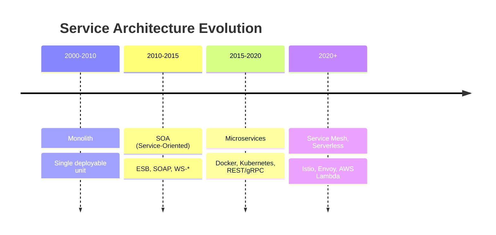
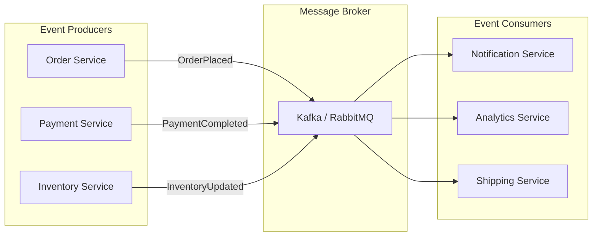

# 🏛️ Microservices Architecture Patterns — Complete Deep Dive

**Related**: [Service Decomposition](02-service-decomposition.md) · [API Gateway](04-api-gateway.md) · [Circuit Breaker](05-circuit-breaker-resilience.md)

---

## Table of Contents

- [Architecture Evolution](#-architecture-evolution)
- [1. Monolithic vs Microservices](#1-monolithic-vs-microservices)
- [2. Core Principles](#2-core-principles)
- [3. Architecture Styles](#3-architecture-styles)
- [4. Communication Patterns](#4-communication-patterns)
- [5. Database per Service](#5-database-per-service)
- [6. Microservice Chassis](#6-microservice-chassis)
- [7. Externalized Configuration](#7-externalized-configuration)
- [Pattern Selection Guide](#-pattern-selection-guide)
- [Simplest Mental Model](#-simplest-mental-model)

---

## 🧭 Architecture Evolution

```text
Monolith (2000s)
  ┌─────────────────────────────┐
  │   Single WAR/JAR            │
  │  ┌───────────────────────┐ │
  │  │ UI   │ Logic │  DB   │ │
  │  └───────────────────────┘ │
  └─────────────────────────────┘
              │
              ▼
SOA (2010s)
  ┌────────────┐ ┌────────────┐ ┌────────────┐
  │ Service A  │ │ Service B  │ │  Service C │
  │(ESB routes)│ │            │ │            │
  └────────────┘ └────────────┘ └────────────┘
         │            │             │
         └────────────┴─────────────┘
                    │ ESB
                    ▼
Microservices (2015+)
  ┌──────┐ ┌──────┐ ┌──────┐ ┌──────┐ ┌──────┐
  │ Auth │ │ User │ │Order │ │Pay   │ │Notif │
  │  API │ │ Svc  │ │ Svc  │ │ Svc  │ │ Svc  │
  └──┬───┘ └──┬───┘ └──┬───┘ └──┬───┘ └──┬───┘
     │        │        │        │        │
  ┌──┴────────┴────────┴────────┴────────┴──┐
  │         API Gateway / Service Mesh       │
  └──────────────────────────────────────────┘
```



---

## 1. Monolithic vs Microservices

### Comparison Table

| Aspect | Monolith | Microservices |
|--------|----------|---------------|
| Deployment | One artifact | N independent services |
| Scaling | Scale entire app | Scale per component |
| Team autonomy | Low (merge conflicts) | High (own service) |
| Tech stack | Single language | Polyglot |
| Testing | Simple integration | Complex contract tests |
| Latency | Low (in-process) | Network overhead |
| Data consistency | Strong (single DB) | Eventual (distributed) |
| Debugging | Simple stack trace | Distributed tracing needed |
| Onboarding | Steep (big codebase) | Focused (small service) |

### Code: Monolith vs Microservices

```java
// MONOLITH — all in one project
@RestController
@RequestMapping("/api")
public class MonolithController {
    @Autowired private UserRepository userRepo;
    @Autowired private OrderRepository orderRepo;
    @Autowired private PaymentService paymentService;
    @Autowired private NotificationService notifService;

    @PostMapping("/checkout")
    public ResponseEntity<?> checkout(@RequestBody CheckoutRequest req) {
        // All logic in one place — tight coupling
        User user = userRepo.findById(req.userId()).orElseThrow();
        Order order = new Order(user, req.items());
        orderRepo.save(order);
        paymentService.charge(user, order.getTotal());
        notifService.sendConfirmation(user, order);
        return ResponseEntity.ok(order);
    }
}

// MICROSERVICES — split into independent services

// Order Service
@RestController
@RequestMapping("/api/orders")
public class OrderController {
    @PostMapping
    public ResponseEntity<Order> createOrder(@RequestBody CreateOrderRequest req) {
        Order order = orderService.create(req);
        // Publish event — don't call other services directly!
        eventPublisher.publish(new OrderCreatedEvent(order.getId(), order.getTotal()));
        return ResponseEntity.status(201).body(order);
    }
}

// Payment Service (separate deployable)
@EventListener
public class PaymentEventHandler {
    @EventListener
    public void handleOrderCreated(OrderCreatedEvent event) {
        paymentService.processPayment(event.orderId(), event.total());
    }
}
```

---

## 2. Core Principles

### Principle 1: Bounded Context

```java
// Each service owns its data and domain logic
// NO shared database between services!

// User Service — owns user data
@Service
public class UserService {
    private final UserRepository userRepository;

    public User getUser(Long id) {
        return userRepository.findById(id)
            .orElseThrow(() -> new UserNotFoundException(id));
    }
}

// Order Service — owns order data
// NEVER access UserRepository directly!
// Instead, call User Service via HTTP/gRPC or event
@Service
public class OrderService {
    private final UserServiceClient userClient;  // HTTP/gRPC client

    public Order createOrder(Long userId, List<Item> items) {
        // Get user info via API call, not direct DB access
        UserDTO user = userClient.getUser(userId);
        return new Order(user.id(), items);
    }
}
```

### Principle 2: Decentralized Data

```text
User Service            Order Service          Payment Service
┌─────────────┐        ┌─────────────┐        ┌─────────────┐
│ users_db    │        │ orders_db   │        │ payments_db │
│ ─────────── │        │ ─────────── │        │ ─────────── │
│ id          │        │ id          │        │ id          │
│ name        │        │ user_id     │        │ order_id    │
│ email       │        │ total       │        │ amount      │
│ created_at  │        │ status      │        │ status      │
└─────────────┘        │ created_at  │        │ created_at  │
                       └─────────────┘        └─────────────┘
                           │                        │
                           └────── Saga ────────────┘
                           (eventual consistency)
```

### Principle 3: Automation

```yaml
# CI/CD Pipeline (GitHub Actions)
name: Deploy Order Service
on:
  push:
    paths: ['services/order/**']
    branches: [main]

jobs:
  test:
    runs-on: ubuntu-latest
    steps:
      - uses: actions/checkout@v4
      - run: ./mvnw test -pl services/order

  build:
    needs: test
    steps:
      - run: ./mvnw package -pl services/order
      - run: docker build -t order-service:${{ github.sha }} services/order
      - run: docker push registry/order-service:${{ github.sha }}

  deploy:
    needs: build
    steps:
      - run: kubectl set image deployment/order-service order-service=registry/order-service:${{ github.sha }}
```

### Principle 4: Design for Failure

```java
// Circuit Breaker — protect against cascading failures
@Service
public class ResilientUserClient {
    private final RestTemplate restTemplate;

    @CircuitBreaker(name = "userService", fallbackMethod = "getUserFallback")
    public UserDTO getUser(Long id) {
        return restTemplate.getForObject(
            "http://user-service/api/users/{id}", UserDTO.class, id);
    }

    public UserDTO getUserFallback(Long id, Throwable t) {
        log.warn("User service unavailable for id={}, using fallback", id);
        return new UserDTO(id, "Unknown", "unknown@fallback.com");
    }
}
```

---

## 3. Architecture Styles

### 3.1 Layered (Traditional)

```text
┌──────────────────────────────────────┐
│          API Gateway Layer           │
│   Authentication, Rate Limiting,     │
│   Routing, Request Transformation    │
├──────────────────────────────────────┤
│         Application Layer            │
│   Service A   Service B  Service C   │
├──────────────────────────────────────┤
│           Data Layer                 │
│   DB1         DB2          DB3       │
├──────────────────────────────────────┤
│         Infrastructure               │
│   Monitoring, Logging, Tracing       │
└──────────────────────────────────────┘
```

### 3.2 Hexagonal (Ports & Adapters)

```java
// Domain — pure business logic, no framework dependencies
public class Order {
    private String id;
    private Money total;
    private OrderStatus status;

    // Business logic method
    public void confirm() {
        if (status != OrderStatus.PENDING) {
            throw new IllegalStateException("Only pending orders can be confirmed");
        }
        this.status = OrderStatus.CONFIRMED;
    }
}

// Port — interface (driven port)
public interface OrderRepository {
    void save(Order order);
    Optional<Order> findById(String id);
}

// Adapter — infrastructure implementation
@Repository
public class JpaOrderRepository implements OrderRepository {
    private final SpringDataJpaOrderRepo repo;

    @Override
    public void save(Order order) {
        repo.save(toEntity(order));
    }
}

// Port — driving port (inbound)
public interface OrderService {
    Order createOrder(CreateOrderRequest request);
    void confirmOrder(String orderId);
}

// Adapter — REST controller (driving adapter)
@RestController
@RequestMapping("/api/orders")
public class OrderController {
    private final OrderService orderService;  // depends on port, not implementation

    public OrderController(OrderService orderService) {
        this.orderService = orderService;
    }
}
```

### 3.3 Event-Driven



```java
// Event producer
@Service
public class OrderService {
    private final EventPublisher eventPublisher;

    public Order placeOrder(CreateOrderRequest request) {
        Order order = new Order(request);
        orderRepository.save(order);

        // Publish event — don't wait for consumers
        eventPublisher.publish(new OrderPlacedEvent(
            order.getId(), order.getCustomerId(), order.getTotal()));

        return order;
    }
}

// Event consumer (separate service)
@Component
public class NotificationConsumer {
    @EventListener
    public void onOrderPlaced(OrderPlacedEvent event) {
        // Async processing — handles notification
        emailService.sendOrderConfirmation(event.customerId(), event.orderId());
    }
}
```

---

## 4. Communication Patterns

### 4.1 Synchronous (REST/gRPC)

```text
Request Flow:
  API Gateway ──HTTP──> Order Service ──gRPC──> Inventory Service
       │                      │                       │
       │                  2. Check stock             │
       │                  3. Response                 │
       │    ◄───────── 4. Response                   │
       │ ◄── 5. Final Response                        │

Pros: Simple, real-time response
Cons: Tight coupling, cascading failures, higher latency
```

```java
// REST client with resilience
@Service
public class InventoryClient {
    private final RestTemplate rest;

    @Retry(name = "inventory", maxAttempts = 3, backoff = @Backoff(delay = 100))
    public boolean checkStock(String productId, int quantity) {
        return Boolean.TRUE.equals(rest.getForObject(
            "http://inventory-service/api/stock/{productId}/check?qty={quantity}",
            Boolean.class, productId, quantity));
    }
}
```

### 4.2 Asynchronous (Messaging)

```text
Flow:
  Order Service ──publish──> Kafka ──consume──> Inventory Service
       │                                               │
       │   OrderPlacedEvent                             │ Reserve stock
       │   {orderId, items, total}                      │
       │   key=orderId                                  │
       │                                               │
       │                                    Payment Service
       │                                   ──consume──>│
       │                                               │ Process payment
```

```java
// Async communication with Spring Cloud Stream
@Component
public class OrderEventPublisher {
    private final StreamBridge streamBridge;

    public void publish(OrderPlacedEvent event) {
        streamBridge.send("order-events", MessageBuilder
            .withPayload(event)
            .setHeader("type", "OrderPlaced")
            .build());
    }
}

@Component
public class InventoryEventHandler {
    @StreamListener("order-events")
    public void handle(OrderPlacedEvent event) {
        inventoryService.reserveStock(event.items());
    }
}
```

### 4.3 Comparison

| Aspect | Sync (REST/gRPC) | Async (Messaging) |
|--------|-----------------|-------------------|
| Response | Immediate | Eventual |
| Coupling | Tight (knows endpoint) | Loose (just publishes) |
| Resilience | Needs circuit breaker | Buffer in queue |
| Traceability | Single request/response | Event correlation needed |
| Complexity | Lower | Higher (Sagas, idempotency) |
| Consistency | Easier (2PC) | Eventual |
| When to use | Queries, real-time | Commands, cross-service workflows |

---

## 5. Database per Service

### Pattern

```text
┌──────────────────┐   ┌──────────────────┐   ┌──────────────────┐
│   Auth Service   │   │   Order Service  │   │  Payment Service │
├──────────────────┤   ├──────────────────┤   ├──────────────────┤
│   ┌──────────┐   │   │   ┌──────────┐   │   │   ┌──────────┐   │
│   │ PostgreSQL│   │   │   │ MongoDB  │   │   │   │MySQL    │   │
│   └──────────┘   │   │   └──────────┘   │   │   └──────────┘   │
│   users table    │   │   orders table   │   │   payments table │
└──────────────────┘   └──────────────────┘   └──────────────────┘
```

### Implementation

```java
// Order Service — only owns order data
@Entity
@Table(name = "orders")
public class Order {
    @Id private Long id;
    private String customerId;  // not a FK, just an ID reference
    private BigDecimal total;
    private OrderStatus status;

    // No user entity reference — only user_id as string
    @Column(name = "customer_id")
    private String customerId;
}

// To get user data, call User Service
@Service
public class OrderService {
    private final UserServiceClient userClient;

    public OrderWithUser getOrderWithUser(Long orderId) {
        Order order = orderRepository.findById(orderId).orElseThrow();
        UserDTO user = userClient.getUser(order.getCustomerId());
        return new OrderWithUser(order, user);
    }
}
```

### Data Sharing Strategies

| Strategy | Description | Example |
|----------|-------------|---------|
| API Composition | Call service to get data | `GET /users/{id}` from Order Service |
| Event Replication | Copy needed data via events | User name published as event → stored locally |
| CQRS | Separate read/write stores | Order Service emits events → read-only UserOrdersView |
| Shared Kernel | Careful shared schema | Auth tokens, tenant IDs |

---

## 6. Microservice Chassis

### Common Cross-Cutting Concerns

```java
// Base dependency for every microservice
@SpringBootApplication
@EnableDiscoveryClient
@EnableCircuitBreaker
@EnableRetry
@EnableScheduling
public class BaseMicroserviceApplication {
    // Common beans
    @Bean
    public RestTemplate restTemplate() {
        return new RestTemplateBuilder()
            .connectTimeout(Duration.ofSeconds(5))
            .readTimeout(Duration.ofSeconds(10))
            .build();
    }

    @Bean
    public MeterRegistry meterRegistry() {
        return new SimpleMeterRegistry();
    }
}

// Common logging aspect (every service includes)
@Aspect
@Component
public class LoggingAspect {
    @Around("@annotation(org.springframework.web.bind.annotation.RequestMapping)")
    public Object logRequest(ProceedingJoinPoint pjp) throws Throwable {
        long start = System.currentTimeMillis();
        Object result = pjp.proceed();
        log.info("{} took {}ms", pjp.getSignature(), System.currentTimeMillis() - start);
        return result;
    }
}
```

---

## 7. Externalized Configuration

### Config Server

```yaml
# config-server/application.yml
spring:
  cloud:
    config:
      server:
        git:
          uri: https://github.com/company/config-repo
          search-paths: '{application}'
```

```yaml
# config-repo/order-service.yml
server:
  port: 8082

spring:
  datasource:
    url: jdbc:postgresql://${DB_HOST}:5432/order_db
  jpa:
    hibernate:
      ddl-auto: validate

order-service:
  max-items-per-order: 50
  payment-timeout-ms: 5000
  allowed-payment-methods:
    - CREDIT_CARD
    - PAYPAL
```

```java
// Client side
@Configuration
@RefreshScope  // Refresh config without restart (via /actuator/refresh)
public class OrderServiceConfig {
    @Value("${order-service.max-items-per-order:50}")
    private int maxItems;

    @Value("${order-service.payment-timeout-ms:5000}")
    private int paymentTimeout;

    @Bean
    public PaymentValidator paymentValidator(
            @Value("${order-service.allowed-payment-methods}") List<String> methods) {
        return new PaymentValidator(methods);
    }
}
```

### Kubernetes ConfigMap

```yaml
apiVersion: v1
kind: ConfigMap
metadata:
  name: order-service-config
  namespace: production
data:
  application.yml: |
    server:
      port: 8080
    order-service:
      max-items-per-order: 50
      payment-timeout-ms: 5000
```

---

## 🎯 Pattern Selection Guide

```text
Problem                              → Pattern
──────────────────────────────────────────────────────
Need to locate services at runtime   → Service Discovery
Client needs single entry point      → API Gateway
Prevent cascading failures           → Circuit Breaker
Retry on transient failures          → Retry + Backoff
Distributed transaction              → Saga
Separate read from write models      → CQRS
Rebuild state from events            → Event Sourcing
Centralize configuration             → External Config
Track request across services        → Distributed Tracing
Service-to-service auth              → JWT / OAuth2
Sync communication                   → gRPC / REST
Async communication                  → Kafka / RabbitMQ
```

---

## 🧠 Simplest Mental Model

```text
MICROSERVICES  =  Instead of one giant restaurant kitchen (monolith)
                  where everyone bumps into each other, you have
                  specialized restaurants:
                  • Pizza place (Order Service)
                  • Pasta place (Payment Service)
                  • Dessert shop (Notification Service)
                  They communicate via delivery drivers (Kafka/RabbitMQ).

BOUNDED        =  The pizza place doesn't store pasta recipes. Each
CONTEXT           restaurant has its own kitchen (database) and recipes
                  (business logic).

API GATEWAY    =  The front desk host who routes you to the right
                  restaurant. Handles menus, seating, and coat check
                  (auth, rate limiting, routing).

SAGA           =  A catering event across restaurants. If the pasta
                  place fails, the pizza place needs to undo their
                  order. Coordinated, multi-step.

CIRCUIT        =  If the pasta place is on fire (down), the delivery
BREAKER           driver doesn't keep trying. Comes back later.
                  Prevents traffic jam of failed requests.

CONFIG SERVER  =  A central bulletin board where each restaurant
                  checks for today's specials and prices.
```

---

**Next**: [Service Decomposition](02-service-decomposition.md)
