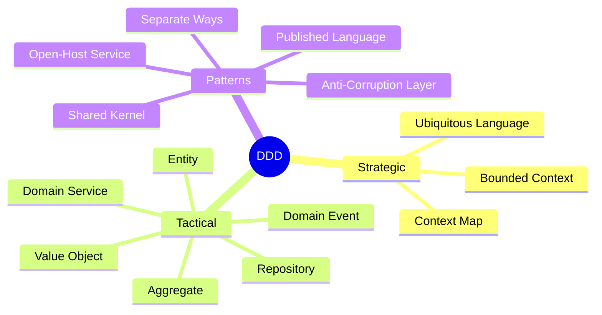

# 🧩 Service Decomposition & Domain-Driven Design

**Related**: [Architecture Patterns](01-architecture-patterns.md) · [API Gateway](04-api-gateway.md) · [Distributed Transactions](06-distributed-transactions-saga.md)

---

## Table of Contents

- [Domain-Driven Design Overview](#-domain-driven-design-overview)
- [1. Bounded Context](#1-bounded-context)
- [2. Decomposition Strategies](#2-decomposition-strategies)
- [3. Domain Events](#3-domain-events)
- [4. Anti-Corruption Layer](#4-anti-corruption-layer)
- [5. Strangler Fig Pattern](#5-strangler-fig-pattern)
- [Decomposition Checklist](#-decomposition-checklist)
- [Simplest Mental Model](#-simplest-mental-model)

---

## 🧭 Domain-Driven Design Overview



---

## 1. Bounded Context

### What is a Bounded Context?

```text
Each service owns its domain model. The same "Customer" concept
may mean different things in different contexts:

┌────────────────────┐    ┌────────────────────┐
│  Sales Context     │    │  Support Context   │
│                    │    │                    │
│  Customer = Buyer  │    │  Customer =        │
│  • name            │    │    Ticket Creator  │
│  • email           │    │  • name            │
│  • creditLimit     │    │  • email           │
│  • paymentMethod   │    │  • openTickets     │
│  • shippingAddress │    │  • satisfactionScore│
└────────────────────┘    └────────────────────┘
```

### Code: Bounded Context in Action

```java
// Sales context — Customer is a buyer
package com.company.sales.domain;

@Entity
@Table(name = "customers")
public class Customer {
    @Id private Long id;
    private String name;
    private String email;
    private Money creditLimit;
    private PaymentMethod preferredPayment;
    private Address shippingAddress;

    public boolean canPlaceOrder(Money orderTotal) {
        return creditLimit.isGreaterThanOrEqual(orderTotal);
    }
}

// Support context — Customer is a ticket creator
package com.company.support.domain;

@Entity
@Table(name = "customers")
public class Customer {
    @Id private Long id;
    private String name;
    private String email;
    private int satisfactionScore;

    @OneToMany(mappedBy = "customer")
    private List<SupportTicket> tickets;

    public void incrementSatisfaction() {
        this.satisfactionScore++;
    }
}
```

---

## 2. Decomposition Strategies

### 2.1 Decompose by Business Capability

```text
Identify business functions and map to services:

Business Capability Map:

┌────────────────────────────────────────────────────────────┐
│                      E-Commerce                            │
├─────────┬─────────┬──────────┬─────────┬──────────────────┤
│Product  │ Order   │ Inventory│ Payment │ Customer Service │
│Catalog  │ Mgmt    │ Mgmt     │ Process │   & Support      │
├─────────┼─────────┼──────────┼─────────┼──────────────────┤
│ Product │ Order   │ Stock    │ Payment │ Customer         │
│ DB      │ DB      │ DB       │ DB      │   DB             │
└─────────┴─────────┴──────────┴─────────┴──────────────────┘
```

### 2.2 Decompose by Subdomain (DDD)

```java
// Core domain — competitive advantage, complex logic
@Service
public class PricingEngine {
    public Price calculatePrice(Product product, Customer customer) {
        // Complex pricing algorithm — core business value
        Money basePrice = product.getBasePrice();
        Money discount = calculateDiscount(customer);
        Money tax = calculateTax(product, customer.getAddress());
        return basePrice.subtract(discount).add(tax);
    }
}

// Supporting domain — necessary but not unique
@Service
public class EmailService {
    public void sendEmail(Email email) {
        // Could be replaced by SaaS (SendGrid, SES)
        mailSender.send(email);
    }
}

// Generic domain — buy, don't build
// Use Stripe for payments, Auth0 for auth, etc.
```

### 2.3 Decompose by Volatility

```text
Services that change together should be together.
Services that change at different rates should be separate.

Example:
  ┌──────────────────────────────────────┐
  │ Frequently Changing    │ Stable      │
  │ ───────────────────────│─────────────│
  │ • Pricing Engine      │ • User Auth │
  │ • Recommendation UI   │ • Logging   │
  │ • Checkout Flow       │ • Audit     │
  │ • Promotion Engine    │ • Reporting │
  └──────────────────────────────────────┘
  ➜ Split into separate services so stable ones don't
    get redeployed for pricing changes
```

### 2.4 Transaction Boundaries

```java
// ❌ BAD — different aggregates in same transaction
@Service
public class CheckoutService {
    @Transactional
    public void checkout(Long userId, List<Item> items) {
        Order order = new Order(userId, items);     // Order aggregate
        orderRepo.save(order);
        InventoryDeduction deduction = new InventoryDeduction(items); // Inventory aggregate!
        inventoryRepo.save(deduction);   // TWO aggregates in one TX = wrong!
    }
}

// ✅ GOOD — each aggregate in its own transaction boundary
@Service
public class CheckoutService {
    @Transactional  // Only Order aggregate
    public Order checkout(Long userId, List<Item> items) {
        Order order = new Order(userId, items);
        orderRepo.save(order);
        eventPublisher.publish(new OrderPlacedEvent(order));
        return order;
    }
}

// Separate handler for Inventory aggregate
@Component
public class InventoryHandler {
    @Transactional  // Own transaction boundary
    public void handle(OrderPlacedEvent event) {
        inventoryService.deductStock(event.getItems());
    }
}
```

---

## 3. Domain Events

### Event Definition

```java
// Base event class
public abstract class DomainEvent {
    private final String eventId = UUID.randomUUID().toString();
    private final Instant occurredAt = Instant.now();

    public String getEventId() { return eventId; }
    public Instant getOccurredAt() { return occurredAt; }
}

// Specific event
public class OrderPlacedEvent extends DomainEvent {
    private final Long orderId;
    private final Long customerId;
    private final Money total;
    private final List<OrderItem> items;

    public OrderPlacedEvent(Long orderId, Long customerId, Money total,
                            List<OrderItem> items) {
        this.orderId = orderId;
        this.customerId = customerId;
        this.total = total;
        this.items = items;
    }

    // getters
}
```

### Event Publishing

```java
// Aggregate root — publishes events
@Entity
public class Order {
    @Id private Long id;
    private OrderStatus status;

    @Transient
    private final List<DomainEvent> events = new ArrayList<>();

    public void place() {
        validateState();
        this.status = OrderStatus.PLACED;
        events.add(new OrderPlacedEvent(id, customerId, total, items));
    }

    public void confirm() {
        this.status = OrderStatus.CONFIRMED;
        events.add(new OrderConfirmedEvent(id));
    }

    public List<DomainEvent> getEvents() {
        return List.copyOf(events);
    }

    public void clearEvents() {
        events.clear();
    }
}

// Service — publishes events after save
@Service
public class OrderService {
    private final OrderRepository orderRepository;
    private final EventPublisher eventPublisher;

    @Transactional
    public Order placeOrder(CreateOrderRequest request) {
        Order order = new Order(request);
        order.place();  // creates OrderPlacedEvent
        order = orderRepository.save(order);

        // Publish all domain events
        for (DomainEvent event : order.getEvents()) {
            eventPublisher.publish(event);
        }
        order.clearEvents();
        return order;
    }
}
```

### Outbox Pattern (Reliable Publishing)

```text
The Problem:
  ┌────────────┐     save     ┌────────────┐
  │ Save Order │────────────> │  Database  │  ✅
  │ to DB      │              └────────────┘
  │            │     publish  ┌────────────┐
  │ Publish    │────────────> │  Kafka     │  ❌ Crash here!
  │ Event      │              │  (Message  │  → Event lost
  │            │              │   lost!)   │  → Inconsistency
  └────────────┘              └────────────┘

Solution — Outbox Pattern:
  ┌────────────┐     save     ┌────────────────────┐
  │ Save Order ├────────────> │  Database           │
  │ AND Event  │              │  ┌──────────────┐   │
  │ (same TX!)  │              │  │ orders       │   │
  │            │              │  │ outbox       │   │
  └────────────┘              │  └──────────────┘   │
                              └────────┬───────────┘
                                       │
                     Poll + publish ───┘
                          (separate process)
                                       │
                              ┌────────▼───────────┐
                              │  Kafka              │
                              │  (reliable now!)    │
                              └────────────────────┘
```

```java
// Outbox entity — same DB as aggregate
@Entity
@Table(name = "outbox")
public class OutboxEvent {
    @Id private String id;
    private String aggregateType;
    private String aggregateId;
    private String eventType;
    @Lob private String payload;  // JSON serialized event
    private Instant createdAt;
    private boolean published;

    public static OutboxEvent from(DomainEvent event, String aggregateType) {
        OutboxEvent outbox = new OutboxEvent();
        outbox.id = event.getEventId();
        outbox.aggregateType = aggregateType;
        outbox.eventType = event.getClass().getSimpleName();
        outbox.payload = serialize(event);
        outbox.createdAt = Instant.now();
        outbox.published = false;
        return outbox;
    }
}

// Scheduled publisher — polls and publishes
@Component
public class OutboxPublisher {
    private final OutboxRepository outboxRepository;
    private final KafkaTemplate<String, String> kafkaTemplate;

    @Scheduled(fixedDelay = 1000)  // every second
    @Transactional
    public void publishPendingEvents() {
        List<OutboxEvent> pending = outboxRepository
            .findByPublishedFalseOrderByCreatedAtAsc();

        for (OutboxEvent event : pending) {
            try {
                kafkaTemplate.send(event.getEventType(), event.getPayload());
                event.setPublished(true);
                outboxRepository.save(event);
            } catch (Exception e) {
                log.error("Failed to publish event: {}", event.getId(), e);
                // Will retry next cycle
            }
        }
    }
}
```

---

## 4. Anti-Corruption Layer

### Purpose

```text
Prevents external domain models from leaking into your domain.

Context 1 (Legacy)          ACL                 Context 2 (New)
┌────────────┐         ┌────────────┐         ┌────────────┐
│ Old CRM    │         │ Translator │         │ New Order  │
│            │         │            │         │ Service    │
│ CustomerDTO│────────>│ Adapts     │────────>│ Customer   │
│ {          │         │ Old model  │         │ {          │
│   fname    │         │ → New      │         │   firstName│
│   lname    │         │   model    │         │   lastName │
│   cid      │         │            │         │   id       │
│   emailAddr│         │            │         │   email    │
│ }          │         │            │         │ }          │
└────────────┘         └────────────┘         └────────────┘
```

### Code: Anti-Corruption Layer

```java
// EXTERNAL — legacy CRM data model (don't let this leak!)
public class LegacyCustomerDTO {
    private int cid;           // customer ID as int
    private String fname;      // first name
    private String lname;      // last name
    private String emailAddr;  // called emailAddr
    private String addrLine1;  // flat address structure
    private String addrLine2;
    private String addrCity;
    private String addrZip;
    // getters/setters
}

// ANTI-CORRUPTION LAYER — translator
@Component
public class CustomerTranslator {
    public Customer toDomain(LegacyCustomerDTO legacy) {
        return new Customer(
            String.valueOf(legacy.getCid()),   // int → String ID
            new PersonName(
                legacy.getFname(),              // fname → firstName
                legacy.getLname()               // lname → lastName
            ),
            new EmailAddress(legacy.getEmailAddr()),
            new Address(
                legacy.getAddrLine1(),
                legacy.getAddrLine2(),
                legacy.getAddrCity(),
                legacy.getAddrZip()
            )
        );
    }
}

// ACL — service that calls legacy system and translates
@Service
public class LegacyCustomerService {
    private final LegacyCrmClient legacyClient;
    private final CustomerTranslator translator;

    public Customer findCustomer(String id) {
        LegacyCustomerDTO legacy = legacyClient.getCustomer(Integer.parseInt(id));
        return translator.toDomain(legacy);  // return clean domain object
    }
}

// Domain — pure, unaffected by legacy format
public class Customer {
    private final CustomerId id;
    private final PersonName name;
    private final EmailAddress email;
    private final Address address;

    // Clean domain constructor
    public Customer(CustomerId id, PersonName name,
                    EmailAddress email, Address address) {
        this.id = id;
        this.name = name;
        this.email = email;
        this.address = address;
    }
}
```

---

## 5. Strangler Fig Pattern

### Migration Strategy

```text
Slowly replace monolith functionality with microservices.

Phase 1: Start small
  ┌──────────────────────┐
  │    Monolith          │
  │ ┌─────┐ ┌─────┐ ┌──┐│
  │ │Auth │ │User │ │..││
  │ └─────┘ └─────┘ └──┘│
  └──────────────────────┘

Phase 2: Extract a service
  ┌────────────┐         ┌──────────────────┐
  │  API GW    │────────>│  Auth Service    │ (new)
  │ (routes)   │         └──────────────────┘
  └─────┬──────┘
        │ fallback
  ┌─────▼────────┐
  │  Monolith    │
  │ (old auth)   │
  └──────────────┘

Phase 3: Full replacement
  ┌─────────────────────────────────────────┐
  │  API Gateway                            │
  ├──────┬──────────┬───────────┬──────────┤
  │ Auth │  User    │  Order    │  Payment │
  │ Svc  │  Svc     │  Svc      │  Svc     │
  └──────┴──────────┴───────────┴──────────┘
  │ Monolith fully retired │
```

### Code: Strangler Fig Implementation

```java
// API Gateway with strangle routing
@RestController
public class BackendController {
    private final RestTemplate rest;

    public BackendController(RestTemplate rest) {
        this.rest = rest;
    }

    @GetMapping("/api/auth/{id}")
    public ResponseEntity<?> getAuth(@PathVariable String id) {
        // Try new microservice first
        try {
            String url = "http://auth-service/api/internal/auth/" + id;
            return ResponseEntity.ok(rest.getForObject(url, AuthDTO.class));
        } catch (Exception e) {
            log.info("Auth service unavailable, falling back to monolith");
        }

        // Fallback to monolith
        String url = "http://monolith.internal/rest/api/auth/" + id;
        return ResponseEntity.ok(rest.getForObject(url, AuthDTO.class));
    }

    // Feature flag — gradually shift traffic
    @GetMapping("/api/users/{id}")
    public ResponseEntity<?> getUser(@PathVariable String id,
                                     @RequestHeader("X-New-User-Service")
                                     String forceNew) {
        if ("true".equals(forceNew) || shouldUseNewService(id)) {
            return callNewUserService(id);
        }
        return callLegacyUserService(id);
    }

    private boolean shouldUseNewService(String id) {
        // Gradual rollout: 10% of traffic → new service
        return Math.random() < 0.1;
    }
}
```

### Strangler Fig with Feature Flags

```yaml
# Feature toggle configuration
feature-flags:
  use-new-user-service: false      # default off
  use-new-order-service: true      # fully rolled out
  use-new-payment-service: 10%     # graduated rollout
```

---

## 📋 Decomposition Checklist

```text
Before splitting a service, ask:

☐ Does it have a clear bounded context? (DDD)
☐ Does it own its data? (No shared tables)
☐ Can it be deployed independently?
☐ Does it have a well-defined API?
☐ Can it scale independently?
☐ Does it make sense to fail independently?
☐ Does it have its own team ownership?
☐ Can it use a different tech stack if needed?
☐ Is the transaction boundary clear?
☐ Is there a clear event/API contract?

If YES to all → Good candidate for microservice
If NO to any → Consider keeping in current service
```

---

## 🧠 Simplest Mental Model

```text
BOUNDED        =  The Pizza Place menu is different from the Dessert
CONTEXT           Shop menu. Both sell "Cheese" but they mean different
                  things. Each service speaks its own language.

DECOMPOSITION   =  Cutting a large cake (monolith) into slices.
                   Each slice has its own plate (database),
                   its own recipe (business logic), and can be
                   eaten independently (deployed separately).

DOMAIN EVENT    =  When pizza is ready, the kitchen rings a bell.
                   Anyone listening can react: "Notify customer",
                   "Update inventory", "Start delivery timer".

ANTI-             A translator who sits between two people speaking
CORRUPTION        different languages. Makes sure neither person's
LAYER             strange grammar infects the other's speech patterns.

STRANGLER FIG  =  A vine that grows around an old tree, gradually
                   replacing it. The new system grows alongside the
                   old one until the old one can be removed entirely.

OUTBOX PATTERN =  Writing a letter (event) and immediately putting
                   it in your OUTBOX safe (same DB transaction).
                   A mail carrier (background process) picks it up
                   reliably. Even if the carrier crashes, the letter
                   is still safe in the outbox.
```

---

**Next**: [Service Discovery](03-service-discovery.md)
