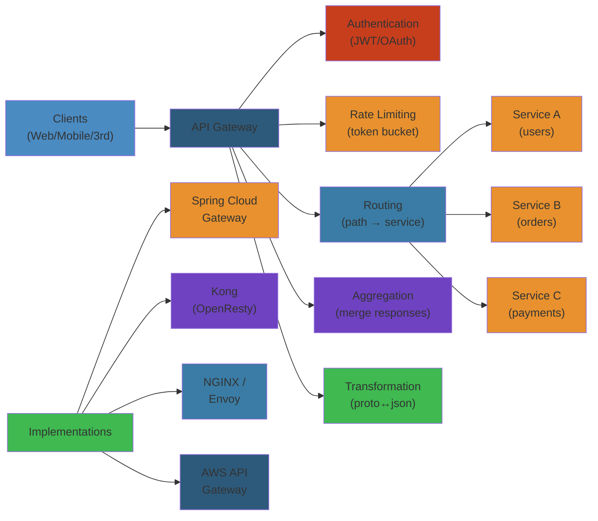
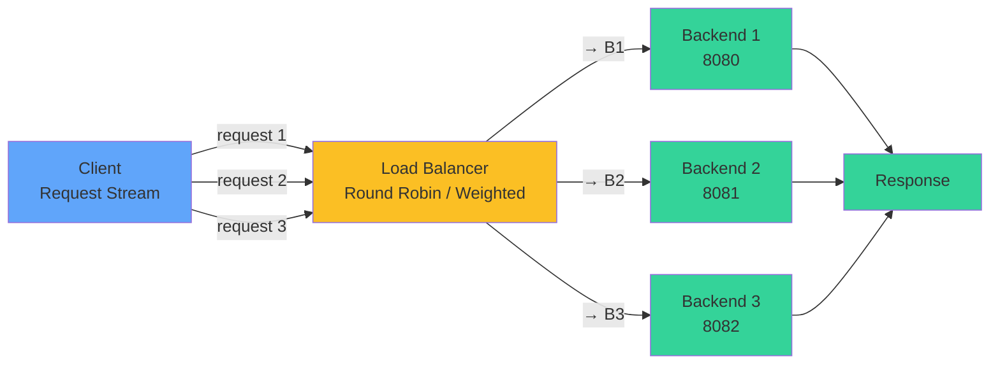

# 🚪 API Gateway — Complete Deep Dive

**Related**: [Service Discovery](/16-microservices/03-service-discovery.md) · [Circuit Breaker](/16-microservices/05-circuit-breaker-resilience.md) · [Load Balancers](/11-networking/load-balancing/loadbalancer.md)

---




## Table of Contents

- [What is an API Gateway?](#-what-is-an-api-gateway)
- [1. Core Responsibilities](#1-core-responsibilities)
- [2. Gateway Implementation](#2-gateway-implementation)
- [3. Rate Limiting](#3-rate-limiting)
- [4. Authentication & Authorization](#4-authentication--authorization)
- [5. Request/Response Transformation](#5-requestresponse-transformation)
- [6. Aggregation Pattern](#6-aggregation-pattern)
- [7. Spring Cloud Gateway](#7-spring-cloud-gateway)
- [8. Kong & NGINX](#8-kong--nginx)
- [Comparison](#-comparison)
- [Simplest Mental Model](#-simplest-mental-model)

---

## 🧭 What is an API Gateway?

```text
                    ┌──────────────────────────────────────┐
                    │         Clients (Web, Mobile, 3rd)  │
                    └───────────┬──────────┬──────────────┘
                                │          │
                                ▼          ▼
                    ┌──────────────────────────────────────┐
                    │          API GATEWAY                 │
                    │                                      │
                    │  ┌─────┐ ┌──────┐ ┌──────┐ ┌──────┐ │
                    │  │Auth │ │Rate  │ │Route │ │Aggr. │ │
                    │  │     │ │Limit │ │      │ │      │ │
                    │  └─────┘ └──────┘ └──────┘ └──────┘ │
                    └──────────┬───────────────────────────┘
                               │
          ┌────────────────────┼────────────────────┐
          ▼                    ▼                    ▼
   ┌────────────┐      ┌────────────┐      ┌────────────┐
   │ Auth Svc   │      │ User Svc   │      │ Order Svc  │
   └────────────┘      └────────────┘      └────────────┘
```

## Load Balancer Distribution



## 1. Core Responsibilities

#### Step-by-Step (API Gateway Request Flow)

1. **Accept Request**: Receive incoming HTTP/2 request from client
2. **Authenticate**: Validate JWT token or API key, reject if invalid (fail fast)
3. **Rate Limit**: Check token bucket, return 429 if quota exceeded
4. **Route**: Lookup service location from registry based on path and method
5. **Transform**: Add/modify headers (X-User-Id, X-Trace-Id), convert content-type if needed
6. **Forward**: Send request to backend service with timeout and circuit breaker
7. **Aggregate**: If needed, call multiple services and merge responses
8. **Transform Response**: Convert response format, add security headers, compress
9. **Cache**: Store response if cacheable (GET requests, Cache-Control header)
10. **Return**: Send response to client

#### Code Example

```go
// Go example: minimal API Gateway implementation
package main

import (
    "fmt"
    "net/http"
    "net/http/httputil"
    "time"
)

type APIGateway struct {
    routes map[string]string  // Path → backend URL mapping
    cache  map[string][]byte  // Simple cache
}

func NewAPIGateway() *APIGateway {
    return &APIGateway{
        routes: map[string]string{
            "/api/users":  "http://user-service:8080",
            "/api/orders": "http://order-service:8081",
        },
        cache: make(map[string][]byte),
    }
}

// Step 1-2: Middleware for authentication
func (gw *APIGateway) authMiddleware(next http.Handler) http.Handler {
    return http.HandlerFunc(func(w http.ResponseWriter, r *http.Request) {
        token := r.Header.Get("Authorization")
        if token == "" {
            http.Error(w, "Missing authorization token", http.StatusUnauthorized)
            return
        }
        if !isValidToken(token) {
            http.Error(w, "Invalid token", http.StatusForbidden)
            return
        }
        next.ServeHTTP(w, r)
    })
}

// Step 3: Rate limiting
type RateLimiter struct {
    requests map[string]int
    limit    int
    window   time.Duration
}

func (rl *RateLimiter) Allow(clientIP string) bool {
    count := rl.requests[clientIP]
    if count >= rl.limit {
        return false
    }
    rl.requests[clientIP]++
    // In production, use sliding window + cleanup
    return true
}

func (gw *APIGateway) rateLimitMiddleware(limiter *RateLimiter) func(http.Handler) http.Handler {
    return func(next http.Handler) http.Handler {
        return http.HandlerFunc(func(w http.ResponseWriter, r *http.Request) {
            clientIP := r.RemoteAddr
            if !limiter.Allow(clientIP) {
                http.Error(w, "Rate limit exceeded", http.StatusTooManyRequests)
                return
            }
            next.ServeHTTP(w, r)
        })
    }
}

// Step 4-5-6: Routing and forwarding
func (gw *APIGateway) ServeHTTP(w http.ResponseWriter, r *http.Request) {
    // Route request to backend
    backendURL, ok := gw.routes[r.RequestURI[:len("/api/xxx")]]
    if !ok {
        http.NotFound(w, r)
        return
    }

    // Add trace ID for observability
    traceID := generateTraceID()
    r.Header.Set("X-Trace-ID", traceID)
    r.Header.Set("X-User-ID", extractUserID(r.Header.Get("Authorization")))

    // Create reverse proxy with timeout
    proxy := &httputil.ReverseProxy{
        Director: func(req *http.Request) {
            req.URL.Scheme = "http"
            req.URL.Host = backendURL
            req.RequestURI = ""
        },
        ModifyResponse: func(resp *http.Response) error {
            // Step 8: Add security headers
            resp.Header.Set("X-Content-Type-Options", "nosniff")
            resp.Header.Set("X-Frame-Options", "DENY")
            return nil
        },
    }

    // Step 7: Timeout context
    ctx, cancel := context.WithTimeout(r.Context(), 5*time.Second)
    defer cancel()

    proxy.ServeHTTP(w, r.WithContext(ctx))
}

// Step 9: Caching for GET requests
func (gw *APIGateway) cacheMiddleware(next http.Handler) http.Handler {
    return http.HandlerFunc(func(w http.ResponseWriter, r *http.Request) {
        if r.Method != "GET" {
            next.ServeHTTP(w, r)
            return
        }

        if cached, ok := gw.cache[r.RequestURI]; ok {
            w.Header().Set("X-Cache", "HIT")
            w.Write(cached)
            return
        }

        // Capture response to cache it
        wrapped := &responseWriter{ResponseWriter: w, body: []byte{}}
        next.ServeHTTP(wrapped, r)

        gw.cache[r.RequestURI] = wrapped.body
        w.Header().Set("X-Cache", "MISS")
    })
}

type responseWriter struct {
    http.ResponseWriter
    body []byte
}

func (rw *responseWriter) Write(b []byte) (int, error) {
    rw.body = append(rw.body, b...)
    return rw.ResponseWriter.Write(b)
}

// Helper functions
func isValidToken(token string) bool {
    // Validate JWT in production
    return token != ""
}

func generateTraceID() string {
    return fmt.Sprintf("trace-%d", time.Now().UnixNano())
}

func extractUserID(authHeader string) string {
    // Parse JWT and extract user ID
    return "user-123"
}

func main() {
    gw := NewAPIGateway()
    limiter := &RateLimiter{requests: make(map[string]int), limit: 100}

    // Stack middleware
    handler := gw
    handler = gw.cacheMiddleware(handler).(http.Handler)
    handler = gw.rateLimitMiddleware(limiter)(handler)
    handler = gw.authMiddleware(handler)

    http.Handle("/api/", handler)
    http.ListenAndServe(":8000", nil)
}
```

#### Real-World Scenario

Netflix replaced their monolithic API Gateway with Zuul (Java-based) to handle 1M+ requests/second. Gateway enforces rate limiting per user tier: free users 1000 req/min, premium 100K req/min. This prevented single misbehaving client from DoS-ing services. When user exceeded quota, gateway immediately returned 429 without even calling backend services, saving billions of backend cycles.

```text
┌─────────────────────────────────────────────────────────────┐
│                 API Gateway Responsibilities                 │
├─────────────────────────────────────────────────────────────┤
│                                                             │
│  🔐 Authentication  ──  Verify JWT, API keys, OAuth tokens  │
│  ⚡ Rate Limiting   ──  100 req/min per user, 1000/min IP  │
│  🧭 Routing         ──  /api/users → user-service          │
│  🔄 Transformation  ──  Modify request/response headers     │
│  📊 Aggregation     ──  Combine multiple service responses  │
│  🛡️ Security        ──  CORS, CSRF, SQL injection protect   │
│  📝 Logging         ──  Access logs, request tracing        │
│  🔌 Protocol conv.  ──  REST ↔ gRPC ↔ WebSocket            │
│  📦 Response cache  ──  Cache common responses              │
│  🔀 Versioning      ──  /v1/... → service-v1, /v2/... → v2│
│                                                             │
└─────────────────────────────────────────────────────────────┘
```

## 2. Gateway Implementation

### Simple Spring Cloud Gateway

```yaml
# application.yml
spring:
  cloud:
    gateway:
      routes:
        - id: user-service
          uri: lb://user-service  # load-balanced via discovery
          predicates:
            - Path=/api/users/**
          filters:
            - StripPrefix=1
            - name: RequestRateLimiter
              args:
                redis-rate-limiter.replenishRate: 10
                redis-rate-limiter.burstCapacity: 20

        - id: order-service
          uri: lb://order-service
          predicates:
            - Path=/api/orders/**
          filters:
            - StripPrefix=1
            - AddRequestHeader=X-Gateway-Request, true

        - id: product-service
          uri: http://product-service:8085  # direct URL (no discovery)
          predicates:
            - Path=/api/products/**
          filters:
            - CircuitBreaker=productService
            - name: Retry
              args:
                retries: 3
                statuses: BAD_GATEWAY, SERVICE_UNAVAILABLE
                methods: GET
```

### Route Configuration in Code

```java
@Configuration
public class GatewayConfig {

    @Bean
    public RouteLocator customRoutes(RouteLocatorBuilder builder) {
        return builder.routes()
            .route("user-service", r -> r
                .path("/api/users/**")
                .filters(f -> f
                    .stripPrefix(1)
                    .circuitBreaker(config -> config
                        .setName("userServiceCB")
                        .setFallbackUri("forward:/fallback/users"))
                    .retry(3))
                .uri("lb://user-service"))

            .route("order-service", r -> r
                .path("/api/orders/**")
                .and().method("GET", "POST")
                .filters(f -> f
                    .stripPrefix(1)
                    .addRequestHeader("X-Source", "gateway"))
                .uri("lb://order-service"))

            .build();
    }
}
```

### Global Filters

```java
@Component
public class GlobalLoggingFilter implements GlobalFilter, Ordered {

    private static final Logger log = LoggerFactory.getLogger(GlobalLoggingFilter.class);

    @Override
    public Mono<Void> filter(ServerWebExchange exchange, GatewayFilterChain chain) {
        ServerHttpRequest request = exchange.getRequest();

        // Pre-filter
        log.info("Incoming request: {} {} from {}",
            request.getMethod(), request.getURI(), request.getRemoteAddress());

        // Add trace ID
        String traceId = UUID.randomUUID().toString();
        exchange.getAttributes().put("traceId", traceId);

        ServerHttpRequest modifiedRequest = request.mutate()
            .header("X-Trace-Id", traceId)
            .build();

        ServerWebExchange modifiedExchange = exchange.mutate()
            .request(modifiedRequest)
            .build();

        // Post-filter
        long start = System.currentTimeMillis();
        return chain.filter(modifiedExchange).then(Mono.fromRunnable(() -> {
            ServerHttpResponse response = modifiedExchange.getResponse();
            log.info("Completed {} {} → {}ms ({} {})",
                request.getMethod(), request.getURI(),
                System.currentTimeMillis() - start,
                response.getStatusCode(), response.getHeaders().getContentType());
        }));
    }

    @Override
    public int getOrder() {
        return -1;  // run first
    }
}
```

---

## 3. Rate Limiting

### Token Bucket Algorithm

```text
Token Bucket Rate Limiter:

  ┌─────────────────────────────┐
  │         Bucket              │
  │  Capacity = 20 tokens       │
  │                             │
  │  ◉ ◉ ◉ ◉ ◉ ◉ ◉ ◉ ◉ ◉      │
  │  ◉ ◉ ◉ ◉ ◉ ◉ ◉ ◉ ◉ ◉      │
  │                             │
  │  Replenish: 10 tokens/sec   │
  └─────────────────────────────┘
           │        │
         Take     Refill
           │        │
           ▼        ▼
    ┌──────────┐  ┌──────────┐
    │ Request  │  │ Timer    │
    │ Allowed  │  │ +10/sec  │
    └──────────┘  └──────────┘
```

### Redis-Based Rate Limiter

```java
@Configuration
public class RateLimiterConfig {

    @Bean
    public RedisRateLimiter redisRateLimiter(
            RedisReactiveCommandsProvider redisProvider) {
        return new RedisRateLimiter(redisProvider);
    }

    // Custom key resolver — limit by user ID or API key
    @Bean
    public KeyResolver userKeyResolver() {
        return exchange -> {
            String userId = exchange.getRequest()
                .getHeaders()
                .getFirst("X-User-Id");
            if (userId == null) {
                userId = exchange.getRequest()
                    .getRemoteAddress()
                    .getAddress()
                    .getHostAddress();
            }
            return Mono.just(userId);
        };
    }
}

// Route with custom rate limiter
@Bean
public RouteLocator rateLimitedRoutes(RouteLocatorBuilder builder) {
    return builder.routes()
        .route("api-route", r -> r
            .path("/api/**")
            .filters(f -> f
                .requestRateLimiter(config -> config
                    .setRateLimiter(redisRateLimiter())
                    .setKeyResolver(userKeyResolver())
                    .setStatusCode(HttpStatus.TOO_MANY_REQUESTS)))
            .uri("lb://backend"))
        .build();
}
```

### Distributed Rate Limiting with Redis

```lua
-- Lua script for atomic token bucket (runs in Redis)
-- KEYS[1] = bucket key
-- ARGV[1] = replenish rate (tokens/sec)
-- ARGV[2] = burst capacity
-- ARGV[3] = tokens requested
-- ARGV[4] = current timestamp

local key = KEYS[1]
local rate = tonumber(ARGV[1])
local capacity = tonumber(ARGV[2])
local requested = tonumber(ARGV[3])
local now = tonumber(ARGV[4])

-- Get current bucket state
local bucket = redis.call("HMGET", key, "tokens", "lastRefillTime")
local tokens = tonumber(bucket[1] or capacity)
local lastRefill = tonumber(bucket[2] or now)

-- Refill tokens
local elapsed = math.max(0, now - lastRefill)
tokens = math.min(capacity, tokens + (elapsed * rate))

-- Check if request can be fulfilled
if tokens >= requested then
    tokens = tokens - requested
    redis.call("HMSET", key, "tokens", tokens, "lastRefillTime", now)
    redis.call("EXPIRE", key, math.ceil(capacity / rate) * 2)
    return {1, tokens, capacity}  -- ALLOWED
else
    return {0, tokens, capacity}  -- DENIED
end
```

---

## 4. Authentication & Authorization

### JWT Validation Filter

```java
@Component
public class JwtAuthFilter implements GlobalFilter, Ordered {

    private final JwtTokenValidator jwtValidator;

    // Public paths that don't need auth
    private final List<String> publicPaths = List.of(
        "/api/public",
        "/api/auth/login",
        "/actuator/health"
    );

    public JwtAuthFilter(JwtTokenValidator jwtValidator) {
        this.jwtValidator = jwtValidator;
    }

    @Override
    public Mono<Void> filter(ServerWebExchange exchange, GatewayFilterChain chain) {
        String path = exchange.getRequest().getURI().getPath();

        // Skip auth for public paths
        if (isPublicPath(path)) {
            return chain.filter(exchange);
        }

        String authHeader = exchange.getRequest()
            .getHeaders().getFirst(HttpHeaders.AUTHORIZATION);

        if (authHeader == null || !authHeader.startsWith("Bearer ")) {
            return unauthorized(exchange, "Missing or invalid Authorization header");
        }

        String token = authHeader.substring(7);

        try {
            JwtToken tokenData = jwtValidator.validate(token);

            // Inject user info into headers for downstream services
            ServerHttpRequest modifiedRequest = exchange.getRequest().mutate()
                .header("X-User-Id", tokenData.userId())
                .header("X-User-Roles", String.join(",", tokenData.roles()))
                .header("X-User-Email", tokenData.email())
                .build();

            return chain.filter(exchange.mutate().request(modifiedRequest).build());

        } catch (TokenExpiredException e) {
            return unauthorized(exchange, "Token expired");
        } catch (InvalidTokenException e) {
            return unauthorized(exchange, "Invalid token");
        }
    }

    private Mono<Void> unauthorized(ServerWebExchange exchange, String message) {
        ServerHttpResponse response = exchange.getResponse();
        response.setStatusCode(HttpStatus.UNAUTHORIZED);
        response.getHeaders().setContentType(MediaType.APPLICATION_JSON);
        try {
            byte[] body = new ObjectMapper()
                .writeValueAsBytes(Map.of("error", message));
            return response.writeWith(Mono.just(response.bufferFactory().wrap(body)));
        } catch (Exception e) {
            return response.setComplete();
        }
    }

    private boolean isPublicPath(String path) {
        return publicPaths.stream().anyMatch(path::startsWith);
    }

    @Override
    public int getOrder() {
        return 0;
    }
}
```

---

## 5. Request/Response Transformation

### Request Transformation

```java
@Component
public class RequestTransformationFilter implements GlobalFilter {

    @Override
    public Mono<Void> filter(ServerWebExchange exchange, GatewayFilterChain chain) {
        ServerHttpRequest request = exchange.getRequest();

        // Version routing: /v2/users → route to new service
        String path = request.getURI().getPath();
        String version = extractVersion(path);

        ServerHttpRequest modified = request.mutate()
            // Add gateway metadata
            .header("X-Gateway-Version", version)
            .header("X-Forwarded-Proto", request.getURI().getScheme())
            // Remove internal headers from client
            .headers(h -> h.remove("X-Internal-Header"))
            .build();

        return chain.filter(exchange.mutate().request(modified).build());
    }

    private String extractVersion(String path) {
        if (path.startsWith("/v2/")) return "2";
        return "1";
    }
}

// Response transformation
@Component
public class ResponseWrapperFilter implements GlobalFilter, Ordered {

    @Override
    public Mono<Void> filter(ServerWebExchange exchange, GatewayFilterChain chain) {
        ServerHttpResponse response = exchange.getResponse();
        DataBufferFactory bufferFactory = response.bufferFactory();

        // Wrap response to add metadata
        ServerHttpResponseDecorator decorated = new ServerHttpResponseDecorator(response) {
            @Override
            public Mono<Void> writeWith(Publisher<? extends DataBuffer> body) {
                if (body instanceof Flux) {
                    Flux<? extends DataBuffer> flux = (Flux<? extends DataBuffer>) body;
                    return super.writeWith(flux.buffer().map(dataBuffers -> {
                        // Combine all buffers
                        ByteArrayOutputStream output = new ByteArrayOutputStream();
                        dataBuffers.forEach(b -> {
                            byte[] array = new byte[b.readableByteCount()];
                            b.read(array);
                            try { output.write(array); } catch (IOException e) {}
                            DataBufferUtils.release(b);
                        });

                        // Add gateway execution time header
                        long duration = System.currentTimeMillis() -
                            exchange.getAttribute("startTime");
                        response.getHeaders().set("X-Gateway-Execution-Time",
                            String.valueOf(duration));

                        return bufferFactory.wrap(output.toByteArray());
                    }));
                }
                return super.writeWith(body);
            }
        };

        return chain.filter(exchange.mutate().response(decorated).build());
    }

    @Override
    public int getOrder() {
        return Ordered.LOWEST_PRECEDENCE;
    }
}
```

---

## 6. Aggregation Pattern

### Problem

```text
Mobile app needs: user profile + orders + recommendations

❌ Without aggregation — 3 round trips:
  App ──GET──> API GW ──> User Service      ──> App
  App ──GET──> API GW ──> Order Service     ──> App
  App ──GET──> API GW ──> Recommendation    ──> App
  Total: 3 HTTP round trips

✅ With aggregation — 1 round trip:
  App ──GET──> API GW ──> User Service     ─┐
                     ──> Order Service    ──┤──> Combine → App
                     ──> Recommendation  ──┘
  Total: 1 HTTP round trip + parallel internal calls
```

### Aggregation Handler

```java
@RestController
@RequestMapping("/api/dashboard")
public class DashboardAggregationController {

    private final WebClient webClient;

    public DashboardAggregationController(WebClient.Builder webClientBuilder) {
        this.webClient = webClientBuilder.build();
    }

    @GetMapping("/{userId}")
    public Mono<DashboardResponse> getDashboard(@PathVariable String userId) {
        long start = System.currentTimeMillis();

        // Parallel calls to all services
        Mono<UserProfile> userProfile = webClient.get()
            .uri("http://user-service/api/users/{id}", userId)
            .retrieve()
            .bodyToMono(UserProfile.class)
            .timeout(Duration.ofSeconds(3))
            .onErrorResume(e -> {
                log.warn("User service failed", e);
                return Mono.just(new UserProfile(userId, null, null));
            });

        Mono<List<OrderSummary>> orders = webClient.get()
            .uri("http://order-service/api/orders?userId={id}", userId)
            .retrieve()
            .bodyToFlux(OrderSummary.class)
            .collectList()
            .timeout(Duration.ofSeconds(3))
            .onErrorReturn(List.of());

        Mono<List<ProductRecommendation>> recommendations = webClient.get()
            .uri("http://recommendation-service/api/recommendations/{id}", userId)
            .retrieve()
            .bodyToFlux(ProductRecommendation.class)
            .collectList()
            .timeout(Duration.ofSeconds(2))
            .onErrorReturn(List.of());

        // Combine all responses
        return Mono.zip(userProfile, orders, recommendations)
            .map(tuple -> new DashboardResponse(
                tuple.getT1(),
                tuple.getT2(),
                tuple.getT3(),
                System.currentTimeMillis() - start
            ));
    }
}

// Response DTO
public record DashboardResponse(
    UserProfile user,
    List<OrderSummary> recentOrders,
    List<ProductRecommendation> recommendations,
    long elapsedMs
) {}
```

---

## 7. Spring Cloud Gateway

### Full Configuration

```java
@SpringBootApplication
@EnableDiscoveryClient
public class GatewayApplication {

    public static void main(String[] args) {
        SpringApplication.run(GatewayApplication.class, args);
    }

    @Bean
    public RouteLocator routes(RouteLocatorBuilder builder) {
        return builder.routes()

            // User service
            .route("users", r -> r
                .path("/api/users/**")
                .filters(f -> f
                    .stripPrefix(1)
                    .circuitBreaker(c -> c
                        .setName("usersCB")
                        .setFallbackUri("forward:/fallback/users"))
                    .retry(3))
                .uri("lb://user-service"))

            // Order service
            .route("orders", r -> r
                .path("/api/orders/**")
                .filters(f -> f
                    .stripPrefix(1)
                    .circuitBreaker(c -> c
                        .setName("ordersCB")))
                .uri("lb://order-service"))

            // WebSocket support
            .route("ws-orders", r -> r
                .path("/ws/orders/**")
                .uri("lb:ws://order-service"))  // WebSocket LB

            .build();
    }
}
```

### Custom GatewayFilterFactory

```java
@Component
public class TransformResponseGatewayFilterFactory
        extends AbstractGatewayFilterFactory<TransformResponseGatewayFilterFactory.Config> {

    public TransformResponseGatewayFilterFactory() {
        super(Config.class);
    }

    @Override
    public GatewayFilter apply(Config config) {
        return (exchange, chain) -> {
            ServerHttpResponse response = exchange.getResponse();
            DataBufferFactory bufferFactory = response.bufferFactory();

            ServerHttpResponseDecorator decorator = new ServerHttpResponseDecorator(response) {
                @Override
                public Mono<Void> writeWith(Publisher<? extends DataBuffer> body) {
                    if (body instanceof Flux) {
                        Flux<? extends DataBuffer> flux = (Flux<? extends DataBuffer>) body;

                        return super.writeWith(flux.map(buffer -> {
                            byte[] content = new byte[buffer.readableByteCount()];
                            buffer.read(content);
                            DataBufferUtils.release(buffer);

                            // Wrap all responses in envelope
                            String wrapped = String.format(
                                "{\"data\":%s,\"meta\":{\"version\":\"%s\"}}",
                                new String(content), config.getVersion());

                            return bufferFactory.wrap(wrapped.getBytes());
                        }));
                    }
                    return super.writeWith(body);
                }
            };

            return chain.filter(exchange.mutate().response(decorator).build());
        };
    }

    @Data
    public static class Config {
        private String version = "1.0";
    }
}
```

---

## 8. Kong & NGINX

### Kong Declarative Config

```yaml
# kong.yml
_format_version: "3.0"
services:
  - name: user-service
    url: http://user-service:8082
    routes:
      - name: users-route
        paths:
          - /api/users
        methods: [GET, POST, PUT, DELETE]
    plugins:
      - name: jwt
        config:
          claims_to_verify: ["exp", "nbf"]
      - name: rate-limiting
        config:
          minute: 100
          policy: local
      - name: cors

  - name: order-service
    url: http://order-service:8083
    routes:
      - name: orders-route
        paths:
          - /api/orders
        methods: [GET, POST]
    plugins:
      - name: jwt
      - name: acl
        config:
          allow: ["admin", "user"]
```

### NGINX API Gateway

```nginx
upstream user_backend {
    server user-service-1:8082 max_fails=3 fail_timeout=30s;
    server user-service-2:8082 max_fails=3 fail_timeout=30s;
    keepalive 32;
}

upstream order_backend {
    server order-service:8083;
}

server {
    listen 443 ssl;
    server_name api.example.com;

    # Rate limit zone
    limit_req_zone $binary_remote_addr zone=api_limit:10m rate=100r/s;
    limit_conn_zone $binary_remote_addr zone=conn_limit:10m;

    # JWT validation via lua
    access_by_lua_block {
        local jwt = require("resty.jwt")
        local auth_header = ngx.var.http_authorization
        if not auth_header then
            ngx.status = 401
            ngx.say('{"error":"Missing authorization"}')
            ngx.exit(401)
        end
        local _, _, token = string.find(auth_header, "Bearer%s+(.+)")
        local jwt_obj = jwt:verify("secret-key", token)
        if not jwt_obj.verified then
            ngx.status = 401
            ngx.say('{"error":"Invalid token"}')
            ngx.exit(401)
        end
        ngx.var.user_id = jwt_obj.payload.sub
    }

    location /api/users/ {
        limit_req zone=api_limit burst=20 nodelay;
        proxy_pass http://user_backend/;
        proxy_set_header X-User-ID $user_id;
        proxy_set_header X-Forwarded-For $proxy_add_x_forwarded_for;
    }

    location /api/orders/ {
        limit_req zone=api_limit burst=20 nodelay;
        proxy_pass http://order_backend/;
    }
}
```

---

## 📊 Comparison

| Feature | Spring Cloud Gateway | Kong | NGINX + Lua |
|---------|---------------------|------|-------------|
| Language | Java (Reactive) | Lua + OpenResty | C + Lua |
| Performance | ~20K req/s | ~50K req/s | ~100K req/s |
| Configuration | Java DSL / YAML | Declarative YAML | Config + Lua |
| Service Discovery | Native (Eureka, K8s) | DNS-based | Custom |
| Rate Limiting | Redis-based | Built-in | Lua scripting |
| Circuit Breaker | Spring Cloud CB | Plugin | Custom |
| Custom filters | Java | Lua plugins | Lua |
| Ecosystem | Spring ecosystem | Plugin marketplace | Minimal |
| Best for | Java/Spring shops | Multi-lang, API-first | High perf, custom |

---

## 🧠 Simplest Mental Model

```text
API GATEWAY  =  A company reception desk. All visitors (requests)
                come to the same desk. The receptionist:
                1. Checks ID (authentication)
                2. Directs to correct floor (routing)
                3. Limits how many can enter (rate limiting)
                4. Handles visitors in other languages (transformation)

RATE LIMITER =  A bouncer at a club. "Only 100 people per minute."
                Token bucket = bowl of tokens. Each visitor takes one.
                New tokens added every minute.
                No tokens = wait.

AGGREGATION  =  Instead of you going to 3 different shops,
                you ask a concierge who goes to all 3 and
                brings back everything at once.

CIRCUIT      =  If one department keeps messing up, the receptionist
BREAKER        stops sending people there for a while.
               "Try again later." Prevents everyone from queuing up.

JWT          =  A passport. The receptionist stamps it when you arrive,
                and you show it to everyone inside. It proves who
                you are and what you're allowed to do.
```

---

**Next**: [Circuit Breaker & Resilience](/16-microservices/05-circuit-breaker-resilience.md)


## API Gateway Request Flow

```
1. Request arrives at gateway
   ↓
2. Authentication: Verify JWT token
   └─ Invalid? → 401 Unauthorized (stop)
   ↓
3. Rate limiting: Check quota
   └─ Exceeded? → 429 Too Many Requests (stop)
   ↓
4. Routing: Match URL to service
   /users/* → user-service:8080
   /orders/* → order-service:8080
   ↓
5. Transform request
   - Add request ID
   - Add tracing headers
   - Compress payload
   ↓
6. Call backend service
   ↓
7. Transform response
   - Add security headers
   - Decompress
   - Add cache headers
   ↓
8. Return to client
```

### Common Pitfall: Cascading Failures
```
Gateway → Service A (slow, timeout in 5s)
          Service B waits for A (timeout in 3s)
          Service C waits for B (timeout in 1s)

Fix: Use circuit breaker pattern
- Service A slow? Open circuit, fail fast
- Return cached response instead
- Retry when service recovers
```

## Related

- [Cap Consistency](/09-distributed-systems/01-cap-consistency.md)
- [Consensus Replication](/09-distributed-systems/01-consensus-replication.md)
- [Consensus Raft](/09-distributed-systems/02-consensus-raft.md)
- [Distributed Transactions](/09-distributed-systems/02-distributed-transactions.md)
- [Distributed Caching](/09-distributed-systems/03-distributed-caching.md)
- [Distributed Storage](/09-distributed-systems/03-distributed-storage.md)
