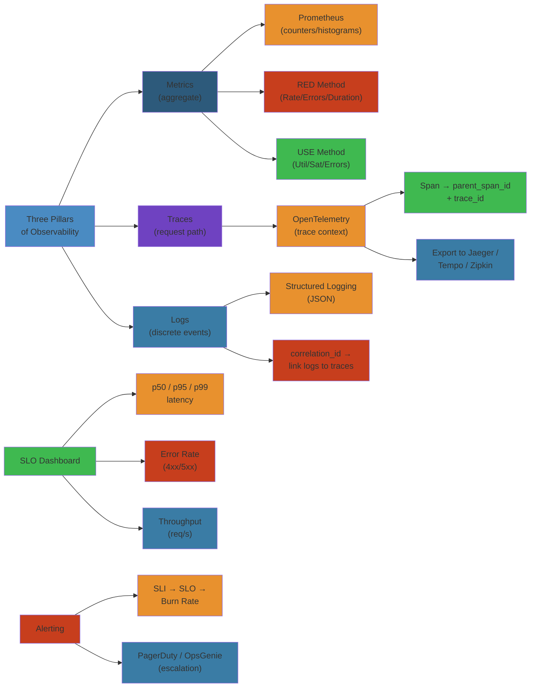

# 📊 Microservices Observability — Complete Deep Dive

**Simplest Mental Model**: Observability = ask any question about system state without deploying new code. Metrics tell you *what* is slow, traces tell you *where*, logs tell you *why*.

---




## 📑 Table of Contents

#### Step-by-Step
1. Process input
2. Validate
3. Execute
4. Return result

#### Code Example
```python
# Example implementation
pass
```

#### Real-World Scenario
This pattern is commonly used in production systems.


- [1. Three Pillars](#1-three-pillars)
- [2. OpenTelemetry](#2-opentelemetry)
- [3. Distributed Tracing](#3-distributed-tracing)
- [4. Structured Logging](#4-structured-logging)
- [5. Metrics & SLOs](#5-metrics--slos)
- [6. Grafana](#6-grafana)
- [7. Prometheus](#7-prometheus)

---

## 1. Three Pillars

#### Step-by-Step
1. Process input
2. Validate
3. Execute
4. Return result

#### Code Example
```python
# Example implementation
pass
```

#### Real-World Scenario
This pattern is commonly used in production systems.


```
┌─────────────────────────────────────────────────────┐
│                   Observability                      │
├────────────┬──────────────────┬──────────────────────┤
│  Metrics   │     Traces       │       Logs           │
│ (aggregate)│  (request path)  │  (discrete events)   │
├────────────┼──────────────────┼──────────────────────┤
│ Prometheus │  Jaeger / Tempo  │  Loki / ELK          │
│  counters  │  span_id chain   │  structured JSON     │
│  histograms│  waterfall view  │  correlation_id      │
└────────────┴──────────────────┴──────────────────────┘
```

- **Metrics**: RED (Rate/Errors/Duration), USE (Utilization/Saturation/Errors), Four Golden Signals
- **Traces**: End-to-end request path across service boundaries
- **Logs**: Structured events with trace context for correlation

## 2. OpenTelemetry

#### Step-by-Step
1. Process input
2. Validate
3. Execute
4. Return result

#### Code Example
```python
# Example implementation
pass
```

#### Real-World Scenario
This pattern is commonly used in production systems.


### Architecture

#### Step-by-Step
1. Process input
2. Validate
3. Execute
4. Return result

#### Code Example
```python
# Example implementation
pass
```

#### Real-World Scenario
This pattern is commonly used in production systems.


```text
           ┌──────────┐
 App ─────►│  OTel SDK │────► OTLP exporter ────► Collector
           └──────────┘                               │
                                          ┌────────────┼────────────┐
                                          ▼            ▼            ▼
                                      Prometheus    Tempo         Loki
```

### Collector Configuration

#### Step-by-Step
1. Process input
2. Validate
3. Execute
4. Return result

#### Code Example
```python
# Example implementation
pass
```

#### Real-World Scenario
This pattern is commonly used in production systems.


```yaml
# otel-collector-config.yaml
receivers:
  otlp:
    protocols:
      grpc:
        endpoint: 0.0.0.0:4317
      http:
        endpoint: 0.0.0.0:4318

processors:
  batch:
    timeout: 1s
    send_batch_size: 1024
  memory_limiter:
    check_interval: 1s
    limit_mib: 512
    spike_limit_mib: 128
  attributes:
    actions:
      - key: environment
        value: production
        action: upsert
  filter:
    error_mode: ignore
    spans:
      exclude:
        match_type: regexp
        span_names: ["healthcheck"]
  tail_sampling:
    policies:
      - name: errors-and-slow
        type: and
        and:
          - type: status_code
            status_code: ERROR
          - type: latency
            threshold_ms: 1000

exporters:
  otlp:
    endpoint: tempo:4317
    tls:
      insecure: true
  prometheus:
    endpoint: 0.0.0.0:8889
  logging:
    verbosity: detailed

service:
  pipelines:
    traces:
      receivers: [otlp]
      processors: [memory_limiter, batch, attributes, filter, tail_sampling]
      exporters: [otlp, logging]
    metrics:
      receivers: [otlp]
      processors: [memory_limiter, batch, attributes]
      exporters: [prometheus, logging]
```

### Auto-Instrumentation (Java)

#### Step-by-Step
1. Process input
2. Validate
3. Execute
4. Return result

#### Code Example
```python
# Example implementation
pass
```

#### Real-World Scenario
This pattern is commonly used in production systems.


```bash
# Java — attach agent
java -javaagent:opentelemetry-javaagent.jar \
     -Dotel.service.name=payment-service \
     -Dotel.traces.exporter=otlp \
     -Dotel.metrics.exporter=otlp \
     -Dotel.logs.exporter=otlp \
     -Dotel.exporter.otlp.endpoint=http://otel-collector:4317 \
     -jar app.jar
```

### Sampling

#### Step-by-Step
1. Process input
2. Validate
3. Execute
4. Return result

#### Code Example
```python
# Example implementation
pass
```

#### Real-World Scenario
This pattern is commonly used in production systems.


```text
Head Sampling  ── Decision made at request start (probabilistic)
    P = 0.1  →  10% of all requests traced

Tail Sampling  ── Decision made after request completes (intelligent)
    All requests stored temporarily, sampled based on:
    • All errors
    • Requests > 500ms
    • 10% of healthy fast requests

Rate Limiting  ── Max spans/second
    Max 100 spans/sec, drop excess
```

### W3C Trace Context Propagation

#### Step-by-Step
1. Process input
2. Validate
3. Execute
4. Return result

#### Code Example
```python
# Example implementation
pass
```

#### Real-World Scenario
This pattern is commonly used in production systems.


```text
Trace:       00-0af7651916cd43dd8448eb211c80319c-b7ad6b7169203331-01
              │  └─────── trace_id (16 bytes hex) ────────┘ │
              │                                             │
          version                                        trace_flags
                                                           (01=sampled)
```

## 3. Distributed Tracing

#### Step-by-Step
1. Process input
2. Validate
3. Execute
4. Return result

#### Code Example
```python
# Example implementation
pass
```

#### Real-World Scenario
This pattern is commonly used in production systems.


### Span Lifecycle

#### Step-by-Step
1. Process input
2. Validate
3. Execute
4. Return result

#### Code Example
```python
# Example implementation
pass
```

#### Real-World Scenario
This pattern is commonly used in production systems.


```java
// OpenTelemetry manual instrumentation
Tracer tracer = openTelemetry.getTracer("payment-service");
Span span = tracer.spanBuilder("processPayment")
    .setSpanKind(SpanKind.SERVER)
    .setAttribute("payment.amount", 100.0)
    .setAttribute("payment.currency", "USD")
    .startSpan();

try (Scope scope = span.makeCurrent()) {
    // ... business logic ...
    span.addEvent("charge.completed");
    span.setStatus(StatusCode.OK);
} catch (Exception e) {
    span.recordException(e);
    span.setStatus(StatusCode.ERROR, e.getMessage());
    throw e;
} finally {
    span.end();
}
```

### Span Attributes

#### Step-by-Step
1. Process input
2. Validate
3. Execute
4. Return result

#### Code Example
```python
# Example implementation
pass
```

#### Real-World Scenario
This pattern is commonly used in production systems.


```text
Kind:      SERVER | CLIENT | PRODUCER | CONSUMER | INTERNAL
Status:    UNSET | OK | ERROR
Events:    { name, timestamp, attributes[] }
Links:     connect spans across different traces
Baggage:   key-value pairs propagated across service boundaries

Trace flow (waterfall):
    browser ──► gateway ──► auth ──► payment ──► ledger
      │          │          │         │            │
     t=0        t=5        t=10      t=20         t=80
                └────────────┴──────────┴──────────┘
                          parent_span_id chain
```

## 4. Structured Logging

#### Step-by-Step
1. Process input
2. Validate
3. Execute
4. Return result

#### Code Example
```python
# Example implementation
pass
```

#### Real-World Scenario
This pattern is commonly used in production systems.


```yaml
# logback-spring.xml — ECS (Elastic Common Schema) format
<appender name="JSON" class="ch.qos.logback.core.ConsoleAppender">
  <encoder class="net.logstash.logback.encoder.LogstashEncoder">
    <includeMdcKeyName>trace_id</includeMdcKeyName>
    <includeMdcKeyName>span_id</includeMdcKeyName>
    <includeMdcKeyName>correlation_id</includeMdcKeyName>
  </encoder>
</appender>
```

```java
// Java — structured logging with MDC
import org.slf4j.MDC;

MDC.put("correlation_id", request.getHeader("X-Correlation-Id"));
MDC.put("trace_id", Span.current().getSpanContext().getTraceId());
MDC.put("user_id", user.getId());

log.info("Payment processed");
// → {"level":"INFO","message":"Payment processed",
//    "correlation_id":"abc123","trace_id":"0af7...",
//    "user_id":"u42","service":"payment-service","@timestamp":"..."}

MDC.clear();
```

**Loki** (log aggregation): uses same labels as Prometheus for seamless trace→logs correlation. **ELK**: Elasticsearch + Logstash + Kibana for full-text search.

## 5. Metrics & SLOs

#### Step-by-Step
1. Process input
2. Validate
3. Execute
4. Return result

#### Code Example
```python
# Example implementation
pass
```

#### Real-World Scenario
This pattern is commonly used in production systems.


### RED Method (Services)

#### Step-by-Step
1. Process input
2. Validate
3. Execute
4. Return result

#### Code Example
```python
# Example implementation
pass
```

#### Real-World Scenario
This pattern is commonly used in production systems.


```text
Rate:     requests/second
Errors:   failed requests/second (5xx, 4xx business errors)
Duration: latency distribution (p50, p95, p99)
```

### USE Method (Infrastructure)

#### Step-by-Step
1. Process input
2. Validate
3. Execute
4. Return result

#### Code Example
```python
# Example implementation
pass
```

#### Real-World Scenario
This pattern is commonly used in production systems.


```text
Utilization:   CPU / memory / disk busy %
Saturation:    queue depth, run queue length
Errors:        hardware or OS errors
```

### Four Golden Signals (Google SRE)

#### Step-by-Step
1. Process input
2. Validate
3. Execute
4. Return result

#### Code Example
```python
# Example implementation
pass
```

#### Real-World Scenario
This pattern is commonly used in production systems.


```text
1. Latency:    time to service a request
2. Traffic:    demand on the system (RPS, concurrent users)
3. Errors:     explicit (5xx) + implicit (success but wrong result)
4. Saturation: how "full" the service is
```

### SLO / Error Budget / Burn Rate

#### Step-by-Step
1. Process input
2. Validate
3. Execute
4. Return result

#### Code Example
```python
# Example implementation
pass
```

#### Real-World Scenario
This pattern is commonly used in production systems.


```text
SLO:  99.9% of requests complete in < 200ms over 30 days
Budget: 0.1% = 43m 12s of error budget per 30 days

Burn Rate: how fast budget is consumed
  < 1  → within budget
  = 1  → will exhaust exactly at end of window
  > 1  → will exhaust early

Alerting:
  Page if burn rate > 2 for 1 hour (fast burn)
  Page if burn rate > 1 for 6 hours (slow burn)
```

### Metric Types

#### Step-by-Step
1. Process input
2. Validate
3. Execute
4. Return result

#### Code Example
```python
# Example implementation
pass
```

#### Real-World Scenario
This pattern is commonly used in production systems.


```java
// Micrometer — counter
Counter ordersCreated = Counter.builder("orders.created")
    .description("Total orders created")
    .tag("region", "us-east")
    .register(meterRegistry);
ordersCreated.increment();

// Gauge — current value
Gauge.builder("queue.depth", queue, Queue::size)
    .register(meterRegistry);

// Histogram — latency distribution
Timer timer = Timer.builder("payment.latency")
    .publishPercentiles(0.5, 0.95, 0.99)
    .publishPercentileHistogram()
    .sla(Duration.ofMillis(100), Duration.ofMillis(200))
    .register(meterRegistry);
timer.record(() -> processPayment(payment));

// Summary — quantile estimation
DistributionSummary summary = DistributionSummary.builder("order.value")
    .publishPercentiles(0.5, 0.9, 0.99)
    .register(meterRegistry);
summary.record(order.getTotal());
```

### Cardinality Warning

#### Step-by-Step
1. Process input
2. Validate
3. Execute
4. Return result

#### Code Example
```python
# Example implementation
pass
```

#### Real-World Scenario
This pattern is commonly used in production systems.


```text
Tags:    { service, method, status_code, region, instance_id }  ✅ OK
         { service, user_id }  ❌ unbounded — millions of time series
         { service, session_id }  ❌ every session creates new series

High cardinality → OOM in Prometheus → slow queries → missed alerts
Limit: < 100,000 series per service is safe
```

## 6. Grafana

#### Step-by-Step
1. Process input
2. Validate
3. Execute
4. Return result

#### Code Example
```python
# Example implementation
pass
```

#### Real-World Scenario
This pattern is commonly used in production systems.


```yaml
# grafana-dashboard.yaml — provisioning
apiVersion: 1
providers:
  - name: "default"
    orgId: 1
    folder: "Services"
    options:
      path: /var/lib/grafana/dashboards
```

```yaml
# panels — typical SLO dashboard panel
panels:
  - title: "p99 Latency"
    type: timeseries
    targets:
      - expr: |
          histogram_quantile(0.99,
            rate(payment_latency_seconds_bucket[5m])
          )
        legendFormat: "p99"
      - expr: |
          histogram_quantile(0.95,
            rate(payment_latency_seconds_bucket[5m])
          )
        legendFormat: "p95"
```

**Variables**: `$service`, `$region`, `$environment` — dropdown filters. **Annotations**: deploy markers, incident timelines on panels. **Unified Alerting**: `group_wait: 30s`, `group_interval: 5m`, `repeat_interval: 4h`. **Explore**: ad-hoc PromQL/Loki/ Tempo queries.

## 7. Prometheus

#### Step-by-Step
1. Process input
2. Validate
3. Execute
4. Return result

#### Code Example
```python
# Example implementation
pass
```

#### Real-World Scenario
This pattern is commonly used in production systems.


```yaml
# prometheus.yml
global:
  scrape_interval: 15s
  evaluation_interval: 15s

rule_files:
  - "rules/*.yml"

scrape_configs:
  - job_name: "kubernetes-pods"
    kubernetes_sd_configs:
      - role: pod
    relabel_configs:
      - source_labels: [__meta_kubernetes_pod_annotation_prometheus_io_scrape]
        action: keep
        regex: true
      - source_labels: [__meta_kubernetes_pod_annotation_prometheus_io_path]
        action: replace
        target_label: __metrics_path__
        regex: (.+)
```

```yaml
# rules/alerts.yml
groups:
  - name: payment-service
    rules:
      - record: job:payment:error_rate_5m
        expr: |
          rate(payment_errors_total[5m])
        labels: { severity: warning }
      - alert: HighErrorRate
        expr: |
          rate(payment_errors_total[5m]) / rate(payment_requests_total[5m]) > 0.01
        for: 5m
        labels: { severity: critical }
        annotations:
          summary: "Payment error rate > 1% for 5 minutes"
```

**Recording rules** pre-compute expensive queries. **Alerting rules** fire to Alertmanager (dedup, grouping, routing to PagerDuty/Slack).

```text
PromQL Cheatsheet:
  rate(counter[5m])                   → per-second rate over 5m
  increase(counter[1h])               → total increase over 1h
  histogram_quantile(0.99, bucket)    → p99 from histogram
  sum by (service) (rate(errors[5m])) → errors per service
  topk(5, max by (pod) (cpu_usage))   → top 5 CPU pods
```
