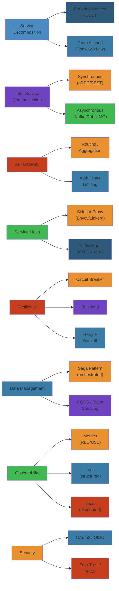

# Microservices — Complete Deep Dive 🧩

Microservices are independently deployable, loosely coupled services each owning a specific business capability. They enable **polyglot persistence**, **independent scaling**, and **team autonomy** — at the cost of distributed systems complexity.

**Related**: [System Design](../15-system-design/README.md) · [Distributed Systems](../09-distributed-systems/README.md) · [Software Architecture](../17-software-architecture/README.md) · [Kubernetes](../07-kubernetes/README.md)

---




## Table of Contents

- [Core Concepts](#-core-concepts)
- [Service Decomposition](#1-service-decomposition-)
- [Inter-Service Communication](#2-inter-service-communication-)
- [API Gateways](#3-api-gateways-)
- [Service Mesh](#4-service-mesh-)
- [Resilience Patterns](#5-resilience-patterns-)
- [Saga & Distributed Transactions](#6-saga--distributed-transactions-)
- [Observability](#7-observability-)
- [Security](#8-security-)
- [Data Management](#9-data-management-)
- [Deployment & CI/CD](#10-deployment--cicd-)
- [Testing](#11-testing-)
- [Organizational Patterns](#12-organizational-patterns-)
- [Anti-Patterns](#13-anti-patterns-)
- [Learning Path](#-learning-path)
- [Related Domains](#-related-domains)
- [Simplest Mental Model](#-simplest-mental-model)

---

## 🎯 Core Concepts

### What Makes a Good Microservice?
- **Single Responsibility**: One business capability
- **Loose Coupling**: Can change independently
- **High Cohesion**: Related behavior stays together
- **Owned Data**: Service owns its database (no shared DB)
- **Bounded Context**: Domain-Driven Design boundary
- **Independent Deployable**: CI/CD pipeline per service

### Benefits
- Independent scaling (scale hot services only)
- Independent deployment (no release coordination)
- Technology diversity (right tool for each job)
- Organizational alignment (Conway's Law)
- Fault isolation (one crash doesn't take down everything)

### Costs
- Network latency (in-process call → RPC)
- Data consistency (no distributed transactions)
- Debugging complexity (distributed tracing needed)
- Operational overhead (many services to monitor)
- Testing complexity (integration/E2E tests)

---

## 1. Service Decomposition 🔪

### Decomposition Strategies
| Strategy | Method | Example |
|----------|--------|---------|
| Business Capability | By what the business does | Payment, Order, Inventory |
| Subdomain (DDD) | By bounded context | Shipping, Billing, Customer |
| Volatility | By change frequency | Stable core vs frequently changing |
| Data Ownership | By data domain | User data, product data, order data |
| Technology | By tech characteristics | Real-time, batch, ML inference |

### Domain-Driven Design (DDD) Approach
1. **Domain Analysis**: Understand business domain
2. **Subdomain Identification**: Core, supporting, generic
3. **Bounded Context**: Each subdomain = one context
4. **Ubiquitous Language**: Shared terms within a context
5. **Context Mapping**: Relationships between contexts

### Context Mapping Patterns
```
Partnership        → Two contexts cooperate
Shared Kernel      → Shared subset of model
Customer-Supplier  → Upstream determines, downstream conforms
Conformist         → Downstream follows upstream blindly
Anti-corruption    → Translation layer between contexts
Layer (Open/Host)  → Upstream exposes published language
Separate Ways      → Unrelated contexts
Big Ball of Mud    → Undifferentiated mess (avoid!)
```

### Strangler Fig Pattern
Gradually replace monolith components one by one:
1. Identify boundary (one API endpoint, one database table)
2. Write new microservice for that capability
3. Route traffic to new service (feature flag or proxy)
4. Remove old code
5. Repeat

---

## 2. Inter-Service Communication 📡

### Synchronous Communication
| Protocol | Format | Use Case |
|----------|--------|----------|
| HTTP/REST | JSON | CRUD APIs, external-facing |
| gRPC | Protobuf | Internal, low-latency, streaming |
| GraphQL | GraphQL | Flexible queries, BFF pattern |
| Thrift | Binary | Legacy, high throughput |

### gRPC Deep Dive
- **HTTP/2**: Multiplexed, bidirectional streaming
- **Protobuf**: Strongly-typed, compact binary
- **Streaming**: Unary, server-streaming, client-streaming, bidirectional
- **Service definition**: `.proto` files
- **Built-in features**: Deadlines, cancellation, interceptors, load balancing

### Asynchronous Communication
| Method | Broker | Guarantee | Use Case |
|--------|--------|-----------|----------|
| Message Queue | RabbitMQ, SQS | At least once | Decouple services |
| Event Stream | Kafka, Pulsar | Ordered, replayable | Event-driven architecture |
| Job Queue | Sidekiq, Celery | At least once | Background processing |
| Event Bus | NATS, Redis Pub/Sub | At most once | Real-time notifications |

### Choosing Sync vs Async
```
Sync when:
  - Need immediate response
  - Low latency acceptable
  - Service is available

Async when:
  - Can tolerate eventual consistency
  - Long-running operation
  - Need to decouple producers/consumers
  - High burst handling needed
```

### Orchestration vs Choreography
| Aspect | Orchestration | Choreography |
|--------|---------------|--------------|
| Control | Central coordinator | Distributed events |
| Coupling | Tighter | Loose |
| Visibility | Central view | Agreement through events |
| Failure mode | Single point of failure | Eventual consistency |
| Best for | Complex workflows | Simple, independent steps |

---

## 3. API Gateways 🚪

### Responsibilities
- **Routing**: Map external paths to internal services
- **Authentication**: Validate tokens before forwarding
- **Rate Limiting**: Protect downstream services
- **Load Balancing**: Distribute across instances
- **Request/Response Transformation**: Protocol translation
- **Aggregation**: Combine multiple service responses
- **Caching**: Cache frequent responses
- **Observability**: Request logging, metrics, tracing

### Patterns
```
Gateway → Service A
       → Service B
       → Service C

Backend for Frontend (BFF):
  Mobile Gateway → Mobile-optimized APIs
  Web Gateway    → Web-optimized APIs
  IoT Gateway    → IoT-specific APIs
```

### API Gateway vs Service Mesh
```
API Gateway (North-South traffic)
  External → Gateway → Service A

Service Mesh (East-West traffic)
  Service A → Envoy → Service B
  Service B → Envoy → Service C
```

### Tools
| Tool | Type | Features |
|------|------|----------|
| Kong | Sidecar/Standalone | Plugin ecosystem, DB-backed |
| APISIX | Standalone | High performance, hot-reload |
| Traefik | Cloud-native | Auto service discovery, dynamic config |
| Envoy | Sidecar/Proxy | L7, gRPC, advanced load balancing |
| AWS API GW | Managed | Lambda integration, caching, throttling |
| Zuul (Netflix) | Standalone | Java ecosystem, filters |

---

## 4. Service Mesh 🌐

### What is a Service Mesh?
Dedicated infrastructure layer for service-to-service communication. Offloads connectivity, security, and observability from application code.

### Architecture
```
Service A ──Sidecar (Envoy)──▶ Service B
              │                    │
              ▼                    ▼
         Control Plane (Istiod)
           - Service Discovery
           - Certificate Authority
           - Configuration
```

### Data Plane vs Control Plane
| Plane | Role | Example |
|-------|------|---------|
| Data Plane | Proxy, intercepts all traffic | Envoy, Linkerd-proxy |
| Control Plane | Configuration, certificates, discovery | Istiod, Linkerd-controller |

### Service Mesh Features
- **mTLS**: Mutual TLS between all services (encrypted + authenticated)
- **Traffic Splitting**: Canary, A/B testing, blue-green
- **Resilience**: Circuit breaking, retries, timeouts
- **Observability**: Metrics (RED), distributed tracing
- **Access Control**: RBAC at service level
- **Fault Injection**: Delay, abort for chaos testing

### Service Mesh Comparison
| Feature | Istio | Linkerd | Consul Connect |
|---------|-------|---------|----------------|
| Proxy | Envoy | Linkerd2-proxy | Envoy |
| Complexity | High | Low | Medium |
| Performance | Moderate | High | High |
| Features | Full (traffic, security, observability) | Core (mTLS, metrics, retries) | Core + service discovery |
| Adoption | Wide, complex | Growing, simpler | HashiCorp ecosystem |

### When (Not) to Use Service Mesh
```
USE when:
  - Many services (20+)
  - Multiple languages
  - Security/compliance needs mTLS
  - Advanced traffic management needed

AVOID when:
  - Few services
  - Performance-critical (adds latency)
  - Simple deployments
  - Team lacks k8s expertise
```

---

## 5. Resilience Patterns 🔧

### Circuit Breaker
```
Closed → (failures > threshold) → Open → (timeout) → Half-Open → (success) → Closed
                                                         → (failure) → Open
```
- **Closed**: Normal operation, requests pass through
- **Open**: Requests fail fast (no downstream call)
- **Half-Open**: Allow one request to test recovery
- **Implementation**: Hystrix (Java), resilience4j, Polly (.NET), hystrix-go

### Bulkhead
Isolate resources per service/feature to prevent cascading failures.
```yaml
thread_pool:
  checkout: 10 threads
  catalog: 20 threads
  reviews: 5 threads
```
If catalog uses all its threads, checkout still has capacity.

### Retry with Backoff
```python
import time

def retry_with_backoff(fn, max_retries=3, base_delay=0.1):
    for attempt in range(max_retries):
        try:
            return fn()
        except Exception:
            if attempt == max_retries - 1:
                raise
            time.sleep(base_delay * (2 ** attempt))  # Exponential
```

### Timeout
- **Connection timeout**: Time to establish connection (e.g., 500ms)
- **Request timeout**: Time to complete request (e.g., 5s)
- **Read timeout**: Time between data packets (e.g., 3s)
- **Chain timeouts**: Always set shorter timeouts downstream

### Rate Limiting
- **Client-side**: Prevent overwhelming downstream services
- **Server-side**: Protect resources from abuse
- **Patterns**: Token bucket, sliding window, concurrent request limit

### Health Check
- **Readiness**: Is the service ready to serve traffic?
- **Liveness**: Is the service healthy (not deadlocked)?
- **Startup**: Has the service initialized?
- **Kubernetes probes**: HTTP, TCP, gRPC, exec

---

## 6. Saga & Distributed Transactions 📋

### The Problem
- ACID transactions don't work across microservices
- Two-Phase Commit (2PC) is too slow and fragile
- **Solution**: SAGA pattern

### Choreography-based Saga
```
Order Service → (OrderCreated) → Payment Service → (PaymentApproved) → Inventory Service
                                                                        → (InventoryUnavailable) → Compensation
```

### Orchestration-based Saga
```
Orchestrator → Order Service → Payment Service → Inventory Service
                                                  ↓ (fail)
                                            → Payment Compensate → Order Compensate
```

### Saga Implementation
```java
// Orchestrator
class OrderSaga {
    @SagaStep(order = 1)
    OrderResult createOrder(CreateOrder cmd) { ... }

    @SagaStep(order = 2, compensation = "refundPayment")
    PaymentResult processPayment(Payment cmd) {
        return paymentService.charge(cmd);
    }

    @SagaCompensate
    PaymentResult refundPayment(Payment cmd) {
        return paymentService.refund(cmd);
    }
}
```

### Saga Failure Modes
- **Lack of isolation**: A saga reads data that another saga has partially written
  - **Countermeasure**: Compensating transactions, semantic locking
- **Missing compensations**: What if compensation also fails?
  - **Countermeasure**: Retry with backoff, dead-letter queue, manual intervention

### Distributed Transaction Patterns
| Pattern | Description | Consistency |
|---------|-------------|-------------|
| Two-Phase Commit | Coordinator + prepare/commit | Strong |
| Saga | Chained local transactions + compensation | Eventual |
| Outbox Pattern | Write event + DB in same transaction | Eventual |
| TCC (Try-Confirm/Cancel) | Reserve → Confirm/Cancel | Eventually consistent |
| Idempotency | Replay-safe operations | At-least-once |

---

## 7. Observability 🔍

### Per-Service Requirements
Every service must expose:
```
Metrics:
  - http_requests_total (rate, errors)
  - http_request_duration_seconds (latency)
  - Critical business events

Logs:
  - Structured JSON with trace_id
  - INFO for normal operations
  - ERROR for failures

Health:
  - /healthz (liveness)
  - /readyz (readiness)
  - /metrics (Prometheus)
```

### Distributed Tracing Setup
1. Instrument all services with OpenTelemetry
2. Propagate context via headers (`traceparent`)
3. Export traces to Jaeger/Tempo
4. Set up service graph (shows dependencies)
5. Create alerts for trace anomalies

### Log Aggregation
```
Service A → Filebeat → Kafka → Logstash → Elasticsearch → Kibana
Service B → Filebeat → Kafka → Logstash → Elasticsearch → Kibana
```

### Dashboard Templates
```
Service Dashboard (per service):
┌─────────────────────────────────────────┐
│ RPS | Error Rate | p50 | p95 | p99      │
├─────────────────────────────────────────┤
│ CPU | Memory | GC pause | Threads       │
├─────────────────────────────────────────┤
│ DB latency | Cache hit | Queue depth    │
└─────────────────────────────────────────┘

System Dashboard (all services):
┌─────────────────────────────────────────┐
│ Service Dependency Graph (topology)     │
├─────────────────────────────────────────┤
│ RED metrics per service (heatmap)       │
├─────────────────────────────────────────┤
│ Error budget burn rate per SLO          │
└─────────────────────────────────────────┘
```

---

## 8. Security 🛡️

### Service-to-Service Auth
- **mTLS**: Mutual TLS, each service has a certificate
- **JWT**: Service account tokens, short-lived
- **API Keys**: Simpler but less secure
- **OAuth2 Client Credentials**: Machine-to-machine flow

### API Security
- **Authentication**: OAuth2/OIDC at API gateway
- **Authorization**: Token claims → service-level enforcement
- **Input validation**: Schema validation in gateway
- **Rate limiting**: Per client, per endpoint
- **CORS**: Strict origin validation
- **Secrets**: Vault / KMS, never in config

### Container Security
```
Image scanning (Trivy, Clair) → Signing (Cosign) → Policy (OPA/Kyverno) → Runtime (Falco)
```

---

## 9. Data Management 🗄️

### Database per Service
```
Each service owns its database
No shared database between services

Order Service → order_db
User Service  → user_db
Payment       → payment_db
```

### Sharing Data Between Services
- **API calls**: Synchronous request/response
- **Events**: Publish domain events to other services
- **CQRS**: Separate read/query model replicated from write model
- **Materialized view**: Pre-built denormalized data for queries

### Eventual Consistency
Challenge: Services reference data from other services.
Solutions:
- **Store local copy** of referenced data (with TTL or event updates)
- **API call** to get latest
- **CQRS + event sourcing**: Rebuild state from events

---

## 10. Deployment & CI/CD 🚀

### CI/CD Pipeline
```
Code → Build → Test → Package (Docker) → Push (Registry)
  → Deploy Staging → Integration Tests → Deploy Prod (Canary) → Full Rollout
```

### Deployment Strategies
| Strategy | Description | Risk |
|----------|-------------|------|
| Rolling | Incrementally replace instances | Low |
| Blue-Green | Two full environments, switch traffic | Medium |
| Canary | Gradual traffic shift to new version | Low |
| A/B Testing | Feature flag + split traffic | Low |
| Shadow | Mirror traffic to new version (no user effect) | Very Low |

### Service Ownership
Each team owns the full lifecycle of their services:
- Development
- Testing
- Deployment
- Monitoring
- On-call
- Retirement

---

## 11. Testing 🧪

### Microservices Testing Pyramid
```
        /\
       /  \        E2E Tests (few)
      /    \
     / E2E \
    /--------\    Integration Tests (some)
   /  Integration \
  /----------------\   
 /   Unit Tests     \  Unit Tests (many)
/--------------------\
```

### Testing Challenges
- **Network failures**: Test circuit breakers, retries
- **Data inconsistency**: Test with eventual consistency in mind
- **Service dependencies**: Use contract tests + mocks
- **Version compatibility**: Test backward/forward compatibility

### Contract Testing (Pact)
```
Provider publishes contract → Consumer fetches contract → Both verify independently
```
- Consumer-driven contracts
- Verifies API compatibility without full integration test

---

## 12. Organizational Patterns 👥

### Conway's Law
> "Organizations design systems that mirror their communication structure."

### Team Topologies
| Topology | Description |
|----------|-------------|
| Stream-aligned | Team aligned with a flow of work |
| Enabling | Helps stream-aligned teams |
| Complicated-subsystem | Specialized expertise (e.g., payments) |
| Platform | Builds shared infrastructure |

### Service Ownership
```
Team A owns: Order Service, Payment Service
Team B owns: User Service, Notification Service
Team C owns: Product Service, Catalog Service

Each team:
  - Codes, tests, deploys, monitors their services
  - Is on-call for their services
  - Owns the data for their services
```

---

## 13. Anti-Patterns ❌

| Anti-pattern | Problem | Solution |
|--------------|---------|----------|
| Distributed Monolith | Services tightly coupled | Enforce bounded contexts |
| Shared Database | Coupled data schemas | Database per service |
| Too Fine-Grained | High orchestration cost | Merge related services |
| God Service | Service does everything | Split by capability |
| No Monitoring | Cannot debug distributed issues | Observability from day 1 |
| No CI/CD | Manual deployment, coordination risk | Full pipeline per service |
| Sync Chains | A → B → C → D synchronous | Async events, bulkhead |

---

## 📚 Learning Path

### Phase 1: Fundamentals
1. Monolith decomposition (Strangler Fig)
2. Service communication (HTTP, gRPC)
3. API Gateway pattern
4. Database per service

### Phase 2: Core Patterns
1. Resilience (circuit breaker, retry, timeout)
2. Saga pattern (orchestration)
3. CQRS basics
4. Event-driven communication

### Phase 3: Production Readiness
1. Observability (logs + metrics + traces)
2. Service mesh (Istio/Linkerd)
3. Container orchestration (K8s)
4. CI/CD pipeline per service

### Phase 4: Advanced
1. Chaos engineering for microservices
2. Event sourcing
3. Multi-region deployment
4. Platform team organization

---

## 🔗 Related Domains

| Domain | Connection |
|--------|-----------|
| [System Design](../15-system-design/README.md) | Architecture decisions, tradeoff analysis |
| [Software Architecture](../17-software-architecture/README.md) | DDD, bounded context, patterns |
| [Kubernetes](../07-kubernetes/README.md) | Container orchestration, service mesh |
| [Distributed Systems](../09-distributed-systems/README.md) | CAP, consistency, RPC, consensus |
| [SRE & Observability](../14-sre-observability/README.md) | Monitoring, tracing, incident response |
| [Testing](../19-testing/README.md) | Contract testing, chaos engineering |
| [Security](../13-security/README.md) | mTLS, OAuth2, secrets management |

---

## 🧠 Simplest Mental Model

```
Microservices = Team of Specialists

Monolith:     One person who does everything (simple but fragile)
Microservices: Specialists in a hospital (independent but coordinated)

Surgeon (Payment Service)        → Specialized, focused
Radiologist (Analytics Service)  → Does one thing well
Receptionist (API Gateway)       → Routes people to right place
Lab Results (Event Bus)          → Shares information asynchronously
Patient Records (Database)       → Each department has their own records
Hospital Admin (Service Mesh)    → Coordinates, ensures security
Emergency Protocol (Saga)        → Distributed recovery plan
```

**Microservices = Distribute complexity across teams and services. Done right, they enable autonomy and velocity. Done wrong, they're a distributed monolith with all the costs and none of the benefits.**

---

**Next**: [Software Architecture](../17-software-architecture/README.md) · [System Design](../15-system-design/README.md)
