# 🏗️ Complete Design Patterns + Architectures + Real-Time Examples

**Related**: [Microservices Architecture](/16-microservices/README.md#2-microservice-architecture--deep-dive) · [Load Balancers](/11-networking/load-balancing/loadbalancer.md) · [Kubernetes](/07-kubernetes/README.md)

---

## Table of Contents

- [Design Patterns Categories](#-design-patterns-categories)
- [1. Singleton Pattern](#-1️⃣-singleton-pattern)
- [2. Factory Pattern](#-2️⃣-factory-pattern)
- [3. Builder Pattern](#-3️⃣-builder-pattern)
- [4. Observer Pattern](#-4️⃣-observer-pattern-)
- [5. Strategy Pattern](#-5️⃣-strategy-pattern)
- [6. Adapter Pattern](#-6️⃣-adapter-pattern)
- [7. Facade Pattern](#-7️⃣-facade-pattern)
- [8. Proxy Pattern](#-8️⃣-proxy-pattern)
- [9. Chain of Responsibility](#-9️⃣-chain-of-responsibility)
- [10. Thread Pool Pattern](#-10️⃣-thread-pool-pattern)
- [11. Producer Consumer Pattern](#-1️⃣1️⃣-producer-consumer-pattern)
- [12. CQRS Pattern](#-1️⃣2️⃣-cqrs-pattern)
- [13. Event Sourcing](#-1️⃣3️⃣-event-sourcing)
- [14. MVC Architecture](#-1️⃣4️⃣-mvc-architecture)
- [15. Microservices Architecture](#-1️⃣5️⃣-microservices-architecture)
- [16. Event Driven Architecture](#-1️⃣6️⃣-event-driven-architecture)
- [17. Serverless Architecture](#-1️⃣7️⃣-serverless-architecture)
- [18. Hexagonal Architecture](#-1️⃣8️⃣-hexagonal-architecture)
- [19. Actor Model](#-1️⃣9️⃣-actor-model)
- [20. Saga Pattern](#-2️⃣0️⃣-saga-pattern)
- [Architecture Comparisons](#-architecture-comparisons)
- [Pattern Comparisons](#-pattern-comparisons)
- [Real Production Mega Architecture](#-real-production-mega-architecture)
- [Netflix Architecture Example](#-netflix-architecture-example)
- [Uber Architecture Example](#-uber-architecture-example)
- [Simplest Mental Model](#-simplest-mental-model)

---

## 🧭 Pattern Relationship Map

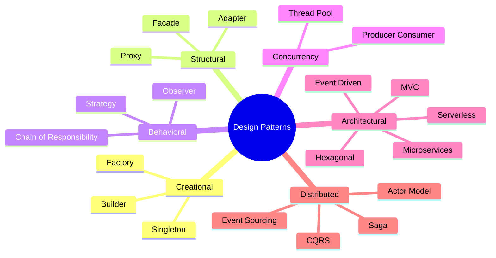

---

# 🌳 DESIGN PATTERNS CATEGORIES

| Category      | Purpose                 |
| ------------- | ----------------------- |
| Creational    | Object creation         |
| Structural    | Object relationships    |
| Behavioral    | Communication/behavior  |
| Concurrency   | Thread coordination     |
| Distributed   | Scalable systems        |
| Architectural | Entire system structure |

---

# 🌱 1️⃣ Singleton Pattern

## 🧠 One object globally

#### Step-by-Step

1. **Lazy Initialization**: Don't create instance until first request
2. **Thread Safety**: Use synchronized or eager initialization to prevent race conditions
3. **Access Method**: Provide static getInstance() method as single entry point
4. **Private Constructor**: Prevent other classes from instantiating new instances
5. **Return Same Instance**: Every call returns reference to same object in memory
6. **Cleanup**: Implement proper shutdown hooks if resource needs cleanup

#### Code Example

```python
# Thread-safe singleton in Python with lazy initialization
import threading

class DatabaseConnection:
    _instance = None
    _lock = threading.Lock()
    
    def __init__(self):
        self.connection = None
    
    @staticmethod
    def get_instance():
        # Double-checked locking pattern
        if DatabaseConnection._instance is None:
            with DatabaseConnection._lock:
                # Check again inside lock
                if DatabaseConnection._instance is None:
                    DatabaseConnection._instance = DatabaseConnection()
                    DatabaseConnection._instance._connect()
        return DatabaseConnection._instance
    
    def _connect(self):
        # Expensive operation — happens once
        print("Connecting to database...")
        self.connection = "Connection established"
    
    def query(self, sql: str):
        return f"Executing: {sql}"

# Usage
db1 = DatabaseConnection.get_instance()
db2 = DatabaseConnection.get_instance()
print(f"Same instance? {db1 is db2}")  # True
print(db1.query("SELECT * FROM users"))
```

#### Real-World Scenario

Java's java.lang.Runtime is a singleton — represents the JVM runtime environment. You never create new Runtime() instances because there's only one JVM per process. When you call Runtime.getRuntime(), it returns the same instance every time. This ensures all threads see consistent runtime state when querying heap memory or exiting the VM.

---

# 📊 Flow

```text id="z8w4bp"
App
 ↓
Singleton Instance
 ↓
Shared everywhere
```

---

# 📱 Real Example

Database connection pool.

---

# 💻 Example

```java id="hjjlwm"
Logger.getInstance()
```

---

# ✅ Used In

* logging
* config manager
* cache manager

---

# ❌ Problem

Global state issues.

Hard testing.

---

# ⚖️ Comparison

| Good            | Bad            |
| --------------- | -------------- |
| Shared resource | Tight coupling |
| Saves memory    | Hard mocking   |

---

# 🏭 2️⃣ Factory Pattern

## 🧠 Create objects without exposing creation logic.

---

# 📊 Flow

```text id="jlwm8e"
Client
  ↓
Factory
  ↓
Creates object
```

---

# 📱 Real Example

Payment system.

```text id="jlwm2r"
UPI → UpiPayment
Card → CardPayment
```

---

# 💻 Example

```java id="jlwmr9"
Payment p = factory.create(type)
```

---

# ✅ Best For

Dynamic object creation.

---

# 🏗️ 3️⃣ Builder Pattern

## 🧠 Construct complex objects step-by-step.

---

# 📊 Flow

```text id="jlwm5t"
Builder
  ↓
setName()
setAge()
build()
```

---

# 📱 Real Example

Creating HTTP requests.

---

# 💻 Example

```java id="wjlwm6"
User.builder()
 .name("Prem")
 .age(25)
 .build()
```

---

# ✅ Solves

Constructor explosion.

---

# 👀 4️⃣ Observer Pattern 🔥

## 🧠 One change notifies many listeners.

---

# 📊 Flow

```text id="jlwm7y"
Publisher
   ↓
Subscribers
```

---

# 📱 Real Example

YouTube notification 🔔

---

# 🌊 Flow

```text id="vjlwm8"
Channel uploads video
    ↓
All subscribers notified
```

### Observer Mermaid

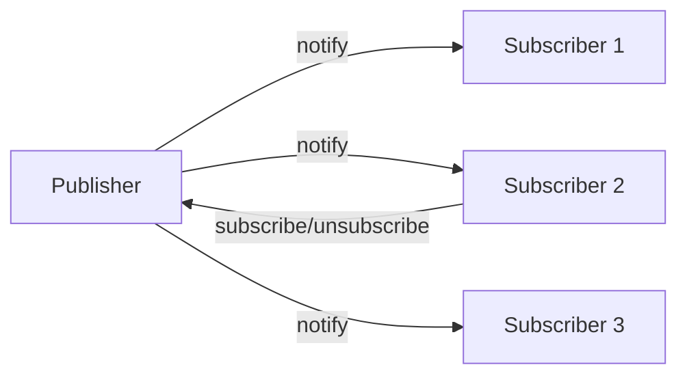

---

# 📱 Tech Examples

* Kafka consumers
* Event listeners
* React state updates

---

# ⚡ 5️⃣ Strategy Pattern

## 🧠 Swap algorithms dynamically.

---

# 📊 Flow

```text id="9jlwm0"
PaymentStrategy
   ├── UPI
   ├── Card
   └── Wallet
```

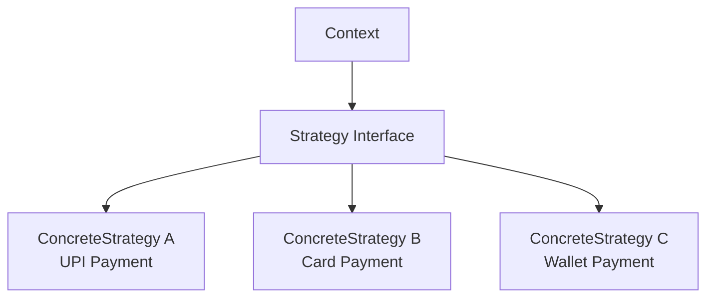

---

# 📱 Real Example

Google Maps routes:

* fastest
* shortest
* avoid tolls

---

# ✅ Best For

Pluggable behaviors.

---

# 🎭 6️⃣ Adapter Pattern

## 🧠 Convert incompatible interfaces.

---

# 📊 Flow

```text id="jlwmm1"
Old API → Adapter → New System
```

---

# 📱 Real Example

Charging adapters 🔌

---

# 💻 Example

Stripe SDK adapter.

---

# 🌉 7️⃣ Facade Pattern

## 🧠 Simplified interface over complexity.

---

# 📊 Flow

```text id="jlwmp4"
Client
  ↓
Facade
  ↓
Complex subsystems
```

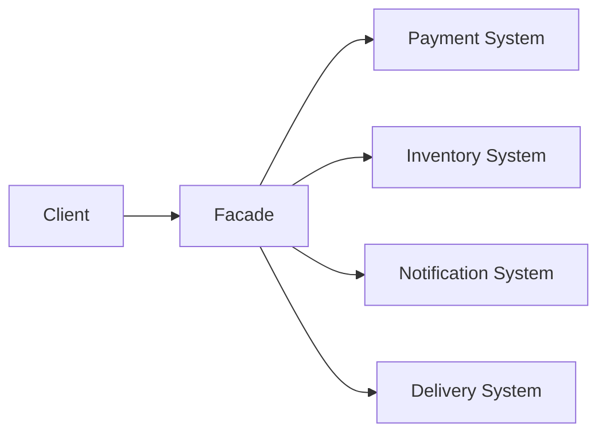

---

# 📱 Real Example

Food delivery checkout.

One API internally calls:

* payment
* restaurant
* delivery
* inventory

---

# 🔗 8️⃣ Proxy Pattern

## 🧠 Placeholder/controller object.

---

# 📊 Flow

```text id="jjlwm2"
Client → Proxy → Real Object
```

---

# 📱 Real Example

CDN proxy.

---

# ✅ Used For

* caching
* security
* lazy loading

---

# ⛓️ 9️⃣ Chain of Responsibility

## 🧠 Request passes through chain.

---

# 📊 Flow

```text id="jlwmf5"
Auth → Rate Limit → Validation → Handler
```

---

# 📱 Real Example

Spring filters.

---

# 🌊 HTTP Flow

```text id="jlwmv7"
Request
 ↓
JWT Filter
 ↓
Logging Filter
 ↓
Controller
```

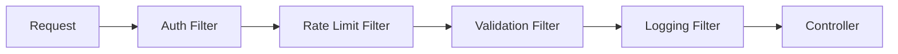

---

# 🧵 🔟 Thread Pool Pattern

## 🧠 Reuse worker threads.

---

# 📊 Flow

```text id="hjlwm8"
Tasks Queue
   ↓
Thread Pool
   ↓
Workers
```

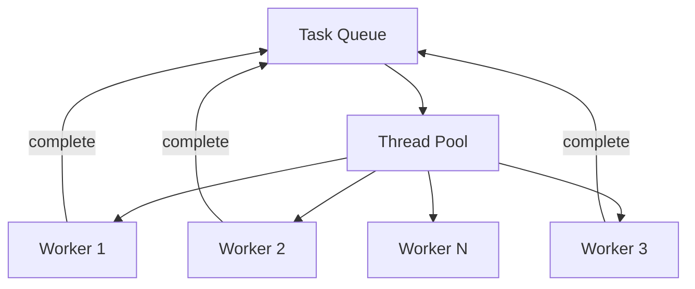

---

# 📱 Real Example

Tomcat request handling.

---

# ✅ Solves

Thread creation overhead.

---

# 📦 1️⃣1️⃣ Producer Consumer Pattern

## 🧠 Producers generate, consumers process.

---

# 📊 Flow

```text id="6jlwm3"
Producer → Queue → Consumer
```

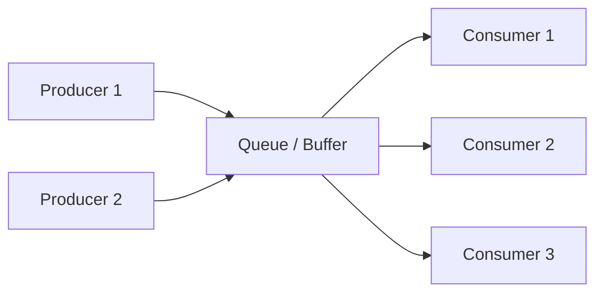

---

# 📱 Real Example

Kafka pipelines.

---

# 🌊 Example

```text id="4jlwmx"
Order Service → Kafka → Email Service
```

---

# 🧠 1️⃣2️⃣ CQRS Pattern

## 🧠 Separate reads and writes.

---

# 📊 Structure

```text id="7jlwm1"
Write DB
Read DB
```

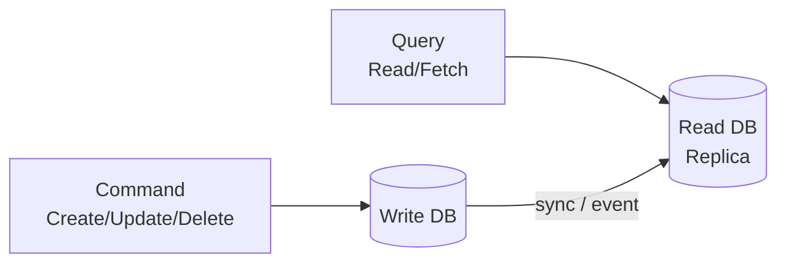

---

# 📱 Real Example

Trading systems.

---

# ✅ Benefits

Optimized scaling.

---

# ❌ Complexity

Event synchronization.

---

# 🌊 1️⃣3️⃣ Event Sourcing

## 🧠 Store events instead of state.

---

# 📊 Flow

```text id="pjlwm9"
Deposit +100
Withdraw -50
```

Current state rebuilt from events.

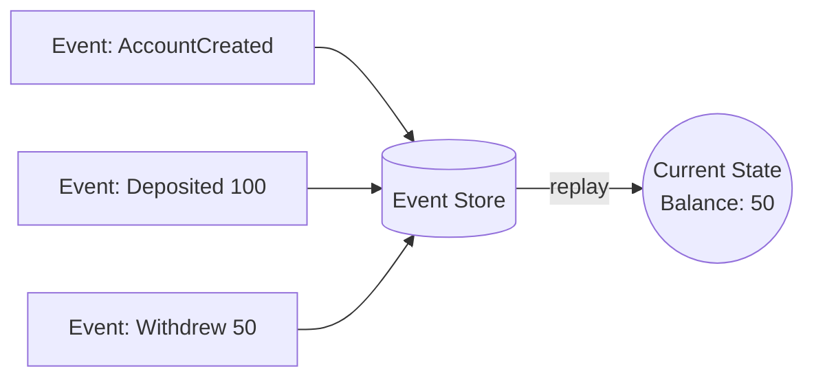

---

# 📱 Used In

* banking
* audit systems

---

# 🏰 1️⃣4️⃣ MVC Architecture

## 🧠 Separate UI/business/data.

---

# 📊 Structure

```text id="jlwmg0"
View
 ↓
Controller
 ↓
Model
```

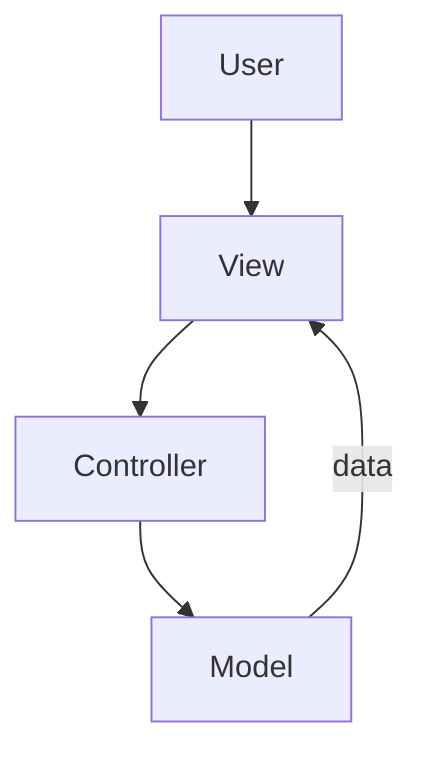

---

# 📱 Example

Spring MVC.

---

# 🌐 1️⃣5️⃣ Microservices Architecture

## 🧠 Split app into services.

---

# 📊 Structure

```text id="0jlwmr"
Auth Service
Order Service
Payment Service
```

---

# 📱 Real Example

Netflix

---

# 🌊 Flow

```text id="2jlwmc"
Gateway
 ↓
Microservices
 ↓
DBs
```

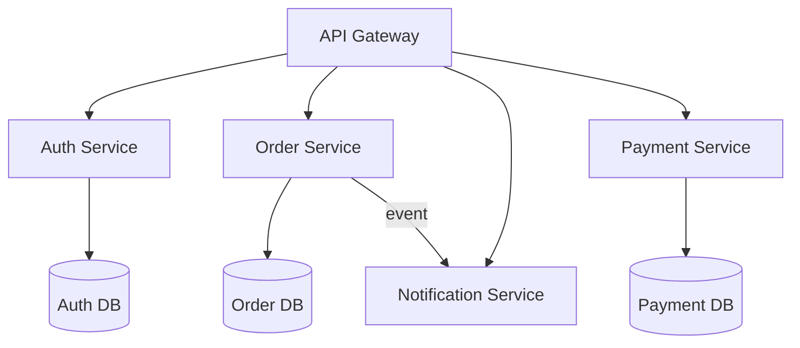

---

# ✅ Pros

Independent scaling.

---

# ❌ Cons

Distributed complexity.

---

# ⚡ 1️⃣6️⃣ Event Driven Architecture

---

# 📊 Flow

```text id="1jlwmf"
Producer → Kafka → Consumers
```

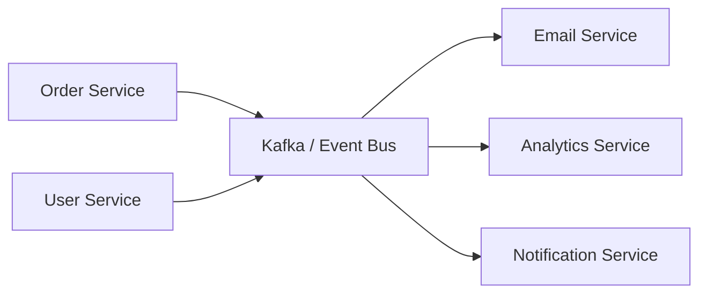

---

# 📱 Real Example

Uber

---

# 🌊 Ride Flow

```text id="jlwmv3"
Ride Booked
   ↓
Payment
Notification
Analytics
```

---

# ☁️ 1️⃣7️⃣ Serverless Architecture

---

# 📊 Flow

```text id="5jlwm9"
API Gateway
   ↓
Lambda
   ↓
DB
```

---

# 📱 Real Example

Image upload processing.

---

# 🧠 1️⃣8️⃣ Hexagonal Architecture

## 🧠 Business logic isolated.

---

# 📊 Structure

```text id="zjlwm2"
Core Logic
  ↑
Ports
  ↑
Adapters
```

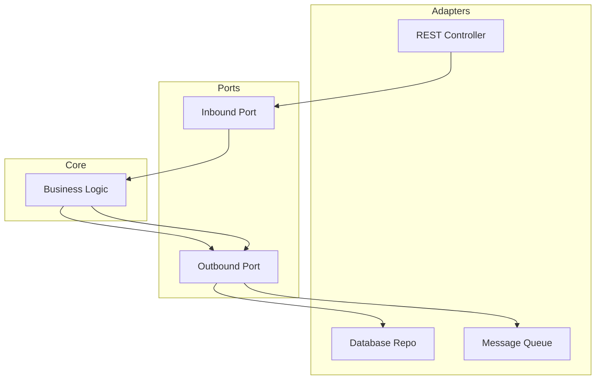

---

# 📱 Real Example

Enterprise banking systems.

---

# 🎮 1️⃣9️⃣ Actor Model

## 🧠 Independent actors communicate via messages.

---

# 📊 Flow

```text id="jlwm7n"
Actor A → Message → Actor B
```

---

# 📱 Used In

* Akka
* Erlang
* distributed systems

---

# 🌊 Real Example

Chat systems.

---

# 🗺️ 2️⃣0️⃣ Saga Pattern

## 🧠 Distributed transaction management.

---

# 📊 Flow

```text id="5jlwmc"
Order
 ↓
Payment
 ↓
Inventory
 ↓
Shipping
```

If failure:

```text id="jlwm8d"
Compensation rollback
```

### Choreography Saga Flow

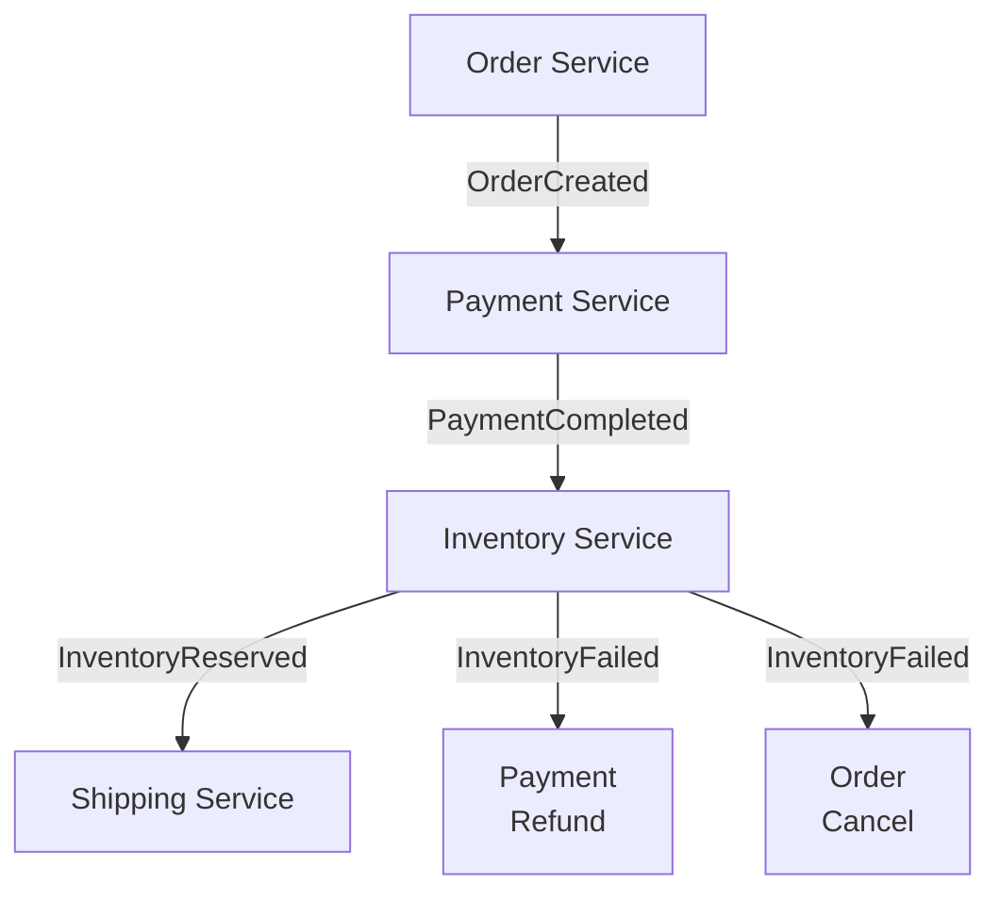

---

# 📱 Used In

E-commerce microservices.

---

# ⚖️ Architecture Comparisons

| Architecture  | Best For            | Problem        |
| ------------- | ------------------- | -------------- |
| Monolith      | Small apps          | Scaling        |
| Microservices | Large scale         | Complexity     |
| Event Driven  | Async scale         | Debugging      |
| Serverless    | Variable load       | Cold starts    |
| Hexagonal     | Maintainability     | Boilerplate    |
| CQRS          | Heavy reads         | Complexity     |
| Actor Model   | Massive concurrency | Learning curve |

---

# ⚖️ Pattern Comparisons

| Pattern           | Purpose             | Real Example      |
| ----------------- | ------------------- | ----------------- |
| Singleton         | One instance        | Config manager    |
| Factory           | Dynamic creation    | Payment gateway   |
| Builder           | Complex object      | HTTP request      |
| Observer          | Notifications       | YouTube subscribe |
| Strategy          | Swap algorithms     | Route selection   |
| Adapter           | Compatibility       | API integration   |
| Proxy             | Controlled access   | CDN               |
| Chain             | Processing pipeline | Middleware        |
| Producer Consumer | Async processing    | Kafka             |
| Saga              | Distributed txns    | Order systems     |

---

# 🚀 Real Production Mega Architecture

```text id="jlwmr5"
Users
  ↓
CDN
  ↓
Load Balancer
  ↓
API Gateway
  ↓
Microservices
  ↓
Kafka/Event Bus
  ↓
Redis Cache
  ↓
Databases
  ↓
Analytics/AI
```

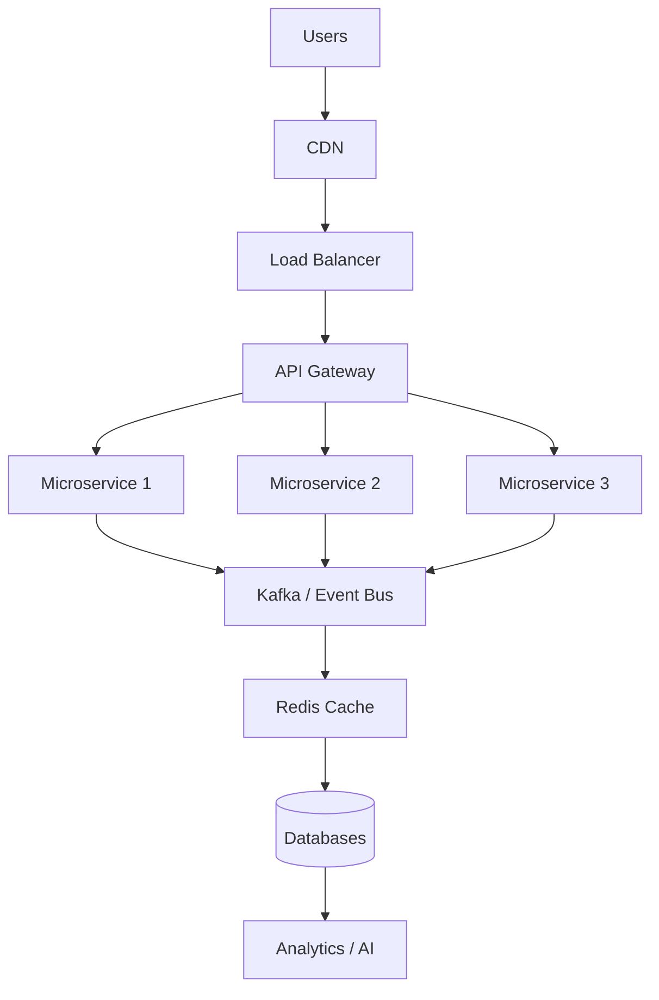

---

# 🌊 Netflix Architecture Example

```text id="jlwm0p"
Client
 ↓
API Gateway
 ↓
Recommendation Service
 ↓
Streaming Service
 ↓
Metadata Service
 ↓
CDN
```

---

# 🌊 Uber Architecture Example

```text id="xjlwm1"
Rider App
   ↓
Gateway
   ↓
Ride Matching
   ↓
Driver Tracking
   ↓
Kafka Streams
   ↓
Notification Service
```

---

# 🧠 Simplest Mental Model

| Pattern      | Analogy                        |
| ------------ | ------------------------------ |
| Singleton    | One principal in school 🏫     |
| Factory      | Car manufacturing 🏭           |
| Builder      | Custom pizza 🍕                |
| Observer     | YouTube bell 🔔                |
| Strategy     | Different travel routes 🗺️    |
| Adapter      | Charger converter 🔌           |
| Proxy        | Security guard 🚔              |
| Saga         | Multi-step bank transfer 💸    |
| Event Driven | News broadcasting 📡           |
| CQRS         | Separate kitchen & serving 🍽️ |
