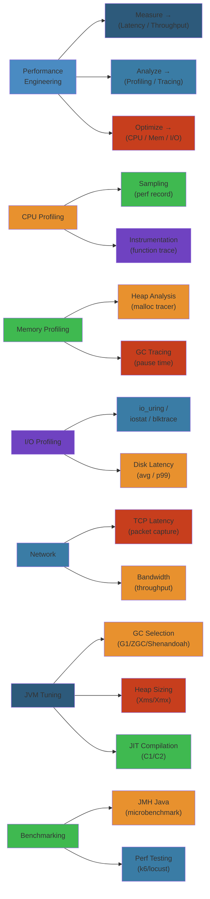

# Performance Engineering — Complete Deep Dive ⚡

Performance engineering is the systematic practice of **measuring, analyzing, and optimizing** system performance. It's about understanding where time goes and systematically reducing it.

**Related**: [Operating Systems](../12-operating-systems/README.md) · [Databases](../08-databases/README.md) · [SRE & Observability](../14-sre-observability/README.md) · [System Design](../15-system-design/README.md)

---




## Table of Contents

- [Performance Fundamentals](#-performance-fundamentals)
- [CPU Profiling](#1-cpu-profiling-)
- [Memory Profiling](#2-memory-profiling-)
- [I/O Profiling](#3-io-profiling-)
- [Network Profiling](#4-network-profiling-)
- [Benchmarking Methodology](#5-benchmarking-methodology-)
- [Optimization Patterns](#6-optimization-patterns-)
- [JVM Performance Tuning](#7-jvm-performance-tuning-)
- [Go Performance](#8-go-performance-)
- [Database Query Optimization](#9-database-query-optimization-)
- [Latency Analysis](#10-latency-analysis-)
- [Throughput Optimization](#11-throughput-optimization-)
- [Concurrency Performance](#12-concurrency-performance-)
- [Cache Performance](#13-cache-performance-)
- [Network Performance](#14-network-performance-)
- [Performance Anti-Patterns](#15-performance-anti-patterns-)
- [Learning Path](#-learning-path)
- [Related Domains](#-related-domains)
- [Simplest Mental Model](#-simplest-mental-model)

---

## 🎯 Performance Fundamentals

### Key Metrics
| Metric | Definition | Good | Bad |
|--------|------------|------|-----|
| **Latency** | Time to complete one operation | < 100ms (API) | > 1s (API) |
| **Throughput** | Operations per second | High = good | Low = bad |
| **CPU Utilization** | % CPU busy | 60-80% | > 90% sustained |
| **Memory Utilization** | RAM in use | Within limits | OOM or swap |
| **Tail Latency** | p99/p999 | < 3x p50 | > 10x p50 |
| **Error Rate** | % failed requests | < 0.1% | > 1% |
| **Queue Depth** | Pending requests | Near 0 | Growing |

### Universal Performance Truths
1. **Measure first, optimize second** — never guess
2. **Amdahl's Law**: Speedup limited by sequential portion
3. **Latency numbers**: Know the orders of magnitude
4. **Tail latency matters** more than average (in distributed systems)
5. **Caching is cheating** but also the most effective optimization
6. **The fastest code is code that doesn't run**

### Latency Numbers Every Engineer Should Know (2024)
```
L1 cache reference:              0.5 ns
Branch mispredict:               5 ns
L2 cache reference:              7 ns
Mutex lock/unlock:              25 ns
L3 cache reference:             20 ns
Main memory reference:         100 ns
Compress 1KB with zippy:     3,000 ns
Send 2K bytes over 1 Gbps:   20,000 ns
Read 1MB sequentially from:      
  SSD:                         49,000 ns
  HDD:                      2,000,000 ns
Round trip within datacenter: 500,000 ns
Disk seek:                10,000,000 ns
Send packet CA → NL → CA: 150,000,000 ns
```

---

## 1. CPU Profiling 🔥

### Sampling Profiler
- **How it works**: OS interrupts process every N ms, records stack trace
- **Pros**: Low overhead (~1-5%), statistical, production-safe
- **Cons**: Statistical noise, misses short-lived functions
- **Tools**: `perf`, Linux perf, flamegraphs

### Instrumentation Profiler
- **How it works**: Compiler adds entry/exit hooks to functions
- **Pros**: Exact counts, no sampling error
- **Cons**: High overhead (10-100x), not for production
- **Tools**: gprof, Valgrind `callgrind`

### CPU Profile Analysis
```
Flame Graph Interpretation:
  - Wide bars = more CPU time
  - Stack top = hot functions
  - Colors: random (use for visual distinction)

Common CPU patterns:
  - Hot loop: 90% in one function → algorithmic improvement
  - Inline-heavy: Check compiler optimizations
  - Lock contention: Threads waiting on mutex
  - GC pressure: Frequent allocation, collection
  - System call overhead: Too many syscalls
```

### perf (Linux)
```bash
# Record CPU samples
perf record -F 99 -p PID --sleep 30

# Generate flamegraph
perf script | stackcollapse-perf.pl | flamegraph.pl > out.svg

# Top CPU consumers (live)
perf top -p PID

# Static analysis
perf stat -e cycles,instructions,cache-misses ./myapp
```

### perf c2c (Cache-to-Cache Transfer)
Detect false sharing — when multiple threads write to same cache line.
```bash
perf c2c record -p PID -- sleep 10
perf c2c report
```

### Off-CPU Analysis
Where time goes when thread is **not running**:
- Blocked on I/O
- Waiting on lock
- Preempted by scheduler
- Involuntary context switch

```bash
# Off-CPU flamegraph
perf record -e sched:sched_switch -p PID -- sleep 10
# Parse to show blocked stack traces
```

---

## 2. Memory Profiling 🧠

### Heap Profiling
- **Tracing profiler**: Record every allocation (high overhead)
- **Sampling profiler**: Sample every N allocations (low overhead)
- **Tool examples**:
  - JVM: `-XX:+HeapDumpOnOutOfMemoryError`, JFR, jemalloc
  - Go: `pprof` heap profile
  - C/C++: Valgrind `massif`, jemalloc `--enable-prof`

### Memory Leak Detection
| Language | Tool | Method |
|----------|------|--------|
| Java | Eclipse MAT | Heap dump analysis |
| Java | JProfiler | Live memory tracking |
| Go | pprof (inuse objects) | Compare heap profiles over time |
| Python | tracemalloc | Memory allocation traces |
| C/C++ | Valgrind memcheck | Detect leaks at exit |
| Rust | valgrind + dhat | Heap profiling |

### Common Memory Problems
- **Unbounded caches**: Cache grows until OOM → bounded + TTL
- **String interning / duplication**: Use pooled/cached strings
- **Object retention**: Accidentally holding references (listeners, callbacks)
- **Fragmentation**: TLS/allocator fragmentation over long running
- **GC pressure**: High allocation rate causes frequent GC

### Allocation Hotspot Analysis
```bash
# Go
go tool pprof -alloc_objects http://localhost:6060/debug/pppof/heap

# Java
jcmd PID GC.heap_dump /tmp/dump.hprof
# Then analyze with Eclipse MAT
```

---

## 3. I/O Profiling 📀

### Disk I/O
```bash
# System-wide I/O
iostat -x 1

# Per-process I/O
iotop
pidstat -d 1

# File I/O tracing
strace -e read,write,openat -c -p PID

# Block layer tracing (blktrace)
blktrace -d /dev/sda -o - | blkparse -i -

# I/O latency histogram
bcc trace 'blk_account_io_done "%d" %s'
```

### Key I/O Metrics
- **IOPS**: I/O operations per second
- **Throughput**: MB/s read/written
- **Latency**: Time per I/O (sub-millisecond for NVMe, ~10ms for HDD)
- **Queue depth**: Outstanding I/O requests
- **I/O wait**: % CPU time waiting for I/O

### I/O Patterns
```
Sequential (large reads/writes):
  - High throughput, low IOPS
  - Good for: bulk load, streaming, backup

Random (small reads/writes):
  - Low throughput, high IOPS
  - Good for: OLTP, databases

Direct I/O (O_DIRECT):
  - Bypasses page cache
  - Application manages caching
  - Good for: databases with own buffer pool

Buffered I/O:
  - Uses page cache
  - Good for: file servers, general purpose
```

---

## 4. Network Profiling 🌐

### Network Metrics
- **Bandwidth**: Bits per second (goodput)
- **Latency**: Round trip time (RTT)
- **Packet loss**: % packets lost
- **Retransmits**: TCP retransmission rate
- **Connection count**: Active TCP connections
- **Socket queue**: TCP listen/recv queue depth

### Tools
```bash
# Bandwidth
iperf3 -c server -t 30

# Packet capture
tcpdump -i eth0 -w capture.pcap

# Connection tracking
ss -s  (socket stats)
ss -tln (TCP listening)
ss -tnp (TCP, numeric, processes)

# Interface stats
ip -s link show eth0

# Latency
ping -c 100 server

# Path MTU discovery
tracepath server

# TCPdump analysis
tcpdump -r capture.pcap -nn tcp port 80
```

### Network Profiling with eBPF
```bash
# TCP connect latency
tcplife

# Per-connection throughput
tcptop

# DNS query latency
gethostlatency

# Packet drops
ddos
```

### Common Network Issues
- **TCP backlog drops**: `Recv-Q` > backlog → increase `somaxconn`
- **TIME_WAIT accumulation**: High connection churn
- **TCP slow start**: Impact on short-lived connections
- **Nagle's algorithm + delayed ACK**: Interaction causes latency
- **Congestion window limit**: Check with `ss -i`

---

## 5. Benchmarking Methodology 📊

### Principles
1. **Stable environment**: Dedicated hardware, no background processes
2. **Warm-up**: JIT compilation, GC stabilization (usually 30-60s)
3. **Multiple runs**: At least 5-10 runs, report mean + stddev
4. **Measure the right thing**: Latency? Throughput? CPU? Memory?
5. **Understand outliers**: Flamegraphs for outliers
6. **Control variables**: One change at a time

### Benchmark Components
```
Setup     → Warm-up → Measurement → Cooldown → Teardown
  │          │           │            │          │
  Init      JIT warm,   Record      GC reach   Cleanup
  resources cache warm  metrics     stabilization
```

### Benchmarking Pitfalls
| Pitfall | Description | Prevention |
|---------|-------------|------------|
| JIT warmup | Cold JIT is slower | Warm-up iterations |
| GC noise | GC during measurement | Run until GC stabilizes |
| CPU throttling | Thermal/power limits | Monitor clock speed |
| false sharing | Accidental cache contention | Use `perf c2c` |
| Benchmark conflation | Measuring wrong code path | Verify with flamegraph |
| Statistical noise | Small sample size | Enough iterations, error bars |

### Throughput vs Latency Benchmark
```python
# Throughput: How many requests per second?
# Latency: How long per request?

# Coordinated omission
# Problem: If you batch results, you skip slow requests
# Fix: Record arrival time, not just completion time

# Required: Head-of-line blocking (HOL) aware measurement
```

### Tools
| Tool | Type | Use Case |
|------|------|----------|
| wrk2 | HTTP | Coordinated-omission-aware HTTP |
| hey | HTTP | Simple HTTP load testing |
| k6 | HTTP/JS | Scriptable, observability |
| JMeter | HTTP/Java | Complex scenarios |
| ghz | gRPC | gRPC load testing |
| ab | HTTP | Simple (not recommended) |
| sysbench | System | CPU/memory/disk/DB |
| fio | Storage | Disk I/O benchmarking |
| iperf3 | Network | Network throughput |

---

## 6. Optimization Patterns ⚙️

### Algorithmic Optimization
| Operation | Naive | Optimized | Speedup |
|-----------|-------|-----------|---------|
| Search | O(n) linear | O(log n) binary | 50x at 1M items |
| Search | O(n) | O(1) hash | 1000x at 1M items |
| Sort | O(n²) bubble | O(n log n) quicksort | 1000x at 100K items |
| String | O(n*m) | KMP O(n+m) | 100x on long strings |

### Memory Optimization
- **Locality of reference**: Access data sequentially, not randomly
- **Prefer stack to heap**: Stack allocation is free (SP adjustment)
- **Object pooling**: Reuse objects instead of allocating
- **Struct of Arrays**: For hot loops processing many records
- **Cache line alignment**: Prevent false sharing (64-byte alignment)

### Compiler Optimization
```cpp
// Help the compiler optimizer
constexpr auto value = compute();  // Compile-time
inline int add(int a, int b) { return a + b; }  // Inline hint
__restrict__ int *ptr;  // No aliasing guarantee
```

### Concurrency Optimization
- **Lock-free data structures**: RCU, CAS-based queues
- **Work stealing**: Better utilization (Go scheduler, ForkJoinPool)
- **Shard contention**: Striped locks, sharded counters
- **Batch processing**: Reduce overhead per item

---

## 7. JVM Performance Tuning ☕

### JIT Compilation
- **Interpreter → C1 (client) → C2 (server)** compilation tiers
- **Tiered compilation**: Default since Java 8
- **JIT thresholds**: `-XX:TierXCompileThreshold=10000`
- **Inline caches**: Monomorphic dispatch optimization
- **OSR (On-Stack Replacement)**: Compile long-running loops mid-execution

### GC Algorithms
| GC | Description | Pause | Throughput | Use Case |
|----|-------------|-------|------------|----------|
| Serial | Single thread GC | Long | Low | Small heap, single core |
| Parallel | Multi-thread GC | Long | High | Throughput-sensitive |
| CMS | Concurrent mark-sweep | Short | Moderate | Low-latency (deprecated) |
| G1 | Region-based, concurrent | Short | High | Default since Java 9 |
| ZGC | Low-latency, <1ms pause | Very short | Moderate | Very large heaps |
| Shenandoah | Concurrent compaction | Very short | Moderate | Red Hat JDK |

### G1 Tuning
```
Key flags:
  -XX:+UseG1GC
  -Xmx4g -Xms4g
  -XX:MaxGCPauseMillis=100        # Target pause time
  -XX:G1HeapRegionSize=16m        # Region size
  -XX:G1NewSizePercent=5          # Young gen initial size
  -XX:G1ReservePercent=10         # Reserve for failure
  -XX:MaxTenuringThreshold=15     # Promotion threshold
```

### GC Logging & Analysis
```bash
# Java 8+
-XX:+PrintGCDetails -XX:+PrintGCDateStamps -Xloggc:/var/log/gc.log
-XX:+PrintPromotionFailure -XX:+PrintTenuringDistribution

# Java 17+
-Xlog:gc*:file=/var/log/gc.log:time,level,tags
-Xlog:gc+promotion*=debug
-Xlog:gc+age=trace

# Analysis tools
gcviewer  # Visualize GC logs
gclogviewer
GCeasy  # Online analysis
```

### Heap Layout
```
┌─────────────────────────────────────────────────────┐
│ Young Generation                                    │
│  ┌──────────────┬─────────────────────────────┐     │
│  │ Eden         │ Survivor (S0, S1)           │     │
│  │ (new objects)│ (promoted between GCs)      │     │
│  └──────────────┴─────────────────────────────┘     │
├─────────────────────────────────────────────────────┤
│ Old Generation (long-lived objects)                  │
├─────────────────────────────────────────────────────┤
│ Metaspace (class metadata)                           │
└─────────────────────────────────────────────────────┘
```

### Thread Dump Analysis
```bash
# Take thread dump
jstack PID > threaddump.txt
kill -3 PID  # Or
jcmd PID Thread.print

# Analyze
- RUNNABLE: Actually executing
- WAITING/BLOCKED: Waiting for lock or resource
- TIMED_WAITING: Waiting with timeout

# Tools
fastthread.io  # Online analysis
samurai        # Thread dump visualizer
```

### JVM Performance Checklist
- [ ] Appropriate heap size (-Xms = -Xmx to avoid resize)
- [ ] GC algorithm matches workload (latency vs throughput)
- [ ] Metaspace not unlimited (limit with -XX:MaxMetaspaceSize)
- [ ] JIT compilation enabled
- [ ] GC logging enabled for post-mortem
- [ ] JMX exposed for remote monitoring
- [ ] Native memory tracking: `-XX:NativeMemoryTracking=summary`

---

## 8. Go Performance 🦦

### pprof
```go
import _ "net/http/pprof"

go func() {
    log.Println(http.ListenAndServe("localhost:6060", nil))
}()

// Profiles available:
// /debug/pprof/goroutine
// /debug/pprof/heap
// /debug/pprof/threadcreate
// /debug/pprof/block
// /debug/pprof/mutex
// /debug/pprof/profile (30s CPU)
```

### Analyzing pprof
```bash
# CPU profile
go tool pprof -http=:8080 http://localhost:6060/debug/pprof/profile?seconds=30

# Heap (in-use)
go tool pprof -http=:8080 http://localhost:6060/debug/pprof/heap

# Allocation rate (over lifetime)
go tool pprof -http=:8080 -alloc_space http://localhost:6060/debug/pprof/heap

# Blocking
go tool pprof -http=:8080 http://localhost:6060/debug/pprof/block
```

### escape analysis
```bash
go build -gcflags="-m -m"  # Show escape analysis decisions

# Heap vs Stack
// Stays on stack (known size at compile time)
func sum() int {
    var buf [1024]byte  // Stack (fits in frame)
    return len(buf)
}

// Escapes to heap (size known at runtime)
func sum() *int {
    v := 42
    return &v  // Escapes (returned to caller)
}
```

### GC Tuning
```bash
# GOGC: Target heap growth
GOGC=100   # Default, GC when heap doubles
GOGC=200   # Less GC, more memory
GOGC=off   # No GC (for some latency-critical)

# Debug GC
GODEBUG=gctrace=1 ./myapp
gc 1 @0.021s 4%: 0.013+0.24+0.006 ms clock, 0.10+0.45/0.42/0+0.051 ms cpu, 4->4->2 MB, 5 MB goal, 8 P
```

### Go Performance Tips
- **Pre-allocate**: `make([]T, 0, expectedSize)`
- **String Builder**: `strings.Builder` over `+` concatenation
- **Avoid pointers in hot paths**: More GC work
- **Sync.Pool**: Reuse temporary objects
- **Goroutine pool** for burst workloads (or let runtime handle)
- **`runtime.LockOSThread`**: Avoid when possible
- **Channel vs Mutex**: Channels for coordination, mutex for state

---

## 9. Database Query Optimization 🗄️

### Query Analysis
```sql
-- Explain plan
EXPLAIN ANALYZE SELECT * FROM orders WHERE customer_id = 123;

-- Look for:
-- Seq Scan on large tables (missing index)
-- Nested Loop where Hash Join expected
-- Sort on unindexed column
-- Index Scan but high random I/O
```

### Index Strategy
```sql
-- B-tree (default)
CREATE INDEX idx_orders_customer ON orders(customer_id);

-- Composite (order matters!)
-- Put high-selectivity columns first
CREATE INDEX idx_orders_customer_date ON orders(customer_id, created_at);

-- Covering index (includes extra columns)
CREATE INDEX idx_orders_covering ON orders(customer_id) INCLUDE (total, status);

-- Partial index (smaller, faster)
CREATE INDEX idx_orders_active ON orders(customer_id) WHERE status = 'active';
```

### Query Optimization Patterns
```sql
-- Bad: Implicit conversion
SELECT * FROM orders WHERE customer_id = '123';  -- varchar? int?

-- Bad: Function on indexed column
SELECT * FROM orders WHERE DATE(created_at) = '2024-01-01';
-- Better: Range query
SELECT * FROM orders WHERE created_at >= '2024-01-01' AND created_at < '2024-01-02';

-- Bad: SELECT * 
SELECT * FROM orders WHERE customer_id = 123;
-- Better: Only needed columns
SELECT id, total, status FROM orders WHERE customer_id = 123;

-- Bad: N+1 queries
for order in orders:
    customer = db.query("SELECT * FROM customers WHERE id = ?", order.customer_id)
-- Better: JOIN or batch query
SELECT * FROM orders o JOIN customers c ON o.customer_id = c.id WHERE o.id IN (...)
```

### Connection Pool
```
Size formula: (core_count * 2) + effective_spindle_count
Rule of thumb: Keep pool small — more connections ≠ faster

PostgreSQL max_connections: 100-500 (not thousands!)
Use PgBouncer for connection pooling
```

---

## 10. Latency Analysis 📉

### Latency Decomposition
```
Total latency = Network RTT + Queue time + Service time

Network: Propagation + processing + queuing delay in transit
Queue: Time waiting for available resources (CPU, connection, thread)
Service: Actual processing time (CPU execution, I/O wait)
```

### Latency Distribution Analysis
```
p50: Typical latency — what most users experience
p95: Worst 5% of users (still acceptable)
p99: Worst 1% (usually needs attention)
p999: Worst 0.1% (rare but impact outliers)

If p99 >> p50 (10x+): Look for GC pauses, lock contention, queuing
If uniform distribution: Likely algorithmic issue
```

### Reducing Latency
1. **Cache**: Avoid computation/I/O
2. **Concurrency**: Parallelize independent work
3. **Batching**: Reduce overhead per operation
4. **Optimize hot path**: Profile to find bottlenecks
5. **Pre-compute**: Background computation
6. **CDN**: Move data closer to user
7. **Async**: Non-blocking I/O
8. **Connection pool**: Reduce connection setup overhead

### Measuring Latency in Production
```promql
# p50, p95, p99 from histogram
histogram_quantile(0.50, sum(rate(http_request_duration_seconds_bucket[5m])) by (le))
histogram_quantile(0.95, sum(rate(http_request_duration_seconds_bucket[5m])) by (le))
histogram_quantile(0.99, sum(rate(http_request_duration_seconds_bucket[5m])) by (le))
```

---

## 11. Throughput Optimization 📊

### Bottleneck Identification
```
CPU-bound: Algorithms, data structures, busy loops
Memory-bound: Cache misses, GC, allocation rate
I/O-bound: Disk reads/writes, network
Contention: Locking, synchronization
Saturation: 100% utilization on any resource
```

### Increasing Throughput
```
Horizontal scaling: Add more instances
Vertical scaling: Bigger instance (CPU, memory, I/O)
Async processing: Non-blocking I/O
Batching: Process items in groups (coalescing)
Pipelining: Overlap computation with I/O
Work stealing: Better utilization across threads
```

### Little's Law
```
Throughput = Concurrency / Latency

To increase throughput:
  1. Decrease latency (faster processing)
  2. Increase concurrency (more parallel work)
  3. Both
```

---

## 12. Concurrency Performance 🧵

### Lock Contention
```
High contention: Spend more time waiting than working
Solutions:
  1. Lock-free data structures (RCU, atomic)
  2. Striping (shard the lock)
  3. Optimistic locking (retry on conflict)
  4. Reduce critical section
```

### False Sharing
Threads on different cores write to variables on same cache line. Each write invalidates cache line on other core.

```c
// Bad: false sharing
struct Data {
    int x;  // Thread 1 writes
    int y;  // Thread 2 writes — same cache line!
};

// Good: pad to cache line
struct Data {
    int x;
    char pad[60];  // 64-byte cache line alignment
    int y;
};
```

### Work Stealing
- **Go scheduler**: M:N threading, work-stealing across P's
- **Java ForkJoinPool**: Work-stealing deque per thread
- **.NET Task Parallel Library**: Similar work-stealing

---

## 13. Cache Performance 💾

### CPU Cache Levels
```
Core → L1 (32KB data + 32KB inst) → L2 (256KB) → L3 (8-30MB, shared) → RAM
         ~1ns        ~4ns                  ~15ns            ~80ns
Line size: 64 bytes
```

### Cache Line Optimization
```c
// Cache-friendly: Sequential access
for (int i = 0; i < N; i++) {
    sum += array[i];  // Sequential, prefetcher works
}

// Cache-unfriendly: Strided access
for (int i = 0; i < N; i += 64) {
    sum += array[i];  // Every cache line, wasted
}
```

### Write-Combining
- Special memory region for write-combining (e.g., frame buffers)
- Writes buffered until cache line full
- Used in DMA operations

---

## 14. Network Performance 🌐

### TCP Tuning
```bash
# Linux sysctl tunables
net.core.rmem_max = 16777216
net.core.wmem_max = 16777216
net.ipv4.tcp_rmem = 4096 87380 16777216
net.ipv4.tcp_wmem = 4096 65536 16777216

# Fast recovery
net.ipv4.tcp_sack = 1
net.ipv4.tcp_fack = 1
net.ipv4.tcp_slow_start_after_idle = 0

# Connection handling
net.core.somaxconn = 65535
net.ipv4.tcp_tw_reuse = 1
```

### Kernel Bypass
| Method | Latency | Throughput | Complexity |
|--------|---------|------------|------------|
| epoll | ~1μs | High | Low |
| io_uring | ~500ns | Very high | Low |
| DPDK | ~100ns | Max | High |
| XDP | < 100ns | Max | High |

---

## 15. Performance Anti-Patterns ❌

| Anti-Pattern | Problem | Fix |
|-------------|---------|-----|
| Premature Optimization | Complex code with no evidence | Measure first |
| String Concatenation | O(n²) CPU + GC pressure | StringBuilder |
| N+1 Queries | DB hammering | Batch query, JOIN |
| Synchronous Everything | Wasted IO wait | Async, parallel |
| Too Many DB Connections | Database thrashing | Connection pool, limit |
| Thread per Request | 64K thread limit, context switch cost | Async I/O, event loop |
| Copying Large Objects | Memory bandwidth waste | Pass by reference |
| GC Pressure | High allocation rate | Object pooling, value types |

---

## 📚 Learning Path

### Phase 1: Fundamentals
1. Understand latency numbers
2. Learning profiling (basic `perf` for CPU)
3. Benchmarking methodology
4. Profiling for memory leaks

### Phase 2: Language-Specific
1. JVM: GC tuning, thread dumps, JFR
2. Go: pprof, escape analysis, traces
3. SQL query optimization (EXPLAIN ANALYZE)

### Phase 3: Systems-Level
1. eBPF for performance analysis (bcc tools)
2. Network profiling (packet capture, TCP analysis)
3. I/O profiling (blktrace, iostat, latency analysis)
4. Concurrency performance (lock contention, false sharing)

### Phase 4: Expert
1. JIT compiler tuning (JVMCI, GraalVM)
2. Hardware counters (PMU, perf stat)
3. Cache line optimization
4. Kernel bypass (io_uring, DPDK)

---

## 🔗 Related Domains

| Domain | Connection |
|--------|-----------|
| [Operating Systems](../12-operating-systems/README.md) | Scheduler, memory management, I/O models |
| [Databases](../08-databases/README.md) | Query optimization, indexing, buffer pool |
| [SRE & Observability](../14-sre-observability/README.md) | Metrics, dashboards, alerting on perf |
| [System Design](../15-system-design/README.md) | Latency requirements, capacity estimation |
| [Software Architecture](../17-software-architecture/README.md) | Performance architecture tactics |
| [Networking](../11-networking/README.md) | TCP tuning, kernel bypass, Zero-Copy |

---

## 🧠 Simplest Mental Model

```
Performance Engineering = Plumbing Audit

Water flow (throughput) = gallons per minute
Pressure (latency) = time from tap open → water flows

Bottlenecks:
  - Narrow pipe (low bandwidth) → invest in wider pipe
  - Long pipe (distance) → move closer (CDN)
  - Kinked pipe (algorithm) → straighten it
  - Low water pressure (slow CPU) → better pump
  - Sediment in pipes (GC pauses) → clean/filter

Profiling = Leak Detection
  - Where is the water going?
  - Where does it slow down?
  - Where is the pipe too small?

Optimization = Fixing the most impactful constriction
  (NOT replacing perfectly good pipes randomly)
```

**Measure first. Find the bottleneck. Fix it. Repeat. Stop when "good enough".**

---

**Next**: [Testing](../19-testing/README.md) · [SRE & Observability](../14-sre-observability/README.md)
