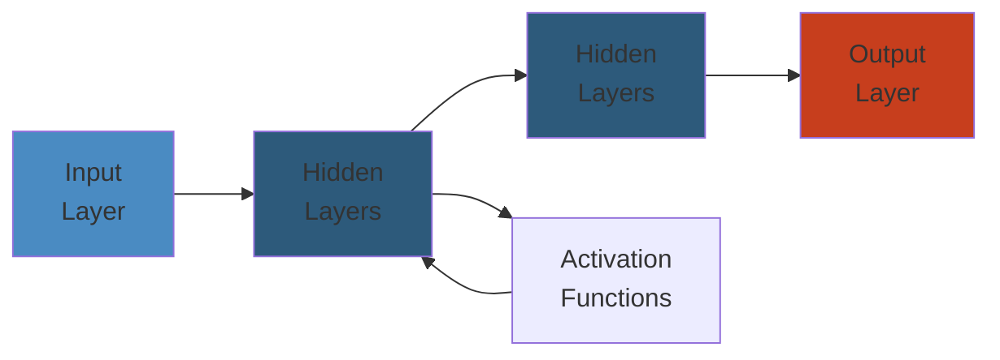

# JVM Performance Deep Dive




## JVM Memory Model

### Heap Structure

The JVM heap is divided into generations for efficient garbage collection:

```java
// Memory pool configuration
public class MemoryLayout {
    public static void main(String[] args) {
        // Print heap configuration
        Runtime runtime = Runtime.getRuntime();
        System.out.println("Max memory: " + runtime.maxMemory() / 1024 / 1024 + " MB");
        System.out.println("Total memory: " + runtime.totalMemory() / 1024 / 1024 + " MB");

        // Monitor memory pools
        java.lang.management.MemoryMXBean memBean =
            java.lang.management.ManagementFactory.getMemoryMXBean();
        System.out.println("Heap: " + memBean.getHeapMemoryUsage());
        System.out.println("Non-Heap: " + memBean.getNonHeapMemoryUsage());

        // Per-pool stats
        for (java.lang.management.MemoryPoolMXBean pool :
             java.lang.management.ManagementFactory.getMemoryPoolMXBeans()) {
            System.out.println(pool.getName() + ": " + pool.getUsage());
        }
    }
}
```

### Young Generation (Eden + Survivor Spaces)

```java
// Objects are first allocated in Eden
public class YoungGenerationDemo {
    private static final int OBJECT_SIZE = 1024; // 1KB

    public static void main(String[] args) throws Exception {
        // -Xms256m -Xmx256m -XX:+PrintGCDetails -XX:+PrintGCDateStamps

        System.out.println("Allocating objects in Eden...");
        byte[][] garbage = new byte[100_000][];

        for (int i = 0; i < 100_000; i++) {
            garbage[i] = new byte[OBJECT_SIZE];
            // Objects promoted to survivor after minor GC
            if (i % 10_000 == 0) {
                System.out.println("Allocated " + (i * OBJECT_SIZE / 1024) + " KB");
                Thread.sleep(50);
            }
        }

        // Survivor space tuning
        // -XX:SurvivorRatio=8 (Eden:Survivor = 8:1:1)
        // -XX:TargetSurvivorRatio=90 (target 90% occupancy after GC)
        // -XX:MaxTenuringThreshold=15 (max age before promotion to old)
    }
}
```

### Old Generation

```java
// Long-lived objects promoted to Old generation
public class OldGenerationDemo {
    private static final int CACHE_SIZE = 10_000;

    public static void main(String[] args) {
        // Create long-lived objects that survive GC cycles
        Object[] cache = new Object[CACHE_SIZE];

        for (int i = 0; i < CACHE_SIZE; i++) {
            cache[i] = new CachedObject(i);
        }

        // Trigger multiple GCs to promote objects
        for (int i = 0; i < 5; i++) {
            System.gc();
            try { Thread.sleep(100); } catch (Exception e) {}
        }

        System.out.println("Promoted " + countLiveObjects(cache) + " objects to Old Gen");
    }

    static class CachedObject {
        final int id;
        final byte[] payload = new byte[4096];
        CachedObject(int id) { this.id = id; }
    }

    static int countLiveObjects(Object[] cache) {
        int count = 0;
        for (Object o : cache) {
            if (o != null) count++;
        }
        return count;
    }
}
```

### Metaspace (Java 8+)

```java
// Metaspace replaces PermGen (Java 7-)
public class MetaspaceDemo {
    public static void main(String[] args) throws Exception {
        // -XX:MaxMetaspaceSize=256m
        // -XX:MetaspaceSize=128m (initial size)
        // -XX:MinMetaspaceFreeRatio=40
        // -XX:MaxMetaspaceFreeRatio=70

        // Class metadata is stored in Metaspace (native memory)
        System.out.println("Metaspace is unlimited by default");
        System.out.println("Uses native memory (OS-level)");
        System.out.println("GC collects dead class metadata");

        // Monitor Metaspace usage
        java.lang.management.MemoryPoolMXBean metaBean = null;
        for (java.lang.management.MemoryPoolMXBean pool :
             java.lang.management.ManagementFactory.getMemoryPoolMXBeans()) {
            if (pool.getName().contains("Metaspace")) {
                metaBean = pool;
            }
        }
        if (metaBean != null) {
            System.out.println("Metaspace usage: " + metaBean.getUsage());
        }
    }
}
```

### Stack and Frame Layout

```java
public class StackLayout {
    // Each method call creates a stack frame
    // Frame contains: local variables, operand stack, frame data

    public static int recursive(int n) {
        if (n <= 1) return 1;
        return n * recursive(n - 1);
    }

    public static void main(String[] args) {
        // -Xss256k (minimal stack size)
        // -Xss1m (default for most JVMs)
        // -Xss2m (for deep recursion)

        System.out.println("Default stack size: ~1MB per thread");
        System.out.println("Max recursion with -Xss1m: ~10000 calls");

        try {
            int result = recursive(10000);
            System.out.println("Recursion depth: 10000, result: " + result);
        } catch (StackOverflowError e) {
            System.out.println("Stack overflow at 10000 depth");
        }

        // Thread stack monitoring
        Thread current = Thread.currentThread();
        System.out.println("Thread: " + current.getName());
        System.out.println("Stack trace length: " + current.getStackTrace().length);
    }
}
```

### Off-Heap Memory

```java
import java.nio.ByteBuffer;

public class OffHeapDemo {
    public static void main(String[] args) {
        // Direct buffers (off-heap)
        ByteBuffer direct = ByteBuffer.allocateDirect(1024 * 1024 * 100); // 100MB off-heap
        ByteBuffer heap = ByteBuffer.allocate(1024 * 1024 * 100); // 100MB on-heap

        // -XX:MaxDirectMemorySize=512m

        System.out.println("Direct buffer: off-heap, not subject to GC");
        System.out.println("Heap buffer: on-heap, GC-managed");

        // Performance comparison
        long start = System.nanoTime();
        for (int i = 0; i < 10_000_000; i++) {
            heap.putInt(i % 100);
            if (heap.position() == heap.capacity()) heap.flip();
        }
        long heapTime = System.nanoTime() - start;

        start = System.nanoTime();
        for (int i = 0; i < 10_000_000; i++) {
            direct.putInt(i % 100);
            if (direct.position() == direct.capacity()) direct.flip();
        }
        long directTime = System.nanoTime() - start;

        System.out.println("Heap buffer: " + heapTime / 1_000_000 + " ms");
        System.out.println("Direct buffer: " + directTime / 1_000_000 + " ms");
    }
}
```

### Code Cache

```java
public class CodeCacheDemo {
    public static void main(String[] args) {
        // -XX:InitialCodeCacheSize=256m
        // -XX:ReservedCodeCacheSize=256m
        // -XX:+PrintCodeCache

        System.out.println("Code Cache stores JIT-compiled native code");
        System.out.println("Contains: C1 compiled methods");
        System.out.println("Contains: C2 compiled methods");
        System.out.println("Contains: Interpreter-to-Code adapters");

        // Monitor code cache
        java.lang.management.MemoryPoolMXBean ccBean = null;
        for (java.lang.management.MemoryPoolMXBean pool :
             java.lang.management.ManagementFactory.getMemoryPoolMXBeans()) {
            if (pool.getName().contains("Code")) {
                ccBean = pool;
            }
        }
        if (ccBean != null) {
            System.out.println("Code cache: " + ccBean.getUsage());
        }

        // Code cache full -> deoptimization -> performance drop
        // -XX:+UseCodeCacheFlushing (emergency flush)
        // -XX:-UseCodeCacheFlushing (disable)
    }
}
```

---

## GC Algorithms

### Serial GC

```java
// -XX:+UseSerialGC
// Best for: single-threaded, small heaps (<100MB), client apps

public class SerialGCDemo {
    public static void main(String[] args) {
        // -XX:+UseSerialGC -Xms256m -Xmx256m -XX:+PrintGCDetails

        System.out.println("Serial GC: single-threaded collector");
        System.out.println("Young: Copy (stop-the-world)");
        System.out.println("Old: Mark-Sweep-Compact (stop-the-world)");

        byte[][] data = new byte[10_000][];
        for (int i = 0; i < 10_000; i++) {
            data[i] = new byte[10_240]; // 10KB objects
        }
        System.out.println("Allocation complete");
    }
}
```

### Parallel GC (Throughput Collector)

```java
// -XX:+UseParallelGC -XX:+UseParallelOldGC
// -XX:ParallelGCThreads=N
// -XX:GCTimeRatio=19 (target 5% GC time)

public class ParallelGCDemo {
    public static void main(String[] args) {
        // -XX:+UseParallelGC -XX:ParallelGCThreads=4
        // -XX:MaxGCPauseMillis=100 (soft target)

        System.out.println("Parallel GC: multi-threaded young collection");
        System.out.println("Throughput-oriented (default for server JVM)");
        System.out.println("Adaptive sizing: UseAdaptiveSizePolicy (default)");

        // Parallel GC tuning parameters:
        // -XX:YoungSize=256m
        // -XX:MaxNewSize=512m
        // -XX:SurvivorRatio=6
        // -XX:+ScavengeBeforeFullGC
    }
}
```

### CMS (Concurrent Mark-Sweep)

```java
// -XX:+UseConcMarkSweepGC (deprecated in Java 9, removed in Java 14)
// Best for: low-latency apps, large heaps

public class CMSDemo {
    public static void main(String[] args) {
        // CMS phases:
        // 1. Initial Mark (STW) - mark GC roots
        // 2. Concurrent Mark - trace live objects
        // 3. Concurrent Preclean - clean up
        // 4. Remark (STW) - finalize marking
        // 5. Concurrent Sweep - reclaim memory

        System.out.println("CMS: low-latency collector");
        System.out.println("Problems: fragmentation, CPU overhead");

        // CMS tuning:
        // -XX:CMSInitiatingOccupancyFraction=70
        // -XX:+UseCMSInitiatingOccupancyOnly
        // -XX:CMSTriggerRatio=80
        // -XX:ConcGCThreads=4
    }
}
```

### G1 GC (Garbage-First)

```java
// -XX:+UseG1GC (default in Java 9+)
// Best for: large heaps, balanced throughput/latency

public class G1GCDemo {
    public static void main(String[] args) {
        // -XX:+UseG1GC -Xms4g -Xmx4g
        // -XX:MaxGCPauseMillis=200
        // -XX:G1HeapRegionSize=4m

        System.out.println("G1 GC: region-based, generational, parallel");
        System.out.println("Heap divided into ~2048 regions (1-32MB each)");
        System.out.println("Humongous objects: >50% of region size");

        // G1 phases:
        // Young: Eden -> Survivor (STW, parallel)
        // Concurrent Mark: concurrent, triggered by IHOP
        // Mixed: evacuate Old regions with most garbage
        // Full GC: fallback (serial STW)

        int regionSize = 4 * 1024 * 1024; // 4MB
        int humongousThreshold = regionSize / 2;

        byte[][] normal = new byte[10][];
        for (int i = 0; i < 10; i++) {
            normal[i] = new byte[humongousThreshold / 2]; // Normal object
        }

        byte[][] humongous = new byte[10][];
        for (int i = 0; i < 10; i++) {
            humongous[i] = new byte[humongousThreshold + 1]; // Humongous object
        }

        System.out.println("Allocated " + normal.length + " normal objects");
        System.out.println("Allocated " + humongous.length + " humongous objects");
    }
}
```

### ZGC (Low-Latency)

```java
// -XX:+UseZGC (Java 11+ experimental, Java 15+ production)
// Best for: sub-millisecond pause times, multi-terabyte heaps

public class ZGCDemo {
    public static void main(String[] args) {
        // -XX:+UseZGC -Xms16g -Xmx16g
        // -XX:ZAllocationSpikeTolerance=2.0
        // -XX:ZCollectionInterval=120

        System.out.println("ZGC: concurrent, region-based, colored pointers");
        System.out.println("Pause times: <1ms (independent of heap size)");
        System.out.println("Supports: 8MB to 16TB heaps");

        // ZGC techniques:
        // - Colored pointers (metadata in high bits of 64-bit pointers)
        // - Load barriers (concurrent object relocation)
        // - Multi-mapped memory (heap regions at multiple addresses)

        System.out.println("\nGC phases:");
        System.out.println("  1. Pause Mark Start (STW, ~0.1ms)");
        System.out.println("  2. Concurrent Mark/Remap");
        System.out.println("  3. Pause Mark End (STW, ~0.1ms)");
        System.out.println("  4. Concurrent Prepare for Relocation");
        System.out.println("  5. Pause Relocate Start (STW, ~0.1ms)");
        System.out.println("  6. Concurrent Relocation");
    }
}
```

### Shenandoah GC

```java
// -XX:+UseShenandoahGC (Java 12+ experimental, Java 15+ production)
// Best for: low-latency, concurrent compaction

public class ShenandoahGCDemo {
    public static void main(String[] args) {
        // -XX:+UseShenandoahGC -Xms4g -Xmx4g
        // -XX:ShenandoahGCHeuristics=adaptive/static/compact/aggressive

        System.out.println("Shenandoah: concurrent compacting collector");
        System.out.println("Unlike G1: also compacts concurrently");
        System.out.println("Uses: Brooks pointers (forwarding pointer in object)");

        // Shenandoah phases:
        System.out.println("\nPhases:");
        System.out.println("  1. Init Mark (STW, ~1ms)");
        System.out.println("  2. Concurrent Mark");
        System.out.println("  3. Final Mark (STW, ~1ms)");
        System.out.println("  4. Concurrent Cleanup");
        System.out.println("  5. Concurrent Evacuation");
        System.out.println("  6. Init Update Ref (STW, ~1ms)");
        System.out.println("  7. Concurrent Update References");
        System.out.println("  8. Final Update Ref (STW, ~1ms)");
        System.out.println("  9. Concurrent Cleanup");
    }
}
```

### GC Comparison

```java
public class GCComparison {
    public static void printComparison() {
        System.out.printf("%-15s %-12s %-12s %-12s %-15s%n",
            "Collector", "Pause Time", "Throughput", "Footprint", "Heap Size");
        System.out.println("-".repeat(70));
        System.out.printf("%-15s %-12s %-12s %-12s %-15s%n",
            "Serial", ">1s", "Low", "Small", "<100MB");
        System.out.printf("%-15s %-12s %-12s %-12s %-15s%n",
            "Parallel", ">100ms", "High", "Medium", "<4GB");
        System.out.printf("%-15s %-12s %-12s %-12s %-15s%n",
            "G1", "5-50ms", "High", "Medium", "<100GB");
        System.out.printf("%-15s %-12s %-12s %-12s %-15s%n",
            "ZGC", "<1ms", "Medium", "Medium+", "8MB-16TB");
        System.out.printf("%-15s %-12s %-12s %-12s %-15s%n",
            "Shenandoah", "1-5ms", "Medium", "Medium", "<100GB");
        System.out.printf("%-15s %-12s %-12s %-12s %-15s%n",
            "CMS", "5-50ms", "Medium", "Medium", "<32GB");
    }
}
```

---

## GC Tuning

### Heap Sizing

```java
public class HeapSizing {
    public static void main(String[] args) {
        // Key parameters:
        String[][] params = {
            {"-Xms", "Initial heap size"},
            {"-Xmx", "Maximum heap size"},
            {"-XX:NewSize", "Initial young generation size"},
            {"-XX:MaxNewSize", "Maximum young generation size"},
            {"-XX:NewRatio", "Old:Young ratio (default 2)"},
            {"-XX:SurvivorRatio", "Eden:Survivor ratio (default 8)"},
            {"-XX:MaxTenuringThreshold", "Max age before promotion (default 15)"},
            {"-XX:PretenureSizeThreshold", "Objects > this go directly to Old"},
        };

        System.out.println("Heap sizing parameters:");
        for (String[] param : params) {
            System.out.printf("  %-35s %s%n", param[0], param[1]);
        }

        // Optimal heap sizing guidelines:
        System.out.println("\nGuidelines:");
        System.out.println("  -Xms == -Xmx (prevent resizing pauses)");
        System.out.println("  Young size: 25-50% of heap");
        System.out.println("  Survivor spaces: 5-10% of Young");
        System.out.println("  Max heap <= 30GB for G1 (else use ZGC)");
    }
}
```

### GC Selection Flowchart

```java
public class GCSelector {
    public static String selectGC(
        int heapSizeMB,
        int requiredPauseMs,
        boolean throughputCritical,
        int cpuCores
    ) {
        if (heapSizeMB < 100 && cpuCores == 1) {
            return "Serial GC (-XX:+UseSerialGC)";
        }
        if (heapSizeMB < 4096 && throughputCritical) {
            return "Parallel GC (-XX:+UseParallelGC)";
        }
        if (requiredPauseMs > 100 && heapSizeMB < 102400) {
            return "G1 GC (-XX:+UseG1GC)";
        }
        if (requiredPauseMs < 10 && heapSizeMB <= 16777216) {
            return "ZGC (-XX:+UseZGC)";
        }
        if (requiredPauseMs < 50 && heapSizeMB <= 102400) {
            return "Shenandoah (-XX:+UseShenandoahGC)";
        }
        return "G1 GC (default)";
    }

    public static void main(String[] args) {
        System.out.println("GC Recommendation: " + selectGC(8192, 10, false, 8));
    }
}
```

### GC Logging

```java
// GC logging flags:
// -Xlog:gc* (Java 9+ unified logging)
// -XX:+PrintGCDetails -XX:+PrintGCDateStamps (Java 8)

public class GCLogging {
    public static void main(String[] args) {
        // Java 8:
        // -XX:+PrintGCDetails -XX:+PrintGCDateStamps
        // -XX:+PrintTenuringDistribution
        // -XX:+PrintHeapAtGC
        // -Xloggc:gc.log

        // Java 9+:
        // -Xlog:gc*:file=gc.log:tags,time,uptime,level
        // -Xlog:gc+promotion*=debug
        // -Xlog:gc+age*=trace
        // -Xlog:gc+heap*=debug
        // -Xlog:gc+metaspace*=info

        System.out.println("GC log analysis tools:");
        System.out.println("  GCeasy: https://gceasy.io");
        System.out.println("  GCViewer: https://github.com/chewiebug/GCViewer");
        System.out.println("  gclogviewer: https://github.com/arnaudroger/gclogviewer");
    }
}
```

### GC Optimization Techniques

```java
public class GCOptimization {
    public static void main(String[] args) {
        // 1. Reduce object allocation rate
        // 2. Tune young generation size
        // 3. Adjust survivor space ratio
        // 4. Set appropriate tenure threshold
        // 5. Use string deduplication (-XX:+UseStringDeduplication)

        // Object pooling example
        System.out.println("Object pooling reduces GC pressure:");
        System.out.println("  - Reuse objects instead of allocating new ones");
        System.out.println("  - Use ThreadLocal for thread-local caching");
        System.out.println("  - Object pools for expensive objects");

        // Escape analysis
        System.out.println("\nEscape Analysis (JIT optimization):");
        System.out.println("  - Stack allocation (no GC needed)");
        System.out.println("  - Lock elision (remove unnecessary locks)");
        System.out.println("  - Scalar replacement (break objects into fields)");

        // Allocation promotion
        System.out.println("\nPromotion issues:");
        System.out.println("  Premature promotion: objects promoted too early");
        System.out.println("  Promotion failure: old gen can't accept objects");
        System.out.println("  -XX:MaxTenuringThreshold controls promotion age");

        // Humongous allocation (G1)
        System.out.println("\nG1 Humongous allocations:");
        System.out.println("  Objects > region_size / 2");
        System.out.println("  High GC overhead, avoid if possible");
        System.out.println("  -XX:G1HeapRegionSize can tune region size");
    }
}
```

---

## JIT Compilation

### C1 and C2 Compilers

```java
// -XX:+TieredCompilation (default since Java 8)
// -XX:TieredStopAtLevel=N

public class JITCompilation {
    public static void main(String[] args) {
        // Tiered compilation levels:
        System.out.println("Tier 0: Interpreter");
        System.out.println("Tier 1: C1 (simple, no profiling)");
        System.out.println("Tier 2: C1 (limited profiling)");
        System.out.println("Tier 3: C1 (full profiling)");
        System.out.println("Tier 4: C2 (optimizing compiler)");

        System.out.println("\nCompilation thresholds:");
        System.out.println("  Tier 3 to Tier 4: 10000 invocations (default)");
        System.out.println("  -XX:CompileThreshold=10000");

        System.out.println("\nC1 vs C2:");
        System.out.println("  C1: fast compilation, moderate optimization");
        System.out.println("  C2: slow compilation, aggressive optimization");
    }
}

// Method inlining example
class InliningDemo {
    private static final int ITERATIONS = 100_000_000;

    // Hot method will be inlined by C2
    public static int add(int a, int b) {
        return a + b;
    }

    public static void main(String[] args) {
        long sum = 0;
        for (int i = 0; i < ITERATIONS; i++) {
            sum += add(i, 1); // After warmup: inlined to sum += i + 1
        }
        System.out.println("Sum: " + sum);

        // -XX:+PrintInlining
        // -XX:MaxInlineSize=35 (max bytecode size for inlining)
        // -XX:FreqInlineSize=325 (max bytecode size for hot methods)
        // -XX:InlineSmallCode=1000 (max native code for inlining)
    }
}
```

### Escape Analysis

```java
public class EscapeAnalysisDemo {
    // -XX:+DoEscapeAnalysis (default: on)
    // -XX:+PrintEscapeAnalysis

    public static int compute() {
        // Point object doesn't escape -> stack allocated
        Point p = new Point(10, 20);
        return p.x + p.y;
    }

    // Object escapes via return -> heap allocated
    public static Point createPoint(int x, int y) {
        return new Point(x, y);
    }

    // Object escapes via field
    static Point shared = new Point(0, 0);
    public static void setShared(int x, int y) {
        shared.x = x; // Object already escaped
    }

    public static void main(String[] args) {
        long start = System.nanoTime();
        int sum = 0;
        for (int i = 0; i < 100_000_000; i++) {
            sum += compute();
        }
        long time = System.nanoTime() - start;
        System.out.println("Sum: " + sum + ", Time: " + time / 1_000_000 + "ms");
        System.out.println("Escape analysis allows stack allocation (no GC)");
    }

    static class Point {
        int x, y;
        Point(int x, int y) { this.x = x; this.y = y; }
    }
}
```

### Lock Coarsening

```java
public class LockCoarseningDemo {
    // -XX:+EliminateLocks (default: on)
    // -XX:+PrintLockElimination

    private final StringBuilder buffer = new StringBuilder();

    // Before optimization:
    public String buildStringCoarse() {
        synchronized (this) {
            buffer.append("Hello");
        }
        synchronized (this) {
            buffer.append(" ");
        }
        synchronized (this) {
            buffer.append("World");
        }
        synchronized (this) {
            return buffer.toString();
        }
    }

    // After lock coarsening (JIT merges adjacent locks):
    public String buildStringOptimized() {
        synchronized (this) {
            buffer.append("Hello");
            buffer.append(" ");
            buffer.append("World");
            return buffer.toString();
        }
    }

    public static void main(String[] args) {
        LockCoarseningDemo demo = new LockCoarseningDemo();
        long start = System.nanoTime();
        for (int i = 0; i < 1_000_000; i++) {
            demo.buildStringCoarse();
        }
        System.out.println("Time: " + (System.nanoTime() - start) / 1_000_000 + "ms");
    }
}
```

### Loop Unrolling

```java
public class LoopUnrollingDemo {
    // JIT automatically unrolls loops
    // -XX:+PrintLoopUnrolling
    // -XX:LoopUnrollLimit=60

    public static int sum(int[] data) {
        int total = 0;
        // Hot loop: JIT will unroll (process multiple iterations per branch)
        for (int i = 0; i < data.length; i++) {
            total += data[i];
        }
        return total;
    }

    public static int sumUnrolled(int[] data) {
        int total = 0;
        int i = 0;
        int n = data.length;
        // Manual unrolling for 4 elements per iteration
        for (; i + 3 < n; i += 4) {
            total += data[i] + data[i+1] + data[i+2] + data[i+3];
        }
        for (; i < n; i++) {
            total += data[i];
        }
        return total;
    }

    public static void main(String[] args) {
        int[] data = new int[100_000];
        for (int i = 0; i < data.length; i++) data[i] = i;

        // Warmup JIT
        for (int i = 0; i < 10_000; i++) {
            sum(data);
        }

        long start = System.nanoTime();
        int r1 = sum(data);
        long t1 = System.nanoTime() - start;

        start = System.nanoTime();
        int r2 = sumUnrolled(data);
        long t2 = System.nanoTime() - start;

        System.out.println("JIT-optimized sum: " + t1 / 1000 + " us");
        System.out.println("Manually unrolled: " + t2 / 1000 + " us");
    }
}
```

---

## JVM Profiling

### JFR (Java Flight Recorder)

```java
// Record JFR events:
// java -XX:StartFlightRecording=duration=60s,filename=recording.jfr MyApp
// java -XX:+FlightRecorder -XX:StartFlightRecording=settings=profile MyApp

public class JFRDemo {
    public static void main(String[] args) throws Exception {
        // Programmatic JFR (Java 11+)
        jdk.jfr.Configuration config = jdk.jfr.Configuration.getConfiguration("profile");
        jdk.jfr.Recording recording = new jdk.jfr.Recording(config);
        recording.start();

        // ... application code ...

        recording.stop();
        recording.dump(java.nio.file.Path.of("recording.jfr"));

        System.out.println("JFR events captured:");
        System.out.println("  - CPU profiling samples");
        System.out.println("  - GC events and pauses");
        System.out.println("  - Allocation events");
        System.out.println("  - Lock contention events");
        System.out.println("  - I/O operations");
        System.out.println("  - Thread sleeps and waits");
    }
}
```

### JMC (Java Mission Control)

```java
// JMC is the GUI for analyzing JFR recordings
// jmc recording.jfr

public class JMCDemo {
    public static void main(String[] args) {
        System.out.println("JMC analysis features:");
        System.out.println("  - Flame graph (CPU samples)");
        System.out.println("  - Memory leaks (allocation profiling)");
        System.out.println("  - GC analysis (pause times, frequency)");
        System.out.println("  - Lock contention (blocked threads)");
        System.out.println("  - Code cache (JIT compilation)");
        System.out.println("  - Exception profiling");
        System.out.println("  - I/O profiling (file, socket)");

        // Automated analysis rules:
        System.out.println("\nAutomated rules:");
        System.out.println("  - High GC pause (>100ms)");
        System.out.println("  - High allocation rate (>100MB/s)");
        System.out.println("  - Lock contention (>1s)");
        System.out.println("  - Code cache full");
        System.out.println("  - File descriptor leaks");
    }
}
```

### async-profiler

```bash
# async-profiler: low-overhead sampling profiler for JVM
# https://github.com/async-profiler/async-profiler

# CPU profiling
profiler.sh -e cpu -d 30 -o flamegraph -f profile.html <pid>

# Allocation profiling
profiler.sh -e alloc -d 30 -o flamegraph -f alloc.html <pid>

# Wall-clock profiling (including I/O, sleep)
profiler.sh -e wall -d 30 -o flamegraph -f wall.html <pid>

# Lock profiling
profiler.sh -e lock -d 30 -o flamegraph -f lock.html <pid>

# Java API
```

```java
import java.io.IOException;
import java.nio.file.Paths;

public class AsyncProfilerAPI {
    public static void main(String[] args) throws Exception {
        // Using async-profiler from Java code
        try {
            Class<?> profilerClass = Class.forName("one.profiler.AsyncProfiler");
            Object profiler = profilerClass.getMethod("getInstance").invoke(null);

            // Start CPU profiling
            profilerClass.getMethod("start", String.class, String.class)
                .invoke(profiler, "event=cpu", "flamegraph");

            // ... application code ...

            // Stop and dump
            String result = (String) profilerClass.getMethod("stop", String.class)
                .invoke(profiler, "flamegraph");
            java.nio.file.Files.writeString(Paths.get("profile.html"), result);

        } catch (ClassNotFoundException e) {
            System.out.println("async-profiler not on classpath");
        }
    }
}
```

### jstack (Thread Dumps)

```java
public class JStackDemo {
    public static void main(String[] args) throws Exception {
        // jstack <pid> - Thread dump
        // jstack -l <pid> - With lock info
        // jstack -m <pid> - Mix of Java and native frames

        System.out.println("To get thread dump:");
        System.out.println("  jstack " + ProcessHandle.current().pid());
        System.out.println("  Or: kill -3 " + ProcessHandle.current().pid());

        // Programmatic thread dump
        System.out.println("\nThread dump:");
        java.lang.management.ThreadMXBean threadBean =
            java.lang.management.ManagementFactory.getThreadMXBean();

        long[] threadIds = threadBean.getAllThreadIds();
        for (long tid : threadIds) {
            java.lang.management.ThreadInfo info =
                threadBean.getThreadInfo(tid, 50);
            if (info != null) {
                System.out.println("\"" + info.getThreadName() + "\" (id=" + tid + ")");
                System.out.println("  State: " + info.getThreadState());
                for (StackTraceElement ste : info.getStackTrace()) {
                    System.out.println("    at " + ste);
                }
            }
        }
    }
}
```

### jmap (Heap Analysis)

```java
public class JMapDemo {
    public static void main(String[] args) throws Exception {
        System.out.println("Heap analysis tools:");
        System.out.println("  jmap -heap <pid>         - Heap summary");
        System.out.println("  jmap -histo <pid>        - Object histogram");
        System.out.println("  jmap -histo:live <pid>   - Live objects only");
        System.out.println("  jmap -dump:live,format=b,file=heap.hprof <pid>");

        // Programmatic histogram
        System.out.println("\nObject histogram:");
        java.lang.management.MemoryMXBean memBean =
            java.lang.management.ManagementFactory.getMemoryMXBean();

        com.sun.management.HotSpotDiagnosticMXBean diagnostic =
            java.lang.management.ManagementFactory.getPlatformMXBean(
                com.sun.management.HotSpotDiagnosticMXBean.class);

        // Dump heap
        diagnostic.dumpHeap("heap.hprof", true); // live objects only
        System.out.println("Heap dump saved to: heap.hprof");
    }
}
```

### jstat (GC Statistics)

```java
public class JStatDemo {
    public static void main(String[] args) {
        System.out.println("jstat commands:");
        System.out.println("  jstat -gc <pid> 250ms 100    - GC stats every 250ms");
        System.out.println("  jstat -gcutil <pid>          - GC utilization (%)");
        System.out.println("  jstat -gccapacity <pid>      - GC capacity");
        System.out.println("  jstat -gccause <pid>         - GC cause");

        System.out.println("\nGC columns:");
        System.out.println("  S0C/S1C: Survivor 0/1 capacity");
        System.out.println("  S0U/S1U: Survivor 0/1 utilization");
        System.out.println("  EC/EU: Eden capacity/utilization");
        System.out.println("  OC/OU: Old capacity/utilization");
        System.out.println("  MC/MU: Metaspace capacity/utilization");
        System.out.println("  YGC/YGCT: Young GC count/time");
        System.out.println("  FGC/FGCT: Full GC count/time");
    }
}
```

---

## Thread Analysis

### Thread Dump Analysis

```java
import java.lang.management.*;
import java.util.*;

public class ThreadAnalyzer {
    private final ThreadMXBean threadBean =
        ManagementFactory.getThreadMXBean();

    public Map<String, List<String>> analyzeThreadStates() {
        Map<String, List<String>> states = new HashMap<>();
        states.put("RUNNABLE", new ArrayList<>());
        states.put("BLOCKED", new ArrayList<>());
        states.put("WAITING", new ArrayList<>());
        states.put("TIMED_WAITING", new ArrayList<>());

        long[] threadIds = threadBean.getAllThreadIds();
        for (long tid : threadIds) {
            ThreadInfo info = threadBean.getThreadInfo(tid, 2);
            if (info != null) {
                String state = info.getThreadState().toString();
                states.get(state).add(info.getThreadName());
            }
        }
        return states;
    }

    public void findDeadlocks() {
        System.out.println("Checking for deadlocks...");
        long[] deadlockedIds = threadBean.findDeadlockedThreads();
        if (deadlockedIds != null) {
            System.out.println("DEADLOCKS DETECTED!");
            for (long tid : deadlockedIds) {
                ThreadInfo info = threadBean.getThreadInfo(tid);
                LockInfo lockInfo = info.getLockInfo();
                System.out.println("  Thread " + info.getThreadName()
                    + " waiting on " + lockInfo);
                System.out.println("  Owned by: " + info.getLockOwnerName());
            }
        } else {
            System.out.println("No deadlocks detected");
        }
    }

    public void printContention() {
        System.out.println("\nThread contention analysis:");
        long[] threadIds = threadBean.getAllThreadIds();
        for (long tid : threadIds) {
            ThreadInfo info = threadBean.getThreadInfo(tid);
            if (info != null && info.getThreadState() == Thread.State.BLOCKED) {
                System.out.println("  BLOCKED: " + info.getThreadName());
                System.out.println("    Waiting on: " + info.getLockInfo());
                System.out.println("    Held by: " + info.getLockOwnerName());
            }
        }
    }
}
```

### Thread Pool Tuning

```java
import java.util.concurrent.*;

public class ThreadPoolTuner {
    private final ThreadPoolExecutor executor;
    private final int maxPoolSize;

    public ThreadPoolTuner(int corePoolSize, int maxPoolSize) {
        this.maxPoolSize = maxPoolSize;
        this.executor = new ThreadPoolExecutor(
            corePoolSize, maxPoolSize,
            60, TimeUnit.SECONDS,
            new ArrayBlockingQueue<>(1000),
            new ThreadPoolExecutor.CallerRunsPolicy()
        );
        executor.allowCoreThreadTimeOut(true);
    }

    public void monitorPool() {
        System.out.println("Thread Pool Metrics:");
        System.out.println("  Pool Size: " + executor.getPoolSize());
        System.out.println("  Active Threads: " + executor.getActiveCount());
        System.out.println("  Queue Size: " + executor.getQueue().size());
        System.out.println("  Completed Tasks: " + executor.getCompletedTaskCount());
        System.out.println("  Largest Pool: " + executor.getLargestPoolSize());

        // Calculate optimal size using Little's Law
        double arrivalRate = 100.0; // requests/sec
        double avgLatency = 0.05;   // 50ms per request
        int optimalThreads = (int) Math.ceil(arrivalRate * avgLatency);
        System.out.println("  Optimal Threads: " + Math.min(optimalThreads, maxPoolSize));
    }

    public void shutdown() {
        executor.shutdown();
    }

    // Formula: threads = N * (1 + W/C)
    // N = CPU cores, W = wait time, C = compute time
    public static int optimalThreadPoolSize(
        int cpuCores, double waitTime, double computeTime
    ) {
        return (int) (cpuCores * (1 + waitTime / computeTime));
    }
}
```

### Lock Contention Analysis

```java
import java.util.concurrent.locks.*;
import java.util.concurrent.atomic.*;

public class LockContentionAnalyzer {
    private final ReentrantLock lock = new ReentrantLock();
    private final AtomicLong contentionCount = new AtomicLong();
    private final AtomicLong totalWaitTime = new AtomicLong();

    public void performWithMonitoring(Runnable task) {
        long startWait = System.nanoTime();
        boolean acquired = false;
        try {
            acquired = lock.tryLock(1, TimeUnit.SECONDS);
            if (acquired) {
                long waitTime = System.nanoTime() - startWait;
                if (waitTime > 1_000_000) { // >1ms wait
                    contentionCount.incrementAndGet();
                    totalWaitTime.addAndGet(waitTime);
                }
                task.run();
            } else {
                System.out.println("Lock acquisition timeout!");
            }
        } catch (InterruptedException e) {
            Thread.currentThread().interrupt();
        } finally {
            if (acquired) lock.unlock();
        }
    }

    public void printReport() {
        System.out.println("Lock contention report:");
        System.out.println("  Contentions: " + contentionCount.get());
        System.out.println("  Total wait time: "
            + totalWaitTime.get() / 1_000_000 + "ms");
        if (contentionCount.get() > 0) {
            System.out.println("  Avg wait: "
                + (totalWaitTime.get() / contentionCount.get() / 1000)
                + " us");
        }
    }
}
```

---

## Production Analysis

### Heap Dump Analysis

```java
// Tools:
// Eclipse MAT: https://eclipse.org/mat
// JProfiler: https://www.ej-technologies.com/products/jprofiler/overview.html
// YourKit: https://www.yourkit.com

public class HeapDumpAnalyzer {
    public static void main(String[] args) {
        System.out.println("Heap dump analysis patterns:");
        System.out.println("1. Leak Suspects Report (MAT)");
        System.out.println("   - Shows biggest objects by retained heap");
        System.out.println("   - GC root paths for suspected leaks");

        System.out.println("2. Dominator Tree");
        System.out.println("   - Biggest objects by retained size");
        System.out.println("   - Shows object reference chains");

        System.out.println("3. Histogram");
        System.out.println("   - Count and size by class");
        System.out.println("   - Compare multiple heap dumps");

        System.out.println("4. OQL (Object Query Language)");
        System.out.println("   - SQL-like queries on heap");
        System.out.println("   - SELECT * FROM java.lang.String WHERE value.length > 100");

        System.out.println("5. Thread Overview");
        System.out.println("   - Thread stacks with local variables");
        System.out.println("   - Object references from threads");
    }
}
```

### GC Log Analysis

```java
public class GCLogAnalyzer {
    public static void main(String[] args) {
        System.out.println("GC log analysis with GCeasy:");
        System.out.println("  - Throughput: application time / total time");
        System.out.println("  - Avg pause: average GC pause time");
        System.out.println("  - Max pause: worst-case GC pause");
        System.out.println("  - GC frequency: how often GC runs");
        System.out.println("  - Heap sizing recommendations");

        System.out.println("\nGCViewer features:");
        System.out.println("  - Pause time graph");
        System.out.println("  - Throughput chart");
        System.out.println("  - Heap usage after GC");
        System.out.println("  - Promotion rates");
        System.out.println("  - Allocation rates");

        System.out.println("\nKey metrics to track:");
        System.out.println("  GC throughput: >95% good, >99% excellent");
        System.out.println("  Max pause time: <200ms for most apps");
        System.out.println("  Allocation rate: MB/s");
        System.out.println("  Promotion rate: MB/s");
        System.out.println("  Heap fragmentation: %");
    }
}
```

### Important JVM Flags

```java
public class JVMFlags {
    public static void main(String[] args) {
        String[][] flags = {
            {"-Xms4g", "Initial heap 4GB"},
            {"-Xmx4g", "Maximum heap 4GB (matching Xms prevents resize)"},
            {"-XX:MetaspaceSize=256m", "Initial metaspace size"},
            {"-XX:+UseG1GC", "Use G1 garbage collector"},
            {"-XX:MaxGCPauseMillis=200", "Target max GC pause"},
            {"-XX:G1HeapRegionSize=4m", "G1 region size"},
            {"-XX:ParallelGCThreads=8", "Parallel GC threads"},
            {"-XX:ConcGCThreads=4", "Concurrent GC threads"},
            {"-XX:+HeapDumpOnOutOfMemoryError", "Dump heap on OOM"},
            {"-XX:HeapDumpPath=/path/to/dumps", "Heap dump location"},
            {"-XX:+PrintGCDetails", "Print GC details (Java 8)"},
            {"-Xlog:gc*:file=gc.log:tags,time,uptime,level", "GC logging (Java 9+)"},
            {"-XX:+PrintCommandLineFlags", "Print effective flags"},
            {"-XX:+UnlockExperimentalVMOptions", "Unlock experimental flags"},
            {"-XX:+TrustFinalNonStaticFields", "Trust final fields (performance)"},
            {"-XX:+AlwaysPreTouch", "Pre-touch heap pages on startup"},
            {"-XX:+UseStringDeduplication", "Deduplicate strings (G1)"},
            {"-XX:MaxInlineLevel=15", "Maximum method inlining depth"},
        };

        System.out.println("Essential JVM Flags:");
        for (String[] flag : flags) {
            System.out.printf("  %-45s %s%n", flag[0], flag[1]);
        }
    }
}
```

---

## Spring Boot Performance

### Auto-Configuration Overhead

```java
// @SpringBootApplication auto-configures many components
// Solution: use @SpringBootApplication(exclude=...)

import org.springframework.boot.autoconfigure.*;
import org.springframework.boot.autoconfigure.jdbc.*;
import org.springframework.boot.autoconfigure.orm.jpa.*;

@SpringBootApplication(exclude = {
    DataSourceAutoConfiguration.class,
    HibernateJpaAutoConfiguration.class,
    DataSourceTransactionManagerAutoConfiguration.class,
})
public class OptimizedApplication {
    public static void main(String[] args) {
        org.springframework.boot.SpringApplication.run(
            OptimizedApplication.class, args
        );
    }
}
```

### Lazy Initialization

```java
// Default: eager init (all beans at startup)
// Lazy: init beans on first use

import org.springframework.context.annotation.*;
import org.springframework.boot.autoconfigure.*;
import org.springframework.stereotype.*;

@SpringBootApplication
@Lazy // Global lazy initialization
public class LazyApplication {
    public static void main(String[] args) {
        // Measure startup time difference
        long start = System.currentTimeMillis();
        org.springframework.boot.SpringApplication.run(
            LazyApplication.class, args
        );
        System.out.println("Startup time: "
            + (System.currentTimeMillis() - start) + "ms");
    }
}

@Component
@Lazy(false) // Override for critical beans
class CriticalService {
    public CriticalService() {
        System.out.println("CriticalService initialized eagerly");
    }
}
```

### AOT Compilation

```java
// Spring AOT (Ahead-Of-Time) compilation
// Available in Spring Boot 3.0+
// java -Dspring.aot.enabled=true -jar app.jar

public class AOTDemo {
    public static void main(String[] args) {
        System.out.println("Spring AOT benefits:");
        System.out.println("  - Faster startup (up to 50%)");
        System.out.println("  - Lower memory footprint");
        System.out.println("  - Pre-computed bean definitions");
        System.out.println("  - Pre-resolved expressions");

        System.out.println("\nAOT processing at build time:");
        System.out.println("  1. Analyzes @Configuration classes");
        System.out.println("  2. Generates initialization code");
        System.out.println("  3. Optimizes reflection usage");
        System.out.println("  4. Prepares GraalVM native image");

        System.out.println("\nEnabling AOT:");
        System.out.println("  Maven: -Pspring-aot");
        System.out.println("  Gradle: --spring-aot");
    }
}
```

### GraalVM Native Image

```java
// Native image: compile Java to native binary
// GraalVM: oracle.com/java/graalvm

public class GraalVMDemo {
    public static void main(String[] args) {
        // Build: native-image -jar app.jar app
        // Quick start: mvn -Pnative native:compile

        System.out.println("GraalVM Native Image benefits:");
        System.out.println("  - Instant startup (milliseconds)");
        System.out.println("  - Low memory (10-50MB typical)");
        System.out.println("  - No JIT warmup needed");
        System.out.println("  - Smaller container images");

        System.out.println("\nLimitations:");
        System.out.println("  - No dynamic class loading");
        System.out.println("  - Limited reflection (needs config)");
        System.out.println("  - No JIT at runtime");
        System.out.println("  - Longer build time");

        System.out.println("\nSpring Boot + GraalVM:");
        System.out.println("  - @NativeHint for reflection/config");
        System.out.println("  - Spring Boot 3.0+ native support");
        System.out.println("  - serverless / FaaS ideal use case");
    }
}
```

### Spring Boot Caching

```java
import org.springframework.cache.annotation.*;
import org.springframework.cache.concurrent.*;
import org.springframework.context.annotation.*;

@Configuration
@EnableCaching
public class CacheConfig {
    @Bean
    public CacheManager cacheManager() {
        return new ConcurrentMapCacheManager("users", "products", "config");
    }
}

@Service
class UserService {
    @Cacheable(value = "users", key = "#userId")
    public User getUser(Long userId) {
        // Simulate slow DB query
        try { Thread.sleep(100); } catch (Exception e) {}
        return new User(userId, "User " + userId);
    }

    @CachePut(value = "users", key = "#user.id")
    public User updateUser(User user) {
        return user;
    }

    @CacheEvict(value = "users", key = "#userId")
    public void deleteUser(Long userId) {}
}
```

### Connection Pooling in Spring

```java
// HikariCP (default in Spring Boot 2.x+)

import com.zaxxer.hikari.HikariConfig;
import com.zaxxer.hikari.HikariDataSource;
import javax.sql.DataSource;
import org.springframework.context.annotation.*;

@Configuration
public class DataSourceConfig {
    @Bean
    public DataSource dataSource() {
        HikariConfig config = new HikariConfig();
        config.setJdbcUrl("jdbc:postgresql://localhost/db");
        config.setUsername("user");
        config.setPassword("password");
        config.setMaximumPoolSize(20);
        config.setMinimumIdle(5);
        config.setIdleTimeout(300_000);
        config.setConnectionTimeout(10_000);
        config.setMaxLifetime(1_800_000);
        config.setPoolName("AppPool");
        config.addDataSourceProperty("cachePrepStmts", "true");
        config.addDataSourceProperty("prepStmtCacheSize", "250");
        config.addDataSourceProperty("prepStmtCacheSqlLimit", "2048");
        return new HikariDataSource(config);
    }
}
```

### Production Monitoring Endpoints

```java
// Dependencies: spring-boot-starter-actuator

import io.micrometer.core.instrument.*;
import org.springframework.web.bind.annotation.*;
import org.springframework.boot.actuate.health.*;

@RestController
@RequiredArgsConstructor
class MonitoringController {
    private final MeterRegistry meterRegistry;

    @GetMapping("/metrics/request-latency")
    public double requestLatency() {
        Timer timer = meterRegistry.find("http.server.requests").timer();
        return timer != null ? timer.totalTime(TimeUnit.MILLISECONDS) : 0;
    }

    @GetMapping("/metrics/active-users")
    public int activeUsers() {
        Gauge gauge = meterRegistry.find("active.users").gauge();
        return gauge != null ? (int) gauge.value() : 0;
    }
}

@Component
class CustomHealthIndicator implements HealthIndicator {
    @Override
    public Health health() {
        boolean dbHealthy = checkDatabase();
        boolean cacheHealthy = checkCache();

        if (dbHealthy && cacheHealthy) {
            return Health.up()
                .withDetail("database", "connected")
                .withDetail("cache", "available")
                .build();
        }
        return Health.down()
            .withDetail("database", dbHealthy ? "connected" : "disconnected")
            .withDetail("cache", cacheHealthy ? "available" : "unavailable")
            .build();
    }

    private boolean checkDatabase() { return true; }
    private boolean checkCache() { return true; }
}
```
