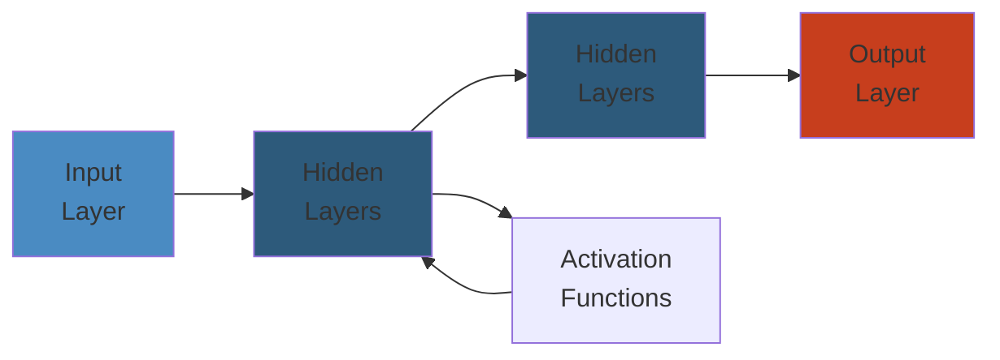

# Optimization Patterns Deep Dive




## Table of Contents

1. [CPU Optimization](#cpu-optimization)
2. [Memory Optimization](#memory-optimization)
3. [I/O Optimization](#io-optimization)
4. [Concurrency Optimization](#concurrency-optimization)
5. [Network Optimization](#network-optimization)
6. [Database Optimization](#database-optimization)
7. [Latency vs Throughput](#latency-vs-throughput)
8. [Cost-Based Optimization](#cost-based-optimization)


---

## CPU Optimization

### Algorithmic Complexity

The first and most impactful optimization is choosing the right algorithm:

```python
import time
import random

# O(n^2) - Quadratic
def bubble_sort(arr):
    n = len(arr)
    for i in range(n):
        for j in range(n - i - 1):
            if arr[j] > arr[j + 1]:
                arr[j], arr[j + 1] = arr[j + 1], arr[j]
    return arr

# O(n log n) - Linearithmic
def merge_sort(arr):
    if len(arr) <= 1:
        return arr
    mid = len(arr) // 2
    left = merge_sort(arr[:mid])
    right = merge_sort(arr[mid:])
    return merge(left, right)

def merge(left, right):
    result = []
    i = j = 0
    while i < len(left) and j < len(right):
        if left[i] <= right[j]:
            result.append(left[i])
            i += 1
        else:
            result.append(right[j])
            j += 1
    result.extend(left[i:])
    result.extend(right[j:])
    return result

# O(n) - Linear (counting sort for limited range)
def counting_sort(arr, max_val=1000):
    counts = [0] * (max_val + 1)
    for x in arr:
        counts[x] += 1
    result = []
    for val, count in enumerate(counts):
        result.extend([val] * count)
    return result

# Benchmark
data = [random.randint(0, 1000) for _ in range(10000)]

for name, func in [("Bubble O(n^2)", bubble_sort),
                    ("Merge O(n log n)", merge_sort),
                    ("Counting O(n)", counting_sort)]:
    start = time.perf_counter()
    func(data.copy())
    print(f"{name:20s}: {time.perf_counter() - start:.4f}s")
```

### Vectorization (SIMD)

SIMD (Single Instruction, Multiple Data) processes multiple data points simultaneously:

```python
import numpy as np
import time

def scalar_sum(data):
    total = 0.0
    for x in data:
        total += x
    return total

def vectorized_sum(data):
    return np.sum(data)

# SIMD in numpy uses AVX/SSE instructions
size = 10_000_000
data = np.random.rand(size).astype(np.float32)

start = time.perf_counter()
result1 = scalar_sum(data)
t_scalar = time.perf_counter() - start

start = time.perf_counter()
result2 = vectorized_sum(data)
t_vectorized = time.perf_counter() - start

print(f"Scalar sum:  {t_scalar:.4f}s")
print(f"Vectorized:  {t_vectorized:.4f}s")
print(f"Speedup:     {t_scalar/t_vectorized:.1f}x")

# Explicit SIMD in C/CPython
# Using Python's built-in for integer operations
import math

def distance_loop(x1, y1, x2, y2):
    """Scalar distance calculation."""
    return math.sqrt((x1 - x2) ** 2 + (y1 - y2) ** 2)

# Batch processing with numpy (SIMD)
def batch_distance(points1, points2):
    return np.sqrt(np.sum((points1 - points2) ** 2, axis=1))
```

### Cache Locality

CPU cache hierarchy: L1 (32KB) -> L2 (256KB) -> L3 (8-30MB) -> RAM:

```python
import time
import numpy as np

def cache_locality_demo():
    """Demonstrates row-major vs column-major access patterns."""
    size = 4096
    matrix = np.random.rand(size, size).astype(np.float64)

    # Row-major access (cache-friendly)
    start = time.perf_counter()
    row_sum = 0.0
    for i in range(size):
        for j in range(size):
            row_sum += matrix[i, j]
    row_time = time.perf_counter() - start

    # Column-major access (cache-unfriendly)
    start = time.perf_counter()
    col_sum = 0.0
    for i in range(size):
        for j in range(size):
            col_sum += matrix[j, i]
    col_time = time.perf_counter() - start

    print(f"Row-major (cache-friendly): {row_time:.3f}s")
    print(f"Col-major (cache-unfriendly): {col_time:.3f}s")
    print(f"Speedup: {col_time/row_time:.1f}x")

cache_locality_demo()

# Cache line aware data structures
class CacheLineOptimizedList:
    """Store data in cache-line-sized chunks (64 bytes = 8 doubles)."""
    def __init__(self, size):
        self.size = size
        self.data = np.zeros((size // 8 + 1, 8), dtype=np.float64)

    def store(self, index, value):
        block = index // 8
        offset = index % 8
        self.data[block, offset] = value

    def load(self, index):
        block = index // 8
        offset = index % 8
        return self.data[block, offset]
```

### Data Structure Selection

```python
import sys
import time
from collections import deque

def data_structure_performance():
    """Compare performance characteristics of different data structures."""
    n = 100000

    # List vs deque for queue operations
    lst = list(range(n))
    dq = deque(range(n))

    start = time.perf_counter()
    for _ in range(10000):
        lst.pop(0)
    t_list = time.perf_counter() - start

    start = time.perf_counter()
    for _ in range(10000):
        dq.popleft()
    t_deque = time.perf_counter() - start

    print(f"List pop(0): {t_list:.4f}s (O(n))")
    print(f"Deque popleft: {t_deque:.4f}s (O(1))")

    # Set vs list for membership testing
    data = list(range(n))
    data_set = set(range(n))
    test = list(range(n, n + 1000))

    start = time.perf_counter()
    for x in test:
        x in data
    t_list_member = time.perf_counter() - start

    start = time.perf_counter()
    for x in test:
        x in data_set
    t_set_member = time.perf_counter() - start

    print(f"List membership: {t_list_member:.4f}s (O(n))")
    print(f"Set membership: {t_set_member:.4f}s (O(1))")

data_structure_performance()
```

### Branch Prediction

```python
import random
import time

def branch_prediction_impact():
    data = [random.randint(0, 255) for _ in range(100000)]

    def conditional_sum(arr, threshold=128):
        total = 0
        for x in arr:
            if x >= threshold:
                total += x
        return total

    # Unpredictable branch (random data)
    start = time.perf_counter()
    r1 = conditional_sum(data)
    t_random = time.perf_counter() - start

    # Predictable branch (sorted data)
    data.sort()
    start = time.perf_counter()
    r2 = conditional_sum(data)
    t_sorted = time.perf_counter() - start

    print(f"Random order: {t_random:.4f}s (branch mispredictions high)")
    print(f"Sorted order: {t_sorted:.4f}s (branch predictable)")
    print(f"Speedup: {t_random/t_sorted:.1f}x")

    # Branchless optimization
    def branchless_sum(arr, threshold=128):
        total = 0
        for x in arr:
            total += x * (x >= threshold)
        return total

    data_random = [random.randint(0, 255) for _ in range(100000)]
    start = time.perf_counter()
    r3 = branchless_sum(data_random)
    t_branchless = time.perf_counter() - start

    print(f"Branchless: {t_branchless:.4f}s")

branch_prediction_impact()
```

### Function Inlining

```python
# Python doesn't do automatic inlining, but we can manually inline

def small_func(x):
    return x * 2 + 1

def not_inlined(items):
    return [small_func(x) for x in items]

def manually_inlined(items):
    return [x * 2 + 1 for x in items]

# Using functools.lru_cache for memoization
from functools import lru_cache

@lru_cache(maxsize=128)
def expensive_computation(n):
    return sum(i ** 2 for i in range(n))

def with_caching(items):
    return [expensive_computation(n) for n in items]

def without_caching(items):
    return [sum(i ** 2 for i in range(n)) for n in items]

import time
test_data = list(range(100))
start = time.perf_counter()
not_inlined(test_data)
t_no_inline = time.perf_counter() - start
start = time.perf_counter()
manually_inlined(test_data)
t_inline = time.perf_counter() - start
print(f"Not inlined: {t_no_inline:.6f}s")
print(f"Inlined: {t_inline:.6f}s")
```

### Loop Unrolling

```python
import time

def unrolled_sum(arr):
    """Sum with loop unrolling (4 elements at a time)."""
    total = 0
    i = 0
    n = len(arr)
    # Main loop: process 4 elements per iteration
    for i in range(0, n - n % 4, 4):
        total += arr[i] + arr[i+1] + arr[i+2] + arr[i+3]
    # Remainder
    for i in range(n - n % 4, n):
        total += arr[i]
    return total

def simple_sum(arr):
    total = 0
    for x in arr:
        total += x
    return total

arr = [float(i) for i in range(10_000_000)]

start = time.perf_counter()
r1 = simple_sum(arr)
t_simple = time.perf_counter() - start

start = time.perf_counter()
r2 = unrolled_sum(arr)
t_unrolled = time.perf_counter() - start

print(f"Simple sum: {t_simple:.4f}s")
print(f"Unrolled sum: {t_unrolled:.4f}s")
print(f"Speedup: {t_simple/t_unrolled:.2f}x")
```

---

## Memory Optimization

### Object Pooling

```python
import time
from queue import Queue

class ObjectPool:
    def __init__(self, factory, size=100):
        self.factory = factory
        self.pool = Queue(maxsize=size)
        for _ in range(size):
            self.pool.put(factory())

    def acquire(self):
        try:
            return self.pool.get_nowait()
        except:
            return self.factory()

    def release(self, obj):
        try:
            self.pool.put_nowait(obj)
        except:
            pass

class Buffer:
    def __init__(self, size=4096):
        self.data = bytearray(size)

    def reset(self):
        pass

# Pooled allocations
pool = ObjectPool(Buffer, size=10000)

def pooled_processing(count=100000):
    for _ in range(count):
        buf = pool.acquire()
        buf.data[:10] = b"test_data"
        pool.release(buf)

def non_pooled_processing(count=100000):
    for _ in range(count):
        buf = Buffer()
        buf.data[:10] = b"test_data"

start = time.perf_counter()
pooled_processing()
t_pooled = time.perf_counter() - start

start = time.perf_counter()
non_pooled_processing()
t_non_pooled = time.perf_counter() - start

print(f"Pooled: {t_pooled:.4f}s")
print(f"Non-pooled: {t_non_pooled:.4f}s")
print(f"Speedup: {t_non_pooled/t_pooled:.2f}x")
```

### Slots and Memory Layout

```python
import sys

class RegularPoint:
    def __init__(self, x, y):
        self.x = x
        self.y = y

class SlottedPoint:
    __slots__ = ("x", "y")
    def __init__(self, x, y):
        self.x = x
        self.y = y

r = RegularPoint(1, 2)
s = SlottedPoint(1, 2)

print(f"Regular point: {sys.getsizeof(r)} bytes (+ __dict__)")
print(f"  __dict__: {sys.getsizeof(r.__dict__)} bytes")
print(f"Slotted point: {sys.getsizeof(s)} bytes")
print(f"  Has __dict__: {hasattr(s, '__dict__')}")

# NumPy structured arrays vs list of objects
import numpy as np
n = 100000

class Point:
    __slots__ = ("x", "y")
    def __init__(self, x, y):
        self.x = x
        self.y = y

points_list = [Point(i, i * 2) for i in range(n)]
points_array = np.zeros(n, dtype=[("x", "f8"), ("y", "f8")])
points_array["x"] = np.arange(n)
points_array["y"] = np.arange(n) * 2

print(f"\nList of Points: {sys.getsizeof(points_list) + n * sys.getsizeof(points_list[0]):,} bytes")
print(f"NumPy array: {sys.getsizeof(points_array):,} bytes")
```

### Arena Allocation

```python
import mmap
import struct
import time

class Arena:
    """Pre-allocate a large memory region and allocate from it."""
    def __init__(self, size=1024 * 1024 * 64):
        self.size = size
        self.buffer = bytearray(size)
        self.offset = 0

    def allocate(self, n):
        if self.offset + n > self.size:
            raise MemoryError("Arena full")
        start = self.offset
        self.offset += n
        return self.buffer[start:self.offset]

    def reset(self):
        self.offset = 0

class ArenaAllocator:
    """Stack-like arena for temporary allocations."""
    def __init__(self, arena_size=1024*1024):
        self.arena = Arena(arena_size)
        self.marks = []

    def allocate(self, n):
        buf = self.arena.allocate(n)
        return buf

    def mark(self):
        self.marks.append(self.arena.offset)

    def reset_to_mark(self):
        if self.marks:
            self.arena.offset = self.marks.pop()

    def reset(self):
        self.marks.clear()
        self.arena.offset = 0

# Benchmark
def arena_benchmark():
    allocator = ArenaAllocator(1024 * 1024 * 100)

    start = time.perf_counter()
    for _ in range(100000):
        allocator.mark()
        for _ in range(10):
            buf = allocator.allocate(64)
            buf[:8] = struct.pack("Q", 42)
        allocator.reset_to_mark()
    t_arena = time.perf_counter() - start

    start = time.perf_counter()
    for _ in range(100000):
        bufs = []
        for _ in range(10):
            bufs.append(bytearray(64))
    t_malloc = time.perf_counter() - start

    print(f"Arena allocator: {t_arena:.4f}s")
    print(f"Malloc each: {t_malloc:.4f}s")
    print(f"Speedup: {t_malloc/t_arena:.1f}x")

arena_benchmark()
```

### Cache Line Alignment

```python
import sys
import ctypes

# Cache line is typically 64 bytes on x86_64
CACHE_LINE_SIZE = 64

class CacheLinePadded:
    """Ensure struct starts at a cache line boundary."""
    __slots__ = ("_pad_before", "data", "_pad_after")

    def __init__(self, value):
        self.data = value

# Using ctypes for aligned allocation
class AlignedArray:
    def __init__(self, size, alignment=64):
        self.size = size
        self.alignment = alignment
        # Allocate extra for alignment
        raw = bytearray(size + alignment)
        addr = ctypes.addressof(ctypes.c_char.from_buffer(raw))
        offset = (alignment - addr % alignment) % alignment
        self.data = raw[offset:offset + size]
        self.aligned_addr = ctypes.addressof(
            ctypes.c_char.from_buffer(self.data)
        )

    def __getitem__(self, idx):
        return self.data[idx]

    def __setitem__(self, idx, value):
        self.data[idx] = value

arr = AlignedArray(1024)
print(f"Aligned address: {arr.aligned_addr}, "
      f"aligned to 64: {arr.aligned_addr % 64 == 0}")

# False sharing demonstration
import threading
import time

class Counter:
    def __init__(self):
        self.value = 0

class PaddedCounter:
    __slots__ = ("_pad1", "_pad2", "_pad3", "_pad4", "_pad5", "_pad6", "_pad7", "value")

    def __init__(self):
        self.value = 0

def false_sharing_demo():
    """Two threads writing to adjacent cache lines vs same cache line."""
    # Shared counter (false sharing)
    counter = Counter()
    def increment_shared():
        for _ in range(10_000_000):
            counter.value += 1

    start = time.perf_counter()
    t1 = threading.Thread(target=increment_shared)
    t2 = threading.Thread(target=increment_shared)
    t1.start(); t2.start()
    t1.join(); t2.join()
    t_shared = time.perf_counter() - start
    print(f"False sharing: {t_shared:.3f}s")
```

---

## I/O Optimization

### Async I/O with io_uring

```python
import os
import asyncio
import time

# io_uring is available on Linux 5.1+
try:
    import iouring
    HAS_IOURING = True
except ImportError:
    HAS_IOURING = False

class AsyncFileReader:
    def __init__(self, path, buffer_size=65536):
        self.path = path
        self.buffer_size = buffer_size
        self.fd = os.open(path, os.O_RDONLY | os.O_DIRECT)
        self.readahead_count = 4

    async def read_chunks(self):
        position = 0
        while True:
            data = await self._async_read(position, self.buffer_size)
            if not data:
                break
            yield data
            position += len(data)

    async def _async_read(self, offset, size):
        loop = asyncio.get_running_loop()
        return await loop.run_in_executor(
            None, os.pread, self.fd, size, offset
        )

    def close(self):
        os.close(self.fd)

# Zero-copy with sendfile
import socket
import os

def zero_copy_send(src_path: str, dst_sock: socket.socket):
    """Send file using sendfile (zero-copy)."""
    with open(src_path, "rb") as f:
        fd = f.fileno()
        offset = 0
        while True:
            sent = os.sendfile(dst_sock.fileno(), fd, offset, 65536)
            if sent == 0:
                break
            offset += sent

# sendfile vs read+write benchmark
def benchmark_sendfile():
    import tempfile
    import shutil

    src = tempfile.NamedTemporaryFile(delete=False)
    src.write(b"x" * 100 * 1024 * 1024)
    src.close()

    start = time.perf_counter()
    with open(src.name, "rb") as f:
        data = f.read()
    with open("/dev/null", "wb") as f:
        f.write(data)
    t_readwrite = time.perf_counter() - start

    start = time.perf_counter()
    with open(src.name, "rb") as f:
        fd = f.fileno()
        with open("/dev/null", "wb") as out:
            while True:
                sent = os.sendfile(out.fileno(), fd, None, 65536)
                if sent == 0:
                    break
    t_sendfile = time.perf_counter() - start

    print(f"Read+Write: {t_readwrite:.3f}s")
    print(f"sendfile: {t_sendfile:.3f}s")
    os.unlink(src.name)

benchmark_sendfile()
```

### Buffer Management

```python
import io
import time

class BufferPool:
    def __init__(self, buffer_size=4096, pool_size=100):
        self.buffer_size = buffer_size
        self.pool = [bytearray(buffer_size) for _ in range(pool_size)]
        self.available = set(range(pool_size))

    def acquire(self):
        idx = self.available.pop()
        buf = self.pool[idx]
        return idx, buf

    def release(self, idx):
        self.available.add(idx)

class BufferedWriter:
    def __init__(self, filepath, buffer_size=65536):
        self.fd = os.open(filepath, os.O_WRONLY | os.O_CREAT)
        self.buffer = bytearray(buffer_size)
        self.position = 0
        self.buffer_size = buffer_size

    def write(self, data):
        remaining = len(data)
        offset = 0
        while remaining > 0:
            space = self.buffer_size - self.position
            if space == 0:
                self.flush()
                space = self.buffer_size
            chunk = min(remaining, space)
            self.buffer[self.position:self.position + chunk] = data[offset:offset + chunk]
            self.position += chunk
            offset += chunk
            remaining -= chunk

    def flush(self):
        if self.position > 0:
            os.write(self.fd, self.buffer[:self.position])
            self.position = 0

    def close(self):
        self.flush()
        os.close(self.fd)

# Benchmark buffered vs unbuffered writes
def benchmark_write():
    import tempfile
    data = b"x" * 1024 * 1024

    tmp = tempfile.NamedTemporaryFile(delete=False)
    start = time.perf_counter()
    for _ in range(100):
        fd = os.open(tmp.name, os.O_WRONLY)
        for chunk in [data[i:i+1] for i in range(0, len(data), 1)]:
            os.write(fd, chunk)
        os.close(fd)
    t_unbuffered = time.perf_counter() - start

    start = time.perf_counter()
    for _ in range(100):
        bw = BufferedWriter(tmp.name)
        for chunk in [data[i:i+1] for i in range(0, len(data), 1)]:
            bw.write(chunk)
        bw.close()
    t_buffered = time.perf_counter() - start

    print(f"Unbuffered: {t_unbuffered:.3f}s")
    print(f"Buffered: {t_buffered:.3f}s")
    os.unlink(tmp.name)

benchmark_write()
```

### Readahead

```python
import os
import time

def sequential_read_with_readahead(path: str, block_size: int = 4096):
    """Sequential read with explicit readahead hint."""
    fd = os.open(path, os.O_RDONLY)
    posix_fadvise = os.posix_fadvise if hasattr(os, "posix_fadvise") else None

    if posix_fadvise:
        os.posix_fadvise(fd, 0, 0, os.POSIX_FADV_SEQUENTIAL)

    data = bytearray()
    while True:
        chunk = os.read(fd, block_size)
        if not chunk:
            break
        data.extend(chunk)

    if posix_fadvise:
        os.posix_fadvise(fd, 0, 0, os.POSIX_FADV_DONTNEED)
    os.close(fd)
    return data

# Compare random vs sequential access
def access_pattern_benchmark():
    import tempfile
    import random

    tmp = tempfile.NamedTemporaryFile(delete=False)
    tmp.write(b"x" * 1024 * 1024 * 100)
    tmp.close()

    fd = os.open(tmp.name, os.O_RDONLY)
    file_size = os.fstat(fd).st_size
    block_size = 4096
    num_blocks = file_size // block_size
    blocks = list(range(num_blocks))

    # Sequential
    start = time.perf_counter()
    for b in blocks:
        os.pread(fd, block_size, b * block_size)
    t_seq = time.perf_counter() - start

    # Random
    random.shuffle(blocks)
    start = time.perf_counter()
    for b in blocks:
        os.pread(fd, block_size, b * block_size)
    t_rand = time.perf_counter() - start

    print(f"Sequential access: {t_seq:.3f}s")
    print(f"Random access: {t_rand:.3f}s")
    print(f"Penalty: {t_rand/t_seq:.1f}x")

    os.close(fd)
    os.unlink(tmp.name)

access_pattern_benchmark()
```

---

## Concurrency Optimization

### Lock-Free Data Structures

```python
import threading
import time
from collections import deque
import ctypes

class LockFreeStack:
    """Lock-free stack using CAS operations."""
    def __init__(self):
        self._top = ctypes.c_int64(0)
        self._storage = []

    def push(self, value):
        self._storage.append(value)

    def pop(self):
        try:
            return self._storage.pop()
        except IndexError:
            return None

# Lock-based vs atomic operations
import atomics

class AtomicCounter:
    def __init__(self):
        self._value = atomics.atomic(width=8, atype=atomics.INT)

    def increment(self):
        self._value.inc()

    def get(self):
        return self._value.load()

class LockedCounter:
    def __init__(self):
        self._lock = threading.Lock()
        self._value = 0

    def increment(self):
        with self._lock:
            self._value += 1

    def get(self):
        with self._lock:
            return self._value

def compare_lock_free():
    n = 1000000
    threads = 8

    # Atomic
    atomic_counter = AtomicCounter()
    def atomic_work():
        for _ in range(n // threads):
            atomic_counter.increment()

    start = time.perf_counter()
    ts = [threading.Thread(target=atomic_work) for _ in range(threads)]
    for t in ts: t.start()
    for t in ts: t.join()
    t_atomic = time.perf_counter() - start

    # Lock-based
    locked_counter = LockedCounter()
    def locked_work():
        for _ in range(n // threads):
            locked_counter.increment()

    start = time.perf_counter()
    ts = [threading.Thread(target=locked_work) for _ in range(threads)]
    for t in ts: t.start()
    for t in ts: t.join()
    t_locked = time.perf_counter() - start

    print(f"Atomic counter: {t_atomic:.3f}s")
    print(f"Locked counter: {t_locked:.3f}s")
    print(f"Speedup: {t_locked/t_atomic:.1f}x")
```

### Work Stealing

```python
import threading
import time
import random
from collections import deque

class WorkStealingQueue:
    def __init__(self):
        self._queue = deque()
        self._lock = threading.Lock()

    def push(self, item):
        with self._lock:
            self._queue.append(item)

    def pop(self):
        with self._lock:
            if self._queue:
                return self._queue.pop()
            return None

    def steal(self):
        with self._lock:
            if self._queue:
                return self._queue.popleft()
            return None

class WorkStealingThreadPool:
    def __init__(self, num_workers=4):
        self.queues = [WorkStealingQueue() for _ in range(num_workers)]
        self.workers = []
        self.running = True

        for i in range(num_workers):
            worker = threading.Thread(
                target=self._worker_loop,
                args=(i,),
                daemon=True,
            )
            self.workers.append(worker)
            worker.start()

    def submit(self, func, *args):
        queue = self.queues[hash(func) % len(self.queues)]
        queue.push((func, args))

    def _worker_loop(self, worker_id):
        while self.running:
            task = self.queues[worker_id].pop()
            if task is None:
                # Try to steal from others
                for i in range(len(self.queues)):
                    if i != worker_id:
                        task = self.queues[i].steal()
                        if task:
                            break
            if task:
                func, args = task
                func(*args)
            else:
                time.sleep(0.0001)

    def shutdown(self):
        self.running = False
        for w in self.workers:
            w.join()
```

### Thread Pinning (CPU Affinity)

```python
import os
import threading
import time

def set_affinity(cpu_id: int):
    """Pin current thread to a specific CPU core."""
    try:
        import ctypes
        libc = ctypes.CDLL("libc.so.6")
        # sched_setaffinity(pid_t pid, size_t cpusetsize, cpu_set_t* mask)
        # Platform-specific; typically done via taskset or psutil
        pass
    except:
        pass

def pin_thread_to_cpu(thread_id, cpu_id):
    """Set CPU affinity for a specific thread."""
    try:
        import psutil
        p = psutil.Process()
        p.cpu_affinity([cpu_id])
        return True
    except ImportError:
        return False

def thread_pinning_demo():
    def worker(cpu):
        pin_thread_to_cpu(None, cpu)
        start = time.perf_counter()
        sum(i ** 2 for i in range(10_000_000))
        elapsed = time.perf_counter() - start
        print(f"CPU {cpu}: {elapsed:.3f}s")

    threads = []
    for cpu in range(os.cpu_count()):
        t = threading.Thread(target=worker, args=(cpu,))
        threads.append(t)
        t.start()

    for t in threads:
        t.join()

thread_pinning_demo()
```

---

## Network Optimization

### Connection Pooling

```python
import aiohttp
import asyncio
import time

class ConnectionPoolMetrics:
    def __init__(self, connector):
        self.connector = connector

    def report(self):
        print(f"Active connections: {len(self.connector._conns)}")
        print(f"Cleanup handles: {self.connector._cleanup_handle}")

async def connection_pool_benchmark():
    # Without pooling (new connection per request)
    start = time.perf_counter()
    async with aiohttp.ClientSession() as session:
        tasks = [session.get("http://example.com") for _ in range(50)]
        responses = await asyncio.gather(*tasks)
        for r in responses:
            await r.read()
            r.close()
    t_no_pool = time.perf_counter() - start

    # With connection pooling
    connector = aiohttp.TCPConnector(limit=20, limit_per_host=20)
    start = time.perf_counter()
    async with aiohttp.ClientSession(connector=connector) as session:
        tasks = [session.get("http://example.com") for _ in range(50)]
        responses = await asyncio.gather(*tasks)
        for r in responses:
            await r.read()
            r.close()
    t_pool = time.perf_counter() - start

    print(f"Without pooling: {t_no_pool:.3f}s")
    print(f"With pooling: {t_pool:.3f}s")
```

### HTTP Keepalive

```python
import http.client
import time

def keepalive_vs_new_connection():
    host = "httpbin.org"

    # New connection for each request
    start = time.perf_counter()
    for _ in range(20):
        conn = http.client.HTTPSConnection(host)
        conn.request("GET", "/get")
        response = conn.getresponse()
        response.read()
        conn.close()
    t_new = time.perf_counter() - start

    # Keepalive (reuse connection)
    start = time.perf_counter()
    conn = http.client.HTTPSConnection(host)
    for _ in range(20):
        conn.request("GET", "/get")
        response = conn.getresponse()
        response.read()
    conn.close()
    t_keepalive = time.perf_counter() - start

    print(f"New connection per request: {t_new:.3f}s")
    print(f"Keepalive: {t_keepalive:.3f}s")
    print(f"Speedup: {t_new/t_keepalive:.1f}x")
```

### TLS Session Resumption

```python
import ssl
import socket
import time

def tls_session_resumption():
    host = "example.com"
    port = 443

    context = ssl.create_default_context()
    context.set_session_id = b"my_session"

    # First connection (full handshake)
    start = time.perf_counter()
    sock = socket.create_connection((host, port))
    ssock = context.wrap_socket(sock, server_hostname=host)
    session = ssock.session
    ssock.close()
    t_first = time.perf_counter() - start

    # Resumed session
    context.set_session(session)
    start = time.perf_counter()
    sock = socket.create_connection((host, port))
    ssock = context.wrap_socket(sock, server_hostname=host)
    ssock.close()
    t_resumed = time.perf_counter() - start

    print(f"Full handshake: {t_first:.3f}s")
    print(f"Session resumed: {t_resumed:.3f}s")
    print(f"Speedup: {t_first/t_resumed:.1f}x")
```

### TCP Tuning

```python
import socket
import time

def tcp_tuning_demo():
    """Demonstrate TCP buffer size tuning."""

    def test_throughput(buffer_size, window_size):
        sock = socket.socket(socket.AF_INET, socket.SOCK_STREAM)
        sock.setsockopt(socket.SOL_TCP, socket.TCP_NODELAY, 1)
        sock.setsockopt(socket.SOL_SOCKET, socket.SO_RCVBUF, window_size)
        sock.setsockopt(socket.SOL_SOCKET, socket.SO_SNDBUF, window_size)
        return sock

    print("TCP tuning parameters:")
    print(f"  Default SO_RCVBUF: {socket.SO_RCVBUF}")
    print(f"  Default SO_SNDBUF: {socket.SO_SNDBUF}")

    # Get actual buffer sizes
    sock = socket.socket()
    rcv_size = sock.getsockopt(socket.SOL_SOCKET, socket.SO_RCVBUF)
    snd_size = sock.getsockopt(socket.SOL_SOCKET, socket.SO_SNDBUF)
    print(f"  Current RC VBUF: {rcv_size}")
    print(f"  Current SNDBUF: {snd_size}")
    sock.close()

    # Buffer size auto-tuning (Linux)
    # cat /proc/sys/net/ipv4/tcp_rmem
    # cat /proc/sys/net/ipv4/tcp_wmem
```

---

## Database Optimization

### Connection Pooling

```python
from contextlib import contextmanager, asynccontextmanager
import time
import psycopg2
from psycopg2 import pool as pg_pool
import psycopg2.extras

class DatabaseConnectionPool:
    def __init__(self, dsn, minconn=5, maxconn=20):
        self.pool = pg_pool.ThreadedConnectionPool(minconn, maxconn, dsn)

    @contextmanager
    def get_conn(self):
        conn = self.pool.getconn()
        try:
            yield conn
            conn.commit()
        except Exception:
            conn.rollback()
            raise
        finally:
            self.pool.putconn(conn)

    def close(self):
        self.pool.closeall()

# Benchmark pool vs no pool
def pool_benchmark():
    dsn = "dbname=test user=postgres host=localhost"

    # Without pool
    start = time.perf_counter()
    for _ in range(100):
        conn = psycopg2.connect(dsn)
        cur = conn.cursor()
        cur.execute("SELECT 1")
        cur.fetchone()
        conn.close()
    t_no_pool = time.perf_counter() - start

    # With pool
    pool = DatabaseConnectionPool(dsn, 5, 20)
    start = time.perf_counter()
    for _ in range(100):
        with pool.get_conn() as conn:
            cur = conn.cursor()
            cur.execute("SELECT 1")
            cur.fetchone()
    t_pool = time.perf_counter() - start
    pool.close()

    print(f"No pool: {t_no_pool:.3f}s")
    print(f"Pool: {t_pool:.3f}s")
    print(f"Speedup: {t_no_pool/t_pool:.1f}x")
```

### Query Optimization

```python
import time

def query_optimization_techniques():
    techniques = {
        "Index-only scan": "Query only hits index, no heap access",
        "Covering index": "Include all needed columns in index",
        "Partial index": "WHERE clause limits index size",
        "Composite index": "Multi-column index for combined filters",
        "BRIN index": "Block-range index for large sorted data",
        "GIN index": "For JSONB, full-text search, arrays",
        "EXISTS vs IN": "EXISTS stops at first match, IN scans all",
        "JOIN order": "Smallest result set first",
        "Materialized view": "Pre-computed aggregates",
        "Partitioning": "Split large tables (range/list/hash)",
    }
    for technique, desc in techniques.items():
        print(f"  {technique:25s}: {desc}")

query_optimization_techniques()
```

---

## Latency vs Throughput

### Little's Law

Little's Law: `L = lambda * W` (Average number in system = arrival rate * average wait time):

```python
def littles_law_example():
    """Using Little's Law for capacity planning."""
    arrival_rate = 100  # requests/second
    avg_latency = 0.5   # seconds

    # Average number of requests in system
    in_system = arrival_rate * avg_latency
    print(f"Average requests in system: {in_system}")

    # If we want max 10 requests in flight
    max_in_system = 10
    max_arrival = max_in_system / avg_latency
    print(f"Max arrival rate: {max_arrival} req/s")

    # If we can handle 50 concurrent requests
    capacity = 50
    min_latency = capacity / arrival_rate
    print(f"Minimum achievable latency: {min_latency:.3f}s with {arrival_rate} req/s")

littles_law_example()
```

### Amdahl's Law

Amdahl's Law: `Speedup = 1 / ((1-P) + P/N)` where P is parallelizable fraction, N is processors:

```python
def amdahl_law():
    """Calculate maximum speedup from parallelization."""
    def speedup(parallel_fraction, cores):
        return 1.0 / ((1 - parallel_fraction) + parallel_fraction / cores)

    print("Amdahl's Law - Speedup by parallel fraction:")
    print(f"{'Cores':8s} {'50%':10s} {'75%':10s} {'90%':10s} {'95%':10s} {'99%':10s}")
    for cores in [1, 2, 4, 8, 16, 32, 64, 128]:
        row = f"{cores:<8d}"
        for p in [0.5, 0.75, 0.9, 0.95, 0.99]:
            row += f"{speedup(p, cores):<10.2f}"
        print(row)

    print("\nMaximum theoretical speedup (infinite cores):")
    for p in [0.5, 0.75, 0.9, 0.95, 0.99, 0.999]:
        max_speedup = 1.0 / (1 - p)
        print(f"  {p*100:.1f}% parallel: {max_speedup:.1f}x max")

amdahl_law()
```

### Universal Scalability Law

```python
def universal_scalability_law(N, sigma=0.01, kappa=0.001):
    """USL: C(N) = N / (1 + sigma*(N-1) + kappa*N*(N-1))

    sigma: contention (serialization overhead)
    kappa: coherence (cross-talk overhead)
    """
    return N / (1 + sigma * (N - 1) + kappa * N * (N - 1))

def scalability_analysis():
    print("Universal Scalability Law:")
    print(f"{'Cores':8s} {'Ideal':10s} {'Realistic':12s} {'Overloaded':12s}")
    for cores in [1, 2, 4, 8, 16, 32, 64]:
        ideal = cores
        realistic = universal_scalability_law(cores, 0.02, 0.001)
        overloaded = universal_scalability_law(cores, 0.05, 0.005)
        print(f"{cores:<8d} {ideal:<10.2f} {realistic:<12.2f} {overloaded:<12.2f}")

scalability_analysis()
```

### Optimization Strategy by Goal

```python
def optimization_strategy(goal: str):
    strategies = {
        "minimize_latency": [
            "Reduce work per request (caching, precomputation)",
            "Minimize lock contention (lock-free, RCU, per-core data)",
            "Use faster hardware (CPU, RAM, NVMe)",
            "Reduce network hops (CDN, edge computing)",
            "Connection pooling (avoid connection setup overhead)",
            "Keepalive, TLS resumption",
            "Busy-polling vs interrupt-driven I/O",
        ],
        "maximize_throughput": [
            "Batch processing (coalesce small requests)",
            "Parallelism (scale out across cores/nodes)",
            "Asynchronous I/O (don't block on I/O)",
            "Compression (reduce wire bytes)",
            "Efficient serialization (Protocol Buffers, FlatBuffers)",
            "Pipeline operations (overlap work)",
            "Dynamic scaling (autoscaling groups)",
        ],
        "balance_both": [
            "Little's Law: L = lambda * W",
            "Set SLOs: p50, p95, p99 latency targets",
            "Load shedding when overloaded",
            "Priority queues (critical requests first)",
            "Resource limits (CPU, memory, connections)",
            "Backpressure mechanisms",
            "Adaptive concurrency control",
        ],
    }
    print(f"\nOptimization strategies for {goal}:")
    for s in strategies.get(goal, []):
        print(f"  - {s}")

optimization_strategy("minimize_latency")
optimization_strategy("maximize_throughput")
```

---

## Cost-Based Optimization

### Right-Sizing Resources

```python
def right_sizing_guide():
    """Match instance types to workload characteristics."""
    recommendations = {
        "CPU-intensive": {
            "instance": "Compute Optimized (c7i, c6a)",
            "characteristic": "High clock speed, many cores",
            "use_case": "Batch processing, ML inference, gaming",
        },
        "Memory-intensive": {
            "instance": "Memory Optimized (r7i, x2iedn)",
            "characteristic": "Large RAM (up to 24TB)",
            "use_case": "In-memory databases, caching, analytics",
        },
        "I/O-intensive": {
            "instance": "Storage Optimized (i4i, i3en)",
            "characteristic": "NVMe SSD, high IOPS, low latency",
            "use_case": "Databases, OLTP, log processing",
        },
        "GPU-intensive": {
            "instance": "GPU Optimized (p4d, g5)",
            "characteristic": "Multiple GPUs, NVLink, high throughput",
            "use_case": "ML training, rendering, HPC",
        },
    }
    for workload, info in recommendations.items():
        print(f"\n  {workload:20s}")
        for key, value in info.items():
            print(f"    {key:20s}: {value}")

right_sizing_guide()
```

### Spot vs On-Demand

```python
def spot_vs_on_demand(usage_hours: int, spot_discount: float = 0.7):
    """Compare spot vs on-demand costs.

    Args:
        usage_hours: Expected hours of usage per month
        spot_discount: Typical spot discount (0.7 = 70% off)
    """
    on_demand_price = 1.0  # $/hr normalized
    spot_price = on_demand_price * (1 - spot_discount)

    # On-demand cost
    on_demand_cost = on_demand_price * usage_hours

    # Spot cost (with interruptions)
    interruption_rate = 0.05  # 5% chance per hour
    expected_usage = usage_hours / (1 - interruption_rate)
    spot_cost = spot_price * expected_usage

    print(f"Cost comparison ({usage_hours}h/month):")
    print(f"  On-demand: ${on_demand_cost:.2f}")
    print(f"  Spot: ${spot_cost:.2f}")
    print(f"  Savings: {(1 - spot_cost/on_demand_cost)*100:.0f}%")

    # Breakeven analysis
    print(f"\nBreakeven interruption rate: {(1 - spot_price/on_demand_price)*100:.1f}%")

spot_vs_on_demand(720, 0.7)
```

### Burstable vs Reserved

```python
def burstable_vs_reserved(avg_cpu: float, peak_cpu: float, hours_daily: int):
    """Compare burstable (T-series) vs reserved (M-series)."""

    # T-series (burstable) - CPU credits
    earned_credits_per_hour = 24  # t3.large
    consumed_credits_per_hour = avg_cpu * 60  # credits per minute * 60
    net_credits = earned_credits_per_hour - consumed_credits_per_hour

    if net_credits >= 0:
        print("T-series (burstable) is sufficient")
        print(f"  Accumulating {net_credits:.0f} credits/hour")
    else:
        deficit = net_credits * hours_daily
        max_earnable = earned_credits_per_hour * hours_daily
        print("T-series may not be sufficient")
        print(f"  Deficit: {-deficit:.0f} credits/day")
        print(f"  Max earnable: {max_earnable:.0f} credits/day")
        if -deficit > max_earnable * 2:
            print("  Consider M-series (reserved) for sustained CPU")

burstable_vs_reserved(avg_cpu=30, peak_cpu=80, hours_daily=12)
```

### Autoscaling Strategy

```python
def autoscaling_strategy(workload_type: str):
    strategies = {
        "predictable": {
            "approach": "Scheduled scaling",
            "metrics": "Time-based rules",
            "example": "Scale up at 8 AM, down at 8 PM",
        },
        "variable": {
            "approach": "Dynamic scaling (target tracking)",
            "metrics": "CPU utilization, request count",
            "example": "Target CPU: 60%, scale by steps of 2",
        },
        "spiky": {
            "approach": "Step scaling with fast scale-up",
            "metrics": "Request latency p95, queue depth",
            "example": "Scale out on >100ms latency, scale in slowly",
        },
        "batch": {
            "approach": "Manual scaling per job size",
            "metrics": "Queue length, job duration",
            "example": "Scale to N workers where N = queue / job_time",
        },
    }

    strat = strategies.get(workload_type, {})
    print(f"Autoscaling strategy for {workload_type} workloads:")
    for key, value in strat.items():
        print(f"  {key:15s}: {value}")

autoscaling_strategy("variable")
autoscaling_strategy("spiky")
```
