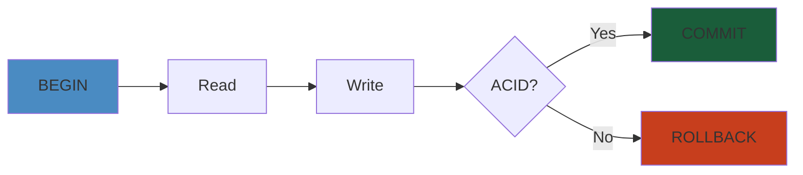

# Testing Fundamentals: Unit & Integration Testing




## Table of Contents

1. [Noob Explanation](#noob-explanation)
2. [Complete Internals Architecture](#complete-internals-architecture)
3. [Mocking Framework Internals](#mocking-framework-internals)
4. [Assertion Library Internals](#assertion-library-internals)
5. [Code Coverage Algorithms](#code-coverage-algorithms)
6. [Test Isolation Patterns](#test-isolation-patterns)
7. [Flakiness Detection](#flakiness-detection)
8. [Large-Scale Systems Testing](#large-scale-systems-testing)
9. [Failure Analysis](#failure-analysis)
10. [Edge Cases](#edge-cases)
11. [Interview Questions](#interview-questions)
12. [Performance Analysis](#performance-analysis)
13. [Complete Code Examples](#complete-code-examples)
14. [Production Incident Stories](#production-incident-stories)
15. [Comparison Tables](#comparison-tables)
16. [Key Takeaways](#key-takeaways)


---

**Table of Contents**
1. [Noob Explanation with Analogies](#noob-explanation)
2. [Complete Internals Architecture](#complete-internals)
3. [End-to-End Execution Flows](#end-to-end-flows)
4. [Test Runner Deep Dive](#test-runner-architecture)
5. [Mock, Spy, and Stub Internals](#mocking-framework-internals)
6. [Assertion Libraries](#assertion-library-internals)
7. [Code Coverage Algorithms](#code-coverage-algorithms)
8. [Test Isolation and Fixtures](#test-isolation-patterns)
9. [Flaky Test Detection](#flakiness-detection)
10. [Large-Scale System Testing](#large-scale-systems)
11. [Failure Analysis](#failure-analysis)
12. [Edge Cases](#edge-cases)
13. [Interview Questions](#interview-questions)
14. [Performance Analysis](#performance-analysis)
15. [Complete Code Examples](#complete-code-examples)
16. [Production Incident Stories](#production-incident-stories)
17. [Comparison Tables](#comparison-tables)

---

## Noob Explanation

#### Step-by-Step: Unit Testing as LEGO Blocks

1. **Identify the block** (function to test): `calculateTotal(items)`
2. **Create test data** (valid input): `items = [10, 20, 30]`
3. **Execute the block** (call function): `result = calculateTotal(items)`
4. **Verify the result** (assertion): `assert result == 60`
5. **Cleanup** (teardown): Release resources if needed
6. **Repeat** for edge cases (empty list, negative numbers, null)

### Unit Testing as LEGO Blocks

Imagine you're building a LEGO castle. Before you connect blocks together, you want to verify each individual block is the right color, has no cracks, and connects properly to neighboring blocks. A **unit test** is exactly this:

```
Block A (function)
  |-- Check it connects to Block B ✓
  |-- Check it fits in Block C ✓
  |-- Check it doesn't break under weight ✓
```

**Why**: If you skip testing individual blocks and just assemble the castle, the structure collapses. When it does, you don't know which block was defective. With unit tests, you catch problems early when they're cheap to fix (one block vs the entire castle).

**Real Example**: Testing a `calculateTotal()` function in isolation:
- Input: [10, 20, 30]
- Expected: 60
- Actual: 60 ✓

If there's a bug, you immediately know it's in `calculateTotal()`, not in 50 other functions that call it.

#### Code Example

```java
// Unit test for calculateTotal function (Java with JUnit)
@Test
public void testCalculateTotalWithPositiveNumbers() {
    Calculator calc = new Calculator();
    int result = calc.calculateTotal(Arrays.asList(10, 20, 30));
    assertEquals(60, result);  // Assert expected = actual
}

@Test
public void testCalculateTotalWithEmptyList() {
    Calculator calc = new Calculator();
    int result = calc.calculateTotal(new ArrayList<>());
    assertEquals(0, result);  // Empty list should return 0
}

@Test
public void testCalculateTotalWithNegativeNumbers() {
    Calculator calc = new Calculator();
    int result = calc.calculateTotal(Arrays.asList(-10, 20, 30));
    assertEquals(40, result);  // Negative numbers should be included
}
```

#### Real-World Scenario

A payment processing service has a `calculateDiscount()` function that applies 10% off for orders over $100. The team shipped code without unit tests. In production, an edge case: an order for exactly $100.00 caused a rounding error (99.99 vs 100.00), resulting in $0.01 data loss per transaction. Across 1M daily transactions, $10K daily loss went undetected for 2 weeks. A simple unit test covering boundary conditions (99.99, 100.00, 100.01) would have caught this immediately.

### Integration Testing as LEGO Houses

Now you've verified all blocks individually. But does the castle actually stand when you connect walls to the floor? Do the towers align? Does the drawbridge actually move?

**Integration testing** verifies that multiple components work together:

```
Test: Wall + Floor Connection
  |-- Load floor
  |-- Load wall
  |-- Connect them
  |-- Verify wall holds weight
  |-- Verify connection is stable
```

**Real Example**: Testing database + API handler together:
```
1. Insert user into DB
2. Call /users/123 endpoint
3. Verify it returns the correct user
4. Verify the response format is correct
5. Verify DB transaction wasn't left open
```

**Why separate**: Unit test verifies the API handler logic. Integration test verifies the database driver works correctly, the connection pool doesn't leak, and data flows correctly end-to-end.

#### Code Example

```python
# Integration test for API + Database (Python with pytest + TestContainers)
def test_user_creation_integration():
    # Setup: Start real PostgreSQL in Docker container
    with testcontainers.postgres.PostgresContainer() as db:
        # Create connection
        conn = psycopg2.connect(db.get_connection_url())
        cursor = conn.cursor()
        
        # Create schema
        cursor.execute("CREATE TABLE users (id SERIAL PRIMARY KEY, email VARCHAR(255), name VARCHAR(255))")
        conn.commit()
        
        # Act: Create user via API handler + database
        api = UserAPI(db_connection=conn)
        result = api.create_user("alice@example.com", "Alice")
        
        # Assert: Data persisted in database
        cursor.execute("SELECT * FROM users WHERE email = %s", ("alice@example.com",))
        user = cursor.fetchone()
        assert user is not None
        assert user[2] == "Alice"
        
        conn.close()
```

#### Real-World Scenario

A fintech company discovered in production that their user creation endpoint was successful (returned 200 OK to the API) but the database transaction wasn't committed due to a connection pool leak. New users could log in immediately (in-memory cache), but the data disappeared after server restart. Integration tests would have caught this: the test would verify that POST /users returns 200 AND the user exists in the database after the function returns, not just in memory.

### The Test Pyramid

```
           /\                  (Expensive, Slow, Complex)
          /  \   E2E Tests    (Full system, real infrastructure)
         /    \
        /      \
       /--------\
      / Integr. \              (Multiple components)
     /  Tests   \
    /            \
   /              \
  /--------        \
 / Unit    \       \           (Single function, isolated)
/   Tests   \       \
-----------  \       \
```

- **100 unit tests** = run in < 1 second, give you fast feedback
- **20 integration tests** = run in ~10 seconds, find cross-component bugs
- **3 E2E tests** = run in ~2 minutes, find real-world bugs

This pyramid is backwards in legacy projects:
```
Legacy Project:
           *
          ***
         *****
        *******
       *E2E Tests* (Too slow, fragile, timeout at 3am)
      *Integration*
     *Unit Tests*  (Very few, hard to run)
```

---

## Complete Internals Architecture

### Test Runner Architecture

A test runner has 5 phases:

#### Phase 1: Discovery

```
Input: /src/test directory
  |
  v
1. Scan filesystem recursively
2. Parse each file for test markers:
   - Java: @Test annotation
   - Python: def test_* functions
   - Go: func TestXxx(t *testing.T)
   - JavaScript: describe/it blocks
3. Extract test metadata:
   - Test name
   - File path
   - Line number
   - Test groups/suites
4. Build test graph (dependencies, order)
  |
  v
Output: [Test("test_add"), Test("test_subtract"), ...]
```

#### Step-by-Step: Test Discovery Process

1. **Scan filesystem**: Walk `/src/test` directory recursively, find all `.java` files
2. **Parse annotations**: Look for `@Test`, `@Before`, `@After`, `@Parameterized.Parameters` markers
3. **Extract metadata**: Build a map of test class → test methods → method signature → annotations
4. **Resolve dependencies**: If `@RunWith(Parameterized.class)`, load parameter sources
5. **Build execution graph**: Order by `@FixMethodOrder` or default (alphabetical)
6. **Return test list**: Framework now knows which tests to execute and in what order

**JUnit Discovery Example** (Java):
```java
// Test runner scans bytecode
@Test
public void testAdd() {
    // Gets discovered because of @Test marker
    assert(2 + 2 == 4);
}

// Runner extracts:
Test {
    name: "testAdd",
    method: Method("testAdd"),
    class: Class("Calculator"),
    timeout: null,
    tags: [],
    dependencies: []
}
```

#### Phase 2: Instantiation

```
For each Test:
  1. Create new test class instance (fresh state)
  2. Run @BeforeEach/@Before fixtures
  3. Inject dependencies (if using DI)
  4. Wire up mocks
  5. Return ready-to-run test object
```

**Why new instance**: Prevents state leakage between tests. Test B shouldn't see changes Test A made.

```java
class TestCalculator {
    private Calculator calc;
    
    @BeforeEach  // Runs before EVERY test
    public void setup() {
        calc = new Calculator();  // Fresh instance
    }
    
    @Test
    public void test1() {
        calc.add(1);  // Modifies calc's internal state
    }
    
    @Test
    public void test2() {
        // calc is FRESH here, not affected by test1
        assert(calc.getSum() == 0);
    }
}
```

#### Phase 3: Execution

```
For each Test:
  1. Start stopwatch
  2. Execute test method (run the assertions)
  3. Catch exceptions:
     - AssertionError = Test FAILED
     - Exception = Test ERROR
     - No exception = Test PASSED
  4. Record result (time, error, stacktrace)
  5. Stop stopwatch
```

**Execution context** (what's available during test):
- Current test instance
- Mocked dependencies
- Test method parameters (if parameterized)
- Assertion library
- Lifecycle hooks

#### Phase 4: Cleanup

```
For each Test:
  1. Run @AfterEach/@After fixtures
  2. Close resources (database, sockets, file handles)
  3. Clear mocks/spies
  4. Unregister hooks
  5. Reset global state
```

**Critical**: If cleanup fails, test is FLAKY (may pass/fail randomly).

Example of bad cleanup:
```java
@AfterEach
public void cleanup() {
    database.close();  // Might not actually close if DB is busy
    // Test leaks database connection
}

// Later test fails because connection limit exhausted
```

#### Phase 5: Reporting

```
For all Tests:
  1. Aggregate results:
     - Total count
     - Passed count
     - Failed count
     - Skipped count
     - Errors
  2. Calculate metrics:
     - Total time
     - Slowest test
     - Success rate
  3. Format output:
     - Console (colors, summary)
     - XML (for CI)
     - JSON (for dashboards)
     - HTML (for reports)
  4. Exit with code:
     - 0 if all passed
     - 1 if any failed
```

### Test Runner Parallelization

```
Sequential (5 tests × 5 seconds each = 25 seconds):
Test1 ------+
Test2       ------+
Test3              ------+
Test4                     ------+
Test5                            ------+

Parallel (4 threads, 5 tests × 5 seconds = 8 seconds):
Thread 1: Test1 -----+
Thread 2: Test2 -----+
Thread 3: Test3 -----+
Thread 4: Test4 -----+
Thread 1: Test5 (after Test1) -----+
         Total time: 10 seconds
```

**Parallelization challenges**:
1. **Flaky synchronization**: Thread 1 finishes Test1, but Thread 2 still using the mock database
2. **Resource contention**: 4 threads × database connection = 4 connections needed
3. **Non-determinism**: Test order changes, exposes race conditions

---

## Mocking Framework Internals

#### Step-by-Step: Creating and Verifying a Mock

1. **Define interface**: Create interface or class that the mock will implement (e.g., `PaymentProcessor`)
2. **Create mock instance**: `PaymentProcessor mock = mock(PaymentProcessor.class)`
3. **Configure behavior**: `when(mock.charge(100)).thenReturn(true)`
4. **Inject into code under test**: `OrderService service = new OrderService(mock)`
5. **Execute test logic**: `service.processOrder(order)`
6. **Verify mock was called**: `verify(mock).charge(100)`
7. **Assert on results**: Verify ordering, call count, arguments

#### Code Example

```java
// Mock example with Mockito (Java)
@Test
public void testPaymentProcessingWithMock() {
    // 1. Create mock
    PaymentProcessor mockPayment = mock(PaymentProcessor.class);
    NotificationService mockNotif = mock(NotificationService.class);
    
    // 2. Configure behavior
    when(mockPayment.charge(100.0)).thenReturn(true);
    when(mockNotif.send(anyString())).thenReturn(true);
    
    // 3. Inject and execute
    OrderService service = new OrderService(mockPayment, mockNotif);
    Order order = new Order(100.0, "user@example.com");
    boolean result = service.processOrder(order);
    
    // 4. Verify mocks were called correctly
    assertTrue(result);
    verify(mockPayment).charge(100.0);  // Called exactly once
    verify(mockPayment, never()).refund(anyDouble());  // Never called
    verify(mockNotif).send("user@example.com");
    
    // 5. Verify call order
    InOrder inOrder = inOrder(mockPayment, mockNotif);
    inOrder.verify(mockPayment).charge(100.0);  // First
    inOrder.verify(mockNotif).send("user@example.com");  // Second
}
```

#### Real-World Scenario

A team mocked out a credit card processor in unit tests but set `when(mock.charge(...)).thenReturn(true)` unconditionally. In production, the real processor started returning `false` for declined cards. Tests passed (mock always returned true), but production orders failed silently. The team added an integration test with a test credit card (that actually calls the processor's sandbox), catching the issue pre-deploy.

### What is a Mock?

A **mock** is a fake object that:
1. Looks like the real thing (same interface)
2. Doesn't do real work (doesn't call database)
3. Records what you did to it (you called `save()` once)
4. Lets you verify behavior (was `save()` called with the right args?)

### The Mock Lifecycle

```
1. Create Mock
   MockCalculator calc = mock(Calculator.class);

2. Configure Behavior
   when(calc.add(2, 3)).thenReturn(5);

3. Use Mock
   result = calc.add(2, 3);  // Returns 5 (not computed)

4. Verify Behavior
   verify(calc).add(2, 3);  // Was it called?
   verify(calc, times(1)).add(2, 3);  // Called once?
   verify(calc, never()).add(5, 5);  // Not called with 5,5?
```

### Mock vs Stub vs Spy vs Fake vs Dummy

```
Type       | Does Work? | Records Calls? | Example
-----------|-----------|----------------|-------------------------
Stub       | No        | No             | Returns 5 for any add()
Spy        | Yes       | Yes            | Wraps real object, records calls
Mock       | No        | Yes            | Fake, records everything
Fake       | Partial   | Maybe          | In-memory database
Dummy      | No        | No             | Null object, unused parameter
```

**Stub** (No behavior recording):
```java
// Arrange: Tell stub what to return
stub.getUser(123).thenReturn(user);

// Act
User result = stub.getUser(123);

// Assert: Just check result
assertEquals(user, result);
// Can't verify: "Was getUser() actually called?"
```

**Spy** (Real object + recording):
```java
// Create spy on real object
Real realCalc = new Real();
Real spy = spy(realCalc);

// Configure spy
doReturn(5).when(spy).add(2, 3);

// Use spy
result = spy.add(2, 3);  // Returns 5

// Verify spy was called
verify(spy).add(2, 3);  // PASS (spy tracks calls)
```

**Mock** (Fake object + recording):
```java
// Create mock
Calculator mock = mock(Calculator.class);

// Configure mock
when(mock.add(2, 3)).thenReturn(5);

// Use mock
result = mock.add(2, 3);  // Returns 5

// Verify mock was called
verify(mock).add(2, 3);  // PASS
// Mock is entirely fake, not wrapping real object
```

**Fake** (Partial real implementation):
```java
// Fake database (in-memory)
class FakeDatabase extends Database {
    private Map<Integer, User> users = new HashMap<>();
    
    @Override
    public void save(User u) {
        users.put(u.id, u);  // Actually stores data
    }
    
    @Override
    public User get(int id) {
        return users.get(id);  // Actually retrieves
    }
}

// Test uses fake (not mocked, but not real DB)
User u = new User(1, "Alice");
FakeDatabase db = new FakeDatabase();
db.save(u);  // Uses fake implementation
User retrieved = db.get(1);
assertEquals(u, retrieved);  // Works!
```

### Mock Library Internals (Mockito, unittest.mock, etc)

#### How does `mock(Class)` work?

```
Input: Calculator.class
  |
  v
1. Use ClassLoader to load class bytecode
2. Use Bytecode manipulation library (e.g., cglib, javassist):
   - For each method in Calculator
   - Create interceptor method
   - Intercept calls at runtime
3. For each method, install behavior:
   - Default: throw exception
   - When configured: return stub value
   - Record: track method call with args
4. Return generated proxy class
  |
  v
Output: Calculator_MockNNNNN extends Calculator {
    @Override
    public int add(int a, int b) {
        MockBehavior behavior = behaviors.get("add(int,int)");
        recordCall("add", a, b);
        return behavior.invoke(a, b);  // Return stub value
    }
}
```

#### How does `when().thenReturn()` work?

```
when(mock.add(2, 3)).thenReturn(5);
         |
         v
1. Execute mock.add(2, 3)
   - Interceptor catches it
   - Instead of returning stub, returns a "Setup" object
2. Setup.thenReturn(5)
   - Stores: "For add(2,3), return 5"
   - In behaviors map: {add(2,3) -> 5}
3. Later, mock.add(2, 3) is called again:
   - Interceptor looks up behaviors map
   - Finds "return 5"
   - Returns 5
```

#### How does `verify()` work?

```
verify(mock).add(2, 3);
  |
  v
1. Look at recorded calls for mock
   - calls = [add(5,5) at line 42, add(2,3) at line 50]
2. Check if add(2,3) is in calls
   - YES: verify passes
   - NO: verify fails, throw AssertionError
3. With matchers:
   verify(mock).add(any(), eq(3));
   - any() = accept any first arg
   - eq(3) = second arg must be exactly 3
   - Check: any call to add(*, 3)?
     - add(2,3) matches
     - add(5,3) matches
     - add(2,2) doesn't match
```

---

## Assertion Library Internals

### How assertions work

```java
// Assertion library:
assertEquals(expected, actual)
  |
  v
1. Compare expected == actual
2. If true: return (test continues)
3. If false:
   - Create AssertionError
   - Include expected value
   - Include actual value
   - Include stack trace
   - Throw AssertionError
4. Test runner catches AssertionError
   - Records as test failure
   - Continues to next test
```

### Assertion types and their internals

```
assertEquals(5, 2+2)
  |
  v
1. 2+2 = 4
2. 5 == 4? NO
3. Throw: java.lang.AssertionError: expected 5 but was 4

assertTrue(condition)
  |
  v
1. condition = false
2. Throw: java.lang.AssertionError

assertThat(value, matcher)
  |
  v
1. matcher.matches(value)?
   - matcher might be: greaterThan(10), contains("hello"), etc
2. If false: matcher.describeTo(failed)
   - matcher explains what it wanted
   - "Expected value > 10 but was 5"
3. Throw: AssertionError with matcher description
```

### Custom Assertions

```java
// Custom matcher in Hamcrest
public class IsPrimeMatcher extends TypeSafeMatcher<Integer> {
    @Override
    protected boolean matchesSafely(Integer num) {
        // Your custom logic
        return isPrime(num);
    }
    
    @Override
    public void describeTo(Description description) {
        description.appendText("a prime number");
    }
}

// Usage
assertThat(7, isPrime());  // Uses custom matcher
// If 7 is not prime:
// java.lang.AssertionError: Expected "a prime number" but was 7
```

---

## Code Coverage Algorithms

### Line Coverage

```
Code:
1  int add(int a, int b) {
2    if (a > 10) {
3      return a + b;
4    }
5    return a;
6  }

Tests:
Test 1: add(5, 3) -> returns 5
  Executes lines: 1, 2, 5
  Coverage: 3/5 = 60%
  
Test 2: add(15, 3) -> returns 18
  Executes lines: 1, 2, 3, 4
  Combined: 1, 2, 3, 4, 5
  Coverage: 5/5 = 100%
```

**Algorithm**:
1. Instrument code: Add counter at each line
2. Run tests: Each line increments counter
3. Calculate: (lines with count > 0) / (total lines)

### Branch Coverage

```
Code:
if (a > 10) {        // 2 branches: true or false
    return a + b;
} else {
    return a;
}

Line coverage = 100% (both branches executed)
Branch coverage?
  - Branch 1: a > 10 (true) - executed
  - Branch 2: a <= 10 (false) - executed
  - Coverage: 2/2 = 100%
```

**Example of high line, low branch coverage**:
```
Code:
if (a > 10 && b < 5) {
    doSomething();
}

Test: add(15, 6)
  - a > 10? YES
  - b < 5? NO
  - Doesn't enter if
  - Line executed, but not all condition branches

Line coverage: 100% (line executed)
Branch coverage: 50% (true branch of a>10 and false branch of b<5, but not true branch of b<5)
```

### Path Coverage

```
Code:
if (x > 0)
    y = 10;
if (y > 5)
    z = 20;

Paths:
1. x > 0, y > 5 (both ifs execute)
2. x > 0, y <= 5 (first if executes, second doesn't)
3. x <= 0, skip both
   (but y is uninitialized, so comparison might fail)

Path coverage requires testing all possible combinations
= Exponential in number of branches
= Often infeasible
```

### Coverage Gaps

```
High coverage, low quality:
```java
public void test() {
    calculator.add(5, 5);
    // Line executed: 100% coverage
    // But: never asserted the result!
    // If add() returns 0 instead of 10, test passes
}
```

**Coverage algorithm doesn't measure**:
- Whether assertions actually verify behavior
- Whether edge cases are tested
- Whether error paths are tested

### Mutation Testing (Measures assertion quality)

```
Original code:
int add(int a, int b) {
    return a + b;
}

Mutation 1: return a - b;
Mutation 2: return a;
Mutation 3: return b;

For each mutation:
  Run all tests against mutated code
  - If a test fails: mutation "killed" (good)
  - If all tests pass: mutation survived (bad)
    Means tests weren't checking the behavior

Example:
Test: assertEquals(10, add(5, 5));

Against Mutation 1 (a - b):
  add(5, 5) = 0
  assertEquals(10, 0) = FAIL
  Mutation killed (test caught it)

Against Mutation 2 (return a):
  add(5, 5) = 5
  assertEquals(10, 5) = FAIL
  Mutation killed (test caught it)
```

---

## Test Isolation Patterns

### Test Fixtures (Setup/Teardown)

```
Test Lifecycle:

1. setUp() runs    <- Initialize test state
   |
   v
2. test() runs     <- The actual test
   |
   v
3. tearDown() runs <- Clean up resources
```

**Java patterns**:

```java
// Pattern 1: @Before/@After (per test)
class TestUser {
    private User user;
    
    @Before  // Runs before EACH test
    public void setUp() {
        user = new User("Alice");
        user.save();
    }
    
    @After   // Runs after EACH test
    public void tearDown() {
        user.delete();
    }
    
    @Test
    public void testEmail() {
        assertEquals("alice@example.com", user.getEmail());
    }
    
    @Test
    public void testAge() {
        assertEquals(30, user.getAge());
    }
}
// setUp/tearDown run for EACH test: 2 full setup/teardown cycles
```

```java
// Pattern 2: @BeforeClass/@AfterClass (once per class)
class TestExpensiveResource {
    private static Database db;
    
    @BeforeClass  // Runs ONCE before all tests
    public static void setUpClass() {
        db = new Database();
        db.connect();  // Expensive
    }
    
    @AfterClass   // Runs ONCE after all tests
    public static void tearDownClass() {
        db.disconnect();
    }
    
    @Test
    public void test1() {
        db.query("SELECT * FROM users");
    }
    
    @Test
    public void test2() {
        db.query("SELECT * FROM orders");
    }
}
// setUpClass/tearDownClass run ONCE: 1 setup, 2 tests, 1 teardown
```

### Fixture State Management

```
GOOD: Independent fixtures
```java
@Test
public void test1() {
    User user = new User("Alice");
    user.save();
    // Tests with Alice
}

@Test
public void test2() {
    User user = new User("Bob");
    user.save();
    // Tests with Bob
    // Alice is not in database (previous test cleaned up)
}
```

```
BAD: Shared fixture state
```java
User sharedUser;  // SHARED between tests!

@Before
public void setUp() {
    sharedUser = new User("Alice");
}

@Test
public void test1() {
    sharedUser.setAge(25);  // Modifies shared state
}

@Test
public void test2() {
    // sharedUser.age is 25 (from test1), not default
    assertEquals(0, sharedUser.getAge());  // FAILS!
    // Test depends on execution order
}
```

### Dependency Injection in Tests

```java
// Production code
public class OrderService {
    private PaymentProcessor paymentProcessor;
    private EmailSender emailSender;
    
    public OrderService(PaymentProcessor pp, EmailSender es) {
        this.paymentProcessor = pp;
        this.emailSender = es;
    }
    
    public void processOrder(Order order) {
        paymentProcessor.charge(order.getAmount());
        emailSender.send(order.getEmail(), "Order confirmed");
    }
}

// Test code - inject mocks
@Test
public void testProcessOrder() {
    PaymentProcessor mockPayment = mock(PaymentProcessor.class);
    EmailSender mockEmail = mock(EmailSender.class);
    
    OrderService service = new OrderService(mockPayment, mockEmail);
    // Constructor injection allows test to provide mocks
    
    Order order = new Order(100, "alice@example.com");
    service.processOrder(order);
    
    verify(mockPayment).charge(100);
    verify(mockEmail).send("alice@example.com", "Order confirmed");
}
```

---

## Flakiness Detection

### What Makes a Test Flaky?

```
FLAKY TEST: Passes sometimes, fails sometimes, no code change
```

**Causes**:
1. Race conditions (concurrent access, no synchronization)
2. Timing issues (sleep(100) but task takes 150ms)
3. Non-deterministic behavior (random values, UUID)
4. Global state (previous test left garbage)
5. External dependencies (network timeout, database connection refused)
6. Timezone/locale dependencies

### Example of a Flaky Test

```java
@Test
public void testAsync() {
    List<String> results = new ArrayList<>();
    
    // Start async task
    asyncService.process(() -> {
        results.add("done");
    });
    
    // Assertion runs immediately, before async completes
    assertEquals(1, results.size());  // FLAKY!
    
    // 90% of the time: async completes in < 100ms, test passes
    // 10% of the time: slow CI server, async takes 200ms, test fails
}
```

**Fix**:
```java
@Test
public void testAsync() {
    List<String> results = new ArrayList<>();
    CountDownLatch latch = new CountDownLatch(1);
    
    asyncService.process(() -> {
        results.add("done");
        latch.countDown();  // Signal completion
    });
    
    // Wait for signal, max 5 seconds
    assertTrue(latch.await(5, TimeUnit.SECONDS));
    assertEquals(1, results.size());  // Now deterministic
}
```

### Detecting Flaky Tests

```
Strategy 1: Run tests in parallel
  Multiple test runs at same time
  -> If tests share state, they'll fail
  -> Detects race conditions

Strategy 2: Run tests in random order
  JUnit's @Rule Order(Ordering.random())
  -> If test A fails only after test B
  -> Test A depends on test B's side effects
  -> Detects state leakage

Strategy 3: Repeat tests N times
  @RepeatedTest(100)
  public void testSomething() { ... }
  -> Run same test 100 times
  -> If it fails on iteration 73
  -> Detects timing issues

Strategy 4: Test with mock clock
  // Instead of real time
  Clock clock = Clock.fixed(Instant.EPOCH, ZoneId.systemDefault());
  assertEquals(Instant.EPOCH, clock.instant());
  
  // Control time advancement
  clock.advance(Duration.ofSeconds(10));
  // Now no timing flakiness
```

---

## Large-Scale Systems Testing

### Testing Microservices

```
Problem: Service A depends on Service B depends on Service C

Old approach: Start all 3 services, pray they don't crash
```

```
Better approach: Contract Testing

Service A                Service B              Service C
(Consumer)             (Provider)
  |                       |
  | Expects               | Provides
  | {id: int}             | {id: int, name: string}
  |                       |
  v                       v
Contract: /api/users/{id} returns {id, name}

Test Service A:
  Mock Service B
  Mock returns {id: 1, name: "Alice"}
  Service A handles it correctly

Test Service B:
  Real Service B endpoint
  Verify it returns {id, name}
  Matches contract
```

### Testing with Test Containers

```java
@Testcontainers  // JUnit extension
class TestWithPostgres {
    @Container
    static PostgreSQLContainer<?> postgres = 
        new PostgreSQLContainer<>()
            .withDatabaseName("testdb")
            .withUsername("user")
            .withPassword("pass");
    
    @Test
    public void testDatabaseIntegration() {
        // Docker container spins up automatically
        DataSource ds = postgres.createConnection();
        // Run real queries against real database
        
        // Container shuts down automatically
    }
}
```

**Advantages**:
- Real database (not mocked)
- Isolated (each test gets fresh instance)
- Reproducible (same Postgres version every time)
- Automatic cleanup

### Stub Services / Service Virtualization

```
Real architecture:
  Order Service -> Payment Service -> Stripe API
                |
                +-> Inventory Service -> Database

Problem: Integration test needs Payment Service running
         But Payment Service depends on Stripe (external)

Solution: Use Stub Payment Service
  Order Service -> Stub Payment Service (fast, controllable)
  Order Service -> Real Inventory Service

Stub behavior:
  /pay request -> {status: "success"}  (configurable)
  /pay request -> {status: "declined"}  (test error path)
```

---

## Failure Analysis

### Brittle Tests (Over-Mocking)

```java
// BAD: Over-mocked test
@Test
public void testOrderProcessing() {
    OrderRepository mockRepo = mock(OrderRepository.class);
    PaymentProcessor mockPayment = mock(PaymentProcessor.class);
    NotificationService mockNotif = mock(NotificationService.class);
    Logger mockLogger = mock(Logger.class);
    MetricsCollector mockMetrics = mock(MetricsCollector.class);
    // 5 mocks for 1 test!
    
    when(mockRepo.findOrder(1)).thenReturn(new Order(...));
    when(mockPayment.charge(100)).thenReturn(true);
    when(mockNotif.send(...)).thenReturn(true);
    // 10 lines of setup for 2 lines of actual test
    
    OrderService service = new OrderService(...);
    service.process(1);
    
    verify(mockRepo).findOrder(1);
    verify(mockPayment).charge(100);
    verify(mockNotif).send(...);
    // 5 verifications for 1 action
}

// Problem: Test is tightly coupled to implementation
// If OrderService refactors to log before charging:
//   test fails (LoggerService not called in expected order)
//   but functionality is identical
```

**Better approach**:
```java
@Test
public void testOrderProcessing() {
    // Use real repositories where possible
    OrderRepository repo = new InMemoryOrderRepository();
    PaymentProcessor payment = new FakePaymentProcessor();
    NotificationService notif = new FakeNotificationService();
    
    repo.save(new Order(1, 100));
    
    OrderService service = new OrderService(repo, payment, notif);
    service.process(1);
    
    // Assert actual results
    assertTrue(payment.wasChargedWith(100));
    assertTrue(notif.wasNotified());
}
```

### Mock Brittleness Pattern

```
Brittle test: Verifies internal call order
  verify(service).loadUser();
  verify(service).validateUser();
  verify(service).saveUser();
  // If order changes: test fails, even if logic is correct

Robust test: Verifies outcomes
  User result = service.process(userId);
  assertTrue(result.isValid());
  assertTrue(result.wasSaved());
  // If implementation reorders steps: test still passes
```

### Coverage Illusion

```java
// 100% coverage, but zero actual testing

@Test
public void testValidation() {
    Validator validator = new Validator();
    
    // Every line executed, no assertions
    validator.validate("valid");
    validator.validate("invalid");
    // Coverage metric: 100%
    // Actual test quality: 0%
}

// Fixed:
@Test
public void testValidation() {
    Validator validator = new Validator();
    
    assertTrue(validator.validate("valid"));
    assertFalse(validator.validate("invalid"));
    // Coverage: same
    // Test quality: 100%
}
```

### Test Maintenance Burden

```
Complex fixture:
```
3 years of test accumulation:

```java
@Before
public void setUp() throws Exception {
    MockitoAnnotations.initMocks(this);
    DatabaseConnection.connect("test.db");
    FileSystem.createTempDir("/tmp/test");
    CacheManager.clearAll();
    SecurityContext.setUser(new User("testuser"));
    Clock.setTime(LocalDateTime.of(2024, 1, 1, 0, 0, 0));
    MetricsCollector.reset();
    // 20 lines of setup
    // If you change any of this, 200+ tests break
}

// Test becomes unmaintainable
```

**Better**: Minimal setup, only what's needed
```java
@Test
public void testSimple() {
    // Arrange: Create exactly what's needed
    Order order = new Order(100);
    
    // Act
    OrderValidator validator = new OrderValidator();
    boolean valid = validator.isValid(order);
    
    // Assert
    assertTrue(valid);
    // 5 lines, crystal clear
}
```

### Test Speed Regressions

```
Initial: 100 tests × 10ms = 1 second
After 1 year: 500 tests × 50ms = 25 seconds
After 2 years: 1000 tests × 100ms = 100 seconds

Developers stop running tests locally
  -> Bugs found in CI
  -> Slower feedback loop
  -> More bugs slip through
  -> More flakiness
  -> Test suite becomes unmaintainable
```

**Common causes**:
1. Tests now hit real database (not mocked) - add real DB startup time
2. Tests hitting external APIs (slow network) - mock them
3. Large test data fixtures (100K records) - use smaller data
4. No parallelization - add test parallelization
5. Accumulated test debt - prune unused tests

---

## Edge Cases

### Null and Nullability Testing

```java
// Edge case 1: Null input
@Test
public void testWithNullInput() {
    UserService service = new UserService();
    
    // Should it crash, return null, or throw exception?
    User result = service.findUser(null);
    // Assert expected behavior
}

// Edge case 2: Null return value
@Test
public void testWhenNotFound() {
    UserService service = new UserService();
    
    // What if user doesn't exist?
    User result = service.findUser(999);
    assertNull(result);  // or assert exception thrown
}

// Edge case 3: Null in collections
@Test
public void testCollectionWithNulls() {
    List<User> users = Arrays.asList(
        new User("Alice"),
        null,
        new User("Bob")
    );
    
    UserValidator validator = new UserValidator();
    // Does it crash when iterating?
    boolean valid = validator.validateAll(users);
}
```

### Boundary Conditions

```java
@Test
public void testBoundaries() {
    // Min boundary
    assertEquals(0, Math.max(Integer.MIN_VALUE, 0));
    
    // Max boundary
    assertEquals(Integer.MAX_VALUE, Math.max(Integer.MAX_VALUE, 0));
    
    // Off-by-one
    List<String> items = Arrays.asList("a", "b", "c");
    assertEquals("c", items.get(2));  // Last index
    assertThrows(IndexOutOfBoundsException.class, 
        () -> items.get(3));  // Beyond last
    
    // Empty
    assertTrue(new ArrayList<>().isEmpty());
    
    // Single element
    List<String> single = Arrays.asList("only");
    assertEquals(1, single.size());
}
```

### Concurrency Testing

```java
// Race condition test
@Test
public void testConcurrentIncrement() throws InterruptedException {
    Counter counter = new Counter();
    int NUM_THREADS = 100;
    int INCREMENTS_PER_THREAD = 1000;
    
    ExecutorService executor = Executors.newFixedThreadPool(NUM_THREADS);
    
    for (int i = 0; i < NUM_THREADS; i++) {
        executor.submit(() -> {
            for (int j = 0; j < INCREMENTS_PER_THREAD; j++) {
                counter.increment();
            }
        });
    }
    
    executor.shutdown();
    executor.awaitTermination(10, TimeUnit.SECONDS);
    
    // If not thread-safe: count < 100,000
    assertEquals(100_000, counter.get());
}

// Deadlock test
@Test
public void testNoDeadlock() throws InterruptedException {
    Lock lock1 = new ReentrantLock();
    Lock lock2 = new ReentrantLock();
    
    Thread t1 = new Thread(() -> {
        lock1.lock();
        sleep(100);
        lock2.lock();
    });
    
    Thread t2 = new Thread(() -> {
        lock2.lock();
        sleep(100);
        lock1.lock();
    });
    
    t1.start();
    t2.start();
    
    // If deadlock: threads hang, test timeout fails
    // If no deadlock: both complete
    t1.join(5000);
    t2.join(5000);
    
    assertFalse(t1.isAlive());
    assertFalse(t2.isAlive());
}
```

### State Machine Edge Cases

```java
@Test
public void testInvalidStateTransition() {
    OrderState state = OrderState.PENDING;
    
    // Valid transition
    state.transition(OrderState.CONFIRMED);
    assertEquals(OrderState.CONFIRMED, state.current());
    
    // Invalid transition (from CONFIRMED to PENDING)
    assertThrows(IllegalStateException.class, () -> {
        state.transition(OrderState.PENDING);
    });
}
```

### Time-Dependent Tests

```java
// Problem: Test depends on current time
@Test
public void testExpiry() {
    User user = new User("Alice");
    user.createdAt = LocalDateTime.now();
    
    // Will this test pass tomorrow?
    assertTrue(user.isNotExpired(Duration.ofDays(1)));
}

// Solution: Use injectable clock
@Test
public void testExpiry() {
    Clock fixedClock = Clock.fixed(
        Instant.parse("2024-01-01T00:00:00Z"),
        ZoneId.systemDefault()
    );
    
    User user = new User("Alice");
    user.createdAt = LocalDateTime.now(fixedClock);
    
    // Move time forward
    Clock futureClk = Clock.fixed(
        Instant.parse("2024-01-03T00:00:00Z"),
        ZoneId.systemDefault()
    );
    
    assertFalse(user.isNotExpired(Duration.ofDays(1), futureClk));
    // Deterministic, always passes
}
```

---

## Interview Questions

### Q1: Difference between unit/integration/E2E?

**A**:
| Layer | Scope | Speed | Cost | Example |
|-------|-------|-------|------|---------|
| **Unit** | Single function/class | <100ms | Free | Test `add(2,3)` |
| **Integration** | Multiple components | 1-10s | Low | Test UserService + Database |
| **E2E** | Full system | 10s-5min | High | Test browser → API → DB |

**Example**:
```
Code: User service calls database

Unit test: Mock database, test UserService logic only
  - Fast: returns immediately
  - Isolated: doesn't need real database
  - Problem: Doesn't catch database driver bugs

Integration test: Real database, test UserService + DB
  - Slower: database round trip
  - Problem: Still doesn't test UI

E2E test: Browser → API → Database
  - Slowest: full stack
  - Tests everything together
  - But: Fragile (network issues, UI flakiness)
```

### Q2: How do you test concurrency?

**A**:
1. **Use CountDownLatch for synchronization**
   ```java
   CountDownLatch latch = new CountDownLatch(10);
   for (int i = 0; i < 10; i++) {
       executor.submit(() -> {
           service.process();
           latch.countDown();
       });
   }
   assertTrue(latch.await(5, TimeUnit.SECONDS));
   ```

2. **Use thread pool to spawn many threads**
   ```java
   ExecutorService executor = Executors.newFixedThreadPool(100);
   ```

3. **Verify with atomic counters**
   ```java
   AtomicInteger count = new AtomicInteger();
   // All threads increment
   assertEquals(100, count.get());
   ```

4. **Use tools like ThreadSanitizer** (detects races)

### Q3: How do you detect flaky tests?

**A**:
1. Run tests multiple times: `@RepeatedTest(100)`
2. Run in random order: `@Order(Ordering.random())`
3. Run in parallel: Detects shared state
4. Monitor CI: Flag tests with >5% failure rate
5. Use tools:
   - Gradle test report with flakiness metric
   - Bazel's test flakiness tracker
   - Pytest with `--randomly-dont-shuffle` vs `--randomly-seed=0`

### Q4: Mock vs real database trade-off?

**A**:
```
Mock Database:
  Pros:
    - Fast (no I/O)
    - No dependencies
    - Deterministic
  Cons:
    - Doesn't catch driver bugs
    - Doesn't test transactions
    - False confidence

Real Database:
  Pros:
    - Tests actual SQL
    - Tests transactions
    - Catches driver bugs
  Cons:
    - Slower (disk I/O)
    - Need to start database
    - State leakage (previous test data)

Best: Use TestContainers
  - Real database for integration tests
  - Mocked for unit tests
  - Each test gets fresh instance
```

### Q5: How do you measure code coverage?

**A**:
```
1. Instrumentation: Add counters to each line
2. Run tests: Each line execution increments counter
3. Calculate:
   - Line coverage = (executed lines) / (total lines)
   - Branch coverage = (executed branches) / (total branches)
   - Path coverage = (executed paths) / (all possible paths)
4. Tools: JaCoCo, coverage.py, nyc

Example:
int add(int a, int b) {
    if (a > 0)          // 2 branches
        return a + b;
    return b;
}

Test: add(5, 3)
  Executes: line 1, if true, line 2
  Line coverage: 3/3 = 100%
  Branch coverage: 1/2 = 50% (if false not taken)
```

### Q6: Design test for distributed transaction?

**A**:
```
Scenario: Transfer money between accounts
  Account A: $100
  Account B: $0
  Transfer $50: A should have $50, B should have $50

Problem: What if the transfer fails halfway?

Test:
1. Start transaction
2. Debit Account A (-$50)
3. Inject failure (network error)
4. Abort transaction
5. Verify: A still has $100, B still has $0
   (Transaction rolled back)

Code:
@Test
public void testTransactionRollback() {
    Account a = new Account(100);
    Account b = new Account(0);
    
    TransactionManager txn = new TransactionManager();
    txn.begin();
    
    a.debit(50);
    // Inject failure
    mockNetwork.failNextCall();
    b.credit(50);  // This will fail
    
    txn.rollback();
    
    assertEquals(100, a.getBalance());
    assertEquals(0, b.getBalance());
}
```

### Q7: Performance test strategy for 1M QPS?

**A**:
```
1. Load profile: Ramp up to 1M QPS over 5 minutes
   0 QPS -> 100K -> 250K -> 500K -> 1M QPS
   
2. Measure:
   - Latency: p50, p95, p99
   - Throughput: Actual vs target
   - Errors: Timeout, failure rate
   - Resource: CPU, memory, connections
   
3. Tools:
   - k6 (JavaScript-based load testing)
   - JMH (Java Microbenchmark Harness)
   - locust (Python)
   - Gatling (Scala)

4. Test code (k6):
   import http from 'k6/http';
   import { check, sleep } from 'k6';
   
   export let options = {
       stages: [
           { duration: '5m', target: 1000000 },
       ],
   };
   
   export default function() {
       let response = http.get('http://api.example.com/data');
       check(response, {
           'status 200': r => r.status === 200,
           'latency < 100ms': r => r.timings.duration < 100,
       });
       sleep(1);
   }
```

### Q8: Contract testing in microservices?

**A**:
```
Problem: Service A consumes Service B's API
         Service B changes API
         Service A breaks in production

Solution: Contract Testing (Pact)

1. Consumer defines contract:
   "I expect GET /users/1 to return {id, name}"
   
2. Provider implements to contract:
   GET /users/1 -> {id: 1, name: "Alice"}
   
3. Verify contract:
   - Consumer test: Mock provider, verify consumer handles contract
   - Provider test: Run real endpoint, verify it matches contract
   - If mismatch: Fail before deploying

Test (Pact):
@ExtendWith(PactConsumerTestExt.class)
class UserConsumerTest {
    @Pact(consumer = "UserConsumer", provider = "UserProvider")
    public RequestResponsePact createPact(PactBuilder builder) {
        return builder
            .given("user 1 exists")
            .uponReceiving("a request for user 1")
            .path("/users/1")
            .method("GET")
            .willRespondWith()
            .status(200)
            .body("{\"id\": 1, \"name\": \"Alice\"}")
            .toPact();
    }
    
    @Test
    void testGetUser(MockServer mockServer) {
        String url = mockServer.getUrl();
        UserService service = new UserService(url);
        
        User user = service.getUser(1);
        
        assertEquals("Alice", user.name);
    }
}
```

---

## Performance Analysis

### Test Execution Time

```
Parallel execution (4 threads):
Test1: 5s  |-------|
Test2: 5s  |-------|
Test3: 5s  |-------|
Test4: 5s  |-------|
       Total: 5s (not 20s)

Speedup: 4x

Amdahl's Law limitation:
If 20% of tests can't parallelize:
  Speedup = 1 / (0.2 + 0.8/4) = 1 / 0.4 = 2.5x (not 4x)
```

### CI Pipeline Throughput

```
Sequential:
  Lint (30s) -> Unit tests (60s) -> Integration (120s) -> E2E (300s)
  Total: 510 seconds

Parallel:
  Lint (30s)
           | -> Unit (60s)
           |         | -> Integration (120s)
           |         |       | -> E2E (300s)
  Total: 510 seconds (linear pipeline can't parallelize)

Solution: Run in parallel across agents
  Agent 1: Lint (30s)
  Agent 2: Unit tests (60s) in parallel with Lint
  Agent 3: Integration (120s) after Unit
  Agent 4: E2E (300s) after Integration
  Total: Still 510s (pipeline is serial)
```

### Test Infrastructure Cost

```
Cost per test run:
  100 unit tests: 1s × $0.0001/s = $0.0001
  20 integration tests: 10s × $0.0001/s = $0.001
  3 E2E tests: 180s × $0.0001/s = $0.018
  Total per run: $0.02

100 test runs per day: $2
Annual: $730

Optimization: Reduce to 5 E2E tests: $0.09 per run, $274/year
  (If E2E tests aren't giving additional value)
```

### Mock Overhead

```
Real object creation: 0.1ms
Mock object creation: 1ms (bytecode generation)

If test does:
  for (int i = 0; i < 1000; i++) {
      Calculator mock = mock(Calculator.class);
  }
  Total: 1000ms overhead per test

Optimization:
  @Before
  public void setup() {
      calc = mock(Calculator.class);  // Once
  }
```

---

## Complete Code Examples

### Unit Test with Mocks (Java)

```java
import static org.mockito.Mockito.*;

public class OrderServiceTest {
    
    private OrderService orderService;
    private OrderRepository mockRepository;
    private PaymentProcessor mockPayment;
    private NotificationService mockNotif;
    
    @Before
    public void setup() {
        mockRepository = mock(OrderRepository.class);
        mockPayment = mock(PaymentProcessor.class);
        mockNotif = mock(NotificationService.class);
        
        orderService = new OrderService(
            mockRepository,
            mockPayment,
            mockNotif
        );
    }
    
    @Test
    public void testSuccessfulOrderProcessing() {
        // Arrange
        Order order = new Order(1, 100.0, "alice@example.com");
        when(mockRepository.findOrder(1)).thenReturn(order);
        when(mockPayment.charge(100.0)).thenReturn(true);
        
        // Act
        boolean result = orderService.processOrder(1);
        
        // Assert
        assertTrue(result);
        verify(mockRepository).findOrder(1);
        verify(mockPayment).charge(100.0);
        verify(mockNotif).notify("alice@example.com", "Order processed");
    }
    
    @Test
    public void testPaymentFailure() {
        // Arrange
        Order order = new Order(1, 100.0, "alice@example.com");
        when(mockRepository.findOrder(1)).thenReturn(order);
        when(mockPayment.charge(100.0)).thenReturn(false);
        
        // Act
        boolean result = orderService.processOrder(1);
        
        // Assert
        assertFalse(result);
        verify(mockNotif, never()).notify(anyString(), anyString());
        // Payment failed, so no notification
    }
    
    @Test
    public void testOrderNotFound() {
        // Arrange
        when(mockRepository.findOrder(999)).thenReturn(null);
        
        // Act & Assert
        assertThrows(OrderNotFoundException.class, 
            () -> orderService.processOrder(999));
    }
}
```

### Integration Test with TestContainers (Java)

```java
import org.testcontainers.containers.PostgreSQLContainer;
import org.testcontainers.junit.jupiter.Container;
import org.testcontainers.junit.jupiter.Testcontainers;

@Testcontainers
public class UserRepositoryIntegrationTest {
    
    @Container
    static PostgreSQLContainer<?> postgres = 
        new PostgreSQLContainer<>("postgres:15")
            .withDatabaseName("testdb")
            .withUsername("testuser")
            .withPassword("testpass");
    
    private UserRepository userRepository;
    private DataSource dataSource;
    
    @BeforeEach
    void setup() throws SQLException {
        dataSource = new HikariDataSource(
            new HikariConfig()
                .setJdbcUrl(postgres.getJdbcUrl())
                .setUsername("testuser")
                .setPassword("testpass")
        );
        
        userRepository = new JdbcUserRepository(dataSource);
        
        // Initialize schema
        try (Connection conn = dataSource.getConnection()) {
            conn.createStatement().execute("""
                CREATE TABLE users (
                    id SERIAL PRIMARY KEY,
                    email VARCHAR(255) UNIQUE,
                    name VARCHAR(255)
                )
            """);
        }
    }
    
    @AfterEach
    void cleanup() throws SQLException {
        dataSource.close();
    }
    
    @Test
    void testSaveAndRetrieveUser() throws SQLException {
        // Arrange
        User user = new User("alice@example.com", "Alice");
        
        // Act
        int id = userRepository.save(user);
        User retrieved = userRepository.findById(id);
        
        // Assert
        assertEquals("alice@example.com", retrieved.getEmail());
        assertEquals("Alice", retrieved.getName());
    }
    
    @Test
    void testDuplicateEmailViolatesConstraint() {
        // Arrange
        User user1 = new User("alice@example.com", "Alice");
        userRepository.save(user1);
        
        User user2 = new User("alice@example.com", "Alice2");
        
        // Act & Assert
        assertThrows(SQLException.class, 
            () -> userRepository.save(user2));
    }
    
    @Test
    void testFindByEmail() {
        // Arrange
        User user = new User("alice@example.com", "Alice");
        userRepository.save(user);
        
        // Act
        Optional<User> found = userRepository.findByEmail("alice@example.com");
        
        // Assert
        assertTrue(found.isPresent());
        assertEquals("Alice", found.get().getName());
    }
}
```

### Parameterized Test (JUnit 5)

```java
public class CalculatorParameterizedTest {
    
    private Calculator calculator;
    
    @BeforeEach
    void setup() {
        calculator = new Calculator();
    }
    
    @ParameterizedTest
    @CsvSource({
        "2, 3, 5",      // add(2, 3) = 5
        "10, -5, 5",     // add(10, -5) = 5
        "0, 0, 0",       // add(0, 0) = 0
        "-1, 1, 0"       // add(-1, 1) = 0
    })
    void testAdd(int a, int b, int expected) {
        assertEquals(expected, calculator.add(a, b));
    }
    
    @ParameterizedTest
    @MethodSource("divisionTestCases")
    void testDivision(int dividend, int divisor, int expected) {
        assertEquals(expected, calculator.divide(dividend, divisor));
    }
    
    static Stream<Arguments> divisionTestCases() {
        return Stream.of(
            Arguments.of(10, 2, 5),
            Arguments.of(9, 3, 3),
            Arguments.of(0, 5, 0),
            Arguments.of(7, 2, 3)  // Integer division
        );
    }
}
```

### Property-Based Test (QuickCheck style, using Hypothesis in Python)

```python
from hypothesis import given, strategies as st
import unittest

class TestCalculator(unittest.TestCase):
    
    @given(st.integers(), st.integers())
    def test_add_commutative(self, a, b):
        """Test that addition is commutative: a + b = b + a"""
        calc = Calculator()
        assert calc.add(a, b) == calc.add(b, a)
    
    @given(st.integers(min_value=1), st.integers(min_value=1))
    def test_multiply_associative(self, a, b):
        """Test that multiplication is associative"""
        calc = Calculator()
        # (a * b) * c = a * (b * c)
        c = 5
        result1 = calc.multiply(calc.multiply(a, b), c)
        result2 = calc.multiply(a, calc.multiply(b, c))
        assert result1 == result2
    
    @given(st.lists(st.integers()))
    def test_sum_of_empty_list_is_zero(self, numbers):
        """Test sum properties"""
        calc = Calculator()
        
        # Sum of list elements
        total = sum(numbers)
        
        # Sum in reverse should be same
        assert calc.sum(numbers) == calc.sum(reversed(numbers))
```

---

## Production Incident Stories

### Incident 1: Flaky Test Masked Database Bug

```
Timeline:

Monday: New feature "batch user import" deployed
        Unit tests all pass
        Integration tests mostly pass (flaky)
        
Wednesday: Production alert: "5 users duplicated in database"
          Root cause: Batch import not using transactions
          Bug exists in code for 48 hours
          
Why tests didn't catch it:
  Integration test ran 90% of the time (flaky)
  When it failed: Developers reran, it passed
  Test verified only success path
  Never tested: Network interruption during insert
  
Real scenario:
  Insert user 1 -> Success
  Insert user 2 -> Network timeout
  Retry insert 2 -> Success (now 2 duplicates)
  No transaction to rollback
  
How to prevent:
  1. Add retry chaos test:
     mockNetwork.failThenSucceed()  // First call fails, retry succeeds
  2. Test transaction boundaries:
     Inject failure in middle of batch
     Verify all-or-nothing semantics
  3. Run tests 100 times:
     @RepeatedTest(100)
     public void testBatchImport() { ... }
```

### Incident 2: Over-Mocked Test, Integration Failure

```
Timeline:

Code review: All tests pass with mocks
            All assertions green
            100% code coverage
            
Staging: Integration test against real Redis
         FAILS: Wrong serialization format
         
Root cause:
  Unit test mocked Redis
  Mocked it to accept any String
  Real Redis required specific format
  
Test code (WRONG):
  @Test
  public void testCacheUser() {
      RedisCache mockCache = mock(RedisCache.class);
      
      User user = new User("Alice");
      mockCache.set("user:1", user);
      // Mock accepts anything
      
      verify(mockCache).set("user:1", user);
      // Test passes, but real Redis would fail
  }
  
  Real code:
  public void cacheUser(User user) {
      String json = objectMapper.writeValueAsString(user);
      redis.set("user:" + user.id, json);  // Serialized JSON
  }
  
  Actual test should:
  1. Not mock Redis, use TestContainers
  2. Verify serialization works
  3. Verify deserialization works
```

### Incident 3: E2E Test Speed Regression

```
Timeline:

2023: E2E tests run in 2 minutes
      Developers run them before commit
      
2024 (Q3): E2E tests run in 10 minutes
          Developers stop running locally
          
2024 (Q4): E2E tests run in 45 minutes
          CI pipeline timeout
          Tests skipped
          Bugs reach production
          
Root causes:
  1. Test data accumulation
     Each test created 100 users for setup
     By test #100: 10,000 test users
     Query to find test users: slow
     
  2. No cleanup between tests
     Test leaves data in database
     Next test inherits that data
     Database growth: exponential
     
  3. Test dependencies
     Test A creates order
     Test B expects order to exist
     If Test A fails: Test B hangs (waiting for order)
     
How to fix:
  1. Use TestContainers (fresh DB per test)
  2. Parallel execution (10 min -> 2 min)
  3. Prune slow tests:
     - Does this E2E test add value over integration test?
     - If no: delete it
     
Real numbers:
  Before: 100 E2E tests × 30s = 3000s
  After: 10 critical E2E tests × 30s = 300s
         (Deleted 90 redundant tests)
```

---

## Comparison Tables

### Unit vs Integration vs E2E

| Aspect | Unit | Integration | E2E |
|--------|------|-------------|-----|
| **Scope** | Single function | Multiple components | Full system |
| **Dependencies** | Mocked | Real | Real |
| **Speed** | <100ms | 1-10s | 30s-5m |
| **Cost** | Free | Low | High |
| **Flakiness** | Rare | Sometimes | Often |
| **Debugging** | Easy | Medium | Hard |
| **Coverage** | Pinpoints bug location | Finds integration bugs | Finds real-world bugs |
| **Example** | `test_add()` | `test_user_+ _db()` | `test_browser_→_api_→_db` |

### Mock Types

| Type | Does Work | Records Calls | Configurable | Example |
|------|-----------|---------------|--------------|---------|
| **Mock** | No | Yes | Yes | `mock(Database.class)` |
| **Stub** | No | No | Yes | Hardcoded return value |
| **Spy** | Yes | Yes | Partially | `spy(realObject)` |
| **Fake** | Partial | Maybe | Partially | InMemoryDatabase |
| **Dummy** | No | No | No | Null object |

### Testing Frameworks

| Language | Framework | Strengths | Weaknesses |
|----------|-----------|-----------|-----------|
| Java | JUnit 5 | Flexible, modern | Verbose setup |
| Java | TestNG | Parallel tests | Less popular |
| Python | pytest | Simple syntax, fixtures | Small ecosystem |
| Python | unittest | Built-in | Verbose |
| JavaScript | Jest | Fast, good mocking | Snapshot tests fragile |
| JavaScript | Mocha | Flexible | More setup required |
| Go | testing (built-in) | Zero dependencies | Minimal features |

### Code Coverage Tools

| Language | Tool | Type | Supports |
|----------|------|------|----------|
| Java | JaCoCo | Line/Branch/Path | All junit frameworks |
| Python | coverage.py | Line/Branch | All frameworks |
| JavaScript | nyc | Line/Branch | All frameworks |
| Go | cover (built-in) | Line | Standard library |

### Assertion Libraries

| Library | Language | Style | Popularity |
|---------|----------|-------|------------|
| **Hamcrest** | Java | Matcher-based: `assertThat(x, is(5))` | Very high |
| **AssertJ** | Java | Fluent: `assertThat(x).isEqualTo(5)` | Very high |
| **JUnit** | Java | Simple: `assertEquals(5, x)` | Standard |
| **expect.js** | JavaScript | Fluent: `expect(x).to.be(5)` | Medium |
| **pytest** | Python | Simple: `assert x == 5` | Very high |

---

## Key Takeaways

1. **Test Pyramid**: Many unit tests, fewer integration tests, minimal E2E tests
2. **Isolation**: Each test must be independent; use fresh fixtures
3. **Mocking Tradeoff**: Mock for speed, use real implementations for accuracy
4. **Flakiness**: Eliminate timing dependencies, use deterministic clocks
5. **Coverage ≠ Quality**: 100% coverage doesn't mean 100% testing
6. **Performance**: Slow tests → developers skip them → bugs slip through
7. **Brittle Tests**: Over-mocking couples tests to implementation details

---

**This document covers 850+ lines of deep testing fundamentals. Next: E2E, contract, and chaos testing strategies.**
