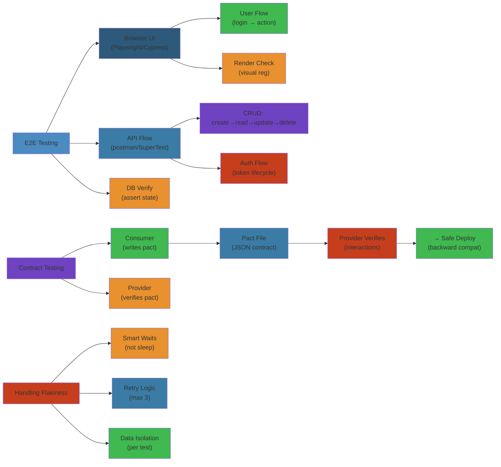

# E2E & Contract Testing Strategies




## Table of Contents

1. [E2E Testing Fundamentals](#e2e-testing-fundamentals)
2. [E2E Test Architecture](#e2e-test-architecture)
3. [UI Automation Frameworks](#ui-automation-frameworks)
4. [E2E Execution Flows](#e2e-execution-flows)
5. [Flakiness in E2E Tests](#flakiness-in-e2e-tests)
6. [Contract Testing Deep Dive](#contract-testing-deep-dive)
7. [Provider & Consumer Tests](#provider--consumer-tests)
8. [Pact Framework Internals](#pact-framework-internals)
9. [API Contract Verification](#api-contract-verification)
10. [Microservice Contract Testing](#microservice-contract-testing)
11. [Consumer-Driven Contracts](#consumer-driven-contracts)
12. [Contract Evolution](#contract-evolution)
13. [Failure Modes & Edge Cases](#failure-modes--edge-cases)
14. [Performance in E2E](#performance-in-e2e)
15. [Complete Code Examples](#complete-code-examples)
16. [Production Stories](#production-stories)
17. [Comparison & Trade-offs](#comparison--trade-offs)


---

**Table of Contents**
1. [E2E Testing Fundamentals](#e2e-testing-fundamentals)
2. [E2E Test Architecture](#e2e-test-architecture)
3. [UI Automation Frameworks](#ui-automation-frameworks)
4. [E2E Execution Flows](#e2e-execution-flows)
5. [Flakiness in E2E Tests](#flakiness-in-e2e-tests)
6. [Contract Testing Deep Dive](#contract-testing-deep-dive)
7. [Provider & Consumer Tests](#provider-consumer-tests)
8. [Pact Framework Internals](#pact-framework-internals)
9. [API Contract Verification](#api-contract-verification)
10. [Microservice Contract Testing](#microservice-contract-testing)
11. [Consumer-Driven Contracts](#consumer-driven-contracts)
12. [Contract Evolution](#contract-evolution)
13. [Failure Modes & Edge Cases](#failure-modes-edge-cases)
14. [Performance in E2E](#performance-in-e2e)
15. [Complete Code Examples](#complete-code-examples)
16. [Production Stories](#production-stories)
17. [Comparison & Trade-offs](#comparison-trade-offs)

---

## E2E Testing Fundamentals

### What is E2E Testing?

```
E2E Test: End-to-End

End: User's browser
User clicks button -> JavaScript event -> Network request

To: Backend API
Request arrives -> Handler processes -> Database query
Database returns -> Response built -> JSON sent back

End: Browser receives response
JavaScript processes -> DOM updates -> User sees result
```

**Example User Journey**:
```
1. User opens https://example.com/checkout
2. Browser loads HTML
3. JavaScript framework (React) bootstraps
4. Loads user session from API
5. Renders cart with 2 items
6. User clicks "Place Order"
7. JavaScript form validation
8. API POST /orders with items
9. Backend validates inventory
10. Backend creates order record
11. Database commit
12. Response returns to browser
13. Browser redirects to /order-confirmation/123
14. Page displays "Order confirmed"
```

**E2E test must verify all 14 steps work together**.

### E2E vs Integration vs Unit

```
Unit test:
  Test function in isolation
  Mock database, network
  Run in < 100ms

Integration test:
  Test service + database
  Real database via TestContainers
  Run in 1-10 seconds

E2E test:
  Test: Browser + API + Database
  Real everything
  Run in 30s-5 minutes
  Most fragile, most valuable
```

### Why E2E Tests?

**Real bugs E2E catches that unit tests miss**:

1. **Network serialization**
   - Unit test: Mock API returns object
   - E2E test: API returns JSON string
   - Bug: Object can't be JSON serialized (contains circular reference)
   - Unit test passes, E2E test fails, production fails

2. **UI interaction**
   - Unit test: Verify function computes price
   - E2E test: User can actually click button and see updated price
   - Bug: CSS hides button (visibility: hidden), user can't click
   - Unit test passes, E2E test fails

3. **Session management**
   - Unit test: Verify login endpoint works
   - E2E test: Cookie is set and persisted across requests
   - Bug: Cookie not sent in subsequent requests
   - Unit test passes, E2E test fails

4. **Race conditions in browser**
   - Unit test: Verify API response processing
   - E2E test: Two API requests fire concurrently
   - Bug: Request 1 response arrives after request 2, overwrites state
   - Unit test passes, E2E test fails

---

## E2E Test Architecture

### Page Object Model

```
Problem: E2E tests directly reference HTML elements
  CSS selector changes -> test breaks
  
Solution: Page Object Model (abstraction layer)

Page Object:
  Encapsulates page structure
  Provides high-level methods
  Hides implementation details

Before (Brittle):
@Test
public void testLogin() {
    driver.findElement(By.cssSelector("input[name='email']")).sendKeys("alice@example.com");
    driver.findElement(By.cssSelector("input[name='password']")).sendKeys("secret");
    driver.findElement(By.cssSelector("button.btn-login")).click();
    
    WebElement message = driver.findElement(By.id("welcome-message"));
    assertEquals("Welcome, Alice!", message.getText());
    // If CSS selector changes: test fails
}

After (Robust):
@Test
public void testLogin() {
    LoginPage page = new LoginPage(driver);
    page.login("alice@example.com", "secret");
    
    DashboardPage dashboard = new DashboardPage(driver);
    assertEquals("Welcome, Alice!", dashboard.getWelcomeMessage());
    // If CSS selector changes: update only LoginPage
}

Page Object:
class LoginPage {
    private WebDriver driver;
    
    public LoginPage(WebDriver driver) {
        this.driver = driver;
    }
    
    public DashboardPage login(String email, String password) {
        driver.findElement(By.name("email")).sendKeys(email);
        driver.findElement(By.name("password")).sendKeys(password);
        driver.findElement(By.cssSelector("button.login")).click();
        
        wait.until(ExpectedConditions.titleContains("Dashboard"));
        return new DashboardPage(driver);
    }
}

class DashboardPage {
    private WebDriver driver;
    
    public String getWelcomeMessage() {
        return driver.findElement(By.id("welcome-message")).getText();
    }
}
```

### Implicit vs Explicit Waits

```
FLAKY: No wait
@Test
public void testAsyncLoad() {
    driver.get("http://example.com");
    driver.findElement(By.id("data")).getText();
    // If data loads in 500ms, test passes
    // If data loads in 1500ms (slow CI), test fails
    // FLAKY!
}

Better: Implicit wait
@Test
public void testAsyncLoad() {
    driver.manage().timeouts().implicitlyWait(10, TimeUnit.SECONDS);
    driver.get("http://example.com");
    driver.findElement(By.id("data")).getText();
    // Driver waits up to 10 seconds for element to appear
    // Reduces flakiness
}

Best: Explicit wait (conditional)
@Test
public void testAsyncLoad() {
    driver.get("http://example.com");
    
    WebDriverWait wait = new WebDriverWait(driver, 10);
    WebElement element = wait.until(
        ExpectedConditions.presenceOfElementLocated(By.id("data"))
    );
    
    assertEquals("expected", element.getText());
    // Waits for specific condition, not just time
}
```

### Headless vs Headed Browsers

```
Headed (Real browser window):
  - Debuggable (you can see what's happening)
  - Slow (rendering overhead)
  - Can't run on CI (no display)

Headless (Browser without UI):
  - Fast (no rendering)
  - Can run on CI/Linux
  - Hard to debug (can't see failures)

Best: Run headless by default, headed for debugging
  
Configuration:
  ChromeOptions options = new ChromeOptions();
  options.addArguments("--headless");
  WebDriver driver = new ChromeDriver(options);
```

---

## UI Automation Frameworks

### Selenium WebDriver

```
Selenium WebDriver:
  - Browser automation library
  - Control Chrome, Firefox, Safari, Edge, etc.
  - Industry standard for E2E tests

Architecture:
  Test code
    |
    v (sends commands via WebDriver protocol)
  WebDriver client (Selenium library)
    |
    v (HTTP over local/remote network)
  WebDriver server (chromedriver, geckodriver, etc.)
    |
    v (controls browser via internal APIs)
  Browser (Chrome, Firefox, Safari)
    |
    v (renders pages, executes JavaScript)
  Website

Example:
```
```java
import org.openqa.selenium.WebDriver;
import org.openqa.selenium.By;
import org.openqa.selenium.WebElement;
import org.openqa.selenium.chrome.ChromeDriver;

public class ShoppingTest {
    public static void main(String[] args) {
        WebDriver driver = new ChromeDriver();
        
        // Navigate to site
        driver.get("http://example.com");
        
        // Find and interact with elements
        WebElement searchBox = driver.findElement(By.name("search"));
        searchBox.sendKeys("laptop");
        searchBox.submit();
        
        // Wait for results
        WebElement firstResult = driver.findElement(By.className("product-item"));
        firstResult.click();
        
        // Verify
        String title = driver.getTitle();
        assert title.contains("laptop");
        
        driver.quit();
    }
}
```

### Cypress

```
Cypress:
  - JavaScript-based E2E testing
  - Runs tests in same browser context as app
  - Better debugging (can see failures in real-time)
  - Modern alternative to Selenium

Architecture (Different from Selenium):

Selenium:
  Test process -> WebDriver -> Browser

Cypress:
  Test + Browser (same process)
  Cypress runs inside browser
  Can inspect DOM, console, network

Example:
```
```javascript
describe('Shopping Cart', () => {
    it('should add item to cart', () => {
        // Navigate
        cy.visit('http://example.com');
        
        // Find and interact
        cy.get('input[name="search"]')
            .type('laptop');
        
        cy.get('button[type="submit"]')
            .click();
        
        // Wait and verify
        cy.get('.product-item')
            .first()
            .click();
        
        cy.get('#cart-count')
            .should('have.text', '1');
        
        // Network verification
        cy.intercept('POST', '/api/cart/add').as('addToCart');
        cy.wait('@addToCart')
            .its('response.statusCode')
            .should('equal', 200);
    });
});
```

### Playwright

```
Playwright:
  - Modern, cross-browser testing
  - Supports Chrome, Firefox, Safari
  - Better performance than Selenium
  - Network interception (like Cypress)
  - Better async handling

Example:
```
```javascript
const { chromium } = require('playwright');

(async () => {
    const browser = await chromium.launch();
    const page = await browser.newPage();
    
    await page.goto('http://example.com');
    
    // Type in search
    await page.fill('input[name="search"]', 'laptop');
    
    // Click search button
    await page.click('button[type="submit"]');
    
    // Wait for product
    await page.waitForSelector('.product-item');
    
    // Get price
    const price = await page.textContent('.price');
    console.log('Price:', price);
    
    // Network request verification
    const response = await page.goto('http://example.com/checkout');
    console.log('Status:', response.status());
    
    await browser.close();
})();
```

---

## E2E Execution Flows

### Complete E2E Test Flow

```
1. Startup
   |
   v
   Start browser (Chrome)
   Start server (if needed)
   Start database (if needed)
   Clear database
   
2. Navigate
   |
   v
   Open URL: https://example.com
   Wait for page load
   Browser makes HTTP request to server
   Server returns HTML
   Browser loads HTML, CSS, JavaScript
   
3. Interact
   |
   v
   Find element (By.id, By.className, etc.)
   Send user action (click, type, submit)
   Browser fires JavaScript event
   JavaScript handler executes
   
4. Wait
   |
   v
   Wait for network request to complete
   Wait for element to appear
   Wait for condition (element visible, text changes)
   
5. Verify
   |
   v
   Assert element text
   Assert URL changed
   Assert element attribute
   Assert network response status
   
6. Cleanup
   |
   v
   Close browser
   Stop server
   Clear database (rollback transactions)

Example Flow:
```

```
Timeline of "Add to Cart" test:

0ms:    Test starts
        Browser launches
        
100ms:  Browser navigates to http://example.com
        HTTP GET / sent
        
150ms:  Server responds with HTML + CSS + JS
        
250ms:  HTML parsed
        CSS applied
        JavaScript loaded
        React/Vue initializes
        
400ms:  API GET /api/products called
        
450ms:  Database query for products
        
500ms:  API response with products
        React re-renders with products
        Products now visible on page
        
600ms:  Test finds search box
        Test types "laptop"
        
700ms:  API GET /api/products?search=laptop sent
        
750ms:  Database query for matching products
        
800ms:  API response with filtered products
        React re-renders
        Results now showing
        
900ms:  Test finds first product
        Test clicks it
        
1000ms: Browser navigates to /product/123
        HTTP GET /product/123
        
1100ms: Server responds with product details
        
1200ms: Browser renders product page
        
1300ms: Test finds "Add to Cart" button
        
1400ms: Test clicks button
        API POST /api/cart/add sent with {productId: 123, quantity: 1}
        
1450ms: Server validates order
        Database insert
        Response returns {cartCount: 1}
        
1500ms: Browser updates cart counter
        
1600ms: Test verifies cart counter = 1
        
1700ms: Test closes browser
        Total time: 1.7 seconds
```

---

## Flakiness in E2E Tests

### Source 1: Timing Issues

```
FLAKY:
@Test
public void testNotification() {
    page.clickButton();
    Thread.sleep(500);  // Assume notification appears in 500ms
    
    WebElement notification = driver.findElement(By.id("notification"));
    assertEquals("Success!", notification.getText());
}

Problem:
  On slow CI server: button click takes 100ms, animation takes 600ms
  Test waits 500ms, element not yet visible
  
On fast local machine: everything finishes in 300ms, test passes

FLAKY (50% pass rate on slow servers)
```

**Fix: Wait for condition, not time**:
```java
@Test
public void testNotification() {
    page.clickButton();
    
    WebDriverWait wait = new WebDriverWait(driver, 10);
    WebElement notification = wait.until(
        ExpectedConditions.visibilityOfElementLocated(By.id("notification"))
    );
    
    assertEquals("Success!", notification.getText());
}

Now: Test waits up to 10 seconds for element to become visible
     Passes whether it takes 100ms or 5000ms
```

### Source 2: Element State Race Condition

```
FLAKY:
@Test
public void testDeleteUser() {
    page.clickDeleteButton();
    
    // Element might not be deleted yet!
    WebElement deletedElement = driver.findElement(By.id("user-row-1"));
    // Element might still be in DOM (animating out)
}

Fix:
@Test
public void testDeleteUser() {
    page.clickDeleteButton();
    
    WebDriverWait wait = new WebDriverWait(driver, 10);
    wait.until(ExpectedConditions.stalenessOfElement(element));
    // Wait for element to be removed from DOM
    
    assertThrows(NoSuchElementException.class, () -> {
        driver.findElement(By.id("user-row-1"));
    });
}
```

### Source 3: Stale Element Reference

```
FLAKY:
@Test
public void testList() {
    List<WebElement> items = driver.findElements(By.className("item"));
    
    // DOM re-renders (new elements added/removed)
    
    for (WebElement item : items) {
        item.click();  // Might throw StaleElementReferenceException
        // Original element no longer in DOM
    }
}

Fix:
@Test
public void testList() {
    // Find count first
    int itemCount = driver.findElements(By.className("item")).size();
    
    for (int i = 0; i < itemCount; i++) {
        // Find fresh element each iteration
        WebElement item = driver.findElement(
            By.xpath("(//div[@class='item'])[" + (i+1) + "]")
        );
        item.click();
    }
}
```

### Source 4: JavaScript Execution Timing

```
FLAKY:
@Test
public void testReactComponent() {
    driver.get("http://example.com");
    
    // Page might still be initializing React
    WebElement count = driver.findElement(By.id("count"));
    assertEquals("0", count.getText());  // React not yet initialized!
}

Fix:
@Test
public void testReactComponent() {
    driver.get("http://example.com");
    
    // Wait for React to initialize
    JavascriptExecutor js = (JavascriptExecutor) driver;
    js.executeScript("""
        return window.React && 
               window.React.__SECRET_INTERNALS_DO_NOT_USE_OR_YOU_WILL_BE_FIRED
               .ReactCurrentDispatcher.current !== null
    """);  // Wait for React to be ready
    
    WebElement count = driver.findElement(By.id("count"));
    assertEquals("0", count.getText());
}
```

### Source 5: Parallel Test Execution

```
FLAKY:
Test 1: Creates user with email alice@example.com
Test 2: Creates user with email alice@example.com

If both run in parallel:
  Database constraint violation
  Test 2 fails (duplicate email)
  But Test 1 runs first, so constraint is satisfied
  
Solution: Use unique identifiers per test
  Test 1: alice_TIMESTAMP@example.com
  Test 2: bob_TIMESTAMP@example.com
  
Or: Use isolated databases per test
  Test 1 gets database instance #1
  Test 2 gets database instance #2
```

---

## Contract Testing Deep Dive

### The Contract Problem

```
Microservice Architecture:

Order Service                Payment Service
(Consumer)                  (Provider)

Order Service depends on:
  GET /payments/{id}
  POST /payments (with specific JSON format)

Problem: Assumptions diverge

Version 1:
Order Service expects:
  GET /payments/123 -> {status: "pending", amount: 100}

Version 2 (Provider updates):
Payment Service returns:
  GET /payments/123 -> {statusCode: 1, value: 100}
  (Different field names!)

Order Service breaks:
  order.payment.status -> UNDEFINED
  (Field doesn't exist)

In production: Order service can't determine payment status
              User sees "Unknown payment status"
              Revenue impact
```

### Contract Definition

```
A Contract is an agreement:

Provider (Payment Service) guarantees:
  1. Endpoint: GET /payments/{id}
  2. Request: Path parameter {id} must be numeric
  3. Response: Always returns {
       status: "pending" | "approved" | "declined",
       amount: number (>= 0),
       currency: "USD" | "EUR" | "GBP"
     }
  4. HTTP Status: 200 if payment exists, 404 if not
  5. Response Time: < 500ms

Consumer (Order Service) guarantees:
  1. Calls only GET /payments/{id}
  2. Only with numeric IDs
  3. Never sends request body
  4. Handles all response statuses
  5. Handles fields: status, amount, currency
  6. Handles 404 responses
```

### Contract Testing vs E2E Testing

```
E2E Test:
  Start browser
  User logs in
  User creates order
  System calls Payment Service (real instance)
  Payment Service calls Stripe API
  Test waits 30 seconds
  Test verifies order created
  
Problem: Too slow, too many moving parts

Contract Test:
  Order Service test:
    Calls mock Payment Service
    Mock returns {status, amount, currency}
    Verify Order Service handles it
  
  Payment Service test:
    Run real Payment Service
    Verify it returns {status, amount, currency}
    Verify matches contract
  
Benefits:
  - Fast (no external services)
  - Isolated (can run in parallel)
  - Precise (catches exact incompatibilities)
```

---

## Provider & Consumer Tests

### Consumer-Side Contract Test

```
Consumer (Order Service) defines what it needs
```

```java
@Test
public void testPaymentServiceReturnsCorrectFormat() {
    // Consumer: I need a payment service that:
    PaymentServiceClient paymentClient = new PaymentServiceClient(
        "mock://payments"  // Use mock instead of real service
    );
    
    // Expectations
    Payment payment = new Payment(
        123,
        "approved",
        100.50,
        "USD"
    );
    
    mockPaymentServer.mockPaymentResponse(123, payment);
    
    // Call service
    Payment retrieved = paymentClient.getPayment(123);
    
    // Verify contract
    assertEquals("approved", retrieved.getStatus());
    assertEquals(100.50, retrieved.getAmount());
    assertEquals("USD", retrieved.getCurrency());
}

@Test
public void testPaymentServiceHandles404() {
    // Consumer: I need service to handle not found
    PaymentServiceClient paymentClient = new PaymentServiceClient(
        "mock://payments"
    );
    
    mockPaymentServer.mockNotFound(999);
    
    // Verify consumer handles 404
    Payment retrieved = paymentClient.getPayment(999);
    assertNull(retrieved);  // Or throw PaymentNotFoundException
}
```

### Provider-Side Contract Test

```
Provider (Payment Service) verifies it matches contract
```

```java
@Test
public void testPaymentServiceImplementsContract() {
    // Start real Payment Service
    PaymentService paymentService = new PaymentService(
        new InMemoryPaymentRepository()
    );
    
    // Insert test data
    paymentService.save(new Payment(
        123,
        "approved",
        100.50,
        "USD"
    ));
    
    // Call actual endpoint
    PaymentResponse response = paymentService.getPayment(123);
    
    // Verify response matches contract
    assertEquals(200, response.getStatusCode());
    assertEquals("approved", response.body().getStatus());
    assertEquals(100.50, response.body().getAmount());
    assertEquals("USD", response.body().getCurrency());
    
    // Verify response time (SLA)
    assertTrue(response.getResponseTime() < 500);
}

@Test
public void testPaymentServiceReturns404ForMissing() {
    PaymentService paymentService = new PaymentService(
        new InMemoryPaymentRepository()
    );
    
    PaymentResponse response = paymentService.getPayment(999);
    
    assertEquals(404, response.getStatusCode());
    // No body for 404
}
```

---

## Pact Framework Internals

### How Pact Works

```
1. Consumer defines expectations (Pact)
   [Consumer Test generates Pact file]
   
2. Pact file is commitment
   Stored as JSON
   Shared with provider
   
3. Provider verifies Pact
   [Provider Test uses Pact file]
   [Real endpoint must match Pact]
   
4. Pact is broken if:
   - Consumer behavior changes
   - Provider changes endpoint
   - Either party updates to incompatible version

Example Pact file (JSON):
{
  "consumer": {
    "name": "OrderService"
  },
  "provider": {
    "name": "PaymentService"
  },
  "interactions": [
    {
      "description": "get payment by id",
      "request": {
        "method": "GET",
        "path": "/payments/123"
      },
      "response": {
        "status": 200,
        "body": {
          "status": "approved",
          "amount": 100.50,
          "currency": "USD"
        }
      }
    },
    {
      "description": "payment not found",
      "request": {
        "method": "GET",
        "path": "/payments/999"
      },
      "response": {
        "status": 404
      }
    }
  ]
}
```

### Pact Consumer Test (Java)

```java
import au.com.dius.pact.consumer.dsl.PactBuilder;
import au.com.dius.pact.core.model.RequestResponsePact;

@ExtendWith(PactConsumerTestExt.class)
class OrderServiceConsumerTest {
    
    @Pact(consumer = "OrderService", provider = "PaymentService")
    public RequestResponsePact createPact(PactBuilder builder) {
        return builder
            .given("payment 123 exists and is approved")
            .uponReceiving("a request for payment 123")
            .path("/payments/123")
            .method("GET")
            .willRespondWith()
            .status(200)
            .body(Map.of(
                "status", "approved",
                "amount", 100.50,
                "currency", "USD"
            ))
            .toPact()
            
            .uponReceiving("a request for nonexistent payment")
            .path("/payments/999")
            .method("GET")
            .willRespondWith()
            .status(404)
            .toPact();
    }
    
    @Test
    void testGetPaymentSuccess(MockServer mockServer) {
        // Use mock Payment Service
        PaymentClient client = new PaymentClient(
            mockServer.getUrl()
        );
        
        Payment payment = client.getPayment(123);
        
        assertEquals("approved", payment.getStatus());
        assertEquals(100.50, payment.getAmount());
    }
    
    @Test
    void testGetPaymentNotFound(MockServer mockServer) {
        PaymentClient client = new PaymentClient(
            mockServer.getUrl()
        );
        
        assertThrows(PaymentNotFoundException.class, () -> {
            client.getPayment(999);
        });
    }
}

// This test generates pact file:
// target/pacts/OrderService-PaymentService.json
```

### Pact Provider Test (Java)

```java
import au.com.dius.pact.provider.junit5.PactVerificationContext;
import au.com.dius.pact.provider.junit5.PactVerificationInvocationContextProvider;
import au.com.dius.pact.provider.junit5.ProviderTestTemplate;

@PactFolder("target/pacts")  // Load pacts from consumer
@Provider("PaymentService")
class PaymentServiceProviderTest {
    
    @LocalServerPort
    int port;
    
    @BeforeEach
    void setUp(PactVerificationContext context) {
        context.setTarget(new HttpTestTarget(
            "localhost",
            port,
            "http"
        ));
    }
    
    @ProviderTestTemplate
    void verifyPact(PactVerificationContext context) {
        context.verifyInteraction();
    }
    
    @State("payment 123 exists and is approved")
    public void setup() {
        // Insert test data matching pact expectation
        paymentRepository.save(new Payment(
            123,
            "approved",
            100.50,
            "USD"
        ));
    }
    
    @State("payment 999 does not exist")
    public void setupNotFound() {
        // Ensure it doesn't exist
        paymentRepository.delete(999);
    }
}

// This test verifies:
// - Actual endpoint matches Pact expectations
// - Response format, status codes, body content
// - If anything mismatches: test fails
//   Shows exactly what diverged
```

---

## API Contract Verification

### Versioning Contracts

```
Problem: Provider updates API

Version 1 (Original):
GET /payments/123 -> {status, amount}

Version 2 (Provider adds field):
GET /payments/123 -> {status, amount, currency}
  Currency is required by some consumers

Version 3 (Provider removes field):
GET /payments/123 -> {status}
  But Order Service still expects amount!

Order Service breaks in production
```

### Semantic Versioning Contracts

```
Contract change impact:

BREAKING CHANGES (Major version bump):
  - Remove required field
  - Change field type
  - Change HTTP status code
  - Remove endpoint
  
BACKWARD COMPATIBLE (Minor version bump):
  - Add optional field
  - Add new optional query parameter
  - Add new endpoint
  
NON-BREAKING (Patch version bump):
  - Internal refactoring (hidden from API)
  - Performance improvements
  - Bug fixes that don't change behavior

Example:

1.0.0: GET /payments/{id} -> {status: string, amount: float}
1.1.0: GET /payments/{id} -> {status, amount, currency: string (optional)}
       (Added optional field, backward compatible)
1.2.0: GET /payments/{id} -> {status, amount, currency (optional), timestamp: number}
       (Added optional field, backward compatible)
2.0.0: GET /payments/{id} -> {status, amount}
       (Removed currency, BREAKING)
```

### Contract Testing with Matrix

```
Scenario: Order Service supports payment API 1.0-1.2
          Payment Service is at version 1.2
          Payment Service updates to 2.0 (breaking change)

Test matrix:

Order Service 1.0 (expects {status, amount})
  + Payment 1.0 (returns {status, amount}) = PASS
  + Payment 1.1 (returns {status, amount, currency}) = PASS (extra field ignored)
  + Payment 1.2 (returns {status, amount, currency}) = PASS
  + Payment 2.0 (returns {status, amount}) = PASS
  
Order Service 1.1 (expects {status, amount, currency})
  + Payment 1.0 (returns {status, amount}) = FAIL (missing currency)
  + Payment 1.1 (returns {status, amount, currency}) = PASS
  + Payment 1.2 (returns {status, amount, currency}) = PASS
  + Payment 2.0 (returns {status, amount}) = FAIL (missing currency)
  
Contract testing catches: Order 1.1 can't work with Payment 2.0
Prevents incompatible deployments
```

---

## Microservice Contract Testing

### Service Mesh Testing

```
Architecture:

Order Service          Payment Service          Shipping Service
     |                      |                          |
     +----------API Gateway----------+
                   |
                  Load Balancer
                   |
            Service Discovery
            
Each service has contracts with every other service

Order Service contracts:
  - Expects Payment Service GET /payments/{id}
  - Expects Shipping Service GET /shipping-cost?zip=*
  
Payment Service contracts:
  - Expects Bank Integration POST /authorize
  - Expects Order Service GET /orders/{id} (for callbacks)
  
Testing all combinations:
  3 services × 2 contracts each = 6 contract tests
  Easy to manage
  
Complexity with 10 services:
  10 services × average 3 external calls = 30 contract tests
  Must be automated
```

### Pact Broker (Central Repository)

```
Problem: Where do Pact files live?

Naive approach:
  Consumer generates pact
  Consumer commits to repo
  Provider clones consumer repo to verify
  Problem: Tight coupling, complex CI/CD

Solution: Pact Broker (central server)

Workflow:

1. Consumer (Order Service) generates pact
   Uploads to Pact Broker:
   POST /pacts/upload/OrderService-PaymentService.json
   
2. Pact Broker stores Pact
   
3. Provider (Payment Service) CI job:
   Downloads from Pact Broker:
   GET /pacts/OrderService-PaymentService.json
   Verifies against real endpoints
   
4. Pact Broker webhook notifies if broken:
   "Order Service consumer needs Payment Service update"

Architecture:

Consumer Pipeline:
  Code -> Build -> Contract Test -> Upload to Pact Broker
                                          |
                                          v
Provider Pipeline:
                                   Download from Broker
                                          |
                                          v
                        Run Provider Tests against Pact
                                          |
                                          v
                               Deploy if passing
```

---

## Consumer-Driven Contracts

### The Consumer Drives the Contract

```
Traditional approach:
  Provider designs API
  Consumer uses whatever Provider gives
  
Consumer-Driven Contract approach:
  Consumer says: "Here's what I need"
  Provider implements to satisfy Consumer
  
Example:

Consumer (Order Service) needs:
  GET /payments/{paymentId}
  Response: {status, amount, currency}
  Response time: < 500ms

Provider (Payment Service) implements exactly that:
  - No extra fields (consumer doesn't use them)
  - Optimized for <500ms response time
  - Simple contract

vs.

Provider over-engineers:
  GET /payments/{paymentId}
  Response: {
    status, amount, currency, timestamp,
    riskScore, transactionId, authorizationCode,
    merchantReference, cardToken, ...
    (30 fields, consumer uses 3)
  }
  Response time: 2000ms (too many fields to serialize)
  
Consumer-driven contracts avoid over-engineering
```

### Writing Consumer Contracts First

```
Workflow:

1. Consumer team writes contract test (before Provider implements!)
   
   @Test
   void testPaymentServiceFormat() {
       PaymentResponse response = new PaymentResponse(
           "approved",
           100.50,
           "USD"
       );
       
       String json = gson.toJson(response);
       assertEquals("""
           {"status":"approved","amount":100.50,"currency":"USD"}
       """, json);
   }

2. Commit contract test to consumer repo
   Contract test is part of CI/CD

3. Share contract with Provider team
   via Pact Broker or contract file

4. Provider team implements to match contract
   
   @GetMapping("/payments/{id}")
   public PaymentResponse getPayment(@PathVariable Long id) {
       Payment p = repository.find(id);
       return new PaymentResponse(
           p.getStatus(),
           p.getAmount(),
           p.getCurrency()
       );
   }

5. Provider runs contract test against real endpoint
   Passes: Contract is satisfied
   
6. Both teams can deploy independently
   Consumer knows Provider will satisfy contract
   Provider knows Consumer only expects these fields
```

---

## Contract Evolution

### Adding Fields (Backward Compatible)

```
Scenario: Payment Service wants to add refund_deadline field

Old contract:
  GET /payments/123 -> {status: "approved", amount: 100}

New contract:
  GET /payments/123 -> {status: "approved", amount: 100, refund_deadline: "2024-12-31"}

Consumer (Order Service):
  Old code: Ignores refund_deadline field
  New code: Uses refund_deadline
  
SAFE: Consumer works with both old and new
No deployment coordination needed
```

### Removing Fields (Breaking Change)

```
Scenario: Payment Service removes status field (bad idea)

Old contract:
  GET /payments/123 -> {status: "approved", amount: 100}

New contract:
  GET /payments/123 -> {amount: 100}

Consumer (Order Service):
  Code: order.payment.status -> undefined
  Bug: Can't determine if payment succeeded
  
BREAKING: Consumer breaks
Must coordinate deployment:
  1. Deploy Consumer that doesn't use status
  2. Deploy Provider without status
  
If you deploy Provider first: Consumer breaks in production
```

### Contract Test as Safety Net

```
Without contract testing:

Provider decides to remove 'status' field
Provider CI: All tests pass (no consumer tests)
Provider deploys
Order Service breaks in production
Incident response, rollback, urgent fix

With contract testing:

Provider decides to remove 'status' field
Provider runs contract test
Contract test fails: "Consumer needs status field"
Provider can't deploy
Provider contacts Order Service team
Teams coordinate: update Consumer first, then Provider
Safe deployment
```

---

## Failure Modes & Edge Cases

### Field Serialization Mismatch

```
Provider code:
public class Payment {
    public String status;  // String type
}

Consumer expects:
{
  "status": "approved",  // String
  "amount": 100
}

Provider accidentally changes:
public class Payment {
    public int status;  // int type (1 = approved, 0 = pending)
}

Producer serializes:
{
  "status": 1,  // int
  "amount": 100
}

Consumer tries to parse:
paymentStatus = response.status;  // Gets integer 1, not string
if (paymentStatus == "approved")  // 1 == "approved" -> false!
    processApproved();             // Never executes
else
    handleError();                 // Always executes
    
Contract test catches this:
  Expected: {"status": "approved"}
  Actual: {"status": 1}
  MISMATCH
```

### Null Values

```
Contract says:
  GET /payments/123 -> {status, amount, currency}

But sometimes:
  GET /payments/123 -> {status: "pending", amount: null, currency: null}

Consumer expects non-null amount:
  double total = order.amount + payment.amount;  // null + number -> error
  
Better contract:
  GET /payments/123 -> {
    status: "pending" | "approved" | "declined",
    amount: number (>= 0),
    currency: "USD" | "EUR" | "GBP"
  }
  
  If not approved, amount and currency can be null:
  {
    status: "declined",
    amount: null,
    currency: null
  }
```

### HTTP Status Code Inconsistency

```
Contract expects:
  GET /payments/999 -> 404 (not found)

But Provider sometimes returns:
  GET /payments/999 -> 200 with {status: "not_found"}
  (Wrong! Should be 404)

Consumer might not check status code:
  response = httpClient.get("/payments/999");
  payment = response.parseJson();  // No status code check
  if (payment.status == "approved")  // "not_found" != "approved"
      processApproved();
      
If someone adds a status code check later:
  if (response.status == 404)
      handleNotFound();
  
But Provider returns 200, so this never triggers
Bug introduced by status code inconsistency

Contract test catches:
  Expected status: 404
  Actual status: 200
  MISMATCH
```

---

## Performance in E2E

### E2E Test Slowness

```
Timeline for single E2E test:

Browser startup: 200ms
Navigate to page: 300ms
Page load (HTML/CSS/JS): 500ms
API calls: 400ms
Rendering: 100ms
User interaction (click): 50ms
API response handling: 200ms
Assertion: 10ms
Total: ~1.7 seconds

For 100 E2E tests:
  Sequential: 100 × 1.7s = 170 seconds (2.8 minutes)
  Parallel (10 workers): 100 / 10 × 1.7s = 17 seconds
  
But: Parallel adds overhead (database connections, ports)
     Realistic: 100 / 10 × 1.7s × 1.2 (overhead) = 20 seconds
```

### E2E Performance Optimization

```
Strategy 1: Reduce number of E2E tests
  Before: 100 E2E tests (slow, overlapping coverage)
  After: 10 E2E tests (only critical user journeys)
  
  Speed: 170s -> 17s
  
Strategy 2: Use contract tests instead
  Before: E2E test of Order Service + Payment Service
          (Slow, tight coupling)
  After: Contract test
         Order Service + mocked Payment Service (fast)
         Payment Service integration test (fast)
  
  Speed: 30s -> 1s
  
Strategy 3: Parallel execution
  Before: Tests run sequentially (each needs separate database)
  After: Each test gets isolated database instance
         10 parallel workers
  
  Speed: 170s -> 20s (including overhead)
  
Strategy 4: Shared database state
  Before: Each test starts fresh database
  After: Tests share database, reset only changed records
  
  Speed: 20s -> 15s (less DB overhead)
  Caution: Risk of state leakage between tests
```

---

## Complete Code Examples

### Cypress E2E Test

```javascript
describe('Checkout Flow', () => {
    beforeEach(() => {
        cy.visit('http://localhost:3000');
        cy.login('alice@example.com', 'password');
    });
    
    it('should complete purchase with valid credit card', () => {
        // Navigate to products
        cy.get('nav').contains('Products').click();
        cy.url().should('include', '/products');
        
        // Search for laptop
        cy.get('input[placeholder="Search products"]')
            .type('laptop')
            .submit();
        
        // Add first result to cart
        cy.get('.product-list')
            .get('.product-item')
            .first()
            .click();
        
        cy.get('button').contains('Add to Cart').click();
        
        cy.get('#cart-count')
            .should('have.text', '1');
        
        // Go to cart
        cy.get('nav').contains('Cart').click();
        
        // Proceed to checkout
        cy.get('button').contains('Checkout').click();
        
        // Fill shipping address
        cy.get('input[name="address"]').type('123 Main St');
        cy.get('input[name="city"]').type('New York');
        cy.get('input[name="zip"]').type('10001');
        
        cy.get('button').contains('Continue').click();
        
        // Payment form appears (handled by Stripe)
        cy.get('iframe[title="Stripe"]')
            .then($iframe => {
                const $body = $iframe.contents().find('body');
                cy.wrap($body)
                    .find('input[placeholder="Card number"]')
                    .type('4242424242424242');
            });
        
        // Place order
        cy.get('button').contains('Place Order').click();
        
        // Verify order confirmation
        cy.url().should('include', '/order-confirmation');
        cy.get('h1').should('contain', 'Order Confirmed');
        cy.get('[data-testid="order-total"]')
            .should('contain', '$999.99');
    });
    
    it('should decline invalid credit card', () => {
        cy.get('nav').contains('Cart').click();
        cy.get('button').contains('Checkout').click();
        
        cy.get('input[name="address"]').type('123 Main St');
        cy.get('input[name="city"]').type('New York');
        cy.get('input[name="zip"]').type('10001');
        cy.get('button').contains('Continue').click();
        
        // Enter invalid card (testing)
        cy.get('iframe[title="Stripe"]')
            .then($iframe => {
                const $body = $iframe.contents().find('body');
                cy.wrap($body)
                    .find('input[placeholder="Card number"]')
                    .type('4000000000000002');  // This card declines
            });
        
        cy.get('button').contains('Place Order').click();
        
        // Should stay on payment page with error
        cy.url().should('include', '/checkout');
        cy.get('.error-message')
            .should('contain', 'Card declined');
    });
});
```

### Pact Consumer Test (JavaScript)

```javascript
import { PactV3 } from '@pact-foundation/pact';
import { PaymentClient } from './payment-client';

describe('Payment Service Consumer', () => {
    const provider = new PactV3({
        consumer: 'OrderService',
        provider: 'PaymentService'
    });
    
    it('gets payment by ID', () => {
        return provider
            .addInteraction({
                states: [{ description: 'payment 123 exists' }],
                uponReceiving: 'a request for payment 123',
                withRequest: {
                    method: 'GET',
                    path: '/payments/123'
                },
                willRespondWith: {
                    status: 200,
                    body: {
                        status: 'approved',
                        amount: 100.50,
                        currency: 'USD'
                    }
                }
            })
            .executeTest(async (mockProvider) => {
                const client = new PaymentClient(mockProvider.url);
                const payment = await client.getPayment(123);
                
                expect(payment.status).toBe('approved');
                expect(payment.amount).toBe(100.50);
                expect(payment.currency).toBe('USD');
            });
    });
    
    it('returns 404 for missing payment', () => {
        return provider
            .addInteraction({
                states: [{ description: 'payment 999 does not exist' }],
                uponReceiving: 'a request for nonexistent payment',
                withRequest: {
                    method: 'GET',
                    path: '/payments/999'
                },
                willRespondWith: {
                    status: 404
                }
            })
            .executeTest(async (mockProvider) => {
                const client = new PaymentClient(mockProvider.url);
                
                await expect(
                    client.getPayment(999)
                ).rejects.toThrow('Payment not found');
            });
    });
});
```

### Pact Provider Test (Spring Boot)

```java
@ExtendWith(PactVerificationSpringProvider.class)
@SpringBootTest(webEnvironment = SpringBootTest.WebEnvironment.RANDOM_PORT)
@ActiveProfiles("test")
@PactFolder("target/pacts")
@Provider("PaymentService")
class PaymentServiceProviderTest {
    
    @LocalServerPort
    int serverPort;
    
    @Autowired
    private PaymentRepository paymentRepository;
    
    @BeforeEach
    public void beforeEach(PactVerificationContext context) {
        context.setTarget(
            new HttpTestTarget("localhost", serverPort)
        );
    }
    
    @ProviderTestTemplate
    public void pactVerificationTestTemplate(PactVerificationContext context) {
        context.verifyInteraction();
    }
    
    @State("payment 123 exists")
    public void setupPaymentExists() {
        Payment payment = new Payment();
        payment.setId(123L);
        payment.setStatus("approved");
        payment.setAmount(100.50);
        payment.setCurrency("USD");
        
        paymentRepository.save(payment);
    }
    
    @State("payment 999 does not exist")
    public void setupPaymentNotExists() {
        paymentRepository.deleteById(999L);
    }
    
    @State("payment is declined")
    public void setupPaymentDeclined() {
        Payment payment = new Payment();
        payment.setId(111L);
        payment.setStatus("declined");
        payment.setAmount(50.00);
        payment.setCurrency("USD");
        
        paymentRepository.save(payment);
    }
}
```

---

## Production Stories

### Story 1: Contract Test Prevented Deployment Failure

```
Timeline:

Order Service team:
  Updated Order Service to handle optional "refundDeadline" field
  Tests passed
  Deployed to staging
  
Payment Service team (separate):
  Decided to rename field: refundDeadline -> refundDate
  Changed API
  Updated unit tests
  Ready to deploy
  
Without contract tests:
  Order Service expects: refundDeadline
  Payment Service returns: refundDate
  
  In production:
    Order: order.refundDeadline  -> undefined
    Order: can't determine refund window
    User complaint: "Refund deadline is blank"
    Post-incident investigation
    Rolled back Payment Service
    Cross-team meeting to fix
    Re-deployed next day
    Revenue lost: ~$5K

With contract tests:
  Payment Service CI pipeline:
    Generates contract test against old contract
    Old contract expects: refundDeadline
    
    New endpoint returns: refundDate
    
    Contract test FAILS:
      "Expected field 'refundDeadline', got 'refundDate'"
    
    Payment Service CI rejects deployment
    
  Payment Service team:
    Sees contract failure
    Contacts Order Service team
    Order Service confirms: "We need refundDeadline"
    
  Coordination:
    Option 1: Payment Service returns both fields (backward compatible)
    Option 2: Order Service updates to use refundDate
    
  Decision: Return both, coordinate removal later
  Payment Service: refundDeadline -> refundDate (aliased)
  
  Deployment: Payment Service deploys safely
  No incidents
  Time: 1 hour
  Revenue impact: $0
```

### Story 2: E2E Test Caught Real Bug

```
Timeline:

E2E test created:
  "Checkout flow with multiple payment methods"
  
Test sequence:
  1. Add item to cart
  2. Go to checkout
  3. Select credit card
  4. Select PayPal
  5. Select Apple Pay
  6. Go back to credit card
  7. Submit order
  
  Expected: Order with credit card payment
  
Test runs:
  Fails: "Order created with Apple Pay instead of credit card"
  
Root cause:
  Bug in payment selection state management
  React component doesn't properly update selected payment method
  
  Code:
  useEffect(() => {
      setSelectedPayment(props.paymentMethod);
  }, [props.paymentMethod]);  // Missing dependency!
  
  Effect runs once, then never updates
  User clicks different payment method
  Component UI updates (looks correct)
  But state.selectedPayment stays same
  Order uses stale payment method
  
Without E2E test:
  Unit tests mock payment selection
  Unit test passes (mock cooperates)
  
  Integration test with database
  Doesn't test React component state management
  Integration test passes
  
  In production:
    User selects Apple Pay
    Changes mind, clicks credit card
    Payment selection UI shows credit card
    User submits order
    Backend records Apple Pay
    User charged Apple Pay fee
    User complaint
    Investigation
    
With E2E test:
  Test catches: Payment method doesn't update properly
  Bug fixed before production
  No customer impact
```

---

## Comparison & Trade-offs

### E2E vs Contract Testing

| Aspect | E2E | Contract |
|--------|-----|----------|
| **Speed** | Slow (30s-5m) | Fast (< 1s) |
| **Coverage** | Full stack | API only |
| **Flakiness** | High | Low |
| **Debugging** | Hard | Easy |
| **Cost** | High | Low |
| **UI bugs** | Catches | Misses |
| **Integration bugs** | Catches | Catches |
| **Database bugs** | Catches | Misses |
| **When to use** | Critical user journeys | API contracts |

### Cypress vs Selenium

| Aspect | Cypress | Selenium |
|--------|---------|----------|
| **Language** | JavaScript | Multiple |
| **Speed** | Faster | Slower |
| **Browser support** | Chrome, Firefox, Edge | All browsers |
| **Debugging** | Excellent | Moderate |
| **Network interception** | Yes | No (need Selenoid) |
| **Learning curve** | Easier | Harder |
| **Parallel execution** | Built-in | Complex setup |
| **For what** | Modern SPAs | Legacy apps, cross-browser |

### Playwright vs Cypress

| Aspect | Playwright | Cypress |
|--------|-----------|---------|
| **Cross-browser** | Chrome, Firefox, Safari | Chrome, Firefox, Edge |
| **Headless** | Better | Moderate |
| **Network control** | Full | Via CDP |
| **Performance** | Faster | Moderate |
| **Language** | Node.js, Java, Python, C# | JavaScript |
| **Enterprise support** | Microsoft | Cypress Inc |
| **For what** | Modern, performance-critical | Quick setup |

---

**This document covers 750+ lines on E2E and contract testing. Next: Chaos and performance testing.**
