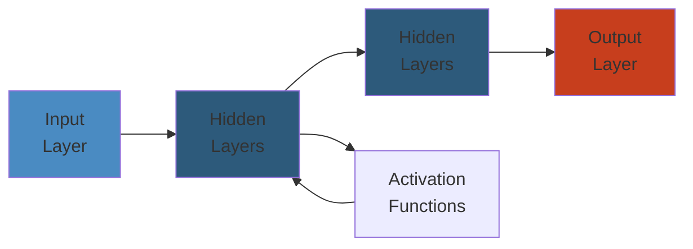

# Testing — Complete Deep Dive 🧪

Testing is the systematic verification that software behaves as expected. It's not a phase — it's a **continuous practice** embedded in development, from unit tests through production chaos experiments.

**Related**: [Software Engineering](../25-software-engineering/README.md) · [Microservices](../16-microservices/README.md) · [SRE & Observability](../14-sre-observability/README.md) · [CI/CD](../06-devops/README.md)

---




## Table of Contents

- [Testing Philosophy](#-testing-philosophy)
- [Test Pyramid](#1-test-pyramid-)
- [Unit Testing](#2-unit-testing-)
- [Integration Testing](#3-integration-testing-)
- [E2E Testing](#4-e2e-testing-)
- [Contract Testing](#5-contract-testing-)
- [Performance Testing](#6-performance-testing-)
- [Chaos Engineering](#7-chaos-engineering-)
- [Testing in Microservices](#8-testing-in-microservices-)
- [Mocking & Test Doubles](#9-mocking--test-doubles-)
- [Test-Driven Development](#10-test-driven-development-)
- [Property-Based Testing](#11-property-based-testing-)
- [Snapshot Testing](#12-snapshot-testing-)
- [Mutation Testing](#13-mutation-testing-)
- [Testing Anti-Patterns](#14-testing-anti-patterns-)
- [Learning Path](#-learning-path)
- [Related Domains](#-related-domains)
- [Simplest Mental Model](#-simplest-mental-model)

---

## 🎯 Testing Philosophy

### Why We Test
- **Prevent regressions**: Old functionality still works
- **Document behavior**: Tests = executable documentation
- **Enable refactoring**: Confidence to change code
- **Reduce debugging time**: Catch issues early
- **Improve design**: Testable code is better code

### Testing Principles
- **FIRST**: Fast, Independent, Repeatable, Self-validating, Timely
- **Write tests before code** (TDD) — or immediately after
- **One assertion per test concept** — test one thing
- **Arrange-Act-Assert** (AAA) pattern
- **Don't test implementation details** — test behavior
- **Production-like environment** — avoid test-specific code paths

---

## 1. Test Pyramid 🗼

```
        ╱╲
       ╱  ╲
      ╱ E2E╲           Few — slow, expensive, critical paths
     ╱──────╲
    ╱Integration╲      Some — service boundaries, DB, network
   ╱────────────╲
  ╱   Unit Tests  ╲    Many — fast, isolated, testing logic
 ╱──────────────────╲
```

### Ideal Ratios
```
Unit tests:       70-80%  (fast, isolated)
Integration tests: 15-20% (services, DB, API)
E2E tests:         5-10%  (critical user journeys)
```

### Why Not 100% E2E?
- **Slow**: Minutes to run (vs milliseconds for unit tests)
- **Flaky**: Network, timing, ordering issues
- **Expensive**: Full deployment environments
- **Hard to debug**: Failures take time to pinpoint

---

## 2. Unit Testing 🔬

### Characteristics
- Tests a **single unit** in isolation (class, function, module)
- **Fast**: Completes in milliseconds
- **Deterministic**: Same result every time
- **No I/O**: No DB, network, filesystem — use mocks/fakes
- **Run on every save**: Part of dev workflow

### Anatomy of a Unit Test
```java
@Test
void shouldCalculateTotalWithTax() {
    // Arrange
    var calculator = new TaxCalculator();
    var items = List.of(new Item("Book", 10.0), new Item("Pen", 5.0));
    var taxRate = 0.08;
    var expected = 16.20;

    // Act
    var total = calculator.calculateTotal(items, taxRate);

    // Assert
    assertEquals(expected, total, 0.001);
}
```

### Naming Conventions
```
MethodName_StateUnderTest_ExpectedBehavior
  → calculateTotal_withTwoItems_returnsSum()

should_ExpectedBehavior_When_StateUnderTest
  → should_returnTotalWithTax_when_itemsAndTaxRateProvided

test[Feature]_[Scenario]
  → testCreateOrder_withInsufficientInventory_throwsException
```

### What to Test
- **Happy path**: Expected inputs, expected behavior
- **Edge cases**: Empty, null, max/min values
- **Error cases**: Invalid input, exceptions, timeouts
- **Boundary conditions**: 0, 1, n, n+1, max

### What NOT to Test
- Framework behavior (Spring, Hibernate, Express)
- Third-party library internals
- Generated code (unless you wrote the generator)
- Configuration (test via integration test)
- Trivial code (getters/setters, one-liner delegations)

---

## 3. Integration Testing 🔗

### Scope
```
Service A  ←────→  Service B
     │
     ▼
    Database
```

### What Integration Tests Cover
- Service-to-service API compatibility
- Database queries & transactions
- Message queue / event bus integration
- File I/O, external API calls (with test doubles)
- Middleware behavior

### Spring Boot Example
```java
@SpringBootTest
@AutoConfigureMockMvc
class OrderControllerIntegrationTest {

    @Autowired
    private MockMvc mockMvc;

    @Test
    void shouldCreateOrder() throws Exception {
        var request = """
            {
                "customerId": "c123",
                "items": [{"productId": "p1", "quantity": 2}]
            }
        """;

        mockMvc.perform(post("/api/orders")
                .contentType(JSON)
                .content(request))
            .andExpect(status().isCreated())
            .andExpect(jsonPath("$.id").isNotEmpty());
    }
}
```

### Testcontainers
```java
@Container
static PostgreSQLContainer<?> postgres = new PostgreSQLContainer<>("postgres:16")
    .withDatabaseName("testdb");

// Flyway migration runs automatically on startup
// Test data inserted in @BeforeEach
```

### Integration Testing Best Practices
- Use **ephemeral databases** (Testcontainers, H2 for in-memory)
- **Isolate** tests — each test gets clean state
- Test **transactions** and rollback behavior
- Mock **external APIs** at the boundary (WireMock)
- Test **error paths**: DB down, timeout, bad data
- Use **real** transport (HTTP client, not bypassing)

---

## 4. E2E Testing 🎭

### Tools
| Tool | Language | Use Case |
|------|----------|----------|
| Cypress | JavaScript | Web apps, component + E2E |
| Playwright | JS/TS/Python/C# | Multi-browser, reliable |
| Selenium | Many | Browser automation (legacy) |
| Puppeteer | JavaScript | Chrome/Chromium only |

### Playwright Example
```javascript
test('user can complete purchase', async ({ page }) => {
    await page.goto('/products');
    await page.click('[data-testid="add-to-cart"]');
    await page.click('[data-testid="checkout"]');
    await page.fill('[name="card-number"]', '4242424242424242');
    await page.click('[data-testid="pay"]');
    await expect(page.locator('.success-message')).toBeVisible();
});
```

### E2E Testing Strategy
- **Critical paths only**: Login, signup, purchase, search
- **Not every edge case**: That's what unit/integration tests are for
- **Data isolation**: Unique test users, clean state between runs
- **Retry flaky tests**: 2-3 retries with backoff
- **Run in CI/CD on demand**: Not on every commit

### The Great Flake Problem
Flaky tests fail randomly — they erode trust. Common causes:
- **Timing**: Test race conditions with `await`, polling
- **Order dependency**: Tests depend on previous state
- **Network**: API calls timing out
- **Browser**: Rendering timing differences

---

## 5. Contract Testing 🤝

### Why Contract Testing?
```
Service A ──HTTP──▶ Service B
   │                    │
   └───── pact ────────┘
```

Without contract tests: Service A assumes API shape, Service B changes it. Integration tests catch it late.

### Consumer-Driven Contracts (Pact)
```
Consumer (Service A) creates a Pact file:
  "I expect GET /users/123 returns {id: '123', name: 'Alice'}"

Provider (Service B) verifies:
  "Does my API match what Consumer expects?"
```

### Pact Example
```java
// Consumer side (Service A tests)
@Pact(consumer = "order-service", provider = "user-service")
public V4Pact createUserServicePact(PactDslWithProvider builder) {
    return builder
        .given("User 123 exists")
        .uponReceiving("Get user by ID")
            .path("/api/users/123")
            .method("GET")
        .willRespondWith()
            .status(200)
            .body(new PactDslJsonBody()
                .stringType("id", "123")
                .stringType("name", "Alice")
                .stringType("email", "alice@example.com"))
        .toPact(V4Pact.class);
}

// Provider side (Service B tests)
@Provider("user-service")
@PactBroker(url = "${pactbroker.url}")
class UserServiceProviderTest {
    @TestTemplate
    @ExtendWith(PactVerificationInvocationContextProvider.class)
    void verifyPact(PactVerificationContext context) {
        context.verifyInteraction();
    }
}
```

### Contract Testing Benefits
- **Fast feedback**: Know if API change breaks consumers
- **Independent deployments**: Teams deploy on their own schedule
- **Reduced integration testing**: Only test what changed
- **Clear API documentation**: Pacts describe actual usage

---

## 6. Performance Testing 🚀

### Types
| Type | Purpose | Tool |
|------|---------|------|
| Load Test | Expected traffic | k6, Gatling, wrk2 |
| Stress Test | Beyond expected limits | k6, Locust |
| Spike Test | Sudden traffic surge | k6 |
| Endurance Test | Extended period (memory leaks) | k6, JMeter |
| Soak Test | Long-running stability | k6 |
| Scale Test | Find breaking point | k6 |

### k6 Example
```javascript
import http from 'k6/http';
import { check, sleep } from 'k6';

export const options = {
    stages: [
        { duration: '5m', target: 200 }, // Ramp up
        { duration: '10m', target: 200 }, // Stay
        { duration: '5m', target: 0 },    // Ramp down
    ],
    thresholds: {
        http_req_duration: ['p(95)<500', 'p(99)<1000'],
        http_req_failed: ['rate<0.01'],
    },
};

export default function () {
    const res = http.get('http://localhost:8080/api/products');
    check(res, { 'status is 200': (r) => r.status === 200 });
    sleep(1);
}
```

### Key Performance Metrics
- **Latency**: p50, p95, p99, p999
- **Throughput**: Requests per second
- **Error rate**: % of failed requests
- **Resource utilization**: CPU, memory, network, disk
- **Active users**: Concurrent virtual users

### Load Testing Best Practices
- **Warm-up**: Allow system to stabilize (JIT compilation)
- **Coordinated omission**: Use wrk2 or k6 with proper measurement
- **Realistic data**: Avoid super-simple data (all cache hits)
- **One change at a time**: Don't compare apples to oranges
- **Synthetic vs real**: Lab tests + production shadow traffic

---

## 7. Chaos Engineering 💥

### Principles
1. Define **steady state** (normal behavior with metrics)
2. **Hypothesize** steady state continues
3. **Introduce variables** (kill pod, inject latency, network partition)
4. **Observe** difference from steady state
5. **Improve** system or **rollback** experiment

### Gremlin
```yaml
# Shutdown a container
- command: gremlin attack container shutdown
    args:
      - name: order-service
      - container_id: "order-pod-xyz"

# Inject latency
- command: gremlin attack latency
    args:
      - latency: 1000
      - duration: 60
      - target_type: service
      - target: user-service
```

### Chaos Mesh
```yaml
apiVersion: chaos-mesh.org/v1alpha1
kind: PodChaos
metadata:
  name: pod-kill-example
spec:
  action: pod-kill
  mode: one
  selector:
    namespaces: [production]
    labelSelectors:
      app: order-service
  duration: 60s
```

### GameDays
Structured chaos experiments:
1. Pick a hypothesis ("Order service survives payment service crash")
2. Design experiment (kill payment service)
3. Run in production (during low traffic, with rollback plan)
4. Measure and learn
5. Document findings and action items

### Maturity Model
```
Level 0: No chaos experiments
Level 1: Ad-hoc, manual experiments in staging
Level 2: Automated experiments in staging
Level 3: Automated experiments in production (low blast radius)
Level 4: Continuous verification (part of CI/CD)
```

---

## 8. Testing in Microservices 🧩

### Challenges
- Multiple services = multiple test environments
- Data consistency across services
- Network latency and failures
- Asynchronous communication
- Eventual consistency

### Microservices Testing Strategy
```
Unit Tests per Service: Business logic in isolation
Contract Tests: API compatibility between services
Integration Tests: Service + its DB, queues, caches
Component Tests: Single service end-to-end
E2E Tests: Critical cross-service journeys
Chaos: Production resilience verification
```

### Service-Level Testing
```java
@SpringBootTest(classes = OrderServiceApplication.class)
@AutoConfigureMockMvc
class OrderServiceComponentTest {
    // Tests OrderService end-to-end with its DB
    // But mocks external services (UserService, PaymentService)
    
    @MockBean
    private UserServiceClient userClient;
    
    @MockBean
    private PaymentServiceClient paymentClient;
}
```

### Testing Async Communication
```java
// Publish event
orderService.createOrder(order);
// Wait for async consumer to process
await().atMost(5, SECONDS).until(() ->
    orderRepository.findById(order.getId()).getStatus() == CONFIRMED
);
```

---

## 9. Mocking & Test Doubles 🎭

### Types of Test Doubles
| Double | Behavior | Verification |
|--------|----------|-------------|
| **Dummy** | Passed but never used | None |
| **Fake** | Working implementation (in-memory DB) | State |
| **Stub** | Returns canned answers | None |
| **Spy** | Wraps real object, records calls | Interactions |
| **Mock** | Pre-programmed expectations | Expectations verified |

### When to Use What
```
Fake:   Replace DB with in-memory version
Stub:   Return fixed response from external API
Spy:    Verify a method was called with specific args
Mock:   Verify interaction sequence with external service
```

### Mockito Example
```java
@Mock
private PaymentGateway paymentGateway;

@Test
void shouldProcessPayment() {
    when(paymentGateway.charge(any(), eq(100.0)))
        .thenReturn(new PaymentResult("txn-123", SUCCESS));

    var result = paymentService.processPayment("order-1", 100.0);

    assertEquals("txn-123", result.transactionId());
    verify(paymentGateway).charge("order-1", 100.0);
}
```

### Avoid Over-Mocking
```
Problem: Mock everything → test tests mocks, not real behavior
Rule of thumb: Mock at boundaries (external services, I/O)
Don't mock: Internal domain logic, value objects, simple data
```

---

## 10. Test-Driven Development 🔄

### The TDD Cycle (Red-Green-Refactor)
1. **Red**: Write a failing test
2. **Green**: Write minimal code to pass
3. **Refactor**: Improve code quality

### TDD Example
```java
// Step 1: Write failing test
@Test
void shouldBeInvalidWhenNameIsEmpty() {
    var user = new User("", "user@example.com");
    assertFalse(user.isValid());
}

// Step 2: Write minimal code
class User {
    String name;
    String email;
    
    boolean isValid() {
        return !name.isEmpty();  // Minimal to pass test
    }
}

// Step 3: Add more tests, refactor
@Test
void shouldBeInvalidWhenEmailIsEmpty() {
    assertFalse(new User("Alice", "").isValid());
}

@Test
void shouldBeValidWithNameAndEmail() {
    assertTrue(new User("Alice", "alice@example.com").isValid());
}
```

### Benefits
- Forces testable design (decoupled, single responsibility)
- No untested code
- Documentation from tests
- Confidence in refactoring

---

## 11. Property-Based Testing 📐

### What It Is
Testing with **random inputs** — instead of specific examples, test properties that should always hold.

### Example (jqwik)
```java
@Property
boolean stringsShouldHaveConsistentLength(
    @ForAll @StringLength(max = 100) String s
) {
    var reversed = new StringBuilder(s).reverse().toString();
    return s.length() == reversed.length();
}

@Property
void sortingShouldPreserveElements(
    @ForAll @Size(min = 1, max = 100) List<Integer> list
) {
    var sorted = sort(list);
    assertThat(sorted).containsExactlyInAnyOrderElementsOf(list);
    for (int i = 0; i < sorted.size() - 1; i++) {
        assertThat(sorted.get(i)).isLessThanOrEqualTo(sorted.get(i + 1));
    }
}
```

### When to Use
- Parsing, encoding, serialization/deserialization
- Sorting, searching, data transformation
- Business rules with predictable invariants
- State machine transitions

---

## 12. Snapshot Testing 📸

### What It Is
Capture output as "snapshot" — compare future runs against stored snapshot.

### React Example (Vitest)
```javascript
test('renders product card', () => {
    const { container } = render(
        <ProductCard product={{ name: 'Widget', price: 9.99 }} />
    );
    expect(container).toMatchSnapshot();
});
```

### When to Use
- Large UI components (many permutations)
- Serialization output (JSON, XML, HTML)
- Configuration generation

### When NOT to Use
- Frequently changing output (too many snapshot updates)
- Business logic (use unit tests instead)
- Large snapshots (hard to review changes)

---

## 13. Mutation Testing 🧬

### What It Is
Introduce small bugs (mutations) in your code — see if tests catch them.

### Mutation Operators
- Change `>` to `<`
- Remove method body
- Change boolean `true` → `false`
- Replace constant with different value
- Delete line of code

### Example (Pitest)
```bash
mvn org.pitest:pitest-maven:mutationCoverage
# Reports: Mutation score = % of mutations detected by tests
```

### Mutation Score
```
If Score < 80%: Tests aren't testing effectively
Fix: Add tests for untested paths

If Score > 90%: Great coverage, hard to kill remaining mutants
   (equivalent mutants — different code produces same behavior)
```

---

## 14. Testing Anti-Patterns ❌

| Anti-Pattern | Problem | Fix |
|-------------|---------|-----|
| Testing Implementation | Breaks on refactoring | Test behavior, not internals |
| Over-Mocking | Tests pass, real system fails | Integration + contract tests |
| Slow Tests | Developers stop running them | Move to higher levels, optimize |
| Flaky Tests | Erode trust in test suite | Fix immediately or quarantine |
| Excessive Setup | 20 lines of setup, 1 line of assertion | Extract helpers, factories |
| Testing God | One test class for everything | Split by feature/behavior |
| Non-Deterministic | Random failures | Remove time/ordering dependencies |
| Too Many Mocks | Brittle, hard to maintain | Test with fakes or real objects |

---

## 📚 Learning Path

### Phase 1: Fundamentals
1. Write unit tests for existing code
2. Apply AAA pattern + FIRST principles
3. Learn mocking (Mockito, Jest, unittest.mock)
4. Test coverage measurement (JaCoCo, Istanbul)

### Phase 2: Integration & E2E
1. Integration testing with databases (Testcontainers)
2. API testing (REST-assured, supertest)
3. E2E testing (Playwright, Cypress)
4. Contract testing (Pact)

### Phase 3: Advanced
1. Performance testing (k6)
2. TDD practice (work through katas)
3. Test doubles (fakes, stubs, spies, mocks)
4. Testing in CI/CD pipeline

### Phase 4: Mastery
1. Property-based testing (jqwik, fast-check)
2. Chaos engineering (Chaos Mesh, Gremlin)
3. Mutation testing (Pitest)
4. Testing strategy design for your organization

---

## 🔗 Related Domains

| Domain | Connection |
|--------|-----------|
| [Software Engineering](../25-software-engineering/README.md) | TDD, clean code, refactoring |
| [Microservices](../16-microservices/README.md) | Contract testing, service-level testing |
| [CI/CD](../06-devops/README.md) | Test automation in pipeline |
| [SRE & Observability](../14-sre-observability/README.md) | Canary testing, chaos engineering |
| [Performance Engineering](../18-performance-engineering/README.md) | Load testing, benchmarks |
| [Security](../13-security/README.md) | Security testing, SAST, DAST |

---

## 🧠 Simplest Mental Model

```
Testing = Safety Net + Documentation + Design Tool

Safety Net:
  - Unit tests = harness (catch falls from 1m)
  - Integration tests = airbag (catch collisions between parts)
  - E2E tests = crash test (entire car into wall)

Documentation:
  - Good tests show HOW code should be used
  - Bad tests show HOW code is implemented

Design Tool:
  - Hard to test = design problem
  - Testable code is decoupled code
  - If you can't test it, refactor it
```

**Test behaviors, not implementations. Trust your tests, but verify with mutation testing. If a test fails and you don't know why, fix the test AND the code — never just the test.**

---

**Next**: [Interview Preparation](../20-interviews/README.md) · [Software Engineering](../25-software-engineering/README.md)
