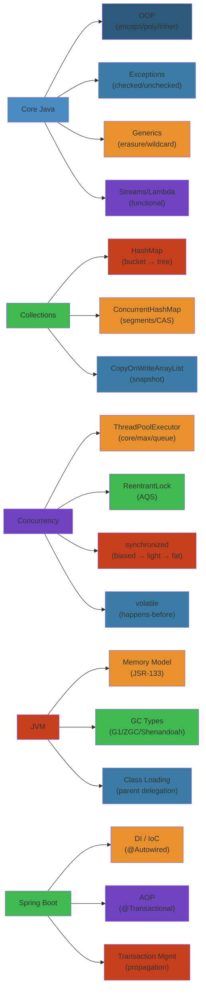

# ☕ Java Interview Questions — Complete Deep Dive

> **Scope:** 150+ Java interview questions organized by experience level (Junior, Mid, Senior, Staff/Principal) and category (Core Java, Collections, Concurrency, JVM, Spring/Spring Boot). Each question includes detailed answers, common mistakes, and interviewer expectations.




## Table of Contents

- [Junior (0–2 Years)](#junior-0-2-years)
- [Mid-Level (2–5 Years)](#mid-level-2-5-years)
- [Senior (5–8 Years)](#senior-5-8-years)
- [Staff/Principal (8+ Years)](#staffprincipal-8-years)
- [Category Deep Dives](#category-deep-dives)

---

## Junior (0–2 Years)

### Core Java

#### Step-by-Step: Understanding Multiple Inheritance Problem

1. **Define classes**: Class A has method `foo()`, Class B has method `foo()` with different implementation
2. **Try to inherit both**: Class C extends A and B
3. **Call method**: `c.foo()` — which implementation runs? A's or B's?
4. **Ambiguity**: Compiler can't decide → compiler error or runtime error
5. **Solution in Java**: Use interfaces (multiple type inheritance, not implementation inheritance)
6. **Resolution**: Default methods in interfaces won by class implementation → no ambiguity

#### Code Example

```java
// Diamond problem example (would be ambiguous without interfaces)
interface Animal {
    void sound();  // Abstract, no implementation
}

interface Dog extends Animal {
    @Override
    default void sound() { System.out.println("Woof"); }
}

interface Cat extends Animal {
    @Override
    default void sound() { System.out.println("Meow"); }
}

class Pet implements Dog, Cat {
    @Override
    public void sound() {
        // Must explicitly choose or override
        Dog.super.sound();  // Explicitly call Dog's version
    }
}
```

#### Real-World Scenario

A junior developer at a gaming company tried to create a class that inherited from both `Weapon` and `Armor` (both had `takeDamage()` method). In C++, this caused a diamond problem bug where damage was applied twice. In Java, forced to use composition: `class Knight { Weapon weapon; Armor armor; }` and explicitly delegate method calls, making the code safer and more explicit.

**Q1: Why is multiple inheritance not allowed in Java?**
- **Diamond problem**: If class C extends A and B (both define method foo()), which foo() does C inherit?
- Java allows multiple inheritance of *type* via interfaces (before Java 8, no default methods; Java 8+ has default methods → diamond resolution: class wins over interface, most specific interface wins).
- **Answer**: To avoid ambiguity (diamond problem). Java provides interface multiple inheritance as a safer alternative.

**Q2: How does JVM resolve method dispatch?**
- **Static dispatch** (compile-time): `static` methods, `private` methods, constructors. Resolved by reference type.
- **Dynamic dispatch** (runtime): Instance methods. JVM uses vtable (virtual method table). At runtime, check actual object type via vtable pointer → invoke virtual at the correct offset.
- **invokeinterface**: for interface methods — search concrete method in class hierarchy.

**Q3: Difference between abstraction and encapsulation? Production examples.**
- **Encapsulation**: Hiding internal state via private fields + public getters/setters. Protects invariants. Example: `BankAccount` with private `balance`, `deposit()` validates amount.
- **Abstraction**: Hiding implementation complexity behind a simple interface. Example: `java.sql.Connection` abstracts over MySQL, PostgreSQL drivers.

**Q4: How does HashMap work internally?**
- Array of Node<K,V>[] table (buckets). `hashCode()` → hash → index = (n-1) & hash. Collision: linked list → tree when list length > TREEIFY_THRESHOLD (8) and table size >= 64.
- `equals()` checks key equality in same bucket.
- Load factor 0.75: when size ≥ capacity * loadFactor → resize (doubles capacity, rehash all entries).

**Q5: ArrayList vs LinkedList — when to use which?**
- **ArrayList**: Contiguous array in memory. O(1) get by index. O(n) insert/delete in middle (shift elements). CPU cache-friendly (prefetching). Use when mostly read/iterate.
- **LinkedList**: Doubly linked nodes. O(n) get by index. O(1) insert at head/tail. Each node has extra memory overhead (prev/next pointers). Cache-unfriendly. Use for frequent insert/delete at head, queue, deque.

**Q6: String vs StringBuilder vs StringBuffer**
- **String**: Immutable. Any modification creates new object. Thread-safe by immutability.
- **StringBuilder**: Mutable, not thread-safe. Fastest for single-threaded string concatenation.
- **StringBuffer**: Mutable, synchronized methods. Thread-safe but slower. Prefer StringBuilder.

**Q7: try-with-resources (Java 7+)**
- AutoCloseable resources are closed automatically in reverse order of declaration.
- Compiled to try/finally with suppressed exceptions.

**Q8: == vs .equals()**
- `==` checks reference equality (same memory address).
- `.equals()` checks logical equality (override needed). Default implementation from Object uses `==`.

**Q9: static keyword usage**
- static fields: class-level variable, shared across all instances.
- static methods: no implicit `this`, cannot override (hidden).
- static block: executes when class is loaded (initialization).
- static inner class: no reference to outer instance.

**Q10: final keyword**
- final class: cannot be extended (e.g., String, Integer).
- final method: cannot be overridden.
- final variable: cannot be reassigned (primitive → value fixed; reference → reference fixed, object mutable).
- final parameter: cannot be reassigned in method body.
- final fields in constructor must be initialized.

### Common Mistakes
- Modifying a Collection while iterating (ConcurrentModificationException — use Iterator.remove() or ConcurrentHashMap)
- Using == for String comparison (always use .equals())
- Not handling InterruptedException in multithreaded code
- Forgetting that `int` division truncates (5/2 = 2, not 2.5)
- Shadowing variables with local/parameter scope

---

## Mid-Level (2–5 Years)

### Collections

**Q11: HashMap resize internals — what's the cost?**
- When threshold reached (capacity * loadFactor), capacity doubles.
- New Node[] table created (2x size). Each existing node rehashed: index = (old hash & (newCap-1)) == (hash & oldCap) ? oldIndex : oldIndex + oldCap.
- Cost: O(n) time, O(n) memory (temporarily 2x during resize). Causes latency spikes. Pre-sizing (`new HashMap<>(expectedSize / 0.75f + 1)`) avoids resize.

**Q12: What happens to ConcurrentHashMap during resize while other threads write?**
- Java 8+ ConcurrentHashMap uses `transfer()` — multiple threads can help resize (multi-threaded forwarding). Each thread claims a "stride" of bins via `ForwardingNode` sentinels.
- Writes during resize: if bucket not yet transferred → locked via CAS + synchronized; if forwarded → new table access.
- Zero-copy: old table and new table coexist. HashMap in same JVM has 2x memory during resize.

**Q13: How to synchronize ArrayList vs CopyOnWriteArrayList tradeoffs**
- `Collections.synchronizedList(new ArrayList<>())`: Every method synchronized on mutex. Iteration must be externally synchronized (or ConcurrentModificationException). Good for read+write but low concurrency.
- `CopyOnWriteArrayList`: Every mutation creates a fresh copy of the underlying array. Stale iterators (snapshot). Excellent for read-heavy (readers never block). Memory-heavy with many writes.

**Q14: Comparable vs Comparator**
- Comparable: `int compareTo(T o)` — natural ordering in the class itself (String, Integer implement it).
- Comparator: `int compare(T a, T b)` — external ordering, multiple strategies, lambda-friendly. `Comparator.comparing(Function).thenComparing()`.

**Q15: PriorityQueue — how does it work?**
- Min-heap (default) or max-heap via Comparator. Binary heap stored in array: children at 2*i+1, 2*i+2. offer() → add at end → siftUp. poll() → remove root → last to root → siftDown. O(log n) insert/remove.

**Q16: When does HashMap switch from linked list to red-black tree?**
- Thresholds: TREEIFY_THRESHOLD = 8 (list → tree), UNTREEIFY_THRESHOLD = 6 (tree → list on resize/remove), MIN_TREEIFY_CAPACITY = 64 (table must have 64+ capacity before treeifying; otherwise resize instead).
- Why 8? Poisson distribution: with load factor 0.75, collisions of 8+ are extremely rare. Trees add overhead (2x memory per node vs list). 8 is the break-even point.

### Concurrency

**Q17: Thread lifecycle states**
- NEW (not started) → RUNNABLE (scheduled/executing) → BLOCKED (waiting for monitor) → WAITING (Object.wait, Thread.join, LockSupport.park) → TIMED_WAITING (sleep, wait(timeout)) → TERMINATED.

**Q18: Synchronized internals (Java 6+ optimizations)**
1. **Biased locking**: Thread acquires lock, marks object header with thread ID. No CAS needed for subsequent acquires by same thread. Revoked if another thread contends.
2. **Lightweight locking**: CAS on mark word to set pointer to lock record in thread's stack. Acquires spin if lock is held.
3. **Heavyweight locking**: OS mutex + condition variable. Threads block in kernel. Wait-set notified via notify/notifyAll.
- Lock escalation: biased → lightweight → heavyweight. Cannot de-escalate.

**Q19: volatile happens-before memory semantics**
- `volatile` guarantees: (a) No reordering with other volatile/atomic operations. (b) Write to volatile → happens-before → subsequent read of same volatile.
- Thread A: write to volatile → Thread B: read from volatile ⇒ all writes before volatile write by A are visible to B (memory barrier: store-load on write, load-load on read).

**Q20: ReentrantLock vs synchronized — when and why?**
| Feature | synchronized | ReentrantLock |
|---|---|---|
| Syntax | Built-in, implicit | Explicit lock/unlock |
| Fairness | Unfair only | Fair or unfair |
| tryLock | Not supported | `tryLock(timeout, unit)` |
| lockInterruptibly | No | Yes |
| Condition | Wait-set (notify/notifyAll) | `newCondition()` (multiple, signal, await) |
| Performance (contended) | Heavyweight lock | Better scaling (CAS) |

**Q21: ForkJoinPool work-stealing**
- Each worker thread has a deque of tasks. Thread works on its own deque (LIFO for efficiency). When empty, steals from another thread's deque tail (FIFO — old tasks first, minimizes contention).
- `ForkJoinPool.commonPool()`: shared across the JVM (parallelStream).
- `RecursiveTask` (returns result) and `RecursiveAction` (no return): typical pattern of fork() → compute() → join().

**Q22: CompletableFuture chaining**
```java
CompletableFuture.supplyAsync(() -> fetchUser(id))                     // stage 1
    .thenApply(user -> user.getOrders())                               // stage 2 (sync, same thread)
    .thenCompose(orders -> CompletableFuture.supplyAsync(() ->         // stage 3 (async, flat)
        processOrders(orders)))
    .thenCombine(
        CompletableFuture.supplyAsync(() -> fetchDiscounts()),          // stage 4 (parallel)
        (processed, discounts) -> applyDiscounts(processed, discounts)
    )
    .exceptionally(ex -> fallbackResult())                             // error recovery
    .orTimeout(2, TimeUnit.SECONDS);                                   // timeout
```
- `thenApply`: sync function, returns CompletableFuture<U>. `thenCompose`: async function, returns CompletableFuture<CompletableFuture<U>> → flattens.
- `thenCombine`: merge two independent CFs (parallel). `allOf`: wait for all. `anyOf`: first to complete.
- `exceptionally`: recover from exception. `handle`: handle both result and exception.

**Q23: Virtual Threads (Project Loom)**
- **Carrier thread**: OS/platform thread (typically small pool, ~matching CPU cores). Virtual threads are mounted on carrier threads.
- **Pinning**: When a virtual thread enters `synchronized` block or calls native method, it pins the carrier thread (cannot be unmounted). Use `ReentrantLock` instead of `synchronized` to avoid pinning.
- **Structured concurrency**: `StructuredTaskScope` — scope where tasks are created and complete within the scope. If one fails, others are cancelled. Ensures no task leaks.

### Common Mistakes
- Using synchronized for virtual thread tasks (causes pinning; use ReentrantLock)
- Calling `Future.get()` in main thread after submitting all tasks (blocks sequentially — use allOf/CompletableFuture instead)
- Forgetting to close ExecutorService (memory leak of threads)
- `parallelStream` with shared mutable state (not thread-safe — use ConcurrentHashMap or reduce)
- Assuming `volatile` is atomic (++count is read-modify-write — use AtomicInteger)

---

## Senior (5–8 Years)

### Collections

**Q24: ConcurrentHashMap 1.8 internals: buckets, CAS, tree, CounterCell**
- Array of Node<K,V>[] table. `(n-1) & hash` for bucket index. First node insert: CAS (no lock). Collision: `synchronized` on bucket head.
- **Tree**: If bucket size > TREEIFY_THRESHOLD (8) and capacity >= MIN_TREEIFY_CAPACITY (64), list → `TreeNode` (red-black tree). Tree uses `Comparable` or `System.identityHashCode` for ordering.
- **CounterCell**: `size()` is not a simple field. Uses `CounterCell[]` (stripe of volatile longs). `addCount()`: CAS on random stripe. `sumCount()` sums all cells to avoid contention on a single counter. Approximate if concurrent updates.

**Q25: ConcurrentHashMap 1.7 vs 1.8**
- 1.7: Segment array (separate locks, max concurrency = segment count, default 16). Poor scaling for small segments.
- 1.8: CAS + synchronized on bucket. No segments. Tree buckets for collision. Better scaling, lower memory.

### Concurrency (Senior)

**Q26: Two threads synchronize on different objects, each holds lock the other needs — draw monitor state**
```
Thread A:                                  Thread B:
synchronized(objA) {                       synchronized(objB) {
    synchronized(objB) {                       synchronized(objA) {
        // never reaches here                   // never reaches here
    }                                       }
}                                       }

Monitor state:
Thread A: BLOCKED, waiting on objB's monitor
Thread B: BLOCKED, waiting on objA's monitor
JVM can detect? No. OS can't either. Thread dump shows "Found one Java-level deadlock".
Solution: Always acquire locks in same global order (e.g., sort by System.identityHashCode).
```

**Q27: Java Memory Model — volatile visibility guarantee**
- **Question**: When does a write by Thread A become visible to Thread B?
- **Answer**: Happens-before edge is established via:
  1. Volatile write (store barrier) → volatile read (load barrier) on same variable.
  2. Synchronized block exit (monitorexit) → entry (monitorenter) on same monitor.
  3. Thread.start() → first action of started thread.
  4. Thread join() returns → subsequent actions.
- Synchronization order: total order of all synchronization actions (volatile read/write, lock/unlock).
- If no happens-before: reads may see stale values indefinitely (hoisting, reordering by JIT/CPU).

### JVM

**Q28: Classloading — loading, linking, initialization**
```
1. Loading:  Find .class file (binary name), create Class<?> object in metaspace
2. Linking:
   a) Verification: bytecode correctness (no jump out of bounds, type-safe)
   b) Preparation: static fields → default values (0, null), allocate method tables
   c) Resolution: symbolic references → direct references (constant pool resolution)
3. Initialization: Run static initializers (<clinit>), static field assignments
```
- Class loader hierarchy: Bootstrap (rt.jar, java.base) → Platform (jdk.*) → Application (classpath).
- **Parent delegation**: A loader asks parent before loading itself. Ensures java.lang.Object is the same class across loaders.
- **Breaking it**: Thread context class loader (driver loading via SPI, JDBC), custom loaders, OSGi, Tomcat per-app classloader.

**Q29: Java Memory Model — heap regions**
```
 Heap
 ┌─────────────────────────────────────────────────────┐
 │  Young Generation                       │ Old Gen   │
 │  ┌─────────┬──────────┬──────────┐      │           │
 │  │  Eden   │   S0     │   S1     │      │           │
 │  │         │ (from)   │ (to)     │      │           │
 │  │ TLABs   │          │          │      │           │
 │  └─────────┴──────────┴──────────┘      │           │
 ├─────────────────────────────────────────┤           │
 │  Metaspace (non-heap: class metadata)    │           │
 └─────────────────────────────────────────┴───────────┘
```
- TLAB (Thread-Local Allocation Buffer): Each thread gets Eden sub-region for lock-free allocation (refill when exhausted). Reduces contention.
- Card table: byte array marking old-gen region references to young. Used by GC to track cross-generation pointers (reduces scanning).
- Remembered set (G1): per-region set of cards with incoming references from other regions.

**Q30: G1 GC — pause prediction, full GC causes**
- **Pause prediction**: G1 uses ergonomics (previously collected data). `-XX:MaxGCPauseMillis` (default 200ms). G1 calculates how many regions to collect to meet pause target. Young region collection time proportional to number of survivor regions.
- **Full GC in G1**: When evacuation failure (Copying to survivor regions fails — no space). Or humongous allocation cannot find contiguous free regions. Falls back to single-threaded mark-sweep-compact (slow, O(stop-the-world)).
- Mitigations: Increase heap, tune `-XX:G1HeapRegionSize`, `-XX:InitiatingHeapOccupancyPercent`, adjust `-XX:G1MixedGCLiveThresholdPercent`.

**Q31: ZGC — how sub-millisecond pauses?**
- **Colored pointers**: 64-bit pointer includes metadata bits (finalizable, remap, mark bits). Object address computed by zeroing metadata bits. No per-object metadata overhead.
- **Load barriers**: On each reference load, JIT inserts load barrier (small code sequence). If pointer is bad (e.g., relocated), barrier fixes it (self-healing). Only colored objects are affected (small subset).
- **Region-based**: Small (2MB), Medium (32MB), Large (N*MB). Concurrent compaction: remap set (moved objects) tracked via colored pointer.
- **Multi-mapping**: Same physical memory mapped at multiple virtual addresses with different color settings. No TLB flush needed for remap.
- **Concurrent relocation**: Need to access object → load barrier detects → forward to new copy. Subsequent accesses directly see new copy (self-healing).

**Q32: Shenandoah GC**
- **Brooks pointer**: Each object has a forwarding pointer (stolen from object header). Not a separate word, uses header bits.
- **SATB (Snapshot At The Beginning)**: Concurrent marking uses SATB — remembers set of live objects at start of concurrent cycle (prevents undercounting).
- **Concurrent evacuation**: Move objects while application runs. Access via Brooks pointer → forward if relocated.
- Diff from ZGC: Shenandoah uses Brooks pointer (in-header forwarding), ZGC uses colored pointers (in-reference forwarding).

**Q33: GC tuning — throughput vs pause time vs footprint**
```
-XX:+UseG1GC -XX:MaxGCPauseMillis=200
-XX:ParallelGCThreads=4 -XX:ConcGCThreads=2
-Xms8g -Xmx8g

Tuning axis:
Throughput:    Maximize -XX:GCTimeRatio=99 (1% GC time)
Pause time:    Minimize -XX:MaxGCPauseMillis=10 (but may reduce throughput)
Footprint:     Minimize heap -Xmx (but frequency of GC increases)
```

**Q34: TLABs impact on allocation performance**
- Without TLAB: Each `new` goes to shared Eden (CAS on allocation pointer) — contention.
- With TLAB: Thread grabs Eden chunk (lock-free bump pointer). Allocates within TLAB — thread-local CAS only on refill.
- Monitoring: `-XX:+PrintTLAB` — check wasted space (TLAB too big → waste, too small → refill overhead).

### Spring/Spring Boot

**Q35: Self-invocation @Transactional fails — why? How to fix?**
- **Why**: Spring AOP proxy intercepts external calls. When method A calls method B in same class, it's a `this.methodB()` call — goes through `this` (proxy bypassed). No transaction starts.
- **Fix**: 1) Move method B to separate bean + inject. 2) Inject self-proxy: `@Autowired ApplicationContext; context.getBean(MyService.class).methodB()`. 3) Enable AspectJ mode (`@EnableTransactionManagement(mode=AdviceMode.ASPECTJ)` + LTW). 4) `@Autowired self` using AopContext.currentProxy() (requires `@EnableAspectJAutoProxy(exposeProxy=true)`).

**Q36: JDK dynamic proxy vs CGLIB proxy — when does CGLIB fail?**
- **JDK proxy**: Requires interface. `Proxy.newProxyInstance(classLoader, interfaces, handler)`. Method calls → InvocationHandler.invoke(). For Spring beans implementing at least one interface.
- **CGLIB proxy**: Generates subclass via bytecode generation (ASM). Intercepts non-final methods. Used when no interface.
- **CGLIB failure cases**: `final` methods cannot be proxied (called directly on the target). `private` methods not proxied. `static` methods not proxied. Constructors not proxied. If class loaded by a different classloader than CGLIB, generation may fail.

**Q37: N+1 queries in Spring Data JPA — solutions**
- Problem: Find all `Author` (1 query), then for each author lazy-load `books` (N queries).
- **JOIN FETCH**: `@Query("SELECT a FROM Author a JOIN FETCH a.books")` — single query with join. Risk: cartesian product + pagination (warns about firstResult/maxResults).
- **@EntityGraph**: `@EntityGraph(attributePaths="books")` — defines what to fetch eagerly for the query.
- **Batch fetching**: `@BatchSize(size=10)` on collection — loads N entities' collections together: `WHERE book.author_id IN (?, ?, ..., ?)`.

**Q38: @Transactional propagation REQUIRES_NEW in same class**
- Same class self-invocation: REQUIRES_NEW ignored (proxy bypassed). Same issue as Q35.
- If correctly called via proxy: existing transaction suspended (saves to TransactionSynchronizationManager), new transaction created. If new TX fails, old TX unaffected.

---

## Staff/Principal (8+ Years)

**Q39: ConcurrentHashMap size calculation accuracy**
- `size()` returns an estimate. Not exact due to concurrent modifications.
- `mappingCount()` preferred (returns long).
- When exact count needed: `synchronized(chm)` for counting; or maintain separate `AtomicLong` (but must handle inaccuracies).

**Q40: CompletableFuture.orTimeout implementation**
- Uses `DelayedExecutor` (ScheduledExecutorService). Schedules a task that calls `completeExceptionally(new TimeoutException())` on the CF. If CF completes normally before timeout, the scheduled task is cancelled (`cancel(false)` — may still run).

**Q41: Virtual threads + structured concurrency edge cases**
- StructuredTaskScope: `new StructuredTaskScope.ShutdownOnFailure()`. Fork tasks → join (scope completes). If one task throws, scope is shutdown (cancels all other tasks via `Thread.interrupt()` on their virtual threads).
- What if a task creates its own thread unexpectedly? StructuredTaskScope prevents thread leakage by design (scope cannot complete until all forked tasks complete).

**Q42: ZGC — NVBB (Non-Volatile Byte Buffer)**
- ZGC uses NVBB for marking bitmaps (instead of dedicated bitmap memory). Marking information stored in object header's metadata bits (colored pointer). With colored pointers, ZGC avoids per-object metadata overhead, reducing memory footprint.

**Q43: G1 full GC — when does it happen?**
1. **Evacuation failure**: Not enough free regions to copy live objects into during mixed GC → full STW compact.
2. **Humongous allocation failure**: Object >= 50% of region size (default ~512KB). If no contiguous free regions available → full GC.
3. **Promotion failure**: Not enough old-gen free regions for promoted young objects.
4. **To-space exhausted**: Old-gen or survivor regions fill during marking cycle.

**Q44: AOP proxy limitations with @Cacheable, @Async, @Transactional annotations combined**
- Multiple annotations require correct ordering: `@EnableCaching`, `@EnableAsync`, `@EnableTransactionManagement`. Proxy chain order: Transaction → Cache → Async → Target.
- If one annotation is configured with `mode=ASPECTJ` and another with `mode=PROXY` → incorrect wrapping.
- Self-invocation affects all three (same proxy bypass problem).

**Q45: Spring Boot auto-configuration — ConditionalOnClass evaluation**
- `@ConditionalOnClass(name="org.springframework.data.redis.core.RedisTemplate")` — evaluates via `ClassNameFilter` using ASM metadata (no class loading). If class not on classpath → bean skipped. 
- `spring.factories`: deprecated in 3.0. `META-INF/spring/org.springframework.boot.autoconfigure.AutoConfiguration.imports` replaces it.

---

## Category Deep Dives

### Core Java — Complete Q&A (50+ questions)

| # | Question |
|---|---|
| 46 | Can you override a private method? |
| 47 | What is the difference between method overloading and overriding? |
| 48 | Explain the purpose of `hashCode()` and `equals()` contract |
| 49 | What is a marker interface? Examples? |
| 50 | How does autoboxing work? Pitfalls? |
| 51 | Difference between checked and unchecked exceptions? |
| 52 | How does try-with-resources handle suppressed exceptions? |
| 53 | What is a lambda? How does the JVM implement it? (invokedynamic + lambda metafactory) |
| 54 | What is a method reference? Types? |
| 55 | How do streams work? Intermediate vs terminal operations? Lazy evaluation? |
| 56 | What is `Optional`? When to use (and when NOT to)? |
| 57 | What is the difference between `final`, `finally`, and `finalize()`? |
| 58 | How does `String.intern()` work? What is the string pool? |
| 59 | What is a record (Java 14+)? When to use? |
| 60 | What is a sealed class/sealed interface (Java 17+)? |
| 61 | Explain pattern matching for instanceof (Java 16+) |
| 62 | What are text blocks (Java 13+)? |
| 63 | What is the difference between `switch` expression (Java 14+) and `switch` statement? |
| 64 | Explain `java.util.function` package (Function, Consumer, Supplier, Predicate, UnaryOperator) |
| 65 | How does `Comparator.comparing().thenComparing()` chaining work? |

### Collections — Complete Q&A (30+ questions)

| # | Question |
|---|---|
| 66 | Internal workings of LinkedHashMap — insertion order vs access order |
| 67 | How does TreeMap maintain ordering? Red-black tree internals |
| 68 | ConcurrentSkipListMap — how does it work? How does it compare to ConcurrentSkipListSet? |
| 69 | WeakHashMap — how do WeakReferences work with GC? Use cases |
| 70 | IdentityHashMap — when to use? |
| 71 | EnumMap — internal representation? Performance vs HashMap |
| 72 | CopyOnWriteArrayList — does it guarantee iterator consistency? Snapshot semantics |
| 73 | Collections.unmodifiableList vs List.of — differences |
| 74 | How does `HashMap.computeIfAbsent` work? Thread-safety with ConcurrentHashMap |
| 75 | ConcurrentLinkedQueue — how does it work (CAS on head/tail, Michael-Scott queue) |
| 76 | DelayQueue — use cases (scheduled task, connection pool idle timeout) |
| 77 | ArrayBlockingQueue vs LinkedBlockingQueue — which has better throughput? |
| 78 | SynchronousQueue — zero-capacity, how does it work? |
| 79 | PriorityBlockingQueue — unbounded, growth behavior |
| 80 | BlockingQueue.drainTo — performance advantage over poll() in loop |
| 81 | What is the initial capacity of `new HashMap()`? (16) What if you pass `new HashMap<>(5)`? (rounds to power of 2: 8) |
| 82 | HashMap key: mutable object — what happens if you mutate after insertion? |
| 83 | How does `HashSet` work internally? (backed by HashMap, uses PRESENT dummy object) |
| 84 | `ArrayList.subList()` — what happens if you modify the original list? |
| 85 | `Arrays.asList()` — fixed-size List proxy, no add/remove |

### Concurrency — Complete Q&A (35+ questions)

| # | Question |
|---|---|
| 86 | What is the "happens-before" rule? List all 9 rules |
| 87 | What is a memory barrier? StoreLoad vs LoadLoad vs StoreStore vs LoadStore |
| 88 | How does `AtomicInteger` work? CAS + volatile value. ABA problem? (AtomicStampedReference solves) |
| 89 | What is `LongAdder`? How does it differ from AtomicLong? When to use? |
| 90 | `ReadWriteLock` vs `StampedLock` — optimistic read vs pessimistic read |
| 91 | `ReentrantReadWriteLock` — when reads outnumber writes 10:1 |
| 92 | How does `Semaphore` differ from a lock? |
| 93 | CountDownLatch vs CyclicBarrier vs Phaser |
| 94 | Exchanger — use cases for two-thread data exchange |
| 95 | CompletableFuture — difference between `thenApply` and `thenApplyAsync` |
| 96 | How does `CompletableFuture.allOf` handle errors? (wait for all, then compose) |
| 97 | ForkJoinPool — how does work-stealing handle task granularity? |
| 98 | What is `ManagedBlocker` in ForkJoinPool? |
| 99 | Virtual Threads — what is a "carrier thread"? |
| 100 | Virtual Threads — how does `ThreadLocal` work with virtual threads? (each VT has its own TL) |
| 101 | StructuredTaskScope — what is the shutdown policy? |
| 102 | How does `Object.wait()` / `notify()` interact with synchronized blocks? |
| 103 | What is "spurious wakeup"? How to handle it? (while loop condition check) |
| 104 | Thread pool `execute()` vs `submit()` — Exception handling difference |
| 105 | How to monitor thread pool health? (queue size, active count, completed task count) |
| 106 | What is `RejectedExecutionHandler`? Types? (Abort, CallerRuns, Discard, DiscardOldest) |
| 107 | What happens to queued tasks on executor shutdown? |
| 108 | `invoke` vs `submit` vs `execute` in ExecutorService |
| 109 | How does `shutdownNow()` work? Returns list of pending Runnable |
| 110 | ScheduledThreadPoolExecutor — how does scheduleAtFixedRate handle long-running tasks? |
| 111 | ForkJoinPool common pool parallelism default? (Runtime.availableProcessors - 1) |
| 112 | What is `ForkJoinTask`? */
| 113 | What is the difference between `parallelStream` and `stream().parallel()`? |
| 114 | How does `Thread.onSpinWait()` work? (Java 9+) |
| 115 | VarHandle — replacement for Unsafe? |
| 116 | jdk.internal.misc.Unsafe — what is it used for? |
| 117 | MethodHandles and invokedynamic — how is this related to lambda implementation? |
| 118 | What is false sharing? How to avoid? (`@Contended` annotation, padding) |
| 119 | java.util.concurrent.locks.LockSupport — park/unpark |
| 120 | CompletableFuture: orTimeout vs completeOnTimeout — difference? |

### JVM — Complete Q&A (30+ questions)

| # | Question |
|---|---|
| 121 | What is the difference between Stack and Heap? |
| 122 | How does the JIT compiler work? C1 vs C2 vs Graal? Tiered compilation? |
| 123 | What is Escape Analysis? Stack allocation vs scalar replacement? |
| 124 | What is on-stack replacement (OSR)? |
| 125 | How does the JVM handle large pages (Transparent Huge Pages)? |
| 126 | How does biased locking work? Why was it deprecated (Java 15+)? |
| 127 | What are the -XX flags for GC logging? (Unified Logging: -Xlog:gc*) |
| 128 | How to analyze a heap dump? (jhat, Eclipse MAT, jprofiler, VisualVM) |
| 129 | What is a safepoint? When do threads stop? (GC, deoptimization, thread dump) |
| 130 | How to reduce safepoint pauses? (biased locking revoke was a major cause) |
| 131 | What is OopMap? Used in GC for precise scanning? |
| 132 | How does the JVM handle `String.concat` vs StringBuilder? |
| 133 | What is the difference between `-Xms` and `-Xmx`? |
| 134 | Metaspace vs PermGen — what changed? |
| 135 | How does `-XX:+UseCompressedOops` work? (32-bit references in 64-bit JVM) |
| 136 | What happens during JVM initialization? (loading rt.jar/java.base) |
| 137 | How does class data sharing (CDS) work? Application Class Data Sharing (AppCDS)? |
| 138 | What is `jcmd`? Common uses? |
| 139 | How does `jstack` produce a thread dump? |
| 140 | Java Flight Recorder (JFR) — continuous profiling, events, streaming |
| 141 | What is JMX? MBeans? |
| 142 | How does G1 `-XX:G1HeapRegionSize` work? |
| 143 | When would you choose Shenandoah over ZGC? (smaller heaps < 512GB, better throughput on smaller heaps) |
| 144 | What is a GC root? (stack frame, static field, JNI reference) |
| 145 | How does CMS remark phase work? |
| 146 | What is `-XX:+ScavengeBeforeFullGC`? |
| 147 | JIT compilation levels: 0 (interpreter), 1-3 (C1), 4 (C2) |
| 148 | How does `-XX:+PrintCompilation` work? |
| 149 | What is intrisification? (JIT replaces method with CPU instruction) |
| 150 | How does Vector API (JEP 426, Java 19+ incubator) work? SIMD in pure Java? |

### Spring/Spring Boot — Complete Q&A (30+ questions)

| # | Question |
|---|---|
| 151 | What is the Spring IoC container? Bean lifecycle (instantiate → populate → init → ready → destroy) |
| 152 | BeanPostProcessor vs BeanFactoryPostProcessor — when to use each? |
| 153 | `@Autowired` vs `@Resource` vs `@Inject` — differences |
| 154 | `@Primary` vs `@Qualifier` — resolution order |
| 155 | Prototype bean in singleton — `@Lookup` method vs ObjectFactory |
| 156 | Circular dependency — how does Spring resolve it? (3-phase construction) |
| 157 | Spring AOP — `@Before` vs `@After` vs `@Around` vs `@AfterReturning` vs `@AfterThrowing` |
| 158 | Pointcut expressions: execution(), within(), @annotation(), args() |
| 159 | Spring transaction: `rollbackFor` vs `noRollbackFor` — default throws Runtime/Error |
| 160 | `TransactionSynchronizationManager` — registerSynchronization, doAfterCommit |
| 161 | Spring Data JPA — `@Query` vs `@NamedQuery` vs query methods |
| 162 | Spring Data JPA — `Specification` for dynamic queries |
| 163 | Spring Data REST — exposing repositories as REST endpoints, pros/cons |
| 164 | Spring Security: SecurityFilterChain order — how does it affect behavior? |
| 165 | CSRF protection — when to disable? (stateless APIs, use JWT) |
| 166 | OAuth2 resource server — token validation (NimbusJwtDecoder, introspection) |
| 167 | Spring Boot: `@SpringBootApplication` = `@Configuration` + `@EnableAutoConfiguration` + `@ComponentScan` |
| 168 | Spring Boot Actuator — health checks, metrics, info endpoint, thread dump |
| 169 | Externalized configuration: `application.yml` → env vars → `@Value` → `@ConfigurationProperties` |
| 170 | Spring Boot DevTools — classloader reload (restart), LiveReload |
| 171 | Spring Testing: `@SpringBootTest` vs `@WebMvcTest` vs `@DataJpaTest` vs `@MockBean` |
| 172 | `@SpringBootTest(bootstrapWith=SpringBootTestContextBootstrapper.class)` — auto-configuration |
| 173 | TestContainers — integration tests with real databases |
| 174 | Spring Cloud Config — server-side configuration, refresh scope |
| 175 | Spring Cloud Gateway — filter chain, rate limiting, circuit breaker |
| 176 | Spring Cloud Circuit Breaker — Resilience4j vs Hystrix (Hystrix deprecated) |
| 177 | Spring Cloud Sleuth / Micrometer Tracing — trace propagation, baggage |
| 178 | Spring Kafka — listener containers, error handlers, retry, dead letter topic |
| 179 | Spring Reactive — WebClient vs WebFlux vs RSocket |
| 180 | Spring Boot 3.0 migration: Java 17, Jakarta EE 9+, GraalVM native images |

---

> **Practice strategy:** Master all Junior questions first (Q1–Q10). Move to Mid-level (Q11–Q23) for depth. Senior questions (Q24–Q38) require deep JVM/Spring knowledge — study these with code examples. Staff questions (Q39–Q45) test architectural decision-making and expertise boundaries.
