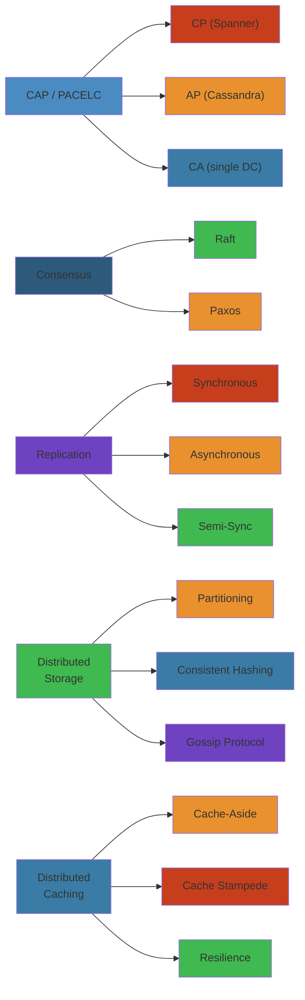

# 🌍 Distributed Systems Interview Questions — Complete Deep Dive

> **Scope:** 100+ distributed systems interview questions at FAANG/senior level, organized by category (Consistency & CAP, Consensus, Distributed Storage, Distributed Caching, System Design Problem Solving). Each question includes approach breakdown, common mistakes, expected answer for senior level, edge cases, and follow-up questions. ASCII diagrams are included for key concepts.




## Table of Contents

- [Consistency & CAP](#consistency--cap)
- [Consensus & Fault Tolerance](#consensus--fault-tolerance)
- [Distributed Storage](#distributed-storage)
- [Distributed Caching](#distributed-caching)
- [Distributed System Design Problems](#distributed-system-design-problems)
- [Appendices](#appendices)

---

## Consistency & CAP

### Q1: Explain CAP theorem with a concrete distributed database example. Under a partition (network failure), what tradeoffs does Cassandra (AP) vs Spanner (CP) make?

```
                       NETWORK PARTITION
                             │
                    ┌────────┴────────┐
                    │                 │
               ┌────▼────┐      ┌────▼────┐
               │  Node A  │  ~~  │  Node B  │  (network cut)
               │  Region1 │      │  Region2 │
               └─────────┘      └─────────┘

Cassandra (AP):                         Spanner (CP):
  - Both nodes accept writes              - Only majority partition accepts writes
  - Reads may return stale data           - Minority partition rejects writes
  - Conflict resolution: LWW +            - Waits for partition heal + TrueTime
    hinted handoff + read repair           - Guarantees linearizability
  - Consistency: eventual                  - Consistency: strong (serializable)
  - Availability: high                     - Availability: majority only
```

**Expected Answer (Senior level):**
- **Cassandra AP**: Under partition, writes continue on both sides (nodetool disablebinary for unreachable nodes, but `WRITE_ALL` still succeeds locally). Reads use `CL.ONE` — immediate response but possibly stale. When partition heals, hinted handoff + read repair + Merkle tree anti-entropy converge. Real-world: Cassandra favors availability; you accept stale reads for uptime.
- **Spanner CP**: Under partition, Spanner uses Paxos groups. If leader loses quorum, writes pause until new leader elected on majority side. Minority partition cannot write. Reads on minority side may be served via stale reads (timestamp-bound, configurable). Real-world: Google Ads, F1 — consistency is non-negotiable.

**Common mistakes**: Saying "CAP doesn't apply" (it always applies under partition). Confusing CAP consistency with ACID consistency (CAP = linearizability, ACID = transaction properties).

**Follow-up**: "Can you achieve both C and A in a distributed system?" → Only if you can guarantee no partition (impossible in real-world async networks). FLP impossibility theorem.

#### Step-by-Step: CAP Analysis for Your System

1. **Identify partition risk**: Is your system distributed across networks? (Yes = partition possible)
2. **Choose your priority**: What's the business requirement? Payment system → C. Social feed → A.
3. **Analyze trade-offs**: 
   - CP: Minority partition rejects writes (bad UX in one region)
   - AP: Stale reads for days (bad data integrity)
4. **Design conflict resolution**: LWW, CRDT, or manual reconciliation
5. **Test partition scenarios**: Chaos test network partitions
6. **Monitor divergence**: Track inconsistency window metrics

#### Code Example

```python
# CAP demo: Cassandra (AP) vs etcd (CP)

# Cassandra (AP) - Write succeeds on any partition
def write_order(order_id, order_data):
    try:
        cassandra.write(order_id, order_data)  # Always succeeds (high availability)
        return {"status": "success"}
    except Exception:
        pass  # Even on partition, local partition succeeds

# Read may be stale
def read_order(order_id):
    return cassandra.read(order_id, consistency_level=ONE)  # Might be old version

---

# etcd (CP) - Write fails if no quorum
def write_order(order_id, order_data):
    try:
        etcd.write(order_id, order_data)  # Requires majority quorum
        return {"status": "success"}
    except etcd.QuorumError:
        return {"status": "unavailable"}  # Minority partition cannot write

# Read always consistent
def read_order(order_id):
    return etcd.read(order_id)  # Always latest, never stale
```

#### Real-World Scenario

LinkedIn chose AP (Cassandra) for their social graph because availability matters more than momentary inconsistency. User A follows User B — the follow might take 1 second to propagate globally. Acceptable tradeoff. But if LinkedIn chose CP (like a banking system), a network partition in one region would make that region unable to accept new follows for minutes, damaging user experience. Different problem domain = different CAP choice.

---

### Q2: What is PACELC? Give real-world systems for each quadrant.

```
PACELC
 ┌──────────────────────────────────────────────────────┐
 │  If Partition (P)              │  Else (E)           │
 │  ┌──────────┬──────────┐       │  ┌──────┬──────────┐│
 │  │  A       │  C       │       │  │  L   │   C      ││
 │  ├──────────┼──────────┤       │  ├──────┼──────────┤│
 │  │DynamoDB  │Spanner   │       │  │Redis │  Spanner ││
 │  │Cassandra │etcd      │       │  │Kafka │  etcd    ││
 │  │DNS       │Bigtable  │       │  │Cassan │  ZK      ││
 │  │(eventual)│(CP)      │       │  │dra   │          ││
 │  └──────────┴──────────┘       │  └──────┴──────────┘│
 └──────────────────────────────────────────────────────┘
```

| System | P → A/C | E → L/C | Implication |
|---|---|---|---|
| **DynamoDB** | A (AP) | L (eventual default) | Writes succeed always, reads may be stale; low latency normally |
| **Cassandra** | A (AP) | L (eventual, tunable) | N=3, W=1, R=1: fast but stale. Can tune to W=3, R=1 for CP. |
| **Spanner** | C (CP) | C (serializable) | Global consistency via TrueTime; 2ε commit wait adds latency |
| **etcd** | C (CP) | C (linearizable) | Strong consistency always; can't read stale (unless `--quorum=false`) |
| **Kafka** | A | L (dirty read) | Producers write to leader, replicas async. Not strongly consistent by default. `min.insync.replicas` + `acks=all` pushes toward CP. |
| **Redis Cluster** | C (no partition) | L (no consensus) | Cluster mode partitions → manual failover. Strong consistency on single node. |

---

### Q3: Design a strongly consistent key-value store given a network partition is guaranteed. How does etcd handle this?

**Approach**: Use Raft consensus (like etcd does).

1. **Cluster of 3/5 nodes**. One leader, rest followers. All writes go to leader.
2. **Write path**: Client → Leader → Append to log → Replicate to majority → Commit → Apply to state machine → Respond to client.
3. **During partition**:
   - Majority side: elects leader (if old leader in minority), continues.
   - Minority side: leader election times out (no majority). Rejects all writes. Returns error or redirects.
4. **etcd handling**: `--quorum-backend-writes` uses quorum for backend writes too (ensures linearizable). Read with `--consistency=l` (linearizable) does quorum read. Read with `--consistency=s` (serializable) returns local state (may be stale but available during partition).

**Edge cases**: Stale read on minority side during partition. etcd's `--consistency=s` allows this but documents the risk.

**Follow-up**: "What happens when old leader (in minority partition) receives a client request?" → It responds with a redirect to the current leader (peer communication fails → term increases → request rejected with `ErrLeaderChanged`).

---

### Q4: What is the difference between linearizability and serializability? Give a scenario where a system is serializable but not linearizable.

| Property | Scope | Description |
|---|---|---|
| **Linearizability** | Single-object operations | Each operation appears to take effect atomically at some point between its invocation and response. Real-time order preserved. |
| **Serializability** | Multi-object transactions | The outcome of concurrent transactions is equivalent to some serial execution (total order). No real-time constraint. |

**Example**: Transaction A writes x=1 at t=10. Transaction B reads x at t=11 (returns x=1). Transaction B writes y=1 at t=12. Transaction C reads y at t=13 (returns y=1). Transaction C reads x at t=14 (returns x=0).

```
Serializable but not linearizable:
A: write(x=1)      ... committed
B:    read(x)=1 ... write(y=1)
C:                    read(y)=1 ... read(x)=0 (stale!)
```
This is serializable (total order: A → B → C is a valid serial history). NOT linearizable because C's read of x at t=14 should reflect A's write at t=10 if real-time ordering matters.

---

## Consensus & Fault Tolerance

### Q5: Explain Raft leader election in detail. What happens if a leader loses connectivity to the majority but still receives client requests?

```
 ┌─────────────────┐         ┌─────────────────┐        ┌─────────────────┐
 │  Node A         │         │  Node B (Leader)│        │  Node C         │
 │  (Follower)     │         │  (Minority of 3)│        │  (Follower)     │
 │                 │         │  Partition! ~~   │        │                 │
 │  Term: 5        │         │  Term: 5        │        │  Term: 5        │
 │                 │         │                 │        │                 │
 │  ← HBs from C   │         │  Can't reach    │        │  ← Answers      │
 │  (new leader)   │         │  A or C         │        │  (sends HBs)    │
 └─────────────────┘         └─────────────────┘        └─────────────────┘

Time passes...
Node B's election timeout fires (no HB from majority, it isolated)
But B is leader — Raft leader only steps down if it sees higher term.
B keeps trying to append to A/C → fails → no new commits.
B keeps responding to clients: "appended but not committed" (some implementations reject)
Meanwhile C gets votes from A → becomes leader (term 6)

C (term 6) sends HB to B → B sees term 6 > term 5 → B steps down → becomes follower
```

**Answer**: Raft prevents split-brain via the **term** mechanism:
1. The isolated leader's term hasn't changed. It continues to receive client requests and append to its local log.
2. But it cannot commit any entries (needs majority ack). Client responses remain uncommitted.
3. On the majority side, a new leader is elected with a higher term.
4. When partition heals, the old leader sees the higher term, steps down, and rolls back uncommitted entries.

**Common mistake**: Assuming the old leader rejects clients immediately. Raft allows accepting requests but cannot commit them (they may be rolled back).

**Follow-up**: "What happens to the client's request that the old leader accepted but couldn't commit?" → If the request was replicated to followers before partition, the new leader's log may contain it. New leader's "no-op" entry at start of term ensures no conflicting entries are committed. The entry may or may not survive depending on whether it was in the majority's logs.

---

### Q6: What is a split-brain scenario? How does Raft prevent it? How does ZooKeeper prevent it?

**Split brain**: Two nodes both believe they are the leader, accepting writes independently. Leads to divergence.

**Raft prevention**:
- **Single leader per term**: At most one candidate can win a term's election (needs majority). Two leaders cannot exist in the same term.
- **Stale leader detection**: If a leader receives a request with a higher term, it abdicates.
- **Log consistency**: Only the leader's log is authoritative; followers overwrite conflicting entries.

**ZooKeeper prevention**:
- **Quorum-based**: ZAB (ZooKeeper Atomic Broadcast) needs > N/2 for leader election.
- **Leader epoch**: Similar to Raft's term. Followers reject proposals from old-epoch leaders.
- **FIFO broadcast**: All writes go through leader, broadcast with `zxid` (epoch + counter). Followers commit in order; if they see a gap, they reconnect.

---

### Q7: What is the FLP impossibility result? How does Raft circumvent it?

**FLP impossibility**: In an asynchronous distributed system where processes can fail by crashing, it is impossible to reach consensus in a bounded number of steps if at least one process may fail. Even one faulty process makes consensus impossible.

**Raft's circumvention**:
- Raft uses **timeouts** (epochs, terms). Timeouts introduce a **partially synchronous** model (assumes eventually synchrony). FLP assumes fully asynchronous model.
- The randomized election timeout (150–300ms) ensures that, with high probability, one node will win the election before another starts (asymmetric timeout).
- In the worst case (tie → split vote), the election restarts with random new timeouts. Eventually one node wins. This is **probabilistic termination** — not guaranteed, but practically certain.

**Common mistake**: Claiming Raft "solves" FLP. It *circumvents* FLP by using timeouts (partial synchrony). In a fully async network, Raft also cannot guarantee consensus.

---

### Q8: Explain the difference between Paxos and Raft. Why is Raft considered easier to understand?

| Aspect | Paxos | Raft |
|---|---|---|
| **Roles** | Proposer, Acceptor, Learner | Leader, Follower, Candidate |
| **Leader** | Multiple proposers → collisions | Single elected leader (lease) |
| **Log** | Separate instances per log entry | Log is first-class, leader builds a linear log |
| **Safety** | Quorum intersection + value selection | Leader completeness + log matching |
| **Election** | Fixed proposer (stable leader) or round-robin | Randomized timeouts + term numbers |
| **Membership** | Implicit | Explicit: joint consensus |

**Why Raft is easier**:
- **Decomposition**: Leader election, log replication, safety, membership change are separate modules.
- **Leader strength**: Only leader appends. No conflicting proposals.
- **Log structure**: Log entries have term + index. Linear, easy to reason about gaps and consistency.
- **Understandability**: Ongaro's explicit goal. Used in teaching at MIT 6.824.

---

## Distributed Storage

### Q9: Design a distributed key-value store (Dynamo-style). Walk through partitioning, replication, membership, failure detection, read repair, and hinted handoff.

```
 ┌────────────────────────────────────────────────────────┐
 │                Dynamo-style KV Store                    │
 │                                                         │
 │                        Ring                             │
 │            ┌─────────────────────────────┐              │
 │            │            N4               │              │
 │            │         (A, B)              │              │
 │      N3 ───┤                             ├─── N5        │
 │   (D, E)   │        Key K → hash(K)     │   (F, G)     │
 │            │        → position on ring   │              │
 │            │        → clockwise N=3 nodes│              │
 │            │                             │              │
 │      N2 ───┤                             ├─── N6        │
 │            │         N1                  │              │
 │            │       (C, D)                │              │
 │            └─────────────────────────────┘              │
 │                                                         │
 │  N=3, R=2, W=2: write to 3 replicas, read from 2       │
 │  Virtual nodes: 150 per physical node for balance       │
 └────────────────────────────────────────────────────────┘
```

**Approach breakdown**:
1. **Partitioning**: Consistent hashing ring (0–2^64-1). Key hash determines position. Walk clockwise to N coordinator replicas. Virtual nodes (150 per physical node) for balanced load.
2. **Replication**: N=3 (default). Each key stored on N successor nodes. R=2 (read quorum), W=2 (write quorum). W+R > N for strong consistency.
3. **Membership**: Gossip + SWIM protocol. Each node maintains membership list (state, incarnation counter). Periodically gossips with random peers. SWIM adds indirect probing + suspicion (phi-accrual) for faster failure detection.
4. **Failure detection**: Phi-accrual failure detector. Measures inter-arrival time of heartbeats. Phi = -log10(P(later | time since last heartbeat)). When phi > threshold (default 8), node marked as down. Adaptive to network conditions.
5. **Read repair**: On read, check all N replicas for latest version (vector clock). Update stale replicas synchronously before returning to client.
6. **Hinted handoff**: Replica unavailable → coordinator stores write locally with "hint" (target node ID). When target recovers, hints replayed.

**Common mistakes**: Omitting hinted handoff (data durability during brief failures). Forgetting anti-entropy for permanent failures. Assuming vector clocks don't grow unbounded (truncation needed — siblings may reappear).

**Follow-up**: "How does Dynamo handle concurrent writes?" → Vector clocks (node:counter pairs). If two concurrent writes produce divergent versions, client reconciles on read (application-level merge). Eventually consistent via read repair + anti-entropy.

---

### Q10: Explain how Cassandra handles writes: commit log → memtable → SSTable flush → compaction.

```
Write Path
───────────
Client Write → Coordinator (hash → partition key)
                       │
                       ▼
                ┌──────────────┐
                │  Commit Log   │  (sequential write, for durability)
                │  (disk)       │
                └──────┬───────┘
                       │
                       ▼
                ┌──────────────┐
                │  Memtable     │  (in-memory sorted write buffer)
                │  (sorted)     │
                └──────┬───────┘
                       │
                 (when full)
                       │
                       ▼
                ┌──────────────┐
                │  SSTable      │  (immutable sorted file on disk)
                │  (data.db)    │
                │  (index.db)   │
                │  (bloom.db)   │
                └──────┬───────┘
                       │
              (background)
                       │
                       ▼
                ┌──────────────┐
                │  Compaction   │  (merge SSTables, discard tombstones)
                │               │
                └──────────────┘

Read Path (CL=ONE):
1. Check row cache → if miss
2. Check memtable → if miss
3. Check bloom filter per SSTable → skip if absent
4. Partition index → locate offset
5. Read data from SSTable
6. Merge results from multiple SSTables (by timestamp)
7. Apply read repair if needed
```

**Compaction strategies**:
- **Size-Tiered (STCS)**: Triggered when N similar-sized SSTables exist. Merges them. Default. Write-heavy, read-heavy after merge.
- **Leveled (LCS)**: L0 → L1 → L2 (each level 10x larger). Read-optimized. Higher write amplification (~10x).
- **Time-Window (TWCS)**: For time-series data. SSTables grouped by time window. Compacts within window only. Drops expired data.

**Follow-up**: "How does a read with CL=ONE work in Cassandra?" → Coordinator sends request to one replica (based on snitch, close ones first). If that replica fails, tries next (speculative retry). Returns latest version based on timestamp. No consistency guarantee. For CL=QUORUM, coordinator sends to all replicas, merges vector clocks, enforces quorum response.

---

### Q11: Design a time-series database (InfluxDB/TimescaleDB). Explain downsampling and continuous aggregation.

```
Time-Series DB Architecture
┌─────────────────────────────────────────────────────────┐
│                    TSDB                                  │
│                                                          │
│  ┌─────────┐  ┌─────────┐  ┌─────────┐  ┌─────────┐   │
│  │ Ingestion│  │  Storage│  │ Retention│  │ Query    │   │
│  │ Queue    │  │  Engine │  │  Manager  │  │ Engine   │   │
│  └────┬────┘  └────┬────┘  └────┬─────┘  └────┬─────┘   │
│       │             │            │              │         │
│       ▼             ▼            ▼              ▼         │
│  ┌─────────────────────────────────────────────────────┐ │
│  │  Write-Ahead Log (WAL)    │ TS-Block (columnar)     │ │
│  │  ┌────────────────────────┴──────────────────────┐  │ │
│  │  │  ├─────────┬─────────┬─────────┬─────────────┤  │ │
│  │  │  │ Metric 1│ Metric 2│ Metric 3│ Downsample  │  │ │
│  │  │  │ tag: a  │ tag: b  │ tag: a  │ sum/max/avg │  │ │
│  │  │  ├─────────┴─────────┴─────────┴─────────────┤  │ │
│  │  │  │  Timestamp → raw data → TSM (sorted)      │  │ │
│  │  └───────────────────────────────────────────────┘  │ │
│  └─────────────────────────────────────────────────────┘ │
└─────────────────────────────────────────────────────────┘

Downsampling:
Raw data: metric=cpu, tag=host1, value=23.5, time=2024-01-01T00:00:01
Downsample (1 hour window, avg): 2024-01-01T00:00, avg(cpu) = 24.1

Continuous aggregation:
CREATE MATERIALIZED VIEW cpu_hourly
WITH (timescaledb.continuous)
AS SELECT time_bucket('1 hour', ts) AS bucket,
   avg(value), max(value), count(*)
FROM cpu
GROUP BY bucket, host;
```

**Expected answer for senior level**: Discuss the LSM-tree storage (SSTable-like TS blocks), columnar compression (delta-of-delta for timestamps, XOR for floats — Gorilla paper), retention policies (drop old data, move to cheaper storage), and continuous aggregates vs materialized views (real-time vs batch).

---

## Distributed Caching

### Q12: Design a distributed cache (memcached/Redis Cluster). Walk through partitioning, replication, eviction.

**Approach**:
1. **Partitioning**: Consistent hashing (memcached) or hash slots 0–16383 (Redis Cluster). Client library handles routing.
2. **Replication**: Redis Cluster uses 1 master + N replicas per hash slot. Asynchronous replication. Failover via cluster protocol (gossip + configuration epochs).
3. **Eviction**: 
   - **LRU**: evict least recently used (approximate LRU via sampling 5 keys per bucket).
   - **LFU**: evict least frequently used (logarithmic counter with aging).
   - **2Q (2-Queue)**: Amortized LRU. Split into A1 (FIFO, 25%) + A2 (LRU, 75%). New entries enter A1; re-referenced entries promoted to A2.
   - **ARC (Adaptive Replacement Cache)**: 4 LRU lists: B1 (ghost entries evicted from T1), T1 (recent), B2 (ghost from T2), T2 (frequent). Dynamically adjusts T1/T2 ratio based on ghost hits.

**Expected answer (senior level)**: Walk through the heat key problem. Describe adaptive splitting of hot keys: local L1 cache (Caffeine) + Redis Cluster as L2. Use jitter in TTL to prevent thundering herd. For ARC: explain how ghost lists B1 and B2 track eviction history to dynamically adapt to workload changes without manual tuning.

**Common mistake**: Suggesting consistent hashing without virtual nodes (leads to load imbalance on node add/remove).

---

### Q13: How would you handle a hot key on Redis receiving 1M QPS?

**Solution**: Multiple approaches combined:
1. **Local cache**: Caffeine/Cache2k at application layer (L1). Keys with TTL = short (seconds).
2. **Key sharding within Redis**: Prepend a shard key `hotkey:0`, `hotkey:1`, …, `hotkey:100`. Client writes/reads all shards. Application merges on read (same data repeated).
3. **Hedged requests**: Send requests to multiple replicas, return first successful response.
4. **Replica reads**: Use read replicas (Redis read-only replicas). Spread hot read queries across replicas.

**Expected answer**: Combine L1 local cache (first line) with application-level key sharding (second line). For writes, fan-out to all shards. For reads, check local → then random shard. If data is immutable (e.g., content), replicas are acceptable. For consistency-sensitive, use cross-slot atomic write via Lua script.

**Follow-up**: "What if the hot key is a write-heavy counter?" → Use Redis `INCR` with Lua for multi-shard atomic increment. Or batch increments in application (accumulate locally, flush every 50ms).

---

### Q14: Design a cache invalidation strategy for a social media newsfeed.

```
Scenario: User A posts → User B (follower) should see it in feed.

Cache: User B's feed is cached as a sorted set (post_id → timestamp).

Invalidation strategies:
1. Read-Through (lazy):
    - User B requests feed → cache miss → fetch top 100 posts from DB → cache
    - When User A posts → invalidate User B's cache key → next read fetches fresh data
    - Problem: cache stampede (many followers simultaneously request)

2. Write-Through (push-based fan-out):
    - User A posts → Fan-out service writes post ID into cache for all active followers
    - Follower feed cache: always fresh (pre-computed)
    - Problem: celebrity follower explosion (millions of writes per post)

3. Hybrid (fan-out-on-write for active users, fan-out-on-read for celebs):
    - If follower last seen < threshold (e.g., < 7 days): push (fan-out)
    - Else: pull on login/scroll
    - TTL: 1 hour. On cache miss, pull + push.

4. Invalidation via TTL + version vectors:
    - Each cache entry has a version (last modified epoch)
    - Feed viewer includes version in request → if stale, invalidate + refill
    - No explicit invalidation needed
```

**Expected answer**: Hybrid strategy (3). Discuss tradeoff: push fan-out for active users (fast reads, lots of writes) vs pull for dormant users and celebrities (fast writes, slower reads). TTL of 1 hour bounds staleness. On request, extend TTL (touch) for active users to avoid repeated recomputation.

---

## Distributed System Design Problems

### Q15: Design a distributed rate limiter — 1000 API servers, global rate limit 1M req/s, Redis for counting.

```
 Rate Limiter Architecture
 ┌──────────────────────────────────────────────────────────────┐
 │  Client ──► API Server 1    API Server 2  ...  API Server 1000│
 │              │   │             │   │              │   │       │
 │              ▼   ▼             ▼   ▼              ▼   ▼       │
 │         ┌──────────────────────────────────────────────┐      │
 │         │      Redis Cluster (sharded by key)          │      │
 │         │  Key: user:123:api:minute                   │      │
 │         │  Value: counter (INCR) + TTL                 │      │
 │         └──────────────────────────────────────────────┘      │
 └──────────────────────────────────────────────────────────────┘

 Sliding Window Counter via Sorted Sets:
 Key: rate_limit:user:123
 Score/Member: timestamp (ms)
 EVALSHA "redis.call('ZREMRANGEBYSCORE', KEYS[1], 0, ARGV[1]-ARGV[2]*1000)
          redis.call('ZADD', KEYS[1], ARGV[1], ARGV[1])
          redis.call('EXPIRE', KEYS[1], ARGV[2] * 2)
          return redis.call('ZCARD', KEYS[1])" 1 KEY now window_ms
```

**Approach**:
1. **Fixed window**: Key = `{user}:{endpoint}:{window_timestamp}`. INCR + EXPIRE. Problem: traffic spike at window boundary (allow 2x).
2. **Sliding window log**: Sorted set per user+endpoint. ZREMRANGEBYSCORE by window. ZCARD for count. Precise but memory-heavy.
3. **Sliding window counter**: Previous window counter * overlap + current window counter. Memory efficient (2 counters per window). Approximate.
4. **Token bucket (per-server)** + synchronized via Redis: Each server has local token bucket, refreshes from Redis every 100ms. If Redis down, local bucket lasts 100ms.

**What if Redis goes down?** → Fallback to local rate limiting (stricter: limit per server = global_limit / server_count). When Redis returns, sync. Graceful degradation.

**Common mistake**: Single Redis key per user (creates bottleneck for hot users). Solution: shard key as `rate_limit:{user}:{shard}`.

**Follow-up**: "How to handle hot user rate limiting (1 user = 500K req/s)?" → Distributed counting with CRDT counters (G-Counter). Each server has local counter; merge with gossip. OR use probabilistic counting (Bloom filter for existence, Count-min sketch for frequency).

---

### Q16: Design a distributed job scheduler — cron expressions, millions of jobs, 1 second SLA, retry with backoff.

```
 ┌─────────────────────────────────────────────────────────────────┐
 │  Client (submit job)                                             │
 │       │                                                          │
 │       ▼                                                          │
 │  ┌──────────┐    ┌──────────┐    ┌──────────┐                  │
 │  │ API       │    │ Scheduler│    │ Worker   │                  │
 │  │ Service   │───►│ Leader   │───►│ Pool     │                  │
 │  │ (submit)  │    │ (elected)│    │ (500)    │                  │
 │  └──────────┘    └────┬─────┘    └──────────┘                  │
 │                        │                                        │
 │                        ▼                                        │
 │  ┌─────────────────────────────────────────────────────────┐    │
 │  │  etcd (leader election + job metadata)                  │    │
 │  │  Key: /jobs/{id} → {cron, handler, retry_count, state}  │    │
 │  └─────────────────────────────────────────────────────────┘    │
 │                        │                                        │
 │                        ▼                                        │
 │  ┌─────────────────────────────────────────────────────────┐    │
 │  │  Kafka (job execution events, retry queue, DLQ)         │    │
 │  │  Topics: job-execute, job-retry-5s, job-retry-60s, dlq  │    │
 │  └─────────────────────────────────────────────────────────┘    │
 └─────────────────────────────────────────────────────────────────┘

 Leader Election: etcd locking via session lease.
 Scheduler loop:
   Every second: query etcd for next N jobs due (by cron next-fire-time)
   Push to Kafka job-execute topic with partition key = job_id
 Worker:
   Consume, execute, push result to Kafka
   On failure: push to retry topic with backoff (5s → 60s → 1h → DLQ)
```

**Expected answer (senior level)**:
- **Partitioning**: Shard by job_id hash. Each scheduler instance responsible for a shard.
- **Cron accuracy**: Precompute next N fire times using cron parser. Store next-fire-time as index in etcd. Range query: `/jobs/by_time/{timestamp}`. Jobs missed (scheduler down) are picked up on next tick.
- **At-least-once execution**: Kafka exactly-once via idempotent producer + consumer with transactional offset commit.
- **Backpressure**: Scheduler has per-shard rate limit. If Kafka is slow, scheduler pauses.

**Edge cases**:
- Scheduler leader crash mid-tick → new leader re-fires missed window (at-least-once idempotent).
- Worker crashes → retry with backoff.
- Job takes longer than cron interval → skip next execution (prevent overlap) or allow concurrent.

---

### Q17: Design a global distributed locking service. Lease, fencing token, deadlock prevention, GC pause handling.

```
 ┌──────────────────────────────────────────────────────────────┐
 │                     Distributed Lock                           │
 │                                                                │
 │  Client A                     etcd (3 nodes)                  │
 │  ┌──────────┐                ┌──────────┐                    │
 │  │ Lock:    │─── CREATE ────►│ /lock/    │                    │
 │  │ resource │   TTL: 10s     │ resource  │                    │
 │  │ "abc"    │                │ session:  │                    │
 │  │          │◄─── GRANT ─────│ 123       │                    │
 │  │ fencing  │   fencing=42   │ fencing:  │                    │
 │  │ token:42 │                │ 42        │                    │
 │  └──────────┘                │ TTL: 10s  │                    │
 │      │                       └──────────┘                    │
 │      │  (Client A gets long GC pause = 30 seconds)           │
 │      ▼                                                        │
 │  ┌──────────────────────────────────────────────────────┐    │
 │  │  GC Pause (30s) → Lock expires → Client B acquires   │    │
 │  │  Client B gets fencing token = 43, reads resource    │    │
 │  │  Client B writes resource (takes 5 seconds)          │    │
 │  │  Client A wakes up, tries to write (fencing=42)      │    │
 │  │  Storage sees token 42 < last used token 43 → rejects│    │
 │  └──────────────────────────────────────────────────────┘    │
 └──────────────────────────────────────────────────────────────┘
```

**Approach**:
1. **Lease (TTL)**: Lock automatically releases after TTL. Client renews every TTL/3. If client crashes, lock released.
2. **Fencing token**: Monotonically increasing token per lock grant. Storage layer (e.g., ZooKeeper `zxid`, etcd `revision`) checks token ≥ last token. Prevents stale lock holder from writing.
3. **Deadlock prevention**: Always acquire locks in the same global order. Use tryLock with timeout (back off and retry on failure). Resource ordering (sort resource IDs before acquiring).
4. **GC pause handling**: Fencing token is the answer. Even if client A holds lock and pauses, the token monotonicity prevents stale writes.

**Redlock debate**: Martin Kleppmann argues Redlock is unsafe (relies on synchronous clocks and bounded GC). Antirez defends it. In practice, use ZooKeeper/etcd with fencing tokens. Avoid Redlock for correctness-critical systems.

**Follow-up**: "How to handle prolonged GC pause where lock expires but holder is active?" → Fencing token at storage layer rejects writes from old lock holder. The holder will detect its lock is lost (renewal fails) and gracefully shut down.

---

### Q18: Design a distributed unique ID generator — globally unique, time-ordered, 64-bit, high availability, 1M IDs/sec.

```
 Snowflake (Twitter)
 ┌────────────────┬──────────────────┬─────────────────────┐
 │  Timestamp (41)│  Worker ID (10)  │  Sequence (12)      │
 │  ms since      │  machine/task    │  auto-increment per │
 │  custom epoch  │  ID (1024 max)   │  ms (4096 max)      │
 └────────────────┴──────────────────┴─────────────────────┘

 Total: 41 + 10 + 12 = 63 bits (fits in signed 64-bit long)

 Bit breakdown:
  0 00000000000000000000000000000000000000000 0000000000 000000000000
  ↑ timestamp (ms since custom epoch)          worker    sequence

Algorithm:
  current_ms = time_ms()
  if current_ms < last_ms → clock moved backward → wait/error
  if current_ms == last_ms:
    sequence = (sequence + 1) & 4095
    if sequence == 0:
      wait until next ms
  else:
    sequence = 0
  last_ms = current_ms
  return (current_ms - epoch) << 22 | worker_id << 12 | sequence

Leaf (Meituan) — Segment-based:
  DB table: {biz_tag, max_id, step, version}
  Each server grabs a segment: [max_id, max_id + step] (e.g., step=1000)
  Pre-allocate next segment asynchronously (double buffer)
  When 10% remaining, start loading next segment in background
  Advantages: no per-ID DB calls, fault-tolerant (pre-loaded segments)
```

**Comparison of approaches**:

| Approach | Time-ordered | 64-bit | HA | Latency | Notes |
|---|---|---|---|---|---|
| UUID v4 | ✗ | ✗ (128-bit) | ✓ | Fast | Not index-friendly |
| UUID v7 | ✓ | ✗ (128-bit) | ✓ | Fast | ~100ms timestamp + random good for DB |
| Snowflake | ✓ | ✓ | ✓ (w/ worker mgmt) | Fast (local) | Clock skew problem |
| Leaf (segment) | ✓ | ✓ | ✓ | Fast (preload) | Depends on DB for initialization |
| Redis INCR | ✓ | ✓ | ✗ (single point) | Fast (network) | Redis SPOF requires cluster |
| Baidu UidGenerator | ✓ | ✓ | ✓ | Fast | Uses worker + ring buffer pre-allocation |

**Expected answer (senior level)**: Start with Snowflake for simplicity. Address clock skew: add tolerance window (allow N ms of drift), checkpoint last timestamp to local file for recovery, use NTP with `-x` (slew time, don't step). For fully robust solution: Leaf segment-based (double buffer) eliminates clock dependency entirely.

**Follow-up**: "How to handle ID collisions if two workers have same worker_id?" → Worker ID assignment via ZooKeeper/etcd ephemeral znodes (lease = worker_id). On startup, acquire a unique integer from `/snowflake/workers/{id}`.

---

## Appendices

### Appendix A: Key Concepts ASCII Diagrams

```
Consensus Protocol Comparison:

Raft (simple):
  Clients → Leader ──► Follower
                │         │
                ◄─────────┘
           (majority ack)

Paxos (complex):
  Clients → Proposer ──► Acceptors ──► Learners
                │           │
                ◄───────────┘
           (quorum intersection)

ZAB (ZooKeeper):
  Clients → Leader ──► Followers
                │         │
                ◄─────────┘
                (quorum + zxid ordering)

Consistency Models Hierarchy:
  Strict
     │
  Linearizable  ← CAP "C"
     │
  Serializable  ← ACID "C"
     │
  Snapshot Isolation
     │
  Causal
     │
  PRAM (FIFO)
     │
  Eventual
```

### Appendix B: Quick Reference — Must-Know Numbers

| Concept | Value |
|---|---|
| Raft election timeout | 150–300ms |
| Cassandra default N/W/R | N=3, W=2, R=2 |
| Redis hash slots | 16,384 (0–16383) |
| Consistent hashing virtual nodes (per physical) | 150 (recommended) |
| G1 heap region size | 1–32 MB (auto: heap / 2048) |
| Cassandra TREEIFY_THRESHOLD | 8 |
| Snowflake max sequence per ms | 4096 |
| etcd key-value size limit | 1.5 MB |
| ZooKeeper znode limit | 1 MB |
| Kafka default partition count | 3 (per topic) |
| Kafka max message size | 1 MB (default) |
| DynamoDB item size limit | 400 KB |

### Appendix C: Preparation Resources

| Topic | Resource |
|---|---|
| CAP, consistency, distributed theory | *Designing Data-Intensive Applications* — Kleppmann |
| Raft | *In Search of an Understandable Consensus Algorithm* — Ongaro |
| Paxos | *Paxos Made Simple* — Lamport |
| Cassandra internals | *Cassandra: The Definitive Guide* — Carpenter & Hewitt |
| Kafka internals | *Kafka: The Definitive Guide* — Shapira et al. |
| System design problems | System Design Interview (Vol 1 & 2) — Xu |
| Distributed systems practice | MIT 6.824 / 6.5840 (labs.raft, lab.kvraft) |
| Mock interviews | Pramp, Interviewing.io |

---

> **Strategy**: Focus on Q1 (CAP), Q5 (Raft), Q9 (Dynamo KV), Q15 (Rate limiter), Q18 (ID generator) — these cover 80% of distributed system interview fundamentals. Practice explaining the approach with the 9-step framework (Requirements → Entities → API → Data Model → HLD → Deep Dive → Tradeoffs → Scaling → Failure Analysis). Draw the diagrams above on a whiteboard until you can do them from memory.
