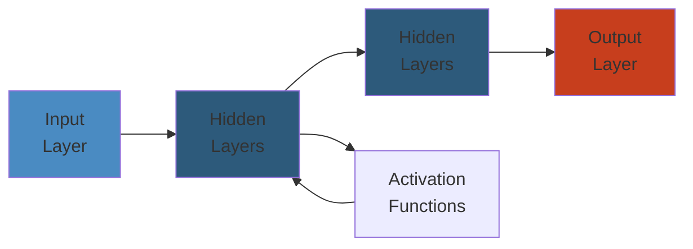

# 🛣️ Backend Engineer Learning Roadmap — Complete Deep Dive

> **Scope:** A tiered, self-paced curriculum spanning 5 phases from absolute beginner to Staff/Principal Engineer. Each phase covers programming fundamentals, systems knowledge, operations, architecture, and soft skills. Estimated time per phase, key topics, recommended books, projects, and success metrics are included.




## Table of Contents

- [Phase 1: Foundation (0–6 Months)](#phase-1-foundation-0-6-months)
- [Phase 2: Intermediate (6–18 Months)](#phase-2-intermediate-6-18-months)
- [Phase 3: Advanced (18–36 Months)](#phase-3-advanced-18-36-months)
- [Phase 4: Staff (36–60 Months)](#phase-4-staff-36-60-months)
- [Phase 5: Principal (60+ Months)](#phase-5-principal-60-months)
- [ASCII Progression Diagram](#ascii-progression-diagram)
- [Books by Phase](#books-by-phase)
- [Projects by Phase](#projects-by-phase)
- [Success Metrics by Phase](#success-metrics-by-phase)

---

## ASCII Progression Diagram

```
 ┌─────────────────────────────────────────────────────────────────────┐
 │                  Backend Engineer Growth Arc                        │
 └─────────────────────────────────────────────────────────────────────┘

 Impact
   ▲                          ┌─────────────────┐
   │                          │  Phase 5        │
   │                          │  Principal       │
   │                          │  Org leverage    │
   │                         ┌┘ Technology       │
   │   ┌────────────────┐    │ strategy          │
   │   │  Phase 4       │    └──────────────────┘
   │   │  Staff         │
   │   │  Architecture  │
   │   │  Reliability   │
   │  ┌┘ Cross-team     │
   │  │ └────────────────┘
   │  │ ┌───────────────────────┐
   │  │ │  Phase 3              │
   │  │ │  Senior / Advanced    │
   │  │ │  Microservices, Dist  │
   │  │ │  Systems, Design      │
   │  │ │  Interview Prep       │
   │ ┌┘ └───────────────────────┘
   │ │ ┌──────────────────────────────┐
   │ │ │  Phase 2                     │
   │ │ │  Mid-Level                   │
   │ │ │  Concurrency, Docker, Caches │
   │ │ │  Message Queues, CI/CD       │
   │┌┘ └──────────────────────────────┘
   ││ ┌─────────────────────────────────────┐
   ││ │  Phase 1                             │
   ││ │  Beginner / Junior                   │
   ││ │  Python/Java, DSA, SQL, REST, Git    │
   │└─└─────────────────────────────────────┘
   └─────────────────────────────────────────────────────────────► Time
```

---

## Phase 1: Foundation (0–6 Months)

### Objectives
Write clean, testable code. Understand basic web request flow. Build & deploy a simple CRUD API.

### Topics

| Category | Topics | Depth |
|---|---|---|
| **Language (Python or Java)** | Variables, types, conditionals, loops, functions, classes, exceptions, file I/O | Write 50 small programs |
| **Data Structures & Algorithms** | Arrays, linked lists, stacks, queues, hash tables, trees, graphs, sorting, searching, recursion | Solve ~100 problems (LeetCode Easy) |
| **Basic Networking** | HTTP methods, status codes, headers, cookies, sessions, DNS resolution, TLS handshake | Explain what happens when you type a URL |
| **Databases** | CRUD, SELECT with WHERE/JOIN/GROUP BY/ORDER BY, indexing basics, normalization (1NF–3NF) | Build a schema for a blog |
| **Version Control** | git init, add, commit, push, pull, branch, merge, rebase, conflict resolution | Contribute to a team repo |
| **REST APIs** | Resource naming, GET/POST/PUT/DELETE, JSON, status codes, basic auth, OpenAPI/Swagger | Build a todo API |
| **Testing** | Unit tests, assertions, test runners, mocking, test coverage | Achieve >80% coverage |
| **Dev Environment** | Terminal, editors (VS Code/IntelliJ), package managers (pip/maven/gradle), virtual environments | — |

### Recommended Books
- *Structure and Interpretation of Computer Programs* (SICP) — Abelson & Sussman
- *Head First Design Patterns* — Freeman & Robson (first pass)
- *HTTP: The Definitive Guide* — Gourley & Totty (Ch 1–4)

### Projects
| Project | Concepts Reinforced |
|---|---|
| CLI Todo app with file persistence | I/O, data structures, error handling |
| Personal blog API (Flask/FastAPI/Spring Boot) | REST, SQL, ORM, testing |
| URL shortener (minimal) | HTTP redirects, hashing, base62 encoding |
| Markdown note-taking app with search | Full-text search, indexing, CRUD |

### Success Metrics
- Can build a REST API from scratch without a tutorial
- Solves LeetCode Easy in <20 min
- Writes unit tests before code for simple functions
- Understands and can explain git branching strategy

---

## Phase 2: Intermediate (6–18 Months)

### Objectives
Write concurrent, production-ready code. Containerize services. Use caches and message queues. Set up CI/CD.

### Topics

| Category | Topics | Depth |
|---|---|---|
| **Advanced Programming** | Concurrency (threads, thread pools, async/await), memory management (stack vs heap, GC), profiling, debugging | Identify & fix a deadlock |
| **Design Patterns** | Singleton, Factory, Strategy, Observer, Decorator, Builder, Adapter, Template Method, Dependency Injection | Apply 3 patterns in a real project |
| **Testing Pyramid** | Integration tests, contract tests, E2E tests, test containers, property-based testing | Test a payment flow end-to-end |
| **CI/CD** | GitHub Actions / GitLab CI / Jenkins, build pipelines, artifact repos, semantic versioning, changelogs | Automate deploy to staging |
| **Databases Deep** | Transactions (ACID), isolation levels (READ COMMITTED, SERIALIZABLE), MVCC, deadlock detection, read replicas, connection pooling (HikariCP, PgBouncer) | Tune a pgbench workload |
| **Caching** | Redis: data structures (strings, sets, sorted sets, hashes), TTL, eviction policies (LRU, LFU, LFU with aging), pub/sub, transactions, pipelining | Cache a DB query with invalidation |
| **Message Queues** | Kafka: topics, partitions, consumer groups, offset commit, exactly-once semantics. RabbitMQ: exchanges, bindings, dead letter queues | Build an async email notification service |
| **Containerization** | Dockerfile best practices (multi-stage builds, distroless, .dockerignore), Docker Compose (networks, volumes, health checks, depends_on) | Containerize a 3-tier app |
| **Orchestration Basics** | Kubernetes: pods, deployments, services, ConfigMaps, Secrets, namespaces, kubectl | Deploy a stateless app to minikube |
| **Monitoring** | Prometheus (metric types, scrape config, alerting rules), Grafana (dashboards, panels, variables), structured logging (JSON, correlation IDs) | Dashboard for p99 latency |

### Recommended Books
- *Effective Java* (3rd Ed.) — Bloch
- *Designing Data-Intensive Applications* (Part I) — Kleppmann
- *Database Internals* (Ch 1–6) — Petrov
- *Docker Deep Dive* — Poulton

### Projects
| Project | Concepts Reinforced |
|---|---|
| Rate-limited API gateway | Caching, rate limiting (token bucket), middleware |
| Real-time chat server (WebSocket) | Concurrency, pub/sub, connection management |
| E-commerce cart service | Transactions, optimistic locking, Redis sessions |
| CI/CD pipeline with canary deploys | GitHub Actions, Docker, K8s rolling updates |
| Monitoring stack (Prometheus+Grafana+Alertmanager) | Metrics, SLIs, SLOs, alert fatigue |

### Success Metrics
- Can explain how MVCC works in PostgreSQL
- Debugs a production deadlock from logs alone
- Designs a Docker Compose setup for microservices
- Writes integration tests that cover failure scenarios

---

## Phase 3: Advanced (18–36 Months)

### Objectives
Design distributed systems. Make architectural tradeoffs. Lead design discussions. Master system design interviews.

### Topics

| Category | Topics | Depth |
|---|---|---|
| **Microservices Architecture** | Bounded contexts, domain-driven design (entities, value objects, aggregates, domain events, repositories), service decomposition strategies (business capability, subdomain), inter-service communication (sync vs async), API gateway, service mesh (Envoy, Istio, Linkerd), circuit breaker (Resilience4j, Hystrix), bulkhead, retry with backoff, timeouts, service discovery, configuration management (Consul, etcd, Spring Cloud Config) | Decompose a monolith into 6+ services |
| **Distributed Systems** | CAP theorem (real examples: Cassandra, Spanner), PACELC, consistency models (strong, eventual, causal, read-your-writes, monotonic reads), Raft consensus (leader election, log replication, safety), Gossip protocols, vector clocks, distributed transactions (2PC, 3PC, Saga, TCC), distributed ID generation (Snowflake, Leaf, UUIDv7) | Implement Raft leader election |
| **Advanced Databases** | Sharding strategies (hash-based, range-based, directory-based), distributed SQL (CockroachDB, TiDB, YugabyteDB), NoSQL internals (Dynamo-style DHT, Cassandra compaction strategies, MongoDB WiredTiger storage engine, CRDTs, Redis Cluster hash slots), time-series DBs (InnoDB, LSM-tree, Tiered storage, downsampling) | Design a distributed SQL database |
| **Stream Processing** | Kafka Streams (KTable, KStream, state stores, exactly-once), Apache Flink (event time, watermarks, checkpoints, savepoints, state backends), change data capture (CDC) with Debezium, stream-table duality, materialized views | Build a real-time fraud detection pipeline |
| **Observability** | OpenTelemetry (traces, metrics, logs, baggage), distributed tracing (W3C trace context, sampling strategies, head-based vs tail-based), logging: structured, correlation IDs, log aggregation (Loki, ELK), metrics: RED method, USE method, four golden signals | Correlate a trace across 5 services |
| **IaC & GitOps** | Terraform (modules, state, workspaces, remote state, providers), Helm (charts, templates, values, hooks, dependencies, repos), ArgoCD / Flux (sync policies, health checks, pruning, rollback), Pulumi | Manage K8s infra with GitOps |
| **System Design Interview** | Functional → Non-functional → Core entities → API → Data model → HLD → Deep dive → Tradeoffs → Scaling → Failure analysis | Mock-interview 20+ questions |

### Recommended Books
- *Designing Data-Intensive Applications* (complete) — Kleppmann
- *Building Microservices* (2nd Ed.) — Newman
- *Database Internals* (complete) — Petrov
- *System Design Interview* (Vol 1 & 2) — Xu
- *Streaming Systems* — Akidau, Chernyak, Lax

### Projects
| Project | Concepts Reinforced |
|---|---|
| Raft-based distributed key-value store | Consensus, log replication, leader election |
| Event-sourced order management system | CQRS, ES, saga orchestration |
| Real-time analytics pipeline (Flink + Kafka) | Stream processing, watermarks |
| Multi-region active-active deployment | Geo-distribution, CRDTs, conflict resolution |

### Success Metrics
- Passes FAANG system design interviews
- Leads architecture decisions that survive production incidents
- Implements a consensus algorithm from scratch
- Designs a system with p99 < 10ms at 100K QPS

---

## Phase 4: Staff (36–60 Months)

### Objectives
Design systems at Google/Netflix scale. Understand OS internals deeply. Lead incident response. Influence org-wide.

### Topics

| Category | Topics |
|---|---|
| **Distributed Consensus** | Paxos (basic, multi-Paxos, Fast Paxos, Cheap Paxos), Raft variants, Vertical Paxos, EPaxos, Viewstamped Replication, ZAB |
| **Database Internals** | B-tree (page structure, splitting, merging, concurrency: latch crabbing), LSM-tree (SSTable, compaction strategies, bloom filters, merge iterators), MVCC (visibility checks, vacuum, undo logs), WAL (physiological logging, ARIES), replication internals (sync/async, quorum, read-after-write consistency) |
| **OS Internals** | Kernel architecture, scheduler (CFS, O(1), BFS, EDF), memory management (paging, NUMA, THP, OOM killer, cgroups, memory reclaim), file systems (inodes, ext4, XFS, btrfs, page cache, dirty page writeback), networking stack (socket buffer, TCP/IP stack, epoll, io_uring, eBPF, XDP), context switching cost, syscall overhead |
| **Production Reliability** | SRE principles (SLO, SLI, error budget, toil automation, blameless postmortems, incident command system), capacity planning, load testing (locust, k6, wrk2), chaos engineering (Chaos Mesh, Litmus, Gremlin), canary analysis, gradual rollouts, feature flags, dark launches |
| **Large-Scale Design** | Global load balancing (anycast, BGP, DNS-based), CDN architecture, multi-region active-active, global consensus (Spanner TrueTime, Clock-SI), petabyte-scale storage (GFS, HDFS, Ceph), billion-user social graph, real-time search indexing |

### Recommended Books
- *Operating Systems: Three Easy Pieces* (OSTEP) — Arpaci-Dusseau
- *Advanced Programming in the UNIX Environment* (APUE) — Stevens
- *TCP/IP Illustrated* (Vol 1) — Stevens
- *Database Internals* — Petrov (re-read)
- *Site Reliability Engineering* — Beyer et al.
- *The Linux Programming Interface* — Kerrisk

### Projects
| Project | Concepts Reinforced |
|---|---|
| Implement a simple database storage engine (B-tree) | Page management, latch crabbing, WAL |
| eBPF-based performance profiler | Kernel tracing, perf events |
| Multi-region CDN cache (edge + origin) | Anycast, consistent hashing, cache hierarchy |
| SLO-based auto-scaler for K8s | Error budgets, vertical/horizontal pod autoscaling |

### Success Metrics
- Designs systems that survive region-level outages
- Reduces infrastructure cost by 30%+ via architecture changes
- Mentors 3+ senior engineers to promotion
- Leads postmortems that drive systemic improvements

---

## Phase 5: Principal (60+ Months)

### Objectives
Set technical direction for the org. Influence industry. Build platforms, not products.

### Topics

| Category | Topics |
|---|---|
| **Architectural Decision Making** | ADRs (Architecture Decision Records), decision frameworks (cost-benefit, tradeoff sliders, risk matrix), writing technical design docs, running design reviews, handling disagreement, killing projects |
| **Organizational Design** | Conway's law, team topology (stream-aligned, enabling, complicated-subsystem, platform), Spotify model, squad health checks, Dunbar's number for teams, team API surfaces, DORA metrics, SPACE framework |
| **Technology Strategy** | Build vs buy vs open source, migration strategies (strangler fig, parallel run, big bang), sunsetting, technology radar, innovation tokens, platform vs product mindset, 5-year technical vision |
| **Developer Productivity** | Inner source, developer portals (Backstage), platform engineering, golden paths, paved roads, IDP (Internal Developer Platform), compute abstractions, environment management (Ephemeral environments, Tilt, Skaffold) |
| **Open Source & Community** | Contributing to major projects (Kubernetes, Kafka, gRPC), starting a CNCF project, speaking at conferences (KubeCon, Strange Loop, QCon), writing technical books/blogs, building reputation |
| **M&A Technical Due Diligence** | Codebase audit, architecture assessment, security review, integration cost estimation, technical debt evaluation, team capability assessment, cultural fit |

### Recommended Books
- *Staff Engineer: Leadership Beyond the Management Track* — Larson
- *The Manager's Path* — Fournier
- *An Elegant Puzzle* — Larson
- *Team Topologies* — Skelton & Pais
- *Accelerate* — Forsgren, Humble, Kim
- *The Mythical Man-Month* — Brooks

### Projects
| Project | Concepts Reinforced |
|---|---|
| Build an Internal Developer Platform (IDP) | Platform engineering, golden paths, Backstage |
| Open source a tool used by 1000+ developers | Community management, CI, documentation |
| Lead a major migration (monolith → microservices) | Strangler fig, migration patterns, org change |
| Establish an engineering blog / conference talk program | Knowledge sharing, recruiting, brand |

### Success Metrics
- Org ships 2x faster than before your platform changes
- Multiple engineers promoted to Staff under your mentorship
- Conference talks accepted at tier-1 conferences
- Technology strategy adopted org-wide

---

## Books by Phase

```
Phase 1          Phase 2          Phase 3              Phase 4               Phase 5
─────────        ─────────        ──────────            ──────────            ──────────
SICP             Effective Java   DDIA (complete)      OSTEP                Staff Engineer
HTTP Definitive  DDIA (Part I)    Building Microserv.  APUE                 Manager's Path
Head First DP    Database Int.    Database Int (full)  TCP/IP Illus. Vol 1  An Elegant Puzzle
                 Docker Deep Dive Streaming Systems    SRE Book             Team Topologies
                 Clean Code       System Design Int.   Linux Prog. Intf.    Accelerate
                 Pragmatic Prog.  K8s in Action        DDIA (re-read)       Mythical Man-Month
                                               
```

## Projects by Phase

```
Phase 1              Phase 2                 Phase 3                      Phase 4              Phase 5
─────────            ─────────               ──────────                   ──────────            ──────────
CLI Todo             Rate-limited Gateway    Raft KV Store                B-tree Engine        IDP (Backstage)
Blog API             Chat Server (WS)        Event-sourced Order          eBPF Profiler         Open Source Tool
URL Shortener        E-commerce Cart         Real-time Analytics          Multi-region CDN      Monolith→Microsvc
Markdown Notes       CI/CD Canary Deploy     Multi-region Active-Active   SLO Auto-scaler       Eng Blog Program
                     Monitoring Stack        Distributed Task Scheduler
```

## Success Metrics by Phase

| Phase | Technical | Leadership | Business |
|---|---|---|---|
| **P1** | LeetCode Easy <20min | Code reviews | Ship features independently |
| **P2** | Debug deadlock from logs | On-call rotation lead | Own a service end-to-end |
| **P3** | Pass FAANG system design | Design review contributor | Lead a 6-month project |
| **P4** | B-tree from scratch | Mentors 3+ seniors | 30% infra cost reduction |
| **P5** | Industry-wide influence | Org-level direction | 2x org shipping velocity |

---

> **Final note:** This roadmap is a guide, not a checklist. Progression is non-linear — you may revisit earlier phases as you encounter new technologies. The most important success metric is your ability to **design, build, and operate systems that solve real user problems reliably**. Start with Phase 1, build the URL shortener, and iterate. Each project teaches more than reading ten books.
