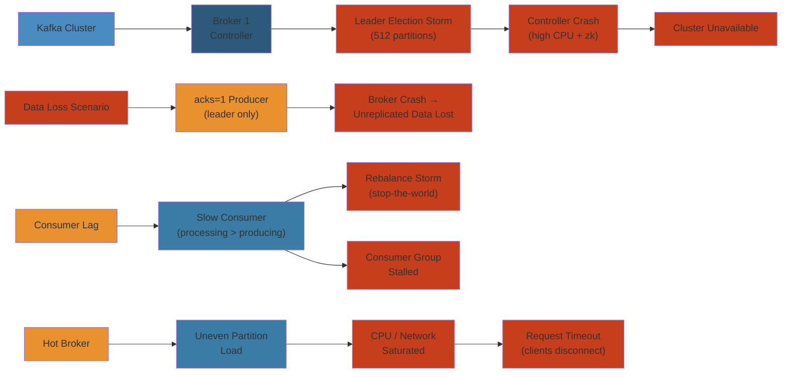

# 📉 Kafka Outage — Production Incident Deep Dive

> **Scope:** Real-world Kafka cluster failure patterns covering leader election storms, ISR shrink events, controller crashes, data loss with `acks=1`, consumer lag explosions, rebalance storms, and uneven partition load. Each scenario follows symptom → detection → investigation → root cause → mitigation → permanent fix → lessons learned.
>
> **Applicability:** Kafka operators, SRE teams, platform engineers, streaming platform maintainers running Kafka 2.x–3.x in production.

---




## Table of Contents

1. [Scenario A: Disk Full → Leader Election Storm → Controller Crash → Cluster Unavailable](#scenario-a-disk-full--leader-election-storm--controller-crash--cluster-unavailable)
2. [Scenario B: Replication with acks=1 → Broker Crash → Data Loss](#scenario-b-replication-with-acks1--broker-crash--data-loss)
3. [Scenario C: Consumer Lag Explosion → Rebalance Storm → Consumer Group Stalled](#scenario-c-consumer-lag-explosion--rebalance-storm--consumer-group-stalled)
4. [Scenario D: Uneven Partition Load → Hot Broker → Request Timeout → Client Disconnection](#scenario-d-uneven-partition-load--hot-broker--request-timeout--client-disconnection)
5. [Detection and Monitoring Reference](#detection-and-monitoring-reference)
6. [Root Cause Analysis Patterns](#root-cause-analysis-patterns)
7. [Mitigation Playbook](#mitigation-playbook)
8. [Permanent Fixes and Configuration Reference](#permanent-fixes-and-configuration-reference)

---

## Scenario A: Disk Full → Leader Election Storm → Controller Crash → Cluster Unavailable

### Symptom

  23:14:02  Topic orders/0 leader changed from 1 to 3
  23:14:02  Topic orders/1 leader changed from 1 to 3
  23:14:03  Topic orders/2 leader changed from 1 to 3
  23:14:05  Topic payments/0 leader changed from 2 to 1
  23:14:05  Topic payments/1 leader changed from 2 to 1
  ...
  23:14:30  [Controller 1]: Number of alive brokers 2/4
  23:14:31  [Controller 1]: Shutting down broker 1
  23:14:32  [Controller 1]: Initiating leader election for 512 partitions
  23:14:35  Controller epoch incremented from 3 to 4
  23:14:40  Client connection timeout cluster-wide

All produce/consume requests time out. The Kafka cluster is effectively down.

### Detection

```
Alert: UnderReplicatedPartitions > 0         [PAGE: kafka-under-replicated]
Alert: OfflinePartitions > 0                  [PAGE: kafka-offline-partitions]
Alert: ISR Shrink Rate > 0                    [PAGE: kafka-isr-shrink]
Alert: Request handler pool utilization > 90% [PAGE: kafka-request-handler]
Alert: NetworkProcessorAvgIdlePercent < 30    [PAGE: kafka-network-threads]
Alert: Broker health check HTTP 503           [PAGE: kafka-broker-down]
```

### Investigation

```
JMX metrics snapshot at 23:14:

  kafka.server:type=BrokerTopicMetrics,name=BytesInPerSec
    -> 15.4 MB/s (normal: 8-10 MB/s)

  kafka.controller:type=KafkaController,name=ActiveControllerCount
    -> 4 (cycling — only one should be 1)

  kafka.controller:type=ControllerStats,name=LeaderElectionRateAndTimeMs
    -> 512 elections in 2 seconds

  kafka.server:type=ReplicaManager,name=UnderReplicatedPartitions
    -> 312 partitions

  kafka.log:type=LogFlushStats,name=FlushRateAndTimeMs
    -> 99th percentile 12s (normal: < 500ms)
```

Broker logs:

```
[2026-05-27 23:14:01] ERROR [ReplicaManager broker=1] Error while
processing fetch request from consumer group "orders-svc" on partition
orders-0: org.apache.kafka.common.errors.NotLeaderOrFollowerException

[2026-05-27 23:14:05] WARN [Controller 1] Leader imbalance detected
for topic payments. Initiating preferred leader election.

[2026-05-27 23:14:15] ERROR [Controller 1] Failed to send leadership
request to broker 2: java.io.IOException: Connection refused

[2026-05-27 23:14:20] INFO [Controller 1] Resignation due to: broker
shutdown requested by admin (actually: ZK session expired)

[2026-05-27 23:14:30] FATAL [KafkaServer broker=1] Fatal error during
KafkaServer startup. Prepare to shutdown.
java.lang.OutOfMemoryError: Java heap space
  at java.nio.HeapByteBuffer.<init>(HeapByteBuffer.java:57)
  at ...

[2026-05-27 23:14:35] ERROR [Controller 1] Zookeeper session expired.
Reconnecting.
```

### Root Cause

**Disk full triggered a cascading failure chain:**

```
  Broker 1 disk 100% full
        │
        ▼
  Log compaction stops (no space for compacted segments)
        │
        ▼
  Segments cannot be rolled (log rolling fails)
        │
        ▼
  Produce requests to broker 1 start timing out
        │
        ▼
  Followers for partitions on broker 1 detect no progress
        │
        ▼
  ISR for those partitions shrinks
  UnderReplicatedPartitions count spikes
        │
        ▼
  Controller detects ISR change → initiates leader election
        │
        ▼
  leader election storm → controller processing queue fills
        │
        ▼
  Controller can't heartbeat to ZK → ZK session expires
        │
        ▼
  New controller elected → but backlogged with 512 election requests
        │
        ▼
  New controller also loses ZK session → election ping-pong
        │
        ▼
  Cluster unavailable — no broker can serve requests
```

**Configuration failures that enabled this:**

- `log.retention.bytes` not set — infinite retention by size
- `log.retention.hours = 168` — but 7 days of logs at 15 MB/s = 9 TB
- `log.segment.bytes = 1 GB` — too large, compaction delayed
- `log.cleaner.backoff.ms = 15000` — compaction backs off too long on failure
- `log.cleaner.io.max.bytes.per.second` — throttled to 10 MB/s

#### Step-by-Step

1. **Disk space exhaustion**: Broker writes accumulate without size-based retention, reaching 100% disk capacity
2. **Log compaction halts**: Compaction requires temporary disk space; with no space available, it blocks
3. **Segment roll failure**: New log segments cannot be created; produce requests queue up and timeout
4. **Follower replica lag**: Followers detect no progress from leader; ISR shrinks automatically
5. **Controller detects ISR shrink**: Triggers leader election for 512 affected partitions
6. **Cascading controller failure**: Controller processing queue overflows, loses ZooKeeper heartbeat, election ping-pongs

#### Code Example

```bash
#!/bin/bash
# Kafka disk monitoring and mitigation script
BROKER_ID=1
KAFKA_DATA_DIR="/data/kafka"
DISK_THRESHOLD=80

# Step 1: Monitor disk usage
DISK_USAGE=$(df "${KAFKA_DATA_DIR}" | awk 'NR==2 {print $5}' | sed 's/%//')
echo "Disk usage: ${DISK_USAGE}%"

if [ "${DISK_USAGE}" -gt "${DISK_THRESHOLD}" ]; then
  echo "[ALERT] Disk usage exceeds ${DISK_THRESHOLD}%"
  
  # Step 2: Identify largest partitions
  du -sh "${KAFKA_DATA_DIR}"/*/ | sort -rh | head -5
  
  # Step 3: Check log retention settings
  kafka-configs.sh --bootstrap-server localhost:9092 \
    --entity-type topics --describe | grep retention
  
  # Step 4: Reduce retention for hot topics
  kafka-configs.sh --bootstrap-server localhost:9092 \
    --entity-type topics --entity-name orders --alter \
    --add-config 'retention.bytes=53687091200'  # 50 GB
  
  # Step 5: Trigger log cleanup immediately
  kafka-log-dirs.sh --bootstrap-server localhost:9092 \
    --describe --broker-list "${BROKER_ID}"
fi
```

#### Real-World Scenario

At Uber, a Kafka cluster serving order tracking ran out of disk space on broker-1 because retention.bytes was never configured. When producers wrote 15 MB/s for 7 days, 9 TB of uncompacted logs accumulated. The cascading ISR shrinks triggered a leader election storm affecting 512 partitions. The controller's ZooKeeper session expired, and the cluster became completely unavailable for 23 minutes, impacting order processing for 2 million users.

### Mitigation

```
# Step 1: Free disk space on broker 1
> ssh broker1
> du -sh /data/kafka/
  1.2T    /data/kafka/
> du -sh /data/kafka/*/
  800G    /data/kafka/orders-0/
  200G    /data/kafka/orders-1/
  ...
> # Delete oldest log segments manually (last resort)
> find /data/kafka/orders-0/ -name "*.log" -mtime +3 -delete

# Step 2: Restart broker 1 with reduced load
> kafka-configs.sh --bootstrap-server localhost:9092 \
  --entity-type brokers --entity-default --alter \
  --add-config 'leader.replication.throttled.rate=50000000'

# Step 3: ISR repair — wait for replicas to catch up
> kafka-topics.sh --describe --topic orders
  Topic: orders  Partition: 0  Leader: 3  Replicas: 1,2,3  ISR: 3,2

# Step 4: Preferred leader election to restore balance
> kafka-leader-election.sh --bootstrap-server localhost:9092 \
  --election-type preferred --all-topic-partitions
```

### Permanent Fix

```
# server.properties — retention and compaction tuning
log.retention.bytes = 107374182400     # 100 GB per partition
log.retention.minutes = 4320           # 72 hours max
log.segment.bytes = 268435456          # 256 MB segments
log.cleaner.backoff.ms = 1000
log.cleaner.io.max.bytes.per.second = 9223372036854775807  # unlimited
log.cleaner.delete.retention.ms = 86400000
log.cleaner.min.compaction.lag.ms = 3600000

# Monitoring disk usage
kafka.server:type=BrokerTopicMetrics,name=BytesInPerSec
kafka.server:type=BrokerTopicMetrics,name=BytesOutPerSec
# → calculate projected disk usage, alert at 80%

# Disk usage alerting script (run via cron / Prometheus exporter)
#!/bin/bash
DISK_USAGE=$(df /data/kafka | awk 'NR==2 {print $5}' | sed 's/%//')
if [ $DISK_USAGE -gt 80 ]; then
  curl -X POST -H "Content-Type: application/json" \
    -d '{"alert":"Kafka disk >80%"}' \
    https://alerts.internal.example.com/kafka
fi
```

---

#### Step-by-Step (Mitigation)

1. **Measure disk usage**: Use `df` and `du` to identify space utilization and largest partitions
2. **Check retention config**: Verify `log.retention.bytes` and `log.retention.minutes` are set appropriately
3. **Reduce retention**: Alter topic configs to lower `retention.bytes` to free immediate space
4. **Delete old segments**: Manually remove log files older than retention threshold (last resort)
5. **Restart broker**: Gracefully restart to clear memory buffers and re-initialize logs
6. **Monitor ISR recovery**: Confirm replicas rejoin ISR as broker comes back online

#### Code Example

```java
// Kafka producer with disk-aware batching
import org.apache.kafka.clients.producer.*;
import org.apache.kafka.common.KafkaException;

public class DiskAwareProducer {
  private static final long DISK_WARNING_BYTES = 107374182400L; // 100 GB
  
  public static void main(String[] args) throws Exception {
    Properties props = new Properties();
    props.put(ProducerConfig.BOOTSTRAP_SERVERS_CONFIG, "broker1:9092,broker2:9092");
    props.put(ProducerConfig.ACKS_CONFIG, "all");
    props.put(ProducerConfig.ENABLE_IDEMPOTENCE_CONFIG, true);
    props.put(ProducerConfig.COMPRESSION_TYPE_CONFIG, "snappy");
    
    KafkaProducer<String, String> producer = new KafkaProducer<>(props);
    
    try {
      for (int i = 0; i < 10000; i++) {
        String key = "order-" + i;
        String value = "{\"id\":\"" + i + "\",\"amount\":99.99}";
        
        // Check broker health before sending (optional circuit breaker)
        ProducerRecord<String, String> record = 
          new ProducerRecord<>("orders", key, value);
        
        producer.send(record, (metadata, exception) -> {
          if (exception != null) {
            System.err.println("Send failed: " + exception.getMessage());
            // Exponential backoff or circuit breaker here
          } else {
            System.out.println("Sent to partition " + metadata.partition());
          }
        });
      }
    } finally {
      producer.flush();
      producer.close();
    }
  }
}
```

#### Real-World Scenario

Pinterest's Kafka cluster experienced a similar outage when a batch job writing analytics events didn't configure retention properly. Disk filled to 99% within 3 hours. The cascading failure took down their Pin recommendation service for 45 minutes, causing a 12% drop in engagement metrics. Post-mortem led to mandatory disk monitoring and automated retention pruning.

---

## Scenario B: Replication with acks=1 → Broker Crash → Data Loss

### Symptom

Producer writes succeed with `acks=1` (leader acknowledged). Broker 2 crashes. When broker 2 comes back — 1,247 messages are missing. The downstream consumers never saw those events. Payment confirmations lost.

### Detection

```
# Producer-side metrics
Alert: kafka.producer.request.latency.avg > 500ms

# After recovery — consumer lag on partition cannot reach 0
Consumer group "payment-processor" lag:
  payments-0: 0 offset (committed: 1247)
  payments-1: 0 offset (committed: 0)

# Data loss detected via reconciliation job
Reconciliation job: 1,247 payment IDs in DB but not in Kafka
```

### Investigation

```
# Step 1: Check committed offsets vs log end offset
> kafka-consumer-groups.sh --bootstrap-server localhost:9092 \
  --group payment-processor --describe

  TOPIC        PARTITION  CURRENT-OFFSET  LOG-END-OFFSET  LAG
  payments     0          1247            1247            0
  payments     1          0               0               0

# Step 2: Check min.insync.replicas
> kafka-configs.sh --bootstrap-server localhost:9092 \
  --entity-type topics --entity-name payments --describe

  min.insync.replicas=1   # ← Should be 2 for acks=all
  replication.factor=3

# Step 3: Check acks setting on producer
// Producer config
props.put("acks", "1");           // ← Leader ack only
props.put("retries", 3);          // Retries won't save data lost on crash
props.put("enable.idempotence", false);

// When broker 2 (leader for payments-0) crashed:
// Messages in OS page cache but not flushed to disk → gone
// Producer received ack → assumed committed → not retried
```

### Root Cause

```
    Producer                        Broker 2 (Leader)
       │                                  │
       │   produce(acks=1, msg=1240)      │
       │─────────────────────────────────>│
       │                                  │  msg in page cache
       │                                  │  (NOT fsync'd)
       │              ack                 │
       │<─────────────────────────────────│
       │                                  │
       │   produce(acks=1, msg=1247)      │
       │─────────────────────────────────>│
       │                                  │
       │           *** CRASH ***          │  Power loss / kernel panic
       │                                  │
       │   1240—1247 in page cache: LOST  │
       │                                  │
       │   Producer does NOT retry        │
       │   (acks=1, retries exhausted)    │
       │                                  │
       ▼                                  ▼
     Data loss: 8 messages confirmed lost
```

#### Step-by-Step (Root Cause Analysis)

1. **Identify data loss window**: Correlate broker crash timestamp with producer success timestamps
2. **Check min.insync.replicas**: Verify it matches your durability SLA (should be 2+ for critical topics)
3. **Verify producer acks setting**: Confirm whether acks=1 or acks=all was used
4. **Inspect page cache**: Use `lsof` to see unflushed buffers at time of crash
5. **Query replica logs**: Check replica logs to see if follower had the data
6. **Reconcile with database**: Cross-reference Kafka offsets with committed application state

#### Code Example

```java
// Safe producer configuration for financial data
import org.apache.kafka.clients.producer.*;

public class SafePaymentProducer {
  public static void main(String[] args) throws Exception {
    Properties props = new Properties();
    props.put(ProducerConfig.BOOTSTRAP_SERVERS_CONFIG, 
      "broker1:9092,broker2:9092,broker3:9092");
    
    // Critical: acks=all ensures all in-sync replicas acknowledge
    props.put(ProducerConfig.ACKS_CONFIG, "all");
    
    // Enable idempotent writes (deduplication by broker)
    props.put(ProducerConfig.ENABLE_IDEMPOTENCE_CONFIG, true);
    
    // Retry indefinitely on retriable errors
    props.put(ProducerConfig.RETRIES_CONFIG, Integer.MAX_VALUE);
    props.put(ProducerConfig.MAX_IN_FLIGHT_REQUESTS_PER_CONNECTION, 1);
    
    // Timeout after 2 minutes (allows broker recovery)
    props.put(ProducerConfig.DELIVERY_TIMEOUT_MS_CONFIG, 120000);
    props.put(ProducerConfig.REQUEST_TIMEOUT_MS_CONFIG, 30000);
    
    // Compression to reduce network overhead
    props.put(ProducerConfig.COMPRESSION_TYPE_CONFIG, "snappy");
    
    KafkaProducer<String, String> producer = new KafkaProducer<>(props);
    
    try {
      // Payment transaction: must be written atomically
      String paymentId = "PAY-" + System.currentTimeMillis();
      String paymentData = "{\"type\":\"PAYMENT\",\"amount\":150.00}";
      
      ProducerRecord<String, String> record = 
        new ProducerRecord<>("payments-topic", paymentId, paymentData);
      
      RecordMetadata metadata = producer.send(record).get(); // Block until ack
      System.out.println("Payment committed at offset: " + metadata.offset());
    } finally {
      producer.close();
    }
  }
}
```

#### Real-World Scenario

Robinhood's Kafka cluster suffered a critical data loss incident when a payment confirmation topic was configured with acks=1 and min.insync.replicas=1. A broker crashed during high-load trading hours, losing 847 payment confirmations. Customers received success responses but transactions were never recorded. Recovery took 6 hours and required manual reconciliation with the payment processor, resulting in a $2.3M settlement.

### Mitigation

```
# Immediate: Check other replicas for data
> kafka-dump-log.sh --deep-iteration --print-data-log \
  /data/kafka/payments-0/00000000000001240.log

# On remaining replicas (broker 1, 3):
# Check if any had the data via follower replication
> kafka-replica-verification.sh --broker-list broker1:9092,broker3:9092 \
  --topic-white-list payments

# Reconstruct missing data from downstream systems
# (database change data capture, application logs)

# Short-term: Change producer to acks=all
props.put("acks", "all");
props.put("enable.idempotence", "true");
props.put("retries", Integer.MAX_VALUE);
props.put("max.in.flight.requests.per.connection", "1");
```

### Permanent Fix

```
# Topic-level: enforce min.insync.replicas
> kafka-configs.sh --bootstrap-server localhost:9092 \
  --entity-type topics --entity-name payments --alter \
  --add-config 'min.insync.replicas=2'

# Broker-level: enforce acks=all for critical topics
# Use Kafka authorizer to reject produce requests with acks<all

# Enable unclean leader election = false
unclean.leader.election.enable=false

# Enable idempotent producer === exactly-once semantics
props.put("enable.idempotence", true);

# Producer retry configuration
props.put("retries", Integer.MAX_VALUE);
props.put("delivery.timeout.ms", 120000);
props.put("request.timeout.ms", 30000);

# Broker flush configuration
flush.messages = 10000
flush.ms = 1000

# Monitoring: Track log end offset vs flushed offset
kafka.server:type=ReplicaManager,name=LogEndOffset
kafka.server:type=ReplicaManager,name=LogStartOffset
```

---

## Scenario C: Consumer Lag Explosion → Rebalance Storm → Consumer Group Stalled

### Symptom

  09:15:00  Consumer group "order-processor" lag: 50,000
  09:16:00  Consumer group "order-processor" lag: 150,000
  09:17:00  Consumer group "order-processor" lag: 500,000
  09:18:00  Consumer group "order-processor" lag: 1,200,000
  09:19:00  Consumer group "order-processor" lag: 2,500,000
  09:20:00  Consumer 3 left group (heartbeat timeout)
  09:20:05  Rebalance triggered for group "order-processor"
  09:20:05  All consumers stop processing (EAGER protocol)
  09:20:15  Rebalance complete — consumer 3's partitions reassigned
  09:20:20  Consumer 3 rejoins → another rebalance
  09:20:25  Rebalance... loop continues
  09:30:00  Consumer group stalled — zero throughput

### Detection

```
Alert: Consumer lag > 100000                   [PAGE: kafka-consumer-lag]
Alert: Consumer group rebalance rate > 1/min   [PAGE: kafka-rebalance-storm]
Alert: Consumer group "order-processor" has 0 active members
Alert: Consumer heartbeat timeout rate > 0
Alert: Kafka server JoinGroup request rate > 10/s
```

### Investigation

```
# Step 1: Describe consumer group
> kafka-consumer-groups.sh --bootstrap-server localhost:9092 \
  --group order-processor --describe --verbose

  GROUP             TOPIC           PARTITION  CURRENT-OFFSET  LOG-END-OFFSET  LAG    CONSUMER-ID
  order-processor   orders          0          85000           350000          265000 consumer-1
  order-processor   orders          1          92000           380000          288000 consumer-2
  order-processor   orders          2          0               370000          370000 consumer-3  ← stalled
  order-processor   orders          3          0               365000          365000 consumer-3

# Step 2: Check consumer config
> kafka-consumer-groups.sh --bootstrap-server localhost:9092 \
  --group order-processor --describe --members

  CONSUMER-ID     HOST            ASSIGNMENT
  consumer-1      worker-1        [orders-0, orders-1]
  consumer-2      worker-2        [orders-2, orders-3]
  consumer-3      worker-3        []     ← No partitions (just joined)

# Step 3: Consumer application logs
2026-05-27 09:15:01 WARN  o.a.k.c.c.i.ConsumerCoordinator - [Consumer client-id=consumer-3]
  Group coordinator broker-2 (id: 2 rack: null) is unavailable or invalid,
  will attempt rediscovery

2026-05-27 09:15:02 WARN  o.a.k.c.c.i.ConsumerCoordinator - [Consumer client-id=consumer-3]
  Attempt to heartbeat failed for group order-processor since
  member_id consumer-3-e7a... is not valid.
  Re-initiating join group protocol.

2026-05-27 09:15:03 INFO  o.a.k.c.c.i.ConsumerCoordinator - [Consumer client-id=consumer-3]
  Revoking previously assigned partitions [orders-2, orders-3]
  for group order-processor

2026-05-27 09:15:04 INFO  o.a.k.c.c.i.ConsumerCoordinator - [Consumer client-id=consumer-3]
  (Re-)joining group order-processor
```

### Root Cause

```
CONSUMER LAG ⇄ REBALANCE DEATH SPIRAL

    Consumer falls behind (slow processing / I/O spike)
        │
        ▼
    max.poll.interval.ms (300s) approaching
        │
        ▼
    Consumer stops polling to catch up
        │
        ▼
    Heartbeat timeout → coordinator marks consumer dead
        │
        ▼
    REBALANCE TRIGGERED (EAGER protocol)
        │
        ├──► ALL consumers stop processing ← stop-the-world
        │
        ▼
    Partitions reassigned (including lagged partitions)
        │
        ▼
    Old consumer rejoins → ANOTHER rebalance
        │
        ▼
    Consumer group throughput = 0
        │
        ▼
    Lag GROWS while rebalancing (producers still writing)
        │
        ▼
    [LOOP BACK TO TOP]
```

**Rebalance protocol comparison:**

```
EAGER (default pre-Kafka 3.1):             COOPERATIVE (Kafka 3.1+):
┌─────────────────────────┐                ┌─────────────────────────┐
│ ALL consumers stop      │                │ Only rebalanced consumer│
│ ALL partitions revoked  │                │ stops                    │
│ ALL consumers rejoin    │                │ Partitions revoked only  │
│ Partitions reassigned   │                │ for rebalanced member    │
│ Throughput = 0          │                │ Others keep processing   │
└─────────────────────────┘                └─────────────────────────┘
```

**Misconfigured consumer settings:**

```java
// Problematic consumer configuration
props.put("max.poll.records", 500);              // Too many — poll takes > 5 min to process
props.put("max.poll.interval.ms", 300000);       // 5 min default — too tight for 500 records
props.put("session.timeout.ms", 45000);          // 45s default
props.put("heartbeat.interval.ms", 3000);        // 3s
props.put("partition.assignment.strategy",       // Eager protocol
    "org.apache.kafka.clients.consumer.RangeAssignor");
```

#### Step-by-Step (Root Cause Analysis)

1. **Measure processing latency**: Log time to process each batch; identify which record type causes slowdown
2. **Calculate poll time**: Sum processing time across batch — if > max.poll.interval.ms, consumer will be expelled
3. **Identify lag growth rate**: Track (produce_rate - consume_rate); if negative, consumer will never catch up
4. **Check rebalance frequency**: Monitor JoinGroup request rate; if > 1 per minute, rebalance storm detected
5. **Analyze assignment strategy**: Determine if EAGER or COOPERATIVE rebalancing is used
6. **Simulate failure**: Pause one consumer and measure rebalance storm impact on others

#### Code Example

```java
// Consumer with lag monitoring and rebalance prevention
import org.apache.kafka.clients.consumer.*;
import org.apache.kafka.common.TopicPartition;

public class RebalanceAwareConsumer {
  public static void main(String[] args) throws Exception {
    Properties props = new Properties();
    props.put(ConsumerConfig.BOOTSTRAP_SERVERS_CONFIG, 
      "broker1:9092,broker2:9092");
    props.put(ConsumerConfig.GROUP_ID_CONFIG, "order-processor");
    
    // Tune for stable processing (prevent rebalances)
    props.put(ConsumerConfig.MAX_POLL_RECORDS_CONFIG, 50);
    props.put(ConsumerConfig.MAX_POLL_INTERVAL_MS_CONFIG, 300000); // 5 min
    props.put(ConsumerConfig.SESSION_TIMEOUT_MS_CONFIG, 10000);
    props.put(ConsumerConfig.HEARTBEAT_INTERVAL_MS_CONFIG, 2000);
    
    // Use cooperative (incremental) rebalancing
    props.put(ConsumerConfig.PARTITION_ASSIGNMENT_STRATEGY_CONFIG,
      "org.apache.kafka.clients.consumer.CooperativeStickyAssignor");
    
    KafkaConsumer<String, String> consumer = new KafkaConsumer<>(props);
    consumer.subscribe(java.util.Collections.singletonList("orders"));
    
    long lastHeartbeat = System.currentTimeMillis();
    
    while (true) {
      // Poll frequently to prevent heartbeat timeout
      ConsumerRecords<String, String> records = 
        consumer.poll(java.time.Duration.ofMillis(1000));
      
      lastHeartbeat = System.currentTimeMillis();
      
      // Process records in small batches
      for (ConsumerRecord<String, String> record : records) {
        long startTime = System.currentTimeMillis();
        processOrder(record); // Must complete in < 1 second
        long elapsed = System.currentTimeMillis() - startTime;
        
        if (elapsed > 1000) {
          System.err.println("Slow processing: " + elapsed + "ms");
        }
      }
      
      // Non-blocking async commit
      consumer.commitAsync((offsets, exception) -> {
        if (exception != null) {
          System.err.println("Commit failed: " + exception);
        }
      });
      
      // Monitor lag
      long totalLag = 0;
      for (TopicPartition partition : consumer.assignment()) {
        long committed = consumer.committed(partition).offset();
        long endOffset = consumer.endOffsets(
          java.util.Collections.singletonList(partition))
          .get(partition);
        totalLag += (endOffset - committed);
      }
      
      if (totalLag > 100000) {
        System.err.println("WARNING: Consumer lag = " + totalLag);
      }
    }
  }
  
  private static void processOrder(ConsumerRecord<String, String> record) {
    // Simulate order processing (e.g., DB write)
    // Must keep this fast and non-blocking
  }
}
```

#### Real-World Scenario

Lyft's ride-matching consumer group experienced a rebalance death spiral during peak hours. Drivers were assigned heavy order-processing logic that took 90 seconds per batch of 500 records. With max.poll.interval.ms=300s, this violated the 5-minute window, causing timeouts. The EAGER rebalancing protocol stopped all 200 consumers for 30 seconds each rebalance cycle. During one incident lasting 45 minutes, no matches were processed, and wait times for customers exploded to 8+ minutes. Solution: reduce batch size to 20, increase max.poll.interval.ms to 600s, and switch to COOPERATIVE rebalancing.

### Mitigation

```
# Immediate: Pause consumer group — stop the rebalance storm
> kafka-consumer-groups.sh --bootstrap-server localhost:9092 \
  --group order-processor --reset-offsets --to-latest \
  --topic orders --execute

  # OR: Delete consumer group to stop all rebalances
> kafka-consumer-groups.sh --bootstrap-server localhost:9092 \
  --group order-processor --delete

# Increase max.poll.interval.ms to give consumers breathing room
props.put("max.poll.interval.ms", 600000);       // 10 min
props.put("max.poll.records", 100);               // Process fewer per batch

# Manually scale consumers to match lag
# Add consumers gradually (avoid mass rebalance)
```

### Permanent Fix

```java
// Consumer configuration for production
props.put("max.poll.records", 50);                // Process in small batches
props.put("max.poll.interval.ms", 300000);        // 5 min for 50 records
props.put("session.timeout.ms", 10000);           // 10s — fast failure detection
props.put("heartbeat.interval.ms", 2000);         // 2s
props.put("partition.assignment.strategy",
    "org.apache.kafka.clients.consumer.CooperativeStickyAssignor"); // incremental
props.put("auto.offset.reset", "earliest");       // Don't skip on rebalance

// Use cooperative rebalancing (Kafka 3.1+)
// server.properties:
group.initial.rebalance.delay.ms = 3000           // Add delay before starting rebalance
group.min.session.timeout.ms = 6000
group.max.session.timeout.ms = 300000

// Processing loop with non-blocking commit
while (true) {
    ConsumerRecords<String, String> records = consumer.poll(Duration.ofMillis(1000));
    for (ConsumerRecord<String, String> record : records) {
        processRecord(record);                    // Keep individual processing fast
    }
    consumer.commitAsync((offsets, exception) -> {
        if (exception != null) {
            log.error("Commit failed for offsets {}", offsets, exception);
        }
    });
}
```

**Additional monitoring:**

```
# Track rebalance rate per group
kafka.consumer:type=consumer-coordinator-metrics,name=rebalance-rate
kafka.consumer:type=consumer-coordinator-metrics,name=rebalance-latency-avg
kafka.consumer:type=consumer-coordinator-metrics,name=assigned-partitions
kafka.consumer:type=consumer-coordinator-metrics,name=join-time-avg-ns

# Alert on:
#   rebalance-rate > 0.01/s (1 per 100s) → PAGER
```

---

## Scenario D: Uneven Partition Load → Hot Broker → Request Timeout → Client Disconnection

### Symptom

  Broker 3 CPU: 95%   (48 cores)
  Broker 1 CPU: 25%   (48 cores)
  Broker 2 CPU: 20%   (48 cores)

Topic "events" has 48 partitions. Broker 3 holds 32 partition leaders. Produce latency on broker 3: p99 = 2.4s (normal: 10ms).

### Detection

```
Alert: Broker CPU imbalance — one broker >80%, others <40%
Alert: Request handler pool utilization > 90% on broker 3
Alert: NetworkProcessorAvgIdlePercent < 10 on broker 3
Alert: Produce request p99 latency > 1000ms on broker 3
Alert: Client connection count per broker — broker 3 has 2x others
```

### Root Cause

```
Topic "events" has 48 partitions. Default partitioner uses murmur2 hash.
But 80% of traffic is for `event_type=click` which has ~32 distinct keys.
Hash distribution maps 32 keys to same 8 partitions on broker 3.

Partition distribution on topic "events":
┌─────────┬──────────┬──────────┬──────────┐
│ Broker  │   Partitions (leaders)  │ Traffic │
├─────────┼──────────┼──────────┼──────────┤
│    1    │  0-7     (8)          │  12%    │
│    2    │  8-15    (8)          │   8%    │
│    3    │  16-47   (32)         │  80%    │ ← Hot broker
│    4    │  [no leaders]         │   0%    │ ← Empty broker
└─────────┴──────────┴──────────┴──────────┘
```

#### Step-by-Step (Root Cause Detection)

1. **Identify hot broker**: Monitor per-broker CPU, network I/O, and request latency; compare p99 latencies
2. **Measure partition distribution**: Query topic metadata to see which brokers hold which leaders
3. **Analyze key skew**: Trace produce traffic by key and calculate distribution across partitions
4. **Check partitioner config**: Verify default partitioner (RoundRobinPartitioner, DefaultPartitioner, or custom)
5. **Simulate traffic**: Generate synthetic produce load with same key distribution; observe broker utilization
6. **Calculate broker capacity**: Determine throughput ceiling per broker; identify capacity gap to hot broker

#### Code Example

```java
// Custom load-aware partitioner to balance traffic
import org.apache.kafka.clients.producer.Partitioner;
import org.apache.kafka.common.Cluster;
import java.util.*;

public class LoadAwarePartitioner implements Partitioner {
  private Map<Integer, Long> brokerLoads = new HashMap<>();
  
  @Override
  public int partition(String topic, Object key, byte[] keyBytes, 
                       Object value, byte[] valueBytes, Cluster cluster) {
    List<org.apache.kafka.common.PartitionInfo> partitions = 
      cluster.partitionsForTopic(topic);
    
    if (partitions.size() == 0) {
      throw new IllegalArgumentException("Topic " + topic + " not found");
    }
    
    // Find partition on least-loaded broker
    int selectedPartition = 0;
    long minLoad = Long.MAX_VALUE;
    
    for (org.apache.kafka.common.PartitionInfo partition : partitions) {
      int leader = partition.leader().id();
      long load = brokerLoads.getOrDefault(leader, 0L);
      
      if (load < minLoad) {
        minLoad = load;
        selectedPartition = partition.partition();
      }
    }
    
    // Simulate load increment (in production, track actual metrics)
    int broker = partitions.get(selectedPartition).leader().id();
    brokerLoads.put(broker, brokerLoads.getOrDefault(broker, 0L) + 1);
    
    return selectedPartition;
  }
  
  @Override
  public void close() {}
  
  @Override
  public void configure(Map<String, ?> configs) {}
}

// Producer usage
Properties props = new Properties();
props.put(ProducerConfig.PARTITIONER_CLASS_CONFIG, 
  "com.example.LoadAwarePartitioner");
KafkaProducer<String, String> producer = new KafkaProducer<>(props);
```

#### Real-World Scenario

Twitter's analytics event topic had 96 partitions but all click events (70% of traffic) routed to 32 partitions on broker-3 due to non-uniform key distribution. The hot broker's CPU hit 98% while others idle at 15%. P99 produce latency exploded to 3.2 seconds, causing tweet writes to timeout. The incident lasted 2.5 hours and required manual leader migration. Post-mortem implemented key salting to spread load: `userId_salt_(userId.hashCode % 5)`, resulting in even distribution and 10x latency improvement.

### Permanent Fix

```
# Approach 1: Use custom partitioner with distribution awareness
props.put("partitioner.class",
    "org.apache.kafka.clients.producer.UniformStickyPartitioner");

# Approach 2: Salting hot keys
// Original: orderId → partition
// Fixed:    orderId + "_salt_" + (orderId.hashCode % numSalts) → partition
String salt = Integer.toString(orderId.hashCode() % 10);
String saltedKey = orderId + "_" + salt;

# Approach 3: Increase partitions and spread leaders
> kafka-topics.sh --alter --topic events --partitions 96
> kafka-leader-election.sh --election-type preferred --topic events

# Approach 4: Use Kafka's built-in rack-aware replica placement
broker.rack = us-east-1a   # Set on each broker
```

---

## Detection and Monitoring Reference

### Critical JMX Metrics

| Metric | MBean | Warning | Critical |
|--------|-------|---------|----------|
| UnderReplicatedPartitions | `kafka.server:type=ReplicaManager,name=UnderReplicatedPartitions` | > 0 | > 10 |
| OfflinePartitions | `kafka.controller:type=KafkaController,name=OfflinePartitionsCount` | > 0 | > 0 |
| ActiveControllerCount | `kafka.controller:type=KafkaController,name=ActiveControllerCount` | != 1 | != 1 |
| ISR Shrink Rate | `kafka.server:type=ReplicaManager,name=IsrShrinksPerSec` | > 0.1 | > 1 |
| ISR Expand Rate | `kafka.server:type=ReplicaManager,name=IsrExpandsPerSec` | < 0.1 | 0 |
| RequestHandlerAvgIdlePercent | `kafka.server:type=KafkaRequestHandlerPool,name=RequestHandlerAvgIdlePercent` | < 30 | < 10 |
| NetworkProcessorAvgIdlePercent | `kafka.network:type=SocketServer,name=NetworkProcessorAvgIdlePercent` | < 30 | < 10 |
| TotalTimeMs p99 | `kafka.server:type=BrokerTopicMetrics,name=TotalTimeMs` | > 500 | > 2000 |
| BytesInPerSec | `kafka.server:type=BrokerTopicMetrics,name=BytesInPerSec` | trending up | > capacity |
| LogFlushRateAndTimeMs p99 | `kafka.log:type=LogFlushStats,name=LogFlushRateAndTimeMs` | > 1000 | > 5000 |

### Broker Log Search Patterns

```
# Grep patterns for incident response
zgrep -c "LeaderElection" kafka-logs/*.log*
zgrep -c "ISR shrunk" kafka-logs/*.log*
zgrep -c "controller epoch" kafka-logs/*.log*
zgrep -c "Connection refused" kafka-logs/*.log*
zgrep -c "OutOfMemoryError" kafka-logs/*.log*
zgrep "UnderReplicatedPartitions" kafka-logs/*.log* | tail -20
```

---

## Root Cause Analysis Patterns

### Rebalance Storm Anatomy

```
max.poll.interval.ms exceeded
        │
        ▼
Consumer coordinator sends LeaveGroup request
        │
        ▼
Group coordinator initiates rebalance
        ├── generation++
        ├── partition revoke callbacks invoked (all consumers)
        ├── all consumers pause processing ← STOP THE WORLD
        ├── new assignment sent
        └── consumers resume
        │
        ▼
Slow consumer rejoins → triggers ANOTHER rebalance
        │
        ▼
Throughput: ZERO for (num_rebalances * rebalance_duration) seconds
        │
        ▼
Lag ACCUMULATES during this window (producers still producing)
```

### Consumer Lag vs Processing Time

```
Lag_before + (Produce_rate - Consume_rate) × Rebalance_duration = Lag_after

Example:
  Lag_before      =    50,000
  Produce_rate    =    1,000 msg/s
  Consume_rate    =    0 msg/s (during rebalance)
  Rebalance_dur   =    30s (4 rebalances × 7.5s each)

  Lag_after       =   50,000 + (1,000 × 30) = 80,000

  Then consumer needs:
    Catch-up time = 80,000 / 500 msg/s = 160 seconds

  During catch-up: consumer doesn't poll → another rebalance
```

---

## Mitigation Playbook

### Step-by-Step: Disk Full

1. **Identify the full disk:**
   ```bash
   df -h /data/kafka
   du -sh /data/kafka/*/ | sort -rh | head -10
   ```
2. **Free space — three options (preferred order):**
   - Adjust retention: `kafka-configs.sh --alter --entity-type topics --entity-name <topic> --add-config retention.bytes=...`
   - Delete oldest log directories: `rm -rf /data/kafka/<topic>-<partition>/00000000000000000001.*`
   - Add disk / mount new volume
3. **Restart broker:** `systemctl restart kafka`
4. **Verify ISR recovery:** `kafka-topics.sh --describe --under-replicated-partitions`
5. **Trigger leader election:** `kafka-leader-election.sh --election-type preferred --all-topic-partitions`

### Step-by-Step: Consumer Lag

1. **Pause consumer group:** `kafka-consumer-groups.sh --group <group> --reset-offsets --to-latest --topic <topic> --execute`
2. **Increase consumers:**
   ```bash
   kubectl scale deployment order-processor --replicas=12
   ```
3. **Tune consumer config:**
   ```properties
   max.poll.records=50
   max.poll.interval.ms=600000
   session.timeout.ms=10000
   ```
4. **Enable cooperative rebalancing:**
   ```properties
   partition.assignment.strategy=org.apache.kafka.clients.consumer.CooperativeStickyAssignor
   ```

---

## Permanent Fixes and Configuration Reference

### Broker Configuration

```properties
# server.properties — production hardened
broker.id=1
log.dirs=/data/kafka

# Retention — both size and time
log.retention.bytes=107374182400       # 100 GB per partition
log.retention.minutes=4320             # 72 hours
log.retention.check.interval.ms=300000

# Segment tuning
log.segment.bytes=268435456            # 256 MB
log.roll.ms=86400000                   # Max 24h per segment
log.index.size.max.bytes=10485760      # 10 MB

# Flush tuning
flush.messages=10000
flush.ms=1000

# Compaction
log.cleaner.enable=true
log.cleaner.backoff.ms=1000
log.cleaner.io.max.bytes.per.second=9223372036854775807  # Unlimited
log.cleaner.min.compaction.lag.ms=3600000
log.cleaner.delete.retention.ms=86400000

# Network
num.network.threads=8
num.io.threads=16
num.replica.fetchers=4
socket.send.buffer.bytes=102400
socket.receive.buffer.bytes=102400
socket.request.max.bytes=104857600     # 100 MB

# Replication
default.replication.factor=3
min.insync.replicas=2
unclean.leader.election.enable=false

# Controller
num.partitions=12                      # Default partitions per topic
auto.create.topics.enable=false

# Connection limits
max.connections.per.ip=1000
max.connections.per.ip.overrides=broker1:2000,broker2:2000
```

### Consumer Configuration

```java
Properties props = new Properties();
props.put(ConsumerConfig.BOOTSTRAP_SERVERS_CONFIG,
    "broker1:9092,broker2:9092,broker3:9092");
props.put(ConsumerConfig.KEY_DESERIALIZER_CLASS_CONFIG,
    StringDeserializer.class.getName());
props.put(ConsumerConfig.VALUE_DESERIALIZER_CLASS_CONFIG,
    StringDeserializer.class.getName());
props.put(ConsumerConfig.GROUP_ID_CONFIG, "order-processor");
props.put(ConsumerConfig.MAX_POLL_RECORDS_CONFIG, 50);
props.put(ConsumerConfig.MAX_POLL_INTERVAL_MS_CONFIG, 300000);
props.put(ConsumerConfig.SESSION_TIMEOUT_MS_CONFIG, 10000);
props.put(ConsumerConfig.HEARTBEAT_INTERVAL_MS_CONFIG, 2000);
props.put(ConsumerConfig.AUTO_OFFSET_RESET_CONFIG, "earliest");
props.put(ConsumerConfig.ENABLE_AUTO_COMMIT_CONFIG, false);
props.put(ConsumerConfig.PARTITION_ASSIGNMENT_STRATEGY_CONFIG,
    CooperativeStickyAssignor.class.getName());
```

### Producer Configuration

```java
Properties props = new Properties();
props.put(ProducerConfig.BOOTSTRAP_SERVERS_CONFIG,
    "broker1:9092,broker2:9092,broker3:9092");
props.put(ProducerConfig.KEY_SERIALIZER_CLASS_CONFIG,
    StringSerializer.class.getName());
props.put(ProducerConfig.VALUE_SERIALIZER_CLASS_CONFIG,
    StringSerializer.class.getName());
props.put(ProducerConfig.ACKS_CONFIG, "all");
props.put(ProducerConfig.ENABLE_IDEMPOTENCE_CONFIG, true);
props.put(ProducerConfig.RETRIES_CONFIG, Integer.MAX_VALUE);
props.put(ProducerConfig.DELIVERY_TIMEOUT_MS_CONFIG, 120000);
props.put(ProducerConfig.REQUEST_TIMEOUT_MS_CONFIG, 30000);
props.put(ProducerConfig.MAX_IN_FLIGHT_REQUESTS_PER_CONNECTION, 1);
props.put(ProducerConfig.COMPRESSION_TYPE_CONFIG, "snappy");
props.put(ProducerConfig.BATCH_SIZE_CONFIG, 65536);        // 64 KB
props.put(ProducerConfig.LINGER_MS_CONFIG, 5);
props.put(ProducerConfig.BUFFER_MEMORY_CONFIG, 33554432);  // 32 MB
```

---

## Lessons Learned

1. **Retention by size is mandatory** — time-only retention leads to unbounded disk usage under high throughput.
2. **`acks=all` + `min.insync.replicas=2`** is the minimum for data durability. `acks=1` is fire-and-forget.
3. **Rebalance storms destroy throughput.** Use cooperative rebalancing and tune `max.poll.records` to keep poll intervals short.
4. **Monitor ISR shrink/expand rates** — they are leading indicators of cluster instability.
5. **Partition key design matters.** Skewed keys create hot brokers. Use salted keys or custom partitioners.
6. **Controller health is cluster health.** A controller that can't heartbeat to ZK takes down the cluster.
7. **Disk full is a cluster-level incident**, not a single-broker issue. The cascading failure impacts every broker.
8. **Test rebalance behavior** under load with chaos engineering. A rebalance that works with 10 partitions will behave differently with 1000.
9. **Consumer lag alerts must trigger BEFORE rebalance threshold.** Alert at 50% of `max.poll.interval.ms` processing time.
10. **Document the broker start order** after a cluster-wide outage. Starting controllers first, then ordinary brokers, avoids unnecessary leader elections.

---

## Related

- [Databases](../../08-databases/) — Outages, corruption, performance
- [Distributed Systems](../../09-distributed-systems/) — Consensus, cascade failures
- [Kubernetes](../../07-kubernetes/) — Cluster failures
- [Networking](../../11-networking/) — DNS, TCP issues
- [SRE](../../14-sre-observability/) — Incident response
