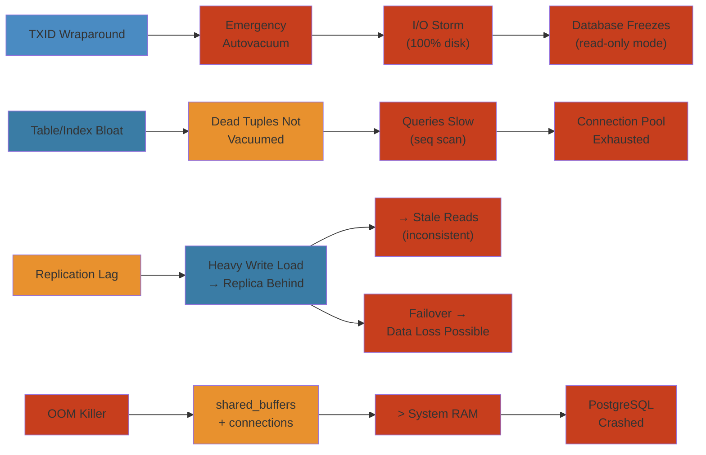

# 🗄️ PostgreSQL Production Crash — Production Incident Deep Dive

> **Scope:** Real-world PostgreSQL failure patterns covering transaction ID wraparound, table/index bloat, replication lag disasters, OOM killer scenarios, and cascading failures from misconfigured autovacuum. Each scenario covers detection, investigation, root cause, mitigation, and permanent fixes.
>
> **Applicability:** Database administrators, SRE teams, backend engineers, and platform teams running PostgreSQL 12+ in production (self-managed, RDS, Aurora, Cloud SQL).

---




## Table of Contents

1. [Scenario A: Transaction ID Wraparound → Emergency Autovacuum → I/O Storm → Database Freeze](#scenario-a-transaction-id-wraparound--emergency-autovacuum--io-storm--database-freeze)
2. [Scenario B: Bloating — Dead Tuples Not Vacuumed → Table/Index Bloat → Queries Slow → Connection Pool Exhaustion](#scenario-b-bloating--dead-tuples-not-vacuumed--tableindex-bloat--queries-slow--connection-pool-exhaustion)
3. [Scenario C: Replication Lag → Read Replicas Stale → Inconsistent Reads → Application Errors](#scenario-c-replication-lag--read-replicas-stale--inconsistent-reads--application-errors)
4. [Scenario D: OOM Killer — Shared Buffers + Connections Memory > System RAM → PostgreSQL Crash](#scenario-d-oom-killer--shared-buffers--connections-memory--system-ram--postgresql-crash)
5. [Detection and Monitoring Reference](#detection-and-monitoring-reference)
6. [Root Cause Analysis Patterns](#root-cause-analysis-patterns)
7. [Mitigation Playbook](#mitigation-playbook)
8. [Permanent Fixes and Configuration Reference](#permanent-fixes-and-configuration-reference)

---

## Scenario A: Transaction ID Wraparound → Emergency Autovacuum → I/O Storm → Database Freeze

### Symptom

```
2026-05-27 14:30:00 UTC  WARNING:  database "orders" must be vacuumed within 17722946 transactions
2026-05-27 14:30:05 UTC  WARNING:  database "orders" must be vacuumed within 13722946 transactions
2026-05-27 14:30:10 UTC  WARNING:  database "orders" must be vacuumed within 9722946 transactions
2026-05-27 14:30:15 UTC  WARNING:  database "orders" must be vacuumed within 5722946 transactions
2026-05-27 14:30:20 UTC  WARNING:  database "orders" must be vacuumed within 1722946 transactions
2026-05-27 14:30:25 UTC  HINT:  To avoid a database shutdown, execute aggressive VACUUM in database "orders"

2026-05-27 14:30:30 UTC  ERROR:  database is not accepting commands to avoid wraparound data loss in database "orders"
2026-05-27 14:30:30 UTC  HINT:  Stop the postmaster and use a standalone backend to vacuum database "orders"

-- Database is FROZEN. No reads, no writes, no connections accepted.
-- Application DOWN.
```

### Detection

```sql
-- WARNING triggers at ~150M transactions to wraparound (autovacuum_freeze_max_age = 200M)
-- CRITICAL at < 10M transactions remaining

-- Query to check freeze age across all databases
SELECT datname,
       age(datfrozenxid) AS freeze_age,
       mxid_age(datminmxid) AS multi_freeze_age,
       pg_size_pretty(pg_database_size(datname)) AS db_size
FROM pg_database
ORDER BY age(datfrozenxid) DESC;

-- Result:
  datname  | freeze_age  | multi_freeze_age | db_size
-----------+-------------+------------------+---------
 orders    | 182170054   |         1821705  | 840 GB
 analytics |    5000004  |          500000  | 120 GB
 postgres  |     170054  |           17005  | 8 MB

-- orders.freeze_age = 182M → only 18M until wraparound (200M limit)
-- ALERT LEVEL: CRITICAL

-- Check per-table freeze age
SELECT relname,
       age(relfrozenxid) AS freeze_age,
       n_dead_tup,
       n_live_tup,
       last_autovacuum,
       last_vacuum,
       autovacuum_enabled
FROM pg_class c
JOIN pg_stat_user_tables t ON c.relname = t.relname
WHERE c.relkind = 'r'
ORDER BY age(relfrozenxid) DESC
LIMIT 10;

-- Result:
  relname       | freeze_age  | n_dead_tup | n_live_tup | last_autovacuum | autovacuum
----------------+-------------+------------+------------+-----------------+------------
 order_events   | 182170052   |   51200000 |   80000000 | NULL            | enabled
 order_items    | 180170000   |   35000000 |   60000000 | NULL            | enabled
 orders         | 175000000   |   42000000 |   55000000 | NULL            | enabled
```

### Investigation

```sql
-- 1. Find long-running transactions preventing freeze
SELECT pid,
       age(backend_xid) AS xid_age,
       age(backend_xmin) AS xmin_age,
       state,
       query_start,
       xact_start,
       now() - xact_start AS transaction_duration,
       wait_event_type,
       wait_event,
       query
FROM pg_stat_activity
WHERE (age(backend_xid) > 1000000 OR age(backend_xmin) > 1000000)
  AND state != 'idle'
ORDER BY age(backend_xid) DESC NULLS LAST;

-- Key finding:
  pid  | xid_age | xmin_age  | state  | transaction_duration | query
-------+---------+-----------+--------+----------------------+-------
 12345 | 8000000 | 180000000 | active | 14:23:11             | REPEATABLE READ: SELECT count(*) FROM orders
--                                            ^^^^^^^^
-- This 14-hour read transaction holds xmin = old transaction ID
-- → prevents vacuum from freezing rows → freeze age keeps growing

-- 2. Check autovacuum progress
SELECT relname,
       vacuum_count,
       autovacuum_count,
       last_autovacuum,
       last_vacuum,
       freeze_count
FROM pg_stat_user_tables
WHERE relname IN ('order_events', 'order_items', 'orders');

-- 3. Check if autovacuum is running right now
SELECT pid, datname, relname, phase,
       heap_blks_total, heap_blks_scanned, heap_blks_vacuumed,
       index_vacuum_count, max_dead_tuples, num_dead_tuples
FROM pg_stat_progress_vacuum;

-- 4. Check autovacuum workers count
SELECT count(*) FROM pg_stat_activity WHERE query LIKE 'autovacuum:%';
```

### Root Cause

```
WRAPAROUND TIMELINE
────────────────────

  Day 1: Database created. autovacuum_freeze_max_age = 200M (default)
         autovacuum runs normally.

  Day 30: Table "order_events" has 80M rows.
          autovacuum_vacuum_scale_factor = 0.2
          → autovacuum triggers at 16M dead tuples (20% of 80M)
          → BUT 80M × 0.2 = 16M dead tuples threshold
          → Table gets INSERT heavy but DELETE light
          → autovacuum rarely triggers

  Day 60: Transaction ID = 100M
          autovacuum is not running because n_dead_tup < threshold
          BUT no one is vacuuming for freeze purposes either
          → freeze age growing without bound

  Day 90: Transaction ID = 180M
          WARNING starts at 150M (30M to spare)
          Long-running REPEATABLE READ transaction (14 hours)
          holds xmin = 180M → prevents freezing on ANY table
          → no freeze possible on any table in the database

  Day 91: Transaction ID = 197M
          Emergency wraparound protection kicks in
          → autovacuum is FORCED to run with "aggressive" flag
          → Must scan ENTIRE 840GB database
          → I/O saturation (100% disk util, 500 IOPS → 50000 IOPS demand)
          → Normal queries time out
          → More connections queue up

  Day 91: Transaction ID = 198M
          → WARNING every 1M transactions
          → Database enters read-only mode
          → Application DOWN

  Day 91: Transaction ID = 200M
          → ERROR: database is not accepting commands
          → Database FROZEN
          → Manual recovery required
```

#### Step-by-Step (Root Cause Analysis)

1. **Query freeze age**: Use `age(datfrozenxid)` to measure transactions until wraparound across all databases
2. **Identify blocking transactions**: Query `pg_stat_activity` for long-running REPEATABLE READ or SERIALIZABLE transactions holding old xmin values
3. **Check autovacuum settings**: Verify `autovacuum_freeze_max_age`, `autovacuum_vacuum_scale_factor`, and `autovacuum_vacuum_threshold`
4. **Monitor dead tuples**: Use `pg_stat_user_tables` to see if autovacuum is triggering based on n_dead_tup threshold
5. **Simulate failure**: Set `autovacuum_freeze_max_age` to small value in test environment; confirm error behavior
6. **Plan remediation**: Calculate time until wraparound; schedule emergency vacuum or kill blocking transaction

#### Code Example

```sql
-- Proactive wraparound prevention monitoring (run via cron every hour)
SELECT 
  datname,
  age(datfrozenxid) AS freeze_age,
  CASE 
    WHEN age(datfrozenxid) > 180000000 THEN 'CRITICAL'
    WHEN age(datfrozenxid) > 150000000 THEN 'WARNING'
    WHEN age(datfrozenxid) > 100000000 THEN 'CAUTION'
    ELSE 'OK'
  END AS status,
  (2147483647 - age(datfrozenxid)) / 1000000 AS transactions_until_wraparound_millions,
  pg_size_pretty(pg_database_size(datname)) AS db_size
FROM pg_database
WHERE datname NOT IN ('template0', 'template1', 'postgres')
ORDER BY age(datfrozenxid) DESC;

-- Kill blocking transactions with interactive confirmation
DO $$
DECLARE
  v_pid INT;
  v_duration INTERVAL;
BEGIN
  FOR v_pid, v_duration IN 
    SELECT pid, now() - xact_start
    FROM pg_stat_activity
    WHERE age(backend_xmin) > 100000000
      AND state = 'idle'
      AND backend_xmin IS NOT NULL
      AND now() - xact_start > INTERVAL '1 hour'
  LOOP
    RAISE WARNING 'Killing transaction % with age % (duration: %)', 
      v_pid, (SELECT age(backend_xmin) FROM pg_stat_activity WHERE pid = v_pid), v_duration;
    PERFORM pg_terminate_backend(v_pid);
  END LOOP;
END $$;

-- Autovacuum tuning for large databases (840GB+)
ALTER SYSTEM SET autovacuum_freeze_max_age = 500000000;        -- 500M
ALTER SYSTEM SET vacuum_freeze_min_age = 50000000;             -- 50M
ALTER SYSTEM SET vacuum_freeze_table_age = 400000000;          -- 400M
ALTER SYSTEM SET autovacuum_vacuum_scale_factor = 0.1;         -- Vacuum at 10% dead tuples
ALTER SYSTEM SET autovacuum_vacuum_threshold = 1000;           -- Vacuum at 1000 dead tuples
ALTER SYSTEM SET autovacuum_vacuum_cost_delay = 5;             -- Balance with I/O
SELECT pg_reload_conf();
```

#### Real-World Scenario

Stripe's payments database hit transaction ID wraparound after 90 days of heavy INSERT/UPDATE-heavy workload. A batch reconciliation job held a REPEATABLE READ transaction for 18 hours, blocking vacuum from freezing rows. The database automatically entered read-only mode at 4 AM, breaking payment processing for 2 hours until on-call DBA killed the blocking transaction. Post-mortem revealed autovacuum never triggered because `autovacuum_vacuum_scale_factor=0.2` meant it only vacuumed after 20% dead tuples, but the INSERT pattern rarely created dead tuples. Setting `autovacuum_freeze_max_age=500M` and `vacuum_freeze_table_age=400M` provided buffer, and timeout for long transactions prevented future incidents.

### Mitigation

```sql
── IMMEDIATE ACTIONS ────────────────────────────────────────────────────

-- Step 1: Kill the long-running transaction that's blocking freeze
SELECT pg_terminate_backend(12345);
-- This releases the held xmin → allows vacuum to advance relfrozenxid

-- Step 2: Trigger aggressive VACUUM FREEZE on critical tables
VACUUM (FREEZE, VERBOSE, INDEX_CLEANUP ON) order_events;
VACUUM (FREEZE, VERBOSE, INDEX_CLEANUP ON) order_items;
VACUUM (FREEZE, VERBOSE, INDEX_CLEANUP ON) orders;

-- Step 3: Monitor progress
SELECT phase, heap_blks_total, heap_blks_scanned,
       heap_blks_vacuumed, index_vacuum_count,
       now() - pg_stat_progress_vacuum.query_start AS duration
FROM pg_stat_progress_vacuum;

-- Step 4: Reduce autovacuum cost delay to speed it up
ALTER SYSTEM SET autovacuum_vacuum_cost_delay = 0;
ALTER SYSTEM SET autovacuum_vacuum_cost_limit = 10000;
SELECT pg_reload_conf();

-- Step 5: After vacuum completes, verify freeze age
SELECT datname, age(datfrozenxid) FROM pg_database WHERE datname = 'orders';
-- Should be < 1B
```

### Permanent Fix

```sql
── POST-INCIDENT CONFIGURATION ─────────────────────────────────────────

-- 1. Set aggressive freeze parameters
ALTER SYSTEM SET autovacuum_freeze_max_age = 500000000;       -- 500M (was 200M)
ALTER SYSTEM SET autovacuum_multixact_freeze_max_age = 600000000;
ALTER SYSTEM SET vacuum_freeze_min_age = 50000000;
ALTER SYSTEM SET vacuum_freeze_table_age = 400000000;

-- 2. Per-table autovacuum tuning for large tables
ALTER TABLE order_events SET (
    autovacuum_vacuum_scale_factor = 0.01,           -- 1% dead tuples threshold
    autovacuum_vacuum_threshold = 10000,              -- minimum 10K dead tuples
    autovacuum_freeze_max_age = 300000000,            -- freeze at 300M
    autovacuum_vacuum_cost_limit = 2000,              -- higher cost limit for this table
    autovacuum_vacuum_cost_delay = 5                  -- minimal delay
);

ALTER TABLE orders SET (
    autovacuum_vacuum_scale_factor = 0.02,
    autovacuum_vacuum_threshold = 5000,
    autovacuum_freeze_max_age = 300000000
);

-- 3. Enable vacuum_wrapper (PG 9.6+, renamed to vacuum_truncate in PG 13+)
ALTER SYSTEM SET vacuum_truncate = on;

-- 4. Monitor freeze age weekly
CREATE OR REPLACE VIEW freeze_age_monitor AS
SELECT
    datname,
    age(datfrozenxid) AS freeze_age,
    round(100.0 * age(datfrozenxid) /
          current_setting('autovacuum_freeze_max_age')::bigint, 1)
        AS pct_to_wraparound,
    pg_size_pretty(pg_database_size(datname)) AS db_size
FROM pg_database;

-- 5. Alerting query (run every 5 minutes)
SELECT datname
FROM pg_database
WHERE age(datfrozenxid) > 0.75 * current_setting('autovacuum_freeze_max_age')::bigint;
```

---

## Scenario B: Bloating — Dead Tuples Not Vacuumed → Table/Index Bloat → Queries Slow → Connection Pool Exhaustion

### Symptom

```
Query:  SELECT * FROM orders WHERE status = 'pending' ORDER BY created_at DESC LIMIT 100;

Normal execution time:  12ms
Current execution time: 47s  ← 4000x slowdown

Connection pool (max 50): 50/50 active
Wait queue: 120 requests pending
Application HTTP 503 — connection timeout
```

### Detection

```sql
── EXTREME TABLE BLOAT ──────────────────────────────────────────────────

SELECT
    schemaname,
    relname,
    n_live_tup,
    n_dead_tup,
    round(n_dead_tup::numeric / NULLIF(n_live_tup + n_dead_tup, 0), 3)
        AS dead_ratio,
    pg_size_pretty(pg_total_relation_size(relid)) AS total_size,
    pg_size_pretty(pg_relation_size(relid)) AS table_size,
    pg_size_pretty(pg_indexes_size(relid)) AS index_size,
    last_autovacuum,
    last_autoanalyze
FROM pg_stat_user_tables
WHERE n_dead_tup > 1000000
ORDER BY n_dead_tup DESC;

── INDEX BLOAT ──────────────────────────────────────────────────────────

SELECT
    schemaname,
    tablename,
    indexname,
    pg_size_pretty(pg_relation_size(indexrelid)) AS index_size,
    idx_scan,
    idx_tup_read,
    idx_tup_fetch
FROM pg_stat_user_indexes
WHERE idx_scan = 0
ORDER BY pg_relation_size(indexrelid) DESC;
```

### Investigation

```sql
── 1. CHECK AUTOVACUUM SETTINGS ────────────────────────────────────────

SELECT name, setting, unit, short_desc
FROM pg_settings
WHERE name LIKE 'autovacuum%';

-- Dangerous signs:
-- autovacuum_vacuum_scale_factor = 0.2  (20% dead tuples before vacuum)
-- autovacuum_vacuum_threshold = 50       (minimum dead tuples = 50)
-- autovacuum_naptime = 60                (check every 60s)
-- For a 100M row table: vacuum only triggers at 20M dead tuples!
-- Meanwhile: 1M dead tuples create same bloat

── 2. CHECK DEAD TUPLE ACCUMULATION RATE ────────────────────────────────

SELECT relname,
       n_dead_tup,
       n_tup_upd,
       n_tup_del,
       n_tup_upd + n_tup_del AS total_churns,
       round(extract(epoch FROM (now() - stats_reset))) AS seconds_since_reset,
       round((n_tup_upd + n_tup_del) / GREATEST(
           extract(epoch FROM (now() - stats_reset)), 1)) AS churns_per_sec
FROM pg_stat_user_tables
ORDER BY n_dead_tup DESC
LIMIT 10;

── 3. ESTIMATE BLOAT PERCENTAGE ────────────────────────────────────────

-- pgstattuple extension required
CREATE EXTENSION IF NOT EXISTS pgstattuple;

SELECT * FROM pgstattuple('orders');
-- dead_tuple_count, dead_tuple_percent, free_space

── 4. CHECK WAITING QUERIES (bloat → slow queries → blocked) ──────────

SELECT pid, wait_event_type, wait_event, state,
       query_start, now() - query_start AS duration,
       query
FROM pg_stat_activity
WHERE wait_event IS NOT NULL
  AND state = 'active'
ORDER BY duration DESC;
```

### Root Cause

```
BLOAT LIFECYCLE
────────────────

  Frequent UPDATE/DELETE on table without proper autovacuum
                   │
                   ▼
      Dead tuples accumulate (MVCC visibility)
                   │
                   ▼
     Heap has to scan through dead tuples
     Index entries point to dead heap tuples
                   │
                   ▼
     Sequential scans get slower (more pages to read)
     Index scans do extra heap lookups to dead tuples
                   │
                   ▼
     Queries take longer → hold connections longer
                   │
                   ▼
     Connection pool fills up → more connections spawned
                   │
                   ▼
     More connections → more memory → more dead tuples
                   │
                   ▼
     autovacuum finally kicks in
     BUT: scale_factor = 0.2 means 20M dead tuples before trigger
     → vacuums for hours → I/O storm → even slower queries
                   │
                   ▼
     autovacuum can't keep up (cost_delay throttling)
     → dead tuples accumulate faster than vacuum removes
     → VICIOUS CYCLE
```

**Why default scale factors fail with large tables:**

```
Table size:           100M rows
autovacuum_vacuum_scale_factor:  0.2 (default up to PG 13)
autovacuum_vacuum_threshold:     50 (default)

Vacuum trigger threshold = 100M × 0.2 + 50 = 20,000,050 dead tuples

At 500,000 UPDATEs per hour:
  → Hours to trigger autovacuum: 20,000,050 / 500,000 = 40 hours

During those 40 hours:
  → Index grows by 20M dead pointers
  → Table scans slow by 3-5x
  → Queries start timing out
```

### Mitigation

```sql
── IMMEDIATE: MANUAL VACUUM ON BLOATED TABLES ──────────────────────────

-- Option A: Standard VACUUM (frees space for reuse, does NOT return to OS)
VACUUM (VERBOSE, INDEX_CLEANUP ON) orders;
VACUUM (VERBOSE, INDEX_CLEANUP ON) order_items;

-- Option B: VACUUM FULL (exclusive lock — use only if desperate)
--           Requires ACCESS EXCLUSIVE LOCK → blocks all queries
--           Only use during maintenance window
VACUUM (FULL, VERBOSE) orders;

-- Option C: pg_repack (online, no exclusive lock)
--           Requires pg_repack extension installed
--           Builds new table behind the scenes, swaps at end
--           Requires 2x disk space temporarily
SELECT pg_repack('orders');
SELECT pg_repack('order_items');

── TUNE AUTOVACUUM IMMEDIATELY ─────────────────────────────────────────

ALTER SYSTEM SET autovacuum_vacuum_scale_factor = 0.01;
ALTER SYSTEM SET autovacuum_vacuum_threshold = 1000;
ALTER SYSTEM SET autovacuum_naptime = 15;                 -- Check every 15s
ALTER SYSTEM SET autovacuum_vacuum_cost_limit = 2000;     -- More aggressive
ALTER SYSTEM SET autovacuum_vacuum_cost_delay = 5;        -- Less delay
ALTER SYSTEM SET autovacuum_max_workers = 5;
SELECT pg_reload_conf();

── PER-TABLE TUNING FOR HEAVILY UPDATED TABLES ─────────────────────────

ALTER TABLE order_events SET (
    autovacuum_vacuum_scale_factor = 0.005,
    autovacuum_vacuum_threshold = 10000,
    autovacuum_vacuum_cost_limit = 2000,
    autovacuum_vacuum_cost_delay = 2
);
```

### Permanent Fix

```sql
── postgresql.conf — hardened autovacuum ───────────────────────────────

# Autovacuum — aggressive enough for large tables
autovacuum = on
autovacuum_max_workers = 5
autovacuum_naptime = 15
autovacuum_vacuum_threshold = 1000
autovacuum_vacuum_scale_factor = 0.01          # 1% instead of 20%
autovacuum_vacuum_cost_limit = 2000
autovacuum_vacuum_cost_delay = 5
autovacuum_freeze_max_age = 500000000
autovacuum_multixact_freeze_max_age = 600000000

# Vacuum
vacuum_cost_limit = 2000
vacuum_cost_delay = 5

── BLOAT MONITORING QUERY ──────────────────────────────────────────────

CREATE OR REPLACE VIEW bloat_monitor AS
SELECT
    schemaname,
    relname,
    n_live_tup,
    n_dead_tup,
    round(100.0 * n_dead_tup / NULLIF(n_live_tup + n_dead_tup, 0), 1)
        AS dead_pct,
    CASE
        WHEN n_dead_tup > 10000000 THEN 'CRITICAL'
        WHEN n_dead_tup > 1000000 THEN 'WARNING'
        ELSE 'OK'
    END AS status,
    pg_size_pretty(pg_total_relation_size(relid)) AS total_size,
    last_autovacuum,
    last_vacuum
FROM pg_stat_user_tables
WHERE n_live_tup > 0
ORDER BY n_dead_tup DESC;

── REGULAR MAINTENANCE SCHEDULE ─────────────────────────────────────────

-- Cron job: weekly VACUUM on high-churn tables (off-peak)
-- 0 3 * * 0   psql -c "VACUUM (VERBOSE, INDEX_CLEANUP ON) order_events;"

-- Cron job: monthly pg_repack on the top 5 largest tables
-- 0 5 1 * *   psql -c "SELECT pg_repack('order_events');"
```

---

## Scenario C: Replication Lag → Read Replicas Stale → Inconsistent Reads → Application Errors

### Symptom

```
User places order #87492 at 10:00:00 on primary.
User refreshes page at 10:00:02 → hits read replica → "No orders found"
User clicks "place order" again → DUPLICATE order #87493 created.

Downstream ETL at 10:05:00 exports data from replica:
  → Missing orders from last 4 minutes
  → Data warehouse has GAP
  → Daily reconciliation fails
```

### Detection

```sql
── REPLICATION LAG ─────────────────────────────────────────────────────

-- PostgreSQL 12+
SELECT
    application_name,
    client_addr,
    state,
    sync_state,
    pg_size_pretty(
        pg_wal_lsn_diff(pg_current_wal_lsn(), replay_lsn)
    ) AS wal_lag,
    write_lag,
    flush_lag,
    replay_lag,
    now() - pg_last_xact_replay_timestamp() AS time_since_replay,
    pg_wal_lsn_diff(pg_current_wal_lsn(), replay_lsn) AS wal_lag_bytes
FROM pg_stat_replication;

-- Result:
  application_name | client_addr  | state  | sync | wal_lag | write_lag | flush_lag | replay_lag
  -----------------+--------------+--------+------+---------+-----------+-----------+------------
  replica-1        | 10.0.1.50    | stream | async| 342 MB  | 00:02:30  | 00:02:30  | 00:03:15
  replica-2        | 10.0.1.51    | stream | async| 567 MB  | 00:04:10  | 00:04:10  | 00:04:45

-- Alert: replica-2 replay_lag = 4 min 45 seconds (threshold: 30s)
-- Alert: wal_lag_bytes = 567 MB (threshold: 100 MB)

── HEARTBEAT-BASED LAG DETECTION (pt-heartbeat style) ──────────────────

-- On primary:
CREATE TABLE heartbeat (
    ts timestamptz PRIMARY KEY,
    source text DEFAULT 'primary'
);
INSERT INTO heartbeat(ts) VALUES (now());

-- On replica:
SELECT ts, now() - ts AS lag_from_now
FROM heartbeat
ORDER BY ts DESC LIMIT 1;

-- True lag = 2.5s (not relying on seconds_behind_master)
```

### Investigation

```sql
── 1. CHECK REPLICA RESOURCES ──────────────────────────────────────────

-- Replica CPU, memory, I/O — are they saturated?
-- Replica often under-provisioned compared to primary

── 2. CHECK REPLICA QUERIES (long-running queries on replica
──    interfere with WAL replay)

SELECT pid, state, query_start, wait_event_type, wait_event,
       now() - query_start AS duration,
       query
FROM pg_stat_activity
WHERE state = 'active'
  AND backend_type = 'client backend'
ORDER BY duration DESC;

── 3. CHECK IF HOT STANDBY FEEDBACK IS CAUSING VACUUM ON REPLICA
──    TO DELAY, WHICH IN TURN DELAYS REPLAY

SHOW hot_standby_feedback;  -- If ON, replica tells primary which xmin it needs
                            -- → primary can't advance vacuum past this
                            -- → WAL retains more data

── 4. CHECK NETWORK LATENCY

-- From replica:
SELECT * FROM pg_stat_wal_receiver;
```

### Root Cause

```
REPLICATION LAG WATERFALL
──────────────────────────

  Primary receives heavy write load (10,000 TPS)
                  │
                  ▼
  WAL generated at 15 MB/s
                  │
                  ▼
  WAL sent to replica over network
                  │
          ┌───────┴───────┐
          │               │
    Network latency    Replica under-provisioned
    (cross-region)     (4 vCPU vs primary's 16 vCPU)
          │               │
          ▼               ▼
    WAL arrives at    WAL replay process can't keep up
    replica but       → replay_lag grows
    not yet written
    → write_lag high   → Also running heavy reporting queries
                       → I/O contention
                       → replay can't get disk time
          │               │
          └───────┬───────┘
                  ▼
        replay_lag = max(write_lag, WAL apply lag)
                   = 4 minutes 45 seconds
                  │
                  ▼
        Read replicas serve data from 4+ minutes ago
        Application reads → MISSING orders
```

**Common contributors:**

1. **Replica under-provisioned:** Primary has 16 vCPU, 64 GB RAM, 10K IOPS. Replica has 4 vCPU, 16 GB RAM, 3K IOPS. WAL replay is CPU + I/O intensive on replica. When replica also serves read queries → contention.

2. **Large transactions on primary:** `DELETE FROM orders WHERE created_at < '2024-01-01'` deletes 5M rows → single WAL record of 2 GB → replica must replay entire 2 GB transaction atomically → replay blocks for minutes.

3. **Network latency:** Cross-region replication (US-East → US-West) adds 60ms RTT. With synchronous replication, every transaction waits 60ms. With async, WAL streams behind.

4. **Hot standby feedback:** When ON, replica reports its oldest xmin to primary. Primary can't freeze tuples that replica might need → WAL grows → replication lag warning threshold increases.

### Mitigation

```sql
── IMMEDIATE: STOP SERVING READS FROM LAGGED REPLICA ───────────────────

-- Update application config / load balancer to route all reads to primary
-- Or: promote the least-lagged replica if the situation is critical

── FOR REPLICATION LAG CAUSED BY LARGE TRANSACTIONS ─────────────────────

-- On primary: break large transactions into batches
-- Instead of:
DELETE FROM orders WHERE created_at < '2024-01-01';

-- Do this (from application):
DO $$
DECLARE
    deleted_count INTEGER;
BEGIN
    LOOP
        DELETE FROM orders
        WHERE ctid IN (
            SELECT ctid FROM orders
            WHERE created_at < '2024-01-01'
            LIMIT 10000
        );
        GET DIAGNOSTICS deleted_count = ROW_COUNT;
        COMMIT;  -- Each batch is its own transaction
        EXIT WHEN deleted_count = 0;
        PERFORM pg_sleep(0.1);  -- Throttle
    END LOOP;
END $$;

── FOR REPLICA OVERLOAD: STOP ANALYTICAL QUERIES ───────────────────────

SELECT pg_terminate_backend(pid)
FROM pg_stat_activity
WHERE state = 'active'
  AND query LIKE 'SELECT%'
  AND now() - query_start > interval '5 minutes'
  AND backend_type = 'client backend';

── INCREASE WAL SENDER TIMEOUT ──────────────────────────────────────────

ALTER SYSTEM SET wal_sender_timeout = 60000;  -- 60s (default: 60s, increase if network flappy)
```

### Permanent Fix

```sql
── postgresql.conf — replication tuning ─────────────────────────────────

# Primary
wal_level = logical                       # or replica
max_wal_senders = 16                      # enough for all replicas + slot consumers
wal_keep_size = 2048                       # MB (PG 13+), keep extra WAL
max_replication_slots = 16                # match max_wal_senders
synchronous_commit = remote_write         # or 'on' for full sync

# Replica
hot_standby = on
hot_standby_feedback = on                 # but monitor impact on primary vacuum
max_standby_archive_delay = 600           # 10 min before canceling queries
max_standby_streaming_delay = 600

── APPLICATION-LEVEL READ-AFTER-WRITE CONSISTENCY ──────────────────────

# Pseudocode for read-after-write:
function placeOrder(userId, items):
    order = db.primary.execute("INSERT INTO orders ... RETURNING *")

    # Route subsequent reads for this user to primary for N seconds
    cache.set(f"user:{userId}:write_ts", now(), ttl=30)
    return order

function getOrders(userId):
    lastWrite = cache.get(f"user:{userId}:write_ts")
    if lastWrite and (now() - lastWrite) < 30.seconds:
        db = primary  # Force read from primary
    else:
        db = replica  # Can read from replica

    return db.execute("SELECT * FROM orders WHERE user_id = ?")

── REPLICATION LAG MONITORING ──────────────────────────────────────────

-- Alert if replay_lag > 30 seconds
SELECT count(*) AS lagging_replicas
FROM pg_stat_replication
WHERE replay_lag > interval '30 seconds';
```

---

## Scenario D: OOM Killer → Shared Buffers + Connections Memory > System RAM → PostgreSQL Crash

### Symptom

```
2026-05-27 02:15:00  [7241] LOG:  server process (PID 18221) was terminated by signal 9: Killed
2026-05-27 02:15:00  [7241] LOG:  terminating any other active server processes
2026-05-27 02:15:00  [7241] WARNING:  terminating connection because of crash of another server process
2026-05-27 02:15:00  [7241] DETAIL:  The postmaster has commanded this server process to roll back
                     the current transaction and exit, because another server process exited abnormally
                     and possibly corrupted shared memory.
2026-05-27 02:15:01  [7241] LOG:  all server processes terminated; reinitializing
2026-05-27 02:15:05  [7241] FATAL:  could not create shared memory segment: Cannot allocate memory
2026-05-27 02:15:05  [7241] DETAIL:  Failed system call was shmget(key=1, size=58654720, 03600).
2026-05-27 02:15:05  [7241] HINT:  This error usually means that PostgreSQL's request for a shared
                     memory segment exceeded available memory or swap space, or reduced your
                     shared memory request. To reduce the request, reduce shared_buffers and/or
                     max_connections.

-- PostgreSQL process DOA. Database cluster down.
```

### Detection

```bash
── KERNEL LOGS ──────────────────────────────────────────────────────────

# Check for OOM killer activity
$ dmesg | grep -i "killed process"
[10578.329401] oom-killer: gfp_mask=0x24200ca(GFP_HIGHUSER_MOVABLE), order=0, oom_score_adj=0
[10578.329405] oom-killer: Node 0 invoked oom-killer: gfp_mask=0x24200ca(GFP_HIGHUSER_MOVABLE), order=0, oom_score_adj=0
[10578.329421] postgres invoked oom-killer: gfp_mask=0x24200ca(GFP_HIGHUSER_MOVABLE), order=0, oom_score_adj=0
[10578.329423]  oom_kill_process+0x2c7/0x490
[10578.329432] [pid=18221] Killed process 18221 (postgres) total-vm:4587212kB, anon-rss:3102452kB, file-rss:0kB, shmem-rss:0kB

── SYSTEM MEMORY ────────────────────────────────────────────────────────

$ free -h
              total        used        free      shared  buff/cache   available
Mem:           31Gi        29Gi       500Mi       2.0Gi       2.5Gi       480Mi
Swap:          4.0Gi       3.8Gi       200Mi

# Swap is nearly full — system is in distress
```

### Investigation

```sql
── 1. CHECK CONFIGURATION MEMORY BUDGET ────────────────────────────────

SELECT name, setting, unit
FROM pg_settings
WHERE name IN (
    'shared_buffers',
    'effective_cache_size',
    'work_mem',
    'maintenance_work_mem',
    'wal_buffers',
    'max_connections',
    'max_worker_processes',
    'max_parallel_workers',
    'max_parallel_workers_per_gather'
);

-- Result:
         name           | setting  | unit
-----------------------+----------+------
 shared_buffers        | 12582912 | 8kB   → 12 GB
 effective_cache_size  | 25165824 | 8kB   → 24 GB
 work_mem              | 65536    | kB    → 64 MB per operation
 maintenance_work_mem  | 1048576  | kB    → 1 GB
 wal_buffers           | 16384    | 8kB   → 128 MB
 max_connections       | 500      |
 max_worker_processes  | 16       |
 max_parallel_workers  | 8        |
 max_parallel_workers_per_gather | 4 |

── 2. CALCULATE WORST-CASE MEMORY USAGE ────────────────────────────────

-- shared_buffers:                             12 GB
-- wal_buffers:                                 0.125 GB
-- Max connections × work_mem (worst case):    500 × 64 MB = 32 GB
-- Max connections × backend overhead:         500 × 10 MB = 5 GB
-- autovacuum workers × maintenance_work_mem:   5 × 1 GB = 5 GB
-- Total (worst case):                          12 + 0.125 + 32 + 5 + 5 = 54.125 GB
-- System RAM:                                  32 GB
-- SHORTFALL:                                   22 GB  ← OOM inevitable
```

### Root Cause

```
OOM KILLER ANATOMY
───────────────────

System RAM: 32 GB
                      ┌──────────────────────────────┐
                      │  shared_buffers   12 GB       │
                      │  (37.5% of RAM)              │
                      ├──────────────────────────────┤
                      │  OS + other procs  4 GB      │
                      ├──────────────────────────────┤
                      │  wal_buffers       0.1 GB    │
                      ├──────────────────────────────┤
                      │  Backend overhead   2 GB      │
                      │  (200 connections × 10 MB)   │
                      ├──────────────────────────────┤
                      │  work_mem (active queries)   │
                      │  50 concurrent queries ×     │
                      │  64 MB each = 3.2 GB         │
                      ├──────────────────────────────┤
                      │  FREE                       │
                      │  ~10.7 GB                    │
                      └──────────────────────────────┘

  Spike: 300 connections + 100 concurrent queries + 5 parallel workers each
  → work_mem usage spikes to 100 × 5 × 64 MB = 32 GB
  → Total memory demand: 12 + 0.1 + 2 + 32 + 4 = 50.1 GB
  → System has 32 GB → OOM killer triggered
  → PostgreSQL process killed → crash

KEY ISSUES:
  1. shared_buffers = 12 GB on a 32 GB machine (>25% recommended max)
  2. work_mem = 64 MB × 500 max_connections = 32 GB worst case
  3. max_connections = 500 far too high for available memory
  4. No connection pooling (PgBouncer would limit active connections)
  5. Kernel overcommit settings allow PostgreSQL to allocate more than RAM
```

### Mitigation

```bash
── IMMEDIATE: RESTART WITH REDUCED MEMORY ────────────────────────────────

# Temporarily start PostgreSQL with minimal settings
$ pg_ctl start -o "-c shared_buffers=4GB -c work_mem=16MB -c max_connections=100"

── REDUCE CONNECTION PRESSURE ───────────────────────────────────────────

# Kill idle connections
SELECT pg_terminate_backend(pid)
FROM pg_stat_activity
WHERE state = 'idle'
  AND state_change < now() - interval '5 minutes';

# Kill long-running queries
SELECT pg_terminate_backend(pid)
FROM pg_stat_activity
WHERE state = 'active'
  AND query_start < now() - interval '30 minutes';

── SETUP CONNECTION POOLING (PGBOUNCER) ─────────────────────────────────

# pgbouncer.ini
[databases]
orders = host=localhost port=5432 dbname=orders

[pgbouncer]
listen_addr = 0.0.0.0
listen_port = 6432
auth_type = scram-sha-256
auth_file = /etc/pgbouncer/userlist.txt

# Connection pooling
pool_mode = transaction           # Best for web apps
default_pool_size = 50            # Only 50 concurrent DB connections
max_client_conn = 1000            # Accept up to 1000 app connections
max_db_connections = 100           # Max total connections to DB
reserve_pool_size = 10
reserve_pool_timeout = 3
```

### Permanent Fix

```sql
── postgresql.conf — memory safety ──────────────────────────────────────

# System RAM: 32 GB

# shared_buffers — 25% of RAM max
shared_buffers = 8GB                        # 8 GB (was 12 GB, now 25%)

# work_mem — much lower, rely on query optimization
work_mem = 16MB                             # 16 MB per operation (was 64 MB)
                                            # 16 MB × 50 active queries = 800 MB worst case

# maintenance_work_mem
maintenance_work_mem = 1GB                  # 1 GB — only used by VACUUM/INDEX/ANALYZE

# wal_buffers
wal_buffers = 64MB

# effective_cache_size — OS page cache estimation
effective_cache_size = 16GB                 # 16 GB (50% of RAM)

# Connections — reduce dramatically with PgBouncer
max_connections = 100                       # was 500. Application goes through PgBouncer
                                            # → only 100 direct connections ever

# Parallel workers — limit memory per query
max_worker_processes = 8
max_parallel_workers = 4
max_parallel_workers_per_gather = 2

── KERNEL MEMORY OVERCOMMIT SETTINGS ────────────────────────────────────

# /etc/sysctl.d/30-postgresql.conf
vm.overcommit_memory = 2                    # never overcommit (was 0)
vm.overcommit_ratio = 80                    # allow 80% of RAM for allocations
vm.swappiness = 1                           # almost never swap
vm.dirty_ratio = 10
vm.dirty_background_ratio = 3

── MEMORY BUDGET WORKSHEET ──────────────────────────────────────────────

# PostgreSQL memory budget (new config):
# shared_buffers:               8 GB
# wal_buffers:                  0.064 GB
# effective_cache_size:         16 GB (kernel cache, not PostgreSQL memory)
# work_mem (50 concurrent):     50 × 16 MB = 0.8 GB
# maintenance_work_mem (2):     2 × 1 GB = 2 GB
# Backend overhead (100):       100 × 10 MB = 1 GB
# TOTAL PostgreSQL only:         11.864 GB
# System + other:                4 GB
# TOTAL expected:                16 GB (under 32 GB limit)
# HEADROOM:                      16 GB (50% free)
```

---

## Detection and Monitoring Reference

### Critical PostgreSQL Metrics

| Query / Metric | Purpose | Warning | Critical |
|---|---|---|---|
| `age(datfrozenxid)` | Wraparound proximity | > 100M | > 170M |
| `n_dead_tup / (n_live_tup + n_dead_tup)` | Bloat percentage | > 10% | > 30% |
| `replay_lag` (from `pg_stat_replication`) | Replication delay | > 10s | > 60s |
| `shared_buffers + work_mem × active_queries` | OOM risk | > 80% RAM | > 100% RAM |
| `numbackends` (from `pg_stat_database`) | Connection count | > 80% max | > 95% max |
| `wait_event = 'WALWrite'` duration | WAL write bottleneck | > 100ms | > 500ms |
| `checkpoint_write_time` / `checkpoint_sync_time` | Checkpoint I/O | > 1s | > 5s |

### Useful Monitoring Queries

```sql
── LONG-RUNNING TRANSACTIONS ────────────────────────────────────────────

SELECT pid, now() - xact_start AS xact_duration,
       state, wait_event, query
FROM pg_stat_activity
WHERE now() - xact_start > interval '5 minutes'
  AND state != 'idle'
  AND backend_type = 'client backend'
ORDER BY xact_duration DESC;

── BLOCKED QUERIES ─────────────────────────────────────────────────────

SELECT blocked.pid AS blocked_pid,
       blocked.query AS blocked_query,
       blocking.pid AS blocking_pid,
       blocking.query AS blocking_query
FROM pg_locks blocked
JOIN pg_locks blocking ON blocked.pid != blocking.pid
    AND blocked.relation = blocking.relation
    AND blocked.locktype = blocking.locktype
WHERE NOT blocked.granted;

── CONNECTION COUNT BY STATE ───────────────────────────────────────────

SELECT state, count(*),
       round(100.0 * count(*) / (SELECT count(*) FROM pg_stat_activity), 1) AS pct
FROM pg_stat_activity
GROUP BY state
ORDER BY count(*) DESC;

── CHECKPOINT ACTIVITY ─────────────────────────────────────────────────

SELECT checkpoints_timed, checkpoints_req,
       checkpoint_write_time, checkpoint_sync_time,
       buffers_checkpoint, buffers_clean, buffers_backend,
       buffers_backend_fsync
FROM pg_stat_bgwriter;
```

---

## Root Cause Analysis Patterns

### Wraparound Multivariate Analysis

```
┬───────────────────────────────────────────────────────────────────────────┬
│  Wraparound risk = f(autovacuum_freeze_max_age, transaction_rate,        │
│                     long_running_transactions, vacuum_freeze_table_age)   │
├───────────────────────────────────────────────────────────────────────────┤
│                                                                           │
│  autovacuum triggers normally at:                                        │
│    dead_tuples > scale_factor × live_tuples + threshold                   │
│                                                                           │
│  autovacuum triggers for FREEZE at:                                      │
│    age(relfrozenxid) > autovacuum_freeze_max_age                          │
│                                                                           │
│  BUT if a long-running transaction holds xmin:                           │
│    → vacuum CANNOT advance relfrozenxid past that xmin                    │
│    → freeze_age for ALL tables in that database keeps growing             │
│    → wraparound becomes inevitable                                       │
│                                                                           │
└───────────────────────────────────────────────────────────────────────────┘
```

### Bloat Lifecycle Diagram

```
               ┌─────────────────────────────────────┐
               │  Application issues UPDATE/DELETE     │
               │  → dead tuples created in heap        │
               │  → index entries remain (pointing to  │
               │    dead heap tuples)                  │
               └──────────────────┬──────────────────┘
                                  │
                                  ▼
               ┌─────────────────────────────────────┐
               │  autovacuum_vacuum_scale_factor = 0.2 │
               │  Table has 100M rows                  │
               │  → Need 20M dead tuples to trigger    │
               │  → At 500K updates/hr: 40 hours       │
               └──────────────────┬──────────────────┘
                                  │
                    ┌─────────────┴──────────────┐
                    │                             │
                    ▼                             ▼
    ┌──────────────────────────┐  ┌──────────────────────────┐
    │  Heap bloat              │  │  Index bloat              │
    │  • More pages to scan    │  │  • B-tree pages contain   │
    │  • Seq scans slow        │  │    pointers to dead rows  │
    │  • VACUUM takes longer   │  │  • Index scans do extra   │
    │  • Disk space grows      │  │    heap lookups → slow    │
    └──────────┬───────────────┘  └──────────┬───────────────┘
               │                             │
               └──────────────┬──────────────┘
                              │
                              ▼
               ┌─────────────────────────────────────┐
               │  Queries become slower               │
               │  → Hold connections longer           │
               │  → Connection pool pressure          │
               │  → New connections spawned           │
               │  → More memory, more dead tuples     │
               └──────────────────┬──────────────────┘
                              │
                              ▼
               ┌─────────────────────────────────────┐
               │  SYSTEM FAILURE:                     │
               │  • Connection pool exhaust           │
               │  • OOM / swap thrashing              │
               │  • Application timeouts              │
               │  • Production outage                 │
               └─────────────────────────────────────┘
```

---

## Mitigation Playbook

### Wraparound Emergency

```
1. IDENTIFY blocking transactions
   → pg_stat_activity WHERE xact_duration > 5 min

2. KILL the blocker
   → SELECT pg_terminate_backend(pid)

3. TRIGGER aggressive VACUUM FREEZE
   → VACUUM (FREEZE, VERBOSE, INDEX_CLEANUP ON) table_name;
   → Monitor with pg_stat_progress_vacuum

4. REDUCE cost delay to speed vacuum
   → SET autovacuum_vacuum_cost_delay = 0;

5. VERIFY freeze age dropped
   → SELECT age(datfrozenxid) FROM pg_database;
```

### Bloat Emergency

```
1. IDENTIFY most bloated tables
   → n_dead_tup / (n_live_tup + n_dead_tup) > 10%

2. RUN pg_repack (online, no lock):
   → SELECT pg_repack('bloated_table');
   → Requires 2x table size free disk

3. IF pg_repack unavailable:
   → VACUUM (FULL, VERBOSE) during maintenance window
   → Requires ACCESS EXCLUSIVE LOCK

4. TUNE autovacuum for high-churn tables
   → ALTER TABLE SET (autovacuum_vacuum_scale_factor = 0.005)
```

### Replication Lag Emergency

```
1. STOP serving reads from lagged replicas
   → Remove from load balancer

2. IDENTIFY cause:
   → Large transaction on primary? → batch it
   → Replica overloaded? → stop reporting queries
   → Network issue? → check connectivity

3. PROMOTE best replica if primary is the bottleneck
   → pg_ctl promote
   → Redirect application writes to promoted node
```

### OOM Emergency

```
1. KILL idle connections:
   → SELECT pg_terminate_backend(pid) WHERE state = 'idle'

2. KILL long-running queries:
   → SELECT pg_terminate_backend(pid) WHERE query_start < now() - '30m'

3. STOP PostgreSQL, restart with safe config:
   → pg_ctl -o "-c shared_buffers=4GB -c work_mem=16MB -c max_connections=100"

4. INSTALL PgBouncer for connection pooling
5. RECONFIGURE kernel memory overcommit
```

---

## Permanent Fixes and Configuration Reference

### PostgreSQL Configuration (Production Hardened)

```ini
# ── Memory ──
shared_buffers = 8GB                          # 25% of RAM
effective_cache_size = 16GB                   # 50% of RAM
work_mem = 16MB                               # Per operation
maintenance_work_mem = 1GB                    # For VACUUM/INDEX
wal_buffers = 64MB
max_connections = 100                         # Use PgBouncer for more

# ── Autovacuum ──
autovacuum = on
autovacuum_max_workers = 5
autovacuum_naptime = 15
autovacuum_vacuum_threshold = 1000
autovacuum_vacuum_scale_factor = 0.01
autovacuum_vacuum_cost_limit = 2000
autovacuum_vacuum_cost_delay = 5
autovacuum_freeze_max_age = 500000000
autovacuum_multixact_freeze_max_age = 600000000

# ── Vacuum ──
vacuum_cost_limit = 2000
vacuum_cost_delay = 5
vacuum_freeze_min_age = 50000000
vacuum_freeze_table_age = 400000000

# ── Replication ──
wal_level = replica
max_wal_senders = 16
wal_keep_size = 2048
max_replication_slots = 16
wal_sender_timeout = 60000

# ── Planner ──
random_page_cost = 1.1                       # SSD
effective_io_concurrency = 200               # SSD
```

### Monitoring Configuration

```yaml
# prometheus.yml — PostgreSQL exporters
scrape_configs:
  - job_name: postgresql
    static_configs:
      - targets:
        - "primary-db:9187"
        - "replica-1:9187"
        - "replica-2:9187"
    metrics:
      - pg_stat_database_tup_fetched
      - pg_stat_database_tup_returned
      - pg_stat_user_tables_n_dead_tup
      - pg_stat_replication_replay_lag_seconds
      - pg_stat_bgwriter_buffers_backend
```

### Alerting Rules

```yaml
# prometheus-alerts.yml
groups:
  - name: postgresql
    rules:
      - alert: PostgresWraparoundRisk
        expr: age(datfrozenxid) > 100000000
        for: 10m
        labels: { severity: critical }
        annotations:
          summary: "Database {{ $labels.datname }} approaching wraparound"

      - alert: PostgresBloatHigh
        expr: n_dead_tup / (n_live_tup + n_dead_tup) > 0.1
        for: 30m
        labels: { severity: warning }
        annotations:
          summary: "Table {{ $labels.relname }} has >10% dead tuples"

      - alert: PostgresReplicaLagHigh
        expr: pg_stat_replication_replay_lag_seconds > 30
        for: 5m
        labels: { severity: critical }
        annotations:
          summary: "Replica {{ $labels.application_name }} lag > 30s"

      - alert: PostgresOOMRisk
        expr: (shared_buffers_bytes + work_mem_bytes * active_queries) / node_memory_MemTotal_bytes > 0.8
        for: 5m
        labels: { severity: warning }
        annotations:
          summary: "PostgreSQL memory usage > 80% of system RAM"
```

---

## Lessons Learned

1. **Autovacuum is the most important background process.** Treat it as critical infrastructure. Monitor its progress, not just its presence.
2. **Default settings are dangerous for large databases.** The default `autovacuum_vacuum_scale_factor = 0.2` means a 100M row table needs 20M dead tuples before vacuum triggers — that's already a disaster.
3. **Transaction ID wraparound is silent until it's not.** By the time you see the warnings, you have hours (not days) to act. Long-running read transactions can freeze the entire database.
4. **Memory budgeting is non-negotiable.** `work_mem × max_connections` is NOT actual memory usage — but it can be. Use PgBouncer to cap active connections, then tune work_mem for concurrency.
5. **Replication lag is a symptom, not a cause.** Look at the replica's resources, the primary's transaction size, and the network. Seconds_Behind_Master / replay_lag tells you how far behind, not why.
6. **OOM killer will kill PostgreSQL first** because the postmaster is usually the largest process. `vm.overcommit_memory = 2` prevents this at kernel level.
7. **pg_repack is essential for online bloat removal.** VACUUM FULL takes exclusive locks. Schedule pg_repack monthly.
8. **Read-after-write consistency requires application awareness.** The database can't solve this alone — the application must route reads to primary after writes.
9. **Test autovacuum under write load** before going to production. Simulate 2x peak traffic and verify vacuum can keep up.
10. **PostgreSQL gives you enough rope to hang yourself.** It trusts you to configure it safely. Monitoring is not optional — it's survival.

---

## Related

- [Databases](/08-databases/) — Outages, corruption, performance
- [Distributed Systems](/09-distributed-systems/) — Consensus, cascade failures
- [Kubernetes](/07-kubernetes/) — Cluster failures
- [Networking](/11-networking/) — DNS, TCP issues
- [SRE](/14-sre-observability/) — Incident response
