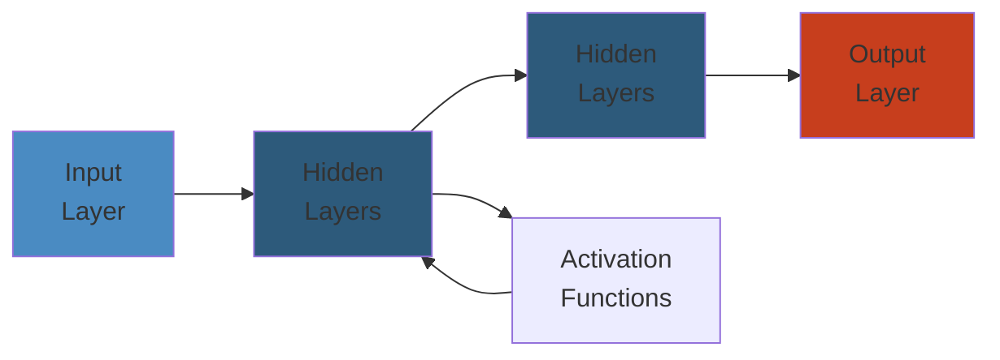

# 🔴 Redis Production Failures — Production Incident Deep Dive

> **Scope:** Real-world Redis failure patterns covering cache stampedes, OOM with noeviction, fork+save memory doubling, hot key hotspots, and network partition splits. Each scenario follows symptom → detection → investigation → root cause → mitigation → permanent fix → lessons learned.
>
> **Applicability:** Backend engineers, SRE teams, caching platform operators, and application developers using Redis 6.x–7.x as cache, session store, or rate limiter.

---




## Table of Contents

1. [Scenario A: Cache Stampede — Key Expires → 10K Requests Hit DB → DB Overload → Cascading Failure](#scenario-a-cache-stampede--key-expires--10k-requests-hit-db--db-overload--cascading-failure)
2. [Scenario B: Redis OOM — maxmemory + noeviction → Writes Fail → App Errors → Partial Outage](#scenario-b-redis-oom--maxmemory--noeviction--writes-fail--app-errors--partial-outage)
3. [Scenario C: Fork + Save — BGSAVE → COW → Memory Doubles → OOM Killer](#scenario-c-fork--save--bgsave--cow--memory-doubles--oom-killer)
4. [Scenario D: Hot Key — Single Key at 100K QPS → Single Node CPU 100% → Latency Spikes → Timeout Cascade](#scenario-d-hot-key--single-key-at-100k-qps--single-node-cpu-100--latency-spikes--timeout-cascade)
5. [Scenario E: Network Partition — Redis Cluster Split → Inconsistent Reads → Stale Data Serving](#scenario-e-network-partition--redis-cluster-split--inconsistent-reads--stale-data-serving)
6. [Detection and Monitoring Reference](#detection-and-monitoring-reference)
7. [Root Cause Analysis Patterns](#root-cause-analysis-patterns)
8. [Mitigation Playbook](#mitigation-playbook)
9. [Permanent Fixes and Configuration Reference](#permanent-fixes-and-configuration-reference)

---

## Scenario A: Cache Stampede — Key Expires → 10K Requests Hit DB → DB Overload → Cascading Failure

### Symptom

```
10:00:00 — Cache key "products:featured" TTL expires
10:00:01 — 10,000 concurrent requests miss cache
10:00:01 — 10,000 query DB simultaneously

    SELECT * FROM products WHERE featured = true ORDER BY rating DESC;

10:00:02 — DB CPU: 15% → 100%
10:00:03 — DB connection pool exhausted (max 200)
10:00:04 — DB query queue: 5,000 pending
10:00:05 — Other API endpoints also time out (can't get DB connections)
10:00:06 — Application servers return 503
```

### Detection

```
Alert: Cache miss rate spike (keyspace_misses / keyspace_hits)
       Normal: 5% miss rate → Spike to 95%
Alert: DB query rate spike  (monitoring dashboard)
Alert: DB connection pool exhaustion
Alert: API error rate 5xx spike
Alert: Redis keyspace_misses counter increased 100x in 1 second

Redis INFO command output at 10:00:01:
  keyspace_hits: 9,512,000    (lifetime)
  keyspace_misses: 500,000    (lifetime)
  keyspace_misses (delta 1s): 10,000  ← SPIKE

Application metrics:
  cache.get("products:featured") → nil  for 10,000 consecutive calls
```

### Investigation

```

── 1. CHECK CACHE KEY TTL

> redis-cli TTL "products:featured"
(integer) -2    ← Key does not exist (expired and evicted)

> redis-cli debug object "products:featured"
> (error) NO SUCH KEY

── 2. CHECK EXPIRY SETTINGS

// Application code — how TTL was set:
await redis.setex("products:featured", 3600, JSON.stringify(products));
//                                      ^^^^ TTL = 3600s = exactly 1 hour

// All products get TTL = 3600 at the same time (e.g., cache built at midnight)
// → ALL expire at 1:00 AM → STAMPEDE

── 3. CHECK DB IMPACT

-- Postgres at 10:00:01
SELECT count(*) FROM pg_stat_activity WHERE state = 'active';
-- Result: 200 active queries (all on products table)

SELECT query, count(*)
FROM pg_stat_activity
WHERE state = 'active'
GROUP BY query
ORDER BY count(*) DESC;
-- Result: "SELECT * FROM products WHERE featured = true..." x 10,000

── 4. CHECK CONCURRENT RECOMPUTE PATTERN

// No cache recompute protection:
function getFeaturedProducts() {
    const cached = redis.get("products:featured");
    if (cached) return JSON.parse(cached);
    // ↓ ALL 10K requests reach here simultaneously
    const products = db.query("SELECT * FROM products ...");
    redis.setex("products:featured", 3600, JSON.stringify(products));
    return products;
}
```

### Root Cause

```
CACHE STAMPEDE SEQUENCE
════════════════════════

       Time    │   Requests    │  Cache State   │  DB State
    ───────────┼───────────────┼────────────────┼────────────
    10:00:00   │  Normal (50/s)│  Key exists    │ Normal
          │    │               │  TTL=5s        │
          ▼    │               │                │
    10:00:01   │  10K req/s    │  Key EXPIRED   │ 15% CPU
          │    │  (traffic     │  cache.get()   │
          │    │   spike)      │  → nil x10K    │
          ▼    │               │                │
    10:00:02   │  10K req/s    │  Key missing   │ 100% CPU
          │    │  all query DB │  X 10K DB      │ 200 connections
          │    │               │  queries       │ maxed
          ▼    │               │                │
    10:00:03   │  10K req/s    │  Key missing   │ Query queue:
          │    │  timeouts     │  X 10K DB      │ 5,000 pending
          │    │               │  queries       │
          ▼    │               │                │
    10:00:04   │  10K req/s    │  Key missing   │ Connection
          │    │  503 errors   │  X 10K DB      │ pool full
          │    │               │  → timeout     │
          ▼    │               │                │
    10:00:05   │  All 503      │  Key missing   │ DB struggling
          │    │               │  → DB overload │
          ▼    │               │                │
    10:00:06   │  OUTAGE       │  Cache empty   │ DB saturated

    ────────────────────────────────────────────────────
    ROOT CAUSE: TTL synchronized + no mutex + no early
                recompute + no stale-while-revalidate
```

### Mitigation

```python
# IMMEDIATE FIX: Mutex lock with SETNX
def get_featured_products():
    cached = redis.get("products:featured")
    if cached:
        return json.loads(cached)

    lock_key = "products:featured:lock"
    lock_acquired = redis.setnx(lock_key, "1", ex=10)
    if lock_acquired:
        try:
            products = db.query("SELECT * FROM products WHERE featured = true ...")
            ttl = 3600 + random.randint(-300, 300)
            redis.setex("products:featured", ttl, json.dumps(products))
            return products
        finally:
            redis.delete(lock_key)
    else:
        time.sleep(0.1)
        retry = redis.get("products:featured")
        if retry:
            return json.loads(retry)
        return get_featured_products_fallback()
```

### Permanent Fix

```python
# Approach 1: Probabilistic Early Expiration
def get_featured_products():
    cached = redis.get("products:featured")
    if cached:
        data = json.loads(cached)
        ttl = redis.ttl("products:featured")
        if ttl < 0.3 * 3600 and random.random() < 0.1:
            thread_pool.submit(recompute_featured_products)
        return data
    return recompute_featured_products()

# Approach 2: Stale-While-Revalidate
def get_featured_products():
    cached = redis.get("products:featured")
    if cached:
        data = json.loads(cached)
        ttl = redis.ttl("products:featured")
        if ttl < 0:
            thread_pool.submit(recompute_featured_products)
        return data
    return recompute_featured_products()

# Approach 3: Write-through cache (always fresh)
def update_featured_products(new_data):
    db.execute("UPDATE products SET featured = ... WHERE ...")
    ttl = 3600 + random.randint(-600, 600)
    redis.setex("products:featured", ttl, json.dumps(new_data))
```

---

## Scenario B: Redis OOM — maxmemory + noeviction → Writes Fail → App Errors → Partial Outage

### Symptom

```
ERROR 2026-05-27 11:30:01 — OOM command not allowed when used memory > 'maxmemory'.
ERROR 2026-05-27 11:30:01 — OOM command not allowed when used memory > 'maxmemory'.
ERROR 2026-05-27 11:30:02 — Session save failed: user sessions not persisted
ERROR 2026-05-27 11:30:03 — User authentication fails (session not found)
ERROR 2026-05-27 11:30:04 — Rate limiter cannot increment counters
ERROR 2026-05-27 11:30:05 — All writes fail. Reads still work.

Partial outage: new sessions can't be created, rate limiting stops working.
```

### Detection

```
Alert: Redis used_memory > 95% of maxmemory
Alert: evicted_keys > 0 (with noeviction policy this should be 0)
Alert: Redis OOM errors in application logs
Alert: Redis INFO command shows:
  maxmemory: 8589934592       → 8 GB
  used_memory: 8589930448     → 7.999 GB (99.99% full)
  maxmemory_policy: noeviction → Writes will fail!

Redis MEMORY DOCTOR output:
> redis-cli MEMORY DOCTOR
  ERRORS:
  - Peak memory: 8.00 GB (100.0% of maxmemory)
  - This instance has noeviction policy.
  - This instance is approaching maxmemory.
```

### Investigation

```

── 1. CHECK MEMORY BREAKDOWN

> redis-cli MEMORY STATS

 1) "peak.allocated"
 2) (integer) 8589934592        ← 8 GB (maxed)
 3) "total.allocated"
 4) (integer) 8589930448
 5) "startup.allocated"
 6) (integer) 845312
 7) "replication.backlog"
 8) (integer) 16777216
 9) "clients.slaves"
10) (integer) 0
11) "clients.normal"
12) (integer) 68450136          ← 68 MB in client buffers
13) "aof.buffer"
14) (integer) 0

── 2. FIND LARGEST KEYS

> redis-cli --bigkeys

-------- summary -------

Sampled 500000 keys in the keyspace!
Biggest string found 'session:data:cache:user:582910' has 523120 bytes
Biggest   list found 'log:queue:events' has 84120 items
Biggest    set found 'tracking:active_users' has 5200 members
Biggest   hash found 'user:preferences:582910' has 312 fields
Biggest   zset found 'leaderboard:weekly' has 15000 members

── 3. CHECK TTL ON ALL KEYS

> redis-cli INFO keyspace
db0:keys=510000,expires=510000,avg_ttl=2592000
# avg_ttl = 2,592,000 seconds = 30 DAYS

── 4. CHECK maxmemory_policy

> redis-cli CONFIG GET maxmemory-policy
1) "maxmemory-policy"
2) "noeviction"               ← NO EVICTION
```

### Root Cause

```
OOM FAILURE ANATOMY
════════════════════

  maxmemory = 8 GB
  maxmemory-policy = noeviction

  ┌────────────────────────────────────────────────┐
  │  Session data:      4.5 GB  (56%)              │
  │  • 500K sessions x 9 KB avg                    │
  │  • TTL = 30 days (session rotation broken)     │
  │  • Some sessions store full user profile       │
  │    (500KB each)                                 │
  ├────────────────────────────────────────────────┤
  │  Cache data:        2.5 GB  (31%)              │
  │  • API responses cached (1 hr TTL)             │
  │  • Database query results (unbounded)          │
  ├────────────────────────────────────────────────┤
  │  Queues / Buffers:  800 MB  (10%)              │
  ├────────────────────────────────────────────────┤
  │  Overhead:          250 MB  (3%)               │
  ├────────────────────────────────────────────────┤
  │  FREE:              ~0 MB                       │
  └────────────────────────────────────────────────┘

  → New write arrives (session save)
  → used_memory > maxmemory? YES. Policy = noeviction
  → "OOM command not allowed when used memory > 'maxmemory'"
  → WRITE FAILS. Application gets error.
```

### Mitigation

```

── IMMEDIATE: CHANGE EVICTION POLICY (risk of data loss)

# Change to allkeys-lru to evict least recently used keys
> redis-cli CONFIG SET maxmemory-policy allkeys-lru

# Or volatile-lfu to evict least frequently used volatile keys
> redis-cli CONFIG SET maxmemory-policy volatile-lfu

── FREE MEMORY BY DELETING EXPIRED KEYS

# Force expire check on a sample of keys
> redis-cli DEBUG SET-ACTIVE-EXPIRE 1

# Delete oldest sessions in bulk
> redis-cli EVAL "return redis.call('DEL', unpack(redis.call('KEYS', 'session:2024*')))" 0

── REDUCE TTLS AGGRESSIVELY

# For session keys:
> redis-cli EVAL "
  local cursor = '0'
  repeat
    local result = redis.call('SCAN', cursor, 'MATCH', 'session:*', 'COUNT', '1000')
    cursor = result[1]
    for _, key in ipairs(result[2]) do
      redis.call('EXPIRE', key, 86400)
    end
  until cursor == '0'
" 0
```

### Permanent Fix

```python
# redis.conf
maxmemory 8gb
maxmemory-policy allkeys-lru        # Evict least recently used when full

# Session TTL management
import redis
r = redis.Redis()

def save_session(session_id, data, ttl=86400):
    r.setex(f"session:{session_id}", ttl, json.dumps(data))

def rotate_session(old_session_id, new_session_id, data):
    pipe = r.pipeline()
    pipe.delete(f"session:{old_session_id}")
    pipe.setex(f"session:{new_session_id}", 86400, json.dumps(data))
    pipe.execute()

USED_MEMORY = r.info("memory")["used_memory"]
MAXMEMORY = r.info("memory")["maxmemory"]
USAGE_PCT = (USED_MEMORY / MAXMEMORY) * 100
if USAGE_PCT > 80:
    log.warning(f"Redis memory at {USAGE_PCT:.1f}% of maxmemory")
```

---

## Scenario C: Fork + Save — BGSAVE → COW → Memory Doubles → OOM Killer

### Symptom

```
02:00:00 — Redis BGSAVE triggered (scheduled save)
02:00:01 — Redis forks child process
02:00:02 — Linux memory usage: 6 GB → 11.5 GB (RSS)
02:00:03 — Linux memory usage: 11.5 GB (copy-on-write)
02:00:04 — OOM killer fires → kills Redis
02:00:05 — Redis master: NOT running. OUTAGE.

System logs:
  [417234.129834] oom-killer: gfp_mask=0x24200ca(GFP_HIGHUSER_MOVABLE)
  [417234.129839] oom-killer: Node 0 invoked oom-killer
  [417234.129850] [pid=28471] Killed process 28471 (redis-server)
      total-vm:19127992kB, anon-rss:11764892kB, file-rss:0kB
```

### Detection

```
Alert: Redis process disappeared
Alert: Redis connection refused (port 6379)
Alert: Linux OOM killer logs (dmesg)
Alert: RSS memory doubled during save

Redis INFO persistence during incident:
> redis-cli INFO persistence

rdb_bgsave_in_progress:1
rdb_current_bgsave_time_sec:2
rdb_last_bgsave_status:err

System monitoring:
  redis-server RSS: 5.8 GB (before fork)
  redis-server RSS: 11.5 GB (after fork, during COW)
  System free memory: 512 MB (before OOM)
  System free memory: 0 MB (at OOM)
```

### Investigation

```

── 1. CHECK PERSISTENCE CONFIGURATION

> redis-cli CONFIG GET save
1) "save"
2) "900 1 300 10 60 10000"

── 2. CHECK SYSTEM OVERCOMMIT SETTINGS

$ sysctl vm.overcommit_memory
vm.overcommit_memory = 0     ← DEFAULT: heuristic overcommit

$ cat /sys/kernel/mm/transparent_hugepage/enabled
[always] madvise never        ← THP enabled! Bad for fork perf

── 3. CHECK FORK LATENCY HISTORY

> redis-cli INFO stats | grep latest_fork_usec
latest_fork_usec:512700       ← 512ms fork time (high)

── 4. CHECK MEMORY FRAGMENTATION

> redis-cli INFO memory | grep frag
mem_fragmentation_ratio: 3.2  ← High fragmentation (normal: 1.0-1.5)
```

### Root Cause

```
COPY-ON-WRITE MEMORY DOUBLING
══════════════════════════════

  Before BGSAVE:
  ┌──────────────────────────────────────────────┐
  │  Redis parent process                        │
  │  RSS = 6 GB                                  │
  │  ┌─────────────────────────────────────────┐  │
  │  │  Memory pages: A B C D E F G H ...      │  │
  │  └─────────────────────────────────────────┘  │
  └──────────────────────────────────────────────┘

  During FORK:
  ┌──────────────────────────────────────────────┐
  │  Parent + Child (shared via COW — same phys) │
  │  ┌─────────────────────────────────────────┐  │
  │  │  Parent pages: A B C D E F G H ...      │  │
  │  │  Child  pages: A B C D E F G H ...      │  │
  │  │  (shared via COW — same physical pages) │  │
  │  └─────────────────────────────────────────┘  │
  └──────────────────────────────────────────────┘

  During BGSAVE (child writing to RDB):
  ┌──────────────────────────────────────────────┐
  │  Parent keeps serving writes:                │
  │  Writes to page A → COW copies page A       │
  │  Writes to page B → COW copies page B       │
  │  Writes to page C → COW copies page C       │
  │  ...                                         │
  │                                              │
  │  Result: Parent + Child = 12 GB RSS total   │
  │  Memory DOUBLED (or more with fragmentation) │
  └──────────────────────────────────────────────┘

  System RAM: 12 GB
  Redis before fork: 6 GB  (50% of RAM)
  Redis during BGSAVE: 12 GB  (100% of RAM ← OOM)

  CONTRIBUTORS:
  • vm.overcommit_memory = 0 (heuristic) → fork allowed
  • THP = [always] → COW at 2MB pages (1 byte write copies entire 2MB)
  • High write rate during BGSAVE → more COW
  • mem_fragmentation_ratio 3.2 → RSS much higher than used_memory
```

### Mitigation

```

── IMMEDIATE: RESTART REDIS WITHOUT PERSISTENCE

> redis-cli CONFIG SET save ""
> redis-cli CONFIG SET appendonly no

── IMMEDIATE: FIX SYSTEM OVERCOMMIT

$ sudo sysctl -w vm.overcommit_memory=1
$ sudo sysctl -w vm.overcommit_ratio=100
$ echo never > /sys/kernel/mm/transparent_hugepage/enabled
$ sudo sysctl -w vm.swappiness=1

── IMMEDIATE: REDUCE MEMORY FRAGMENTATION

> redis-cli CONFIG SET activedefrag yes
> redis-cli CONFIG SET active-defrag-threshold-lower 10
> redis-cli CONFIG SET active-defrag-threshold-upper 100
> redis-cli CONFIG SET active-defrag-ignore-bytes 100mb
> redis-cli CONFIG SET active-defrag-cycle-min 25
> redis-cli CONFIG SET active-defrag-cycle-max 75
```

### Permanent Fix

```

# redis.conf — fork-safe configuration

# Disable THP at boot (add to /etc/rc.local)
# echo never > /sys/kernel/mm/transparent_hugepage/enabled

# Kernel settings (add to /etc/sysctl.d/30-redis.conf)
# vm.overcommit_memory = 1
# vm.swappiness = 1

# Persistence — use replicas for BGSAVE, not master
save ""                          # Master: no RDB saves

# AOF — use appendfsync everysec (not always)
appendonly yes
appendfsync everysec
no-appendfsync-on-rewrite yes

# Auto AOF rewrite — only when large enough
auto-aof-rewrite-percentage 100
auto-aof-rewrite-min-size 64mb

# Active defragmentation
activedefrag yes
active-defrag-threshold-lower 10
active-defrag-threshold-upper 100
active-defrag-ignore-bytes 100mb
active-defrag-cycle-min 25
active-defrag-cycle-max 75

# Memory limits
maxmemory 6gb                    # Leave headroom for COW
maxmemory-policy allkeys-lru
```

---

## Scenario D: Hot Key — Single Key at 100K QPS → Single Node CPU 100% → Latency Spikes → Timeout Cascade

### Symptom

```
→ Overall Redis latency: p99 = 2500ms (normal: p99 = 2ms)
→ Single node in cluster: CPU 100%
→ All other nodes: CPU 15-20%
→ All operations on that node slow — even unrelated keys

Hot key: "leaderboard:top_100_viral_post_58291"
→ 100,000 requests per second
→ All hitting the same node (hash slot owned by node 3)
```

### Detection

```
Alert: Redis node CPU > 80% (one node, not others)
Alert: Redis latency p99 > 1000ms
Alert: instantaneous_ops_per_sec single node > 50K (normal 10K)
Alert: Slowlog entries filled with same command

Slowlog output:
> redis-cli SLOWLOG GET 10

1) 1) (integer) 412
   2) (integer) 1716804000
   3) (integer) 2100000         # 2.1ms per command
   4) 1) "ZREVRANGE"
      2) "leaderboard:top_100_viral_post_58291"

Redis 7.0 hotkey detection:
> redis-cli --hotkeys

-------- summary -------

Hot keys found:
  - "leaderboard:top_100_viral_post_58291" has 100000 requests per second
    (type: zset, size: 1000 members, 45 KB)
```

### Root Cause

```
HOT KEY DEGRADATION
════════════════════

  Normal state:
  ┌──────────────────────────────────────────────────────────┐
  │  Redis Cluster (3 nodes)                                │
  │  Node 1 [CPU 20%]  Node 2 [CPU 15%]  Node 3 [CPU 18%]  │
  │  ┌──────────┐      ┌──────────┐      ┌──────────┐      │
  │  │ Keys: A-H│      │ Keys: I-P│      │ Keys: Q-Z│      │
  │  │ 5K req/s │      │ 5K req/s │      │ 5K req/s │      │
  │  └──────────┘      └──────────┘      └──────────┘      │
  └──────────────────────────────────────────────────────────┘

  Hot key event (viral post #58291):
  ┌──────────────────────────────────────────────────────────┐
  │  Node 1 [CPU 20%]  Node 2 [CPU 15%]  Node 3 [CPU 100%] │ ← HOT
  │  ┌──────────┐      ┌──────────┐      ┌──────────┐      │
  │  │ Keys: A-H│      │ Keys: I-P│      │ Keys: Q-Z│      │
  │  │ 5K req/s │      │ 5K req/s │      │ 5K req/s │      │
  │  │          │      │          │      │ +100K/s   │      │
  │  └──────────┘      └──────────┘      └──────────┘      │
  └──────────────────────────────────────────────────────────┘

  What happens on Node 3:
  ┌──────────────────────────────────────────────────────────┐
  │  100,000 ZREVRANGE requests per second                   │
  │  Redis is single-threaded for command processing          │
  │                                                          │
  │  Queue: [ZREVRANGE] [ZREVRANGE] [ZREVRANGE] ...         │
  │                                                          │
  │  Each ZREVRANGE on zset with 1000 members: ~10μs        │
  │  100,000 x 10μs = ~1s CPU per second                     │
  │  + client I/O, parsing, response encoding: ~8ms latency │
  │                                                          │
  │  Every OTHER command on Node 3 must wait behind          │
  │  100K ZREVRANGE commands in queue.                       │
  │  → "GET user:123" waits 8ms instead of 0.5ms            │
  └──────────────────────────────────────────────────────────┘
```

### Mitigation

```

── IMMEDIATE: LOCAL CACHE THE HOT KEY

# In Python:
from cachetools import cached, TTLCache
cache = TTLCache(maxsize=1000, ttl=30)

@cached(cache)
def get_leaderboard(post_id):
    return redis.zrevrange(f"leaderboard:top_100_viral_post_{post_id}", 0, 99)

── IMMEDIATE: REPLICATE HOT KEY TO MULTIPLE NODES (scatter)

def update_leaderboard(post_id, scores):
    for i in range(4):
        shard_key = f"leaderboard:shard_{i}:post_{post_id}"
        redis_pipeline.zadd(shard_key, scores)

def get_leaderboard(post_id):
    shard_id = random.randint(0, 3)
    shard_key = f"leaderboard:shard_{i}:post_{post_id}"
    return redis.zrevrange(shard_key, 0, 99)
```

### Permanent Fix

```

── APPROACH 1: READ REPLICAS FOR READ-HEAVY KEYS
# Write to master, read from replicas (load balanced)
redis_master.zadd("leaderboard:viral_post_58291", scores)
redis_replica.zrevrange("leaderboard:viral_post_58291", 0, 99)

── APPROACH 2: CLIENT-SIDE CACHING (Redis 6+ RESP3)
> redis-cli CONFIG SET tracking-table-max-keys 1000000
# Client uses RESP3 with OPTIN tracking
# Keys cached client-side, invalidated by server on changes

── APPROACH 3: PRE-COMPUTE AGGREGATES
# Instead of: per request → ZREVRANGE leaderboard 0 99
# Do: cronjob every 30s → ZREVRANGE → write to shared variable
#     Application reads from local memory

── APPROACH 4: KEY SCATTERING
# Original: leaderboard:post_58291 → single hash slot
# Fixed:    leaderboard:post_58291:shard_{0..N} → N hash slots
# Write: write to ALL shards
# Read: read from ANY shard (random)
```

---

## Scenario E: Network Partition — Redis Cluster Split → Inconsistent Reads → Stale Data Serving

### Symptom

```
10:00:00 — Network switch failure causes split between nodes
10:00:05 — Redis cluster: 3 nodes cannot reach 3 other nodes
10:00:06 — Each partition believes it's the majority
10:00:07 — Some writes go to partition A, some to partition B
10:00:10 — Network recovers — but data is now inconsistent
10:00:15 — Client reads stale data
```

### Detection

```
Alert: cluster_state:fail (from CLUSTER INFO)
Alert: cluster_slots_assigned but some nodes unreachable
Alert: cluster_nodes count fluctuates

> redis-cli CLUSTER INFO
cluster_state:fail
cluster_slots_assigned:16384
cluster_slots_ok:8192          ← Only half reachable
cluster_slots_pfail:4096
cluster_slots_fail:4096
cluster_known_nodes:6
```

### Root Cause

```
NETWORK PARTITION SCENARIO
══════════════════════════

             ┌──────────────┐          ┌──────────────┐
             │   Node A     │          │   Node D     │
             │  10.0.1.50   │          │  10.0.1.53   │
             ├──────────────┤          ├──────────────┤
             │  Slots:      │          │  Slots:      │
             │  0-2730      │          │  8192-10922  │
             └──────┬───────┘          └──────┬───────┘
                    │                          │
             ┌──────┴───────┐          ┌──────┴───────┐
             │   Node B     │          │   Node E     │
             │  10.0.1.51   │          │  10.0.1.54   │
             ├──────────────┤          ├──────────────┤
             │  Slots:      │          │  Slots:      │
             │  2731-5461   │          │  10923-13652 │
             └──────┬───────┘          └──────┬───────┘
                    │                          │
             ┌──────┴───────┐          ┌──────┴───────┐
             │   Node C     │          │   Node F     │
             │  10.0.1.52   │          │  10.0.1.55   │
             ├──────────────┤          ├──────────────┤
             │  Slots:      │          │  Slots:      │
             │  5462-8191   │          │  13653-16383 │
             └──────────────┘          └──────────────┘

             Partition A                Partition B
             ├──────────────────────────┤
             │  SWITCH FAILURE → SPLIT  │
             └──────────────────────────┘

  Each partition has 3 nodes — neither has majority (need 4/6)
  cluster-require-full-coverage = yes
  → Both partitions stop accepting writes → cluster_state = fail
```

### Mitigation

```

── IMMEDIATE: BRING UP MINORITY NODES AS REPLICAS

> redis-cli CLUSTER FAILOVER FORCE
# Force replication of majority's data

── IF DATA DIVERGED: MANUAL RECONCILIATION

$ redis-cli -h 10.0.1.50 --rdb partition_a.rdb
$ redis-cli -h 10.0.1.53 --rdb partition_b.rdb
$ rdb -c memory partition_a.rdb > a_keys.txt
$ rdb -c memory partition_b.rdb > b_keys.txt
# Diff keys and values — resolve conflicts based on timestamp
```

### Permanent Fix

```

── Redis cluster configuration

cluster-enabled yes
cluster-config-file nodes.conf
cluster-node-timeout 5000
cluster-require-full-coverage no  # Continue serving even if partitioned
cluster-replica-validity-factor 10
cluster-migration-barrier 1

── Application-level consistency

# Redis cluster cannot guarantee strong consistency during partitions.
# Use application-level quorum read + version vectors:
#
# write_with_quorum(key, value, version):
#   written = 0
#   for node in [primary] + replicas:
#       written += node.set(key, value) if succeeds
#   return written >= 2
#
# read_with_quorum(key):
#   values = [node.get(key) for node in replicas]
#   return max(values, key=extract_version)
```

---

## Detection and Monitoring Reference

### Critical Redis Metrics

| Metric | Command | Warning | Critical |
|--------|---------|---------|----------|
| `used_memory / maxmemory` | `INFO memory` | > 80% | > 95% |
| `evicted_keys` | `INFO stats` | > 0/s | > 100/s |
| `keyspace_misses / hits` | `INFO stats` | > 10% | > 50% |
| `instantaneous_ops_per_sec` | `INFO stats` | > 2x baseline | > 5x baseline |
| `latest_fork_usec` | `INFO stats` | > 300ms | > 1000ms |
| `mem_fragmentation_ratio` | `INFO memory` | > 1.5 | > 3.0 |
| `blocked_clients` | `INFO clients` | > 0 | > 10 |
| Slowlog entries/sec | `SLOWLOG LEN` | > 10/min | > 100/min |
| Replication lag | `INFO replication` | > 10s | > 60s |
| Cluster state | `CLUSTER INFO` | pfail | fail |

### Hot Key Detection

```bash
# Redis 7.0+ — built-in hot key detection
redis-cli --hotkeys

# Manual — use MONITOR sparingly (performance impact)
redis-cli -h <host> -p <port> MONITOR | awk '{print $5}' | sort | uniq -c | sort -rn | head -10

# Or with redis-cli --stat
redis-cli --stat -i 1
```

---

## Root Cause Analysis Patterns

### Cache Stampede Conditions

```
Stampede probability = f(concurrent_requests, recompute_time, TTL_length, TTL_sync)

At TTL expiry with N concurrent requests:
  - All N call cache.get() simultaneously → all get nil
  - All N call recompute function → N DB queries instead of 1

Prevention strategies ranked by effectiveness:
  1. Mutex (SETNX) — only 1 recomputes, others wait
  2. Probabilistic early expiration — recompute before TTL expires
  3. Stale-while-revalidate — serve stale, recompute async
  4. Write-through — always populate cache on write
  5. TTL jitter — randomize TTL so they don't expire together
```

### COW Memory Risk Calculation

```
Fork COW risk = used_memory x (1 + frag_ratio) x write_rate_during_save

If used_memory = 6 GB, frag_ratio = 3.2, heavy writes:
  → RSS = 6 GB x 3.2 = 19.2 GB (actual RAM usage)
  → During BGSAVE with 50% page modification: 6 GB x 1.5 = 9 GB additional
  → Total: 28.2 GB → OOM on 32 GB machine

Safe formula: maxmemory <= (RAM - (RAM x COW_headroom)) / (1 + frag_margin)
  Example: (32 GB - 10 GB) / (1 + 0.3) = 22 GB / 1.3 = 17 GB
  → Set maxmemory to ~60% of RAM when BGSAVE is enabled
```

---

## Mitigation Playbook

### Cache Stampede

```
1. IMMEDIATE: Add SETNX mutex around cache recompute
2. SHORT-TERM: Add TTL jitter (random +-10%)
3. LONG-TERM: Implement probabilistic early expiration
4. PERMANENT: Write-through cache + stale-while-revalidate
```

### Redis OOM

```
1. IMMEDIATE: CONFIG SET maxmemory-policy allkeys-lru
2. SHORT-TERM: Delete large keys, reduce TTLs, decrease maxmemory
3. LONG-TERM: Monitor memory, set eviction policy correctly
4. PERMANENT: Right-size maxmemory, add memory alerting
```

### COW/Fork OOM

```
1. IMMEDIATE: Disable BGSAVE, fix vm.overcommit_memory=1
2. SHORT-TERM: Disable THP, reduce maxmemory to leave COW headroom
3. LONG-TERM: Offload persistence to replicas
4. PERMANENT: Use replica for BGSAVE, master never forks
```

### Hot Key

```
1. IMMEDIATE: Local cache the hot key (30s TTL)
2. SHORT-TERM: Scatter hot key across multiple hash slots
3. LONG-TERM: Read replicas for read-heavy keys
4. PERMANENT: Pre-compute aggregates, client-side caching (RESP3)
```

---

## Permanent Fixes and Configuration Reference

### Redis Configuration (Production Hardened)

```ini
# ── Memory ──
maxmemory 6gb
maxmemory-policy allkeys-lru
maxmemory-samples 10

# ── Persistence ──
save 3600 1                      # Save every hour if >= 1 key changed
# OR: save ""                    # Master: no saves. Replica handles RDB

appendonly yes
appendfsync everysec
no-appendfsync-on-rewrite yes
auto-aof-rewrite-percentage 100
auto-aof-rewrite-min-size 64mb

# ── Active Defragmentation ──
activedefrag yes
active-defrag-threshold-lower 10
active-defrag-threshold-upper 100
active-defrag-ignore-bytes 100mb
active-defrag-cycle-min 25
active-defrag-cycle-max 75

# ── Networking ──
timeout 300
tcp-keepalive 300
tcp-backlog 511

# ── Replication ──
replica-serve-stale-data yes
replica-read-only yes
repl-diskless-sync yes
repl-diskless-sync-delay 5
repl-disable-tcp-nodelay no
repl-backlog-size 100mb

# ── Security ──
rename-command FLUSHALL ""
rename-command FLUSHDB ""
rename-command CONFIG ""
rename-command SHUTDOWN ""
rename-command DEBUG ""

# ── Slow Log ──
slowlog-log-slower-than 10000
slowlog-max-len 128

# ── Client Limits ──
maxclients 10000
client-output-buffer-limit normal 0 0 0
client-output-buffer-limit replica 256mb 64mb 60
client-output-buffer-limit pubsub 32mb 8mb 60
```

### System Configuration

```bash
# /etc/sysctl.d/30-redis.conf
vm.overcommit_memory = 1
vm.swappiness = 1
net.core.somaxconn = 1024

# Disable THP (add to /etc/rc.local)
echo never > /sys/kernel/mm/transparent_hugepage/enabled
```

### ALERTING RULES

```yaml
groups:
  - name: redis
    rules:
      - alert: RedisMemoryHigh
        expr: redis_memory_used_bytes / redis_memory_max_bytes > 0.8
        for: 5m
        labels: { severity: warning }
        annotations:
          summary: "Redis memory > 80% of maxmemory"

      - alert: RedisOOMRisk
        expr: redis_memory_used_bytes / redis_memory_max_bytes > 0.95
        for: 1m
        labels: { severity: critical }
        annotations:
          summary: "Redis memory > 95% — writes may fail soon"

      - alert: RedisHotKey
        expr: rate(redis_commands_total[1m]) > 50000
        for: 1m
        labels: { severity: warning }
        annotations:
          summary: "Redis node processing > 50K commands/sec — possible hot key"

      - alert: RedisEvictions
        expr: rate(redis_evicted_keys_total[1m]) > 0
        for: 1m
        labels: { severity: warning }
        annotations:
          summary: "Redis evicting keys"
```

---

## Lessons Learned

1. **Cache stampedes are preventable** with mutex locks, but the real fix is probabilistic early expiration or write-through caches.
2. **noeviction is almost never the right policy** for a cache. It guarantees writes fail at maxmemory. Use allkeys-lru or volatile-lfu.
3. **Fork + COW can double Redis memory usage.** Set maxmemory to 50-60% of system RAM, disable THP, and offload persistence to replicas.
4. **Redis is single-threaded.** A single hot key can saturate an entire node. Always add local caches in front of hot keys.
5. **Redis cluster does NOT guarantee strong consistency** during network partitions. Application-level quorum or last-writer-wins conflict resolution is required.
6. **Monitor mem_fragmentation_ratio.** Values > 1.5 indicate fragmentation. Enable activedefrag. Values > 3.0 mean RSS is vastly larger than used_memory — risk of OOM.
7. **MONITOR is dangerous on production.** It can double CPU usage. Use --hotkeys (Redis 7.0+) or sample MONITOR output with `head`.
8. **Test fork behavior** under production load before going live. Use `redis-cli --intrinsic-latency` to measure baseline.
9. **maxmemory should include COW headroom.** On a 32 GB machine, set maxmemory to ~16-18 GB, not 28 GB.
10. **Client-side caching (RESP3 tracking) reduces network round trips** and makes hot keys a non-issue — the server notifies clients on key changes.

---

## Related

- [Databases](../../08-databases/) — Outages, corruption, performance
- [Distributed Systems](../../09-distributed-systems/) — Consensus, cascade failures
- [Kubernetes](../../07-kubernetes/) — Cluster failures
- [Networking](../../11-networking/) — DNS, TCP issues
- [SRE](../../14-sre-observability/) — Incident response
