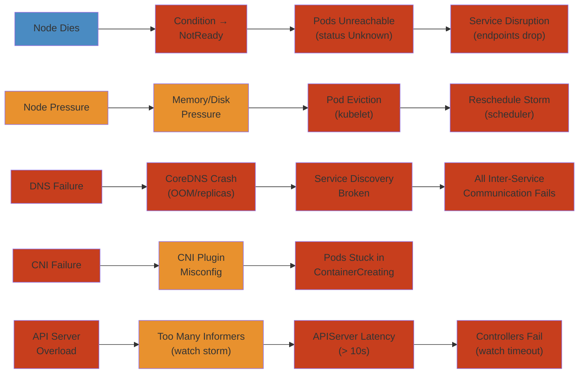

# ☸️ Kubernetes Node Failure — Production Incident Deep Dive

> **Scope:** Real-world Kubernetes cluster failure patterns covering node death, node pressure, DNS failures, CNI misconfiguration, and API server overload. Each scenario follows symptom → detection → investigation → root cause → mitigation → permanent fix → lessons learned.
>
> **Applicability:** Platform engineers, SRE teams, Kubernetes operators, and DevOps engineers managing Kubernetes 1.24+ clusters in production.

---




## Table of Contents


1. [Scenario A: Node Dies — Hardware Failure / Network Loss → Pods Unreachable → Service Disruption](#scenario-a-node-dies--hardware-failure--network-loss--pods-unreachable--service-disruption)
2. [Scenario B: Node Pressure — Memory/Disk Pressure → Pods Evicted → Reschedule Storm](#scenario-b-node-pressure--memorydisk-pressure--pods-evicted--reschedule-storm)
3. [Scenario C: DNS Failure — CoreDNS Pod Crash → Service Discovery Broken → All Communication Fails](#scenario-c-dns-failure--coredns-pod-crash--service-discovery-broken--all-communication-fails)
4. [Scenario D: CNI Failure — Network Plugin Misconfiguration → Pods Stuck in ContainerCreating → Zero Networking](#scenario-d-cni-failure--network-plugin-misconfiguration--pods-stuck-in-containercreating--zero-networking)
5. [Scenario E: API Server Overload — Too Many Informers → Latency → Controller Failures → Cascade](#scenario-e-api-server-overload--too-many-informers--latency--controller-failures--cascade)
6. [Detection and Monitoring Reference](#detection-and-monitoring-reference)
7. [Mitigation Playbook](#mitigation-playbook)
8. [Permanent Fixes and Configuration Reference](#permanent-fixes-and-configuration-reference)

---

## Scenario A: Node Dies — Hardware Failure / Network Loss → Pods Unreachable → Service Disruption


### Symptom


```
14:22:00  Node ip-10-0-1-50.ec2.internal condition changed to NotReady
14:22:05  Node ip-10-0-1-50 — all pods status Unknown
14:22:10  Service "orders-api" — 3/5 endpoints available
14:22:15  Service "orders-api" — 3/5 endpoints (2 Unknown)
14:22:30  Requests to orders-api: 30% failure rate (timeout to dead node)
14:23:00  PagerDuty alert: "Orders API error rate > 5%" triggered
14:23:30  Node still NotReady — automatic pod reschedule begins (takes 5 min)
14:28:00  Pods rescheduled to remaining nodes. Service restored.
```

### Detection


```
Alert: kubectl get nodes → NotReady
Alert: kube_node_status_condition{condition="Ready",status="true"} < count(kube_node_info)
Alert: kube_pod_status_phase{phase="Unknown"} > 0
Alert: Service endpoint count dropped
Alert: Application error rate 5xx spike

$ kubectl get nodes
NAME               STATUS     ROLES    AGE   VERSION
ip-10-0-1-50       NotReady   <none>   42d   v1.27.3
ip-10-0-1-51       Ready      <none>   42d   v1.27.3
ip-10-0-1-52       Ready      <none>   42d   v1.27.3

$ kubectl describe node ip-10-0-1-50
Conditions:
  Type                 Status  LastHeartbeatTime
  ----                 ------  -----------------
  Ready                Unknown  2026-05-27 14:22:00
  NetworkUnavailable   False    2026-05-27 12:00:00
  ...

$ kubectl get pods --field-selector spec.nodeName=ip-10-0-1-50
NAME                       READY   STATUS     RESTARTS   AGE
orders-api-7d4f8b6c-2xq1k  0/1     Unknown    0          12h
orders-api-7d4f8b6c-8hjkl  0/1     Unknown    0          12h
redis-cache-f9c2d-4mnbv    0/1     Unknown    0          12h
```

### Investigation


```
$ ssh ip-10-0-1-50   # fails — unreachable

# Check cloud provider console
AWS EC2 → Instance ip-10-0-1-50: status check failed
  - System reachability check: FAILED (lost network connectivity)
  - Instance reachability check: FAILED
  - Last status: running (but unreachable)

# Check kubelet logs on surviving control-plane
$ kubectl logs -n kube-system kube-controller-manager-...

I0527 14:22:00 node_lifecycle_controller.go:1180] Node ip-10-0-1-50
  was previously Ready. Marking as NotReady. No pods will be synced.

I0527 14:22:30 node_lifecycle_controller.go:1240] Node ip-10-0-1-50
  is NotReady. Evicting pods: [orders-api-7d4f8b6c-2xq1k, ...]

# Check pod eviction timeline
$ kubectl get events --field-selector involvedObject.name=orders-api-7d4f8b6c-2xq1k
14:22:05  Warning  NodeNotReady       node/ip-10-0-1-50  Node is not ready
14:23:00  Normal   Killing            pod/orders-api...   Stopping container
14:23:05  Normal   Scheduled          pod/orders-api...   Successfully assigned to ip-10-0-1-51
14:23:30  Normal   Pulled             pod/orders-api...   Container image pulled
14:23:35  Normal   Created            pod/orders-api...   Created container
14:23:40  Normal   Started            pod/orders-api...   Started container
```

### Root Cause


```
NODE FAILURE TIMELINE
══════════════════════

  ┌──────────────────────────────────────────────────────────────┐
  │  t=14:20:00   EC2 hardware degradation (EBS volume stalled) │
  │              ↓                                               │
  │  t=14:21:00   CloudWatch alarm: StatusCheckFailed            │
  │              ↓                                               │
  │  t=14:21:30   kubelet can't write to /var/lib/kubelet        │
  │              (backed by EBS, I/O timeout)                    │
  │              → kubelet stops heartbeating to API server      │
  │              ↓                                               │
  │  t=14:22:00   node-lifecycle-controller:                     │
  │              node-monitor-period=5s,                         │
  │              node-monitor-grace-period=40s                   │
  │              → Node marked NotReady                          │
  │              ↓                                               │
  │  t=14:22:30   pod-eviction-timeout=5m (default)             │
  │              → Pods eviction begins                          │
  │              → But NO PodDisruptionBudget for orders-api     │
  │              → All pods evicted simultaneously               │
  │              ↓                                               │
  │  t=14:23:05   Pods rescheduled to remaining nodes            │
  │              → Remaining nodes might not have capacity       │
  │              → Pending pods if insufficient resources        │
  └──────────────────────────────────────────────────────────────┘

  ROOT CAUSE:
  • Cloud instance hardware failure (EBS volume stall)
  • Node unreachable → 30s grace → 5m eviction → traffic loss during window
  • No PodDisruptionBudget → all pods evicted at once
  • No anti-affinity → pods were co-located on same node
  • No cluster autoscaler → remaining nodes capacity insufficient
```

### Mitigation


```

── STEP 1: FORCEFULLY TERMINATE THE DEAD NODE

$ kubectl drain ip-10-0-1-50 --ignore-daemonsets --delete-emptydir-data --force
# (If node is unreachable, this may hang — use --force and --grace-period=0)

$ kubectl delete node ip-10-0-1-50

── STEP 2: VERIFY PODS RESCHEDULE

$ kubectl get pods -o wide | grep ip-10-0-1-5[1-2]
# Verify pods are Running on surviving nodes

── STEP 3: CHECK CAPACITY ON REMAINING NODES

$ kubectl describe node ip-10-0-1-51
# Check Allocated resources section:
#   CPU Requests / CPU Limits
#   Memory Requests / Memory Limits
# If overcommitted, scale up nodes

── STEP 4: ADD NODE AUTO-REPAIR / CLUSTER AUTOSCALER

$ kubectl scale deployment/cluster-autoscaler --replicas=1 -n kube-system
```

### Permanent Fix


```yaml
# PodDisruptionBudget for critical services
apiVersion: policy/v1
kind: PodDisruptionBudget
metadata:
  name: orders-api-pdb
spec:
  minAvailable: 2
  selector:
    matchLabels:
      app: orders-api

# Pod anti-affinity — spread across nodes
apiVersion: apps/v1
kind: Deployment
metadata:
  name: orders-api
spec:
  replicas: 5
  template:
    spec:
      affinity:
        podAntiAffinity:
          preferredDuringSchedulingIgnoredDuringExecution:
          - weight: 100
            podAffinityTerm:
              labelSelector:
                matchExpressions:
                - key: app
                  operator: In
                  values:
                  - orders-api
              topologyKey: kubernetes.io/hostname

# Priority class
apiVersion: scheduling.k8s.io/v1
kind: PriorityClass
metadata:
  name: high-priority
value: 1000000
globalDefault: false
description: "High priority for critical workloads"

# Topology spread constraints
spec:
  topologySpreadConstraints:
  - maxSkew: 1
    topologyKey: topology.kubernetes.io/zone
    whenUnsatisfiable: DoNotSchedule
    labelSelector:
      matchLabels:
        app: orders-api
```

---

## Scenario B: Node Pressure — Memory/Disk Pressure → Pods Evicted → Reschedule Storm


### Symptom


```
15:00:00  Node ip-10-0-1-53: MemoryPressure=True
15:00:05  Node ip-10-0-1-53: DiskPressure=True
15:00:10  kubelet starts evicting pods: BestEffort first, then Burstable
15:00:15  Pods evicted: 12 pods from node 53
15:00:20  Reschedule storm: 12 pods competing for resources on 3 remaining nodes
15:00:25  Node ip-10-0-1-51: MemoryPressure=True (overloaded by rescheduled pods)
15:00:30  Node ip-10-0-1-51 also starts evicting pods
15:00:35  Cascade: pods bouncing between nodes
15:01:00  Multiple services degraded — pods in CrashLoopBackOff / Pending
```

### Detection


```
$ kubectl describe node ip-10-0-1-53
Conditions:
  Type                 Status   LastHeartbeatTime
  ----                 ------   -----------------
  MemoryPressure       True     2026-05-27 15:00:00
  DiskPressure         True     2026-05-27 15:00:05
  PIDPressure          False    2026-05-27 15:00:00
  Ready                True     2026-05-27 15:00:00

Allocated resources:
  Resource           Requests     Limits
  --------           --------     ------
  cpu                3850m (96%)  7800m (195%)
  memory             12Gi (80%)   22Gi (146%)
  ephemeral-storage  90Gi (90%)   90Gi (90%)

$ kubectl get events --field-selector reason=Evicted
15:00:10  Normal   Evicted   pod/worker-batch-*   BestEffort pod evicted
15:00:11  Normal   Evicted   pod/log-shipper-*    BestEffort pod evicted
15:00:15  Normal   Evicted   pod/analytics-*      Burstable pod evicted
15:00:20  Normal   Evicted   pod/cache-worker-*   Burstable pod evicted
```

### Root Cause


```
POD EVICTION SEQUENCE
══════════════════════

  ┌──────────────────────────────────────────────────────────┐
  │  Memory leak in sidecar container on node-53             │
  │  → container_memory_working_set_bytes grows unbounded    │
  │    (sidecar reads logs, never releases memory)           │
  │  ↓                                                       │
  │  Node memory usage: 80% → 95% → 98%                     │
  │  ↓                                                       │
  │  kubelet: --eviction-hard=memory.available<100Mi        │
  │  → Kubelet sets MemoryPressure=True                      │
  │  ↓                                                       │
  │  kubelet eviction order:                                 │
  │  1. BestEffort pods (no resource limits)                 │
  │  2. Burstable pods (uses more than requests)             │
  │  3. Guaranteed pods (last resort)                        │
  │  ↓                                                       │
  │  Pods evicted → rescheduled to other nodes               │
  │  → Other nodes also above 80% → cascade                  │
  └──────────────────────────────────────────────────────────┘

  CONTRIBUTORS:
  • Eviction threshold too tight (100Mi free)
  • No resource limits on pods (BestEffort)
  • No resource quotas to limit namespace consumption
  • Pod priority not set — cannot prioritize critical pods
  • Logging sidecar has memory leak
  • ephemeral-storage not tracked — disk fills from logs
```

### Mitigation


```

── STEP 1: IDENTIFY MEMORY LEAK

$ kubectl top pod -n production --sort-by=memory | head -10
NAME                            CPU(cores)   MEMORY(bytes)
log-shipper-worker-53           25m          4820Mi        ← 4.8 GB!
worker-batch-53                 120m         950Mi
...

── STEP 2: CORDON OFFENDING NODE

$ kubectl cordon ip-10-0-1-53

── STEP 3: DRAIN NODE TO EVACUATE PODS GRACEFULLY

$ kubectl drain ip-10-0-1-53 --ignore-daemonsets --delete-emptydir-data

── STEP 4: RESTART SIDECAR WITH MEMORY LIMITS

$ kubectl set resources deployment/log-shipper \
  --limits=memory=512Mi \
  --requests=memory=256Mi

── STEP 5: UN-CORDON NODE AFTER FIX

$ kubectl uncordon ip-10-0-1-53
```

### Permanent Fix


```yaml
# Resource limits for ALL pods
apiVersion: v1
kind: LimitRange
metadata:
  name: production-limits
  namespace: production
spec:
  limits:
  - max:
      memory: 4Gi
      cpu: 4
    min:
      memory: 64Mi
      cpu: 100m
    default:
      memory: 512Mi
      cpu: 500m
    defaultRequest:
      memory: 256Mi
      cpu: 250m
    type: Container

# Resource quotas per namespace
apiVersion: v1
kind: ResourceQuota
metadata:
  name: production-quota
  namespace: production
spec:
  hard:
    requests.cpu: 20
    requests.memory: 40Gi
    limits.cpu: 40
    limits.memory: 80Gi
    requests.ephemeral-storage: 200Gi

# Node-level eviction thresholds (kubelet config)
# kubelet-config.yaml
kind: KubeletConfiguration
apiVersion: kubelet.config.k8s.io/v1beta1
evictionHard:
  memory.available: "500Mi"
  nodefs.available: "10%"
  nodefs.inodesFree: "5%"
  imagefs.available: "15%"
evictionSoft:
  memory.available: "1Gi"
evictionSoftGracePeriod:
  memory.available: "1m30s"
evictionMaxPodGracePeriod: 60
evictionPressureTransitionPeriod: "5m"
```

---

## Scenario C: DNS Failure — CoreDNS Pod Crash → Service Discovery Broken → All Communication Fails


### Symptom


```
09:45:00  CoreDNS pod restarts (OOM killed)
09:45:05  All pods start seeing DNS resolution failures
09:45:10  Service-to-service communication breaks:
           orders-api cannot resolve payments-svc → all orders fail
           frontend cannot resolve orders-api → all page loads fail
09:45:15  Application errors: getaddrinfo ENOTFOUND payments-svc
09:45:20  Full application outage: every service depends on service discovery
09:45:30  CoreDNS pod restarted, but only 1 replica — single point of failure
09:45:35  All DNS resolution eventually cached — partial recovery
```

### Detection


```
Alert: CoreDNS pod CrashLoopBackOff / OOMKilled
Alert: kube_pod_status_phase{namespace="kube-system",pod="coredns*"} != Running
Alert: pod DNS error rate > 5%
Alert: coredns_dns_responses_total{rcode="SERVFAIL"} > 0
Alert: coredns_dns_requests_total — rate drops to 0 (nobody can reach it)

$ kubectl get pods -n kube-system -l k8s-app=kube-dns
NAME                       READY   STATUS      RESTARTS   AGE
coredns-7d8f9c8b7-abcde   0/1     OOMKilled   12         45m
coredns-7d8f9c8b7-fghij   0/1     OOMKilled   8          45m

$ kubectl logs -n kube-system coredns-7d8f9c8b7-abcde --previous
[FATAL] plugin/kubernetes: failed to list *core.Endpoints:
  stream error: stream ID 5; INTERNAL_ERROR

$ kubectl describe pod -n kube-system coredns-7d8f9c8b7-abcde
  State:       Waiting (CrashLoopBackOff)
  Last State:  Terminated
    Reason:    OOMKilled
    Exit Code: 137
```

### Root Cause


```
DNS RESOLUTION FAILURE FLOW
════════════════════════════

  CoreDNS OOM — how it happens:

  1. Cluster has 500+ services and 5000+ endpoints
  2. CoreDNS watches ALL endpoints in the cluster
  3. A large ConfigMap or Secret update triggers 1000+ endpoint updates
  4. CoreDNS buffer fills with endpoint watch events
  5. Memory usage spikes from 50MB → 500MB → hits limit → OOMKilled
  6. CoreDNS is gone → no DNS resolution for any pod
  7. All service discovery via DNS name fails

  Impact propagation:

  ┌──────────────────────────────────────────────────────────┐
  │  CoreDNS CRASH                                            │
  │      ↓                                                    │
  │  All pods: /etc/resolv.conf → CoreDNS (cluster IP)        │
  │      ↓                                                    │
  │  nslookup payments-svc → connection refused / timeout     │
  │      ↓                                                    │
  │  Application code tries to connect to "payments-svc:8080" │
  │  → getaddrinfo fails → ENOTFOUND                          │
  │  → Connection fails → error returned to caller            │
  │  → Caller also fails → VICIOUS CASCADE                    │
  │      ↓                                                    │
  │  ALL inter-service communication breaks                   │
  └──────────────────────────────────────────────────────────┘
```

### Mitigation


```

── STEP 1: INCREASE COREDNS MEMORY LIMITS

$ kubectl edit deployment -n kube-system coredns

# CHANGE:
    resources:
      limits:
        memory: 170Mi       # ← Default, too low
      requests:
        memory: 70Mi
# TO:
    resources:
      limits:
        memory: 512Mi       # ← Enough for 500+ services
      requests:
        memory: 128Mi

── STEP 2: SCALE UP COREDNS REPLICAS

$ kubectl scale deployment -n kube-system coredns --replicas=3

── STEP 3: ENABLE COREDNS AUTOSCALING (CLUSTER PROPORTIONAL)

$ kubectl apply -f https://raw.githubusercontent.com/kubernetes-sigs/cluster-proportional-autoscaler/master/...

── STEP 4: VERIFY DNS IS WORKING

$ kubectl run -it --rm debug --image=busybox:1.28 -- nslookup kubernetes.default
Server:    10.96.0.10
Address 1: 10.96.0.10 kube-dns.kube-system.svc.cluster.local
Name:      kubernetes.default
Address 1: 10.96.0.1 kubernetes.default.svc.cluster.local
```

### Permanent Fix


```yaml
# CoreDNS deployment configuration
apiVersion: apps/v1
kind: Deployment
metadata:
  name: coredns
  namespace: kube-system
spec:
  replicas: 3
  strategy:
    rollingUpdate:
      maxUnavailable: 1      # Never drop all DNS at once
  template:
    spec:
      priorityClassName: system-cluster-critical
      containers:
      - name: coredns
        image: registry.k8s.io/coredns/coredns:v1.11.1
        resources:
          limits:
            memory: 512Mi
          requests:
            cpu: 100m
            memory: 128Mi
        args: [ "-conf", "/etc/coredns/Corefile" ]

# CoreDNS autoscaler
apiVersion: autoscaling/v2
kind: HorizontalPodAutoscaler
metadata:
  name: coredns
  namespace: kube-system
spec:
  minReplicas: 3
  maxReplicas: 10
  metrics:
  - type: Resource
    resource:
      name: memory
      target:
        type: Utilization
        averageUtilization: 70

# NodeLocal DNSCache for better DNS resilience
# (Reduces DNS queries hitting CoreDNS)
apiVersion: apps/v1
kind: DaemonSet
metadata:
  name: node-local-dns
  namespace: kube-system
spec:
  template:
    spec:
      priorityClassName: system-node-critical
      containers:
      - name: node-cache
        image: registry.k8s.io/dns/k8s-dns-node-cache:1.22.20
        resources:
          requests:
            memory: 30Mi
        args:
        - -localip
        - 169.254.20.10,10.96.0.10
        - -conf
        - /etc/Corefile

# Also: reduce cluster domain search list in pod spec
# pod.spec.dnsConfig:
#   options:
#   - name: ndots
#     value: "1"   # default is 5 — causes many extra DNS lookups
```

---

## Scenario D: CNI Failure — Network Plugin Misconfiguration → Pods Stuck in ContainerCreating → Zero Networking


### Symptom


```
11:00:00  New node ip-10-0-1-54 joins cluster
11:00:30  Pods scheduled on new node stuck in ContainerCreating
11:01:00  All new pods on node 54: ContainerCreating (network plugin not ready)
11:01:30  Existing pods on node 54: also losing connectivity
11:02:00  Service endpoints for pods on node 54 marked unhealthy
11:02:30  Application errors: upstream connect error (503)
11:03:00  Partial outage — all pods on node 54 inaccessible
```

### Detection


```
$ kubectl get pods -o wide | grep ContainerCreating
orders-api-7d4f8b6c-3mnbv   0/1   ContainerCreating   0   5m
payments-api-6f8c9d-9klnm   0/1   ContainerCreating   0   5m

$ kubectl describe pod orders-api-7d4f8b6c-3mnbv
Events:
  Type    Reason                  Age    Message
  ----    ------                  ----   -------
  Normal  Scheduled               5m     Successfully assigned to ip-10-0-1-54
  Normal  SuccessfulMountVolume   5m     MountVolume.SetUp succeeded
  Normal  Pulled                  4m55s  Container image pulled
  Warning FailedCreatePodSandBox  4m55s  Failed to create pod sandbox:
    rpc error: code = Unknown desc = failed to setup network for pod:
    network plugin error: no IP addresses available in range:
    10.244.0.0/24: IP space exhausted

$ kubectl get nodes -o json | jq '.items[].status.addresses'
# Check CNI DaemonSet — is it running on this node?
$ kubectl get pods -n kube-system -o wide | grep -E "calico|flannel|weave|cilium|aws-node|azure-npm"
aws-node-abcde    1/1   Running   0   42d   ip-10-0-1-50
aws-node-fghij    1/1   Running   0   42d   ip-10-0-1-51
aws-node-klmno    1/1   Running   0   42d   ip-10-0-1-52
aws-node-pqrst    0/1   Pending   0   5m    ip-10-0-1-54   ← NOT RUNNING
```

### Root Cause


```

── CNI FAILURE CHAIN

  New node added to cluster:
      │
      ▼
  CNI DaemonSet should schedule pod on new node
      │
      ├── IF DaemonSet is tainted/toleration mismatch
      │   → CNI pod stays Pending
      │   → No network configured on node
      │   → All pods stuck in ContainerCreating
      │
      ├── IF CNI binary missing from /opt/cni/bin/
      │   → container runtime can't find CNI plugin
      │   → sandbox creation fails
      │
      ├── IF IPAM pool exhausted
      │   → No IP addresses available for new pods
      │   → CNI returns error
      │
      └── IF CNI config file (/etc/cni/net.d/) is corrupt
          → CNI plugin loads but fails
          → Pod sandbox creation fails

── IPAM EXHAUSTION

  Cluster CIDR: 10.244.0.0/16
    → 65536 IPs total
  Per-node: /24 subnet → 256 IPs per node
    → 50 nodes → 12800 IPs
    → 200 pods per node → 10000 pods total
    → BUT: some IPs are stuck in "allocated but not used"
    → IPAM garbage collection not running
    → Subnet /24 fills up → no IPs for new pods on that node
```

### Mitigation


```

── STEP 1: CHECK CNI DAEMONSET STATUS

$ kubectl describe daemonset -n kube-system aws-node
# Check tolerations, nodeSelector, resource limits

── STEP 2: ADD MISSING TOLERATION (if node has taints)

$ kubectl edit daemonset -n kube-system aws-node
# Add:
  tolerations:
  - operator: Exists
    effect: NoSchedule

── STEP 3: CLEAR STUCK IPAM ALLOCATIONS

# For Calico:
$ calicoctl ipam release --ip=10.244.1.50

# For AWS VPC CNI:
$ kubectl delete pod -n kube-system aws-node-pqrst  # Force reschedule

── STEP 4: INCREASE IPAM POOL SIZE

# For Calico — edit IPPool
$ calicoctl get ippool -o yaml > ippool.yaml
# Edit: cidr: 10.244.0.0/16 → 10.244.0.0/15 (doubles IP space)

# For AWS VPC CNI — enable prefix delegation
$ kubectl set env daemonset -n kube-system aws-node AWS_VPC_CNI_NODE_PORT_SUPPORT=true
$ kubectl set env daemonset -n kube-system aws-node WARM_ENI_TARGET=2
$ kubectl set env daemonset -n kube-system aws-node WARM_IP_TARGET=8

── STEP 5: RESTART ALL PODS ON AFFECTED NODE

$ kubectl drain ip-10-0-1-54 --ignore-daemonsets --force
$ kubectl delete node ip-10-0-1-54
# Node re-joins with clean CNI state
```

### Permanent Fix


```yaml
# CNI DaemonSet with proper tolerations and resources
apiVersion: apps/v1
kind: DaemonSet
metadata:
  name: aws-node
  namespace: kube-system
spec:
  template:
    spec:
      tolerations:
      - operator: Exists
        effect: NoSchedule
      - operator: Exists
        effect: NoExecute
      priorityClassName: system-node-critical
      containers:
      - name: aws-node
        env:
        - name: AWS_VPC_CNI_NODE_PORT_SUPPORT
          value: "true"
        - name: WARM_ENI_TARGET
          value: "2"
        - name: WARM_IP_TARGET
          value: "8"
        - name: MINIMUM_IP_TARGET
          value: "16"
        resources:
          requests:
            cpu: 25m
            memory: 50Mi
          limits:
            memory: 200Mi

# IPAM monitoring — alert on IP utilization
# For Calico: calico_ipam_usage
# For AWS: monitor VPC subnet IP usage via CloudWatch
# For Cilium: cilium_ip_addresses{type="used"} / cilium_ip_addresses{type="available"}
```

---

## Scenario E: API Server Overload — Too Many Informers → Latency → Controller Failures → Cascade


### Symptom


```
16:00:00  API server response time p99: 200ms (normal: 20ms)
16:00:30  API server response time p99: 2,500ms
16:01:00  Controller manager: LIST requests timing out
16:01:15  Scheduler: can't list pods → no scheduling decisions
16:01:30  Kubelet: can't list pods assigned to node → pod status outdated
16:01:45  All controllers degraded — cluster management stalled
16:02:00  API server CPU: 95% (32 cores)
16:02:15  etcd: leader election triggered (heartbeat missed)
```

### Detection


```
Alert: API server request latency p99 > 1000ms
Alert: API server 429 Too Many Requests / 503 Service Unavailable
Alert: etcd leader changes > 1 in 5 minutes
Alert: kube-apiserver process CPU > 80%
Alert: Controller manager: LIST failures > 0

# Check API server metrics
$ kubectl get --raw /metrics | grep apiserver_request_duration_seconds
apiserver_request_duration_seconds_bucket{verb="LIST",resource="pods",...}
  p99 > 5s

# Check inflight requests
$ kubectl get --raw /metrics | grep apiserver_current_inflight_requests
apiserver_current_inflight_requests{request_kind="mutating"}  412  ← near limit
apiserver_current_inflight_requests{request_kind="readOnly"}  1520 ← near limit

# Check etcd
$ kubectl exec -n kube-system etcd-0 -- etcdctl endpoint status --write-out=table
+----------------+----------------+---------+---------+-----------+-----------+--------+
|    ENDPOINT     |     ID         | VERSION | DB SIZE | IS LEADER | RAFT TERM | RAFT  |
+----------------+----------------+---------+---------+-----------+-----------+--------+
| 10.0.1.10:2379 | 8e9e05c521646 |  3.5.9  |  87 MB  |    true   |    42     |   true |
| 10.0.1.11:2379 | 8e9e05c521647 |  3.5.9  |  87 MB  |   false   |    42     |   true |
+----------------+----------------+---------+---------+-----------+-----------+--------+
# etcd db size > 100MB is warning → compaction needed
```

### Root Cause


```
API SERVER OVERLOAD ANATOMY
════════════════════════════

  ┌──────────────────────────────────────────────────────────────┐
  │  Multiple controllers deploy new informers with full watch:  │
  │  • 50 controllers each doing LIST and WATCH on *pods        │
  │  • 30 controllers each doing LIST and WATCH on *services    │
  │  • 20 controllers each doing LIST and WATCH on *endpoints   │
  │  • Each informer creates:                                    │
  │    - 1 LIST request (can be heavy: 50K pods → 50MB JSON)   │
  │    - 1 persistent WATCH connection                           │
  │    - ResourceVersion tracking                               │
  │  ↓                                                           │
  │  API server:                                                 │
  │  • 100 active WATCH connections                             │
  │  • Each WATCH streams all object changes                    │
  │  • Each object change is serialized to JSON for every watch │
  │  • 100 x 50 changes/s = 5000 serializations/s              │
  │  • CPU: 95% (mostly JSON encoding + object conversion)      │
  │  ↓                                                           │
  │  etcd:                                                       │
  │  • 100 concurrent watch streams from API server             │
  │  • Each WATCH requires etcd to maintain event history        │
  │  • compaction: auto (default 5m) but can't keep up          │
  │  • Event history grows → slower reads                       │
  │  ↓                                                           │
  │  Result:                                                     │
  │  • API server latency: 2.5s p99                             │
  │  • Client-side throttling: client-go rate limiter triggers   │
  │  • Scheduler can't list pods → no scheduling               │
  │  • Kubelet can't sync → pod state outdated                  │
  │  • Controllers re-list → more load → VICIOUS CYCLE          │
  └──────────────────────────────────────────────────────────────┘
```

### Mitigation


```

── STEP 1: REDUCE API SERVER INFLIGHT LIMITS (if not yet at limit)

# Edit kube-apiserver manifest:
--max-requests-inflight=400        # Default: 400
--max-mutating-requests-inflight=200  # Default: 200

# Or INCREASE if cluster is legitimately large:
--max-requests-inflight=2000
--max-mutating-requests-inflight=1000

── STEP 2: IDENTIFY HEAVY INFORMERS

# Check which resources have the most watches
$ kubectl get --raw /metrics | grep apiserver_watch_count | sort -t: -k2 -rn | head -10
apiserver_watch_count{resource="pods",group=""} 42
apiserver_watch_count{resource="endpoints",group=""} 35
apiserver_watch_count{resource="secrets",group=""} 28

── STEP 3: IMPROVE CLIENT-SIDE INFORMER FILTERING

# In Go controllers — use label selectors instead of full watch:
informerFactory := informers.NewSharedInformerFactoryWithOptions(
    client,
    time.Minute,
    informers.WithTweakListOptions(func(opts *metav1.ListOptions) {
        opts.LabelSelector = "app.kubernetes.io/managed-by=my-controller"
    }),
)

# Enable bookmark events (reduces LIST volume):
opts.SendInitialEventsList = nil  # Wait for first bookmark
opts.AllowWatchBookmarks = true

── STEP 4: SCALE API SERVER HORIZONTALLY

$ kubectl scale deployment -n kube-system kube-apiserver --replicas=3
```

### Permanent Fix


```yaml
# API Server tuning for large clusters
# kube-apiserver.yaml
spec:
  containers:
  - command:
    - kube-apiserver
    - --max-requests-inflight=2000
    - --max-mutating-requests-inflight=1000
    - --request-timeout=60s
    - --watch-cache=true
    - --watch-cache-sizes=endpoints=5000,pods=10000
    - --event-ttl=1h                  # Prune old events
    - --enable-aggregator-routing=true
    resources:
      requests:
        cpu: 4
        memory: 16Gi
      limits:
        memory: 32Gi

# Client-go configuration in controllers
# Use shared informer factories — deduplicates watches
# Use Selective Watches — only watch what you need
# Use bookmark events — reduces LIST on reconnect

# etcd compaction
# etcd.yaml:
--auto-compaction-mode=periodic
--auto-compaction-retention=30m
--quota-backend-bytes=8589934592  # 8 GB max db size

# Event aggregation — reduce duplicate events
# kube-controller-manager:
--feature-gates=EventedPLEG=true
```

---

## Detection and Monitoring Reference


### Key Kubernetes Metrics


| Metric | Source | Warning | Critical |
|--------|--------|---------|----------|
| `kube_node_status_condition{condition="Ready"}` | kube-state-metrics | count < expected | count < 80% |
| `kube_pod_status_phase{phase="Pending"}` | kube-state-metrics | > 5 | > 20 |
| `kube_pod_status_phase{phase="Unknown"}` | kube-state-metrics | > 0 | > 5 |
| `apiserver_request_duration_seconds{p99}` | API server metrics | > 1s | > 5s |
| `apiserver_current_inflight_requests` | API server metrics | > 80% of limit | > 95% |
| `container_memory_working_set_bytes` | cAdvisor | > 90% request | > limit |
| `coredns_dns_responses_total{rcode="SERVFAIL"}` | CoreDNS | > 0 | > 10/min |
| `etcd_server_leader_changes_seen_total` | etcd metrics | > 1 | > 3 |

### Useful Diagnostic Commands


```bash
# Node health
kubectl get nodes -o wide
kubectl describe node <name>

# Pod troubleshooting
kubectl get pods --all-namespaces --field-selector status.phase!=Running
kubectl describe pod <name>
kubectl logs <name> --previous
kubectl exec -it <name> -- /bin/sh

# Events
kubectl get events --sort-by=.lastTimestamp

# Resource usage
kubectl top nodes
kubectl top pods

# DNS debugging
kubectl run -it dnsutils --image=registry.k8s.io/e2e-test-images/jessie-dnsutils:1.3 -- bash
nslookup kubernetes.default

# API server health
kubectl get --raw /healthz
kubectl get --raw /livez
kubectl get --raw /readyz

# etcd health
kubectl exec -n kube-system etcd-0 -- etcdctl endpoint health
```

---

## Mitigation Playbook


### Node Failure


```
1. IDENTIFY: kubectl get nodes → find NotReady
2. CORDON: kubectl cordon <node>
3. DRAIN: kubectl drain <node> --ignore-daemonsets --force
4. DELETE: kubectl delete node <node>
5. VERIFY: kubectl get pods -o wide (pods rescheduled)
6. FIX: Cloud provider console → replace instance
```

### Node Pressure


```
1. CORDON: kubectl cordon <node>
2. EVICT: kubectl drain <node> --ignore-daemonsets
3. ANALYZE: kubectl top pod → find memory/disk hogs
4. FIX: Add resource limits to offending pods
5. UNCORDON: kubectl uncordon <node>
6. PREVENT: Set LimitRange and ResourceQuota
```

### DNS Failure


```
1. CHECK: kubectl get pods -n kube-system -l k8s-app=kube-dns
2. FIX: kubectl scale deployment/coredns -n kube-system --replicas=3
3. TUNE: Increase memory limits
4. VERIFY: kubectl run debug --image=busybox -- nslookup kubernetes.default
5. PREVENT: Add HPA for CoreDNS, enable NodeLocal DNSCache
```

### CNI Failure


```
1. CHECK: kubectl get pods -n kube-system | grep <cni-plugin>
2. FIX: Add tolerations, increase IP pool
3. CLEAR: Release stuck IP allocations
4. RESTART: kubectl delete pod <cni-pod> to force reschedule
5. VERIFY: kubectl describe pod <problem-pod> → should leave ContainerCreating
```

### API Server Overload


```
1. CHECK: kube-apiserver metrics for latency and inflight
2. SCALE: Increase API server replicas
3. TUNE: Adjust max-requests-inflight
4. OPTIMIZE: Add label selectors to informers
5. VACUUM: etcd compaction (defrag if needed)
```

---

## Permanent Fixes and Configuration Reference


### Kubelet Configuration


```yaml
# kubelet-config.yaml
kind: KubeletConfiguration
apiVersion: kubelet.config.k8s.io/v1beta1
evictionHard:
  memory.available: "500Mi"
  nodefs.available: "10%"
  nodefs.inodesFree: "5%"
  imagefs.available: "15%"
evictionSoft:
  memory.available: "1Gi"
evictionSoftGracePeriod:
  memory.available: "1m30s"
evictionMaxPodGracePeriod: 60
kubeReserved:
  cpu: "500m"
  memory: "1Gi"
  ephemeral-storage: "10Gi"
systemReserved:
  cpu: "500m"
  memory: "1Gi"
  ephemeral-storage: "10Gi"
enforceNodeAllocatable:
- pods
- kube-reserved
- system-reserved
```

### Priority Classes


```yaml
apiVersion: scheduling.k8s.io/v1
kind: PriorityClass
metadata:
  name: system-cluster-critical
value: 2000000000
globalDefault: false
description: "Priority for critical system pods like CoreDNS, CNI."
---
apiVersion: scheduling.k8s.io/v1
kind: PriorityClass
metadata:
  name: system-node-critical
value: 2000001000
globalDefault: false
description: "Priority for critical node pods."
---
apiVersion: scheduling.k8s.io/v1
kind: PriorityClass
metadata:
  name: production-high
value: 1000000
description: "Priority for production workloads."
```

---

## Lessons Learned


1. **Always set PodDisruptionBudget for critical services.** Without it, eviction removes all replicas at once.
2. **Resource limits are mandatory.** A single pod with no limits can OOM a node and trigger cascading evictions.
3. **CoreDNS is a single point of failure for service discovery.** Always run multiple replicas, set memory limits, and enable autoscaling.
4. **CNI DaemonSet tolerations must match node taints.** New nodes with custom taints won't get networking.
5. **API server overload is usually a controller problem, not an API server problem.** Too many informers with full watches are the root cause.
6. **etcd auto-compaction must be configured.** Without it, etcd db grows unbounded and slows down the entire cluster.
7. **Test eviction behavior under load.** Simulate node failures and verify PDB, anti-affinity, and reschedule timing.
8. **Monitor CoreDNS, CNI, and API server as critical path components.** If any of these fails, the cluster stops working.
9. **Use priority classes to differentiate critical from best-effort workloads.** During eviction, critical pods stay running.
10. **Reserve kubelet/system resources via kubeReserved and systemReserved.** Prevents kubelet from being starved by pods.

---

## Related


- [Databases](../../08-databases/) — Outages, corruption, performance
- [Distributed Systems](../../09-distributed-systems/) — Consensus, cascade failures
- [Kubernetes](../../07-kubernetes/) — Cluster failures
- [Networking](../../11-networking/) — DNS, TCP issues
- [SRE](../../14-sre-observability/) — Incident response
